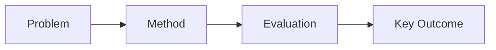
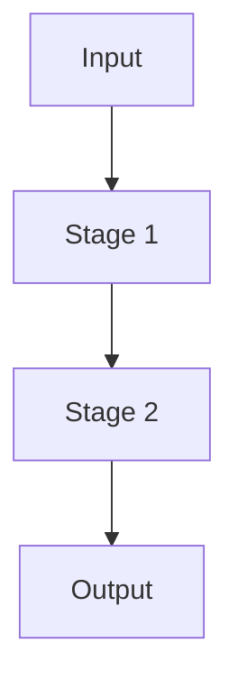
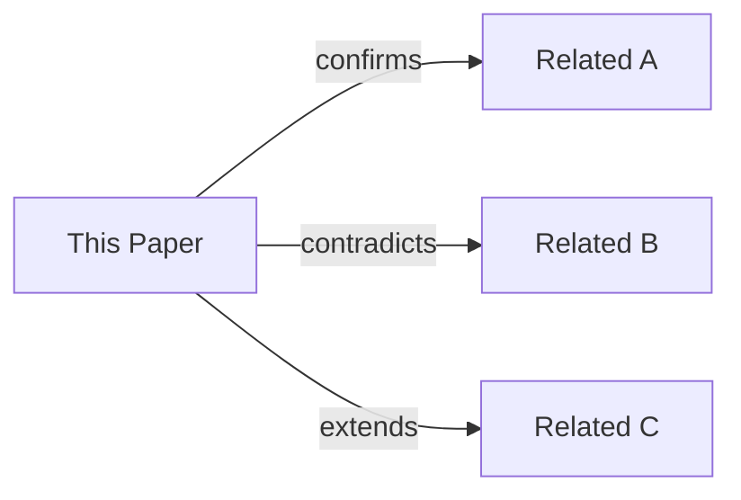

# {{TITLE}}

## 1. Executive Summary + Visual Abstract

- 分析立场：保持怀疑精神，以证据为中心（而不是复述论文宣传语）
- 决策背景（这份报告要支持什么决策）：
- 最终判断（2-4 行，通俗表达）：
- 给忙碌读者的一句话：
  - 这篇论文要解决的问题是：
  - 这个问题现在为什么重要：
  - 它是否真的带来了实质改进：



图注（这张图在概括什么）：
解读（读者应该从图中得出的结论）：

## 2. Problem Definition (Essence + Formalization)

### 2.1 Essence

- 用一句话说明核心问题（尽量不用术语）：
- 为什么这个问题值得解决（业务/科学/工程影响）：
- 为什么过去的方法没有很好解决（写根因，不写表面现象）：
- 真正瓶颈是什么（算力/内存/数据/优化/部署）：
- 这个问题在实践中难在哪里：
- 适用边界（在哪些场景不适用）：
- 如果不解决，现实代价是什么：

### 2.2 Formal Definition (if available)

- 任务类型（优化/决策/检索/生成/预测）：
- 输入 $x$：
- 输出 $y$：
- 目标函数（到底在优化什么）：
- 约束条件（时延/内存/算力/数据限制）：
- 前提假设（方法成立需要满足什么）：
- 成功标准（达到什么才算“解决问题”）：

形式化表达：

$$
	ext{(paste or restate the paper's objective/constraints here)}
$$

符号说明表：

| Symbol | Meaning | Unit / Type | Notes |
|---|---|---|---|
|  |  |  |  |

如果原文没有给出严格形式化，请明确说明，并用“准形式化”的方式写清输入/输出与成功标准。

## 3. Method + Experimental Credibility

### 3.1 Method mechanism (no marketing language)

- 作者提出该方法的关键灵感来源（基于什么观察或洞见）：
- 用 3-6 个具体步骤解释机制（输入 -> 处理 -> 输出）：
- 真正创新点 vs 旧模块重组（哪里是“新”的）：
- 主要贡献组件（真正带来提升的是哪部分）：
- 辅助组件（有帮助但非核心）：
- 为什么旧方法做不到，而这个方法可能做到：
- 这个方法做了什么取舍（例如准确率 vs 时延）：



图注（每个阶段在做什么）：
解读（哪一阶段最关键，为什么）：

**关键伪代码**（仅算法类论文必填；非算法类论文在此处标注 `N/A` 并略过）：

```
Algorithm: <Algorithm Name>       # 对应原文 Figure/Algorithm 编号
Input:  <inputs and their types>
Output: <output and its type>

1:  <step>
2:  for <condition> do
3:      <step>                    # ← 标注最关键操作及原因
4:  end for
5:  return <output>
```

- 最关键的操作（哪一行/块决定了方法的核心特性）：
- 时间复杂度（$O(\cdot)$，说明主导项来源）：
- 空间复杂度（$O(\cdot)$，主要占用来自哪里）：

### 3.2 Experimental credibility

- 数据集与划分质量（是否代表真实场景）：
- 基线是否强且公平（调参力度、预算、模型规模）：
- 指标是否匹配论文声称解决的问题：
- 硬件与时延比较是否公平（同等或可比设置）：
- 统计可靠性（方差、随机种子、置信度、显著性）：
- 本实验最大的有效性威胁是什么：

| Dataset/Benchmark | Split | Metric | Why it matters | Mismatch risk |
|---|---|---|---|---|
|  |  |  |  |  |

## 4. Results, Boundaries, And Anti-Packaging Check

### 4.1 Claim verification

本节回答：作者“声称了什么”，以及“真正被证明了什么”。

| Claim ID | Verdict (Supported / Partial / Unsupported) | Quant evidence | Anchor (Table/Figure/Section) |
|---|---|---|---|
| C1 |  |  |  |
| C2 |  |  |  |

| Method | Main Metric | Relative Change | Cost/Latency/Memory | Fairness Notes |
|---|---|---|---|---|
|  |  |  |  |  |


图注（展示了哪种对比）：
解读（提升了什么，又为此付出了什么代价）：

### 4.2 Boundary and failure profile

- 在什么具体条件下性能会下降：
- 对哪些因素敏感（超参数/数据分布）：
- 失败案例与边界条件（给出具体例子）：
- 隐性工程成本（部署复杂度、调参负担、基础设施需求）：
- 用户不应对该方法抱有哪些不切实际预期：

| Failure Scenario | Trigger Condition | Observed Behavior | Practical Impact | Mitigation |
|---|---|---|---|---|
|  |  |  |  |  |

### 4.3 Anti-packaging findings

- 发现的夸大表述（原句 + 纠正）：
- 基线缺失或过弱的风险：
- 选择性汇报风险（展示了什么，省略了什么）：
- 声称“创新”但实为渐进改进的部分：
- 去包装后的结论（一段话说明去掉宣传后仍然成立的事实）：

## 5. Cross-Paper Impact + Memory Update + Action

### 5.1 Cross-paper relation

本节回答：与我们已有认知相比，哪些结论被强化、被推翻或被改写。

文献引用要求（本节强制）：
- 只要提到论文，必须给出完整引用，不可只写标题缩写或作者简称。
- 表格中的 related paper path 用于本地定位；完整书目信息写在“附录：参考文献（完整格式）”并在此处用 [Ref-编号] 对应。

| Related paper path | Citation Ref | Relation type (confirm / contradict / supersede / orthogonal) | What changes in our understanding |
|---|---|---|---|
|  | [Ref-01] |  |  |



图注（本论文与既有工作的关系图）：
解读（哪些既有观点被强化或被推翻）：

### 5.2 Impacted existing reports (mandatory when needed)

| Impacted report path | Change type (minor patch / major revision) | Statement to update | Reason and new evidence |
|---|---|---|---|
|  |  |  |  |

更新说明模板（需要时可直接复制）：
- Updated by: <new paper path>
- Previous statement: <old claim>
- New statement: <revised claim>
- Evidence: <anchor>

### 5.3 Science Inspiration & Cross-Domain Analogy

> 核心问题：**这个问题在其他领域被解决过吗？记忆库里有没有相似解法链？**

#### 5.3.1 Mem0 记忆库比对

从科研记忆库中检索与本论文核心问题相关的已有发现：

| Mem0 检索词 | 命中条目摘要 | 与本文关联类型 | 可迁移洞察 |
|---|---|---|---|
|  |  | 强化 / 替代 / 互补 / 无关 |  |

借鉴链分析（若存在）：
- 本论文是否复用了已分析论文的某个子模块？（说明来源路径）
- 是否存在隐性"借鉴—改进—改进"链，但未明确引用？

#### 5.3.2 跨领域类比搜索

将核心问题结构（剥离 CS 术语后）映射到其他领域寻找已有解法：

| 本论文问题结构 | 类比领域 | 已有解法参照 | 迁移可行性（低/中/高） |
|---|---|---|---|
|  | 生物 / 物理 / 认知科学 / 经济学 / 控制论 / 其他 |  |  |

探索方向（按相关性选填）：
- **生物/神经科学**（记忆整合、突触可塑性、免疫克隆选择、进化算法）：
- **物理/信息论**（熵最小化、压缩感知、相变、退火）：
- **认知科学/心理学**（双系统决策、注意力类比、工作记忆容量约束）：
- **经济学/博弈论**（机制设计、拍卖理论、信息不对称激励）：
- **控制论/工程学**（反馈控制、卡尔曼滤波类比、自适应控制、冗余设计）：

#### 5.3.3 潜在改进路径（2-4 条，须具体可操作）

| # | 灵感来源领域 | 迁移机制（一句话） | 预期解决的局限 | 验证难度 |
|---|---|---|---|---|
| 1 |  |  |  | 低 / 中 / 高 |
| 2 |  |  |  | 低 / 中 / 高 |
| 3 |  |  |  | 低 / 中 / 高 |

### 5.4 Local memory update (mandatory)

Target memory file: /memories/repo/{{DOMAIN}}.md

- 需要新增的稳定结论（可复用、跨论文有效）：
- 需要修订/删除的旧记忆条目（若被新证据推翻）：
- 仍待验证的开放问题（当前缺失的关键证据）：

### 5.5 Actionable next steps

- 立即采用（低风险、高置信）：
- 小规模受控实验验证（先验证什么）：
- 暂缓采用（原因 + 何时重新评估）：

### 5.6 推荐阅读（必填）

目的：给读者一份“下一步读什么”的路线图，而不是只看当前论文。

#### 5.5.1 关键词提炼与检索式（Google Scholar + DBLP）

先提炼关键词，再检索，不要直接凭感觉找论文。

- 问题关键词（任务/场景）：
- 方法关键词（模型/索引/算法机制）：
- 约束关键词（效率/内存/时延/鲁棒性）：
- 对比关键词（基线名称/关键术语）：
- 排除关键词（避免跑偏主题）：

检索式模板（按需替换）：
- Google Scholar 查询 1："<问题关键词>" "<方法关键词>" "<约束关键词>"
- Google Scholar 查询 2："<问题关键词>" "baseline" OR "comparison" "<基线关键词>"
- DBLP 查询 1：<问题关键词> <方法关键词>
- DBLP 查询 2：<问题关键词> <基线关键词> <近2年关键词>

检索记录（必填，便于复现）：

| 数据源 | 查询语句 | 时间过滤 | 前N条浏览 | 命中数（粗略） | 备注 |
|---|---|---|---|---|---|
| Google Scholar |  | 近 2 年 / 不限 |  |  |  |
| DBLP |  | 近 2 年 / 不限 |  |  |  |

筛选规则（建议）：
- 先看标题和摘要是否直接命中“同一问题定义”。
- 再看是否与本文共享关键基线或评价协议。
- 优先保留有公开 PDF、可定位 DOI/URL 的条目。
- 若同名或版本重复（会议版/arXiv 版），保留信息更完整的一条并备注版本关系。

填写规则（强制）：
- 每类至少 2 篇（若确实不足 2 篇，写明检索范围与原因）。
- 每条必须提供 [Ref-编号]，并在附录 A 中给出完整引用。
- 优先近 2 年文献（尤其是“同类问题”），但经典基线可早于 2 年。
- 推荐理由必须具体到“解决了什么子问题”或“对当前结论有什么影响”。

| 类别 | 推荐论文（标题） | Citation Ref | 推荐理由（1-2 句） | 与本文关系（同题/基线/改进对象/被批评） |
|---|---|---|---|---|
| 近 2 年同题/相似问题 |  | [Ref-10] |  | 同题 |
| 近 2 年同题/相似问题 |  | [Ref-11] |  | 同题 |
| 本文基线涉及论文 |  | [Ref-12] |  | 基线 |
| 本文基线涉及论文 |  | [Ref-13] |  | 基线 |
| 本文主要改进的论文 |  | [Ref-14] |  | 改进对象 |
| 本文主要改进的论文 |  | [Ref-15] |  | 改进对象 |
| 本文明确批评或指出局限的论文 |  | [Ref-16] |  | 被批评 |
| 本文明确批评或指出局限的论文 |  | [Ref-17] |  | 被批评 |

检索不足说明（仅在需要时填写）：
- 不足类别：
- 已使用关键词与查询语句：
- 为什么不足（例如该方向过新/术语分散/公开文献少）：
- 后续补充计划（新增关键词或数据源）：

可选加分列（有精力可补）：
- 复现难度（低/中/高）
- 工程落地价值（低/中/高）
- 与我们当前系统的相关性（低/中/高）

## Appendix: Evidence + Metadata

本附录应让另一位读者能快速复核你的判断。

### A. 参考文献（完整格式，强制）

规则：
- 文内凡是出现论文对比、继承、反驳，都必须在这里给出完整引用。
- 每条引用至少包含：作者、标题、发表源（会议/期刊/预印本）、年份、页码或文章号（如有）、DOI（如有）、URL（可访问）、访问日期（若为网页）。
- 引用编号使用 [Ref-01], [Ref-02], ...，并在正文对应位置复用同一编号。

推荐格式（任选其一，但整篇保持一致）：

1) GB/T 7714 风格（中文常用）
[Ref-01] 作者1, 作者2, 作者3, 等. 论文标题[C]//会议名. 会议地点: 出版者, 年份: 起止页码. DOI/URL.

2) APA 风格（英文常用）
[Ref-02] Author, A. A., Author, B. B., & Author, C. C. (Year). Title of paper. In Conference Name (pp. xx-yy). Publisher. https://doi.org/xxx

3) arXiv 风格（预印本）
[Ref-03] Author, A. A., Author, B. B., & Author, C. C. (Year). Title. arXiv preprint arXiv:xxxx.xxxxx. https://arxiv.org/abs/xxxx.xxxxx

参考文献清单：
- [Ref-01]
- [Ref-02]
- [Ref-03]

| Conclusion | Anchor type | Anchor reference |
|---|---|---|
|  | Table/Figure/Section |  |

| Asset path | Source (paper image / self-drawn mermaid) | Used in section | Claim supported |
|---|---|---|---|
|  |  |  |  |

- 标题：
- 作者：
- 会议/期刊与年份：
- URL/DOI/arXiv：
- 本地路径：
- 分析日期：
- 分析者：
