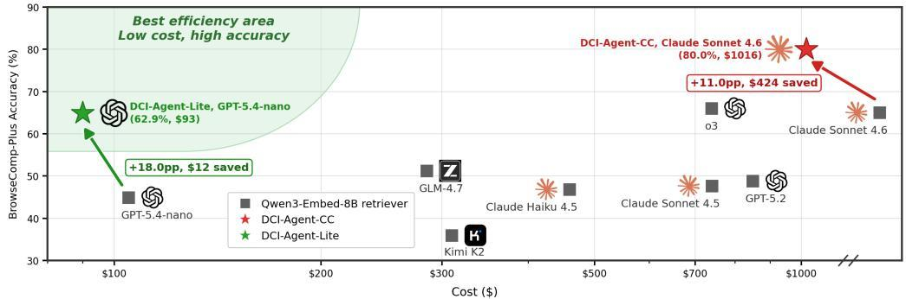
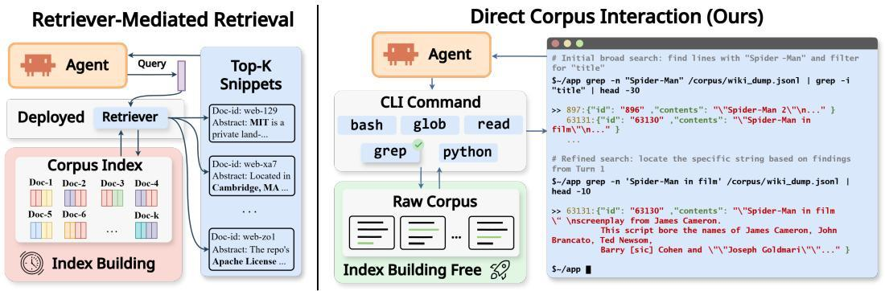
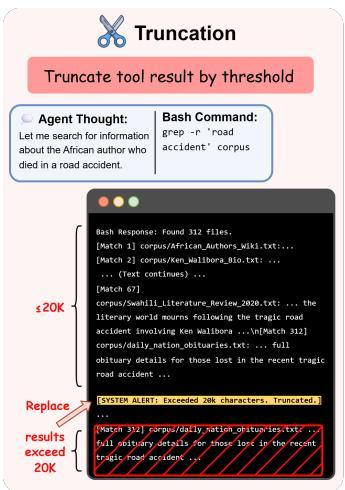
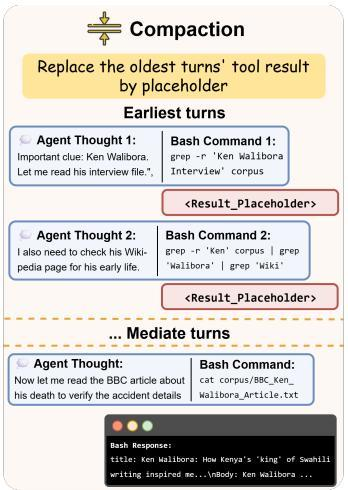
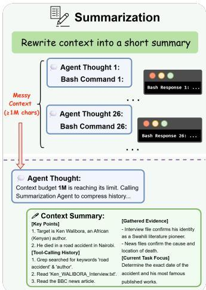
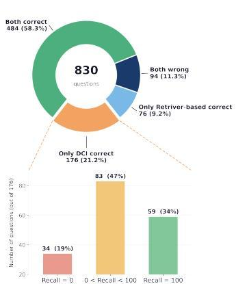
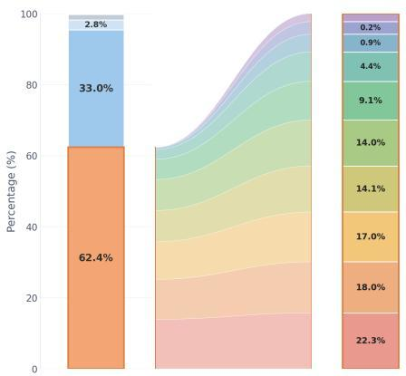
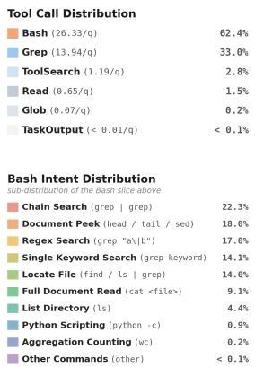
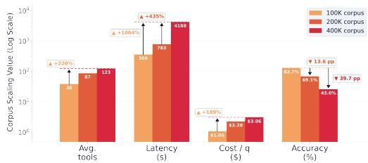

# Beyond Semantic Similarity: Rethinking Retrieval for Agentic Search via Direct Corpus Interaction

Zhuofeng Li1,∗,† Haoxiang Zhang2,3∗ Cong Wei2,∗ Pan Lu4,∗ Ping Nie2,† Yi Lu2 Yuyang Bai1 Shangbin Feng5 Hangxiao Zhu1 Ming Zhong6 Yuyu Zhang7 Jianwen Xie8 Yejin Choi4 James Zou4 Jiawei Han6 Wenhu Chen2 Jimmy Lin2 Dongfu Jiang2,B,† Yu Zhang1,B

1Texas A&M University 2University of Waterloo 3UC San Diego 4Stanford University 5University of Washington 6University of Illinois Urbana-Champaign 7Verdent AI 8Lambda

https://github.com/DCI-Agent/DCI-Agent-Lite

# Abstract

Modern retrieval systems, whether lexical or semantic, expose a corpus through a fixed similarity interface that compresses access into a single top-k retrieval step before reasoning. This abstraction is efficient, but for agentic search, it becomes a bottleneck: exact lexical constraints, sparse clue conjunctions, local context checks, and multi-step hypothesis refinement are difficult to implement by calling a conventional off-the-shelf retriever, and evidence filtered out early cannot be recovered by stronger downstream reasoning. Agentic tasks further exacerbate this limitation because they require agents to orchestrate multiple steps, including discovering intermediate entities, combining weak clues, and revising the plan after observing partial evidence. To tackle the limitation, we study direct corpus interaction (DCI), where an agent searches the raw corpus directly with generalpurpose terminal tools (e.g., grep, file reads, shell commands, lightweight scripts), without any embedding model, vector index, or retrieval API. This approach requires no offline indexing and adapts naturally to evolving local corpora. Across IR benchmarks and end-to-end agentic search tasks, this simple setup substantially outperforms strong sparse, dense, and reranking baselines on several BRIGHT and BEIR datasets, and attains strong accuracy on BrowseComp-Plus and multi-hop QA without relying on any conventional semantic retriever. Our results indicate that as language agents become stronger, retrieval quality depends not only on reasoning ability but also on the resolution of the interface through which the model interacts with the corpus, with which DCI opens a broader interface-design space for agentic search.

  
Figure 1: Pareto frontier of performance vs. cost on BrowseComp-Plus, comparing two paradigms: retrieval (Qwen3-Embed-8B retriever) and our proposed direct corpus interaction (two DCI-Agents ⋆ and ⋆) . The x-axis shows the estimated API cost over the entire evaluation set.

# 1 Introduction

“The medium shapes and controls the scale and form of human association and action.”

— Marshall McLuhan

For language agents, retrieval serves as the primary interface through which external corpora are accessed and perceived. This interface underpins a wide range of applications, including retrievalaugmented generation (Lewis et al., 2020; Gao et al., 2023; Singh et al., 2025), open-domain question answering (Trivedi et al., 2022; Press et al., 2023), and deep research (Wei et al., 2025; Chen et al., 2025b). In standard retrieval-augmented pipelines, documents are chunked, indexed, and filtered into a top-k candidate set using well-established sparse (Robertson et al., 1994) or dense (Karpukhin et al., 2020) techniques before downstream reasoning begins.

Entering the agentic era, retrieval agents (Zhai, 2025) can iteratively plan, reformulate queries, and read, enabling more complex multi-round search behaviors (Jin et al., 2025; Jiang et al., 2025; Team et al., 2025b,a; Li et al., 2026b). However, this increased flexibility is still constrained by a fixed, off-the-shelf retrieval interface that exposes only a top-k slice of the corpus at each step. This limitation becomes more pronounced in emerging benchmarks such as BrowseComp-Plus (Chen et al., 2025b), which require agents to compose many actions (e.g., discovering intermediate entities, aggregating sparse clues, enforcing exact lexical constraints, and revising search plans after inspecting local context). Under such demands, restricted evidence exposure hinders effective exploration. As a result, performance bottlenecks arise not only from post-retrieval reasoning but from the retrieval interface itself.

To overcome the bottleneck, in this paper, we position direct corpus interaction (DCI) as a new retrieval interface for agentic search. Instead of querying a conventional semantic retriever or retrieval API, the agent searches the raw corpus directly using general-purpose terminal tools such as grep, simple file reads, shell commands, and lightweight scripts. No off-the-shelf embedding model, vector index, or top-k interface mediates access: the entire corpus remains available, and semantic interpretation is delegated to the agent itself. This becomes particularly beneficial once the agent is strong enough to search strategically (as recent systems suggest; e.g., Anthropic, 2026; OpenAI, 2026), because it can compose the search primitives on its own, preventing potentially useful evidence from being discarded before reasoning begins. In practice, DCI provides a small but highly flexible and composable set of operations for corpus exploration (e.g., find), exact matching (e.g., grep), local inspection (e.g., head, tail, or sed), and iterative refinement. Furthermore, these operations can be pipelined to enforce lexical constraints (e.g., grep ’foo’ file | grep ’bar’), combine weak clues (e.g., find . | grep ’report’ | grep ’2024’), and verify hypotheses against local context (e.g., grep -n ’keyword’ file | head).

To demonstrate the effectiveness of DCI, we evaluate it in end-to-end agentic search on BrowseComp-Plus (Chen et al., 2025b), multi-hop QA benchmarks (Yang et al., 2018; Trivedi et al., 2022), and ranking-oriented IR benchmarks (Thakur et al., 2021; Su et al., 2025). On BrowseComp-Plus, replacing the Qwen3-Embedding-8B retrieval tool with DCI under the same Claude Sonnet 4.6 backbone improves accuracy from 69.0% to 80.0% (+11.0 points) while reducing cost from \$1,440 to \$1,016 (−29.4%). On multi-hop QA, combining DCI with Claude Code as the command-line interface agent achieves 83.0 average accuracy, surpassing the strongest retrieval-agent baseline (Gao et al., 2025) by 30.7 points. On IR ranking, the same setup reaches 68.5 average NDCG@10, outperforming the best retrieval baseline (Liu et al., 2025) by 21.5 points. To demonstrate generality, we further pair DCI with a minimal terminal-based coding harness (built on Pi and GPT-5.4 nano rather than Claude Code and Sonnet 4.6) that relies solely on bash and read, with lightweight runtime context-management strategies such as truncation and compaction. This configuration also consistently outperforms baselines on QA and IR benchmarks, while both improving performance and reducing cost on BrowseComp-Plus compared to conventional retrieval tools.

We further conduct controlled ablations and trajectory analyses to pinpoint the sources of DCI’s gains. Examining trajectory-level search patterns (RQ2), evidence use (RQ3), corpus scale (RQ4), context management (RQ5), and tool usage (RQ6), we find that DCI’s advantage does not primarily come from surfacing more gold documents: on BrowseComp-Plus, it often prevails even when retrieval agents have already surfaced some or all gold evidence, with the largest gains arising from converting surfaced evidence into higher-value, fine-grained local search and verification steps. We term this finer-grained mode of corpus access “retrieval interface resolution”, where “resolution” denotes the ability to operate on units smaller and more precise than entire documents or passages. The benefit persists even under a highly restricted tool profile. Separately, our scaling and context-management studies further delineate DCI’s operating envelope and the runtime choices that make it practical.

These results point to a broader view of retrieval in agentic systems: the central question is not just which retriever to use, but which interface best aligns with the agent’s reasoning. When models can search like human researchers (e.g., formulating hypotheses, testing exact patterns, reading local context, and refining queries), compressed similarity indexes become a bottleneck, making higher-resolution interfaces more valuable. In this light, DCI is not simply another approach but evidence that retrieval for capable agents should be reframed as an interface-design problem (whose granularity determines what the agent can observe, verify, and act upon), rather than solely a retrieverdesign problem (Zhang et al., 2024; Singh et al., 2025). Indeed, dense and sparse retrieval remain scalable and effective for large, static corpora, but they occupy only one point in the broader design space of corpus interfaces. In real agentic workspaces (Steinberger & OpenClaw Contributors, 2025; Anthropic, 2026) where corpora can be local, heterogeneous, and continually evolving, DCI via a standard bash terminal requires no offline embedding or indexing, adapts naturally to changing files, and lets the agent operate directly within the environment it is reasoning over.

To summarize, our work makes three key contributions:

• We formalize direct corpus interaction (DCI) as a retrieval paradigm and systematically evaluate it across diverse agentic search settings.   
• We show that DCI is a competitive method for document ranking, multi-hop QA, and end-to-end agentic search, outperforming competitive baselines without relying on external retrievers across most benchmarks.   
• We introduce retrieval interface resolution as a conceptual lens to explain DCI’s effectiveness, and support this view with trajectory-level evidence via coverage and localization analyses.

# 2 Related Work

Retrieval-Augmented Generation (RAG). RAG (Guu et al., 2020; Lewis et al., 2020; Borgeaud et al., 2022; Asai et al., 2023; Ram et al., 2023; Gao et al., 2023; Shi et al., 2024) augments large language models (LLMs) with external knowledge via a retrieve-then-generate pipeline: given a query, the system first retrieves potentially relevant documents from a corpus, and the model conditions on the retrieved evidence to produce the final output. In classical RAG, retrieval is mediated by a prebuilt index for efficient search. Typically, documents are chunked, converted to sparse or dense representations, and indexed in advance. Sparse retrieval relies on lexical matching such as BM25 (Robertson et al., 1994), while dense retrieval performs nearest-neighbor search over learned vectors (Khattab & Zaharia, 2020; Karpukhin et al., 2020; Izacard et al., 2022; Wang et al., 2022; Li et al., 2023; Zhang et al., 2025). Subsequent advances, including LLM-based reranking (Sun et al., 2023; Zhuang et al., 2025; Weller et al., 2025) and adaptive RAG (Jeong et al., 2024), improve individual stages but retain the same underlying retrieval structure.

The Rise of Agentic Search. A paradigm shift is underway from single-shot retrieve-then-generate pipelines to multi-step retrieval agents (Jin et al., 2025; Jiang et al., 2025; Li et al., 2025). Recent systems (Team et al., 2025b,a; Li et al., 2026b) leverage larger context windows and adaptive scaffolding to run long-horizon investigations, iteratively searching, accumulating evidence, and refining plans based on intermediate observations. Yet across these systems, the model’s only channel to the corpus is a fixed retriever that pushes semantic understanding upward into an index. As agents grow more capable and tasks become more challenging (Mialon et al., 2024; Wei et al., 2025; Chen et al., 2025a,b), the bottleneck becomes not only post-retrieval reasoning but the interface itself, which fails to fully expose the corpus’s semantics. Our work inverts this design by moving semantic understanding downward to the LLM and granting it direct, high-resolution access to the raw corpus.

Coding Agents. Modern agents equipped with command-line interfaces (CLI) have demonstrated a strong ability to resolve complex software engineering tasks (Liu et al., 2023; Jimenez et al., 2024; Deng et al., 2025; Anthropic, 2025; Merrill et al., 2026; Li et al., 2026a). SWE-agent (Yang et al., 2024) shows that agents equipped with bash, file search, and code editing tools substantially outperform direct prompting, while Agentless (Xia et al., 2025) demonstrates that even a simple grep-and-read pipeline can match full agent frameworks. Platforms such as OpenHands (Wang et al.,

  
Figure 2: Two retrieval interfaces for agentic search. $( L e f t )$ Retriever-mediated retrieval relies on offline indexing over a corpus and a retriever: the agent queries the retriever and reasons over the returned top-k candidates. $( R i g h t )$ In contrast, direct corpus interaction bypasses preprocessing and any separate retriever: the agent searches the raw corpus directly using general-purpose terminal tools such as grep, glob, bash, along with lightweight scripts, enabling fine-grained pattern matching and precise evidence localization.

2025) and Aider (Gauthier, 2024) have further consolidated terminal-based coding agents as a mature paradigm. Beyond task completion, Sutawika et al. (2026) recently shows that CLI primitives alone are sufficient for precise code localization; Subramanian et al. (2025) shows that a tool-augmented keyword-search agent over raw PDFs can approach vector-database RAG for document QA, whereas we study direct corpus interaction as a broader retrieval interface for agentic search. These systems establish that grep, file reads, and shell commands serve as primary information channels through which agents create and edit code files, navigate entire repositories, and execute tests and other programs. The primary advantage of CLI tools lies not just in their precision, but in their flexibility and composability via pipelines (GNU Project, 2025). Our work positions CLI as a new retrieval medium for agentic search, treating general-purpose terminal tools, such as grep, file reads, and shell commands, as a high-resolution interface to the corpus.

# 3 Direct Corpus Interaction

In this paper, we aim to compare two broad paradigms for how an agent accesses a corpus during agentic search, as shown in Figure 2. In retriever-mediated access, corpus interaction is mediated by a conventional retriever: the agent formulates a query, receives a ranked top-k list of documents or snippets, and iterates by reformulating queries based on the returned candidates. In this setting, the agent’s observations are largely constrained to what the retriever chooses to expose (typically short snippets plus document identifiers), and all evidence must pass through the retriever’s scoring and ranking interface.

In direct corpus interaction (DCI), the agent bypasses any embedding model, vector index, or retrieval API, and instead interacts with the raw corpus through a general-purpose command-line interface. Concretely, the agent issues tool calls such as grep and rg for exact or regular-expression matches, find and glob for structural navigation, and targeted file reads or lightweight scripts to inspect local context around matches. The resulting observations are therefore tool outputs (e.g., matched spans with surrounding context, file paths, counts, and metadata) rather than a fixed-format ranked list.

# 3.1 DCI Agent Implementations

We instantiate DCI under two agent scaffolds, plus controlled ablations. Both implementations search the raw corpus directly via terminal tools and file reads. They differ only in runtime support, allowing us to separate the core effect of the DCI interface from additional harness engineering.

DCI-Agent-Lite: Minimal Scaffold. To isolate the interface change as cleanly as possible, we introduce DCI-Agent-Lite, a lightweight terminal coding agent adapted from Pi (Zechner & Pi Contributors, 2026) and restricted to raw terminal interaction. The agent accesses the corpus through bash and file reads, using general-purpose shell operations such as grep and rg for lexical matching, find and glob for file discovery, together with lightweight scripts. Importantly, DCI-Agent-Lite contains no retrieval-specific module: there is no offline indexing, no dense retriever, and no reranker. This minimal scaffold enables controlled experiments in which improvements can be attributed primarily to the DCI paradigm.

  
Figure 3: Visualization of runtime context-management strategies for long-horizon DCI. We use three mechanisms (i.e., tool-result truncation, history compaction, and summarization) to mitigate context pressure while preserving the search trajectory structure.

DCI-Agent-CC: Stronger Scaffold. To probe the performance frontier of the same paradigm under a more capable harness, we also implement DCI using Claude Code (Anthropic, 2025) as an off-the-shelf CLI agent. We name this variant as DCI-Agent-CC. Compared with DCI-Agent-Lite, it provides stronger prompting, more robust tool orchestration, and built-in context handling, which together improve stability on long-horizon search and heterogeneous corpora. Note that we treat DCI-Agent-CC as a stronger instantiation of DCI rather than a different retrieval method: it still operates purely through terminal tools over the raw corpus and does not call any embedding retriever or retrieval API.

# 3.2 Runtime Context Management for DCI

Repeated grep and rg calls may return many matches, and opening files or extracting surrounding context can expose long spans of text. Over a long-horizon trajectory, these observations accumulate quickly and can exceed the model’s finite context window. The runtime must therefore balance two competing needs: (1) retaining evidence and intermediate constraints for later reasoning, and (2) making room for new observations as the search proceeds.

Table 1: Runtime context-management profiles. 

<table><tr><td>Level</td><td>Truncation</td><td>Compaction</td><td>Summarization</td></tr><tr><td>L0</td><td>✗</td><td>✗</td><td>✗</td></tr><tr><td>L1</td><td>√ (max 50K chars)</td><td>✗</td><td>✗</td></tr><tr><td>L2</td><td>√ (max 20K chars)</td><td>✗</td><td>✗</td></tr><tr><td>L3</td><td>√ (max 20K chars)</td><td>√</td><td>✗</td></tr><tr><td>L4</td><td>√ (max 20K chars)</td><td>√</td><td>√</td></tr></table>

To support long-horizon DCI, we equip DCI-Agent-Lite with a lightweight runtime contextmanagement layer, visualized in Figure 3. The layer is built around three mechanisms.

• Truncation caps the text from each tool call before reinserting it into the live working context, preserving that an observation occurred while limiting per-turn verbosity.   
• Compaction is an in-memory, zero-LLM operation that clears the contents of older tool-result turns once accumulated tool output exceeds a configured threshold, replacing those turns with short placeholders that preserve the tool-call structure.   
• Summarization is a higher-intervention strategy that, under additional context pressure, replaces compacted history with a model-generated summary while keeping the most recent context intact.

For controlled analysis, as shown in Table 1, we implement a small family of context-management policies, each enabling a different subset of these mechanisms with different aggressiveness. Concretely, L0 does not perform any context management. L1 applies only truncation (capping each tool result at 50,000 characters), while L2–L4 use a stricter 20,000-character cap. L3 additionally enables compaction, triggering once accumulated tool-result content exceeds 240,000 characters and compacting all but the most recent 12 turns. L4 further invokes summarization after compaction: if the estimated context tokens still exceed a threshold, the runtime replaces the compacted history with a model-generated summary while retaining the most recent 20,000 tokens, and it suppresses further attempts after three consecutive summarization failures within a session.

Note that these policies do not change the retrieval interface itself. They only change how much tool-mediated evidence survives in the model’s working context during long-horizon search.

# 3.3 Evaluating DCI: Coverage and Localization

Answer accuracy on downstream tasks is of course an important metric for evaluating DCI. However, accuracy alone is insufficient to capture how DCI and conventional retriever-mediated access succeed or fail in qualitatively different ways. Retriever-mediated access typically provides high-level recall but offers limited control over exact string matches, conjunctions of weak lexical signals, and precise span-level triggers for the next hop. In contrast, DCI exposes a higher-resolution search interface: once the agent reaches a useful document, it can directly probe for specific terms, open the full file, extract new entities or constraints, and immediately launch follow-up searches grounded in localized evidence. To characterize these differences at the process level, we introduce two trajectorylevel metrics. Coverage measures whether a trajectory surfaces the relevant (gold) documents at all, reflecting broad evidence access. Localization measures how efficiently the trajectory narrows to a small, usable evidence span within each surfaced gold document, reflecting within-document evidence isolation.

Formally, let $\mathcal { D } ^ { * } ( q )$ denote the gold documents for question $q ,$ and let $\mathcal { M } ( q , \tau ) \subseteq \mathcal { D } ^ { * } ( q )$ be those surfaced along trajectory τ . Here, a document is surfaced when it appears explicitly in the recorded trace, either as a retrieved snippet or as a file returned by a tool call.

Coverage. We report the three coverage aggregates:

$$
\operatorname{coverage} _ {\text { any }} (q, \tau) = \mathbb {1} [ | \mathcal {M} (q, \tau) | \geq 1 ], \operatorname{coverage} _ {\text { mean }} (q, \tau) = \frac {| \mathcal {M} (q , \tau) |}{| \mathcal {D} ^ {*} (q) |}, \text { and } \tag {1}
$$

$$
\operatorname{coverage} _ {\text { all }} (q, \tau) = \mathbb {1} [ | \mathcal {M} (q, \tau) | = | \mathcal {D} ^ {*} (q) | ].
$$

Empirically, these coverage scores are reach metrics. $\mathsf { c o v e r a g e } _ { \mathsf { a n y } }$ measures whether the trajectory surfaces at least one gold document, ${ \mathsf { c o v e r a g e } } _ { \mathsf { m e a n } }$ is the average over gold documents of whether each document is surfaced, and $\mathsf { c o v e r a g e } _ { \mathsf { a l l } }$ measures whether the full gold set is surfaced. They therefore reflect broad evidence access rather than fine-grained evidence use within a surfaced document.

Localization. Let a trajectory $\tau = ( o _ { 1 } , \dots , o _ { T } )$ comprise a sequence of observations. For each observation $o _ { t }$ , we define $\mathcal { R } ( o _ { t } ) = \{ ( \dot { d _ { t , 1 } } , \sigma _ { t , 1 } ) , \dots , ( \dot { d _ { t , n } } , \sigma _ { t , n } ) \}$ , where n is the number of exposed items in observation $o _ { t } , d _ { t , i }$ is the corresponding document, $\sigma _ { t , i }$ is the snippet exposed for $d _ { t , i } ,$ and $\ell _ { t , i } = | \sigma _ { t , i } |$ | is its character length. We write $\ell _ { t } = ( \ell _ { t , 1 } , \ldots , \ell _ { t , n } )$ for the snippet-length list of observation $o _ { t }$ . We use fixed-width character segments (whose length is $c _ { \mathrm { s e g } }$ in characters) rather than lines as the unit of analysis, since many web and PDF exports collapse layout into long lines where line boundaries are not a reliable proxy for evidence granularity.

Localization builds on the following normalizations:

$$
\nu (x) = \max \left(1, \left\lceil \frac {x}{c _ {\mathrm{seg}}} \right\rceil\right), \quad \psi (a; b) = \max \left(1 - \frac {\log a}{\log b}, 0\right) \quad \text { for } 1 \leq a \leq b, b > 1, \tag {2}
$$

with $\psi ( a ; 1 ) = 1$ . Here $\nu ( x )$ maps a character length to a segment count, and $\psi ( a ; b )$ assigns a higher score when a is small relative to $b .$ .

For the i-th candidate $d _ { t , i }$ in observation $o _ { t }$ that is aligned to a gold document $d ^ { * }$ , we define

$$
\operatorname{seg-score} (d _ {t, i}; d ^ {*}) = \psi (\nu (\ell_ {t, i}); \nu (| d ^ {*} |)). \tag {3}
$$

This score measures how localized the exposed snippet is within the full gold document, assigning higher values when the exposed span is smaller relative to the document. Here, $\ell _ { t , i }$ is the character length of the snippet exposed by candidate $d _ { t , \cdot }$ i in observation $o _ { t } .$ , and $| d ^ { * } |$ | is the character length of the full gold document. The DCI-specific mapping from tool outputs to snippets is implementationdependent. One can refer to §A.3 for details.

For each surfaced gold document $d ^ { * }$ , let $\mathcal { H } ( d ^ { * } , \tau )$ be the set of aligned candidates in trajectory τ . We define the best localization on $d ^ { * }$ as

$$
s (d ^ {*}, \tau) = \max _ {d _ {t, i} \in \mathcal {H} (d ^ {*}, \tau)} \text { seg - score } (d _ {t, i}; d ^ {*}). \tag {4}
$$

We then aggregate over surfaced gold documents:

$$
\text { localization } (q, \tau) = \frac {1}{| \mathcal {M} (q , \tau) |} \sum_ {d ^ {*} \in \mathcal {M} (q, \tau)} s (d ^ {*}, \tau). \tag {5}
$$

That is, localization(·, ·) is the trajectory-level average of the best segment-level score attained for each surfaced gold document. Empirically, localization(·, ·) is a within-document metric: given that a useful document has been reached, it tests whether the trajectory can narrow to a small, usable evidence span. A high localization score thus indicates the agent is not merely reaching relevant documents but also extracting concentrated evidence from them.

# 4 Experiments

# 4.1 Experimental Setup

Implementation Details. We first detail the implementation of two scaffolds for DCI. DCI-Agent-Lite is a minimal Pi-based harness that exposes only bash and read, with lightweight runtime context management to support long-horizon exploration. (Unless otherwise noted, we use L3 in the main results and L4 in ablation experiments.) DCI-Agent-ClaudeCode (CC) is built on Claude Code and otherwise follows its default configuration, except that we disable web-search, web-fetch, and subagents, and we block access to the data directory to prevent answer leakage. Unless otherwise noted, DCI-Agent-Lite uses GPT-5.4 nano (OpenAI, 2026) as its base model, providing a lightweight setting for evaluating DCI under strict budget constraints. In contrast, DCI-Agent-ClaudeCode (CC) uses Claude Sonnet 4.6 (Anthropic, 2026) as its base model, providing a high-capacity setting to probe the paradigm’s performance ceiling when budget constraints are relaxed. We set the reasoning effort to high for GPT-5.4 nano and to medium for Claude Sonnet 4.6, with a maximum turn budget of 300 for both agents. Further details on agent prompts are provided in §C.

# Benchmarks. We evaluate DCI-Agents across three benchmark families:

• Agentic Search. We use BrowseComp Plus (Chen et al., 2025b) to assess agentic deep research capabilities. We adopt the officially released corpus, which includes both gold documents supporting the QA and distractors. For the retrieval-agent baselines introduced below, we additionally use the released FAISS index built from Qwen3-Embedding-8B embeddings (Zhang et al., 2025) as the offline search engine.   
• Knowledge-Intensive QA. We include NQ (Kwiatkowski et al., 2019), TriviaQA (Joshi et al., 2017), Bamboogle (Press et al., 2023), HotpotQA (Yang et al., 2018), 2WikiMultiHopQA (Ho et al., 2020), and MuSiQue (Trivedi et al., 2022), to evaluate multi-hop QA via corpus search. Following prior work (Jin et al., 2025; Gao et al., 2025), we use the 2018 Wikipedia dump (Karpukhin et al., 2020) as the corpus. For retrieval-agent baselines, we build the index with E5 embeddings (Wang et al., 2022).   
• IR Ranking. We include four datasets (Biology, Earth Science, Economics, and Robotics) from the BRIGHT benchmark (Su et al., 2025) and two datasets (ArguAna and SciFact) from the BEIR benchmark (Thakur et al., 2021) for ranking evaluation.

More benchmark details are provided in $\ S \mathrm { A } . 1$ .

Table 2: Accuracy on multi-hop QA benchmarks. ∆ Avg. denotes the improvement in average accuracy over ASearcher-Local-14B, the strongest retrieval-agent baseline. Bold and underlined entries mark the best and second-best results in each column, respectively. 

<table><tr><td>Model</td><td>NQ</td><td>Trivia</td><td>Bam.</td><td>Hotpot</td><td>2Wiki</td><td>MuSiQue</td><td>Avg.</td><td> $\Delta$  Avg.</td></tr><tr><td colspan="9">Retrieval Agents</td></tr><tr><td>R1-Searcher-7B</td><td>58</td><td>50</td><td>54</td><td>46</td><td>40</td><td>24</td><td>45.3</td><td> $\downarrow 7.0$ </td></tr><tr><td>Search-R1-32B</td><td>56</td><td>46</td><td>52</td><td>44</td><td>50</td><td>32</td><td>46.7</td><td> $\downarrow 5.6$ </td></tr><tr><td>ZeroSearch-7B</td><td>26</td><td>30</td><td>18</td><td>10</td><td>18</td><td>4</td><td>17.7</td><td> $\downarrow 34.6$ </td></tr><tr><td>Verl-Tool-Search-7B-DAPO</td><td>56</td><td>44</td><td>32</td><td>50</td><td>32</td><td>12</td><td>37.7</td><td> $\downarrow 14.6$ </td></tr><tr><td>ASearcher-Local-14B</td><td>56</td><td>58</td><td>62</td><td>58</td><td>56</td><td>24</td><td>52.3</td><td>-</td></tr><tr><td colspan="9">DCI Agents</td></tr><tr><td>DCI-Agent-Lite (GPT-5.4 nano)</td><td> $\underline{72}$ </td><td> $\underline{84}$ </td><td> $\underline{72}$ </td><td> $\underline{72}$ </td><td> $\underline{68}$ </td><td> $\underline{40}$ </td><td> $\underline{68.0}$ </td><td> $\uparrow 15.7$ </td></tr><tr><td>DCI-Agent-CC (Sonnet 4.6)</td><td> $\underline{78}$ </td><td> $\underline{96}$ </td><td> $\underline{80}$ </td><td> $\underline{88}$ </td><td> $\underline{82}$ </td><td> $\underline{74}$ </td><td> $\underline{83.0}$ </td><td> $\uparrow 30.7$ </td></tr></table>

Table 3: NDCG@10 on IR ranking benchmarks. ∆ Avg. denotes the improvement in average accuracy over ReasonRank-32B, the strongest conventional retrieval baseline. Bold and underlined entries mark the best and second-best results in each column, respectively. 

<table><tr><td rowspan="2">Method</td><td colspan="4">BRIGHT</td><td colspan="2">BEIR</td><td colspan="2">Summary</td></tr><tr><td>Bio.</td><td>Earth.</td><td>Econ.</td><td>Robotics</td><td>ArguAna</td><td>SciFact</td><td>Avg.</td><td> $\Delta$  Avg.</td></tr><tr><td colspan="9">Sparse &amp; Dense Retrieval</td></tr><tr><td>BM25</td><td>18.9</td><td>27.2</td><td>14.9</td><td>13.6</td><td>31.5</td><td>15.8</td><td>20.3</td><td> $\downarrow$  26.7</td></tr><tr><td>OpenAI-text-emb-3-large</td><td>23.3</td><td>26.7</td><td>19.5</td><td>12.8</td><td>58.1</td><td>58.1</td><td>33.1</td><td> $\downarrow$  13.9</td></tr><tr><td>GTE-Qwen2-7B-Instruct</td><td>30.6</td><td>36.4</td><td>17.8</td><td>13.2</td><td>62.7</td><td>75.3</td><td>39.3</td><td> $\downarrow$  7.7</td></tr><tr><td>Rank-R1-14B</td><td>31.2</td><td>38.5</td><td>21.2</td><td>22.6</td><td>31.3</td><td>72.2</td><td>36.2</td><td> $\downarrow$  10.8</td></tr><tr><td>Rank1-32B</td><td>49.7</td><td>35.8</td><td>22.0</td><td>22.5</td><td>57.6</td><td>74.8</td><td>43.7</td><td> $\downarrow$  3.3</td></tr><tr><td>ReasonRank-32B</td><td>58.2</td><td>48.9</td><td>36.6</td><td>33.9</td><td>28.7</td><td>75.5</td><td>47.0</td><td>–</td></tr><tr><td colspan="9">DCI Agents</td></tr><tr><td>DCI-Agent-Lite (GPT-5.4 nano)</td><td>60.0</td><td>50.8</td><td>32.3</td><td>42.4</td><td>81.9</td><td>72.7</td><td>56.7</td><td> $\uparrow$  9.7</td></tr><tr><td>DCI-Agent-CC (Sonnet 4.6)</td><td>77.1</td><td>69.0</td><td>46.8</td><td>56.8</td><td>85.3</td><td>75.7</td><td>68.5</td><td> $\uparrow$  21.5</td></tr></table>

Baselines. We include two categories of baselines to contextualize results:

• Retrieval Agents. For BrowseComp-Plus, we adopt the official agentic search pipeline with a conventional retriever interface, using BM25 and Qwen3-Embedding-8B, paired with GPT-5 (OpenAI, 2025b), o3 (OpenAI, 2025d), GLM-4.7 (Z.AI, 2025), Claude Sonnet 4.5 (Anthropic, 2025), and Claude Sonnet 4.6 (Anthropic, 2026). For knowledge-intensive QA, we compare against commonly adopted agentic retrieval baselines, including R1-Searcher (Song et al., 2025), Search-R1 (Jin et al., 2025), ZeroSearch (Sun et al., 2025), Verl-Tool-Search (Jiang et al., 2025), and ASearcher (Gao et al., 2025).   
• Sparse & Dense Retrieval. For IR-ranking, we compare against both sparse and dense retrievers, including BM25 (Robertson et al., 1994), OpenAI-text-embedding-3-large (OpenAI, 2024), GTE-Qwen2-7B-Instruct (Li et al., 2023), as well as reasoning-oriented rerankers, including Rank-R1 (Zhuang et al., 2025), Rank1 (Weller et al., 2025), and ReasonRank (Liu et al., 2025).

More details on baseline implementations are provided in §A.2.

# 4.2 Main Results

RQ1: Can a mature DCI agent already achieve strong performance? The answer is affirmative. We provide consistent evidence across three representative settings.

  
Figure 4: Left: Results on all 830 BrowseComp-Plus questions with the Sonnet 4.6 backbone, comparing DCI-Agent-CC to the retrieval agent using Qwen3-Embedding-8B as the retriever. Right: Distribution of tool calls and Bash intents across all DCI-Agent-CC runs, illustrating how the dominant Bash tool decomposes into ten concrete command intents.

Agentic Search. As shown in Figure 1, replacing a conventional retriever with DCI yields substantial gains on BrowseComp-Plus. Specifically, with the same Claude Sonnet 4.6 backbone, replacing Qwen3-Embedding-8B with DCI increases accuracy from 69.0% to 80.0% (+11.0 points) while reducing cost from \$1,440 to \$1,016 (−29.4%). Notably, DCI-Agent-CC not only outperforms its matched retrieval counterpart but also surpasses the strongest retrieval baseline overall, GPT-5 + Qwen3-Embedding-8B (71.7%), by +8.3 points. Meanwhile, DCI-Agent-Lite (GPT-5.4 nano) strikes a good balance between performance and cost: it achieves 62.9% accuracy at a cost of only \$93, remaining competitive with substantially stronger retrieval agents such as o3 + Qwen3-Embedding-8B (66.0%) while reducing cost by \$647. These results indicate that DCI can deliver strong deep-research accuracy and high cost efficiency.

Knowledge-Intensive QA. As shown in Table 2, DCI agents consistently surpass retrieval-agent baselines on knowledge-intensive QA. DCI-Agent-CC attains 83.0% average accuracy, exceeding the strongest baseline, ASearcher-Local-14B (52.3%), by 30.7 points, while DCI-Agent-Lite is also competitive at 68.0%. The gains are especially pronounced on multi-hop benchmarks: relative to ASearcher-Local-14B, DCI-Agent-CC improves by 30 points on HotpotQA, 26 on 2Wiki, and 50 on MuSiQue. Across all six datasets, DCI-Agent-CC and DCI-Agent-Lite take the top two positions, indicating that DCI is a strong alternative to conventional retrieval-augmented pipelines for complex, multi-step evidence aggregation and reasoning.

IR Ranking. As shown in Table 3, DCI agents exhibit a clear advantage over conventional retrieval baselines for IR ranking. DCI-Agent-CC (68.5%) achieves the best NDCG@10 score on all six datasets, exceeding the strongest retrieval baseline, ReasonRank-32B (47.0%), by 21.5 points on average. DCI-Agent-Lite remains highly competitive, ranking second overall with an average NDCG@10 of 56.7, still 9.7 points above the strongest retrieval baseline. These results suggest that the DCI paradigm is effective for ranking.

Taken together, these results indicate that DCI is a promising operating regime, pairing strong performance with favorable cost efficiency across diverse retrieval and reasoning tasks. Next, we examine the mechanisms behind these gains through controlled ablations and trajectory-level analyses.

# 4.3 Controlled Ablations and Mechanism Analysis

RQ2: Why does DCI help? We find that DCI’s advantage arises less from higher gold-document recall and more from fine-grained discovery, composition, and use of evidence through flexible, compositional bash commands. As shown in Figure 4 (left), with the same Sonnet 4.6 backbone, DCI-Agent-CC correctly answers 176 BrowseComp-Plus questions that the matched retrieval agent misses, whereas only 76 show the reverse pattern. Crucially, this gap is not primarily due to outright retrieval failure: among the 176 CC-win cases, only 34 contain no gold documents retrieved by the retrieval agent, while the remaining 142 already surface at least one gold document. These errors fall into two regimes: partial-chain failures (0 < recall < 100, 83 cases), where retrieval exposes some but insufficient evidence to bridge the next hop, and post-retrieval failures (recall = 100, 59 cases), where all gold documents are surfaced but not successfully utilized. The tool distribution in Figure 4 (right) reinforces this interpretation. DCI-Agent-CC relies primarily on Bash (62.4%) and Grep (33.0%), where Grep is Claude Code’s built-in file-search primitive, roughly analogous to grep-style lexical search. Within Bash, usage concentrates on chained search (22.3%), local context peeking (18.0%), regex matching (17.0%), and file localization (14.0%), while full-document reads account for only 9.1%. Taken together, these patterns indicate that DCI’s gains come from exploiting the expressive, compositional nature of bash interactions to compose lexical constraints, verify exact spans, and selectively expand promising snippets into evidence.

Table 4: Trajectory analysis on a BrowseComp-Plus subset (n = 100). As mentioned in §3.3, coverage is computed over per–gold-document hit lists using three aggregations: any, mean (recall), and all; Avg. localization averages the best segment-level localization score across matched gold documents only. Costs reflect agent-side cost only. 

<table><tr><td>Method</td><td>Avg. tools ↓</td><td>Cost / q ($) ↓</td><td>any</td><td>coverage ↑ mean (recall)</td><td>all</td><td>Avg. localization ↑</td><td>Acc. ↑</td><td>Δ Acc.</td></tr><tr><td colspan="9">Retrieval Agents (GPT-5.4-nano)</td></tr><tr><td>BM25</td><td>19.07</td><td>0.0527</td><td>63.0</td><td>42.8</td><td>17.0</td><td>23.5</td><td>32.0</td><td>↓ 13.0</td></tr><tr><td>Qwen3-Embedding-8B</td><td>17.55</td><td>0.0498</td><td>74.0</td><td>56.7</td><td>28.0</td><td>21.7</td><td>45.0</td><td>-</td></tr><tr><td colspan="9">DCI-Agent-Lite (GPT-5.4-nano)</td></tr><tr><td>Direct interaction (L4)</td><td>35.35</td><td>0.1021</td><td>70.0</td><td>28.0</td><td>1.0</td><td>48.4</td><td>73.0</td><td>↑ 28.0</td></tr></table>

RQ3: What behavioral tradeoffs distinguish DCI from retrieval? This question clarifies what DCI buys and what it costs. The key pattern in Table 4 is that DCI-Agent-Lite does not win by exhaustively recovering more gold documents. Its mean gold-document coverage is much lower than Qwen3-Embedding-8B’s (28.0 vs. 56.7), but its coverageany score is comparable (70.0 vs. 74.0), while its localization score is dramatically higher (48.4 vs. 21.7). This matters because BrowseComp-Plus questions typically have only 1–4 gold documents. In that regime, once DCI surfaces one useful gold document, it can pivot from broad retrieval to fine-grained inspection and verification. In effect, DCI trades exhaustive gold-chain recovery for high-resolution local progress: it finds a relevant document often enough, then extracts substantially more value from the document it has already reached. This pattern aligns with the observed +28-point accuracy gain despite lower mean coverage and roughly twice as many tool calls. Additional analyses of DCI-Agent-Lite’s search patterns are provided in §B.1.

  
Figure 5: Corpus-scaling results for DCI-Agent-CC on a BrowseComp-Plus subset (n = 100).

Table 5: Tool-profile ablation on a BrowseComp-Plus subset (n = 100). Bold denotes the best result. 

<table><tr><td>Method</td><td>Avg. tools ↓</td><td>Cost / q ($) ↓</td><td>Acc. ↑</td></tr><tr><td colspan="4">Retrieval Agents (GPT-5.4-nano)</td></tr><tr><td>BM25</td><td>19</td><td>0.0527</td><td>32</td></tr><tr><td>Qwen3-Embedding-8B</td><td>18</td><td>0.0498</td><td>45</td></tr><tr><td colspan="4">DCI-Agent-Lite (GPT-5.4-nano)</td></tr><tr><td>read + grep (L4)</td><td>19</td><td>0.0355</td><td>61</td></tr><tr><td>Open bash (L4)</td><td>35</td><td>0.1021</td><td>73</td></tr></table>

RQ4: How does DCI scale with corpus size? As shown in Figure 5, DCI has a clear operating envelope: it scales well in search depth, but incurs rapidly rising costs in search breadth. We expand the BrowseComp-Plus corpus from 100K to 200K documents by injecting additional distractors from FineWeb (Penedo et al., 2024) into the original set. Under this change, DCI-Agent-CC requires far more tool calls per question (38.5 → 86.9), latency more than doubles, cost more than doubles, and accuracy drops by 13.6 points. At 400K documents, degradation is more severe: accuracy falls to 37.5%, average tool usage rises to 122.4 calls, and 20 examples terminate after hitting the maximum tool budget. In short, the high-resolution interface remains powerful once the agent reaches a promising document, but the cost of locating that first useful anchor grows sharply as the candidate space expands.

Table 6: DCI-Agent-Lite (GPT-5.4 nano) context-management ablation on a BrowseComp-Plus subset (n = 100). Retained cov. is the fraction of gold evidence documents remaining in the final conversation state. Parenthesized deltas in Retained cov. and Acc. are computed relative to the L0 baseline. Bold denotes the best result in each metric column. 

<table><tr><td>Level</td><td>Avg. tools ↓</td><td>Latency (s) ↓</td><td>Cost / q ($) ↓</td><td>Retained cov. ↑</td><td>Acc. ↑</td></tr><tr><td>L0</td><td>28.54</td><td>2226.22</td><td>0.0716</td><td>26.9</td><td>72</td></tr><tr><td>L1</td><td>29.00</td><td>1819.78</td><td>0.0720</td><td>31.3 (+4.4)</td><td>75 (+3)</td></tr><tr><td>L2</td><td>29.95</td><td>4412.73</td><td>0.0590</td><td>27.2 (+0.3)</td><td>69 (-3)</td></tr><tr><td>L3</td><td>36.89</td><td>8711.81</td><td>0.1109</td><td>27.0 (+0.1)</td><td>77 (+5)</td></tr><tr><td>L4</td><td>35.35</td><td>4531.11</td><td>0.1021</td><td>28.0 (+1.1)</td><td>73 (+1)</td></tr></table>

RQ5: How does runtime context management affect DCI-Agent-Lite? We isolate the impact of runtime context management on DCI by evaluating it under a minimal harness and identifying the policy that best supports long-horizon search. The five levels listed in Table 1 are examined. For evaluation, we randomly sample 100 BrowseComp-Plus examples, with ablations reported in Table 6. The pattern is distinctly non-monotonic: more aggressive management does not simply yield better results. L1 is the fastest and retains the most gold evidence in the final state (31.3), yet L3 achieves the best answer accuracy (77) with lower retained coverage (27.0), indicating that preserving more verbatim evidence is not the same as maintaining the right working state for continued search. Meanwhile, L2 attains the lowest cost but the worst accuracy (69), and L4 declines again after the L3 peak. Overall, there is a sweet spot: policies that selectively forget are beneficial for sustaining multi-step hypothesis revision, whereas compression that is too weak allows drift and compression that is too blunt discards useful intermediate structure.

RQ6: How much does tool-set expressivity matter for DCI-Agent-Lite? This question examines whether the observed gains come from DCI itself or from access to highly expressive tools such as an unrestricted shell. The ablation in Table 5 suggests a two-fold answer. First, the benefit already appears under a highly constrained interface: with only “read + grep”, restricting the agent to file inspection and exact or pattern-based search, the agent achieves 61% accuracy on BrowseComp-Plus, outperforming the retrieval-agent baseline using Qwen3-Embedding-8B (45%) by 16 points, while maintaining nearly identical tool-call intensity. Second, enabling the bash command set adds a further 12-point gain, but at the cost of substantially higher tool usage, latency, and compute. A detailed breakdown of DCI-Agent-Lite’s bash command usage is provided in §B.1. Overall, these results indicate that a small set of bash commands is sufficient to unlock most of the improvement, whereas additional expressivity yields incremental gains with reduced efficiency.

# 5 Conclusion

This paper formalizes direct corpus interaction (DCI) as an alternative retrieval paradigm for agentic search, in which an agent searches and verifies against the raw corpus using general-purpose terminal tools rather than a conventional retriever. Across ranking-oriented IR, multi-hop QA, and end-to-end agentic search benchmarks, DCI already serves as a competitive approach without any offline index. Controlled ablations and trajectory-level analyses indicate that its advantage stems from retrievalinterface resolution: DCI often succeeds not by recovering more of the gold chain, but by converting surfaced evidence into higher-value local inspection, verification, and compositional search steps. We hope these results encourage future work to evaluate not only retrieval models, but also the corpus interfaces available to capable agents.
