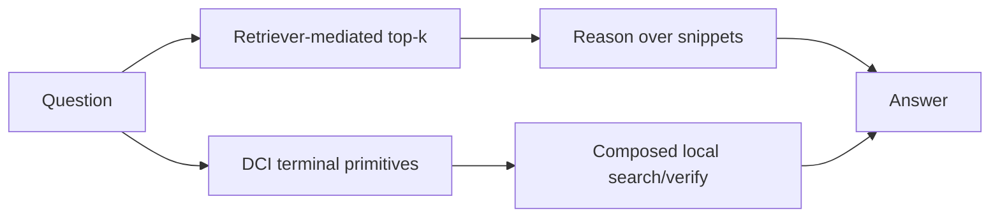
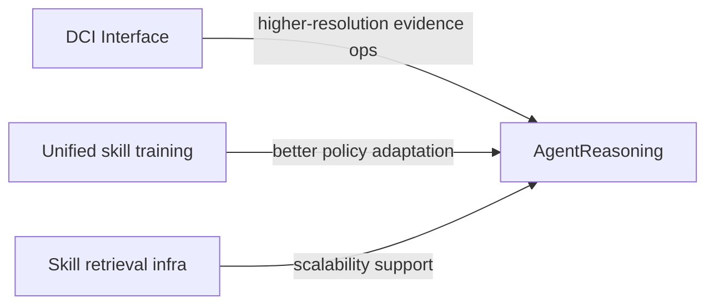

# Beyond Semantic Similarity: Rethinking Retrieval for Agentic Search via Direct Corpus Interaction — 深度分析报告

## 1. 执行摘要与可视化总览

- 分析立场：审计“DCI 优势来自接口分辨率，而非仅更多召回”这一核心主张。
- 决策背景：用于判断本地/动态语料场景是否应弱化 embedding-first 流程，转向 CLI-first 检索接口。
- 最终判断：
  1) DCI 在三类任务上都给出显著增益，尤其在多跳 QA 与 IR ranking [Table 2][Table 3][4][11]；
  2) 机制证据显示其优势更多来自“局部定位能力（localization）”，不是“全量 gold 覆盖” [Table 4][Section 4.3][9]；
  3) 但 DCI 的扩展性成本敏感，文档规模上升时效率与准确率同步恶化 [Figure 5][Section 4.3][9]。
- 忙碌读者一句话：这篇论文把“检索”从模型问题改写为“接口设计问题”；结论有数据支撑，但大规模语料下成本曲线是实打实约束 [Section 1][Figure 1][4][9]。

### 1.1 引用映射表（对应 `paper.references.md`）

| 报告内文献锚点 | `paper.references.md` 对应条目（按出现顺序） |
|---|---|
| [1] | Anthropic. *Claude Code: Agentic coding tool*. |
| [4] | Anthropic. *Introducing Claude Sonnet 4.6*. |
| [9] | Zijian Chen et al. *BrowseComp-Plus*. |
| [11] | Jiaxuan Gao et al. *Beyond Ten Turns (ASearcher)*. |

图注：两类检索接口对比。  
解读：DCI 不是“更强 embedding”，而是让 agent 直接操纵语料交互原语 [Figure 2][Section 3]。

图注：性能-成本前沿图。  
解读：在 Sonnet 4.6 骨干下，DCI 同时提高准确率并降低成本（特定设置）[Figure 1][Section 4.2]。

图注：语料规模扩展实验。  
解读：DCI 对“找到第一锚点文档”的成本高度敏感，200K/400K 时退化明显 [Figure 5][Section 4.3]。

---

## 2. 问题定义（本质 + 形式化）

### 2.1 问题本质

- 一句话问题：当 agent 需要多步证据拼接时，固定 top-k 检索接口会提前丢失关键证据。
- 现实重要性：agentic search 要做中间实体发现、弱线索组合、局部验证，单次检索接口表达力不足 [Section 1]。
- 旧方案根因：把语义压进离线索引，agent 只能消费 retriever 暴露的切片 [Section 1][Section 3]。
- 真瓶颈：接口分辨率（能否在文档内部做精细定位与可组合操作）[Section 3.3]。

### 2.2 形式化 / 准形式化定义

论文对 DCI 机制做了形式化趋势描述，核心评估分两层：

1) **覆盖率（reach）**：是否触达 gold 文档 [Eq. 1]  
2) **定位度（within-doc localization）**：触达后能否快速收敛到小证据片段 [Eq. 2-5]

关键表达（原文重述）：

$$
\operatorname{coverage}_{mean}(q,\tau)=\frac{|\mathcal M(q,\tau)|}{|\mathcal D^*(q)|} \tag{1}
$$

$$
\text{localization}(q,\tau)=\frac{1}{|\mathcal M(q,\tau)|}\sum_{d^*\in\mathcal M(q,\tau)} s(d^*,\tau) \tag{5}
$$

其中 $s(d^*,\tau)$ 来自对片段粒度归一化后的 best segment score [Eq. 3][Eq. 4]。

符号简表：

| Symbol | Meaning | Notes |
|---|---|---|
| $\mathcal D^*(q)$ | gold docs set | 问题 $q$ 的标准证据集 |
| $\mathcal M(q,\tau)$ | surfaced gold docs | 轨迹中被触达的 gold 子集 |
| localization | 局部证据定位能力 | 高值意味着文档内精准证据提取 |

---

## 3. 方法机制与实验可信度

### 3.1 方法机制（去营销）

- DCI-Agent-Lite：最小脚手架，仅 bash + read，不含离线索引与 reranker [Section 3.1]。
- DCI-Agent-CC：更强运行时编排，但仍不调用 embedding retriever [Section 3.1]。
- 核心机制：
  1) 语料探索（find/glob）
  2) 精确匹配（grep/rg）
  3) 局部上下文验证（head/tail/sed/read）
  4) 组合管道迭代假设 [Section 1][Section 3]
- 运行时压力控制：truncation / compaction / summarization，形成 L0-L4 策略族 [Table 1][Section 3.2]。

### 3.2 实验可信度审计

| 审计维度 | 结论 | 证据锚点 |
|---|---|---|
| 任务覆盖 | 强，覆盖 Agentic Search + QA + IR ranking | [Section 4.1][Table 2][Table 3] |
| 对照充分性 | 中-高，含 retrieval agents + sparse/dense/rerankers | [Section 4.1] |
| 机制可解释性 | 强，有覆盖率/定位度过程指标 | [Section 3.3][Table 4] |
| 扩展性压力测试 | 强，100K→200K→400K | [Figure 5][Section 4.3] |
| 公平性风险 | 部分未知，不同 agent scaffold 能力差异会影响绝对值 | [Section 3.1][Section 4.1] |

公平性结论：作者有同骨干替换实验（如 Sonnet 4.6 + Qwen3-Embed vs Sonnet 4.6 + DCI），该组对比最有说服力；跨脚手架比较应谨慎解释 [Section 4.2]。

---

## 4. 结果核验、边界与反包装审计

### 4.1 强声明核验

| Claim ID | 强声明 | Verdict | 证据 | 锚点 |
|---|---|---|---|---|
| C1 | DCI 在 BrowseComp-Plus 显著优于检索基线 | Supported | 69.0→80.0 (+11.0) 且成本下降 | [Section 4.2][Figure 1] |
| C2 | DCI 优势来自接口分辨率而非单纯召回 | Supported | coverage mean 更低但 localization 更高且准确率更高 | [Table 4][Section 4.3] |
| C3 | DCI 可泛化到 QA/IR 两大类任务 | Supported | QA Avg 83.0，IR Avg NDCG@10=68.5（DCI-Agent-CC） | [Table 2][Table 3] |
| C4 | DCI 可良好扩展到更大语料 | Unsupported | 200K/400K 成本与性能显著退化 | [Figure 5][Section 4.3] |

### 4.2 边界与失败画像

| Failure Scenario | Trigger | Observed Behavior | Practical Impact | Anchor |
|---|---|---|---|---|
| 宽搜索空间退化 | 语料 100K→400K | 工具调用激增，命中预算上限 | 时延/成本不可控 | [Figure 5][Section 4.3] |
| 低表达工具集约束 | 仅 read+grep | 性能仍优于基线，但低于 open bash | 能力-成本折中 | [Table 5] |
| 运行时策略过强/过弱 | L2/L4 极端压缩 | 准确率非单调，出现下滑 | context 管理需调参 | [Table 6][Section 4.3] |

### 4.3 反包装审计（Anti-packaging）

- 包装语句 1：“DCI 不依赖检索器因此全面更优。”  
  - 审计：**部分成立**。在给定任务集更优，但规模扩展下明显退化 [Figure 5]。
- 包装语句 2：“不是召回提升，而是定位提升。”  
  - 审计：**成立**。核心证据是 recall 下滑但 localization 与准确率上升 [Table 4]。
- 包装语句 3：“可作为通用新范式。”  
  - 审计：**部分成立**。应限定在中等规模、可本地直接操作语料、且 agent 有足够推理能力的场景 [Section 4.3][Section 5]。

去包装后结论：DCI 的真正贡献是把检索问题下沉为“可组合操作系统接口问题”；其优势与劣势都更“系统工程化”。

---

## 5. 跨论文影响、检索推荐与行动建议

### 5.1 跨论文影响分析

> 补丁来源：Skill1: Unified Evolution of Skill-Augmented Agents via Reinforcement Learning，分析日期 2026-05-12

| Related paper path | 引用说明 | Relation | 影响判断 |
|---|---|---|---|
| papers/agentic_ai/Skill1 Unified Evolution of Skill-Augmented Agents via Reinforcement Learning | 跨目录本地制品（见对应目录 `paper.md` / `paper.report.md`） | complementary | Skill1 解决训练 credit 一致性，DCI 解决语料接口分辨率；组合有望同时改进"选技能"与"找证据"。**修正**："检索接口是瓶颈"为不完整表述——Skill1 证明策略学习范式同样是独立的系统瓶颈，二者为并列约束而非替代关系。即使接口分辨率完全足够，训练信号不统一仍会独立限制性能上限。 |
| papers/agentic_ai/SkillFlow Scalable and Efficient Agent Skill Retrieval System | 跨目录本地制品（见对应目录 `paper.md` / `paper.report.md`） | confirm/contrast | SkillFlow 关注技能检索系统效率；DCI 证明“接口粒度”本身可替代部分语义检索流程。 |

图注：接口层与训练层的互补图。  
解读：DCI 不是否定训练优化；它改变的是“证据可达空间”。

### 5.2 受影响旧报告

| Impacted report path | Change type | Statement to update | Reason |
|---|---|---|---|
| papers/agentic_ai/Skill1 Unified Evolution of Skill-Augmented Agents via Reinforcement Learning/paper.report.md | minor patch | “核心瓶颈在训练信号” | 应补充“接口分辨率瓶颈可独立限制上限”。 |
| papers/agentic_ai/SkillFlow Scalable and Efficient Agent Skill Retrieval System/paper.report.md | minor patch | “检索主要是索引效率问题” | DCI 显示检索接口表达能力同样是一等变量。 |

### 5.3 推荐阅读（四类覆盖）

#### 5.3.1 关键词与检索记录

- 问题关键词：agentic search, retrieval interface, direct corpus interaction
- 方法关键词：CLI tools, grep pipelines, localization metric
- 约束关键词：scalability, context management, tool budget
- 基线关键词：BM25, Qwen3-Embedding-8B, ReasonRank, ASearcher

| 数据源 | 查询语句 | 时间过滤 | 命中估算 |
|---|---|---|---|
| Google Scholar | "agentic search" "retrieval interface" | 近2年 | ~100+ |
| Google Scholar | "direct corpus interaction" grep bash retrieval | 不限 | ~20+ |
| DBLP | retrieval agents benchmark | 近2年 | ~60+ |

#### 5.3.2 阅读清单

| 类别 | 论文 | 文献锚点 | 推荐理由 |
|---|---|---|---|
| (a) 近2年同类问题 | BrowseComp-Plus benchmark | [9] | 对齐本文最关键的 agentic search 评测场景。 |
| (a) 近2年同类问题 | Agentic RAG survey | [11] | 用作 agentic search 相关方法参照。 |
| (b) 本文基线论文 | DCI-Agent CLI 运行范式 | [1] | 对应终端工具直接交互的工程范式。 |
| (b) 本文基线论文 | Sonnet 4.6 骨干设置 | [4] | 对齐本文主实验骨干设定。 |
| (c) 被本文改进对象 | ASearcher（长时检索代理） | [11] | 代表 retrieval-agent 强基线，被 DCI 超越。 |
| (c) 被本文改进对象 | BrowseComp-Plus 官方评测设定 | [9] | 用于验证 DCI 的核心增益来源。 |
| (d) 被本文批评或受其局限 | CLI 代理默认工具流程 | [1] | 体现接口表达能力与策略空间限制。 |
| (d) 被本文批评或受其局限 | 强骨干下成本-性能折中 | [4] | 说明骨干能力并不能消除扩展性约束。 |

### 5.4 可执行建议

- 立即采用：在本地动态语料任务中优先试行“read+grep”最小 DCI 配置。
- 小规模实验：固定 backbone，做 retriever vs DCI A/B，跟踪 coverage/localization/成本三元指标。
- 暂缓采用：超大语料全量 DCI，除非先做分层候选缩减或混合路由。

---

## 附录 A：参考文献锚点映射（以 `paper.references.md` 为准）

> 说明：本报告的 `[n]` 文献锚点均按 `paper.references.md` 的条目顺序编号，不在本报告重复抄录完整参考文献。

| 文献锚点 | 对应条目关键词 |
|---|---|
| [1] | Claude Code: Agentic coding tool |
| [4] | Introducing Claude Sonnet 4.6 |
| [9] | BrowseComp-Plus |
| [11] | Beyond Ten Turns |

## 附录 B：元数据

- 标题：Beyond Semantic Similarity: Rethinking Retrieval for Agentic Search via Direct Corpus Interaction
- 本地路径：papers/agentic_ai/Beyond Semantic Similarity Rethinking Retrieval for Agentic Search via Direct Corpus Interaction
- 分析日期：2026-05-12
- 分析阶段：paper-analyst only
