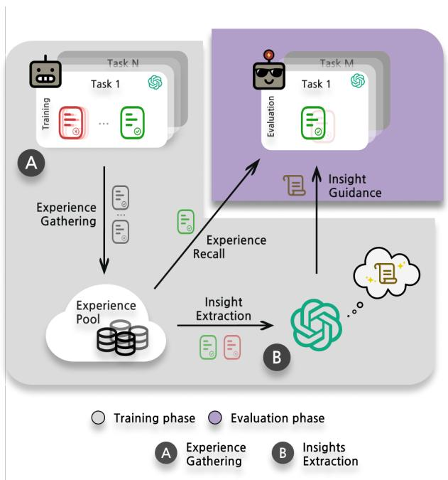
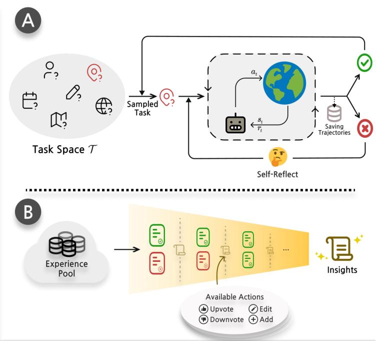
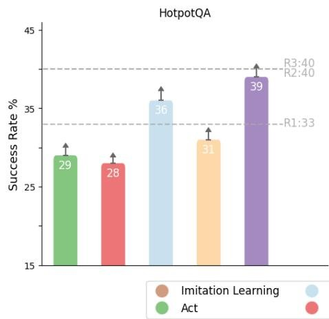
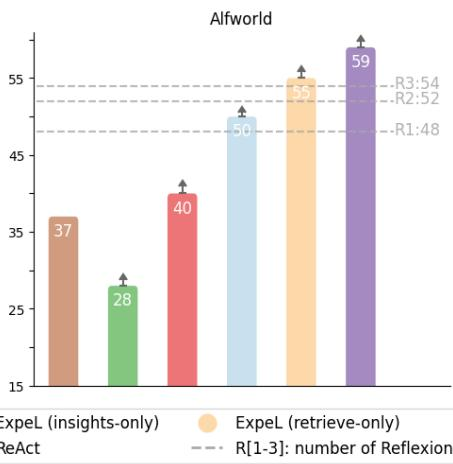
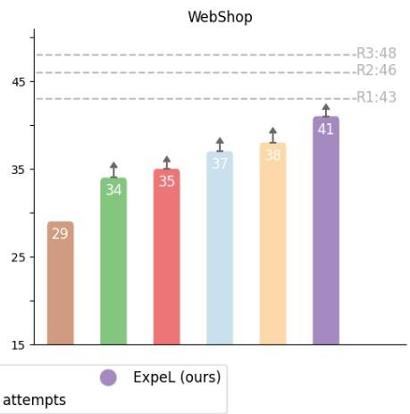
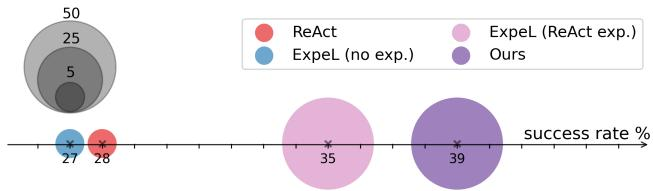

# ExpeL: LLM Agents Are Experiential Learners

Andrew Zhao,♠ Daniel Huang, ♣ Quentin Xu, ♣ Matthieu Lin, ♣ Yong-Jin Liu, ♣ Gao Huang ♠*

♠ Department of Automation, BNRist, Tsinghua University

♣ Department of Computer Science, BNRist, Tsinghua University

{zqc21,huang-jy22,xgd22,lyh21}@mails.tsinghua.edu.cn,

{liuyongjin,gaohuang}@tsinghua.edu.cn

# Abstract

The recent surge in research interest in applying large language models (LLMs) to decision-making tasks has flourished by leveraging the extensive world knowledge embedded in LLMs. While there is a growing demand to tailor LLMs for custom decision-making tasks, finetuning them for specific tasks is resource-intensive and may diminish the model’s generalization capabilities. Moreover, state-of-the-art language models like GPT-4 and Claude are primarily accessible through API calls, with their parametric weights remaining proprietary and unavailable to the public. This scenario emphasizes the growing need for new methodologies that allow learning from agent experiences without requiring parametric updates. To address these problems, we introduce the Experiential Learning (ExpeL) agent. Our agent autonomously gathers experiences and extracts knowledge using natural language from a collection of training tasks. At inference, the agent recalls its extracted insights and past experiences to make informed decisions. Our empirical results highlight the robust learning efficacy of the ExpeL agent, indicating a consistent enhancement in its performance as it accumulates experiences. We further explore the emerging capabilities and transfer learning potential of the ExpeL agent through qualitative observations and additional experiments.1

A computer program is said to learn from experience

$E$ with respect to some class of tasks $T$ and

performance measure $P$ , if its performance at tasks in

$T$ , as measured by $P$ , improves with experience $E$ .

Tom Mitchell

# 1 Introduction

Machine learning research has long been captivated by the potential of autonomous agents and their capabilities. In recent times, incorporating large language models into these agents (Wang et al. 2023b; Xi et al. 2023) has unveiled a broad spectrum of applications, even extending beyond academia (Yang et al. 2023a; Nakajima 2023; Significant-Gravitas 2023). One of the significant advantages of LLMs lies in their world knowledge, allowing them to be inherently versatile across various scenarios (Zhao et al. 2023b).

On the one hand, previous works investigated finetuning LLMs with a large number of environment interactions (Yao et al. 2023c) or with a large amount of human-labeled datasets (Nakano et al. 2021; Shaw et al. 2023). This class of methods incurs high computational costs and needs access to the LLM’s parametric weights. Furthermore, finetuning an LLM restricts its functionalities and can hurt its generalization abilities (Du et al. 2022). On the other hand, prompting methods can augment an LLM with better sequential decision-making planning abilities with only a few in-context examples (Hao et al. 2023; Lin et al. 2023b; Sun et al. 2023). However, since current LLMs are bounded by context window size (Tworkowski et al. 2023), these agents have no recollections of what they have seen, and therefore no learning can be done outside of a few demonstrations. So, how can we strike a balance between these paradigms?

We present the Experiential Learning (ExpeL) agent as a solution. Our agent autonomously gathers experiences from a collection of training tasks through trial and error. From these experiences, it derives natural language insights and employs its own successful experiences as in-context examples during test time. Our agent’s learning process is analogous to a student studying for an exam and then taking it on a single attempt, reflecting many real-world situations. Unlike self-improvement methods like Reflexion (Shinn et al. 2023), our approach emphasizes the importance of retaining experiences across multiple tasks to enhance agent performance. Moreover, ExpeL learns without parameter updates, making it compatible with powerful closed-source models like GPT-4 or Claude. Lastly, the experience-gathering step does not require a large amount of data or human labels.

We evaluated ExpeL on three vastly different domains and consistently outperformed strong baselines. Additionally, we showcased a transfer learning scenario where our agent that accumulated knowledge from source tasks showed positive forward transfer to target tasks. Finally, we highlighted some unexpected emerged abilities the ExpeL agent gained.

In summary, our key contributions are as follows: (1) we introduced ExpeL, a novel LLM agent that autonomously learns from experience without gradient updates; (2) We evaluated ExpeL on a diverse set of tasks to showcase its learning abilities and improvement on top of existing planning methods; (3) we showed a novel setting of transfer learning for our LLM agent and demonstrated forward transferability from source tasks to target tasks. Lastly, we believe that as planning algorithms and foundational models continue to improve, ExpeL’s paradigm stands to gain significant benefits from their enhanced performances.

# 2 Related Work

We discuss the most relevant related works in this section. See Appendix A for detailed discussions on related works.

Prompt-based Learning: Prompt-based learning refines label prediction tasks by modifying the input context, facilitating swift adaptation to new tasks with minimal data (Liu et al. 2023a). This approach capitalizes on LLMs for answers without parameter tuning as they can be augmented using in-context learning (Brown et al. 2020). LAMA (Petroni et al. 2019) and GPT-3 (Brown et al. 2020) are early works that promoted this formulation. Efforts to reduce the intricacies of prompt design include automatic reasoning chains for NLP (Kojima et al. 2022; Zhang et al. 2023). Similarly, the ExpeL agent also autonomously learns from experiences using extracted insights and self-generated incontext trajectories by altering the execution prompt.

Retrieval Augmented Generation (RAG): Retrieval allows LLMs to access databases, mitigating hallucinations (Li et al. 2022; Wang, Yang, and Wei 2023; Rubin, Herzig, and Berant 2022; Liu et al. 2022). Retrieval has also been used to enhance the capabilities of decision-making agents (Humphreys et al. 2022; Zhao et al. 2023a). In contrast to these works, we focus on retrieving the ExpeL agent’s self-generated experiences, thus reducing the dependency on gold examples and leveraging domain-specific corpus.

Planning for LLM Agents: Application of LLM agents in fields like robotics, natural sciences, game-playing, and workflows has surged, with emphasis on their world knowledge in fewshot settings (Ha, Florence, and Song 2023; Mu et al. 2023; Bran et al. 2023; Boiko, MacKnight, and Gomes 2023; Yang et al. 2023b; Lin et al. 2023a; Nakano et al. 2021; Wang et al. 2023c; Liu et al. 2023b). Moreover, LLMs have demonstrated promising zero/few-shot planning and reasoning capabilities in various configurations (Sumers et al. 2023), including embodied environments and reasoning tasks (Huang et al. 2022; Yao et al. 2023a; Wei et al. 2022b; Yao et al. 2023b; Gong et al. 2023).

Self-improvement and Memory for LLM Agents: Agents like Reflexion showcase feedback-based improvement, yet often lack cross-task memory (Shinn et al. 2023). Other agents exhibit potential in persistent memory within multiagent contexts (Park et al. 2023; Maas et al. 2023). Our ExpeL agent combines these approaches, focusing on tasksolving while benefiting from self-generated in-context examples and abstracted insights from memory.

# 3 Preliminaries

Complex Interactive Tasks We work with complex interactive tasks where at each time step $i \in \{ 0 , \ldots , H \}$ , the agent receives an observation $o \in \mathcal { O }$ , and from its observation history $H _ { t }$ decides to perform action $a \in { \mathcal { A } }$ . The objective of the agent is to achieve some goal $g \in { \mathcal { G } }$ . We only deal with deterministic environments in this work.

Large Language Models A large language model is a statistical model of the natural language, typically a neural network. In our setting, we use an autoregressive language model (OpenAI 2023; Brown et al. 2020; Touvron

  
Figure 1: ExpeL Agent Overview. Left: ExpeL operates in three stages: (1) Collection of success and failure experiences into a pool. (2) Extraction/abstraction of cross-task knowledge from these experiences. (3) Application of the gained insights and recall of past successes in evaluation tasks. Right: (A) Illustrates the experience gathering process via Reflexion (Shinn et al. 2023), enabling task reattempt after self-reflection on failures. (B) Illustrates the insight extraction step. When presented with success/failure pairs or a list of $L$ successes, the agent dynamically modifies an existing list of insights $\hat { \iota }$ using operations ADD, UPVOTE, DOWNVOTE, and EDIT. This process has an emphasis on extracting prevalent failure patterns or best practices.

et al. 2023b,a; Chowdhery et al. 2023), which given an ordered list of existing tokens $\mathbf x = \{ x _ { 1 } , x _ { 2 } , . . . , x _ { l - 1 } \}$ , outputs the probability of the next token $p ( x _ { l } \mid x _ { < l } )$ . An instructionfollowing LLM (Thoppilan et al. 2022; Chung et al. 2022; Wei et al. 2022a) is typically finetuned on various NLP tasks that are formatted into instruction, input, response tuples (Taori et al. 2023). Instruction-tuned models are better at following natural language instructions which alleviates the need for heavy prompt engineering (Wei et al. 2022a).

ReAct and Reflexion ReAct (Yao et al. 2023b) and Reflexion (Shinn et al. 2023) are promising frameworks enabling the aforementioned proficiency of LLMs in reasoning and self-improvement. ReAct explicitly intertwines observations, actions, and thoughts, providing a foundation for robust planning and reasoning capabilities. Building upon it, Reflexion introduces an additional reflective step before reattempting the subsequent trial of the same task, enhancing the model’s adaptive learning process.

# 4 ExpeL: An Experiential Learning Agent

Recent advancements in generative LLMs suggest an intriguing approach. Rather than altering the LLM parameters, adjusting the prompts may be more beneficial: this strategy ensures that the LLM’s inherent common sense knowledge remains intact, allowing for superior generalization (Liu et al. 2023a). Furthermore, some of the most potent language models are proprietary (OpenAI 2023; An-

thropic 2023). Thus, focusing on prompt-based methods seems promising as a way to harness the strengths of these advanced LLMs. Additionally, previous works on learning in LLM agents have primarily been trained on extensive human-labeled datasets (Lin et al. 2023a; Shaw et al. 2023) or improved via iterative retries (Shinn et al. 2023) on a single task. A relatively less explored area is facilitating agents to learn autonomously from their own experiences, similar to a student gaining insights from practicing for an exam. The student tackles practice problems multiple times to derive insights. At the exam, the student rely solely on these insights and draw memories of similar problems to answer the questions with one attempt. With this in mind, we wish to design an LLM agent that autonomously gathers experiences and extracts insights, then uses these cross-task insights and memories of similar tasks to aid its decision-making.

We aim to enhance a planning LLM agent, such as Re-Act, with learning abilities that allow it to improve through inter-task experiences without any parameter updates. Inspired by the cognitive abilities inherent in human learning, as well as the benefits observed in self-learning autonomous agents and the progress made in prompt-based methods, we developed the Experiential Learning (ExpeL) agent. During the training stage, the agent interacts with the environment, gathering experiences via trial and error. These experiences are stored in an experience pool (Lin 1992). From this pool, the agent later extracts insights, similar to off-policy learn-

ing (Watkins and Dayan 1992), in which the agent can learn from experiences of a behavior policy. During the evaluation stage, the agent attempts unseen tasks with a single try, augmented with extracted insights and successful trajectories in its experience pool gathered from the training stage. Refer to Fig. 1 for detailed information on our agent framework.

# 4.1 Gathering Experiences

To gather diverse experiences that can be useful to extract information from, we leverage Reflexion (Shinn et al. 2023) to continuously retry the training task at most $Z$ times. In particular, the agent will be given a training task $t _ { n }$ at the $z$ -th trial, fewshot examples $F _ { \mathrm { m a n u a l } }$ and past reflections $\nu _ { n , z }$ (initially, $\nu _ { n , 0 }$ is the empty string). At first, the agent will attempt the task with fewshot examples concatenated with its current trajectory $\tau _ { n , 0 }$ as the context, and use ReAct (Yao et al. 2023b) as the base planning algorithm, $\mathrm { L L M } _ { \mathrm { R e A c t } } ( \cdot { \textrm { \textsf { | } } } \tau _ { n , 0 } , F _ { \mathrm { m a n u a l } } , \nu _ { n , 0 } )$ . On the $z$ -th trial, when the agent finishes the task or the maximum number of steps $H$ is reached, the ExpeL agent’s experience pool $\boldsymbol { B }$ ingests the trajectory $\tau _ { n , z }$ . Then, if the agent succeeds, it moves on to the next task. However, if the agent fails, it will look at its failed trajectory and self-reflect to produce $\nu _ { n , z + 1 } = \mathrm { c o n c a t } ( \nu _ { n , z } , \mathrm { L L M } _ { \mathrm { r e f l e c t } } ( \tau _ { n , z } ) )$ to see where it can do better on the next retry, concatenated with the previous reflections. In the next retry, the agent will augment its context with reflection $\scriptstyle \nu _ { n , z + 1 }$ , the input to the LLM policy, $\mathbf { L L M } _ { \mathrm { R e A c t } } ( \cdot \mid \tau _ { n , z + 1 } , F _ { \mathrm { m a n u a l } } , \nu _ { n , z + 1 } )$ .

To highlight, this trial and error way of gathering experiences not only improves the chances of getting more positive examples for experience recall during evaluation but also allows for collecting valuable success/failure pairs used for comparisons during insight extraction (Sec. 4.2). The pseudo-code can be found in Alg. 1.

# 4.2 Learning from Experiences

Human learning occurs mainly either by storing successful trajectories in memory, which can be later recalled as specific examples, or by extracting high-level insights from experiences, enabling generalization to novel situations. ExpeL considers both of these learning modes to boost task performance. Concretely, an instruction $I$ given to an LLM agent can be broken down into task specifications and fewshot examples. We can augment task specifications with an agent’s extracted insights from past experiences, where an instruction-following LLM can be leveraged (OpenAI 2023) to follow them closely. For fewshot examples, we can allow the agent to retrieve from its experience pool with top- $k$ relevant examples to aid its decisions. Next, we detail our experience recall and insight extraction mechanisms.

Similar Experiences as Demonstrations Works have shown that using in-context examples that are semantically similar to the task at hand results in better performance (Liu et al. 2022). Moreover, when involved in a novel situation, humans also recall from their memory similar tasks they’ve solved as references when attempting the task (Kahneman 2011). Motivated by these observations, we propose experi-

ence recall to retrieve successful trajectories from the experience pool gathered during training based on task similarity.

Concretely, we used the Faiss vectorstore (Johnson, Douze, and Jegou ´ 2019) as the experience pool, kNN retriever and all-mpnet-base-v2 (Song et al. 2020) embedder to obtain top- $k$ successful trajectories that have the maximum inner-product task similarity with the evaluation task. The advantage of using task similarity as the retrieval rank is that if the agent repeats a task or does a task similar to an existing successful trajectory from the experience pool, the agent only needs to closely imitate the successful trajectory and have less burden on ability extrapolation.

Learning from Successes and Failures To leverage the diverse outcomes gathered during the experience collection phase, we believe the agent should analyze experiences in two distinct ways. First, we let the agent compare a failed trajectory with a successful trajectory for the same task. This comparison offers a concrete understanding of the agent’s shortcomings, highlighting the correct and incorrect actions. Second, we let the agent identify patterns within a set of successful trajectories from different tasks. This approach sheds light on common “good practices” that the agent can adopt to ensure success in evaluation tasks.

For the implementation, we give the agent’s instructionfollowing $\mathrm { L L M } _ { \mathrm { i n s i g h t s } }$ several operators to apply on an existing set of insights ˆι. We initialize the set of insights to an empty set $\hat { \iota } = \varnothing$ and iteratively provide the LLM with fail/success pairs or lists of $L$ successes (created by sampling without replacement) from the experience pool. The operations the LLM can perform are: ADD a new insight, EDIT the content of an existing insight, DOWNVOTE to disagree with an existing insight, or UPVOTE to agree with an existing insight. A newly added insight will have an initial importance count of two associated with it, and the count will increment if subsequent operators UPVOTE or EDIT are applied to it and will decrement when DOWNVOTE is applied to it. If an insight’s importance count reaches zero, it will be removed. This particular design choice robustifies the process since even successful trajectories can be suboptimal and mislead the generated insights. The prompt template we used can be found in Fig. 2. We kept the maximum size for a list of successes to $L$ and used $\mathtt { g p t - 4 - 0 6 1 3 }$ as the default $\mathbf { L L M _ { \mathrm { i n s i g h t s } } }$ . We empirically found that $\mathtt { g p t - 4 - 0 6 1 3 }$ is better than $\mathtt { g p t } - 3 . 5 \mathtt { - t u r b o - } 0 6 1 3$ at following instructions on how to use the insight extraction operators and hallucinated less. Pseudo-code for this process can be found in Alg. 2. Finally, ExpeL utilizes these generated insights $\hat { \iota }$ in the task inference phase, described next.

# 4.3 Task Inference

After the agent gathers experiences, extracts insights from them, and sets up a vectorstore of successful trajectories, it can proceed to the evaluation. For each task, the task specifications will be augmented with the concatenation of the full list of extracted insights ${ \hat { \iota } } = \operatorname { c o n c a t } ( \iota _ { 1 } , \iota _ { 2 } , \iota _ { 3 } , \ldots )$ , and the top- $k$ trajectories with the highest task similarity will be retrieved and used as fewshot in-context examples, Fsimilar tasks. Fig. 3 shows an example prompt template structure, and a

You are an advanced reasoning agent that can add,edit or remove rulesfrom yourexisting rule set,basedon forming new critiques of past task trajectories.You will be given..

# A

two previous task trials in which

[Task description]...

one successful and one unsuccessful trial. You failed the trial because..

[Task failure reasons].

Here are the two previous trials to compare and critique:

[Failed/Succeeded Trajectories]

successful tasks trials in whichyou

[Task description].

Here are the trials:

[Succeeded Trajetories]

Here are the EXISTING RULES:

[Currently existing insights]

By examining..

and contrasting to  the the successful trials... successful trial,

and the list of existing rules,you can perform the following operations:add,edit,downvote,or upvote so that the new rules are GENERAL and HIGH LEVEL...

critigues of the failed trial... insights of the successful trials...

or proposed way of Thought so they can be used...

to avoid similar failures when ashelpful tips to different encountered with different tasks in the future. questions in the future.

Have an emphasis on...

critiquing how to... tips that help the agent..

perform better Thought and Action.

Follow the below format:

<OPERATION> <RULE NUMBER>:<RULE>

The available operations are:UPVOTE lif the existing rule is strongly relevant for the task), DoWNvOTE (if one existing rule is contradictory or similar/duplicated to other existing rules),EDIT lif any existing rule is not general enough or can be enhanced, rewriteand improveit),ADD [add new rulesthat are very different from existing rules and relevant for other tasks).Each needs to CLOSELY follow their corresponding formatting below:

UPVOTE <EXISTING RULE NUMBER>: <EXISTING RULE>

DOWNVOTE <EXISTING RULE NUMBER>:<EXISTING RULE>

EDIT <EXISTING RULE NUMBER>:<NEW MODIFIED RULE>

ADD <NEW RULE NUMBER>: <NEW RULE>

Do not mention the trials in the rules because all the rules should be GENERALLY APPLICABLE.Each rule should be concise and easy to follow. Any operation can be used MULTiPLE times. Do at most 4 operations and each existing rule can only get a maximum of 1 operation.Below are the operations you do to the above list of EXiSTING RULES:

pseudo-code for this step can be found in Alg. 3. We believe as the list of extracted insights grows, retrieval could be a feasible solution to manage the context window size.

Task You are QA system. Solve a question description: answering task with interleaving..

  
Figure 2: Insight Extraction Prompt Template. The prompt template ExpeL agents used for insight extraction. The same template is used both for success/fail pairs (A, in yellow) and $L$ -sized successes (B, in green).

Extracted insights:

1. Break down complex queries into simpler,   
2.Consider that the answer might be in the observations already made...

3....

Retrieved inexamples:

Question: Which documentary ... ?

Thought 1:  I need to search..

Action N:Finish[The Saimaa ..]

Obervation N:Answer is CORRECT

Task:Which episode of SpongeBob... ?

Trajectory:

Thought 1: I need to search..

Action 1: Search["The Clasl

Observation 1: “The Clash of Triton,.

Thought 2: The paragraph does

Action H:

Obervation H:

Finish["To SquarePants...]

Answer is CORRECT

  
Figure 3: Task Inference Prompt Template. We illustrate ExpeL’s prompt template during evaluation. The areas with a white background are identical to the base ReAct agent’s inputs. We differ by (purple areas) having additional extracted insights from past experience, and dynamically retrieved successful in-context examples from past experiences based on task similarity.

# 4.4 Transfer Learning

After demonstrating how learning by using experiences from a training set can benefit an LLM agent in solving an unseen task in the same task distribution, we investigate another interesting setting where knowledge accumulated from a source task distribution could be useful for a target task distribution with minimal target task examples for the ExpeL agent. Like most transfer learning settings, we assume that the source and target tasks exhibit common knowledge. Therefore, experiences accumulated from source tasks can benefit the agent in solving a new set of target tasks.

Similar to pretraining on source task and finetuning on target task in transfer learning literature (Zhuang et al. 2020), we propose to use the extracted insights $\hat { \iota }$ from the source task and fewshot examples from the target task to “finetune” the insights so that they are more applicable in the target task. We hypothesize that using target task fewshot examples can better ground the insights into the target task and mitigate hallucinations. An example prompt template to “finetune” extracted insights from a source domain to tailor them

Algorithm 1: ExpeL - Experience Gathering   
Initialize:   
Policy $\mathrm{LLM}_{\mathrm{ReAct}}$ Self-reflection model $\mathrm{LLM}_{\mathrm{reflect}}$ Collection of tasks $\mathcal{T}_{\mathrm{train}}$ Fewshot examples $F_{\mathrm{manual}}$ Experience pool $\mathcal{B}\gets F_{\mathrm{manual}}$ Number of training tasks $N$ Maximum retry number $Z$ Maximum step number $H$ Current task index $n\gets 1$ while task $n\leq N$ do $t_n\gets \mathcal{T}_{\mathrm{train}}[n]$ Reflection $\nu_{n,0}\gets$ "for trial $z = 0$ to $Z$ do $o_0\gets \mathrm{env.dim}(t_n)$ Initialize trajectory $\tau_{n,z}\leftarrow o_0$ for timestep $i = 0$ to $H$ do $a_i\gets \mathrm{LLM}_{\mathrm{ReAct}}(a_i\mid \tau_{n,z},F_{\mathrm{manual}},\nu_{n,z})$ $o_{i + 1},r_{i + 1}$ ,done $\leftarrow$ env_STEP(a_i) $\tau_{n,z}\gets \tau_{n,z}\cup \{(o_i,a_i,o_{i + 1},r_{i + 1})\}$ if done then break end if end for $\mathcal{B}\gets \mathcal{B}\cup \tau_{n,z}$ if done or $z = Z$ then $n\gets n + 1$ break else $\nu_{n,z + 1}\gets \mathrm{concat}(\nu_{n,z} + \mathrm{LLM}_{\mathrm{reflect}}(\tau_{n,z}))$ end if end for end while return $\mathcal{B}$

Algorithm 2: ExpeL - Insight Extraction   
Initialize:  
Experience pool $\mathcal{B}$ (from Alg. 1)  
Insight extraction model LLMinsights  
Set of insights $\hat{\imath}\gets \emptyset$ Divide the successes in $\mathcal{B}$ into $L$ -sized chunks: $C_{success} = \{\{\tau_1^{success},\tau_2^{success},\dots \tau_L^{success}\} ,$ $\{\tau_{L + 1}^{success},\tau_{L + 2}^{success},\dots \tau_{2L}^{success}\} ,\ldots \}$ Construct fail/success tuples of the same tasks in $\mathcal{B}$ : $C_{compare} = \{(\tau_1^{success},\tau_{1,0}^{fail}),(\tau_1^{success},\tau_{1,1}^{fail}),\dots,$ $(\tau_{2}^{success},\tau_{2,0}^{fail}),\dots \}$ for each $c_{compare}$ in $C_{compare}$ do $\hat{\imath}\gets \mathrm{LLM}_{\mathrm{insights}}(c_{compare},\hat{\imath})$ end for  
for each $c_{success}$ in $C_{success}$ do $\hat{\imath}\gets \mathrm{LLM}_{\mathrm{insights}}(c_{success},\hat{\imath})$ end for  
return $\hat{\imath}$

Algorithm 3: ExpeL - Evaluation   
Initialize: ExpeL agent $\mathrm{LLM_{ExpeL}}$ Text Embedder $\mathcal{E}$ Experience pool $\mathcal{B}$ (from Alg. 1) Set of insights $\hat{\iota}$ (from Alg. 2) Collection of evaluation tasks $\mathcal{T}_{\mathrm{evaluation}}$ Number of evaluation tasks $M$ Number of fewshots $k$ Number of successes $S\gets 0$ for task $m = 1$ to $M$ do $t_m\gets \mathcal{T}_{\mathrm{evaluation}}[m]$ $o_0\gets \mathrm{env.dim}(t_m)$ Initialize trajectory $\tau_{m}\leftarrow o_{0}$ $F_{\mathrm{similar~tasks}}\gets \mathrm{Faisss}(t_m,\mathcal{B},\mathcal{E},k)$ for timestep $i = 1$ to $H$ do $a_i\gets \mathrm{LLM_{ExpeL}}(a_i\mid \tau_m,F_{\mathrm{similar~tasks}},\hat{\iota})$ $o_{i + 1},r_{i + 1}$ done $\leftarrow$ env step $(a_i)$ $\tau_{m}\gets \tau_{m}\cup \{(o_{i},a_{i},o_{i + 1},r_{i + 1})\}$ if done then break end if end for if $r_{i + 1} = 1$ then $S\gets S + 1$ end if end for return $\frac{S}{M}$

to a target domain is illustrated in Fig. 4.

# 4.5 ExpeL’s Strengths

In this section, we outline the key strengths of our framework. First and foremost, ExpeL offers inherent interpretability, as both the extracted experiences and successful trajectories are presented in natural language. This design allows users to easily inspect, modify, or remove potentially harmful trajectories/insights — a challenge in finetuned models. Moreover, users can seamlessly add expert insights or trajectories to an ExpeL agent. Additionally, our learning approach is highly accessible; it demands less data, reduces computational resources, and is straightforward to implement. Furthermore, self-improvement methods like Reflexion (Shinn et al. 2023) facilitate intra-task improvements, but ExpeL enables inter-task learning. ExpeL does not rely on retries during deployment, which certain domains require. On the flexibility front, the ExpeL agent boasts a significant level of versatility. It is not restricted to specific language models and complements existing strategies aimed at enhancing LLM agent planning capabilities. Moreover, when applied in conjunction with them, ExpeL might even improve the capabilities of finetuned agents. Another strength lies in continuous improvement. Our method stands to benefit from the ongoing enhancements in foundational models. As an illustration, our experiments show that using gpt-4 to extract insights outperforms gpt-3.5-turbo (refer to Sec. 5.6). Lastly, we introduced a method for trans-

# Knowledge Finetuning

Youare a teacher agent that passes on experience to student agents.You came up with the following rules tohelp you achieve the task of {SourceTask} effectively.The number at the end are the importance you gave to each of the rules.

# RULES:

# [Extracted insights from Source Task]

Now a student agent is trying to solve a similar {Target Task}.

# Some examples of this new task are: [Fixed fewshot examples of Target

Give a concise and easy to follow instructional paragraph based on the RULES for the student agent to solve {Target Task}. Do not state where each sentence is using whichever rule,and make sure the paragraph is VERY CONCISE and EASY TO FOLLOW!

#

# Fewshot Evaluation

The following paragraph is insights a teacher agent provided to you. It is MANDATORY for you to follow these insights as CLOSELY as possible as they will help you perform the {Target Task} tasks efficiently:

# [Finetuned insights]

[Target Task desciption + fewshot]

{Target Task)

  
Figure 4: Transfer Learning Finetuning Prompt Template. The prompt template used to finetune knowledge from source to target domain. Highlighted in grey should be formatted with concise descriptions of the tasks.

ferring extracted insights across domains using only a small amount of finetuning examples, demonstrating the advantage of our approach in diverse settings with limited data.

# 5 Experiments

# 5.1 Experimental Setup

In line with ReAct (Yao et al. 2023b), the experiments are designed based on four text-based benchmarks: HotpotQA (Yang et al. 2018), a knowledge-intensive dataset that challenges an agent to perform reasoning and question answering using the search tool Wikipedia Docstore API, ALFWorld and WebShop (Shridhar et al. 2021; Yao et al. 2022) that require the agent to perform interactive multi-step decision-making tasks in respectively a household and an online shopping website environments, and FEVER (Thorne et al. 2018), that focuses on fact verification tasks using the same API as HotpotQA which makes it suitable for knowledge transfer (Sec. 5.4). All experiments use four-fold validation, and we report the mean and standard error over the

folds. Following ReAct, for all environments, we use success rate as the evaluation metric: exact matching for HotpotQA and FEVER, completing the task in time for ALF-World, and purchasing the item that matches all attributes for WebShop. Some additional metrics are introduced when the environment offers them: mean reward (calculated using Eq. 1 in Appendix) score $r \in [ 0 , 1 ]$ for WebShop and a score breakdown per task type for ALFWorld.

We use ReAct and Act as main baselines planning LLM agents (Yao et al. 2023b), where Act does not have the reasoning steps like ReAct. All agents, including ExpeL, used gpt-3.5-turbo-0613 when performing actions during evaluation. All text generations were done with temperature 0 and greedy decoding. Imitation learning (IL) results were taken from the ReAct paper (Yao et al. 2023b). More details about the experimental setup can be found in Appendix D.

# 5.2 Main Results

The primary findings of this study are presented in Fig. 5. IL-based method struggles to efficiently perform in Web-Shop and ALFWorld, possibly due to their demand for more substantial prior and reasoning abilities, which conventional trainings from scratch fail to provide. This limitation shows the promise of leveraging knowledge-based language models to address these challenges. The following claims were made based on (1) a deep understanding of each environment; (2) extracted insights and retrievable in-context examples; and (3) statistics (e.g. number of invalid actions per trial) of the runs.

Experiential learning Augmenting agents with abstracted insights and the ability to recall successful trajectories improve performance across all environments compared to baseline agents. When restricting the ExpeL agent to only one mode of learning (insights-only or retrieval-only), HotpotQA and ALFWorld environments demonstrate contrasting quantitative distinctions $( 3 6 \% / 3 1 \%$ and $5 0 \% / 5 5 \%$ for HotpotQA and ALFWorld, respectively). The prominent influence of insights on HotpotQA can be due to its reliance on analysing (Wikipedia results) abilities. This highlights the need for general guidelines across various question types. Conversely, ALFWorld’s task completion, dependent on specific action sets, is better derived from past experiential trajectories. Furthermore, WebShop presents a unique challenge, requiring both website-based reasoning (price comparisons, query reformulation, etc.) and precise execution of actions (searching, clicking, option selection, etc.). Consequently, the performance across these tasks shows a near equilibrium, as reflected in both the success rate and score $( 3 7 \% / 3 8 \%$ and 0.675/0.67 for insights/retrieve-only respectively, see Tab. 5 in Appendix for scores). These observations highlight the synergistic interplay between abstraction and recollection in experiential learning, with ExpeL showing a quantitative advantage over baseline/restricted learning mode agents.

Cross-task learning Another important finding we observe is the comparison with the Reflexion agent (Shinn et al. 2023). ExpeL matches Reflexion’s performance $40 \%$ at R3 vs. $39 \%$ ) for HotpotQA and even outperforms it for

  
Figure 5: Main Results. Average task success rates (std. error in gray arrows) across three different domains: HotpotQA, ALFWorld, and WebShop. ReAct and Act are used as baselines. ExpeL consistently outperforms the baselines on all domains, highlighting the importance of learning from experience. Additionally, we compare ExpeL with ExpeL (retrieve-only) and ExpeL (insights-only) to highlight that both insight extraction and task similarity retrieval are essential and synergistic.

ALFWorld $54 \%$ at R3 vs. $59 \%$ ) without repeated attempts. While Reflexion improves results by iteratively refining insights through repeated task execution (R1, R2, R3...), our ExpeL agent leverages cross-task learning by accumulating task experience. However, it is noteworthy that there remains room for improvement in the context of WebShop tasks, approaching the lower side of Reflexion’s success rates.

# 5.3 Agent Behavioral Analysis

In this section, we highlight some observations made by manually inspecting the trajectories of ReAct agents and ExpeL agents, and by pinpointing possible causes of how some unexpected behaviors might have emerged. Please visit the paper’s webpage, https://andrewzh112.github.io/expel, for full trajectory demos illustrating the following findings.

Hypothesis Formulation & Constraints Adaptation After extracting the insights from experiences gathered in the training set, we noticed the agent subsequently gained the ability to reassess its whole trajectory in the last steps and conclusively end the task rather than expressing its ineptitude in providing a solution. This ability was particularly observed in HotpotQA (Fig. 16, 17 in Appendix) where a likely influential insight was stating that the agent should “consider the answer might be in the observations already made”. Therefore the agent would finish by proposing the most probable answer given its past observations rather than concluding with “Unknown” or “Information not available”.

World Model Belief Update We noticed our ExpeL agent updated its beliefs through the insights and over its gained experience. This belief thereby update enables the agent to avoid unnecessary actions and increase efficiency in solving a given task. For example, in ALFWorld, the agent completely changed the priors it had in ReAct on the likely locations of a pan (from drawers/countertops/cabinets to stoveburners). This behavior emerged from the extracted insight

claiming that “when searching for an item” it needs to “consider its nature and its typical usage” (Fig. 18 in Appendix), leading the agent to promptly and accurately find the correct item at the first step while the ReAct agent could not find it in time.

Self-correction Although ReAct was sometimes not able to reassess its situation when attempting to solve a task, ExpeL demonstrated its proficiency in identifying and rectifying missteps. Notably, when incorrectly taking an object in ALFWorld, the agent has shown its ability to put it back and resume the task by searching for the proper object (Fig. 19 in Appendix). This highlights ExpeL’s capacity to recover from errors and stay on course without hallucinating when completing tasks. This behavior is possibly encouraged by the generated insight “reassess the situation and consider alternative actions” if “an attempt does not progress the task”.

# 5.4 Transfer Learning

In this experiment, we use the HotpotQA dataset (Yang et al. 2018) as source tasks and the FEVER dataset (Thorne et al. 2018) as target tasks. Like the HotpotQA dataset, we equip the agent with the ability to navigate on Wikipedia using a Docstore API; therefore, we hypothesize that some of the knowledge obtained from HotpotQA tasks should also be beneficial when transferred to the FEVER tasks. We use gpt-4-0613 for adapting the HotpotQA insights into FEVER insights. We use the same fewshot examples to finetune the insights as the ones that will be used during task execution. We compare our ExpeL Transfer agent’s transfer learning ability with (1) ReAct; (2) Act; and (3) an agent that “finetunes” insights without task demonstrations. Notice that since source and target tasks are inherently different, we do not have an experience pool to retrieve from; thus, the ExpeL Transfer agents use the existing fixed fewshot examples as in-context examples.

Tab. 1 showcases the transfer learning results. Both agents

Table 1: Transfer Results. We transfer insights extracted from HotpotQA to FEVER. Act and ReAct are baseline agents, ExpeL w/o Task Demos does not utilize fewshot examples when altering the insights for the target task.   

<table><tr><td></td><td>FEVER (SR %)</td></tr><tr><td>Act</td><td>58 ± 0.0</td></tr><tr><td>ReAct</td><td>63 ± 0.4</td></tr><tr><td>ExpeL Transfer w/o Task Demos</td><td>65 ± 1.7</td></tr><tr><td>ExpeL Transfer</td><td>70 ± 0.7</td></tr></table>

Table 2: Success Rate on ALFWorld with Reflexion Rounds. ExpeL and Reflexion appear to be synergistic in the ALFWorld environment (Highlight $=$ ExpeL with one attempt). R1-R3 were obtained from failed R0 checkpoints.   

<table><tr><td></td><td>R0</td><td>R1</td><td>R2</td><td>R3</td></tr><tr><td>ReAct+Reflexion</td><td>40.3%</td><td>47.8%</td><td>52.2%</td><td>54.4%</td></tr><tr><td>ExpeL retrieve only</td><td>54.5%</td><td>57.5%</td><td>59.7%</td><td>60.4%</td></tr><tr><td>ExpeL+Reflexion</td><td>59.0%</td><td>60.4%</td><td>63.4%</td><td>64.2%</td></tr></table>

that transferred knowledge from the source domain saw performance gains. Notably, the agent with a few in-context examples had a more significant improvement than the one without, indicating the effectiveness of the proposed “finetuning” method in transfer learning scenarios.

# 5.5 ExpeL with Task Reattempts

While not being the central focus of our study, we present preliminary findings on the effectiveness of incorporating task reattempts into the evaluation phase using ExpeL by resuming the failed checkpoints from R0. The performance of ExpeL combined with Reflexion, alongside two baselines: ReAct/Reflexion and ExpeL without insights (ExpeL retrieve only), is detailed in Table 2. The results demonstrate a notable improvement in the success rate when ExpeL is paired with Reflexion, with the success rate increasing as the number of task reattempts grows.

# 5.6 Ablation Studies

One main component of ExpeL is the agent’s ability to autonomously gather valuable experiences benefiting its own learning. Therefore, we wish to investigate if the number of useful experiences impacts the downstream performance of ExpeL. We designed two different agents to compare our agent with. The first one only has access to initial fewshot examples and extracts insights from them. The second gathers experience using ReAct where the agent has no retries. Thus, the agent will not only get less successful trajectories but will also not have any success/failure comparison pairs during insights extraction. We conducted experiments in the HotpotQA environment and presented the results in Fig. 6. As we can see, the agent that extracts insights from the existing fewshots has no advantage compared to the Re-Act agent, illustrating that experience is essential for ExpeL to learn from. This was reflected in a significantly better performance for the two other agents having access to more experience. Furthermore, the ExpeL agent with access to a di-

verse set of experiences (failure and success pairs obtained using Reflexion) performs better than the agent using only ReAct during experience gathering.

  
Effects of experience pool size on performance

Figure 6: Effects of Experience on Performance. We highlight the correlation between the number of diverse experience samples and the final performance. Concretely, we compare ExpeL with (1) ReAct, (2) ExpeL that only has access to fewshot examples, and (3) ExpeL that only uses ReAct during the experience gathering step. It is evident that extra autonomously collected experiences are essential to ExpeL’s success and that diversity of success/failure data gathered using Reflexion was superior to using ReAct only.

Next, we will scrutinize the efficacy of the insight extraction step of ExpeL. Since insights had the most significant impact on the HotpotQA environment (Fig. 5), we performed the ablations on insights in this environment. We use three dimensions to ablate the design choices for insight extraction by creating the following variants of ExpeL agents: (1) human-crafted insights (Fig. 12 in Appendix), which were manually engineered by carefully studying the agent’s mistakes during the experience gathering step; (2) adding reflections $\nu$ into the insights construction step in addition to using fail/success pairs and lists of successes; (3) using gpt-3.5-turbo-0613 as the $\mathrm { L L M } _ { \mathrm { i n s i g h t s } }$ . Results in Tab. 3 show several significant findings: (1) learned insights by the agent are more advantageous than handcrafted ones; (2) using reflections in addition to success/- failure pairs and lists of successes is disadvantageous, possibly due to reflections sometimes outputting hallucinations, therefore misleading the insight extraction stage; and (3) a better LLM is more advantageous at improving ExpeL’s performance, suggesting our agent will enjoy free performance boosts with the ever-improving nature of base foundation models.

Lastly, we investigated the design choice of using task similarity as the ranking score for retrieving successful incontext examples in ALFWorld. In particular, we use (1) reason similarity by retrieving top- $k$ trajectories with the most similar reasoning step as the latest reasoning step in the current trajectory, and (2) randomly sampling successful trajectories from the experience pool. We clearly observe in Tab. 3 that retrieving with task similarity (ExpeL) performs the best. Reason similarity is still advantageous but slightly drops in performance, possibly due to dynamically changing fewshots during a single trajectory, causing instabilities. Lastly, random sampling has a significant drop in performance, suggesting that our design choice of selecting the most pertinent in-context example is advantageous.

Table 3: Ablations Results. Upper: Ablations on insight extraction. Hand-crafted insights enjoyed a performance boost over ReAct but were less effective than LLM-generated ones. Furthermore, adding reflections to the insight-generating process hurt performance. Lastly, better LLM base models give better insights. Lower: Ablations on in-context examples selection strategy. Randomly selected baseline has a significant drop in performance while ranking using reason similarity also has a noticeable dip.   

<table><tr><td></td><td>HotpotQA (SR %)</td></tr><tr><td>ReAct</td><td>28.0 ± 1.4</td></tr><tr><td>Hand-crafted insights</td><td>32.0 ± 1.1</td></tr><tr><td>Insights with reflections</td><td>29.0 ± 0.4</td></tr><tr><td>gpt-3.5-turbo insights</td><td>32.0 ± 0.4</td></tr><tr><td>ExpeL (ours)</td><td>39.0 ± 1.7</td></tr><tr><td></td><td>ALFWorld (SR %)</td></tr><tr><td>ReAct</td><td>40.0 ± 0.3</td></tr><tr><td>Reasoning similarity</td><td>48.5 ± 2.1</td></tr><tr><td>Random sampled</td><td>42.5 ± 0.8</td></tr><tr><td>ExpeL (ours)</td><td>59.0 ± 0.3</td></tr></table>

# 6 Conclusion and Limitations

Limitations In this work, we investigated tasks with textual observation, which is limiting in real-world scenarios. Thus, incorporating image observations will make our method more generally applicable. Using Vision-Language Models or captioning models to supplement the LLM to enable image observations could be an interesting new avenue of research. Additionally, we investigated the efficacy of our method by using closed-source API LLMs, which can be off-limits in some applications. Exploring LLM agents using open-source LLMs should be another promising future work (Zeng et al. 2023). Furthermore, since our extracted insights do not exceed the current LLM’s token limit, we can fit them into the agent’s context window. However, extra retrieval steps for insights might be needed for truly lifelong learning agents to ensure a manageable context window size. Lastly, unlike reinforcement learning methods, prompting techniques lack theoretical underpinnings that could potentially impact the efficiency of the resulting policies. Future research should explore the integration of these approaches to yield more effective and optimal solutions.

In summary, we introduced ExpeL, a novel learning LLM agent that autonomously gathers experience from a set of training tasks to improve its abilities in solving evaluation tasks without access to model parameters. We demonstrated its learning abilities by showing its performance gain compared to vanilla ReAct and Act agents. Furthermore, we investigated a transfer learning scenario where extracting insights from a set of source tasks can benefit the ExpeL agent in solving a target task. Lastly, we presented several unexpected emerged abilities our agent developed at the end of its training. We believe that autonomously learning from experience is essential for developing human-like intelligent agents, and our ExpeL agent is a step toward that goal.

# Acknowledgement

This work is supported in part by the National Key R&D Program of China (2022ZD0114900), the National Natural Science Foundation of China under Grants 62022048, U2336214, and 62332019, and the Guoqiang Institute of Tsinghua University.

