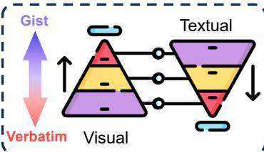
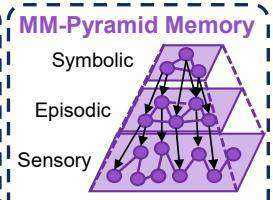
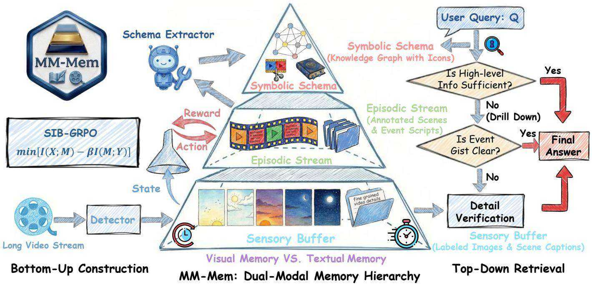
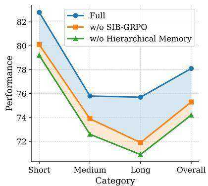
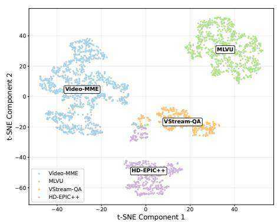
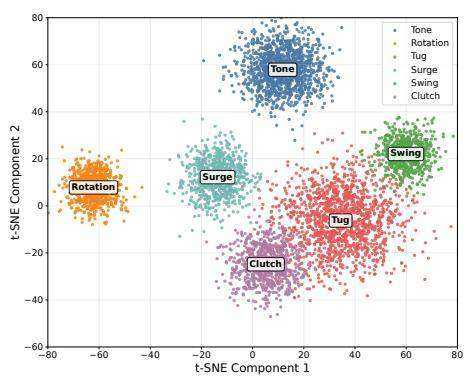
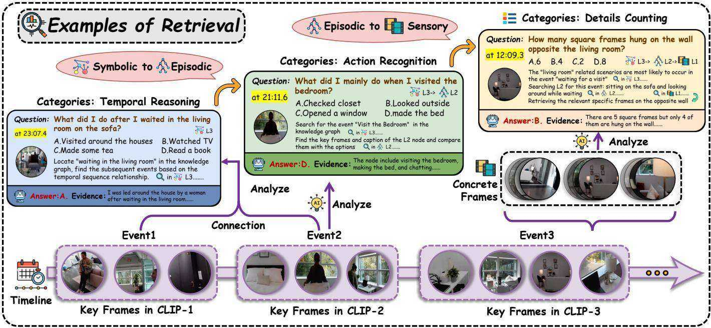

# From Verbatim to Gist: Distilling Pyramidal Multimodal Memory via Semantic Information Bottleneck for Long-Horizon Video Agents

Niu Lian1,2,*, Yuting Wang*, Hanshu Yao2, Jinpeng Wang2, † , Bin Chen2, Yaowei Wang2,3, Min Zhang2, and Shu-Tao Xia1

1Tsinghua Shenzhen International Graduate School, Tsinghua University, 2Harbin Institute of Technology, Shenzhen, 3Peng Cheng Laboratory Equal contribution, Corresponding author.

While multimodal large language models have demonstrated impressive short-term reasoning, they struggle with long-horizon video understanding due to limited context windows and static memory mechanisms that fail to mirror human cognitive efficiency. Existing paradigms typically fall into two extremes: visioncentric methods that incur high latency and redundancy through dense visual accumulation, or text-centric approaches that suffer from detail loss and hallucination via aggressive captioning. To bridge this gap, we propose MM-Mem, a pyramidal multimodal memory architecture grounded in Fuzzy-Trace Theory. MM-Mem structures memory hierarchically into a Sensory Buffer, Episodic Stream, and Symbolic Schema, enabling the progressive distillation of fine-grained perceptual traces (verbatim) into high-level semantic schemas (gist). Furthermore, to govern the dynamic construction of memory, we derive a Semantic Information Bottleneck objective and introduce SIB-GRPO to optimize the trade-off between memory compression and task-relevant information retention. In inference, we design an entropy-driven top-down memory retrieval strategy. Extensive experiments across 4 benchmarks confirm that MM-Mem achieves state-of-the-art performance on both offline and streaming tasks, demonstrating robust generalization and validating the effectiveness of cognition-inspired memory organization.

Keywords: Agent Memory, Long Video Understanding, Information Bottleneck, Fuzzy-Trace Theory

Date: April 19, 2026

Code Repository: https://github.com/EliSpectre/MM-Mem

Contact: 220110904@stu.hit.edu.cn (Niu Lian), wangjp26@gmail.com (Jinpeng Wang)

# 1. Introduction

To transition from passive observers to truly autonomous agents, intelligent systems require a critical cognitive shift toward long-term and persistent memory [5], enabling them to move beyond “here-and-now” perception and interpret continuous, unbounded streams of multimodal information [25]. While recent Multimodal Large Language Models (MLLMs) [18, 14, 15] have enhanced short-term perceptual modeling [37], they lack the efficient memory mechanisms found in human cognition. Specifically, Fuzzy-Trace Theory (FTT) [26], a well-established cognitive model, hypothesizes that human memory is not a

singular recording but consists of two parallel traces: a gist trace that captures abstract semantic meaning and a verbatim trace that preserves fine-grained perceptual details, allowing to retain specific visual evidence when necessary while efficiently managing long-term semantic context without cognitive overload.

However, existing MLLM-based agents typically fail to strike this biological balance, generally falling into one of two extremes. Vision-centric paradigms, such as LongVA [42] or VideoRAG [20], attempt to continuously accumulate visual memories (Fig. 1(a)). While aiming for fidelity, these designs often introduce substantial redundancy due to dense frame sampling. Furthermore, traditional MLLMs [2] utilized in these systems often em-

  
(a) Vision-Centric Methods (Redundancy & Overload)   
(b) Text-Centric Methods (Details Loss & Ambiguity)

  
(d) Memory Architecture

  
(c) Verbatim (Vis.) vs Gist (Text.)

  
Figure 1: Existing memory paradigms (a-b), inspiration (c), and our insight (d). (a) Vision-centric methods incur redundancy and high latency due to dense visual memories. (b) Text-centric methods suffer from information loss during captioning, leading to hallucination and ambiguity. (c) The natural complementarity between vision and text neatly aligns with the distinction between verbatim and gist traces in Fuzzy-Trace Theory. (d) Our MM-Mem is a bottom-up multimodal memory pyramid from sensory buffer to symbolic schema.

phasize low-level visual details while overlooking highlevel semantic attributes [19], making it difficult to preserve long-term temporal dependencies. Conversely, textcentric paradigms [27] convert raw videos into structured textual memories (e.g., knowledge graphs) for efficiency (Fig. 1(b)). Yet, this conversion acts as a lossy compression that discards critical visual cues, leading to ambiguity and hallucinations. Moreover, unlike human memory which is highly dynamic, most existing systems remain static. While dynamic memory management is studied in Large Language Models (LLMs) [44], it is under-explored in multimodal settings. Even recent attempts like A-Mem [38] remain text-centric, lacking multimodal grounding for long-horizon reasoning.

To bridge this gap, we propose MM-Mem, a novel hierarchical pyramidal multimodal memory architecture inspired directly by the principles of FTT. As illustrated in Fig. 1(c) and (d), MM-Mem is inspired by the complementarity between visual and textual modalities and the distinction between verbatim and gist traces in FTT. Importantly, this connection is realized through crossmodal fusion rather than a rigid one-to-one layer mapping: visual representations predominantly preserve ver-

batim perceptual evidence, while textual representations mainly encode gist-level semantics. Built upon this principle, MM-Mem spans from perception to cognition across three layers: a Sensory Buffer for fine-grained visual evidence, an Episodic Stream for event-level summaries, and a Symbolic Schema for high-level semantic abstraction. This bottom-up construction progressively transforms perceptual signals into cognitive knowledge.

Crucially, to coordinate transitions across memory layers, we establish a dual mechanism for adaptive construction and efficient retrieval. For memory construction, inspired by the Information Bottleneck theory [30], we derive a principled objective that retains maximal semantic content under a limited budget. Building on this formulation, we propose SIB-GRPO (Semantic-Information Bottleneck GRPO) to balance semantic preservation against redundancy reduction. For retrieval, we further introduce an entropy-driven top-down strategy: the agent starts from the abstract Symbolic Schema (gist) and progressively “drills down” to the Episodic Stream and Sensory Buffer only when decision uncertainty is high, retrieving finegrained perceptual traces (verbatim) as needed.

To assess this paradigm, we conduct extensive evaluations on 4 challenging benchmarks, covering both offline long-video understanding and online streaming settings. Empirical results demonstrate that MM-Mem not only achieves a new state-of-the-art among open-source MLLMs and agentic systems by notable margins, but also exhibits competitive reasoning capabilities against proprietary models. Qualitative analyses and memory topology visualizations further reveal that MM-Mem can successfully decouple semantic “gist” from visual “verbatim” details, allowing the agent to perform precise detail verification without succumbing to the cognitive overload typical of vision-centric methods. These findings may inspire the development of robust and generalizable cognitive infrastructure for long-horizon autonomous agents.

# Our contributions are summarized as follows:

• We propose MM-Mem, a pyramidal multimodal memory architecture grounded in Fuzzy-Trace Theory that bridges the gap between fine-grained perception and high-level cognition.   
• We introduce SIB-GRPO, grounded in the Information Bottleneck principle, to optimize bottom-up memory construction by distilling knowledge from redundancy.   
• We design an entropy-driven top-down memory retrieval strategy that adaptively “drills down” from schemas to details under high uncertainty, ensuring efficient and precise verification.   
• Extensive experiments on four benchmarks demonstrate that MM-Mem achieves state-of-the-art performance and robust generalization across both offline and streaming scenarios.

# 2. Related Work

# 2.1. Long Video Understanding

While multimodal large language models (MLLMs) have substantially extended vision-language capabilities from images to videos [18, 14, 2, 43], long-video understanding remains constrained by limited context windows. Existing solutions generally fall into two paradigms. Visioncentric methods enhance context via dense sampling or token compression [42, 16, 9], with some incorporating auxiliary textual evidence [20]. Despite improved visual coverage, these approaches often suffer from high computational redundancy and inefficiency. Conversely, Textcentric approaches convert videos into captions or structured textual memories for efficiency [31, 35, 3, 27, 33]. However, such conversion inevitably discards fine-grained visual cues and weakens perceptual grounding, thereby degrading complex reasoning over subtle details.

To bridge this gap, we propose a hierarchical pyramidal multimodal memory that unifies high-level textual memory for coarse localization and low-level visual memory for fine-grained retrieval, achieving a better balance between efficiency and visual fidelity [8].

# 2.2. Memory for Agents

Memory mechanisms have been widely studied in agents built upon large language models (LLMs). Existing approaches span cache-like hierarchical designs [23], forgetting-curve-inspired memory management [44], associative memory linking [38], and reinforcement learning-based memory control [39]. However, these systems, including LicoMemory [11], remain largely textcentric, limiting their ability to align information across modalities and to preserve the rich structural properties of real-world experiences.

In contrast, memory systems for multimodal agents remain relatively underexplored. Prior work such as M3-Agent [19] typically relies on predefined memory structures and fixed operational workflows, which may constrain generalization in open-ended, long-horizon environments. These limitations highlight the need for a flexible and generalizable memory framework that can support long-term multimodal interactions.

# 3. Method

We propose MM-Mem, a multimodal memory architecture that helps agents perceive and understand the world. MM-Mem uses a bottom-up, offline-built hierarchical memory pyramid, spanning from a perception level Sensory Buffer that retains fine-grained visual evidence to a

semantics level Symbolic Schema that stores high level textual abstractions. For long-horizon interaction, we introduce SIB-GRPO for dynamic memory management, which removes redundant memories while preserving task relevant semantics. We further design a top-down hierarchical retrieval mechanism guided by predictive entropy, which adaptively selects the retrieval depth to balance evidence coverage and resource constraints.

# 3.1. Multimodal Pyramid Memory Structure

Rather than physically decoupling modalities into isolated tracks, our three-layer hierarchy maintains integrated multimodal representations across all levels. While we conceptually map visual data to verbatim traces and textual data to gist traces inspired by FTT, both modalities coexist throughout the pyramid. The memory construction evolves through a representational shift: it begins as a vision-dominant multimodal memory at the bottom for fine-grained perception, and progressively distills into a text-dominant representation at the top for high-level cognitive abstraction.

Sensory Buffer. Given a long video stream $\nu$ , we apply content-adaptive temporal segmentation to obtain clips $\mathcal { C } = \left\{ c _ { t } \right\}$ (e.g., PySceneDetect). For each clip $c _ { t } .$ , we identify salient temporal indices $S _ { t }$ based on inter-frame variation and construct short key sub-clips centered at these indices (details in Appendix C). Sensory memory is instantiated as

$$
\mathcal {M} _ {\text {s e n s}} = \left\{\left(\mathbf {v} _ {t, i}, \mathbf {l} _ {t, i}, \tau_ {t, i}\right) \mid i \in \mathcal {S} _ {t}, c _ {t} \in \mathcal {C} \right\}, \tag {1}
$$

where $\mathbf { v } _ { t , i }$ is the visual representation, $\mathbf { l } _ { t , i }$ is the associated text trace (e.g., subtitles or clip captioning), and $\tau _ { t , i }$ is the temporal location (e.g., center-frame timestamp). Crucially, at this vision-dominant foundational layer, the text trace $\mathbf { l } _ { t , i }$ is strongly bound to its visual counterpart and functions as an auxiliary component. Rather than acting as an independent or high-level semantic representation, the text serves purely as a descriptive label for visual entities. It provides a semantic anchor to help index and isolate the dense, highly redundant verbatim visual details.

Episodic Stream. Following selective encoding and temporal contiguity [5], we construct an Episodic Stream by consolidating sensory entries from $\mathcal { M } _ { \mathrm { s e n s } }$ . Each sensory item is $m _ { t , i } = \left( \mathbf { v } _ { t , i } , \mathbf { l } _ { t , i } , \tau _ { t , i } \right) \in \mathcal { M } _ { \mathrm { s e n s } }$ . We maintain an ordered episodic sequence $\mathcal { M } _ { \mathrm { e p i } }$ , with the latest retained node $e ^ { \star } = \big ( \mathbf { e } ^ { \star } , \mathbf { l } ^ { \star } , \tau ^ { \star } \big )$ .

For each $m _ { t , i }$ , a decision operator $\psi ( \cdot )$ updates the stream:

$$
a _ {t, i} = \psi \left(m _ {t, i}, e ^ {\star}\right), \quad a _ {t, i} \in \mathcal {O}, \tag {2}
$$

  
Figure 2: Overview of MM-Mem: MM-Mem unifies visual and textual memory through (left) a bottom-up memory construction process, which transforms raw sensory frames into abstract symbolic schemas, and (right) a top-down retrieval process that supports query-adaptive reasoning.

where ?? = {ADD_NEW, MERGE, DISCARD}. ADD_NEW appends a node initialized from $m _ { t , i }$ ; MERGE integrates $m _ { t , i }$ into $e ^ { \star }$ ; and DISCARD removes redundant or low-novelty items. A single chronological pass over $\mathcal { M } _ { \mathrm { s e n s } }$ yields a compact episodic stream.

To obtain event-level abstractions, we cluster retained visual representations (e.g., via $K$ -means) and select representative prototypes as summaries. The resulting episodic memory is

$$
\mathcal {M} _ {\mathrm {e p i}} = \left\{\left(\mathbf {e} _ {k}, \mathbf {l} _ {k}, \tau_ {k}\right) \right\} _ {k = 1} ^ {| \mathcal {M} _ {\mathrm {e p i}} |}, \tag {3}
$$

where $\mathbf { e } _ { k }$ is the representation of the $k$ -th episodic unit, $\mathbf { l } _ { k }$ aggregates its associated textual traces, and $\tau _ { k }$ records its temporal span.

Symbolic Schema. To support cross-episode reasoning [5], we build a Symbolic Schema as a knowledge graph $\mathcal { G } ~ = ~ \left( \mathcal { N } , \mathcal { E } \right)$ over episodic memory $\mathcal { M } _ { \mathrm { e p i } }$ . An MLLM extracts entities and glosses from each episodic unit $e _ { k } \in \mathcal { M } _ { \mathrm { e p i } }$ , unifying them into a global prototype set $\mathcal { U }$ with aggregated glosses $t _ { u }$ .

The graph nodes $\mathcal { N } = \{ v _ { k } \} \cup \mathcal { U }$ comprise episodic units and prototypes. The edges $\mathcal { E }$ contain optional semantic relations $u _ { p } \overset { r } {  } u _ { q }$ and, crucially, grounding edges $\left( v _ { k } , u \right)$ . These grounding edges serve as explicit multimodal pointers: rather than collapsing into a unimodal textual graph, they tightly anchor text-dominant concepts (semantic

gist) back to specific episodic units (retaining verbatim visual evidence).

Thus, symbolic memory is instantiated as a text-driven multimodal index:

$$
\mathcal {M} _ {\mathrm {s y m}} = \left\{\left(u, t _ {u}, \mathcal {P} _ {u}\right) \right\} _ {u \in \mathcal {U}}, \tag {4}
$$

where $\mathcal { P } _ { u } = \left\{ v _ { k } ~ \vert ~ \left( v _ { k } , u \right) \in \mathcal { E } \right\}$ denotes the visual pointers for concept $u$ . This design enables efficient high-level cognitive reasoning while preserving dynamic drill-down to concrete visual details.

# 3.2. Bottom-Up Memory Construction

A bottom-up pipeline transforms raw videos into a threelevel memory hierarchy: Sensory Buffer, Episodic Stream, and Symbolic Schema. Fine-grained perceptual signals are retained in the Sensory Buffer; segments are organized into compact event traces in the Episodic Stream; and structured knowledge is consolidated in the Symbolic Schema over longer time scales.

During Sensory-to-Episodic construction, redundancy must be compressed while preserving task-relevant semantics and controlling memory growth. We introduce SIB-GRPO to fine-tune the memory manager with reinforcement learning, enabling adaptive generation of information-dense episodic traces. Crucially, driven by SIB-GRPO, this bottom-up construction is not merely a process of data reduction; it orchestrates a smooth transi-

tion in modality dominance. The system progressively distills high-information-density textual gist from the heavily redundant visual verbatim traces, naturally aligning with the principles of Fuzzy-Trace Theory. We next describe the Sensory-to-Episodic pipeline and optimization.

# 3.2.1. Sensory-to-Episodic Memory

Given a sensory buffer $\mathcal { M } _ { \mathrm { { s e n s } } } = \left\{ m _ { t , i } = \left( \mathbf { v } _ { t , i } , \mathbf { l } _ { t , i } , \tau _ { t , i } \right) \right\}$ , we construct a compact episodic stream $\mathcal { M } _ { \mathrm { e p i } }$ that retains task-relevant semantics for downstream reasoning while discarding redundant, low-novelty details. Let X denote the sensory memory content (a temporally local window from $\mathcal { M } _ { \mathrm { s e n s } }$ together with the latest episodic node $e ^ { \star }$ ), and let $M$ denote the episodic representation produced by a stochastic encoder (memory manager) $p _ { \theta } ( m \mid x )$ . We cast this Sensory-to-Episodic conversion as stochastic compression, where a memory manager serves as an encoder mapping sensory X to episodic memory $M$ .

Remark: Action-output correspondence. Under fixed update rules, $\mathcal { O }$ uniquely determines $M$ (see Appendix A.3).

Semantic IB Formulation. Let X denote the sensory memory content (a temporally local window from $\mathcal { M } _ { \mathrm { s e n s } }$ together with the latest episodic node $e ^ { \star }$ ), and let M denote the episodic representation produced by a stochastic encoder (memory manager) $p _ { \theta } ( m \mid x )$ . We adopt an Information Bottleneck (IB) objective [30]:

$$
\min  _ {p _ {\theta} (m \mid x)} [ I (X; M) - \beta I (M; Y) ], \tag {5}
$$

where Y is the supervision label (ground-truth VQA answer) and $\beta$ controls the compression–prediction tradeoff. Here $I ( \cdot ; \cdot )$ denotes the mutual information between two random variables.

To obtain a tractable training objective, we introduce a variational decoder $q _ { \phi } ( y \mid m )$ to approximate $p _ { \theta } ( y \mid m )$ and a variational prior $r ( m )$ to approximate the marginal $p _ { \theta } ( m )$ . We define

$$
\mathcal {L} _ {\mathrm {p}} (\theta , \phi) \triangleq \mathbb {E} _ {p (x, y) p _ {\theta} (m | x)} \left[ \log q _ {\phi} (y \mid m) \right], \tag {6}
$$

$$
\mathcal {L} _ {\mathrm {c}} (\theta) \triangleq \mathbb {E} _ {p (x)} \left[ D _ {\mathrm {K L}} \left(p _ {\theta} (m \mid x) \| r (m)\right) \right]. \tag {7}
$$

As shown in Appendix A, ${ \mathcal { L } } _ { \mathfrak { p } }$ lower-bounds $I ( M ; Y )$ up to an additive constant $H ( Y )$ , and $\mathcal { L } _ { \mathrm { c } }$ upper-bounds $I ( X ; M )$ . Therefore, dropping the constant $H ( Y )$ , we optimize the following variational IB objective:

$$
\max  _ {\theta , \phi} \beta \mathcal {L} _ {\mathrm {p}} (\theta , \phi) - \mathcal {L} _ {\mathrm {c}} (\theta). \tag {8}
$$

A Quality–Quantity Prior. To encode an explicit quality– quantity trade-off in episodic memory, we adopt the prior

$$
r (m) \propto \underbrace {p _ {\text {r e f}} (m)} _ {\text {Q u a l i t y}} \cdot \underbrace {e ^ {- \lambda | m |}} _ {\text {Q u a n t i t y}}, \tag {9}
$$

where $\lambda$ is a hyperparameter, $| m |$ is the token length of textual trace at an Episodic Stream node, and $p _ { \mathrm { r e f } }$ is a teacher distribution promoting fluent, general-purpose memory expressions while anchoring the policy to a trusted prior. This factorization yields an IB regularizer consisting of a length penalty and a KL term to the teacher, resembling RLHF-style trust-region objectives.

SIB-GRPO: Dynamic Management. While the IB objective provides a principled semantic compression criterion, the episodic trace is generated discretely (LLM-style) and must be optimized with sequence-level feedback. We therefore train the Memory Manager as a policy $\pi _ { \boldsymbol { \theta } } ( { \boldsymbol { m } } \mid s )$ using reinforcement learning, where $s = \left( x , M _ { \mathrm { o l d } } \right)$ and the action is a textual trace m appended to ℳepi. $\mathcal { M } _ { \mathrm { e p i } }$

For each sampled $m$ , we compute designed scalar reward

$$
\begin{array}{l} r (s, m) \triangleq \underbrace {R _ {\mathrm {v q a}} (s , m)} _ {\text {T a k R e w a r d}} - \underbrace {\beta_ {1} \cdot \operatorname {L e n g t h} (m)} _ {\text {f r o m} e ^ {- \lambda | m |}} \\ - \underbrace {\beta_ {2} \cdot \log \frac {\pi_ {\theta_ {\text {o l d}}} (m \mid s)}{\pi_ {\text {r e f}} (m \mid s)}} _ {\text {f r o m} p _ {\text {r e f}} (m)}. \tag {10} \\ \end{array}
$$

Here $\pi _ { \mathrm { r e f } }$ (equivalently $p _ { \mathrm { r e f } } )$ is a fixed reference policy/distribution. In practice, the log-ratio is evaluated on sampled $m$ from the behavior policy $\pi _ { \theta _ { \mathrm { o l d } } }$ and serves as a KL-style regularizer that anchors $\pi _ { \theta }$ to $\pi _ { \mathrm { r e f } }$ .

Given a state $s = \left( x , M _ { \mathrm { o l d } } \right)$ , we sample a group of $G$ candidate episodic traces $\{ m _ { i } \} _ { i = 1 } ^ { G } \sim \pi _ { \theta _ { \mathrm { o l d } } } ( \cdot \mid s )$ , compute their scalar rewards $\{ r _ { i } \} _ { i = 1 } ^ { G }$ , and construct a standardized group-relative advantage $A _ { i }$ (computed by normalizing each $r _ { i }$ within the group). We then optimize a PPO-style clipped surrogate using the importance ratio $\rho _ { i } ( \theta ) = \pi _ { \theta } ( m _ { i } \mid s ) / \pi _ { \theta _ { \mathrm { o l d } } } ( m _ { i } \mid s ) .$ , where $\epsilon$ controls the clipping range. The resulting SIB-GRPO objective is

$$
J _ {\mathrm {S I B - G R P O}} (\theta) = \mathbb {E} _ {s, \{m _ {i} \} \sim \pi_ {\theta_ {\text {o l d}}}} \left[ \frac {1}{G} \sum_ {i = 1} ^ {G} \min  \right. \tag {11}
$$

$$
\left. \left(\rho_ {i} (\theta) A _ {i}, \operatorname {c l i p} \left(\rho_ {i} (\theta), 1 - \epsilon , 1 + \epsilon\right) A _ {i}\right) \right],
$$

In practice, we minimize −JSIB-GRPO(θ) as training loss.

# 3.3. Entropy-Driven Top-Down Retrieval

A top-down, coarse-to-fine retrieval strategy is adopted, querying memory from high-level semantic abstractions

to progressively finer perceptual evidence. Retrieval begins at the Symbolic Schema level via text to rapidly instantiate the semantic gist. If uncertainty persists, the query descends to lower layers and may terminate at the Episodic layer once sufficient evidence is obtained; only when ambiguity remains is it routed to the Sensory Buffer, retrieving CLIP-encoded visual keyframes to resolve decisions with local visual details.

This design follows Reverse Hierarchy Theory [10], which posits that perception is initiated with high-level vision at a glance and refined by low-level vision with scrutiny when fine-grained discrimination is required.

Formally, given a question $\mathcal { Q }$ and a candidate answer set $\mathcal { A } = \left\{ a _ { 1 } , \ldots , a _ { N } \right\}$ , each retrieval step s returns evidence $R _ { s }$ . Given accumulated evidence $R _ { \leq s }$ , a posterior distribution $p ( a _ { i } \mid \mathcal { Q } , R _ { \leq s } )$ is maintained over candidates. For notational convenience, let

$$
p _ {i} ^ {(s)} \triangleq p (a _ {i} \mid \mathcal {Q}, R _ {\leq s}). \tag {12}
$$

The entropy of this answer distribution is used as an adaptive stopping criterion:

$$
H _ {s} (\mathcal {Q}) = - \sum_ {i = 1} ^ {N} p _ {i} ^ {(s)} \log p _ {i} ^ {(s)}. \tag {13}
$$

Retrieval is terminated when $H _ { s } ( \mathcal { Q } ) \leq \gamma _ { : }$ , or when the entropy reduction $\Delta H _ { s } = H _ { s - 1 } ( \mathcal { Q } ) - H _ { s } ( \mathcal { Q } )$ falls below a small $\epsilon$ for several consecutive steps, and the most probable answer is returned: arg maxa ∈?? p . $\operatorname* { m a x } _ { a _ { i } \in \mathcal { A } } p _ { i } ^ { ( s ) }$ Intuitively, rapid semantic narrowing of $\mathcal { A }$ is enabled by high-level text retrieval, whereas low-level keyframe retrieval is invoked only under high entropy, yielding a compute– accuracy trade-off that adapts to question difficulty.

# 4. Experiment

# 4.1. Experimental Setup

Benchmarks. Four benchmarks are comprehensively evaluated. (i) Standard long-video datasets. Video-MME [6] covers three length regimes, namely short $( < 2$ min), medium (4–15 min), and long (30–60 min), with 300 videos each (900 total) and 2,700 questions; we report both with-subtitle and without-subtitle settings. MLVU [45] dev set includes nine tasks with videos from 3 min to $2 \mathrm { ~ h ~ }$ (avg. ${ \sim } 1 2 \ \mathrm { m i n }$ ). (ii) Standard online streaming dataset. VStream-QA [41] contains VStream-QA-Ego and VStream-QA-Movie for egocentric and third-person narrative understanding. (iii) A derived egocentric long-video dataset. We built HD -EPIC $^ { + + }$ from HD -EPIC [24] by re-splitting train/test, comprising 156 videos; details see Appendix B.1.

Evaluation protocol. For comparison, we follow baseline settings. For Video-MME, MLVU, and HD -EPIC $^ { + + }$ , accuracy is used as the evaluation metric. Since VStream-QA consists of open-ended questions, gpt-4o-mini [12] is leveraged as an automatic judge. We report both accuracy and the averaged score on VStream-QA. Implementation details and evaluation scripts are provided in Appendix D.

Implementation details. Experiments are conducted on NVIDIA A100 80GB GPUs. MM-Mem uses Qwen3- VL-8B [2] as the base model. For text retrieval, we use bge-large-en-v1.5 [36] and bge-reranker-v2-m3 [22]. For visual retrieval, we use clip-level retrieval by jointly scoring keyframes per clip; CLIP-style embeddings come from the base model’s vision encoder. Models are served with vLLM, and fine-tuning is performed under SWIFT with SIB -GRPO. We set $\beta _ { 1 } = 0 . 1$ , $\beta _ { 2 } = 0 . 3$ , and temperature to 0.0. Hyperparameters are provided in Appendix D.

# 4.2. Comparison with State-of-the-arts

Long Video Understanding. Baselines follow each benchmark leaderboard and common protocols in prior work, covering (a) proprietary multimodal models, (b) open-source MLLMs, and (c) agent-based systems for long-horizon video understanding. As shown in Table 1, MM-Mem consistently outperforms prior agent systems. Compared with the strongest agent baseline Vgent, MM-Mem yields a ${ \bf 5 . 1 \% }$ relative gain on Video-MME (both w/o- and w/-subtitle) and a $7 . 1 \%$ gain on MLVU in M-Avg. Despite using Qwen3-VL-8B as the backbone, MM-Mem surpasses all compared open-source MLLMs (e.g., Qwen2-VL-72B) and is competitive with strong proprietary models such as Gemini $1 . 5 \mathrm { \ P R o }$ .

Online Streaming Video Understanding. Unlike most prior work that evaluates only on long-video benchmarks, long-video understanding primarily targets an offline setting, where the model is provided with the user query and a single video clip of finite length at the same time. To better approximate real-world online video-stream scenarios, we additionally evaluate on the streaming benchmark VStream-QA-Ego. As shown in Table 2, MM-Mem remains effective for long-horizon streaming inputs, improving over the previous best method Flash-VStream by ${ \boldsymbol { 5 . 9 \% } }$ and $5 . 2 \%$ in terms of Accuracy and Score, respectively.

Egocentric Long Video Understanding. Table 3 reports accuracy on HD -EPIC $+ +$ . Our MM-Mem achieves $\mathbf { 3 0 . 2 8 \% }$ , outperforming all baselines. It exceeds the strongest competitor (Qwen3-VL-8B) by $+ 4 . 4 0$ points (30.28 vs. 25.88), and also surpasses LLaVA-Video-7B

Table 1: Comparison on two long-video understanding benchmarks: Video-MME and MLVU. For Video-MME, we report results under both settings (w/ = with subtitles; w/o $=$ without subtitles). For MLVU, we report M-Avg. Most baseline results are taken from the official leaderboards (as of 2026-01-01) or the respective papers. Results not reported in the original sources are marked with “–“. For agent-based systems, we report the best-performing configuration with a comparable parameter scale.   

<table><tr><td rowspan="3">Method</td><td colspan="8">Video-MME</td><td>MLVU</td></tr><tr><td colspan="2">Short</td><td colspan="2">Medium</td><td colspan="2">Long</td><td colspan="2">Overall</td><td rowspan="2">M-Avg</td></tr><tr><td>w/o</td><td>w/</td><td>w/o</td><td>w/</td><td>w/o</td><td>w/</td><td>w/o</td><td>w/</td></tr><tr><td colspan="10">Proprietary Models</td></tr><tr><td>Gemini 1.5 Pro [29]</td><td>81.7</td><td>84.5</td><td>74.3</td><td>81.0</td><td>67.4</td><td>77.4</td><td>75.0</td><td>81.3</td><td>-</td></tr><tr><td>GPT-4o [12]</td><td>80.0</td><td>82.8</td><td>70.3</td><td>76.6</td><td>65.3</td><td>72.1</td><td>71.9</td><td>77.2</td><td>64.6</td></tr><tr><td>Gemini 1.5 Flash [29]</td><td>78.8</td><td>79.8</td><td>68.8</td><td>74.7</td><td>61.1</td><td>68.8</td><td>70.3</td><td>75.0</td><td>-</td></tr><tr><td>GPT-4V [1]</td><td>70.5</td><td>73.2</td><td>55.8</td><td>59.7</td><td>53.5</td><td>56.9</td><td>59.9</td><td>63.3</td><td>49.2</td></tr><tr><td colspan="10">Open-Sourced MLLMs</td></tr><tr><td>Qwen2-VL-72B [32]</td><td>80.1</td><td>82.2</td><td>71.3</td><td>76.8</td><td>62.2</td><td>74.3</td><td>71.2</td><td>77.8</td><td>-</td></tr><tr><td>LLaVA-Video-72B [43]</td><td>81.4</td><td>82.8</td><td>68.9</td><td>75.6</td><td>61.5</td><td>72.5</td><td>70.6</td><td>76.9</td><td>73.1</td></tr><tr><td>Qwen3-VL-8B [2]</td><td>76.4</td><td>79.2</td><td>62.3</td><td>72.6</td><td>55.9</td><td>70.8</td><td>64.9</td><td>74.2</td><td>65.9</td></tr><tr><td>VideoLLaMA 3-7B [40]</td><td>80.1</td><td>80.2</td><td>63.7</td><td>69.6</td><td>54.9</td><td>61.0</td><td>66.2</td><td>70.3</td><td>73.0</td></tr><tr><td>VideoLLaMA 2-72B [4]</td><td>69.8</td><td>72.0</td><td>59.9</td><td>63.0</td><td>57.6</td><td>59.0</td><td>62.4</td><td>64.7</td><td>-</td></tr><tr><td>VITA 1.5-7B [7]</td><td>67.0</td><td>69.9</td><td>54.2</td><td>55.7</td><td>47.1</td><td>50.4</td><td>56.1</td><td>58.7</td><td>60.4</td></tr><tr><td>Long-LLaVA-7B [34]</td><td>61.9</td><td>66.2</td><td>51.4</td><td>54.7</td><td>45.4</td><td>50.3</td><td>52.9</td><td>57.1</td><td>-</td></tr><tr><td>LongVA-7B [42]</td><td>61.1</td><td>61.6</td><td>50.4</td><td>53.6</td><td>46.2</td><td>47.6</td><td>52.6</td><td>54.3</td><td>-</td></tr><tr><td>Video-LLaVA-7B [17]</td><td>45.3</td><td>46.1</td><td>38.0</td><td>40.7</td><td>36.2</td><td>38.1</td><td>39.9</td><td>41.6</td><td>-</td></tr><tr><td colspan="10">Agent-based Systems</td></tr><tr><td>Vgent [27]</td><td>-</td><td>-</td><td>-</td><td>-</td><td>-</td><td>-</td><td>68.9</td><td>74.3</td><td>72.1</td></tr><tr><td>VideoRAG [20]</td><td>-</td><td>67.1</td><td>-</td><td>60.4</td><td>-</td><td>60.1</td><td>60.5</td><td>62.6</td><td>72.4</td></tr><tr><td>VideoMiner [3]</td><td>65.6</td><td>-</td><td>57.5</td><td>-</td><td>52.2</td><td>-</td><td>58.4</td><td>-</td><td>65.1</td></tr><tr><td>VideoTree [35]</td><td>55.5</td><td>-</td><td>49.2</td><td>-</td><td>39.3</td><td>-</td><td>48.0</td><td>-</td><td>60.4</td></tr><tr><td>MM-MEM (Ours)</td><td>81.5</td><td>82.8</td><td>69.6</td><td>75.8</td><td>66.1</td><td>75.7</td><td>72.4</td><td>78.1</td><td>77.2</td></tr></table>

Table 2: Test performance on VStream-QA-Ego.   

<table><tr><td rowspan="2">Method</td><td colspan="2">VStream-QA-Ego</td></tr><tr><td>Accuracy</td><td>Score</td></tr><tr><td>Video-ChatGPT [21]</td><td>51.7</td><td>3.7</td></tr><tr><td>MovieChat [28]</td><td>52.2</td><td>3.4</td></tr><tr><td>Chat-UniVi [13]</td><td>50.9</td><td>3.8</td></tr><tr><td>LLaMA-VID [16]</td><td>54.8</td><td>3.9</td></tr><tr><td>Flash-VStream [41]</td><td>59.0</td><td>3.9</td></tr><tr><td>MM-MEM (Ours)</td><td>62.5</td><td>4.1</td></tr></table>

Table 3: Evaluation on the built HD-EPIC $^ { + + }$ .   

<table><tr><td>Method</td><td>HD-EPIC++Accuracy</td></tr><tr><td>Qwen3-VL-8B [2]</td><td>25.88</td></tr><tr><td>Qwen2.5-VL-7B [2]</td><td>24.37</td></tr><tr><td>LLaVA-Video-7B [2]</td><td>25.37</td></tr><tr><td>VideoLLaMA 3-7B [40]</td><td>20.36</td></tr><tr><td>Qwen3-VL-4B [2]</td><td>24.91</td></tr><tr><td>Qwen3-VL-2B [2]</td><td>22.80</td></tr><tr><td>MM-MEM (Ours)</td><td>30.28</td></tr></table>

and VideoLLaMA 3-7B by $+ 4 . 9 1$ and $+ 9 . 9 2$ points. This suggests MM-Mem better aggregates fine-grained egocentric cues over long temporal contexts.

# 4.3. Ablation Studies

Effectiveness of SIB-GRPO and Pyramid Memory. Figure 3a reports an ablation study over Short, Medium, Long, and Overall splits. Our full model performs best across all categories, indicating positive contributions from each

  
(a) Ablation results.

  
(b) Sensory Buffer Visual Memory.

  
(c) Episodic Stream Visual Memory   
Figure 3: Visualization of ablation results and memory representations.

component. Removing SIB-GRPO consistently degrades performance, with the largest drop on Long, suggesting its importance for consolidation under long temporal dependencies. Further removing the Pyramid (hierarchical) memory yields an additional decrease, again most pronounced on Long and Overall. These results show that pyramid memory complements SIB-GRPO by organizing information at multiple temporal/semantic granularities, improving retention and retrieval for long-horizon reasoning. Additional ablations and hyper-parameter analyses are provided in Appendix F.

Topology of the Cognitive Memory Space. To qualitatively assess the structure of our hierarchical memory, we project memory embeddings to 2D with t-SNE. Figure 3b (Middle) shows Sensory Buffer representations across benchmarks: the clear separation between egocentric $\scriptstyle \left( \mathrm { H D - E P I C + + } \right)$ and cinematic (Video-MME) domains indicates that the L1 layer preserves domain-specific visual details without collapse. Figure 3c (Right) visualizes the Episodic Stream, where semantic clusters emerge naturally (e.g., ‘Rotation’ vs. ‘Swing’), suggesting that RL-driven consolidation suppresses noise and promotes abstraction from sensory signals to higher-level reasoning.

# 4.4. Efficiency and Deployment Analysis

We analyze the efficiency of MM-Mem on Video-MME without subtitles, covering the Short, Medium, and Long splits. Since runtime is highly correlated with raw video duration, we normalize all timing metrics by the time required to process one minute of video, ensuring fair and comparable evaluation. We report Peak VRAM, Memory Construction Time, and Inference Latency. Here, N/A denotes results that we are unable to reproduce due to closed-source implementations or insufficient implementation details.

Table 4: Efficiency comparison on Video-MME without subtitles. Con. Time denotes construction time, and Infer. Latency denotes inference latency. All timing metrics are normalized to the time required to process one minute of video.   

<table><tr><td>Method</td><td>VRAM(GB)</td><td>Con. Time(s)</td><td>Infer. Latency(s)</td></tr><tr><td colspan="4">Proprietary MLLMs</td></tr><tr><td>VideoAgent</td><td>N/A</td><td>N/A</td><td>67.25</td></tr><tr><td colspan="4">Open-Source MLLMs</td></tr><tr><td>Qwen3-VL-8B</td><td>22.8</td><td>N/A</td><td>6.47</td></tr><tr><td>Video-RAG</td><td>23.0</td><td>N/A</td><td>25.93</td></tr><tr><td>Vgent</td><td>18.7</td><td>20.18</td><td>7.38</td></tr><tr><td>MM-Mem (Ours)</td><td>17.8</td><td>19.54</td><td>5.35</td></tr></table>

# 4.5. Qualitative Analysis

As shown in Table 4, MM-Mem achieves a favorable tradeoff among construction cost, online latency, and GPU memory usage. Its offline memory construction can be amortized across multiple queries for the same video, which is especially beneficial in Video-MME-style settings. Meanwhile, MM-Mem supports efficient online inference, requiring only 5.35s per minute of video, with 19.54s per minute for memory construction. Moreover, MM-Mem reduces deployment cost by relying on compact high-level textual memory, reaching only 17.8 GB peak VRAM on an NVIDIA A100, lower than Qwen3-VL-8B and Video-RAG.

To provide more intuitive insights, we present several representative examples in Figure 4. For Temporal Reasoning, MM-Mem primarily operates over knowledge graph in Symbolic Schema, where high level semantic abstractions and relational structure allow it to recover the temporal order of actions without directly revisiting low level visual details. For Action Recognition, MM-Mem further drills down into Episodic Stream, where temporally localized visual evidence, aligned with event-level summaries, enables the recognition of more fine-grained actions in the current scene. For detail-sensitive tasks such as Details Counting, MM-Mem descends all the way to Sensory

  
Figure 4: A qualitative example of MM-Mem’s coarse-to-fine retrieval across memory layers.

Buffer, where concrete visual cues at a finer granularity can be retrieved to support precise verification.

Overall, these examples illustrate that the pyramidal multimodal memory of MM-Mem supports a coarse-to-fine retrieval process across memory layers, allowing the model to progressively move from abstract semantic reasoning to detailed perceptual verification as task demands increase. This design not only improves prediction accuracy, but also effectively exploits the complementary strengths of textual and visual representations.

# 5. Conclusion

In this work, we present MM-Mem, a pyramidal multimodal memory framework grounded in Fuzzy-Trace Theory. By structurally decoupling verbatim visual details from gist semantic schemas, MM-Mem effectively bridges the gap between fine-grained perception and highlevel cognition. To govern memory construction, we propose SIB-GRPO, an information-theoretic approach for dynamic, redundancy-aware compression. Complementing this, we introduce an entropy-driven top-down retrieval strategy that adaptively drills down from abstract symbolic schemas to fine-grained sensory details under high uncertainty, ensuring efficient and precise information access. Extensive experiments demonstrate that MM-Mem achieves state-of-the-art performance and robust generalization, inspiring foundational cognitive infrastructure for long-horizon autonomous agents.

# Limitations

While MM-Mem demonstrates robust performance in long-horizon video understanding, we identify several avenues for future optimization and research. (i) Computational Overhead vs. Reasoning Depth: Our hierarchical architecture prioritizes precise, multi-granularity reasoning, which naturally incurs a higher computational cost during the construction phase compared to flat, compression-heavy models. However, the modular nature of the Sensory, Episodic, and Symbolic layers allows for asynchronous processing and parallelization. Future work will explore distilling the memory construction pipeline to further reduce latency for resource-constrained edge deployment. (ii) Dependency on Upstream Perception: As a modular system, MM-Mem benefits from the rapid advancements in upstream vision encoders and captioners. While the system effectively filters irrelevant information via top-down retrieval, we anticipate that integrating stronger, end-to-end trained perception backbones will further enhance the system’s robustness against visual artifacts. (iii) Generalization to Unsupervised Scenarios: The current memory manager utilizes task-driven reinforcement learning (SIB-GRPO) to align memory retention with reasoning needs. Extending this mechanism to fully unsupervised or self-supervised settings—where explicit task signals are absent—represents an exciting direction for enabling autonomous, “lifelong” learning agents. (iv) Evolution towards Lifelong Agents: Our evaluation focuses on standard long-video benchmarks. To better address true real-world deployment involving continuous, multisession interactions with distribution shifts, we plan to

extend MM-Mem to support dynamic memory updating and forgetting mechanisms better suited for open-ended, continuous agentic scenarios.

# Ethics Statement

Our research advances the capability of multimodal agents to process and remember long-form video content. We recognize the importance of responsible AI development and address the following considerations. (i) Privacy and Data Protection: Memory-augmented agents inevitably process visual data that may contain personally identifiable information (PII). While our experiments utilize public, consented datasets, real-world deployment requires strict adherence to data minimization principles. We advocate for implementing local storage solutions and rigorous access controls to prevent unintended data disclosure. (ii) Bias Mitigation: Intelligent agents may inherit biases present in the training data or upstream foundation models. The selective nature of memory construction could theoretically retain biased evidence if not carefully managed. We encourage continuous monitoring of the memory selection policy and the adoption of diverse benchmarks to ensure fair and representative reasoning outcomes. (iii) Responsible Deployment: As with any powerful multimodal system, there is a potential for misuse in high-stakes decision-making. We emphasize that MM-Mem is designed as an assistive tool to augment human capabilities. Deployments in sensitive domains should always incorporate human-in-the-loop oversight to ensure reliability and accountability.

# Use of AI Assistants

We used large language models (e.g., ChatGPT and Gemini) in a lawful and policy-compliant manner solely for non-substantive assistance such as translation and language polishing of the manuscript. They were not used to generate experimental results, derive scientific claims, or make methodological decisions; all technical content and conclusions are authored and verified by the authors.

# Acknowledgments

We thank the anonymous reviewers and chairs for their efforts and constructive suggestions. This work is supported in part by the National Natural Science Foundation of China under grants 62521006, 624B2088, 62536003, 62571298, and 62576122.
