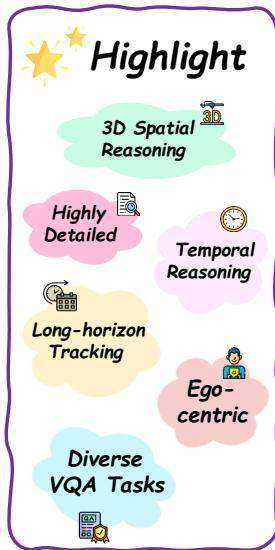
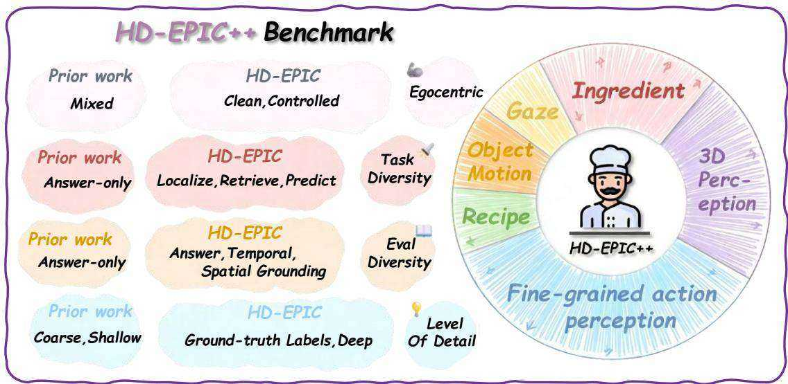

[1] Josh Achiam, Steven Adler, Sandhini Agarwal, Lama Ahmad, Ilge Akkaya, Florencia Leoni Aleman, Diogo Almeida, Janko Altenschmidt, Sam Altman, Shyamal Anadkat, et al. Gpt-4 technical report. arXiv preprint arXiv:2303.08774, 2023.   
[2] Shuai Bai, Keqin Chen, Xuejing Liu, Jialin Wang, Wenbin Ge, Sibo Song, Kai Dang, Peng Wang, Shijie Wang, Jun Tang, et al. Qwen2. 5-vl technical report. arXiv preprint arXiv:2502.13923, 2025.   
[3] Xinye Cao, Hongcan Guo, Jiawen Qian, Guoshun Nan, Chao Wang, Yuqi Pan, Tianhao Hou, Xiaojuan Wang, and Yutong Gao. Videominer: Iteratively grounding key frames of hour-long videos via treebased group relative policy optimization. In Proceedings of the IEEE/CVF International Conference on Computer Vision, pages 23773–23783, 2025.   
[4] Zesen Cheng, Sicong Leng, Hang Zhang, Yifei Xin, Xin Li, Guanzheng Chen, Yongxin Zhu, Wenqi Zhang, Ziyang Luo, Deli Zhao, et al. Videollama 2: Advancing spatial-temporal modeling and audio understanding in video-llms. arXiv preprint arXiv:2406.07476, 2024.   
[5] Cody V Dong, Qihong Lu, Kenneth A Norman, and Sebastian Michelmann. Towards large language models with human-like episodic memory. Trends in Cognitive Sciences, 2025.   
[6] Chaoyou Fu, Yuhan Dai, Yongdong Luo, Lei Li, Shuhuai Ren, Renrui Zhang, Zihan Wang, Chenyu Zhou, Yunhang Shen, Mengdan Zhang, et al. Videomme: The first-ever comprehensive evaluation benchmark of multi-modal llms in video analysis. In Proceedings of the Computer Vision and Pattern Recognition Conference, pages 24108–24118, 2025.   
[7] Chaoyou Fu, Haojia Lin, Xiong Wang, Yi-Fan Zhang, Yunhang Shen, Xiaoyu Liu, Haoyu Cao, Zuwei Long, Heting Gao, Ke Li, et al. Vita-1.5: Towards gpt-4o level real-time vision and speech interaction. arXiv preprint arXiv:2501.01957, 2025.   
[8] Kuofeng Gao, Yang Bai, Jindong Gu, Shu-Tao Xia, Philip Torr, Zhifeng Li, and Wei Liu. Inducing high energy-latency of large vision-language models with verbose images. In ICLR, 2024.   
[9] Bo He, Hengduo Li, Young Kyun Jang, Menglin Jia, Xuefei Cao, Ashish Shah, Abhinav Shrivastava, and Ser-Nam Lim. Ma-lmm: Memory-augmented large multimodal model for long-term video understanding. In Proceedings of the IEEE/CVF Conference on Computer Vision and Pattern Recognition, pages 13504–13514, 2024.

[10] Shaul Hochstein and Merav Ahissar. View from the top: Hierarchies and reverse hierarchies in the visual system. Neuron, 36(5):791–804, 2002.   
[11] Zhengjun Huang, Zhoujin Tian, Qintian Guo, Fangyuan Zhang, Yingli Zhou, Di Jiang, Zeying Xie, and Xiaofang Zhou. Licomemory: Lightweight and cognitive agentic memory for efficient long-term reasoning. arXiv preprint arXiv:2511.01448, 2025.   
[12] Aaron Hurst, Adam Lerer, Adam P Goucher, Adam Perelman, Aditya Ramesh, Aidan Clark, AJ Ostrow, Akila Welihinda, Alan Hayes, Alec Radford, et al. Gpt-4o system card. arXiv preprint arXiv:2410.21276, 2024.   
[13] Peng Jin, Ryuichi Takanobu, Wancai Zhang, Xiaochun Cao, and Li Yuan. Chat-univi: Unified visual representation empowers large language models with image and video understanding. In Proceedings of the IEEE/CVF Conference on Computer Vision and Pattern Recognition, pages 13700–13710, 2024.   
[14] Junnan Li, Dongxu Li, Caiming Xiong, and Steven Hoi. Blip: Bootstrapping language-image pretraining for unified vision-language understanding and generation. In International conference on machine learning, pages 12888–12900. PMLR, 2022.   
[15] Junnan Li, Dongxu Li, Silvio Savarese, and Steven Hoi. Blip-2: Bootstrapping language-image pretraining with frozen image encoders and large language models. In International conference on machine learning, pages 19730–19742. PMLR, 2023.   
[16] Yanwei Li, Chengyao Wang, and Jiaya Jia. Llamavid: An image is worth 2 tokens in large language models. In European Conference on Computer Vision, pages 323–340. Springer, 2024.   
[17] Bin Lin, Yang Ye, Bin Zhu, Jiaxi Cui, Munan Ning, Peng Jin, and Li Yuan. Video-llava: Learning united visual representation by alignment before projection. In Proceedings of the 2024 conference on empirical methods in natural language processing, pages 5971–5984, 2024.   
[18] Haotian Liu, Chunyuan Li, Qingyang Wu, and Yong Jae Lee. Visual instruction tuning. Advances in neural information processing systems, 36:34892– 34916, 2023.   
[19] Lin Long, Yichen He, Wentao Ye, Yiyuan Pan, Yuan Lin, Hang Li, Junbo Zhao, and Wei Li. Seeing, listening, remembering, and reasoning: A multimodal agent with long-term memory. arXiv preprint arXiv:2508.09736, 2025.

[20] Yongdong Luo, Xiawu Zheng, Guilin Li, Shukang Yin, Haojia Lin, Chaoyou Fu, Jinfa Huang, Jiayi Ji, Fei Chao, Jiebo Luo, et al. Video-rag: Visuallyaligned retrieval-augmented long video comprehension. arXiv preprint arXiv:2411.13093, 2024.   
[21] Muhammad Maaz, Hanoona Rasheed, Salman Khan, and Fahad Khan. Video-chatgpt: Towards detailed video understanding via large vision and language models. In Proceedings of the 62nd Annual Meeting of the Association for Computational Linguistics (Volume 1: Long Papers), pages 12585–12602, 2024.   
[22] Multi-Linguality Multi-Functionality Multi-Granularity. M3-embedding: Multi-linguality, multi-functionality, multi-granularity text embeddings through self-knowledge distillation, 2024.   
[23] Charles Packer, Vivian Fang, Shishir_G Patil, Kevin Lin, Sarah Wooders, and Joseph_E Gonzalez. Memgpt: Towards llms as operating systems. 2023.   
[24] Toby Perrett, Ahmad Darkhalil, Saptarshi Sinha, Omar Emara, Sam Pollard, Kranti Kumar Parida, Kaiting Liu, Prajwal Gatti, Siddhant Bansal, Kevin Flanagan, et al. Hd-epic: A highly-detailed egocentric video dataset. In Proceedings of the Computer Vision and Pattern Recognition Conference, pages 23901–23913, 2025.   
[25] Rui Qian, Xiaoyi Dong, Pan Zhang, Yuhang Zang, Shuangrui Ding, Dahua Lin, and Jiaqi Wang. Streaming long video understanding with large language models. Advances in Neural Information Processing Systems, 37:119336–119360, 2024.   
[26] Valerie F Reyna and Charles J Brainerd. Fuzzytrace theory: An interim synthesis. Learning and Individual Differences, 7(1):1–75, 1995.   
[27] Xiaoqian Shen, Wenxuan Zhang, Jun Chen, and Mohamed Elhoseiny. Vgent: Graph-based retrievalreasoning-augmented generation for long video understanding. arXiv preprint arXiv:2510.14032, 2025.   
[28] Enxin Song, Wenhao Chai, Guanhong Wang, Yucheng Zhang, Haoyang Zhou, Feiyang Wu, Haozhe Chi, Xun Guo, Tian Ye, Yanting Zhang, et al. Moviechat: From dense token to sparse memory for long video understanding. In Proceedings of the IEEE/CVF Conference on Computer Vision and Pattern Recognition, pages 18221–18232, 2024.   
[29] Gemini Team, Petko Georgiev, Ving Ian Lei, Ryan Burnell, Libin Bai, Anmol Gulati, Garrett Tanzer,

Damien Vincent, Zhufeng Pan, Shibo Wang, et al. Gemini 1.5: Unlocking multimodal understanding across millions of tokens of context. arXiv preprint arXiv:2403.05530, 2024.   
[30] Naftali Tishby, Fernando C Pereira, and William Bialek. The information bottleneck method. arXiv preprint physics/0004057, 2000.   
[31] Junke Wang, Dongdong Chen, Chong Luo, Xiyang Dai, Lu Yuan, Zuxuan Wu, and Yu-Gang Jiang. Chatvideo: A tracklet-centric multimodal and versatile video understanding system. arXiv preprint arXiv:2304.14407, 2023.   
[32] Peng Wang, Shuai Bai, Sinan Tan, Shijie Wang, Zhihao Fan, Jinze Bai, Keqin Chen, Xuejing Liu, Jialin Wang, Wenbin Ge, et al. Qwen2-vl: Enhancing vision-language model’s perception of the world at any resolution. arXiv preprint arXiv:2409.12191, 2024.   
[33] Xiaohan Wang, Yuhui Zhang, Orr Zohar, and Serena Yeung-Levy. Videoagent: Long-form video understanding with large language model as agent. In European Conference on Computer Vision, pages 58– 76. Springer, 2024.   
[34] Xidong Wang, Dingjie Song, Shunian Chen, Chen Zhang, and Benyou Wang. Longllava: Scaling multimodal llms to 1000 images efficiently via a hybrid architecture. arXiv preprint arXiv:2409.02889, 2024.   
[35] Ziyang Wang, Shoubin Yu, Elias Stengel-Eskin, Jaehong Yoon, Feng Cheng, Gedas Bertasius, and Mohit Bansal. Videotree: Adaptive tree-based video representation for llm reasoning on long videos. In Proceedings of the Computer Vision and Pattern Recognition Conference, pages 3272–3283, 2025.   
[36] Shitao Xiao, Zheng Liu, Peitian Zhang, Niklas Muennighoff, Defu Lian, and Jian-Yun Nie. C-pack: Packed resources for general chinese embeddings. In Proceedings of the 47th international ACM SIGIR conference on research and development in information retrieval, pages 641–649, 2024.   
[37] Junlin Xie, Zhihong Chen, Ruifei Zhang, Xiang Wan, and Guanbin Li. Large multimodal agents: A survey. arXiv preprint arXiv:2402.15116, 2024.   
[38] Wujiang Xu, Zujie Liang, Kai Mei, Hang Gao, Juntao Tan, and Yongfeng Zhang. A-mem: Agentic memory for llm agents. arXiv preprint arXiv:2502.12110, 2025.   
[39] Sikuan Yan, Xiufeng Yang, Zuchao Huang, Ercong Nie, Zifeng Ding, Zonggen Li, Xiaowen Ma, Kristian

Kersting, Jeff Z Pan, Hinrich Schütze, et al. Memoryr1: Enhancing large language model agents to manage and utilize memories via reinforcement learning. arXiv preprint arXiv:2508.19828, 2025.   
[40] Boqiang Zhang, Kehan Li, Zesen Cheng, Zhiqiang Hu, Yuqian Yuan, Guanzheng Chen, Sicong Leng, Yuming Jiang, Hang Zhang, Xin Li, et al. Videollama 3: Frontier multimodal foundation models for image and video understanding. arXiv preprint arXiv:2501.13106, 2025.   
[41] Haoji Zhang, Yiqin Wang, Yansong Tang, Yong Liu, Jiashi Feng, Jifeng Dai, and Xiaojie Jin. Flash-vstream: Memory-based real-time understanding for long video streams. arXiv preprint arXiv:2406.08085, 2024.   
[42] Peiyuan Zhang, Kaichen Zhang, Bo Li, Guangtao Zeng, Jingkang Yang, Yuanhan Zhang, Ziyue Wang, Haoran Tan, Chunyuan Li, and Ziwei Liu. Long context transfer from language to vision. arXiv preprint arXiv:2406.16852, 2024.   
[43] Yuanhan Zhang, Jinming Wu, Wei Li, Bo Li, Zejun Ma, Ziwei Liu, and Chunyuan Li. Video instruction tuning with synthetic data. arXiv preprint arXiv:2410.02713, 2024.   
[44] Wanjun Zhong, Lianghong Guo, Qiqi Gao, He Ye, and Yanlin Wang. Memorybank: Enhancing large language models with long-term memory. In Proceedings of the AAAI Conference on Artificial Intelligence, volume 38, pages 19724–19731, 2024.   
[45] Junjie Zhou, Yan Shu, Bo Zhao, Boya Wu, Zhengyang Liang, Shitao Xiao, Minghao Qin, Xi Yang, Yongping Xiong, Bo Zhang, et al. Mlvu: Benchmarking multi-task long video understanding. In Proceedings of the Computer Vision and Pattern Recognition Conference, pages 13691–13701, 2025.

# A. Proof of the Variational IB Bounds

We consider a stochastic encoder (memory manager) $p _ { \theta } ( m \mid x )$ that maps sensory input $X$ to an episodic representation M. We assume the standard IB Markov structure $Y  X  M$ , hence

$$
p _ {\theta} (x, y, m) = p (x, y) p _ {\theta} (m \mid x), \tag {14}
$$

$$
p _ {\theta} (y \mid x, m) = p (y \mid x). \tag {15}
$$

The induced marginals are

$$
p _ {\theta} (m) = \int p (x) p _ {\theta} (m \mid x) d x, \tag {16}
$$

$$
p _ {\theta} (m, y) = \int p (x, y) p _ {\theta} (m \mid x) d x. \tag {17}
$$

We introduce (i) a variational decoder $q _ { \phi } ( y \mid m )$ to approximate $p _ { \theta } ( y \mid m )$ , and (ii) a variational prior $r ( m )$ to approximate the intractable marginal $p _ { \theta } ( m )$ . Define

$$
\mathcal {L} _ {\mathrm {p}} (\theta , \phi) \triangleq \mathbb {E} _ {p (x, y) p _ {\theta} (m | x)} \left[ \log q _ {\phi} (y \mid m) \right], \tag {18}
$$

$$
\mathcal {L} _ {\mathrm {c}} (\theta) \triangleq \mathbb {E} _ {p (x)} \left[ D _ {\mathrm {K L}} \left(p _ {\theta} (m \mid x) \| r (m)\right) \right]. \tag {19}
$$

# A.1. Lower bound on $I ( M ; Y )$

Step 1: rewrite mutual information.

$$
\begin{array}{l} I (M; Y) = \mathbb {E} _ {p _ {\theta} (m, y)} \left[ \log \frac {p _ {\theta} (y \mid m)}{p (y)} \right] \\ = \mathbb {E} _ {p _ {\theta} (m, y)} [ \log p _ {\theta} (y \mid m) ] + H (Y). \tag {20} \\ \end{array}
$$

Step 2: variational lower bound via KL nonnegativity. For each $m$ , by the non-negativity of KL divergence,

$$
\begin{array}{l} D _ {\mathrm {K L}} \left(p _ {\theta} (y \mid m) \| q _ {\phi} (y \mid m)\right) \\ = \mathbb {E} _ {p _ {\theta} (y \mid m)} \left[ \log p _ {\theta} (y \mid m) - \log q _ {\phi} (y \mid m) \right] \tag {21} \\ \geq 0. \\ \end{array}
$$

which implies

$$
\mathbb {E} _ {p _ {\theta} (m, y)} \left[ \log p _ {\theta} (y \mid m) \right] \geq \mathbb {E} _ {p _ {\theta} (m, y)} \left[ \log q _ {\phi} (y \mid m) \right] \tag {22}
$$

Step 3: match the training sampling form. Using $p _ { \theta } ( { \bf \bar { \it m } } , y ) = \int p ( x , y ) p _ { \theta } ( { \bf \it m } \mid x ) d x$ , we have

$$
\begin{array}{l} \mathbb {E} _ {p _ {\theta} (m, y)} \left[ \log q _ {\phi} (y \mid m) \right] = \mathbb {E} _ {p (x, y) p _ {\theta} (m | x)} \left[ \log q _ {\phi} (y \mid m) \right] \\ = \mathcal {L} _ {\mathrm {p}} (\theta , \phi). \tag {23} \\ \end{array}
$$

Combining with (20)–(22),

$$
I (M; Y) \geq \mathcal {L} _ {\mathrm {p}} (\theta , \phi) + H (Y). \tag {24}
$$

A.2. Upper bound on $I ( X ; M )$

Step 1: rewrite mutual information.

$$
I (X; M) = \mathbb {E} _ {p (x)} \left[ D _ {\mathrm {K L}} \left(p _ {\theta} (m \mid x) \| p _ {\theta} (m)\right) \right]. \tag {25}
$$

Step 2: relate $\mathcal { L } _ { \mathbf { c } } ( \boldsymbol { \theta } )$ and $I ( X ; M )$ .

$$
\begin{array}{l} \mathcal {L} _ {\mathrm {c}} (\theta) = \mathbb {E} _ {p (x, m)} \left[ \log \frac {p _ {\theta} (m \mid x)}{p _ {\theta} (m)} \right] + \mathbb {E} _ {p (x, m)} \left[ \log \frac {p _ {\theta} (m)}{r (m)} \right] \\ = I (X; M) + \mathbb {E} _ {p _ {\theta} (m)} \left[ \log \frac {p _ {\theta} (m)}{r (m)} \right] \\ = I (X; M) + D _ {\mathrm {K L}} \left(p _ {\theta} (m) \mid r (m)\right) \\ \geq I (X; M). \tag {26} \\ \end{array}
$$

Therefore,

$$
I (X; M) \leq \mathcal {L} _ {\mathrm {c}} (\theta). \tag {27}
$$

# A.3. Variational objective

Combining the above bounds,

$$
\begin{array}{l} I (X; M) - \beta I (M; Y) \\ \leq \mathcal {L} _ {\mathrm {c}} (\theta) - \beta \left(\mathcal {L} _ {\mathrm {p}} (\theta , \phi) + H (Y)\right). \tag {28} \\ \end{array}
$$

Since $H ( Y )$ is constant w.r.t. $( \theta , \phi )$ , minimizing $I ( X ; M ) - \beta I ( M ; Y )$ is equivalent to maximizing

$$
\max  _ {\theta , \phi} \quad \beta \mathcal {L} _ {\mathrm {p}} (\theta , \phi) - \mathcal {L} _ {\mathrm {c}} (\theta). \tag {29}
$$

This completes the proof.

Remark: Action-output correspondence. To avoid ambiguity, we clarify that the operator output $a _ { t , i } \in \mathcal { O }$ uniquely determines the update outcome of the episodic stream. Thus, for a fixed sensory buffer $\mathcal { M } _ { \mathrm { s e n s } }$ and fixed update rules, specifying the action sequence is sufficient to determine the resulting episodic memory.

Concretely, for each sensory item $m _ { t , i }$ and the current latest node $e ^ { \star }$ , the decision operator $\psi ( \cdot )$ produces an action $a _ { t , i }$ , and the stream is updated by a deterministic transition

$$
\begin{array}{l} e _ {t, i} ^ {\star} = T \big (e _ {t, i - 1} ^ {\star}, m _ {t, i}, a _ {t, i} \big), \\ \mathcal {M} _ {\mathrm {e p i}} ^ {t, i} = U \left(\mathcal {M} _ {\mathrm {e p i}} ^ {t, i - 1}, m _ {t, i}, a _ {t, i}\right), \tag {30} \\ \end{array}
$$

where $T ( \cdot )$ and $U ( \cdot )$ are deterministic functions parameterized by the selected action

$a _ { t , i }$ ∈ {ADD_NEW, MERGE, DISCARD}. Therefore, the final episodic stream is a deterministic function of the action sequence:

$$
\mathcal {M} _ {\mathrm {e p i}} = F \left(\mathcal {M} _ {\text {s e n s}}, \{a _ {t, i} \}\right). \tag {31}
$$

In other words, under fixed rules $( T , U )$ , the action space $\mathcal { O }$ and the resulting episodic memory $\mathcal { M } _ { \mathrm { e p i } }$ provide equivalent descriptions of the same compression process.

# B. Dataset and Benchmark Details

# B.1. Proposed HD-EPIC++

Motivation and split protocol. Our method requires SIB -GRPO finetuning, which necessitates a dedicated training split. In addition, to enable straightforward and reproducible evaluation, we adopt a fixed train/test partition so that results can be directly compared without re-splitting. Concretely, we re-organize the original HD - EPIC videos into 105 training videos and 51 test videos, totaling 156 videos, and use the training split for SIB - GRPO finetuning while reporting all benchmark performance on the held-out test split.

Dataset overview. We introduce $_ { \mathrm { H D - E P I C + + } }$ , an improved dataset built upon HD -EPIC, extending it with denser, fine-grained annotations tailored for long-horizon, procedure-centric video understanding. Compared to the original HD -EPIC, HD -EPIC $^ { + + }$ emphasizes richer supervision signals that support not only recognition and temporal grounding, but also structured reasoning over procedures, entities, and interactions.

Dense annotations. HD -EPIC $+ +$ provides dense supervision covering 7 key annotation types: (i) Recipe (identify, retrieve, and localize recipes and steps), (ii) Ingredient (track ingredient usage, weight, timing, and order), (iii) Nutrition (analyze ingredient nutrition and its evolution throughout recipes), (iv) Fine-Grained Action (understand the what/how/why of actions), (v) 3D Perception (reason about object positions in 3D space), (vi) Object Motion (track object movements across long video sequences), and (vii) Gaze (estimate fixation points and anticipate future interactions).

VQA benchmark construction. Leveraging the dense annotations, we construct a multiple-choice VQA benchmark to evaluate long-context, multimodal reasoning. For each question type, we use a 5-way multiple-choice format. We design 30 question prototypes, which instantiate into 26,650 multiple-choice questions. To increase difficulty and reduce shortcut learning, we sample hard negatives from within the dataset based on the underlying annotations.

Scalability and intended impact. The benchmark is designed to be large-scale yet tractable for evaluation with closed-source VLMs. Due to the annotation density, we estimate an upper bound of approximately 100,000 unique questions that can be generated via additional instantiations. We expect HD -EPIC $+ +$ to facilitate systematic evaluation of (i) long-horizon procedural understanding, (ii) entity/state tracking over time, and (iii) grounded multimodal reasoning under realistic distractors.

# C. Salient Key Sub-clip Extraction for Sensory Buffer

For each clip frame variati $c _ { t }$ with frames  by $\{ f _ { t , i } \} _ { i = 1 } ^ { | c _ { t } | }$ , we quantify inter-

$$
d _ {t, i} = \frac {1}{| \Omega |} \sum_ {p \in \Omega} \left\| f _ {t, i} (p) - f _ {t, i - 1} (p) \right\| _ {1}, \tag {32}
$$

where $\Omega$ denotes the pixel grid. We then compute the clip-level statistics

$$
\mu_ {t} = \mathbb {E} _ {i} \left[ d _ {t, i} \right], \quad \sigma_ {t} = \operatorname {S t d} _ {i} \left[ d _ {t, i} \right], \tag {33}
$$

and select salient indices via a simple adaptive threshold:

$$
\mathcal {S} _ {t} = \left\{i \mid d _ {t, i} > \mu_ {t} + \sigma_ {t} \right\}. \tag {34}
$$

Key sub-clip construction. For each $i \in S _ { t }$ , we extract a short temporal window centered at $i$ as a key sub-clip (sensory evidence), and record its temporal location $\tau _ { t , i }$ (e.g., the timestamp of the center frame).

Near-duplicate suppression. To avoid redundant evidence while preserving salient dynamics, we suppress near-duplicate candidates among $S _ { t }$ by enforcing a minimum temporal separation. Concretely, let $S _ { t }$ be sorted by decreasing $d _ { t , i }$ , and iteratively keep an index i only if it is at least $\Delta$ frames away from all previously kept indices; otherwise it is discarded. This yields a compact set of key sub-clips that covers salient changes without excessive overlap.

Memory tuple instantiation. Each key sub-clip centered at $i$ is encoded into a visual representation $\mathbf { v } _ { t , i }$ (e.g., by a video encoder), paired with a text trace $\mathbf { l } _ { t , i }$ (aligned subtitles or automatic captioning), and stored with its temporal location $\tau _ { t , i }$ .

# D. Implementation Details

Hyperparameter Settings. We fine-tune the model with SIB-GRPO on the training split of HD-EPIC $^ { + + }$ , and

  
Figure 5: HD- $\mathbf { E P I C } + +$ is an egocentric long-horizon kitchen video benchmark with highly detailed annotations, covering fine-grained action perception, temporal reasoning, 3D spatial understanding, object motion, gaze, and diverse VQA tasks (e.g., recipes and ingredients).

Table 5: Training and inference hyperparameters.   

<table><tr><td colspan="2">LoRA</td></tr><tr><td>lora_rank</td><td>64</td></tr><tr><td>lora_alpha</td><td>128</td></tr><tr><td>lora_dropout</td><td>0.05</td></tr><tr><td colspan="2">SIB GRPO</td></tr><tr><td>epoch</td><td>3</td></tr><tr><td>batch_size</td><td>8</td></tr><tr><td>learning_rate</td><td>1e-5</td></tr><tr><td>beta</td><td>0.1</td></tr><tr><td>ppo Clip epsilon</td><td>0.2</td></tr><tr><td>use Importance_sampling</td><td>TRUE</td></tr><tr><td>kl_penaltycoef</td><td>0.1</td></tr><tr><td>save_steps</td><td>100</td></tr><tr><td colspan="2">Reasoning</td></tr><tr><td>top_k_sym</td><td>5</td></tr><tr><td>top_k_epi</td><td>2</td></tr><tr><td>top_k SEN</td><td>1</td></tr><tr><td>γ</td><td>0.72</td></tr></table>

perform LoRA adaptation within the SWIFT framework. The hyperparameters used for training and inference are summarized in Table 5.

Evaluation protocol. The same evaluation protocol as Flash-VStream [41] is followed. Since VStream-QA consists of open-ended questions, GPT-4o-mini (Hurst et al., 2024) is adopted as an automatic judge. Given a model prediction, whether the prediction is correct is judged, and a score between 0 and 5 is assigned. Accordingly, two metrics are reported on VStream-QA: (i) Accuracy,

# Answer Agent

Prompt Answer PPrompt

"Select the best answer to the following multiple-choice question based on the video.\n" "Respond with only the letter (A, B, C, or D) of the correct option.\n" f"Question: {question_text} Possible answer choices:\n" f"{options_str}\n" "The best answer is:"

Figure 6: Answer Agent prompt template instructing the model to select the best option for a video-based multiple-choice question and respond only with the corresponding letter (A–D).

which indicates whether the prediction is judged correct, and (ii) Score, which is computed as the average of the assigned scores.

# E. Details of Prompts

Prompt sources. The Answer Agent prompt shown in Figure 6 is adapted from the prompt template described in the official Qwen3-VL technical report [2]. We adopt this template to remain consistent with our choice of Qwen3- VL as the base model and to follow the recommended instruction and formatting conventions for multimodal question answering. Similarly, the evaluation agent prompts for VStream-QA [41] (the system and user prompts in Figure 7a and Figure 7b) are taken from prompts released on the official VStream-QA website. We use these prompts without altering their intended evaluation protocol, ensuring that our results are directly comparable to the

# Evaluation Agent

System Prompt

"You are an intelligent chatbot designed for evaluating the correctness of generative outputs for question-answer pairs. "

"Your task is to compare the predicted answer with the correct answer and determine if they match meaningfully. Here's how you can accomplish the task:"

"- Focus on the meaningful match between the predicted answer and the correct answer.\n"   
"- Consider synonyms or paraphrases as valid matches.\n"   
"- Evaluate the correctness of the prediction compared to the answer."

(a) System prompt for VStream-QA evaluation agent, instructing the model to judge whether a generated answer matches the ground-truth answer (allowing paraphrases and synonyms) and to assess correctness based on meaningful semantic alignment.

# Evaluation Agent

"Please evaluate the following video-based question-answer pair:\n\n"

f"Question: {question}\n"

f"Correct Answer: {answer}\n"

f"Predicted Answer: {pred}\n\n"

"Provide your evaluation only as a yes/no and score where the score is an integer value between 0 and 5, with 5 indicating the highest meaningful match. "

"Please generate the response in the form of a Python dictionary string with keys 'pred' and 'score', where value of 'pred' is a string of 'yes' or 'no' and value of 'score' is in INTEGER, not STRING."

"DO NOT PROVIDE ANY OTHER OUTPUT TEXT OR EXPLANATION. Only provide the Python dictionary string. "

"For example, your response should look like this: {'pred': 'yes', 'score': 4}."

(b) User prompt for VStream-QA evaluation agent, requesting a strict Python-dictionary output with a yes/no correctness label and an integer similarity score from 0 to 5 for a video-based question–answer pair.

Figure 7: Prompts used by VStream-QA evaluation agent (system and user prompts).

standard VStream-QA evaluation setup.

# F. Additional Experiments

# F.1. Ablation Studies

Table 6 reports module-wise ablations on Video-MME under the subtitle setting. The full model (MM-Mem) achieves 82.8/75.8/75.7 on Short/Medium/Long and 78.1 overall. Removing any component consistently degrades performance, indicating that each module contributes positively.

• Visual vs. Text Memory. Visual Memory is the most

Table 6: Ablation studies of individual modules on Video-MME with subtitles.   

<table><tr><td rowspan="2">ID</td><td rowspan="2">Method</td><td colspan="4">Video-MME</td></tr><tr><td>Short</td><td>Medium</td><td>Long</td><td>Overall</td></tr><tr><td>(I)</td><td>w/o SIB - GRPO</td><td>80.1</td><td>73.9</td><td>71.9</td><td>75.3</td></tr><tr><td>(II)</td><td>w/o Visual Memory</td><td>76.5</td><td>70.1</td><td>66.1</td><td>70.9</td></tr><tr><td>(III)</td><td>w/o TextMemory</td><td>80.5</td><td>74.2</td><td>72.8</td><td>75.8</td></tr><tr><td>(IV)</td><td>w/o Symbolic</td><td>81.2</td><td>74.6</td><td>73.5</td><td>76.4</td></tr><tr><td>(V)</td><td>w/o Episodic</td><td>80.2</td><td>73.6</td><td>71.2</td><td>75.0</td></tr><tr><td>(VI)</td><td>w/o Sensor</td><td>78.6</td><td>71.9</td><td>70.2</td><td>73.6</td></tr><tr><td>(VII)</td><td>w/o Memory</td><td>79.2</td><td>72.6</td><td>70.9</td><td>74.2</td></tr><tr><td>(VIII)</td><td>MM-MEM (full)</td><td>82.8± 0.2</td><td>75.8± 0.2</td><td>75.7± 0.3</td><td>78.1± 0.2</td></tr></table>

Table 7: Performance comparison on the VStream-QA benchmark, evaluated on the VS-Ego and VS-Movie splits in terms of accuracy (Acc.) and score (Sco.).   

<table><tr><td rowspan="2">Method</td><td colspan="2">VS-Ego</td><td colspan="2">VS-Movie</td></tr><tr><td>Acc.</td><td>Sco.</td><td>Acc.</td><td>Sco.</td></tr><tr><td>Video-ChatGPT</td><td>51.7</td><td>3.7</td><td>54.4</td><td>3.4</td></tr><tr><td>MovieChat</td><td>52.2</td><td>3.4</td><td>39.1</td><td>2.3</td></tr><tr><td>Chat-UniVi</td><td>50.9</td><td>3.8</td><td>54</td><td>3.4</td></tr><tr><td>LLaMA-VID</td><td>54.8</td><td>3.9</td><td>51.4</td><td>3.4</td></tr><tr><td>Flash-VStream</td><td>59</td><td>3.9</td><td>56.1</td><td>3.4</td></tr><tr><td>MM-MEM</td><td>62.5</td><td>4.1</td><td>52.1</td><td>3.2</td></tr></table>

critical component: removing it drops Overall from 78.1 to 70.9, with an even larger decrease on Long $( 7 5 . 7 $ 66.1, -9.6). In contrast, removing Text Memory yields a smaller but consistent drop (Overall $7 8 . 1  7 5 . 8$ , -2.3), suggesting that subtitles provide useful high-level cues, yet fine-grained and verifiable visual evidence remains indispensable, especially for long videos.

• Training / Memory Management (SIB-GRPO). Removing SIB-GRPO reduces Overall to 75.3 (-2.8) and Long to 71.9 (-3.8), showing that the redundancyaware memory optimization is particularly beneficial as temporal context grows.   
• Hierarchical Memory Components (Sensor / Episodic / Symbolic). Among three memory layers, Sensor and Episodic have stronger impact on longer videos: removing Sensor yields Overall 73.6 (-4.5) and Long 70.2 (-5.5), while removing Episodic gives Overall 75.0 (-3.1) and Long 71.2 (-4.5). Removing Symbolic causes a smaller average drop (Overall 76.4, -1.7), but remains consistently helpful, likely supporting higher-level temporal/relational reasoning.   
• Disabling memory entirely. Without the memory mechanism, performance drops to Overall 74.2 (-3.9) and Long 70.9 (-4.8), indicating that explicit memory retrieval/organization improves robustness even when subtitles are available.

# F.2. Descriptive Statistics

For the main ablation in Table 6, we report mean accuracy with uncertainty estimated from repeated evaluations, shown as ± values. The full MM-Mem achieves ${ \bf 8 2 . 8 \pm 0 . 2 }$ , $7 5 . 8 { \pm } 0 . 2 $ , and ${ 7 5 . 7 \pm 0 . 3 }$ accuracy on the Short/Medium/Long subsets, respectively, with an overall score of $7 8 . 1 { \pm } 0 . 2 $ . The relatively small variances across subsets indicate stable performance under the same evaluation protocol and suggest that the improvements of the full system over ablated variants are consistent rather than driven by outlier runs.

# F.3. Results on VSteam-QA

Table 7 summarizes results on the VStream-QA benchmark, covering two splits: VS-Ego and VS-Movie. Overall, MM-Mem achieves the best performance on the VS-Ego split, while its performance on VS-Movie is comparatively weaker, suggesting different challenges across domains.

• VS-Ego (streaming egocentric videos). MM-Mem attains the highest Acc. of 62.5 and the highest Sco. of 4.1. Compared with the strongest baseline Flash-VStream (59.0 Acc., 3.9 Sco.), MM-Mem improves accuracy by $+ 3 . 5$ and score by $\mathbf { + 0 . 2 }$ . This indicates that MM-Mem is particularly effective for streaming egocentric understanding, where long-horizon context accumulation and memory utilization are crucial.   
• VS-Movie (streaming movie clips). On VS-Movie, MM-Mem reaches 52.1 Acc. and 3.2 Sco., below the best baselines (e.g., Video-ChatGPT/Chat-UniVi/Flash-VStream at ${ \sim } 5 4 . 0 { - } 5 6 . 1$ Acc. and 3.4 Sco.). In particular, it trails Flash-VStream by -4.0 Acc. (52.1 vs. 56.1) and -0.2 Sco. (3.2 vs. 3.4), suggesting that movie-style streaming QA relies on cues (e.g., scene cuts, dialogue patterns, narrative coherence) not fully captured by the current memory design.   
• Cross-split observation. MM-Mem shows clear gains on VS-Ego, but a smaller advantage on VS-Movie, suggesting the memory-centric design generalizes better to egocentric streaming than to movie-style content under the current setup.

# F.4. SFT vs. SIB-GRPO RL

As shown in Table 8, supervised fine-tuning (SFT) provides a clear but limited improvement over the strong Qwen3-VL-8B baseline, increasing accuracy from 25.88 to 27.25 $( + 1 . 3 7 )$ . In contrast, our SIB-GRPO reinforcement learning delivers a substantially larger gain, achieving 30.28 $( + 3 . 0 3 $ over the same baseline, and $+ 3 . 0 3$ compared to the base model; $+ 3 . 0 3 \textrm { - } 1 . 3 7 = \textrm { + } 1 . 6 6$ over SFT). This indicates that while SFT mainly helps the

Table 8: Evaluation on the proposed HD-EPIC $^ { + + }$ .   

<table><tr><td>Method</td><td>HD-EPIC++Accuracy</td></tr><tr><td>Qwen3-VL-8B [2]</td><td>25.88</td></tr><tr><td>Qwen2.5-VL-7B [2]</td><td>24.37</td></tr><tr><td>LLaVA-Video-7B [2]</td><td>25.37</td></tr><tr><td>VideoLLaMA 3-7B [40]</td><td>20.36</td></tr><tr><td>Qwen3-VL-4B [2]</td><td>24.91</td></tr><tr><td>Qwen3-VL-2B [2]</td><td>22.80</td></tr><tr><td>Qwen3-VL-8B (sft)</td><td>27.25</td></tr><tr><td>MM-MEM (Ours)</td><td>30.28</td></tr></table>

model better align with the training distribution and learn surface-level task patterns, SIB-GRPO further optimizes decision-making under the benchmark’s complex video understanding requirements, leading to more reliable long-horizon reasoning and higher-quality action grounding. Overall, the margin suggests that preference-driven reinforcement learning complements supervised learning by rewarding correct end-task behavior, making it more effective for HD-EPIC $^ { + + }$ where errors often stem from compounding misinterpretations rather than insufficient visual feature extraction.
