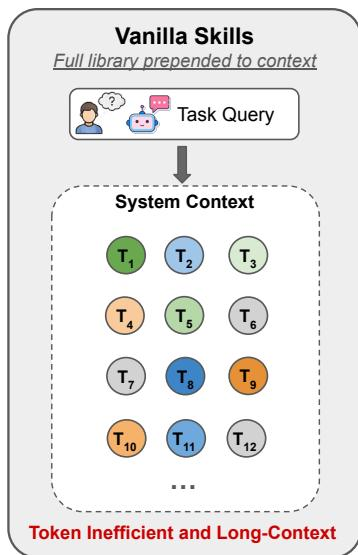
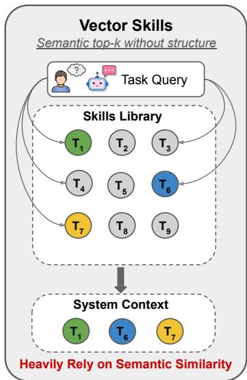
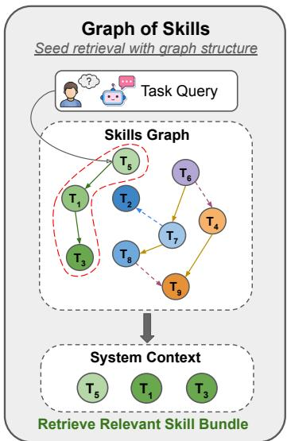
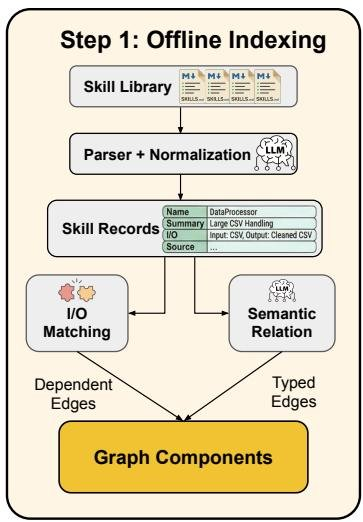
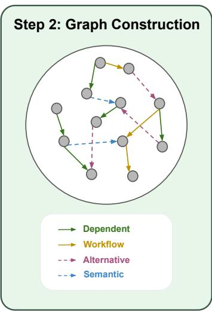
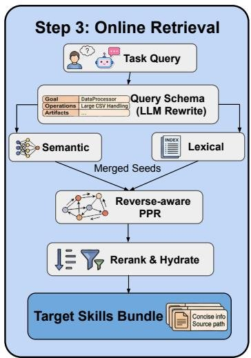
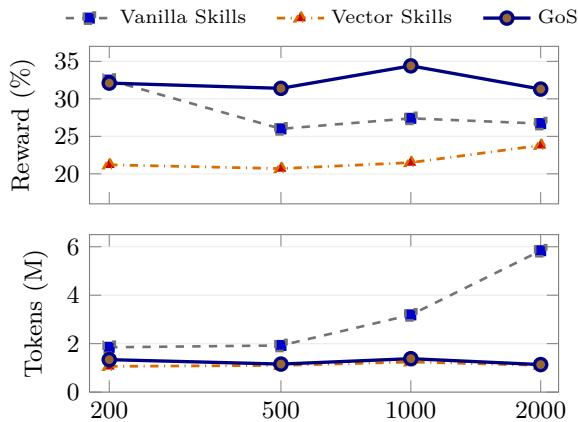

# Graph of Skills: Dependency-Aware Structural Retrieval for Massive Agent Skills

Dawei Liu1† Zongxia Li2† Hongyang Du3 Xiyang Wu2 Shihang Gui3 Yongbei Kuang4 Lichao Sun5

1University of Pennelvenia 2University of Maryland $^ 3$ Brown University 4Carnegie Melon University 5Lehigh University liudawei@seas.upenn.edu zli12321@umd.edu lis221@lehigh.edu

§ Github: https://github.com/davidliuk/graph-of-skills

# Abstract

Skill usage has become a core component of modern agent systems and can substantially improve agents’ ability to complete complex tasks. In real-world settings, where agents must monitor and interact with numerous personal applications, web browsers, and other environment interfaces, skill libraries can scale to thousands of reusable skills. Scaling to larger skill sets introduces two key challenges. First, loading the full skill set saturates the context window, driving up token costs, hallucination, and latency. In this paper, we present Graph of Skills (GoS), an inference-time structural retrieval layer for large skill libraries. GoS constructs an executable skill graph offline from skill packages, then at inference time retrieves a bounded, dependency-aware skill bundle through hybrid semantic–lexical seeding, reverse-weighted Personalized PageRank, and context-budgeted hydration. On SkillsBench and ALFWorld, GoS improves average reward by $4 3 . 6 \%$ over the vanilla full skill-loading baseline while reducing input tokens by $3 7 . 8 \%$ , and generalizes across three model families: Claude Sonnet, GPT-5.2 Codex, and MiniMax. Additional ablation studies across skill libraries ranging from 200 to 2,000 skills further demonstrate that GoS consistently outperforms both vanilla skills loading and simple vector retrieval in balancing reward, token efficiency, and runtime.

# 1 Introduction

Large Language Model (LLM) agents solve complex technical tasks by invoking external tools, APIs, and reusable skills (Schick et al., 2023; Mialon et al., 2023). As these tools and skills grow from dozens of tools to thousands or even tens of thousands of candidates (Patil et al., 2023; Li et al., 2023; Xu et al., 2023; Qin et al., 2024), the core challenge shifts from deciding whether to use a skill to retrieving the most relevant set of skills that is sufficient for a task. Shi et al. (2025) already shows that skill retrieval itself is now a major bottleneck in realistic tool ecosystems.

Two common strategies are widely used for handling large skill libraries. Vanilla Skills (Agent Skills, 2026) prepends the entire skill set to the context window. This can work for small toolsets, but it scales poorly: token cost grows linearly with library size, and critical domain constraints become easy for the model to overlook inside an overloaded context (Liu et al., 2024a). An alternative is vector-based retrieval (Lewis et al., 2020; Wang et al., 2023), which improves efficiency by retrieving semantically similar skills. However, semantic proximity does not imply executable sufficiency. In many engineering tasks, the top semantic match is a high-level solver, while the actual solution also requires a lower-level parser, converter, setup utility, or domain-specific preprocessor that is semantically weak but functionally necessary (Qin et al., 2024; Patel et al., 2025; Patil et al., 2023) (Figure 1).

  
Figure 1: Conceptual comparison between flat skill loading, vector retrieval, and Graph of Skills (GoS). Vanilla Skills prepends the full skill library to the prompt, so relevant constraints and prerequisite skills become buried in an overloaded context. Vector Skills improves efficiency by returning semantically similar skills, but it can still miss a functionally required prerequisite outside the retrieved set, creating the prerequisite gap. Graph of Skills starts from hybrid semantic-lexical seeds and then performs structure-aware retrieval to recover prerequisite skills and assemble a compact execution bundle.

We present Graph of Skills (GoS), an inference-time structural retrieval layer for large local skill libraries to combat limitations of the previous two approaches. GoS constructs a directed multi-relational graph over local skill packages, where nodes are executable skills and edges encode prerequisite and workflow structure. At query time, GoS uses semantic and lexical signals only to identify a small seed set, then applies reverse-weighted Personalized PageRank (PPR) (Haveliwala, 2002; Yang et al., 2024) to recover additional skills that are structurally important for execution. The result is a bounded skill bundle that is both relevant and closer to dependency-complete than isolated top- $k$ retrieval. This problem setting is complementary to repository-scale skill infrastructures such as SkillNet and AgentSkillOS (Liang et al., 2026; Li et al., 2026a).

Those works focus on creating, organizing, evaluating, and orchestrating large skill ecosystems. GoS targets a critical downstream question: if a large local skill library already exists, how should an agent retrieve the smallest and most relevant executable subset that is sufficient for the current task? Rather than exposing only keyword or vector search over repository metadata, GoS parses each skill specification into executable fields such as I/O schemas, tooling, script entrypoints, and stable source paths, constructs typed dependency and workflow edges, and retrieves a bounded bundle through graph diffusion plus reranking.

Our contributions are as follows: (1) We introduce GoS, an agentic skill usage pipeline that combines offline graph construction with inference-time structural retrieval to improve skill selection accuracy while reducing input token consumption. (2) We evaluate GoS on the 1,000-skill SkillsBench setting and find that, compared to the full skill-loading baseline, GoS improves average reward by $4 3 . 6 \%$ and reduces input tokens by $3 7 . 8 \%$ across two benchmarks and three model families. Additional ablation studies confirm that this pattern holds consistently across skill library sizes ranging from 200 to 2,000 skills.

# 2 Related Work

Tool Use, Tool Discovery, and Tool Retrieval for Agents. Early research on toolaugmented language models focuses on relatively small, fixed toolsets, where the primary

challenge is deciding when to invoke a tool and formatting the call correctly (Schick et al., 2023; Mialon et al., 2023). As tool sets grow from dozens of tools to thousands (Patil et al., 2023; Li et al., 2023; Xu et al., 2023; Qin et al., 2024) and context windows continue to expand (Singh et al., 2026; Li et al., 2026c; Comanici et al., 2025), the problem shifts toward tool discovery and tool retrieval. Systems and benchmarks such as Gorilla Patil et al. (2023), API-Bank Li et al. (2023), ToolBench-style evaluations Xu et al. (2023), and ToolLLM Qin et al. (2024) show that large tool universes require scalable retrieval over API descriptions and tool documentation. ToolNet (Liu et al., 2024b) introduces graph structure into large-scale tool access, with the objective to connect models to broad tool ecosystems rather than recover dependency-complete local executable bundles. However, Shi et al. (2025) shows that tool retrieval is itself a difficult modeling problem and that generic dense retrievers are often poorly aligned with real tool-use needs (Shi et al., 2025).

Skill Repositories, Ecosystems, and Benchmarks. Recent systems increasingly treat agent skills as reusable assets rather than ad hoc prompts (Agent Skills, 2026; Liang et al., 2026; Li et al., 2026a). SkillNet (Liang et al., 2026) is a repository-scale skill library in this space, supporting skill creation from heterogeneous sources, multi-dimensional evaluation, ontology construction, and relational analysis over large skill collections. AgentSkillOS (Li et al., 2026a) similarly advocates for an ecosystem-level approach, emphasizing that massive skill libraries must be systematically categorized for efficient retrieval and dynamically chained together to execute complex, multi-step tasks. SkillsBench (Li et al., 2026b) shows that curated external skills can improve agent performance, while also exposing that simply having many skills available does not guarantee reliable and safe use. Other systems and registries such as SkillsMP, ClawHub, and LangSkills similarly support packaging, discovery, and search over large skill collections (SkillsMP, 2026; OpenClaw, 2026; Li et al., 2025; LabRAI, 2026). These skill repository platforms lower the cost of packaging, publishing, browsing, and searching large skill collections, but their primary interface remains entry-level search or distribution over individual skills or bundles.

Graph-Based Retrieval and Relational Memory. Graph-structured retrieval has recently improved knowledge access in document, memory, and tool-use settings, but its role differs substantially across these regimes. GraphRAG (Edge et al., 2024) uses graph structure to support query-focused synthesis over document collections, HippoRAG (Jiménez Gutiérrez et al., 2024) models long-term memory as an associative graph for improved retrieval, and adjacent agent systems such as ControlLLM (Liu et al., 2023) and ToolNet (Liu et al., 2024b) incorporate graph structure over tools rather than treating tools as a flat list. However, these lines of work do not directly study retrieval over large local skill repositories. GraphRAG-style systems target knowledge synthesis, memory access, or relational QA; tool-graph methods focus primarily on graph-guided tool planning and navigation during reasoning. By contrast, our setting requires an upstream retrieval layer that selects a small executable bundle before generation begins. To our knowledge, prior work has not focused on graph-based retrieval for agent skills under this objective: recovering a dependency-complete executable bundle under a tight context budget, rather than merely retrieving one relevant item.

# 3 Methodology

GoS is an inference-time retrieval layer for large local skill libraries. It constructs a typed graph offline from local skill packages and, at query time, returns a compact execution bundle that is relevant to the task and more likely than flat retrieval to include the prerequisites required for successful execution.

# 3.1 Problem Setup

Let $\mathcal { C } = \{ d _ { 1 } , \ldots , d _ { m } \}$ denote a local corpus of skill packages. Each package contains a primary specification document together with optional scripts, references, and auxiliary assets. GoS converts $\boldsymbol { \mathscr { C } }$ into a typed directed graph

$$
G = (V, E, w, \phi),
$$

  
Figure 2: Overview of Graph of Skills (GoS). Left: offline indexing converts local skill packages into normalized skill records and typed edges. Dependency edges are induced from I/O compatibility, while workflow, semantic, and alternative relations are added through sparse validation. Center: the typed directed skill graph is the retrieval substrate; edge labels denote dependency, workflow, semantic, and alternative relations. Right: online retrieval maps a task query to a compact query schema, forms merged seeds from semantic and lexical retrieval, applies reverse-aware Personalized PageRank, and returns a budgeted execution bundle after reranking and hydration.

where each node $v \in V$ is a normalized executable skill record, each edge $e \in E$ connects two skills, $w ( e ) > 0$ is an edge weight, and $\phi ( e ) \in \mathcal { R }$ assigns an edge type from the relation set

$$
\mathcal {R} = \{\text {d e p}, \text {w f}, \text {s e m}, \text {a l t} \}.
$$

Given a task query $q$ and a context budget $\tau$ , the retrieval problem is to return a bundle $B ( q ) \subseteq V$ that is simultaneously relevant, execution-complete when possible, and compact. We view this as a budgeted selection problem,

$$
\max  _ {B \subseteq V} \sum_ {v \in B} \operatorname {r e l} (v, q) + \beta \sum_ {(u, v) \in E _ {\mathrm {d e p}}} \mathbb {I} [ u \in B \wedge v \in B ] \quad \text {s . t .} \quad \operatorname {c o s t} (B) \leq \tau , \tag {1}
$$

where the first term favors query relevance, the second rewards dependency-complete bundles, and $\mathrm { c o s t } ( B )$ measures the prompt budget consumed by the hydrated bundle. Equation (1) is not solved exactly. Instead, GoS approximates this objective through three stages: hybrid seed retrieval, reverse-aware graph diffusion, and budgeted reranking plus hydration.

# 3.2 Offline Graph Construction

Skill Normalization. Each skill package is parsed into a normalized skill record containing a canonical name, capability summary, I/O fields, domain tags, tooling, entrypoints, compatibility notes, and a stable local source path. This normalization step is primarily deterministic: the system extracts executable fields whenever possible and uses a lightweight LLM pass only to recover retrieval-critical semantic fields when package documentation is incomplete. The goal is to convert each local skill into a retrieval unit that an agent can directly consume at inference time.

Typed Relation Induction. GoS uses four edge types. Dependency edges represent executable prerequisites and form the primary structural relation in the graph. A dependency edge $v _ { i }  v _ { j }$ is added when the outputs produced by $v _ { i }$ are compatible with inputs required by $v _ { j }$ , so that $v _ { i }$ can plausibly provide an artifact consumed by $v _ { j }$ . Workflow edges capture common multi-step pipelines, semantic edges connect near-duplicate or topically adjacent skills, and alternative edges link interchangeable strategies for the same subproblem.

Rather than performing unconstrained all-pairs relation inference, GoS constructs nondependency edges through sparse validation. For each node, it first forms a small candidate pool using lexical similarity, semantic neighbors, and I/O-based expansion. Relation validation is then applied only inside this pool. This keeps graph construction tractable while ensuring that the resulting graph remains anchored in executable structure rather than metadata proximity alone.

# 3.3 Online Structural Retrieval

Query Representation and Hybrid Seeding. Dense retrieval (Karpukhin et al., 2020) is often effective at finding the visible top-level skill but weak at recovering semantically subtle prerequisites. Lexical retrieval in the probabilistic ranking tradition (Robertson et al., 2009) is robust for concrete artifacts and filenames, but brittle under paraphrase. GoS therefore combines the two signals at the seeding stage.

At retrieval time, the raw query is mapped to a lightweight retrieval schema containing the task goal, salient operations, referenced artifacts, and normalized keywords. This schema can be produced by an optional LLM rewrite, following the general intuition of rewrite-thenretrieve pipelines (Ma et al., 2023); when rewriting is unavailable or disabled, GoS falls back to deterministic lexical normalization. GoS then computes a semantic seed score $s _ { i } ^ { \mathrm { s e m } } ( q )$ and a lexical seed score $s _ { i } ^ { \mathrm { l e x } } ( q )$ for each candidate skill $v _ { i }$ , and merges them as

$$
z _ {i} (q) = \eta s _ {i} ^ {\mathrm {s e m}} (q) + (1 - \eta) s _ {i} ^ {\mathrm {l e x}} (q), \tag {2}
$$

where $\eta \in [ 0 , 1 ]$ controls the semantic–lexical tradeoff. The initial seed distribution is obtained by normalizing the merged scores over the candidate pool,

$$
\mathbf {p} _ {i} = \frac {z _ {i} (q)}{\sum_ {j} z _ {j} (q)}.
$$

Reverse-Aware Typed Diffusion. Let $A _ { r }$ denote the weighted adjacency matrix for relation type $r \in \mathcal { R }$ . To let retrieval move from a matched high-level skill toward likely prerequisites, GoS uses both forward and reverse transitions. For each relation type, we define a row-normalized forward operator $T _ { r } ^ {  }$ and a row-normalized reverse operator $T _ { r } ^ {  }$ obtained from $A _ { r }$ and $A _ { r } ^ { \top }$ , respectively. GoS then forms the unified transition operator

$$
T = \operatorname {R o w N o r m} \left(\sum_ {r \in \mathcal {R}} \lambda_ {r} \left(T _ {r} ^ {\rightarrow} + \gamma_ {r} T _ {r} ^ {\leftarrow}\right)\right), \tag {3}
$$

where $\lambda _ { r } \geq 0$ and $\begin{array} { r } { \sum _ { r } \lambda _ { r } = 1 } \end{array}$ weight relation types, and $\gamma _ { r } \geq 0$ controls how strongly reverse traversal is allowed for each type.

The core retrieval step is a reverse-aware Personalized PageRank-style diffusion over this operator (Page et al., 1999; Jeh & Widom, 2003; Yang et al., 2024):

$$
\mathbf {s} ^ {(\ell + 1)} = \alpha \mathbf {p} + (1 - \alpha) T ^ {\top} \mathbf {s} ^ {(\ell)}, \tag {4}
$$

where $\alpha \in ( 0 , 1 )$ is the restart parameter. Relative to flat top- $k$ retrieval, relevance is not assigned only to individually matched skills; it is propagated across a local executable neighborhood. In particular, once a high-level solver is retrieved as a seed, upstream parser, setup, or preprocessing skills can still accumulate score through reverse dependency paths even when they are not themselves strong semantic matches to the original query.

Budgeted Reranking and Hydration. The diffusion score alone is insufficient, because the final output must be compact and directly usable by an agent. GoS therefore reranks candidate skills by combining graph score with field-level query evidence:

$$
\rho_ {i} (q) = \mathbf {s} _ {i} ^ {\star} + \mu m _ {i} (q), \tag {5}
$$

where $\mathbf { s } _ { i } ^ { \star }$ is the converged diffusion score, $m _ { i } ( q )$ aggregates direct matches between the query and skill fields such as name, capability summary, artifacts, and entrypoints, and $\mu$ controls how much local grounding is preserved after graph expansion.

Candidates are then hydrated in descending order of $\rho _ { i } ( q )$ under both per-skill and global context budgets. Here, hydration denotes materializing a selected skill into an agentconsumable payload that includes a stable source path together with concise capability text and the most relevant execution notes. The final output is therefore a bounded execution bundle designed to maximize executable coverage within the prompt budget.

# 4 Experiments

We evaluate whether graph-structured retrieval improves agent performance and efficiency relative to flat full-library access and non-graph semantic retrieval.

# 4.1 Experimental Setup

We evaluate GoS on two benchmarks using the full released task sets. SkillsBench (Li et al., 2026b) contains a diverse set of real-world technical tasks across 11 domains, paired with curated Skills: structured packages of procedural knowledge (instructions, code templates, resources) that augment LLM agents at inference time. The task domains span complex technical work such as macroeconomic detrending, power-grid feasibility analysis, 3D scan analysis, financial modeling, and seismic phase picking. ALFWorld (Shridhar et al., 2020b) is an interactive simulator that aligns text descriptions and commands with a physically embodied robotic environment, built by combining TextWorld (Côté et al., 2018), an engine for interactive text-based games and the ALFRED dataset (Shridhar et al., 2020a). Its tasks involve multi-step household activities such as navigating rooms, finding objects, and manipulating them. In the LLM agent literature, ALFWorld is widely used in its text-only mode as a benchmark for sequential decision making, where an agent receives textual room descriptions and must issue a chain of commands to accomplish a goal (Yao et al., 2023; Shinn et al., 2023). We evaluate on the full 140-episode split.

Baselines. We compare GoS against two baselines. Vanilla Skills exposes the entire skill library directly to the agent, maximizing recall but providing no retrieval-time compression. On ALFWorld, this follows the official Agent Skills format and reference repository (Agent Skills, 2026). Vector Skills retrieves a bounded set of skills using semantic similarity over the same embedding model used by GoS, namely openai/text-embedding-3-large (OpenAI, 2024) (3072 dimensions). It isolates the effect of graph structure from the general benefit of retrieval-time compression. GoS uses the same base embedding model as Vector Skills but replaces flat nearest-neighbor retrieval with structure-aware retrieval over the skill graph. In the experiments reported here, we disable the optional query-rewrite module and use the raw task instruction as the retrieval query. The critical comparison is therefore between flat semantic retrieval and dependency-aware structural retrieval under the same backbone and embedding setup.

Models and Evaluation. All experiments are conducted with Claude Sonnet 4.5 (Anthropic, 2025), MiniMax M2.7 (MiniMax, 2026), and GPT-5.2 Codex (OpenAI, 2025). Each model– method setting is run twice, and we report the mean across runs. We report average reward across tasks as the primary evaluation metric. For ALFWorld, rewards are binary, so average reward is equivalent to success rate. We additionally report average total token usage and agent-only runtime; runtime is measured from agent start to agent finish and excludes environment setup.

Evaluation Protocol. We use the full benchmark task sets and apply the same retry policy across the main and sensitivity experiments. If environment construction fails, we rebuild and rerun the task up to two additional times; tasks that still fail after these retries are excluded as unresolved infrastructure failures rather than counted as model failures. For agent timeouts, we distinguish between substantive execution failures and startup failures: if the agent has already been executing for a long time and then times out, we record reward 0 and keep the run in the aggregate; if the timeout occurs before a meaningful run is established, we rerun the trial. This protocol is applied to the full SkillsBench evaluation, the full 140-episode ALFWorld evaluation, and the library-size sensitivity study.

Table 1: R denotes average reward ( $\%$ ), $\mathbf { T }$ denotes tokens, and $\mathbf { s }$ denotes runtime (s) (↑ indicates larger values are better, and ↓ denotes smaller values are better). Results are means over two runs per setting. For ALFWorld, average reward equals success rate. The top-performing results are highlighted in bold, and the second-best are underlined.   

<table><tr><td rowspan="2">Model</td><td rowspan="2">Method</td><td colspan="3">SkillsBench</td><td colspan="3">ALFWorld</td></tr><tr><td>R ↑</td><td>T ↓</td><td>S ↓</td><td>R ↑</td><td>T ↓</td><td>S ↓</td></tr><tr><td rowspan="3">Claude Sonnet 4.5</td><td>Vanilla Skills</td><td>25.0</td><td>967,791</td><td>465.8</td><td>89.3</td><td>1,524,401</td><td>53.2</td></tr><tr><td>Vector Skills</td><td>19.3</td><td>894,640</td><td>357.3</td><td>93.6</td><td>28,407</td><td>37.8</td></tr><tr><td>+ GoS</td><td>31.0</td><td>860,315</td><td>364.9</td><td>97.9</td><td>27,215</td><td>49.2</td></tr><tr><td rowspan="3">MiniMax M2.7</td><td>Vanilla Skills</td><td>17.2</td><td>942,113</td><td>580.7</td><td>47.1</td><td>2,184,823</td><td>88.6</td></tr><tr><td>Vector Skills</td><td>10.4</td><td>852,881</td><td>552.9</td><td>50.7</td><td>66,109</td><td>73.4</td></tr><tr><td>+ GoS</td><td>18.7</td><td>867,452</td><td>502.5</td><td>54.3</td><td>65,227</td><td>68.8</td></tr><tr><td rowspan="3">GPT-5.2 Codex</td><td>Vanilla Skills</td><td>27.4</td><td>3,187,749</td><td>686.8</td><td>89.3</td><td>1,435,614</td><td>83.3</td></tr><tr><td>Vector Skills</td><td>21.5</td><td>1,243,648</td><td>773.0</td><td>92.9</td><td>34,436</td><td>57.0</td></tr><tr><td>+ GoS</td><td>34.4</td><td>1,379,773</td><td>715.6</td><td>93.6</td><td>46,462</td><td>64.7</td></tr></table>

# 4.2 Main Results

We present the main results in Table 1. Across all six model–benchmark blocks, GoS attains the highest average reward. Relative to Vanilla Skills, it reduces average token usage in all six blocks and reduces agent runtime in five of the six. Relative to Vector Skills, it improves reward in every block while keeping the token budget in the same compressed regime.

Naive semantic retrieval struggles on long-horizon tasks. Many tasks in SkillsBench are long-horizon and require combining relevant skills with prerequisite utilities, such as environment setup, data preprocessing, or output formatting. These skills may not be lexically salient in the task description. Vector Skills, which retrieves based solely on embedding similarity to the query, often misses these indirect but essential dependencies, leading to incomplete skill sets and lower task completion rates. This pattern is most visible on SkillsBench. Under Claude Sonnet 4.5, Vector Skills drops from 25.0 to 19.3 average reward relative to Vanilla Skills; under MiniMax M2.7, it drops from 17.2 to 10.4; and under GPT-5.2 Codex, it drops from 27.4 to 21.5. In contrast, GoS improves over both baselines in all three SkillsBench blocks while still using substantially fewer tokens than flat prompting. These results are consistent with the hypothesis that long-horizon tasks are sensitive not only to topical relevance, but also to whether the retrieved bundle contains the prerequisite helpers needed to complete the full execution path.

GoS achieves the strongest overall tradeoff on ALFWorld. The ALFWorld results show that the same advantage transfers to a sequential embodied environment. Under Claude Sonnet 4.5, GoS reaches $9 7 . 9 \%$ average success, compared with $9 3 . 6 \%$ for Vector Skills and $8 9 . 3 \%$ for Vanilla Skills, while reducing average total tokens from 1,524,401 to 27,215 relative to flat prompting. Under MiniMax M2.7, GoS again gives the strongest overall tradeoff, improving reward from $4 7 . 1 \%$ under Vanilla Skills and 50.7% under Vector Skills to 54.3%, while also achieving the lowest token usage and runtime in that block. Under GPT-5.2 Codex, GoS and Vector Skills are close on reward (93.6% vs. $9 2 . 9 \%$ ), but GoS still remains clearly more efficient than Vanilla Skills. Taken together, these results suggest that the benefit of structure-aware retrieval is not limited to technical code-execution tasks.

GoS offers the best efficiency–performance tradeoff. Vanilla Skills preserves maximal recall, but its cost grows rapidly with library size and leaves the agent to search an unstructured skill set at inference time. Vector Skills reduces token cost, but its retrieved set is often incomplete, because semantically nearby skills are not always jointly sufficient. GoS improves reward over Vector Skills by 10.97 points on SkillsBench and 2.87 points on ALFWorld while remaining far more efficient than Vanilla Skills (Table 1). The results are averaged over two runs per setting. We interpret them as a consistent empirical pattern rather than a formal significance claim.

Figure 3: Sensitivity to library size on full SkillsBench under GPT-5.2 Codex. Left: compact summary table for Vanilla Skills, Vector Skills, and GoS. Right: reward and input-token trends as the skill repository grows from 200 to 2,000 skills. GoS preserves the strongest reward once the library becomes moderately large, while both retrieval-based methods substantially weaken the growth of prompt cost relative to flat exposure.

<table><tr><td>N</td><td>Method</td><td>R ↑</td><td>T ↓</td><td>S ↓</td></tr><tr><td rowspan="3">200</td><td>Vanilla Skills</td><td>32.5</td><td>1.85</td><td>701.6</td></tr><tr><td>Vector Skills</td><td>21.2</td><td>1.06</td><td>833.8</td></tr><tr><td>+ GoS</td><td>32.1</td><td>1.36</td><td>731.2</td></tr><tr><td rowspan="3">500</td><td>Vanilla Skills</td><td>26.0</td><td>1.93</td><td>756.8</td></tr><tr><td>Vector Skills</td><td>20.7</td><td>1.10</td><td>849.5</td></tr><tr><td>+ GoS</td><td>31.4</td><td>1.16</td><td>890.3</td></tr><tr><td rowspan="3">1000</td><td>Vanilla Skills</td><td>27.4</td><td>3.19</td><td>686.8</td></tr><tr><td>Vector Skills</td><td>21.5</td><td>1.24</td><td>773.0</td></tr><tr><td>+ GoS</td><td>34.4</td><td>1.38</td><td>715.6</td></tr><tr><td rowspan="3">2000</td><td>Vanilla Skills</td><td>26.7</td><td>5.84</td><td>733.5</td></tr><tr><td>Vector Skills</td><td>23.8</td><td>1.11</td><td>799.8</td></tr><tr><td>+ GoS</td><td>31.3</td><td>1.14</td><td>788.0</td></tr></table>

N: library size, R: reward, T: input tokens (M), S: runtime (s).

  
Skill library size

# 4.3 Qualitative Analysis

We inspect trajectory-level evidence to study how retrieval quality changes the downstream execution path, not just the final score. Appendix F provides a broader case set; here we focus on one representative example that isolates the main mechanism behind GoS.

Pedestrian Traffic Counting. pedestrian-traffic-counting requires a short but complete visual pipeline: extracting frames, counting pedestrians reliably, and formatting the output in the expected structure. In this case, GoS retrieved a compact bundle centered on gemini-count-in-video, video-frame-extraction, and openai-vision, and achieved the highest score (0.417). Vanilla Skills eventually opened related helpers, including gemini-count-in-video, video-frame-extraction, and object_counter, but reached only 0.267, suggesting that broad library access can recover relevant tools while still leaving the agent with a noisier search problem. Vector Skills scored only 0.041: it retrieved some relevant context, but not a bundle that the agent could convert into a workable end-to-end plan. The qualitative lesson is that GoS does not help merely by retrieving topically similar skills. It helps by exposing a bundle that is already close to the executable decomposition of the task, so the agent can commit earlier to a verifier-aligned plan rather than spending budget on additional search and assembly.

# 5 Ablation Study

We conduct an additional ablation study to evaluate the impact of the skill library size on GoS, Vanilla Skills, and Vector Skills, alongside the effects of the lexical merge and reranker components on GoS performance.

# 5.1 Sensitivity to Skill Library Size

We run an additional full-SkillsBench study with GPT-5.2 Codex while varying the library size from 200 to 500, 1,000, and 2,000 skills. We report average reward, average input tokens, and agent-only runtime under the same retry and exclusion rules used in the main experiments in Table 2.

Prompt cost grows rapidly for all skill exposure. The strongest trend is on input tokens. As the library grows from 500 to 2,000 skills, Vanilla Skills rises from 1.93M to

5.84M average input tokens, roughly a $3 \times$ increase. Over the same range, Vector Skills stays near 1.10M–1.24M tokens and GoS stays near 1.14M–1.38M tokens. This result shows that simple retrieval substantially weakens the coupling between repository size and prompt size, while GoS does so without giving up reward.

GoS maintains a reward advantage at all tested scales. At 200 skills, Vanilla Skills is still slightly ahead of GoS (32.5 vs. 32.1). Once the library becomes moderately large, GoS outperforms both baselines at every tested scale: 31.4 vs. 26.0 / 20.7 at 500 skills, 34.4 vs. 27.4 / 21.5 at 1,000 skills, and 31.3 vs. 26.7 / 23.8 at 2,000 skills (GoS / Vanilla Skills / Vector Skills). The margin is largest at 1,000 skills and remains substantial at 2,000, indicating that increasing library size does not weaken the benefit of dependency-aware retrieval.

The extra retrieval step adds modest runtime for GPT-5.2 Codex, but does not change the main scaling conclusion. Both retrieval-based methods are slower than Vanilla Skills in agent-only runtime for GPT at most scales, reflecting the overhead of searching before execution. However, this reduced runtime is unique to GPT-5.2 Codex, likely due to caching mechanisms for fixed skill libraries within the black-box model, where Claude and MiniMax have longer runtime when using Vanilla Skills than GoS and Vector Skills (Table 1). In contrast, the Claude model lacks this optimization, making the Vanilla Skills approach significantly slower than retrieval methods. Furthermore, the results suggest that the primary system bottleneck is not graph traversal or vector search, but rather the overhead of exposing an increasingly large, flat library directly to the model.

# 5.2 Component Analysis of the GoS Retrieval Pipeline

We next evaluate the contribution of two key retrieval components in the GoS pipeline: graph propagation and lexical reranking. These ablations were run under the main SkillsBench configuration — GPT-5.2 Codex across skill libraries of increasing size (200, 500, 1,000, and 2,000 skills). In the first ablation, we remove graph propagation, disabling the system’s ability to expand beyond seed skills to structurally related prerequisites. In the second, we remove lexical re-

Table 2: Component ablation on full Skills-Bench with GPT-5.2 Codex and the 1,000-skill library. R: average reward ( $\%$ ), T: average total tokens (M), S: agent-only runtime (s).   

<table><tr><td>Method</td><td>R ↑</td><td>T ↓</td><td>S ↓</td></tr><tr><td>Full GoS</td><td>34.4</td><td>1.38</td><td>715.6</td></tr><tr><td>w/o graph propagation</td><td>29.3</td><td>0.89</td><td>766.2</td></tr><tr><td>w/o lexical + rerank</td><td>26.7</td><td>1.01</td><td>747.7</td></tr></table>

trieval and reranking, forcing the system to rely solely on the semantic retriever before graph expansion.

Graph propagation and lexical reranking are important components for GoS’ success. Removing graph propagation reduces average token usage from 1.38M to 0.89M, but it also lowers average reward from 34.4 to 29.3 (↓ 5.1). Removing lexical retrieval and reranking lowers average token usage from 1.38M to 1.01M. It lowers average reward from 34.4 to 26.7 (↓ 7.7). The larger degradation in the second ablation suggests that better seed quality is especially important on SkillsBench: if the initial retrieved skills are weak, graph expansion has less useful structure from which to recover missing prerequisites. These results show that hybrid semantic–lexical retrieval improves entry-point quality, and graph propagation then converts those stronger seeds into a more execution-complete bundle.

# 6 Conclusion

Skill retrieval is a critical bottleneck for agents operating over massive skill libraries. Unlike approaches that retrieve only semantically relevant skills, GoS recovers a small, jointly sufficient set of skills by capturing not just the target skill but also the parsers, preprocessors, and dependencies needed for successful execution. GoS is complementary to, but distinct from, broader skill management systems such as SkillNet and AgentSkillOS (Liang et al., 2026; Li et al., 2026a). Our results demonstrate that GoS consistently outperforms both vanilla skills loading and simple vector retrieval, improving execution reward while reducing

token consumption. This advantage holds across two benchmarks, three model families, and skill libraries of varying sizes.

Limitations and Future Work. GoS still depends on the quality of its offline graph. Poorly documented skills, ambiguous I/O schemas, or missing execution metadata can degrade edge quality and downstream retrieval. In addition, the current graph system is mostly static: it does not yet refine graph structure from repeated execution traces, verifier outcomes, or user feedback. Future work can focus on including online edge-weight adaptation, graph updates from successful trajectories, stronger reranking over candidate bundles, and broader evaluation on multimodal and interactive agent settings.

# Reproducibility Statement

The paper and appendix specify the core components needed to reproduce the proposed method: parser-first skill normalization, optional LLM-based semantic field completion, typed edge construction, hybrid semantic–lexical seeding, reverse-aware graph diffusion, reranking, and budgeted hydration. We also document the evaluation protocol, including benchmark settings, run structure, reward definitions, token accounting, agent-only runtime measurement, and the treatment of unresolved infrastructure failures.

Because the submission package is size-constrained, we do not include the full codebase and experiment assets with the anonymous submission. We plan to release the implementation, experiment configurations, prompt templates, agent-environment instructions, and resultprocessing scripts in the camera-ready release. The public release will also include the benchmark configuration files and task-generation assets needed to reproduce the SkillsBench and ALFWorld experiments reported in the paper.

Exact numerical replication may still vary because the experiments depend on black-box LLM APIs and external inference providers whose behavior can change over time. To reduce this variance, we use fixed prompts and configurations, repeated runs under the same protocol, and a clear separation between infrastructure failures and substantive model failures. We therefore expect the main comparative trends and qualitative conclusions to be reproducible even when exact per-run metrics vary modestly.