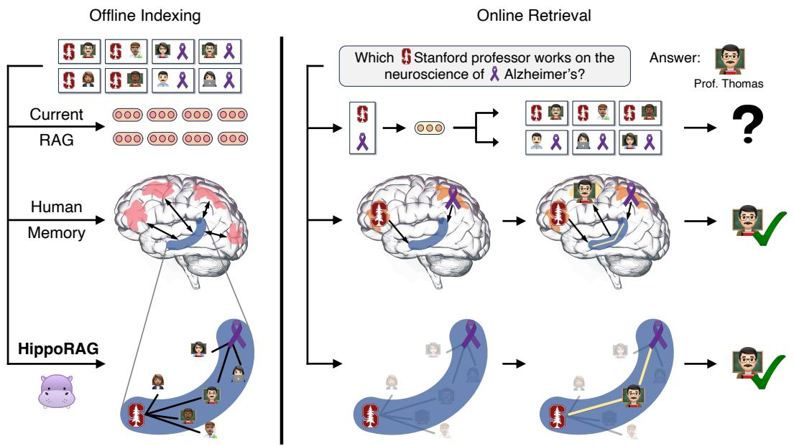
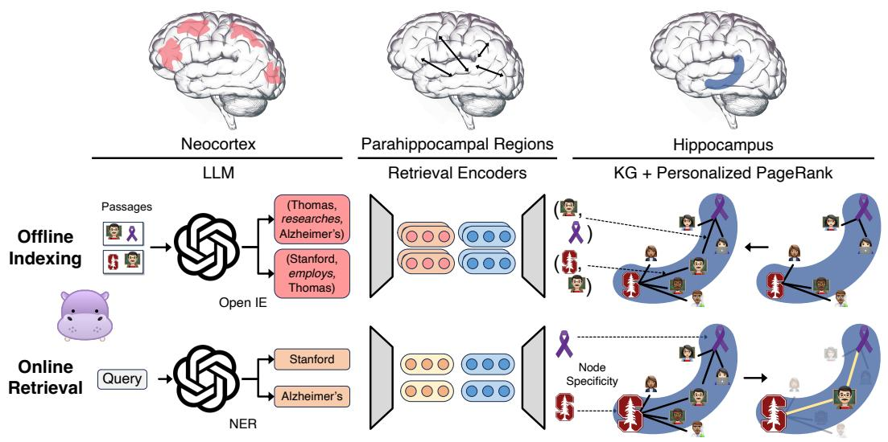

# HippoRAG: Neurobiologically Inspired Long-Term Memory for Large Language Models

Bernal Jiménez Gutiérrez

The Ohio State University

Yiheng Shu

The Ohio State University

Yu Gu

The Ohio State University

Michihiro Yasunaga

Stanford University

Yu Su

The Ohio State University

# Abstract

In order to thrive in hostile and ever-changing natural environments, mammalian brains evolved to store large amounts of knowledge about the world and continually integrate new information while avoiding catastrophic forgetting. Despite their impressive accomplishments, large language models (LLMs), even with retrievalaugmented generation (RAG), still struggle to efficiently and effectively integrate a large amount of new experiences after pre-training. In this work, we introduce HippoRAG, a novel retrieval framework inspired by the hippocampal indexing theory of human long-term memory to enable deeper and more efficient knowledge integration over new experiences. HippoRAG synergistically orchestrates LLMs, knowledge graphs, and the Personalized PageRank algorithm to mimic the different roles of neocortex and hippocampus in human memory. We compare HippoRAG with existing RAG methods on multi-hop question answering (QA) and show that our method outperforms the state-of-the-art methods remarkably, by up to $20 \%$ . Single-step retrieval with HippoRAG achieves comparable or better performance than iterative retrieval like IRCoT while being 10-20 times cheaper and 6-13 times faster, and integrating HippoRAG into IRCoT brings further substantial gains. Finally, we show that our method can tackle new types of scenarios that are out of reach of existing methods.1

# 1 Introduction

Millions of years of evolution have led mammalian brains to develop the crucial ability to store large amounts of world knowledge and continuously integrate new experiences without losing previous ones. This exceptional long-term memory system eventually allows us humans to keep vast stores of continuously updating knowledge that forms the basis of our reasoning and decision making [19].

Despite the progress of large language models (LLMs) in recent years, such a continuously updating long-term memory is still conspicuously absent from current AI systems. Due in part to its ease of use and the limitations of other techniques such as model editing [46], retrieval-augmented generation (RAG) has become the de facto solution for long-term memory in LLMs, allowing users to present new knowledge to a static model [36, 42, 66, 87].

However, current RAG methods are still unable to help LLMs perform tasks that require integrating new knowledge across passage boundaries since each new passage is encoded in isolation. Many important real-world tasks, such as scientific literature review, legal case briefing, and medical diagnosis, require knowledge integration across passages or documents. Although less complex,

  
Figure 1: Knowledge Integration & RAG. Tasks that require knowledge integration are particularly challenging for current RAG systems. In the above example, we want to find a Stanford professor that does Alzheimer’s research from a pool of passages describing potentially thousands Stanford professors and Alzheimer’s researchers. Since current methods encode passages in isolation, they would struggle to identify Prof. Thomas unless a passage mentions both characteristics at once. In contrast, most people familiar with this professor would remember him quickly due to our brain’s associative memory capabilities, thought to be driven by the index structure depicted in the C-shaped hippocampus above (in blue). Inspired by this mechanism, HippoRAG allows LLMs to build and leverage a similar graph of associations to tackle knowledge integration tasks.

standard multi-hop question answering (QA) also requires integrating information between passages in a retrieval corpus. In order to solve such tasks, current RAG systems resort to using multiple retrieval and LLM generation steps iteratively to join disparate passages [64, 78]. Nevertheless, even perfectly executed multi-step RAG is still oftentimes insufficient to accomplish many scenarios of knowledge integration, as we illustrate in what we call path-finding multi-hop questions in Figure 1.

In contrast, our brains are capable of solving challenging knowledge integration tasks like these with relative ease. The hippocampal memory indexing theory [75], a well-established theory of human long-term memory, offers one plausible explanation for this remarkable ability. Teyler and Discenna [75] propose that our powerful context-based, continually updating memory relies on interactions between the neocortex, which processes and stores actual memory representations, and the C-shaped hippocampus, which holds the hippocampal index, a set of interconnected indices which point to memory units on the neocortex and stores associations between them [19, 76].

In this work, we propose HippoRAG, a RAG framework that serves as a long-term memory for LLMs by mimicking this model of human memory. Our novel design first models the neocortex’s ability to process perceptual input by using an LLM to transform a corpus into a schemaless knowledge graph (KG) as our artificial hippocampal index. Given a new query, HippoRAG identifies the key concepts in the query and runs the Personalized PageRank (PPR) algorithm [30] on the KG, using the query concepts as the seeds, to integrate information across passages for retrieval. PPR enables HippoRAG to explore KG paths and identify relevant subgraphs, essentially performing multi-hop reasoning in a single retrieval step.

This capacity for single-step multi-hop retrieval yields strong performance improvements of around 3 and 20 points over current RAG methods [10, 35, 53, 70, 71] on two popular multi-hop QA benchmarks, MuSiQue [77] and 2WikiMultiHopQA [33]. Additionally, HippoRAG’s online retrieval process is 10 to 30 times cheaper and 6 to 13 times faster than current iterative retrieval methods like IRCoT [78], while still achieving comparable performance. Furthermore, our approach can be combined with IRCoT to provide complementary gains of up to $4 \%$ and $20 \%$ on the same datasets and even obtain improvements on HotpotQA, a less challenging multi-hop QA dataset. Finally, we

provide a case study illustrating the limitations of current methods as well as our method’s potential on the previously discussed path-finding multi-hop QA setting.

# 2 HippoRAG

In this section, we first give a brief overview of the hippocampal memory indexing theory, followed by how HippoRAG’s indexing and retrieval design was inspired by this theory, and finally offer a more detailed account of our methodology.

# 2.1 The Hippocampal Memory Indexing Theory

The hippocampal memory indexing theory [75] is a well-established theory that provides a functional description of the components and circuitry involved in human long-term memory. In this theory, Teyler and Discenna [75] propose that human long-term memory is composed of three components that work together to accomplish two main objectives: pattern separation, which ensures that the representations of distinct perceptual experiences are unique, and pattern completion, which enables the retrieval of complete memories from partial stimuli [19, 76].

The theory suggests that pattern separation is primarily accomplished in the memory encoding process, which starts with the neocortex receiving and processing perceptual stimuli into more easily manipulatable, likely higher-level, features, which are then routed through the parahippocampal regions (PHR) to be indexed by the hippocampus. When they reach the hippocampus, salient signals are included in the hippocampal index and associated with each other.

After the memory encoding process is completed, pattern completion drives the memory retrieval process whenever the hippocampus receives partial perceptual signals from the PHR pipeline. The hippocampus then leverages its context-dependent memory system, thought to be implemented through a densely connected network of neurons in the CA3 sub-region [76], to identify complete and relevant memories within the hippocampal index and route them back through the PHR for simulation in the neocortex. Thus, this complex process allows for new information to be integrated by changing only the hippocampal index instead of updating neocortical representations.

# 2.2 Overview

Our proposed approach, HippoRAG, is closely inspired by the process described above. As shown in Figure 2, each component of our method corresponds to one of the three components of human long-term memory. A detailed example of the HippoRAG process can be found in Appendix A.

Offline Indexing. Our offline indexing phase, analogous to memory encoding, starts by leveraging a strong instruction-tuned LLM, our artificial neocortex, to extract knowledge graph (KG) triples. The KG is schemaless and this process is known as open information extraction (OpenIE) [3, 5, 60, 98]. This process extracts salient signals from passages in a retrieval corpus as discrete noun phrases rather than dense vector representations, allowing for more fine-grained pattern separation. It is therefore natural to define our artificial hippocampal index as this open KG, which is built on the whole retrieval corpus passage-by-passage. Finally, to connect both components as is done by the parahippocampal regions, we use off-the-shelf dense encoders fine-tuned for retrieval (retrieval encoders). These retrieval encoders provide additional edges between similar but not identical noun phrases within this KG to aid in downstream pattern completion.

Online Retrieval. These same three components are then leveraged to perform online retrieval by mirroring the human brain’s memory retrieval process. Just as the hippocampus receives input processed through the neocortex and PHR, our LLM-based neocortex extracts a set of salient named entities from a query which we call query named entities. These named entities are then linked to nodes in our KG based on the similarity determined by retrieval encoders; we refer to these selected nodes as query nodes. Once the query nodes are chosen, they become the partial cues from which our synthetic hippocampus performs pattern completion. In the hippocampus, neural pathways between elements of the hippocampal index enable relevant neighborhoods to become activated and recalled upstream. To imitate this efficient graph search process, we leverage the Personalized PageRank (PPR) algorithm [30], a version of PageRank that distributes probability across a graph only through a set of user-defined source nodes. This constraint allows us to bias the PPR output only towards the

  
Figure 2: Detailed HippoRAG Methodology. We model the three components of human long-term memory to mimic its pattern separation and completion functions. For offline indexing (Middle), we use an LLM to process passages into open KG triples, which are then added to our artificial hippocampal index, while our synthetic parahippocampal regions (PHR) detect synonymy. In the example above, triples involving Professor Thomas are extracted and integrated into the KG. For online retrieval (Bottom), our LLM neocortex extracts named entities from a query while our parahippocampal retrieval encoders link them to our hippocampal index. We then leverage the Personalized PageRank algorithm to enable context-based retrieval and extract Professor Thomas.4

set of query nodes, just as the hippocampus extracts associated signals from specific partial cues.2 Finally, as is done when the hippocampal signal is sent upstream, we aggregate the output PPR node probability over the previously indexed passages and use that to rank them for retrieval.

# 2.3 Detailed Methodology

Offline Indexing. Our indexing process involves processing a set of passages $P$ using an instructiontuned LLM $L$ and a retrieval encoder $M$ . As seen in Figure 2 we first use $L$ to extract a set of noun phrase nodes $N$ and relation edges $E$ from each passage in $P$ via OpenIE. This process is done via 1-shot prompting of the LLM with the prompts shown in Appendix I. Specifically, we first extract a set of named entities from each passage. We then add the named entities to the OpenIE prompt to extract the final triples, which also contain concepts (noun phrases) beyond named entities. We find that this two-step prompt configuration leads to an appropriate balance between generality and bias towards named entities. Finally, we use $M$ to add the extra set of synonymy relations $E ^ { \prime }$ discussed above when the cosine similarity between two entity representations in $N$ is above a threshold $\tau$ . As stated above, this introduces more edges to our hippocampal index and allows for more effective pattern completion. This indexing process defines a $| N | \times | P |$ matrix $\mathbf { P }$ , which contains the number of times each noun phrase in the KG appears in each original passage.

Online Retrieval. During the retrieval process, we prompt $L$ using a 1-shot prompt to extract a set of named entities from a query $q$ , our previously defined query named entities $\bar { C } _ { q } = \{ c _ { 1 } , . . . , c _ { n } \}$ (Stanford and Alzheimer’s in our Figure 2 example). These named entities $C _ { q }$ from the query are then encoded by the same retrieval encoder $M$ . Then, the previously defined query nodes are chosen as the set of nodes in $N$ with the highest cosine similarity to the query named entities $C _ { q }$ . More formally, query nodes are defined as $R _ { q } = \{ r _ { 1 } , . . . , r _ { n } \}$ such that $\boldsymbol { r } _ { i } = e _ { k }$ where $k =$ arg $\operatorname* { m a x } _ { j }$ cosine_similarity $( M ( c _ { i } ) , M ( e _ { j } ) )$ , represented as the Stanford logo and the Alzheimer’s purple ribbon symbol in Figure 2.

After the query nodes $R _ { q }$ are found, we run the PPR algorithm over the hippocampal index, i.e., a KG with $| N |$ nodes and $\left| E \right| + \left| E ^ { \prime } \right|$ edges (triple-based and synonymy-based), using a personalized probability distribution $\vec { n }$ defined over $N$ , in which each query node has equal probability and all other nodes have a probability of zero. This allows probability mass to be distributed to nodes that are primarily in the (joint) neighborhood of the query nodes, such as Professor Thomas, and contribute to eventual retrieval. After running the PPR algorithm, we obtain an updated probability distribution $\vec { n ^ { \prime } }$ over $N$ . Finally, in order to obtain passage scores, we multiply $\vec { n ^ { \prime } }$ with the previously defined P matrix to obtain $\overrightarrow { p }$ , a ranking score for each passage, which we use for retrieval.

Node Specificity. We introduce node specificity as a neurobiologically plausible way to further improve retrieval. It is well known that global signals for word importance, like inverse document frequency (IDF), can improve information retrieval. However, in order for our brain to leverage IDF for retrieval, the number of total “passages” encoded would need to be aggregated with all node activations before memory retrieval is complete. While simple for normal computers, this process would require activating connections between an aggregator neuron and all nodes in the hippocampal index every time retrieval occurs, likely introducing prohibitive computational overhead. Given these constraints, we propose node specificity as an alternative IDF signal which requires only local signals and is thus more neurobiologically plausible. We define the node specificity of node $i$ as $s _ { i } = | P _ { i } | ^ { - 1 }$ , where $P _ { i }$ is the set of passages in $P$ from which node $i$ was extracted, information that is already available at each node. Node specificity is used in retrieval by multiplying each query node probability $\vec { n }$ with $s _ { i }$ before PPR; this allows us to modulate each of their neighborhood’s probability as well as their own. We illustrate node specificity in Figure 2 through relative symbol size: the Stanford logo grows larger than the Alzheimer’s symbol since it appears in fewer documents.

# 3 Experimental Setup

# 3.1 Datasets

We evaluate our method’s retrieval capabilities primarily on two challenging multi-hop QA benchmarks, MuSiQue (answerable) [77] and 2WikiMultiHopQA [33]. For completeness, we also include the HotpotQA [89] dataset even though it has been found to be a much weaker test for multi-hop reasoning due to many spurious signals [77], as we also show in Appendix B. To limit the experimental cost, we extract 1,000 questions from each validation set as done in previous work [63, 78]. In order to create a more realistic retrieval setting, we follow IRCoT [78] and collect all candidate passages (including supporting and distractor passages) from our selected questions and form a retrieval corpus for each dataset. The details of these datasets are shown in Table 1.

Table 1: Retrieval corpora and extracted KG statistics for each of our 1,000 question dev sets.   

<table><tr><td></td><td>MuSiQue</td><td>2Wiki</td><td>HotpotQA</td></tr><tr><td># of Passages (P)</td><td>11,656</td><td>6,119</td><td>9,221</td></tr><tr><td># of Unique Nodes (N)</td><td>91,729</td><td>42,694</td><td>82,157</td></tr><tr><td># of Unique Edges (E)</td><td>21,714</td><td>7,867</td><td>17,523</td></tr><tr><td># of Unique Triples</td><td>107,448</td><td>50,671</td><td>98,709</td></tr><tr><td># of Contriever Synonym Edges (E&#x27;)</td><td>145,990</td><td>146,020</td><td>159,112</td></tr><tr><td># of ColBERTv2 Synonym Edges (E&#x27;)</td><td>191,636</td><td>82,526</td><td>171,856</td></tr></table>

# 3.2 Baselines

We compare against several strong and widely used retrieval methods: BM25 [69], Contriever [35], GTR [53] and ColBERTv2 [70]. Additionally, we compare against two recent LLM-augmented baselines: Propositionizer [10], which rewrites passages into propositions, and RAPTOR [71], which constructs summary nodes to ease retrieval from long documents. In addition to the single-step retrieval methods above, we also include the multi-step retrieval method IRCoT [78] as a baseline.

# 3.3 Metrics

We report retrieval and QA performance on the datasets above using recall $\textcircled{ a} 2$ and recall $\textcircled { \alpha } 5$ (R@2 and $\mathbf { R } @ 5$ below) for retrieval and exact match (EM) and F1 scores for QA performance.

Table 2: Single-step retrieval performance. HippoRAG outperforms all baselines on MuSiQue and 2WikiMultiHopQA and achieves comparable performance on the less challenging HotpotQA dataset.   

<table><tr><td></td><td colspan="2">MuSiQue</td><td colspan="2">2Wiki</td><td colspan="2">HotpotQA</td><td colspan="2">Average</td></tr><tr><td></td><td>R@2</td><td>R@5</td><td>R@2</td><td>R@5</td><td>R@2</td><td>R@5</td><td>R@2</td><td>R@5</td></tr><tr><td>BM25 [69]</td><td>32.3</td><td>41.2</td><td>51.8</td><td>61.9</td><td>55.4</td><td>72.2</td><td>46.5</td><td>58.4</td></tr><tr><td>Contriever [35]</td><td>34.8</td><td>46.6</td><td>46.6</td><td>57.5</td><td>57.2</td><td>75.5</td><td>46.2</td><td>59.9</td></tr><tr><td>GTR [53]</td><td>37.4</td><td>49.1</td><td>60.2</td><td>67.9</td><td>59.4</td><td>73.3</td><td>52.3</td><td>63.4</td></tr><tr><td>ColBERTv2 [70]</td><td>37.9</td><td>49.2</td><td>59.2</td><td>68.2</td><td>64.7</td><td>79.3</td><td>53.9</td><td>65.6</td></tr><tr><td>RAPTOR [71]</td><td>35.7</td><td>45.3</td><td>46.3</td><td>53.8</td><td>58.1</td><td>71.2</td><td>46.7</td><td>56.8</td></tr><tr><td>RAPTOR (ColBERTv2)</td><td>36.9</td><td>46.5</td><td>57.3</td><td>64.7</td><td>63.1</td><td>75.6</td><td>52.4</td><td>62.3</td></tr><tr><td>Proposition [10]</td><td>37.6</td><td>49.3</td><td>56.4</td><td>63.1</td><td>58.7</td><td>71.1</td><td>50.9</td><td>61.2</td></tr><tr><td>Proposition (ColBERTv2)</td><td>37.8</td><td>50.1</td><td>55.9</td><td>64.9</td><td>63.9</td><td>78.1</td><td>52.5</td><td>64.4</td></tr><tr><td>HippoRAG (Contriever)</td><td>41.0</td><td>52.1</td><td>71.5</td><td>89.5</td><td>59.0</td><td>76.2</td><td>57.2</td><td>72.6</td></tr><tr><td>HippoRAG (ColBERTv2)</td><td>40.9</td><td>51.9</td><td>70.7</td><td>89.1</td><td>60.5</td><td>77.7</td><td>57.4</td><td>72.9</td></tr></table>

Table 3: Multi-step retrieval performance. Combining HippoRAG with standard multi-step retrieval methods like IRCoT results in strong complementary improvements on all three datasets.   

<table><tr><td></td><td colspan="2">MuSiQue</td><td colspan="2">2Wiki</td><td colspan="2">HotpotQA</td><td colspan="2">Average</td></tr><tr><td></td><td>R@2</td><td>R@5</td><td>R@2</td><td>R@5</td><td>R@2</td><td>R@5</td><td>R@2</td><td>R@5</td></tr><tr><td>IRCoT + BM25 (Default)</td><td>34.2</td><td>44.7</td><td>61.2</td><td>75.6</td><td>65.6</td><td>79.0</td><td>53.7</td><td>66.4</td></tr><tr><td>IRCoT + Contriever</td><td>39.1</td><td>52.2</td><td>51.6</td><td>63.8</td><td>65.9</td><td>81.6</td><td>52.2</td><td>65.9</td></tr><tr><td>IRCoT + ColBERTv2</td><td>41.7</td><td>53.7</td><td>64.1</td><td>74.4</td><td>67.9</td><td>82.0</td><td>57.9</td><td>70.0</td></tr><tr><td>IRCoT + HippoRAG (Contriever)</td><td>43.9</td><td>56.6</td><td>75.3</td><td>93.4</td><td>65.8</td><td>82.3</td><td>61.7</td><td>77.4</td></tr><tr><td>IRCoT + HippoRAG (ColBERTv2)</td><td>45.3</td><td>57.6</td><td>75.8</td><td>93.9</td><td>67.0</td><td>83.0</td><td>62.7</td><td>78.2</td></tr></table>

# 3.4 Implementation Details

By default, we use GPT-3.5-turbo-1106 [55] with temperature of 0 as our LLM $L$ and Contriever [35] or ColBERTv2 [70] as our retriever $M$ . We use 100 examples from MuSiQue’s training data to tune HippoRAG’s two hyperparameters: the synonymy threshold $\tau$ at 0.8 and the PPR damping factor at 0.5, which determines the probability that PPR will restart a random walk from the query nodes instead of continuing to explore the graph. Generally, we find that HippoRAG’s performance is rather robust to its hyperparameters. More implementation details can be found in Appendix H.

# 4 Results

We present our retrieval and QA experimental results below. Given that our method indirectly affects QA performance, we report QA results on our best-performing retrieval backbone ColBERTv2 [70]. However, we report retrieval results for several strong single-step and multi-step retrieval techniques.

Single-Step Retrieval Results. As seen in Table 2, HippoRAG outperforms all other methods, including recent LLM-augmented baselines such as Propositionizer and RAPTOR, on our main datasets, MuSiQue and 2WikiMultiHopQA, while achieving competitive performance on HotpotQA. We notice an impressive improvement of 11 and $20 \%$ for $\mathbf { R } @ 2$ and $\mathbf { R } @ 5$ on 2WikiMultiHopQA and around $3 \%$ on MuSiQue. This difference can be partially explained by 2WikiMultiHopQA’s entity-centric design, which is particularly well-suited for HippoRAG. Our lower performance on HotpotQA is mainly due to its lower knowledge integration requirements, as explained in Appendix B, as well as a due to a concept-context tradeoff which we alleviate with an ensembling technique described in Appendix F.2.

Multi-Step Retrieval Results. For multi-step or iterative retrieval, our experiments in Table 3 demonstrate that IRCoT [78] and HippoRAG are complementary. Using HippoRAG as the retriever for IRCoT continues to bring $\mathbf { R } @ 5$ improvements of around $4 \%$ for MuSiQue, $18 \%$ for 2WikiMultiHopQA and an additional $1 \%$ on HotpotQA.

Table 4: QA performance. HippoRAG’s QA improvements correlate with its retrieval improvements on single-step (rows 1-3) and multi-step retrieval (rows 4-5).   

<table><tr><td></td><td colspan="2">MuSiQue</td><td colspan="2">2Wiki</td><td colspan="2">HotpotQA</td><td colspan="2">Average</td></tr><tr><td>Retriever</td><td>EM</td><td>F1</td><td>EM</td><td>F1</td><td>EM</td><td>F1</td><td>EM</td><td>F1</td></tr><tr><td>None</td><td>12.5</td><td>24.1</td><td>31.0</td><td>39.6</td><td>30.4</td><td>42.8</td><td>24.6</td><td>35.5</td></tr><tr><td>ColBERTv2</td><td>15.5</td><td>26.4</td><td>33.4</td><td>43.3</td><td>43.4</td><td>57.7</td><td>30.8</td><td>42.5</td></tr><tr><td>HippoRAG (ColBERTv2)</td><td>19.2</td><td>29.8</td><td>46.6</td><td>59.5</td><td>41.8</td><td>55.0</td><td>35.9</td><td>48.1</td></tr><tr><td>IRCoT (ColBERTv2)</td><td>19.1</td><td>30.5</td><td>35.4</td><td>45.1</td><td>45.5</td><td>58.4</td><td>33.3</td><td>44.7</td></tr><tr><td>IRCoT + HippoRAG (ColBERTv2)</td><td>21.9</td><td>33.3</td><td>47.7</td><td>62.7</td><td>45.7</td><td>59.2</td><td>38.4</td><td>51.7</td></tr></table>

Question Answering Results. We report QA results for HippoRAG, the strongest retrieval baselines, ColBERTv2 and IRCoT, as well as IRCoT using HippoRAG as a retriever in Table 4. As expected, improved retrieval performance in both single and multi-step settings leads to strong overall improvements of up to $3 \%$ , $17 \%$ and $1 \%$ F1 scores on MuSiQue, 2WikiMultiHopQA and HotpotQA respectively using the same QA reader. Notably, single-step HippoRAG is on par or outperforms IRCoT while being 10-30 times cheaper and 6-13 times faster during online retrieval (Appendix G).

# 5 Discussions

# 5.1 What Makes HippoRAG Work?

OpenIE Alternatives. To determine if using a closed model like GPT-3.5 is essential to retain our performance improvements, we replace it with an end-to-end OpenIE model REBEL [34] as well as the 8B and 70B instruction-tuned versions of Llama-3.1, a class of strong open-weight LLMs [1]. As shown in Table 5 row 2, building our KG using REBEL results in large performance drops, underscoring the importance of LLM flexibility. Specifically, GPT-3.5 produces twice as many triples as REBEL, indicating its bias against producing triples with general concepts and leaving many useful associations behind.

In terms of open-weight LLMs, Table 5 (rows 3-4) shows that the performance of Llama-3.1-8B is competitive with GPT-3.5 in all datasets except for 2Wiki, where performance drops substantially. Nevertheless, the stronger 70B counterpart outperforms GPT-3.5 in two out of three datasets and is still competitive in 2Wiki. The strong performance of Llama-3.1-70B and the comparable performance of even the 8B model is encouraging since it offers a cheaper alternative for indexing over large corpora. The graph statistics for these OpenIE alternatives can be found in Appendix C.

To understand the relationship between OpenIE and retrieval performance more deeply, we extract 239 gold triples from 20 examples from the MuSiQue training set. We then perform a small-scale intrinsic evaluation using the CaRB [6] framework for OpenIE. We find that both Llama-3.1-Instruct

Table 5: Dissecting HippoRAG. To understand what makes it work well, we replace its OpenIE module and PPR with plausible alternatives and ablate node specificity and synonymy-based edges.   

<table><tr><td rowspan="2" colspan="2"></td><td colspan="2">MuSiQue</td><td colspan="2">2Wiki</td><td colspan="2">HotpotQA</td><td colspan="2">Average</td></tr><tr><td>R@2</td><td>R@5</td><td>R@2</td><td>R@5</td><td>R@2</td><td>R@5</td><td>R@2</td><td>R@5</td></tr><tr><td>HippoRAG</td><td></td><td>40.9</td><td>51.9</td><td>70.7</td><td>89.1</td><td>60.5</td><td>77.7</td><td>57.4</td><td>72.9</td></tr><tr><td rowspan="3">OpenIE Alternatives</td><td>REBEL [34]</td><td>31.7</td><td>39.6</td><td>63.1</td><td>76.5</td><td>43.9</td><td>59.2</td><td>46.2</td><td>58.4</td></tr><tr><td>Llama-3.1-8B-Instruct [1]</td><td>40.8</td><td>51.9</td><td>62.5</td><td>77.5</td><td>59.9</td><td>75.1</td><td>54.4</td><td>67.8</td></tr><tr><td>Llama-3.1-70B-Instruct [1]</td><td>41.8</td><td>53.7</td><td>68.8</td><td>85.3</td><td>60.8</td><td>78.6</td><td>57.1</td><td>72.5</td></tr><tr><td rowspan="2">PPR Alternatives</td><td>\( R_q \) Nodes Only</td><td>37.1</td><td>41.0</td><td>59.1</td><td>61.4</td><td>55.9</td><td>66.2</td><td>50.7</td><td>56.2</td></tr><tr><td>\( R_q \) Nodes &amp; Neighbors</td><td>25.4</td><td>38.5</td><td>53.4</td><td>74.7</td><td>47.8</td><td>64.5</td><td>42.2</td><td>59.2</td></tr><tr><td rowspan="2">Ablations</td><td>w/o Node Specificity</td><td>37.6</td><td>50.2</td><td>70.1</td><td>88.8</td><td>56.3</td><td>73.7</td><td>54.7</td><td>70.9</td></tr><tr><td>w/o Synonymy Edges</td><td>40.2</td><td>50.2</td><td>69.2</td><td>85.6</td><td>59.1</td><td>75.7</td><td>56.2</td><td>70.5</td></tr></table>

models underperform GPT-3.5 slightly on this intrinsic evaluation but all LLMs vastly outperform REBEL. More details about this evaluation experiments can be found in Appendix D.

PPR Alternatives. As shown in Table 5 (rows 5-6), to examine how much of our results are due to the strength of PPR, we replace the PPR output with the query node probability $\vec { n }$ multiplied by node specificity values (row 5) and a version of this that also distributes a small amount of probability to the direct neighbors of each query node (row 6). First, we find that PPR is a much more effective method for including associations for retrieval on all three datasets compared to both simple baselines. It is interesting to note that adding the neighborhood of $R _ { q }$ nodes without PPR leads to worse performance than only using the query nodes themselves.

Ablations. As seen in Table 5 (rows 7-8), node specificity obtains considerable improvements on MuSiQue and HotpotQA and yields almost no change in 2WikiMultiHopQA. This is likely because 2WikiMultiHopQA relies on named entities with little differences in terms of term weighting. In contrast, synonymy edges have the largest effect on 2WikiMultiHopQA, suggesting that noisy entity standardization is useful when most relevant concepts are named entities, and improvements to synonymy detection could lead to stronger performance in other datasets.

# 5.2 HippoRAG’s Advantage: Single-Step Multi-Hop Retrieval

A major advantage of HippoRAG over conventional RAG methods in multi-hop QA is its ability to perform multi-hop retrieval in a single step. We demonstrate this by measuring the percentage of queries where all the supporting passages are retrieved successfully, a feat that can only be accomplished through successful multi-hop reasoning. Table 6 below shows that the gap between our method and ColBERTv2, using the top-5 passages, increases even more from $3 \%$ to $6 \%$ on MuSiQue and from $20 \%$ to $38 \%$ on 2WikiMultiHopQA, suggesting that large improvements come from obtaining all supporting documents rather than achieving partially retrieval on more questions.

Table 6: All-Recall metric. We measure the percentage of queries for which all supporting passages are successfully retrieved (all-recall, denoted as AR $\textcircled{ a} 2$ or AR@5) and find even larger performance improvements for HippoRAG.   

<table><tr><td></td><td colspan="2">MuSiQue</td><td colspan="2">2Wiki</td><td colspan="2">HotpotQA</td><td colspan="2">Average</td></tr><tr><td></td><td>AR@2</td><td>AR@5</td><td>AR@2</td><td>AR@5</td><td>AR@2</td><td>AR@5</td><td>AR@2</td><td>AR@5</td></tr><tr><td>ColBERTv2 [70]</td><td>6.8</td><td>16.1</td><td>25.1</td><td>37.1</td><td>33.3</td><td>59.0</td><td>21.7</td><td>37.4</td></tr><tr><td>HippoRAG</td><td>10.2</td><td>22.4</td><td>45.4</td><td>75.7</td><td>33.8</td><td>57.9</td><td>29.8</td><td>52.0</td></tr></table>

We further illustrate HippoRAG’s unique single-step multi-hop retrieval ability through the first example in Table 7. In this example, even though Alhandra was not mentioned in Vila de Xira’s passage, HippoRAG can directly leverage Vila de Xira’s connection to Alhandra as his place of birth to determine its importance, something that standard RAG methods would be unable to do directly. Additionally, even though IRCoT can also solve this multi-hop retrieval problem, as shown in Appendix G, it is 10-30 times more expensive and 6-13 times slower than ours in terms of online retrieval, arguably the most important factor when it comes to serving end users.

Table 7: Multi-hop question types. We show example results for different approaches on path-finding vs. path-following multi-hop questions.   

<table><tr><td></td><td>Question</td><td>HippoRAG</td><td>ColBERTv2</td><td>IRCoT</td></tr><tr><td>Path-Following</td><td>In which district was Alhandra born?</td><td>1. Alhandra 2. Vila de Xira 3. Portugal</td><td>1. Alhandra 2. Dimuthu Abayakoon 3. Ja‘ar</td><td>1. Alhandra 2. Vila de Xira 3. Póvoa de Santa Iria</td></tr><tr><td>Path-Finding</td><td>Which Stanford professor works on the neuroscience of Alzheimer’s?</td><td>1. Thomas Südhof 2. Karl Deisseroth 3. Robert Sapolsky</td><td>1. Brian Knutson 2. Eric Knudsen 3. Lisa Giocomo</td><td>1. Brian Knutson 2. Eric Knudsen 3. Lisa Giocomo</td></tr></table>

# 5.3 HippoRAG’s Potential: Path-Finding Multi-Hop Retrieval

The second example in Table 7, also present in Figure 1, shows a type of questions that is trivial for informed humans but out of reach for current retrievers without further training. This type of questions, which we call path-finding multi-hop questions, requires identifying one path between a set of entities when many paths exist to explore instead of following a specific path, as in standard multi-hop questions.5

More specifically, a simple iterative process can retrieve the appropriate passages for the first question by following the one path set by Alhandra’s one place of birth, as seen by IRCoT’s perfect performance. However, an iterative process would struggle to answer the second question given the many possible paths to explore—either through professors at Stanford University or professors working on the neuroscience of Alzheimer’s. It is only by associating disparate information about Thomas Südhof that someone who knows about this professor would be able to answer this question easily. As seen in Table 7, both ColBERTv2 and IRCoT fail to extract the necessary passages since they cannot access these associations. On the other hand, HippoRAG leverages its web of associations in its hippocampal index and graph search algorithm to determine that Professor Thomas is relevant to this query and retrieves his passages appropriately. More examples of these path-finding multi-hop questions can be found in our case study in Appendix E.

# 6 Related Work

# 6.1 LLM Long-Term Memory

Parametric Long-Term Memory. It is well-accepted, even among skeptical researchers, that the parameters of modern LLMs encode a remarkable amount of world knowledge [2, 12, 23, 28, 31, 39, 62, 79], which can be leveraged by an LLM in flexible and robust ways [81, 83, 93]. Nevertheless, our ability to update this vast knowledge store, an essential part of any long-term memory system, is still surprisingly limited. Although many techniques to update LLMs exist, such as standard fine-tuning, model editing [15, 49, 50, 51, 52, 95] and even external parametric memory modules inspired by human memory [58, 82, 32], no methodology has yet to emerge as a robust solution for continual learning in LLMs [26, 46, 97].

RAG as Long-Term Memory. On the other hand, using RAG methods as a long-term memory system offers a simple way to update knowledge over time [36, 42, 66, 73]. More sophisticated RAG methods, which perform multiple steps of retrieval and generation from an LLM, are even able to integrate information across new or updated knowledge elements[38, 64, 72, 78, 88, 90, 92], another crucial aspect of long-term memory systems. As discussed above, however, this type of online information integration is unable to solve the more complex knowledge integration tasks that we illustrate with our path-finding multi-hop QA examples.

Some other methods, such as RAPTOR [71], MemWalker [9] and GraphRAG [18], integrate information during the offline indexing phase similarly to HippoRAG and might be able to handle these more complex tasks. However, these methods integrate information by summarizing knowledge elements, which means that the summarization process must be repeated any time new data is added. In contrast, HippoRAG can continuously integrate new knowledge by simply adding edges to its KG.

Long Context as Long-Term Memory. Context lengths for both open and closed source LLMs have increased dramatically in the past year [11, 17, 22, 61, 68]. This scaling trend seems to indicate that future LLMs could perform long-term memory storage within massive context windows. However, the viability of this future remains largely uncertain given the many engineering hurdles involved and the apparent limitations of long-context LLMs, even within current context lengths [41, 45, 96, 21].

# 6.2 Multi-Hop QA & Graphs

Many previous works have also tackled multi-hop QA using graph structures. These efforts can be broadly divided in two major categories: 1) graph-augmented reading comprehension, where a

graph is extracted from retrieved documents and used to improve a model’s reasoning process and 2) graph-augmented retrieval, where models find relevant documents by traversing a graph structure.

Graph-Augmented Reading Comprehension. Earlier works in this category are mainly supervised methods which mix signal from a hyperlink or co-occurrence graph with a language model through a graph neural network (GNN) [20, 67, 65]. More recent works use LLMs and introduce knowledge graph triples directly into the LLM prompt [57, 43, 47]. Although these works share HippoRAG’s use of graphs for multi-hop QA, their generation-based improvements are fully complementary to HippoRAG’s, which are solely based on improved retrieval.

Graph-Augmented Retrieval. In this second category, previous work trains a re-ranking module which can traverse a graph made using Wikipedia hyperlinks [16, 100, 54, 14, 4, 44]. HippoRAG, in contrast, builds a KG from scratch using LLMs and performs multi-hop retrieval without any supervision, making it much more adaptable.

# 6.3 LLMs & KGs

Combining the strengths of language models and knowledge graphs has been an active research direction for many years, both for augmenting LLMs with a KG in different ways [48, 80, 84] or augmenting KGs by either distilling knowledge from an LLM’s parametric knowledge [7, 85] or using them to parse text directly [8, 29, 94]. In an exceptionally comprehensive survey, Pan et al. [56] present a roadmap for this research direction and highlight the importance of work which synergizes these two important technologies [37, 74, 27, 91, 99]. Like these works, HippoRAG shows the potential for synergy between these two technologies, combining the knowledge graph construction abilities of LLMs with the retrieval advantages of structured knowledge for more effective RAG.

# 7 Conclusions & Limitations

Our proposed neurobiologically principled methodology, although simple, already shows promise for overcoming the inherent limitations of standard RAG systems while retaining their advantages over parametric memory. HippoRAG’s knowledge integration capabilities, demonstrated by its strong results on path-following multi-hop QA and promise on path-finding multi-hop QA, as well as its dramatic efficiency improvements and continuously updating nature, makes it a powerful middleground framework between standard RAG methods and parametric memory and offers a compelling solution for long-term memory in LLMs.

Nevertheless, several limitations can be addressed in future work to enable HippoRAG to achieve this goal better. First, we note that all components of HippoRAG are currently used off-the-shelf without any extra training. There is therefore much room to improve our method’s practical viability by performing specific component fine-tuning. This is evident in the error analysis discussed in Appendix F, which shows most errors made by our system are due to NER and OpenIE and thus could benefit from direct fine-tuning. Given that the rest of the errors are graph search errors, also in Appendix F, we note that several avenues for improvements over simple PPR exist, such as allowing relations to guide graph traversal directly. Additionally, as shown in Appendix F.4, more work must be done to improve the consistency of OpenIE in longer compared to shorter documents. Finally, and perhaps most importantly, HippoRAG’s scalability still calls for further validation. Although we show that Llama-3.1 could obtain similar performance to closed-source models and thus reduce costs considerably, we are yet to empirically prove the efficiency and efficacy of our synthetic hippocampal index as its size grows way beyond current benchmarks.

# Acknowledgments

The authors would like to thank colleagues from the OSU NLP group and Percy Liang for their thoughtful comments. This research was supported in part by NSF OAC 2112606, NIH R01LM014199, ARL W911NF2220144, and Cisco. The views and conclusions contained herein are those of the authors and should not be interpreted as representing the official policies, either expressed or implied, of the U.S. government. The U.S. Government is authorized to reproduce and distribute reprints for Government purposes notwithstanding any copyright notice herein.

