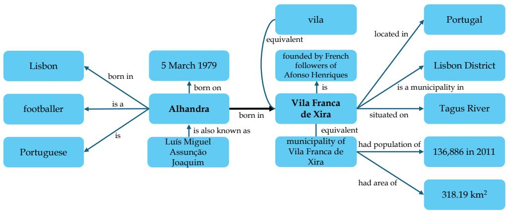
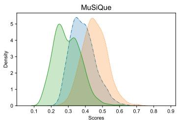
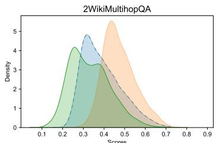
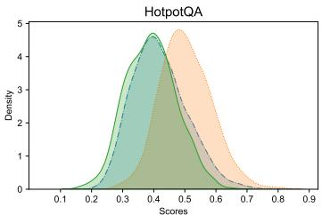

[1] AI@Meta. Llama 3 model card. 2024. URL https://github.com/meta-llama/llama3/ blob/main/MODEL_CARD.md.   
[2] B. AlKhamissi, M. Li, A. Celikyilmaz, M. T. Diab, and M. Ghazvininejad. A review on language models as knowledge bases. ArXiv, abs/2204.06031, 2022. URL https://arxiv. org/abs/2204.06031.   
[3] G. Angeli, M. J. Johnson Premkumar, and C. D. Manning. Leveraging linguistic structure for open domain information extraction. In C. Zong and M. Strube, editors, Proceedings of the 53rd Annual Meeting of the Association for Computational Linguistics and the 7th International Joint Conference on Natural Language Processing (Volume 1: Long Papers), pages 344–354, Beijing, China, July 2015. Association for Computational Linguistics. doi: 10.3115/v1/P15-1034. URL https://aclanthology.org/P15-1034.   
[4] A. Asai, K. Hashimoto, H. Hajishirzi, R. Socher, and C. Xiong. Learning to retrieve reasoning paths over wikipedia graph for question answering. In International Conference on Learning Representations, 2020. URL https://openreview.net/forum?id=SJgVHkrYDH.   
[5] M. Banko, M. J. Cafarella, S. Soderland, M. Broadhead, and O. Etzioni. Open information extraction from the web. In Proceedings of the 20th International Joint Conference on Artifical Intelligence, IJCAI’07, page 2670–2676, San Francisco, CA, USA, 2007. Morgan Kaufmann Publishers Inc.   
[6] S. Bhardwaj, S. Aggarwal, and Mausam. CaRB: A crowdsourced benchmark for open IE. In K. Inui, J. Jiang, V. Ng, and X. Wan, editors, Proceedings of the 2019 Conference on Empirical Methods in Natural Language Processing and the 9th International Joint Conference on Natural Language Processing (EMNLP-IJCNLP), pages 6262–6267, Hong Kong, China, Nov. 2019. Association for Computational Linguistics. doi: 10.18653/v1/D19-1651. URL https://aclanthology.org/D19-1651.   
[7] A. Bosselut, H. Rashkin, M. Sap, C. Malaviya, A. Celikyilmaz, and Y. Choi. COMET: Commonsense transformers for automatic knowledge graph construction. In A. Korhonen, D. Traum, and L. Màrquez, editors, Proceedings of the 57th Annual Meeting of the Association for Computational Linguistics, pages 4762–4779, Florence, Italy, July 2019. Association for Computational Linguistics. doi: 10.18653/v1/P19-1470. URL https://aclanthology. org/P19-1470.   
[8] B. Chen and A. L. Bertozzi. AutoKG: Efficient Automated Knowledge Graph Generation for Language Models. In 2023 IEEE International Conference on Big Data (BigData), pages 3117–3126, Los Alamitos, CA, USA, dec 2023. IEEE Computer Society. doi: 10. 1109/BigData59044.2023.10386454. URL https://doi.ieeecomputersociety.org/10. 1109/BigData59044.2023.10386454.   
[9] H. Chen, R. Pasunuru, J. Weston, and A. Celikyilmaz. Walking Down the Memory Maze: Beyond Context Limit through Interactive Reading. CoRR, abs/2310.05029, 2023. doi: 10.48550/ARXIV.2310.05029. URL https://doi.org/10.48550/arXiv.2310.05029.   
[10] T. Chen, H. Wang, S. Chen, W. Yu, K. Ma, X. Zhao, H. Zhang, and D. Yu. Dense x retrieval: What retrieval granularity should we use? arXiv preprint arXiv:2312.06648, 2023. URL https://arxiv.org/abs/2312.06648.   
[11] Y. Chen, S. Qian, H. Tang, X. Lai, Z. Liu, S. Han, and J. Jia. Longlora: Efficient fine-tuning of long-context large language models. arXiv:2309.12307, 2023.   
[12] Y. Chen, P. Cao, Y. Chen, K. Liu, and J. Zhao. Journey to the center of the knowledge neurons: Discoveries of language-independent knowledge neurons and degenerate knowledge neurons. Proceedings of the AAAI Conference on Artificial Intelligence, 38(16):17817–17825, Mar. 2024. doi: 10.1609/aaai.v38i16.29735. URL https://ojs.aaai.org/index.php/AAAI/ article/view/29735.   
[13] G. Csárdi and T. Nepusz. The igraph software package for complex network research. 2006. URL https://igraph.org/.

[14] R. Das, A. Godbole, D. Kavarthapu, Z. Gong, A. Singhal, M. Yu, X. Guo, T. Gao, H. Zamani, M. Zaheer, and A. McCallum. Multi-step entity-centric information retrieval for multihop question answering. In A. Fisch, A. Talmor, R. Jia, M. Seo, E. Choi, and D. Chen, editors, Proceedings of the 2nd Workshop on Machine Reading for Question Answering, pages 113–118, Hong Kong, China, Nov. 2019. Association for Computational Linguistics. doi: 10.18653/v1/D19-5816. URL https://aclanthology.org/D19-5816.   
[15] N. De Cao, W. Aziz, and I. Titov. Editing factual knowledge in language models. In M.-F. Moens, X. Huang, L. Specia, and S. W.-t. Yih, editors, Proceedings of the 2021 Conference on Empirical Methods in Natural Language Processing, pages 6491–6506, Online and Punta Cana, Dominican Republic, Nov. 2021. Association for Computational Linguistics. doi: 10.18653/ v1/2021.emnlp-main.522. URL https://aclanthology.org/2021.emnlp-main.522.   
[16] M. Ding, C. Zhou, Q. Chen, H. Yang, and J. Tang. Cognitive graph for multi-hop reading comprehension at scale. In A. Korhonen, D. Traum, and L. Màrquez, editors, Proceedings of the 57th Annual Meeting of the Association for Computational Linguistics, pages 2694–2703, Florence, Italy, July 2019. Association for Computational Linguistics. doi: 10.18653/v1/ P19-1259. URL https://aclanthology.org/P19-1259.   
[17] Y. Ding, L. L. Zhang, C. Zhang, Y. Xu, N. Shang, J. Xu, F. Yang, and M. Yang. Longrope: Extending llm context window beyond 2 million tokens. ArXiv, abs/2402.13753, 2024. URL https://api.semanticscholar.org/CorpusID:267770308.   
[18] D. Edge, H. Trinh, N. Cheng, J. Bradley, A. Chao, A. Mody, S. Truitt, and J. Larson. From local to global: A graph rag approach to query-focused summarization. 2024. URL https: //arxiv.org/abs/2404.16130.   
[19] H. Eichenbaum. A cortical–hippocampal system for declarative memory. Nature Reviews Neuroscience, 1:41–50, 2000. URL https://www.nature.com/articles/35036213.   
[20] Y. Fang, S. Sun, Z. Gan, R. Pillai, S. Wang, and J. Liu. Hierarchical graph network for multihop question answering. In B. Webber, T. Cohn, Y. He, and Y. Liu, editors, Proceedings of the 2020 Conference on Empirical Methods in Natural Language Processing (EMNLP), pages 8823–8838, Online, Nov. 2020. Association for Computational Linguistics. doi: 10.18653/v1/ 2020.emnlp-main.710. URL https://aclanthology.org/2020.emnlp-main.710.   
[21] Y. Fu. Challenges in deploying long-context transformers: A theoretical peak performance analysis, 2024. URL https://arxiv.org/abs/2405.08944.   
[22] Y. Fu, R. Panda, X. Niu, X. Yue, H. Hajishirzi, Y. Kim, and H. Peng. Data engineering for scaling language models to 128k context, 2024.   
[23] M. Geva, J. Bastings, K. Filippova, and A. Globerson. Dissecting recall of factual associations in auto-regressive language models. In H. Bouamor, J. Pino, and K. Bali, editors, Proceedings of the 2023 Conference on Empirical Methods in Natural Language Processing, EMNLP 2023, Singapore, December 6-10, 2023, pages 12216–12235. Association for Computational Linguistics, 2023. doi: 10.18653/V1/2023.EMNLP-MAIN.751. URL https://doi.org/ 10.18653/v1/2023.emnlp-main.751.   
[24] C. Gormley and Z. J. Tong. Elasticsearch: The definitive guide. 2015. URL https://www. elastic.co/guide/en/elasticsearch/guide/master/index.html.   
[25] T. L. Griffiths, M. Steyvers, and A. J. Firl. Google and the mind. Psychological Science, 18: 1069 – 1076, 2007. URL https://cocosci.princeton.edu/tom/papers/google.pdf.   
[26] J.-C. Gu, H.-X. Xu, J.-Y. Ma, P. Lu, Z.-H. Ling, K.-W. Chang, and N. Peng. Model Editing Can Hurt General Abilities of Large Language Models, 2024.   
[27] Y. Gu, X. Deng, and Y. Su. Don’t generate, discriminate: A proposal for grounding language models to real-world environments. In A. Rogers, J. Boyd-Graber, and N. Okazaki, editors, Proceedings of the 61st Annual Meeting of the Association for Computational Linguistics (Volume 1: Long Papers), pages 4928–4949, Toronto, Canada, July 2023. Association for Computational Linguistics. doi: 10.18653/v1/2023.acl-long.270. URL https://aclanthology.org/2023.acl-long.270.

[28] W. Gurnee and M. Tegmark. Language models represent space and time. In The Twelfth International Conference on Learning Representations, 2024. URL https://openreview. net/forum?id=jE8xbmvFin.   
[29] J. Han, N. Collier, W. Buntine, and E. Shareghi. PiVe: Prompting with Iterative Verification Improving Graph-based Generative Capability of LLMs, 2023.   
[30] T. H. Haveliwala. Topic-sensitive pagerank. In D. Lassner, D. D. Roure, and A. Iyengar, editors, Proceedings of the Eleventh International World Wide Web Conference, WWW 2002, May 7-11, 2002, Honolulu, Hawaii, USA, pages 517–526. ACM, 2002. doi: 10.1145/511446.511513. URL https://dl.acm.org/doi/10.1145/511446.511513.   
[31] Q. He, Y. Wang, and W. Wang. Can language models act as knowledge bases at scale?, 2024.   
[32] Z. He, L. Karlinsky, D. Kim, J. McAuley, D. Krotov, and R. Feris. CAMELot: Towards large language models with training-free consolidated associative memory. In First Workshop on Long-Context Foundation Models @ ICML 2024, 2024. URL https://openreview.net/ forum?id=VLDTzg1a4Y.   
[33] X. Ho, A.-K. Duong Nguyen, S. Sugawara, and A. Aizawa. Constructing a multi-hop QA dataset for comprehensive evaluation of reasoning steps. In D. Scott, N. Bel, and C. Zong, editors, Proceedings of the 28th International Conference on Computational Linguistics, pages 6609–6625, Barcelona, Spain (Online), Dec. 2020. International Committee on Computational Linguistics. doi: 10.18653/v1/2020.coling-main.580. URL https://aclanthology.org/ 2020.coling-main.580.   
[34] P.-L. Huguet Cabot and R. Navigli. REBEL: Relation extraction by end-to-end language generation. In M.-F. Moens, X. Huang, L. Specia, and S. W.-t. Yih, editors, Findings of the Association for Computational Linguistics: EMNLP 2021, pages 2370–2381, Punta Cana, Dominican Republic, Nov. 2021. Association for Computational Linguistics. doi: 10.18653/ v1/2021.findings-emnlp.204. URL https://aclanthology.org/2021.findings-emnlp. 204.   
[35] G. Izacard, M. Caron, L. Hosseini, S. Riedel, P. Bojanowski, A. Joulin, and E. Grave. Unsupervised dense information retrieval with contrastive learning, 2021. URL https: //arxiv.org/abs/2112.09118.   
[36] G. Izacard, P. Lewis, M. Lomeli, L. Hosseini, F. Petroni, T. Schick, J. A. Yu, A. Joulin, S. Riedel, and E. Grave. Few-shot learning with retrieval augmented language models. ArXiv, abs/2208.03299, 2022. URL https://arxiv.org/abs/2208.03299.   
[37] J. Jiang, K. Zhou, Z. Dong, K. Ye, X. Zhao, and J.-R. Wen. StructGPT: A general framework for large language model to reason over structured data. In H. Bouamor, J. Pino, and K. Bali, editors, Proceedings of the 2023 Conference on Empirical Methods in Natural Language Processing, pages 9237–9251, Singapore, Dec. 2023. Association for Computational Linguistics. doi: 10.18653/v1/2023.emnlp-main.574. URL https://aclanthology.org/2023.emnlp-main.574.   
[38] Z. Jiang, F. Xu, L. Gao, Z. Sun, Q. Liu, J. Dwivedi-Yu, Y. Yang, J. Callan, and G. Neubig. Active retrieval augmented generation. In H. Bouamor, J. Pino, and K. Bali, editors, Proceedings of the 2023 Conference on Empirical Methods in Natural Language Processing, pages 7969–7992, Singapore, Dec. 2023. Association for Computational Linguistics. doi: 10.18653/ v1/2023.emnlp-main.495. URL https://aclanthology.org/2023.emnlp-main.495.   
[39] S. Kambhampati. Can large language models reason and plan? Annals of the New York Academy of Sciences, 2024. URL https://nyaspubs.onlinelibrary.wiley.com/doi/ abs/10.1111/nyas.15125.   
[40] W. Kwon, Z. Li, S. Zhuang, Y. Sheng, L. Zheng, C. H. Yu, J. E. Gonzalez, H. Zhang, and I. Stoica. Efficient memory management for large language model serving with pagedattention. In Proceedings of the ACM SIGOPS 29th Symposium on Operating Systems Principles, 2023.

[41] M. Levy, A. Jacoby, and Y. Goldberg. Same task, more tokens: the impact of input length on the reasoning performance of large language models, 2024.   
[42] P. Lewis, E. Perez, A. Piktus, F. Petroni, V. Karpukhin, N. Goyal, H. Küttler, M. Lewis, W.-t. Yih, T. Rocktäschel, S. Riedel, and D. Kiela. Retrieval-augmented generation for knowledge-intensive NLP tasks. In Proceedings of the 34th International Conference on Neural Information Processing Systems, NIPS ’20, Red Hook, NY, USA, 2020. Curran Associates Inc. ISBN 9781713829546. URL https://dl.acm.org/doi/abs/10.5555/ 3495724.3496517.   
[43] R. Li and X. Du. Leveraging structured information for explainable multi-hop question answering and reasoning. In H. Bouamor, J. Pino, and K. Bali, editors, Findings of the Association for Computational Linguistics: EMNLP 2023, pages 6779–6789, Singapore, Dec. 2023. Association for Computational Linguistics. doi: 10.18653/v1/2023.findings-emnlp.452. URL https://aclanthology.org/2023.findings-emnlp.452.   
[44] S. Li, X. Li, L. Shang, X. Jiang, Q. Liu, C. Sun, Z. Ji, and B. Liu. Hopretriever: Retrieve hops over wikipedia to answer complex questions. Proceedings of the AAAI Conference on Artificial Intelligence, 35:13279–13287, 05 2021. doi: 10.1609/aaai.v35i15.17568.   
[45] T. Li, G. Zhang, Q. D. Do, X. Yue, and W. Chen. Long-context LLMs Struggle with Long In-context Learning, 2024.   
[46] Z. Li, N. Zhang, Y. Yao, M. Wang, X. Chen, and H. Chen. Unveiling the pitfalls of knowledge editing for large language models. In The Twelfth International Conference on Learning Representations, 2024. URL https://openreview.net/forum?id=fNktD3ib16.   
[47] Y. Liu, X. Peng, T. Du, J. Yin, W. Liu, and X. Zhang. ERA-CoT: Improving chain-ofthought through entity relationship analysis. In L.-W. Ku, A. Martins, and V. Srikumar, editors, Proceedings of the 62nd Annual Meeting of the Association for Computational Linguistics (Volume 1: Long Papers), pages 8780–8794, Bangkok, Thailand, Aug. 2024. Association for Computational Linguistics. doi: 10.18653/v1/2024.acl-long.476. URL https://aclanthology.org/2024.acl-long.476.   
[48] L. LUO, Y.-F. Li, R. Haf, and S. Pan. Reasoning on graphs: Faithful and interpretable large language model reasoning. In The Twelfth International Conference on Learning Representations, 2024. URL https://openreview.net/forum?id=ZGNWW7xZ6Q.   
[49] K. Meng, D. Bau, A. Andonian, and Y. Belinkov. Locating and editing factual associations in gpt. In Neural Information Processing Systems, 2022.   
[50] E. Mitchell, C. Lin, A. Bosselut, C. Finn, and C. D. Manning. Fast model editing at scale. ArXiv, abs/2110.11309, 2021.   
[51] E. Mitchell, C. Lin, A. Bosselut, C. D. Manning, and C. Finn. Memory-based model editing at scale. ArXiv, abs/2206.06520, 2022.   
[52] T. T. Nguyen, T. T. Huynh, P. L. Nguyen, A. W.-C. Liew, H. Yin, and Q. V. H. Nguyen. A survey of machine unlearning. arXiv preprint arXiv:2209.02299, 2022.   
[53] J. Ni, C. Qu, J. Lu, Z. Dai, G. Hernandez Abrego, J. Ma, V. Zhao, Y. Luan, K. Hall, M.- W. Chang, and Y. Yang. Large dual encoders are generalizable retrievers. In Y. Goldberg, Z. Kozareva, and Y. Zhang, editors, Proceedings of the 2022 Conference on Empirical Methods in Natural Language Processing, pages 9844–9855, Abu Dhabi, United Arab Emirates, Dec. 2022. Association for Computational Linguistics. doi: 10.18653/v1/2022.emnlp-main.669. URL https://aclanthology.org/2022.emnlp-main.669.   
[54] Y. Nie, S. Wang, and M. Bansal. Revealing the importance of semantic retrieval for machine reading at scale. In K. Inui, J. Jiang, V. Ng, and X. Wan, editors, Proceedings of the 2019 Conference on Empirical Methods in Natural Language Processing and the 9th International Joint Conference on Natural Language Processing (EMNLP-IJCNLP), pages 2553–2566, Hong Kong, China, Nov. 2019. Association for Computational Linguistics. doi: 10.18653/v1/ D19-1258. URL https://aclanthology.org/D19-1258.

[55] OpenAI. GPT-3.5 Turbo, 2024. URL https://platform.openai.com/docs/models/ gpt-3-5-turbo.   
[56] S. Pan, L. Luo, Y. Wang, C. Chen, J. Wang, and X. Wu. Unifying large language models and knowledge graphs: A roadmap. IEEE Transactions on Knowledge and Data Engineering, pages 1–20, 2024. doi: 10.1109/TKDE.2024.3352100.   
[57] J. Park, A. Patel, O. Z. Khan, H. J. Kim, and J.-K. Kim. Graph elicitation for guiding multi-step reasoning in large language models, 2024. URL https://arxiv.org/abs/2311.09762.   
[58] S. Park and J. Bak. Memoria: Resolving fateful forgetting problem through human-inspired memory architecture. In ICML, 2024. URL https://openreview.net/forum?id= yTz0u4B8ug.   
[59] A. Paszke, S. Gross, F. Massa, A. Lerer, J. Bradbury, G. Chanan, T. Killeen, Z. Lin, N. Gimelshein, L. Antiga, A. Desmaison, A. Köpf, E. Z. Yang, Z. DeVito, M. Raison, A. Tejani, S. Chilamkurthy, B. Steiner, L. Fang, J. Bai, and S. Chintala. Pytorch: An imperative style, high-performance deep learning library. In H. M. Wallach, H. Larochelle, A. Beygelzimer, F. d’Alché-Buc, E. B. Fox, and R. Garnett, editors, Advances in Neural Information Processing Systems 32: Annual Conference on Neural Information Processing Systems 2019, NeurIPS 2019, December 8-14, 2019, Vancouver, BC, Canada, pages 8024–8035, 2019. URL https://dl.acm.org/doi/10.5555/3454287.3455008.   
[60] K. Pei, I. Jindal, K. C.-C. Chang, C. Zhai, and Y. Li. When to use what: An in-depth comparative empirical analysis of OpenIE systems for downstream applications. In A. Rogers, J. Boyd-Graber, and N. Okazaki, editors, Proceedings of the 61st Annual Meeting of the Association for Computational Linguistics (Volume 1: Long Papers), pages 929–949, Toronto, Canada, July 2023. Association for Computational Linguistics. doi: 10.18653/v1/2023. acl-long.53. URL https://aclanthology.org/2023.acl-long.53.   
[61] B. Peng, J. Quesnelle, H. Fan, and E. Shippole. Yarn: Efficient context window extension of large language models, 2023.   
[62] F. Petroni, T. Rocktäschel, S. Riedel, P. Lewis, A. Bakhtin, Y. Wu, and A. Miller. Language models as knowledge bases? In K. Inui, J. Jiang, V. Ng, and X. Wan, editors, Proceedings of the 2019 Conference on Empirical Methods in Natural Language Processing and the 9th International Joint Conference on Natural Language Processing (EMNLP-IJCNLP), pages 2463–2473, Hong Kong, China, Nov. 2019. Association for Computational Linguistics. doi: 10.18653/v1/D19-1250. URL https://aclanthology.org/D19-1250.   
[63] O. Press, M. Zhang, S. Min, L. Schmidt, N. Smith, and M. Lewis. Measuring and narrowing the compositionality gap in language models. In H. Bouamor, J. Pino, and K. Bali, editors, Findings of the Association for Computational Linguistics: EMNLP 2023, pages 5687–5711, Singapore, Dec. 2023. Association for Computational Linguistics. doi: 10.18653/v1/2023. findings-emnlp.378. URL https://aclanthology.org/2023.findings-emnlp.378.   
[64] O. Press, M. Zhang, S. Min, L. Schmidt, N. A. Smith, and M. Lewis. Measuring and narrowing the compositionality gap in language models, 2023. URL https://openreview.net/ forum?id=PUwbwZJz9dO.   
[65] L. Qiu, Y. Xiao, Y. Qu, H. Zhou, L. Li, W. Zhang, and Y. Yu. Dynamically fused graph network for multi-hop reasoning. In A. Korhonen, D. Traum, and L. Màrquez, editors, Proceedings of the 57th Annual Meeting of the Association for Computational Linguistics, pages 6140–6150, Florence, Italy, July 2019. Association for Computational Linguistics. doi: 10.18653/v1/P19-1617. URL https://aclanthology.org/P19-1617.   
[66] O. Ram, Y. Levine, I. Dalmedigos, D. Muhlgay, A. Shashua, K. Leyton-Brown, and Y. Shoham. In-context retrieval-augmented language models. Transactions of the Association for Computational Linguistics, 11:1316–1331, 2023. doi: 10.1162/tacl_a_00605. URL https://aclanthology.org/2023.tacl-1.75.

[67] G. Ramesh, M. N. Sreedhar, and J. Hu. Single sequence prediction over reasoning graphs for multi-hop QA. In A. Rogers, J. Boyd-Graber, and N. Okazaki, editors, Proceedings of the 61st Annual Meeting of the Association for Computational Linguistics (Volume 1: Long Papers), pages 11466–11481, Toronto, Canada, July 2023. Association for Computational Linguistics. doi: 10.18653/v1/2023.acl-long.642. URL https://aclanthology.org/2023.acl-long. 642.   
[68] M. Reid, N. Savinov, D. Teplyashin, D. Lepikhin, T. Lillicrap, J.-b. Alayrac, R. Soricut, A. Lazaridou, O. Firat, J. Schrittwieser, et al. Gemini 1.5: Unlocking multimodal understanding across millions of tokens of context. arXiv preprint arXiv:2403.05530, 2024. URL https: //arxiv.org/abs/2403.05530.   
[69] S. E. Robertson and S. Walker. Some simple effective approximations to the 2-poisson model for probabilistic weighted retrieval. In W. B. Croft and C. J. van Rijsbergen, editors, Proceedings of the 17th Annual International ACM-SIGIR Conference on Research and Development in Information Retrieval. Dublin, Ireland, 3-6 July 1994 (Special Issue of the SIGIR Forum), pages 232–241. ACM/Springer, 1994. doi: 10.1007/978-1-4471-2099-5\_24. URL https://link.springer.com/chapter/10.1007/978-1-4471-2099-5_24.   
[70] K. Santhanam, O. Khattab, J. Saad-Falcon, C. Potts, and M. Zaharia. ColBERTv2: Effective and efficient retrieval via lightweight late interaction. In M. Carpuat, M.-C. de Marneffe, and I. V. Meza Ruiz, editors, Proceedings of the 2022 Conference of the North American Chapter of the Association for Computational Linguistics: Human Language Technologies, pages 3715– 3734, Seattle, United States, July 2022. Association for Computational Linguistics. doi: 10. 18653/v1/2022.naacl-main.272. URL https://aclanthology.org/2022.naacl-main. 272.   
[71] P. Sarthi, S. Abdullah, A. Tuli, S. Khanna, A. Goldie, and C. D. Manning. RAPTOR: recursive abstractive processing for tree-organized retrieval. CoRR, abs/2401.18059, 2024. doi: 10.48550/ARXIV.2401.18059. URL https://arxiv.org/abs/2401.18059.   
[72] Z. Shao, Y. Gong, Y. Shen, M. Huang, N. Duan, and W. Chen. Enhancing retrieval-augmented large language models with iterative retrieval-generation synergy. In H. Bouamor, J. Pino, and K. Bali, editors, Findings of the Association for Computational Linguistics: EMNLP 2023, pages 9248–9274, Singapore, Dec. 2023. Association for Computational Linguistics. doi: 10.18653/v1/2023.findings-emnlp.620. URL https://aclanthology.org/2023. findings-emnlp.620.   
[73] W. Shi, S. Min, M. Yasunaga, M. Seo, R. James, M. Lewis, L. Zettlemoyer, and W. tau Yih. Replug: Retrieval-augmented black-box language models. ArXiv, abs/2301.12652, 2023. URL https://api.semanticscholar.org/CorpusID:256389797.   
[74] J. Sun, C. Xu, L. Tang, S. Wang, C. Lin, Y. Gong, L. Ni, H.-Y. Shum, and J. Guo. Thinkon-graph: Deep and responsible reasoning of large language model on knowledge graph. In The Twelfth International Conference on Learning Representations, 2024. URL https: //openreview.net/forum?id=nnVO1PvbTv.   
[75] T. J. Teyler and P. Discenna. The hippocampal memory indexing theory. Behavioral neuroscience, 100 2:147–54, 1986. URL https://pubmed.ncbi.nlm.nih.gov/3008780/.   
[76] T. J. Teyler and J. W. Rudy. The hippocampal indexing theory and episodic memory: Updating the index. Hippocampus, 17, 2007. URL https://pubmed.ncbi.nlm.nih.gov/ 17696170/.   
[77] H. Trivedi, N. Balasubramanian, T. Khot, and A. Sabharwal. MuSiQue: Multihop questions via single-hop question composition. Trans. Assoc. Comput. Linguistics, 10:539–554, 2022. doi: 10.1162/TACL\_A\_00475. URL https://aclanthology.org/2022.tacl-1.31/.   
[78] H. Trivedi, N. Balasubramanian, T. Khot, and A. Sabharwal. Interleaving retrieval with chainof-thought reasoning for knowledge-intensive multi-step questions. In A. Rogers, J. Boyd-Graber, and N. Okazaki, editors, Proceedings of the 61st Annual Meeting of the Association for Computational Linguistics (Volume 1: Long Papers), pages 10014–10037, Toronto, Canada, July 2023. Association for Computational Linguistics. doi: 10.18653/v1/2023.acl-long.557. URL https://aclanthology.org/2023.acl-long.557.

[79] C. Wang, X. Liu, Y. Yue, X. Tang, T. Zhang, C. Jiayang, Y. Yao, W. Gao, X. Hu, Z. Qi, Y. Wang, L. Yang, J. Wang, X. Xie, Z. Zhang, and Y. Zhang. Survey on factuality in large language models: Knowledge, retrieval and domain-specificity, 2023.   
[80] J. Wang, Q. Sun, N. Chen, X. Li, and M. Gao. Boosting language models reasoning with chain-of-knowledge prompting, 2023.   
[81] X. Wang, J. Wei, D. Schuurmans, Q. V. Le, E. H. Chi, S. Narang, A. Chowdhery, and D. Zhou. Self-consistency improves chain of thought reasoning in language models. In The Eleventh International Conference on Learning Representations, 2023. URL https: //openreview.net/forum?id=1PL1NIMMrw.   
[82] Y. Wang, Y. Gao, X. Chen, H. Jiang, S. Li, J. Yang, Q. Yin, Z. Li, X. Li, B. Yin, J. Shang, and J. Mcauley. MEMORYLLM: Towards self-updatable large language models. In R. Salakhutdinov, Z. Kolter, K. Heller, A. Weller, N. Oliver, J. Scarlett, and F. Berkenkamp, editors, Proceedings of the 41st International Conference on Machine Learning, volume 235 of Proceedings of Machine Learning Research, pages 50453–50466. PMLR, 21–27 Jul 2024. URL https://proceedings.mlr.press/v235/wang24s.html.   
[83] J. Wei, X. Wang, D. Schuurmans, M. Bosma, brian ichter, F. Xia, E. H. Chi, Q. V. Le, and D. Zhou. Chain of thought prompting elicits reasoning in large language models. In A. H. Oh, A. Agarwal, D. Belgrave, and K. Cho, editors, Advances in Neural Information Processing Systems, 2022. URL https://openreview.net/forum?id=_VjQlMeSB_J.   
[84] Y. Wen, Z. Wang, and J. Sun. Mindmap: Knowledge graph prompting sparks graph of thoughts in large language models. arXiv preprint arXiv:2308.09729, 2023.   
[85] P. West, C. Bhagavatula, J. Hessel, J. Hwang, L. Jiang, R. Le Bras, X. Lu, S. Welleck, and Y. Choi. Symbolic knowledge distillation: from general language models to commonsense models. In M. Carpuat, M.-C. de Marneffe, and I. V. Meza Ruiz, editors, Proceedings of the 2022 Conference of the North American Chapter of the Association for Computational Linguistics: Human Language Technologies, pages 4602–4625, Seattle, United States, July 2022. Association for Computational Linguistics. doi: 10.18653/v1/2022.naacl-main.341. URL https://aclanthology.org/2022.naacl-main.341.   
[86] T. Wolf, L. Debut, V. Sanh, J. Chaumond, C. Delangue, A. Moi, P. Cistac, T. Rault, R. Louf, M. Funtowicz, J. Davison, S. Shleifer, P. von Platen, C. Ma, Y. Jernite, J. Plu, C. Xu, T. L. Scao, S. Gugger, M. Drame, Q. Lhoest, and A. M. Rush. Huggingface’s transformers: State-of-the-art natural language processing. ArXiv, abs/1910.03771, 2019. URL https: //arxiv.org/abs/1910.03771.   
[87] J. Xie, K. Zhang, J. Chen, R. Lou, and Y. Su. Adaptive chameleon or stubborn sloth: Revealing the behavior of large language models in knowledge conflicts. In The Twelfth International Conference on Learning Representations, 2024. URL https://openreview.net/forum? id=auKAUJZMO6.   
[88] W. Xiong, X. Li, S. Iyer, J. Du, P. Lewis, W. Y. Wang, Y. Mehdad, S. Yih, S. Riedel, D. Kiela, and B. Oguz. Answering complex open-domain questions with multi-hop dense retrieval. In International Conference on Learning Representations, 2021. URL https://openreview. net/forum?id=EMHoBG0avc1.   
[89] Z. Yang, P. Qi, S. Zhang, Y. Bengio, W. W. Cohen, R. Salakhutdinov, and C. D. Manning. HotpotQA: A dataset for diverse, explainable multi-hop question answering. In E. Riloff, D. Chiang, J. Hockenmaier, and J. Tsujii, editors, Proceedings of the 2018 Conference on Empirical Methods in Natural Language Processing, Brussels, Belgium, October 31 - November 4, 2018, pages 2369–2380. Association for Computational Linguistics, 2018. doi: 10.18653/V1/D18-1259. URL https://aclanthology.org/D18-1259/.   
[90] S. Yao, J. Zhao, D. Yu, N. Du, I. Shafran, K. Narasimhan, and Y. Cao. ReAct: Synergizing reasoning and acting in language models. In International Conference on Learning Representations (ICLR), 2023.

[91] M. Yasunaga, A. Bosselut, H. Ren, X. Zhang, C. D. Manning, P. Liang, and J. Leskovec. Deep bidirectional language-knowledge graph pretraining. In Neural Information Processing Systems (NeurIPS), 2022. URL https://arxiv.org/abs/2210.09338.   
[92] O. Yoran, T. Wolfson, B. Bogin, U. Katz, D. Deutch, and J. Berant. Answering questions by meta-reasoning over multiple chains of thought. In The 2023 Conference on Empirical Methods in Natural Language Processing, 2023. URL https://openreview.net/forum? id=ebSOK1nV2r.   
[93] W. Yu, D. Iter, S. Wang, Y. Xu, M. Ju, S. Sanyal, C. Zhu, M. Zeng, and M. Jiang. Generate rather than retrieve: Large language models are strong context generators. In The Eleventh International Conference on Learning Representations, 2023. URL https://openreview. net/forum?id=fB0hRu9GZUS.   
[94] K. Zhang, B. Jimenez Gutierrez, and Y. Su. Aligning instruction tasks unlocks large language models as zero-shot relation extractors. In A. Rogers, J. Boyd-Graber, and N. Okazaki, editors, Findings of the Association for Computational Linguistics: ACL 2023, pages 794–812, Toronto, Canada, July 2023. Association for Computational Linguistics. doi: 10.18653/v1/ 2023.findings-acl.50. URL https://aclanthology.org/2023.findings-acl.50.   
[95] N. Zhang, Y. Yao, B. Tian, P. Wang, S. Deng, M. Wang, Z. Xi, S. Mao, J. Zhang, Y. Ni, et al. A comprehensive study of knowledge editing for large language models. arXiv preprint arXiv:2401.01286, 2024.   
[96] X. Zhang, Y. Chen, S. Hu, Z. Xu, J. Chen, M. K. Hao, X. Han, Z. L. Thai, S. Wang, Z. Liu, and M. Sun. ∞bench: Extending long context evaluation beyond 100k tokens, 2024.   
[97] Z. Zhong, Z. Wu, C. D. Manning, C. Potts, and D. Chen. Mquake: Assessing knowledge editing in language models via multi-hop questions. In Conference on Empirical Methods in Natural Language Processing, 2023. URL https://aclanthology.org/2023.emnlp-main.971. pdf.   
[98] S. Zhou, B. Yu, A. Sun, C. Long, J. Li, and J. Sun. A survey on neural open information extraction: Current status and future directions. In L. D. Raedt, editor, Proceedings of the Thirty-First International Joint Conference on Artificial Intelligence, IJCAI-22, pages 5694– 5701. International Joint Conferences on Artificial Intelligence Organization, 7 2022. doi: 10.24963/ijcai.2022/793. URL https://doi.org/10.24963/ijcai.2022/793. Survey Track.   
[99] H. Zhu, H. Peng, Z. Lyu, L. Hou, J. Li, and J. Xiao. Pre-training language model incorporating domain-specific heterogeneous knowledge into a unified representation. Expert Systems with Applications, 215:119369, 2023. ISSN 0957-4174. doi: https://doi.org/10.1016/ j.eswa.2022.119369. URL https://www.sciencedirect.com/science/article/pii/ S0957417422023879.   
[100] Y. Zhu, L. Pang, Y. Lan, H. Shen, and X. Cheng. Adaptive information seeking for opendomain question answering. In M.-F. Moens, X. Huang, L. Specia, and S. W.-t. Yih, editors, Proceedings of the 2021 Conference on Empirical Methods in Natural Language Processing, pages 3615–3626, Online and Punta Cana, Dominican Republic, Nov. 2021. Association for Computational Linguistics. doi: 10.18653/v1/2021.emnlp-main.293. URL https:// aclanthology.org/2021.emnlp-main.293.

# Appendices

Within this supplementary material, we elaborate on the following aspects:

• Appendix A: HippoRAG Pipeline Example   
• Appendix B: Dataset Comparison   
• Appendix C: Ablation Statistics   
• Appendix D: Intrinsic OpenIE Evaluation   
• Appendix E: Path-Finding Multi-Hop Case Study   
• Appendix F: Error Analysis   
• Appendix G: Cost and Efficiency Comparison   
• Appendix H: Implementation Details & Compute Requirements   
• Appendix I: LLM Prompts

# Question & Answer

Question In which district was Alhandra born?

Answer Lisbon

# Supporting Passages

# 1. Alhandra (footballer)

Luís Miguel Assunção Joaquim (born 5 March 1979 in Vila Franca de Xira, Lisbon), known as Alhandra, is a Portuguese retired footballer who played mainly as a left back – he could also appear as a midfielder.

# 2. Vila Franca de Xira

Vila Franca de Xira is a municipality in the Lisbon District in Portugal. The population in 2011 was 136,886, in an area of $3 1 8 . 1 9 \mathrm { k m } ^ { 2 }$ . Situated on both banks of the Tagus River, $3 2 \mathrm { k m }$ north-east of the Portuguese capital Lisbon, settlement in the area dates back to neolithic times, as evidenced by findings in the Cave of Pedra Furada. Vila Franca de Xira is said to have been founded by French followers of Portugal's first king, Afonso Henriques, around 1200.

# Distractor Passages (Excerpts)

# 1. Chirakkalkulam

Chirakkalkulam is a small residential area near Kannur town of Kannur District, Kerala state, South India. Chirakkalkulam is located between Thayatheru and Kannur City. Chirakkalkulam's significance arises from the birth of the historic Arakkal Kingdom.

# 2. Frank T. and Polly Lewis House

The Frank T. and Polly Lewis House is located in Lodi, Wisconsin, United States. It was added to the National Register of Historic Places in 2009. The house is located within the Portage Street Historic District.

# 3. Birth certificate

In the U.S., the issuance of birth certificates is a function of the Vital Records Office of the states, capital district, territories and former territories …

Figure 3: HippoRAG Pipeline Example (Question and Annotations). (Top) We provide an example question and its answer. (Middle & Bottom) The supporting and distractor passages for this question. Two supporting passages are needed to solve this question. The excerpts of the distractor passages are related to the “district” mentioned in the question.

# A HippoRAG Pipeline Example

To better demonstrate how our HippoRAG pipeline works, we use the path-following example from the MuSiQue dataset shown in Table 7. We use HippoRAG’s indexing and retrieval processes to follow this question and a subset of the associated corpus. The question, its answer, and its supporting and distractor passages are as shown in Figure 3. The indexing stage is shown in Figure 4, showing both the OpenIE procedure as well as the relevant subgraph of our KG. Finally, we illustrate the retrieval stage in Figure 5, including query NER, query node retrieval, how the PPR algorithm changes node probabilities, and how the top retrieval results are calculated.

# Indexing: Passage NER and OpenIE for Supporting Passages

# 1. Alhandra (footballer)

NER:

["5 March 1979", "Alhandra", "Lisbon", "Luís Miguel Assunção Joaquim", "Portuguese", "Vila Franca de Xira"]

OpenIE:

[("Alhandra", "is a", "footballer"),

("Alhandra", "born in", "Vila Franca de Xira"),

("Alhandra", "born in", "Lisbon"),

("Alhandra", "born on", "5 March 1979"),

("Alhandra", "is", "Portuguese"),

("Luís Miguel Assunção Joaquim", "is also known as", "Alhandra")]

# 2. Vila Franca de Xira

NER:

["2011", "Afonso Henriques", "Cave of Pedra Furada", "French", "Lisbon", "Lisbon District", "Portugal", "Tagus River", "Vila Franca de Xira"]

OpenIE:

[("Vila Franca de Xira", "is a municipality in", "Lisbon District"),

("Vila Franca de Xira", "located in", "Portugal"),

("Vila Franca de Xira", "situated on", "Tagus River"),

("Vila Franca de Xira", "is", "founded by French followers of Afonso Henriques"),

("Tagus River", "located near", "Lisbon"),

("Cave of Pedra Furada", "evidenced settlement in", "neolithic times"),

("Afonso Henriques", "was Portugal's first king in", "1200"),

("Vila Franca de Xira", "had population of", "136,886 in 2011"),

("Vila Franca de Xira", "has area of", $" 3 1 8 . 1 9 \mathrm { k m } ^ { 2 ! 1 } )$

  
Indexing: Subgraph Related to the Question   
Figure 4: HippoRAG Pipeline Example (Indexing). NER and OpenIE are sequentially conducted on each passage of the corpus. Thus, an open knowledge graph is formed for the entire corpus. We only show the relevant subgraph from the KG.

# Retrieval: Query NER & Node Retrieval

Question In which district was Alhandra born?

NER ["Alhandra"]

Node Retrieval {"Alhandra": "Alhandra"}

# Retrieval: PPR

# Node Probabilities Changes by PPR

<table><tr><td>Alhandra</td><td>1.000 ⇒ 0.533</td><td>5 March 1979</td><td>0.000 ⇒ 0.045</td></tr><tr><td>Vila Franca de Xira</td><td>0.000 ⇒ 0.054</td><td>Luís Miguel Assunção Joaquim</td><td>0.000 ⇒ 0.044</td></tr><tr><td>Lisbon</td><td>0.000 ⇒ 0.049</td><td>Portugal</td><td>0.000 ⇒ 0.009</td></tr><tr><td>footballer</td><td>0.000 ⇒ 0.047</td><td>Tagus River</td><td>0.000 ⇒ 0.007</td></tr><tr><td>Portuguese</td><td>0.000 ⇒ 0.046</td><td>José Pinto Coelho</td><td>0.000 ⇒ 0.004</td></tr><tr><td>...</td><td></td><td></td><td></td></tr></table>

# Retrieval: Top Results

*Top-ranked nodes from PPR are highlighted.

# 1. Alhandra (footballer)

Luís Miguel Assunção Joaquim (born 5 March 1979 in Vila Franca de Xira, Lisbon), known as Alhandra, is a Portuguese retired footballer who played mainly as a left back – he could also appear as a midfielder.

# 2. Vila Franca de Xira

Vila Franca de Xira is a municipality in the Lisbon District in Portugal. The population in 2011 was 136,886, in an area of $3 1 8 . 1 9 \mathrm { k m } ^ { 2 }$ . Situated on both banks of the Tagus River, $3 2 \mathrm { k m }$ north-east of the Portuguese capital Lisbon, settlement in the area dates back to neolithic times, as evidenced by findings in the Cave of Pedra Furada. Vila Franca de Xira is said to have been founded by French followers of Portugal's first king, Afonso Henriques, around 1200.

# 3. Portugal

Portuguese is the official language of Portugal. Portuguese is a Romance language that originated in what is now Galicia and Northern Portugal, originating from Galician-Portuguese, which was the common language of the Galician and Portuguese people until the independence of Portugal. Particularly in the North of Portugal, there are still many similarities between the Galician culture and the Portuguese culture. Galicia is a consultative observer of the Community of Portuguese Language Countries. According to the Ethnologue of Languages, Portuguese and Spanish have a lexical similarity of $8 9 \%$ - educated speakers of each language can communicate easily with one another.

# 4. Huguenots

The first Huguenots to leave France sought freedom from persecution in Switzerland and the Netherlands … A fort, named Fort Coligny, was built to protect them from attack from the Portuguese troops and Brazilian Native Americans. It was an attempt to establish a French colony in South America. The fort was destroyed in 1560 by the Portuguese, who captured part of the Huguenots. The Portuguese threatened the prisoners with death if they did not convert to Catholicism …

# 5. East Timor

Democratic Republic of Timor - Leste Repúblika Demokrátika Timór Lorosa'e (Tetum) República Democrática de Timor - Leste (Portuguese) Flag Coat of arms Motto: Unidade, Acção, Progresso (Portuguese) Unidade, Asaun, Progresu (Tetum) (English: ``Unity, Action, Progress '') Anthem: Pátria (Portuguese) (English:`` Fatherland'') Capital and largest city Dili $8 \textdegree 2 0 \textdegree$ S $1 2 5 ^ { \circ } 2 0 ^ { \prime } \mathrm { E }$ / $8 . 3 4 ^ { \circ } \mathrm { ~ S ~ } 1 2 5 . 3 4 ^ { \circ }$ E / - 8.34; 125.34 Coordinates: $8 ^ { \circ } 2 0 ^ { \prime } 5 1 2 5 ^ { \circ } 2 0 ^ { \prime } \mathrm { E }$ / $8 . 3 4  { ^ \circ } \mathrm { ~ S ~ } 1 2 5 . 3 4  { ^ \circ } \mathrm { ~ E ~ }$ / - 8.34; 125.34 …

Figure 5: HippoRAG Pipeline Example (Retrieval). For retrieval, the named entities in the query are extracted from the question (Top), after which the query nodes are chosen using a retrieval encoder. In this case, the name of the query named entity, “Alhandra”, is equivalent to its KG node. (Middle) We then set the personalized probabilities for PPR based on the retrieved query nodes. After PPR, the query node probability is distributed according to the subgraph in Figure 4, leading to some probability mass on the node “Vila France de Xira”. (Bottom) These node probabilities are then summed over the passages they appear in to obtain the passage-level ranking. The top-ranked nodes after PPR are highlighted in the top-ranked passages.

# B Dataset Comparison

To analyze the differences between the three datasets we use, we pay special attention to the quality of the distractor passages, i.e., whether they can be effectively confounded with the supporting passages. We use Contriever [35] to calculate the match score between questions and candidate passages and show their densities in Figure 6. In an ideal case, the distribution of distractor scores should be close to the mean of the support passage scores. However, it can be seen that the distribution of the distractor scores in HotpotQA is much closer to the lower bound of the support passage scores compared to the other two datasets.

Figure 6: Density of similarity scores of candidate passages (distractors and supporting passages) obtained by Contriever. The similarity score of HotpotQA distractors is not substantially larger than that of the least similar supporting passages, meaning that these distractors are not very effective.   
  
Distractors Max supporting document Min supporting document

# C Ablation Statistics

We use GPT-3.5 Turbo, REBEL [34] and Llama-3.1 (8B and 70B) [1] for OpenIE ablation experiments. As shown in Table 8, compared to both GPT-3.5 Turbo and both Llama models, REBEL generates around half the number of nodes and edges. This illustrates REBEL’s lack of flexibility in open information extraction when compared to using both open and closed-source LLMs. Meanwhile, both Llama-3.1 versions produce a similar amount of OpenIE triples than GPT-3.5 Turbo.

Table 8: Knowledge graph statistics using different OpenIE methods.   

<table><tr><td>Model</td><td>Count</td><td>MuSiQue</td><td>2Wiki</td><td>HotpotQA</td></tr><tr><td rowspan="4">GPT-3.5 Turbo (1106) [55] (Default)</td><td># of Unique Nodes (N)</td><td>91,729</td><td>42,694</td><td>82,157</td></tr><tr><td># of Unique Edges (E)</td><td>21,714</td><td>7,867</td><td>17,523</td></tr><tr><td># of Unique Triples</td><td>107,448</td><td>50,671</td><td>98,709</td></tr><tr><td># of ColBERTv2 Synonym Edges (E&#x27;)</td><td>191,636</td><td>82,526</td><td>171,856</td></tr><tr><td rowspan="4">REBEL-large [34]</td><td># of Unique Nodes (N)</td><td>36,653</td><td>22,146</td><td>30,426</td></tr><tr><td># of Unique Edges (E)</td><td>269</td><td>211</td><td>262</td></tr><tr><td># of Unique Triples</td><td>52,102</td><td>30,428</td><td>42,038</td></tr><tr><td># of ColBERTv2 Synonym Edges (E&#x27;)</td><td>48,213</td><td>33,072</td><td>39,053</td></tr><tr><td rowspan="4">Llama-3.1-8B-Instruct [1]</td><td># of Unique Nodes (N)</td><td>86,864</td><td>37,875</td><td>76,311</td></tr><tr><td># of Unique Edges (E)</td><td>22,807</td><td>6,729</td><td>18,109</td></tr><tr><td># of Unique Triples</td><td>118,430</td><td>47,420</td><td>104,981</td></tr><tr><td># of ColBERTv2 Synonym Edges (E&#x27;)</td><td>155,889</td><td>72,963</td><td>139,181</td></tr><tr><td rowspan="4">Llama-3.1-70B-Instruct [1]</td><td># of Unique Nodes (N)</td><td>80,634</td><td>39,845</td><td>70,304</td></tr><tr><td># of Unique Edges (E)</td><td>22,120</td><td>6,996</td><td>16,404</td></tr><tr><td># of Unique Triples</td><td>120,514</td><td>55,940</td><td>105,281</td></tr><tr><td># of ColBERTv2 Synonym Edges (E&#x27;)</td><td>140,328</td><td>69,125</td><td>119,948</td></tr></table>

# D Intrinsic OpenIE Evaluation

In order to better understand how OpenIE and retrieval interact, we extracted gold triples from 20 documents from the MuSiQue training dataset. In total, we extracted 239 gold triples. From the

results in Table 9, we first note that there is a massive difference between end-to-end information extraction systems like REBEL and LLMs. Additionally, we note that there is some correlation better OpenIE and retrieval performance, given that the 8B Llama-3.1-Instruct version performs worse that its 70B counterpart in both retrieval and intrinsic metrics. More specifically, we see that this larger model only provides intrinsic improvements in the recall metric, which seems specially important in improving retrieval performance. Finally, we note that this evaluation is not perfectly correlated with retrieval performance, since GPT-3.5’s intrinsic performance is much stronger than Llama-3.1-70B-Instruct while its retrieval score is only slightly higher.

Table 9: Intrinsic OpenIE evaluation using the CaRB [6] framework on 20 annotated passages.   

<table><tr><td></td><td>AUC</td><td>Precision</td><td>Recall</td><td>F1</td></tr><tr><td>GPT-3.5 Turbo (1106) [55] (Default)</td><td>46.5</td><td>68.4</td><td>55.2</td><td>61.1</td></tr><tr><td>Llama-3.1-8B-Instruct [1]</td><td>40.0</td><td>66.4</td><td>48.1</td><td>55.8</td></tr><tr><td>Llama-3.1-70B-Instruct [1]</td><td>42.3</td><td>66.3</td><td>50.9</td><td>57.6</td></tr><tr><td>REBEL [34]</td><td>1.0</td><td>8.0</td><td>1.8</td><td>2.9</td></tr></table>

# E Case Study on Path-Finding Multi-Hop QA

As discussed above, path-finding multi-hop questions across passages are exceedingly challenging for single-step and multi-step RAG methods such as ColBERTv2 and IRCoT. These questions require integrating information across multiple passages to find relevant entities among many possible candidates, such as finding all Stanford professors who work on the neuroscience of Alzheimer’s.

# E.1 Path-Finding Multi-Hop Question Construction Process

These questions and the curated corpora around them were built through the following procedure. The first two questions follow a slightly separate process as the third one as well as the motivating example in the main paper. For the first two, we first identify a book or movie and then found the book’s author or the movie’s director. We would then find 1) a trait for either the book/movie and 2) another trait for the author/director. These two traits would then be used to extract distractors from Wikipedia for each question.

For the third question and our motivating example, we first choose a professor or a drug at random as the answer for each question. We then obtain the university the professor works at or the disease the drug treats as well as one other trait for the professor or drug (in these questions research topic and mechanism of action were chosen). In these questions, distractors were extracted from Wikipedia using the University or disease on the one hand and the research topic or mechanism of action on the other. This process, although quite tedious, allowed us to curate these challenging but realistic path-finding multi-hop questions.

# E.2 Qualitative Analysis

In Table 10, we show three more examples from three different domains that illustrate HippoRAG’s potential for solving retrieval tasks that require such cross-passage knowledge integration.

In the first question of Table 10, we want to find a book published in 2012 by an English author who won a specific award. In contrast to HippoRAG, ColBERTv2 and IRCoT are unable to identify Mark Haddon as such an author. ColBERTv2 focuses on passages related to awards while IRCoT mistakenly decides that Kate Atkinson is the answer to such question since she won the same award for a book published in 1995. For the second question, we wanted to find a war film based on a non-fiction book directed by someone famous for sci-fi and crime movies. HippoRAG is able to find our answer Black Hawk Down by Ridley Scott within the first four passages, while ColBERTv2 misses the answer completely and retrieves other films and film collections. In this instance, even though IRCoT is able to retrieve Ridley Scott, it does so mainly through parametric knowledge. The chain-of-thought output discusses his and Denis Villeneuve fame as well as their sci-fi and crime experience. Given the three-step iteration restriction used here and the need to explore two directors, the specific war film Black Hawk Down was not identified. Although a bit convoluted, people often

ask these first two questions to remember a specific movie or book they watched or heard about from only a handful of disjointed details.

Finally, the third question is more similar to the motivating example in the main paper and shows the importance of this type of question in real-world domains. In this question, we ask for a drug used to treat lymphocytic leukemia through a specific mechanism (cytosolic p53 interaction). While HippoRAG is able to leverage the associations within the supporting passages to identify the Chlorambucil passage as the most important, ColBERTv2 and IRCoT are only able to extract passages associated with lymphocytic leukemia. Interestingly enough, IRCoT uses its parametric knowledge to guess that Venetoclax, which also treats leukemia, would do so through the relevant mechanism even though no passage in the curated dataset explicitly stated this.

Table 10: Ranking result examples for different approaches on several path-finding multi-hop questions.   

<table><tr><td>Question</td><td>HippoRAG</td><td>ColBERTv2</td><td>IRCoT</td></tr><tr><td>Which book was published in 2012 by an English author who is a Whitbread Award winner?</td><td>1. Oranges Are Not the Only Fruit
2. William Trevor Legacies
3. Mark Haddon</td><td>1. World Book Club Prize winners
2. Leon Garfield Awards
3. Twelve Bar Blues (novel)</td><td>1. Kate Atkinson
2. Leon Garfield Awards
3. Twelve Bar Blues (novel)</td></tr><tr><td>Which war film based on a non fiction book was directed by someone famous in the science fiction and crime genres?</td><td>1. War Film
2. Time de Zarn
3. Outline of Sci-Fi
4. Black Hawk Down</td><td>1. Paul Greengrass
2. List of book-based war films
3. Korean War Films
4. All the King&#x27;s Men Book</td><td>1. Ridley Scott
2. Peter Hyams
3. Paul Greengrass
4. List of book-based war films</td></tr><tr><td>What drug is used to treat chronic lymphocytic leukemia by interacting with cytosolic p53?</td><td>1. Chlorambucil
2. Lymphocytic leukemia
3. Mosquito bite allergy</td><td>1. Lymphocytic leukemia
2. Obinutuzumab
3. Venetoclax</td><td>1. Venetoclax
2. Lymphocytic leukemia
3. Idelalisib</td></tr></table>

# F Error Analysis

# F.1 Overview

In this section, we provide a detailed error analysis of 100 errors made by HippoRAG on the MuSiQue dataset. As shown in Table 11, these errors can be categorized into three main types: NER, OpenIE and PPR.

The main error type, with nearly half of all error examples, is due to limitations of our NER based design. As further discussed in $\ S \mathrm { F } . 2$ , our NER design does not extract enough information from the query for retrieval. For example, in the question “When was one internet browser’s version of Windows 8 made accessible?”, only the phrase “Windows $8 ^ { \circ }$ is extracted, leaving any signal about “browsers” or “accessibility” behind for the subsequent graph search. OpenIE errors, the second most common, are discussed in more detail in $\ S \mathrm { F } . 3$ .

We define the third error category as cases where both NER and OpenIE are functioning properly but the PPR algorithm is still unable to identify relevant subgraphs, often due to confounding signals. For instance, consider the query “How many refugees emigrated to the European country where Huguenots felt a kinship for emigration?”. Despite the term “Huguenots” being accurately extracted from both the question and the supporting passages, and the PPR algorithm initiating with the nodes labeled “European” and “Huguenots”, the PPR algorithm struggles to find the appropriate subgraphs around them that define the most related passage. This occurs when multiple passages exist in the corpus that discuss very similar topics since the PPR algorithm is not able to leverage query context directly.
