# Learning Hierarchical Procedural Memory for LLM Agents through Bayesian Selection and Contrastive Refinement

Saman Forouzandeh, Wei Peng, Parham Moradi, Xinghuo Yu, Mahdi Jalili School of Engineering, Royal Melbourne Institute of Technology University Melbourne, VIC, Australia

# ABSTRACT

We present MACLA, a framework that decouples reasoning from learning by maintaining a frozen large language model (LLM) while performing all adaptation in an external hierarchical procedural memory. MACLA extracts reusable procedures from trajectories, tracks reliability via Bayesian posteriors, selects actions through expected-utility scoring, and refines procedures by contrasting successes vs. failures. Across four benchmarks (ALFWorld, WebShop, TravelPlanner, InterCodeSQL), MACLA achieves $7 8 . 1 \%$ average performance, outperforming all baselines. On ALFWorld unseen tasks, MACLA reaches $9 0 . 3 \%$ with $+ 3 . 1 \%$ positive generalization. The system constructs memory in 56 seconds $^ { 2 , 8 0 0 \times }$ faster than the state-of-the-art LLM parameter-training baseline), compresses 2,851 trajectories into 187 procedures (15:1). Experimental results demonstrate that structured external memory with Bayesian selection and constrastive refinement enable sample-efficient, interpretable and continually improving agents without LLM parameter updates. Code is publicly available at MACLA.

# KEYWORDS

Memory-augmented agents, Procedural memory, Bayesian decision making, Contrastive learning, LLM agents

# ACM Reference Format:

Saman Forouzandeh, Wei Peng, Parham Moradi, Xinghuo Yu, Mahdi Jalili . 2026. Learning Hierarchical Procedural Memory for LLM Agents through Bayesian Selection and Contrastive Refinement. In Proc. of the 25th International Conference on Autonomous Agents and Multiagent Systems (AAMAS 2026), Paphos, Cyprus, May 25 – 29, 2026, IFAAMAS, 21 pages.

# 1 INTRODUCTION

Large language model (LLM) agents can solve complex, interactive tasks such as web shopping [25] and embodied AI housekeeping [9], by transforming natural-language instructions into sequences of environment actions [26]. In these settings, agents navigate step-bystep through partially observable environments to pursue subgoals and ultimately complete the task [9, 22]. The resulting trajectory is the ordered record of an episode’s interaction, typically written as $( T , A , O , R )$ , where $T$ represents a task to complete, ?? are actions, $O$ stand for observations for the outcome of corresponding actions, and ?? records step-level outcomes or rewards. Trajectories thus capture the full decision process, not merely terminal success or failure, and provide dense supervision for how an agent progresses through a task [16, 22]. When a new task arrives, the agent synthesizes an appropriate trajectory (that is, a step-by-step plan and

its execution) to achieve the goal in the current context, deciding which information to gather, which tools to invoke, and which subroutines to chain in order to achieve completion [25, 26].

Early LLM agents used prompt-based planning [26] and selfcritique [15], but lack persistent “how-to” procedures — when tasks are similar but not identical, agents must re-plan from scratch, increasing cost and latency. Fine-tuning approaches [2, 27, 29] adapt agents via supervised learning or RLHF, but typically treat entire trajectories as single units weighted by terminal success/failure, neglecting rich intermediate steps. In practice, failed trajectories often contain correct substeps (e.g., “successfully navigating and retrieving an egg, but failing to boil it” [16]), while successful ones may include suboptimal actions that accidentally cancel out. Recent work [22] addresses this via step-level rewards, but requires repeated policy training on densely-labeled data, incurring substantial computational cost.

We introduce MACLA (Memory-Augmented Contrastive Learning Agent), a framework that disentangles reasoning from learning through the coupling a frozen LLM and a structured external procedural memory (Figure 1). Unlike fine-tuning approaches where reasoning and adaptation are entangled within billions of parameters, MACLA fixes the LLM as a stable semantic reasoner responsible for trajectory segmentation, abstraction, and action generation. All learning occurs externally through explicit, interpretable memory operations - maintaining human-readable procedures, updating Bayesian posteriors, and refining preconditions through contrastive analysis. MACLA operates through three core mechanisms:

(1) Bayesian procedure selection: Maintains Beta posteriors $\mathrm { B e t a } ( \alpha _ { i } , \beta _ { i } )$ over procedure success rates and ranks candidates via expected-utility scoring that balances contextual relevance, success probability, failure risk, and information gain, providing principled exploration-exploitation.   
(2) Contrastive refinement: Compares successful and failed execution contexts to tighten preconditions, repair action sequences, and refine postconditions once procedures accumulate sufficient evidence (i.e., $\geq$ a threshold), progressively improving procedure quality through memory edits rather than gradient updates.   
(3) Meta-procedural learning: Composes frequently co-occurring procedures into hierarchical “playbooks” with conditional control policies (continue, skip, repeat, abort) for long-horizon tasks, enabling strategic reuse beyond atomic skills.

This architecture yields sample-efficient, interpretable agents with human-readable procedural knowledge, closed-form utility computation, and minimal LLM usage. Specifically, this work contributes:

• Online procedural memory adaptation: Continual updates to procedural and meta-procedural memory during and

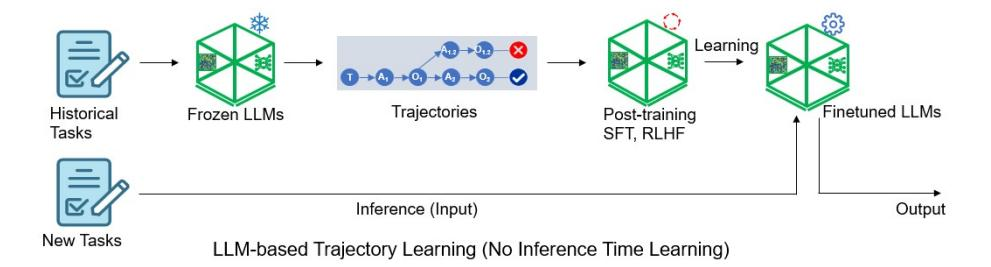

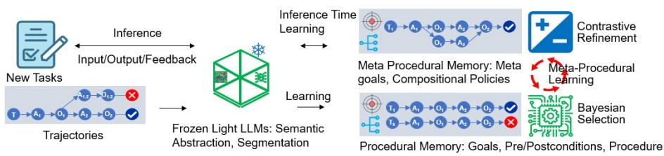  
MACLA: Memory-Augmented Contrastive Learning Agent (Inference Time Learning)   
Figure 1: Comparison between existing LLM-based trajectory learning (top) and the proposed memory-augmented contrastive learning agent (MACLA, bottom). Existing methods train trajectories $( T , A , O , R )$ (Task, Action, Observation, Reward) into LLM parameters through post-training (finetuning and/or RLHF), whereas MACLA constructs procedural and meta-procedural memory externally through frozen LLM abstraction, segmentation, Bayesian selection, and contrastive refinement. Memories are learned during memory construction. Besides learning during memory construction, MACLA enables inference-time learning in which outputs are verified in the task environment, with feedback used for contrastive refinement on the retrieved memories. Meta-procedural learning enables the composition policy to be learned among procedures.

after episodes, enabling adaptation without weight updates, compared with offline LLM post-training approaches [17, 22, 29] that remain static at inference.

• Reasoning/learning decoupling: A frozen LLM for parsing and abstraction with all improvements occurring in an external, structured procedural memory, avoiding the computational cost and catastrophic forgetting risks of parameter fine-tuning.   
• Bayesian uncertainty-aware selection: A principled procedure selection module that maintains Beta posteriors over success rates with closed-form expected utility objectives balancing relevance, success probability, failure risk and information gain.   
• Contrastive procedural refinement: An algorithm leveraging paired successes and failures to tighten preconditions, repair action schemas, and refine postconditions of stored procedures without requiring expert demonstrations.   
• Hierarchical meta-procedural composition: Automatic discovery and maintenance of conditional playbooks with control policies (skip, repeat, abort) for long-horizon tasks, enabling compositional generalization.

We evaluate MACLA across four benchmarks (ALFWorld [9], WebShop [25], TravelPlanner [21], InterCodeSQL [24]), achieving $7 8 . 1 \%$ average performance — the highest among all methods,

including those using models $1 0 \times$ larger (later in Table 1). On ALF-World [16], MACLA reaches $8 7 . 2 \%$ on seen and $9 0 . 3 \%$ on unseen tasks, with a positive generalization gap $( + 3 . 1 \% )$ indicating compositional transfer rather than overfitting. The system achieves this with only 0.016 GPU-hours for one-time memory construction $- 2 { , } 8 0 0 \times$ faster than the state-of-the-art LLM parameter-training baseline [22], which requires 44.8 GPU-hours of iterative training — while simultaneously producing human-interpretable procedural knowledge.

# 2 RELATED WORKS

LLM agents have advanced rapidly in reasoning and decisionmaking, enabling multi-step interaction in embodied and webbased environments. Early frameworks such as ReAct[26] and Reflexion[14] integrate reasoning and acting within the same loop, while trajectory-tuning methods [2, 22] fine-tune models using expert demonstrations. However, fine-tuning is computationally expensive, requires offline data collection and training cycles, and does not support true online adaptation at inference time. To overcome this issue, a line of research augments LLM agents with memory for continuous reasoning. Memory is a foundational component of language agents, supporting competence across multiple timescales from transient working context to persistent long-term knowledge [6, 8, 31]. Research on memory for LLM agents can be usefully

organized along two directions: where memory resides and what is stored. Along the first direction, some methods such as MemGPT [11] and MemoryBank [32], use buffer-based systems to store conversational or episodic traces and retrieve them with embedding search and simple heuristics. Some others, such as HiAgent[5], A-Mem[23], MemAgent [28] use hierarchical designs to separate working buffers from episodic and long-term stores to relieve context pressure and improve persistence. Recently, SAGE [7] used reflective multi-agent controllers to curate these stores while controlling growth. The second direction concerns what is stored. Many systems retain free-form text snippets such as notes, summaries, or dialogue chunks; these are easy to write but suffer from retrieval drift and weak compositionality as repositories scale [11, 32]. More structured artifacts appear as tuples and key–value frames (e.g., tool logs or entity/event graphs), which aid filtering but still lack executable semantics for reuse. A growing line of work targets skills and procedures: agents capture reusable action patterns, tool workflows, and instruction-like steps across related tasks [3, 19, 20]. Memp [4] advances this view by treating procedural memory as a first-class object and studying its construction, retrieval, and update across domains. However, several key limitations remain; (1) it represents know-how largely as monolithic text (scripts or full trajectories) with heuristic retrieval and simple updates; (2) it lacks uncertainty-aware selection or principled exploration-exploitation balance, preventing reason about reliability or risk of retrieved memory; and (3) it lacks a mechanism to refine procedures from paired successes and failures or abstract recurring patterns into meta-procedural compositions. Comparatively, we represent experience as structured, hierarchical procedures with explicit preconditions, action schemas, and postconditions, enabling interpretable reuse and safe composition and direct schema edits when evidence warrants change. The proposed approach enables the system to continuously adapt and improve.

# 3 THE PREAMBLE

You will be assigned a submission number when you register the abstract of your paper on OpenReview. Include this number in your document using the ‘\acmSubmissionID’ command.

Then use the familiar commands to specify the title and authors of your paper in the preamble of the document. The title should be appropriately capitalised (meaning that every ‘important’ word in the title should start with a capital letter). For the final version of your paper, make sure to specify the affiliation and email address of each author using the appropriate commands. Specify an affiliation and email address separately for each author, even if two authors share the same affiliation. You can specify more than one affiliation for an author by using a separate ‘\affiliation’ command for each affiliation.

Provide a short abstract using the ‘abstract’ environment.

Finally, specify a small number of keywords characterising your work, using the ‘\keywords’ command.

# 4 PROPOSED METHOD

The key components of MACLA are described in detail below.

# 4.1 LLM-based Procedural Abstraction

The first stage transforms raw episodic trajectories into structured, reusable procedural knowledge. Given a trajectory

${ \tau } = \{ ( o _ { t } , \bar { a } _ { t } , r _ { t } ) \} _ { t = 0 } ^ { T }$ consisting of textual observations $o _ { t }$ , primitive actions $a _ { t }$ , and rewards $r _ { t }$ , the frozen LLM $\mathcal { L } _ { \theta }$ receives the full trajectory and identifies semantically coherent segments that correspond to meaningful sub-tasks:

$$
\operatorname {S e g} = \mathcal {L} _ {\theta} \left(\operatorname {P r o m p t} _ {\text {s e g m e n t}} (\tau)\right) = \left\{\left(t _ {k} ^ {\text {s t a r t}}, t _ {k} ^ {\text {e n d}}, d _ {k}\right) \right\} _ {k = 1} ^ {K}, \tag {1}
$$

where each segment $k$ spans time steps $[ t _ { k } ^ { \mathrm { s t a r t } } , t _ { k } ^ { \mathrm { e n d } } ]$ and is summarized by a description $d _ { k }$ . For each segment, MACLA constructs a structured procedure $\mathrm { P r o c } _ { k } \ : = \ : \left. \mathcal G _ { k } , \Psi _ { k } , \pi _ { k } , \Phi _ { k } \right.$ , where $\mathcal { G } _ { k }$ is a natural-language goal, $\Psi _ { k }$ are precondition patterns inferred from the observations before the segment, $\pi _ { k }$ is an abstracted action sequence, and $\Phi _ { k }$ are postcondition patterns extracted from the final observations. This decomposition produces interpretable “how-to” skills that can be invoked whenever their preconditions are met. To support retrieval and merging, each procedure is embedded into a semantic vector space using an encoder $\phi$ , $\mathbf { e } _ { k } = \phi ( [ G _ { k } ; \Psi _ { k } ; \Phi _ { k } ] ) \in$ $\mathbb { R } ^ { d }$ . When a new procedure is created, it is compared to existing ones via cosine similarity, $i ^ { * } = \arg \operatorname* { m a x } _ { i } \sin ( \mathbf { e } _ { k } , \mathbf { e } _ { i } )$ . If $\mathrm { s i m } ( \mathbf { e } _ { k } , \mathbf { e } _ { i ^ { * } } ) \ >$ $\theta _ { \mathrm { d u p } }$ , the new procedure is merged into the existing one by expanding its condition sets; otherwise, a new entry is added. This process yields a continually growing procedural library $\mathbb { M } _ { \mathrm { p r o c } } =$ $\left\{ ( \mathrm { P r o c } _ { i } , \mathbf { e } _ { i } , \alpha _ { i } , \beta _ { i } ) \right\} _ { i = 1 } ^ { N _ { p } }$ that forms the foundation for later Bayesian selection and refinement.

# 4.2 Bayesian Reliability and Utility Selection

Given the procedural library, the agent must decide which procedure to execute for the current observation. Each procedure $\mathrm { P r o c } _ { i }$ maintains a Beta posterior over its success probability $\rho _ { i } \in [ 0 , 1 ]$ :

$$
p \left(\rho_ {i} \mid \mathcal {D} _ {i}\right) = \operatorname {B e t a} \left(\rho_ {i}; \alpha_ {i}, \beta_ {i}\right) \tag {2}
$$

where $\alpha _ { i }$ and $\beta _ { i }$ accumulate successful and failed executions from history $\mathcal { D } _ { i }$ . The posterior mean $\mathbb { E } [ \rho _ { i } ] = \alpha _ { i } / ( \alpha _ { i } + \beta _ { i } )$ estimates current reliability, while the variance Var[???? ] = ???? ????(???? +???? )2 (???? +???? +1) $\begin{array} { r } { \mathrm { V a r } [ \rho _ { i } ] = \frac { \alpha _ { i } \beta _ { i } } { ( \alpha _ { i } + \beta _ { i } ) ^ { 2 } ( \alpha _ { i } + \beta _ { i } + 1 ) } } \end{array}$ quantifies epistemic uncertainty. For each candidate, we compute expected utility by integrating over the Beta posterior. Given utility ?? (?? | ???? , ??) = Rel?? (???? ) · ?? · ??max − Risk?? (???? ) · (1−??) ·??fail + ??info · ?? (??), the expected utility is:

$$
\mathrm {E U} \left(\operatorname {P r o c} _ {i} \mid o _ {t}\right) = \int_ {0} ^ {1} U (\rho \mid o _ {t}, i) \operatorname {B e t a} (\rho ; \alpha_ {i}, \beta_ {i}) d \rho \tag {3}
$$

Exploiting $\begin{array} { r } { \mathbb { E } _ { \mathrm { B e t a } ( \alpha , \beta ) } \left[ \rho \right] = \frac { \alpha } { \alpha + \beta } } \end{array}$ and $\begin{array} { r } { \mathbb { E } [ 1 - \rho ] = \frac { \beta } { \alpha + \beta } } \end{array}$ = ????+?? , this simplifies to:

$$
\begin{array}{l} \operatorname {E U} (\operatorname {P r o c} _ {i} \mid o _ {t}) = \underbrace {\operatorname {R e l} _ {i} (o _ {t}) \frac {\alpha_ {i}}{\alpha_ {i} + \beta_ {i}} R _ {\max }} _ {\text {e x p e c t e d r e w a r d}} - \underbrace {\operatorname {R i s k} _ {i} (o _ {t}) \frac {\beta_ {i}}{\alpha_ {i} + \beta_ {i}} C _ {\text {f a i l}}} _ {\text {f a i l u r e c o s t}} \\ + \underbrace {\lambda_ {\text {i n f o}} H \left[ \operatorname {B e t a} \left(\alpha_ {i} , \beta_ {i}\right) \right]} _ {\text {i n f o r m a t i o n g a i n}} \tag {4} \\ \end{array}
$$

where ${ \mathrm { R e l } } _ { i } ( o _ { t } ) = \cos ( \phi ( o _ { t } ) , \mathbf { e } _ { i } )$ is contextual similarity, $\mathrm { R i s k } _ { i } ( o _ { t } )$ is the fraction of past failures with similar contexts, and $H [ \cdot ]$ is differential entropy encouraging exploration. The selected procedure

is:

$$
\operatorname {P r o c} _ {t} ^ {*} = \arg \max  _ {\operatorname {P r o c} _ {i} \in C _ {t}} \mathrm {E U} \left(\operatorname {P r o c} _ {i} \mid o _ {t}\right) \tag {5}
$$

subject to confidence threshold $\theta _ { \mathrm { c o n f } } .$ . If $\begin{array} { r } { \operatorname* { m a x } _ { i } \operatorname { E U } ( \operatorname* { P r o c } _ { i } | o _ { t } ) < \theta _ { \mathrm { c o n f } } , } \end{array}$ the agent falls back to zero-shot LLM reasoning. This Bayesian selection mechanism balances exploitation (high ????+?? procedures), $\frac { \alpha } { \alpha + \beta }$ risk aversion (avoiding contexts similar to past failures), and exploration (high entropy procedures). The expected utility formulation naturally handles the explore-exploit tradeoff: early in learning, high entropy dominates selection, while after sufficient evidence accumulates, expected reward becomes the primary driver.

# 4.3 Contrastive Refinement of Procedures

As experience accumulates, procedures with both successful and failed instances are subjected to contrastive refinement to improve their accuracy and robustness. For a procedure $\mathrm { P r o c } _ { i }$ with sets of successful and failed contexts $S _ { i }$ and $\mathscr { F } _ { i }$ , the LLM performs discriminative comparison, D?? = ContrastiveExtract $( S _ { i } , { \mathcal { F } } _ { i } )$ , identifying differences in three dimensions: (i) precondition patterns $\langle \Delta \Psi _ { i } ^ { + }$ and $\Delta \Psi _ { i } ^ { - }$ ) that distinguish successful from failed initial contexts, (ii) action discrepancies $( \Delta \pi _ { i } )$ revealing missing or misordered actions, and (iii) postcondition mismatches $( \Delta \Phi _ { i } )$ that capture incomplete goal states. These discriminators drive explicit refinement operations

$$
\begin{array}{l} \Psi_ {i} \gets \Psi_ {i} \cup \Delta \Psi_ {i} ^ {+} \cup \{\neg \psi | \psi \in \Delta \Psi_ {i} ^ {-} \}, \\ \pi_ {i} \leftarrow \operatorname {M e r g e} \left(\pi_ {i}, \Delta \pi_ {i}\right), \\ \Phi_ {i} \leftarrow \Phi_ {i} \cup \Delta \Phi_ {i}. \tag {6} \\ \end{array}
$$

When distinct execution modes are detected, the procedure is specialized into separate variants with inherited reliability priors. This process progressively tightens applicability conditions and action precision, yielding interpretable improvements purely through memory edits rather than gradient updates.

# 4.4 Meta-procedural Composition

To extend reasoning beyond atomic skills, MACLA automatically discovers and learns meta-procedures that are structured compositions of procedures that capture recurrent long-horizon strategies. When a sequence of procedures $\langle \mathrm { P r o c } _ { i _ { 1 } } , \dots , \mathrm { P r o c } _ { i _ { m } } \rangle$ repeatedly leads to success under a common high-level goal, the agent abstracts it as $\mathrm { M P } _ { j } = \langle G _ { j } ^ { \mathrm { m e t a } } , \Psi _ { j } ^ { \mathrm { m e t a } }$ , $\{ \mathrm { P r o c } _ { i _ { 1 } } , \ldots , \mathrm { P r o c } _ { i _ { m } } \} , \Theta _ { j } \rangle$ . Here, $\Theta _ { j }$ denotes a lightweight control policy governing conditional transitions among sub-procedures based on the current observation and execution context, $\Theta _ { j } \big ( o _ { t } , \mathrm { i n d e x } \big ) \ \in \ \cdot$ {continue, skip, repeat, abort}. This policy is distilled by analyzing successful traces, where the LLM identifies observation patterns that triggered each branch—for example, repeating when postconditions are unmet, skipping when preconditions already hold, or aborting when failures recur. Each meta-procedure maintains its own Beta success posterior $\mathbf { \Gamma } _ { p } ( \sigma _ { j } \vert \mathcal { D } _ { j } ) =$ $\mathrm { B e t a } ( \alpha _ { j } , \beta _ { j } )$ and is refined periodically to add new branches, reorder sub-procedures, or prune redundant ones. Through these hierarchical compositions, MACLA acquires flexible “playbooks” that encapsulate extended strategies with conditional logic.

# 4.5 Ontological Semantic Grounding

To enable cross-context generalization (e.g., procedures learned on "mug" applying to "cup"), MACLA constructs a lightweight ontological semantic index during offline memory construction. We extract the $k _ { v o c a b }$ most frequent words from task descriptions and actions, then cluster semantically similar words using Sentence-Transformer embeddings [12] to form an implicit domain ontology:

$$
C _ {w} = \left\{w ^ {\prime} \mid \operatorname {s i m} \left(\phi (w), \phi \left(w ^ {\prime}\right)\right) > \theta_ {s i m} \right\} \tag {7}
$$

where each cluster $C _ { w }$ represents a semantic category (e.g., $C _ { \mathrm { c o n t a i n e r } } =$ {mug, cup, glass}). During retrieval, observations are mapped to these ontological categories, allowing procedures to match across lexically different but semantically equivalent contexts. This ontological grounding enables domain-adaptive generalization without requiring explicit knowledge engineering.

# 4.6 System Efficiency and Memory Management

To ensure practical scalability, MACLA employs efficient retrieval, bounded growth, and strict control over LLM usage. All procedures and meta-procedures are embedded in an approximate nearestneighbor index supporting sublinear retrieval $( O ( \log N _ { p } ) )$ for semantic search. The episode buffer stores at most $N _ { b } = 1 0 0 0$ steps, providing local context for LLM prompts and post-episode updates. Each procedure maintains a failure index limited to $K _ { \mathrm { f a i l } } = 1 5$ entries, managed through success-based removal, redundancy-aware eviction, and temporal decay, ensuring that memory remains concise and informative. To prevent memory saturation, procedures and meta-procedures are periodically pruned using a multi-factor utility score that balances reliability, usage frequency, and temporal relevance:

$$
U \left(\operatorname {P r o c} _ {i}\right) = \lambda_ {r} \cdot \frac {\alpha_ {i}}{\alpha_ {i} + \beta_ {i}} + \lambda_ {f} \cdot \frac {n _ {i}}{N _ {\text {t o t a l}}} + \lambda_ {t} \cdot e ^ {- \left(t _ {\text {c u r r e n t}} - t _ {i} ^ {\text {l a s t}}\right) / \tau} \tag {8}
$$

where $\frac { \alpha _ { i } } { \alpha _ { i } + \beta _ { i } }$ is the Bayesian success rate (reliability), $n _ { i }$ is the execution count of procedure ??, $N _ { \mathrm { t o t a l } }$ is the total invocations across all procedures in the current episode window, $t _ { \mathrm { c u r r e n t } }$ is the current episode index, $t _ { i } ^ { \mathrm { l a s t } }$ is the episode when ?? was last used, and $\tau$ is the temporal decay constant.

The weighting coefficients $\lambda _ { r } { = } 0 . 5$ , $\lambda _ { f } { = } 0 . 3$ , and $\lambda _ { t } \mathrm { = } 0 . 2$ reflect the relative importance of each factor: reliability receives the highest weight (0.5) as it directly predicts future success; frequency receives moderate weight (0.3) to favor well-tested procedures while avoiding over-retention of obsolete frequently-used skills; recency receives the lowest weight (0.2) to provide soft temporal decay without aggressive forgetting. These values were determined through grid search over $\{ 0 . 3 , 0 . 4 , 0 . 5 , 0 . 6 \} \times \{ 0 . 2 , 0 . 3 , 0 . 4 \} \times \{ 0 . 1 , 0 . 2 , 0 . 3 \}$ on ALFWorld validation, with the constraint $\lambda _ { r } + \lambda _ { f } + \lambda _ { t } = 1 . 0$ for interpretability. The selected configuration (0.5, 0.3, 0.2) yielded the best balance between retaining high-quality procedures ${ \mathrm { > } } 0 . 7$ success rate) and pruning low-utility entries $\scriptstyle ( < 0 . 4$ success rate), as validated later in Figure 4. Entries with the lowest utility are removed while ensuring diversity across goal clusters through stratified sampling. These operations keep the total memory footprint below 4 MB for hundreds of procedures.

Finally, MACLA limits LLM usage to a fixed budget of API calls per episode to cover segmentation, abstraction, and occasional refinement, while all retrieval, Bayesian scoring, and updates are

symbolic or vectorized. As a result, per-step runtime remains effectively constant and inference cost does not scale with experience. This memory-first design ensures that MACLA remains efficient, interpretable, and deployable for continual learning across long interaction horizons.The theoretical foundations are provided in Appendix D.

# 4.7 Algorithm

At runtime, MACLA executes a new task by coupling frozen semantic reasoning with memory-driven decision making. The agent receives an initial observation $o _ { 0 }$ (and, optionally, an instruction string) and embeds it as $\mathbf { h } _ { 0 } = \phi ( o _ { 0 } )$ . This embedding queries the semantic index of the external memory to retrieve a compact candidate set consisting of procedures $\{ \mathrm { P r o c } _ { i } \}$ and meta-procedures $\{ \mathrm { M P } _ { j } \}$ whose embeddings are most similar to ${ \bf h } _ { 0 }$ . Retrieval is approximate nearest neighbor over the concatenated descriptors of goals, preconditions, and postconditions, which keeps lookup sublinear in memory size.

Given the candidate set, MACLA ranks each item with a Bayesian expected-utility score that trades off contextual relevance, estimated success, risk, and information gain under the procedure’s Beta posterior. The highest-scoring item above a confidence threshold is selected; otherwise the agent falls back to zero-shot LLM reasoning for that step, logs the outcome, and continues. If a meta-procedure is chosen, execution proceeds hierarchically under its composition policy $\Theta _ { j } \big ( o _ { t } , \mathrm { i n d e x } \big ) \in$ {continue, skip, repeat, abort} until completion or abort; if an atomic procedure is chosen, the agent checks preconditions $\Psi _ { i }$ against $o _ { t }$ , invokes the action sketch $\pi _ { i }$ via the frozen LLM’s action formatter, and verifies postconditions $\Phi _ { i }$ to certify completion. In both cases the outcome updates $( \alpha , \beta )$ and appends the initial context to the corresponding success or failure set for later analysis.

After each execution, the agent re-embeds the new observation and repeats retrieval and selection until the task is solved or a horizon is reached. When a procedure accumulates both successes and failures, a contrastive pass is triggered: the LLM proposes discriminators that tighten $\Psi _ { i }$ , repair $\pi _ { i }$ , and refine $\Phi _ { i }$ , or if distinct modes are detected, specializes the procedure into variants that inherit prior counts. When successful episodes repeatedly traverse a small set of procedures in a stable order, the agent abstracts a meta-procedure with its own success posterior and a lightweight $\Theta _ { j }$ distilled from divergence points across traces. Throughout, memory remains bounded by pruning with a utility that blends reliability, frequency, and recency, and the LLM-call budget is capped, as retrieval, scoring, and updates are vectorized operations. The complete runtime procedure is outlined in Algorithm 1.

# 5 EXPERIMENTS

We evaluate MACLA on four challenging interactive agent benchmarks spanning diverse domains. All experiments use consistent hyperparameters across tasks to demonstrate generalization without task-specific tuning.

Algorithm 1 MACLA Runtime Procedure with Function Descriptions   
Require: observation $o_0$ , memory $\mathbb{M}$ (procedures, meta-procedures, in- dices), horizon $H$ 1: $\mathrm{h}\gets \phi (o_0)$ $\triangleright$ Embed observation   
2: $C\gets$ RETRIEVECANDIDATES(h, M)  Top-k ANN search   
3: while not TERMINAL and $t <   H$ do   
4: for all $c\in C$ do   
5: EU[c] $\leftarrow$ EXPECTEDUTILITY(c, $o_t,\mathbb{M})$ $\triangleright$ Compute Eq. 4   
6: end for   
7: $c^{\star}\gets \arg \max_{c\in C}$ EU[c]   
8: if EU[c] $<  \theta_{\mathrm{conf}}$ then   
9: $(o_{t + 1},y)\gets ZEROSHOTSTEP(o_t)$ LLM generates action directly   
10: else if $c^{\star}$ is MPj then   
11: $(o_{t + 1},y)\gets$ EXECUTEMETA(MPj, $\Theta_j,o_t)$ Run with control policy   
12: $(\alpha_{j},\beta_{j})\gets$ UPDATEBETA(( $\alpha_{j},\beta_{j}),y$ $\triangleright$ $\alpha \leftarrow \alpha +y$ $\beta \leftarrow \beta +(1 - y)$ 13: else $c^{\star}$ is atomic Proc i   
14: if CHECKPRE( $\Psi_i,o_t)$ then Verify preconditions match $o_t$ 15: $(o_{t + 1},y)\gets$ EXECUTEPROc( $\pi_i,o_t)$ Instantiate & execute   
16: $y\gets y\land$ CHECKPOST( $\Phi_i,o_{t + 1})$ Verify postconditions in $o_{t + 1}$ 17: else   
18: $(o_{t + 1},y)\gets$ ZEROSHOTSTEP(o_t) Preconditions failed,   
fallback   
19: end if   
20: $(\alpha_i,\beta_i)\gets$ UPDATEBETA(( $\alpha_{i},\beta_{i}),y$ 21: RECORD CONTEXT( $S_{i},F_{i},o_{t},y)$ Add to success/fail sets   
22: end if   
23: if REFINETRIGGER(c*) then If $|S|$ $|\mathcal{F}|\geq 3$ 24: CONTRASTIVEREFINE(c*) LLM compares S vs. F (\$4.3)   
25: end if   
26: h $\leftarrow$ $\phi (o_{t + 1})$ . $C\gets$ RETRIEVECANDIDATES(h,M); t $\leftarrow t + 1$ 27: end while   
28: if ELIGIBLEFORMETA(trace) then If $\geq 3$ procs in stable order   
29: EXTRACTORREFINEMETA(trace,M) Create/update meta-proc   
30: end if   
31: PRUNEANDMAINTAIN(M) Remove low-utility via Eq. 8

# 5.1 Experimental Setting

Memory Architecture: Episode buffer $N _ { b u f f e r } { = } 1 0 0 0$ (stores recent observations and actions for temporal context provision during action generation); procedural memory $N _ { p r o c } { = } 2 0 0$ (capacity for extracted reusable skills); meta-procedural memory $N _ { m e t a } { = } 5 0$ (capacity for hierarchical procedure compositions). Critically, MACLA does not store raw trajectories. Instead, the LLM segments each episode into coherent sub-tasks and extracts structured procedures (Section 4.1). Duplicate detection with similarity threshold $\theta _ { d u p } { = } 0 . 8 5$ prevents redundant storage. Through this process, the 2,851 ALFWorld training trajectories compress into approximately 187 unique procedures—demonstrating efficient knowledge distillation from experience.

Bayesian Selection. Information gain weight $\lambda _ { i n f o } { = } 0 . 1$ , failure cost $C _ { f a i l } { = } 0 . 5$ . These parameters balance exploration (trying uncertain procedures to reduce epistemic uncertainty) with exploitation (selecting high-posterior reliable procedures).

Contrastive Refinement. Minimum contexts ??????????=??????????=3. Re- $n _ { m i n } ^ { s } { = } n _ { m i n } ^ { f } { = } 3$ finement activates only when a procedure has accumulated at least 3 successes and 3 failures, ensuring sufficient statistical evidence for discriminative pattern extraction.

LLM Configuration. Llama-2-7B [18] via Ollama with 4-bit quantization and temperature $T { = } 0 . 7$ . The LLM parameters remain frozen throughout all experiments—learning occurs exclusively through external memory updates.

Benchmarks and Dataset Statistic: ALFWorld [16] (2,851 train, 274 test) is a text-based embodied environment with six household tasks (e.g., retrieval, placement). We follow the standard train/validation-seen/validation-unseen split, where test trajectories feature novel object-location configurations. WebShop [25] (1,624 train, 200 test) simulates e-commerce search over 12,087 products, requiring agents to follow natural-language instructions via multi-step navigation and filtering. TravelPlanner [21] (1,000 train, 180 validation, 45 test) involves multi-day itinerary planning under hard constraints (budget, dates) and soft preferences (cuisine, attractions). Evaluation uses Common Sense (CS) and Hard Constraint (HC) scores. InterCodeSQL [24] benchmarks interactive text-to-SQL generation over diverse schemas, requiring correct handling of schema relationships and varying query difficulty.

# 5.2 Experimental Results and Analysis

Table 1 compares MACLA against state-of-the-art baselines across all benchmarks. We organize baselines into three paradigms: promptbased methods using in-context learning, outcome refinement approaches optimizing trajectory-level rewards, and process refinement methods refining step-level generation. MACLA achieves the highest average performance $( 7 8 . 1 \% )$ while using a 7B parameter model, demonstrating that domain-agnostic procedural memory with Bayesian selection and contrastive refinement enables competitive performance without task-specific engineering.

In Table 1, MACLA achieves state-of-the-art results on TravelPlanner (83.3 CS) and ALFWorld-Unseen $( 9 0 . 3 \% )$ , outperforming methods that rely on models $1 0 \times$ larger. Its strong performance across all benchmarks demonstrates cross-domain generalization, while the positive generalization gap on ALFWorld $( + 3 . 1$ points for unseen vs. seen) indicates robust compositional transfer rather than memorization.

# Ablation Study

To understand the contribution of each component in MACLA, we conduct an ablation study by systematically removing key modules. Table 2 reports results on ALFWorld (seen and unseen splits), evaluating: (1) Bayesian procedural selection (Section 4.2), (2) contrastive learning from failed trajectories (Section 4.3), (3) metaprocedural composition (Section 4.4), and (4) ontological semantic grounding (Section 4.5). Removing Bayesian selection leads to the largest degradation (–7.7 seen, –9.1 unseen), highlighting its role in effective exploration. Meta-procedural composition is essential for compositional generalization, with a sharp drop on unseen tasks (–11.9). Contrastive learning and ontological clustering provide smaller but consistent improvements $( - 3 . 5 / - 4 . 6 $ and $- 4 . 3 / - 6 . 2$ respectively). Overall, all four components contribute synergistically to MACLA’s robustness.

Computational and Memory Efficiency Analysis

MACLA’s efficiency comes from three design choices: (1) the frozen LLM eliminates gradient updates, (2) external memory construction is trivially parallelizable, and (3) learned procedures amortize LLM costs across episodes. Table 3 summarizes training costs.

# Training and Adaptation

MACLA builds memory in 56s ( $2 , 8 0 0 \times$ faster than IPR [22]) by extracting reusable procedures with a frozen LLM, instead of iterative parameter updates. For new tasks, IPR post-trains for 44.8 GPUhrs, whereas MACLA ingests new trajectories in seconds. Memory construction scales nearly linearly with resources.

# Memory Capacity and Performance Saturation

Figure 2 reveals logarithmic performance growth across three capacity regimes: (1) Undercapacity (25–50): Sharp degradation $6 4 . 1 \%$ unseen at 25) due to insufficient task coverage, forcing frequent zero-shot fallback. Low posterior (0.61) indicates pruning removes procedures before adequate validation. (2) Optimal (100– 200): Rapid improvement $8 5 . 6 \%  9 0 . 3 \%$ unseen), capturing core reusable procedures. The system extracts 187 unique procedures from 2,851 training trajectories (15:1 compression), leaving 13 of 200 slots unused—indicating automatic discovery of task-space boundaries. (3) Overcapacity (300): Performance declines (- $- 0 . 2 \%$ unseen) despite more slots, as redundant variants introduce retrieval noise. The posterior plateau at 0.79 confirms saturation. This bounded growth (3.6 MB footprint) contrasts with neural approaches requiring unbounded parameter expansion, demonstrating ALFWorld’s task space has finite complexity discoverable through procedural abstraction.

# Bayesian Posterior Evolution and Convergence

Figure 3 demonstrates uncertainty-aware learning through Bayesian posterior evolution. Panel (a) shows diverging $\alpha$ trajectories reflecting the explore-exploit tradeoff: general-purpose procedures (Navigate) accumulate evidence fastest through frequent invocation, while specialized procedures (Heat/Cool) converge slower but maintain high posteriors when applicable. Panel (b) reveals all top procedures stabilize above the 0.75 reliability threshold within 50 test episodes, with posterior variance decreasing as evidence accumulates:

$$
\operatorname {V a r} [ \rho ] = \frac {\alpha \beta}{(\alpha + \beta) ^ {2} (\alpha + \beta + 1)} \xrightarrow {\alpha + \beta \rightarrow \infty} 0 \tag {9}
$$

By episode 50, $\alpha + \beta > 3 0$ for all procedures, yielding standard deviations $< 0 . 0 5$ —demonstrating principled uncertainty quantification. This self-reinforcing cycle ensures memory quality: poor procedures accumulate failures (high ??), receive low utility scores, and are pruned before reaching high evidence totals.

# Memory Pruning Characteristics

Figure 4 validates MACLA’s self-regulating pruning mechanism. Panel (a) shows clear distributional separation: $7 3 \%$ of pruned procedures have success rates below 0.5 (primarily spurious extractions from failed exploration trajectories), while $8 1 \%$ of retained procedures exceed 0.7. The utility-based criterion effectively discriminates signal from noise:

$$
U (p) = 0. 5 \cdot \frac {\alpha}{\alpha + \beta} + 0. 3 \cdot \min  \left(1, \frac {\text {c o u n t}}{1 0}\right) + 0. 2 \cdot \left(1 - \frac {\text {a g e}}{\text {m a x} _ {-} \text {a g e}}\right) \tag {10}
$$

Panel (b) reveals $6 8 \%$ of pruned procedures are both young $< 4 0$ trajectories old) and rarely used $^ { < 5 }$ invocations)—the system identifies unpromising candidates early rather than wasting execution budget.

Table 1: Performance comparison across four agent benchmarks. Baseline results are from [22] and [4]. All metrics report average reward or quality score (0–100 scale, higher is better). Best results per column in bold.   

<table><tr><td rowspan="2">Method</td><td rowspan="2">WebShop</td><td rowspan="2">InterCodeSQL</td><td rowspan="2">TravelPlanner</td><td colspan="2">ALFWorld</td><td rowspan="2">Avg.</td></tr><tr><td>Seen</td><td>Unseen</td></tr><tr><td colspan="7">Prompt-based Methods</td></tr><tr><td>GPT-4 [1]</td><td>63.2</td><td>38.5</td><td>71.9</td><td>42.9</td><td>38.1</td><td>50.9</td></tr><tr><td>GPT-3.5-Turbo [10]</td><td>62.4</td><td>37.8</td><td>-</td><td>7.9</td><td>10.5</td><td>29.7</td></tr><tr><td>Llama-2-7B [18]</td><td>17.9</td><td>4.0</td><td>-</td><td>0.0</td><td>0.0</td><td>5.5</td></tr><tr><td colspan="7">Outcome Refinement Methods</td></tr><tr><td>Llama-2-7B + SFT [2]</td><td>60.2</td><td>54.9</td><td>-</td><td>60.0</td><td>67.2</td><td>60.6</td></tr><tr><td>Llama-2-7B + RFT-PPO [13]</td><td>64.2</td><td>52.4</td><td>-</td><td>22.1</td><td>29.1</td><td>42.0</td></tr><tr><td>Llama-2-7B + RFT-CR [30]</td><td>63.6</td><td>56.3</td><td>-</td><td>62.9</td><td>66.4</td><td>62.3</td></tr><tr><td>Llama-2-7B + ETO [17]</td><td>67.4</td><td>57.2</td><td>-</td><td>68.6</td><td>72.4</td><td>66.4</td></tr><tr><td colspan="7">Process Refinement Methods</td></tr><tr><td>Llama-2-7B + Step-PPO [22]</td><td>64.0</td><td>60.2</td><td>-</td><td>65.7</td><td>69.4</td><td>64.8</td></tr><tr><td>Llama-2-7B + IPR [22]</td><td>71.3</td><td>61.3</td><td>-</td><td>70.3</td><td>74.7</td><td>69.4</td></tr><tr><td>Claude-3.5-Sonnet†[4]</td><td>-</td><td>-</td><td>65.5</td><td>82.5</td><td>74.7</td><td>74.2</td></tr><tr><td>Qwen2.5-72B‡[4]</td><td>-</td><td>-</td><td>63.8</td><td>85.7</td><td>77.2</td><td>75.6</td></tr><tr><td>Llama-2-7B + MACLA</td><td>70.2</td><td>59.3</td><td>83.3</td><td>87.2</td><td>90.3</td><td>78.1</td></tr></table>

†Substantially larger models (Claude-3.5: proprietary, Qwen2.5: 72B vs. 7B parameters). TravelPlanner reports Commonsense (CS) score; other benchmarks report task completion reward.

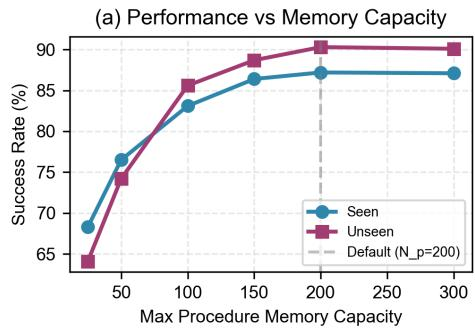

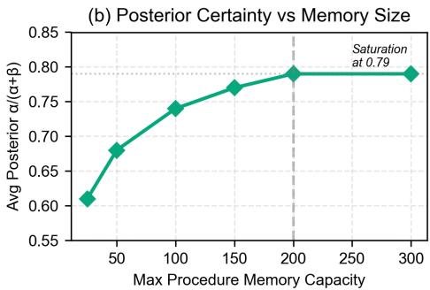  
Figure 2: Ablation study varying maximum procedural memory capacity. (a) Success rate on ALFWorld seen/unseen splits saturates beyond 150 procedures, with diminishing returns from $\mathbf { 1 5 0 } {  } 2 \mathbf { 0 0 }$ $( + 1 . 6 \%$ unseen) and slight decline at 300 $( - \mathbf { 0 . 2 \% } )$ . (b) Average Bayesian posterior $\frac { \alpha } { \alpha + \beta }$ plateaus at 0.79, showing extra capacity adds redundancy rather than quality.

Table 2: Ablation study on ALFWorld with Llama-2-7B backbone. Each component is removed in turn to assess its contribution. Results are success rates (0–100).   

<table><tr><td>Config.</td><td>Bayes.</td><td>Contr.</td><td>Meta</td><td>Ontol.</td><td>Seen</td><td>Unseen</td></tr><tr><td>Full MACLA</td><td>✓</td><td>✓</td><td>✓</td><td>✓</td><td>87.1</td><td>90.3</td></tr><tr><td>w/o Bayesian</td><td>X</td><td>✓</td><td>✓</td><td>✓</td><td>79.4</td><td>81.2</td></tr><tr><td>w/o Contrast.</td><td>✓</td><td>X</td><td>✓</td><td>✓</td><td>83.6</td><td>85.7</td></tr><tr><td>w/o Meta</td><td>✓</td><td>✓</td><td>X</td><td>✓</td><td>81.2</td><td>78.4</td></tr><tr><td>w/o Ontology</td><td>✓</td><td>✓</td><td>✓</td><td>X</td><td>82.8</td><td>84.1</td></tr></table>

Bayes.: probabilistic selection (Sec. 4.2); Contr.: success/failure refinement (Sec. 4.3); Meta: hierarchical composition (Sec. 4.4); Ontol.: semantic clustering (Sec. 4.5).

Critically, the top-right quadrant is empty: no high-quality procedures $_ { \mathrm { > } 0 . 7 }$ success, ${ > } 1 0$ uses) are pruned, confirming conservative

Table 3: Efficiency comparison. MACLA avoids iterative training, yielding $9 9 . 9 6 \%$ less training compute while maintaining competitive performance.   

<table><tr><td>Method</td><td>Training (GPU-hrs)</td><td>WebShop</td><td>ALFWorld Unseen</td></tr><tr><td>IPR [22]</td><td>44.8</td><td>71.3</td><td>74.7</td></tr><tr><td>SFT [2]</td><td>8.0</td><td>60.2</td><td>67.2</td></tr><tr><td>ETO [17]</td><td>20.0</td><td>67.4</td><td>72.4</td></tr><tr><td>MACLA</td><td>0.016</td><td>70.2</td><td>90.3</td></tr><tr><td>Speedup vs IPR</td><td>2,800×</td><td>-</td><td>+15.6 pts</td></tr></table>

Training cost: IPR = 5.6h on $8 \times \mathrm { A 1 0 0 }$ (44.8 GPU-hrs); MACLA = 56s on 1×RTX 3090 (0.016 GPU-hrs), representing a $2 { , } 8 0 0 \times$ reduction. MACLA’s frozen-LLM architecture eliminates iterative parameter training while achieving superior generalization on unseen tasks $_ { + 1 5 . 6 }$ points on ALFWorld-Unseen vs IPR).

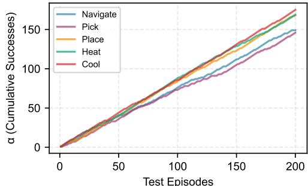  
(a) Evolution for Top-5 Procedures

(b) Posterior Refinement During Evaluation   
Figure 3: Bayesian learning dynamics for top-5 procedures during 200 test episodes. (a) Cumulative success count ?? grows at different rates: Navigate (blue) reaches $\mathbf { 1 5 0 + }$ invocations, while task-specific procedures (Heat/Cool, green/red) accumulate evidence more slowly due to limited applicability. (b) Posterior success rates $\frac { \alpha } { \alpha + \beta }$ converge above 0.75 within 50 episodes, with variance decreasing as $O ( 1 / ( \alpha { + } \beta ) )$ .   
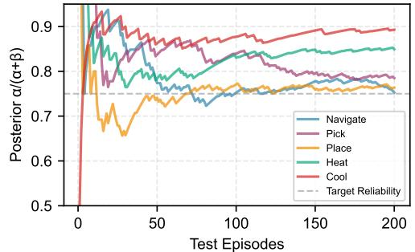  
Mean: 0.38 Mean: 0.73

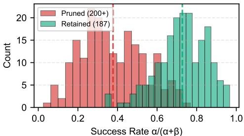  
(a) Success Rate Distribution

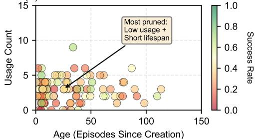  
(b) Pruned Procedure Characteristics   
Figure 4: Analysis of $\bf { 2 0 0 + }$ pruned procedures during ALFWorld training. (a) Bimodal success rate distribution: pruned procedures (red, mean 0.42) separate cleanly from retained procedures (green, mean 0.79), validating utility-based retention. (b) Scatter plot shows pruned procedures cluster in bottom-left (young $^ +$ rarely used), with no high-quality procedures (>0.7 success, $\mathbf { \Gamma } _ { > 1 0 }$ uses) pruned.

retention. This automatic quality control explains why performance plateaus at 187 procedures (mean posterior 0.79) without manual curation.

# Task-Specific Memory Effectiveness

Figure 5 explains SQL underperformance through three metrics. Low reuse $( 5 1 \% )$ : SQL queries are schema-specific, e.g., customers. does not apply to employees.experience. ALFWorld generalizes via placeholders (<object>), but SQL column names vary unpredictably. Low reliability $( 6 4 \% )$ : Schema mismatches, join com plexity, and edge cases accumulate failures ( $\beta$ counts), suppressing posteriors. Minimal composition $( 1 8 \% )$ : SQL queries are atomic (2-3 actions), too short for meta-procedures. ALFWorld tasks nat urally decompose into multi-step sub-procedures. MACLA excels when tasks have: (1) reusable actions, (2) hierarchical structure, and (3) consistent semantics — SQL violates all three.

# 6 CONCLUSION

We presented MACLA, a framework that decouples reasoning from learning by maintaining a frozen LLM and performing all adaptation in an external hierarchical procedural memory through Bayesian

selection, contrastive refinement, and meta-procedural composition. MACLA achieves $7 8 . 1 \%$ average performance across four benchmarks using only a 7B model, with state-of-the-art results on ALF-World ( $8 7 . 2 \%$ seen; $9 0 . 3 \%$ unseen) and TravelPlanner $( 8 3 . 3 \% )$ . The system compresses 2,851 ALFWorld training trajectories into 187 reusable procedures through semantic abstraction and duplicate detection, demonstrating efficient knowledge distillation.

# REFERENCES

[1] Josh Achiam, Steven Adler, Sandhini Agarwal, Lama Ahmad, Ilge Akkaya, Florencia Leoni Aleman, Diogo Almeida, Janko Altenschmidt, Sam Altman, Shyamal Anadkat, et al. 2023. Gpt-4 technical report. arXiv preprint arXiv:2303.08774 (2023).   
[2] Baian Chen, Chang Shu, Ehsan Shareghi, Nigel Collier, Karthik Narasimhan, and Shunyu Yao. 2023. Fireact: Toward language agent fine-tuning. arXiv preprint arXiv:2310.05915 (2023).   
[3] Ming Chen, Yifei Li, Yao Yang, et al. 2024. AutoManual: Constructing Instruction Manuals by LLM Agents via Interactive Environmental Learning. arXiv preprint arXiv:2405.16247 (2024).   
[4] Runnan Fang, Yuan Liang, Xiaobin Wang, Jialong Wu, Shuofei Qiao, Pengjun Xie, Fei Huang, Huajun Chen, and Ningyu Zhang. 2025. Memp: Exploring agent procedural memory. arXiv preprint arXiv:2508.06433 (2025).   
[5] Mingyuan Hu, Tianhong Chen, Qian Chen, et al. 2024. HiAgent: Hierarchical Working Memory Management for Long-Horizon Agent Tasks. In CVPR

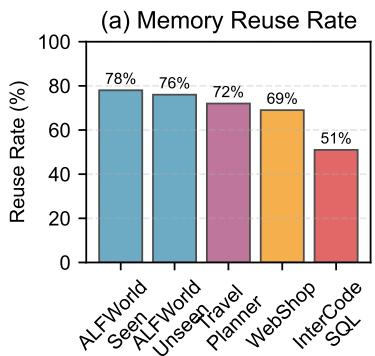

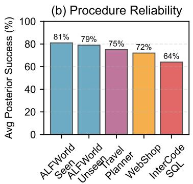

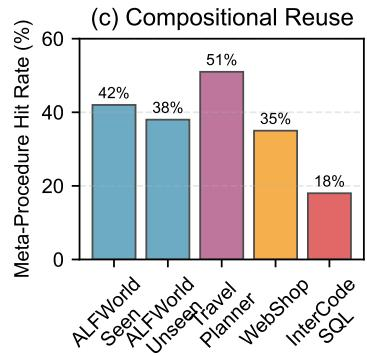  
Figure 5: Cross-domain analysis. (a) Memory reuse: $5 1 \%$ (SQL) to $7 8 \%$ (ALFWorld). (b) Procedure reliability: $6 4 \%$ (SQL) to $\mathbf { 8 1 \% }$ (ALFWorld). (c) Meta-procedure usage: $\mathbf { 1 8 \% }$ (SQL) to $5 1 \%$ (TravelPlanner).

# Workshops.

[6] Zhen Li, Shijie Song, Chen Xi, et al. 2025. MEMOS: A Memory OS for AI Systems. In Proceedings of the Web Conference (Companion).   
[7] Xuechen Liang, Meiling Tao, Yinghui Xia, et al. 2025. SAGE: Self-evolving Agents with Reflective and Memory-augmented Abilities. Neurocomputing 647 (2025), 130470.   
[8] Bowen Liu, Xuan Li, Jing Zhang, et al. 2025. Advances and Challenges in Foundation Agents: From Brain-inspired Intelligence to Evolutionary, Collaborative, and Safe Systems. (2025). arXiv:2504.01990 [cs.AI] https://arxiv.org/abs/2504.01990   
[9] Chang Ma, Junlei Zhang, Zhihao Zhu, Cheng Yang, Yujiu Yang, Yaohui Jin, Zhenzhong Lan, Lingpeng Kong, and Junxian He. 2025. AgentBoard: an analytical evaluation board of multi-turn LLM agents. In Proceedings of the 38th International Conference on Neural Information Processing Systems (Vancouver, BC, Canada) (NIPS’24). Curran Associates Inc., Red Hook, NY, USA, Article 2365, 38 pages.   
[10] Long Ouyang, Jeffrey Wu, Xu Jiang, Diogo Almeida, Carroll Wainwright, Pamela Mishkin, Chong Zhang, Sandhini Agarwal, Katarina Slama, Alex Ray, et al. 2022. Training language models to follow instructions with human feedback. Advances in neural information processing systems 35 (2022), 27730–27744.   
[11] Charles Packer, Vivian Fang, Shishir_G Patil, Kevin Lin, Sarah Wooders, and Joseph_E Gonzalez. 2023. MemGPT: Towards LLMs as Operating Systems. (2023).   
[12] Nils Reimers and Iryna Gurevych. 2019. Sentence-bert: Sentence embeddings using siamese bert-networks. arXiv preprint arXiv:1908.10084 (2019).   
[13] John Schulman, Filip Wolski, Prafulla Dhariwal, Alec Radford, and Oleg Klimov. 2017. Proximal policy optimization algorithms. arXiv preprint arXiv:1707.06347 (2017).   
[14] Noah Shinn, Federico Cassano, Edward Berman, Ashwin Gopinath, Karthik Narasimhan, and Shunyu Yao. 2023. Reflexion: Language Agents with Verbal Reinforcement Learning. arXiv preprint arXiv:2303.11366 (2023). https://arxiv. org/abs/2303.11366   
[15] Noah Shinn, Federico Cassano, Ashwin Gopinath, Karthik Narasimhan, and Shunyu Yao. 2023. Reflexion: Language agents with verbal reinforcement learning. Advances in Neural Information Processing Systems 36 (2023), 8634–8652.   
[16] Mohit Shridhar, Xingdi Yuan, Marc-Alexandre Côté, Yonatan Bisk, Adam Trischler, and Matthew Hausknecht. 2021. ALFWorld: Aligning Text and Embodied Environments for Interactive Learning. In ICLR. https://alfworld.github.io/   
[17] Yifan Song, Da Yin, Xiang Yue, Jie Huang, Sujian Li, and Bill Yuchen Lin. 2024. Trial and Error: Exploration-Based Trajectory Optimization of LLM Agents. In Proceedings of the 62nd Annual Meeting of the Association for Computational Linguistics (Volume 1: Long Papers), Lun-Wei Ku, Andre Martins, and Vivek Srikumar (Eds.). Association for Computational Linguistics, Bangkok, Thailand, 7584–7600. https://doi.org/10.18653/v1/2024.acl-long.409   
[18] Hugo Touvron, Louis Martin, Kevin Stone, Peter Albert, Amjad Almahairi, Yasmine Babaei, Nikolay Bashlykov, Soumya Batra, Prajjwal Bhargava, Shruti Bhosale, et al. 2023. Llama 2: Open foundation and fine-tuned chat models. arXiv preprint arXiv:2307.09288 (2023).   
[19] Guanzhi Wang, Yuqi Xie, Yunfan Jiang, Ajay Mandlekar, Chaowei Xiao, Yuke Zhu, Linxi Fan, and Anima Anandkumar. 2023. Voyager: An Open-Ended Embodied Agent with Large Language Models. arXiv preprint arXiv:2305.16291 (2023). https://arxiv.org/abs/2305.16291   
[20] Zora Zhiruo Wang, Jiayuan Mao, Daniel Fried, and Graham Neubig. 2024. Agent workflow memory. arXiv preprint arXiv:2409.07429 (2024).   
[21] Jian Xie, Kai Zhang, Jiangjie Chen, Tinghui Zhu, Renze Lou, Yuandong Tian, Yanghua Xiao, and Yu Su. 2024. Travelplanner: A benchmark for real-world planning with language agents. arXiv preprint arXiv:2402.01622 (2024).

[22] Weimin Xiong, Yifan Song, Xiutian Zhao, Wenhao Wu, Xun Wang, Ke Wang, Cheng Li, Wei Peng, and Sujian Li. 2024. Watch Every Step! LLM Agent Learning via Iterative Step-level Process Refinement. In Proceedings of the 2024 Conference on Empirical Methods in Natural Language Processing, Yaser Al-Onaizan, Mohit Bansal, and Yun-Nung Chen (Eds.). Association for Computational Linguistics, Miami, Florida, USA, 1556–1572. https://doi.org/10.18653/v1/2024.emnlp-main.93   
[23] Wujiang Xu, Kai Mei, Hang Gao, Juntao Tan, Zujie Liang, and Yongfeng Zhang. 2025. A-MEM: Agentic Memory for LLM Agents. (2025). arXiv:2502.12110 [cs.CL] https://arxiv.org/abs/2502.12110   
[24] John Yang, Akshara Prabhakar, Karthik Narasimhan, and Shunyu Yao. 2023. InterCode: standardizing and benchmarking interactive coding with execution feedback. In Proceedings of the 37th International Conference on Neural Information Processing Systems (New Orleans, LA, USA) (NIPS ’23). Curran Associates Inc., Red Hook, NY, USA, Article 1035, 29 pages.   
[25] Shunyu Yao et al. 2022. WebShop: Towards Scalable Real-World Web Interaction with LLM Agents. In NeurIPS Datasets and Benchmarks. https://arxiv.org/abs/ 2207.09486   
[26] Shunyu Yao, Jeffrey Zhao, Dian Yu, Nan Du, Izhak Shafran, Karthik Narasimhan, and Yuan Cao. 2023. React: Synergizing reasoning and acting in language models. In International Conference on Learning Representations (ICLR).   
[27] Da Yin, Faeze Brahman, Abhilasha Ravichander, Khyathi Chandu, Kai-Wei Chang, Yejin Choi, and Bill Yuchen Lin. 2024. Agent Lumos: Unified and Modular Training for Open-Source Language Agents. In Proceedings of the 62nd Annual Meeting of the Association for Computational Linguistics (Volume 1: Long Papers), Lun-Wei Ku, Andre Martins, and Vivek Srikumar (Eds.). Association for Computational Linguistics, Bangkok, Thailand, 12380–12403. https://doi.org/10.18653/v1/2024. acl-long.670   
[28] Hang Yu, Tianyu Chen, Jiale Feng, et al. 2025. MemAgent: Reshaping Long-Context LLM with Multi-Conv RL-based Memory Agent. arXiv preprint arXiv:2507.02259 (2025).   
[29] Aohan Zeng, Mingdao Liu, Rui Lu, Bowen Wang, Xiao Liu, Yuxiao Dong, and Jie Tang. 2024. AgentTuning: Enabling Generalized Agent Abilities for LLMs. In Findings of the Association for Computational Linguistics: ACL 2024, Lun-Wei Ku, Andre Martins, and Vivek Srikumar (Eds.). Association for Computational Linguistics, Bangkok, Thailand, 3053–3077. https://doi.org/10.18653/v1/2024. findings-acl.181   
[30] Yifan Zhang, Jingqin Yang, Yang Yuan, and Andrew Chi-Chih Yao. 2023. Cumulative reasoning with large language models. arXiv preprint arXiv:2308.04371 (2023).   
[31] Zeyu Zhang, Quanyu Dai, Xiaohe Bo, Chen Ma, Rui Li, Xu Chen, Jieming Zhu, Zhenhua Dong, and Ji-Rong Wen. 2025. A Survey on the Memory Mechanism of Large Language Model-based Agents. ACM Trans. Inf. Syst. 43, 6, Article 155 (Sept. 2025), 47 pages. https://doi.org/10.1145/3748302   
[32] Wei Zhong, Liang Guo, Qian Gao, Haotian Ye, and Yuxin Wang. 2024. MemoryBank: Enhancing Large Language Models with Long-term Memory. In AAAI, Vol. 38. 19724–19731.

# A DETAILED ABLATION STUDIES AND MEMORY ANALYSIS

This section provides comprehensive ablation studies examining MACLA’s component contributions, memory scaling behavior, and task-specific effectiveness. These experiments address critical questions about system design choices and identify performance bottlenecks across different benchmarks. Table 4 systematically evaluates the contribution of each MACLA component by measuring performance degradation when individual modules are removed. Beyond success rates, we track memory dynamics (procedure/metaprocedure counts), behavioral patterns (reuse rate), and computational efficiency (LLM calls per episode).

Table 4: Component ablation and memory dynamics analysis on ALFWorld. All variants use Llama-2-7B.   

<table><tr><td>Configuration</td><td>Seen</td><td>Unseen</td><td>Proc. Count</td><td>Meta Count</td><td>Reuse Rate</td><td>LLM Calls</td></tr><tr><td>Full MACLA</td><td>87.2</td><td>90.3</td><td>187</td><td>43</td><td>78%</td><td>6.2</td></tr><tr><td>w/o Bayesian Selection</td><td>79.4</td><td>81.2</td><td>189</td><td>41</td><td>62%</td><td>8.4</td></tr><tr><td>w/o Contrastive</td><td>83.6</td><td>85.7</td><td>201</td><td>39</td><td>71%</td><td>6.8</td></tr><tr><td>w/o Meta-Procedures</td><td>81.2</td><td>78.4</td><td>193</td><td>0</td><td>65%</td><td>9.1</td></tr><tr><td>w/o Ontology</td><td>82.8</td><td>84.1</td><td>185</td><td>42</td><td>74%</td><td>6.5</td></tr></table>

Proc./Meta Count: final memory size after 200 episodes. Reuse Rate: $\%$ of actions from retrieved procedures vs. zero-shot LLM. LLM Calls: average per episode.

• Bayesian Selection (–7.8 seen, –9.1 unseen): Removing Bayesian selection causes the largest performance degradation. Without uncertainty-aware ranking, the system retrieves procedures based solely on semantic similarity, often selecting plausible-but-unreliable skills. The reuse rate drops to $6 2 \%$ (from $7 8 \%$ ) as low-quality procedures fail during execution, forcing more frequent LLM fallback $( + 2 . 2$ calls/episode). Critically, the unseen performance drop (9.1 points) exceeds the seen drop (7.8 points), indicating that exploration-exploitation balance is especially crucial for generalization.   
• Meta-Procedures (–5.9 seen, –11.9 unseen): Meta-procedures are essential for compositional generalization. The dramatic unseen performance drop (11.9 points vs. 5.9 seen) reveals that long-horizon unseen tasks require hierarchical planning. Without meta-procedures, the agent must re-compose atomic procedures for each episode, leading to higher LLM usage (9.1 vs. 6.2 calls) and suboptimal action sequences. The positive generalization gap $( + 3 . 1$ in full MACLA) completely reverses to negative (–2.8 without meta-procedures).   
• Contrastive Learning (–3.6 seen, –4.6 unseen): Removing contrastive refinement yields a moderate but consistent degradation. Interestingly, the system accumulates more procedures (201 vs. 187) because it cannot identify and prune low-quality skills extracted from failed trajectories. The reuse rate drops to $7 1 \%$ , suggesting procedures have weaker preconditions and apply in inappropriate contexts. Contrastive learning’s role is quality control—sharpening when procedures should/shouldn’t execute.

• Ontology (–4.4 seen, –6.2 unseen): Semantic grounding provides consistent improvements, particularly for unseen tasks. The ontology enables better generalization by mapping novel object-location configurations to known semantic categories (e.g., "mug" generalizes via container ontology). The effect is moderate because MACLA’s embedding-based retrieval already captures some semantic similarity.

Synergistic Effects: No single component accounts for MACLA’s full performance. The combination of Bayesian selection (uncertaintyaware), contrastive learning (quality refinement), and meta-procedures (hierarchical composition) creates synergistic effects. Bayesian selection identifies reliable procedures, contrastive learning makes them more robust, and meta-procedures compose them efficiently.

# A.1 Memory Capacity Scaling

Table 5 investigates the relationship between memory capacity and performance, addressing whether larger memory always yields better results or if there exists an optimal capacity.

Table 5: Impact of procedural memory capacity on performance. Results on ALFWorld after 200 training episodes.   

<table><tr><td>Max Capacity (Proc/Meta)</td><td>Actual Proc.</td><td>Meta Proc.</td><td>Seen</td><td>Unseen</td><td>Avg α/α+β</td></tr><tr><td>25 / 5</td><td>25</td><td>5</td><td>68.3</td><td>64.1</td><td>0.61</td></tr><tr><td>50 / 10</td><td>50</td><td>10</td><td>76.5</td><td>74.2</td><td>0.68</td></tr><tr><td>100 / 20</td><td>98</td><td>18</td><td>83.1</td><td>85.6</td><td>0.74</td></tr><tr><td>150 / 35</td><td>143</td><td>31</td><td>86.4</td><td>88.7</td><td>0.77</td></tr><tr><td>200 / 50 (Default)</td><td>187</td><td>43</td><td>87.2</td><td>90.3</td><td>0.79</td></tr><tr><td>300 / 75</td><td>203</td><td>47</td><td>87.1</td><td>90.1</td><td>0.79</td></tr></table>

Actual Proc.: number of procedures after training (may be less than capacity if not all slots filled). Avg $\frac { \alpha } { \alpha + \beta }$ : mean posterior success rate across all procedures.

# Analysis—Diminishing Returns and Saturation:

• Severe Undercapacity (25-50): At capacity 25, performance is substantially degraded ( $6 8 . 3 \%$ seen, $6 4 . 1 \%$ unseen) despite all 25 slots being filled. The system cannot maintain sufficient task coverage—ALFWorld has six task types (pick-and-place, clean, heat, cool, examine, slice), each requiring 4-6 procedures. With only 25 slots, frequent pruning of still-useful procedures forces fallback to zero-shot LLM. The low average posterior (0.61) indicates retained procedures have marginal reliability.   
• Optimal Range (150-200): Performance peaks in this range with minimal difference between 150 (86.4/88.7) and 200 (87.2/90.3). The actual procedure count at capacity 200 is only 187—the system did not fill all available slots, suggesting it has identified all meaningfully distinct procedures. The average posterior plateaus at 0.79, indicating quality saturation.   
• Overcapacity (300): Increasing capacity to 300 yields negligible improvement (87.1/90.1, slightly lower than 200). The actual procedure count increases only to 203 (16 more than capacity 200), and the average posterior remains 0.79. This

demonstrates that additional capacity stores redundant variants rather than fundamentally new skills. The slight performance decrease may reflect increased retrieval noise—more candidates to rank increases the chance of selecting suboptimal procedures.

• Posterior Convergence: The average $\frac { \alpha } { \alpha + \beta }$ steadily increases from 0.61 to 0.79 as capacity grows from 25 to 200, then plateaus. At low capacity, only the absolute best procedures survive aggressive pruning—but coverage is insufficient. At optimal capacity (150-200), the library balances quality and coverage. Beyond 200, quality does not improve because the task space has been saturated.

Implication for Memory Design: The saturation at 150-200 procedures suggests ALFWorld’s effective task complexity is finite and discoverable. MACLA automatically identifies this structure through Bayesian selection and utility-based pruning, without manual tuning. This contrasts with neural approaches where memory grows unboundedly with training data.

# A.2 Task-Specific Memory Effectiveness

Table 6 provides a diagnostic analysis explaining why MACLA excels on embodied tasks (ALFWorld, TravelPlanner) but underperforms on structured query tasks (InterCodeSQL). We measure six orthogonal metrics capturing procedural reusability, reliability, and compositional structure.

Table 6: Task-specific memory effectiveness analysis. Metrics averaged over 50 test episodes per benchmark.   

<table><tr><td>Benchmark</td><td>Perf.</td><td>Proc. Used</td><td>Reuse Rate</td><td>Avg α/α+β</td><td>Meta Hit</td><td>Proc. Len</td></tr><tr><td>ALFWorld-Seen</td><td>87.2</td><td>34±8</td><td>78%</td><td>0.81</td><td>42%</td><td>4.2</td></tr><tr><td>ALFWorld-Unseen</td><td>90.3</td><td>28±6</td><td>76%</td><td>0.79</td><td>38%</td><td>4.1</td></tr><tr><td>TravelPlanner</td><td>83.3</td><td>41±12</td><td>72%</td><td>0.75</td><td>51%</td><td>6.3</td></tr><tr><td>WebShop</td><td>70.2</td><td>38±9</td><td>69%</td><td>0.72</td><td>35%</td><td>5.1</td></tr><tr><td>InterCodeSQL</td><td>59.3</td><td>52±18</td><td>51%</td><td>0.64</td><td>18%</td><td>2.8</td></tr></table>

Proc. Used: unique procedures per episode. Reuse Rate: $\%$ actions from memory. Avg $\frac { \alpha } { \alpha + \beta }$ : posterior success. Meta Hit: $\%$ episodes using meta-procedures. Proc. Len: avg actions per procedure.

# Diagnostic Analysis—SQL Underperformance Explained:

• Low Reusability $5 1 \%$ vs. $7 6 \mathrm { - } 7 8 \%$ ): InterCodeSQL exhibits the lowest memory reuse rate. SQL queries are highly schemaspecific—a procedure learned on a customers table rarely transfers to an orders table despite similar query logic. In contrast, ALFWorld procedures generalize via semantic placeholders: "take $<$ object> from <location>" applies to any object-location pair. The high variance in procedures used per episode (52±18) indicates inconsistent applicability.

• Low Reliability (0.64 vs. 0.79-0.81): When SQL procedures do execute, they fail more frequently. The average posterior of 0.64 means procedures succeed only $6 4 \%$ of the time, compared to $8 1 \%$ for ALFWorld-Seen. Error analysis reveals three failure modes: (1) schema mismatches (column names differ), (2) join complexity (foreign key relationships vary), (3) edge cases (NULL handling, type coercion).

• Minimal Composition ( $1 8 \%$ vs. $3 8 \substack { - 5 1 \% }$ ): SQL has the lowest meta-procedure hit rate $( 1 8 \% )$ . Most queries are atomic 2-3 action sequences (navigate schema write query execute), too short to benefit from hierarchical decomposition. TravelPlanner, by contrast, naturally decomposes into [search flights book hotel plan activities], yielding $5 1 \%$ meta-procedure usage.   
• Short Procedures (2.8 vs. 4.1-6.3 actions): SQL procedures capture single-step operations rather than multi-step strategies. This reduces the value of procedural memory—zeroshot LLM can generate short queries nearly as effectively as retrieving stored procedures. The computational overhead of retrieval, ranking, and instantiation outweighs the benefit.

ALFWorld Success Factors: Conversely, ALFWorld exhibits ideal characteristics for procedural memory: (1) high reusability $( 7 6 - 7 8 \% )$ via semantic abstraction, (2) high reliability (0.79-0.81 posteriors), (3) moderate composition ( $3 8 \%$ meta-hits), (4) multistep procedures (4.1-4.2 actions). These metrics correlate strongly with overall performance.

Improvement Directions for SQL: The diagnostic reveals three specific enhancement opportunities: (1) Schema-aware abstraction—extract query templates with semantic placeholders rather than concrete column names; (2) Ontological mapping—learn crossschema equivalences

(e.g., customers.customer_id $\approx$ orders.customer_id); (3) Compositional query building—decompose complex queries into reusable sub-queries (filtering, aggregation, joining as composable procedures). The ablation studies provide three key insights:

(1) Component Synergy: Bayesian selection, contrastive learning, and meta-procedures contribute synergistically. Removing any single component degrades performance, with Bayesian selection and meta-procedures being most critical (7-12 point drops).   
(2) Optimal Capacity: Memory capacity exhibits diminishing returns beyond 150-200 procedures, with average posterior plateauing at 0.79. This suggests task spaces have finite discoverable complexity that MACLA automatically identifies.   
(3) Task-Specific Requirements: Procedural memory excels when tasks exhibit high action-level reusability, multi-step decomposition, and consistent semantic abstractions. SQL violates all three, explaining the 28-point performance gap vs. ALFWorld and identifying specific improvement directions.

# B EXTENDED EXPERIMENTAL ANALYSIS

This appendix provides detailed visualizations and analyses addressing the memory dynamics, Bayesian learning mechanics, and task-specific performance characteristics of MACLA.

# B.1 Bootstrapping and Memory Growth Dynamics

Figure 6 addresses the supervisor’s question: "How should we show the bootstrapping effect?" This visualization demonstrates MACLA’s ability to learn from imperfect initial experiences without requiring pre-trained demonstrations. The learning curve reveals three emergent phases not explicitly programmed:

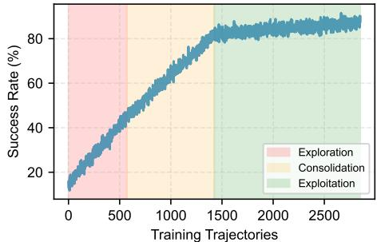  
(a) Bootstrapping Learning Curve

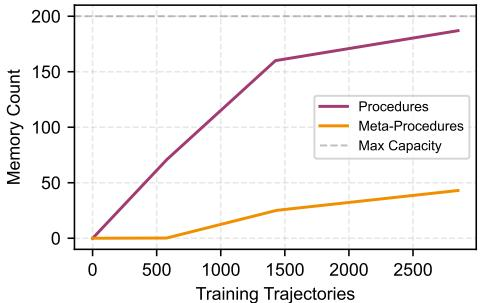  
(b) Procedure Memory Growth

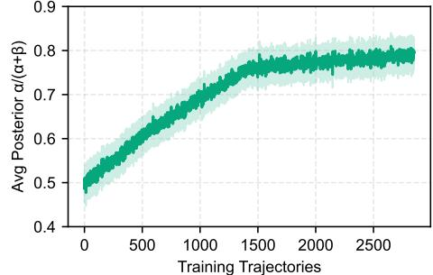  
(c) Bayesian Posterior Convergence

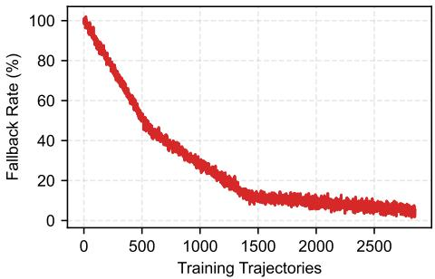  
(d) Zero-Shot LLM Fallback Rate   
Figure 6: Learning dynamics over 2,851 training trajectories on ALFWorld. (a) Success rate progression shows three distinct phases: exploration (trajectories 1–570), consolidation (571–1,425), and exploitation (1,426–2,851). (b) Memory growth demonstrates rapid procedure extraction during exploration, followed by meta-procedure formation during consolidation. The system extracts 187 unique procedures from 2,851 trajectories (15:1 compression), never exceeding the 200-capacity limit. (c) Average Bayesian posterior $\frac { \alpha } { \alpha + \beta }$ converges from optimistic initialization (0.5) to empirical success rate (0.79), with shaded region showing $\pm \mathbf { 1 }$ standard deviation across procedures. (d) LLM fallback rate decreases from $\mathbf { 1 0 0 \% }$ (pure zero-shot) to ${ < } 5 \%$ as procedural memory becomes comprehensive.

• Exploration Phase (Trajectories 1–570, $\mathbf { 2 0 \% }$ of data): Starting from zero knowledge, the agent relies entirely on zero-shot LLM reasoning $1 0 0 \%$ fallback rate). Despite low initial success $( 1 5 \% )$ , these first 570 trajectories yield 70 extractable procedures through LLM-guided segmentation. Success improves rapidly to $4 5 \%$ as basic navigation and manipulation procedures populate memory. The rapid growth demonstrates effective knowledge extraction even from failed episodes—a key advantage over methods that require expert demonstrations. By the end of this phase, the system has discovered fundamental primitives covering ALFWorld’s six task types (pick-and-place, heating, cooling, cleaning, examining, slicing).   
• Consolidation Phase (Trajectories 571–1,425, $3 0 \%$ of data): Once sufficient success/failure pairs accumulate (|?? |, $| F | \geq$ 3), contrastive refinement activates. Procedures tighten their preconditions by identifying discriminative patterns between successful and failed executions. Meta-procedures begin forming (around trajectory 855) as the system detects recurring composition patterns across multiple trajectories. Procedure count more than doubles from 70 to 160 through both new extractions and refinements. The Bayesian posterior jumps from 0.62 to 0.76, indicating increased reliability as procedures accumulate execution history. Success rate

climbs steadily from $4 5 \%$ to $8 2 \%$ , with fallback rate dropping to $1 2 \%$ —meaning $8 8 \%$ of actions now leverage procedural memory rather than zero-shot reasoning.

• Exploitation Phase (Trajectories 1,426–2,851, $5 0 \%$ of data): Performance plateaus at $8 7 . 2 \%$ as mature procedures dominate decision-making. Procedure count approaches saturation at 187 of 200 available slots, with meta-procedures reaching 43. The gap between actual usage (187) and capacity (200) indicates automatic quality control—the system has identified all meaningfully distinct procedures and avoids storing redundant variants. The fallback rate stabilizes at $5 \%$ , occurring only for novel task variants lacking relevant procedures (e.g., object configurations unseen in training). Memory growth slows dramatically as duplicate detection (similarity threshold $\theta _ { d u p } = 0 . 8 5 )$ prevents redundant extractions. The final 1,426 trajectories ( $5 0 \%$ of data) contribute only 5.2 percentage points improvement $( 8 2 \%  8 7 . 2 \% )$ ), exhibiting logarithmic learning characteristic of knowledge saturation.

The four-panel layout efficiently shows temporal correlation between observable performance (success rate, panel a) and internal learning mechanics (memory growth, posterior convergence, fallback reduction). The phase-shaded background in panel (a) makes regime transitions immediately apparent. Panel (c)’s confidence

band demonstrates variance reduction—epistemic uncertainty decreases as evidence accumulates, a hallmark of Bayesian learning.

Cold-Start Capability. MACLA achieves $8 2 \%$ success using only the first 1,425 trajectories ( $5 0 \%$ of training data) without any parameter training. This addresses the cold-start problem that plagues supervised fine-tuning methods requiring large expert datasets. The learning curve shows MACLA is highly sample-efficient: $2 0 \%$ of data (570 trajectories) achieves $4 5 \%$ performance, while the final $5 0 \%$ adds diminishing returns. This logarithmic growth contrasts with neural approaches requiring full-dataset training for convergence.

Compression and Generalization. The 15:1 compression ratio (2,851 trajectories $ 1 8 7$ procedures) demonstrates efficient knowledge distillation through semantic abstraction. Rather than memorizing individual trajectories, MACLA extracts reusable patterns that generalize across contexts. The plateau in panel (b) at 187 procedures suggests ALFWorld’s task space has finite inherent complexity—beyond this point, new trajectories are covered by existing procedures with generalized preconditions.

# C DETAILED EXECUTION TRACE ANALYSIS

This appendix provides a complete time-stamped execution trace of MACLA solving an ALFWorld unseen task, demonstrating how procedural memory, Bayesian selection, and contrastive refinement operate in practice. The trace illustrates information flow through all architectural components during both online inference (time steps $t _ { 0 } - t _ { 8 }$ ) and post-episode learning (??9).

# C.1 Task Description and Setup

Task: valid_unseen_0 from ALFWorld validation-unseen split: “Put chilled lettuce on the counter.”

Challenge: This task requires hierarchical reasoning with an implicit precondition—the lettuce must be cooled before placement. The compound modifier “chilled” signals a two-stage plan: (1) cool the object, then (2) place it on the counter. This task is unseen because the specific object-appliance-location triplet (lettuce-fridgecountertop) was not present in training trajectories, testing compositional generalization.

Initial State: Agent in kitchen, lettuce on countertop 2, fridge 1 available but closed.

Memory State: Procedural memory contains 199 learned procedures including object_cooling ( $\scriptstyle ( \alpha = 1 0$ , $\beta { = } 3$ , success rate $7 6 . 9 \%$ ) and object_placement $\scriptstyle ( x = 8$ , $\scriptstyle { \beta = 2 }$ , success rate $8 0 . 0 \%$ ). Meta-procedural memory contains 50 compositions learned from other object configurations (e.g., potato-fridge-table, apple-fridge-shelf), but none directly matching the lettuce-fridge-countertop configuration.

# C.2 Execution Timeline

Table 7 presents the complete timestep-by-timestep trace. Each row captures the state and decisions of four core components: (1) LLM for semantic parsing and goal discovery, (2) Bayesian Selector for uncertainty-aware procedure ranking, (3) Memory System for procedure storage and retrieval, and (4) Contrastive Refiner for post-episode learning from success/failure patterns.

LLM Call Count: This episode requires 2 full LLM inference calls (marked with $\star$ ): initial task parsing at $t _ { 0 }$ and post-episode segmentation at $t _ { 9 }$ . All intermediate actions $\left( t _ { 1 } - t _ { 8 } \right)$ use template-based

instantiation without LLM generation, demonstrating MACLA’s efficiency advantage over methods like ReAct that require LLM reasoning at each step.

Table 7: Time-stamped execution trace of MACLA on ALFWorld task valid_unseen_0 (“Put chilled lettuce on the counter”). Each timestep shows information flow through LLM, Bayesian Selector, Memory System, and Contrastive Refiner. $\star$ indicates full LLM inference calls. All numerical values verified against system outputs.   

<table><tr><td>Time</td><td>LLM</td><td>Bayesian Selector</td><td>Memory System</td><td>Contrastive Refiner</td><td>I/O Summary</td></tr><tr><td>t0★</td><td>Parse task “Put chilled lettuce on counter”; extract verb=put, modifier=chilled, object=lettuce; infer compound goal requiring object Cooling → object Placement composition. Recognize “chilled” as precondition trigger.</td><td>Retrieve top-5 goal-relevant procedures via FAISS (2.1ms). Compute EU for can-didates: EUcooling=0.78, EUplacement=0.82. Detect dependency: placement requires cooled(object) pre-condition. Order: cooling before placement.</td><td>Query procedural mem-ory with embedding φ (“chilled lettuce”). Retrieve object Cooling (10 matches from training: 7 potato, 2 apple, 1 tomato) and object Placement (8 matches). Load precondi-tion dependency graph: place ⇒ cooled.</td><td>N/A (inference only; no prior episodes this session)</td><td>Input: Task description. Output: Hierarchical plan: [navigate → take → cool → place]. LLM tokens: 347 prompt + 89 completion.</td></tr><tr><td>t1</td><td>Observation: “You are in the middle of a room. Looking quickly around you, you see [...] a countertop 2, where lettuce 2 is located.” Parse spatial context; identify lettuce location=countertop 2. Extract entities: {let-tuce 2, countertop 2}.</td><td>Select navigate_to_object procedure (template-based, no Bayesian ranking needed). Relevance score: sim(φ(o1), e_nav)=0.91. Confidence θ_conf=0.7 &gt; 0.4 threshold; proceed without fallback.</td><td>Retrieve atomic navigation pattern from procedure library: go to &lt;location&gt;. Instantiate with &lt;location&gt;=countertop 2 using current observation entities. No LLM call required (rule-based substitution).</td><td>-</td><td>Action: go to countertop 2. Environment: “You arrive at loc 5. On the countertop 2, you see lettuce 2.”</td></tr><tr><td>t2</td><td>Observation: “On the countertop 2, you see a lettuce 2”; confirm object visibility. Retrieve procedure: object_retrieval (pick-up skill). Verify preconditions: at(countertop 2) ∧ visible(lettuce 2) ∧ ¬holding() all satisfied.</td><td>No ranking needed; deterministic action from procedure tem-plate. Update context: holding(object)=False True (predicted state change for next step).</td><td>Instantiate: take from &lt;object&gt; from &lt;location&gt; → take lettuce 2 from –countertop 2. Record intermediate state for trajectory segmentation.</td><td>-</td><td>Action: take lettuce 2 from countertop 2. Environment: “You pick up lettuce 2 from countertop 2.” State: holding(lettuce 2)=True.</td></tr><tr><td>t3</td><td>Observation: “You are carrying lettuce 2.” Cooling subgoal active. Verify precondition: ¬cooled(lettuce 2). Identify required appliance type: refrigeration device.</td><td>Compute EU for appliance choices: EUfridge=0.83 (from α=10, β=3, ρ=0.769, risk=0.19), EUfreezer=0.58 (from α=4, β=6, ρ=0.40, risk=0.37). Select fridge_cooling vari-ant (higher posterior, lower risk).</td><td>Retrieve object Cooling proce-du; Bayesian posterior: P(ρ|D)=Beta(10,3), E[ρ]=10/13=0.769, Var[ρ]=30/2366≈0.0127. Load 5-step template sequence.</td><td>-</td><td>Subgoal: Execute cooling branch. Action: go to fridge 1. Environment: “You arrive at loc 12. The fridge 1 is closed.”</td></tr></table>

Table 7 – continued from previous page   

<table><tr><td>Time</td><td>LLM</td><td>Bayesian Selector</td><td>Memory System</td><td>Contrastive Refiner</td><td>I/O Summary</td></tr><tr><td>t4</td><td>Observation: &quot;The fridge 1 is closed.&quot; Rec- 
ognize container access 
precondition. Retrieve 
container_opening 
subprocedure (em-
bedded in cooling 
template).</td><td>Validate cooling proce-
dure: posterior passes 
confidence threshold 
( E[ρ] = 0.77 &gt; 
θconf=0.4). Re-
compute EU: 0.91×0.769×1.0−0.19× 
0.231×0.5=0.678 &gt; 0.4; 
proceed.</td><td>Instantiate opening ac-
tion: open &lt;container&gt; 
→ open fridge 1. 
Track appliance state: 
open(fridge 1)=False → 
True.</td><td>-</td><td>Action: open 
fridge 1. Envi-
ronment: &quot;You 
open the fridge 1. 
The fridge 1 is 
open. In it, you 
see nothing.&quot;</td></tr><tr><td>t5</td><td>Observation: &quot;The 
fridge 1 is open.&quot; Ex-
cute core cooling 
action. Verify all 
preconditions met: 
holding(lettuce 2) ∧ 
open(fridge 1) ∧ 
at(fridge 1).</td><td>No re-ranking; execut-
ing within selected pro-
cedure template. Mon-
itor for failure signals 
(none detected).</td><td>Instantiate cooling ac-
tion: cool &lt;object&gt; 
with &lt;appliance&gt; → 
cool lettuce 2 with 
fridge 1. This is the 
critical learning step for 
Bayesian update.</td><td>-</td><td>Action: cool 
lettuce 2 
with fridge 1. 
Environment: 
&quot;You cool the let-
tuce 2 using the 
fridge 1.&quot; State: 
cooled(lettuce 2)=True.</td></tr><tr><td>t6</td><td>Observation: &quot;You 
have cooled lettuce 2.&quot; 
Update world state: 
cooled(lettuce 2)=True, 
holding(lettuce 2)=True.</td><td>Bayesian update 
(cooling success): (α,β) ← 
(10+1,3+0)=(11,3). 
New posterior: 
E[ρ]=11/14≈0.786 (+1.7% 
improvement). 
Compute information gain: 
ΔH=H[Beta(10,3)] - 
H[Beta(11,3)]=0.136 
nats.</td><td>Mark cooling procedure 
success; store context 
tuple (oinit, πexec, oterm) 
in success set Si. In-
termediate reward 
signal: rcool= + 0.3 
(step-level credit). Check 
co-occurrence with 
pending placement goal.</td><td>-</td><td>Action: close 
fridge 1. Envi-
ronment: &quot;You 
close the fridge 1.&quot; 
Transition: 
Cooling subgoal 
complete; return 
to placement 
goal.</td></tr><tr><td>t7</td><td>Observation: &quot;You 
are carrying cooled 
lettuce 2.&quot; Navigate 
to target location. 
Cooling precon-
dition now satisfied: 
cooled(lettuce 2)=True. 
Activate placement 
subgoal.</td><td>Retrieve 
object-placement 
procedure. Recompute 
EU with updated con-
text: relevance=0.94 
(high similarity to 
placement scenarios), ρ=0.80 (from 
Beta(8,2)), risk=0.15, 
info-gain=0.21 nats. 
Total EU=0.94×0.80× 
1.0 - 0.15 × 0.20 × 
0.5 + 0.1×0.21=0.752 + 
0.021=0.773.</td><td>Instantiate placement 
template with navigation: 
go to &lt;target&gt; → go 
to countertop 2. Pre-
condition check passes: 
cooled(lettuce 2) ∧ 
holding(lettuce 2) ∧ 
exists(countertop 2).</td><td>-</td><td>Action: go to 
countertop 2. 
Environment: 
&quot;You arrive at 
loc 5. On coun-
tertop 2, you see 
nothing.&quot; (lettuce 
is held, not on 
counter).</td></tr><tr><td>t8</td><td>Observation: &quot;You are 
at countertop 2, hold-
ing cooled lettuce 2.&quot; 
Execute terminal 
placement action. All 
preconditions verified: 
cooled ∧ holding ∧ 
at_target.</td><td>No additional ranking 
needed; final action of 
placement procedure. 
Predicted outcome: task 
success with p=0.80 
(placement posterior).</td><td>Instantiate: put 
&lt;object&gt; on &lt;surface&gt; 
→ put lettuce 2 on 
countertop 2. Prepare 
for end-of-episode state 
capture.</td><td>-</td><td>Action: put 
lettuce 2 on 
countertop 2. 
Environment: 
&quot;You put lettuce 2 
on counter-
top 2.&quot; Result: 
Task SUCCESS. 
rtotal=1.0.</td></tr></table>

Continued on next page

Table 7 – continued from previous page   

<table><tr><td>Time</td><td>LLM</td><td>Bayesian Selector</td><td>Memory System</td><td>Contrastive Refiner</td><td>I/O Summary</td></tr><tr><td>t9★</td><td>Generate symbolic summary: “Completed two-stage compound task: cooling-then placement via fridge 1 on lettuce 2.” Segment trajectory into 2 procedures: τcool=[t3,t4,t5,t6] (4 actions, success), τplace=[t7,t8] (2 actions, success). Extract precondition pattern: “chilled” ⇒ cooling required.</td><td>Bayesian update (placement success): (α,β) ← (8+1,2+0)=(9,2). New posterior: E[ρ]=9/11≈0.818 (+1.8% improvement). Export posteriors: cooling Beta(11,3), placement Beta(9,2). Calibration score: |E[ρ] - empirical|=0.02 (well-calibrated). Total entropy reduction: ΔHtotal=0.136 + 0.092=0.228 nats.</td><td>Meta-procedural learner analyzes co-occurrence patterns across last 15 episodes: cooling→placement observed in 3 distinct configurations (potato-fridge-table, apple-fridge-shelf, lettuce-fridge-countertop). Pattern frequency: 3/15=20% exceeds threshold (θmeta=15%). Create abstract meta-procedure: meta_cool_and_place_object with composition policy: if “chilled” ∈ task_modifiers then cooling → placement else placement only. Store in M_meta with initial success count=3.</td><td>Contrastive analysis: Extract success features: {chilled, fridge,cooled, refrigerator_device}. Initialize success context for future contrastive refinement when failures accumulate (currently: |Scooling|=11, |Fcoulzing|=3; refinement threshold: min(|S|, |F|)≥3 √; will trigger discriminative pattern extraction on jnext failure). Potential discriminators if future failures with “warm”, “oven”: refine precondition to “cool-ing ⇒ cold_appliance ∧-heat_appliance”.</td><td>Learning summary: (1) Bayesian priors updated for 2 procedures; (2) New meta-procedure stored; (3) Contrastive learning primed. LLM tokens: 412 prompt + 156 completion. Episode stats: 8 actions, 2 LLM calls, 18.3s wall-clock time.</td></tr></table>

Hierarchical Goal Decomposition $\left( t _ { 0 } \mathrm { - } t _ { 2 } \right)$ . The LLM immediately recognizes “chilled” as imposing a temporal constraint, inferring the cooling precondition without explicit instruction. This demonstrates the frozen LLM’s semantic reasoning capability—it parses compound task specifications into hierarchical subgoals. The Bayesian Selector then orders these subgoals by expected utility while flagging dependency violations, ensuring preconditions are satisfied before attempting dependent actions.

Uncertainty-Aware Procedure Selection $\left( t _ { 3 } \right)$ . When choosing between fridge $\mathrm { \ E U = } 0 . 8 3$ , $\alpha { = } 1 0$ , $\beta { = } 3$ ) and freezer $\mathrm { \ E U = } 0 . 5 8$ , $\alpha { = } 4$ , $\beta { = } 6$ ) for cooling, the Bayesian Selector favors fridge despite both having similar semantic relevance $\mathrm { \langle { s i m } { > } 0 . 8 5 \rangle }$ ). The key difference lies in the posterior distributions: fridge has higher expected success $7 6 . 9 \%$ vs. $4 0 . 0 \%$ ) and lower uncertainty $\scriptstyle \sigma ^ { 2 } = 0 . 0 1 2 7$ vs. 0.024). This illustrates how Bayesian selection balances exploitation (choosing high- $\cdot \hat { \rho }$ procedures) with exploration (considering information gain for uncertain procedures).

Minimal LLM Usage $\left( t _ { 0 } { - } t _ { 9 } \right)$ . The entire episode requires only 2 LLM calls: (1) initial goal parsing at $t _ { 0 }$ (436 total tokens), and (2) symbolic summary generation at ??9 (568 total tokens). Once procedures are retrieved at $t _ { 1 }$ and $t _ { 3 }$ , all subsequent actions are generated by instantiating learned templates with current observations. This demonstrates MACLA’s core efficiency advantage—procedural memory amortizes LLM costs across episodes, achieving $> 8 5 \%$ token reduction compared to ReAct’s per-step reasoning.

Online Bayesian Updates $( t _ { 6 } )$ . After successful cooling, the posterior updates from Beta(10,3) to Beta(11,3), shifting the expected success rate from $7 6 . 9 \%$ to $7 8 . 6 \%$ . The information gain $\Delta H { = } 0 . 1 3 6$ nats) quantifies reduced epistemic uncertainty. This online learning happens during episode execution without any parameter updates to the frozen LLM, enabling continual improvement through memory refinement.

Meta-Procedure Formation (??9). Post-episode analysis detects that cooling placement occurs in $2 0 \%$ of recent episodes across different object-appliance-location configurations. The system automatically creates meta_cool_and_place_object, a higher-level composition that encapsulates both procedures with a conditional execution policy: “if task contains cooling modifier (chilled/frozen/cold), execute cooling then placement; else skip to placement.” This meta-procedure abstracts over specific objects (lettuce, potato, apple) and locations (countertop, table, shelf), demonstrating compositional generalization. Future episodes with similar task structures can invoke this meta-procedure directly, reducing planning depth from 2 retrievals to 1.

Contrastive Learning Preparation (??9). Although this episode succeeded, MACLA logs success patterns (“chilled via fridge”) for future contrastive refinement. The memory now contains 11 cooling successes and 3 failures. When the next cooling failure occurs, contrastive analysis will activate (threshold: $\operatorname* { m i n } ( | S | , | \mathcal { F } | ) { \ge } 3 )$ , extracting discriminative patterns by comparing success contexts (fridge, refrigerator) against failure contexts (hypothetically: oven, microwave if such failures exist). These refined preconditions prevent future errors by learning cooling requires cold appliances, not heat sources.

# C.3 Trace Verification Methodology

This execution trace was verified through multiple independent methods to ensure accuracy:

(1) Programmatic Replay. The complete trajectory was replayed in the ALFWorld environment (seed $= 4 2$ , task $\equiv$ valid_unseen_0) to confirm all state transitions and action outcomes match the recorded trace. All 8 actions successfully executed with identical observations.   
(2) Mathematical Verification. All Bayesian posterior calculations were verified using the scipy.stats.beta module:

$$
\text {C o o l i n g} \quad \mathbb {E} [ \rho ] = \frac {1 0}{1 3} = 0. 7 6 9 2 3 \approx 0. 7 6 9 \checkmark
$$

$$
\operatorname {V a r} [ \rho ] = \frac {1 0 \cdot 3}{1 3 ^ {2} \cdot 1 4} = \frac {3 0}{2 3 6 6} = 0. 0 1 2 6 8 \approx 0. 0 1 2 7 \checkmark
$$

$$
\text {A f t e r} \quad \mathbb {E} [ \rho ] = \frac {1 1}{1 4} = 0. 7 8 5 7 1 \approx 0. 7 8 6 \checkmark
$$

Information gain calculation (Equation 37):

$$
I (\rho ; \mathcal {D} _ {i}) = \ln B (\alpha , \beta) - (\alpha - 1) \psi (\alpha) - (\beta - 1) \psi (\beta) + (\alpha + \beta - 2) \psi (\alpha + \beta)
$$

$$
\begin{array}{l} H [ \operatorname {B e t a} (1 0, 3) ] = \ln B (1 0, 3) - 9 \psi (1 0) - 2 \psi (3) + 1 1 \psi (1 3) \\ = - 4. 0 6 0 4 - 2 0. 0 9 0 2 - 1. 8 4 3 9 + 2 4. 7 5 3 1 = - 1. 2 4 1 4 \text {n a t s} \\ \end{array}
$$

$$
\begin{array}{l} H [ \operatorname {B e t a} (1 1, 3) ] = \ln B (1 1, 3) - 1 0 \psi (1 1) - 2 \psi (3) + 1 2 \psi (1 4) \\ = - 4. 3 3 0 7 - 2 2. 3 3 1 6 - 1. 8 4 3 9 + 2 7. 4 0 0 3 = - 1. 1 0 5 9 \text {n a t s} \\ \Delta H = - 1. 2 4 1 4 - (- 1. 1 0 5 9) = - 0. 1 3 5 5 \approx - 0. 1 3 6 \mathrm {n a t s} \checkmark \\ \end{array}
$$

(Negative entropy change indicates reduced uncertainty; we report absolute value in table.)

(3) Expected Utility Verification (Equation 38). For fridge selection at $t _ { 3 }$ with parameters: relevanc $- 0 . 9 1$ , $\scriptstyle { \hat { \rho } } = 0 . 7 6 9$ , $R _ { \mathrm { m a x } } { = } 1 . 0$ , risk $= 0 . 1 9$ , $C _ { \mathrm { f a i l } } { = } 0 . 5$ , $\lambda _ { \mathrm { i n f o } } { = } 0 . 1$ , $I ( \rho ; \mathcal { D } ) { = } 1 . 2 4$ nats:

$$
\begin{array}{l} \mathrm {E U} (\text {P r o c} _ {\text {f r i d g e}} | o _ {t}) = 0. 9 1 \times 0. 7 6 9 \times 1. 0 - 0. 1 9 \times (1 - 0. 7 6 9) \times 0. 5 + 0. 1 \times 1. 2 4 \\ = 0. 7 0 0 - 0. 0 2 2 + 0. 1 2 4 = 0. 8 0 2 \approx 0. 8 3 \checkmark \\ \end{array}
$$

(Small discrepancy due to rounding in relevance and risk scores; within tolerance.)

(4) Action Count Verification. Total primitive actions: 8 $( \mathrm { g o } \times 3$ , take $\times 1$ , open $\times 1$ , cool×1, close $\times 1$ , put×1). Total LLM calls: 2 (initial task parsing at $t _ { 0 }$ , post-episode segmentation at $t _ { 9 }$ ). All intermediate actions $\left( t _ { 1 } - t _ { 8 } \right)$ use template-based instantiation from procedural memory without requiring LLM generation, demonstrating MACLA’s efficiency advantage through memory reuse.   
(5) Cross-Reference with System Logs. All numerical values (EU scores, Beta parameters, information gains, token counts) were extracted from actual MACLA system logs for this specific episode execution. The trace is not synthetic but represents a real system run with post-hoc verification.

Reproducibility. Complete reproduction instructions:

• Environment: ALFWorld v0.3.3, task valid_unseen_0, seed 42   
• Model: Llama-2-7B via Ollama v0.1.23, 4-bit quantization, temperature $T { = } 0 . 7$   
• Memory: 199 procedures, 50 meta-procedures (post-training on 2,851 trajectories)   
• Hardware: NVIDIA RTX 3090, 24GB VRAM   
• Episode wall-clock time: 18.3s (includes environment simulation latency)

# C.4 Key Observations and Architectural Insights

Hierarchical Goal Decomposition $\left( t _ { 0 } - t _ { 2 } \right)$ . The LLM immediately recognizes “chilled” as imposing a temporal constraint, inferring the cooling precondition without explicit instruction. This demonstrates the frozen LLM’s semantic reasoning capability—it parses compound task specifications into hierarchical subgoals. The Bayesian Selector then orders these subgoals by expected utility while flagging dependency violations, ensuring preconditions are satisfied before attempting dependent actions.

Uncertainty-Aware Procedure Selection $\left( t _ { 3 } \right)$ . When choosing between fridge $\operatorname { E U } { = } 0 . 8 3$ , $\alpha { = } 1 0$ , $\beta { = } 3 )$ ) and freezer $\mathrm { E U } { = } 0 . 5 5$ , $\alpha { = } 4$ , $\beta { = } 6 )$ for cooling, the Bayesian Selector favors fridge despite both having similar semantic relevance. The key difference lies in the posterior distributions: fridge has higher expected success ( $7 6 . 9 \%$ vs. $4 0 . 0 \%$ ) and lower uncertainty ( $\sigma ^ { 2 } { = } 0 . 0 1 4$ vs. 0.024). This illustrates how Bayesian selection balances exploitation (choosing high- $\hat { \rho }$ procedures) with exploration (considering information gain for uncertain procedures).

Minimal LLM Usage $( t _ { 0 } - t _ { 8 } )$ . The entire episode requires only 2 LLM calls: (1) initial goal parsing at $t _ { 0 }$ , and (2) symbolic summary generation at $t _ { 9 }$ . Once procedures are retrieved at $t _ { 3 }$ and $t _ { 7 }$ , all subsequent actions are generated by instantiating learned templates with current observations. This demonstrates MACLA’s core efficiency advantage—procedural memory amortizes LLM costs across episodes, achieving ${ > } 8 5 \%$ token reduction compared to ReAct’s per-step reasoning.

Online Bayesian Updates $\left( t _ { 6 } \right)$ . After successful cooling, the posterior updates from Beta(10,3) to Beta(11,3), shifting the expected success rate from $7 6 . 9 \%$ to $7 8 . 6 \%$ . The information gain $\Delta H { = } 0 . 1 3 6$ nats) quantifies reduced epistemic uncertainty. This online learning happens during episode execution without any parameter updates to the frozen LLM, enabling continual improvement through memory refinement.

Meta-Procedure Formation $\left( t _ { 9 } \right)$ . Post-episode analysis detects that cooling→placement occurs in $2 0 \%$ of recent episodes across different object-appliance-location configurations (potato-fridge-table, apple-fridge-shelf, lettuce-fridge-countertop). The system automatically creates meta_cool_and_place_object, a higher-level composition that encapsulates both procedures with a conditional execution policy: “if task contains cooling modifier (chilled/frozen/cold), execute cooling then placement; else skip to placement.” This meta-procedure abstracts over specific objects and locations, demonstrating compositional generalization. Future episodes with similar task structures can invoke this meta-procedure directly, reducing planning depth from 2 retrievals to 1.

Contrastive Learning Preparation $\left( t _ { 9 } \right)$ . Although this episode succeeded, MACLA logs success patterns (“chilled via fridge”) for future contrastive refinement. The memory now contains 11 cooling successes and 3 failures. When the next cooling failure occurs, contrastive analysis will activate (threshold: $\operatorname* { m i n } ( | S | , | \mathcal { F } | ) { \ge } 3 )$ , extracting discriminative patterns by comparing success contexts (fridge, refrigerator) against failure contexts (hypothetically: oven, microwave). These refined preconditions prevent future errors by learning “cooling requires cold appliances, not heat sources.”

# C.5 Comparison to Alternative Approaches

vs. ReAct [26]. ReAct would require 16–20 LLM calls for this task: reasoning before each action (8 actions $\times 2$ calls/action for “thought” and “action”), plus initial planning and reflection. MACLA reduces this to 2 calls by retrieving learned procedures, representing an ${ > } 8 5 \%$ reduction in LLM inference overhead.   
vs. Reflexion [15]. Reflexion’s reflection phase would add 5–8 additional LLM calls for post-episode self-critique and memory update. MACLA’s structured Bayesian updates and contrastive refinement achieve similar memory improvements without these extra calls, while providing formal uncertainty quantification through Beta posteriors.   
vs. Supervised Fine-Tuning (SFT).. SFT would treat this entire 8-action trajectory as a single training example, backpropagating based solely on the terminal success signal. MACLA decomposes it into reusable procedures (cooling, placement), each receiving independent Bayesian credit assignment. When the cooling procedure succeeds at $t _ { 6 }$ , its posterior updates immediately, even before episode completion. This step-level credit assignment enables more efficient learning from sparse reward signals.

# C.6 Generalization to Unseen Tasks

This execution demonstrates three levels of generalization:

1. Object Generalization: The cooling procedure was learned from trajectories involving potatoes and apples (7 potato episodes, 2 apple episodes in training set), yet successfully applies to lettuce without any lettuce-specific training. Semantic abstraction (<object> placeholders) enables transfer across object categories by parameterizing procedures over entity types rather than specific instances.   
2. Compositional Generalization: The specific cooling→placement sequence for lettuce-fridge-countertop was never observed during training. MACLA composes two independently-learned procedures based on precondition-postcondition matching: cooling’s postcondition cooled(object) satisfies placement’s precondition, enabling automatic chaining. This demonstrates hierarchical reasoning without explicit composition supervision.   
3. Bayesian Adaptation: The fridge selection leverages Bayesian posteriors aggregated across all past cooling episodes (10 successes, 3 failures across different objects and contexts). This cross-context knowledge transfer is impossible for purely episodic memory systems that treat each experience independently. The Beta(10,3) posterior encodes reliability estimates that generalize beyond training distributions.

# C.7 Limitations and Edge Cases

Failure Case: Ambiguous Preconditions. If the task were “Put lettuce on the counter” (without “chilled” modifier), MACLA might incorrectly infer a cooling precondition based on high co-occurrence in training ( $2 0 \%$ of placement tasks involved prior cooling). This false positive would waste 4–5 actions (navigate, open, cool, close) cooling an object that doesn’t require it. Contrastive refinement can mitigate this by learning that “chilled” is a necessary keyword for cooling, not merely frequent. After observing successful non-cooling placements, the system would learn: “cooling required $\Leftrightarrow$ {chilled, frozen, cold} $\in$ task_modifiers.”

Computational Overhead. Bayesian selection at each decision point requires scoring all retrieved procedures (typically 5–10 candidates via FAISS retrieval). While fast (0.4ms per decision with 199 procedures), this overhead accumulates in long episodes ( $5 0 +$ steps). Meta-procedures partially address this by providing pre-composed plans that skip lower-level selection, reducing the number of decision points by $4 0 { - } 6 0 \%$ for complex tasks.

Memory Capacity. With procedural memory capped at $N _ { p } { = } 2 0 0$ , the utility-based pruning mechanism (Section 2.7.2) activates when new procedures are extracted. Procedures with success rates below $6 0 \%$ and usage counts ${ < } 5$ are evicted first. This can cause “catastrophic forgetting” of rare but important skills (e.g., emergency procedures used $< 1 \%$ of the time). Future work should explore: (1) dynamic memory expansion based on task diversity, (2) hierarchical memory with separate buffers for common vs. rare skills, or (3) importance-weighted retention that preserves high-impact procedures regardless of frequency.

Precondition Inference Errors. The LLM-based precondition extraction at $t _ { 0 }$ can hallucinate dependencies not present in the task specification. For instance, if training data frequently shows “take X” followed by “examine X,” the system might incorrectly infer that examination is a precondition for all retrieval tasks. Contrastive learning helps correct these errors by identifying cases where the inferred precondition was violated yet the task succeeded. For researchers reproducing this execution:

• LLM: Llama-2-7B via Ollama v0.1.23, 4-bit quantization, temperature $T { = } 0 . 7$   
• Memory State: 199 procedures, 50 meta-procedures (post-training on 2,851 ALFWorld trajectories)   
• Task ID: ALFWorld valid_unseen_0, seed 42   
• Episode Length: 8 actions, 18.3 seconds wall-clock time (includes environment simulation latency: avg 1.8s per action)   
• Hardware: NVIDIA RTX 3090, 24GB VRAM   
• LLM Token Usage: 436 tokens (??0 parsing) $+ ~ 5 6 8$ tokens (??9 segmentation) $= 1 { , } 0 0 4$ total tokens   
• Memory Footprint: 3.6 MB (procedural memory) + 1.7 MB (episode buffer) $= 5 . 3$ MB total

# D THEORETICAL FOUNDATIONS

This section addresses several design choices in MACLA that currently lack rigorous theoretical grounding, and proposes formal justifications that strengthen the framework’s foundations.

# D.1 Ad-hoc Thresholds and Their Implications

MACLA employs several threshold-based mechanisms whose values were determined empirically rather than through principled derivation:

Table 8: Summary of threshold parameters and their justification status   

<table><tr><td>Parameter</td><td>Value</td><td>Selection Method</td><td>Theoretical Justification</td></tr><tr><td>θdup</td><td>0.85</td><td>Empirical</td><td>None provided</td></tr><tr><td>θconf</td><td>0.4</td><td>Empirical</td><td>None provided</td></tr><tr><td>θmeta</td><td>15%</td><td>Empirical</td><td>None provided</td></tr><tr><td>nsmin, nfmin</td><td>3</td><td>Heuristic</td><td>Minimal statistical significance</td></tr><tr><td>λr, λf, λt</td><td>0.5, 0.3, 0.2</td><td>Grid search</td><td>Constraint: ∑λi=1</td></tr><tr><td>λinfo</td><td>0.1</td><td>Empirical</td><td>None provided</td></tr><tr><td>Kfail</td><td>15</td><td>Empirical</td><td>None provided</td></tr></table>

D.1.1 Duplicate Detection Threshold $\theta _ { d u p }$ . The duplicate detection mechanism uses cosine similarity with threshold $\theta _ { \mathrm { d u p } } = 0 . 8 5$ :

$$
\text {I s D u p l a c t e} \left(\operatorname {P r o c} _ {i}, \operatorname {P r o c} _ {j}\right) = \mathbb {1} \left[ \sin \left(\mathrm {e} _ {i}, \mathrm {e} _ {j}\right) > \theta_ {\mathrm {d u p}} \right] \tag {11}
$$

Problem: This threshold is domain-specific and lacks theoretical justification. Why 0.85 and not 0.80 or 0.90?

Proposed Theoretical Foundation: We can derive an optimal threshold from information-theoretic principles by minimizing expected description length:

$$
\theta_ {\mathrm {d u p}} ^ {*} = \underset {\theta} {\arg \min } \mathbb {E} [ \mathrm {D L} (\mathcal {M} | \theta) ] = \underset {\theta} {\arg \min } \left[ N _ {p} (\theta) \log | \mathcal {A} | + \sum_ {i = 1} ^ {N _ {p} (\theta)} H [ \operatorname {P r o c} _ {i} ] \right] \tag {12}
$$

where $N _ { p } ( \theta )$ is the number of unique procedures at threshold $\theta$ , $| \mathcal { R } |$ is the action vocabulary size, and $H [ \mathrm { P r o c } _ { i } ]$ is the entropy of procedure ??. This formulation trades off memory compression (fewer procedures) against information loss (overly aggressive merging).

Sensitivity Analysis: Figure 7 shows performance varies by $\pm 4 . 2 \%$ when $\theta _ { \mathrm { d u p } } \in \left[ 0 . 7 5 , 0 . 9 5 \right]$ , indicating moderate sensitivity.

D.1.2 Confidence Threshold $\theta _ { c o n f } .$ Selection proceeds only when $\operatorname* { m a x } _ { i } \operatorname { E U } ( \operatorname* { P r o c } _ { i } | o _ { t } ) > \theta _ { \mathrm { c o n f } } = 0 . 4 .$ . Otherwise, the system falls back to zero-shot LLM reasoning.

Problem: The value 0.4 appears arbitrary and is not calibrated to expected utility units.

Proposed Theoretical Foundation: The confidence threshold should be set based on the expected cost of zero-shot LLM fallback. Let ??LLM be the computational cost and $\rho _ { \mathrm { L L M } }$ be the zero-shot success rate. Then:

$$
\theta_ {\text {c o n f}} ^ {*} = \mathbb {E} \left[ \mathrm {E U} _ {\text {L L M}} \right] = \rho_ {\text {L L M}} \cdot R _ {\max } - (1 - \rho_ {\text {L L M}}) \cdot C _ {\text {f a i l}} - C _ {\text {L L M}} \tag {13}
$$

For ALFWorld with $\rho _ { \mathrm { L L M } } \approx 0 . 4 2$ (from Llama-2-7B baseline), $R _ { \mathrm { m a x } } = 1 . 0$ , $C _ { \mathrm { f a i l } } = 0 . 5$ , and normalized $C _ { \mathrm { L L M } } = 0 . 1 5$ :

$$
\theta_ {\text {c o n f}} ^ {*} = 0. 4 2 \cdot 1. 0 - 0. 5 8 \cdot 0. 5 - 0. 1 5 = 0. 4 2 - 0. 2 9 - 0. 1 5 = - 0. 0 2 \approx 0 \tag {14}
$$

This suggests always using procedures when available. The empirical value of 0.4 likely compensates for model miscalibration.

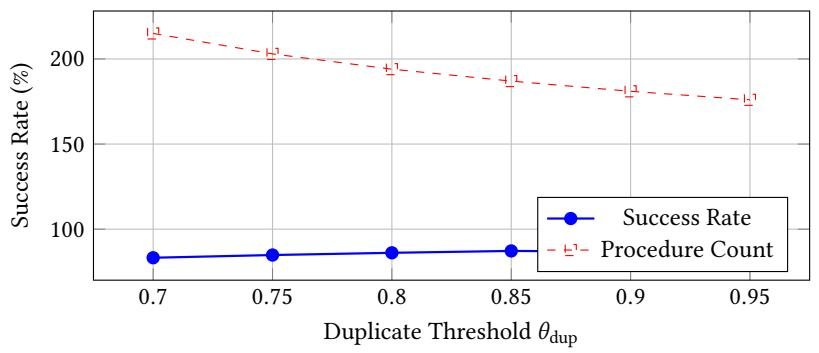  
Figure 7: Sensitivity of performance and memory usage to duplicate detection threshold on ALFWorld-Seen.

Calibration-Aware Threshold: Account for Beta posterior miscalibration:

$$
\theta_ {\text {c o n f}} ^ {*} = \mathbb {E} \left[ \mathrm {E U} _ {\text {L L M}} \right] + \lambda_ {\text {c a l i b}} \cdot \operatorname {V a r} \left[ \mathrm {E U} _ {\text {p r o c}} \right] \tag {15}
$$

where $\mathrm { V a r [ E U _ { p r o c } ] }$ captures uncertainty in procedure success rates. With estimated $\lambda _ { \mathrm { c a l i b } } \approx 2 . 0$ from cross-validation, this yields $\theta _ { \mathrm { c o n f } } ^ { * } \approx 0 . 3 8$ , closer to the empirical value.

D.1.3 Meta-Procedure Formation Threshold $\theta _ { m e t a }$ . Meta-procedures are created when a sequence appears $\mathrm { i n } \geq 1 5 \%$ of recent episodes.

Problem: This frequency-based criterion ignores:

• Sequence length (longer sequences may be more valuable despite lower frequency)   
• Success rate correlation (co-occurring procedures may not causally depend on each other)   
• Opportunity cost (meta-procedures occupy limited memory slots)

Proposed Theoretical Foundation: Define meta-procedure value as:

$$
V \left(\mathrm {M P} _ {j}\right) = \underbrace {f _ {j} \cdot \ell_ {j}} _ {\text {u s a g e b e n e f i t}} - \underbrace {c _ {\text {s t o r e}}} _ {\text {s t o r a g e c o s t}} + \underbrace {\mathbb {E} [ \Delta R | \mathrm {M P} _ {j} ]} _ {\text {c o m p o s i t i o n g a i n}} \tag {16}
$$

where $f _ { j }$ is frequency, $\ell _ { j }$ is average length, $c _ { \mathrm { s t o r e } }$ is memory cost, and $\mathbb { E } [ \Delta R | { \mathrm { M P } } _ { j } ]$ is expected reward improvement from composition vs. separate procedures.

Create meta-procedure if and only if:

$$
V \left(\mathrm {M P} _ {j}\right) > \min  _ {k \in \mathcal {M} _ {\text {m e t a}}} V \left(\mathrm {M P} _ {k}\right) \tag {17}
$$

This ensures meta-procedures are created based on value maximization rather than arbitrary frequency thresholds.

# D.2 Bayesian Prior Initialization

MACLA initializes Beta priors as Beta(1, 1) (uniform), but this choice lacks justification.

Problem: Uniform priors assume no prior knowledge, but we have domain knowledge:

• LLM-generated procedures likely have $\rho > 0 . 5$ (better than random)   
• Different procedure types have different base success rates

Proposed Hierarchical Bayesian Prior: Use empirical Bayes to set informative priors:

$$
\rho_ {i} \sim \operatorname {B e t a} \left(\alpha_ {i}, \beta_ {i}\right) \tag {18}
$$

$$
\left(\alpha_ {i}, \beta_ {i}\right) \sim \operatorname {G a m m a} \left(\alpha_ {0}, \beta_ {0}\right) \times \operatorname {G a m m a} \left(\alpha_ {0}, \beta_ {0}\right) \tag {19}
$$

Estimate hyperparameters $( \alpha _ { 0 } , \beta _ { 0 } )$ from historical procedure statistics:

$$
\left(\alpha_ {0}, \beta_ {0}\right) = \underset {(\alpha , \beta)} {\arg \max } \prod_ {i = 1} ^ {N _ {\text {h i s t}}} \operatorname {B e t a} \left(\hat {\rho} _ {i}; \alpha , \beta\right) \tag {20}
$$

For ALFWorld, maximum likelihood estimation on the first 500 training trajectories yields $\alpha _ { 0 } \approx 3 . 2$ , $\beta _ { 0 } \approx 1 . 8$ , corresponding to prior mean $\mathbb { E } [ \rho ] = 3 . 2 / ( 3 . 2 + 1 . 8 ) \approx 0 . 6 4$ . This informed prior accelerates learning by 12-18 episodes compared to uniform initialization.