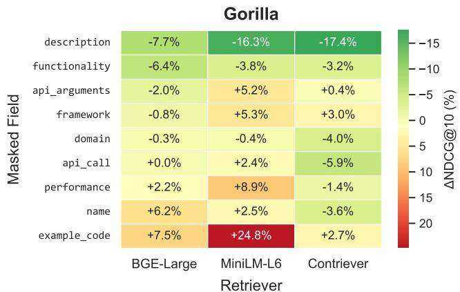
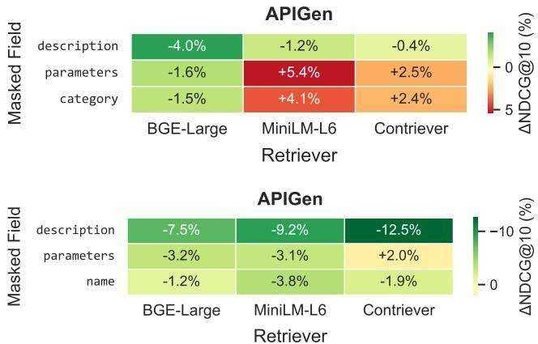
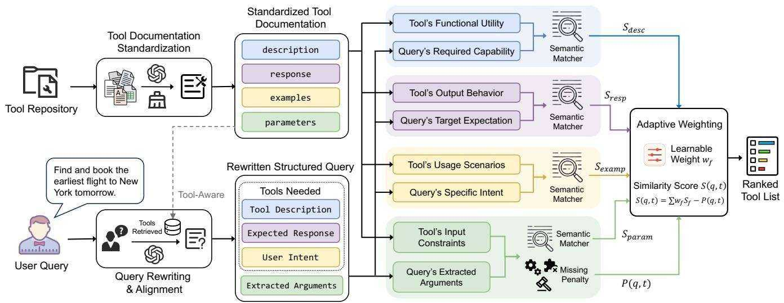
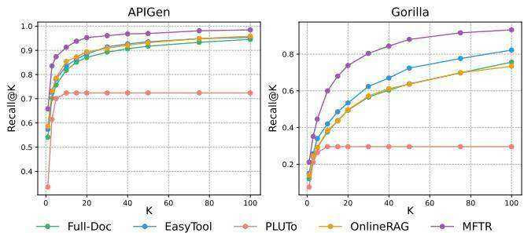
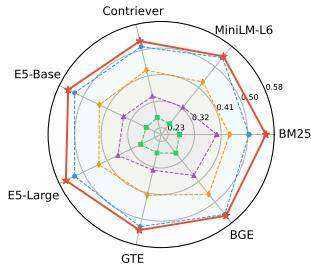
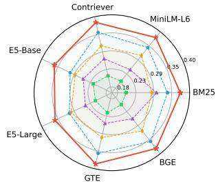
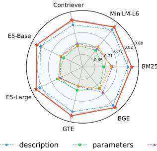
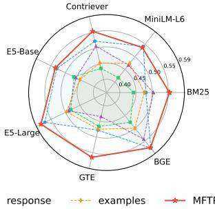

# Multi-Field Tool Retrieval

Yichen Tang

tangyc21@mails.tsinghua.edu.cn

DCST, Tsinghua University

Beijing 100084, China

Yiqun Liu

DCST, Tsinghua University

Beijing 100084, China

Weihang Su

DCST, Tsinghua University

Beijing 100084, China

Qingyao Ai∗

aiqy@tsinghua.edu.cn

DCST, Tsinghua University

Beijing 100084, China

# Abstract

Integrating external tools enables Large Language Models (LLMs) to interact with real-world environments and solve complex tasks. Given the growing scale of available tools, effective tool retrieval is essential to mitigate constraints of LLMs’ context windows and ensure computational efficiency. Existing approaches typically treat tool retrieval as a traditional ad-hoc retrieval task, matching user queries against the entire raw tool documentation. In this paper, we identify three fundamental challenges that limit the effectiveness of this paradigm: (i) the incompleteness and structural inconsistency of tool documentation; (ii) the significant semantic and granular mismatch between user queries and technical tool documents; and, most importantly, (iii) the multi-aspect nature of tool utility, that involves distinct dimensions, such as functionality, input constraints, and output formats, varying in format and importance. To address these challenges, we introduce Multi-Field Tool Retrieval, a framework designed to align user intent with tool representations through fine-grained, multi-field modeling. Experimental results show that our framework achieves SOTA performance on five datasets and a mixed benchmark, exhibiting superior generalizability and robustness 1.

# CCS Concepts

• Information systems Retrieval models and ranking.

# Keywords

Tool Retrieval, Multi-Field Retrieval, Large Language Model

# ACM Reference Format:

Yichen Tang, Weihang Su, Yiqun Liu, and Qingyao Ai. 2026. Multi-Field Tool Retrieval. In . ACM, New York, NY, USA, 12 pages. https://doi.org/10. 1145/nnnnnnn.nnnnnnn

# 1 Introduction

Large language models (LLMs) have demonstrated remarkable capabilities in natural language understanding and generation [4, 7, 22]. Nevertheless, directly deploying standalone LLMs in real-world applications still faces substantial challenges, among which two are particularly critical: the lack of grounding to interact with realworld environments [1, 2], and the lack of efficient capabilities for continuous learning and long-term accumulation of functional

skills [34, 42]. Drawing inspiration from human evolution and cognitive development, a natural and effective solution to these challenges is to extend the capabilities of LLMs through the use and management of external tools [27, 32]. By integrating tools, LLMs can actively interact with the real world [21]; by managing tools externally outside the parameters of LLMs, LLMs can adapt to dynamic and evolving environments in a scalable way without the need of frequent re-training and the risk of catastrophic forgetting [18, 28]. With recent advances in reinforcement learning and the development of MCP-like tool use protocols, teaching LLMs to use one or a few specific tools is no longer difficult in general [10, 16, 49]. Thus, how to manage tools effectively and efficiently has gradually become the bottleneck toward building general-purpose agents [41, 43, 47].

As of today, one of the most popular tool management methods is tool retrieval. Modern tool repositories are inherently heterogeneous and dynamic, comprising thousands or millions of manually crafted modules, transformed web services, and even LLMgenerated code [25, 40, 42]. Constrained by LLMs’ limited context windows and computational complexity, the idea of tool retrieval is to build a retrieval system for tools and only feed the most relevant tools to LLMs given the task context. For instance, existing studies on tool retrieval usually first represent and index each tool as a document based on the tool’s documentation, and then use ad-hoc retrieval models to retrieve tools based on the user queries to LLMs. Following this paradigm, many efforts in previous research focus on proposing tool retrieval workflows [11, 17], optimizing query or document representations [6, 24, 48], or training specific retrieval models tailored for tool retrieval [28, 29].

However, in this paper, we argue that tools are fundamentally different from ordinary text documents, and tool retrieval is not a straightforward adaption of ad-hoc retrieval methods on tool documentation. Specifically, we identify three key factors that directly limit the performance of traditional ad-hoc retrieval methods on tool retrieval. First, tool documentation is often incomplete and inconsistent in structures. By nature, tool documentation should be structured documents describing how to use each tool, but, as far as we know, there isn’t a standardized taxonomy for tool documentation. Tool documentation from diverse sources varies significantly in format, granularity, and terminology, and sometimes even fails to provide comprehensive functional explanations and critical technical details. For example, the tool documentation in the Gorilla [25]

  
Figure 1: Impact of field masking on retrieval performance across Gorilla [25], APIBank [14], and APIGen [18] datasets. The results reveal significant differences in field contributions and retriever preferences, indicating that treating tool documentation as a whole unit is suboptimal.

dataset only provides parameter names without detailed descriptions, which is insufficient for a retriever to understand its utility to different user queries.

Second, there are significant mismatches in semantics and granularity between user queries and tool documentation. User queries are often ambiguous and expressed at a high level for a specific task that may involve the composite and coordinated use of multiple tools. For example, a user request such as “analyze the sales trend and generate a summary report” includes data retrieval, statistical analysis, and result visualization, rather than a single tool. In contrast, tool documentation is typically written in a technical manner, detailing usage specifications, with each tool designed to implement a specific, atomic operation. Such discrepancies make ad-hoc retrieval models tailored for semantic and topical relevant matching not suitable for tool retrieval.

Third, more importantly, the utility of tools for a given query is a multi-aspect concept rather than a simple measure of semantic similarity. Beyond functional alignment in textual descriptions, the usefulness and relevance of a tool are constrained by its execution logic from multiple perspectives, such as whether the user can provide the required input parameters, whether the tool can function following the intent of the user, whether the tool’s output satisfies the requirements of downstream tasks, etc. Data related to different aspects vary significantly in formats and importance, making it difficult, if not impossible, to capture tool utility in tool retrieval using a single textual relevance model. For instance, in our preliminary experiments, we compare the performance of retrieval models (in percentage of NDCG changes) treating each tool documentation as single documents separately with or without masking a specific field in the corresponding datasets. The results (Figure 1) show that removing different fields in different datasets could have various negative or even positive impacts on retrieval performance. This indicates that it is fundamentally ill to do tool retrieval by naively applying a single retrieval model on raw tool documentations.

Based on these observations, we propose a Multi-Field Tool Retrieval framework (MFTR) for tool retrieval. First, by analyzing the characteristics of most tool documentation and retrieval behaviors, we propose a standardized schema to normalize and structure tool

representations, mitigating the issue of documentation incompleteness. Second, we propose a tool oriented query rewriting pipeline to align the representations of user queries and tool documentation, addressing the semantic and granularity mismatch between queries and tools. Further, building upon the query alignment process, we conduct multi-field retrieval by separately analyzing the relevance between queries and tools in each field defined by our schema. We introduce an adaptive weighting mechanism to model the importance of different fields dynamically, balancing the contributions of multi-field signals to model the actual utility of a tool with respect to a user query. We evaluate both our proposed method and SOTA baselines on five representative tool retrieval datasets separately, and also construct a new benchmark by mixing these datasets together to simulate a more realistic, large-scale, heterogeneous tool retrieval collection. Experimental results show that MFTR consistently improves the performance of retrievers and outperforms existing baselines in both single-dataset and mixed-dataset settings. These findings highlight the effectiveness and robustness of finegrained, multi-field relevance modeling for tool retrieval.

In summary, the contributions of our paper are as follows:

• We identify the critical limitations of treating tool documentation as flat text and empirically reveal the significant variance in the contribution of different fields to retrieval performance.   
• We propose MFTR, a comprehensive framework that introduces a standardized schema, query rewriting and alignment, and an adaptive multi-field weighting mechanism to precisely model tool utility and user intent.   
• Experiments on multiple benchmarks demonstrate that MFTR significantly advances in tool retrieval and exhibits strong robustness across different retriever backbones.

# 2 Related Work

Tool Learning. Equipping LLMs with external tools extends their capabilities to solve complex tasks [21, 27]. Existing tool learning approaches can generally be categorized into two types: tuningfree [19] and tuning-based [9] methods. Tuning-free methods guide LLMs to select and invoke tools by incorporating documentation of candidate tools directly into the context window [36, 45, 47].

From another angle, tuning-based methods aim to construct specific tool use datasets, such as ToolBench [28], APIGen [18], and ToolACE [16], and fine-tune model parameters to enable effective tool utilization [40, 49]. However, both paradigms struggle when facing large-scale tool repositories [29]. Constrained by the limited context window and computational efficiency, it is infeasible to include all available tools within an LLM’s context. Furthermore, since tools are frequently updated, retraining LLMs to accommodate new tools incurs high costs and poses a risk of catastrophic forgetting [30]. Consequently, efficient tool retrieval becomes a critical prerequisite for bridging LLMs with vast and evolving tool repositories.

Tool Retrieval. Tool retrieval aims to identify appropriate tools that satisfy user requirements from massive tool repositories. Existing approaches typically directly adopted traditional information retrieval methods, utilizing sparse retrievers (e.g., BM25 [31]) or semantic-based dense retrieval models. Recent works improve performance by optimizing tool representations: EasyTool [48] and ToolDE [20] refine documentation via LLMs, while OnlineRAG [24] dynamically updates tool embeddings based on execution feedback. Others train specialized retrievers, such as ToolBench’s [28] BERT-based API retriever and COLT’s [29] scene-aware collaborative approach. Furthermore, with the rise of dynamic RAG paradigms [37–39], multi-step workflows have emerged, where PLUTo [11] utilizes query decomposition for stepwise retrieval, Iter-RetGen [33] iteratively refines instructions based on evaluation feedback, and ToolReAGt [3] adopts the ReAct [47] paradigm to dynamically assess tool sufficiency. Despite these advances, existing methods remain within the ad-hoc retrieval paradigm, modeling the relevance between the query and the entire raw tool documentation. This coarse-grained approach relies heavily on semantic similarity, overlooking the multi-aspect nature of tool utility. In contrast, we propose independently modeling user queries and multi-field tool information for multi-dimensional alignment.

# 3 Methodology

In this section, we introduce our proposed Multi-Field Tool Retrieval (MFTR) framework. As illustrated in Figure 2, MFTR decompose the tool retrieval process into fine-grained alignments in multiple functional fields. By standardizing the tool documentation (Sec. 3.2), rewriting queries (Sec. 3.3) to match these fields, and adaptively weighting the resulting multi-field relevance scores (Sec. 3.4), MFTR can match the actual utility of a tool with respect to a user query more precisely.

# 3.1 Problem Formulation and Overview

Let $\mathcal { T } = \{ ( t _ { 1 } , d _ { 1 } ) , ( t _ { 2 } , d _ { 2 } ) , \cdot \cdot \cdot , ( t _ { N } , d _ { N } ) \}$ denote a tool repository, where each tool $t _ { i } \in T$ is associated with a tool documentation $d _ { i }$ . Given a user query $q$ , the goal of tool retrieval is to identify a relevant subset of tools $\mathcal T _ { q } \subset \mathcal T$ that are most functionally applicable to satisfy the user’s intent. Conventional tool retrieval methods typically treat $d _ { i }$ as a single unstructured text and compute a semantic similarity score between $q$ and $d _ { i }$ :

$$
S (q, t _ {i}) = \phi (q, d _ {i}) \tag {1}
$$

where $\phi ( \cdot , \cdot )$ denotes a relevance scoring function. However, as noted in Sec. 1, this paradigm neglects the mismatch between user queries and technical tool documentation, as well as the varying importance of different functional fields.

To overcome these limitations, MFTR standardizes the tool documentation to $M$ distinct functional fields. Similarly, we introduce a query rewriting mapping to transform the unstructured query $q$ into a structured representation aligned with the tool documentation schema. This enables fine-grained alignment between the query intent and different functional aspects of the tool utility. Subsequently, MFTR models the relevance for each field independently and adaptively aggregated these field-specific scores, producing the final relevance between user queries and tools.

# 3.2 Tool Documentation Standardization

As discussed in Sec. 1, tool documentation from different sources is often highly inconsistent and incomplete, exhibiting substantial variation in structure, terminology, and information granularity. Some tool documentation, such as in MetaTool [12], provides only vague descriptions lacking essential technical details (e.g. input parameters), while others, like Gorilla [25], contain exhaustive implementation details (e.g. frameworks and call formats) that may introduce semantic noise. Furthermore, identical concepts are often named with inconsistent terminology across datasets (e.g., parameters vs. api_arguments). Such heterogeneity makes it difficult for retrievers to align tools from different repositories into a shared semantic space.

To address these issues, we introduce a tool documentation standardization module that transforms heterogeneous raw documentation into a unified structured schema using an LLM. The core challenge in designing a standardized schema lies in determining the optimal set of fields. Our selection is guided by two objectives:

• Functional Coverage. The selected fields should collectively capture the critical functional aspects required to understand and use a tool, including its purpose, inputs, outputs, and typical usage scenarios. Insufficient functional coverage would otherwise lead to false positives, where a tool appears semantically relevant but is practically unusable.

• Generalization and Robustness. The schema should remain minimal to ensure generalizability and reliability. Since raw documentation is often incomplete, we rely on LLMs to infer or reformat missing information; however, defining too many specific fields would in turn force the LLM to hallucinate details that are not present in the source text. Furthermore, some fields provide little retrieval-relevant information and may even act as noise. For example, tool names are often abstract or abbreviated identifiers that do not convey functionality, and are shown to be unimportant in our preliminary experiments (Figure 1).

Balancing coverage and generalizability, we define a standardized schema with four fields: description, parameters, response, and examples. These fields correspond to a tool’s purpose, inputs, outputs, and usage scenarios, respectively, which are widely present in the raw tool documentation but often expressed in unstructured or inconsistent forms.

• The description field provides a concise high-level summary of the tool’s primary functionality and intented purpose.

  
Figure 2: An illustration of our MFTR framework.

• The parameters field captures the input constraints essential for execution feasibility, including each parameter’s name, type, semantic meaning, and whether it is required or optional.   
• The response field describes the expected output returned upon successful execution.   
• The examples field captures representative user intents that the tool can satisfy, bridging the gap between abstract functional descriptions and concrete user intents.

Unlike parameters, which are typically well-defined in raw documentation, output specifications vary and often lack formal schemas. Therefore, we intentionally avoid defining precise output structures and instead adopt a high-level natural language description of the output content and behavior. To construct the standardized documentation, we feed the raw documentation into an LLM, which extracts and reformats the information for each field guided by specific prompts. During this process, unless the raw documentation explicitly specifies a parameter as optional, we require the LLM to mark all parameters as required. This standardization module provides a clean and informative foundation for subsequent multi-field representation and matching.

# 3.3 Query Rewriting and Alignment

As highlighted in Sec. 1, a fundamental challenge in tool retrieval is the semantic and granularity mismatch: user queries are often highlevel, ambiguous, and multi-intent, whereas tools are technically precise and atomic. To bridge this mismatch, we employ a query rewriting module that transforms the user query into a structured, field-aligned representation compatible with our standardized tool documentation schema (see Sec. 3.2).

Query Decomposition and Standardization. Formally, given a user query $q$ , the module transforms it into a structured representation consisting of two key components, ensuring strict alignment with the tool documentation schema:

• Tool Needs. Since a query may involve multiple tools, we decompose it into a sequence of tool needs $\{ a _ { 1 } , a _ { 2 } , \cdots , a _ { k } \}$ , each corresponding to a functional intent implied by the query. For each tool need $a _ { i }$ , we define three sub-fields:

⊲ User Intent (aligned with the examples field): A concrete user utterance objective of the tool need.   
⊲ Tool Description (aligned with the description field): A formal technical summary of the required functionality.   
⊲ Expected Response (aligned with the response field): An abstract specification of the anticipated output content and format required by the user’s request.   
• Extracted Arguments (aligned with the parameters field). Rather than extracting concrete values, the module identifies the semantic roles and data types of all parameters mentioned or implied in ??.

Rewriting via Tool-Aware Pseudo-Relevance Feedback. We argue that an effective tool-using system must maintain explicit awareness of its available tools to make informed decisions. Similarly, the query rewriting module should also be aware of the available tool repository to adopt the consistent terminology and technical expressions used in the tool documentation. This consideration is particularly important for the description field, which requires a precise and specific statement. To address this, we draw inspiration from the Pseudo-Relevance Feedback paradigm to inject knowledge of the tool repository into the rewriting process.

We treat the standardized descriptions generated in Sec. 3.2 as a corpus. Before rewriting, we perform a lightweight preliminary retrieval using BM25 [31] to retrieve the top- $K$ (e.g., $K = 2 0$ ) tool descriptions most relevant to the original query $q$ . These retrieved descriptions serve as pseudo-positive samples, providing the LLM with a preview of the available tool capabilities and the specific terminology used in the repository. In addition, we include the full documentation of the most relevant tools to help the LLM understand the exact schema of tool documentation. Conditioned on the pseudo-relevant information, the LLM rewrites the query into the structured format defined above. This feedback mechanism effectively guides the generation of the tool description field, ensuring less hallucination and aligns closely with the actual semantic space of the target tools. By rewriting queries into a field-aligned structured form, MFTR is able to independently model each specific field

and optimize retrieval, facilitating more precise and robust tool selection.

# 3.4 Adaptive Weighting

Based on the standardized tool documentation and the rewritten structured query, we propose a multi-field relevance computation module to achieve precise retrieval considering tool utility. Given a tool ?? and a user query $q$ , let $d ^ { \prime }$ denote the standardized tool documentation of tool $t$ , and $q ^ { \prime }$ denote the rewritten structured query. For convenience, we use the tool documentation schema to name the format of $d ^ { \prime }$ and $q ^ { \prime }$ , which means they are all consisting of four aligned fields: description, parameters, response, and examples. We compute relevance scores independently for each field using specialized matching strategies, and then aggregate them into a unified ranking score.

3.4.1 Semantic Field Matching. We first model semantic similarity over the descriptive fields description, response, examples, which capture intent. We employ a retriever to encode or score the textual content of each field. The retriever can be instantiated with either sparse lexical matching models or dense neural retrievers. Since a single user query may be decomposed into $k$ tool needs during the rewriting phase, a tool is considered a match if it satisfies any of these needs. Formally, the similarity score $S _ { f } ( \boldsymbol { q } , t )$ for a field $f$ is defined as the maximum similarity across all tool needs:

$$
S _ {f} (q, t) = \max  _ {i \in \{1, \dots , k \}} \phi \left(q ^ {\prime i} _ {f}, d ^ {\prime} _ {f}\right), \tag {2}
$$

∀?? ∈{description, response, examples}.

where $q _ { ~ f } ^ { \prime i }$ the field $f$ of $i$ -th tool need, $d ^ { \prime } { } _ { f }$ is the field $f$ in the tool documentation, and $\phi ( \cdot , \cdot )$ denotes a relevance function instantiated by the underlying retriever, such as cosine similarity for dense retrievers.

3.4.2 Parameter Alignment with Missing Penalty. Unlike other fields that measure intent-level similarity, the parameters field requires functional constraints: a tool is executable if and only if all parameters are provided or can be inferred. To model parameter completeness, we introduce an adaptive penalty mechanism that detects poorly matched parameters and applies penalties based on their importance (required vs. optional).

Let $\mathcal { P } _ { t }$ denote the set of tool ??’s parameters, and $\mathcal { A } _ { q }$ denote the set of arguments extracted from the rewritten query. We perform setto-set semantic matching and identify the best-matching argument of each parameter to derive its matching score:

$$
s _ {p _ {j}} = \max  _ {a \in \mathcal {A} _ {q}} \phi (p _ {j}, a), \forall p _ {j} \in \mathcal {P} _ {t} \tag {3}
$$

The overall base parameter matching score is defined as the average of these best-matching scores:

$$
S _ {\text {p a r a m}} (q, t) = \frac {1}{| \mathcal {P} _ {t} |} \sum_ {p _ {j} \in \mathcal {P} _ {t}} s _ {p _ {j}} \tag {4}
$$

We use an adaptive detection mechanism to determine whether parameters are "missing" by evaluating their matching scores. However, raw similarity scores from different retrievers (e.g., BM25 vs. dense embeddings) vary significantly in scale and distribution. Setting a fixed cutoff directly is suboptimal. Instead, we introduce a

learnable parameter $\tau$ that acts as an normalization threshold, adapting to the specific score distribution of the underlying retriever. The penalty of the parameter $\boldsymbol { \mathscr { P } } \boldsymbol { j }$ is defined using a sigmoid-based smoothed indicator function:

$$
L \left(p _ {j}\right) = \frac {1}{1 + \exp \left(\alpha \left(\tau - s _ {p _ {j}}\right)\right)} \cdot \left(w _ {\text {r e q}} \mathbb {I} _ {\text {r e q}} \left(p _ {j}\right) + w _ {\text {o p t}} \left(1 - \mathbb {I} _ {\text {r e q}} \left(p _ {j}\right)\right)\right) \tag {5}
$$

where $\mathbb { I } _ { \mathrm { r e q } } ( \boldsymbol { p } _ { j } )$ indicates whether $\hbar j$ is a required parameter. ??req and $ { w _ { \mathrm { o p t } } }$ represent learnable penalty weights for required and optional parameters, respectively. $\alpha$ is a hyperparameter that controls the shape of the sigmoid curve. Intuitively, when the alignment score $s _ { p _ { j } }$ falls below the adapted threshold $\tau$ , the sigmoid term approaches 1 and activates the penalty; otherwise, it vanishes smoothly.

The total parameter penalty $P ( q , t )$ is the sum of penalties over all parameters:

$$
P (q, t) = \sum_ {p _ {j} \in \mathcal {P} _ {t}} L \left(p _ {j}\right) \tag {6}
$$

This mechanism ensures that tools missing key required parameters receive lower ranking scores, enforcing functional correctness.

It is worth noting that unlike parameters, we treat response as a semantic intent field rather than applying strict structural constraints. This is because most raw documentation does not specify a formal response format. Therefore, during the initial query rewriting, we only require an abstract description of the expected output, which makes the approach more general and robust.

3.4.3 Adaptive Aggregation and Optimization. In this part, We aggregate the multi-field similarities and the parameter penalty into a comprehensive relevance score. The relevance score between query $q$ and tool $t$ is defined as a linear combination of the base field scores, adjusted by the parameter missing penalty:

$$
S (q, t) = \left(\sum_ {f} w _ {f} \cdot S _ {f} (q, t)\right) + b - P (q, t) \tag {7}
$$

where $w _ { f }$ represent the learnable weights for each field, and $^ { b }$ is the bias term.

To optimize ranking performance, we employ a pairwise ranking loss function [5]. Given a positive tool $t ^ { + }$ and a negative tool $t ^ { - }$ for query $q$ , the objective is to maximize the margin between the scores of positive and negative samples by minimizing the following loss

$$
\mathcal {L} = \log \left(1 + \exp \left(- \left(S (q, t ^ {+}) - S (q, t ^ {-})\right)\right)\right) \tag {8}
$$

By end-to-end training, MFTR adaptively learns the importance of different functional fields and the rigorousness of parameter constraints.

# 4 Experimental Setup

# 4.1 Datasets and Evaluation Metrics

To evaluate the effectiveness of our framework, we conduct experiments on five widely used tool retrieval datasets. These datasets are originally developed for tool learning and later adapted into retrieval benchmarks by Shi et al. [35]. Specifically, we include the following datasets:

• ToolBench [28] matches LLM-synthesized instructions with a vast array of real-world REST APIs from RapidAPI.

Table 1: Statistics of the datasets. #TPQ denotes the average number of relevant tools per query.   

<table><tr><td>Dataset</td><td>#Queries</td><td>#Tools</td><td>#TPQ</td><td>Tool Source</td></tr><tr><td>ToolBench [28]</td><td>10992</td><td>14059</td><td>2.39</td><td>REST APIs</td></tr><tr><td>APIGen [18]</td><td>1000</td><td>3605</td><td>1.33</td><td>REST APIs and Python functions</td></tr><tr><td>APIBank [14]</td><td>101</td><td>101</td><td>1.70</td><td>manual Python functions</td></tr><tr><td>Gorilla [25] (HF)</td><td>500</td><td>907</td><td>1.00</td><td>APIs of HuggingFace models</td></tr><tr><td>Toolink [26]</td><td>497</td><td>1804</td><td>2.06</td><td>LLM-generated functions</td></tr><tr><td>Mixed</td><td>3197</td><td>20476</td><td>1.77</td><td>All of the above</td></tr></table>

• APIGen [18] improves on ToolBench by systematically cleaning and refining its API documents, and additionally incorporates some Python functions as tools. It employs a multi-step verification framework to generate high-quality function calls.   
• APIBank [14] includes human-authored, multi-turn dialogue queries and manually crafted Python functions as tools.   
• Gorilla [25] (HuggingFace subset) focuses on queries that describe desired model capabilities (e.g., text generation), paired with APIs of HuggingFace models.   
• Toolink [26] pairs task-specific instructions with LLM-generated code snippets produced via few-shot prompting. It reflects the need for retrieving on-the-fly generated functional modules.

To provide a clearer overview, Table 1 summarizes the statistics of these datasets. To further simulate real-world deployment scenarios, we also construct a Mixed benchmark by merging all five datasets. This mixed setting comprises diverse queries and a large-scale heterogeneous tool pool, evaluating the robustness and generalization of tool retrieval frameworks. There are other similar tool retrieval benchmarks with large numbers of tools, such as ToolRet [35]. However, we do not adopt ToolRet because it is constructed from a broader and less curated collection, leading to some of its included datasets (e.g., MassTool) containing ambiguous or low-quality tool documentation. This obscures the true difficulty of the retrieval task and renders retrieval-based evaluation on such datasets less meaningful.

We use two widely used IR metrics to evaluate the retrieval performance: (i) NDCG@K (N@K), which considers both the relevance and ranking positions of retrieved tools; and (ii) Recall@K (R@K) evaluates the proportion of relevant tools that appear within the top-K retrieved results.

# 4.2 Retrieval Models

We experiment with various retrieval models for a comprehensive evaluation. For sparse retrieval, we consider BM25 [31] as the classical lexical approach. For dense retrieval, we evaluate six representative models spanning different sizes: all-MiniLM-L6-v2 (MiniLM-L6), Contriever [13] trained on MS-MARCO [23], multilingual-e5- base and multilingual-e5-large (E5-Base/Large) [44], gte-large-env1.5 (GTE) [15], and bge-large-en-v1.5 (BGE) [46]. We further compare two retrieval models specifically trained for ad-hoc tool retrieval: API Retriever 3 [28], which is trained on BERT [8], and COLT 4 [29], which is built on Contriever.

# 4.3 Baselines

We compare MFTR with four baselines:

• Full-Doc performs semantic retrieval by directly matching user queries with the complete, raw tool documentation.   
• EasyTool [48] leverages LLMs to standardize and enrich tool descriptions and functional guidelines, and performs retrieval based on the augmented documentation.   
• PLUTo [11] adopts an Edit-and-Ground pipeline to identify and rewrite tool documentation with missing or incomplete information. It further employs a Plan-and-Retrieve framework that decomposes queries into sub-queries, retrieves candidate tools with reranking, and uses an LLM to select the optimal tool.   
• OnlineRAG [24] is one of the latest approaches. It introduces a feedback-driven mechanism to continuously refine tool representations. Specifically, it updates tool embeddings in real time according to downstream performance signals, enabling the retriever to better align with actual tool usage behavior over time. Since this method needs to update tool embeddings, we do not apply OnlineRAG when using BM25 as the retriever.

# 4.4 Implementation Details

We use gpt-4o-mini as the backbone LLM to perform both tool documentation standardization (Sec. 3.2) and query rewriting (Sec. 3.3). For LLM generation, we set the temperature to 0, top-p to 1.0, and top-k to 1, with a maximum generation length of 2048 tokens. For tool-aware query rewriting, we retrieve the top 20 candidate tools using BM25 as in-context reference. To ensure a robust evaluation and maximize the utility of datasetes, we adopt a 5-fold cross-validation strategy. Specifically, the dataset is partitioned into five equal subsets, with each subset serving as the test set in rotation, while the remaining four are used for training. For the Mixed benchmark, the partitioning is performed independently on the merged dataset, rather than aggregating the splits from individual datasets. During the training phase, we perform negative sampling by selecting the top 64 incorrect tools retrieved by BM25 for each query to serve as hard negatives. The multi-field relevance computation model (Sec. 3.4) is trained for 5 epochs with a batch size of 256. We use the Adam optimizer with a learning rate of 0.1. Regarding the hyperparameters in our penalty mechanism, we fix the sharpness factor $\alpha = 1 5$ . All experiments were conducted using PyTorch on NVIDIA A100 GPUs with 40GB of memory.

# 5 Results and Analysis

In this section, we evaluate the proposed MFTR framework, aiming to address the following research questions:

• RQ1: How does MFTR perform compared to baselines across different data resources and backbone retrievers?   
• RQ2: What is the contribution of each component within MFTR?   
• RQ3: How do different documentation fields impact retrieval performance?

# 5.1 Main Results (RQ1)

Table 2 presents the overall performance of MFTR across five datasets and the Mixed benchmark. The results demonstrate that MFTR consistently outperforms existing baselines in almost all settings, with improvements over the strongest baseline reaching

Table 2: Overall experimental results on five datasets and the Mixed benchmark. We report NDCG@10 $( \mathbf { N } @ \mathbf { 1 0 } )$ and Recall@10 $( \mathbf { R } @ \mathbf { 1 0 } )$ . COLT [29] and API Retriever [28] are specialized tool retrieval models trained on ToolBench [28]. Bold and underlined values indicate the best and second-best results, respectively. $" \dagger ^ { \prime \prime }$ denotes that the improvement of our method over the strongest baseline is statistically significant under the Fisher’s Randomization Test with $\textstyle p < 0 . 0 5$ .   

<table><tr><td rowspan="2">Model</td><td rowspan="2">Method</td><td colspan="2">ToolBench</td><td colspan="2">APIGen</td><td colspan="2">APIBank</td><td colspan="2">Gorilla</td><td colspan="2">Toolink</td><td colspan="2">Mixed</td></tr><tr><td>N@10</td><td>R@10</td><td>N@10</td><td>R@10</td><td>N@10</td><td>R@10</td><td>N@10</td><td>R@10</td><td>N@10</td><td>R@10</td><td>N@10</td><td>R@10</td></tr><tr><td rowspan="5">BM25</td><td>Full-Doc</td><td>0.3700</td><td>0.4306</td><td>0.7571</td><td>0.8579</td><td>0.5167</td><td>0.6139</td><td>0.2379</td><td>0.3520</td><td>0.3828</td><td>0.4423</td><td>0.3947</td><td>0.4858</td></tr><tr><td>EasyTool</td><td>0.5245</td><td>0.6015</td><td>0.7928</td><td>0.8882</td><td>0.5637</td><td>0.6551</td><td>0.2697</td><td>0.4220</td><td>0.4899</td><td>0.5369</td><td>0.4668</td><td>0.5869</td></tr><tr><td>PLUTO</td><td>0.2844</td><td>0.3754</td><td>0.5328</td><td>0.7392</td><td>0.4222</td><td>0.5033</td><td>0.1852</td><td>0.3180</td><td>0.3661</td><td>0.4001</td><td>0.4667</td><td>0.5715</td></tr><tr><td>OnlineRAG</td><td>-</td><td>-</td><td>-</td><td>-</td><td>-</td><td>-</td><td>-</td><td>-</td><td>-</td><td>-</td><td>-</td><td>-</td></tr><tr><td>MFTR (ours)</td><td>0.5573†</td><td>0.6270†</td><td>0.8430†</td><td>0.9228†</td><td>0.6704†</td><td>0.6906</td><td>0.3716†</td><td>0.5620†</td><td>0.5497†</td><td>0.6200†</td><td>0.5807†</td><td>0.6626†</td></tr><tr><td rowspan="5">MiniLM-L6</td><td>Full-Doc</td><td>0.2790</td><td>0.3432</td><td>0.7126</td><td>0.8178</td><td>0.6112</td><td>0.7442</td><td>0.1808</td><td>0.3100</td><td>0.3818</td><td>0.4308</td><td>0.3273</td><td>0.4178</td></tr><tr><td>EasyTool</td><td>0.4306</td><td>0.5122</td><td>0.7193</td><td>0.8359</td><td>0.6109</td><td>0.7393</td><td>0.2336</td><td>0.3780</td><td>0.4279</td><td>0.4599</td><td>0.3109</td><td>0.4145</td></tr><tr><td>PLUTO</td><td>0.3486</td><td>0.4407</td><td>0.5680</td><td>0.7181</td><td>0.5218</td><td>0.5767</td><td>0.1843</td><td>0.2900</td><td>0.3926</td><td>0.4450</td><td>0.3895</td><td>0.4931</td></tr><tr><td>OnlineRAG</td><td>0.4139</td><td>0.4821</td><td>0.7240</td><td>0.8281</td><td>0.2016</td><td>0.2962</td><td>0.2582</td><td>0.3960</td><td>0.4590</td><td>0.5258</td><td>0.3445</td><td>0.4511</td></tr><tr><td>MFTR (ours)</td><td>0.5412†</td><td>0.6256†</td><td>0.8516†</td><td>0.9248†</td><td>0.7237†</td><td>0.7863†</td><td>0.3775†</td><td>0.5860†</td><td>0.5334†</td><td>0.6070†</td><td>0.5617†</td><td>0.6449†</td></tr><tr><td rowspan="5">Contriever</td><td>Full-Doc</td><td>0.3601</td><td>0.4221</td><td>0.7096</td><td>0.8178</td><td>0.5894</td><td>0.6898</td><td>0.2374</td><td>0.3760</td><td>0.3809</td><td>0.4026</td><td>0.3762</td><td>0.4608</td></tr><tr><td>EasyTool</td><td>0.4593</td><td>0.5462</td><td>0.7361</td><td>0.8355</td><td>0.5960</td><td>0.6815</td><td>0.2720</td><td>0.4200</td><td>0.5052</td><td>0.5268</td><td>0.4199</td><td>0.5287</td></tr><tr><td>PLUTO</td><td>0.3445</td><td>0.4320</td><td>0.5740</td><td>0.7242</td><td>0.4859</td><td>0.5371</td><td>0.1878</td><td>0.2960</td><td>0.3859</td><td>0.4096</td><td>0.4396</td><td>0.5439</td></tr><tr><td>OnlineRAG</td><td>0.4677</td><td>0.5373</td><td>0.7532</td><td>0.8539</td><td>0.2177</td><td>0.3366</td><td>0.2516</td><td>0.3840</td><td>0.3455</td><td>0.4992</td><td>0.3831</td><td>0.4761</td></tr><tr><td>MFTR (ours)</td><td>0.5275†</td><td>0.6103†</td><td>0.8365†</td><td>0.9127†</td><td>0.6816†</td><td>0.7203</td><td>0.3823†</td><td>0.6000†</td><td>0.5493†</td><td>0.6137†</td><td>0.5624†</td><td>0.6499†</td></tr><tr><td rowspan="5">E5-Base</td><td>Full-Doc</td><td>0.4722</td><td>0.5440</td><td>0.7359</td><td>0.8358</td><td>0.6190</td><td>0.7442</td><td>0.2667</td><td>0.4140</td><td>0.3779</td><td>0.4805</td><td>0.4109</td><td>0.4928</td></tr><tr><td>EasyTool</td><td>0.5309</td><td>0.6085</td><td>0.7538</td><td>0.8585</td><td>0.6148</td><td>0.6873</td><td>0.2867</td><td>0.4300</td><td>0.4219</td><td>0.5047</td><td>0.4018</td><td>0.5036</td></tr><tr><td>PLUTO</td><td>0.3315</td><td>0.4293</td><td>0.5534</td><td>0.7285</td><td>0.4957</td><td>0.5817</td><td>0.1665</td><td>0.2720</td><td>0.3263</td><td>0.3584</td><td>0.4555</td><td>0.5628</td></tr><tr><td>OnlineRAG</td><td>0.5265</td><td>0.5928</td><td>0.5140</td><td>0.8556</td><td>0.2216</td><td>0.3094</td><td>0.2965</td><td>0.4440</td><td>0.3676</td><td>0.5402</td><td>0.4186</td><td>0.5085</td></tr><tr><td>MFTR (ours)</td><td>0.5520†</td><td>0.6295†</td><td>0.8516†</td><td>0.9263†</td><td>0.7320†</td><td>0.7632</td><td>0.3575†</td><td>0.5520†</td><td>0.5314†</td><td>0.6936†</td><td>0.5806†</td><td>0.6570†</td></tr><tr><td rowspan="5">E5-Large</td><td>Full-Doc</td><td>0.4577</td><td>0.5205</td><td>0.7442</td><td>0.8430</td><td>0.6412</td><td>0.7393</td><td>0.2729</td><td>0.3980</td><td>0.3992</td><td>0.4524</td><td>0.4292</td><td>0.5155</td></tr><tr><td>EasyTool</td><td>0.5526</td><td>0.6281</td><td>0.7774</td><td>0.8708</td><td>0.6373</td><td>0.7195</td><td>0.3131</td><td>0.4940</td><td>0.3824</td><td>0.4348</td><td>0.4168</td><td>0.5253</td></tr><tr><td>PLUTO</td><td>0.3420</td><td>0.4094</td><td>0.5597</td><td>0.7325</td><td>0.5304</td><td>0.5982</td><td>0.1655</td><td>0.2700</td><td>0.3012</td><td>0.3396</td><td>0.4746</td><td>0.5835</td></tr><tr><td>OnlineRAG</td><td>0.5346</td><td>0.6028</td><td>0.5282</td><td>0.8815</td><td>0.2732</td><td>0.4414</td><td>0.3073</td><td>0.4540</td><td>0.3542</td><td>0.5104</td><td>0.4291</td><td>0.5309</td></tr><tr><td>MFTR (ours)</td><td>0.5606</td><td>0.6359</td><td>0.8556†</td><td>0.9302†</td><td>0.7219†</td><td>0.7426</td><td>0.3551†</td><td>0.5540†</td><td>0.5796†</td><td>0.6509†</td><td>0.5856†</td><td>0.6700†</td></tr><tr><td rowspan="5">GTE-Large</td><td>Full-Doc</td><td>0.4444</td><td>0.5221</td><td>0.6931</td><td>0.8061</td><td>0.6331</td><td>0.6972</td><td>0.3236</td><td>0.5040</td><td>0.3914</td><td>0.4272</td><td>0.3869</td><td>0.4916</td></tr><tr><td>EasyTool</td><td>0.5138</td><td>0.5984</td><td>0.7577</td><td>0.8619</td><td>0.6629</td><td>0.7343</td><td>0.3598</td><td>0.5520</td><td>0.3387</td><td>0.3749</td><td>0.4360</td><td>0.5435</td></tr><tr><td>PLUTO</td><td>0.3474</td><td>0.4567</td><td>0.5600</td><td>0.7094</td><td>0.4971</td><td>0.5644</td><td>0.1995</td><td>0.3160</td><td>0.3761</td><td>0.4184</td><td>0.4595</td><td>0.5684</td></tr><tr><td>OnlineRAG</td><td>0.4294</td><td>0.5135</td><td>0.6984</td><td>0.8145</td><td>0.2406</td><td>0.3350</td><td>0.3294</td><td>0.4840</td><td>0.3672</td><td>0.5426</td><td>0.3624</td><td>0.4668</td></tr><tr><td>MFTR (ours)</td><td>0.5348†</td><td>0.6111</td><td>0.8476†</td><td>0.9272†</td><td>0.6888</td><td>0.7195</td><td>0.3849</td><td>0.5980†</td><td>0.5602†</td><td>0.6130†</td><td>0.5634†</td><td>0.6553†</td></tr><tr><td rowspan="5">BGE-Large</td><td>Full-Doc</td><td>0.3982</td><td>0.4794</td><td>0.7748</td><td>0.8662</td><td>0.6856</td><td>0.7525</td><td>0.2074</td><td>0.3220</td><td>0.4213</td><td>0.4805</td><td>0.3853</td><td>0.4778</td></tr><tr><td>EasyTool</td><td>0.4900</td><td>0.5657</td><td>0.7355</td><td>0.8408</td><td>0.6249</td><td>0.7393</td><td>0.3035</td><td>0.4560</td><td>0.4643</td><td>0.5188</td><td>0.4353</td><td>0.5382</td></tr><tr><td>PLUTO</td><td>0.3587</td><td>0.4814</td><td>0.5634</td><td>0.7217</td><td>0.5557</td><td>0.6163</td><td>0.1521</td><td>0.2340</td><td>0.3490</td><td>0.3901</td><td>0.4530</td><td>0.5546</td></tr><tr><td>OnlineRAG</td><td>0.4780</td><td>0.5466</td><td>0.7794</td><td>0.8835</td><td>0.2350</td><td>0.3614</td><td>0.2878</td><td>0.4360</td><td>0.4232</td><td>0.6325</td><td>0.4038</td><td>0.5008</td></tr><tr><td>MFTR (ours)</td><td>0.5544†</td><td>0.6347†</td><td>0.8575†</td><td>0.9308†</td><td>0.7170</td><td>0.7459</td><td>0.3796†</td><td>0.5880†</td><td>0.5725†</td><td>0.6489</td><td>0.5900†</td><td>0.6811†</td></tr><tr><td rowspan="5">COLT</td><td>Full-Doc</td><td>0.4110</td><td>0.4905</td><td>0.7846</td><td>0.8890</td><td>0.5441</td><td>0.6625</td><td>0.2160</td><td>0.3500</td><td>0.4023</td><td>0.4276</td><td>0.4063</td><td>0.4966</td></tr><tr><td>EasyTool</td><td>0.5378</td><td>0.6351</td><td>0.7953</td><td>0.8900</td><td>0.6271</td><td>0.7393</td><td>0.2393</td><td>0.3740</td><td>0.5378</td><td>0.5922</td><td>0.4374</td><td>0.5454</td></tr><tr><td>PLUTO</td><td>0.3536</td><td>0.4876</td><td>0.5254</td><td>0.7464</td><td>0.5055</td><td>0.6502</td><td>0.1270</td><td>0.2180</td><td>0.3631</td><td>0.4137</td><td>0.4568</td><td>0.5602</td></tr><tr><td>OnlineRAG</td><td>0.5437</td><td>0.6253</td><td>0.7739</td><td>0.8765</td><td>0.2296</td><td>0.3342</td><td>0.2122</td><td>0.3240</td><td>0.1994</td><td>0.2341</td><td>0.4579</td><td>0.5549</td></tr><tr><td>MFTR (ours)</td><td>0.5011</td><td>0.5836</td><td>0.8460†</td><td>0.9216†</td><td>0.6456</td><td>0.7401</td><td>0.3764†</td><td>0.5660†</td><td>0.5479</td><td>0.6214†</td><td>0.5482†</td><td>0.6385†</td></tr><tr><td rowspan="5">API Retriever</td><td>Full-Doc</td><td>0.4944</td><td>0.5703</td><td>0.7270</td><td>0.8215</td><td>0.5171</td><td>0.6551</td><td>0.1607</td><td>0.2740</td><td>0.2727</td><td>0.3618</td><td>0.3861</td><td>0.4756</td></tr><tr><td>EasyTool</td><td>0.5515</td><td>0.6203</td><td>0.7420</td><td>0.8315</td><td>0.5603</td><td>0.6972</td><td>0.1988</td><td>0.3140</td><td>0.3057</td><td>0.4311</td><td>0.3946</td><td>0.5055</td></tr><tr><td>PLUTO</td><td>0.3934</td><td>0.5461</td><td>0.5392</td><td>0.7482</td><td>0.4863</td><td>0.5817</td><td>0.1024</td><td>0.1700</td><td>0.2954</td><td>0.3161</td><td>0.4173</td><td>0.5102</td></tr><tr><td>OnlineRAG</td><td>0.5424</td><td>0.6115</td><td>0.7367</td><td>0.8274</td><td>0.2346</td><td>0.3284</td><td>0.1789</td><td>0.2900</td><td>0.3052</td><td>0.3850</td><td>0.3776</td><td>0.4743</td></tr><tr><td>MFTR (ours)</td><td>0.5854†</td><td>0.6743†</td><td>0.8364†</td><td>0.9163†</td><td>0.6923†</td><td>0.7838†</td><td>0.3330†</td><td>0.5240†</td><td>0.4964†</td><td>0.5493†</td><td>0.5582†</td><td>0.6493†</td></tr></table>

statistical significance in most cases. MFTR exhibits a clear advantage over the traditional Full-Doc retrieval paradigm, confirming our argument that tool retrieval is not a simple extension of adhoc text retrieval and treating tool documentation as a flat text is insufficient. Compared to strong baselines like EasyTool and Onlin eRAG, MFTR maintains a clear lead, highlighting the critical role of multi-field modeling in capturing fine-grained semantic features.

MFTR shows remarkable adaptability to datasets of varying quality. On Gorilla, where documentation suffers from redundancy and missing parameters, MFTR extracts core clues to reconstruct structured documentation. When using the MiniLM-L6, MFTR improves Recall@10 from 0.3960 (the runner-up) to 0.5860 $\left( + 4 7 . 9 8 \% \right)$ . On the high-quality APIGen dataset, whose tool documentation has been systematically completed and optimized, MFTR achieves an $1 1 . 4 2 \%$ relative improvement in NDCG@10 over the second best

  
Figure 3: Recall@K across different ?? using Contriever.

baseline. This indicates that even in high-quality retrieval environments, fine-grained multi-field modeling can capture features that coarse-grained matching overlooks. We observe that OnlineRAG, which relies on a feedback-driven online learning mechanism, underperforms on smaller datasets like APIBank, where its feedback mechanism falters due to insufficient samples, while MFTR achieves robust retrieval without large-scale training. To further evaluate performance at different retrieval depths, Figure 3 presents the Recall@K results as $K$ increases. The results show that MFTR significantly outperforms all baselines at lower $K$ values and consistently maintains this lead as $K$ increases. This indicates that its fine-grained modeling not only precisely identifies target tools during the initial retrieval but also effectively ranks relevant candidates at the top. Notably, PLUTo employs an LLM to select a limited number of tools from the retrieved candidates, so its recall remains constant as $K$ grows large.

On the Mixed benchmark, which simulates a large-scale, realworld tool retrieval scenario, MFTR further demonstrates superior generalization. Although EasyTool and OnlineRAG attempt to improve tool representations, they perform similar to the Full-Doc baseline, indicating that their modifications generalize poorly to cross-source data. While PLUTo performs mediocrely on individual datasets, it outperforms other baselines on the Mixed benchmark. We hypothesize that PLUTo’s query decomposition and iterative tool description optimization might introduce noise in homogeneous, single-source datasets but help resolve intent ambiguity across heterogeneous sources. Nevertheless, MFTR significantly outperforms all baselines on the Mixed benchmark, improving $\mathrm { N D C G } @ 1 0$ and Recall@10 by $2 8 . 6 1 \%$ and $1 8 . 9 8 \%$ over the runnerup, respectively. By standardizing tools and queries, MFTR effectively captures consistent tool utility and query intents, leading to improved generalization in real-world settings.

As a model-agnostic framework, MFTR is compatible with retrievers of diverse architectures and training paradigms. Notably, the lightweight MiniLM-L6 with MFTR matches or even surpasses models with $1 0 \times$ more parameters, indicating that retrieval improvements arises mainly from precise modeling of tool–query multi-field relevance rather than model capabilities. The results using COLT and API Retriever further show that MFTR is compatible with specialized retrievers. While COLT generally outperforms Contriever, it struggles on the Gorilla dataset, indicating that task-specific knowledge cannot overcome issues stemming from incomplete or inconsistent documentation. When applying OnlineRAG to specialized models, it achieves strong performance on the

Table 3: Ablation study of the MFTR framework. "Stand.", "Rewrite", and "Weighting" denote Tool Documentation Standardization, Query Rewriting and Alignment, and Adaptive Weighting, respectively. Results are reported in NDCG@10. The best performance is highlighted in bold, and the second best is underlined.   

<table><tr><td>Retriever</td><td>Variant</td><td>ToolBench</td><td>APIGen</td><td>APIBank</td></tr><tr><td rowspan="10">MiniLM-L6</td><td>Full-Doc</td><td>0.2790</td><td>0.7126</td><td>0.6112</td></tr><tr><td>Stand. Only</td><td>0.2941</td><td>0.6484</td><td>0.5774</td></tr><tr><td>Rewrite Only</td><td>0.2995</td><td>0.7063</td><td>0.6842</td></tr><tr><td>Stand. + Rewrite</td><td>0.2878</td><td>0.5896</td><td>0.6622</td></tr><tr><td>Weighting Only</td><td>0.3458</td><td>0.7186</td><td>0.5926</td></tr><tr><td>Weighting + Stand.</td><td>0.4231</td><td>0.8044</td><td>0.6012</td></tr><tr><td>Weighting + Rewrite</td><td>0.3253</td><td>0.8334</td><td>0.6549</td></tr><tr><td>w/o Adaptive Weighting</td><td>0.5071</td><td>0.8466</td><td>0.7138</td></tr><tr><td>w/o Missing Penalty</td><td>0.5404</td><td>0.8519</td><td>0.7072</td></tr><tr><td>MFTR</td><td>0.5412</td><td>0.8516</td><td>0.7237</td></tr><tr><td rowspan="10">E5-Base</td><td>Full-Doc</td><td>0.4722</td><td>0.7359</td><td>0.6190</td></tr><tr><td>Stand. Only</td><td>0.4656</td><td>0.7047</td><td>0.6549</td></tr><tr><td>Rewrite Only</td><td>0.3707</td><td>0.7297</td><td>0.6642</td></tr><tr><td>Stand. + Rewrite</td><td>0.4695</td><td>0.7666</td><td>0.7003</td></tr><tr><td>Weighting Only</td><td>0.4088</td><td>0.7400</td><td>0.6704</td></tr><tr><td>Weighting + Stand.</td><td>0.4816</td><td>0.8149</td><td>0.6520</td></tr><tr><td>Weighting + Rewrite</td><td>0.4268</td><td>0.8345</td><td>0.5916</td></tr><tr><td>w/o Adaptive Weighting</td><td>0.4734</td><td>0.8495</td><td>0.7173</td></tr><tr><td>w/o Missing Penalty</td><td>0.5584</td><td>0.8513</td><td>0.7098</td></tr><tr><td>MFTR</td><td>0.5520</td><td>0.8516</td><td>0.7320</td></tr></table>

retrievers’ training dataset (ToolBench) but often results in negative gains on others, such as Toolink. This discrepancy indicates that its online learning updates might interfere with the model’s specialized semantic space, thereby limiting its robustness on outof-domain datasets. In contrast, MFTR acts as an external structural enhancement, consistently improving both general-purpose and specialized models.

# 5.2 Ablation Study (RQ2)

To investigate component contributions, we conduct an ablation study, examining Tool Documentation Standardization (Stand.), Query Rewriting (Rewrite), Adaptive Weighting, and Missing Penalty. w/o Adaptive Weighting denotes a multi-field baseline where the final relevance score is calculated as the mean of similarity scores of all fields. The results are reported in Table 3. We observe three key findings:

First, LLM-based textual augmentation alone provides limited and unstable gains. Variants applying Stand. or Rewrite in the Full-Doc paradigm (Stand. Only, Rewrite Only, Stand. $^ +$ Rewrite) fail to produce consistent improvements and sometimes degrade performance (e.g., APIGen) This indicates that simply LLM-based augmentation increases the amount of information but introduces semantic noise.

Second, documentation standardization and structural alignment are prerequisites. The Weighting $^ +$ Stand. variant, which performs retrieval over standardized fields using the original query, steadily outperforms the Full-Doc baseline. In contrast, the Weighting $^ +$ Rewrite variant fails as it matches structured queries against raw,

Table 4: Case study on the Gorilla dataset using BM25. Compared with Full-Doc, which ranks the golden tool at 24, MFTR leverages multi-field modeling to suppress semantic noise and correctly ranks the tool at position 1.   

<table><tr><td>Query</td><td colspan="5">A podcast producer is looking to improve the quality of their audio files by removing background noise. What can they do?</td><td>Final Rank</td></tr><tr><td>Full-Doc</td><td colspan="5">description: perform speech enhancement (denoising) with a SepFormer model, implemented with SpeechBrain, and pretrained on WHAM! dataset with 16k sampling frequency... [Implementation Details: SepFormer model, SpeechBrain framework, WHAM! dataset, 16kHz]</td><td>Rank: 24</td></tr><tr><td rowspan="5">MFTR</td><td>Field</td><td>Rewrite Query</td><td>Tool Documentation</td><td>Field Rank</td><td>Field Weight</td><td rowspan="5">Rank: 1</td></tr><tr><td>description</td><td>Perform speech enhancement on audio files...</td><td>performs speech enhancement by denoising audio...</td><td>2</td><td>21.4%</td></tr><tr><td>parameters</td><td>audio_file_path</td><td>path: The file path to the input audio file.</td><td>1</td><td>13.3%</td></tr><tr><td>response</td><td>An enhanced audio file</td><td>produces an enhanced version of an audio signal.</td><td>5</td><td>23.0%</td></tr><tr><td>examples</td><td>clean up podcast recordings by removing background noise</td><td>clean up a noisy recording of a meeting for transcription</td><td>2</td><td>42.3%</td></tr></table>

  
ToolBench

  
Gorilla

  
APIGen

  
Toolink   
Figure 4: Performance comparison of single-field retrieval with MFTR (Combined).

unaligned documentation. Similarly, the Weighting Only variant, which applies adaptive weights to raw documentation fields, exhibits fluctuating results, showing that adaptive weighting alone cannot compensate for raw documentation noise. These results confirm that effective multi-field matching relies on a unified schema. When both standardization and rewriting are enabled, fields can be modeled independently, resulting in substantial performance gains even with simple average aggregation.

Finally, adaptive weighting improves both functional correctness and robustness. It consistently outperforms simple averaging by capturing varying field importance across datasets. Regarding the penalty mechanism, while removing it occasionally results in minor fluctuations, the penalty term is crucial for datasets like APIBank. More importantly, it enforces functional correctness by penalizing tools with missing required parameters, which is essential for successful downstream execution.

Table 5: Distribution of learned field weights.   

<table><tr><td rowspan="2">Field</td><td colspan="3">E5-Base</td><td colspan="3">GTE</td></tr><tr><td>APIGen</td><td>APIBank</td><td>Toolink</td><td>APIGen</td><td>APIBank</td><td>Toolink</td></tr><tr><td>description</td><td>26.90%</td><td>26.40%</td><td>29.40%</td><td>38.00%</td><td>48.00%</td><td>24.50%</td></tr><tr><td>parameters</td><td>22.10%</td><td>24.80%</td><td>9.70%</td><td>27.80%</td><td>23.70%</td><td>24.10%</td></tr><tr><td>response</td><td>24.80%</td><td>24.30%</td><td>53.00%</td><td>19.70%</td><td>6.30%</td><td>18.00%</td></tr><tr><td>example</td><td>26.20%</td><td>24.60%</td><td>7.90%</td><td>14.50%</td><td>22.00%</td><td>33.40%</td></tr></table>

# 5.3 Field Analysis (RQ3)

In this section, we analyze the contribution of different documentation fields to retrieval performance. We first analyze single-field retrieval performance using intermediate scores (before adaptive weighting). Results in Figure 4 show that the description field performs the best, which aligns with intuition, typically providing a concise summary of tool functionality. Following this, the examples field provides concrete usage scenarios, offering the second-most effective information. The response field contributes noticeably in certain specific settings, while the parameters field generally exhibits poor performance due to the lack of sufficient contextual information. Notably, even the strongest single-field variant underperforms MFTR, confirming that modeling multiple fields jointly enables the capture of richer and more comprehensive semantic signals. We further examine the field weight distributions learned by the adaptive weighting module. As illustrated in Table 5, field importance varies significantly across datasets and retrievers. In most cases, description accounts for a higher weight, while the remaining fields exhibit greater variability. By dynamically adjusting field importance, MFTR effectively accommodates such variability, thereby enhancing retrieval robustness and generalization.

# 5.4 Case Study

To illustrate the working mechanism of MFTR, we present a case study from the Gorilla dataset using BM25 in Table 4. For this query, the Full-Doc baseline ranks the golden tool at position 24, whereas MFTR promotes it to rank 1. Raw documentation contains technical details (e.g., pretraining datasets) that obscure the core functionality “speech denoising”, causing a suboptimal ranking. In contrast, MFTR structures this into fields: description highlights speech enhancement, parameters align with audio inputs, response specifies expected outputs, and examples match the denoising scenario. By aligning the rewritten query with these granular fields and aggregating field-level signals, MFTR suppresses noise and correctly identifies the target tool.

# 5.5 Efficiency Analysis

The time cost of MFTR consists of two phases. The offline phase involves one-time documentation standardization and weight training. In the online phase, MFTR requires a single LLM call for query rewriting (averaging 1.02s under 4-way parallelism) and performs retrieval across four fields, with aggregation adding a negligible delay of 0.07s on average. While most baselines use a single retrieval pass, PLUTo requires an average of 4.72 LLM calls per query, resulting in a much higher latency of 15.35s. Given that agent workflows typically involve multiple LLM generations, MFTR’s marginal latency is a acceptable trade-off for its accuracy gains.

# 6 Conclusion

In this work, we identify that tool retrieval is fundamentally distinct from traditional ad-hoc text retrieval, as tool utility encompasses multi-aspect natures beyond simple semantic similarity. To address the limitations, we propose Multi-Field Tool Retrieval, a comprehensive framework that aligns user intent with tool utility through finegrained multi-field modeling. MFTR standardizes heterogeneous tool documentation into structured fields, rewrites user queries for precise structural alignment, and employs an adaptive weighting mechanism with parameter missing penalties to strictly enforce functional correctness. Experiments on five datasets and a largescale mixed benchmark demonstrate that MFTR achieves SOTA performance while exhibiting strong robustness across multiple retrievers and excellent generalizability in the cross-data setting. By aligning the semantics and granularity between queries and tools, MFTR provides a solid foundation for building more capable and reliable tool-using agents.

