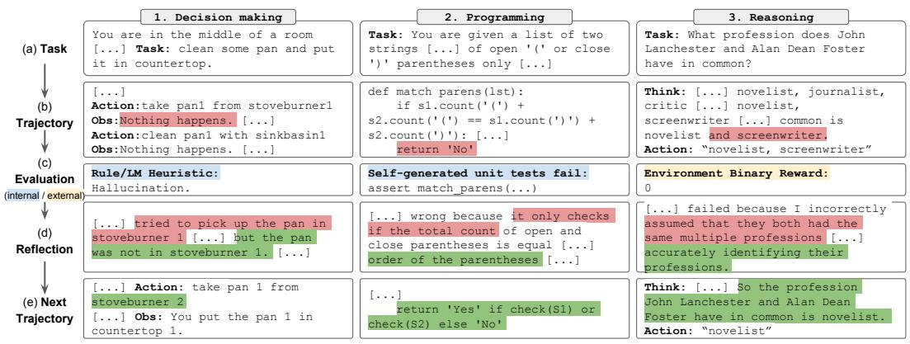
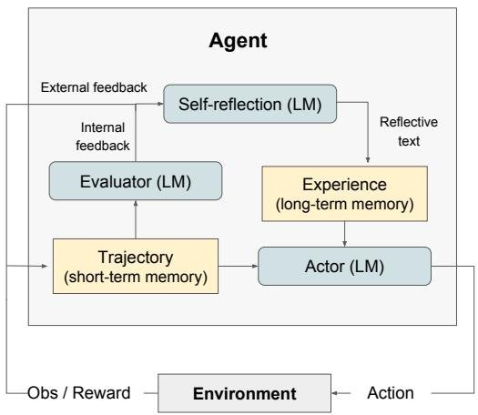
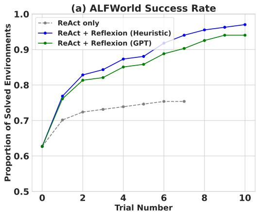
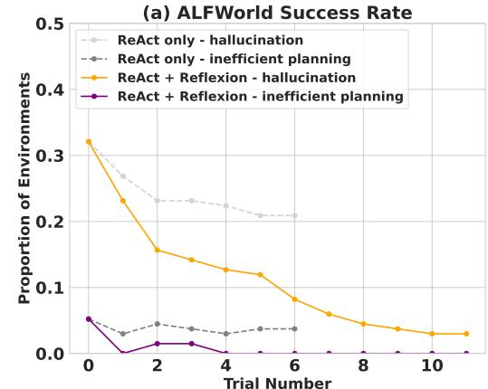
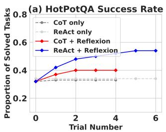
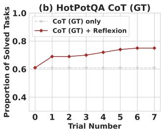
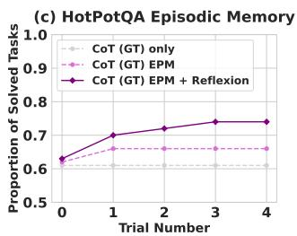

# Reflexion: Language Agents with Verbal Reinforcement Learning

Noah Shinn

Northeastern University noahshinn024@gmail.com

Federico Cassano

Northeastern University cassano.f@northeastern.edu

Edward Berman

Northeastern University berman.ed@northeastern.edu

Ashwin Gopinath

Massachusetts Institute of Technology agopi@mit.edu

Karthik Narasimhan

Princeton University karthikn@princeton.edu

Shunyu Yao  
Princeton University  
shunyuy@princeton.edu

# Abstract

Large language models (LLMs) have been increasingly used to interact with external environments (e.g., games, compilers, APIs) as goal-driven agents. However, it remains challenging for these language agents to quickly and efficiently learn from trial-and-error as traditional reinforcement learning methods require extensive training samples and expensive model fine-tuning. We propose Reflexion, a novel framework to reinforce language agents not by updating weights, but instead through linguistic feedback. Concretely, Reflexion agents verbally reflect on task feedback signals, then maintain their own reflective text in an episodic memory buffer to induce better decision-making in subsequent trials. Reflexion is flexible enough to incorporate various types (scalar values or free-form language) and sources (external or internally simulated) of feedback signals, and obtains significant improvements over a baseline agent across diverse tasks (sequential decision-making, coding, language reasoning). For example, Reflexion achieves a $91\%$ pass@1 accuracy on the HumanEval coding benchmark, surpassing the previous state-of-the-art GPT-4 that achieves $80\%$ . We also conduct ablation and analysis studies using different feedback signals, feedback incorporation methods, and agent types, and provide insights into how they affect performance. We release all code, demos, and datasets at https://github.com/noahshinn024/reflexion.

# 1 Introduction

Recent works such as ReAct [30], SayCan [1], Toolformer [22], HuggingGPT [23], generative agents [19], and WebGPT [17] have demonstrated the feasibility of autonomous decision-making agents that are built on top of a large language model (LLM) core. These methods use LLMs to generate text and 'actions' that can be used in API calls and executed in an environment. Since they rely on massive models with an enormous number of parameters, such approaches have been so far limited to using in-context examples as a way of teaching the agents, since more traditional optimization schemes like reinforcement learning with gradient descent require substantial amounts of compute and time.

In this paper, we propose an alternative approach called Reflexion that uses verbal reinforcement to help agents learn from prior failings. Reflexion converts binary or scalar feedback from the environment into verbal feedback in the form of a textual summary, which is then added as additional context for the LLM agent in the next episode. This self-reflective feedback acts as a 'semantic' gradient signal by providing the agent with a concrete direction to improve upon, helping it learn from prior mistakes to perform better on the task. This is akin to how humans iteratively learn to accomplish complex tasks in a few-shot manner – by reflecting on their previous failures in order to form an improved plan of attack for the next attempt. For example, in figure 1, a Reflexion agent learns to optimize its own behavior to solve decision-making, programming, and reasoning tasks through trial, error, and self-reflection.

Generating useful reflective feedback is challenging since it requires a good understanding of where the model made mistakes (i.e. the credit assignment problem [25]) as well as the ability to generate a summary containing actionable insights for improvement. We explore three ways for doing this - simple binary environment feedback, pre-defined heuristics for common failure cases, and self-evaluation such as binary classification using LLMs (decision-making) or self-written unit tests (programming). In all implementations, the evaluation signal is amplified to natural language experience summaries which can be stored in long-term memory.

Reflexion has several advantages compared to more traditional RL approaches like policy or value-based learning: 1) it is lightweight and doesn't require finetuning the LLM, 2) it allows for more nuanced forms of feedback (e.g. targeted changes in actions), compared to scalar or vector rewards that are challenging to perform accurate credit assignment with, 3) it allows for a more explicit and interpretable form of episodic memory over prior experiences, and 4) it provides more explicit hints for actions in future episodes. At the same time, it does have the disadvantages of relying on the power of the LLM's self-evaluation capabilities (or heuristics) and not having a formal guarantee for success. However, as LLM capabilities improve, we only expect this paradigm to get better over time.

We perform experiments on (1) decision-making tasks to test sequential action choices over long trajectories, (2) reasoning tasks to test knowledge-intensive, single-step generation improvement, and (3) programming tasks to teach the agent to effectively use external tools such as compilers and interpreters. Across all three types of tasks, we observe Reflexion agents are better decision-makers, reasoners, and programmers. More concretely, Reflexion agents improve on decision-making AlfWorld [24] tasks over strong baseline approaches by an absolute $22\%$ in 12 iterative learning steps, and on reasoning questions in HotPotQA [28] by $20\%$ , and Python programming tasks on HumanEval [6] by as much as $11\%$ .

To summarize, our contributions are the following:

- We propose Reflexion, a new paradigm for 'verbal' reinforcement that parameterizes a policy as an agent's memory encoding paired with a choice of LLM parameters.   
- We explore this emergent property of self-reflection in LLMs and empirically show that self-reflection is extremely useful to learn complex tasks over a handful of trials.   
- We introduce LeetcodeHardGym, a code-generation RL gym environment consisting of 40 challenging Leetcode questions ('hard-level') in 19 programming languages.   
- We show that Reflexion achieves improvements over strong baselines across several tasks, and achieves state-of-the-art results on various code generation benchmarks.

# 2 Related work

Reasoning and decision-making Self-Refine [15] employs an iterative framework for self-refinement to autonomously improve generation through self-evaluation. These self-evaluation and self-improvement steps are conditioned on given task constraints, such as "How can this generation be written in a more positive way". Self-Refine is effective but is limited to single-generation reasoning tasks. Pryzant et al. [21] performs a similar semantic prompt-writing optimization, but is also limited to single-generation tasks. Paul et al. [20] fine-tune critic models to provide intermediate feedback within trajectories to improve reasoning responses. Xie et al. [27] use stochastic beam search over actions to perform a more efficient decision-making search strategy which allows the agent to use foresight advantage due to its self-evaluation component. Yoran et al. [31] and Nair et al.

  
Figure 1: Reflexion works on decision-making 4.1, programming 4.3, and reasoning 4.2 tasks.

<table><tr><td colspan="6">Related work on reasoning and decision-making</td></tr><tr><td>Approach</td><td>Self 
refine</td><td>Hidden 
constraints</td><td>Decision 
making</td><td>Binary 
reward</td><td>Memory</td></tr><tr><td>Self-refine [15]</td><td>✓</td><td>X</td><td>X</td><td>X</td><td>X</td></tr><tr><td>Beam search [27]</td><td>✓</td><td>✓</td><td>✓</td><td>✓</td><td>X</td></tr><tr><td>Reflexion (ours)</td><td>✓</td><td>✓</td><td>✓</td><td>✓</td><td>✓</td></tr></table>

<table><tr><td colspan="6">Related work on programming</td></tr><tr><td>Approach Test execution</td><td>Test execution</td><td>Debugging</td><td>Self-generated tests</td><td>Multiple languages</td><td>Self-reflection</td></tr><tr><td>AlphaCode [14]</td><td>✓</td><td>X</td><td>X</td><td>✓</td><td>X</td></tr><tr><td>CodeT [5]</td><td>✓</td><td>X</td><td>✓</td><td>X</td><td>X</td></tr><tr><td>Self-debugging [7]</td><td>✓</td><td>✓</td><td>X</td><td>X</td><td>X</td></tr><tr><td>CodeRL [12]</td><td>✓</td><td>✓</td><td>X</td><td>X</td><td>X</td></tr><tr><td>Reflexion (ours)</td><td>✓</td><td>✓</td><td>✓</td><td>✓</td><td>✓</td></tr></table>

[16] use decider models to reason over several generations. Kim et al. [10] use a retry pattern over a fixed number of steps without an evaluation step. Goodman [9] perform a qualitative evaluation step that proposes optimizations to the previous generation. In this paper, we show that several of these concepts can be enhanced with self-reflection to build a persisting memory of self-reflective experiences which allows an agent to identify its own errors and self-suggest lessons to learn from its mistakes over time.

Programming Several past and recent works employ variations of test-driven development or code debugging practices. AlphaCode [14] evaluates a set of generations on hidden test cases. CodeT [5] uses self-generated unit tests that are used to score generated function implementations. Self-Debugging [7] employs a debugging component that is used to improve existing implementations given feedback from a code execution environment. CodeRL [12] sets the problem in an RL framework using an actor-critic setup to debug programs given feedback from an execution environment. AlphaCode, Self-Debugging and CodeRL are effective in fixing less-complex program bugs, but they rely upon ground truth test cases that invalidate pass@1 eligibility, and do not use self-reflection to bridge the gap between error identification and implementation improvement. CodeT does not access hidden test cases but does not implement a self-learning step to improve code writing.

# 3 Reflexion: reinforcement via verbal reflection

We develop a modular formulation for Reflexion, utilizing three distinct models: an Actor, denoted as $M_{a}$ , which generates text and actions; an Evaluator model, represented by $M_{e}$ , that scores the outputs produced by $M_{a}$ ; and a Self-Reflection model, denoted as $M_{sr}$ , which generates verbal reinforcement cues to assist the Actor in self-improvement. We provide a detailed description of each of these models and subsequently elucidate their collaborative functioning within the Reflexion framework.

  
Figure 2: (a) Diagram of Reflexion. (b) Reflexion reinforcement algorithm

# Algorithm 1 Reinforcement via self-reflection

Initialize Actor, Evaluator, Self-Reflection: $M_{a}, M_{e}, M_{sr}$

Initialize policy $\pi_{\theta}(a_i|s_i)$ , $\theta = \{M_a, mem\}$

Generate initial trajectory using $\pi_{\theta}$

Evaluate $\tau_0$ using $M_e$

Generate initial self-reflection $sr_0$ using $M_{sr}$

Set $mem \gets [sr_0]$

Set $t = 0$

while $M_{e}$ not pass or $t <   \max$ trials do

Generate $\tau_{t} = [a_{0},o_{0},\dots a_{i},o_{i}]$ using $\pi_{\theta}$

Evaluate $\tau_{t}$ using $M_e$

Generate self-reflection $sr_{t}$ using $M_{sr}$

Append $sr_t$ to mem

Increment $t$

end while

return

Actor The Actor is built upon a large language model (LLM) that is specifically prompted to generate the necessary text and actions conditioned on the state observations. Analogous to traditional policy-based RL setups, we sample an action or generation, $a_{t}$ , from the current policy $\pi_{\theta}$ at time $t$ , receive an observation from the environment $o_{t}$ . We explore various Actor models, including Chain of Thought [26] and ReAct [30]. These diverse generation models allow us to explore different aspects of text and action generation within the Reflexion framework, providing valuable insights into their performance and effectiveness. In addition, we also add a memory component mem that provides additional context to this agent. This adaption was inspired by Brooks et al. [3], who suggest a policy iteration approach using in-context learning. Details on how this is populated are provided below.

**Evaluator** The Evaluator component of the Reflexion framework plays a crucial role in assessing the quality of the generated outputs produced by the Actor. It takes as input a generated trajectory and computes a reward score that reflects its performance within the given task context. Defining effective value and reward functions that apply to semantic spaces is difficult, so we investigate several variants of the Evaluator model. For reasoning tasks, we explore reward functions based on exact match (EM) grading, ensuring that the generated output aligns closely with the expected solution. In decision-making tasks, we employ pre-defined heuristic functions that are tailored to specific evaluation criteria. Additionally, we experiment with using a different instantiation of an LLM itself as an Evaluator, generating rewards for decision-making and programming tasks. This multi-faceted approach to Evaluator design allows us to examine different strategies for scoring generated outputs, offering insights into their effectiveness and suitability across a range of tasks.

Self-reflection The Self-Reflection model instantiated as an LLM, plays a crucial role in the Reflexion framework by generating verbal self-reflections to provide valuable feedback for future trials. Given a sparse reward signal, such as a binary success status (success/fail), the current trajectory, and its persistent memory mem, the self-reflection model generates nuanced and specific feedback. This feedback, which is more informative than scalar rewards, is then stored in the agent's memory (mem). For instance, in a multi-step decision-making task, when the agent receives a failure signal, it can infer that a specific action $a_{i}$ led to subsequent incorrect actions $a_{i+1}$ and $a_{i+2}$ . The agent can then verbally state that it should have taken a different action, $a_{i}'$ , which would have resulted in $a_{i+1}'$ and $a_{i+2}'$ , and store this experience in its memory. In subsequent trials, the agent can leverage its past experiences to adapt its decision-making approach at time $t$ by choosing action $a_{i}'$ . This iterative process of trial, error, self-reflection, and persisting memory enables the agent to rapidly improve its decision-making ability in various environments by utilizing informative feedback signals.

Memory Core components of the Reflexion process are the notion of short-term and long-term memory. At inference time, the Actor conditions its decisions on short and long-term memory, similar

to the way that humans remember fine-grain recent details while also recalling distilled important experiences from long-term memory. In the RL setup, the trajectory history serves as the short-term memory while outputs from the Self-Reflection model are stored in long-term memory. These two memory components work together to provide context that is specific but also influenced by lessons learned over several trials, which is a key advantage of Reflexion agents over other LLM action choice works.

The Reflexion process Reflection is formalized as an iterative optimization process in 1. In the first trial, the Actor produces a trajectory $\tau_0$ by interacting with the environment. The Evaluator then produces a score $r_0$ which is computed as $r_t = M_e(\tau_0)$ . $r_t$ is only a scalar reward for trial $t$ that improves as task-specific performance increases. After the first trial, to amplify $r_0$ to a feedback form that can be used for improvement by an LLM, the Self-Reflection model analyzes the set of $\{\tau_0, r_0\}$ to produce a summary $sr_0$ which is stored in the memory mem. $sr_t$ is a verbal experience feedback for trial $t$ . The Actor, Evaluator, and Self-Reflection models work together through trials in a loop until the Evaluator deems $\tau_t$ to be correct. As mentioned in 3, the memory component of Reflexion is crucial to its effectiveness. After each trial $t$ , $sr_t$ , is appended mem. In practice, we bound mem by a maximum number of stored experiences, $\Omega$ (usually set to 1-3) to adhere to max context LLM limitations.

# 4 Experiments

We evaluate various natural language RL setups on decision-making, reasoning, and code generation tasks. Specifically, we challenge an agent to perform search-based question answering on HotPotQA [28], multi-step tasks in common household environments in AlfWorld [24], and code writing tasks in competition-like environments with interpreters and compilers in HumanEval [6], MBPP [2], and LeetcodeHard, a new benchmark. Most notably, Reflexion improves performance over strong baselines by $22\%$ in AlfWorld, $20\%$ in HotPotQA, and $11\%$ on HumanEval.

# 4.1 Sequential decision making: ALFWorld

AlfWorld is a suite of text-based environments that challenge an agent to solve multi-step tasks in a variety of interactive environments based on TextWorld [8]. Following Yao et al. [30], we run the agent in 134 AlfWorld environments across six different tasks, including finding hidden objects (e.g., finding a spatula in a drawer), moving objects (e.g., moving a knife to the cutting board), and manipulating objects with other objects (e.g., chilling a tomato in the fridge). We use ReAct [30] as the action generator as Yao et al. [30] has shown success in long trajectory decision-making using explicit intermediate thoughts. AlfWorld tasks naturally require a self-evaluation step as the environment can only signal if a task is complete. To achieve fully autonomous behavior, we implement two self-evaluation techniques: natural language classification using an LLM and a hand-written heuristic. The heuristic is simple: if the agent executes the same action and receives the same response for more than 3 cycles, or if the number of actions taken in the current environment exceeds 30 (inefficient planning), we self-reflect. In the baseline runs, if self-reflection is suggested, we skip the self-reflection process, reset the environment, and start a new trial. In the Reflexion runs, the agent uses self-reflection to find its mistake, update its memory, reset the environment, and start a new trial. To avoid very long prompt windows that may exceed the maximum limit, we truncate the agent's memory to the last 3 self-reflections (experiences).

To avoid syntactic errors, we provide two domain-specific few-shot trajectories to the agent. We use the same few-shot trajectory examples as Yao et al. [30] with GPT-3 for the LLM. AlfWorld tasks, ReAct few-shot prompts, and Reflexion examples are included in the appendix.

Results ReAct + Reflexion significantly outperforms ReAct by completing 130 out of 134 tasks using the simple heuristic to detect hallucinations and inefficient planning. Further, ReAct + Reflexion learns to solve additional tasks by learning in 12 consecutive trials. In the ReAct-only approach, we see that performance increase halts between trials 6 and 7.

Analysis A common error in baseline failed AlfWorld trajectories is when an agent thinks that it has possession of an item but does not actually have the item. The agent proceeds to execute several actions in a long trajectory and is not able to backtrack its actions to find the mistake. Reflexion

  
Figure 3: (a) AlfWorld performance across 134 tasks showing cumulative proportions of solved tasks using self-evaluation techniques of (Heuristic) and (GPT) for binary classification. (b) Classification of AlfWorld trajectories by reason of failure.

eliminates almost all of these cases by using self-reflection to distill long, failed trajectories into relevant experiences that can be used as "self-hints" in the future. There are two main cases in which long-term memory helps an agent in AlfWorld: 1) An early mistake in a long trajectory can be easily identified. The agent can suggest a new action choice or even a new long-term plan. 2) There are too many surfaces/containers to check for an item. The agent can exploit its experience memory over several trials to thoroughly search a room. In 3, the learning curve suggests that the learning process occurs over several experiences, meaning that the agent is successfully balancing cases 1 and 2 shown in the immediate spike in the improvement between the first two trials, then a steady increase over the next 11 trials to a near-perfect performance. On the other hand, 3 shows a ReAct-only agent converging at a hallucination rate of $22\%$ with no signs of long-term recovery.

# 4.2 Reasoning: HotpotQA

HotPotQA [28] is a Wikipedia-based dataset with 113k question-and-answer pairs that challenge agents to parse content and reason over several supporting documents. To test improvement in reasoning only ability, we implement Reflexion + Chain-of-Thought (CoT) [26] for step-by-step $Q \to A$ and $Q$ , $C_{gt} \to A$ implementations, where $Q$ is the question, $C_{gt}$ is the ground truth context from the dataset, and $A$ is the final answer. Since CoT is not a multi-step decision-making technique, we give $C_{gt}$ to the agent so that we can isolate the reasoning behavior over large sections of the provided text. To test holistic question and answering ability, which requires reasoning and action choice, we implement a Reflexion + ReAct [30] agent that can retrieve relevant context using a Wikipedia API and infer answers using step-by-step explicit thinking. For CoT implementations, we use 6-shot prompting; for ReAct, we use 2-shot prompting, and for self-reflection, we use 2-shot prompting. All examples can be found in the appendix.

Robustly evaluating natural language answers is a long-standing problem in NLP. Therefore, between trials, we use exact match answer grading using the environment to give a binary success signal to the agent. After each trial, the self-reflection loop is employed to amplify the binary signal, similar to the decision-making setup 4.1 in AlfWorld with a memory size of 3 experiences.

Results Reflection outperforms all baseline approaches by significant margins over several learning steps. Furthermore, ReAct-only, CoT-only, and CoT (GT)-only implementations fail to probabilistically improve on any tasks, meaning that no failed tasks from the first trial from any of the baseline approaches were able to be solved in subsequent trials using a temperature of 0.7 In the Reflexion runs, we allowed the agent to gather experience and retry on failed tasks until it produced 3 consecutive failed attempts on the particular task. Naturally, the CoT (GT) achieved higher accuracy scores as it was given access to the ground truth context of the question. Still, the CoT (GT) agent is unable to correctly infer the correct answer for $39\%$ of the questions, but Reflexion helps the agent to correct its mistakes without access to the ground truth answer to improve its accuracy by $14\%$ .

  
Figure 4: Chain-of-Thought (CoT) and ReAct. Reflexion improves search, information retrieval, and reasoning capabilities on 100 HotPotQA questions. (a) Reflexion ReAct vs Reflexion CoT (b) Reflexion CoT (GT) for reasoning only (c) Reflexion vs episodic memory ablation.

Analysis We perform an ablation experiment to isolate the advantage of the self-reflective step for reasoning using CoT (GT) as the baseline approach 4. Recall that CoT (GT) uses Chain-of-Thought reasoning with provided ground truth context, which tests reasoning ability over long contexts. Next, we add an element of episodic memory (EPM) by including the most recent trajectory. For the Reflexion agent, we implement the standard self-reflection step as a final pass. Intuitively, we test if the agent is iteratively learning more effectively by using verbal explanation using language written in the first person. 4 shows that self-reflection improves learning by an $8\%$ absolute boost over the episodic memory learning advantage. This result supports the argument that refinement-only approaches are not as effective as self-reflection-guided refinement approaches.

# 4.3 Programming

We evaluate the baseline and Reflexion approaches on Python and Rust code writing on MBPP [2], HumanEval [6], and LeetCodeHardGym, our new dataset. MBPP and HumanEval measure function body generation accuracy given natural language descriptions. We use a benchmark language compiler, MultiPL-E [4], to translate subsets of HumanEval and MBPP to the Rust language. MultiPL-E is a collection of small compilers that can be used to translate Python benchmark questions to 18 other languages. We include experiments for Rust code generation to demonstrate that Reflexion implementations for code generation are language-agnostic and can be used for interpreted and compiled languages. Lastly, we introduce a new benchmark, LeetCodeHardGym, which is an interactive programming gym that contains 40 LeetCode hard-rated questions that have been released after October 8, 2022, which is the pre-training cutoff date of GPT-4 [18].

The task of programming presents a unique opportunity to use more grounded self-evaluation practices such as self-generated unit test suites. Thus, our Reflexion-based programming task implementation is eligible for pass@1 accuracy reporting. To generate a test suite, we use Chain-of-Thought prompting [26] to produce diverse, extensive tests with corresponding natural language descriptions. Then, we filter for syntactically valid test statements by attempting to construct a valid abstract syntax tree (AST) for each proposed test. Finally, we sample $n$ tests from the collection of generated unit tests to produce a test suite $T$ , denoted as $\{t_0, t_1, \ldots, t_n\}$ . We set $n$ to a maximum of 6 unit tests. Aside from the unit test suite component, the setup for the learning loop for a Reflexion programming agent is identical to the reasoning and decision-making agents with a max memory limit of 1 experience.

<table><tr><td>Benchmark + Language</td><td>Prev SOTA Pass@1</td><td>SOTA Pass@1</td><td>Reflexion Pass@1</td></tr><tr><td>HumanEval (PY)</td><td>65.8 (CodeT [5] + GPT-3.5)</td><td>80.1 (GPT-4)</td><td>91.0</td></tr><tr><td>HumanEval (RS)</td><td>-</td><td>60.0 (GPT-4)</td><td>68.0</td></tr><tr><td>MBPP (PY)</td><td>67.7 (CodeT [5] + Codex [6])</td><td>80.1 (GPT-4)</td><td>77.1</td></tr><tr><td>MBPP (RS)</td><td>-</td><td>70.9 (GPT-4)</td><td>75.4</td></tr><tr><td>Leetcode Hard (PY)</td><td>-</td><td>7.5 (GPT-4)</td><td>15.0</td></tr></table>

Table 1: Pass@1 accuracy for various model-strategy-language combinations. The base strategy is a single code generation sample. All instruction-based models follow zero-shot code generation.

<table><tr><td>Benchmark + Language</td><td>Base</td><td>Reflexion</td><td>TP</td><td>FN</td><td>FP</td><td>TN</td></tr><tr><td>HumanEval (PY)</td><td>0.80</td><td>0.91</td><td>0.99</td><td>0.40</td><td>0.01</td><td>0.60</td></tr><tr><td>MBPP (PY)</td><td>0.80</td><td>0.77</td><td>0.84</td><td>0.59</td><td>0.16</td><td>0.41</td></tr><tr><td>HumanEval (RS)</td><td>0.60</td><td>0.68</td><td>0.87</td><td>0.37</td><td>0.13</td><td>0.63</td></tr><tr><td>MBPP (RS)</td><td>0.71</td><td>0.75</td><td>0.84</td><td>0.51</td><td>0.16</td><td>0.49</td></tr></table>

Table 2: Overall accuracy and test generation performance for HumanEval and MBPP. For Rust, HumanEval is the hardest 50 problems from HumanEval Python translated to Rust with MultiPL-E [4]. TP: unit tests pass, solution pass; FN: unit tests fail, solution pass; FP: unit tests pass, solution fail; TN: unit tests fail, solution fail.

Results Reflection outperforms all baseline accuracies and sets new state-of-the-art standards on all benchmarks for Python and Rust except for MBPP Python 1. We further investigate the inferior performance of Reflexion on MBPP Python.

Analysis We acknowledge that self-reflecting code-generation agents are bound to their ability to write diverse, comprehensive tests. Therefore, in the case in which the model generates a flaky test suite, it is possible that all tests pass on an incorrect solution and lead to a false positive label on a code completion [11]. On the other hand, if the model produces an incorrectly written test suite, it is possible for some of the tests to fail on a correct solution, leading to a self-reflection generation that is conditioned on a false negative code completion. Given the implementation of Reflexion, false negatives are preferred over false positives as the agent may be able to use self-reflection to identify the incorrect test(s) and prompt itself to keep the original code completion intact. On the other hand, if an invalid test suite returns a false positive completion (all internal test cases pass but the implementation is incorrect), the agent will prematurely report an invalid submission. In 2, various conditions are measured to analyze performance beyond $\text{pass} @ 1$ accuracy. Previously, we displayed the inferior performance of Reflexion to the baseline GPT-4 on MBPP Python. In 2, we observe a notable discrepancy between the false positive labels produced by internal test execution, P(not pass@1 generation correct | tests pass). That is, the probability that a submission will fail given that it passes all unit tests. For HumanEval and MBPP Python, the baseline pass@1 accuracies are relatively similar, $82\%$ and $80\%$ , respectively. However, the false positive test execution rate for MBPP Python is $16.3\%$ while the rate for HumanEval Python is a mere $1.4\%$ , leading to $91\%$ overall accuracy 1.

<table><tr><td>Approach</td><td>Test Generation</td><td>Self-reflection</td><td>Pass@1 (Acc)</td></tr><tr><td>Base model</td><td>False</td><td>False</td><td>0.60</td></tr><tr><td>Test generation omission</td><td>False</td><td>True</td><td>0.52</td></tr><tr><td>Self-reflection omission</td><td>True</td><td>False</td><td>0.60</td></tr><tr><td>Reflexion</td><td>True</td><td>True</td><td>0.68</td></tr></table>

Table 3: Pass@1 accuracy for various compromised approaches on the Reflexion approach using GPT-4 as the base model on HumanEval Rust - 50 hardest problems

Ablation study We test the composite approach of Reflexion for test generation and self-reflection cooperation on a subset of the 50 hardest HumanEval Rust problems. Our Rust compiler environment provides verbose error logs and helpful debugging hints, therefore serving as a good playground for compromised approaches. First, we omit internal test generation and execution steps, which test the agent to self-reflect without guidance from current implementations. 3 shows an inferior $52\%$ vs $60\%$ (baseline) accuracy, which suggests that the agent is unable to determine if the current implementation is correct without unit tests. Therefore, the agent must participate in all iterations of the run without the option to return early, performing harmful edits to the implementation.

Next, we test self-reflection contribution by omitting the natural language explanation step following failed unit test suite evaluations. Intuitively, this challenges the agent to combine the tasks of error identification and implementation improvement across all failed unit tests. Interestingly, the compromised agent does not improve performance over the baseline run. We observe that the test generation and code compilation steps are able to catch syntax and logic errors, but the implementation fixes do not reflect these indications. These empirical results suggest that several recent works that

propose blind trial and error debugging techniques without self-reflection are ineffective on harder tasks such as writing complex programs in Rust.

# 5 Limitations

At its core, Reflexion is an optimization technique that uses natural language to do policy optimization. Policy optimization is a powerful approach to improve action choice through experience, but it may still succumb to non-optimal local minima solutions. In this study, we limit long-term memory to a sliding window with maximum capacity, but we encourage future work to extend the memory component of Reflexion with more advanced structures such as vector embedding databases or traditional SQL databases. Specific to code generation, there are many practical limitations to test-driven development in specifying accurate input-output mappings such as non-deterministic generator functions, impure functions that interact with APIs, functions that vary output according to hardware specifications, or functions that invoke parallel or concurrent behavior that may be difficult to predict.

# 6 Broader impact

Large language models are increasingly used to interact with external environments (e.g. the Internet, software, robotics, etc.) and humans. Our work has the potential of reinforcing and empowering these agents toward greater automation and work efficiency, but it also amplifies the risks when these agents were put into misuse. We believe that this direction of research will need more effort in safety and ethical considerations.

On the other hand, reinforcement learning has suffered from its black-box policy and optimization setups in which interpretability and alignment have been challenging. Our proposed "verbal" reinforcement learning might address some of the issues and turn autonomous agents more interpretable and diagnosable. For example, in the case of tool-usage that may be too hard for humans to understand, self-reflections could be monitored to ensure proper intent before using the tool.

# 7 Conclusion

In this work, we present Reflexion, an approach that leverages verbal reinforcement to teach agents to learn from past mistakes. We empirically show that Reflexion agents significantly outperform currently widely-used decision-making approaches by utilizing self-reflection. In future work, Reflexion could be used to employ more advanced techniques that have been thoroughly studied in traditional RL settings, such as value learning in natural language or off-policy exploration techniques.

# 8 Reproducibility

We highly advise others to use isolated execution environments when running autonomous code writing experiments as the generated code is not validated before execution.

