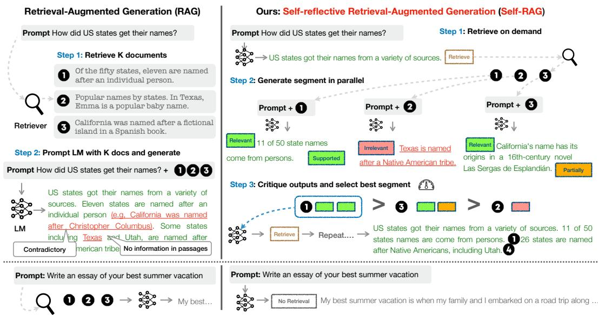
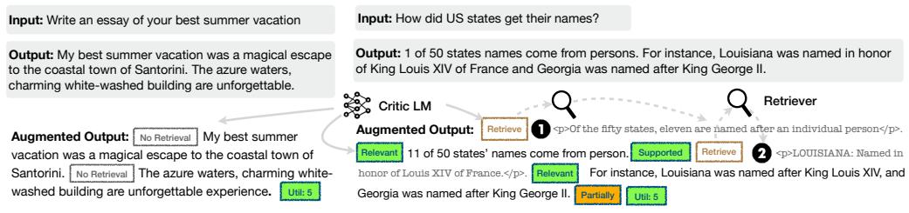
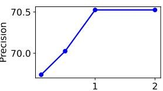
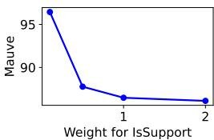
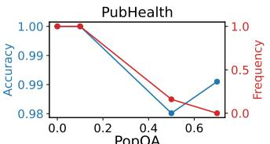
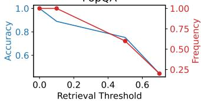
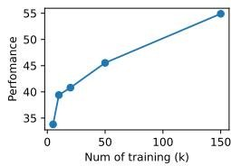
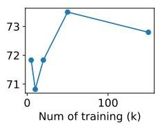
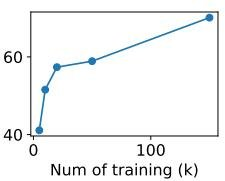
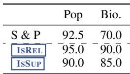

# SELF-RAG: LEARNING TO RETRIEVE, GENERATE, AND CRITIQUE THROUGH SELF-REFLECTION

Akari Asai†, Zeqiu Wu†, Yizhong Wang†§, Avirup $\mathbf { S i l } ^ { \ddagger }$ , Hannaneh Hajishirzi†§

†University of Washington §Allen Institute for AI ‡IBM Research AI

{akari,zeqiuwu,yizhongw,hannaneh}@cs.washington.edu, avi@us.ibm.com

# ABSTRACT

Despite their remarkable capabilities, large language models (LLMs) often produce responses containing factual inaccuracies due to their sole reliance on the parametric knowledge they encapsulate. Retrieval-Augmented Generation (RAG), an ad hoc approach that augments LMs with retrieval of relevant knowledge, decreases such issues. However, indiscriminately retrieving and incorporating a fixed number of retrieved passages, regardless of whether retrieval is necessary, or passages are relevant, diminishes LM versatility or can lead to unhelpful response generation. We introduce a new framework called Self-Reflective Retrieval-Augmented Generation (SELF-RAG) that enhances an LM’s quality and factuality through retrieval and self-reflection. Our framework trains a single arbitrary LM that adaptively retrieves passages on-demand, and generates and reflects on retrieved passages and its own generations using special tokens, called reflection tokens. Generating reflection tokens makes the LM controllable during the inference phase, enabling it to tailor its behavior to diverse task requirements. Experiments show that SELF-RAG (7B and 13B parameters) significantly outperforms state-of-the-art LLMs and retrieval-augmented models on a diverse set of tasks. Specifically, SELF-RAG outperforms ChatGPT and retrieval-augmented Llama2-chat on Open-domain QA, reasoning and fact verification tasks, and it shows significant gains in improving factuality and citation accuracy for long-form generations relative to these models.1

# 1 INTRODUCTION

State-of-the-art LLMs continue to struggle with factual errors (Mallen et al., 2023; Min et al., 2023) despite their increased model and data scale (Ouyang et al., 2022). Retrieval-Augmented Generation (RAG) methods (Figure 1 left; Lewis et al. 2020; Guu et al. 2020) augment the input of LLMs with relevant retrieved passages, reducing factual errors in knowledge-intensive tasks (Ram et al., 2023; Asai et al., 2023a). However, these methods may hinder the versatility of LLMs or introduce unnecessary or off-topic passages that lead to low-quality generations (Shi et al., 2023) since they retrieve passages indiscriminately regardless of whether the factual grounding is helpful. Moreover, the output is not guaranteed to be consistent with retrieved relevant passages (Gao et al., 2023) since the models are not explicitly trained to leverage and follow facts from provided passages. This work introduces Self-Reflective Retrieval-augmented Generation (SELF-RAG) to improve an LLM’s generation quality, including its factual accuracy without hurting its versatility, via on-demand retrieval and self-reflection. We train an arbitrary LM in an end-to-end manner to learn to reflect on its own generation process given a task input by generating both task output and intermittent special tokens (i.e., reflection tokens). Reflection tokens are categorized into retrieval and critique tokens to indicate the need for retrieval and its generation quality respectively (Figure 1 right). In particular, given an input prompt and preceding generations, SELF-RAG first determines if augmenting the continued generation with retrieved passages would be helpful. If so, it outputs a retrieval token that calls a retriever model on demand (Step 1). Subsequently, SELF-RAG concurrently processes multiple retrieved passages, evaluating their relevance and then generating corresponding task outputs (Step 2). It then generates critique tokens to criticize its own output and choose best one (Step 3) in terms of factuality and overall quality. This process differs from conventional RAG (Figure 1 left), which

  
Figure 1: Overview of SELF-RAG. SELF-RAG learns to retrieve, critique, and generate text passages to enhance overall generation quality, factuality, and verifiability.

consistently retrieves a fixed number of documents for generation regardless of the retrieval necessity (e.g., the bottom figure example does not require factual knowledge) and never second visits the generation quality. Moreover, SELF-RAG provides citations for each segment with its self-assessment of whether the output is supported by the passage, leading to easier fact verification.

SELF-RAG trains an arbitrary LM to generate text with reflection tokens by unifying them as the next token prediction from the expanded model vocabulary. We train our generator LM on a diverse collection of text interleaved with reflection tokens and retrieved passages. Reflection tokens, inspired by reward models used in reinforcement learning (Ziegler et al., 2019; Ouyang et al., 2022), are inserted offline into the original corpus by a trained critic model. This eliminates the need to host a critic model during training, reducing overhead. The critic model, in part, is supervised on a dataset of input, output, and corresponding reflection tokens collected by prompting a propriety LM (i.e., GPT-4; OpenAI 2023). While we draw inspiration from studies that use control tokens to start and guide text generation (Lu et al., 2022; Keskar et al., 2019), our trained LM uses critique tokens to assess its own predictions after each generated segment as an integral part of the generation output.

SELF-RAG further enables a customizable decoding algorithm to satisfy hard or soft constraints, which are defined by reflection token predictions. In particular, our inference-time algorithm enables us to (1) flexibly adjust retrieval frequency for different downstream applications and (2) customize models’ behaviors to user preferences by leveraging reflection tokens through segment-level beam search using the weighted linear sum of the reflection token probabilities as segment score.

Empirical results on six tasks, including reasoning and long-form generation, demonstrate that SELF-RAG significantly outperforms pre-trained and instruction-tuned LLMs that have more parameters and widely adopted RAG approaches with higher citation accuracy. In particular, SELF-RAG outperforms retrieval-augmented ChatGPT on four tasks, Llama2-chat (Touvron et al., 2023) and Alpaca (Dubois et al., 2023) on all tasks. Our analysis demonstrates the effectiveness of training and inference with reflection tokens for overall performance improvements as well as test-time model customizations (e.g., balancing the trade-off between citation previsions and completeness).

# 2 RELATED WORK

Retrieval-Augmented Generation. Retrieval-Augmented Generation (RAG) augments the input space of LMs with retrieved text passages (Guu et al., 2020; Lewis et al., 2020), leading to large improvements in knowledge-intensive tasks after fine-tuning or used with off-the-shelf LMs (Ram et al., 2023). A more recent work (Luo et al., 2023) instruction-tunes an LM with a fixed number

of retrieved passages prepended to input, or pre-train a retriever and LM jointly, followed by fewshot fine-tuning on task datasets (Izacard et al., 2022b). While prior work often retrieves only once at the beginning, Jiang et al. (2023) propose to adaptively retrieve passages for generation on top of a proprietary LLM or Schick et al. (2023) train an LM to generate API calls for named entities. Yet, the improved task performance of such approaches often comes at the expense of runtime efficiency (Mallen et al., 2023), robustness to irrelevant context (Shi et al., 2023), and lack of attributions (Liu et al., 2023a; Gao et al., 2023). We introduce a method to train an arbitrary LM to learn to use retrieval on-demand for diverse instruction-following queries and introduce controlled generation guided by reflections tokens to further improve generation quality and attributions.

Concurrent RAG work. A few concurrent works2 on RAG propose new training or prompting strategies to improve widely-adopted RAG approaches. Lin et al. (2023) fine-tune both the retriever and LM on instruction-tuning datasets in two steps. While we also train our model on diverse instruction-following datasets, SELF-RAG enables retrieval on demand and selection of the best possible model output via fine-grained self-reflection, making it widely applicable and more robust and controllable. Yoran et al. (2023) use a natural language inference model and Xu et al. (2023) use a summarization model to filter out or compress retrieved passages before using them to prompt the LM to generate the output. SELF-RAG processes passages in parallel and filters out irrelevant ones through self-reflection, without relying on external models at inference. Moreover, our self-reflection mechanism also evaluates other aspects of the model output quality including factuality. LATS (Zhou et al., 2023) prompt off-the-shelf LMs to search for relevant information for question answering tasks and to generate with tree search, guided by LM-generated value scores. While their value function simply indicates an overall score of each generation, SELF-RAG trains to an arbitrary LM to learn to generate fine-grained self-reflection and customizable inference.

Training and generating with critics. Training LLMs with reinforcement learning (e.g., Proximal Policy Optimization or PPO; Schulman et al. 2017) from human feedback (RLHF) has proven effective in aligning LLMs with human preferences (Ouyang et al., 2022). Wu et al. (2023) introduce fine-grained RLHF with multiple reward models. Though our work also studies fine-grained critique on retrieval and generation, we train our target LM on task examples augmented with reflection tokens from a critic model offline, with a far lower training cost compared to RLHF. In addition, reflection tokens in SELF-RAG enable controllable generation at inference, while RLHF focuses on human preference alignment during training. Other works use general control tokens to guide LM generation (Lu et al., 2022; Korbak et al., 2023), while SELF-RAG uses reflection tokens to decide the need for retrieval and to self-evaluate generation quality. Xie et al. (2023) propose a self-evaluationguided decoding framework, but they focus only on reasoning tasks with one evaluation dimension (reasoning path consistency) and without retrieval. Recent work on LLM refinement (Dhuliawala et al., 2023; Madaan et al., 2023; Paul et al., 2023) prompts a model to generate task output, natural language feedback and refined task output iteratively, but at the cost of inference efficiency.

# 3 SELF-RAG: LEARNING TO RETRIEVE, GENERATE AND CRITIQUE

We introduce Self-Reflective Retrieval-Augmented Generation (SELF-RAG), shown in Figure 1. SELF-RAG is a framework that enhances the quality and factuality of an LLM through retrieval and self-reflection, without sacrificing LLM’s original creativity and versatility. Our end-to-end training lets an LM $\mathcal { M }$ generate text informed by retrieved passages, if needed, and criticize the output by learning to generate special tokens. These reflection tokens (Table 1) signal the need for retrieval or confirm the output’s relevance, support, or completeness. In contrast, common RAG approaches retrieve passages indiscriminately, without ensuring complete support from cited sources.

# 3.1 PROBLEM FORMALIZATION AND OVERVIEW

Formally, given input $x$ , we train $\mathcal { M }$ to sequentially generate textual outputs $y$ consisting of multiple segments $y = [ y _ { 1 } , \dotsc , y _ { T } ]$ , where $y _ { t }$ indicates a sequence of tokens for the $t$ -th segment.3 Generated tokens in $y _ { t }$ include text from the original vocabulary as well as the reflection tokens (Table 1).

Table 1: Four types of reflection tokens used in SELF-RAG. Each type uses several tokens to represent its output values. The bottom three rows are three types of Critique tokens, and the bold text indicates the most desirable critique tokens. $x , y , d$ indicate input, output, and a relevant passage, respectively.   

<table><tr><td>Type</td><td>Input</td><td>Output</td><td>Definitions</td></tr><tr><td>Retrieve</td><td>x/x,y</td><td>{yes, no, continue}</td><td>Decides when to retrieve with R</td></tr><tr><td>ISREL</td><td>x,d</td><td>{relevant, irrelevant}</td><td>d provides useful information to solve x.</td></tr><tr><td>ISSUP</td><td>x,d,y</td><td>{fully supported, partially supported, no support}</td><td>All of the verification-worthy statement in y is supported by d.</td></tr><tr><td>ISUSE</td><td>x,y</td><td>{5, 4, 3, 2, 1}</td><td>y is a useful response to x.</td></tr></table>

Algorithm 1 SELF-RAG Inference   
Require: Generator LM $\mathcal{M}$ ,Retriever $\mathcal{R}$ Large-scale passage collections $\{d_1,\dots ,d_N\}$ 1: Input: input prompt $x$ and preceding generation $y_{< t}$ Output: next output segment $y_{t}$ 2: $\mathcal{M}$ predicts Retrieve given $(x,y_{< t})$ 3: if Retrieve $= =$ Yes then   
4: Retrieve relevant text passages D using R given $(x,y_{t - 1})$ ▷ Retrieve   
5: M predicts ISREL given $x,d$ and $y_{t}$ given $x,d,y_{< t}$ for each $d\in \mathbf{D}$ ▷ Generate   
6: M predicts ISSUP and ISUSE given $x,y_{t},d$ for each $d\in \mathbf{D}$ ▷ Critique   
7: Rank $y_{t}$ based on IsREL, ISUP, ISUSE ▷Detailed in Section 3.3   
8: else if Retrieve $= =$ No then   
9: $\mathcal{M}_{gen}$ predicts $y_{t}$ given $x$ ▷ Generate   
10: $\mathcal{M}_{gen}$ predicts ISUSE given $x,y_{t}$ ▷ Critique

Inference overview. Figure 1 and Algorithm 1 present an overview of SELF-RAG at inference. For every $x$ and preceding generation $y _ { < t }$ , the model decodes a retrieval token to evaluate the utility of retrieval. If retrieval is not required, the model predicts the next output segment, as it does in a standard LM. If retrieval is needed, the model generates: a critique token to evaluate the retrieved passage’s relevance, the next response segment, and a critique token to evaluate if the information in the response segment is supported by the passage. Finally, a new critique token evaluates the overall utility of the response.4 To generate each segment, SELF-RAG processes multiple passages in parallel and uses its own generated reflection tokens to enforce soft constraints (Section 3.3) or hard control (Algorithm 1) over the generated task output. For instance, in Figure 1 (right), the retrieved passages $d _ { 1 }$ is selected at the first time step since $d _ { 2 }$ does not provide direct evidence ( ISREL is Irrelevant) and $d _ { 3 }$ output is only partially supported while $d _ { 1 }$ are fully supported.

Training overview. SELF-RAG enables an arbitrary LM to generate text with reflection tokens by unifying them as next token predictions from the expanded model vocabulary (i.e., the original vocabulary plus reflection tokens). Specifically, we train the generator model $\mathcal { M }$ on a curated corpus with interleaving passages retrieved by a retriever $\mathcal { R }$ and reflection tokens predicted by a critic model $\mathcal { C }$ (summarized in Appendix Algorithm 2). We train $\mathcal { C }$ to generate reflection tokens for evaluating retrieved passages and the quality of a given task output (Section 3.2.1). Using the critic model, we update the training corpus by inserting reflection tokens into task outputs offline. Subsequently, we train the final generator model $( \mathcal { M } )$ using the conventional LM objective (Section 3.2.2) to enable $\mathcal { M }$ to generate reflection tokens by itself without relying on the critic at inference time.

# 3.2 SELF-RAG TRAINING

Here, we describe the supervised data collection and training of two models, the critic $\mathcal { C }$ (Section 3.2.1) and the generator $\mathcal { M }$ (Section 3.2.2).

# 3.2.1 TRAINING THE CRITIC MODEL

Data collection for critic model. Manual annotation of reflection tokens for each segment is expensive (Wu et al., 2023). A state-of-the-art LLM like GPT-4 (OpenAI, 2023) can be effectively

  
Figure 2: SELF-RAG training examples. The left example does not require retrieval while the right one requires retrieval; thus, passages are inserted. More examples are in Appendix Table 4.

used to generate such feedback (Liu et al., 2023b). However, depending on such proprietary LMs can raise API costs and diminish reproducibility (Chen et al., 2023). We create supervised data by prompting GPT-4 to generate reflection tokens and then distill their knowledge into an in-house $\mathcal { C }$ . For each group of reflection tokens, we randomly sample instances from the original training data: $\{ X ^ { s a m p l e } , Y ^ { s a m p l e } \} \sim \{ X , Y \}$ . As different reflection token groups have their own definitions and input, as shown in Table 1, we use different instruction prompts for them. Here, we use Retrieve as an example. We prompt GPT-4 with a type-specific instruction (“Given an instruction, make a judgment on whether finding some external documents from the web helps to generate a better response.”) followed by few-shot demonstrations $I$ the original task input $x$ and output $y$ to predict an appropriate reflection token as text: $p ( r | I , x , y )$ . Manual assessment reveals that GPT-4 reflection token predictions show high agreement with human evaluations. We collect 4k-20k supervised training data for each type and combine them to form training data for $\mathcal { C }$ . Appendix Section D shows the full list of instructions, and A.1 contains more details and our analysis.

Critic learning. After we collect training data $\mathcal { D } _ { { c r i t i c } }$ , we initialize $\mathcal { C }$ with a pre-trained LM and train it on $\mathcal { D } _ { { c r i t i c } }$ using a standard conditional language modeling objective, maximizing likelihood:

$$
\max  _ {\mathcal {C}} \mathbb {E} _ {((x, y), r) \sim \mathcal {D} _ {\text {c r i t i c}}} \log p _ {\mathcal {C}} (r | x, y), r \text {f o r}
$$

Though the initial model can be any pre-trained LM, we use the same one as the generator LM (i.e., Llama 2-7B; Touvron et al. 2023) for $\mathcal { C }$ initialization. The critic achieves a higher than $90 \%$ agreement with GPT-4-based predictions on most reflection token categories (Appendix Table 5).

# 3.2.2 TRAINING THE GENERATOR MODEL

Data collection for generator. Given an input-output pair $( x , y )$ , we augment the original output $y$ using the retrieval and critic models to create supervised data that precisely mimics the SELF-RAG inference-time process (Section 3.1). For each segment $y _ { t } \in y$ , we run $\mathcal { C }$ to assess whether additional passages could help to enhance generation. If retrieval is required, the retrieval special token $\boxed { \mathrm { R e t r i e v e } } = \mathrm { Y } \in \mathrm { \sf S }$ is added, and $\mathcal { R }$ retrieves the top $K$ passages, D. For each passage, $\mathcal { C }$ further evaluates whether the passage is relevant and predicts $\boxed { \mathrm { I s R E L } }$ . If a passage is relevant, $\mathcal { C }$ further evaluates whether the passage supports the model generation and predicts ISSUP . Critique tokens ISREL and ISSUP are appended after the retrieved passage or generations. At the end of the output, $y$ (or $y _ { T }$ ), $\mathcal { C }$ predicts the overall utility token $\begin{array} { r } { \boxed { \mathbf { I s U s E } } } \end{array}$ , and an augmented output with reflection tokens and the original input pair is added to $\mathcal { D } _ { g e n }$ . See the example training data in Figure 2.

Generator learning. We train the generator model $\mathcal { M }$ by training on the curated corpus augmented with reflection tokens $\mathcal { D } _ { g e n }$ using the standard next token objective:

$$
\max  _ {\mathcal {M}} \mathbb {E} _ {(x, y, r) \sim \mathcal {D} _ {g e n}} \log p _ {\mathcal {M}} (y, r | x). \tag {2}
$$

Unlike $\mathcal { C }$ training (Eq. 1), $\mathcal { M }$ learns to predict the target output as well as the reflection tokens. During training, we mask out the retrieved text chunks (surrounded by $\mathrm { \tt S p > }$ and $< / \mathrm { p } >$ in Figure 2) for loss calculation and expand the original vocabulary $\nu$ with a set of reflection tokens $\{ [ \overline { { \mathbf { C r i t i q u e } } } ] , \overline { { \mathbb { R e t r i e v e } } } ] \}$ }

Connections to prior work on learning with critique. Recent work incorporates additional critique (feedback) during training, e.g., RLHF (Ouyang et al. 2022) via PPO. While PPO relies on

separate reward models during training, we compute critique offline and directly insert them into the training corpus, where the generator LM is trained with a standard LM objective. This significantly reduces training costs compared to PPO. Our work also relates to prior work that incorporates special tokens to control generation (Keskar et al., 2019; Lu et al., 2022; Korbak et al., 2023). Our SELF-RAG learns to generate special tokens to evaluate its own prediction after each generated segment, enabling the use of a soft re-ranking mechanism or hard constraints at inference (discussed next).

# 3.3 SELF-RAG INFERENCE

Generating reflection tokens to self-evaluate its own output makes SELF-RAG controllable during the inference phase, enabling it to tailor its behavior to diverse task requirements. For tasks demanding factual accuracy (Min et al., 2023), we aim for the model to retrieve passages more frequently to ensure that the output aligns closely with the available evidence. Conversely, in more open-ended tasks, like composing a personal experience essay, the emphasis shifts towards retrieving less and prioritizing the overall creativity or utility score. In this section, we describe approaches to enforce control to meet these distinct objectives during the inference process.

Adaptive retrieval with threshold. SELF-RAG dynamically decides when to retrieve text passages by predicting Retrieve . Alternatively, our framework allows a threshold to be set. Specifically, if the probability of generating the Retrieve =Yes token normalized over all output tokens in Retrieve surpasses a designated threshold, we trigger retrieval (details in Appendix Section A.3).

Tree-decoding with critique tokens. At each segment step $t$ , when retrieval is required, based either on hard or soft conditions, $\mathcal { R }$ retrieves $K$ passages, and the generator $\mathcal { M }$ processes each passage in parallel and outputs $K$ different continuation candidates. We conduct a segment-level beam search (with the beam size $\scriptstyle = B$ ) to obtain the top- $B$ segment continuations at each timestamp $t$ , and return the best sequence at the end of generation. The score of each segment $y _ { t }$ with respect to passage $d$ is updated with a critic score $s$ that is the linear weighted sum of the normalized probability of each Critique token type. For each critique token group $G$ (e.g., ISREL ), we denote its score at timestamp $t$ as $\overline { { s _ { t } ^ { G } } }$ , and we compute a segment score as follows:

$$
f \left(y _ {t}, d, \boxed {\text {C r i t i q u e}}\right) = p \left(y _ {t} \mid x, d, y _ {<   t}\right)) + \mathcal {S} (\boxed {\text {C r i t i q u e}}), \text {w h e r e} \tag {3}
$$

$$
\mathcal {S} (\boxed {\text {C r i t i q u e}}) = \sum_ {G \in \mathcal {G}} w ^ {G} s _ {t} ^ {G} \text {f o r} \mathcal {G} = \{\boxed {\mathrm {I S R E L}}, \boxed {\mathrm {I S S U P}}, \boxed {\mathrm {I S U S E}} \}, \tag {4}
$$

where $\begin{array} { r } { s _ { t } ^ { G } = \frac { p _ { t } ( \hat { r } ) } { \sum _ { i = 1 } ^ { N ^ { G } } p _ { t } ( r _ { i } ) } } \end{array}$ stands for the generation probability of the most desirable reflection token rˆ (e.g., $\hat { r }$ $\boxed { \mathrm { I s R e L } } = \mathrm { R e 1 e v a n t } ,$ ) for the critique token type $G$ with $N ^ { G }$ distinct tokens (that represent different possible values for $G$ ). The weights $w ^ { G }$ in Eq. 4 are hyperparameters that can be adjusted at inference time to enable customized behaviors at test time. For instance, to ensure that result $y$ is mostly supported by evidence, we can set a weight term for the ISSUP score higher, while relatively lowering weights for other aspects. Alternatively, we could further enforce hard constraints during decoding using Critique . Instead of using a soft reward function in Eq. 4, we could explicitly filter out a segment continuation when the model generates an undesirable Critique token (e.g., $\boxed { \mathbf { I s s u p } } = \mathtt { N o }$ support) . Balancing the trade-off between multiple preferences has been studied in RLHF (Touvron et al., 2023; Wu et al., 2023), which often requires training to change models’ behaviors. SELF-RAG tailors an LM with no additional training.

# 4 EXPERIMENTS

# 4.1 TASKS AND DATASETS

We conduct evaluations of our SELF-RAG and diverse baselines on a range of downstream tasks, holistically evaluating outputs with metrics designed to assess overall correctness, factuality, and fluency. Throughout these experiments, we conduct zero-shot evaluations, where we provide instructions describing tasks without few-shot demonstrations (Wei et al., 2022; Sanh et al., 2022). Details of our experiments’ settings, including test-time instructions, are available in the Appendix Section B.1.

Closed-set tasks include two datasets, i.e., a fact verification dataset about public health (PubHealth; Zhang et al. 2023) and a multiple-choice reasoning dataset created from scientific exams (ARC-

Challenge; Clark et al. 2018). We use accuracy as an evaluation metric and report on the test set. We aggregate the answer probabilities of target classes for both of these datasets (Appendix Section B.2).

Short-form generations tasks include two open-domain question answering (QA) datasets, PopQA (Mallen et al., 2023) and TriviaQA-unfiltered (Joshi et al., 2017), where systems need to answer arbitrary questions about factual knowledge. For PopQA, we use the long-tail subset, consisting of 1,399 rare entity queries whose monthly Wikipedia page views are less than 100. As the TriviaQA-unfiltered (open) test set is not publicly available, we follow prior work’s validation and test split (Min et al., 2019; Guu et al., 2020), using 11,313 test queries for evaluation. We evaluate performance based on whether gold answers are included in the model generations instead of strictly requiring exact matching, following Mallen et al. (2023); Schick et al. (2023).

Long-form generation tasks include a biography generation task (Min et al., 2023) and a long-form QA task ALCE-ASQA Gao et al. (2023); Stelmakh et al. (2022). We use FactScore (Min et al., 2023) to evaluate biographies, and we use official metrics of correctness (str-em), fluency based on MAUVE (Pillutla et al., 2021), and citation precision and recall (Gao et al., 2023) for ASQA. 5

# 4.2 BASELINES

Baselines without retrievals. We evaluate strong publicly available pre-trained LLMs, Llama27B,13B (Touvron et al., 2023), instruction-tuned models, Alpaca7B,13B (Dubois et al., 2023) (our replication based on Llama2); and models trained and reinforced using private data, Chat-GPT (Ouyang et al., 2022) and Llama2-chat $\cdot 1 3 \mathrm { B }$ . For instruction-tuned LMs, we use the official system prompt or instruction format used during training if publicly available. We also compare our method to concurrent work, $\mathrm { C o V E } _ { 6 5 \mathrm { B } }$ (Dhuliawala et al., 2023), which introduces iterative prompt engineering to improve the factuality of LLM generations.

Baselines with retrievals. We evaluate models augmented with retrieval at test time or during training. The first category includes standard RAG baselines, where an LM (Llama2, Alpaca) generates output given the query prepended with the top retrieved documents using the same retriever as in our system. It also includes Llama2-FT, where Llama2 is fine-tuned on all training data we use without the reflection tokens or retrieved passages. We also report the result of retrieval-augmented baselines with LMs trained with private data: Ret-ChatGPT and Ret-Llama2-chat, which deploy the same augmentation technique above, as well as perplexity.ai, an InstructGPT-based production search system. The second category includes concurrent methods that are trained with retrieved text passages, i.e., SAIL (Luo et al., 2023) to instruction-tune an LM on the Alpaca instruction-tuning data with top retrieved documents inserted before instructions, and Toolformer (Schick et al., 2023) to pre-train an LM with API calls (e.g., Wikipedia APIs).6

# 4.3 EXPERIMENTAL SETTINGS

Training data and settings. Our training data consists of diverse instruction-following input-output pairs. In particular, we sample instances from Open-Instruct processed data (Wang et al., 2023) and knowledge-intensive datasets (Petroni et al., 2021; Stelmakh et al., 2022; Mihaylov et al., 2018). In total, we use 150k instruction-output pairs. We use Llama2 7B and 13B (Touvron et al., 2023) as our generator base LM, and we use Llama2 7B as our base critic LM. For the retriever model $\mathcal { R }$ , we use off-the-shelf Contriever-MS MARCO (Izacard et al., 2022a) by default and retrieve up to ten documents for each input. More training details are in the Appendix Section B.1.

Inference settings. As a default configuration, we assign the weight terms ISREL ISSUP ISUSE values of 1.0, 1.0 and 0.5, respectively. To encourage frequent retrieval, we set the retrieval threshold to 0.2 for most tasks and to 0 for ALCE (Gao et al., 2023) due to citation requirements. We speed up inference using vllm (Kwon et al., 2023). At each segment level, we adopt a beam width of 2. For a token-level generation, we use greedy decoding. By default, we use the top five documents from Contriever-MS MARCO (Izacard et al., 2022a); for biographies and open-domain QA, we use additional top five documents retrieved by a web search engine, following Luo et al. (2023); for ASQA, we use the author-provided top 5 documents by GTR-XXL (Ni et al., 2022) across all baselines for a fair comparison.

Table 2: Overall experiment results on six tasks. Bold numbers indicate the best performance among non-proprietary models, and gray-colored bold text indicates the best proprietary model when they outperforms all non-proprietary models. ∗ indicates concurrent or recent results reported by concurrent work. – indicates numbers that are not reported by the original papers or are not applicable. Models are sorted based on scale. FS, em, rg, mau, prec, rec denote FactScore (factuality); str-em, rouge (correctness); MAUVE (fluency); citation precision and recall, respectively.   

<table><tr><td rowspan="2">LM</td><td colspan="2">Short-form</td><td colspan="2">Closed-set</td><td colspan="6">Long-form generations (with citations)</td></tr><tr><td>PopQA(acc)</td><td>TQA(acc)</td><td>Pub(acc)</td><td>ARC(acc)</td><td>Bio(FS)</td><td>(em)</td><td>(rg)</td><td>ASQA(mau)</td><td>(pre)</td><td>(rec)</td></tr><tr><td colspan="11">LMs with proprietary data</td></tr><tr><td>\( Llama2-c_{13B} \)</td><td>20.0</td><td>59.3</td><td>49.4</td><td>38.4</td><td>55.9</td><td>22.4</td><td>29.6</td><td>28.6</td><td>-</td><td>-</td></tr><tr><td>\( Ret-Llama2-c_{13B} \)</td><td>51.8</td><td>59.8</td><td>52.1</td><td>37.9</td><td>79.9</td><td>32.8</td><td>34.8</td><td>43.8</td><td>19.8</td><td>36.1</td></tr><tr><td>ChatGPT</td><td>29.3</td><td>74.3</td><td>70.1</td><td>75.3</td><td>71.8</td><td>35.3</td><td>36.2</td><td>68.8</td><td>-</td><td>-</td></tr><tr><td>\( Ret-ChatGPT \)</td><td>50.8</td><td>65.7</td><td>54.7</td><td>75.3</td><td>-</td><td>40.7</td><td>39.9</td><td>79.7</td><td>65.1</td><td>76.6</td></tr><tr><td>Perplexity.ai</td><td>-</td><td>-</td><td>-</td><td>-</td><td>71.2</td><td>-</td><td>-</td><td>-</td><td>-</td><td>-</td></tr><tr><td colspan="11">Baselines without retrieval</td></tr><tr><td>\( Llama2_{7B} \)</td><td>14.7</td><td>30.5</td><td>34.2</td><td>21.8</td><td>44.5</td><td>7.9</td><td>15.3</td><td>19.0</td><td>-</td><td>-</td></tr><tr><td>\( Alpaca_{7B} \)</td><td>23.6</td><td>54.5</td><td>49.8</td><td>45.0</td><td>45.8</td><td>18.8</td><td>29.4</td><td>61.7</td><td>-</td><td>-</td></tr><tr><td>\( Llama2_{13B} \)</td><td>14.7</td><td>38.5</td><td>29.4</td><td>29.4</td><td>53.4</td><td>7.2</td><td>12.4</td><td>16.0</td><td>-</td><td>-</td></tr><tr><td>\( Alpaca_{13B} \)</td><td>24.4</td><td>61.3</td><td>55.5</td><td>54.9</td><td>50.2</td><td>22.9</td><td>32.0</td><td>70.6</td><td>-</td><td>-</td></tr><tr><td>\( CoVE_{65B} * \)</td><td>-</td><td>-</td><td>-</td><td>-</td><td>71.2</td><td>-</td><td>-</td><td>-</td><td>-</td><td>-</td></tr><tr><td colspan="11">Baselines with retrieval</td></tr><tr><td>\( Toolformer*_{6B} \)</td><td>-</td><td>48.8</td><td>-</td><td>-</td><td>-</td><td>-</td><td>-</td><td>-</td><td>-</td><td>-</td></tr><tr><td>\( Llama2_{7B} \)</td><td>38.2</td><td>42.5</td><td>30.0</td><td>48.0</td><td>78.0</td><td>15.2</td><td>22.1</td><td>32.0</td><td>2.9</td><td>4.0</td></tr><tr><td>\( Alpaca_{7B} \)</td><td>46.7</td><td>64.1</td><td>40.2</td><td>48.0</td><td>76.6</td><td>30.9</td><td>33.3</td><td>57.9</td><td>5.5</td><td>7.2</td></tr><tr><td>\( Llama2-FT_{7B} \)</td><td>48.7</td><td>57.3</td><td>64.3</td><td>65.8</td><td>78.2</td><td>31.0</td><td>35.8</td><td>51.2</td><td>5.0</td><td>7.5</td></tr><tr><td>\( SAIL*_{7B} \)</td><td>-</td><td>-</td><td>69.2</td><td>48.4</td><td>-</td><td>-</td><td>-</td><td>-</td><td>-</td><td>-</td></tr><tr><td>\( Llama2_{13B} \)</td><td>45.7</td><td>47.0</td><td>30.2</td><td>26.0</td><td>77.5</td><td>16.3</td><td>20.5</td><td>24.7</td><td>2.3</td><td>3.6</td></tr><tr><td>\( Alpaca_{13B} \)</td><td>46.1</td><td>66.9</td><td>51.1</td><td>57.6</td><td>77.7</td><td>34.8</td><td>36.7</td><td>56.6</td><td>2.0</td><td>3.8</td></tr><tr><td>\( Our SELF-RAG_{7B} \)</td><td>54.9</td><td>66.4</td><td>72.4</td><td>67.3</td><td>81.2</td><td>30.0</td><td>35.7</td><td>74.3</td><td>66.9</td><td>67.8</td></tr><tr><td>\( Our SELF-RAG_{13B} \)</td><td>55.8</td><td>69.3</td><td>74.5</td><td>73.1</td><td>80.2</td><td>31.7</td><td>37.0</td><td>71.6</td><td>70.3</td><td>71.3</td></tr></table>

# 5 RESULTS AND ANALYSIS

# 5.1 MAIN RESULTS

Comparison against baselines without retrieval. Table 2 (top) presents the baselines without retrieval. Our SELF-RAG (bottom two rows) demonstrates a substantial performance advantage over supervised fine-tuned LLMs in all tasks and even outperforms ChatGPT in PubHealth, PopQA, biography generations, and ASQA (Rouge and MAUVE). Our approach also significantly outperforms a concurrent method that employs sophisticated prompt engineering; specifically, on the bio generation task, our 7B and 13B models outperform the concurrent CoVE (Dhuliawala et al., 2023), which iteratively prompts Llama $2 _ { 6 5 \mathrm { B } }$ to refine output.

Comparison against baselines with retrieval. As shown in Tables 2 (bottom), our SELF-RAG also outperforms existing RAG in many tasks, obtaining the best performance among non-proprietary LM-based models on all tasks. While our method outperforms other baselines, on PopQA or Bio, powerful instruction-tuned LMs with retrieval (e.g., LLama2-chat, Alpaca) show large gains from their non-retrieval baselines. However, we found that these baselines provide limited solutions for tasks where we cannot simply copy or extract sub-strings of retrieved passages. On PubHealth and ARC-Challenge, baselines with retrieval do not improve performance notably from their noretrieval counterparts. We also observe that most baselines with retrieval struggle to improve citation accuracy. On ASQA, our model shows significantly higher citation precision and recall than all models except ChatGPT. Gao et al. (2023) found that ChatGPT consistently exhibits superior efficacy in this particular task, surpassing smaller LMs. Our SELF-RAG bridges this performance gap, even outperforming ChatGPT in citation precision, which measures whether the model-generated claim is fully supported by cited evidence. We also found that on the metrics for factual precision, SELF-RAG 7B occasionally outperforms our 13B due to the tendency of smaller SELF-RAG to often generate

(a) Ablation   

<table><tr><td></td><td>PQA(acc)</td><td>Med(acc)</td><td>AS(em)</td></tr><tr><td>SELF-RAG (50k)</td><td>45.5</td><td>73.5</td><td>32.1</td></tr><tr><td colspan="4">Training</td></tr><tr><td>No Retriever R</td><td>43.6</td><td>67.8</td><td>31.0</td></tr><tr><td>No Critic C</td><td>42.6</td><td>72.0</td><td>18.1</td></tr><tr><td colspan="4">Test</td></tr><tr><td>No retrieval</td><td>24.7</td><td>73.0</td><td>-</td></tr><tr><td>Hard constraints</td><td>28.3</td><td>72.6</td><td>-</td></tr><tr><td>Retrieve top1</td><td>41.8</td><td>73.1</td><td>28.6</td></tr><tr><td>Remove ISSUP</td><td>44.1</td><td>73.2</td><td>30.6</td></tr></table>

  
(b) Customization

  
(c) Retrieval   
Figure 3: Analysis on SELF-RAG: (a) Ablation studies for key components of SELF-RAG training and inference based on our 7B model. (b) Effects of soft weights on ASQA citation precision and Mauve (fluency). (c) Retrieval frequency and normalized accuracy on PubHealth and PopQA.

precisely grounded yet shorter outputs. Llama2- $\mathrm { \cdot F T _ { 7 B } }$ , which is the baseline LM trained on the same instruction-output pairs as SELF-RAG without retrieval or self-reflection and is retrieval-augmented at test time only, lags behind SELF-RAG. This result indicates SELF-RAG gains are not solely from training data and demonstrate the effectiveness of SELF-RAG framework.

# 5.2 ANALYSIS

Ablation studies. We conduct a set of ablations of our framework to identify which factors play key roles. We evaluate two model variants trained differently than our model: No Retriever trains an LM using the standard instruction-following method given instruction-output pairs, without retrieved passages; No Critic trains an LM trained with input-output pairs that are always augmented with the top one retrieved document without reflection tokens. This is similar to SAIL (Luo et al., 2023), and we use our instruction-output data instead of using the Alpaca dataset (Dubois et al., 2023), as in SAIL. We also conduct ablation on our inference-time algorithm, including No retrieval disables retrieval during inference; Hard constraints indicates the model performance that retrieves when Retrieve =Yes instead of using the adaptive threshold; Retrieve top 1 always retrieves and uses the top one document only, similar to standard RAG approaches; Remove ISSUP indicates the model performance that removes ISSUP score only during critique-guided beam search in Eq. 4. In this ablation experiment, we use a training instance size of 50k for a more efficient exploration of training variations. Later in this section, we conduct an analysis of the effect of training data size. We conduct the ablation studies on three datasets, PopQA, PubHealth, and ASQA. On ASQA, we evaluate models on sampled 150 instances and exclude ablations involving adaptive or no retrieval processes.

We show in Table 3a the ablation results. The top part of the table shows results for training ablations, and the bottom part is for inference ablations. We see that all components play important roles. We also observe a large performance gap between SELF-RAG and No Retriever or Critic baselines across tasks, indicating that training an LM with those models largely contributes to the performance gain of SELF-RAG. Using the top passages regardless of their relevance (Retrieve top 1) as in conventional RAG approaches causes a large drop in PopQA and ASQA, and removing ISSUP during the beam search results hurts performance on ASQA. This demonstrates the effectiveness of SELF-RAG’s capabilities of carefully selecting generations based fine-grained multiple criterion, instead of naively using all of the top passages from the retrieval model or solely depending on relevance scores.

Effects of inference-time customization. One key benefit of our proposed framework is that it enables us to control how much each critique type affects the final generation sampling. We analyze the effects of different parameter weights on the top of our 7B model during inference time on ASQA, where multiple evaluation aspects are considered. Figure 3b shows the effects of changing the weighting term for $\begin{array} { r } { \boxed { \mathrm { I s S U P } } } \end{array}$ , which criticizes how supported the output is by the text passage. As the figure shows, increasing the weight leads to positive effects on the models’ citation precision since this puts more emphasis on whether model generation is supported by the evidence. On the

  
(a) PopQA

  
(b) PubHealth

  
(c) ASQA (prec)

  
(d) Human evaluation on PopQA and Bio generation.   
Figure 4: Training scale and Human analysis: (a) (b) (c) Training scale analysis shows the effect of the training data scale on PopQA, PubHealth and ASQA (citation precision), respectively. (d) Human analysis on SELF-RAG outputs as well as reflection tokens.

contrary, a larger weight results in lower MAUVE scores: when generation gets longer and more fluent, there are often more claims that are not fully supported by citations, consistent with findings by Liu et al. (2023a). Our framework lets practitioners choose and customize models’ behaviors at test time by adjusting such parameters without requiring additional training.

Efficiency and accuracy trade-off. Using our framework, practitioners can adjust how often retrieval occurs using the token probability of reward tokens. We evaluate how this adaptive threshold affects overall accuracy and frequency of retrieval, and we evaluate the performance with varying numbers of threshold $\delta$ (larger $\delta$ results in less retrieval) on PubHealth and PopQA. Figure 3c shows that the model’s retrieval frequencies dramatically change on both datasets. as $\delta$ varies. On one hand, performance deterioration by retrieving less is smaller on PubHealth but larger in PopQA.

Effects of training data size. We conduct an analysis of how the data scale affects the model’s performance. In particular, we randomly sample 5k, 10k, 20k, and 50k instances from our original $1 5 0 \mathrm { k }$ training instances, and fine-tune four SELF-RAG $^ { 7 8 }$ variants on those subsets. Then, we compare the model performance on PopQA, PubHealth, and ASQA (citation precision) with our final SELF-RAG trained on the full 150k instances. We also evaluate Figures 4a, 4b and 4c shows the models’ performance trained on different amount of data. Across all datasets, increasing data size often shows upward trajectories and the improvements are significantly larger in PopQA and ASQA, while we do not observed such significant improvements on Llama2- $\mathrm { \cdot F T _ { 7 B } }$ when increasing the training data from $5 0 \mathrm { k }$ to $1 5 0 \mathrm { k }$ . These results also indicate that further expanding the training data of SELF-RAG may lead to further improvements, although in this work we limit our training data size to 150k.

Human evaluations. We conduct small human evaluations on SELF-RAG outputs, as well as the reliability of predicted reflection tokens. In particular, we sampled 50 samples from PopQA and Bio results. Following Menick et al. (2022), human annotators evaluate S&P, which indicates whether the model output is plausible (i.e., the output is a reasonable and on-topic response to the question as if it were occurring in a conversation) and supported (i.e., the provided evidence is sufficient to verify the validity of the answer). For S&P, we do not consider the instances where SELF-RAG predicts irrelevant or no support. We then ask our annotators whether the model-predicted reflection tokens about ISREL and ISSUP match their inspections (e.g., whether the fully supported output is supported by the cited evidence). Human annotators find SELF-RAG answers are often plausible and supported by relevant passages with higher S&P scores on short-form PopQA, which is consistent with Menick et al. (2022). Human annotators also find ISREL and ISSUP reflection token predictions are mostly aligned with their assessments. Appendix Table 6 shows several annotated examples and explanations on assessments.

# 6 CONCLUSION

This work introduces SELF-RAG, a new framework to enhance the quality and factuality of LLMs through retrieval on demand and self-reflection. SELF-RAG trains an LM to learn to retrieve, generate, and critique text passages and its own generation by predicting the next tokens from its original vocabulary as well as newly added special tokens, called reflection tokens. SELF-RAG further enables the tailoring of LM behaviors at test time by leveraging reflection tokens. Our holistic evaluations on six tasks using multiple metrics demonstrate that SELF-RAG significantly outperforms LLMs with more parameters or with conventional retrieval-augmented generation approaches.

# ETHICAL CONCERNS

This work aims to improve the factuality of LLM outputs, the lack of which continues to cause numerous real-world problems (e.g., spread of misinformation and provision of incorrect and dangerous advice). While our method shows significant improvements in terms of performance, factuality, and citation accuracy, it can still generate outputs that are not fully supported by the citations. We hope that explicit self-reflection and fine-grained attribution may help users verify factual errors in the model outputs.

# ACKNOWLEDGMENTS

We thank Sewon Min, Scott Wen-tau Yih, Sean Welleck, and Kawin Ethayarajh for fruitful discussions in the early stages of this work. We thank Sewon Min, Joongwon (Daniel) Kim, and Sandy Kaplan for valuable feedback on the paper, and Tianyu Gao and Weijia Shi for their help on evaluations. Akari Asai is supported by the IBM Fellowship. We thank Stability AI for providing computing to train and evaluate the LMs in this work, and Microsoft Accelerate Foundation Models Research Program for the access to OpenAI APIs. This work was funded in part by the DARPA MCS program through NIWC Pacific (N66001-19-2-4031), NSF IIS-2044660, and gifts from AI2.

