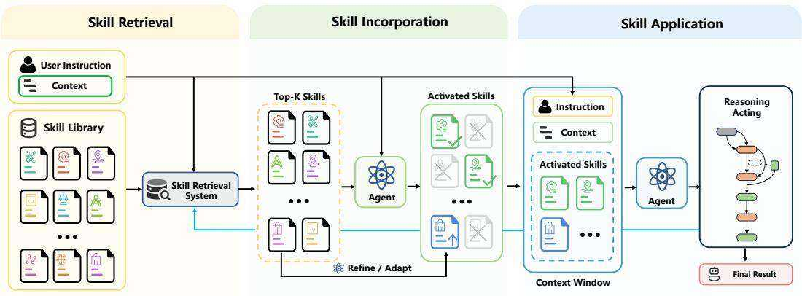
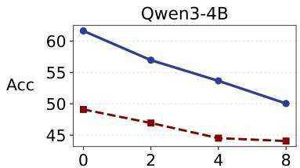
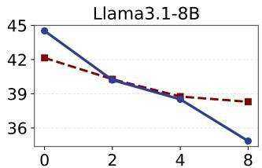
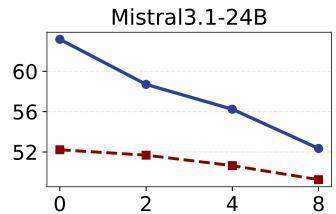
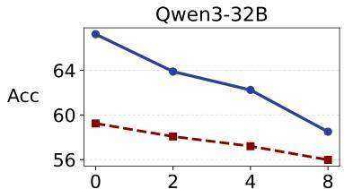
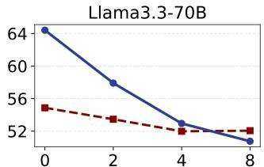
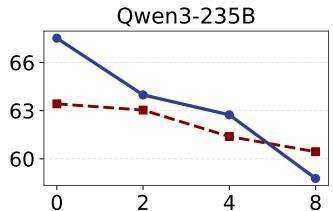

# Skill Retrieval Augmentation for Agentic AI

Weihang $\mathbf { S u } ^ { * 1 }$ , Jianming Long1, Qingyao $\mathbf { A } \mathbf { i } ^ { \dagger 1 }$ , Yichen Tang1, Changyue Wang1, Yiteng $\mathbf { T } \mathbf { u } ^ { 1 }$ , Yiqun Liu1

1Department of Computer Science and Technology, Tsinghua University

§ GitHub: https://github.com/oneal2000/SR-Agents

Hugging Face: https://huggingface.co/datasets/WeihangSu/SRA-Bench

# Abstract

As large language models (LLMs) evolve into agentic problem solvers, they increasingly rely on external, reusable skills to handle tasks beyond their native parametric capabilities. In existing agent systems, the dominant strategy for incorporating skills is to explicitly enumerate available skills within the context window. However, this strategy fails to scale: as skill corpora expand, context budgets are consumed rapidly, and the agent becomes markedly less accurate in identifying the right skill. To this end, this paper formulates Skill Retrieval Augmentation (SRA), a new paradigm in which agents dynamically retrieve, incorporate, and apply relevant skills from large external skill corpora on demand. To make this problem measurable, we construct a large-scale skill corpus and introduce SRA-Bench, the first benchmark for decomposed evaluation of the full SRA pipeline, covering skill retrieval, skill incorporation, and end-task execution. SRA-Bench contains 5,400 capability-intensive test instances and 636 manually constructed gold skills, which are mixed with web-collected distractor skills to form a large-scale corpus of 26,262 skills. Extensive experiments show that retrieval-based skill augmentation can substantially improve agent performance, validating the promise of the paradigm. At the same time, we uncover a fundamental gap in skill incorporation: current LLM agents tend to load skills at similar rates, regardless of whether a gold skill is retrieved or whether the task actually requires external capabilities. This shows that the bottleneck in skill augmentation lies not only in retrieval but also in the base model’s ability to determine which skill to load and when external loading is actually needed. These findings position SRA as a distinct research problem and establish a foundation for the scalable augmentation of capabilities in future agent systems. All the code and data are released at the following GitHub link: https://github.com/oneal2000/SR-Agents.

# 1 Introduction

Recent advancements in Large Language Models (LLMs) have catalyzed a paradigm shift toward Agentic AI, where models are evolving from passive text generators into active problem solvers capable of reasoning, planning, tool calling, and interacting with external environments [55, 58, 28, 29]. As these agents are expected to solve broader and more complex tasks, their internal parametric knowledge is no longer sufficient to support robust performance [54, 12]. Instead, tackling such diverse and open-ended tasks increasingly relies on externalized, reusable capabilities that extend an agent’s competence beyond the base model’s intrinsic capacity. In many emerging systems (e.g., OpenClaw [32]), these capabilities are packaged as skills: modular capability packages that help

an agent solve recurring classes of problems, often encompassing natural-language instructions, invocation conditions, tool-usage procedures, executable code, and auxiliary resources [15, 16].

However, the prevailing paradigm for equipping agents with such capabilities relies on a fundamentally unscalable mechanism: explicit in-context skill injection [32, 20, 2]. Current frameworks typically construct prompts that enumerate available skills, often compressing them into compact metadata or instructional summaries (e.g., the SKILL.md files used in OpenClaw [32]), and then require the LLM to evaluate numerous candidates in context to identify and load relevant skills on demand based on user instructions. While this design is intuitive and aligns naturally with existing agentic workflows, it becomes increasingly impractical in real-world deployments as the scale of skill libraries continues to grow [30]. In the past few months, the ecosystem of available skills has been expanding explosively: as of April 26, 2026, platforms such as SkillsMP [30] host more than one million distinct skills, and agents are expected to maintain large and lifelong skill libraries that continue to grow [1, 50]. Under this setting, the conventional practice of exposing all candidate skills in context begins to collapse under two compounding bottlenecks: the hard architectural limits of context windows, and the sharp degradation in reasoning and selection accuracy when the model is confronted with a massive volume of skills. Consequently, dynamically retrieving and injecting the right capability from a vast, out-of-context skill collection has emerged as a critical research problem.

To address this scalability failure, we formulate Skill Retrieval Augmentation (SRA), a new paradigm for augmenting agents with external capabilities at scale. Rather than relying on a small, fixed set of visible skills in the prompt, SRA treats skills as entries in a large external capability corpus and requires agents to retrieve, load, and apply relevant skills on demand. Under this paradigm, we propose Skill Retrieval Augmented Agents (SR-Agents), which dynamically retrieve and use relevant skills from large-scale skill corpora to expand their problem-solving capabilities. SRA is closely related to Retrieval-Augmented Generation (RAG), but it is not simply RAG with a different retrieval target. In classical knowledge-centric RAG, retrieved items are primarily declarative evidence used to ground generation. In contrast, SRA retrieves executable capabilities that augment the agent’s functional competence, rather than merely providing declarative knowledge to support generation. Accordingly, retrieval in SRA should be evaluated not only by semantic relevance, but also by downstream utility: whether the retrieved candidate set contains the skills relevant to the current task, whether those skills can be correctly incorporated into the agent’s problem-solving process, and whether their application ultimately improves end-task performance. This difference fundamentally changes the problem structure. Beyond skill retrieval itself, SRA introduces a multistage pipeline with three tightly coupled components: skill retrieval, which asks whether the system can identify relevant skills for a given user request from a large external corpus; skill incorporation, which asks whether the agent can correctly recognize, organize, and invoke the truly useful skills among retrieved candidates without being distracted or overwhelmed by irrelevant ones; and skill application, which asks whether incorporated skills are actually leveraged during task solving in ways that improve agent behavior and end-task success. Together, these components define a broader research agenda for scalable capability augmentation in agent systems. More broadly, this paradigm opens up new directions in skill indexing and organization, quality control over heterogeneous skills, and feedback-driven skill debugging, refinement, and lifelong accumulation.

To make this paradigm scientifically tractable, we build a large-scale skill corpus and introduce SRA-Bench, the first benchmark specifically designed for studying the SRA paradigm. Each instance in SRA-Bench is annotated with a user query, a ground-truth answer, and the corresponding gold skill(s), enabling fine-grained, decomposed evaluation across the full SRA pipeline. Rather than asking whether an agent ultimately succeeds, this benchmark allows us to diagnose three distinct questions: whether the system can retrieve the right skills from a large external corpus, whether the agent can correctly identify and incorporate the truly useful skills among retrieved candidates, and whether such retrieved skills can be translated into improved behavior and end-task performance. In this sense, the contribution of SRA-Bench is not merely to introduce a new benchmark, but to formulate skill retrieval augmentation as a concrete research problem that can be clearly defined, rigorously evaluated, and systematically analyzed.

Through extensive experiments on SRA-Bench, we uncover several key empirical findings about scalable skill augmentation. First, even a simple SRA pipeline that retrieves a single skill using a general-purpose retriever and injects it into the context can already improve strong LLM agents over their skill-free counterparts, establishing the practical promise of our proposed paradigm. Beyond this positive result, however, our experiments reveal that scalable skill augmentation is bottlenecked not

  
Figure 1: An illustration of the Skill Retrieval Augmentation (SRA) paradigm. The agent retrieves candidate skills from a large external skill corpus, selectively incorporates useful skills into context, and applies them for downstream reasoning and acting. Black arrows denote the standard SRA workflow, while blue arrows represent iterative skill retrieval during reasoning and acting.

only by retrieval quality, but by a previously underappreciated variable: whether the agent chooses to load external skills at all. We find that skill-loading behavior is highly model-dependent: using the same skill corpus and retriever, different models exhibit dramatically different loading rates, with no monotonic trend that larger models behave more rationally or robustly. Moreover, agents attempt to load skills at nearly identical rates regardless of whether the gold skill is actually present among the retrieved candidates, revealing a profound disconnect between successful retrieval and effective utilization. More importantly, agents are no more likely to invoke a skill on tasks that genuinely require external capability than on tasks they can already solve natively, suggesting a fundamental absence of need-aware skill invocation. Taken together, these findings show that scalable skill augmentation is not merely a retrieval problem, but a broader challenge of controlled skill exposure, need-aware incorporation, and reliable application, thereby motivating SRA as a distinct research agenda for agent systems.

To summarize, our contributions are as follows:

• We propose Skill Retrieval Augmentation (SRA), a new paradigm in which LLM-based agents retrieve and operationalize reusable external skills from large-scale skill corpora rather than relying on small, fixed skill sets directly placed in context.   
• We build a large-scale skill corpus and introduce SRA-Bench, a benchmark resource with query, answer, and gold-skill annotations that supports decomposed evaluation of skill retrieval, skill incorporation, and end-to-end task solving.   
• We establish SR-Agents as a baseline family for studying the SRA pipeline and conduct a systematic empirical analysis across models, retrievers, and task domains.   
• We provide empirical findings that clarify both the promise and the bottlenecks of scalable skill use, showing that while external skills can substantially improve agent performance, effective access to capabilities requires advances not only in retrieval but also in skill incorporation and application.

# 2 Problem Formulation

Building upon the conceptual foundation above, we now formalize the core objects and operational pipeline of Skill Retrieval Augmentation (SRA). Our formulation characterizes scalable skill augmentation as a multi-stage process that separates whether an agent can retrieve relevant skills, correctly incorporate them into its active problem-solving state, and ultimately translate them into improved task performance.

# 2.1 Agent Skills and Skill Corpus

We begin by defining the basic unit of SRA: the agent skill. Unlike ordinary retrieved documents, which primarily provide declarative evidence for grounded generation, or standalone tool APIs, which expose only isolated callable interfaces, a skill is a reusable capability package that enables an agent to solve a recurring class of problems. A standard skill typically contains a name, a short natural-language description, detailed usage instructions, invocation conditions, procedural guidance, executable code, and auxiliary resources, thereby exposing not only what capability is available, but also when and how it should be applied.

Formally, let $\mathcal { C } = \{ s _ { 1 } , s _ { 2 } , . . . , s _ { N } \}$ denote a skill corpus containing $N$ skills. Each skill $s _ { i } \in \mathcal { C }$ is represented as

$$
s _ {i} = \left(n _ {i}, r _ {i}, c _ {i}, \pi_ {i}\right), \tag {1}
$$

where $n _ { i }$ is the name of the skill, serving as its compact semantic identifier, $r _ { i }$ is a short description summarizing the capability and intended use of the skill, and $c _ { i }$ is the main content, which may include natural-language instructions, usage constraints, procedural guidance, and other languagevisible artifacts exposed to the agent. The executable payload $\pi _ { i }$ includes code, tools, or other operational resources that realize the capability in an external environment.

In practical systems, these components may correspond to artifacts such as a skill title, a one-line summary, SKILL.md, scripts, and static assets. More generally, a skill is any modular unit that couples a natural-language interface with an executable capability.

# 2.2 Skill Retrieval Augmentation

Given a user query $q$ and a large external skill corpus $\mathcal { C }$ , the objective of SRA is to augment an agent with relevant external capabilities retrieved from a large skill corpus on demand, rather than relying on a pre-exposed, fixed set of skills enumerated directly in the context. We formalize this process as a three-stage pipeline.

Skill Retrieval. A retriever $R$ first maps the user query $q$ and the skill corpus $\mathcal { C }$ to a ranked list of candidate skills:

$$
\mathcal {L} _ {k} = R (q, \mathcal {C}) = \left[ s ^ {(1)}, s ^ {(2)}, \dots , s ^ {(k)} \right], \quad s ^ {(j)} \in \mathcal {C}, k \ll N. \tag {2}
$$

The retrieved candidates are ranked by their estimated relevance to the current query, with earlier positions indicating higher relevance. The role of this stage is to reduce a massive external capability space into a manageable ranked list of candidate skills that may be useful for the current task.

Skill Incorporation. Given the retrieved candidates $\mathcal { L } _ { k }$ , the agent must then determine whether any external skill should be used for the current task, and if so, which retrieved skills should be incorporated into the active problem-solving state and in what form. We denote this stage as

$$
\widetilde {\mathcal {S}} = G (q, \mathcal {L} _ {k}; \mathcal {M}), \tag {3}
$$

where $\mathcal { M }$ is the underlying base language model and $\widetilde { s }$ denotes the skill representations that are actually prepared and made available for downstream task solving. These representations may correspond to a selected subset of retrieved skills, or to transformed variants derived from them, such as rewritten, compressed, restructured, or model-adapted forms. Accordingly, skill incorporation is broader than merely selecting a subset from the retrieved list: it concerns whether and how external capabilities are converted into a form that the agent can subsequently use. Importantly, $\widetilde { s }$ may be empty, either because the agent determines that its parametric capability is sufficient for the current task, or because none of the retrieved skills is deemed sufficiently relevant or useful to incorporate.

Skill Application. Finally, conditioned on the incorporated skills $\tilde { s }$ , the agent applies the corresponding capabilities during task solving and produces a final response:

$$
\hat {A} = F (q, \tilde {\mathcal {S}}; \mathcal {M}). \tag {4}
$$

Table 1: Overview of the six source datasets used to construct SRA-Bench. Skill Mapping indicates whether each benchmark instance is associated with one gold skill or multiple gold skills.   

<table><tr><td>Dataset</td><td>Capability Type</td><td>#Inst.</td><td>#Skills</td><td>Skill Mapping</td><td>Evaluation</td></tr><tr><td>THEOREMQA [4]</td><td>Theorem Application</td><td>747</td><td>320</td><td>Single</td><td>Rule-Based</td></tr><tr><td>LOGICBENCH [22]</td><td>Logical Reasoning Patterns</td><td>760</td><td>19</td><td>Single</td><td>Rule-Based</td></tr><tr><td>TOOLQA [60]</td><td>Tool-Use Workflows</td><td>1,430</td><td>14</td><td>Single</td><td>Rule-Based</td></tr><tr><td>MEDCALC-BENCH [13]</td><td>Medical Calculators</td><td>1,100</td><td>55</td><td>Single</td><td>Rule-Based</td></tr><tr><td>CHAMP [17]</td><td>Mathematical Concepts</td><td>223</td><td>89</td><td>Multi</td><td>Rule-Based</td></tr><tr><td>BIGCODEBENCH [61]</td><td>Software Libraries</td><td>1,140</td><td>139</td><td>Multi</td><td>Execution</td></tr></table>

Importantly, successful incorporation does not guarantee successful application: the relevant skill may be present in the agent’s active problem-solving state yet still fail to improve performance if the model cannot properly operationalize it during downstream task solving. This stage, therefore, assesses whether the incorporated skills are leveraged to improve downstream behavior, including whether the agent follows them correctly, invokes them at the right time, integrates them into its reasoning process, and adapts its behavior accordingly.

# 3 Benchmark Construction

SRA-Bench is built from three components: (1) a set of capability-intensive test instances, (2) a set of manually constructed gold skills and corresponding instance-level annotations that associate each benchmark instance with one or more relevant skills, and (3) a large external skill corpus formed by inserting these gold skills into a noisy web-collected skill collection containing realistic distractors. This design makes the SRA setting empirically tractable by transforming skill augmentation into a decomposable evaluation problem: a system must retrieve the correct capability from a large, noisy skill corpus, correctly incorporate it, and ultimately use it to improve downstream task performance. We introduce the construction process in three subsections: source dataset selection and test instance curation (§3.1), gold skill construction (§3.2), and large-scale skill corpus collection (§3.3).

# 3.1 Source Dataset Selection and Test Instance Curation

We begin the construction of SRA-Bench from the instance side: a collection of test problems that genuinely require reusable external capabilities rather than mere factual question answering (QA). To this end, we curate test instances from six existing benchmarks: THEOREMQA [4], LOG-ICBENCH [22], TOOLQA [60], MEDCALC-BENCH [13], CHAMP [17], and BIGCODEBENCH [61]. Together, these datasets cover diverse forms of capability use, including theorem-based reasoning, formal logic, tool-interleaved question answering, medical calculation, competition mathematics, and code generation. The resulting benchmark contains 5,400 test instances associated with 636 unique gold skills, as summarized in Table 1. Rather than starting from a pre-existing skill repository and searching for compatible tasks, we construct SRA-Bench in reverse: we first identify capabilityintensive problem instances and then manually annotate the reusable skill(s) associated with them using structured signals from the source datasets.

Since existing benchmarks do not directly provide reusable skill annotations, the selection of source datasets is critical. We therefore select candidate datasets according to three criteria. First, the dataset should provide structured signals that reveal shared problem-solving patterns across multiple instances, enabling human annotators to reliably infer reusable capabilities. Second, the associated capability should encode how to solve a class of problems, rather than directly revealing the answer to a particular instance. Third, the final task evaluation should remain objective and reproducible, so that downstream performance can be measured reliably. Together, these criteria ensure that the source datasets not only contain capability-intensive problems but also provide the annotation basis needed for constructing meaningful gold-skill supervision for SRA.

Under this design, each selected source instance is transformed into an SRA-Bench example consisting of a user query, a ground-truth answer, and one or more gold skills. Since reusable skill annotations are not available in existing benchmarks, we construct them manually using structured signals provided by the source datasets. For example, theorem names in THEOREMQA, logic patterns in LOGICBENCH, calculator types in MEDCALC-BENCH, and library names in BIGCODEBENCH

expose recurring capability structure across instances. These dataset-specific signals do not constitute gold skills themselves; instead, they guide annotators in abstracting instance-level problem-solving patterns into standardized reusable skills. Section 3.2 details this annotation process.

# 3.2 Gold Skill Construction

The source datasets provide structured annotations that indicate the capabilities involved in each instance, but they do not directly provide reusable skills. For example, annotations such as theorem names, logic patterns, calculator names, concept IDs, or library names identify what capability is relevant, but they do not by themselves tell an agent when to use that capability or how to apply it for downstream tasks. Our goal in this stage is therefore to transform these source-side signals into explicit gold skills: reusable skill artifacts that can be retrieved and used under the SRA setting. Concretely, we construct one gold skill for each annotation category in the source datasets. Depending on the dataset, a gold skill may correspond to a theorem, a reasoning pattern, a tool-use workflow, a medical calculator, a mathematical concept, or a software library. Although these capability types differ in form, they can all be represented in the same way: as standalone skill artifacts that describe the applicability conditions and problem-solving procedure for a recurring class of tasks. Each benchmark instance is then associated with one or more gold skills according to its source annotation(s), forming the ground-truth skill supervision used in SRA-Bench. Since the available supervision signals differ markedly across source benchmarks, we defer full dataset-specific construction details and examples to Appendix A.

We build each gold skill through a two-stage process: LLM drafting followed by expert revision. For each annotation category, we first collect the available source materials, including the source dataset definition or description, representative instances annotated with this category, and external references when needed. We then provide these materials to an LLM to generate an initial draft skill. This draft serves only as a starting point. It is then manually revised into the final gold skill, since draft skills often remain too tied to specific examples, miss important conditions or edge cases, or contain factual and procedural errors. Across datasets, this revision is guided by three shared principles. At the same time, different source benchmarks exhibit different recurring weaknesses in LLM drafts and therefore require additional dataset-specific refinements, which we detail in Appendix A. These shared principles are as follows. First, generality: the final skill should describe a reusable method rather than a benchmark-specific template or paraphrase of example instances. Second, correctness: formulas, reasoning procedures, tool usage, and executable components must be checked and revised against reliable references. Third, leakage control: the skill should not reveal benchmark answers or encode shortcuts that trivialize evaluation. To enforce this, overlapping examples are replaced with newly constructed ones, benchmark-specific constants are removed, and the final skill is written to preserve a clear application gap: even after retrieving the correct skill, the agent must still interpret the query, identify the appropriate case, extract instance-specific variables, and correctly execute the procedure.

The finalized gold skills are stored as standardized Markdown artifacts with a skill name, a short description, and procedural content that describes what the capability is, when it applies, how it should be used, and which common pitfalls to avoid. For capability types that inherently require execution, we additionally attach runnable resources such as Python implementations of medical calculators. This representation makes gold skills not merely annotation labels, but realistic skill artifacts that can be mixed into a large external corpus.

# 3.3 Skill Corpus Collection

To evaluate SRA under realistic large-scale conditions, gold skills must be retrieved from a noisy external corpus rather than presented in isolation. We therefore mix the 636 gold skills into a larger collection of 25,626 publicly available skill documents collected from the web, covering domains such as programming, data science, system administration, and general productivity. This yields a final skill corpus of 26,262 skills, of which only $2 . 4 \%$ are gold. To construct this background corpus, we follow a public-ecosystem crawling pipeline. Specifically, we collect publicly available skills from open web sources and community skill repositories, such as GitHub, Skills.sh, and the Hugging Face Hub. For each entry, we retrieve its associated skill documents or repository contents, and retain only those that expose sufficiently self-contained skill descriptions for standalone use. We further remove inaccessible, malformed, or duplicate entries and normalize the remaining skills into a

unified document format for indexing and retrieval. The resulting corpus is intended to approximate a realistic skill ecosystem in which high-value skills are sparse, heterogeneous, and mixed with many irrelevant or weakly related candidates.

# 4 Study Design and Experimental Setup

In this section, we present the study design of our systematic empirical study of scalable skill augmentation. Rather than treating SRA as merely a new benchmark setting, we aim to understand the empirical factors that govern whether retrieved skills can actually improve agent performance. We first present our study design and research questions, and then describe the experimental setup, including benchmarks, baselines, metrics, and implementation details.

# 4.1 Study Design

The Skill Retrieval Augmentation (SRA) paradigm introduces a multi-stage pipeline in which an agent must retrieve, incorporate, and apply external skills to solve tasks that may exceed its native parametric capabilities. While the formulation is conceptually clean, each stage introduces distinct challenges and potential failure modes, and the interactions among stages further compound the difficulty of building effective SR-Agents. Therefore, before presenting experimental results, we first analyze the structure of the SRA problem and identify the key questions that must be answered to understand where the pipeline succeeds or fails.

At the highest level, the first question is whether SRA is useful at all. If retrieving and injecting external skills does not improve performance over skill-free baselines, then the practical value of the paradigm would be fundamentally limited. At the same time, even if SRA is beneficial in principle, real retrieval is inevitably noisy: retrieved candidate sets will contain distractors, partially relevant skills, and misleading entries in addition to useful ones. This means that the viability of SRA depends not only on whether skill augmentation helps, but also on whether SR-Agents remain effective under noisy retrieval conditions. Therefore, we first focus on the following two questions:

RQ1: Does the SRA paradigm improve agent performance over skill-free baselines, and how do different SR-Agents configurations compare in terms of end-task effectiveness?

RQ2: How robust are current SR-Agents to retrieval noise? Specifically, can they still identify and effectively utilize relevant skills when candidate sets contain irrelevant distractors, and how does robustness vary across different SR-Agents designs?

The next question concerns the retrieval stage itself. Since skills are heterogeneous capability packages rather than text passages that primarily convey factual world knowledge, it is unclear whether existing retrieval methods transfer effectively to this setting, or whether lexical and dense retrievers exhibit different strengths for skill retrieval. Moreover, retrieval quality alone does not fully determine end-task success: SRA is a coupled pipeline, and gains from better retrieval may be amplified by downstream incorporation and application. Therefore, beyond evaluating retrieval in isolation, we must also ask how strongly retrieval quality actually affects end-to-end performance. Accordingly, we study the following two questions:

RQ3: How effective are existing retrieval methods at identifying relevant skills from large-scale skill corpus, and how do classical lexical matching approaches compare with dense retrieval methods in the skill retrieval setting?

RQ4: To what extent does retrieval quality influence end-to-end SR-Agents performance? Does better retrieval consistently lead to better task outcomes, or are the gains mediated or attenuated by downstream incorporation and application stages?

Finally, even strong retrieval does not guarantee effective skill use, because the language model must properly incorporate the retrieved candidates. This raises two closely related questions about skill-loading behavior. First, a rational agent should be relevance-aware: it should be more likely to load skills when the retrieved candidate set actually contains a relevant skill. Second, a rational agent should be need-aware: it should preferentially load external skills for tasks that exceed its native capability, while refraining from unnecessary loading for tasks it can already solve on its own. These

two properties determine whether retrieval success translates into effective utilization. Therefore, we finally focus on the following two questions:

RQ5: During skill incorporation, can current LLMs distinguish between retrieved candidate sets that contain a relevant (gold) skill and those that do not? Does the presence of a gold skill among retrieved candidates meaningfully influence the agent’s skill-loading behavior?

RQ6: Do current LLMs exhibit need-aware skill-loading behavior during incorporation? Specifically, are agents more inclined to load external skills for tasks that exceed their native capabilities than for tasks they can already solve without external augmentation?

Taken together, these six questions cover the major uncertainty sources of the SRA pipeline: whether the paradigm is beneficial at all (RQ1), whether it remains effective under noisy retrieval conditions (RQ2), how well skill retrieval itself can be solved (RQ3), whether retrieval improvements translate into downstream gains (RQ4), and whether current LLMs incorporate skills in a relevance-aware and need-aware manner (RQ5–RQ6). By answering these questions systematically, we aim to provide a more diagnostic understanding of scalable skill augmentation and to identify the key bottlenecks that currently limit SR-Agents’ performance.

# 4.2 Experimental Setup

To provide a consistent basis for answering the research questions in $\ S 4 . 1$ , we standardize the main experimental components shared across our study, including benchmarks, evaluated models, skill-use strategies, and evaluation metrics. Since this paper presents a paradigm and systematic study rather than a single method under a single protocol, experiment-specific variations are deferred to the corresponding subsections.

Benchmarks and Skill Corpus. We conduct experiments on SRA-Bench, which comprises six capability-intensive benchmarks: TheoremQA [4], LogicBench [22], ToolQA [60], CHAMP [17], MedCalc-Bench [13], and BigCodeBench [61]. These datasets cover diverse task settings, including mathematical reasoning, formal logic, tool use, and code generation. Each instance is paired with annotated gold skill(s) and evaluated against a shared external skill corpus, enabling decomposed analysis of retrieval, incorporation, and end-task execution.

Evaluation Metrics. We evaluate the SRA pipeline from both retrieval and end-task perspectives. For skill retrieval, we report Recall $@ K$ and nDCG@K. For end-task performance, each benchmark follows its standard evaluation protocol: rule-based exact match or accuracy for reasoning and QA datasets, and pass $@ 1$ based on unit-test execution for BigCodeBench.

Selected Models. We evaluate six LLMs from three open-weight families: Qwen3-4B, Qwen3- 32B, and Qwen3-235B-A22B [57]; Llama-3.1-8B-Instruct [8] and Llama-3.3-70B-Instruct [18]; and Mistral-Small-3.1-24B-Instruct-2503 [19]. For behavioral analyses of skill-loading dynamics (RQ5 and RQ6), we also include proprietary frontier models GLM-5.1 [59] and GPT-5.4 [21]. All models are served with a 128K-token context window and sampling temperature 0.7.

Skill-Use Strategies. We study both non-augmented and skill-augmented inference settings. The non-augmented baseline is LLM Direct, where the model solves the task using only its parametric knowledge. The upper-bound setting is Oracle Skill, where the annotated gold skill(s) are directly provided to the model. For skill-retrieval-augmented inference, we consider three representative strategies. Full-Skill Injection injects the complete content of the top- $k$ retrieved skills into the task context. This represents the most direct use of retrieved skills, but also exposes the model to all retrieved content, including potentially irrelevant skills. LLM Selection instead exposes only metadata for the retrieved candidates, asks the model to select the single most relevant skill, and then injects the full content of the selected skill. Progressive Disclosure follows an OpenClaw-style design, where the model is given a compact skill catalog and can selectively load full skill content on demand during inference. The exact prompt templates used for these skill-use baselines are provided in Appendix B.

Implementation Details. When a skill is injected, its full content is prepended before the original task prompt. In selection-based settings, the model is given a list of candidates, each with a skill name

Table 2: End-task performance $( \% )$ of different models and skill-use methods on SRA-Bench. Oracle is included for comparison. The average is computed over all instances. For retrieval-based methods, Full-Skill Injection uses the top-1 skill retrieved by BM25, while LLM Selection and Progressive Disclosure select skills from the top-50 BM25 candidates. The best results are in bold, and the second-best results are underlined. Statistical significance is assessed using a paired t-test, where ∗ indicates performance significantly worse than the bold method at $p < 0 . 0 5$ .   

<table><tr><td>Model</td><td>Method</td><td>TheoremQA</td><td>LogicBench</td><td>ToolQA</td><td>CHAMP</td><td>MedCalc</td><td>BigIntCodeBench</td><td>Average</td></tr><tr><td rowspan="5">Llama-3.1-8B</td><td>LLM Direct</td><td>32.4*</td><td>54.6*</td><td>16.7*</td><td>22.4*</td><td>26.9*</td><td>32.3</td><td>29.8*</td></tr><tr><td>Oracle Skill</td><td>49.4</td><td>69.5</td><td>23.3</td><td>40.8</td><td>62.0</td><td>35.2</td><td>44.5</td></tr><tr><td>Full-Skill Injection</td><td>36.5*</td><td>58.3*</td><td>13.6*</td><td>27.8*</td><td>36.7*</td><td>34.2</td><td>32.7*</td></tr><tr><td>LLM Selection</td><td>35.1*</td><td>53.8*</td><td>19.4*</td><td>24.7*</td><td>57.0*</td><td>32.1*</td><td>37.0*</td></tr><tr><td>Progressive Disclosure</td><td>36.9*</td><td>50.0*</td><td>16.4*</td><td>25.1*</td><td>59.6</td><td>31.4*</td><td>36.3*</td></tr><tr><td rowspan="5">Llama-3.3-70B</td><td>LLM Direct</td><td>59.6*</td><td>60.5*</td><td>30.9*</td><td>56.5*</td><td>53.9*</td><td>45.0*</td><td>47.8*</td></tr><tr><td>Oracle Skill</td><td>68.5</td><td>81.1</td><td>48.7</td><td>68.6</td><td>79.7</td><td>54.7</td><td>64.4</td></tr><tr><td>Full-Skill Injection</td><td>60.1*</td><td>66.1*</td><td>35.0*</td><td>61.9*</td><td>59.5*</td><td>52.9</td><td>52.7*</td></tr><tr><td>LLM Selection</td><td>62.7*</td><td>69.7*</td><td>43.3*</td><td>58.7*</td><td>79.4</td><td>50.4*</td><td>59.2*</td></tr><tr><td>Progressive Disclosure</td><td>53.3*</td><td>65.3*</td><td>29.9*</td><td>54.3*</td><td>59.5*</td><td>45.7*</td><td>48.5*</td></tr><tr><td rowspan="5">Mistral3.1-24B</td><td>LLM Direct</td><td>49.3*</td><td>56.1*</td><td>29.2*</td><td>52.5*</td><td>49.6*</td><td>41.1*</td><td>43.4*</td></tr><tr><td>Oracle Skill</td><td>66.3</td><td>78.6</td><td>48.2</td><td>66.8</td><td>78.6</td><td>54.0</td><td>63.2</td></tr><tr><td>Full-Skill Injection</td><td>58.8*</td><td>57.2*</td><td>34.4*</td><td>59.6*</td><td>54.6*</td><td>45.6*</td><td>48.5*</td></tr><tr><td>LLM Selection</td><td>59.0*</td><td>66.7*</td><td>42.6*</td><td>55.6*</td><td>76.3*</td><td>46.8*</td><td>56.6*</td></tr><tr><td>Progressive Disclosure</td><td>54.8*</td><td>55.8*</td><td>27.1*</td><td>54.7*</td><td>62.6*</td><td>42.8*</td><td>46.7*</td></tr><tr><td rowspan="5">Qwen3-235B</td><td>LLM Direct</td><td>61.6*</td><td>76.1*</td><td>36.4*</td><td>66.4*</td><td>58.2*</td><td>46.7*</td><td>53.3*</td></tr><tr><td>Oracle Skill</td><td>65.9</td><td>86.6</td><td>52.3</td><td>75.8</td><td>84.5</td><td>57.0</td><td>67.5</td></tr><tr><td>Full-Skill Injection</td><td>64.4*</td><td>72.8*</td><td>38.0*</td><td>68.6*</td><td>66.2*</td><td>50.4*</td><td>56.2*</td></tr><tr><td>LLM Selection</td><td>66.8</td><td>79.5*</td><td>45.4*</td><td>73.5</td><td>82.5</td><td>49.7*</td><td>62.8*</td></tr><tr><td>Progressive Disclosure</td><td>68.1</td><td>81.1*</td><td>36.9*</td><td>72.2</td><td>77.1*</td><td>50.3*</td><td>59.9*</td></tr><tr><td rowspan="5">Qwen3-32B</td><td>LLM Direct</td><td>57.4*</td><td>75.9*</td><td>35.0*</td><td>65.5</td><td>53.9*</td><td>43.9*</td><td>50.8*</td></tr><tr><td>Oracle Skill</td><td>71.6</td><td>86.6</td><td>51.2</td><td>70.9</td><td>83.5</td><td>55.2</td><td>67.2</td></tr><tr><td>Full-Skill Injection</td><td>68.1*</td><td>70.5*</td><td>36.2*</td><td>70.4</td><td>59.5*</td><td>49.0*</td><td>54.3*</td></tr><tr><td>LLM Selection</td><td>69.3</td><td>81.1*</td><td>44.1*</td><td>65.9</td><td>82.5</td><td>48.1*</td><td>62.4*</td></tr><tr><td>Progressive Disclosure</td><td>64.9*</td><td>74.7*</td><td>35.5*</td><td>58.7*</td><td>71.1*</td><td>44.7*</td><td>55.3*</td></tr><tr><td rowspan="5">Qwen3-4B</td><td>LLM Direct</td><td>50.7*</td><td>75.0*</td><td>25.6*</td><td>56.1*</td><td>22.0*</td><td>36.4*</td><td>38.8*</td></tr><tr><td>Oracle Skill</td><td>69.7</td><td>85.1</td><td>47.1</td><td>70.9</td><td>73.5</td><td>45.5</td><td>61.6</td></tr><tr><td>Full-Skill Injection</td><td>64.0*</td><td>69.1*</td><td>30.2*</td><td>68.6</td><td>36.1*</td><td>41.5*</td><td>45.5*</td></tr><tr><td>LLM Selection</td><td>63.1*</td><td>70.0*</td><td>39.0*</td><td>62.3*</td><td>65.7*</td><td>39.7*</td><td>53.3*</td></tr><tr><td>Progressive Disclosure</td><td>52.7*</td><td>65.7*</td><td>26.7*</td><td>60.1*</td><td>45.0*</td><td>37.7*</td><td>43.2*</td></tr></table>

and description, and must select the most relevant one before generating an answer. In the Progressive Disclosure setting, the model interacts with a compact skill catalog and may explicitly issue skillloading actions to inspect a skill’s full content during reasoning. In retrieval-based experiments, candidate skills are retrieved from the shared external skill corpus in response to the input query. BM25 serves as the default retriever in the main experiments, while additional sparse, dense, hybrid, and reranking-based retrieval variants are introduced in $\ S 5 . 3$ .

# 5 Systematic Empirical Study

# 5.1 RQ1: Does Skill Retrieval Augmentation Improve Agent Performance?

We begin with the most fundamental question for the SRA paradigm: does retrieving and injecting external skills actually improve an agent’s performance compared to solving tasks directly from parametric knowledge alone? Table 2 reports end-task results across six benchmarks, six LLMs, and five skill-use settings, which differ in how external skills are accessed and incorporated during inference. At the two extremes, LLM Direct measures the model’s native task-solving ability without any external skill support. In contrast, Oracle Skill directly provides the annotated gold skill(s), serving as an upper bound on the potential value of correct skill access. Between these two extremes, we evaluate three practical SRA settings. Full-Skill Injection directly injects the top-1 skill retrieved by BM25 into the model context. LLM Selection first retrieves a larger candidate pool (top-50) and then requires the model to choose one skill to load. Progressive Disclosure follows an OpenClaw-style

protocol, where the agent is shown only a compact catalog of retrieved candidates and may decide for itself whether to reveal and load a skill on demand. Importantly, in both LLM Selection and Progressive Disclosure, the initial context contains only the name and description of each candidate among the retrieved top-50 skills, rather than the full skill content; the full skill is exposed only after a skill is explicitly selected. Conceptually, Progressive Disclosure is the most rational setting for an agentic system, as an ideal agent should only invoke external capabilities when its native parametric knowledge falls short, rather than injecting skills regardless of necessity.

Several conclusions emerge clearly from the results. First, the answer to RQ1 is unambiguously positive: external skills can substantially improve agent performance. When the correct skill is provided, Oracle Skill consistently outperforms LLM Direct across essentially all model-benchmark combinations, often by a large margin. This confirms a central premise of SRA-Bench: many tasks in our benchmark genuinely benefit from externalized procedural knowledge, and such skills are not redundant auxiliary context. When correctly accessed and incorporated, they materially extend what agents can accomplish beyond their native parametric capability.

Second, practical retrieval-based SRA methods can already yield meaningful gains, but these gains are far from uniform or guaranteed. In many model-benchmark combinations, Full-Skill Injection and especially LLM Selection improve over LLM Direct, showing that the value of skill augmentation is not confined to idealized oracle settings. However, these improvements are highly uneven across models, tasks, and exposure strategies, and retrieval-based methods remain substantially below the Oracle Skill upper bound in most cases. In other words, our results clearly establish the potential of skill retrieval augmentation, but also show that realizing this potential robustly under practical inference settings remains an open challenge.

Third, and most importantly, the effectiveness of SRA depends not only on whether the right skill is retrieved, but also on how the retrieved skill is exposed to the agent. Among the practical methods, LLM Selection provides the strongest overall trade-off between effectiveness and stability, consistently translating retrieval results into downstream gains and, in many cases, substantially narrowing the gap to the oracle upper bound. This suggests that, under current models, selection-based skill exposure is a more reliable way to operationalize external capabilities than simply injecting the top-ranked skill or leaving the loading decision entirely to the agent. By contrast, Progressive Disclosure exhibits a much less stable pattern: while it can improve performance in some settings, its gains are inconsistent, and it rarely matches the strongest selection-based configurations. The implication is that the bottleneck in SRA is not retrieval alone but controlled skill utilization: scalable skill augmentation requires not only access to a large skill corpus but also a reliable mechanism for deciding when and how retrieved skills should enter the reasoning process.

Overall, RQ1 supports a positive but qualified conclusion: Skill Retrieval Augmentation can indeed improve agent performance across a diverse range of models and tasks. Yet these benefits are not guaranteed by retrieval alone: they also depend critically on how retrieved skills are presented, selected, and integrated into the agent’s reasoning process. This observation directly motivates RQ2: once retrieval becomes noisy and candidate sets contain irrelevant distractors, can current SR-Agents still identify and utilize the right skills effectively?

# 5.2 RQ2: How Robust Are SR-Agents to Retrieval Noise?

The practical effectiveness of SRA depends not only on whether the correct skill can be retrieved, but also on whether the agent can still identify and use it once the candidate set becomes noisy. In realistic deployments, retrieved results inevitably include irrelevant yet plausible distractors, which may interfere with skill selection, loading, and downstream task solving. To isolate this incorporation challenge from retrieval itself, we construct a controlled setting in which the gold skill is always included in the candidate set, together with $N$ hard-negative distractor skills, where $N \in \{ 0 , 2 , 4 , \dot { 8 } \}$ . The distractors are constructed by alternately selecting non-gold, non-duplicate candidates from the BM25 and BGE retrieval lists in rank order, starting at rank 1, to capture both lexical and semantic distractor patterns. The final candidate order is then shuffled to avoid positional bias. We evaluate two representative skill-exposure strategies: Full Skill Injection, which injects the full content of all candidate skills into the prompt, and Progressive Disclosure, which presents only the name and description, and injects the full skill content only after an explicit selection. Figure 2 reports the end-task performance under increasing distractor levels.

  
Full Skill Injection Progressive Disclosure   
Figure 2: End-task accuracy as the number of hard-negative distractor skills increases, with the gold skill always included. Full Skill Injection is consistently more brittle to noise, while Progressive Disclosure remains more robust across models.

Figure 2 shows that current SR-Agents are highly brittle to retrieval noise, even when the correct skill is already present in the candidate set. Across models, adding hard-negative distractors consistently degrades end-task performance, indicating that recall alone is insufficient for effective skill augmentation: once multiple plausible but irrelevant candidates coexist with the correct skill, the primary failure mode shifts to incorporation, i.e., whether the agent can reliably identify, preserve, and utilize the truly useful skill under distraction. Notably, this brittleness varies substantially across skill-exposure strategies. Under Full Skill Injection setting, performance drops sharply as distractors accumulate, suggesting that directly injecting multiple full skills creates substantial interference from both prompt overload and procedural confusion. By contrast, Progressive Disclosure is more stable: by withholding full skill content until an explicit reveal decision is made, it reduces irrelevant exposure and often matches or even surpasses Full Skill Injection under heavier noise. Notably, this robustness gap does not disappear with model scale. Larger models are not consistently better at suppressing distractors, and both small and strong models can fail once the candidate set becomes noisy. Taken together, these results show that scalable skill augmentation is not bottlenecked by retrieval alone, but by the agent’s ability to selectively expose and incorporate retrieved skills under interference, making controlled skill exposure a core requirement for robust SR-Agents.

# 5.3 RQ3: How Effective Are Existing Retrievers for Skill Retrieval?

We next examine whether existing retrieval methods can reliably identify relevant skills from a large external skill corpus. We compare a spectrum of first-stage retrieval methods, including lexical matching (BM25 [27] and TF-IDF [31]), dense retrieval (BGE [56] and Contriever [9]), and a simple hybrid method [3] that interleaves the ranked lists from BM25 and BGE to combine lexical and semantic signals. We further study LLM-based reranking [45] as a second-stage ranking mechanism: given a top-50 candidate pool retrieved by BM25, the target LLM reranks the candidates based on their relevance to the current request.

Tables 3 and 4 report Recall $@ K$ and nDCG@K across all benchmarks. Several conclusions emerge clearly from the results. First, skill retrieval is already feasible, but far from solved. Across datasets, existing retrievers can achieve high Recall $@ 1 0$ , confirming that skill descriptions do contain usable retrieval signals. However, retrieval quality varies sharply across benchmarks, and some settings remain difficult even for the strongest methods. This suggests that the difficulty of skill retrieval is highly task-dependent: in some domains, the relevant skill is expressed in ways that align naturally with skill text, while in others, the mapping from user request to useful skill is substantially more indirect. Second, there is no universal winner among conventional retrievers. Sparse methods remain surprisingly competitive, especially when the required capability is exposed through distinctive terminology, formulas, or code-like surface patterns. Dense retrieval is stronger

Table 3: Skill retrieval performance across different retrieval methods. We report Recall $@ 1$ and Recall $@ 1 0$ for each dataset. The upper block shows first-stage retrievers, while the lower block shows LLM-based rerankers applied to the top-50 candidates retrieved by BM25.   

<table><tr><td rowspan="2">Method</td><td colspan="2">TheoremQA</td><td colspan="2">LogicBench</td><td colspan="2">ToolQA</td><td colspan="2">CHAMP</td><td colspan="2">MedCalc-Bench</td><td colspan="2">BigIntCodeBench</td></tr><tr><td>R@1</td><td>R@10</td><td>R@1</td><td>R@10</td><td>R@1</td><td>R@10</td><td>R@1</td><td>R@10</td><td>R@1</td><td>R@10</td><td>R@1</td><td>R@10</td></tr><tr><td>BM25</td><td>57.2</td><td>80.7</td><td>12.0</td><td>36.1</td><td>7.0</td><td>55.1</td><td>13.2</td><td>36.1</td><td>29.3</td><td>69.2</td><td>23.6</td><td>61.1</td></tr><tr><td>TF-IDF</td><td>41.4</td><td>68.8</td><td>1.8</td><td>18.2</td><td>7.0</td><td>35.0</td><td>7.2</td><td>25.7</td><td>37.5</td><td>71.4</td><td>20.9</td><td>60.2</td></tr><tr><td>BGE</td><td>66.8</td><td>86.1</td><td>4.1</td><td>20.5</td><td>32.2</td><td>83.4</td><td>9.8</td><td>34.0</td><td>41.4</td><td>70.1</td><td>20.7</td><td>62.1</td></tr><tr><td>Contriever</td><td>52.1</td><td>75.6</td><td>5.5</td><td>18.4</td><td>21.2</td><td>42.7</td><td>3.7</td><td>29.3</td><td>34.9</td><td>66.9</td><td>19.0</td><td>54.1</td></tr><tr><td>Hybrid</td><td>57.2</td><td>90.0</td><td>12.0</td><td>33.6</td><td>7.0</td><td>83.5</td><td>13.2</td><td>41.4</td><td>29.3</td><td>67.8</td><td>23.6</td><td>68.4</td></tr><tr><td>Llama-3.1-8B</td><td>58.8</td><td>83.7</td><td>15.9</td><td>42.0</td><td>25.7</td><td>66.4</td><td>15.8</td><td>41.6</td><td>86.0</td><td>91.5</td><td>22.9</td><td>68.7</td></tr><tr><td>Llama-3.3-70B</td><td>76.0</td><td>88.6</td><td>27.4</td><td>55.4</td><td>51.0</td><td>76.9</td><td>22.5</td><td>47.8</td><td>89.5</td><td>92.5</td><td>27.4</td><td>78.6</td></tr><tr><td>Mistral3.1-24B</td><td>74.2</td><td>89.0</td><td>26.7</td><td>53.2</td><td>53.9</td><td>76.6</td><td>18.0</td><td>49.3</td><td>91.1</td><td>92.5</td><td>27.7</td><td>79.4</td></tr><tr><td>Qwen3-235B</td><td>75.4</td><td>88.8</td><td>30.9</td><td>56.4</td><td>56.4</td><td>76.2</td><td>22.1</td><td>50.2</td><td>92.3</td><td>92.5</td><td>27.2</td><td>80.0</td></tr><tr><td>Qwen3-32B</td><td>77.4</td><td>88.8</td><td>31.4</td><td>55.3</td><td>43.7</td><td>74.8</td><td>22.3</td><td>49.1</td><td>91.2</td><td>92.4</td><td>28.2</td><td>79.7</td></tr><tr><td>Qwen3-4B</td><td>69.5</td><td>87.1</td><td>21.8</td><td>43.3</td><td>39.9</td><td>70.8</td><td>18.5</td><td>44.0</td><td>85.9</td><td>91.2</td><td>26.3</td><td>72.5</td></tr></table>

Table 4: Skill retrieval performance across different retrieval methods. We report $\mathrm { N } @ 1$ (nDCG@1) and $\mathrm { N } @ 1 0 ( \mathrm { n D C G } @ 1 0 )$ for each dataset. The upper block shows first-stage retrievers, while the lower block shows LLM-based rerankers applied to the top-50 candidates retrieved by BM25.   

<table><tr><td rowspan="2">Method</td><td colspan="2">TheoremQA</td><td colspan="2">LogicBench</td><td colspan="2">ToolQA</td><td colspan="2">CHAMP</td><td colspan="2">MedCalc-Bench</td><td colspan="2">BigIntCodeBench</td></tr><tr><td>N@1</td><td>N@10</td><td>N@1</td><td>N@10</td><td>N@1</td><td>N@10</td><td>N@1</td><td>N@10</td><td>N@1</td><td>N@10</td><td>N@1</td><td>N@10</td></tr><tr><td>BM25</td><td>57.2</td><td>69.2</td><td>12.0</td><td>22.6</td><td>7.0</td><td>27.0</td><td>20.6</td><td>27.2</td><td>29.3</td><td>44.7</td><td>61.7</td><td>55.4</td></tr><tr><td>TF-IDF</td><td>41.4</td><td>54.4</td><td>1.8</td><td>8.3</td><td>7.0</td><td>18.9</td><td>12.1</td><td>17.1</td><td>37.5</td><td>52.0</td><td>55.2</td><td>52.0</td></tr><tr><td>BGE</td><td>66.8</td><td>75.9</td><td>4.1</td><td>11.1</td><td>32.2</td><td>58.6</td><td>13.5</td><td>22.6</td><td>41.4</td><td>54.5</td><td>54.0</td><td>53.6</td></tr><tr><td>Contriever</td><td>52.1</td><td>63.8</td><td>5.5</td><td>10.9</td><td>21.2</td><td>31.9</td><td>5.4</td><td>16.4</td><td>34.9</td><td>49.4</td><td>49.2</td><td>47.9</td></tr><tr><td>Hybrid</td><td>57.2</td><td>75.3</td><td>12.0</td><td>21.0</td><td>7.0</td><td>44.5</td><td>20.6</td><td>28.6</td><td>29.3</td><td>47.4</td><td>61.7</td><td>59.9</td></tr><tr><td>Llama-3.1-8B</td><td>58.8</td><td>71.5</td><td>15.9</td><td>28.8</td><td>25.7</td><td>47.5</td><td>25.6</td><td>32.1</td><td>86.0</td><td>88.9</td><td>59.2</td><td>61.6</td></tr><tr><td>Llama-3.3-70B</td><td>76.0</td><td>82.8</td><td>27.4</td><td>41.8</td><td>51.0</td><td>66.2</td><td>35.0</td><td>39.1</td><td>89.5</td><td>91.3</td><td>71.1</td><td>72.1</td></tr><tr><td>Mistral3.1-24B</td><td>74.2</td><td>81.9</td><td>26.7</td><td>40.3</td><td>53.9</td><td>67.3</td><td>27.4</td><td>37.0</td><td>91.1</td><td>91.9</td><td>72.0</td><td>72.9</td></tr><tr><td>Qwen3-235B</td><td>75.4</td><td>83.1</td><td>30.9</td><td>44.4</td><td>56.4</td><td>68.1</td><td>34.5</td><td>41.5</td><td>92.3</td><td>92.4</td><td>70.7</td><td>73.1</td></tr><tr><td>Qwen3-32B</td><td>77.4</td><td>83.5</td><td>31.4</td><td>44.2</td><td>43.7</td><td>62.7</td><td>35.4</td><td>41.0</td><td>91.2</td><td>91.9</td><td>73.2</td><td>74.1</td></tr><tr><td>Qwen3-4B</td><td>69.5</td><td>79.0</td><td>21.8</td><td>32.3</td><td>39.9</td><td>57.5</td><td>30.0</td><td>35.2</td><td>85.9</td><td>88.9</td><td>68.4</td><td>66.6</td></tr></table>

when relevance is expressed more semantically and less through direct lexical overlap, with BGE generally outperforming Contriever in this setting. Overall, these results suggest that skill retrieval is not well captured by either pure keyword matching or pure embedding similarity alone: the relevant signal is partly lexical, partly semantic, and often intertwined with procedural intent. Third, combining lexical and semantic signals mainly improves candidate coverage rather than consistently identifying the best skill at the first rank. The hybrid retriever often strengthens top-10 recall, indicating that sparse and dense retrieval provide complementary candidates. Finally, LLM-based reranking is the strongest overall retrieval strategy. Once a candidate pool is available, an LLM can substantially improve the ranking quality. This suggests that skill retrieval depends not only on topical relevance, but also on recognizing whether a candidate actually constitutes an actionable capability for the current task. At the same time, reranking quality is not strictly monotonic with model scale, indicating that better skill retrieval depends on more than parameter count alone.

Overall, RQ3 yields a clear but qualified answer: existing retrievers can make skill retrieval feasible, but they are not reliable enough to make it a solved problem. Sparse and dense methods exhibit complementary strengths, and LLM reranking provides the strongest overall performance. These findings establish retrieval as a meaningful bottleneck in SRA and motivate the next question: how does retrieval quality translate into end-to-end performance gains for SR-Agents?

Table 5: End-to-end performance $( \% )$ under different retrievers across six SRA-Bench datasets. The best results are in bold, and the second-best results are underlined.   

<table><tr><td>Model</td><td>Method</td><td>TheoremQA</td><td>LogicBench</td><td>ToolQA</td><td>CHAMP</td><td>MedCalc</td><td>BigIntCodeBench</td><td>Average</td></tr><tr><td rowspan="5">Llama-3.1-8B</td><td>BM25</td><td>36.5</td><td>58.3</td><td>13.6</td><td>27.8</td><td>36.7</td><td>34.2</td><td>32.7</td></tr><tr><td>TF-IDF</td><td>37.8</td><td>51.8</td><td>12.3</td><td>27.8</td><td>40.0</td><td>34.9</td><td>32.4</td></tr><tr><td>BGE</td><td>39.6</td><td>55.9</td><td>17.8</td><td>24.7</td><td>42.3</td><td>34.1</td><td>34.9</td></tr><tr><td>Contriever</td><td>37.8</td><td>54.7</td><td>19.7</td><td>24.2</td><td>37.5</td><td>31.3</td><td>33.4</td></tr><tr><td>BM25 + Rerank</td><td>40.8</td><td>60.4</td><td>18.3</td><td>28.3</td><td>56.8</td><td>36.1</td><td>39.4</td></tr><tr><td rowspan="5">Llama-3.3-70B</td><td>BM25</td><td>60.1</td><td>66.1</td><td>35.0</td><td>61.9</td><td>59.5</td><td>52.9</td><td>52.7</td></tr><tr><td>TF-IDF</td><td>56.4</td><td>56.3</td><td>30.7</td><td>59.6</td><td>60.8</td><td>51.4</td><td>49.6</td></tr><tr><td>BGE</td><td>61.7</td><td>58.6</td><td>38.7</td><td>64.1</td><td>60.9</td><td>49.9</td><td>52.6</td></tr><tr><td>Contriever</td><td>59.7</td><td>58.9</td><td>38.1</td><td>61.4</td><td>58.6</td><td>50.1</td><td>51.7</td></tr><tr><td>BM25 + Rerank</td><td>64.3</td><td>69.2</td><td>40.3</td><td>58.3</td><td>77.2</td><td>51.4</td><td>58.3</td></tr><tr><td rowspan="5">Mistral3.1-24B</td><td>BM25</td><td>58.8</td><td>57.2</td><td>34.4</td><td>59.6</td><td>54.6</td><td>45.6</td><td>48.5</td></tr><tr><td>TF-IDF</td><td>57.7</td><td>45.7</td><td>29.9</td><td>56.1</td><td>57.8</td><td>45.4</td><td>46.0</td></tr><tr><td>BGE</td><td>59.0</td><td>50.1</td><td>36.3</td><td>55.6</td><td>56.9</td><td>45.3</td><td>48.3</td></tr><tr><td>Contriever</td><td>55.3</td><td>46.7</td><td>35.0</td><td>57.0</td><td>48.4</td><td>43.0</td><td>44.8</td></tr><tr><td>BM25 + Rerank</td><td>62.0</td><td>64.1</td><td>38.7</td><td>52.0</td><td>74.6</td><td>48.4</td><td>55.4</td></tr><tr><td rowspan="5">Qwen3-235B</td><td>BM25</td><td>64.4</td><td>72.8</td><td>38.0</td><td>68.6</td><td>66.2</td><td>50.4</td><td>56.2</td></tr><tr><td>TF-IDF</td><td>60.9</td><td>69.1</td><td>34.6</td><td>70.4</td><td>67.8</td><td>50.1</td><td>54.6</td></tr><tr><td>BGE</td><td>62.5</td><td>68.4</td><td>42.7</td><td>72.2</td><td>68.8</td><td>48.1</td><td>56.7</td></tr><tr><td>Contriever</td><td>62.5</td><td>68.7</td><td>42.9</td><td>71.7</td><td>65.5</td><td>50.0</td><td>56.5</td></tr><tr><td>BM25 + Rerank</td><td>66.3</td><td>80.1</td><td>45.2</td><td>74.0</td><td>82.2</td><td>49.4</td><td>62.6</td></tr><tr><td rowspan="5">Qwen3-32B</td><td>BM25</td><td>68.1</td><td>70.5</td><td>36.2</td><td>70.4</td><td>59.5</td><td>49.0</td><td>54.3</td></tr><tr><td>TF-IDF</td><td>63.9</td><td>70.3</td><td>33.1</td><td>65.0</td><td>60.5</td><td>48.3</td><td>52.7</td></tr><tr><td>BGE</td><td>67.1</td><td>70.0</td><td>40.0</td><td>65.5</td><td>62.5</td><td>48.9</td><td>55.5</td></tr><tr><td>Contriever</td><td>65.6</td><td>69.1</td><td>40.6</td><td>57.8</td><td>58.6</td><td>48.7</td><td>54.1</td></tr><tr><td>BM25 + Rerank</td><td>69.3</td><td>78.3</td><td>43.0</td><td>65.9</td><td>82.2</td><td>49.0</td><td>61.8</td></tr><tr><td rowspan="5">Qwen3-4B</td><td>BM25</td><td>64.0</td><td>69.1</td><td>30.2</td><td>68.6</td><td>36.1</td><td>41.5</td><td>45.5</td></tr><tr><td>TF-IDF</td><td>59.7</td><td>65.7</td><td>24.3</td><td>47.1</td><td>43.8</td><td>39.6</td><td>43.1</td></tr><tr><td>BGE</td><td>62.5</td><td>66.1</td><td>38.6</td><td>61.0</td><td>43.1</td><td>38.9</td><td>47.7</td></tr><tr><td>Contriever</td><td>57.7</td><td>65.1</td><td>36.2</td><td>59.2</td><td>38.9</td><td>39.4</td><td>45.4</td></tr><tr><td>BM25 + Rerank</td><td>65.5</td><td>72.9</td><td>36.7</td><td>65.0</td><td>66.2</td><td>40.9</td><td>53.8</td></tr></table>

# 5.4 RQ4: How Does Retrieval Quality Affect End-Task Performance?

To investigate how retrieval quality affects downstream task performance, we evaluate SR-Agents with five retrieval strategies: BM25 [27], TF-IDF [31], BGE [56], Contriever [9], and ${ \bf B } { \bf M } 2 5 + { \bf \Delta }$ Rerank [45]. Given an input query, each method retrieves candidate skills, from which only the top-1 skill is selected and injected into the LLM for final answer generation. For ${ \bf B } { \bf M } 2 5 + { \bf \Delta }$ Rerank, we first retrieve the top 50 skills using BM25, then use the corresponding base LLM to rerank these candidates, and finally select the top-1 reranked skill for injection.

Table 5 compares end-to-end SR-Agents’ performance under different retrievers across six SRA-Bench datasets and six LLMs. Overall, RQ4 does not admit a simple answer: stronger retrieval generally improves end-task performance, but the relationship is neither direct nor strictly monotonic. Across models and datasets, retrieval pipelines that achieve better ranking quality, especially higher precision at top ranks, tend to deliver stronger downstream performance, indicating that retrieval remains an important bottleneck for SR-Agents. In particular, reranking BM25-retrieved candidates often produces the most consistent end-to-end gains, suggesting that downstream success depends not only on whether relevant skills are retrieved, but also on whether they are reliably selected and utilized by the agent.

At the same time, the impact of retrieval quality varies substantially across tasks, and no single retrieval paradigm consistently dominates across benchmarks. This variability highlights a key distinction between skill retrieval and conventional document retrieval: in Skill Retrieval Augmentation, the retrieved units are executable capability packages rather than plain textual evidence, so end-task success depends not only on retrieval itself, but also on whether the agent can correctly interpret, incorporate, and execute the retrieved skills. As a result, improvements in standalone retrieval metrics

Table 6: Skill loading rate $( \% )$ across models and datasets. Skill loading rate measures whether the agent successfully incorporates at least one valid skill before producing the final answer. Overall is computed over all 5,400 instances, rather than by averaging dataset-level rates.   

<table><tr><td>Model</td><td>TheoremQA</td><td>LogicBench</td><td>ToolQA</td><td>CHAMP</td><td>MedCalc</td><td>BigIntCodeBench</td><td>Overall</td></tr><tr><td>Qwen3-4B</td><td>15.5%</td><td>55.0%</td><td>2.4%</td><td>13.5%</td><td>33.4%</td><td>14.8%</td><td>21.0%</td></tr><tr><td>Llama-8B</td><td>97.9%</td><td>99.7%</td><td>2.9%</td><td>86.5%</td><td>97.8%</td><td>96.0%</td><td>72.1%</td></tr><tr><td>Mistral-24B</td><td>45.1%</td><td>38.0%</td><td>29.6%</td><td>22.9%</td><td>32.1%</td><td>6.4%</td><td>28.3%</td></tr><tr><td>Qwen3-32B</td><td>24.9%</td><td>45.9%</td><td>0.6%</td><td>1.8%</td><td>41.3%</td><td>7.2%</td><td>20.1%</td></tr><tr><td>Llama-70B</td><td>31.7%</td><td>32.6%</td><td>6.9%</td><td>1.8%</td><td>0.9%</td><td>0.0%</td><td>11.1%</td></tr><tr><td>Qwen3-235B</td><td>77.2%</td><td>87.5%</td><td>1.5%</td><td>15.7%</td><td>56.4%</td><td>88.2%</td><td>54.1%</td></tr><tr><td>GLM-5.1</td><td>55.3%</td><td>25.7%</td><td>7.8%</td><td>25.6%</td><td>86.5%</td><td>27.5%</td><td>37.8%</td></tr><tr><td>GPT-5.4</td><td>6.8%</td><td>0.4%</td><td>38.7%</td><td>15.7%</td><td>74.7%</td><td>19.5%</td><td>31.2%</td></tr></table>

Table 7: Comparison of overall skill-loading rates between instances whose gold skill is covered by BM25 top-50 and those whose gold skill is not. Instances are grouped by whether at least one gold skill appears in BM25 top-50 for multi-label datasets.   

<table><tr><td>Model</td><td>Gold in Top-50 Load Rate</td><td>Gold not in Top-50 Load Rate</td><td>Diff.</td></tr><tr><td>Qwen3-4B</td><td>21.8%</td><td>16.9%</td><td>+4.9pp</td></tr><tr><td>Llama-8B</td><td>73.7%</td><td>64.1%</td><td>+9.6pp</td></tr><tr><td>Mistral-24B</td><td>30.4%</td><td>17.3%</td><td>+13.1pp</td></tr><tr><td>Qwen3-32B</td><td>21.2%</td><td>14.3%</td><td>+6.9pp</td></tr><tr><td>Llama-70B</td><td>10.4%</td><td>14.5%</td><td>-4.2pp</td></tr><tr><td>Qwen3-235B</td><td>57.8%</td><td>35.3%</td><td>+22.4pp</td></tr><tr><td>GLM-5.1</td><td>43.5%</td><td>8.2%</td><td>+35.4pp</td></tr><tr><td>GPT-5.4</td><td>36.6%</td><td>3.6%</td><td>+33.0pp</td></tr></table>

do not always translate proportionally into gains on the final task. Better retrieval should therefore be understood as increasing the likelihood of successful skill use, rather than guaranteeing it.

Therefore, RQ4 suggests that retrieval quality is a necessary but insufficient condition for strong SRA performance. Improving retrieval is clearly beneficial, particularly when it enhances top-rank precision and reduces exposure to distracting or misleading skills. Still, its ultimate effect is mediated by downstream skill incorporation and execution. This further supports our broader claim that Skill Retrieval Augmentation should be studied not as a retrieval problem in isolation, but as a coupled pipeline in which retrieval and subsequent skill use jointly determine end-task outcomes.

# 5.5 RQ5: Are Current SR-Agents Relevance-Aware in Skill Loading?

Table 6 and Table 7 examine whether current LLMs load skills in a relevance-aware manner, namely, whether they are more likely to load a skill when the retrieved candidate set actually contains a gold skill. Overall, the answer is largely negative. Skill-loading behavior is highly model-dependent rather than a stable capability that improves monotonically with scale. Under the same skill corpus and retriever, different models exhibit sharply different loading propensities across datasets: some tend to load skills almost indiscriminately, while others are overly conservative and rarely load at all. This already suggests that current SR-Agents do not follow a consistent or rational loading policy, and that skill incorporation is heavily shaped by model-specific tendencies.

More importantly, for most open-source models, the presence of a gold skill in the retrieved candidate pool has only limited influence on whether the agent decides to load a skill. Although gold-covered cases sometimes lead to slightly higher loading rates, many models still load skills at substantial rates even when no gold skill is present in the BM25 top-50. This reveals a clear form of skill-loading hallucination: rather than first determining whether the retrieved candidates contain a genuinely relevant capability, the model often proceeds to load some retrieved skill anyway. As a result, successful gold-skill loading is often accompanied by a comparable tendency to load irrelevant skills, exposing a substantial disconnect between retrieval success and effective utilization. A clearer form

Table 8: Need-aware skill-loading analysis. We partition instances according to whether the same model can solve them without external skills (Skill-Free Correct) or not (Skill-Free Wrong). A need-aware SR-Agent should load skills more often when the task cannot be solved natively. $\Delta$ is computed as Skill-Free Wrong − Skill-Free Correct, in percentage points (pp).   

<table><tr><td rowspan="2">Model</td><td colspan="3">Skill-Free Correct</td><td colspan="3">Skill-Free Wrong</td><td colspan="2">Difference</td></tr><tr><td>n</td><td>Load Rate</td><td>Gold Load Rate</td><td>n</td><td>Load Rate</td><td>Gold Load Rate</td><td>Δ Load</td><td>Δ Gold</td></tr><tr><td>Qwen3-4B</td><td>1618</td><td>23.6</td><td>13.1</td><td>2902</td><td>20.8</td><td>17.2</td><td>-2.8</td><td>+4.1</td></tr><tr><td>Llama-8B</td><td>1273</td><td>84.5</td><td>59.7</td><td>3247</td><td>69.4</td><td>54.0</td><td>-15.1</td><td>-5.7</td></tr><tr><td>Mistral-24B</td><td>1893</td><td>28.0</td><td>22.0</td><td>2627</td><td>32.1</td><td>25.0</td><td>+4.1</td><td>+3.0</td></tr><tr><td>Qwen3-32B</td><td>2201</td><td>21.4</td><td>17.5</td><td>2319</td><td>21.0</td><td>18.8</td><td>-0.4</td><td>+1.3</td></tr><tr><td>Llama-70B</td><td>2105</td><td>10.7</td><td>7.6</td><td>2415</td><td>10.1</td><td>7.1</td><td>-0.6</td><td>-0.6</td></tr><tr><td>Qwen3-235B</td><td>2335</td><td>59.5</td><td>46.3</td><td>2185</td><td>56.0</td><td>46.6</td><td>-3.5</td><td>+0.4</td></tr><tr><td>GLM-5.1</td><td>2616</td><td>45.0</td><td>42.5</td><td>1904</td><td>41.5</td><td>38.0</td><td>-3.4</td><td>-4.4</td></tr><tr><td>GPT-5.4</td><td>2790</td><td>34.4</td><td>33.2</td><td>1730</td><td>40.2</td><td>37.0</td><td>+5.8</td><td>+3.8</td></tr><tr><td>Overall</td><td>16831</td><td>36.9</td><td>30.0</td><td>19329</td><td>36.9</td><td>30.5</td><td>+0.1</td><td>+0.5</td></tr></table>

of relevance awareness emerges only in the strongest models. Among the open-source models, this pattern becomes apparent only at the 235B scale. By contrast, frontier models such as GLM-5.1 and GPT-5.4 show much sharper separation between gold-covered and gold-absent cases, indicating a substantially stronger ability to condition skill loading on actual candidate relevance. Importantly, their advantage does not come from indiscriminately loading more skills overall, but from being more selective: they are more willing to load when a relevant skill is available, and much less willing to do so when it is not.

Taken together, these results show that most current LLMs are generally not reliably relevance-aware when incorporating skills. Although frontier models such as GLM-5.1 and GPT-5.4 exhibit stronger separation between gold-covered and gold-absent cases than open-source models, their behavior remains far from ideal: skill loading is still not fully governed by whether a genuinely relevant skill has been retrieved. For most models, whether a suitable skill has actually been retrieved exerts surprisingly weak control over loading behavior, leaving a major gap between successful retrieval and effective skill utilization.

# 5.6 RQ6: Are Current SR-Agents Need-Aware in Skill Loading?

We next examine whether current LLMs exhibit need-aware skill-loading behavior during incorporation. Intuitively, a rational SR-Agent should be more inclined to load external skills when a task exceeds its native parametric capability, and should remain more conservative when the same task can already be solved without external skill augmentation. To test this, we partition instances based on whether the same model answers them correctly in the skill-free setting, and then compare skill-loading behavior between natively solvable and natively unsolvable cases. To isolate the effect of need awareness from retrieval availability, this analysis is restricted to instances where a gold skill appears among the top-50 retrieved candidates, ensuring that both groups are evaluated under the same condition in which relevant external skills are available for loading. The resulting loading rates are shown in Table 8.

The results reveal a striking absence of need awareness. Across models, skill-loading rates remain remarkably similar between instances that the model can already solve on its own and those it fails to solve without external skills, including the frontier models that showed comparatively stronger relevance awareness in RQ5. In other words, current LLMs do not meaningfully condition skillloading decisions on whether a genuine capability gap is present. Even when a task demonstrably exceeds the model’s native competence, the agent is generally no more likely to load a skill than when the task is already within reach of its parametric knowledge. This pattern indicates that skill loading is not functioning as a targeted compensatory mechanism for missing capability, but is instead triggered in a largely indiscriminate manner.

Taken together, these results show that current LLMs are generally not need-aware when incorporating skills. Combined with the weak relevance awareness observed in RQ5, this points to a deeper limitation of today’s SR-Agents: they still lack a reliable mechanism for deciding what external skill

to load and when external loading is actually needed. This substantially weakens the practical value of large-scale skill retrieval augmentation and suggests that scalable skill augmentation is fundamentally a problem of controlled, selective, and need-aware skill utilization, rather than retrieval alone.

# 6 Related Work

# 6.1 Retrieval Augmented Generation and Tool Use

Retrieval-Augmented Generation (RAG) extends large language models (LLMs) by grounding them with task-relevant information retrieved from external knowledge sources [14, 5, 49, 35, 48]. A growing body of work has shown that RAG is effective for reducing hallucinations [51, 38, 42, 43], supporting knowledge updating [53, 52], and adapting LLMs to new domains without costly fullmodel retraining [44, 37]. Most existing RAG systems follow a retrieval-then-read pipeline, in which the input query is first used to retrieve relevant documents from a large external corpus [26, 33, 7, 34], and the retrieved evidence is then incorporated into the model’s context to assist with generation. Beyond this standard formulation, recent extensions have explored dynamic RAG [10, 40, 39], graph RAG [6], parametric RAG [41, 46], and agentic RAG [11].

In parallel, a rich line of work explores tool use and function calling, in which models or agents learn to invoke external APIs or functions. These studies typically focus on tool/function use rather than the retrieval of reusable skills [47, 28]. This paradigm is well exemplified by models such as Toolformer [28], Gorilla [24], and ToolLLM [25], and is evaluated on benchmarks such as BFCL [23].

While these paradigms have dramatically expanded model capabilities, SRA operates at their intersection while systematically addressing their respective limitations. Unlike RAG, which retrieves static knowledge, SRA retrieves executable and operational capabilities. Unlike conventional tool use, which assumes a visible, limited set of APIs, SRA retrieves from an open-ended corpus of modular packages that encompass instructions, invocation conditions, and procedural guidance. Consequently, SRA introduces a more complex pipeline that requires evaluating retrieval relevance alongside downstream skill incorporation and task application.

# 6.2 Agent Skills

Beyond atomic tools, recent research increasingly treats modular skills as a core abstraction for agent design. Pioneering systems like Voyager [54] demonstrate the value of maintaining an ever-growing skill corpus of executable programs for embodied lifelong learning. Furthermore, recent analyses [16] have begun to map the emerging ecosystem of agent skills as plug-and-play extensions for LLMs. While these works underscore the utility of reusable skill abstractions, their primary focus remains on skill acquisition, code synthesis, or ecosystem analysis. SRA departs from this focus by addressing the critical bottleneck of scalability: rather than investigating how to create or store skills, we tackle the challenge of retrieval-time access, investigating how agents can dynamically identify and load the right capabilities from a massive, out-of-context library.

# 6.3 Benchmarking Skill Effectiveness

As skill ecosystems continue to expand, rigorous benchmarks are increasingly needed to evaluate how effectively external skills support agent performance. However, existing benchmarks primarily evaluate tool/function invocation, and even when retrieval is involved, they do not decompose the full pipeline of standalone skill retrieval, skill incorporation, and downstream task application. More recently, SkillsBench [15] was introduced to study whether curated skills genuinely assist agents in solving diverse tasks. While highly complementary, our work addresses a distinct and fundamentally different problem. By formulating skill retrieval augmentation as a standalone research problem, we introduce SRA-Bench, which provides a fine-grained, decomposed evaluation pipeline. Instead of merely assessing whether skills are broadly beneficial, SRA-Bench diagnoses the specific bottlenecks of scalable augmentation: whether the correct skills can be retrieved from a vast corpus, whether the agent can selectively incorporate them without being overwhelmed, and whether this multi-stage process ultimately translates into measurable downstream success.

# 7 Toward a Research Agenda for Skill Retrieval Augmentation

The results of this paper suggest that Skill Retrieval Augmentation (SRA) should not be understood merely as a new retrieval problem over skills, but as a broader research agenda for scalable capability augmentation in agent systems. On the positive side, our experiments show that retrieving external skills from a large skill corpus can substantially improve downstream performance, confirming the practical promise of augmenting agents with large-scale reusable capabilities beyond their native parametric knowledge. At the same time, our findings also make clear that retrieval alone is far from sufficient. Even when relevant skills are retrieved, current agents often struggle to identify which skills are actually useful, decide whether external help is needed, and reliably convert retrieved skills into better task execution. Taken together, these observations suggest that the next stage of progress in SRA will require advances not only in retrieval methods but also in how skills are organized, maintained, incorporated, internalized, and continually improved over time. In this section, we outline several research directions that, in our view, define the emerging agenda of SRA.

From unstructured skill collections to structured skill libraries. The first research direction concerns how a large-scale skill corpus should be represented and organized. In this paper, we instantiate SRA with a large, noisy skill collection, enabling us to study retrieval and skill use under realistic open-world conditions. However, simply treating a collection of skills as an unstructured list of independently indexed skills may become increasingly inadequate as the number of skills grows. Unlike ordinary documents, skills are reusable capability units with rich relationships among themselves. Some skills serve as prerequisites for others, some provide alternative implementations of the same capability, some specialize broader skills into narrower domains, and some are naturally composed into multi-step workflows. As a result, future SRA systems may need more structured forms of organization, such as graphs, hierarchies, clusters, or explicit dependency structures over skills. These structures could help retrieval systems narrow the search space, reduce interference from superficially similar yet functionally irrelevant skills, and support more effective reasoning across the available capabilities. Importantly, our proposed large-scale skill corpus and gold-skill annotations introduced in this paper provide a concrete testbed for studying these questions under decomposed evaluation.

Skill quality control, offline refinement, and skill evolution. The second direction concerns the quality of the skill corpus itself. Open skill ecosystems are inherently heterogeneous: many skills may be incomplete, poorly written, outdated, redundant, or even incorrect. This challenge is qualitatively different from conventional document retrieval, because the retrieved unit in SRA is not merely textual evidence but an actionable capability package whose errors may directly mislead downstream reasoning and execution. As a result, scalable SRA will likely require dedicated pipelines for skill validation, debugging, and refinement. One promising direction is offline skill optimization: given abundant offline compute, a system may iteratively inspect skills, detect missing preconditions, repair procedural flaws, rewrite ambiguous descriptions, attach executable resources, or revise invocation conditions to make the skill more retrievable and more usable. Such optimization could be driven by static analysis of the skill artifact itself, by execution-based testing on synthesized tasks, or by agentic self-improvement loops in which agents attempt to use a skill, reflect on failure cases, and revise the skill accordingly. In this view, the skill corpus is no longer a passive repository, but a continually maintained capability resource whose quality can be improved over time.

From semantic matching to utility-aware skill retrieval. The third direction concerns retrieval itself. Our formulation already emphasizes that retrieval in SRA should be evaluated not only by semantic relevance, but by downstream utility: whether the retrieved candidates actually help solve the task. This suggests that future skill retrieval methods should be optimized for expected usefulness rather than topical similarity alone. In contrast to classical document retrieval, where the target is often factual evidence, skill retrieval requires identifying actionable capability packages whose value depends on whether they can be effectively incorporated and operationalized by the agent. This opens up several opportunities. Retrieval models could be trained directly from end-task feedback, using success or failure on downstream tasks as a supervision signal. Dense retrievers could be optimized with utility-aware objectives rather than purely relevance-based contrastive signals. Rerankers could prioritize skills that are not only semantically related to the query but also likely to close the agent’s current capability gap. More ambitiously, retrieval may need to move beyond single-skill ranking to retrieve sets of complementary skills, or to be conditioned on the agent’s intermediate reasoning

state rather than only on the initial user request. Taken together, these challenges suggest that skill retrieval in SRA should be studied as a distinct IR problem, rather than as a straightforward extension of classical document retrieval.

Toward Parametric Skill Augmentation. Finally, a particularly promising direction is Parametric Skill Augmentation, where external skills are not only retrieved as text, but also transformed offline into plug-in parameters that can be loaded into the model when needed. This direction is motivated by recent advances in Parametric RAG [41, 36], which suggest that external information need not be injected only through the input context, but can instead be integrated into the model’s parameters, thereby reducing online context overhead while enabling deeper interaction with the model’s internal computation. For skills, this idea may be even more natural than for documents. Unlike open-ended world knowledge, skills are reusable capability modules: many are invoked repeatedly across tasks, and their role is not merely to provide declarative information, but to induce reliable procedures, decision patterns, and action policies. As a result, repeatedly exposing the same skill through textual descriptions can be an inefficient use of context budget, especially for frequently used skills. Parameterizing such head skills could amortize this cost by replacing repeated token-level injection with compact plug-in modules, while retaining rare, long-tail, or rapidly evolving skills in an external retrieval corpus. Beyond efficiency, parameterization may also improve effectiveness. As these plug-in parameters are constructed offline, they can be explicitly optimized for downstream use, for example, through task-aware initialization, refinement, or feedback-driven updates, rather than being presented to the model only as surface-form prompt text. More importantly, in-context skill injection primarily affects the model at the input level. In contrast, parametric skill augmentation offers a potential pathway for agents to internalize external capabilities more deeply into the LLM’s parameters that drive reasoning and acting. In this sense, parametric skill augmentation is not merely a compression strategy for SRA but a potentially stronger mechanism for turning retrieved skills into durable, operational competence. A hybrid architecture may therefore be especially attractive: frequently used core skills could be maintained as parametric modules for efficient and reliable access, while the open-ended long tail of skills remains retrievable from an external corpus.

Taken together, these directions suggest that SRA is not a narrowly scoped extension of retrievalaugmented generation, but an emerging research paradigm for scalable capability augmentation, for which the resources and findings introduced in this paper provide a concrete starting point.

# 8 Conclusion

In this paper, we formulate Skill Retrieval Augmentation (SRA) as a new paradigm for augmenting agents with external capabilities at scale. Rather than assuming that all potentially useful skills can be explicitly exposed in context, SRA studies how agents should retrieve, incorporate, and apply reusable skills from large external skill corpora on demand. To make this problem concrete and measurable, we construct a large-scale skill corpus, introduce SRA-Bench as the first benchmark for decomposed evaluation of the SRA pipeline, and establish SR-Agents as a baseline family for systematic empirical study. Together, these contributions provide a concrete foundation for studying scalable skill augmentation as a distinct problem in agent systems.

Our experiments show both the promise and the central challenge of this paradigm. On the one hand, external skills can substantially improve downstream performance when they are correctly accessed and used. On the other hand, our results reveal that scalable skill augmentation cannot be solved by retrieval alone. Even when relevant skills are successfully retrieved, current LLM agents often still fail to recognize whether external help is needed, which retrieved skills are truly worth loading, and how to translate those skills into reliable gains in reasoning and action. These findings suggest that the core bottleneck of SRA lies not only in finding relevant capabilities but in enabling agents to access them selectively, incorporate them appropriately, and operationalize them robustly.

We therefore view this work not merely as introducing a benchmark, but as helping define a broader research agenda. By releasing the skill corpus, SRA-Bench, and the analyses in this work, we aim to provide a shared foundation for future research on how external skills should be organized, maintained, retrieved, selected, refined, internalized, and accumulated over time. More broadly, if Retrieval-Augmented Generation made external knowledge a central object of study for language models, we believe Skill Retrieval Augmentation can help make external capabilities a central object

of study for agent systems. The next generation of agents will be shaped not only by what they know but also by how effectively they can access and leverage capabilities beyond their weights.

