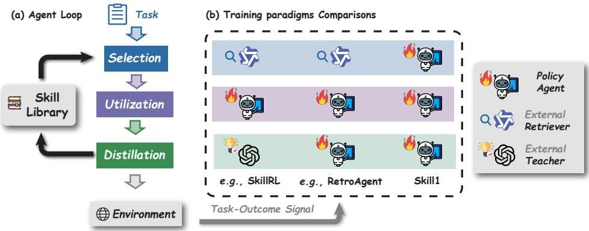
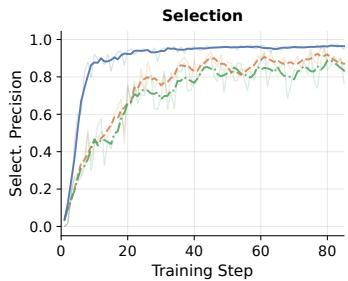
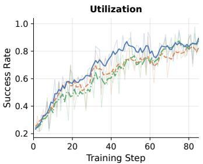
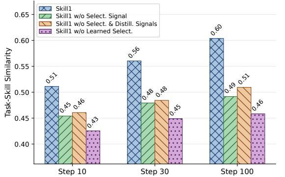
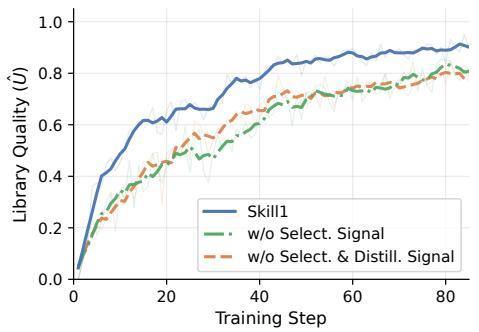
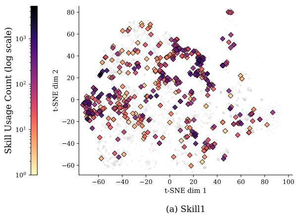
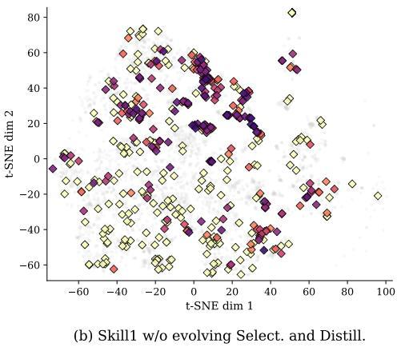

# Skill1: Unified Evolution of Skill-Augmented Agents via Reinforcement Learning

Yaorui Shi1,2,∗, Yuxin Chen2,3,∗, Zhengxi Lu2,4, Yuchun Miao2,5, Shugui Liu1, Qi Gu2,†, Xunliang Cai2, Xiang Wang1, An Zhang1,†

1University of Science and Technology of China, 2Meituan, 3National University of Singapore, 4Zhejiang University, 5Wuhan University, ∗Equal contribution.

†Corresponding authors: guqi03@meituan.com, an\_zhang@ustc.edu.cn

# Abstract

A persistent skill library allows language model agents to reuse successful strategies across tasks. Maintaining such a library requires three coupled capabilities. The agent selects a relevant skill, utilizes it during execution, and distills new skills from experience. Existing methods optimize these capabilities in isolation or with separate reward sources, resulting in partial and conflicting evolution. We propose Skill1, a framework that trains a single policy to co-evolve skill selection, utilization, and distillation toward a shared task-outcome objective. The policy generates a query to search the skill library, re-ranks candidates to select one, solves the task conditioned on it, and distills a new skill from the trajectory. All learning derives from a single task-outcome signal. Its low-frequency trend credits selection and its high-frequency variation credits distillation. Experiments on ALFWorld and WebShop show that Skill1 outperforms prior skill-based and reinforcement learning baselines. Training dynamics confirm the co-evolution of the three capabilities, and ablations show that removing any credit signal degrades the evolution. Our code is available at https://github.com/AlphaLab-USTC/Skill1.

# 1 Introduction

Reinforcement learning (RL) (Sutton and Barto, 2018; Schulman et al., 2017; Shao et al., 2024) has become an important paradigm for training large language model (LLM) agents that interact with complex environments (Guo et al., 2025; Yang et al., 2024; Team et al., 2026; Touvron et al., 2023; Shridhar et al., 2021; Yao et al., 2022a; Xi et al., 2025). Standard RL training treats each task as an isolated episode, where the strategies that lead to success are absorbed only implicitly into the policy parameters and cannot be explicitly reused on future tasks. A natural solution is to augment agents with a persistent skill library that accumulates reusable strategies from past experience, so that the agent can draw on previously successful approaches instead of solving every task from scratch (Wang et al., 2023; Zhao et al., 2024; Xia et al., 2026; Zhang et al., 2026a; Muhtar et al., 2026; Lu et al., 2026). The workflow of these skill-augmented agents can be organized around a three-stage lifecycle (Jiang et al., 2026a): skill selection, where the agent selects a relevant skill from the library for the current task; skill utilization, where the agent executes guided by the selected skill; and skill distillation, where the agent derives new reusable skills from the trajectories.

Existing methods have advanced each stage through RL, improving how agents select skills (Zhang et al., 2026b; Wang et al., 2026; Li et al., 2026a; Wu et al., 2025), utilize them (Xia et al., 2026; Muhtar et al., 2026; Zhang et al., 2026a; Li et al., 2026a; Wang et al., 2025a), and distill reusable knowledge (Zhang et al., 2026a; Wang et al., 2025a; Muhtar et al., 2026; Wu et al., 2025). Yet two fundamental questions remain open. (1) How can an agent evolve all three capabilities simultaneously? Existing methods apply policy updates to only a subset of the lifecycle, leaving at least one capability unoptimized, leading to optimization bottlenecks (Xia et al., 2026; Muhtar et al., 2026; Zhang et al., 2026a; Wang et al., 2025a). For example, a policy that has learned to use skills well still underperforms if it keeps routing to sub-optimal ones. (2) How can the three capabilities co-evolve toward a shared objective? Prior designs draw the rewards from different sources (Li et al., 2026a; Zhang et al., 2026a; Muhtar et al., 2026). For example, one capability may receive task-outcome reward while another relies on an auxiliary signal such as self-assessed quality or heuristic matching scores. Since the three capabilities jointly determine task success, optimizing them with inconsistent signals creates conflicting pressures.

  
Figure 1: Training paradigms for skill-augmented agents. (a) The skill-augmented agent loop consists of selection, utilization, and distillation. (b) Prior methods delegate some stages to external modules without policy gradients (e.g., freezes selection or uses an external teacher for distillation). Skill1 trains a single policy across all three stages with a shared task-outcome signal.

We present Skill1, a framework that achieves unified evolution of skill-augmented agents by training a single policy to co-evolve skill selection, utilization, and distillation. As illustrated in Figure 1, given a new task, the policy first generates a natural-language query to retrieve candidate skills from the library, and then re-ranks the retrieved candidates to select the best match. The policy then performs multi-turn interaction with the environment conditioned on the top-ranked skill. After execution, the policy distills reusable skills from the experience based on its rollouts.

We achieve co-evolution of all three capabilities through credit assignment on a single task-outcome signal $r ( \tau )$ . The outcome directly measures how well the policy solves the current task and serves as the utilization reward. To credit selection and distillation, we decompose this signal into its low-frequency trend and high-frequency variation. The low-frequency trend is defined as the moving average of outcomes associated with each skill. This term reflects skill utility and guides the policy toward consistently effective skills. The high-frequency variation is approximated with the deviation of the current outcome from the trend. This term captures whether a newly distilled skill improves upon the library’s current boundary, and rewards the policy for producing useful skills.

We empirically evaluate Skill1 on ALFWorld (Shridhar et al., 2021) and WebShop (Yao et al., 2022a). Skill1 achieves 97.5% success rate on ALFWorld, surpassing all other baseline skill-augmented agents. Training dynamics confirm that selection precision, utilization success rate, and library quality improve simultaneously under the shared signal. Ablations show that removing any single stage’s credit-assignment signal degrades all three capabilities, evidencing their mutual dependence.

# 2 Preliminary: LLM Agent with Skill Library

Task formulation. We formulate the skill-augmented agent learning problem as a POMDP (Lauri et al., 2022) $\mathcal { M } = ( S , \mathcal { A } , \mathcal { O } , T , \Omega , R , \gamma )$ . A state $S = \bar { ( x , e , B ) }$ comprises a task instruction x from dataset D, the environment state e, and a persistent skill library $\boldsymbol { B } = \{ s _ { 1 } , s _ { 2 } , . . . \}$ . At each turn the agent selects an action $a \in { \mathcal { A } }$ to send to the environment. The observation function Ω exposes a partial view $o _ { t } = ( x , e _ { t } , z )$ , where z is the skill selected from B via a frozen encoder $\mathcal { E }$ . The overall training objective for the workflow can be defined as:

$$
\max _ {\theta} \mathbb {E} _ {x \sim \mathcal {D}, \tau \sim \pi_ {\theta} (\cdot | x)} [ r (\tau) ], \tag {1}
$$

  
Figure 2: Overview of the Skill1 framework. (a) The policy generates a query and re-ranks retrieved candidates to select a skill. (b) The policy performs multi-turn interaction conditioned on the selected skill. (c) The policy reflects on the trajectory and distills a reusable skill. All learning signals are derived from the task-outcome $r ( \tau )$ to achieve co-evolution of three capabilities.

where $\pi _ { \theta }$ is optimized with RL algorithms such as GRPO (Shao et al., 2024) (cf. Appendix B).

Skills for LLM agents. A skill $s \in B$ consists of a natural-language strategy s.strat that describes how to act and a scenario description s.desc that characterizes when the skill applies. The agent maintains the skill library $\boldsymbol { B } = \{ s _ { 1 } , s _ { 2 } , . . . \}$ as it continuously explores the environment. To reuse a skill, the agent generates its action conditioned on the skill strategy:

$$
a _ {t} \sim \pi_ {\theta} (\cdot | x, z. \text {strat}, o _ {\leqslant t}). \tag {2}
$$

To interact with a skill library, the agent selects skills from B, utilizes them during execution (Eq. 2), and distills new skills back into B. In §3, we show how to optimize all three stages jointly through a single policy, deriving every learning signal from the task outcome $r ( \tau )$ .

# 3 Method

We introduce Skill1, a framework that trains a single policy $\pi _ { \theta }$ to co-evolve skill selection, utilization, and distillation toward a shared task-outcome objective (Figure 2). We first describe the workflow (§3.1), then derive all learning signals from the task outcome r(τ ) (§3.2), and finally formulate the joint optimization objective (§3.3).

# 3.1 Agent Workflow

For each task $x \sim \mathcal { D } ,$ , the policy πθ performs three stages in sequence. A complete trajectory takes the form $\tau = ( q , z , a _ { 1 } , o _ { 1 } , \dots , a _ { T } , o _ { T } , s _ { \mathrm { n e w } } )$ , where q is the selection query, z is the selected skill (or ∅), the action–observation pairs constitute the multi-turn interaction, and $s _ { \mathrm { n e w } }$ is the distilled skill. The environment returns a terminal reward $r ( \tau ) \in \{ 0 , 1 \}$ . Prompt templates are in Appendix G.

Skill selection. Given a task x, the policy generates a natural-language query $q \sim \pi _ { \theta } ( \cdot \mid x )$ to search the skill library B. A frozen encoder E retrieves the top-K candidates by semantic similarity:

$$
\mathcal {B} _ {K} = \text { top - K } _ {s \in \mathcal {B}} \text {   sim } \big (\mathcal {E} (q), \mathcal {E} (s. \text { desc }) \big). \tag {3}
$$

The policy then re-ranks these candidates by generating a permutation $\sigma \sim \pi _ { \boldsymbol { \theta } } ( \cdot \cdot \vert \ x , B _ { K } )$ , and the top-ranked skill z is provided for utilization. Both query generation and re-ranking are produced by $\pi _ { \theta } ,$ so selection is directly optimizable through the policy gradient.

Skill utilization. The policy interacts with the environment for up to $T$ turns conditioned on the selected skill: $\tau \sim \pi _ { \theta } ( \cdot \mid x ,$ z.strat, $o _ { \leq t } )$ . For each task, G rollouts are sampled independently, each performing its own selection, utilization, and distillation.

Skill distillation. After each rollout, $\pi _ { \theta }$ reflects on the trajectory to produce: (i) a reusable strategy $s _ { \mathrm { n e w } }$ .strat $\sim \pi _ { \boldsymbol { \theta } } ( \cdot \vert \boldsymbol { x } , \tau )$ summarizing the approach, and (ii) a scenario description $s _ { \mathrm { n e w } }$ .desc $\sim \pi _ { \theta } ( \cdot |$ $x , \tau )$ characterizing when the skill applies. A new skill is admitted to B only when $r ( \tau ) = 1$ . When the library reaches its capacity $| B | = N _ { \operatorname* { m a x } }$ , the skill with the lowest retirement score $U ( s ) \cdot \log { \bigl ( } n ( s ) { \bigr ) }$ is removed, where $n ( s )$ is the number of times s has been selected. This heuristic retires skills that are both low-utility and infrequently used while preserving well-tested high-utility skills.

# 3.2 Reward Assignment

Co-evolution requires that each capability receives targeted learning signals from the shared task outcome $r ( \tau )$ . The challenge is that the three capabilities operate at different temporal scopes: utilization concerns the current episode, selection concerns which skills are consistently effective across episodes, and distillation concerns whether new experience improves upon what the library already covers. We address this by decomposing r(τ ) into its low-frequency trend and high-frequency variation, assigning credit to each capability without auxiliary models or additional rollouts.

Crediting utilization. The task outcome directly measures how well the policy executes with the given skill and serves as the utilization reward:

$$
R _ {i} ^ {\text { util }} = r (\tau_ {i}). \tag {4}
$$

Crediting selection. Selection improves through two mechanisms. First, the query q is part of the rollout prefix and receives policy gradients through the utilization objective (Eq. 8). Better queries retrieve better candidates and lead to higher $r ( \tau )$ , so query quality co-improves with task performance without a dedicated reward.

Second, re-ranking requires an explicit signal that reflects long-term skill quality rather than singleepisode outcomes. We maintain the trend of each skill as a per-skill utility score, updated after each rollout via exponential moving average:

$$
U (s) \leftarrow (1 - \alpha) \cdot U (s) + \alpha \cdot r (\tau_ {i}), \quad \forall s \in \mathcal {B} _ {K}. \tag {5}
$$

We update all retrieved candidates rather than only the selected one, treating co-retrieval as evidence of relevance to the same task distribution. The trend smooths out per-episode variance and accumulates each skill’s long-term contribution. We denote the best available utility as $\hat { U } _ { i } = \operatorname* { m a x } _ { s \in \mathcal { B } _ { K } ^ { i } } U ( s )$ , which serves as the library baseline for subsequent reward derivations. The trend supervises reranking by rewarding the policy for producing a permutation $\sigma _ { i }$ that agrees with the utility ordering. Here we use normalized discounted cumulative gain (NDCG) as the rubric:

$$
R _ {i} ^ {\text { rerank }} = \text { NDCG } \big (\sigma_ {i}, \text {   argsort } (- U (\mathcal {B} _ {K} ^ {i})) \big). \tag {6}
$$

Crediting distillation. The ideal distillation signal would measure whether a newly distilled skill improves future task performance, but that future outcome is unavailable at training time. We approximate it with the variation of the current outcome relative to the library’s trend:

$$
R _ {i} ^ {\text { distill }} = r (\tau_ {i}) - \hat {U} _ {i}, \tag {7}
$$

where $\hat { U } _ { i } = \operatorname* { m a x } _ { s \in \mathcal { B } _ { K } ^ { i } } U ( s )$ is the highest trend among the retrieved candidates. A positive variation indicates that the current experience surpasses what the library already covers, so the distilled skill is worth admitting. A negative variation discourages redundant distillation.

# 3.3 Joint Optimization

Each rollout $\tau _ { i }$ is a concatenation of four generation segments produced by $\pi \theta :$ the selection query $q _ { i }$ , the re-ranking permutation $\sigma _ { i } .$ , the action sequence $a _ { 1 : T }$ , and the distilled skill $s _ { \mathrm { n e w } , i } .$ We assign each segment its own reward signal (§3.2) and optimize them jointly in a single gradient step using GRPO (Shao et al., 2024) (cf. Appendix B), which normalizes rewards within the G rollouts of each task into group-relative advantages.

Algorithm 1 Pseudo Code of Skill1   
Require: $\pi_{\theta}, B, E, K, G, \lambda_{1}, \lambda_{2}, \alpha$ 1: for batch of N tasks, each with G rollouts do

2:    for sample $i = 1, \ldots, N \cdot G$ do

3: $q_{i} \leftarrow \pi_{\theta}(x_{i})$ 4: $B_{K}^{i} \leftarrow \text{top-K}_{s \in B} \text{ sim}\big(\mathcal{E}(q_{i}), \mathcal{E}(s.\text{desc})\big)$ 5: $\sigma_{i} \leftarrow \pi_{\theta}(x_{i}, B_{K}^{i}); z_{i} \leftarrow B_{K}^{i}[\sigma_{i}(1)]$ 6: $\tau_{i} \sim \pi_{\theta}(\cdot | x_{i}, z_{i}.strat)$ 7: $(s_{\text{new},i}.strat, s_{\text{new},i}.desc) \leftarrow \pi_{\theta}(x_{i}, \tau_{i})$ 8:    end for

9: $R_{i}^{\text{util}} \leftarrow r(\tau_{i}); \hat{U}_{i} \leftarrow \max_{s \in B_{K}^{i}} U(s)$ 10: $R_{i}^{\text{distill}} \leftarrow r(\tau_{i}) - \hat{U}_{i}$ 11: $R_{i}^{\text{rerank}} \leftarrow \text{NDCG}(\sigma_{i}, \text{argsort}(-U(B_{K}^{i})))$ 12: $U(s) \leftarrow (1-\alpha)U(s) + \alpha r(\tau_{i}), \forall s \in B_{K}^{i}$ 13:    Admit $s_{new,i}$ to B if $r(\tau_{i}) = 1$ 14: $\theta \leftarrow \theta + \nabla_{\theta}\big[J^{\text{util}} + \lambda_{1}J^{\text{rerank}} + \lambda_{2}J^{\text{distill}}\big]$ 15: end for

Utilization and query. The action tokens $a _ { 1 : T }$ are conditioned on $( x _ { i } , z _ { i } )$ and optimized by the task outcome $R _ { i } ^ { \mathrm { u t i } } = \dot { r } ( \tau _ { i } )$ . The query $q _ { i }$ precedes the actions in the same sequence and receives gradients through the same objective:

$$
\mathcal {J} ^ {\text { util }} (\theta) = \mathcal {J} _ {\text { GRPO }} \big (\theta ; \{\tau_ {1}, \dots , \tau_ {G} \}, \{\hat {A} _ {1}, \dots , \hat {A} _ {G} \} \big). \tag {8}
$$

Re-ranking. The permutation $\sigma _ { i }$ is generated conditioned on the task $x _ { i }$ and retrieved candidates $B _ { K } ^ { i }$ , and reinforced by the ranking reward $R _ { i } ^ { \mathrm { r e r a n k } }$ . Since different rollouts generate different queries, their retrieved candidate sets $B _ { K } ^ { i }$ differ, thus inner group comparison becomes meaningless. We thus optimize each permutation independently with a REINFORCE-style (Williams, 1992) objective:

$$
\mathcal {J} ^ {\text { rerank }} (\theta) = \frac {1}{N \cdot G} \sum_ {i} R _ {i} ^ {\text { rerank }} \cdot \log \pi_ {\theta} (\sigma_ {i} \mid x _ {i}, \mathcal {B} _ {K} ^ {i}). \tag {9}
$$

Distillation. The distilled skill tokens $( s _ { \mathrm { n e w } , i } . \mathrm { s t r a t } , s _ { \mathrm { n e w } , i } . \mathrm { d e s c } )$ are generated conditioned on the task $x _ { i }$ and trajectory $\tau _ { i } ,$ and reinforced by the variation $R _ { i } ^ { \mathrm { { d i s t i l l } } }$ . Advantages $\hat { A } _ { i } ^ { \mathrm { d i s t i l l } }$ are normalized separately from those of utilization since the two rewards measure different aspects of same outcomes:

$$
\mathcal {J} ^ {\text { distill }} (\theta) = \mathcal {J} _ {\text { GRPO }} \left(\theta ; \{s _ {\text { new }, 1}, \dots , s _ {\text { new }, G} \}, \{\hat {A} _ {1} ^ {\text { distill }}, \dots , \hat {A} _ {G} ^ {\text { distill }} \}\right). \tag {10}
$$

Total objective. All terms are combined in a single update:

$$
\mathcal {J} (\theta) = \mathcal {J} ^ {\text { util }} (\theta) + \lambda_ {1} \mathcal {J} ^ {\text { rerank }} (\theta) + \lambda_ {2} \mathcal {J} ^ {\text { distill }} (\theta). \tag {11}
$$

The utility score $U ( s )$ is updated non-parametrically via Eq. (5). The full procedure is summarized in Algorithm 1. Training hyperparameter settings are in Appendix C.

# 4 Experiments

# 4.1 Experimental Setup

Environments. We evaluate on ALFWorld (Shridhar et al., 2021), a text-based household environment requiring multi-step planning and object interaction, and WebShop (Yao et al., 2022a), an online-shopping simulator where agents search and purchase products matching user specifications. We report success rate (%) on the test split for both environments.

Training. For Skill1, the initial policy is Qwen2.5-7B-Instruct (Yang et al., 2024) and the frozen encoder E is all-MiniLM-L6-v2 (Reimers and Gurevych, 2019). We train with GRPO under $G = 1 6$ and $\mathrm { l r } = 1 \times 1 0 ^ { - 6 }$ . The skill library is initialized empty with capacity $| B | \leqslant 5 0 0 0$ . The training data uses the train split of the corresponding environments. Full hyperparameters are in Appendix C.

Table 1: Main results on ALFWorld and WebShop (Success Rate, %). Bold denotes best results; ↑ indicates improvement over the previous best. “Avg.” stands for average success rate and “Succ.“ stands for success rate. 

<table><tr><td rowspan="2">Method</td><td colspan="7">ALFWorld (Success %)</td><td colspan="2">WebShop</td></tr><tr><td>Pick</td><td>Look</td><td>Clean</td><td>Heat</td><td>Cool</td><td>Pick2</td><td>Avg.</td><td>Score</td><td>Succ.</td></tr><tr><td colspan="8">w/o Training</td><td colspan="2"></td></tr><tr><td>Zero-Shot</td><td>33.4</td><td>21.6</td><td>19.3</td><td>6.9</td><td>2.8</td><td>3.2</td><td>14.8</td><td>26.4</td><td>7.8</td></tr><tr><td>ReAct (Yao et al., 2022b)</td><td>48.5</td><td>35.4</td><td>34.3</td><td>13.2</td><td>18.2</td><td>17.6</td><td>31.2</td><td>46.2</td><td>19.5</td></tr><tr><td>Reflexion (Shinn et al., 2023)</td><td>62.0</td><td>41.6</td><td>44.9</td><td>30.9</td><td>36.3</td><td>23.8</td><td>42.7</td><td>58.1</td><td>28.8</td></tr><tr><td>Mem0 (Chhikara et al., 2025)</td><td>54.0</td><td>55.0</td><td>26.9</td><td>36.4</td><td>20.8</td><td>7.7</td><td>33.6</td><td>23.9</td><td>2.0</td></tr><tr><td>ExpeL (Zhao et al., 2024)</td><td>21.0</td><td>67.0</td><td>55.0</td><td>52.0</td><td>71.0</td><td>6.0</td><td>46.3</td><td>30.9</td><td>11.2</td></tr><tr><td colspan="8">RL-Trained w/o Skills</td><td colspan="2"></td></tr><tr><td>PPO (Schulman et al., 2017)</td><td>92.3</td><td>64.0</td><td>92.5</td><td>89.5</td><td>80.3</td><td>68.8</td><td>80.4</td><td>81.4</td><td>68.7</td></tr><tr><td>RLOO (Ahmadian et al., 2024)</td><td>87.6</td><td>78.2</td><td>87.3</td><td>81.3</td><td>71.9</td><td>48.9</td><td>75.5</td><td>80.3</td><td>65.7</td></tr><tr><td>GRPO (Shao et al., 2024)</td><td>90.8</td><td>66.1</td><td>89.3</td><td>74.7</td><td>72.5</td><td>64.7</td><td>77.6</td><td>79.3</td><td>66.1</td></tr><tr><td>GiGPO (Feng et al., 2025)</td><td>97.7</td><td>82.7</td><td>98.8</td><td>83.7</td><td>89.3</td><td>79.2</td><td>90.8</td><td>84.4</td><td>72.8</td></tr><tr><td colspan="8">RL-Trained w/ Skills</td><td colspan="2"></td></tr><tr><td>EvolveR (Wu et al., 2025)</td><td>64.9</td><td>33.3</td><td>46.4</td><td>13.3</td><td>33.3</td><td>33.3</td><td>43.8</td><td>42.5</td><td>17.6</td></tr><tr><td>Mem0 (Chhikara et al., 2025) w/ GRPO</td><td>78.1</td><td>54.8</td><td>56.1</td><td>31.0</td><td>65.0</td><td>26.9</td><td>54.7</td><td>58.1</td><td>37.5</td></tr><tr><td>SimpleMem (Liu et al., 2026a) w/ GRPO</td><td>89.5</td><td>36.3</td><td>60.0</td><td>50.0</td><td>64.9</td><td>26.3</td><td>62.5</td><td>67.8</td><td>46.9</td></tr><tr><td>SkillRL (Xia et al., 2026)</td><td>97.9</td><td>71.4</td><td>90.0</td><td>90.0</td><td>95.5</td><td>87.5</td><td>89.9</td><td>85.2</td><td>72.7</td></tr><tr><td>RetroAgent (Zhang et al., 2026a)</td><td>97.9</td><td>90.9</td><td>99.2</td><td>92.9</td><td>85.3</td><td>91.0</td><td>94.9</td><td>88.9</td><td>82.3</td></tr><tr><td>Skill1 (Ours)</td><td> $100.0_{\uparrow 2.1}$ </td><td> $98.6_{\uparrow 7.7}$ </td><td>97.3</td><td> $99.2_{\uparrow 6.3}$ </td><td> $96.1_{\uparrow 0.6}$ </td><td> $96.0_{\uparrow 5.0}$ </td><td> $97.5_{\uparrow 2.6}$ </td><td>89.7</td><td>82.9</td></tr></table>

Baselines. We compare three categories of methods in Table 1: (1) training-free agents such as ReAct (Yao et al., 2022b), Reflexion (Shinn et al., 2023), Mem0 (Chhikara et al., 2025), and ExpeL (Zhao et al., 2024); (2) RL-trained methods without skills such as PPO (Schulman et al., 2017), RLOO (Ahmadian et al., 2024), GRPO (Shao et al., 2024), and GiGPO (Feng et al., 2025); and (3) RL-trained methods with skills such as EvolveR (Wu et al., 2025), Mem0 and SimpleMem (Liu et al., 2026a) optimized with GRPO, SkillRL (Xia et al., 2026), and RetroAgent (Zhang et al., 2026a). All baselines use the same base model Qwen2.5-7B-Instruct for fair comparison.

# 4.2 Main Results

Table 1 presents the main results. We reproduce RetroAgent with the official implementation and borrow other baseline results from prior research (Feng et al., 2025; Xia et al., 2026; Jiang et al., 2025a). Skill1 results are averaged across three runs, and we report statistical analysis in Appendix D.

Skill1 achieves the highest overall performance. On ALFWorld, Skill1 reaches 97.5% average success rate, surpassing the previous best RetroAgent by 2.6 points and ranking first on 5 out of 6 task types. On WebShop, Skill1 also demonstrates the best performance across all methods.

An explicit skill library complements parameter-only RL. GiGPO, the strongest RL-only method, absorbs strategies implicitly into parameters and cannot explicitly reuse them across tasks. Skill1 surpasses it by 6.5 points, with the largest gains on Look and Pick2 where composing multiple sub-procedures benefits most from reusable skills.

Unified optimization outperforms methods that leave part of the lifecycle unoptimized. RetroAgent optimizes utilization and distillation with separate intrinsic rewards but provides no gradient signal for selection. SkillRL freezes its selection mechanism after cold-start SFT. Skill1 optimizes all three stages jointly through a single task-outcome signal. The comparison reveals a clear trend that agent performance increases with the degree of co-evolution.

# 4.3 Analysis

# 4.3.1 Ablation Study

We remove workflow components and zero out auxiliary objective weights to isolate each design choice. All variants share the same base model and training budget. Results are reported in Table 2.

The skill library is the foundation, and distillation makes it effective. Removing the library entirely causes the largest drop, from 97.5% to 80.9%, with Heat and Pick2 losing over 28 points each. These task types require composing multi-step sub-procedures that benefit most from reusable skills. Removing distillation while keeping the library still reduces performance by 5.1 points. Without

Table 2: Ablation study on ALFWorld (Success Rate %). Upper block ablates workflow components; lower block ablates training objectives. 

<table><tr><td></td><td>Pick</td><td>Look</td><td>Clean</td><td>Heat</td><td>Cool</td><td>Pick2</td><td>Avg.</td></tr><tr><td>Skill1</td><td>100.0</td><td>98.6</td><td>97.3</td><td>99.2</td><td>96.1</td><td>96.0</td><td>97.5</td></tr><tr><td>w/o Selection</td><td>96.9</td><td>90.3</td><td>98.0</td><td>90.4</td><td>86.5</td><td>85.3</td><td>91.8</td></tr><tr><td>w/o Distillation</td><td>97.4</td><td>88.5</td><td>98.1</td><td>96.1</td><td>87.6</td><td>89.5</td><td>92.4</td></tr><tr><td>w/o Library</td><td>96.7</td><td>71.5</td><td>94.9</td><td>70.7</td><td>71.5</td><td>65.5</td><td>80.9</td></tr><tr><td> $w/\lambda_1=0$ </td><td>99.5</td><td>80.5</td><td>98.8</td><td>100.0</td><td>90.6</td><td>84.9</td><td>94.0</td></tr><tr><td> $w/\lambda_2=0$ </td><td>100.0</td><td>85.4</td><td>95.5</td><td>96.4</td><td>91.0</td><td>96.2</td><td>94.9</td></tr><tr><td> $w/\lambda_1=\lambda_2=0$ </td><td>98.1</td><td>74.9</td><td>95.6</td><td>95.6</td><td>79.5</td><td>87.2</td><td>90.2</td></tr></table>

  
Skill1 w/o Select. Signal w/o Select. & Distill. Signal

Figure 3: Training dynamics of the three capability metrics. Full Skill1 achieves fast and unified convergence across all stages. Removing selection signal (green) or both selection and distillation signals (orange) slows convergence of all capabilities.

distillation the library stores raw trajectories rather than condensed strategies, making selection noisier and reuse less effective.

Selection loss propagates to downstream stages. Without selection the average drops by 5.7 points, concentrated on Heat and Pick2 where routing to the correct multi-step skill matters most. Notably, this degradation occurs even though the utilization reward remains intact, showing that poor skill routing bottlenecks the entire pipeline regardless of the policy’s solving ability.

The two auxiliary objectives are complementary. Setting $\lambda _ { 1 } { = } 0$ or $\lambda _ { 2 } { = } 0$ individually reduces performance by 3.5 and 2.6 points respectively. Removing both yields a sharper decline to 90.2%, worse than removing each stage individually. This gap shows that the signals benefit utilization beyond their direct targets, confirming that both signals are necessary to sustain full co-evolution.

# 4.3.2 Co-evolution Dynamics

Figure 3 tracks three capability metrics across training: (1) selection precision, the average skill utility scores $U ( s ) { \mathrm { ; } }$ (2) task-outcome reward $r ( \tau )$ for utilization; and (3) distillation positive rate, the fraction of new rollouts exceeding the average of retrieved ones $\hat { U } _ { i }$ . We compare the full system against ablations that progressively remove credit-assignment signals.

The three capabilities exhibit mutual reinforcement under unified training. Selection precision converges first, reaching 0.95 by step 20. The resulting high-quality skill supply then accelerates the other two stages, with both utilization and distillation reaching 0.8 by step 60. This sequential acceleration shows that improvements in one stage propagate forward through the lifecycle.

Ablating any credit-assignment signal slows all three capabilities. Removing the selection signal reduces selection precision as expected, but also drags down utilization and distillation because the policy routes to sub-optimal skills more frequently. Further removing distillation causes utilization scores to drop, even though it still receives its own direct reward. This suggest that each signal contribute to the overall growing trend, which is a direct evidence of co-evolution.

  
Figure 4: Task-skill similarity at three training checkpoints. The trend signal drives continuous improvement in selection quality.

  
Figure 5: Top-skill utility $( \hat { U } )$ during training. The variation signal drives the policy to distill increasingly effective skills.

  
Figure 6: T-SNE visualization of the skill libraries after convergence, with and without RL-trained selection and distillation. The top-10 percent most frequently used skills are highlighted. Skill1 activates nearly twice as many high-frequency skills, and these skills span a broader strategy space.

# 4.3.3 Evolution of Skill Management Capabilities

The previous section shows that capability metrics rise together. Here we examine the qualitative nature of that improvement: does the policy actually learn to select more relevant skills and distill higher-quality ones?

The policy learns to generate increasingly precise selection queries. Figure 4 measures task-skill similarity at three checkpoints. Full Skill1 improves from 0.51 to 0.60 across training because the trend signal rewards queries that retrieve historically high-utility skills, gradually sharpening the policy’s ability to describe what it needs. Removing the selection signal slows this learning, and without learned selection entirely, similarity stays almost flat at the lowest level.

The library ceiling rises as the policy learns to distill better skills. Figure 5 tracks $\hat { U } ,$ the utility of the top-ranked skill per task. A rising Uˆ means increasingly effective skills are entering the library, not merely more skills. Full Skill1 reaches 0.91 by step 85 while both ablations lag by approximately 0.10. The variation signal creates this pressure: producing a skill similar to existing ones yields little reward, so the policy must discover genuinely better strategies to obtain positive gradient.

# 4.3.4 Skill Library Diversity

We examine whether the library is utilized as a diverse collective asset or collapses to a few dominant entries. Figure 6 visualizes the converged libraries with and without credit-assignment signals.

Table 3: Computational cost on ALFWorld training. We report wall-clock time per step (seconds) and library size (number of skills) at three checkpoints. 

<table><tr><td rowspan="2">Method</td><td colspan="3">Time / Step (s)</td><td colspan="3">Library Size</td></tr><tr><td>Step 20</td><td>Step 60</td><td>Step 100</td><td>Step 20</td><td>Step 60</td><td>Step 100</td></tr><tr><td>GRPO (no library)</td><td>301.3</td><td>274.1</td><td>296.7</td><td>—</td><td>—</td><td>—</td></tr><tr><td>SkillRL</td><td>368.1</td><td>319.0</td><td>326.6</td><td>60</td><td>71</td><td>83</td></tr><tr><td>Skill1</td><td>386.6</td><td>444.3</td><td>493.8</td><td>915</td><td>3,899</td><td>5,000</td></tr><tr><td>w/o Select. Step</td><td>367.4</td><td>406.7</td><td>521.8</td><td>892</td><td>3,693</td><td>5,000</td></tr><tr><td>w/o Distill. Step</td><td>508.8</td><td>750.1</td><td>738.4</td><td>2,212</td><td>5,000</td><td>5,000</td></tr></table>

Co-evolution activates a broader set of skills. Skill1 frequently use a broader set of skills. As observed in Figure 6,the skill usage count distributes more uniformly in the left panel. Without evolving signals (i.e., Skill1 w/o Select. and Distill.), the skill usage count distribution sharpens, where only a few amount of popular skills are intensively utilized.

Frequently used skills cover diverse strategies. We also observe that the active skills in Skill1 span a much broader region of the strategy space. In the contrary, the popular skills (red and purple ones) on the right subfigure huddle together with only limited coverage. In the design of our method, producing a under-performing skill similar to existing ones yields negative reward, so the policy is pressured to cover underserved scenarios rather than duplicating successful ones.

# 4.3.5 Computational Overhead

We compare wall-clock time and library size for Skill1, SkillRL, and two ablations under identical hardware of 8 H800 80GB GPUs.

Skill1 adds moderate overhead over baseline methods. GRPO without a library runs at approximately 290s per step. SkillRL maintains near-constant cost because its library grows minimally from 60 to 83 skills, but this static library limits final performance to 89.9% compared to 97.5% for Skill1. Skill1 operates at 387 to 494s, roughly 1.3 to 1.7 times slower than GRPO, with the increase stemming from the growing library context. The selection step itself adds negligible overhead as query generation and re-ranking operate on short sequences compared to multi-turn interactions against the environment.

Distillation controls both library quality and computational cost. Without distillation, raw trajectories enter the library directly, growing it at 2.4 times the rate of Skill1. The larger library lengthens the selection context, making the variant without distillation 69% slower by step 60 and saturating the 5,000-skill cap far earlier. Distillation compresses experience into concise skills, simultaneously improving quality and bounding cost.

# 5 Conclusion and Limitations

Conclusion. We present Skill1, a framework that trains a single policy to co-evolve skill selection, utilization, and distillation toward a shared task-outcome objective. By decomposing this signal into its low-frequency trend and high-frequency variation, Skill1 derives per-capability credit assignment without auxiliary rewards. Experiments on ALFWorld and WebShop show consistent gains over prior skill-based and RL baselines, and ablations confirm that the three capabilities evolve in a coupled manner. We hope this unified perspective encourages further research on jointly optimizing the full skill lifecycle in broader agent settings.

Limitations. While Skill1 achieves strong performance, several limitations remain.

• Environment coverage. Our evaluation is limited to two representative text-based agent environments. Whether the co-evolution framework generalizes to more environments (e.g., deep search environments) or those with visual observations remains unexplored.   
• Scalability of the skill library. The library capacity in this work is capped at 5,000 entries. As the diversity of tasks grows, the fixed-size library may become a bottleneck, and more sophisticated eviction or hierarchical organization strategies may be required.
