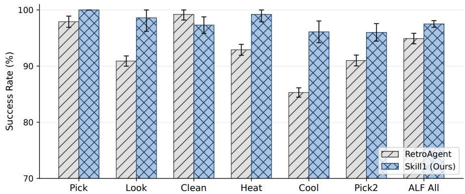

# References

Richard S Sutton and Andrew G Barto. Reinforcement Learning: An Introduction. MIT Press, 2nd edition, 2018.   
John Schulman, Filip Wolski, Prafulla Dhariwal, Alec Radford, and Oleg Klimov. Proximal policy optimization algorithms. arXiv preprint arXiv:1707.06347, 2017.   
Zhihong Shao, Peiyi Wang, Qihao Zhu, Runxin Xu, Junxiao Song, Xiao Bi, Haowei Zhang, Mingchuan Zhang, YK Li, Yang Wu, et al. Deepseekmath: Pushing the limits of mathematical reasoning in open language models. arXiv preprint arXiv:2402.03300, 2024.   
Daya Guo, Dejian Yang, Haowei Zhang, Junxiao Song, Peiyi Wang, Qihao Zhu, Runxin Xu, Ruoyu Zhang, Shirong Ma, Xiao Bi, et al. Deepseek-r1: Incentivizing reasoning capability in llms via reinforcement learning. arXiv preprint arXiv:2501.12948, 2025.   
An Yang, Baosong Yang, Beichen Zhang, et al. Qwen2.5 technical report. arXiv preprint arXiv:2412.15115, 2024.   
Meituan LongCat Team, Anchun Gui, Bei Li, Bingyang Tao, Bole Zhou, Borun Chen, Chao Zhang, Chen Gao, Chen Zhang, Chengcheng Han, et al. Longcat-flash-thinking-2601 technical report. arXiv preprint arXiv:2601.16725, 2026.   
Hugo Touvron, Thibaut Lavril, Gautier Izacard, Xavier Martinet, Marie-Anne Lachaux, Timothée Lacroix, Baptiste Rozière, Naman Goyal, Eric Hambro, Faisal Azhar, et al. Llama: Open and efficient foundation language models. arXiv preprint arXiv:2302.13971, 2023.   
Mohit Shridhar, Xingdi Yuan, Marc-Alexandre Côté, Yonatan Bisk, Adam Trischler, and Matthew J. Hausknecht. Alfworld: Aligning text and embodied environments for interactive learning. In 9th International Conference on Learning Representations, ICLR 2021, Virtual Event, Austria, May 3-7, 2021, 2021.   
Shunyu Yao, Howard Chen, John Yang, and Karthik Narasimhan. Webshop: Towards scalable real-world web interaction with grounded language agents. In S. Koyejo, S. Mohamed, A. Agarwal, D. Belgrave, K. Cho, and A. Oh, editors, Advances in Neural Information Processing Systems, volume 35, pages 20744–20757. Curran Associates, Inc., 2022a.   
Zhiheng Xi, Yiwen Ding, Wenxiang Chen, Boyang Hong, Honglin Guo, Junzhe Wang, Xin Guo, Dingwen Yang, Chenyang Liao, Wei He, et al. Agentgym: Evaluating and training large language model-based agents across diverse environments. In Proceedings of the 63rd Annual Meeting of the Association for Computational Linguistics, pages 27914–27961, 2025.   
Guanzhi Wang, Yuqi Xie, Yunfan Jiang, Ajay Mandlekar, Chaowei Xiao, Yuke Zhu, Linxi Fan, and Anima Anandkumar. Voyager: An open-ended embodied agent with large language models. In Intrinsically-Motivated and Open-Ended Learning Workshop@ NeurIPS2023, 2023.   
Andrew Zhao, Daniel Huang, Quentin Xu, Matthieu Lin, Yong-Jin Liu, and Gao Huang. Expel: Llm agents are experiential learners. In Proceedings of the AAAI Conference on Artificial Intelligence, volume 38, pages 19632–19642, 2024.   
Peng Xia, Jianwen Chen, Hanyang Wang, Jiaqi Liu, Kaide Zeng, Yu Wang, Siwei Han, Yiyang Zhou, Xujiang Zhao, Haifeng Chen, et al. Skillrl: Evolving agents via recursive skill-augmented reinforcement learning. arXiv preprint arXiv:2602.08234, 2026.   
Xiaoying Zhang, Zichen Liu, Yipeng Zhang, Xia Hu, and Wenqi Shao. Retroagent: From solving to evolving via retrospective dual intrinsic feedback. arXiv preprint arXiv:2603.08561, 2026a.   
Dilxat Muhtar, Jiashun Liu, Wei Gao, Weixun Wang, Shaopan Xiong, Ju Huang, Siran Yang, Wenbo Su, Jiamang Wang, Ling Pan, et al. Complementary reinforcement learning. arXiv preprint arXiv:2603.17621, 2026.   
Zhengxi Lu, Zhiyuan Yao, Jinyang Wu, Chengcheng Han, Qi Gu, Xunliang Cai, Weiming Lu, Jun Xiao, Yueting Zhuang, and Yongliang Shen. Skill0: In-context agentic reinforcement learning for skill internalization. arXiv preprint arXiv:2604.02268, 2026.

Yanna Jiang, Delong Li, Haiyu Deng, Baihe Ma, Xu Wang, Qin Wang, and Guangsheng Yu. Sok: Agentic skills–beyond tool use in llm agents. arXiv preprint arXiv:2602.20867, 2026a.   
Haozhen Zhang, Quanyu Long, Jianzhu Bao, Tao Feng, Weizhi Zhang, Haodong Yue, and Wenya Wang. Memskill: Learning and evolving memory skills for self-evolving agents. arXiv preprint arXiv:2602.02474, 2026b.   
Jiayu Wang, Yifei Ming, Zixuan Ke, Shafiq Joty, Aws Albarghouthi, and Frederic Sala. Skillorchestra: Learning to route agents via skill transfer. arXiv preprint arXiv:2602.19672, 2026.   
Yu Li, Rui Miao, Zhengling Qi, and Tian Lan. Arise: Agent reasoning with intrinsic skill evolution in hierarchical reinforcement learning. arXiv preprint arXiv:2603.16060, 2026a.   
Rong Wu, Xiaoman Wang, Jianbiao Mei, Pinlong Cai, Daocheng Fu, Cheng Yang, Licheng Wen, Xuemeng Yang, Yufan Shen, Yuxin Wang, et al. Evolver: Self-evolving llm agents through an experience-driven lifecycle. arXiv preprint arXiv:2510.16079, 2025.   
Jiongxiao Wang, Qiaojing Yan, Yawei Wang, Yijun Tian, Soumya Smruti Mishra, Zhichao Xu, Megha Gandhi, Panpan Xu, and Lin Lee Cheong. Reinforcement learning for self-improving agent with skill library. arXiv preprint arXiv:2512.17102, 2025a.   
Mikko Lauri, David Hsu, and Joni Pajarinen. Partially observable markov decision processes in robotics: A survey. IEEE Transactions on Robotics, 39(1):21–40, 2022.   
Ronald J Williams. Simple statistical gradient-following algorithms for connectionist reinforcement learning. Machine learning, 8(3):229–256, 1992.   
Nils Reimers and Iryna Gurevych. Sentence-BERT: Sentence embeddings using siamese BERTnetworks. In Proceedings of the 2019 Conference on Empirical Methods in Natural Language Processing (EMNLP), pages 3982–3992, 2019.   
Shunyu Yao, Jeffrey Zhao, Dian Yu, Nan Du, Izhak Shafran, Karthik R Narasimhan, and Yuan Cao. React: Synergizing reasoning and acting in language models. In The eleventh international conference on learning representations, 2022b.   
Noah Shinn, Federico Cassano, Ashwin Gopinath, Karthik Narasimhan, and Shunyu Yao. Reflexion: Language agents with verbal reinforcement learning. Advances in neural information processing systems, 36:8634–8652, 2023.   
Prateek Chhikara, Dev Khant, Saket Aryan, Taranjeet Singh, and Deshraj Yadav. Mem0: Building production-ready ai agents with scalable long-term memory. arXiv preprint arXiv:2504.19413, 2025.   
Arash Ahmadian, Chris Cremer, Matthias Gallé, Marzieh Fadaee, Julia Kreutzer, Olivier Pietquin, Ahmet Üstün, and Sara Hooker. Back to basics: Revisiting reinforce-style optimization for learning from human feedback in llms. In Proceedings of the 62nd Annual Meeting of the Association for Computational Linguistics (Volume 1: Long Papers), pages 12248–12267, 2024.   
Lang Feng, Zhenghai Xue, Tingcong Liu, and Bo An. Group-in-group policy optimization for llm agent training. In The Thirty-ninth Annual Conference on Neural Information Processing Systems, 2025.   
Jiaqi Liu, Yaofeng Su, Peng Xia, Siwei Han, Zeyu Zheng, Cihang Xie, Mingyu Ding, and Huaxiu Yao. Simplemem: Efficient lifelong memory for llm agents. arXiv preprint arXiv:2601.02553, 2026a.   
Yulun Jiang, Liangze Jiang, Damien Teney, Michael Moor, and Maria Brbic. Meta-rl induces exploration in language agents. arXiv preprint arXiv:2512.16848, 2025a.   
Qiying Yu, Zheng Zhang, Ruofei Zhu, Yufeng Yuan, Xiaochen Zuo, Yu Yue, Weinan Dai, Tiantian Fan, Gaohong Liu, Lingjun Liu, et al. Dapo: An open-source llm reinforcement learning system at scale. arXiv preprint arXiv:2503.14476, 2025.

Yifei Zhou, Andrea Zanette, Jiayi Pan, Sergey Levine, and Aviral Kumar. Archer: Training language model agents via hierarchical multi-turn rl. In International Conference on Machine Learning, pages 62178–62209. PMLR, 2024.   
Kevin Chen, Marco Cusumano-Towner, Brody Huval, Aleksei Petrenko, Jackson Hamburger, Vladlen Koltun, and Philipp Krähenbühl. Reinforcement learning for long-horizon interactive llm agents. arXiv preprint arXiv:2502.01600, 2025.   
Pranav Putta, Edmund Mills, Naman Garg, Sumeet Motwani, Chelsea Finn, Divyansh Garg, and Rafael Rafailov. Agent q: Advanced reasoning and learning for autonomous ai agents. arXiv preprint arXiv:2408.07199, 2024.   
Yifan Song, Da Yin, Xiang Yue, Jie Huang, Sujian Li, and Bill Yuchen Lin. Trial and error: Exploration-based trajectory optimization of llm agents. In Proceedings of the 62nd Annual Meeting of the Association for Computational Linguistics, pages 7584–7600, 2024.   
Zihan Wang, Kangrui Wang, Qineng Wang, Pingyue Zhang, Linjie Li, Zhengyuan Yang, Xing Jin, Kefan Yu, Minh Nhat Nguyen, Licheng Liu, et al. Ragen: Understanding self-evolution in llm agents via multi-turn reinforcement learning. arXiv preprint arXiv:2504.20073, 2025b.   
Hanchen Zhang, Xiao Liu, Bowen Lv, Xueqiao Sun, Bohao Jing, Iat Long Iong, Zhenyu Hou, Zehan Qi, Hanyu Lai, Yifan Xu, Rui Lu, Hongning Wang, Jie Tang, and Yuxiao Dong. Agentrl: Scaling agentic reinforcement learning with a multi-turn, multi-task framework. arXiv preprint arXiv:2510.04206, 2025a.   
Yulun Jiang, Liangze Jiang, Damien Teney, Michael Moor, and Maria Brbic. Meta-rl induces exploration in language agents. arXiv preprint arXiv:2512.16848, 2025b.   
Hanlin Wang, Chak Tou Leong, Jiashuo Wang, Jian Wang, and Wenjie Li. Spa-rl: Reinforcing llm agents via stepwise progress attribution. arXiv preprint arXiv:2505.20732, 2025c.   
Quan Wei, Siliang Zeng, Chenliang Li, William Brown, Oana Frunza, Wei Deng, Anderson Schneider, Yuriy Nevmyvaka, Yang Katie Zhao, Alfredo Garcia, and Mingyi Hong. Reinforcing multi-turn reasoning in llm agents via turn-level reward design. arXiv preprint arXiv:2505.11821, 2025a.   
Jingtong Gao, Ling Pan, Yejing Wang, Rui Zhong, Chi Lu, Qingpeng Cai, Peng Jiang, and Xiangyu Zhao. Navigate the unknown: Enhancing llm reasoning with intrinsic motivation guided exploration. arXiv preprint arXiv:2505.17621, 2025.   
Jiawei Wang, Jiacai Liu, Yuqian Fu, Yingru Li, Xintao Wang, Yuan Lin, Yu Yue, Lin Zhang, Yang Wang, and Ke Wang. Harnessing uncertainty: Entropy-modulated policy gradients for long-horizon llm agents. arXiv preprint arXiv:2509.09265, 2025d.   
David Abel, André Barreto, Benjamin Van Roy, Doina Precup, Hado P van Hasselt, and Satinder Singh. A definition of continual reinforcement learning. Advances in Neural Information Processing Systems, 36:50377–50407, 2023.   
Runzhe Zhan, Yafu Li, Zhi Wang, Xiaoye Qu, Dongrui Liu, Jing Shao, Derek F Wong, and Yu Cheng. Exgrpo: Learning to reason from experience. arXiv preprint arXiv:2510.02245, 2025.   
Tianzhu Ye, Li Dong, Qingxiu Dong, Xun Wu, Shaohan Huang, and Furu Wei. Online experiential learning for language models. arXiv preprint arXiv:2603.16856, 2026.   
Tianxin Wei, Noveen Sachdeva, Benjamin Coleman, Zhankui He, Yuanchen Bei, Xuying Ning, Mengting Ai, Yunzhe Li, Jingrui He, Ed H Chi, et al. Evo-memory: Benchmarking llm agent test-time learning with self-evolving memory. arXiv preprint arXiv:2511.20857, 2025b.   
Zeyuan Liu, Jeonghye Kim, Xufang Luo, Dongsheng Li, and Yuqing Yang. Exploratory memoryaugmented llm agent via hybrid on- and off-policy optimization. In The Fourteenth International Conference on Learning Representations, 2026b.   
Runnan Fang, Yuan Liang, Xiaobin Wang, Jialong Wu, Shuofei Qiao, Pengjun Xie, Fei Huang, Huajun Chen, and Ningyu Zhang. Memp: Exploring agent procedural memory. arXiv preprint arXiv:2508.06433, 2025.

Huichi Zhou, Yihang Chen, Siyuan Guo, Xue Yan, Kin Hei Lee, Zihan Wang, Ka Yiu Lee, Guchun Zhang, Kun Shao, Linyi Yang, et al. Memento: Fine-tuning llm agents without fine-tuning llms. arXiv preprint arXiv:2508.16153, 2025.   
Sai Wang, Yu Wu, and Zhongwen Xu. Cogito, ergo ludo: An agent that learns to play by reasoning and planning. arXiv preprint arXiv:2509.25052, 2025e.   
Peter Auer, Nicolo Cesa-Bianchi, and Paul Fischer. Finite-time analysis of the multiarmed bandit problem. Machine learning, 47(2):235–256, 2002.   
Xiaoying Zhang, Yipeng Zhang, Hao Sun, Kaituo Feng, Chaochao Lu, Chao Yang, and Helen Meng. Critique-grpo: Advancing llm reasoning with natural language and numerical feedback. arXiv preprint arXiv:2506.03106, 2025b.   
Jonas Hübotter, Frederike Lübeck, Lejs Behric, Anton Baumann, Marco Bagatella, Daniel Marta, Ido Hakimi, Idan Shenfeld, Thomas Kleine Buening, Carlos Guestrin, and Andreas Krause. Reinforcement learning via self-distillation. arXiv preprint arXiv:2601.20802, 2026.   
Aman Madaan, Niket Tandon, Prakhar Gupta, Skyler Hallinan, Luyu Gao, Sarah Wiegreffe, Uri Alon, Nouha Dziri, Shrimai Prabhumoye, Yiming Yang, et al. Self-refine: Iterative refinement with self-feedback. Advances in neural information processing systems, 36:46534–46594, 2023.   
Weiran Yao, Shelby Heinecke, Juan Carlos Niebles, Zhiwei Liu, Yihao Feng, Le Xue, Rithesh Murthy, Zeyuan Chen, Jianguo Zhang, Devansh Arpit, et al. Retroformer: Retrospective large language agents with policy gradient optimization. arXiv preprint arXiv:2308.02151, 2023.   
Tennison Liu and Mihaela Van Der Schaar. Position: Truly self-improving agents require intrinsic metacognitive learning. In Forty-second International Conference on Machine Learning Position Paper Track, 2025.   
Renjun Xu and Yang Yan. Agent skills for large language models: Architecture, acquisition, security, and the path forward. arXiv preprint arXiv:2602.12430, 2026.   
Hao Li, Chunjiang Mu, Jianhao Chen, Siyue Ren, Zhiyao Cui, Yiqun Zhang, Lei Bai, and Shuyue Hu. Organizing, orchestrating, and benchmarking agent skills at ecosystem scale. arXiv preprint arXiv:2603.02176, 2026b.   
Guanyu Jiang, Zhaochen Su, Xiaoye Qu, et al. Xskill: Continual learning from experience and skills in multimodal agents. arXiv preprint arXiv:2603.12056, 2026b.   
Anthropic. Introducing agent skills. Claude Blog, 2025.   
Yutao Yang, Junsong Li, Qianjun Pan, Bihao Zhan, Yuxuan Cai, Lin Du, Jie Zhou, Kai Chen, Qin Chen, Xin Li, et al. Autoskill: Experience-driven lifelong learning via skill self-evolution. arXiv preprint arXiv:2603.01145, 2026.   
Jingyang Qiao, Weicheng Meng, Yu Cheng, Zhihang Lin, Zhizhong Zhang, Xin Tan, Jingyu Gong, Kun Shao, and Yuan Xie. Memory intelligence agent. arXiv preprint arXiv:2604.04503, 2026.   
Guangming Sheng, Chi Zhang, Zilingfeng Ye, Xibin Wu, Wang Zhang, Ru Zhang, Yanghua Peng, Haibin Lin, and Chuan Wu. Hybridflow: A flexible and efficient rlhf framework. arXiv preprint arXiv: 2409.19256, 2024.

# A Related Work

Reinforcement Learning for LLM Agents. Core algorithmic advances include GRPO (Shao et al., 2024), anchor-state grouping (Feng et al., 2025), and dynamic sampling with asymmetric clipping (Yu et al., 2025). Multi-turn RL methods address long-horizon challenges through hierarchical value functions (Zhou et al., 2024), leave-one-out advantage estimation (Chen et al., 2025), MCTS-guided search (Putta et al., 2024), exploration-based trajectory optimization (Song et al., 2024), multi-turn self-evolution (Wang et al., 2025b; Zhang et al., 2025a), and cross-episode meta-RL (Jiang et al., 2025b). Recent work further refines credit assignment via stepwise progress attribution (Wang et al., 2025c; Wei et al., 2025a) or intrinsic exploration signals (Gao et al., 2025; Wang et al., 2025d). Prompt-based methods such as ReAct (Yao et al., 2022b) and Reflexion (Shinn et al., 2023) enable reasoning without parameter updates but are upper-bounded by the frozen policy (Abel et al., 2023). Skill1 extends GRPO by decomposing a single task-outcome signal into stage-specific gradients for selection, utilization, and distillation within a unified RL objective.

Experience Reusing. Structuring past experience for reuse improves RL sample efficiency (Zhan et al., 2025; Ye et al., 2026; Muhtar et al., 2026), and explicit memory systems that store interaction histories (Wei et al., 2025b; Liu et al., 2026a,b) or distilled lessons (Fang et al., 2025; Zhou et al., 2025; Wang et al., 2025e) support continuous adaptation. RetroAgent (Zhang et al., 2026a) combines intrinsic progress rewards with language-based lesson extraction and a utility-aware selection strategy (Auer et al., 2002). Critique-GRPO (Zhang et al., 2025b) integrates natural-language critiques with numerical rewards, and RL-based self-distillation (Hübotter et al., 2026) refines failed trajectories into policy updates. Retrospective self-correction through natural-language critiques (Madaan et al., 2023; Yao et al., 2023) further enables agents to learn from failures (Liu and Van Der Schaar, 2025). Skill1 builds on these insights but derives all learning signals from a single task-outcome signal, eliminating the need for separate intrinsic reward design.

Skill Libraries for LLM Agents. A growing body of work equips LLM agents with persistent skill libraries (Jiang et al., 2026a; Xu and Yan, 2026; Li et al., 2026b; Jiang et al., 2026b; Anthropic, 2025). For selection, approaches include frozen embedding selectors (Xia et al., 2026; Muhtar et al., 2026), heuristic scoring (Zhang et al., 2026a), learned routing (Zhang et al., 2026b; Wang et al., 2026), and policy log-probability ranking (Li et al., 2026a; Wu et al., 2025). For utilization, RL-based methods condition the policy on selected skills (Xia et al., 2026; Muhtar et al., 2026; Zhang et al., 2026a; Li et al., 2026a; Wang et al., 2025a), sometimes with hierarchical rewards to incentivize skill use (Li et al., 2026a; Muhtar et al., 2026). For distillation, methods range from prompt-based extraction (Zhao et al., 2024) and training-free skill versioning (Yang et al., 2026) to teacher-driven generation (Xia et al., 2026), co-evolving extractors (Muhtar et al., 2026), and self-reflection (Zhang et al., 2026a; Wang et al., 2025a; Wu et al., 2025; Qiao et al., 2026). Existing methods have not yet achieved RL-optimized status on all three stages simultaneously, and those that optimize multiple stages use heterogeneous learning signals without a unified objective. Skill0 (Lu et al., 2026) internalizes skills into model parameters with zero external skills; Skill1 co-evolves all three stages through one policy model and a unified task outcome signal.

# B Algorithm Details

We use Group Relative Policy Optimization (GRPO) (Shao et al., 2024) as the optimization method, which eliminates the need for a separate value network by computing advantages relative to a group of rollouts sampled from the same task. For each task d, a group of G rollouts $\{ \tau _ { i } \} _ { i = 1 } ^ { G }$ 1 is sampled from $\pi _ { \theta _ { \mathrm { o l d } } }$ . The group-relative advantage for rollout i is:

$$
\hat {A} _ {i} = \frac {r (\tau_ {i}) - \text { mean } (\{r (\tau_ {1}) , \dots , r (\tau_ {G}) \})}{\text { std } (\{r (\tau_ {1}) , \dots , r (\tau_ {G}) \})}. \tag {12}
$$

Let $\rho _ { t } ^ { ( i ) } ( \theta ) = \pi _ { \theta } ( a _ { t } ^ { ( i ) } \mid s _ { t } ^ { ( i ) } ) / \pi _ { \theta _ { \mathrm { o l d } } } ( a _ { t } ^ { ( i ) } \mid s _ { t } ^ { ( i ) } )$ denote the per-token importance ratio. The GRPO objective maximizes the clipped surrogate:

$$
\mathcal {J} _ {\mathrm{GRPO}} (\theta) = \frac {1}{G} \sum_ {i = 1} ^ {G} \frac {1}{| \tau_ {i} |} \sum_ {t = 1} ^ {| \tau_ {i} |} \min \left(\rho_ {t} ^ {(i)} \hat {A} _ {i}, \operatorname{clip} \left(\rho_ {t} ^ {(i)}, 1 - \epsilon , 1 + \epsilon\right) \hat {A} _ {i}\right) - \beta D _ {\mathrm{KL}} \left[ \pi_ {\theta} \| \pi_ {\text { ref }} \right], \tag {13}
$$

where ϵ is the clipping ratio, β controls KL regularization toward a reference policy $\pi _ { \mathrm { r e f } }$ , and $| \tau _ { i } |$ is the number of tokens in rollout i.

# C Implementation Details

Training infrastructure. Skill1 is trained on 8 NVIDIA H800-80GB GPUs using the VeRL framework (Sheng et al., 2024) with Fully Sharded Data Parallelism (FSDP) under BFloat16 precision. Rollout generation uses vLLM with tensor parallelism of 4. Training converges in approximately 100 to 150 steps (roughly 30 hours on ALFWorld). The auxiliary objective weights are $\lambda _ { 1 } = \lambda _ { 2 } = 0 . 3$ throughout all experiments unless otherwise specified.

Baseline reproduction. We reproduce RetroAgent using its official implementation.1 For SkillRL, EvolveR, Mem0, and SimpleMem, we use numbers reported in their respective papers (Xia et al., 2026; Wu et al., 2025; Chhikara et al., 2025; Liu et al., 2026a) under the same base model (Qwen2.5- 7B-Instruct). GiGPO results are taken from Feng et al. (2025). All RL baselines use identical training budgets (150 epochs) and the same train/test splits to ensure fair comparison.

Hyperparameters. Table 4 lists the shared training hyperparameters across both environments. Table 5 lists the per-environment differences. Table 6 lists the skill library configuration.

Table 4: Shared training hyperparameters. 

<table><tr><td>Hyperparameter</td><td>Value</td></tr><tr><td colspan="2">Optimization</td></tr><tr><td>Algorithm</td><td>GRPO</td></tr><tr><td>Learning rate</td><td> $1 \times 10^{-6}$ </td></tr><tr><td>KL loss coefficient</td><td>0.01</td></tr><tr><td>KL loss type</td><td>low-variance KL</td></tr><tr><td>PPO mini-batch size</td><td>256</td></tr><tr><td>PPO micro-batch size per GPU</td><td>16</td></tr><tr><td>Gradient checkpointing</td><td>True</td></tr><tr><td>Re-ranking loss weight  $\lambda_1$ </td><td>0.3</td></tr><tr><td>Distillation loss weight  $\lambda_2$ </td><td>0.3</td></tr><tr><td colspan="2">Rollout</td></tr><tr><td>Group size G</td><td>16</td></tr><tr><td>Max prompt length</td><td>16,384 tokens</td></tr><tr><td>Max response length</td><td>2,048 tokens</td></tr><tr><td>vLLM tensor parallelism</td><td>4</td></tr><tr><td>GPU memory utilization</td><td>0.7</td></tr><tr><td>Validation temperature</td><td>0.4</td></tr></table>

Table 5: Per-environment hyperparameters. 

<table><tr><td>Hyperparameter</td><td>ALFWorld</td><td>WebShop</td></tr><tr><td>Training batch size</td><td>16</td><td>32</td></tr><tr><td>Validation batch size</td><td>64</td><td>128</td></tr><tr><td>Max environment steps</td><td>50</td><td>15</td></tr></table>

# D Statistical Analysis

We run all methods with 3 independent random seeds and report mean ± standard deviation (1- σ). The primary source of variability is the random seed, which affects parameter initialization, rollout sampling order, and skill library evolution trajectory. We use SciPy’s ttest\_ind with equal\_var=False (Welch’s t-test) to assess statistical significance.

Table 6: Skill library configuration. 

<table><tr><td>Parameter</td><td>Value</td></tr><tr><td colspan="2">Selection</td></tr><tr><td>Encoder</td><td>all-MiniLM-L6-v2 (384-dim)</td></tr><tr><td>Top-K candidates</td><td>5</td></tr><tr><td>Training selection strategy</td><td>UCB</td></tr><tr><td>Evaluation selection strategy</td><td>Greedy</td></tr><tr><td>UCB exploration scale</td><td>1.0</td></tr><tr><td>Similarity weight  $w_{sim}$ </td><td>0.6</td></tr><tr><td colspan="2">Library Management</td></tr><tr><td>Maximum library size</td><td>5,000</td></tr><tr><td>Utility EMA rate  $\alpha$ </td><td>0.05</td></tr></table>

# D.1 Full Performance Breakdown

We select RetroAgent as the strongest baseline and run it with 3 independent seeds under identical conditions to obtain variance estimates. Figure 7 reports per-task-type success rates $( \mathrm { m e a n } \pm \mathrm { s t d } )$ on ALFWorld.

# D.2 Analysis

Skill1 achieves statistically significant improvement over RetroAgent. On the aggregate metric (ALF All), Skill1 achieves 97.5±0.6 versus RetroAgent’s 94.9±0.9. A Welch’s t-test on the 3-seed averages yields t = 4.06, df = 3.40, p = 0.021 (< 0.05). The result confirms that the gain is not attributable to seed variance. Per-task significance is strongest on the tasks where RetroAgent struggles most: Heat $( p = 0 . 0 0 4 )$ , Cool $( p = 0 . 0 0 5 )$ , and Look $( p = 0 . 0 2 0 )$ .

Skill1 exhibits lower aggregate variance than RetroAgent. Skill1’s overall standard deviation (0.6) is smaller than RetroAgent’s (0.9), indicating more stable convergence across seeds. The unified evolution framework, where selection, utilization, and distillation reinforce each other, reduces sensitivity to initialization.

  
Figure 7: Per-task success rates (mean ± std over 3 seeds). Skill1 consistently outperforms RetroAgent across all task types.

# E Broader Impacts

This work develops a framework for LLM agents to autonomously acquire and reuse behavioral skills through reinforcement learning. On the positive side, the approach can reduce the manual engineering effort required to build capable agents and enable more sample-efficient learning in interactive environments.

On the negative side, agents that autonomously accumulate skills may exhibit emergent behaviors that are difficult to predict or audit. In high-stakes deployment scenarios, an unconstrained skill library could encode harmful action sequences, and brings new injection risks. We recommend deploying such systems with human-in-the-loop oversight and constraining the action space in safe domains.

# F Case Studies

We present two representative case studies from the ALFWorld evaluation, comparing Skill1 against RetroAgent on the same test task. Each case demonstrates a different transfer mechanism (failure avoidance and error correction) and highlights why unified evolution of selection, utilization, and distillation produces qualitatively different behavior from baselines that lack joint optimization.

# Case Study 1: Failure Avoidance via Appliance Selection

Test task: heat some plate and put it in cabinet.

Challenge: The environment contains both stoveburners and a microwave. Stoveburners are non-functional for plates, but this constraint is invisible from the task description.

# Skill1: Retrieved Skill (Utility: 0.951, Used 593 times)

Origin task: heat some plate and put it in fridge.

Description: Useful when the agent needs to heat an object using a microwave, especially when stove burners are not effective.

Strategy: “Successfully used microwave 1 to heat the plate. The attempt failed to heat the plate using the stoveburners, which might not have been operational. The microwave 1 was found on countertop 2.”

Skill1 reasoning (step 3): “I have already picked up the plate from countertop 1. The microwave 1 is the most suitable option for heating the plate, as mentioned in past reflections. I will go to the microwave 1 to heat the plate.”

# Skill1 execution trace (6 actions, optimal):

1. go to countertop 1   
2. take plate 1 from countertop 1   
3. go to microwave 1   
4. heat plate 1 with microwave 1   
5. go to cabinet 1   
6. put plate 1 in cabinet 1 ✓ SUCCESS

# Case Study 2: Error Correction via Object Targeting

Test task: examine the alarmclock with the desklamp.

Challenge: The room contains multiple alarmclock instances. Targeting the wrong instance leads to task failure.

# Skill1: Retrieved Skill (Utility: 0.997, Used 112 times)

Origin task: look at alarmclock under the desklamp.

Description: Useful when the agent needs to target a specific object under a desklamp before using the desklamp toview the object.

Strategy: “The desklamp 1 was used on alarmclock 2 instead of the alarmclock under the desklamp. The agent should locate the alarmclock under the desklamp first before using the desklamp.”

Skill1 reasoning (step 1): “I need to find an alarmclock and use the desklamp on it. I’ll start by examining the dresser 1 to find both the alarmclock and desklamp.”

# Skill1 execution trace (4 actions, minimal):

1. go to dresser 1   
2. take alarmclock 1 from dresser 1   
3. use desklamp 1 ✓ SUCCESS

Discussion. Both cases illustrate how the co-evolved skill library captures knowledge that goes beyond surface-level pattern matching. Case 1 demonstrates failure avoidance: RetroAgent lacks a high-utility skill encoding the stoveburner constraint because its selection mechanism is not optimized to route heat-tasks to the relevant skill. Skill1 retrieves the correct skill and explicitly cites it in its reasoning chain. Case 2 demonstrates error correction: RetroAgent picks the wrong alarmclock instance because its library does not preserve the targeting lesson from prior failures with sufficient utility. Skill1’s variation-driven distillation retains such lessons and the trend-driven selection surfaces them at test time. In both cases, Skill1 achieves near-optimal trajectories while the baseline exhausts steps on avoidable mistakes.

# G Prompt Templates

We list the prompt templates used in each stage of Algorithm 1:

• Selection (Query generation) (line 4): πθ generates query q to retrieve candidates from B.   
• Selection (Re-ranking) (line 6): πθ ranks $\boldsymbol { B } _ { K }$ and selects the top skill z.   
• Utilization (line 8): πθ interacts with the environment conditioned on z.strat.   
• Distillation (line 9): πθ reflects on τ and produces snew.

# G.1 ALFWorld

Query Generation   
```txt
Task: {TASK}
Observation: {INITIAL_OBSERVATION}
Write a one-sentence search query to find relevant past experiences for this task. Do NOT output an action.
Example: <query>tips for heating an object with microwave then placing it</query>
<query> 
```

Re-ranking   
```txt
You are about to attempt a task in the ALFRED Embodied Environment.
Task: {TASK}
Initial Observation: {INITIAL_OBSERVATION}
Below are {K} past experiences retrieved from memory. Each is labeled with an ID.
{CANDIDATE_EXPERIENCES}
Rank these experiences from MOST useful to LEAST useful for the current task. Consider which experience addresses the specific challenges you expect to face.
Output ONLY the ranked IDs as a comma-separated list within <rank></rank> tags. 
```

Utilization   
```txt
You are an expert agent operating in the ALFRED Embodied Environment. Your task is to: {TASK}
[Injected if a skill is selected:]
Past reflections on similar tasks: {SKILL.strat}
Warning: These lessons may be outdated. Use them only if they align with your current observation.
Prior to this step, you have already taken {N} step(s). Below are the most recent {W} observations and the corresponding actions you took: {ACTION_HISTORY}
You are now at step {CURRENT_STEP} and your current observation is: {OBSERVATION}
Your admissible actions of the current situation are: [{ADMISSIBLE_ACTIONS}],
You should first reason step-by-step within <think></think> tags. Then choose an admissible action within <action></action> tags. 
```

# Distillation

```txt
You are an expert evaluating an ALFRED Embodied Environment task attempt.
Your task is to: {TASK}
The task was {successfully/unsuccessfully} completed.
Trajectory of the attempt: {TRAJECTORY}
<think> Analyze: What subtasks were attempted (pick up, navigate, use appliance, place)? Which succeeded or failed? What specific actions led to this outcome? What is the most valuable lesson?
</think>
Output your evaluation as JSON:
{"task_success": ..., "action_lesson": "...", "navigation_lesson": "...",
"description_head": "[WHEN this lesson is useful -- general task type, not specific task]"} 
```

# G.2 WebShop

# Query Generation

```txt
Task: {TASK}
Observation: {INITIAL_OBSERVATION}
Write a one-sentence search query to find relevant past experiences for this task. Do NOT output an action.
Example: <query>tips for finding products with specific color and size under budget</query>
<query> 
```

# Re-ranking

```txt
You are about to attempt a shopping task in the WebShop environment.
Task: {TASK}
Initial Observation: {INITIAL_OBSERVATION}
Below are {K} past experiences retrieved from memory. Each is labeled with an ID.
{CANDIDATE_EXPERIENCES}
Rank these experiences from MOST useful to LEAST useful for the current task. Consider which experience addresses the specific challenges you expect to face.
Output ONLY the ranked IDs as a comma-separated list within <rank></rank> tags. 
```

# Utilization

```txt
You are an expert autonomous agent operating in the WebShop e-commerce environment.
[Injected if a skill is selected:]
Past reflections on similar tasks: {SKILL.strat}
Warning: These lessons may be outdated. Use them only if they align with your current situation.
Your task is to: {TASK}.
Prior to this step, you have already taken {N} step(s). Below are the most recent {W} observations and the corresponding actions you took: {ACTION_HISTORY}
You are now at step {CURRENT_STEP} and your current observation is: {OBSERVATION}.
Your admissible actions: [{AVAILABLE_ACTIONS}];
You should first reason step-by-step within <think></think> tags, then choose an admissible action within <action></action> tags. 
```

# Distillation

```txt
You are an expert evaluating a WebShop shopping attempt.
Your task is to: {TASK}
The task was {successfully/unsuccessfully} completed.
Trajectory of the attempt: {TRAJECTORY}
<think> Analyze: What subtasks were attempted (search, filter, select, purchase)? Which succeeded or failed? What specific actions led to this outcome? What are the most valuable lessons? </think>
Output your evaluation as JSON:
{"task_success": ..., "action_lesson": "...", "navigation_lesson": "...",
"description_head": "[WHEN this lesson is useful -- general task type, not specific task]"} 
```

# NeurIPS Paper Checklist

The checklist is designed to encourage best practices for responsible machine learning research, addressing issues of reproducibility, transparency, research ethics, and societal impact. Do not remove the checklist: The papers not including the checklist will be desk rejected. The checklist should follow the references and follow the (optional) supplemental material. The checklist does NOT count towards the page limit.

Please read the checklist guidelines carefully for information on how to answer these questions. For each question in the checklist:

• You should answer [Yes], [No], or [N/A].   
• [N/A] means either that the question is Not Applicable for that particular paper or the relevant information is Not Available.   
• Please provide a short (1–2 sentence) justification right after your answer (even for [N/A]).

The checklist answers are an integral part of your paper submission. They are visible to the reviewers, area chairs, senior area chairs, and ethics reviewers. You will also be asked to include it (after eventual revisions) with the final version of your paper, and its final version will be published with the paper.

The reviewers of your paper will be asked to use the checklist as one of the factors in their evaluation. While [Yes] is generally preferable to [No], it is perfectly acceptable to answer [No] provided a proper justification is given (e.g., error bars are not reported because it would be too computationally expensive” or “we were unable to find the license for the dataset we used”). In general, answering [No] or [N/A] is not grounds for rejection. While the questions are phrased in a binary way, we acknowledge that the true answer is often more nuanced, so please just use your best judgment and write a justification to elaborate. All supporting evidence can appear either in the main paper or the supplemental material, provided in appendix. If you answer [Yes] to a question, in the justification please point to the section(s) where related material for the question can be found.

IMPORTANT, please:

• Delete this instruction block, but keep the section heading “NeurIPS Paper Checklist",   
• Keep the checklist subsection headings, questions/answers and guidelines below.   
• Do not modify the questions and only use the provided macros for your answers.

# 1. Claims

Question: Do the main claims made in the abstract and introduction accurately reflect the paper’s contributions and scope?

Answer: [Yes]

Justification: The abstract and introduction clearly state our contributions and scope.

Guidelines:

• The answer [N/A] means that the abstract and introduction do not include the claims made in the paper.   
• The abstract and/or introduction should clearly state the claims made, including the contributions made in the paper and important assumptions and limitations. A [No] or [N/A] answer to this question will not be perceived well by the reviewers.   
• The claims made should match theoretical and experimental results, and reflect how much the results can be expected to generalize to other settings.   
• It is fine to include aspirational goals as motivation as long as it is clear that these goals are not attained by the paper.

# 2. Limitations

Question: Does the paper discuss the limitations of the work performed by the authors?

Answer: [Yes]

Justification: We discuss limitations in §5.

# Guidelines:

• The answer [N/A] means that the paper has no limitation while the answer [No] means that the paper has limitations, but those are not discussed in the paper.   
• The authors are encouraged to create a separate “Limitations” section in their paper.   
• The paper should point out any strong assumptions and how robust the results are to violations of these assumptions (e.g., independence assumptions, noiseless settings, model well-specification, asymptotic approximations only holding locally). The authors should reflect on how these assumptions might be violated in practice and what the implications would be.   
• The authors should reflect on the scope of the claims made, e.g., if the approach was only tested on a few datasets or with a few runs. In general, empirical results often depend on implicit assumptions, which should be articulated.   
• The authors should reflect on the factors that influence the performance of the approach. For example, a facial recognition algorithm may perform poorly when image resolution is low or images are taken in low lighting. Or a speech-to-text system might not be used reliably to provide closed captions for online lectures because it fails to handle technical jargon.   
• The authors should discuss the computational efficiency of the proposed algorithms and how they scale with dataset size.   
• If applicable, the authors should discuss possible limitations of their approach to address problems of privacy and fairness.   
• While the authors might fear that complete honesty about limitations might be used by reviewers as grounds for rejection, a worse outcome might be that reviewers discover limitations that aren’t acknowledged in the paper. The authors should use their best judgment and recognize that individual actions in favor of transparency play an important role in developing norms that preserve the integrity of the community. Reviewers will be specifically instructed to not penalize honesty concerning limitations.

# 3. Theory assumptions and proofs

Question: For each theoretical result, does the paper provide the full set of assumptions and a complete (and correct) proof?

Answer: [N/A]

Justification: This paper does not include theoretical proofs; the contribution is empirical.

# Guidelines:

• The answer [N/A] means that the paper does not include theoretical results.   
• All the theorems, formulas, and proofs in the paper should be numbered and crossreferenced.   
• All assumptions should be clearly stated or referenced in the statement of any theorems.   
• The proofs can either appear in the main paper or the supplemental material, but if they appear in the supplemental material, the authors are encouraged to provide a short proof sketch to provide intuition.   
• Inversely, any informal proof provided in the core of the paper should be complemented by formal proofs provided in appendix or supplemental material.   
• Theorems and Lemmas that the proof relies upon should be properly referenced.

# 4. Experimental result reproducibility

Question: Does the paper fully disclose all the information needed to reproduce the main experimental results of the paper to the extent that it affects the main claims and/or conclusions of the paper (regardless of whether the code and data are provided or not)?

Answer: [Yes]

Justification: Full hyperparameters are in §4.1 and Appendix C. Code is included in the supplemental material.

# Guidelines:

• The answer [N/A] means that the paper does not include experiments.

• If the paper includes experiments, a [No] answer to this question will not be perceived well by the reviewers: Making the paper reproducible is important, regardless of whether the code and data are provided or not.

• If the contribution is a dataset and/or model, the authors should describe the steps taken to make their results reproducible or verifiable.

• Depending on the contribution, reproducibility can be accomplished in various ways. For example, if the contribution is a novel architecture, describing the architecture fully might suffice, or if the contribution is a specific model and empirical evaluation, it may be necessary to either make it possible for others to replicate the model with the same dataset, or provide access to the model. In general. releasing code and data is often one good way to accomplish this, but reproducibility can also be provided via detailed instructions for how to replicate the results, access to a hosted model (e.g., in the case of a large language model), releasing of a model checkpoint, or other means that are appropriate to the research performed.

• While NeurIPS does not require releasing code, the conference does require all submissions to provide some reasonable avenue for reproducibility, which may depend on the nature of the contribution. For example

(a) If the contribution is primarily a new algorithm, the paper should make it clear how to reproduce that algorithm.   
(b) If the contribution is primarily a new model architecture, the paper should describe the architecture clearly and fully.   
(c) If the contribution is a new model (e.g., a large language model), then there should either be a way to access this model for reproducing the results or a way to reproduce the model (e.g., with an open-source dataset or instructions for how to construct the dataset).   
(d) We recognize that reproducibility may be tricky in some cases, in which case authors are welcome to describe the particular way they provide for reproducibility. In the case of closed-source models, it may be that access to the model is limited in some way (e.g., to registered users), but it should be possible for other researchers to have some path to reproducing or verifying the results.

# 5. Open access to data and code

Question: Does the paper provide open access to the data and code, with sufficient instructions to faithfully reproduce the main experimental results, as described in supplemental material?

Answer: [Yes]

Justification: Code is included in the abstract section.

# Guidelines:

• The answer [N/A] means that paper does not include experiments requiring code.   
• Please see the NeurIPS code and data submission guidelines (https://neurips.cc/ public/guides/CodeSubmissionPolicy) for more details.   
• While we encourage the release of code and data, we understand that this might not be possible, so [No] is an acceptable answer. Papers cannot be rejected simply for not including code, unless this is central to the contribution (e.g., for a new open-source benchmark).   
• The instructions should contain the exact command and environment needed to run to reproduce the results. See the NeurIPS code and data submission guidelines (https: //neurips.cc/public/guides/CodeSubmissionPolicy) for more details.   
• The authors should provide instructions on data access and preparation, including how to access the raw data, preprocessed data, intermediate data, and generated data, etc.   
• The authors should provide scripts to reproduce all experimental results for the new proposed method and baselines. If only a subset of experiments are reproducible, they should state which ones are omitted from the script and why.   
• At submission time, to preserve anonymity, the authors should release anonymized versions (if applicable).

• Providing as much information as possible in supplemental material (appended to the paper) is recommended, but including URLs to data and code is permitted.

# 6. Experimental setting/details

Question: Does the paper specify all the training and test details (e.g., data splits, hyperparameters, how they were chosen, type of optimizer) necessary to understand the results?

Answer: [Yes]

Justification: Training and test details are in §4.1 and Appendix C.

Guidelines:

• The answer [N/A] means that the paper does not include experiments.   
• The experimental setting should be presented in the core of the paper to a level of detail that is necessary to appreciate the results and make sense of them.   
• The full details can be provided either with the code, in appendix, or as supplemental material.

# 7. Experiment statistical significance

Question: Does the paper report error bars suitably and correctly defined or other appropriate information about the statistical significance of the experiments?

Answer: [Yes]

Justification: Main results are averaged over three random seeds. Statistical analysis is in Appendix D.

Guidelines:

• The answer [N/A] means that the paper does not include experiments.   
• The authors should answer [Yes] if the results are accompanied by error bars, confidence intervals, or statistical significance tests, at least for the experiments that support the main claims of the paper.   
• The factors of variability that the error bars are capturing should be clearly stated (for example, train/test split, initialization, random drawing of some parameter, or overall run with given experimental conditions).   
• The method for calculating the error bars should be explained (closed form formula, call to a library function, bootstrap, etc.)   
• The assumptions made should be given (e.g., Normally distributed errors).   
• It should be clear whether the error bar is the standard deviation or the standard error of the mean.   
• It is OK to report 1-sigma error bars, but one should state it. The authors should preferably report a 2-sigma error bar than state that they have a 96% CI, if the hypothesis of Normality of errors is not verified.   
• For asymmetric distributions, the authors should be careful not to show in tables or figures symmetric error bars that would yield results that are out of range (e.g., negative error rates).   
• If error bars are reported in tables or plots, the authors should explain in the text how they were calculated and reference the corresponding figures or tables in the text.

# 8. Experiments compute resources

Question: For each experiment, does the paper provide sufficient information on the computer resources (type of compute workers, memory, time of execution) needed to reproduce the experiments?

Answer: [Yes]

Justification: We report our computation resources in (§4.1). Complexity discussion is in §4.3.

Guidelines:

• The answer [N/A] means that the paper does not include experiments.   
• The paper should indicate the type of compute workers CPU or GPU, internal cluster, or cloud provider, including relevant memory and storage.

• The paper should provide the amount of compute required for each of the individual experimental runs as well as estimate the total compute.   
• The paper should disclose whether the full research project required more compute than the experiments reported in the paper (e.g., preliminary or failed experiments that didn’t make it into the paper).

# 9. Code of ethics

Question: Does the research conducted in the paper conform, in every respect, with the NeurIPS Code of Ethics https://neurips.cc/public/EthicsGuidelines?

Answer: [Yes]

Justification: This research conforms with the NeurIPS Code of Ethics.

Guidelines:

• The answer [N/A] means that the authors have not reviewed the NeurIPS Code of Ethics.   
• If the authors answer [No], they should explain the special circumstances that require a deviation from the Code of Ethics.   
• The authors should make sure to preserve anonymity (e.g., if there is a special consideration due to laws or regulations in their jurisdiction).

# 10. Broader impacts

Question: Does the paper discuss both potential positive societal impacts and negative societal impacts of the work performed?

Answer: [Yes]

Justification: We discuss both positive and negative societal impacts in Appendix E.

Guidelines:

• The answer [N/A] means that there is no societal impact of the work performed.   
• If the authors answer [N/A] or [No], they should explain why their work has no societal impact or why the paper does not address societal impact.   
• Examples of negative societal impacts include potential malicious or unintended uses (e.g., disinformation, generating fake profiles, surveillance), fairness considerations (e.g., deployment of technologies that could make decisions that unfairly impact specific groups), privacy considerations, and security considerations.   
• The conference expects that many papers will be foundational research and not tied to particular applications, let alone deployments. However, if there is a direct path to any negative applications, the authors should point it out. For example, it is legitimate to point out that an improvement in the quality of generative models could be used to generate Deepfakes for disinformation. On the other hand, it is not needed to point out that a generic algorithm for optimizing neural networks could enable people to train models that generate Deepfakes faster.   
• The authors should consider possible harms that could arise when the technology is being used as intended and functioning correctly, harms that could arise when the technology is being used as intended but gives incorrect results, and harms following from (intentional or unintentional) misuse of the technology.   
• If there are negative societal impacts, the authors could also discuss possible mitigation strategies (e.g., gated release of models, providing defenses in addition to attacks, mechanisms for monitoring misuse, mechanisms to monitor how a system learns from feedback over time, improving the efficiency and accessibility of ML).

# 11. Safeguards

Question: Does the paper describe safeguards that have been put in place for responsible release of data or models that have a high risk for misuse (e.g., pre-trained language models, image generators, or scraped datasets)?

Answer: [N/A]

Justification: The paper poses no such risks. We do not release pretrained language models or scraped datasets.

# Guidelines:

• The answer [N/A] means that the paper poses no such risks.   
• Released models that have a high risk for misuse or dual-use should be released with necessary safeguards to allow for controlled use of the model, for example by requiring that users adhere to usage guidelines or restrictions to access the model or implementing safety filters.   
• Datasets that have been scraped from the Internet could pose safety risks. The authors should describe how they avoided releasing unsafe images.   
• We recognize that providing effective safeguards is challenging, and many papers do not require this, but we encourage authors to take this into account and make a best faith effort.

# 12. Licenses for existing assets

Question: Are the creators or original owners of assets (e.g., code, data, models), used in the paper, properly credited and are the license and terms of use explicitly mentioned and properly respected?

Answer: [Yes]

Justification: We cite all datasets and models used. Qwen2.5 is under Apache 2.0.

# Guidelines:

• The answer [N/A] means that the paper does not use existing assets.   
• The authors should cite the original paper that produced the code package or dataset.   
• The authors should state which version of the asset is used and, if possible, include a URL.   
• The name of the license (e.g., CC-BY 4.0) should be included for each asset.

• For scraped data from a particular source (e.g., website), the copyright and terms of service of that source should be provided.

• If assets are released, the license, copyright information, and terms of use in the package should be provided. For popular datasets, paperswithcode.com/datasets has curated licenses for some datasets. Their licensing guide can help determine the license of a dataset.

• For existing datasets that are re-packaged, both the original license and the license of the derived asset (if it has changed) should be provided.

• If this information is not available online, the authors are encouraged to reach out to the asset’s creators.

# 13. New assets

Question: Are new assets introduced in the paper well documented and is the documentation provided alongside the assets?

Answer: [N/A]

Justification: This paper does not release new datasets or pretrained models.

# Guidelines:

• The answer [N/A] means that the paper does not release new assets.   
• Researchers should communicate the details of the dataset/code/model as part of their submissions via structured templates. This includes details about training, license, limitations, etc.   
• The paper should discuss whether and how consent was obtained from people whose asset is used.   
• At submission time, remember to anonymize your assets (if applicable). You can either create an anonymized URL or include an anonymized zip file.

# 14. Crowdsourcing and research with human subjects

Question: For crowdsourcing experiments and research with human subjects, does the paper include the full text of instructions given to participants and screenshots, if applicable, as well as details about compensation (if any)?

# Answer: [N/A]

Justification: This paper does not involve crowdsourcing nor research with human subjects.

# Guidelines:

• The answer [N/A] means that the paper does not involve crowdsourcing nor research with human subjects.   
• Including this information in the supplemental material is fine, but if the main contribution of the paper involves human subjects, then as much detail as possible should be included in the main paper.   
• According to the NeurIPS Code of Ethics, workers involved in data collection, curation, or other labor should be paid at least the minimum wage in the country of the data collector.

# 15. Institutional review board (IRB) approvals or equivalent for research with human subjects

Question: Does the paper describe potential risks incurred by study participants, whether such risks were disclosed to the subjects, and whether Institutional Review Board (IRB) approvals (or an equivalent approval/review based on the requirements of your country or institution) were obtained?

# Answer: [N/A]

Justification: This paper does not involve research with human subjects.

# Guidelines:

• The answer [N/A] means that the paper does not involve crowdsourcing nor research with human subjects.   
• Depending on the country in which research is conducted, IRB approval (or equivalent) may be required for any human subjects research. If you obtained IRB approval, you should clearly state this in the paper.   
• We recognize that the procedures for this may vary significantly between institutions and locations, and we expect authors to adhere to the NeurIPS Code of Ethics and the guidelines for their institution.   
• For initial submissions, do not include any information that would break anonymity (if applicable), such as the institution conducting the review.

# 16. Declaration of LLM usage

Question: Does the paper describe the usage of LLMs if it is an important, original, or non-standard component of the core methods in this research? Note that if the LLM is used only for writing, editing, or formatting purposes and does not impact the core methodology, scientific rigor, or originality of the research, declaration is not required.

# Answer: [No]

Justification: LLMs are used only for writing assistance purposes and do not impact the core methodology or scientific rigor of this research.

# Guidelines:

• The answer [N/A] means that the core method development in this research does not involve LLMs as any important, original, or non-standard components.   
• Please refer to our LLM policy in the NeurIPS handbook for what should or should not be described.
