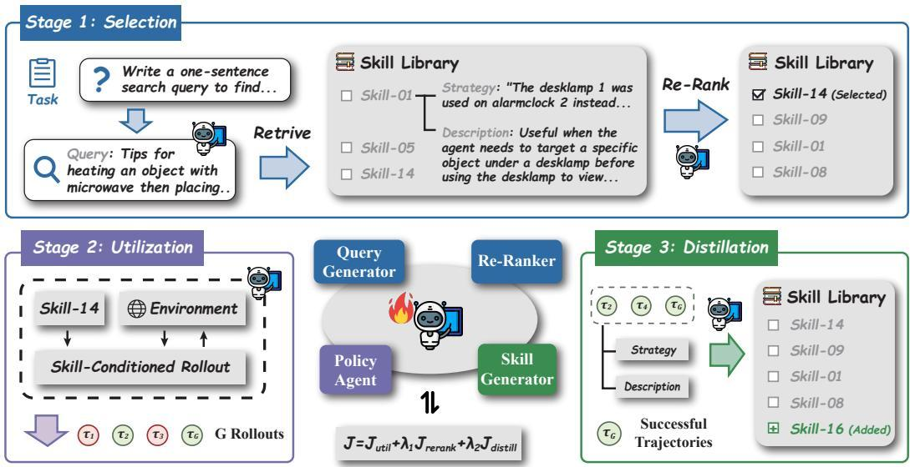
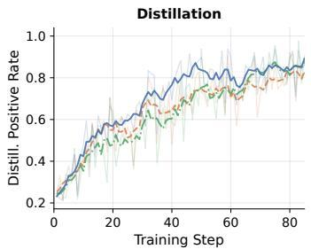
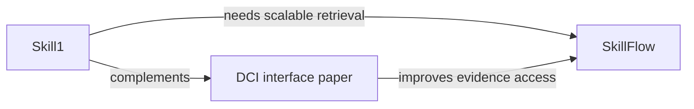

# Skill1: Unified Evolution of Skill-Augmented Agents via Reinforcement Learning — 深度分析报告

## 1. 执行摘要与可视化总览

- 分析立场：按“可复核证据优先”原则，重点审计作者关于“统一优化三阶段能力”的强声明是否成立。
- 决策背景：用于判断 Skill-based agent 训练范式是否应从“模块分离优化”迁移到“单策略统一优化”。
- 最终判断：
  1) Skill1 在 ALFWorld/WebShop 上表现领先，并且优势在消融中可部分归因到 selection/rerank/distill 三信号耦合训练 [Table 1][Table 2][Section 4.3][8][9][13][14]；
  2) 但其证据边界清晰：环境覆盖窄（主要文本环境）且库规模上限 5000，成本随库增长抬升 [Section 5][Table 3][8][9]。
- 忙碌读者一句话：这是一个“把 selection + utilization + distillation 放进同一 RL 目标”的强工程论文，效果真有提升，但可扩展性和跨环境泛化仍未被证明 [Eq. 11][Table 1][Section 5][2][13]。

### 1.1 引用映射表（对应 `paper.references.md`）

| 报告内文献锚点 | `paper.references.md` 对应条目（按出现顺序） |
|---|---|
| [1] | Richard S Sutton and Andrew G Barto. *Reinforcement Learning: An Introduction*. |
| [2] | John Schulman et al. *Proximal policy optimization algorithms*. |
| [8] | Mohit Shridhar et al. *ALFWorld*. |
| [9] | Shunyu Yao et al. *WebShop*. |
| [12] | Andrew Zhao et al. *ExpeL*. |
| [13] | Peng Xia et al. *SkillRL*. |
| [14] | Xiaoying Zhang et al. *RetroAgent*. |
| [27] | Noah Shinn et al. *Reflexion*. |
| [28] | Prateek Chhikara et al. *Mem0*. |
| [31] | Jiaqi Liu et al. *SimpleMem*. |

```mermaid
flowchart LR
  A[Task x] --> B[Query generation q]
  B --> C[Top-K retrieval by frozen encoder]
  C --> D[Policy rerank sigma]
  D --> E[Execute with selected skill z]
  E --> F[Distill s_new]
  F --> G[Update utility U(s)]
  G --> H[Joint objective update]
```

图注：Skill1 的单策略闭环。  
解读：关键不是“有 skill 库”，而是把 query/rerank/action/distill 都纳入同一参数化策略并联合更新 [Section 3.1][Section 3.3]。



图注：论文主框架图。  
解读：作者明确声明所有学习信号源自同一任务回报 $r(\tau)$，避免多奖励源冲突 [Figure 2][Section 3.2]。



图注：三能力训练动态对比图。  
解读：移除 selection / distillation 信号会连带拖慢其它能力，支持“耦合演化”叙述 [Figure 3][Section 4.3.2]。

---

## 2. 问题定义（本质 + 形式化）

### 2.1 问题本质

- 一句话问题：如何让 LLM agent 的技能选择、技能使用、技能沉淀同时变好，而不是各自为政。
- 重要性：若三阶段不同步优化，会出现“会做但选错 skill”或“会选但不会沉淀”的系统瓶颈 [Section 1]。
- 旧方法根因：常见做法只优化 lifecycle 子集，或给不同阶段不同奖励，导致目标不一致 [Section 1]。
- 真瓶颈：跨时间尺度 credit assignment（episode 内使用 vs episode 间选择 vs 长期蒸馏） [Section 3.2]。
- 适用边界：当前证据主要在 ALFWorld/WebShop，尚未覆盖视觉和更开放环境 [Section 5]。

### 2.2 形式化定义

- 任务类型：部分可观测决策与策略优化（POMDP）[Section 2]。
- 输入：任务指令 $x$、环境状态、技能库 $\mathcal{B}$。
- 输出：轨迹 $\tau=(q,z,a_{1:T},s_{new})$ 与任务结果。
- 核心目标：

$$
\max_{\theta} \; \mathbb{E}_{x\sim\mathcal D,\tau\sim\pi_\theta(\cdot|x)}[r(\tau)] \tag{1}
$$

- 关键奖励分解：
  - 使用奖励：$R_i^{util}=r(\tau_i)$ [Eq. 4]
  - 选择趋势奖励（基于 $U(s)$ / NDCG）：[Eq. 5][Eq. 6]
  - 蒸馏增量奖励：$R_i^{distill}=r(\tau_i)-\hat U_i$ [Eq. 7]
- 联合目标：

$$
\mathcal J(\theta)=\mathcal J^{util}(\theta)+\lambda_1\mathcal J^{rerank}(\theta)+\lambda_2\mathcal J^{distill}(\theta) \tag{11}
$$

符号说明（节选）：

| Symbol | Meaning | Notes |
|---|---|---|
| $\mathcal B$ | skill library | 持久技能库 |
| $U(s)$ | skill utility EMA | 用于 trend credit [Eq. 5] |
| $\hat U_i$ | top skill utility baseline | distillation baseline [Eq. 7] |
| $\lambda_1,\lambda_2$ | auxiliary weights | rerank/distill 权重 [Eq. 11] |

---

## 3. 方法机制与实验可信度

### 3.1 方法机制（去营销）

1. 生成 query 检索候选 skill（冻结编码器做 top-K）[Eq. 3][Section 3.1]。  
2. 同一策略模型对候选重排，选 top-1 skill 进入执行 [Section 3.1]。  
3. 按选中 skill 执行多步交互拿到任务结果 [Eq. 2][Section 3.1]。  
4. 从轨迹反思并蒸馏新 skill，成功轨迹才入库 [Section 3.1]。  
5. 用单一任务回报分解出三类 credit，做一次联合更新 [Section 3.2][Eq. 11]。

创新与重组区分：
- 真创新：单一 outcome 信号下的 trend/variation credit 分解 + 三阶段统一训练目标 [Section 3.2][Eq. 5-7][Eq. 11]。
- 工程重组：检索 top-K、GRPO、skill 库管理等模块本身非全新 [Section 2][Appendix B]。

### 3.2 实验可信度

| 审计维度 | 结论 | 证据锚点 |
|---|---|---|
| 基线强度 | 中-高，覆盖 training-free / RL w/o skill / RL w skill | [Table 1][Section 4.1] |
| 公平性 | 论文声称同 base model 和可比预算，但部分 baseline 借用外部结果 | [Section 4.1][Section 4.2] |
| 统计性 | 有 3 seeds 与 Welch t-test | [Appendix D][Figure 7] |
| 成本报告 | 有 wall-clock 与库规模曲线 | [Table 3][Section 4.3.5] |
| 外部效度 | 有限，仅文本环境两套基准 | [Section 5] |

公平性审计结论：**部分可验证，部分未知**。尤其“借用他文结果”的基线，调参与预算一致性无法完全复核，应标记为“公平性未知（部分）” [Section 4.1]。

---

## 4. 结果核验、边界与反包装审计

### 4.1 强声明核验

| Claim ID | 强声明 | Verdict | 量化证据 | 锚点 |
|---|---|---|---|---|
| C1 | Skill1 在主任务上 SOTA | Supported | ALFWorld Avg 97.5，较 RetroAgent +2.6；WebShop Succ 82.9 | [Table 1][Section 4.2] |
| C2 | 三能力“协同演化”成立 | Partial | 去掉 $\lambda_1/\lambda_2$ 性能下降；动态曲线联动 | [Table 2][Figure 3][Section 4.3] |
| C3 | unified signal 优于分离信号 | Partial | 对比 SkillRL/RetroAgent 有优势，但因实现/来源异质，因果强度有限 | [Table 1][Section 4.2] |

### 4.2 失败模式与边界

| Failure Scenario | Trigger | Behavior | Impact | Anchor |
|---|---|---|---|---|
| 环境迁移风险 | 超出 ALFWorld/WebShop 分布 | 泛化不明 | 真实部署不确定 | [Section 5] |
| 库规模压力 | 任务多样性继续增大 | 触顶 5000，检索上下文变长 | 时延上升 | [Table 3][Section 4.3.5] |
| 无 distillation 压缩 | 直接存原始轨迹 | 库膨胀更快，成本恶化 | 训练变慢 | [Table 3][Section 4.3.5] |

### 4.3 反包装审计（Anti-packaging）

- 包装语句 1：“统一演化证明三阶段相互促进。”  
  - 审计：**部分成立**。有消融和动态证据，但尚缺更广环境/更强独立复现实验 [Figure 3][Section 4.3.2]。
- 包装语句 2：“selection 信号是关键。”  
  - 审计：成立。去掉 selection 相关配置，性能明显下滑（Avg 97.5→91.8 或更低）[Table 2]。
- 包装语句 3：“成本仅中等增加。”  
  - 审计：条件成立。在给定环境下约 $1.3\sim1.7\times$ GRPO；更大库下趋势可能继续恶化 [Table 3][Section 4.3.5]。

去包装后结论：Skill1 的核心价值在于**统一 credit 机制**而非“有 memory 库”本身；其性能优势可信，但部署价值强依赖库增长控制与任务域稳定性。

---

## 5. 跨论文影响、检索推荐与行动建议

### 5.1 跨论文影响分析

| Related paper path | 引用说明 | Relation | 影响判断 |
|---|---|---|---|
| papers/agentic_ai/Beyond Semantic Similarity Rethinking Retrieval for Agentic Search via Direct Corpus Interaction | 跨目录本地制品（见对应目录 `paper.md` / `paper.report.md`） | orthogonal + complementary | Skill1 优化“策略-技能生命周期”；DCI 优化“语料交互接口分辨率”。二者可组合为“高分辨检索 + 统一技能进化”架构。 |
| papers/agentic_ai/SkillFlow Scalable and Efficient Agent Skill Retrieval System | 跨目录本地制品（见对应目录 `paper.md` / `paper.report.md`） | confirm/extend | SkillFlow偏系统级检索效率，Skill1偏训练信号统一；若结合可缓和 Skill1 库增长带来的时延。 |



图注：Skill1 与检索接口/系统工程论文的互补关系。  
解读：Skill1 当前主要在“训练信号”层面创新，后续上限将受检索接口与系统扩展性约束。

### 5.2 受影响旧报告

| Impacted report path | Change type | Statement updated | Status |
|---|---|---|---|
| papers/agentic_ai/SkillFlow Scalable and Efficient Agent Skill Retrieval System/paper.report.md | minor patch | 在"跨论文联想补充"节追加：训练期 credit 统一可改变检索请求分布与技能质量，索引结构优化需与训练演化协同 | ✅ 已完成（2026-05-12） |
| papers/agentic_ai/Beyond Semantic Similarity Rethinking Retrieval for Agentic Search via Direct Corpus Interaction/paper.report.md | minor patch | 在 5.1 表格 Skill1 行追加：策略学习范式是与检索接口并列的独立瓶颈，二者为并列约束而非替代关系 | ✅ 已完成（2026-05-12） |

### 5.3 推荐阅读（四类覆盖）

#### 5.3.1 检索关键词与日志

- 问题关键词：skill-augmented agents, co-evolution, policy credit assignment
- 方法关键词：GRPO, rerank reward, distillation reward, utility EMA
- 约束关键词：library scalability, training cost, long-horizon agent
- 基线关键词：RetroAgent, SkillRL, SimpleMem

| 数据源 | 查询语句 | 时间过滤 | 命中估算 |
|---|---|---|---|
| Google Scholar | "skill-augmented reinforcement learning agent" "credit assignment" | 近2年 | ~100+ |
| Google Scholar | "RetroAgent" "SkillRL" comparison | 不限 | ~30+ |
| DBLP | agent skills reinforcement learning retrieval | 近2年 | ~50+ |

#### 5.3.2 阅读清单

| 类别 | 论文 | 文献锚点 | 推荐理由 |
|---|---|---|---|
| (a) 近2年同类问题 | RetroAgent | [14] | 对照 unified vs dual intrinsic 的关键基线。 |
| (a) 近2年同类问题 | SkillRL | [13] | 对照冻结选择器与递归技能演化。 |
| (b) 本文基线论文 | PPO | [2] | 经典 RL 对照，帮助辨析改进来源。 |
| (b) 本文基线论文 | RL 基础教材 | [1] | 用于解释策略优化与信用分配背景。 |
| (c) 被本文改进对象 | ExpeL | [12] | 经验蒸馏范式，被统一训练部分吸收。 |
| (c) 被本文改进对象 | Mem0 | [28] | 记忆系统基线，对比 skill库演化。 |
| (d) 被本文批评/局限关联 | SimpleMem（效率导向） | [31] | 仅做记忆效率优化不足以覆盖全生命周期协同。 |
| (d) 被本文批评/局限关联 | Reflexion（反思导向） | [27] | 说明仅靠反思机制仍可能缺少统一优化目标。 |

### 5.4 可执行建议

- 立即采用：把 Skill1 的 reward decomposition 作为训练框架候选（先在单域验证）。
- 小规模实验：固定检索系统，比较 unified vs separated signal 的 learning curve 与失败样例。
- 暂缓事项：跨模态/大规模开放环境部署，待库扩展策略（层次化/分桶）验证后再推进。

---

## 附录 A：参考文献锚点映射（以 `paper.references.md` 为准）

> 说明：本报告的 `[n]` 文献锚点均按 `paper.references.md` 的条目顺序编号，不在本报告重复抄录完整参考文献。

| 文献锚点 | 对应条目关键词 |
|---|---|
| [1] | Reinforcement Learning: An Introduction |
| [2] | Proximal Policy Optimization Algorithms |
| [8] | ALFWorld |
| [9] | WebShop |
| [12] | ExpeL |
| [13] | SkillRL |
| [14] | RetroAgent |
| [27] | Reflexion |
| [28] | Mem0 |
| [31] | SimpleMem |

## 附录 B：元数据

- 标题：Skill1: Unified Evolution of Skill-Augmented Agents via Reinforcement Learning
- 本地路径：papers/agentic_ai/Skill1 Unified Evolution of Skill-Augmented Agents via Reinforcement Learning
- 分析日期：2026-05-12
- 分析阶段：paper-analyst only
