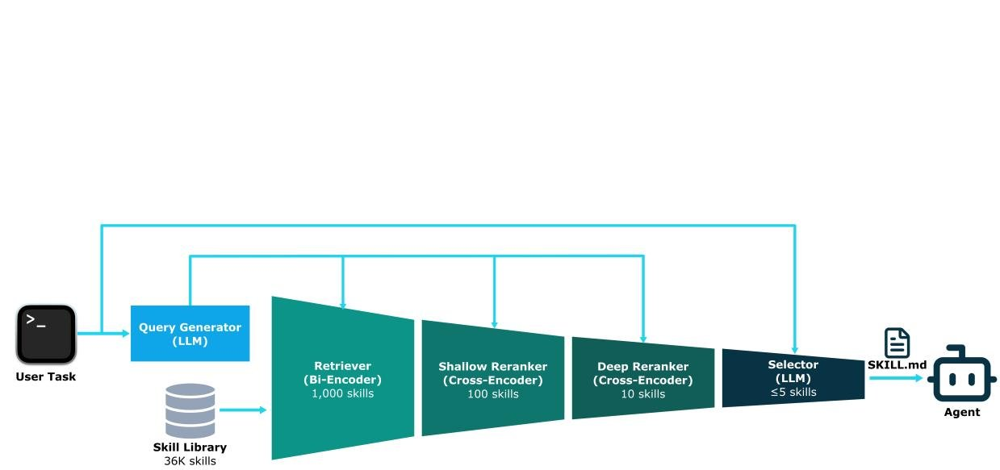
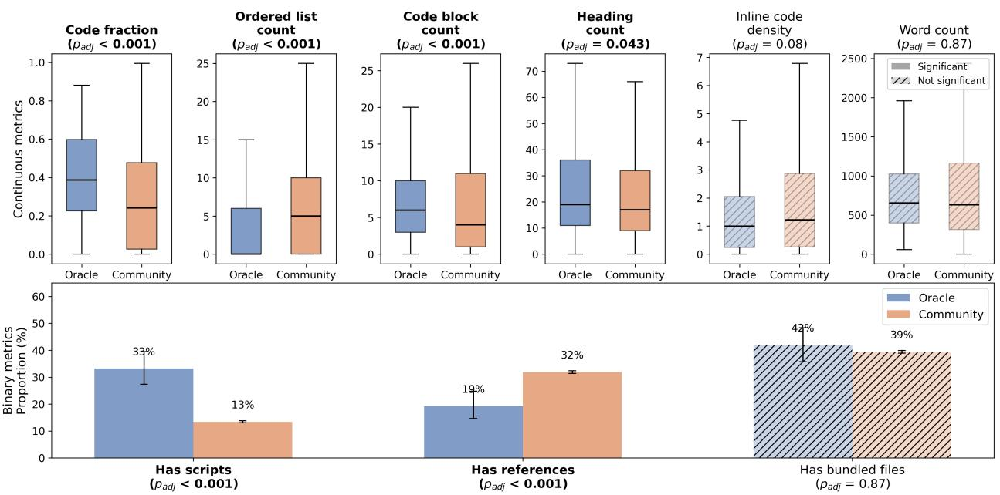
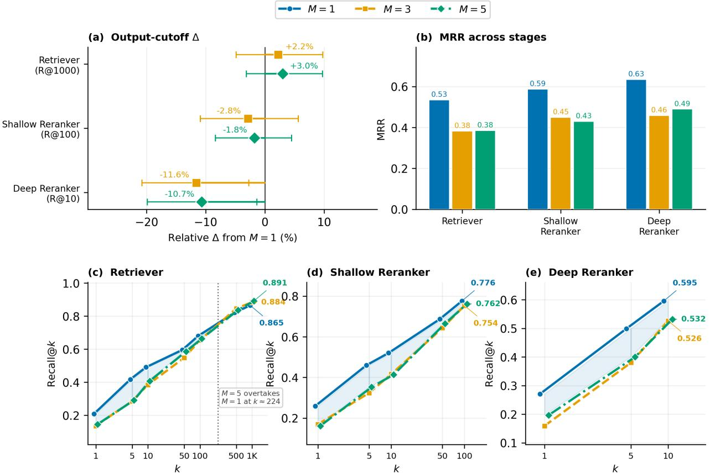
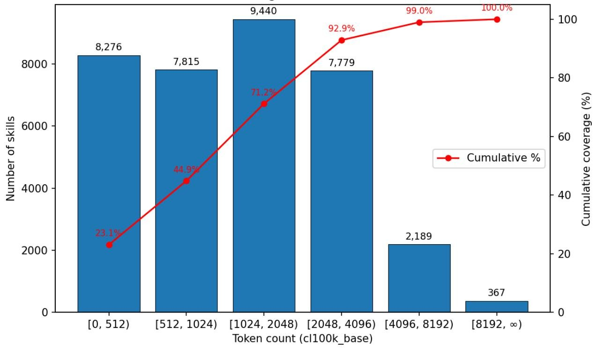

# SkillFlow: Scalable and Efficient Agent Skill Retrieval System

Fangzhou Li $^ { 1 , 2 }$ ,∗ Pagkratios Tagkopoulos1,2,3, $^ *$ Ilias Tagkopoulos $^ { 1 , 2 }$ $^ { 1 }$ University of California, Davis $2$ USDA/NSF AI Institute for Next Generation Food Systems $^ 3$ Process Integration and Predictive Analytics {fzli@ucdavis.edu, ptagkopoulos@ucdavis.edu, itagkopoulos@ucdavis.edu}

∗Equal contribution.

# Abstract

AI agents can extend their capabilities at inference time by loading reusable skills into context, yet equipping an agent with too many skills—particularly irrelevant ones—degrades performance. As community-driven skill repositories grow, agents need a way to selectively retrieve only the most relevant skills from a large library. We present SkillFlow, the first multi-stage retrieval pipeline designed for agent skill discovery, framing skill acquisition as an information retrieval problem over a corpus of $\mathrm { \sim 3 6 K }$ community-contributed SKILL.md definitions indexed from GitHub. The pipeline progressively narrows a large candidate set through four stages—dense retrieval, two rounds of cross-encoder reranking, and LLM-based selection—balancing recall and precision at each stage. We evaluate SkillFlow on two coding benchmarks: SkillsBench, a benchmark of 87 tasks and 229 matched skills; and Terminal-Bench, a benchmark that provides only 89 tasks, and no matched skills. On SkillsBench, SkillFlow-retrieved skills raise Pass@1 from $9 . 2 \%$ to $1 6 . 4 \%$ $\cdot + 7 8 . 3 \%$ , $p _ { \mathrm { a d j } } = 3 . 6 4 \times 1 0 ^ { - 2 } ,$ ), reaching $8 4 . 1 \%$ of the oracle ceiling, while on Terminal-Bench, agents readily use the retrieved skills (70.1% use rate) yet show no performance gain, revealing that retrieval alone is insufficient when the corpus lacks high-quality, executable skills for the target domain. SkillFlow demonstrates that framing skill acquisition as an information retrieval task is an effective strategy, and that the practical impact of skill-augmented agents hinges on corpus coverage and skill quality—particularly the density of runnable code and bundled artifacts.1

# 1 Introduction

AI agents—systems that perceive their environment and act autonomously to achieve specific goals [Wooldridge and Jennings, 1995, Russell and Norvig, 2016, Franklin and Graesser, 1997]—have been a long-standing pursuit, from ancient automata [De Solla Price, 1964] to the intelligent agent programs of the 1990s and today’s large language model (LLM) based agents [Durante et al., 2024]. LLMs have dramatically expanded what agents can do, enabling them to reason over complex environments, generate and execute code, and solve multi-step tasks that were previously out of reach.

Despite these advances, agents today are typically equipped with a fixed set of capabilities, and the question of how they acquire and integrate new ones remains largely open. Agent Skills, introduced by Anthropic [Anthropic, 2025], handles this by defining a standardized format (SKILL.md) for encoding reusable procedural knowledge. The convention has been widely adopted by the open-source community, with a rapidly growing number of skill definitions shared across repositories on GitHub.

  
Figure 1: Overview of the SkillFlow pipeline. A user task is passed to an agent, which invokes SkillFlow to retrieve relevant skills from a library of 36K community-contributed skill definitions. The pipeline progressively narrows the candidate set through four stages: a bi-encoder retriever (1K skill candidates), a shallow cross-encoder reranker (100), a deep cross-encoder reranker (10), and an LLM-based selector ( $\leq$ 5 skills). Retrieved skills are returned to the agent to augment task execution.

However, agents must load skills into their context at inference time, and equipping them with too many skills—particularly irrelevant ones—degrades both accuracy and efficiency [Li et al., 2026, Gao, 2026]. Simply pre-loading all available skills is therefore impractical. What is needed is a mechanism that can selectively retrieve only the most relevant skills from a large and growing library.

In this work, we address this retrieval challenge and present SkillFlow, a multi-stage pipeline that, given a task description, efficiently identifies and retrieves relevant skills from a large library of community-contributed skill definitions. The pipeline consists of four stages—dense retrieval, shallow reranking, deep reranking, and final selection (Figure 1)—each progressively refining the candidate set to balance recall and precision. We evaluate SkillFlow on two coding benchmarks: on SkillsBench, retrieved skills raise Pass@1 from $9 . 2 \%$ to $1 6 . 4 \%$ $+ 7 8 . 3 \%$ , $p _ { \mathrm { a d j } } = 3 . 6 4 \times 1 0 ^ { - 2 } ,$ ), reaching $8 4 . 1 \%$ of the oracle ceiling. On Terminal-Bench, however, agents readily adopt retrieved skills $7 0 . 1 \%$ use rate) yet show no performance gain, revealing that retrieval alone is insufficient when the corpus lacks high-quality skills for the target domain. This contrast suggests that the primary factor limiting skill-augmented agents is not retrieval but the quality and coverage of the underlying skill library.

Our contributions are as follows:

1. To the best of our knowledge, this is the first work to frame agent skill acquisition as an information retrieval problem. We propose a multi-stage retrieval pipeline (dense retrieval shallow reranking $\longrightarrow$ deep reranking selection) that progressively narrows a large candidate set while maintaining high recall. 2. We construct an openly available skill library by indexing $\sim$ 36K community-contributed SKILL.md files from GitHub, providing a reusable resource for skill-augmented agents. 3. We evaluate SkillFlow on two benchmarks and, through a contrasting null result on Terminal-Bench, demonstrate that skill library quality, and not retrieval, is the primary bottleneck for skill-augmented agents. A structural comparison of 229 oracle skills against 35K communityauthored skills identifies the gap precisely: oracle skills contain significantly more executable code $\mathit { p } _ { \mathrm { a d j } } = 2 . 8 3 \times 1 0 ^ { - 1 2 }$ ) and are three times more likely to bundle runnable scripts ( $p _ { \mathrm { a d j } } =$ $2 . 8 3 \times 1 0 ^ { - 1 7 }$ ), while length and documentation volume do not differ. These findings translate directly into measurable authoring guidelines about skill contribution and retrieval.

# 2 Related Work

Skill Acquisition and Tool Discovery. LLM agents increasingly leverage external capabilities at inference time, but the mechanisms for discovering and selecting those capabilities vary widely. VOYAGER [Wang et al., 2023] synthesizes new skills during open-ended exploration and stores them in a growing library, retrieving relevant ones via embedding similarity—though its library is self-generated and task-specific rather than drawn from a shared community corpus. On the tool-calling side, Toolformer [Schick et al., 2023] learns to insert API calls via self-supervision, Gorilla [Patil et al., 2024] pairs retrieval-aware fine-tuning with a large API corpus, ToolLLM [Qin et al., 2024] scales tool selection to over 16K APIs, and Chen et al. [2025] improve functioncalling accuracy through prompt format strategies. These systems retrieve atomic API signatures, whereas SkillFlow retrieves higher-level procedural knowledge—structured SKILL.md bundles that may include multi-step instructions, executable scripts, and contextual references. Agent Skills, introduced by Anthropic [Anthropic, 2025], formalized this bundle format, and a rapidly growing open-source ecosystem now hosts tens of thousands of community-contributed definitions. Despite this growth, existing skill-augmented agents either assume a small, manually curated skill set or rely on brute-force enumeration. Scalable retrieval over a large, heterogeneous skill library has not been addressed, which is the gap SkillFlow fills.

Multi-Stage Retrieval and Reranking. Retrieval-augmented generation conditions language models on documents retrieved from an external corpus [Lewis et al., 2020]. The retrieval component has evolved from sparse methods like BM25 [Robertson and Zaragoza, 2009] to dense bi-encoders [Karpukhin et al., 2020], with cross-encoder rerankers providing a second stage that trades throughput for accuracy [Nogueira and Cho, 2019, Nogueira et al., 2019]. SkillFlow adopts this multi-stage architecture but operates over structured skill definitions—documents that mix natural-language descriptions with YAML metadata and embedded code—rather than homogeneous text passages. For query formulation, HyDE [Gao et al., 2023] generates hypothetical documents as dense-retrieval proxies. SkillFlow’s query generation step is conceptually related but produces explicit, facet-focused search queries that decompose a task into retrievable sub-problems. RAPTOR [Sarthi et al., 2024] uses recursive summarization to handle long documents. Skill definitions are short enough that flat retrieval suffices in our setting. On the reranking side, RepLLaMA and RankLLaMA [Ma et al., 2024] achieve strong accuracy by initializing retrievers and listwise rerankers from large language models, at considerable inference cost. SkillFlow instead uses smaller cross-encoders in a two-tier cascade—shallow over truncated content, deep over full content—keeping end-to-end latency practical for interactive agent workflows.

Agent Benchmarks. SWE-bench [Jimenez et al., 2024] tests agents on real-world GitHub issues but does not evaluate skill retrieval, as tasks are self-contained. SkillsBench [Li et al., 2026] is purpose-built for skill-augmented evaluation: each task is paired with curated, known-relevant skills, making it uniquely suited to measure both retrieval quality and its downstream effect on task completion. Terminal-Bench [Merrill et al., 2026] provides terminal-based coding tasks without such skill annotations, serving as a complementary probe for whether retrieved skills generalize to domains not covered by the skill library. We evaluate on both to test SkillFlow under favorable (oracle skills exist) and unfavorable (corpus may lack coverage) conditions.

# 3 SkillFlow

Given a task description $t$ and a skill library $\boldsymbol { S }$ of $N$ skills, the goal is to return a small subset $S ^ { * } \subset S$ of the most relevant skills under a latency budget compatible with interactive agent use. SkillFlow tackles this by progressively narrowing a large candidate set through four stages—dense retrieval, shallow reranking, deep reranking, and final selection—each refining the candidate skill set $\mathit { C _ { l } }$ (where $l$ denotes the stage) to balance recall and precision. Each stage $l$ retains the top $k _ { l }$ candidates from the previous stage’s output, with $k _ { 1 } \gg k _ { 2 } \gg k _ { 3 } \ge | S ^ { * } |$ . Specific values are tuned via ablation experiments (Sections A.4 to A.6).

Query Generation. For a given task $t$ , we use an LLM to generate natural language queries that decompose the task into its constituent technologies, tools, and domains. Each query targets a different abstraction layer—core problem domain, programming language or framework, specific libraries, and supporting tools—so that the spipeline stage generates its own query set $\mathcal { Q } ^ { ( l ) } = \{ q _ { 1 } ^ { ( l ) } , \dots , q _ { M _ { l } } ^ { ( l ) } \}$ the skills an agent would need. Each with an independently configured query count and, when , an aggregation strategy to combine per-query scores (e.g., mean, max, or reciprocal rank fusion). Full prompt templates and examples are provided in Section A.2.

Dense Retrieval. Given a skill library $\boldsymbol { S } = \left\{ s _ { 1 } , s _ { 2 } , \ldots , s _ { N } \right\}$ (Section 4.1), each skill description is precomputed into a $d$ -dimensional dense embedding $\mathbf { e } _ { i } = \mathrm { E n c } ( s _ { i } ) \in \mathbb { R } ^ { d }$ using a bi-encoder, where $d$ is determined by the encoder model. The first stage takes each query $q _ { j } ^ { ( 1 ) } \in \mathcal { Q } ^ { ( 1 ) }$ and retrieves candidate skills by computing the cosine similarity between the query embedding ${ \bf e } _ { q _ { j } } = \mathrm { E n c } ( q _ { j } ^ { ( 1 ) } )$ and each skill embedding $\mathbf { e } _ { i }$ :

$$
\mathrm { s i m } ( q _ { j } ^ { ( 1 ) } , s _ { i } ) = \frac { \mathbf { e } _ { q _ { j } } \cdot \mathbf { e } _ { i } } { \lVert \mathbf { e } _ { q _ { j } } \rVert \lVert \mathbf { e } _ { i } \rVert } .
$$

This stage prioritizes recall, ensuring that a broad set of potentially relevant skills is retrieved for further processing. The per-query result lists are then aggregated and deduplicated to form the first candidate set $\mathcal { C } _ { 1 }$ of at most $k _ { 1 }$ skills. The aggregation strategy (e.g., union of top results per query, score fusion) is configurable (Section A.4).

Shallow Reranking. We apply a lightweight cross-encoder model CEshallow to rerank the candidate skills in $\mathcal { C } _ { 1 }$ . For each query $q _ { j } ^ { ( 2 ) } \in \mathcal { Q } ^ { ( 2 ) }$ and candidate skill, the model concatenates the query with the skill content truncated to $L _ { \mathrm { s h a l l o w } }$ tokens:

$$
r _ { \mathrm { s h a l l o w } } ( q _ { j } ^ { ( 2 ) } , s _ { i } ) = \mathrm { C E } _ { \mathrm { s h a l l o w } } \big ( [ q _ { j } ^ { ( 2 ) } ; \mathrm { t r u n c } ( s _ { i } , L _ { \mathrm { s h a l l o w } } ) ] \big ) .
$$

When $M _ { 2 } > 1$ , per-query scores are aggregated into a single ranking per skill (Section A.5). The top- $k _ { 2 }$ candidates are retained:

$$
\mathcal { C } _ { 2 } = \mathrm { t o p  – k _ { 2 } } ( \mathcal { C } _ { 1 } , r _ { \mathrm { s h a l l o w } } ) .
$$

Deep Reranking. Scoring all $| { \mathcal { C } } _ { 1 } |$ candidates against full skill content is prohibitively expensive. The shallow reranker first reduces the candidate set, making full-content scoring tractable on the smaller set $\mathcal { C } _ { 2 }$ . The deep reranking stage employs a heavier cross-encoder $\mathrm { C E _ { d e e p } }$ that attends to

skill content truncated at a much larger limit $L _ { \mathrm { d e e p } } \gg L _ { \mathrm { s h a l l o w } }$ , enabling a more thorough evaluation of relevance:

$$
r _ { \mathrm { d e e p } } ( q _ { j } ^ { ( 3 ) } , s _ { i } ) = \mathrm { C E } _ { \mathrm { d e e p } } \big ( [ q _ { j } ^ { ( 3 ) } ; \mathrm { t r u n c } ( s _ { i } , L _ { \mathrm { d e e p } } ) ] \big ) .
$$

The top- $k _ { 3 }$ candidates are retained:

$$
\mathcal { C } _ { 3 } = \mathrm { t o p  – k } _ { 3 } ( \mathcal { C } _ { 2 } , r _ { \mathrm { d e e p } } ) .
$$

Final Selection. The final stage uses an LLM-based filter $f _ { \mathrm { s e l e c t } }$ that evaluates each candidate in $\mathcal { C } _ { 3 }$ for relevancy—whether the skill is topically relevant to the task $t$ —and retains only those that pass:

$$
\begin{array} { r } { S ^ { * } = f _ { \mathrm { s e l e c t } } ( t , \mathcal { C } _ { 3 } ) , \quad | S ^ { * } | \leq | \mathcal { C } _ { 3 } | . } \end{array}
$$

Unlike the previous stages, which output a fixed number of candidates, the selector outputs a variable number of skills $\left| S ^ { * } \right|$ . Optionally, a second specificity filter can be chained to further assess whether surviving skills provide actionable, domain-specific guidance beyond what the agent can derive from its training data (Section A.6).

# 4 Experiments and Results

# 4.1 Datasets

Skill Library. We construct a skill library by collecting skills from SkillsMP, an open marketplace of community-contributed agent skills. Skills are enumerated via the SkillsMP API. For each skill, the associated GitHub repository is downloaded and only those containing a valid SKILL.md file are retained. The final library contains 35,866 skills. Each skill entry includes a name, a natural language description, and associated metadata. The full skill descriptions are embedded using an encoder-based embedding model to support dense retrieval. Details of the crawling pipeline and corpus statistics are provided in Section A.1.

SkillsBench. SkillsBench [Li et al., 2026] is a benchmark of 87 tasks, each paired with one or more human-authored oracle skills—curated skill definitions known to be relevant to the task (229 total). Skills are co-authored alongside tasks by domain experts and validated through automated checks and human review, establishing topical relevance—the skills address the right domain and techniques—though not guaranteed benefit on every task-agent combination. We treat these pairings as retrieval ground truth by injecting the oracle skills into the Skill Library and measuring whether SkillFlow can recover them (Experiments 1, 2, and 3).

Terminal-Bench. Terminal-Bench [Merrill et al., 2026] is a benchmark of terminal-based coding tasks. It consists of 89 tasks that test an agent’s ability to perform operations in a terminal environment. Unlike SkillsBench, Terminal-Bench does not provide oracle skill assignments, so we use it for end-to-end evaluation only (Experiments 1 and 2).

# 4.2 Settings

For query generation (Section A.2), we use OpenAI gpt-4o-mini [Hurst et al., 2024]. The dense retriever generates $M _ { 1 }$ =5 queries per task and uses Hugging Face BAAI/bge-base-en-v1.5 [Xiao et al., 2024] as the bi-encoder, retrieving the top $k _ { 1 } = 1 0 0 0$ candidates in total. The shallow reranker uses SBERT cross-encoder/ms-marco-MiniLM-L-6-v2 [Reimers and Gurevych, 2019] as a cross-encoder with $L _ { \mathrm { s h a l l o w } } = 5 1 2$ tokens and a single query ( $M _ { 2 }$ =1), retaining the top $k _ { 2 } = 1 0 0$ candidates. The deep reranker uses Hugging Face BAAI/bge-reranker-v2-m3 [Chen et al., 2024] as a cross-encoder with $L _ { \mathrm { d e e p } } = 4 0 9 6$ tokens, also with $M _ { 3 }$ =1, retaining the top $k _ { 3 } = 1 0$ candidates. The final selector uses OpenAI gpt-4o-mini [Hurst et al., 2024] to select up to 5 skills. For end-to-end benchmark evaluation, we use Codex CLI with OpenAI gpt-5-mini [Singh et al., 2025] with medium reasoning effort as the underlying agent model. We report results using the best-performing pipeline configuration. Additional experiments on key hyperparameters (e.g., $k$ values, query count $M$ , and model choices) are provided in Sections A.4 to A.6. For the benchmark harness, we rely on Harbor [Harbor Framework Team, 2026] with the Daytona Sandboxes cloud service. Except proprietary OpenAI models, all language model components in SkillFlow are run on an Nvidia RTX A5000 GPU.

Metrics. Each condition is run 3 times. For end-to-end evaluation (Experiments 1–2), we report Pass@k—the probability that at least one of $k$ attempts succeeds, estimated from the 3 runs via the unbiased combinatorial estimator [Chen et al., 2021]—and skill use rate (the fraction of tasks where the agent uses at least one retrieved skill). For retrieval evaluation (Experiment 3), we report recall $@ k$ (fraction of oracle skills in the top $k$ ), precision $@ k$ (fraction of top $k$ that are oracle skills), mean reciprocal rank (MRR, the reciprocal of the rank of the first oracle skill), and hit $@ k$ (fraction of tasks with at least one oracle skill in the top $k$ ), all averaged across tasks. All confidence intervals are $9 5 \%$ bootstrap (10,000 resamples over tasks). Pairwise significance is assessed via paired bootstrap tests. Reported $p _ { \mathrm { a d j } }$ values are Holm-Bonferroni corrected for multiple comparisons within each benchmark. Full statistical details are in Section A.3.

# 4.3 Experiment 1: Downstream Benchmark Performance

To evaluate end-to-end effectiveness, we measure whether skills retrieved by SkillFlow improve agent task completion. We benchmark on 65 SkillsBench tasks and 88 Terminal-Bench tasks after removing problematic tasks (see Section A.8 for details). Both benchmarks are evaluated under four conditions: (1) no skills, (2) Vercel skills (a third-party skill retrieval API; Section A.7), (3) SkillFlow-retrieved skills, and (4) oracle skills (SkillsBench only, as Terminal-Bench does not provide oracle assignments).

Downstream gains depend on skill library coverage. Table 1 summarizes the results. On SkillsBench, where oracle skills exist in the library, SkillFlow raises Pass $@ 1$ from 9.2% to $1 6 . 4 \%$ (+78.3%), a statistically significant improvement ( $\mathit { p } _ { \mathrm { a d j } } = 3 . 6 4 \times 1 0 ^ { - 2 }$ ; Cohen’s $h = 0 . 2 2$ , small effect), reaching $8 4 . 1 \%$ of the oracle ceiling (19.5%). Vercel shows no significant improvement (9.7%, $p _ { \mathrm { a d j } } \geq 0 . 0 5$ ). The trend holds at Pass $^ { ( \mathrm { a 3 } }$ , where SkillFlow reaches $2 9 . 2 \%$ compared to $1 6 . 9 \%$ baseline, $2 0 . 0 \%$ Vercel, and $3 5 . 4 \%$ oracle. Pass $\sim 3$ , which measures consistency (probability that all $k$ attempts succeed), remains low across all conditions—reflecting the inherent difficulty of these tasks—but follows the same ordering (SkillFlow $4 . 6 \%$ vs. baseline $0 . 0 \%$ ). Steps per task and cost per task remain comparable across all conditions and both benchmarks, with overlapping confidence intervals, indicating that the gains stem from skill quality rather than increased computation.

On Terminal-Bench, however, the no-skill baseline is already strong $\mathrm { P a s s @ 1 = 3 4 . 8 \% }$ , $\mathrm { P a s s @ 3 = }$ $4 6 . 6 \%$ ), and no condition produces a significant difference: neither SkillFlow $( 3 1 . 8 \%$ , $p _ { \mathrm { a d j } } \geq 0 . 0 5 ,$ ) nor Vercel (32.6%, $p _ { \mathrm { a d j } } \geq 0 . 0 5$ ) improve over it. This contrast—gains where oracle skills exist, none where the library lacks coverage—suggests that skill quality, not retrieval, is the primary bottleneck. Table 1 also reports a SkillFlow-specific variant with additional specificity filtering. We analyze this condition in Section 5.

Table 1: Benchmark performance comparison. Pass $@ k$ : probability of at least one success in $k$ independent attempts; Pass $\scriptstyle \hat { \mathbf { \xi } } \triangleq \mathbf { \zeta } _ { k }$ : probability that all $k$ attempts succeed. Oracle skills are the curated task-skill pairs provided by SkillsBench. $^ { * } p _ { \mathrm { a d j } } < 0 . 0 5$ vs. no skills baseline.   

<table><tr><td>Skillset</td><td>Pass@1</td><td>Pass@3</td><td>Pass^3</td><td>Steps/Task Cost/Task</td><td></td></tr><tr><td>SkillsBench</td><td></td><td></td><td></td><td></td><td></td></tr><tr><td>Oracle</td><td>19.5* [12.3, 27.2]</td><td>35.4 [24.6, 47.7]</td><td>6.2 [1.5,12.3]</td><td>20.1</td><td>$0.028</td></tr><tr><td>No Skills</td><td>9.2 [4.1, 14.9]</td><td>16.9 [7.7, 26.2]</td><td>0.0 [0.0, 0.0]</td><td>18.7</td><td>$0.026</td></tr><tr><td>Vercel</td><td>9.7 [4.6, 15.4]</td><td>20.0 [10.8, 30.8]</td><td>1.5 [0.0, 4.6]</td><td>20.9</td><td>$0.029</td></tr><tr><td>SkillFlow (Ours)</td><td>16.4* [9.7, 23.6]</td><td>29.2 [18.5, 40.0]</td><td>4.6 [0.0,10.8]</td><td>18.8</td><td>$0.025</td></tr><tr><td>Terminal-Bench</td><td></td><td></td><td></td><td></td><td></td></tr><tr><td>No Skills</td><td>34.8 [26.1, 43.6]</td><td>46.6 [36.4, 56.8]</td><td>20.5 [12.5,29.5]</td><td>21.1</td><td>$0.030</td></tr><tr><td>Vercel</td><td>32.6 [24.2, 41.3]</td><td>45.5 [35.2, 55.7]</td><td>21.6 [13.6, 30.7]</td><td>21.2</td><td>$0.031</td></tr><tr><td>SkillFlow (Ours)</td><td>31.8 [23.9, 40.2]</td><td>46.6 [36.4, 56.8]</td><td>17.0 [9.1, 25.0]</td><td>23.0</td><td>$0.034</td></tr><tr><td>SkillFlow-specific (Ours)t</td><td>34.9 [26.7, 43.2]</td><td>48.0 [37.8, 58.0]</td><td>21.0 [13.4, 29.0]</td><td>24.2</td><td>$0.035</td></tr></table>

†Terminal-Bench only; see §5 for analysis.

Characterizing the quality gap. To understand what distinguishes effective skills, we compare structural properties of 229 oracle skills (curated for SkillsBench tasks) against 35,866 communityauthored skills in the crawled corpus using automated proxy metrics (Figure 2). All $p$ -values are from two-sided Mann-Whitney $U$ tests, Holm-Bonferroni adjusted for 9 simultaneous comparisons. Oracle skills are not significantly longer than community skills (median 654 vs. 631 words, $p _ { \mathrm { a d j } } \geq 0 . 0 5$ ), nor do they differ significantly in inline code density ( $p _ { \mathrm { a d j } } \geq 0 . 0 5$ ). However, they devote a substantially larger fraction of their content to fenced code blocks (median code fraction 0.39 vs. 0.24, $p _ { \mathrm { a d j } } = 2 . 8 3 \times 1 0 ^ { - 1 2 } ,$ ) and contain more code blocks overall (median 6 vs. 4, $p _ { \mathrm { a d j } } = 8 . 9 7 \times 1 0 ^ { - 4 } ,$ ). Oracle skills also have more Markdown headings (median 19 vs. 17, $p _ { \mathrm { a d j } } = 4 . 3 3 \times 1 0 ^ { - 2 } \mathrm { , }$ ) and are three times more likely to bundle executable scripts alongside the SKILL.md $3 3 . 2 \%$ vs. $1 3 . 4 \%$ , $p _ { \mathrm { a d j } } = 2 . 8 3 \times 1 0 ^ { - 1 7 }$ ). Conversely, community skills contain more ordered-list items (median 5 vs. 0, $p _ { \mathrm { a d j } } = 4 . 0 5 \times 1 0 ^ { - 7 }$ ) and more supplementary reference documents $( 3 1 . 9 \%$ vs. $1 9 . 2 \%$ , $p _ { \mathrm { a d j } } = 2 . 4 7 \times 1 0 ^ { - 4 }$ ), implying a more procedural, text-heavy style. The presence of other bundled files does not differ between groups ( $p _ { \mathrm { a d j } } \geq 0 . 0 5$ ). These structural proxies indicate that what distinguishes effective skills is not length or documentation volume, but the density of runnable code and bundled artifacts.

# 4.4 Experiment 2: Skill Retrieval and Usage

To understand whether agents actually use retrieved skills, we compare SkillFlow against Vercel, a third-party skill retrieval API (Section A.7), measuring retrieval and skill use statistics across both benchmarks. For each task, each method retrieves skills from the library. The agent then decides which (if any) to load into its context. On SkillsBench, oracle task–skill pairs serve as relevancy ground truth. Terminal-Bench lacks such annotations.

SkillFlow achieves higher retrieval and use rates. Table 2 reports the results. On SkillsBench, SkillFlow retrieves $6 1 . 8 \%$ of oracle skills from the 36K library. This comparison is unavailable for Vercel, whose proprietary index does not include the SkillsBench oracle skills. Agents use SkillFlow skills at a $6 8 . 8 \%$ rate $\mathrm { \tilde { \rho } _ { a d j } } < 1 \times 1 0 ^ { - 6 }$ vs. Vercel) with an average of 2.8 skills retrieved per task— approaching the oracle use rate of $6 9 . 2 \%$ —indicating that the pipeline consistently surfaces skills the agent judges useful. On Terminal-Bench, SkillFlow retrieves skills for 87.5% of tasks compared to Vercel’s $9 0 . 9 \%$ , and agents use SkillFlow skills at a significantly higher rate (70.1% vs. $2 2 . 3 \%$ , $p _ { \mathrm { a d j } } < 1 \times 1 0 ^ { - 6 } ,$ ).

  
Figure 2: Structural proxy metrics: oracle ( $n { = } 2 2 9$ ) vs. community ( $_ { n = 3 5 , 8 6 6 }$ ) skills. Subplots sorted by significance. $p$ -values from two-sided Mann-Whitney $U$ tests, adjusted via Holm-Bonferroni. Hatched boxes/bars indicate non-significant differences ( $p _ { \mathrm { a d j } } \geq 0 . 0 5 $ ). Outliers suppressed for clarity.

To control for cardinality differences—Vercel retrieves a single skill per task while SkillFlow retrieves multiple—we include a SkillFlow top-1 variant that selects at most one skill. Even at matched cardinality, SkillFlow top-1 achieves a significantly higher use rate on both benchmarks (68.8% vs. $4 0 . 6 \%$ on SkillsBench; 72.7% vs. $2 2 . 3 \%$ on Terminal-Bench; both $p _ { \mathrm { a d j } } < 1 \times 1 0 ^ { - 6 }$ ). On SkillsBench, SkillFlow top-1 also retrieves $3 7 . 6 \%$ of oracle skills, confirming that the advantage stems from retrieval quality rather than the number of skills surfaced.

# 4.5 Experiment 3: Stage-Level Retrieval Performance

This experiment evaluates SkillFlow’s retrieval quality at each pipeline stage. We use the 229 oracle skills from the 87 SkillsBench tasks as retrieval ground truth and measure their overlap with SkillFlow’s output at each stage.

Each stage progressively improves ranking quality. Table 3 reports recall, precision, and MRR at various cut-offs for each stage of the pipeline. The dense retriever casts a wide net, achieving a recall $@ 1 0 0 0$ of 0.905 [0.85, 0.95] across the 229 oracle skill pairs. The shallow reranker compresses the candidate set from 1000 to 100 while improving both top-heavy recall and precision: R@1 rises from 0.174 to 0.259 $( + 4 8 . 9 \%$ ), $\mathrm { ?  @ 1 }$ from 0.379 to 0.494 ( $^ +$ 30.3%), and MRR from 0.487 to 0.587 $( + 2 0 . 5 \% )$ . The deep reranker further narrows the set to 10 candidates with marginal gains in R@1 (0.271) and $\mathrm { P @ 1 }$ (0.540), and a comparable MRR of 0.634, confirming that the supplementary context from full skill content provides modest but consistent improvements. Finally, the selector outputs at most 5 skills and achieves the highest P@1 (0.563), though R@5 drops to 0.455 due to the aggressive filtering. Overall, each successive stage trades breadth for precision, and the full pipeline retains roughly $4 5 . 5 \%$ of the oracle skills within its top-5 selections while maintaining high ranking quality throughout. Note that the $6 1 . 8 \%$ oracle retrieval rate reported in Table 2 measures a different quantity: it counts all oracle skills present anywhere in the full set of retrieved skills (up to 2.8 per task on average), whereas R@5 here is restricted to the selector’s top-5 output.

Table 2: Skill retrieval and agent use statistics. Tasks Retrieved: percentage of tasks for which $\geq 1$ skill was retrieved. Oracle Skills Retrieved: percentage of oracle skills retrieved from the library. Tasks Used: percentage of tasks where the agent used $\geq$ 1 retrieved skill. Vercel maintains its own proprietary skill index that does not include SkillsBench oracle skills. Terminal-Bench does not provide oracle skill assignments. $^ { * } p _ { \mathrm { a d j } } < 0 . 0 5$ ; $^ { * * } p _ { \mathrm { a d j } } < 0 . 0 1$ on Tasks Used vs. Vercel baseline.   

<table><tr><td></td><td>Condition Mean Skills Retrieved/Task Tasks Retrieved (%)Oracle Skills Retrieved (%）Tasks Used (%)</td><td></td><td></td><td></td></tr><tr><td colspan="5">SkillsBench</td></tr><tr><td>Oracle</td><td>2.5</td><td>100.0 [100.0,100.0]</td><td>100.0 [100.0,100.0]</td><td>69.2 [62.6, 75.9]</td></tr><tr><td>Vercel</td><td>0.9</td><td>87.5 [82.8, 92.2]</td><td></td><td>40.6 [33.9, 47.9]</td></tr><tr><td>SkillFlow top-1 (Ours)</td><td>0.9</td><td>91.7 [87.5, 95.3]</td><td>37.6 [32.4, 43.0]</td><td>68.8**[62.5,75.0]</td></tr><tr><td>SkillFlow (Ours)</td><td>2.8</td><td>92.2 [88.0, 95.8]</td><td>61.8 [56.5, 66.9]</td><td>68.8** [62.0,75.0]</td></tr><tr><td colspan="5">Terminal-Bench</td></tr><tr><td>Vercel</td><td>0.9</td><td>90.9 [87.1, 94.3]</td><td></td><td>22.3 [17.4, 27.7]</td></tr><tr><td>SkillFlow top-1 (Ours)</td><td>0.9</td><td>89.8 [86.0,93.2]</td><td></td><td>72.7** [67.4, 78.0]</td></tr><tr><td>SkillFlow (Ours)</td><td>1.5</td><td>87.5 [83.3, 91.3]</td><td></td><td>70.1**[64.4,75.4]</td></tr></table>

Table 3: Stage-level retrieval performance. Recall (R), precision (P), and mean reciprocal rank (MRR) across each stage of the SkillFlow retrieval pipeline. Inapplicable cells (where $k$ exceeds the stage output size) are marked with dashes. K output denotes the number of candidates produced by each stage.   

<table><tr><td>Stage</td><td>Koutput</td><td>Metric</td><td>@1</td><td>@5</td><td>@10</td><td>@50</td><td>@100</td><td>@500</td><td>@1000</td><td>MRR</td></tr><tr><td rowspan="2">Retriever</td><td rowspan="2">1000</td><td>R</td><td>0.174 [0.12, 0.24]</td><td>0.376 [0.30, 0.46]</td><td>0.469 [0.39,0.55]</td><td>0.603 [0.52,0.69]</td><td>0.670 [0.59, 0.75]</td><td>0.859 [0.80,0.91]</td><td>0.905 [0.85, 0.95]</td><td rowspan="2">0.487 [0.40,0.58]</td></tr><tr><td>P</td><td>0.379 [0.28, 0.48]</td><td>0.182 [0.14, 0.22]</td><td>0.122 [0.10, 0.15]</td><td>0.032 [0.03,0.04]</td><td>0.018 [0.02, 0.02]</td><td>0.005 [0.00,0.01]</td><td>0.002 [0.00, 0.00]</td></tr><tr><td rowspan="2">Shallow Reranker</td><td rowspan="2">100</td><td>R</td><td>0.259 [0.19,0.33]</td><td>0.460 [0.38, 0.55]</td><td>0.520 [0.43,0.61]</td><td>0.687 [0.61, 0.76]</td><td>0.776 [0.71, 0.84]</td><td></td><td></td><td rowspan="2">0.587 [0.50, 0.68]</td></tr><tr><td>P</td><td>0.494 [0.39, 0.60]</td><td>0.216 [0.18, 0.26]</td><td>0.130 [0.11, 0.16]</td><td>0.034 [0.03,0.04]</td><td>0.019 [0.02, 0.02]</td><td></td><td></td></tr><tr><td rowspan="2">Deep Reranker</td><td rowspan="2">10</td><td>R</td><td>0.271 [0.20, 0.34]</td><td>0.499 [0.42, 0.58]</td><td>0.595 [0.51, 0.68]</td><td></td><td></td><td></td><td></td><td rowspan="2">0.634 [0.54, 0.72]</td></tr><tr><td>P</td><td>0.540 [0.44, 0.64]</td><td>0.237 [0.20,0.28]</td><td>0.147 [0.12, 0.17]</td><td></td><td></td><td></td><td></td></tr><tr><td rowspan="2">Selector</td><td>≤5</td><td>R</td><td>0.273 [0.20, 0.34]</td><td>0.455 [0.38, 0.53]</td><td></td><td></td><td></td><td></td><td></td><td rowspan="2">0.639 [0.55, 0.73]</td></tr><tr><td></td><td>P</td><td>0.563 [0.46, 0.67]</td><td>0.221 [0.18, 0.26]</td><td></td><td></td><td></td><td></td><td></td></tr></table>

Stage Ablation. To quantify the contribution of each pipeline stage, we evaluate retrieval performance at successive pipeline depths, additionally comparing against BM25 sparse retrieval and a hybrid (RRF fusion of dense and BM25) baseline. Table 4 reports the results.

BM25 sparse retrieval performs poorly (MRR 0.266), confirming that lexical matching is insufficient for bridging the semantic gap between task descriptions and skill content. The RRF hybrid offers no improvement over dense retrieval alone (MRR 0.522 vs. 0.553), indicating that BM25’s weak signal dilutes rather than complements the dense retriever. Each reranking stage yields consistent gains: the shallow reranker improves MRR from 0.553 to 0.587 (+6.1%) and R@10 from 0.477 to 0.520 $( + 9 . 0 \% )$ , while the deep reranker with full skill content achieves the best MRR of 0.634 (+14.6% over dense-only) and $\mathrm { H i t @ 1 0 }$ of 0.793, demonstrating that progressive refinement is more effective than alternative first-stage retrieval methods.

Table 4: Stage-ablation retrieval metrics on SkillsBench (87 tasks). MRR, R@10, P@10, and Hit@10 (fraction of tasks with $\geq 1$ oracle skill in top 10) reported. The first three rows compare retrieval methods. Subsequent rows add pipeline stages cumulatively.   

<table><tr><td>Pipeline</td><td>MRR</td><td>R@10</td><td>P@10</td><td>Hit@10</td></tr><tr><td colspan="5">First-stage alternatives</td></tr><tr><td>BM25 only</td><td>0.266 [0.19, 0.35]</td><td>0.238 [0.17, 0.32]</td><td>0.055 [0.04, 0.07]</td><td>0.391 [0.29, 0.49]</td></tr><tr><td>Hybrid (Dense + BM25)</td><td>0.522 [0.43, 0.61]</td><td>0.480 [0.40, 0.56]</td><td>0.114 [0.09, 0.14]</td><td>0.713 [0.61, 0.81]</td></tr><tr><td>Dense only</td><td>0.553 [0.46, 0.64]</td><td>0.477 [0.39, 0.56]</td><td>0.121 [0.10, 0.15]</td><td>0.713 [0.61, 0.81]</td></tr><tr><td colspan="5">Cumulative pipeline</td></tr><tr><td>+ Shallow reranker (1-2)</td><td>0.587 [0.50, 0.68]</td><td>0.520 [0.43, 0.61]</td><td>0.130 [0.11, 0.16]</td><td>0.724 [0.63, 0.82]</td></tr><tr><td>+ Deep reranker (1-3)</td><td>0.634 [0.54, 0.72]</td><td>0.595 [0.51, 0.68]（</td><td>0.147 [0.12, 0.17]</td><td>0.793 [0.70, 0.87]</td></tr></table>

Performance Impact of Query Generation. We evaluate the impact of the number of generated queries ( $M )$ on each stage of the pipeline. For each stage, we measure pass-through recall—the fraction of oracle skills retained at each stage’s output cutoff $\left( \mathrm { R @ } k _ { \mathrm { o u t p u t } } \right)$ : $\mathrm { R @ 1 0 0 0 }$ for the retriever, $\mathrm { R @ 1 0 0 }$ for the shallow reranker, and $\mathrm { R @ 1 0 }$ for the deep reranker. We use the best aggregation strategy per stage (union for the retriever, mean for the rerankers). Full aggregation comparisons are in Sections A.4 and A.5.

Figure 3 (panel a) shows the relative change in $\mathrm { R @ } k _ { \mathrm { o u t p u t } }$ when increasing $M$ from 1 to 3 or 5. Multi-query generation has opposing effects across stages: at the retriever, increasing $M$ improves pass-through recall $( + 2 . 2 \%$ for $M { = } 3$ , $+ 3 . 0 \%$ for $M$ =5), as diverse queries cast a wider net over the 36K-skill library. At the rerankers, however, multi-query scoring degrades performance: the shallow reranker drops by $- 2 . 8 \%$ ( $M$ =3) and $- 1 . 8 \%$ ( $M$ =5), while the deep reranker shows the largest drops ( $- 1 1 . 6 \%$ for $M { = } 3$ , $- 1 0 . 7 \%$ for $M { = } 5$ ). Especially, the deep reranker with $M$ =3 degrades significantly compared to the $M$ =1 baseline $p _ { \mathrm { a d j } } = 4 . 9 2 \times 1 0 ^ { - 2 }$ ).

Panel (b) shows mean reciprocal rank (MRR), which isolates top-heavy ranking quality. $M$ =1 achieves the highest MRR at every stage (0.534 retriever, 0.587 shallow reranker, 0.634 deep reranker), while $M { = } 5$ is consistently lower (0.384, 0.429, 0.489). Combining this result with that of panel (a), this confirms that on a small, already-filtered candidate set, a single focused query is sufficient for discrimination, and additional queries introduce noise that dilutes the relevance signal.

Figure 3 (panels c–e) provides further insight via $\mathrm { R @ } k$ curves across all cutoffs. At the retriever stage (panel c), the $M { = } 1$ curve dominates at small $k$ but is overtaken by $M { = } 5$ beyond $k { \approx } 2 2 4$ (dashed line), confirming that multi-query retrieval trades top-heavy precision for broader coverage. At the reranker stages, $M { = } 1$ consistently outperforms multi-query configurations across all $k$ , with the gap widening at the deep reranker where the candidate set is smallest. These results motivate our pipeline design: $M { = } 5$ for retrieval to maximize recall, and $M { = } 1$ for reranking to maximize ranking quality.

# 5 Discussion

SkillFlow enables scalable retrieval. The multi-stage pipeline efficiently trades breadth for precision: the dense retriever captures $9 0 . 5 \%$ of oracle skills across 36K candidates, the shallow reranker compresses the set by $1 0 \times$ while boosting R@1 by $4 8 . 9 \%$ , and each subsequent stage further improves top-heavy precision—all with comparable steps and cost per task. Table 5 reports per-stage wall-clock latency on an Nvidia RTX A5000 GPU. The full four-stage pipeline completes in ${ \sim } 3 5 $ seconds per task (median; P95 ∼44s), dominated by the deep reranker ( $\sim$ 26s), which scores 100 candidates against full SKILL.md content. The dense retriever including query generation adds ${ \sim } 3 . 3 \mathrm { s }$ , the shallow reranker ${ \sim } 1 . 6 \mathrm { s }$ , and the LLM selector ∼2.7s.

  
Figure 3: Multi-query impact across pipeline stages. (a) Relative change in pass-through recall $\left( \mathrm { R @ } k _ { \mathrm { o u t p u t } } \right)$ from the $M { = } 1$ baseline. (b) MRR by stage, showing that $M { = } 1$ yields the best top-heavy ranking at every stage. (c–e) Recall $@ k$ curves for each stage; the dashed line in (c) marks where $M { = } 5$ overtakes $M { = } 1$ . Multi-query improves retriever coverage but degrades reranker discrimination.

Each pipeline stage represents a latency–quality tradeoff. The deep reranker is the most expensive stage but provides the largest quality lift at the top of the ranked list (R@5 improves from 0.460 to 0.499 over the shallow reranker alone). Removing it would reduce pipeline latency to ∼8 seconds but sacrifice precision where it matters most. Similarly, multi-query configurations ( $M > 1$ ) improve recall at depth but multiply latency roughly proportionally—an M=5 deep reranker at 4096-token truncation takes ${ \sim } 1 2 9 \mathrm { s }$ versus ${ \sim } 1 2 \mathrm { s }$ for single-query (Table 11). In practice, the single-query configuration offers the best balance: competitive quality with latency well within typical agent task durations. This progressive narrowing makes large skill libraries practical for real-time agent use, where loading too many skills degrades performance.

Compared to Vercel’s commercial skill retrieval API, SkillFlow achieves a significantly higher skill use rate even at matched cardinality: restricting SkillFlow to its single top-ranked skill yields $6 8 . 8 \%$ vs. $4 0 . 6 \%$ on SkillsBench and $7 2 . 7 \%$ vs. $2 2 . 3 \%$ on Terminal-Bench (both $p _ { \mathrm { a d j } } < 1 \times 1 0 ^ { - 6 } ,$ ). This suggests that the multi-stage reranking pipeline surfaces higher-quality candidates that agents are more likely to judge useful, independent of how many skills are returned.

Table 5: Per-stage wall-clock latency. Latency in seconds, measured on 87 SkillsBench tasks with an Nvidia RTX A5000 GPU. Stage 1 includes query generation (5 queries via GPT-4o-mini) and FAISS search over 36K skills. Stages 2–3 include cross-encoder scoring. Stage 4 calls GPT-4o-mini for binary relevance filtering.   

<table><tr><td>Stage</td><td>Median</td><td>Mean</td><td>P95</td></tr><tr><td>Stage ：1:Dense Retriever</td><td>3.3</td><td>3.4</td><td>4.0</td></tr><tr><td>Stage 2: Cross-Encoder Reranker</td><td>1.6</td><td>1.6</td><td>2.2</td></tr><tr><td>Stage 3: Deep ）Reranker</td><td>25.6</td><td>26.4</td><td>33.1</td></tr><tr><td>Stage 4: LLM Selector</td><td>2.7</td><td>3.6</td><td>8.5</td></tr><tr><td>Total</td><td>35.0</td><td>35.0</td><td>43.8</td></tr></table>

Retrieval gains are bounded by what the library contains. Despite strong retrieval quality, our results reveal that the primary factor limiting downstream performance is the quality and coverage of the skill library itself. On SkillsBench, where oracle skills exist in the library, SkillFlow raises Pass@1 by $7 8 . 3 \%$ ( $p _ { \mathrm { a d j } } = 3 . 6 4 \times 1 0 ^ { - 2 } ,$ ), reaching $8 4 . 1 \%$ of the oracle ceiling. On Terminal-Bench, where the library lacks domain coverage, no condition produces a statistically significant difference from baseline ( $p _ { \mathrm { a d j } } \geq 0 . 0 5$ for all comparisons, Cohen’s $h < 0 . 0$ 7)—confirming that the bottleneck is what is in the library, not how we search it. The structural quality analysis in Section 4.3 reinforces this: effective skills are distinguished not by length but by the density of runnable code and bundled artifacts (Figure 2), a gap that retrieval alone cannot close. Section A.9 illustrates these patterns with qualitative case studies, and Section A.10 examines why even oracle skills yield only $1 9 . 5 \%$ Pass@1.

Filtering low-quality skills. To counter the effect of low-quality skills, we augment SkillFlow with a specificity gate in the final selector, producing the SkillFlow-specific variant (Table 1). The selector applies two sequential LLM filters to the top-10 reranked skills: a relevancy filter (is this skill relevant to the task?) followed by a specificity filter (does it provide actionable, task-specific guidance beyond generic advice?). On Terminal-Bench, SkillFlow-specific achieves the numerically best Pass@1 $( 3 4 . 9 \% )$ and Pass@3 (48.0%), though the effect size is negligible ( $p _ { \mathrm { a d j } } \geq 0 . 0 5$ , Cohen’s $h = 0 . 0 0 2$ ). Examining the filter decisions reveals why: on Terminal-Bench (890 skill evaluations), only $9 . 1 \%$ of skills pass relevancy, and every skill that passes relevancy also passes specificity—the specificity filter is effectively a no-op. On SkillsBench (870 evaluations), the relevancy filter is more selective ( $6 . 6 \%$ of skills accepted), while the specificity filter rejects only 4 additional skills. Retrieved skills tend to be either clearly relevant or clearly irrelevant, leaving little room for a second-stage filter. This pattern suggests that by the time candidates reach the selector, the upstream reranking stages have already filtered for topical alignment. The remaining quality gap—code density, bundled artifacts—is structural rather than semantic, and thus not easily captured by an LLM-based filter. For the complementary failure mode—over-rejection of domain-specific skills—see Case Study 1 in Section A.9.

Future directions. Several extensions could build on the centralized retrieval approach. Expanding the library through automated extraction from repositories, documentation, or agent interaction logs, and enabling peer-to-peer skill sharing between agents, are natural next steps. Skills could also evolve over time through agent feedback. Another encouraging direction is interleaved retrieval—retrieving skills dynamically during task execution based on encountered obstacles, rather than only before the task begins—which could improve performance on complex multi-step tasks where skill needs emerge incrementally.

Ethical considerations. Aggregating community-contributed skills at scale raises attribution and licensing concerns. Skills in the library are sourced from public GitHub repositories under various open-source licenses. Our crawling pipeline preserves repository metadata but does not currently enforce license-specific constraints on redistribution or modification. Practitioners deploying SkillFlow should implement license filtering appropriate to their use case. Additionally, a centralized skill library could be a vector for skill poisoning—malicious skills crafted to induce harmful agent behavior—motivating future work on skill provenance verification and content safety filtering.

Limitations. Our evaluation is limited in scope: due to cost constraints, we evaluate with a single agent model (Codex CLI with GPT-5-mini) and two benchmarks, which may not fully capture how SkillFlow generalizes across different agent architectures and task domains. The quality gap analysis relies on structural proxy metrics (code fraction, script bundling) rather than human quality judgments. Future work should incorporate expert ratings or downstream utility scores for a more direct assessment. Additionally, the skill library was constructed at a fixed point in time, and the number of SKILL.md files available on GitHub has since grown. A more up-to-date library would likely improve coverage and downstream performance.

# References

Anthropic. Agent skills overview, 2025. URL https://agentskills.io/home.

Jianlyu Chen, Shitao Xiao, Peitian Zhang, Kun Luo, Defu Lian, and Zheng Liu. M3-embedding: Multi-linguality, multi-functionality, multi-granularity text embeddings through self-knowledge distillation. In Findings of the association for computational linguistics: ACL 2024, pages 2318– 2335, 2024. doi: 10.18653/v1/2024.findings-acl.137.

Mark Chen, Jerry Tworek, Heewoo Jun, Qiming Yuan, Henrique Pondé, Jared Kaplan, Harrison Edwards, Yura Burda, Nicholas Joseph, Greg Brockman, Alex Ray, Raul Puri, Gretchen Krueger, Michael Petrov, Heidy Khlaaf, Girish Sastry, Pamela Mishkin, Brooke Chan, Scott Gray, Nick Ryder, Mikhail Pavlov, Alethea Power, Lukasz Kaiser, Mo Bavarian, Clemens Winter, Philippe Tillet, Felipe Such, Dave Cummings, Matthias Plappert, Fotios Chantzis, Elizabeth Barnes, Ariel Herbert-Voss, William H. Guss, Alex Nichol, Igor Babuschkin, Suchir Balaji, Shantanu Jain, Andrew Carr, Jan Leike, Josh Achiam, Vedant Misra, Evan Morikawa, Alec Radford, Matthew Knight, Miles Brundage, Mira Murati, Katie Mayer, Peter Welinder, Bob McGrew, Dario Amodei, Sam McCandlish, Ilya Sutskever, and Wojciech Zaremba. Evaluating large language models trained on code. arXiv preprint arXiv:2107.03374, 2021. doi: 10.48550/arXiv.2107.03374.

Yi-Chang Chen, Po-Chun Hsu, Chan-Jan Hsu, and Da-shan Shiu. Enhancing function-calling capabilities in LLMs: Strategies for prompt formats, data integration, and multilingual translation. In Weizhu Chen, Yi Yang, Mohammad Kachuee, and Xue-Yong Fu, editors, Proceedings of the 2025

Conference of the Nations of the Americas Chapter of the Association for Computational Linguistics: Human Language Technologies (Volume 3: Industry Track), pages 99–111, Albuquerque, New Mexico, apr 2025. Association for Computational Linguistics. doi: 10.18653/v1/2025.naacl-industry. 9. URL https://aclanthology.org/2025.naacl-industry.9/.

Derek J. De Solla Price. Automata and the origins of mechanism and mechanistic philosophy. Technology and Culture, 5(1):9, 1964. doi: 10.2307/3101119. URL https://www.jstor.org/ stable/3101119?origin=crossref.

Zane Durante, Qiuyuan Huang, Naoki Wake, Ran Gong, Jae Sung Park, Bidipta Sarkar, Rohan Taori, Yusuke Noda, Demetri Terzopoulos, Yejin Choi, Katsushi Ikeuchi, Hoi Vo, Li Fei-Fei, and Jianfeng Gao. Agent AI: Surveying the horizons of multimodal interaction. arXiv preprint arXiv:2401.03568, 2024. doi: 10.48550/arXiv.2401.03568. URL http://arxiv.org/abs/2401.03568.

Stan Franklin and Art Graesser. Is it an agent, or just a program?: A taxonomy for autonomous agents. In Jaime G. Carbonell, Jörg Siekmann, Jörg P. Müller, Michael J. Wooldridge, and Nicholas R. Jennings, editors, Lecture Notes in Computer Science, pages 21–35. Springer Berlin Heidelberg, 1997. doi: 10.1007/BFb0013570. URL http://link.springer.com/10.1007/BFb0013570.

Jude Gao. AGENTS.md outperforms skills in our agent evals, 2026. URL https://vercel.com/ blog/agents-md-outperforms-skills-in-our-agent-evals.

Luyu Gao, Xueguang Ma, Jimmy Lin, and Jamie Callan. Precise zero-shot dense retrieval without relevance labels. In Anna Rogers, Jordan Boyd-Graber, and Naoaki Okazaki, editors, Proceedings of the 61st Annual Meeting of the Association for Computational Linguistics (Volume 1: Long Papers), pages 1762–1777, Toronto, Canada, jul 2023. Association for Computational Linguistics. doi: 10.18653/v1/2023.acl-long.99. URL https://aclanthology.org/2023.acl-long.99/.

Harbor Framework Team. Harbor: A framework for evaluating and optimizing agents and models in container environments, jan 2026. URL https://github.com/harbor-framework/harbor.

Aaron Hurst, Adam Lerer, Adam P. Goucher, Adam Perelman, Aditya Ramesh, Aidan Clark, AJ Ostrow, Akila Welihinda, Alan Hayes, Alec Radford, et al. GPT-4o system card, 2024. URL https://arxiv.org/abs/2410.21276.

Carlos E. Jimenez, John Yang, Alexander Wettig, Shunyu Yao, Kexin Pei, Ofir Press, and Karthik R. Narasimhan. SWE-bench: Can language models resolve real-world github issues? In The Twelfth International Conference on Learning Representations, 2024. URL https://openreview.net/ forum?id=VTF8yNQM66.

Vladimir Karpukhin, Barlas Oguz, Sewon Min, Patrick Lewis, Ledell Wu, Sergey Edunov, Danqi Chen, and Wen-tau Yih. Dense passage retrieval for open-domain question answering. In Bonnie Webber, Trevor Cohn, Yulan He, and Yang Liu, editors, Proceedings of the 2020 Conference on Empirical Methods in Natural Language Processing (EMNLP), pages 6769–6781, Online, nov 2020. Association for Computational Linguistics. doi: 10.18653/v1/2020.emnlp-main.550. URL https://aclanthology.org/2020.emnlp-main.550/.

Patrick Lewis, Ethan Perez, Aleksandra Piktus, Fabio Petroni, Vladimir Karpukhin, Naman Goyal, Heinrich Küttler, Mike Lewis, Wen-tau Yih, Tim Rocktäschel, Sebastian Riedel, and Douwe Kiela. Retrieval-augmented generation for knowledge-intensive NLP tasks. In Advances in Neural Information Processing Systems, pages 9459–9474, 2020.

Xiangyi Li, Wenbo Chen, Yimin Liu, Shenghan Zheng, Xiaokun Chen, Yifeng He, Yubo Li, Bingran You, Haotian Shen, Jiankai Sun, Shuyi Wang, Qunhong Zeng, Di Wang, Xuandong Zhao, Yuanli Wang, Roey Ben Chaim, Zonglin Di, Yipeng Gao, Junwei He, Yizhuo He, Liqiang Jing, Luyang Kong, Xin Lan, Jiachen Li, Songlin Li, Yijiang Li, Yueqian Lin, Xinyi Liu, Xuanqing Liu, Haoran Lyu, Ze Ma, Bowei Wang, Runhui Wang, Tianyu Wang, Wengao Ye, Yue Zhang, Hanwen Xing, Yiqi Xue, Steven Dillmann, and Han-chung Lee. SkillsBench: Benchmarking how well agent skills work across diverse tasks, 2026. URL http://arxiv.org/abs/2602.12670.

Xueguang Ma, Liang Wang, Nan Yang, Furu Wei, and Jimmy Lin. Fine-tuning llama for multi-stage text retrieval. In Proceedings of the 47th International ACM SIGIR Conference on Research and Development in Information Retrieval, pages 2421–2425, 2024. doi: 10.1145/3626772.3657951.

Mike A. Merrill, Alexander Glenn Shaw, Nicholas Carlini, Boxuan Li, Harsh Raj, Ivan Bercovich, Lin Shi, Jeong Yeon Shin, Thomas Walshe, E. Kelly Buchanan, Junhong Shen, Guanghao Ye, Haowei Lin, Jason Poulos, Maoyu Wang, Jenia Jitsev, Marianna Nezhurina, Di Lu, Orfeas Menis Mastromichalakis, Zhiwei Xu, Zizhao Chen, Yue Liu, Robert Zhang, Leon Liangyu Chen, Anurag Kashyap, Jan-Lucas Uslu, Jeffrey Li, Jianbo Wu, Minghao Yan, Song Bian, Vedang Sharma, Ke Sun, Steven Dillmann, Akshay Anand, Andrew Lanpouthakoun, Bardia Koopah, Changran Hu, Etash Kumar Guha, Gabriel H. S. Dreiman, Jiacheng Zhu, Karl Krauth, Li Zhong, Niklas Muennighoff, Robert Kwesi Amanfu, Shangyin Tan, Shreyas Pimpalgaonkar, Tushar Aggarwal, Xiangning Lin, Xin Lan, Xuandong Zhao, Yiqing Liang, Yuanli Wang, Zilong Wang, Changzhi Zhou, David Heineman, Hange Liu, Harsh Trivedi, John Yang, Junhong Lin, Manish Shetty, Michael Yang, Nabil Omi, Negin Raoof, Shanda Li, Terry Yue Zhuo, Wuwei Lin, Yiwei Dai, Yuxin Wang, Wenhao Chai, Shang Zhou, Dariush Wahdany, Ziyu She, Jiaming Hu, Zhikang Dong, Yuxuan Zhu, Sasha Cui, Ahson Saiyed, Arinbjörn Kolbeinsson, Christopher Michael Rytting, Ryan Marten, Yixin Wang, Alex Dimakis, Andy Konwinski, and Ludwig Schmidt. Terminal-bench: Benchmarking agents on hard, realistic tasks in command line interfaces. In The Fourteenth International Conference on Learning Representations, 2026. URL https://openreview.net/ forum?id=a7Qa4CcHak.

Rodrigo Nogueira and Kyunghyun Cho. Passage re-ranking with bert. arXiv preprint arXiv:1901.04085, 2019. URL https://arxiv.org/abs/1901.04085.

Rodrigo Nogueira, Wei Yang, Kyunghyun Cho, and Jimmy Lin. Multi-stage document ranking with bert. arXiv preprint arXiv:1910.14424, 2019. URL https://arxiv.org/abs/1910.14424.

Shishir G. Patil, Tianjun Zhang, Xin Wang, and Joseph E. Gonzalez. Gorilla: Large language model connected with massive APIs. In Advances in Neural Information Processing Systems, volume 37, pages 126544–126565, 2024. doi: 10.52202/079017-4020.

Yujia Qin, Shihao Liang, Yining Ye, Kunlun Zhu, Lan Yan, Yaxi Lu, Yankai Lin, Xin Cong, Xiangru Tang, Bill Qian, Sihan Zhao, Lauren Hong, Runchu Tian, Ruobing Xie, Jie Zhou, Mark Gerstein, Dahai Li, Zhiyuan Liu, and Maosong Sun. ToolLLM: Facilitating large language models to master 16000+ real-world APIs. In The Twelfth International Conference on Learning Representations, 2024. URL https://openreview.net/forum?id=dHng2O0Jjr.

Nils Reimers and Iryna Gurevych. Sentence-bert: Sentence embeddings using siamese bert-networks. In Proceedings of the 2019 conference on empirical methods in natural language processing and the 9th international joint conference on natural language processing (EMNLP-IJCNLP), pages 3982–3992, 2019. doi: 10.18653/v1/D19-1410.

Stephen Robertson and Hugo Zaragoza. The probabilistic relevance framework: BM25 and beyond. Foundations and Trends in Information Retrieval, 3:333–389, 2009. doi: 10.1561/1500000019.

Stuart Russell and Peter Norvig. Artificial intelligence: a modern approach. Pearson, third edition edition, 2016.

Parth Sarthi, Salman Abdullah, Aditi Tuli, Shubh Khanna, Anna Goldie, and Christopher D Manning. Raptor: Recursive abstractive processing for tree-organized retrieval. In The Twelfth International Conference on Learning Representations, 2024.

Timo Schick, Jane Dwivedi-Yu, Roberto Dessì, Roberta Raileanu, Maria Lomeli, Eric Hambro, Luke Zettlemoyer, Nicola Cancedda, and Thomas Scialom. Toolformer: Language models can teach themselves to use tools. In Advances in Neural Information Processing Systems, volume 36, pages 68539–68551, 2023.

Aaditya Singh, Adam Fry, Adam Perelman, Adam Tart, Adi Ganesh, Ahmed El-Kishky, Aidan McLaughlin, Aiden Low, AJ Ostrow, Akhila Ananthram, et al. OpenAI GPT-5 system card, 2025. URL https://arxiv.org/abs/2601.03267.

Guanzhi Wang, Yuqi Xie, Yunfan Jiang, Ajay Mandlekar, Chaowei Xiao, Yuke Zhu, Linxi Fan, and Anima Anandkumar. Voyager: An open-ended embodied agent with large language models. Transactions on Machine Learning Research, 2023. doi: 10.48550/arXiv.2305.16291. URL http: //arxiv.org/abs/2305.16291.

Liang Wang, Nan Yang, Xiaolong Huang, Binxing Jiao, Linjun Yang, Daxin Jiang, Rangan Majumder, and Furu Wei. Text embeddings by weakly-supervised contrastive pre-training. arXiv preprint arXiv:2212.03533, 2022.

Michael Wooldridge and Nicholas R. Jennings. Intelligent agents: theory and practice. The Knowledge Engineering Review, 10(2):115–152, 1995. doi: 10.1017/S0269888900008122. URL https://www. cambridge.org/core/product/identifier/S0269888900008122/type/journal_article.

Shitao Xiao, Zheng Liu, Peitian Zhang, Niklas Muennighoff, Defu Lian, and Jian-Yun Nie. C-pack: Packed resources for general chinese embeddings. In Proceedings of the 47th international ACM SIGIR conference on research and development in information retrieval, pages 641–649, 2024. doi: 10.1145/3626772.3657878.

# A Appendix

# A.1 Skill Library Construction

Skills were collected from SkillsMP, an open marketplace hosting over 80,259 $^ 2$ agent skills. Each skill is a structured bundle containing a Markdown document (SKILL.md) with YAML frontmatter containing metadata (name, description, allowed tools) and free-form instructional content such as code examples, reference material, and tutorials.

Table 6: Skill corpus collection statistics.   

<table><tr><td>Metric</td><td>Count</td></tr><tr><td>Skills processed</td><td>43,660</td></tr><tr><td>Excluded (repo &gt; 50 MB)</td><td>7,703</td></tr><tr><td>Failed (deleted/inaccessible)</td><td>91</td></tr><tr><td>Downloaded &amp; indexed</td><td>35,866</td></tr></table>

Crawling Pipeline. The collection pipeline operated in three stages. First, skills were enumerated via the SkillsMP API with page-based pagination. For each skill, metadata was recorded including name, description, author, tags, star count, and associated GitHub repository URL. Second, the corresponding GitHub repository (or subdirectory) for each skill was downloaded as a ZIP archive via the GitHub API. A configurable repository size limit of 50 MB was enforced to exclude oversized repositories. Downloads used rate-limited asynchronous HTTP requests (1.0 s inter-request delay) with exponential backoff retry (1–10 s, up to 3 attempts) for transient failures. The pipeline supported resumable crawling via persisted sync state. Third, only skills containing a valid SKILL.md file were retained. Skills hosted on deleted or inaccessible repositories (HTTP 404/403) were permanently skipped.

Corpus Statistics. Table 6 summarizes the collection results. Of the 43,660 skills processed, 7,703 were excluded due to the 50 MB repository size filter and 91 failed due to deleted or inaccessible repositories, yielding a final corpus of 35,866 downloaded and indexed skills.

Data Format. Each skill is stored as a directory containing a SKILL.md file in structured Markdown format with YAML frontmatter (name, description, allowed tools) followed by instructional content. Skill metadata—including name, source URL, GitHub URL, author, tags, star count, content hash, and download timestamp—is persisted in a JSON index for downstream retrieval system indexing.

# A.2 Query Generation Details

Given a task description, query generation produces concise natural language queries that capture the core technical skills required. These queries serve as inputs to the downstream retrieval and reranking stages. Two prompt variants are used depending on the pipeline stage: a single-query prompt (Figure 4), used by the reranker and deep reranker stages ( $M = 1$ ), which produces one concise query capturing the primary technology or technique; and a multi-query prompt (Figure 5), used by the retriever stage ( $M > 1$ ), which produces $M$ diverse queries covering different layers of the task (core domain, language/framework, specific libraries, and supporting tools). Both prompts use gpt-4o-mini [Hurst et al., 2024] with a maximum output length of 200 tokens and temperature 0.0. Table 7 shows example outputs for both variants on a single task.

Caching. Generated queries are cached to a JSON file keyed by task ID. This ensures identical queries are reused across experiment variants—for example, when comparing aggregation strategies, only the aggregation changes while the queries remain fixed.

Retry and Fallback. If multi-query JSON parsing fails, the system retries up to 2 times, increasing temperature by 0.3 per attempt. If all retries fail, it falls back to $M$ independent single-query calls

# Single-Query Prompt

You are a search query generator. Given a detailed task instruction for a coding agent, generate a concise search query (1-2 sentences, under 200 characters) that captures the core technical skill needed. Focus on the primary technology, tool, or technique required. Omit file paths, specific data values, and implementation details.

Figure 4: Single-query prompt used by the reranker and deep reranker stages $( M = 1 )$

# Multi-Query Prompt

You are a search query generator for a skill retrieval system. A skill is a self-contained reference document that teaches an AI agent how to use a specific technology, tool, library, or technique.

Given a task instruction, generate {num_queries} diverse search queries that would each match a different skill an agent might need. Each query should be 1-2 sentences, under 200 characters.

Guidelines for generating queries:

1. Cover different LAYERS of the task: the core problem domain, the programming language/framework, specific libraries or file formats involved, and any supporting tools or techniques.

2. Name concrete technologies –- if the task mentions .xlsx files, one query should be about spreadsheet/Excel manipulation. If it involves a specific framework, name it.

3. Think about what SKILLS the agent needs, not the step-by-step procedure. Ask ‘what would someone search for to find a how-to guide for this part of the task?’

4. Vary abstraction levels: include both specific tool queries (e.g. ‘openpyxl spreadsheet editing’) and broader domain queries (e.g. ‘data analysis with Python’).

5. Do NOT generate queries about generic file I/O, writing output files, or basic Python operations –- these are too broad to match any specific skill. Respond with ONLY a JSON array of strings, no other text.

with incrementally increasing temperature ( $+ 0 . 3$ per call) to encourage diversity.

# A.3 Statistical Methodology

All confidence intervals are $9 5 \%$ bootstrap percentile intervals with 10,000 resamples over tasks (the primary unit of analysis), using a fixed random seed for reproducibility. For each task, the per-task Pass $@ k$ is computed from the 3 runs via the unbiased combinatorial estimator [Chen et al., 2021]. We then bootstrap the mean across tasks to obtain CIs that reflect task-level variance—the dominant source of uncertainty with small benchmarks.

Pairwise significance is assessed via paired bootstrap tests: for each pair of conditions, per-task differences in Pass $@ k$ are resampled, yielding a two-sided $p$ -value as the fraction of bootstrap samples whose mean difference crosses zero. To correct for multiple comparisons, we apply Holm-Bonferroni correction within each benchmark (3 comparisons on SkillsBench, 3 on Terminal-Bench), controlling the family-wise error rate. Effect sizes are reported as Cohen’s $h$ for proportions, with standard thresholds ( $| h | < 0 . 2 0$ : negligible; $< 0 . 5 0$ : small; $< 0 . 8 0$ : medium).

Table 7: Example query generation outputs for the court-form-filling task. The task instruction is shown at the top, followed by the generated queries for $M = 1$ (single-query prompt) and $M = 5$ (multi-query prompt).   

<table><tr><td>Task instruction: Fill the California Small Claims Court form at /root/sc1oo-blank.pdf based on the case description below，and save the filled one to /root/sc1oo-filled.pdf. Only fill in the necessary fields and leave the court-filled, optional fields or fields not mentioned in the case description below empty. Use this date format: xxxx-xx-xx. Case Description: Iam Joyce He. It&#x27;s my first time suing by small claims. I live in 655 S Fair Oaks Ave, Sunnyvale, CA 94086,my phone # is 4125886066, email: hel998@gmail.com. I want to sue Zhi Chen in 299 W Washington Ave,Sunnyvale, CA 94086. His phone #: 5125658878. He failed to return my security deposit of amount $1500 based on the signed roommate sublease contract after moving out. This situation happened from 2025-09-30 until 2026-01-19.I have asked him to return the money multiple times via text but he&#x27;s not responding. The amount is listed on the signed roommate</td></tr></table>

<table><tr><td>M=1</td><td>California Small Claims Court form filling automation using Python PDF libraries</td></tr><tr><td rowspan="5">M=5</td><td>1. California Small Claims Court form filling</td></tr><tr><td>2.PDF form automation with Python</td></tr><tr><td>3.Filling out legal documents using PyPDF2</td></tr><tr><td>4.Using ReportLab for PDF generation in Python</td></tr><tr><td> 5. Creating and editing PDF forms with pdfrw</td></tr></table>

For retrieval metrics (Experiment 3), CIs are computed analogously by bootstrapping per-task recall $@ k$ , precision $@ k$ , and MRR values across the 87 SkillsBench evaluation tasks.

# A.4 Retriever Details

We compared several bi-encoder retriever models to determine which produces the best dense representations for skill retrieval. We also evaluated whether embedding only the skill description or the full skill content (description $^ +$ SKILL.md body) leads to better retrieval. All models were evaluated on the SkillsBench oracle skill pairs with $k _ { 1 } = 1 0 0 0$ . Table 8 reports the results. The models evaluated are:

BAAI/bge-base-en-v1.5 [Xiao et al., 2024] is a general-purpose text embedding model from the BAAI General Embedding family with 110M parameters and a maximum sequence length of 512 tokens. It produces 768-dimensional embeddings and is trained on large-scale paired data with contrastive learning. If the input content exceeds 512 tokens, it is truncated to fit the context length.

BAAI/bge-m3 [Chen et al., 2024] is a multilingual, multi-functionality embedding model with 568M parameters and a maximum sequence length of 8192 tokens. It supports dense, sparse, and multi-vector retrieval within a single model, and is trained via self-knowledge distillation.

intfloat/e5-base-v2 [Wang et al., 2022] is a text embedding model with 110M parameters and a maximum sequence length of 512 tokens. It produces 768-dimensional embeddings and is trained with weakly-supervised contrastive pre-training on large-scale text pairs curated from the web. If the input content exceeds 512 tokens, it is truncated to fit the context length.

BM25 [Robertson and Zaragoza, 2009] is a sparse lexical retrieval method based on term frequency and inverse document frequency.

BGE-base achieves the best performance across nearly all metrics while using fewer parameters (110M) and lower latency than larger alternatives. Embedding the description alone consistently outperforms embedding the full content for both BGE-base and BGE-M3, likely because skill descriptions are brief summaries optimized for semantic matching, whereas full content introduces noise from code examples and formatting. BM25 performs worst, suggesting that lexical matching is poorly suited to the semantic gap between task queries and skill descriptions. Based on these results, we select BGE-base with description-only embedding as the retriever for our pipeline.

Query Configuration. Using BGE-base, we further investigate how the number of generated queries ( $M$ ) and the multi-query aggregation strategy affect retrieval performance. We evaluate two aggregation methods: Reciprocal Rank Fusion (RRF), which merges per-query ranked lists using reciprocal rank scores, and Union, which takes the union of the top- $k$ results from each query and re-ranks by the original cosine similarity. For Union aggregation, we also vary the per-query retrieval depth $k$ (denoted $t k$ ). All experiments use the multi-query prompt (v2) and BGE-base with description-only embedding. Table 9 reports the results.

With RRF aggregation, a single query ( $M = 1$ ) outperforms multi-query configurations at top-heavy metrics ( $\mathrm { R @ 1 } = 0 . 2 0 9$ , $\mathrm { M R R } = 0 . 5 3 4$ ), while multi-query variants ( $M = 3 , 5$ ) achieve higher recall at deeper cutoffs ( $\mathrm { R @ 1 0 0 0 } = 0 . 8 8 4$ and 0.891, respectively). This suggests that RRF’s rank-based fusion dilutes the signal of the best individual query at the top of the list, but broadens coverage at depth.

With Union aggregation, increasing $M$ from 3 to 5 consistently improves top-heavy metrics (R@1 from 0.165 to 0.174, MRR from 0.464 to 0.487) while maintaining comparable deep recall. Varying the per-query depth $t k$ has little effect on metrics up to R@100 but affects recall at deeper cutoffs. $t k = 2 0 0$ with $M = 5$ achieves the best R@1000 (0.905). Since the retriever is the first stage of the pipeline and its primary objective is to maximize recall—ensuring that relevant skills are not lost before the downstream reranking stages can refine the candidate set—we select Union aggregation with $M = 5$ and $t k = 2 0 0$ , the configuration that achieves the highest R@1000 (0.905).

# A.5 Reranker Details

We evaluate cross-encoder reranker models and their configurations to select the best setup for the shallow and deep reranking stages. We first compare two cross-encoder models on the full 1000-candidate retriever output to determine model selection, then investigate the effect of input chunk size on the deep reranker operating on the 100-candidate shallow reranker output. The two cross-encoder models compared are:

cross-encoder/ms-marco-MiniLM-L-6-v2 [Reimers and Gurevych, 2019] is a lightweight crossencoder with 6 Transformer layers and a maximum sequence length of 512 tokens, trained on the MS MARCO passage ranking dataset for fast inference.

Table 8: Retriever model comparison on SkillsBench oracle skill retrieval. Models suffixed with “ $^ +$ content” embed the full skill content instead of the description only. Bold indicates best per column. All metrics are averaged across tasks.   

<table><tr><td>Retriever</td><td>Params</td><td>Metric</td><td>@1</td><td>@5</td><td>@10</td><td>@50</td><td>@100</td><td>@500</td><td>@1000</td><td>ms/query</td></tr><tr><td rowspan="3">bge-base</td><td rowspan="3">110M</td><td>R</td><td>0.235</td><td>0.415</td><td>0.477</td><td>0.606</td><td>0.641</td><td>0.803</td><td>0.843</td><td rowspan="3">22.8</td></tr><tr><td>P</td><td>0.471</td><td>0.207</td><td>0.121</td><td>0.032</td><td>0.017</td><td>0.004</td><td>0.002</td></tr><tr><td>MRR</td><td></td><td></td><td></td><td>0.553</td><td></td><td></td><td></td></tr><tr><td rowspan="3">bge-m3</td><td rowspan="3">568M</td><td>R</td><td>0.199</td><td>0.361</td><td>0.420</td><td>0.531</td><td>0.594</td><td>0.741</td><td>0.806</td><td rowspan="3">46.3</td></tr><tr><td>P</td><td>0.391</td><td>0.166</td><td>0.105</td><td>0.027</td><td>0.015</td><td>0.004</td><td>0.002</td></tr><tr><td>MRR</td><td></td><td></td><td></td><td>0.479</td><td></td><td></td><td></td></tr><tr><td rowspan="3">e5-base</td><td rowspan="3">110M</td><td>R</td><td>0.185</td><td>0.298</td><td>0.353</td><td>0.511</td><td>0.548</td><td>0.698</td><td>0.752</td><td rowspan="3">39.8</td></tr><tr><td>P</td><td>0.379</td><td>0.145</td><td>0.086</td><td>0.027</td><td>0.015</td><td>0.004</td><td>0.002</td></tr><tr><td>MRR</td><td></td><td></td><td></td><td>0.449</td><td></td><td></td><td></td></tr><tr><td rowspan="3">bge-m3 + content</td><td rowspan="3">568M</td><td>R</td><td>0.123</td><td>0.299</td><td>0.366</td><td>0.463</td><td>0.507</td><td>0.655</td><td>0.730</td><td rowspan="3">47.3</td></tr><tr><td>P</td><td>0.241</td><td>0.133</td><td>0.089</td><td>0.023</td><td>0.012</td><td>0.003</td><td>0.002</td></tr><tr><td>MRR</td><td></td><td></td><td></td><td>0.358</td><td></td><td></td><td></td></tr><tr><td rowspan="3">bge-base + content</td><td rowspan="3">110M</td><td>R</td><td>0.102</td><td>0.302</td><td>0.362</td><td>0.465</td><td>0.503</td><td>0.618</td><td>0.715</td><td rowspan="3">22.1</td></tr><tr><td>P</td><td>0.172</td><td>0.133</td><td>0.085</td><td>0.024</td><td>0.013</td><td>0.003</td><td>0.002</td></tr><tr><td>MRR</td><td></td><td></td><td></td><td>0.304</td><td></td><td></td><td></td></tr><tr><td rowspan="3">bm25</td><td rowspan="3"></td><td>R</td><td>0.111</td><td>0.211</td><td>0.238</td><td>0.290</td><td>0.348</td><td>0.459</td><td>0.496</td><td rowspan="3"></td></tr><tr><td>P</td><td>0.195</td><td>0.097</td><td>0.055</td><td>0.015</td><td>0.009</td><td>0.002</td><td></td></tr><tr><td>MRR</td><td></td><td></td><td></td><td>0.266</td><td></td><td></td><td>0.001</td></tr></table>

BAAI/bge-reranker-v2-m3 [Chen et al., 2024] is a multilingual cross-encoder reranker with a maximum sequence length of 8192 tokens, trained with multi-stage knowledge distillation.

Model Comparison. We compare both models on the 1000-candidate retriever output with skill content truncated to 512 tokens. We vary the number of queries ( $M \in \{ 1 , 3 , 5 \}$ ) and, for multi-query configurations, the score aggregation strategy: mean (average relevance score across queries), max (maximum score across queries), and RRF (reciprocal rank fusion). Single-query ( $M = 1$ ) configurations require no aggregation. Table 10 reports the results.

BGE-reranker-v2-m3 with a single query ( $M = 1$ ) achieves the best performance across nearly all metrics, with an MRR of 0.649, R@1 of 0.276, and $\mathrm { R @ 5 0 }$ of 0.720. However, BGE-reranker-v2-m3 requires $\sim$ 12s per task to score 1000 candidates—approximately $1 0 . 6 \times$ the inference time of msmarco-MiniLM ( $\sim$ 1.1s)—making it impractical for the shallow reranking stage, which must score 1000 candidates in near real-time. The second-best configuration, ms-marco-MiniLM with $M = 1$ (underlined in Table 10), achieves competitive performance $( \mathrm { M R R } = 0 . 5 8 7$ , $\mathrm { R @ 1 } = 0 . 2 5 9$ ) at a fraction of the cost. For both models, single-query scoring consistently outperforms multi-query configurations on top-heavy metrics, echoing the finding from the retriever stage (Section A.4). Among multiquery aggregation strategies, mean performs best, followed by max and RRF. We therefore select ms-marco-MiniLM-L-6-v2 with $M = 1$ for the shallow reranker ( $1 0 0 0  1 0 0$ candidates) and reserve BGE-reranker-v2-m3 for the deep reranker ( $1 0 0  1 0$ candidates), where the smaller candidate set makes its higher computational cost acceptable.

Deep Reranker Configuration. Using BGE-reranker-v2-m3 on the 100-candidate output of the shallow reranker, we investigate the effect of input chunk size—the token truncation length applied

Table 9: Retriever query configuration comparison (BGE-base, description-only). $M$ denotes the number of generated queries. tk denotes the per-query retrieval depth. Bold indicates best per column within each aggregation group. All metrics are averaged across tasks.   

<table><tr><td>Agg:</td><td>M</td><td>tk</td><td>R@1</td><td>R@5</td><td>R@10</td><td>R@50</td><td>R@100</td><td>R@500</td><td>R@1000</td><td>MRR</td><td>ms/task</td></tr><tr><td></td><td>1</td><td></td><td>0.209</td><td>0.417</td><td>0.491</td><td>0.596</td><td>0.680</td><td>0.821</td><td>0.865</td><td>0.534</td><td>21.5</td></tr><tr><td>rrf</td><td>3</td><td></td><td>0.137</td><td>0.286</td><td>0.385</td><td>0.549</td><td>0.655</td><td>0.846</td><td>0.884</td><td>0.382</td><td>1597.5</td></tr><tr><td>rrf</td><td>5</td><td></td><td>0.146</td><td>0.292</td><td>0.407</td><td>0.586</td><td>0.664</td><td>0.837</td><td>0.891</td><td>0.384</td><td>2100.4</td></tr><tr><td>union</td><td>3</td><td>100</td><td>0.165</td><td>0.363</td><td>0.433</td><td>0.606</td><td>0.687</td><td>0.767</td><td>0.767</td><td>0.464</td><td>931.3</td></tr><tr><td>union</td><td>3</td><td>200</td><td>0.165</td><td>0.363</td><td>0.433</td><td>0.606</td><td>0.687</td><td>0.811</td><td>0.813</td><td>0.464</td><td>931.3</td></tr><tr><td>union</td><td>3</td><td>500</td><td>0.165</td><td>0.363</td><td>0.433</td><td>0.606</td><td>0.687</td><td>0.814</td><td>0.847</td><td>0.464</td><td>931.3</td></tr><tr><td>union</td><td>5</td><td>100</td><td>0.174</td><td>0.376</td><td>0.469</td><td>0.603</td><td>0.670</td><td>0.831</td><td>0.831</td><td>0.486</td><td>1945.1</td></tr><tr><td>union</td><td>5</td><td>200</td><td>0.174</td><td>0.376</td><td>0.469</td><td>0.603</td><td>0.670</td><td>0.859</td><td>0.905</td><td>0.487</td><td>1945.1</td></tr><tr><td>union</td><td>5</td><td>500</td><td>0.174</td><td>0.376</td><td>0.469</td><td>0.603</td><td>0.670</td><td>0.838</td><td>0.891</td><td>0.487</td><td>1945.1</td></tr></table>

Table 10: Reranker model comparison on SkillsBench oracle skill retrieval. Both models are evaluated on the 1000-candidate retriever output with skill content truncated to 512 tokens. $M$ denotes the number of generated queries. Aggregation strategy applies only when $M > 1$ . Bold indicates best per column. Underline indicates the selected configuration for the shallow reranker. All metrics are averaged across tasks.

<table><tr><td>Model</td><td>Agg.</td><td>M</td><td>MRR</td><td>R@1</td><td>R@5</td><td>R@10</td><td>R@50</td><td>R@100</td><td>ms/task</td></tr><tr><td>BGE-reranker-v2-m3</td><td>一</td><td>1</td><td>0.649</td><td>0.276</td><td>0.465</td><td>0.557</td><td>0.720</td><td>0.786</td><td>11999.3</td></tr><tr><td rowspan="7">ms-marco-MiniLM</td><td>二</td><td>1</td><td>0.587</td><td>0.259</td><td>0.460</td><td>0.520</td><td>0.687</td><td>0.776</td><td>1135.2</td></tr><tr><td>max</td><td>3</td><td>0.438</td><td>0.148</td><td>0.333</td><td>0.438</td><td>0.634</td><td>0.687</td><td>3024.7</td></tr><tr><td>max</td><td>5</td><td>0.433</td><td>0.129</td><td>0.354</td><td>0.436</td><td>0.651</td><td>0.759</td><td>5098.8</td></tr><tr><td>mean</td><td>3</td><td>0.485</td><td>0.177</td><td>0.387</td><td>0.465</td><td>0.639</td><td>0.720</td><td>3024.7</td></tr><tr><td>mean</td><td>5</td><td>0.518</td><td>0.191</td><td>0.400</td><td>0.471</td><td>0.659</td><td>0.737</td><td>5098.8</td></tr><tr><td>rrf</td><td>3</td><td>0.449</td><td>0.169</td><td>0.324</td><td>0.416</td><td>0.643</td><td>0.754</td><td>3024.7</td></tr><tr><td>rrf</td><td>5</td><td>0.429</td><td>0.162</td><td>0.352</td><td>0.414</td><td>0.664</td><td>0.762</td><td>5098.8</td></tr></table>

to skill content—on reranking quality. We evaluate chunk sizes of 1024, 2048, 4096, and 8192 tokens, along with query count ( $M$ ) and aggregation strategy. Table 11 reports results for all configurations.

Among single-query configurations, MRR decreases monotonically as chunk size increases (0.653 at 1024 to 0.620 at 8192), while R@5 and R@10 peak at 4096 tokens (0.499 and 0.595, respectively). As shown in Figure 6, a 4096-token truncation captures $9 2 . 9 \%$ of all skills in full, explaining why this chunk size yields the best mid-depth recall: it preserves the complete content for the vast majority of skills without introducing padding or irrelevant material. Shorter truncations (1024 and 2048) cover only $4 4 . 9 \%$ and 71.2% of skills, respectively, losing informative content that hurts R@5 and R@10. Conversely, extending to 8192 tokens provides only marginal additional coverage $( 9 9 . 0 \% )$ ) while degrading all metrics, likely because the few very long skills introduce noisy or boilerplate content that dilutes the relevance signal.

Multi-query configurations underperform single-query across all chunk sizes and both reranker models. Unlike the retrieval stage, where multiple queries broaden coverage over 36K skills, the reranking stage operates on a small, already-filtered candidate set where a single focused query is sufficient to discriminate among candidates and additional queries likely introduce more noise than signal.

  
Skill Content Length Distribution $\scriptstyle ( 1 7 = 3 5 , 8 6 6 )$   
Figure 6: Distribution of skill content length (in tokens, $\mathrm { c l 1 0 0 k }$ _base encoding) across the 35,866 skills in the library. The red line shows cumulative coverage: 4096 tokens captures $9 2 . 9 \%$ of all skills in full.

Based on these results, we select BGE-reranker-v2-m3 with 4096-token truncation and a single query ( $M = 1$ ) as the deep reranker configuration, as it achieves the best R@5 (0.499) and $\mathrm { R @ 1 0 }$ (0.595)—the metrics most relevant for the deep reranker’s output size of $k _ { 3 } = 1 0$ —while maintaining strong MRR (0.634).

# A.6 Selector Details

The selector is a two-step LLM-based filter that operates on the top- $k$ candidates (default $k$ =10) from the deep reranker. It determines which retrieved skills, if any, should be injected into the agent’s workspace.

Step 1: Relevancy Filter. An LLM (gpt-4o-mini) receives the task instruction and each candidate skill’s full SKILL.md content. It makes a binary judgment: is this skill topically relevant to the task? The LLM outputs a JSON list of selected candidate indices. Skills that are off-topic or unrelated are removed. The system instruction (Figure 7) and user instruction (Figure 8) structure this as a classification task.

Step 2: Specificity Filter. Skills that pass relevancy are evaluated for actionable specificity. A second LLM call (same model) assesses whether the skill provides domain-specific knowledge that would save the agent meaningful exploration time—as opposed to generic methodology, checklists, or information the agent can derive from its training data or the task environment. The specificity instruction (Figure 9) defines the INJECT/REJECT criteria.

# A.7 Vercel Baseline Details

We compare against skills.sh, Vercel’s public skill search API, as a commercial baseline. To ensure a fair comparison, we reuse the same LLM-generated queries from SkillFlow’s cache. For each task, the cached query is sent to the skills.sh REST API (GET https://skills.sh/api/search?q=<query>), and the top-1 non-duplicate result is selected. Each matched skill is then downloaded via Vercel’s official CLI (npx skills add <source> -s <skillId> -y --copy -a claude-code), which fetches the full skill folder from the source GitHub repository. Downloaded skills are evaluated using the same Harbor-based harness, agent model, and concurrency settings as all other conditions, with 1:1 task-to-skill matching by task name.

# A.8 Task Exclusion Criteria

We exclude tasks from both benchmarks when they cannot be evaluated reliably in our sandboxed Docker environment. Exclusion decisions were made during pilot runs based on three criteria: (1) infrastructure errors, where the Daytona cloud sandbox failed to provision the task environment or the Docker build failed (e.g., OOM during model loading, intermittent downloads, hardcoded host paths), with Docker build failures documented on the SkillsBench website; (2) reproducibility issues, where the task’s oracle verifier produces intermittent failures due to environment-sensitive tests, flaky builds, or external API dependencies, also documented on the SkillsBench website; and (3) resource constraints, where the task requires large corpus downloads or model training exceeding the sandbox budget. Table 12 lists all excluded tasks.

# A.9 Qualitative Case Studies

Case Study 1: Invoice Fraud Detection.

Task. Injected skills: fuzzy-match, pdf, xlsx. Outcome: 2/2 tests passed.

Agent behavior. The dense retriever returns generic PDF extraction skills, none directly relevant to fraud detection. The cross-encoder reranker surfaces fuzzy-matching (a community skill) to rank 1 with a score of 3.74, pushing it ahead of 689 candidates. The deep reranker confirms this ranking (0.911) and the LLM selector marks it as both relevant and specific. The agent used all three injected skills (fuzzy-match, pdf, xlsx) and passed all tests. This case illustrates how reranking transforms an uninformative Stage 1 ranking into actionable skill selection.

Case Study 2: Court Form Filling.

Task. Injected skills: pdf. Outcome: 0/5 tests passed.

Agent behavior. All pipeline stages surface PDF-related skills—python-pdf is the top candidate by Stage 3 (score 0.706) and the only skill the selector marks as relevant. The agent used the injected pdf skill, which provides general PDF manipulation guidance (e.g., PyPDF2 API usage). However, the task requires filling specific fields in a California Small Claims Court form (SC-100), a domain-specific mapping that no generic PDF skill can provide. All 5 tests failed. This case

You are a skill utility judge for an AI coding agent. The agent will receive at most ONE candidate "skill" (an instruction document) to help it solve a task. Your job is to decide which single skill, if any, is worth injecting.

IMPORTANT: Injecting skills has a COST –- approach bias and distraction. The agent solves most tasks BETTER without skills. Only inject a skill if you are confident it will help more than it hurts.

## Two-phase evaluation

### Phase 1: Does the agent need external help?

Read the task description and ask:

"Does this task require specific procedural knowledge that can only come from hands-on experience with the exact tools/environment, or can the agent solve it from first principles?"

The agent is an expert-level AI with deep knowledge of programming, algorithms, frameworks, and well-documented tools.

The agent does NOT need help when:

- The task has a clear logical or algorithmic solution –- even if the domain sounds specialized.   
- The task involves well-documented tools or formats.   
- The task description specifies what to do clearly enough that reasoning is sufficient.

The agent DOES need help when:

- The task requires environment-specific procedural knowledge –- exact command sequences, build system workarounds, boot sequences, or binary format internals.   
- The task involves tool interactions with non-obvious failure modes –- undocumented behavior, version-specific bugs, or subtle compatibility issues.

If the agent likely does NOT need help select nothing.

### Phase 2: Pick the single best skill (only if the agent needs help)

From the candidates, select at most one –- the single skill that most precisely matches the task’s core difficulty.

KEEP a skill only if:

1. It addresses the exact difficulty identified in Phase 1.   
2. It provides concrete, non-obvious procedural details (exact commands, specific parameter values, workarounds).   
3. It is precisely aligned with the task –- not a generic guide for a related topic.

REJECT a skill if:

1. It restates knowledge the agent already has.   
2. It provides general methodology rather than specific procedures.   
3. It could mislead the agent if task details differ from the skill’s assumptions.

## Output

Return a JSON object: {"selected": [N]} where N is the single best candidate number, or {"selected": []} if no skill is worth injecting.

Figure 7: System prompt for the selector relevancy filter (Step 1). The LLM classifies each candidate skill as relevant or irrelevant to the task.

# Selector User Prompt (Shared)

## Task   
{{ query }}   
## Candidate Skills   
   
### Candidate {{ loop.index }}   
{{ candidate.content or candidate.description }}   


Figure 8: User prompt template shared by both selector steps. The task instruction and candidate skill contents are populated via Jinja2 templating.

# Selector Specificity Prompt (Step 2)

You are a second-pass filter for AI agent skill injection. The candidate skill below has already been judged as topically relevant. Your job is to determine whether injecting it would save the agent meaningful time.

## Context

The agent is an expert-level AI coding assistant. It has broad knowledge of programming languages, frameworks, and common tools. It can also explore the task environment: reading files, running commands, and checking documentation.

However, the agent works under a time budget. Skills are valuable when they reduce the exploration and trial-and-error the agent would otherwise need.

## Decision criteria

### INJECT –- the skill provides domain-specific knowledge that would take the agent significant effort to assemble on its own:

- Specific API usage patterns, method signatures, or library workflows for specialized tools   
- Domain-specific configuration, parameters, or data formats   
- Multi-step procedures that require combining knowledge from multiple sources   
- Tool-specific idioms or integration patterns not obvious from –help alone   
- Concrete examples, code snippets, or templates for niche tasks

### REJECT –- the skill adds no time savings:

- Pure methodology or approach guidance without concrete implementation details - Checklists or best-practice lists without actionable specifics - Content that merely restates or reorganizes the task description - Vague overviews that lack concrete code, commands, or configurations

When in doubt, INJECT. A marginally useful skill is better than a missed one.

## Output

Return {"selected": [N]} if the skill passes, or {"selected": []} if it does not.

Figure 9: Specificity filter prompt (Step 2). Evaluates whether a relevant skill provides actionable, domain-specific knowledge (INJECT) or only generic guidance (REJECT).

illustrates the “skill quality is the bottleneck” finding: the pipeline correctly identifies the technology domain (PDF manipulation) but the library lacks a sufficiently specific skill for legal form filling.

Case Study 3: Gravitational Wave Detection.

Task. Injected skills: conditioning, matched-filtering. Outcome: 6/9 tests passed.

Agent behavior. Retrieval is near-perfect: the oracle skill matched-filtering ranks first at every stage (scores: $0 . 8 4 4 \to 7 . 5 1 \to 0 . 9 9 9$ ), and conditioning ranks second throughout. However, the LLM selector marks all 10 candidates as not relevant (relevancy $\mathrm { \hbar = 0 }$ ), including both oracle skills. Despite this, the agent used both injected skills and passed 6 of 9 tests, failing on the most complex signal processing subtasks. This case highlights two issues: (1) the LLM selector can be overly conservative with domain-specific terminology, and (2) even with perfect retrieval and skill adoption, execution complexity limits performance.

# A.10 Oracle Ceiling Analysis

To understand why even perfect retrieval yields only $1 9 . 5 \%$ Pass@1 on SkillsBench, we examine three converging factors evident in our results. First, agent non-adoption: despite oracle skills being available for every task, agents use at least one skill in only 69.2% of tasks (Table 2), meaning $3 0 . 8 \%$ of tasks receive no skill benefit at all because the agent judges the provided skills as unnecessary. This likely reflects a mismatch between the skills’ instructional style—general-purpose reference documents—and what the agent recognizes as actionable for a specific task instance. Second, task inherent difficulty: the no-skill baseline itself stands at only 9.2% Pass@1, confirming that SkillsBench tasks are challenging for the agent model regardless of skill availability. Many tasks involve multi-step workflows (e.g., filling legal PDF forms, configuring complex build systems) where a single misstep in tool use or reasoning cascades into failure, and a reference document alone cannot compensate for these execution errors. Third, low consistency across runs: the oracle condition achieves Pass@3 of $3 5 . 4 \%$ but Pass^3 of only $6 . 2 \%$ , indicating that most oracle-aided successes are non-deterministic—the agent solves the task in some runs but not others. This high variance suggests that even when skills do help, the benefit is fragile and depends on the specific reasoning trace the agent follows.

Together, these factors delineate a ceiling imposed not by retrieval quality but by the interaction between skill format, agent reasoning, and task complexity. Closing this gap will require advances on multiple fronts: skills that provide more directly executable artifacts rather than reference prose, agents that can more reliably incorporate instructional content into their planning, and evaluation protocols that account for the stochastic nature of agent execution.

Table 11: Deep reranker configuration comparison (BGE-reranker-v2-m3) on the 100-candidate shallow reranker output. Chunk size denotes the token truncation length applied to skill content. Bold indicates best per column. All metrics are averaged across tasks.   

<table><tr><td>Chunk Size</td><td>Agg.</td><td>M</td><td>MRR</td><td>R@1</td><td>R@5</td><td>R@10</td><td>ms/task</td></tr><tr><td>1024</td><td></td><td>1</td><td>0.653</td><td>0.270</td><td>0.476</td><td>0.568</td><td>2988.7</td></tr><tr><td>1024</td><td>max</td><td>3</td><td>0.517</td><td>0.166</td><td>0.420</td><td>0.537</td><td>7894.1</td></tr><tr><td>1024</td><td>max</td><td>5</td><td>0.552</td><td>0.197</td><td>0.439</td><td>0.536</td><td>27875.1</td></tr><tr><td>1024</td><td>mean</td><td>3</td><td>0.558</td><td>0.198</td><td>0.429</td><td>0.545</td><td>7894.1</td></tr><tr><td>1024</td><td>mean</td><td>5</td><td>0.573</td><td>0.208</td><td>0.472</td><td>0.539</td><td>27875.1</td></tr><tr><td>1024</td><td>rrf</td><td>3</td><td>0.505</td><td>0.194</td><td>0.413</td><td>0.519</td><td>7894.1</td></tr><tr><td>1024</td><td>rrf</td><td>5</td><td>0.510</td><td>0.185</td><td>0.418</td><td>0.512</td><td>27875.1</td></tr><tr><td>2048</td><td></td><td>1</td><td>0.637</td><td>0.272</td><td>0.490</td><td>0.585</td><td>5937.5</td></tr><tr><td>2048</td><td>max</td><td>3</td><td>0.521</td><td>0.175</td><td>0.418</td><td>0.525</td><td>18379.1</td></tr><tr><td>2048</td><td>max</td><td>5</td><td>0.535</td><td>0.183</td><td>0.433</td><td>0.518</td><td>29338.4</td></tr><tr><td>2048</td><td>mean</td><td>3</td><td>0.557</td><td>0.219</td><td>0.460</td><td>0.556</td><td>18379.1</td></tr><tr><td>2048</td><td>mean</td><td>5</td><td>0.580</td><td>0.232</td><td>0.447</td><td>0.545</td><td>29338.4</td></tr><tr><td>2048</td><td>rrf</td><td>3</td><td>0.478</td><td>0.164</td><td>0.389</td><td>0.530</td><td>18379.1</td></tr><tr><td>2048</td><td>rrf</td><td>5</td><td>0.466</td><td>0.147</td><td>0.408</td><td>0.505</td><td>29338.4</td></tr><tr><td>4096</td><td></td><td>1</td><td>0.634</td><td>0.271</td><td>0.499</td><td>0.595</td><td>12773.9</td></tr><tr><td>4096</td><td>max</td><td>3</td><td>0.522</td><td>0.172</td><td>0.443</td><td>0.544</td><td>37757.2</td></tr><tr><td>4096</td><td>max</td><td>5</td><td>0.529</td><td>0.183</td><td>0.412</td><td>0.541</td><td>129426.4</td></tr><tr><td>4096</td><td>mean</td><td>3</td><td>0.532</td><td>0.205</td><td>0.463</td><td>0.537</td><td>37757.2</td></tr><tr><td>4096</td><td>mean</td><td>5</td><td>0.587</td><td>0.246</td><td>0.431</td><td>0.566</td><td>129426.4</td></tr><tr><td>4096</td><td>rrf</td><td>3</td><td>0.458</td><td>0.159</td><td>0.380</td><td>0.526</td><td>37757.2</td></tr><tr><td>4096</td><td>rrf</td><td>5</td><td>0.489</td><td>0.197</td><td>0.400</td><td>0.532</td><td>129426.4</td></tr><tr><td>8192</td><td></td><td>1</td><td>0.620</td><td>0.251</td><td>0.467</td><td>0.553</td><td>30462.3</td></tr><tr><td>8192</td><td>max</td><td>3</td><td>0.509</td><td>0.169</td><td>0.402</td><td>0.552</td><td>95319.6</td></tr><tr><td>8192</td><td>max</td><td>5</td><td>0.506</td><td>0.178</td><td>0.401</td><td>0.523</td><td>154890.4</td></tr><tr><td>8192</td><td>mean</td><td>3</td><td>0.534</td><td>0.220</td><td>0.421</td><td>0.530</td><td>95319.6</td></tr><tr><td>8192</td><td>mean</td><td>5</td><td>0.547</td><td>0.227</td><td>0.425</td><td>0.530</td><td>154890.4</td></tr><tr><td>8192</td><td>rrf</td><td>35</td><td>0.468</td><td>0.179</td><td>0.392</td><td>0.492</td><td>95319.6</td></tr><tr><td>8192</td><td>rrf</td><td></td><td>0.467</td><td>0.181</td><td>0.400</td><td>0.475</td><td>154890.4</td></tr></table>

Table 12: Excluded benchmark tasks. Of 87 SkillsBench tasks, 22 are excluded (65 retained). Of 89 Terminal-Bench tasks, 1 is excluded (88 retained).   

<table><tr><td>Benchmark</td><td>Task</td><td>Category</td><td>Reason</td></tr><tr><td>SkillsBench</td><td>earthquake-phase-association</td><td>Infrastructure</td><td>Daytona sandbox error</td></tr><tr><td>SkillsBench</td><td>fix-druid-loophole-cve</td><td>Infrastructure</td><td>Daytona sandbox error</td></tr><tr><td>SkillsBench</td><td>fix-erlang-ssh-cve</td><td>Infrastructure</td><td>Daytona sandbox error</td></tr><tr><td>SkillsBench</td><td>latex-formula-extraction</td><td>Infrastructure</td><td>Daytona sandbox error</td></tr><tr><td>SkillsBench</td><td>organize-messy-files</td><td>Infrastructure</td><td>Daytona sandbox error</td></tr><tr><td>SkillsBench</td><td>parallel-tfidf-search</td><td>Infrastructure</td><td>Daytona sandbox error</td></tr><tr><td>SkillsBench</td><td>quantum-numerical-simulation</td><td>Infrastructure</td><td>Daytona sandbox error</td></tr><tr><td>SkillsBench</td><td>setup-fuzzing-py</td><td>Infrastructure</td><td>Daytona sandbox error</td></tr><tr><td>SkillsBench</td><td>shock-analysis-demand</td><td>Infrastructure</td><td>Daytona sandbox error</td></tr><tr><td>SkillsBench</td><td>syzkaller-ppdev-syzlang</td><td>Infrastructure</td><td>Daytona sandbox error</td></tr><tr><td>SkillsBench</td><td>taxonomy-tree-merge</td><td>Infrastructure</td><td>Daytona sandbox error</td></tr><tr><td>SkillsBench</td><td>video-filler-word-remover</td><td>Infrastructure</td><td>Daytona sandbox error</td></tr><tr><td>SkillsBench</td><td>video-tutorial-indexer</td><td>Infrastructure</td><td>Daytona sandbox error</td></tr><tr><td>SkillsBench</td><td>multilingual-video-dubbing</td><td>Infrastructure</td><td>TTS model download fails intermittently during Docker build</td></tr><tr><td>SkillsBench</td><td>scheduling-email-assistant</td><td>Infrastructure</td><td>Docker compose mounts hardcoded host path</td></tr><tr><td>SkillsBench</td><td>speaker-diarization-subtitles</td><td>Infrastructure</td><td>Whisper model loading triggers OOM during Docker build</td></tr><tr><td>SkillsBench</td><td>dynamic-object-aware-egomotion</td><td>Reproducibility</td><td>Oracle outputs non-serializable numpy types</td></tr><tr><td>SkillsBench</td><td>fix-build-google-auto</td><td>Reproducibility</td><td>Maven build faky under Docker networking</td></tr><tr><td>SkillsBench</td><td>pedestrian-traffic-counting</td><td>Reproducibility</td><td>Oracle depends on external vision API keys</td></tr><tr><td>SkillsBench</td><td>r2r-mpc-control</td><td>Reproducibility</td><td>MPC settling time sensitive to Docker CPU scheduling</td></tr><tr><td>SkillsBench</td><td>reserves-at-risk-calc</td><td>Reproducibility</td><td>Numerical precision varies across platforms</td></tr><tr><td>SkillsBench</td><td>simpo-code-reproduction</td><td>Reproducibility</td><td>Build timeout;passes with extended timeout</td></tr><tr><td>Terminal-Bench</td><td>train-fasttext</td><td>Resource</td><td>Large corpus download and model training</td></tr></table>

Table 13: Pipeline progression for invoice-fraud-detection.   

<table><tr><td>Stage</td><td>Skill</td><td>Score</td><td>GT?</td></tr><tr><td rowspan="5">Stage 1: Dense Retriever</td><td>pdf-extractor-1</td><td>0.811</td><td></td></tr><tr><td>pdfco</td><td>0.766</td><td></td></tr><tr><td>llmwhisperer</td><td>0.748</td><td></td></tr><tr><td>pandas-best-practices</td><td>0.746</td><td></td></tr><tr><td>processing-data</td><td>0.745</td><td></td></tr><tr><td rowspan="5">Stage 2: Cross-Encoder</td><td>fuzzy-matching</td><td>3.743</td><td></td></tr><tr><td>transaction-classification-debugger</td><td>1.156</td><td></td></tr><tr><td>fuzzy-match</td><td>0.025</td><td>√</td></tr><tr><td>fuzzy-match</td><td>0.025</td><td></td></tr><tr><td>nucleo-matcher</td><td>-1.767</td><td></td></tr><tr><td rowspan="5">Stage 3: Deep Reranker</td><td>fuzzy-matching</td><td>0.911</td><td></td></tr><tr><td>fuzzy-match</td><td>0.829</td><td></td></tr><tr><td>fuzzy-match</td><td>0.829</td><td></td></tr><tr><td>transaction-classification-debugger</td><td>0.600</td><td></td></tr><tr><td>nucleo-matcher</td><td>0.285</td><td></td></tr><tr><td rowspan="5">Stage 4: LLM Selector</td><td>fuzzy-matching</td><td>relevant</td><td></td></tr><tr><td>fuzzy-match</td><td>filtered</td><td></td></tr><tr><td>fuzzy-match</td><td>filtered</td><td></td></tr><tr><td>transaction-classification-debugger</td><td>filtered</td><td></td></tr><tr><td>nucleo-matcher</td><td>filtered</td><td></td></tr></table>

Table 14: Pipeline progression for court-form-filling.   

<table><tr><td>Stage</td><td>Skill</td><td>Score</td><td>GT?</td></tr><tr><td rowspan="5">Stage 1: Dense Retriever</td><td>pdf-4</td><td>0.761</td><td></td></tr><tr><td>python-pdf</td><td>0.754</td><td></td></tr><tr><td>writing-tests-4</td><td>0.749</td><td></td></tr><tr><td>fixture-table</td><td>0.745</td><td></td></tr><tr><td>pdf-19</td><td>0.740</td><td></td></tr><tr><td rowspan="5">Stage 2: Cross-Encoder</td><td>pdf</td><td>-0.736</td><td></td></tr><tr><td>pdf-33</td><td>-0.736</td><td></td></tr><tr><td>pdf-30</td><td>-0.736</td><td></td></tr><tr><td>pdf-28</td><td>-0.736</td><td></td></tr><tr><td>pdf-26</td><td>-0.987</td><td></td></tr><tr><td rowspan="5">Stage 3: Deep Reranker</td><td>python-pdf</td><td>0.706</td><td></td></tr><tr><td>pdf-16</td><td>0.698</td><td></td></tr><tr><td>pdf-20</td><td>0.687</td><td></td></tr><tr><td>pdf-7</td><td>0.683</td><td></td></tr><tr><td>pdf-21</td><td>0.683</td><td></td></tr><tr><td rowspan="4">Stage 4: LLM Selector</td><td>python-pdf</td><td>relevant</td><td></td></tr><tr><td>pdf-16</td><td>filtered</td><td></td></tr><tr><td>pdf-20</td><td>filtered</td><td></td></tr><tr><td>pdf-7</td><td>filtered</td><td></td></tr><tr><td></td><td>pdf-21</td><td>filtered</td><td></td></tr></table>

Table 15: Pipeline progression for gravitational-wave-detection.   

<table><tr><td>Stage</td><td>Skill</td><td>Score</td><td>GT?</td></tr><tr><td rowspan="5">Stage 1: Dense Retriever</td><td>matched-filtering</td><td>0.844</td><td>√</td></tr><tr><td>conditioning</td><td>0.757</td><td>√</td></tr><tr><td>gwosc</td><td>0.694</td><td></td></tr><tr><td>scipy-best-practices</td><td>0.656</td><td></td></tr><tr><td>tuning-hyperparameters</td><td>0.650</td><td></td></tr><tr><td rowspan="4">Stage 2: Cross-Encoder</td><td>matched-filtering</td><td>7.510</td><td>√</td></tr><tr><td>conditioning</td><td>4.322</td><td>√</td></tr><tr><td>gwosc</td><td>-4.145</td><td></td></tr><tr><td>large-cell-ratio-matching</td><td>-5.281</td><td></td></tr><tr><td>Stage 3: Deep Reranker</td><td>detect-python-command</td><td>-6.234</td><td></td></tr><tr><td rowspan="4"></td><td>matched-filtering</td><td>0.999</td><td>√</td></tr><tr><td>conditioning</td><td>0.989</td><td>√</td></tr><tr><td>gwosc</td><td>0.270</td><td></td></tr><tr><td>bio-filter-sequences oe-keyword-audit</td><td>0.156</td><td></td></tr><tr><td rowspan="4">Stage 4: LLM Selector</td><td></td><td>0.094</td><td></td></tr><tr><td>matched-filtering</td><td>filtered</td><td>√</td></tr><tr><td>conditioning</td><td>filtered</td><td>√</td></tr><tr><td>gwosc</td><td>filtered filtered</td><td></td></tr><tr><td></td><td>bio-filter-sequences oe-keyword-audit</td><td>filtered</td><td></td></tr></table>