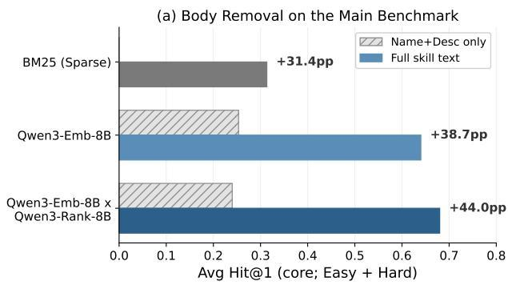
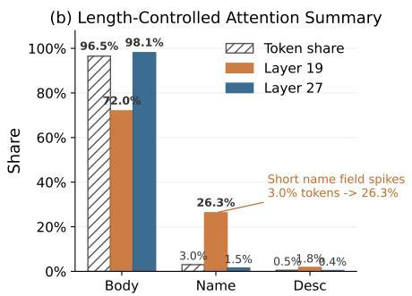
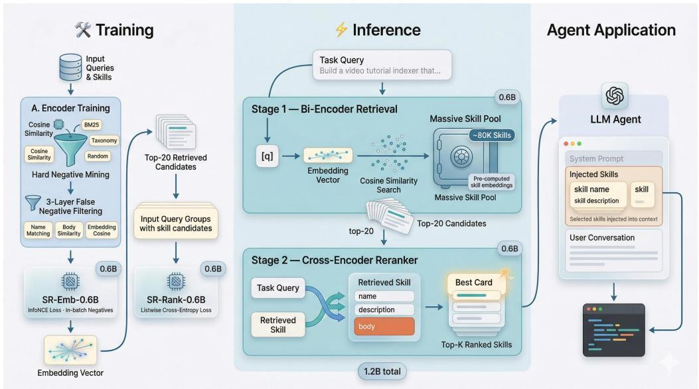

# SkillRouter: Skill Routing for LLM Agents at Scale

YanZhao Zheng ZhenTao Zhang Chao Ma YuanQiang Yu JiHuai Zhu

Wu Yong Tianze Xu Baohua Dong∗ Hangcheng Zhu

# Ruohui Huang Gang Yu

Alibaba Group, Hangzhou, China

zhengyanzhao.zyz, zhangzhentao.zzt, mc524716, yuyuanqiang.yyq,

zhujihuai.zjh, wy517954, xutianze.xtz, baohua.dbh, linran.lr09,

wentong, ruohai@alibaba-inc.com

# Abstract

Reusable skills let LLM agents package task-specific procedures, tool affordances, and execution guidance into modular building blocks. As skill ecosystems grow to tens of thousands of entries, exposing every skill at inference time becomes infeasible. This creates a skill-routing problem: given a user task, the system must identify relevant skills before downstream planning or execution. Existing agent stacks often rely on progressive disclosure, exposing only skill names and descriptions while hiding the full implementation body. We examine this design choice on a SkillsBenchderived benchmark with approximately 80K candidate skills, targeting the practically important setting of large skill registries with heavy overlap. Across representative sparse, dense, and reranking baselines on this setting, hiding the skill body causes a 31–44 percentage point drop in routing accuracy, showing that full skill text is a critical routing signal in this setting rather than a minor metadata refinement. Motivated by this finding, we present SKILLROUTER1, a compact 1.2B full-text retrieve-andrerank pipeline. SKILLROUTER achieves 74.0% Hit@1 on our benchmark— the strongest average top-1 routing performance among the baselines we evaluate—while using 13× fewer parameters and running 5.8× faster than the strongest base pipeline. The ranking gains further generalize to a supplementary benchmark independently constructed from three skill sources. In a complementary end-to-end study across four coding agents, routing gains transfer to improved task success, with larger gains for more capable agents.

# 1 Introduction

Skills have emerged as a practical abstraction for extending LLM agents with reusable procedures, tool knowledge, and execution guidance. Recent coding-agent products such as Claude Code, Codex, and OpenClaw expose reusable skills as a first-class capability (Anthropic, 2025; OpenAI, 2025; OpenClaw, 2026b). These systems reflect the growing use of skill registries in real deployments. Presenting every skill to the agent is infeasible, so real systems need skill routing: retrieving the right skill from a large pool given a user task. This setting has an important asymmetry: the routing component can inspect the full skill text, while the agent that eventually consumes the skill usually sees only its name and description. In deployed agent stacks, this upstream routing decision is a high-leverage bottleneck: once the wrong skill shortlist is surfaced, downstream planning and execution have little chance to recover. The question is therefore not only whether an agent can use a provided skill, but whether the system can find the right skill under severe pool-scale confusion.

Current agent frameworks implicitly treat metadata as sufficient for selection, yet this assumption has not been tested at realistic scale. Existing benchmarks such as SkillsBench (Li et al., 2026b), ToolBench (Qin et al., 2023), and MetaTool (Huang et al., 2024) study downstream tool use or tool-choice behavior, but they do not directly evaluate large-pool upstream skill routing under hidden implementations. On the retrieval side, prior work has studied reranking and context-aware retrieval (Zheng et al., 2024; Yuan et al., 2024), but typically on name-and-description metadata and in much smaller candidate pools. This leaves a gap between current benchmark practice and realistic agent deployment, where skill registries can be both large and highly overlapping. Our goal is not to claim that every skill-routing benchmark exhibits the same failure mode, but to study the practically important setting of large skill registries with heavy overlap, where many candidates can appear relevant for the same query.

We study skill routing on a benchmark with ∼80K skills and 75 expert-verified SkillsBenchderived queries that instantiate this setting. Our central empirical finding is that, on this setting, full skill text is a critical routing signal: removing the body causes 31–44pp drops across representative sparse, dense, and reranking baselines, while length-controlled attention diagnostics and description-quality stratification argue against simple length-only or description-quality explanations. Motivated by this observation, we build SKILLROUTER, a compact 1.2B full-text retrieve-and-rerank pipeline. The primary 1.2B configuration (0.6B encoder + 0.6B reranker) reaches 74.0% Hit@1 and 70.4% R@10, compared with 68.0% Hit@1 for the strongest 16B base pipeline—achieving comparable or higher accuracy at 13× fewer parameters and 5.8× lower serving latency. An 8B scaled version reaches 76.0%. We also validate transfer beyond retrieval metrics: in a complementary end-to-end study using the natural pool across four coding agents, SKILLROUTER improves average task success over the strongest base router in both top-1 and top-10 settings, with the benefit being more pronounced for more capable agents. These downstream results should be read as end-to-end utility measurements rather than direct proxies for exhaustive gold-skill recovery, since the agent consumes a bounded shortlist rather than the abstract annotated set. On a real-pool GPU benchmark the 1.2B pipeline serves queries at sub-second median latency. We also evaluate the same checkpoints on SkillBench-Supp, a separate 256-query benchmark built from three skill sources, showing that the observed gains are not specific to the 75-query core benchmark.

# Our contributions are threefold:

1. On two complementary benchmarks over an ∼80K-skill pool—a 75-query expert-verified core set with Easy/Hard robustness tiers, and a 256-query supplementary set independently constructed from three skill sources—we show that full skill text is a critical routing signal (Section 3), and that length-controlled diagnostics and description-quality stratification argue against simple length-only or description-quality explanations.   
2. We present SKILLROUTER, a compact full-text retrieve-and-rerank pipeline built from standard IR components, and identify two training adaptations that are specifically necessary in homogeneous skill pools: false-negative filtering to handle near-duplicate skills, and listwise reranking loss to resolve fine-grained candidate competition.   
3. We show that the routing gains transfer to a complementary end-to-end study using the natural pool across four coding agents, and we characterize the compact pipeline’s efficiency–accuracy tradeoff on a real-pool GPU serving benchmark.

# 2 Problem definition and benchmark

Task and metrics. We study skill routing: given a task query q and a large skill pool $\mathcal { S } = \{ s _ { 1 } , \ldots , s _ { N } \}$ , retrieve the skill set $\mathcal { G } _ { q } \subseteq \breve { S }$ needed to solve the task. Each skill contains a name, description, and full implementation body. This creates a hidden-body asymmetry: the routing system can inspect full skill text, while the downstream agent typically sees only metadata. We report Hit@1 as the primary top-1 routing metric, together with MRR@10,

<table><tr><td>Type</td><td>Name</td><td>Description</td></tr><tr><td>Ground truth</td><td>speech-to-text</td><td>Transcribe audio/video locally with Whisper and return timestamped text.</td></tr><tr><td>Pool distractor</td><td>audio-transcriber</td><td>General-purpose cloud transcription service for uploaded audio files.</td></tr><tr><td>Hard distractor</td><td>video-subtitle-sync</td><td>Synchronize subtitle timing to video playback using audio cues.</td></tr></table>

Table 1: Illustrative benchmark example. Hard distractors remain topically plausible but fail the required function.

Recall@K $( K \in \{ 1 0 , 2 0 , 5 0 \}$ ; average fraction of ground-truth skills recovered), and FC@10 (fraction of queries whose full ground-truth skill set appears in the top 10). For multi-skill queries, Hit@1 is defined mechanically as whether any required skill is ranked first. We therefore report Recall@K and FC@10 to characterize shortlist and full-set coverage more directly.

Benchmark construction. We build the benchmark from SkillsBench (Li et al., 2026b), which provides expert-curated task–skill mappings. Starting from 87 SkillsBench tasks, we exclude 12 generic-only cases whose labels contain only file-type skills $( \mathrm { e . g . } ,$ , pdf or xlsx) and retain 75 core queries: 24 single-skill and 51 multi-skill. We evaluate against an ∼80K-skill pool assembled from SkillsBench skills plus a large open-source skill collection spanning 51 categories, drawn from Claude Skill Registry Core (Majiayu000, 2026). To probe robustness, we report two tiers: Easy with 78,361 candidate skills, and Hard with 79,141 candidates after adding 780 LLM-generated distractor skills that are topically related but functionally distinct. All main results average Easy and Hard; Appendix A reports the exact core-query selection protocol and a metadata audit of the 80K pool, while Appendix B details distractor generation and representative data examples.

Benchmark credibility and scope. SkillsBench provides expert-curated task–skill mappings rather than weakly inferred labels. The Easy/Hard split isolates two failure modes: standard large-pool retrieval in Easy, and confusion among functionally close but incorrect alternatives in Hard. Table 1 illustrates this design: Hard distractors are same-domain, same-technology, or over-generalized alternatives that remain superficially plausible but fail the required function, and serve as a targeted stress test for function-level confusion rather than an estimate of distractor prevalence in natural repositories. The 75 core queries span 55 application domains across eight super-categories, with no single super-category exceeding 17% (Appendix A). This targets the practically important setting of large skill registries with heavy overlap, common in community ecosystems and internal tool catalogs.

# 3 What signals drive skill selection?

Current agent frameworks typically expose only a skill’s name and description, implicitly assuming that metadata is sufficient for selection. We test this assumption on the paper’s main benchmark setting, reporting the Easy/Hard average used elsewhere in the main text. Figure 1 (left) uses three representative baselines aligned with the main tables: BM25, the strongest encoder-only base model (Qwen3-Emb-8B), and the strongest base retrieveand-rerank pipeline (Qwen3-Emb-8B × Qwen3-Rank-8B). Appendix Table 9 reports the full encoder-only comparison between metadata-only inputs (name+description only; $\prime \prime \mathrm { { n d } \prime \prime ) }$ and full-text inputs for BM25, Qwen3-Emb-0.6B, and Qwen3-Emb-8B on the same 75 core queries. We also analyze cross-encoder attention, controlling for field length, to test whether the reranker is simply following field length in the final decision.

Body removal collapses performance across method families. Figure 1 (left) reports 31.4– 44.0pp Hit@1 drops for the three representative baselines. On the paper’s main Easy/Hard average, BM25 falls from 31.4% to 0.0%, Qwen3-Emb-8B drops from 64.0% to 25.3%, and

  
Figure 1: Full skill text is a critical routing signal. Left: Averaged over the paper’s Easy and Hard tiers, removing body reduces Hit@1 by 31.4pp for BM25, 38.7pp for Qwen3-Emb-8B, and 44.0pp for Qwen3-Emb-8B × Qwen3-Rank-8B. Right: Length-controlled attention diagnostics argue against a simple length-only explanation: although the body field occupies 96.5% of skill tokens, the short name field peaks at 26.3% attention in layer 19 despite covering only 3.0% of tokens, while the final layer returns to 98.1% body attention.

Qwen3-Emb-8B × Qwen3-Rank-8B drops from 68.0% to 24.0%. Appendix Table 9 shows the same encoder-only pattern for Qwen3-Emb-0.6B, which drops from 56.0% to 18.7% on the same benchmark. This collapse is therefore not tied to a single model choice: across sparse retrieval, encoder-only retrieval, and reranking, removing the body removes a critical routing signal and sharply degrades top-rank performance.

Length-controlled attention supports the same story. Raw attention mass is lengthconfounded because, in the 75 analyzed query-skill pairs, the body, name, and description fields account for 96.5%, 3.0%, and 0.5% of skill tokens, respectively. We therefore do not interpret the 91.7% aggregate body attention in isolation. Instead, the informative signal is the layer-wise redistribution of attention across fields. If the reranker were responding mainly to field length, attention would stay close to the token-share baseline throughout the network. It does not: the name field covers only 3.0% of skill tokens yet rises to 26.3% attention at layer 19, before the final layer returns to 98.1% body attention. Final-layer body attention exceeds the body’s token share on 69/75 queries and is effectively uncorrelated with absolute body length (r = 0.04). Together, these diagnostics make a simple length-only explanation unlikely and support the conclusion that the skill body contributes substantive routing signal beyond raw field length. Appendix C gives the exact computation together with the full layer-wise and query-level diagnostics underlying this body→name→body trajectory. As a further control, Appendix D stratifies the nd→full gap by GT description length and finds that the gap remains large (≥26pp) even for the quartile of skills with the longest descriptions, arguing against a description-quality confound.

Implication. Taken together, these results indicate that full skill text is a critical routing signal for reliable routing in this setting, in both retrieval and reranking. This observation directly motivates the design of SKILLROUTER in the next section.

# 4 SkillRouter: a compact full-text routing recipe

Motivated by the body-access finding in Section 3, we present SKILLROUTER, a compact full-text retrieve-and-rerank pipeline tailored to large, homogeneous skill pools. Its main contribution is a setting-specific routing recipe, together with two training adaptations that materially improve performance in this regime: false-negative filtering to handle near-duplicate skills that corrupt contrastive learning, and listwise reranking to resolve fine-grained competition among topically similar candidates. We do not introduce a new encoder or reranker architecture; rather, we show that these choices are important in this setting and that the resulting compact pipeline occupies a favorable efficiency–accuracy frontier.

  
Figure 2: SKILLROUTER pipeline. A bi-encoder retrieves top-20 candidates from the full ∼80K pool; a cross-encoder reranks them. Both stages use full skill text, motivated by the body-access finding in Section 3.

Concretely, SKILLROUTER is a full-text two-stage pipeline: a bi-encoder first retrieves a short candidate list from the ∼80K pool, and a cross-encoder then reranks those candidates using the complete skill body. Our primary configuration uses a 0.6B encoder and a 0.6B reranker, for 1.2B parameters total. Figure 2 summarizes the training setup and the two-stage inference path.

Bi-encoder retrieval. We fine-tune Qwen3-Emb-0.6B (Zhang et al., 2025) on 37,979 synthetic (query, skill) pairs. Skills are sampled from the ∼80K community pool with stratified sampling to ensure category diversity. For each sampled skill, we generate a synthetic user query using an LLM (GPT-4o-mini) prompted with the skill’s metadata and body content (Appendix E; Appendix Table 15). The prompt instructs the model to produce a realistic task description without revealing the skill name, so that generated queries reflect functional need rather than lexical identity. Benchmark-labeled skills are excluded from training supervision, ensuring the encoder learns transferable routing patterns rather than memorizing benchmark skills. We optimize the retriever with in-batch InfoNCE over the full skill text. At inference time, the encoder embeds the full skill inventory offline and retrieves only the top-20 candidates, giving the second stage a narrow but still diverse decision set.

Hard negative mining. In practice, a single user request may match dozens of superficially relevant skills—e.g., multiple “git” or “docker” management tools—while only one provides the specific capability needed. Random negatives cannot teach the encoder to make these fine-grained distinctions. Each query is paired with 10 negatives from four complementary sources: semantic neighbors (4 per query) retrieved by the base encoder’s embeddings, lexical matches (3) via BM25 scoring, taxonomy distractors (2) from the same skill category, and random negatives (1) from a different category. This mixture forces the encoder to distinguish semantically close alternatives, lexical confounders, and same-category distractors simultaneously—precisely where full skill body access becomes operationally essential. Appendix E provides the full mining procedure.

False negative filtering. Because the hard negatives above are mined from a pool where the same capability is often independently implemented by different authors under different names, the mined candidate set inevitably includes skills that are functionally equivalent to the ground truth. Treating these as negatives corrupts the contrastive signal. We apply a three-layer filter: name deduplication, body-text overlap (trigram Jaccard > 0.6), and embedding similarity (> 0.92), removing approximately 10% of mined negatives. Section 5.3 shows that this filtering contributes +4.0pp Hit@1.

Cross-encoder reranking. The retriever supplies the top-20 candidates to a fine-tuned Qwen3-Rank-0.6B (Zhang et al., 2025), which scores each query–skill pair using the full flattened skill text. Training uses 32,283 candidate lists retrieved by SR-Emb-0.6B, each containing 20 skills with binary relevance labels; the same false-negative filtering pipeline as the encoder stage is applied. We adopt listwise cross-entropy rather than pointwise binary classification: once the retriever has narrowed the pool to 20 candidates, the remaining skills are often all topically plausible, so the reranker must compare candidates against one another rather than score each independently. Section 5.3 shows that listwise training is essential, outperforming the pointwise variant by 30.7pp Hit@1.

Implementation details. Both models are trained on a single GPU. At inference time, skills are pre-embedded offline; a live query requires one encoder forward pass, approximate nearest-neighbor search, and reranking of 20 candidates. The encoder handles large-pool recall, while the reranker spends its full-text capacity on fine-grained distinctions among similar candidates. Training details and the top-K ablation are in Appendices F and G.

# 5 Experiments

# 5.1 Setup

Our primary evaluation uses the benchmark in Section 2: 75 core queries over an ∼80K skill pool, evaluated on both Easy and Hard tiers and averaged unless otherwise noted. To assess generalization beyond this core benchmark, we report results on a supplementary benchmark in Section 5.4. Our primary metric is Hit@1, with MRR@10 as a secondary ranking metric. For multi-skill queries, we additionally report Recall@K and FC@10 as coverage metrics: R@10 serves as the main shortlist-coverage metric, while FC@10 provides a stricter full-coverage view. All models in the main results use full skill text; the nd-versusfull comparisons are summarized in Section 3. Unless otherwise stated, rerankers operate on the encoder’s top-20 candidate list.

Input formats and baselines. Each skill contains a name, description, and body; we use full (all three fields, truncated at each model’s input limit) and nd (name+description only). All tuned models use full inputs.

Encoder baselines. We compare four encoder families:

• Sparse retrieval: BM25 (Robertson & Zaragoza, 2009) over the full skill text.   
• Traditional open bi-encoders: E5-Large-v2 (Wang et al., 2022), GTE-Large-v1.5 (Li et al., 2023), and BGE-Large-v1.5 (Xiao et al., 2024).   
• Decoder-based encoders: Qwen3-Emb-0.6B, Qwen3-Emb-8B (Zhang et al., 2025), and NV-Embed-v2 (Lee et al., 2024).   
• Proprietary APIs: OpenAI text-embedding-3-large (OpenAI, 2024b) and Gemini gemini-embedding-001 (Google, 2025).

Table 2 reports representative models from each family; the full 11-model grid appears in Appendix I.

Reranker baselines and our systems. For reranking we evaluate Qwen3 base rerankers (Zhang et al., 2025) and listwise LLM-as-judge baselines, all operating on the encoder’s top-20 candidate list. Our own systems include SR-Emb-0.6B / SR-Rank-0.6B as the primary compact pipeline, plus 8B scaling variants to test recipe transfer. The benchmark stresses both stages through scale, overlap, and lexical mismatch: encoders must retrieve through category overlap and many plausible alternatives, while rerankers must sort highly similar candidates within the top-20 window.

<table><tr><td>Model</td><td>Params</td><td>E-Hit@1</td><td>H-Hit@1</td><td>A-Hit@1</td><td>A-MRR@10</td><td>A-R@20</td></tr><tr><td>BM25</td><td>-</td><td>.347</td><td>.280</td><td>.314</td><td>.365</td><td>.365</td></tr><tr><td>BGE-Large-v1.5</td><td>335M</td><td>.613</td><td>.587</td><td>.600</td><td>.653</td><td>.668</td></tr><tr><td>gemini-embedding-001</td><td>-</td><td>.613</td><td>.560</td><td>.587</td><td>.650</td><td>.687</td></tr><tr><td>text-embedding-3-large</td><td>-</td><td>.640</td><td>.600</td><td>.620</td><td>.658</td><td>.664</td></tr><tr><td>Qwen3-Emb-0.6B</td><td>0.6B</td><td>.587</td><td>.533</td><td>.560</td><td>.638</td><td>.637</td></tr><tr><td>Qwen3-Emb-8B</td><td>8B</td><td>.653</td><td>.627</td><td>.640</td><td>.698</td><td>.726</td></tr><tr><td>SR-Emb-0.6B</td><td>0.6B</td><td>.667</td><td>.640</td><td>.654</td><td>.723</td><td>.754</td></tr><tr><td>SR-Emb-8B</td><td>8B</td><td>.693</td><td>.667</td><td>.680</td><td>.731</td><td>.777</td></tr></table>

Table 2: Encoder-only retrieval results on the 80K skill-routing benchmark. The tuned 0.6B encoder (highlighted) outperforms the 13× larger base encoder, showing that task-specific training compensates for scale in this setting. E/H/A denote Easy/Hard/Average. R@20 reflects candidate coverage for downstream reranking.

<table><tr><td>Encoder</td><td>Reranker</td><td>E-Hit@1</td><td>H-Hit@1</td><td>A-Hit@1</td><td>A-MRR@10</td><td>A-R@10</td></tr><tr><td>Qwen3-Emb-0.6B</td><td>Qwen3-Rank-0.6B</td><td>.653</td><td>.627</td><td>.640</td><td>.684</td><td>.604</td></tr><tr><td>Qwen3-Emb-8B</td><td>Qwen3-Rank-0.6B</td><td>.613</td><td>.547</td><td>.580</td><td>.672</td><td>.694</td></tr><tr><td>Qwen3-Emb-8B</td><td>Qwen3-Rank-8B</td><td>.680</td><td>.680</td><td>.680</td><td>.745</td><td>.692</td></tr><tr><td>SR-Emb-0.6B</td><td>Qwen3-Rank-0.6B</td><td>.720</td><td>.693</td><td>.707</td><td>.769</td><td>.724</td></tr><tr><td>SR-Emb-0.6B</td><td>Qwen3-Rank-8B</td><td>.720</td><td>.707</td><td>.714</td><td>.776</td><td>.727</td></tr><tr><td>SR-Emb-0.6B</td><td>SR-Rank-0.6B</td><td>.760</td><td>.720</td><td>.740</td><td>.791</td><td>.704</td></tr><tr><td>SR-Emb-8B</td><td>SR-Rank-8B</td><td>.787</td><td>.733</td><td>.760</td><td>.808</td><td>.719</td></tr></table>

Table 3: End-to-end retrieve-and-rerank results (top-20 candidates). The compact 1.2B tuned pipeline (highlighted) reaches the highest Hit@1 among non-scaling configurations, exceeding the 16B base pipeline at 13× fewer parameters. E/H/A denote Easy/Hard/Average.

# 5.2 Main results

Fine-tuning is more valuable than scale alone. Table 2 shows that, among encoder-only systems, SR-Emb-0.6B reaches 65.4% average Hit@1, improving by +9.4pp over the samesize Qwen3-Emb-0.6B base model and still edging past Qwen3-Emb-8B at 64.0% despite a 13× parameter gap. This indicates that, in this setting, skill-routing data and task-specific negatives can compensate for a 13× parameter gap.

The retriever also gives the reranker useful headroom. SR-Emb-0.6B reaches 75.4% average R@20, exceeding Qwen3-Emb-8B at 72.6%. This matters because reranking can only help when the correct skill enters the candidate set. The encoder improvements are therefore not just better top-1 ranking, but also better coverage for the second stage.

The compact pipeline matches or exceeds the strongest base system at 13× fewer parameters. Table 3 shows that our primary 1.2B pipeline, SR-Emb-0.6B × SR-Rank-0.6B, reaches 74.0% average Hit@1, compared with 68.0% for the 16B strongest base pipeline (Qwen3- Emb-8B × Qwen3-Rank-8B). It also improves by +10.0pp over the same-size 1.2B base configuration and by +8.6pp over encoder-only retrieval with the same tuned encoder. The gain remains positive on both Easy (+8.0pp) and Hard (+4.0pp). Combined with the serving results in Section 5.6—5.8× lower latency and 15.8% less GPU memory—the compact pipeline occupies a favorable position on the efficiency–accuracy frontier. Section 5.4 further validates that the same directional advantage persists on an independently constructed supplementary benchmark.

Base rerankers help, but tuned reranking helps more. The tuned 1.2B pipeline reaches 74.0% compared with 71.4% for SR-Emb-0.6B × Qwen3-Rank-8B and 68.0% for the 16B base pipeline, showing that task-specific adaptation in both stages contributes to the overall gain (Appendix J gives the query-level decomposition). LLM-as-judge baselines are not competitive: the strongest judge (GPT-4o-mini (OpenAI, 2024a)) reaches only 67.3% Hit@1 on the same candidate lists, with GPT-5.4-mini (OpenAI, 2026) at 66.0%; both judges provide only a top-1 choice rather than a scored full reranking (Appendix I). The same training recipe also scales to 8B, yielding 76.0% Hit@1, though the 1.2B system already captures most of the gain.

<table><tr><td rowspan="2">Pipeline</td><td colspan="3">Single</td><td colspan="3">Multi</td></tr><tr><td>Hit@1</td><td>R@10</td><td>FC@10</td><td>Hit@1</td><td>R@10</td><td>FC@10</td></tr><tr><td>Qwen3-Emb-0.6B × Qwen3-Rank-0.6B</td><td>.625</td><td>.708</td><td>.708</td><td>.647</td><td>.556</td><td>.324</td></tr><tr><td>Qwen3-Emb-8B × Qwen3-Rank-8B</td><td>.667</td><td>.812</td><td>.812</td><td>.686</td><td>.636</td><td>.382</td></tr><tr><td>SR-Emb-0.6B × SR-Rank-0.6B</td><td>.729</td><td>.875</td><td>.875</td><td>.745</td><td>.624</td><td>.353</td></tr></table>

Table 4: Single- vs. multi-skill calibration for two base pipelines and our primary 1.2B pipeline. Hit@1 reflects top-1 routing, R@10 reflects shortlist coverage, and FC@10 reflects strict full coverage for multi-skill queries.

<table><tr><td>Component</td><td>Variant</td><td>Hit@1</td><td>MRR@10</td><td>R@10</td></tr><tr><td colspan="5">Encoder training</td></tr><tr><td>SR-Emb-0.6B</td><td>Clean negatives</td><td>.653</td><td>.723</td><td>.688</td></tr><tr><td>SR-Emb-0.6B</td><td>Raw negatives</td><td>.613</td><td>.692</td><td>.672</td></tr><tr><td colspan="5">Reranker training</td></tr><tr><td>SR-Emb-0.6B</td><td>Encoder-only (no reranking)</td><td>.653</td><td>.723</td><td>.688</td></tr><tr><td>SR-Emb-0.6B × Qwen3-Rank-0.6B</td><td>Base reranker</td><td>.707</td><td>.769</td><td>.724</td></tr><tr><td>SR-Emb-0.6B × SR-Rank-0.6B (PW)</td><td>Pointwise BCE fine-tuning</td><td>.433</td><td>.578</td><td>.573</td></tr><tr><td>SR-Emb-0.6B × SR-Rank-0.6B (LW)</td><td>Listwise CE fine-tuning</td><td>.740</td><td>.791</td><td>.704</td></tr></table>

Table 5: Key ablations. False-negative filtering contributes +4.0pp encoder Hit@1; listwise reranking is essential, outperforming the pointwise variant by +30.7pp. Top: encoder variants. Bottom: reranker variants using SR-Emb-0.6B as the retriever.

# 5.3 Metric calibration and key ablations

Hit@1 gains should be read as top-1 routing gains. Table 4 shows that the primary pipeline improves Hit@1 on both single- and multi-skill queries. The strongest base pipeline remains better on strict multi-skill FC@10 (.382 vs. .353), so our main claim is strongest top-1 routing rather than uniformly better exhaustive set recovery.

Two training choices are essential. Table 5 shows that false-negative filtering contributes +4.0pp Hit@1 and +3.1pp MRR@10 to the encoder, and listwise training is decisive for reranking: the pointwise variant collapses to 43.3% Hit@1 while the listwise model reaches 74.0%. Additional coverage analyses appear in Table 4 and Appendix Table 23.

# 5.4 Supplementary benchmark validation

To test whether the observed gains generalize beyond the 75-query core benchmark, we construct SkillBench-Supp, an independently built supplementary benchmark with 100 GT skills from three sources and 256 single-label evaluation queries over a 77K-skill pool. Query generation uses a different LLM, prompt design, and source mix from the training pipeline; the 30 pool-selected GT skills are explicitly held out from training. Using the same checkpoints without re-tuning, the compact 1.2B SKILLROUTER pipeline edges out the 16B Qwen3 base pipeline on Hit@1 (.641 vs. .637), with the same directional advantage at both 0.6B and 8B scales. Appendix M provides the full construction details, complete results (Appendix Table 26), and difficulty breakdowns.

<table><tr><td>Skill Condition</td><td>Router / Source</td><td>Top-K</td><td>Single Success</td><td>Multi Success</td><td>Overall Success</td></tr><tr><td>No skills</td><td>None</td><td>-</td><td>12.50%</td><td>16.01%</td><td>14.89%</td></tr><tr><td>Gold skills</td><td>Oracle ground-truth</td><td>GT</td><td>30.90%</td><td>33.50%</td><td>32.67%</td></tr><tr><td>Retrieved skills</td><td>Qwen3-Emb-8B × Qwen3-Rank-8B</td><td>1</td><td>26.74%</td><td>25.33%</td><td>25.78%</td></tr><tr><td>Retrieved skills</td><td>SR-Emb-0.6B × SR-Rank-0.6B</td><td>1</td><td>29.86%</td><td>26.47%</td><td>27.56%</td></tr><tr><td>Retrieved skills</td><td>Qwen3-Emb-8B × Qwen3-Rank-8B</td><td>10</td><td>20.49%</td><td>27.78%</td><td>25.45%</td></tr><tr><td>Retrieved skills</td><td>SR-Emb-0.6B × SR-Rank-0.6B</td><td>10</td><td>26.04%</td><td>28.60%</td><td>27.78%</td></tr></table>

Table 6: End-to-end agent evaluation on the 75-task core set using skills from the natural pool (without Hard-tier distractors). Results average over 3 trials × 4 coding agents. Gold skills are oracle upper bounds.

# 5.5 Downstream end-to-end agent evaluation

Routing gains transfer to direct agent execution. Four coding agents—Kimi-K2.5 (Kimi Team, 2026), glm-5 (Z.AI, 2026), Claude Sonnet 4.6, and Claude Opus 4.6 (Anthropic, 2026)— run inside the Claude Code harness (Anthropic, 2025) with a 1200 s timeout; the harness injects each retrieved skill’s name and description into the agent context, and task setup and success criteria follow SkillsBench (Li et al., 2026b). As shown in Table 6, across both top-1 and top-10 settings, SKILLROUTER improves average task success over the strongest base router (+1.78pp and +2.33pp, respectively), recovering about 71–73% of the no-skill→goldskill uplift compared with 59–61% for the base router. Both top-1 and top-10 yield similar overall success (∼27.6–27.8%), suggesting diminishing returns from expanding the shortlist beyond a quality threshold. The benefit is more pronounced for stronger agents: Claude Sonnet/Opus 4.6 show an average +3.22pp gain, while glm-5 and Kimi-K2.5 show +0.89pp, consistent with a ceiling on routing utility for agents that cannot fully exploit correctly routed skills. Appendix L reports per-agent breakdowns; Appendix L.1 gives representative cases.

# 5.6 Serving efficiency

On a real-pool GPU serving benchmark over 80 timed queries (274–5109 characters), the 1.2B SKILLROUTER pipeline serves the online query path at 495.8 ms median latency—5.8× faster than the 16B base pipeline while using 15.8% less GPU memory (Appendix H).

# 6 Related work

LLM agents depend on large tool and skill collections. Prior work has studied tool invocation and retrieval in settings ranging from small fixed tool sets to large API repositories (Schick et al., 2023; Shen et al., 2023; Qin et al., 2023; Patil et al., 2023; Du et al., 2024; Yuan et al., 2024; Zheng et al., 2024). However, these systems typically retrieve from much smaller pools, emphasize tool usage rather than upstream routing, or operate mainly on metadata. Our setting targets the challenge that modern skill ecosystems create: large registries with heavy overlap, where many candidates can appear relevant for the same query.

Our system design follows the standard retrieve-and-rerank paradigm from neural IR (Karpukhin et al., 2020; Izacard et al., 2022; Xiong et al., 2021; Wang et al., 2022; Li et al., 2023; Xiao et al., 2024; Nogueira & Cho, 2019; Sun et al., 2023), but our setting differs in two ways: skills are structured multi-field objects with severe inter-skill homogeneity, and our evaluation explicitly studies how routing quality changes when models have access to the full body rather than only the name and description. Our benchmark is built on SkillsBench (Li et al., 2026b), but shifts the focus from downstream tool use to large-scale skill retrieval. Methodologically, our contribution is therefore not a new reranking architecture, but an end-to-end full-text routing recipe and benchmark setup tailored to homogeneous skill pools where false negatives and listwise competition dominate.

# 7 Conclusion

We study skill routing at realistic registry scale and show that full skill text is a critical routing signal: on our ∼80K-skill benchmark, removing body text causes 31–44pp drops across representative baselines. A compact 1.2B full-text retrieve-and-rerank pipeline reaches 74.0% Hit@1—competitive with the strongest 16B base pipeline at 5.8× lower latency—with false-negative filtering and listwise reranking loss shown to be essential in homogeneous skill pools. The gains generalize to a supplementary benchmark (§5.4) and transfer to direct task execution across four coding agents. More broadly, the body-access finding likely extends beyond skill routing to other structured-retrieval settings with rich implementation detail, such as API routing and plugin selection.

Limitations. Our benchmarks derive from a limited number of sources; the claims apply to large registries with heavy overlap, and metadata-only routing may be more competitive in smaller catalogs. The downstream evaluation is limited to four coding agents under a single execution budget; FC@10 and end-to-end top-10 success measure different quantities (exhaustive gold-set recovery vs. bounded-package utility) and should not be read as interchangeable.
