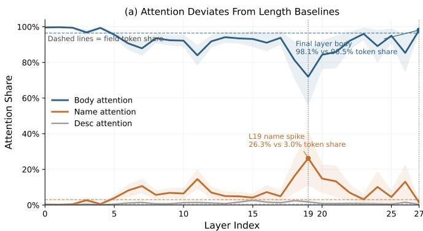
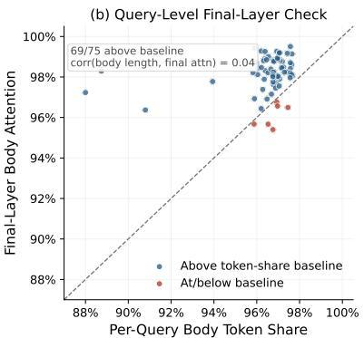
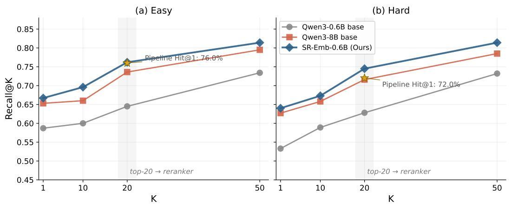

# SkillRouter: Skill Routing for LLM Agents at Scale

YanZhao Zheng ZhenTao Zhang Chao Ma YuanQiang Yu JiHuai Zhu

Wu Yong Tianze Xu Baohua Dong∗ Hangcheng Zhu

# Ruohui Huang Gang Yu

Alibaba Group, Hangzhou, China

zhengyanzhao.zyz, zhangzhentao.zzt, mc524716, yuyuanqiang.yyq,

zhujihuai.zjh, wy517954, xutianze.xtz, baohua.dbh, linran.lr09,

wentong, ruohai@alibaba-inc.com

# Abstract

Reusable skills let LLM agents package task-specific procedures, tool affordances, and execution guidance into modular building blocks. As skill ecosystems grow to tens of thousands of entries, exposing every skill at inference time becomes infeasible. This creates a skill-routing problem: given a user task, the system must identify relevant skills before downstream planning or execution. Existing agent stacks often rely on progressive disclosure, exposing only skill names and descriptions while hiding the full implementation body. We examine this design choice on a SkillsBenchderived benchmark with approximately 80K candidate skills, targeting the practically important setting of large skill registries with heavy overlap. Across representative sparse, dense, and reranking baselines on this setting, hiding the skill body causes a 31–44 percentage point drop in routing accuracy, showing that full skill text is a critical routing signal in this setting rather than a minor metadata refinement. Motivated by this finding, we present SKILLROUTER1, a compact 1.2B full-text retrieve-andrerank pipeline. SKILLROUTER achieves 74.0% Hit@1 on our benchmark— the strongest average top-1 routing performance among the baselines we evaluate—while using 13× fewer parameters and running 5.8× faster than the strongest base pipeline. The ranking gains further generalize to a supplementary benchmark independently constructed from three skill sources. In a complementary end-to-end study across four coding agents, routing gains transfer to improved task success, with larger gains for more capable agents.

# 1 Introduction

Skills have emerged as a practical abstraction for extending LLM agents with reusable procedures, tool knowledge, and execution guidance. Recent coding-agent products such as Claude Code, Codex, and OpenClaw expose reusable skills as a first-class capability (Anthropic, 2025; OpenAI, 2025; OpenClaw, 2026b). These systems reflect the growing use of skill registries in real deployments. Presenting every skill to the agent is infeasible, so real systems need skill routing: retrieving the right skill from a large pool given a user task. This setting has an important asymmetry: the routing component can inspect the full skill text, while the agent that eventually consumes the skill usually sees only its name and description. In deployed agent stacks, this upstream routing decision is a high-leverage bottleneck: once the wrong skill shortlist is surfaced, downstream planning and execution have little chance to recover. The question is therefore not only whether an agent can use a provided skill, but whether the system can find the right skill under severe pool-scale confusion.

Current agent frameworks implicitly treat metadata as sufficient for selection, yet this assumption has not been tested at realistic scale. Existing benchmarks such as SkillsBench (Li et al., 2026b), ToolBench (Qin et al., 2023), and MetaTool (Huang et al., 2024) study downstream tool use or tool-choice behavior, but they do not directly evaluate large-pool upstream skill routing under hidden implementations. On the retrieval side, prior work has studied reranking and context-aware retrieval (Zheng et al., 2024; Yuan et al., 2024), but typically on name-and-description metadata and in much smaller candidate pools. This leaves a gap between current benchmark practice and realistic agent deployment, where skill registries can be both large and highly overlapping. Our goal is not to claim that every skill-routing benchmark exhibits the same failure mode, but to study the practically important setting of large skill registries with heavy overlap, where many candidates can appear relevant for the same query.

We study skill routing on a benchmark with ∼80K skills and 75 expert-verified SkillsBenchderived queries that instantiate this setting. Our central empirical finding is that, on this setting, full skill text is a critical routing signal: removing the body causes 31–44pp drops across representative sparse, dense, and reranking baselines, while length-controlled attention diagnostics and description-quality stratification argue against simple length-only or description-quality explanations. Motivated by this observation, we build SKILLROUTER, a compact 1.2B full-text retrieve-and-rerank pipeline. The primary 1.2B configuration (0.6B encoder + 0.6B reranker) reaches 74.0% Hit@1 and 70.4% R@10, compared with 68.0% Hit@1 for the strongest 16B base pipeline—achieving comparable or higher accuracy at 13× fewer parameters and 5.8× lower serving latency. An 8B scaled version reaches 76.0%. We also validate transfer beyond retrieval metrics: in a complementary end-to-end study using the natural pool across four coding agents, SKILLROUTER improves average task success over the strongest base router in both top-1 and top-10 settings, with the benefit being more pronounced for more capable agents. These downstream results should be read as end-to-end utility measurements rather than direct proxies for exhaustive gold-skill recovery, since the agent consumes a bounded shortlist rather than the abstract annotated set. On a real-pool GPU benchmark the 1.2B pipeline serves queries at sub-second median latency. We also evaluate the same checkpoints on SkillBench-Supp, a separate 256-query benchmark built from three skill sources, showing that the observed gains are not specific to the 75-query core benchmark.

# Our contributions are threefold:

1. On two complementary benchmarks over an ∼80K-skill pool—a 75-query expert-verified core set with Easy/Hard robustness tiers, and a 256-query supplementary set independently constructed from three skill sources—we show that full skill text is a critical routing signal (Section 3), and that length-controlled diagnostics and description-quality stratification argue against simple length-only or description-quality explanations.   
2. We present SKILLROUTER, a compact full-text retrieve-and-rerank pipeline built from standard IR components, and identify two training adaptations that are specifically necessary in homogeneous skill pools: false-negative filtering to handle near-duplicate skills, and listwise reranking loss to resolve fine-grained candidate competition.   
3. We show that the routing gains transfer to a complementary end-to-end study using the natural pool across four coding agents, and we characterize the compact pipeline’s efficiency–accuracy tradeoff on a real-pool GPU serving benchmark.

# 2 Problem definition and benchmark

Task and metrics. We study skill routing: given a task query q and a large skill pool $\mathcal { S } = \{ s _ { 1 } , \ldots , s _ { N } \}$ , retrieve the skill set $\mathcal { G } _ { q } \subseteq \breve { S }$ needed to solve the task. Each skill contains a name, description, and full implementation body. This creates a hidden-body asymmetry: the routing system can inspect full skill text, while the downstream agent typically sees only metadata. We report Hit@1 as the primary top-1 routing metric, together with MRR@10,

<table><tr><td>Type</td><td>Name</td><td>Description</td></tr><tr><td>Ground truth</td><td>speech-to-text</td><td>Transcribe audio/video locally with Whisper and return timestamped text.</td></tr><tr><td>Pool distractor</td><td>audio-transcriber</td><td>General-purpose cloud transcription service for uploaded audio files.</td></tr><tr><td>Hard distractor</td><td>video-subtitle-sync</td><td>Synchronize subtitle timing to video playback using audio cues.</td></tr></table>

Table 1: Illustrative benchmark example. Hard distractors remain topically plausible but fail the required function.

Recall@K $( K \in \{ 1 0 , 2 0 , 5 0 \}$ ; average fraction of ground-truth skills recovered), and FC@10 (fraction of queries whose full ground-truth skill set appears in the top 10). For multi-skill queries, Hit@1 is defined mechanically as whether any required skill is ranked first. We therefore report Recall@K and FC@10 to characterize shortlist and full-set coverage more directly.

Benchmark construction. We build the benchmark from SkillsBench (Li et al., 2026b), which provides expert-curated task–skill mappings. Starting from 87 SkillsBench tasks, we exclude 12 generic-only cases whose labels contain only file-type skills $( \mathrm { e . g . } ,$ , pdf or xlsx) and retain 75 core queries: 24 single-skill and 51 multi-skill. We evaluate against an ∼80K-skill pool assembled from SkillsBench skills plus a large open-source skill collection spanning 51 categories, drawn from Claude Skill Registry Core (Majiayu000, 2026). To probe robustness, we report two tiers: Easy with 78,361 candidate skills, and Hard with 79,141 candidates after adding 780 LLM-generated distractor skills that are topically related but functionally distinct. All main results average Easy and Hard; Appendix A reports the exact core-query selection protocol and a metadata audit of the 80K pool, while Appendix B details distractor generation and representative data examples.

Benchmark credibility and scope. SkillsBench provides expert-curated task–skill mappings rather than weakly inferred labels. The Easy/Hard split isolates two failure modes: standard large-pool retrieval in Easy, and confusion among functionally close but incorrect alternatives in Hard. Table 1 illustrates this design: Hard distractors are same-domain, same-technology, or over-generalized alternatives that remain superficially plausible but fail the required function, and serve as a targeted stress test for function-level confusion rather than an estimate of distractor prevalence in natural repositories. The 75 core queries span 55 application domains across eight super-categories, with no single super-category exceeding 17% (Appendix A). This targets the practically important setting of large skill registries with heavy overlap, common in community ecosystems and internal tool catalogs.

# 3 What signals drive skill selection?

Current agent frameworks typically expose only a skill’s name and description, implicitly assuming that metadata is sufficient for selection. We test this assumption on the paper’s main benchmark setting, reporting the Easy/Hard average used elsewhere in the main text. Figure 1 (left) uses three representative baselines aligned with the main tables: BM25, the strongest encoder-only base model (Qwen3-Emb-8B), and the strongest base retrieveand-rerank pipeline (Qwen3-Emb-8B × Qwen3-Rank-8B). Appendix Table 9 reports the full encoder-only comparison between metadata-only inputs (name+description only; $\prime \prime \mathrm { { n d } \prime \prime ) }$ and full-text inputs for BM25, Qwen3-Emb-0.6B, and Qwen3-Emb-8B on the same 75 core queries. We also analyze cross-encoder attention, controlling for field length, to test whether the reranker is simply following field length in the final decision.

Body removal collapses performance across method families. Figure 1 (left) reports 31.4– 44.0pp Hit@1 drops for the three representative baselines. On the paper’s main Easy/Hard average, BM25 falls from 31.4% to 0.0%, Qwen3-Emb-8B drops from 64.0% to 25.3%, and


  
Figure 1: Full skill text is a critical routing signal. Left: Averaged over the paper’s Easy and Hard tiers, removing body reduces Hit@1 by 31.4pp for BM25, 38.7pp for Qwen3-Emb-8B, and 44.0pp for Qwen3-Emb-8B × Qwen3-Rank-8B. Right: Length-controlled attention diagnostics argue against a simple length-only explanation: although the body field occupies 96.5% of skill tokens, the short name field peaks at 26.3% attention in layer 19 despite covering only 3.0% of tokens, while the final layer returns to 98.1% body attention.

Qwen3-Emb-8B × Qwen3-Rank-8B drops from 68.0% to 24.0%. Appendix Table 9 shows the same encoder-only pattern for Qwen3-Emb-0.6B, which drops from 56.0% to 18.7% on the same benchmark. This collapse is therefore not tied to a single model choice: across sparse retrieval, encoder-only retrieval, and reranking, removing the body removes a critical routing signal and sharply degrades top-rank performance.

Length-controlled attention supports the same story. Raw attention mass is lengthconfounded because, in the 75 analyzed query-skill pairs, the body, name, and description fields account for 96.5%, 3.0%, and 0.5% of skill tokens, respectively. We therefore do not interpret the 91.7% aggregate body attention in isolation. Instead, the informative signal is the layer-wise redistribution of attention across fields. If the reranker were responding mainly to field length, attention would stay close to the token-share baseline throughout the network. It does not: the name field covers only 3.0% of skill tokens yet rises to 26.3% attention at layer 19, before the final layer returns to 98.1% body attention. Final-layer body attention exceeds the body’s token share on 69/75 queries and is effectively uncorrelated with absolute body length (r = 0.04). Together, these diagnostics make a simple length-only explanation unlikely and support the conclusion that the skill body contributes substantive routing signal beyond raw field length. Appendix C gives the exact computation together with the full layer-wise and query-level diagnostics underlying this body→name→body trajectory. As a further control, Appendix D stratifies the nd→full gap by GT description length and finds that the gap remains large (≥26pp) even for the quartile of skills with the longest descriptions, arguing against a description-quality confound.

Implication. Taken together, these results indicate that full skill text is a critical routing signal for reliable routing in this setting, in both retrieval and reranking. This observation directly motivates the design of SKILLROUTER in the next section.

# 4 SkillRouter: a compact full-text routing recipe

Motivated by the body-access finding in Section 3, we present SKILLROUTER, a compact full-text retrieve-and-rerank pipeline tailored to large, homogeneous skill pools. Its main contribution is a setting-specific routing recipe, together with two training adaptations that materially improve performance in this regime: false-negative filtering to handle near-duplicate skills that corrupt contrastive learning, and listwise reranking to resolve fine-grained competition among topically similar candidates. We do not introduce a new encoder or reranker architecture; rather, we show that these choices are important in this setting and that the resulting compact pipeline occupies a favorable efficiency–accuracy frontier.

  
Figure 2: SKILLROUTER pipeline. A bi-encoder retrieves top-20 candidates from the full ∼80K pool; a cross-encoder reranks them. Both stages use full skill text, motivated by the body-access finding in Section 3.

Concretely, SKILLROUTER is a full-text two-stage pipeline: a bi-encoder first retrieves a short candidate list from the ∼80K pool, and a cross-encoder then reranks those candidates using the complete skill body. Our primary configuration uses a 0.6B encoder and a 0.6B reranker, for 1.2B parameters total. Figure 2 summarizes the training setup and the two-stage inference path.

Bi-encoder retrieval. We fine-tune Qwen3-Emb-0.6B (Zhang et al., 2025) on 37,979 synthetic (query, skill) pairs. Skills are sampled from the ∼80K community pool with stratified sampling to ensure category diversity. For each sampled skill, we generate a synthetic user query using an LLM (GPT-4o-mini) prompted with the skill’s metadata and body content (Appendix E; Appendix Table 15). The prompt instructs the model to produce a realistic task description without revealing the skill name, so that generated queries reflect functional need rather than lexical identity. Benchmark-labeled skills are excluded from training supervision, ensuring the encoder learns transferable routing patterns rather than memorizing benchmark skills. We optimize the retriever with in-batch InfoNCE over the full skill text. At inference time, the encoder embeds the full skill inventory offline and retrieves only the top-20 candidates, giving the second stage a narrow but still diverse decision set.

Hard negative mining. In practice, a single user request may match dozens of superficially relevant skills—e.g., multiple “git” or “docker” management tools—while only one provides the specific capability needed. Random negatives cannot teach the encoder to make these fine-grained distinctions. Each query is paired with 10 negatives from four complementary sources: semantic neighbors (4 per query) retrieved by the base encoder’s embeddings, lexical matches (3) via BM25 scoring, taxonomy distractors (2) from the same skill category, and random negatives (1) from a different category. This mixture forces the encoder to distinguish semantically close alternatives, lexical confounders, and same-category distractors simultaneously—precisely where full skill body access becomes operationally essential. Appendix E provides the full mining procedure.

False negative filtering. Because the hard negatives above are mined from a pool where the same capability is often independently implemented by different authors under different names, the mined candidate set inevitably includes skills that are functionally equivalent to the ground truth. Treating these as negatives corrupts the contrastive signal. We apply a three-layer filter: name deduplication, body-text overlap (trigram Jaccard > 0.6), and embedding similarity (> 0.92), removing approximately 10% of mined negatives. Section 5.3 shows that this filtering contributes +4.0pp Hit@1.

Cross-encoder reranking. The retriever supplies the top-20 candidates to a fine-tuned Qwen3-Rank-0.6B (Zhang et al., 2025), which scores each query–skill pair using the full flattened skill text. Training uses 32,283 candidate lists retrieved by SR-Emb-0.6B, each containing 20 skills with binary relevance labels; the same false-negative filtering pipeline as the encoder stage is applied. We adopt listwise cross-entropy rather than pointwise binary classification: once the retriever has narrowed the pool to 20 candidates, the remaining skills are often all topically plausible, so the reranker must compare candidates against one another rather than score each independently. Section 5.3 shows that listwise training is essential, outperforming the pointwise variant by 30.7pp Hit@1.

Implementation details. Both models are trained on a single GPU. At inference time, skills are pre-embedded offline; a live query requires one encoder forward pass, approximate nearest-neighbor search, and reranking of 20 candidates. The encoder handles large-pool recall, while the reranker spends its full-text capacity on fine-grained distinctions among similar candidates. Training details and the top-K ablation are in Appendices F and G.

# 5 Experiments

# 5.1 Setup

Our primary evaluation uses the benchmark in Section 2: 75 core queries over an ∼80K skill pool, evaluated on both Easy and Hard tiers and averaged unless otherwise noted. To assess generalization beyond this core benchmark, we report results on a supplementary benchmark in Section 5.4. Our primary metric is Hit@1, with MRR@10 as a secondary ranking metric. For multi-skill queries, we additionally report Recall@K and FC@10 as coverage metrics: R@10 serves as the main shortlist-coverage metric, while FC@10 provides a stricter full-coverage view. All models in the main results use full skill text; the nd-versusfull comparisons are summarized in Section 3. Unless otherwise stated, rerankers operate on the encoder’s top-20 candidate list.

Input formats and baselines. Each skill contains a name, description, and body; we use full (all three fields, truncated at each model’s input limit) and nd (name+description only). All tuned models use full inputs.

Encoder baselines. We compare four encoder families:

• Sparse retrieval: BM25 (Robertson & Zaragoza, 2009) over the full skill text.   
• Traditional open bi-encoders: E5-Large-v2 (Wang et al., 2022), GTE-Large-v1.5 (Li et al., 2023), and BGE-Large-v1.5 (Xiao et al., 2024).   
• Decoder-based encoders: Qwen3-Emb-0.6B, Qwen3-Emb-8B (Zhang et al., 2025), and NV-Embed-v2 (Lee et al., 2024).   
• Proprietary APIs: OpenAI text-embedding-3-large (OpenAI, 2024b) and Gemini gemini-embedding-001 (Google, 2025).

Table 2 reports representative models from each family; the full 11-model grid appears in Appendix I.

Reranker baselines and our systems. For reranking we evaluate Qwen3 base rerankers (Zhang et al., 2025) and listwise LLM-as-judge baselines, all operating on the encoder’s top-20 candidate list. Our own systems include SR-Emb-0.6B / SR-Rank-0.6B as the primary compact pipeline, plus 8B scaling variants to test recipe transfer. The benchmark stresses both stages through scale, overlap, and lexical mismatch: encoders must retrieve through category overlap and many plausible alternatives, while rerankers must sort highly similar candidates within the top-20 window.

<table><tr><td>Model</td><td>Params</td><td>E-Hit@1</td><td>H-Hit@1</td><td>A-Hit@1</td><td>A-MRR@10</td><td>A-R@20</td></tr><tr><td>BM25</td><td>-</td><td>.347</td><td>.280</td><td>.314</td><td>.365</td><td>.365</td></tr><tr><td>BGE-Large-v1.5</td><td>335M</td><td>.613</td><td>.587</td><td>.600</td><td>.653</td><td>.668</td></tr><tr><td>gemini-embedding-001</td><td>-</td><td>.613</td><td>.560</td><td>.587</td><td>.650</td><td>.687</td></tr><tr><td>text-embedding-3-large</td><td>-</td><td>.640</td><td>.600</td><td>.620</td><td>.658</td><td>.664</td></tr><tr><td>Qwen3-Emb-0.6B</td><td>0.6B</td><td>.587</td><td>.533</td><td>.560</td><td>.638</td><td>.637</td></tr><tr><td>Qwen3-Emb-8B</td><td>8B</td><td>.653</td><td>.627</td><td>.640</td><td>.698</td><td>.726</td></tr><tr><td>SR-Emb-0.6B</td><td>0.6B</td><td>.667</td><td>.640</td><td>.654</td><td>.723</td><td>.754</td></tr><tr><td>SR-Emb-8B</td><td>8B</td><td>.693</td><td>.667</td><td>.680</td><td>.731</td><td>.777</td></tr></table>

Table 2: Encoder-only retrieval results on the 80K skill-routing benchmark. The tuned 0.6B encoder (highlighted) outperforms the 13× larger base encoder, showing that task-specific training compensates for scale in this setting. E/H/A denote Easy/Hard/Average. R@20 reflects candidate coverage for downstream reranking.

<table><tr><td>Encoder</td><td>Reranker</td><td>E-Hit@1</td><td>H-Hit@1</td><td>A-Hit@1</td><td>A-MRR@10</td><td>A-R@10</td></tr><tr><td>Qwen3-Emb-0.6B</td><td>Qwen3-Rank-0.6B</td><td>.653</td><td>.627</td><td>.640</td><td>.684</td><td>.604</td></tr><tr><td>Qwen3-Emb-8B</td><td>Qwen3-Rank-0.6B</td><td>.613</td><td>.547</td><td>.580</td><td>.672</td><td>.694</td></tr><tr><td>Qwen3-Emb-8B</td><td>Qwen3-Rank-8B</td><td>.680</td><td>.680</td><td>.680</td><td>.745</td><td>.692</td></tr><tr><td>SR-Emb-0.6B</td><td>Qwen3-Rank-0.6B</td><td>.720</td><td>.693</td><td>.707</td><td>.769</td><td>.724</td></tr><tr><td>SR-Emb-0.6B</td><td>Qwen3-Rank-8B</td><td>.720</td><td>.707</td><td>.714</td><td>.776</td><td>.727</td></tr><tr><td>SR-Emb-0.6B</td><td>SR-Rank-0.6B</td><td>.760</td><td>.720</td><td>.740</td><td>.791</td><td>.704</td></tr><tr><td>SR-Emb-8B</td><td>SR-Rank-8B</td><td>.787</td><td>.733</td><td>.760</td><td>.808</td><td>.719</td></tr></table>

Table 3: End-to-end retrieve-and-rerank results (top-20 candidates). The compact 1.2B tuned pipeline (highlighted) reaches the highest Hit@1 among non-scaling configurations, exceeding the 16B base pipeline at 13× fewer parameters. E/H/A denote Easy/Hard/Average.

# 5.2 Main results

Fine-tuning is more valuable than scale alone. Table 2 shows that, among encoder-only systems, SR-Emb-0.6B reaches 65.4% average Hit@1, improving by +9.4pp over the samesize Qwen3-Emb-0.6B base model and still edging past Qwen3-Emb-8B at 64.0% despite a 13× parameter gap. This indicates that, in this setting, skill-routing data and task-specific negatives can compensate for a 13× parameter gap.

The retriever also gives the reranker useful headroom. SR-Emb-0.6B reaches 75.4% average R@20, exceeding Qwen3-Emb-8B at 72.6%. This matters because reranking can only help when the correct skill enters the candidate set. The encoder improvements are therefore not just better top-1 ranking, but also better coverage for the second stage.

The compact pipeline matches or exceeds the strongest base system at 13× fewer parameters. Table 3 shows that our primary 1.2B pipeline, SR-Emb-0.6B × SR-Rank-0.6B, reaches 74.0% average Hit@1, compared with 68.0% for the 16B strongest base pipeline (Qwen3- Emb-8B × Qwen3-Rank-8B). It also improves by +10.0pp over the same-size 1.2B base configuration and by +8.6pp over encoder-only retrieval with the same tuned encoder. The gain remains positive on both Easy (+8.0pp) and Hard (+4.0pp). Combined with the serving results in Section 5.6—5.8× lower latency and 15.8% less GPU memory—the compact pipeline occupies a favorable position on the efficiency–accuracy frontier. Section 5.4 further validates that the same directional advantage persists on an independently constructed supplementary benchmark.

Base rerankers help, but tuned reranking helps more. The tuned 1.2B pipeline reaches 74.0% compared with 71.4% for SR-Emb-0.6B × Qwen3-Rank-8B and 68.0% for the 16B base pipeline, showing that task-specific adaptation in both stages contributes to the overall gain (Appendix J gives the query-level decomposition). LLM-as-judge baselines are not competitive: the strongest judge (GPT-4o-mini (OpenAI, 2024a)) reaches only 67.3% Hit@1 on the same candidate lists, with GPT-5.4-mini (OpenAI, 2026) at 66.0%; both judges provide only a top-1 choice rather than a scored full reranking (Appendix I). The same training recipe also scales to 8B, yielding 76.0% Hit@1, though the 1.2B system already captures most of the gain.

<table><tr><td rowspan="2">Pipeline</td><td colspan="3">Single</td><td colspan="3">Multi</td></tr><tr><td>Hit@1</td><td>R@10</td><td>FC@10</td><td>Hit@1</td><td>R@10</td><td>FC@10</td></tr><tr><td>Qwen3-Emb-0.6B × Qwen3-Rank-0.6B</td><td>.625</td><td>.708</td><td>.708</td><td>.647</td><td>.556</td><td>.324</td></tr><tr><td>Qwen3-Emb-8B × Qwen3-Rank-8B</td><td>.667</td><td>.812</td><td>.812</td><td>.686</td><td>.636</td><td>.382</td></tr><tr><td>SR-Emb-0.6B × SR-Rank-0.6B</td><td>.729</td><td>.875</td><td>.875</td><td>.745</td><td>.624</td><td>.353</td></tr></table>

Table 4: Single- vs. multi-skill calibration for two base pipelines and our primary 1.2B pipeline. Hit@1 reflects top-1 routing, R@10 reflects shortlist coverage, and FC@10 reflects strict full coverage for multi-skill queries.

<table><tr><td>Component</td><td>Variant</td><td>Hit@1</td><td>MRR@10</td><td>R@10</td></tr><tr><td colspan="5">Encoder training</td></tr><tr><td>SR-Emb-0.6B</td><td>Clean negatives</td><td>.653</td><td>.723</td><td>.688</td></tr><tr><td>SR-Emb-0.6B</td><td>Raw negatives</td><td>.613</td><td>.692</td><td>.672</td></tr><tr><td colspan="5">Reranker training</td></tr><tr><td>SR-Emb-0.6B</td><td>Encoder-only (no reranking)</td><td>.653</td><td>.723</td><td>.688</td></tr><tr><td>SR-Emb-0.6B × Qwen3-Rank-0.6B</td><td>Base reranker</td><td>.707</td><td>.769</td><td>.724</td></tr><tr><td>SR-Emb-0.6B × SR-Rank-0.6B (PW)</td><td>Pointwise BCE fine-tuning</td><td>.433</td><td>.578</td><td>.573</td></tr><tr><td>SR-Emb-0.6B × SR-Rank-0.6B (LW)</td><td>Listwise CE fine-tuning</td><td>.740</td><td>.791</td><td>.704</td></tr></table>

Table 5: Key ablations. False-negative filtering contributes +4.0pp encoder Hit@1; listwise reranking is essential, outperforming the pointwise variant by +30.7pp. Top: encoder variants. Bottom: reranker variants using SR-Emb-0.6B as the retriever.

# 5.3 Metric calibration and key ablations

Hit@1 gains should be read as top-1 routing gains. Table 4 shows that the primary pipeline improves Hit@1 on both single- and multi-skill queries. The strongest base pipeline remains better on strict multi-skill FC@10 (.382 vs. .353), so our main claim is strongest top-1 routing rather than uniformly better exhaustive set recovery.

Two training choices are essential. Table 5 shows that false-negative filtering contributes +4.0pp Hit@1 and +3.1pp MRR@10 to the encoder, and listwise training is decisive for reranking: the pointwise variant collapses to 43.3% Hit@1 while the listwise model reaches 74.0%. Additional coverage analyses appear in Table 4 and Appendix Table 23.

# 5.4 Supplementary benchmark validation

To test whether the observed gains generalize beyond the 75-query core benchmark, we construct SkillBench-Supp, an independently built supplementary benchmark with 100 GT skills from three sources and 256 single-label evaluation queries over a 77K-skill pool. Query generation uses a different LLM, prompt design, and source mix from the training pipeline; the 30 pool-selected GT skills are explicitly held out from training. Using the same checkpoints without re-tuning, the compact 1.2B SKILLROUTER pipeline edges out the 16B Qwen3 base pipeline on Hit@1 (.641 vs. .637), with the same directional advantage at both 0.6B and 8B scales. Appendix M provides the full construction details, complete results (Appendix Table 26), and difficulty breakdowns.

<table><tr><td>Skill Condition</td><td>Router / Source</td><td>Top-K</td><td>Single Success</td><td>Multi Success</td><td>Overall Success</td></tr><tr><td>No skills</td><td>None</td><td>-</td><td>12.50%</td><td>16.01%</td><td>14.89%</td></tr><tr><td>Gold skills</td><td>Oracle ground-truth</td><td>GT</td><td>30.90%</td><td>33.50%</td><td>32.67%</td></tr><tr><td>Retrieved skills</td><td>Qwen3-Emb-8B × Qwen3-Rank-8B</td><td>1</td><td>26.74%</td><td>25.33%</td><td>25.78%</td></tr><tr><td>Retrieved skills</td><td>SR-Emb-0.6B × SR-Rank-0.6B</td><td>1</td><td>29.86%</td><td>26.47%</td><td>27.56%</td></tr><tr><td>Retrieved skills</td><td>Qwen3-Emb-8B × Qwen3-Rank-8B</td><td>10</td><td>20.49%</td><td>27.78%</td><td>25.45%</td></tr><tr><td>Retrieved skills</td><td>SR-Emb-0.6B × SR-Rank-0.6B</td><td>10</td><td>26.04%</td><td>28.60%</td><td>27.78%</td></tr></table>

Table 6: End-to-end agent evaluation on the 75-task core set using skills from the natural pool (without Hard-tier distractors). Results average over 3 trials × 4 coding agents. Gold skills are oracle upper bounds.

# 5.5 Downstream end-to-end agent evaluation

Routing gains transfer to direct agent execution. Four coding agents—Kimi-K2.5 (Kimi Team, 2026), glm-5 (Z.AI, 2026), Claude Sonnet 4.6, and Claude Opus 4.6 (Anthropic, 2026)— run inside the Claude Code harness (Anthropic, 2025) with a 1200 s timeout; the harness injects each retrieved skill’s name and description into the agent context, and task setup and success criteria follow SkillsBench (Li et al., 2026b). As shown in Table 6, across both top-1 and top-10 settings, SKILLROUTER improves average task success over the strongest base router (+1.78pp and +2.33pp, respectively), recovering about 71–73% of the no-skill→goldskill uplift compared with 59–61% for the base router. Both top-1 and top-10 yield similar overall success (∼27.6–27.8%), suggesting diminishing returns from expanding the shortlist beyond a quality threshold. The benefit is more pronounced for stronger agents: Claude Sonnet/Opus 4.6 show an average +3.22pp gain, while glm-5 and Kimi-K2.5 show +0.89pp, consistent with a ceiling on routing utility for agents that cannot fully exploit correctly routed skills. Appendix L reports per-agent breakdowns; Appendix L.1 gives representative cases.

# 5.6 Serving efficiency

On a real-pool GPU serving benchmark over 80 timed queries (274–5109 characters), the 1.2B SKILLROUTER pipeline serves the online query path at 495.8 ms median latency—5.8× faster than the 16B base pipeline while using 15.8% less GPU memory (Appendix H).

# 6 Related work

LLM agents depend on large tool and skill collections. Prior work has studied tool invocation and retrieval in settings ranging from small fixed tool sets to large API repositories (Schick et al., 2023; Shen et al., 2023; Qin et al., 2023; Patil et al., 2023; Du et al., 2024; Yuan et al., 2024; Zheng et al., 2024). However, these systems typically retrieve from much smaller pools, emphasize tool usage rather than upstream routing, or operate mainly on metadata. Our setting targets the challenge that modern skill ecosystems create: large registries with heavy overlap, where many candidates can appear relevant for the same query.

Our system design follows the standard retrieve-and-rerank paradigm from neural IR (Karpukhin et al., 2020; Izacard et al., 2022; Xiong et al., 2021; Wang et al., 2022; Li et al., 2023; Xiao et al., 2024; Nogueira & Cho, 2019; Sun et al., 2023), but our setting differs in two ways: skills are structured multi-field objects with severe inter-skill homogeneity, and our evaluation explicitly studies how routing quality changes when models have access to the full body rather than only the name and description. Our benchmark is built on SkillsBench (Li et al., 2026b), but shifts the focus from downstream tool use to large-scale skill retrieval. Methodologically, our contribution is therefore not a new reranking architecture, but an end-to-end full-text routing recipe and benchmark setup tailored to homogeneous skill pools where false negatives and listwise competition dominate.

# 7 Conclusion

We study skill routing at realistic registry scale and show that full skill text is a critical routing signal: on our ∼80K-skill benchmark, removing body text causes 31–44pp drops across representative baselines. A compact 1.2B full-text retrieve-and-rerank pipeline reaches 74.0% Hit@1—competitive with the strongest 16B base pipeline at 5.8× lower latency—with false-negative filtering and listwise reranking loss shown to be essential in homogeneous skill pools. The gains generalize to a supplementary benchmark (§5.4) and transfer to direct task execution across four coding agents. More broadly, the body-access finding likely extends beyond skill routing to other structured-retrieval settings with rich implementation detail, such as API routing and plugin selection.

Limitations. Our benchmarks derive from a limited number of sources; the claims apply to large registries with heavy overlap, and metadata-only routing may be more competitive in smaller catalogs. The downstream evaluation is limited to four coding agents under a single execution budget; FC@10 and end-to-end top-10 success measure different quantities (exhaustive gold-set recovery vs. bounded-package utility) and should not be read as interchangeable.

# References

Anthropic. Claude Code overview. https://code.claude.com/docs, 2025.   
Anthropic. Models overview. https://platform.claude.com/docs/en/about-claude/ models/overview, 2026.   
Yu Du, Fangyun Wei, and Hongyang Zhang. Anytool: Self-reflective, hierarchical agents for large-scale api calls. In Proceedings of the 41st International Conference on Machine Learning, 2024. https://openreview.net/forum?id=qFILbkTQWw.   
Google. Gemini embedding model. https://ai.google.dev/gemini-api/docs/embeddings, 2025.   
Yue Huang, Jiawen Shi, Yuan Li, Chenrui Fan, Siyuan Wu, Qihui Zhang, Yixin Liu, Pan Zhou, Yao Wan, Neil Zhenqiang Gong, and Lichao Sun. Metatool benchmark for large language models: Deciding whether to use tools and which to use. arXiv preprint arXiv:2310.03128, 2024.   
Gautier Izacard, Mathilde Caron, Lucas Hosseini, Sebastian Riedel, Piotr Bojanowski, Armand Joulin, and Edouard Grave. Unsupervised dense information retrieval with contrastive learning. Transactions on Machine Learning Research, 2022.   
Vladimir Karpukhin, Barlas Oguz, Sewon Min, Patrick Lewis, Ledell Wu, Sergey Edunov, Danqi Chen, and Wen-tau Yih. Dense passage retrieval for open-domain question answering. In Proceedings of EMNLP, 2020.   
Kimi Team. Kimi k2.5: Scaling reinforcement learning with llms. arXiv preprint arXiv:2602.02276, 2026. arXiv:2602.02276.   
Chankyu Lee, Rajarshi Roy, Mengyao Xu, Jonathan Raiman, Mohammad Shoeybi, Bryan Catanzaro, and Wei Ping. Nv-embed: Improved techniques for training llms as generalist embedding models. arXiv preprint arXiv:2405.17428, 2024. ICLR 2025 Spotlight.   
Hao Li, Chunjiang Mu, Jianhao Chen, Siyue Ren, Zhiyao Cui, Yiqun Zhang, Lei Bai, and Shuyue Hu. Organizing, orchestrating, and benchmarking agent skills at ecosystem scale. arXiv preprint arXiv:2603.02176, 2026a.   
Xiangyi Li, Wenbo Chen, Yimin Liu, Shenghan Zheng, Xiaokun Chen, Yifeng He, Yubo Li, Bingran You, Haotian Shen, Jiankai Sun, Shuyi Wang, Binxu Li, Qunhong Zeng, Di Wang, Xuandong Zhao, Yuanli Wang, Roey Ben Chaim, Zonglin Di, Yipeng Gao, Junwei He, Yizhuo He, Liqiang Jing, Luyang Kong, Xin Lan, Jiachen Li, Songlin Li, Yijiang Li, Yueqian

Lin, Xinyi Liu, Xuanqing Liu, Haoran Lyu, Ze Ma, Bowei Wang, Runhui Wang, Tianyu Wang, Wengao Ye, Yue Zhang, Hanwen Xing, Yiqi Xue, Steven Dillmann, and Han-chung Lee. Skillsbench: Benchmarking how well agent skills work across diverse tasks, 2026b. arXiv:2602.12670.   
Zehan Li, Xin Zhang, Yanzhao Zhang, Dingkun Long, Pengjun Xie, and Meishan Zhang. Towards general text embeddings with multi-stage contrastive learning. arXiv preprint arXiv:2308.03281, 2023.   
Majiayu000. Claude Skill Registry Core. https://github.com/majiayu000/ claude-skill-registry-core, 2026. GitHub repository; accessed March 30, 2026.   
Rodrigo Nogueira and Kyunghyun Cho. Passage re-ranking with bert. arXiv preprint arXiv:1901.04085, 2019.   
OpenAI. Gpt-4o mini model. https://platform.openai.com/docs/models/gpt-4o-mini, 2024a.   
OpenAI. New embedding models and api updates. https://openai.com/blog/ new-embedding-models-and-api-updates, 2024b.   
OpenAI. Codex — AI coding partner from OpenAI. https://openai.com/codex/, 2025.   
OpenAI. Gpt-5.4 mini model. https://developers.openai.com/api/docs/models/gpt-5. 4-mini, 2026.   
OpenClaw. OpenClaw built-in skills. https://github.com/openclaw/openclaw/tree/main/ skills, 2026a. Official skill repository; accessed March 2026.   
OpenClaw. Skills - OpenClaw. https://docs.openclaw.ai/tools/skills, 2026b.   
Shishir G Patil, Tianjun Zhang, Xin Wang, and Joseph E Gonzalez. Gorilla: Large language model connected with massive apis. arXiv preprint arXiv:2305.15334, 2023.   
Yujia Qin, Shihao Liang, Yining Ye, Kunlun Zhu, Lan Yan, Yaxi Lu, Yankai Lin, Xin Cong, Xiangru Tang, Bill Qian, et al. Toolllm: Facilitating large language models to master 16000+ real-world apis. arXiv preprint arXiv:2307.16789, 2023.   
Stephen Robertson and Hugo Zaragoza. The probabilistic relevance framework: Bm25 and beyond. Foundations and Trends in Information Retrieval, 3(4):333–389, 2009.   
Timo Schick, Jane Dwivedi-Yu, Roberto Dess\`ı, Roberta Raileanu, Maria Lomeli, Luke Zettlemoyer, Nicola Cancedda, and Thomas Scialom. Toolformer: Language models can teach themselves to use tools. arXiv preprint arXiv:2302.04761, 2023.   
Yongliang Shen, Kaitao Song, Xu Tan, Dongsheng Li, Weiming Lu, and Yueting Zhuang. Hugginggpt: Solving ai tasks with chatgpt and its friends in hugging face. Advances in Neural Information Processing Systems, 2023.   
Weiwei Sun, Lingyong Yan, Xinyu Ma, Shuaiqiang Wang, Pengjie Ren, Zhumin Chen, Dawei Yin, and Zhaochun Ren. Is chatgpt good at search? investigating large language models as re-ranking agents. arXiv preprint arXiv:2304.09542, 2023.   
Liang Wang, Nan Yang, Xiaolong Huang, Binxing Jiao, Linjun Yang, Daxin Jiang, Rangan Majumder, and Furu Wei. Text embeddings by weakly-supervised contrastive pre-training. arXiv preprint arXiv:2212.03533, 2022.   
Shitao Xiao, Zheng Liu, Peitian Zhang, Niklas Muennighoff, Defu Lian, and Jian-Yun Nie. C-pack: Packed resources for general chinese embeddings. In Proceedings of the 47th International ACM SIGIR Conference on Research and Development in Information Retrieval, 2024. arXiv:2309.07597.   
Lee Xiong, Chenyan Xiong, Ye Li, Kwok-Fung Tang, Jialin Liu, Paul Bennett, Junaid Ahmed, and Arnold Overwijk. Approximate nearest neighbor negative contrastive learning for dense text retrieval. In Proceedings of ICLR, 2021.

<table><tr><td>Statistic</td><td>Value</td></tr><tr><td>Descriptions empty</td><td>0.12%</td></tr><tr><td>Descriptions &lt; 10 words</td><td>18.66%</td></tr><tr><td>Descriptions &lt; 25 words</td><td>59.22%</td></tr><tr><td>Median description length</td><td>21 words</td></tr><tr><td>Median body length</td><td>704 words</td></tr><tr><td>P90 body length</td><td>1,991 words</td></tr></table>

Table 7: Metadata audit for the 78,361-skill Easy pool. Descriptions are usually present, but they are far more compressed than bodies.

Lifan Yuan, Yangyi Chen, Xingyao Wang, Yi R. Fung, Hao Peng, and Heng Ji. Craft: Customizing llms by creating and retrieving from specialized toolsets. In Proceedings of ICLR, 2024.

Z.AI. Chat completion - overview. https://docs.z.ai/api-reference/llm/ chat-completion, 2026.

Yanzhao Zhang, Mingxin Li, Dingkun Long, Xin Zhang, Huan Lin, Baosong Yang, Pengjun Xie, An Yang, Dayiheng Liu, Junyang Lin, Fei Huang, and Jingren Zhou. Qwen3 embedding: Advancing text embedding and reranking through foundation models. arXiv preprint arXiv:2506.05176, 2025. https://qwenlm.github.io/blog/qwen3-embedding/.

Yuanhang Zheng, Peng Li, Wei Liu, Yang Liu, Jian Luan, and Bin Wang. Toolrerank: Adaptive and hierarchy-aware reranking for tool retrieval. In Proceedings of LREC-COLING, pp. 16263–16273, 2024.

# A Evaluation details

Single- vs. multi-skill queries. Of the 75 core queries, 24 are single-skill queries (exactly one ground-truth skill) and 51 are multi-skill queries (two or more ground-truth skills required to complete the task).

Metric computation for multi-skill queries. For queries with multiple ground-truth skills ${ \mathcal { G } } _ { q } = \{ g _ { 1 } , \dotsc \dotsc , g _ { m } \}$ , we define Hit@1 as the indicator of whether any ground-truth skill appears at rank 1. MRR@10 uses the highest-ranked ground-truth skill’s reciprocal rank. Recall@K measures the fraction of ground-truth skills that appear in the top-K results: $\mathsf { R @ } K = | \mathcal G _ { q } \cap \mathsf { t o p } { - } K | / | \mathcal G _ { q } |$ |. FC@10 (Full Coverage at 10) is the strictest metric: it equals 1 only when all ground-truth skills for a query appear in the top 10. We therefore use R@10 and FC@10 to complement this any-hit criterion.

Core-query selection protocol. The underlying relevance file contains 87 SkillsBenchderived tasks. We define the reported 75-query core benchmark as the subset with at least one non-generic core skill (core gt ids non-empty), which yields 59 clean tasks and 16 mixed tasks. The remaining 12 tasks are generic only: their labels contain only auxiliary file-type skills such as pdf, docx, pptx, or xlsx, so they are excluded from tier-specific routing metrics.

Metadata richness in the 80K pool. The poor nd results are not explained by missing descriptions alone. In the Easy pool, descriptions are almost always present (only 0.12% empty), but they are much shorter than full skill bodies: the median description length is 21 words, versus 704 words for the body. Table 7 summarizes the resulting field-length distribution.

Query diversity. Table 8 summarizes the diversity profile of the 75 core queries. The queries span 55 application domains, which we group into eight super-categories for readability; the distribution is relatively balanced, with no single super-category exceeding

17% of queries. Within these domains, 244 unique topic tags cover areas from seismology and quantum simulation to BGP routing and video dubbing. The difficulty distribution is intentionally skewed toward non-trivial tasks (medium 60%, hard 35%, easy 5%), consistent with the benchmark’s focus on large-pool routing where easy cases are less informative. Among the 51 multi-skill queries, prior analysis identifies three structural types: complementary/pipeline tasks (43%) where skills form sequential stages, substitute/overlap tasks (25%) where multiple skills serve similar functions, and mixed tasks (32%) combining both patterns. This structural variation exercises different aspects of routing quality: pipeline queries stress recall (all stages must be found), while substitute queries stress precision (the best alternative must be ranked first).

<table><tr><td>Dimension</td><td>Value</td></tr><tr><td>Application domains</td><td>55 (8 super-categories)</td></tr><tr><td>Unique topic tags</td><td>244</td></tr><tr><td>Difficulty split</td><td>easy 4 / medium 45 / hard 26</td></tr><tr><td>Single / multi-skill</td><td>24 / 51</td></tr><tr><td>GT skills per query</td><td>1-7 (mean 2.75)</td></tr><tr><td>Multi-skill types</td><td>pipeline 43% / substitute 25% / mixed 32%</td></tr><tr><td>Instruction length</td><td>36-586 words (median 169)</td></tr></table>

Table 8: Diversity profile of the 75 core benchmark queries.

Encoder-only nd/full detail for the body-access study. Table 9 reports the complete encoder-only nd/full comparison referenced in Section 3. All numbers use the same benchmark pool and the same 75 core queries as the main text. Easy and Hard are the two evaluation tiers reported in the main paper.

# B Benchmark data

Hard tier distractor generation. The Hard tier augments the Easy pool with 780 LLMgenerated distractor skills. For each ground-truth skill, we prompt GPT-4o-mini to generate 3–5 plausible-but-incorrect skills using three distractor strategies: same-domain-differentproblem (same technical domain but solves a different task), same-tech-different-use (same technology stack but different application), and over-generalized (broader version that lacks the specific capability needed). We use these distractors as a targeted robustness stress test for function-level confusion, not as an estimate of their exact prevalence in natural repositories. Table 10 shows the generation prompt.

Pool deduplication and canonicalization. The 80K pool is deduplicated by skill ID only. Exact duplicate IDs are removed as data-cleaning artifacts, but same-name overlaps with ground-truth skills are intentionally retained to preserve realistic near-duplicate confusion rather than construct an artificially conflict-free catalog.

Data examples. Table 11 shows representative examples from the Easy and Hard tiers, illustrating the difference between a ground-truth skill, a pool skill (natural distractor), and an LLM-generated distractor.

# C Detailed attention analysis

Table 12 summarizes the raw per-layer attention distribution for SR-Rank-0.6B. Because raw attention mass is length-confounded, Table 13 compares the same traces against field token-share baselines. Figure 3 then gives the two most useful visual views of the same evidence: a layer-wise trajectory against token-share baselines and a query-level final-layer check.

<table><tr><td>Model</td><td>Input</td><td>Easy Hit@1</td><td>Hard Hit@1</td><td>Avg Hit@1</td></tr><tr><td>BM25</td><td>nd</td><td>.000</td><td>.000</td><td>.000</td></tr><tr><td>BM25</td><td>full</td><td>.347</td><td>.280</td><td>.314</td></tr><tr><td>Qwen3-Emb-0.6B</td><td>nd</td><td>.227</td><td>.147</td><td>.187</td></tr><tr><td>Qwen3-Emb-0.6B</td><td>full</td><td>.587</td><td>.533</td><td>.560</td></tr><tr><td>Qwen3-Emb-8B</td><td>nd</td><td>.307</td><td>.200</td><td>.253</td></tr><tr><td>Qwen3-Emb-8B</td><td>full</td><td>.653</td><td>.627</td><td>.640</td></tr></table>

Table 9: Encoder-only nd/full detail on the same benchmark pool and 75 core queries used in the main text. Easy and Hard are the two evaluation tiers reported in the main paper.

System: You are a skill document writer for a coding agent platform. You produce SKILL.md-style documents that are plausible but address a DIFFERENT problem than the reference skill. Each distractor must look like a real, useful skill document but must NOT solve the same task as the reference.

User: I have a ground-truth skill used for the task(s): <task ids>

Reference skill (name: <skill name>, category: <category>):

<body truncated>

Generate <num distractors> HARD distractor skills. Each distractor must be a complete SKILL.md document that looks relevant to someone searching for this skill, but actually solves a different problem.

Use these distractor strategies (one per distractor):

same-domain-diff-problem, same-tech-diff-use, over-generalized

For EACH distractor, output a JSON object with fields:

distractor type, name, description, body (400–1200 words).

Table 10: Distractor skill generation prompt for the Hard evaluation tier.

Exact computation. For each analyzed query–skill pair $i ,$ we tokenize the flattened reranker input and identify the token spans $\mathsf { \bar { T } } _ { i , f }$ of the three skill fields f ∈ {name, desc, body} in the model input. Let $p _ { i }$ denote the last input position, whose hidden state is used to predict the next token and thus the yes/no decision. At each layer ℓ, we average attention from $p _ { i }$ over heads and sum the resulting mass over the tokens in each field. We then normalize within the three skill fields:

$$
a _ {i, \ell , f} = \frac {\sum_ {t \in T _ {i , f}} \bar {A} _ {i , \ell} (p _ {i} , t)}{\sum_ {f ^ {\prime}} \sum_ {t \in T _ {i , f ^ {\prime}}} \bar {A} _ {i , \ell} (p _ {i} , t)}.
$$

The corresponding length baseline is the field’s token share,

$$
b _ {i, f} = \frac {| T _ {i , f} |}{\sum_ {f ^ {\prime}} | T _ {i , f ^ {\prime}} |}.
$$

If attention were explained mainly by field length, we would expect $a _ { i , \ell , f }$ to remain close to $b _ { i , f }$ across layers. Figure 3 (left) compares layer-wise mean attention shares against mean token-share baselines, while Figure 3 (right) compares final-layer body attention $a _ { i , L , \mathrm { b o d y } }$ against the per-query baseline $b _ { i , \mathrm { b o d y } }$ .

<table><tr><td>Type</td><td>Name</td><td>Description</td><td>Body (truncated)</td></tr><tr><td colspan="4">Ground-truth skill (present in both Easy and Hard)</td></tr><tr><td>GT</td><td>speech-to-text</td><td>Transcribe audio files using Whisper</td><td>Converts audio/video files to text using OpenAI Whisper model. Supports chunked processing for long files, multiple output formats (txt, srt, vtt)...</td></tr><tr><td colspan="4">Natural pool skill (present in both Easy and Hard — from community)</td></tr><tr><td>Pool</td><td>audio-transcriber</td><td>Audio transcription service</td><td>A general-purpose audio transcription skill using cloud APIs. Sends audio to external service, returns JSON transcript with timestamps...</td></tr><tr><td colspan="4">LLM-generated distractor (added in Hard tier only)</td></tr><tr><td>Distractor</td><td>video-subtitle-sync</td><td>Synchronize subtitles with video</td><td>Adjusts subtitle timing to match video playback. Parses SRT files, detects audio cues for alignment, handles frame-rate conversion...</td></tr></table>

Table 11: Representative data examples from the Easy and Hard tiers. Ground-truth skills appear in both tiers; LLM-generated distractors are added only in the Hard tier to increase inter-skill confusion.

<table><tr><td>Layer (Group)</td><td>Name</td><td>Desc</td><td>Body</td></tr><tr><td colspan="4">Layer groups (averaged)</td></tr><tr><td>Early (0–6)</td><td>2.3%</td><td>0.3%</td><td>97.3%</td></tr><tr><td>Middle (7–20)</td><td>9.6%</td><td>1.4%</td><td>89.0%</td></tr><tr><td>Late (21–27)</td><td>7.5%</td><td>0.8%</td><td>91.7%</td></tr><tr><td colspan="4">Key individual layers</td></tr><tr><td>Layer 0</td><td>0.3%</td><td>0.1%</td><td>99.6%</td></tr><tr><td>Layer 11</td><td>14.6%</td><td>1.4%</td><td>84.0%</td></tr><tr><td>Layer 19</td><td>26.3%</td><td>1.8%</td><td>72.0%</td></tr><tr><td>Layer 27</td><td>1.5%</td><td>0.4%</td><td>98.1%</td></tr><tr><td>Overall</td><td>7.3%</td><td>1.0%</td><td>91.7%</td></tr></table>

Table 12: Raw attention distribution across skill fields by layer group and key individual layers (SR-Rank-0.6B, 28 layers × 16 heads, 75 queries).



  
Figure 3: Length-controlled attention visualization for SR-Rank-0.6B on 75 query-skill pairs. Left: per-layer mean attention trajectories compared against each field’s token-share baseline; shaded bands denote ±1 standard deviation across the 75 query-skill pairs. The short name field spikes far above its 3.0% token-share baseline in the middle layers, while the final layer returns to body. Right: query-level final-layer body attention compared against each query’s body-token baseline. Most points lie above the diagonal, meaning the final layer attends to body more than a pure length-based baseline would predict.

<table><tr><td>Field</td><td>Token Share</td><td>Overall Attn.</td><td>Layer 19</td><td>Layer 27</td></tr><tr><td>Name</td><td>3.0%</td><td>7.3%</td><td>26.3%</td><td>1.5%</td></tr><tr><td>Desc</td><td>0.5%</td><td>1.0%</td><td>1.8%</td><td>0.4%</td></tr><tr><td>Body</td><td>96.5%</td><td>91.7%</td><td>72.0%</td><td>98.1%</td></tr></table>

Table 13: Length-controlled attention diagnostics for the same 75 query-skill pairs. Attention share is measured from the last input position used to predict the next token (and thus the yes/no decision), averaged over heads, and normalized within the name/description/body fields. If attention were explained mainly by field length, per-layer attention would remain close to field token share.

Why this is not just “more text.” The aggregate 91.7% body attention in Table 12 should be interpreted relative to the fact that the body field already occupies 96.5% of skill tokens in these analyzed pairs. A pure longer-text explanation would therefore predict attention to stay near the token-share baseline across layers. Instead, Tables 12–13 and Figure 3 show a structured body→name→body trajectory: the short name field spans only 3.0% of tokens but receives 26.3% attention at layer 19, while the final layer returns to 98.1% body attention. The easiest way to read Figure 3 is therefore: the left panel shows that attention does not simply track field length through the network, and the right panel shows that this final-layer return to body is not driven by a handful of outlier queries. At the query level, final-layer body attention exceeds the body’s token share on 69 of 75 queries and is effectively uncorrelated with absolute body length (r = 0.04). These diagnostics argue against a trivial length effect and are consistent with the interpretation that the reranker uses name for intermediate alignment and body for the final relevance judgment, though they are not intended as a fully causal test.

# D Description-quality stratification

A natural concern is that the nd→full gap reported in Section 3 could be driven by poor GT skill descriptions: if descriptions were more detailed, metadata-only routing might suffice. To test this, we stratify the 148 matched Easy+Hard queries by the word count of their GT skill’s description, dividing the 188 GT skills with extractable descriptions into four quartiles (Q1 ≤19 words, Q2 20–27, Q3 28–35, Q4 >35). Table 14 reports the nd vs. full Hit@1 per quartile for the strongest base encoder (Qwen3-Emb-8B) on the ∼80K pool.

<table><tr><td>Quartile</td><td>N</td><td>Full Hit@1</td><td>ND Hit@1</td><td>Gap (pp)</td></tr><tr><td>Q1 ( $\leq 19w$ )</td><td>26</td><td>53.8%</td><td>26.9%</td><td>+26.9</td></tr><tr><td>Q2 (20–27w)</td><td>40</td><td>80.0%</td><td>30.0%</td><td>+50.0</td></tr><tr><td>Q3 (28–35w)</td><td>38</td><td>65.8%</td><td>26.3%</td><td>+39.5</td></tr><tr><td>Q4 (&gt;35w)</td><td>44</td><td>52.3%</td><td>20.5%</td><td>+31.8</td></tr><tr><td>Overall</td><td>148</td><td>63.5%</td><td>25.7%</td><td>+37.8</td></tr></table>

Table 14: nd vs. full Hit@1 stratified by GT description word count. The gap remains large (≥26pp) in every quartile, including Q4 where descriptions are longest. Baseline: Qwen3- Emb-8B, ∼80K pool, Easy+Hard averaged.

The gap does not decrease monotonically with description length: Q4 (longest descriptions, >35 words) still shows a +31.8pp gap, and Q2 exhibits the largest gap (+50.0pp). This pattern argues against a description-quality confound and supports the interpretation that body text provides routing signal that descriptions—regardless of their length or detail—cannot substitute.

# E Training data construction

This appendix provides the full details of training data construction for both stages of the SKILLROUTER pipeline, complementing the summary in Section 4.

# E.1 Query generation

Section 4 summarizes the 37,979 synthetic (query, skill) training pairs; here we provide the generation details. Skills are drawn from 51 categories with stratified sampling. The generated queries have a mean length of 160 words. Table 15 shows the prompt template used with GPT-4o-mini.

System: You are an experienced user of AI assistants. You write clear, realistic task requests that describe what you need to accomplish.

User: Given the following skill specification, write a realistic task description that someone would ask an AI assistant to help with. The task should naturally require the capabilities described in this skill.

Skill name: <name>

Category: <category>

Description: <description>

Skill body: <body preview>

Requirements: (1) Describe a concrete scenario with specific inputs/outputs. (2) Include enough detail that the skill would be clearly useful. (3) Do NOT mention the skill name “<name>” anywhere in the task.

Output ONLY the task description.

Table 15: Query generation prompt template (simplified). The LLM receives the skill’s metadata and produces a realistic task description without mentioning the skill name.

# E.2 Hard negative mining

Effective contrastive learning requires informative negatives that are challenging but not false positives. We employ a multi-source mining strategy that produces 10 negatives per query from four complementary sources:

• Semantic negatives (4 per query): We pre-compute embeddings for all skills using the base Qwen3-Emb-0.6B model, retrieve the top-50 most similar skills by cosine similarity, and sample 4 non-positive skills from this set. These are the hardest negatives— semantically close but functionally distinct.   
• Lexical negatives (3 per query): BM25 scoring over skill text (name + description + body) on the same top-50 candidate set, capturing term-overlap confounders that semantic search may miss.   
• Taxonomy negatives (2 per query): randomly sampled from the same category as the positive skill but with a different name, providing same-domain distractors.   
• Random negatives (1 per query): uniformly sampled from a different category, serving as easy negatives for calibration.

# E.3 False negative filtering

As described in Section 4, the mined negatives are post-processed with a three-layer filter. The per-layer removal counts are:

1. Name deduplication: removing negatives that share the same name as any ground-truth skill for the query (24,879 pairs removed).   
2. Body overlap: removing negatives whose body text has trigram Jaccard similarity > 0.6 with a ground-truth skill’s body (13,860 pairs removed).

3. Embedding similarity: removing negatives with cosine similarity > 0.92 to a groundtruth skill’s embedding, catching semantic duplicates missed by lexical matching (326 pairs removed).

In total, 39,065 false negative pairs are removed (approximately 10% of all mined negative pairs).

# E.4 Reranker training data

For each of the 32,283 training queries, we retrieve the top-20 candidates using the trained SR-Emb-0.6B encoder. Each candidate list contains 20 skills with binary relevance labels (positive or negative), forming one training group for listwise cross-entropy optimization. The same three-layer false negative filtering described above is applied to the reranker training data.

# F Model input templates and training details

We document the exact input formats, field truncation rules, loss functions, and selected training settings used for the reported models.

Bi-encoder (query side). Following Qwen3-Emb’s instruction-prefixed encoding format:

```erb
Instruct: Given a task description, retrieve the most relevant skill document that would help an agent complete the task
Query: <query_text> 
```

Before tokenization, the raw query text is truncated to 1,500 characters.

Bi-encoder (skill side). Skills are encoded as plain concatenated text without instruction prefix:

```txt
<name> | <description> | <body> 
```

Before tokenization, description is truncated to 300 characters and body to 2,500 characters. During encoder training, each query / positive / negative input is tokenized with a maximum length of 2,048 tokens.

Cross-encoder reranker (flattened full-text format). Following the Qwen3-Rank input convention (Zhang et al., 2025):

```txt
<Instruct>: Given a task description, judge whether the skill document is relevant and useful for completing the task
<Query>: <query_text>
<Document>: <name> | <description> | <body> 
```

Before prompt construction, description is truncated to 500 characters and body to 2,000 characters. Tokenized reranker inputs use a maximum length of 4,096 tokens.

LLM-as-judge (GPT-4o-mini / GPT-5.4-mini). We evaluate OpenAI GPT-4o-mini and GPT-5.4-mini (OpenAI, 2024a; 2026) as listwise judges. Both LLM judges operate in listwise mode: they receive the full list of top-K candidates at once and select the single most relevant skill.

System prompt:

You are an expert at matching tasks to reusable skill definitions. Given a task query and a numbered list of candidate skills, identify the SINGLE most relevant skill that best solves the task.

Respond with ONLY the number (e.g. ‘3’) of the best matching skill, nothing else.

<table><tr><td>Setting</td><td>SR-Emb-0.6B</td><td>SR-Rank-0.6B</td></tr><tr><td>Objective</td><td>In-batch InfoNCE (τ=0.05)</td><td>Listwise CE (τ=1.0)</td></tr><tr><td>Input / prompt</td><td>Query instruction prefix; skill = name | description | body</td><td>flattened full-text query-document prompt over top-20 candidates</td></tr><tr><td>Field caps</td><td>query 1500 chars; desc 300 chars; body 2500 chars</td><td>desc 500 chars; body 2000 chars</td></tr><tr><td>Max len</td><td>2048</td><td>4096</td></tr><tr><td>Epoch</td><td>1</td><td>1</td></tr><tr><td>Batch</td><td>8</td><td>1 listwise group</td></tr><tr><td>GA</td><td>4</td><td>16</td></tr><tr><td>LR</td><td> $2 \times 10^{-5}$ </td><td> $1 \times 10^{-5}$ </td></tr></table>

Table 16: Selected training hyperparameters for the reported SkillRouter models. Character caps are applied before tokenization.

User message: The query text followed by a numbered list of candidates, each formatted as:

```yaml
[1] Name: <name>
Description: <description>
Body: <body>
[2] Name: ... 
```

The selected skill is placed at rank 1; all other candidates retain their original encoder ordering. For LLM-judge experiments, each candidate uses the same field caps as the reranker: description is truncated to 500 characters and body to 2,000 characters before prompt construction.

Loss definitions. The reported SR-Emb-0.6B model uses in-batch InfoNCE:

$$
\mathcal {L} _ {\text { enc }} = - \frac {1}{B} \sum_ {i = 1} ^ {B} \log \frac {\exp (\text { sim } (q _ {i} , s _ {i} ^ {+}) / \tau)}{\sum_ {j} \exp (\text { sim } (q _ {i} , s _ {j}) / \tau)} \tag {1}
$$

where τ = 0.05 and sim(·, ·) is cosine similarity over normalized embeddings.

The reported SR-Rank-0.6B model uses listwise cross-entropy over the top-K candidate set:

$$
\mathcal {L} _ {\mathrm{LW}} = - \log \frac {\exp (f (q , s ^ {+}) / \tau)}{\sum_ {j = 1} ^ {K} \exp (f (q , s _ {j}) / \tau)} \tag {2}
$$

where f (q, s) is the reranker score and τ = 1.0 in training. For the pointwise ablation only, we instead use binary cross-entropy:

$$
\mathcal {L} _ {\mathrm{PW}} = - \frac {1}{K} \sum_ {j = 1} ^ {K} \left[ y _ {j} \log \sigma (f _ {j}) + (1 - y _ {j}) \log (1 - \sigma (f _ {j})) \right]. \tag {3}
$$

Training hyperparameters. All reported training runs use a single NVIDIA GPU with 96GB HBM3 memory (Hopper architecture). Unless otherwise noted, both reported models use AdamW with weight decay 0.01, a cosine learning-rate schedule with 5% warmup, BF16 mixed precision, and gradient checkpointing. Table 16 summarizes the selected training settings for the reported models, and both reported models are described using a 1-epoch training configuration.

# G Top-K candidate ablation

For the main benchmark operating point, we ablate the number of candidates $( K \in$ {10, 20, 50}) passed from the encoder to the reranker. Table 17 reports Hit@1 for three rerankers across both tiers. Figure 4 shows Recall@K candidate coverage for three encoder retrievers, with star markers at K=20 indicating the corresponding end-to-end pipeline Hit@1.

<table><tr><td rowspan="2">Reranker</td><td colspan="3">Easy</td><td colspan="3">Hard</td><td>Avg</td></tr><tr><td>@10</td><td>@20</td><td>@50</td><td>@10</td><td>@20</td><td>@50</td><td>@20</td></tr><tr><td>SR-Rank-0.6B (FT)</td><td>.747</td><td>.760</td><td>.733</td><td>.720</td><td>.720</td><td>.707</td><td>.740</td></tr><tr><td>Qwen3-Rank-0.6B</td><td>.720</td><td>.720</td><td>.667</td><td>.693</td><td>.693</td><td>.640</td><td>.707</td></tr><tr><td>Qwen3-Rank-8B</td><td>.693</td><td>.720</td><td>.707</td><td>.680</td><td>.707</td><td>.707</td><td>.714</td></tr></table>

Table 17: Hit@1 as a function of top-K candidates for reranking on the main benchmark. Encoder = SR-Emb-0.6B. Across the reported Easy/Hard comparisons, K=20 consistently matches or exceeds the alternatives.

  
Figure 4: Recall@K candidate coverage for three encoder retrievers on Easy and Hard. The star marker at K=20 indicates the primary SR-Emb-0.6B × SR-Rank-0.6B pipeline’s end-to-end Hit@1 at the main operating point, and is shown only as a reference against the Recall@K curves.

Taken together, Table 17 and Figure 4 motivate our choice of K=20 for the main benchmark operating point. Figure 4 shows that K=20 already captures most of the available candidate coverage for all three retrievers. Table 17 then shows that, in this main-benchmark setting, moving to K=50 does not improve downstream Hit@1 and often hurts it, particularly for the fine-tuned SR-Rank-0.6B (−2.0pp average), whereas K=10 leaves less reranking headroom.

# H Serving efficiency

Table 18 reports the GPU serving benchmark on the real pool. These measurements cover the online query path only: one encoder forward pass, approximate nearest-neighbor retrieval, and top-20 reranking when applicable. They exclude one-time model loading, offline pool embedding, and index construction costs.

# I Extended main-text tables

Tables 19 and 20 provide the full encoder retrieval grids by tier and in aggregate, while Table 21 gives the full end-to-end result. Table 22 reports the stratified robustness summary, and Table 23 gives the full multi-metric reranker-loss ablation.

<table><tr><td>System</td><td>p50 (ms)</td><td>p95 (ms)</td><td>QPS</td><td>GPU Mem</td><td>GPU-sec / 1K</td></tr><tr><td>SR-Emb-0.6B</td><td>19.8</td><td>20.8</td><td>50.5</td><td>9364</td><td>19.8</td></tr><tr><td>SR pipeline (1.2B)</td><td>495.8</td><td>871.4</td><td>1.83</td><td>18976</td><td>547.0</td></tr><tr><td>Qwen3-Emb-8B</td><td>60.4</td><td>81.3</td><td>18.7</td><td>22539</td><td>53.5</td></tr><tr><td>Qwen3 pipeline (16B)</td><td>2900.1</td><td>5676.5</td><td>0.32</td><td>22539</td><td>6189.9</td></tr></table>

Table 18: Real-pool GPU serving benchmark on 80 timed queries (274–5109 chars). Encoderonly rows are encoder-bound; pipeline rows are rerank-forward-bound. GPU-sec / 1K is a benchmark compute-footprint measure rather than a dollar-cost estimate.

<table><tr><td>Model</td><td>Type</td><td>Params</td><td>E-Hit@1</td><td>E-R@20</td><td>H-Hit@1</td><td>H-R@20</td></tr><tr><td>BM25</td><td>Sparse</td><td>-</td><td>.347</td><td>.376</td><td>.280</td><td>.354</td></tr><tr><td>gemini-embedding-001</td><td>Propri.</td><td>-</td><td>.613</td><td>.689</td><td>.560</td><td>.685</td></tr><tr><td>text-embedding-3-large</td><td>Propri.</td><td>-</td><td>.640</td><td>.676</td><td>.600</td><td>.652</td></tr><tr><td>E5-Large-v2</td><td>Encoder</td><td>335M</td><td>.507</td><td>.594</td><td>.493</td><td>.594</td></tr><tr><td>BGE-Large-v1.5</td><td>Encoder</td><td>335M</td><td>.613</td><td>.677</td><td>.587</td><td>.658</td></tr><tr><td>GTE-Large-v1.5</td><td>Encoder</td><td>434M</td><td>.573</td><td>.706</td><td>.520</td><td>.686</td></tr><tr><td>Qwen3-Emb-0.6B</td><td>Decoder</td><td>0.6B</td><td>.587</td><td>.645</td><td>.533</td><td>.628</td></tr><tr><td>NV-Embed-v2</td><td>Decoder</td><td>7B</td><td>.440</td><td>.565</td><td>.413</td><td>.559</td></tr><tr><td>Qwen3-Emb-8B</td><td>Decoder</td><td>8B</td><td>.653</td><td>.736</td><td>.627</td><td>.716</td></tr><tr><td>SR-Emb-0.6B</td><td>Decoder</td><td>0.6B</td><td>.667</td><td>.762</td><td>.640</td><td>.745</td></tr><tr><td>SR-Emb-8B</td><td>Decoder</td><td>8B</td><td>.693</td><td>.785</td><td>.667</td><td>.769</td></tr></table>

Table 19: Full encoder retrieval results on the 80K skill pool: Easy and Hard tier metrics. All models use full skill text as input.

# J Additional pipeline diagnostics

Reranker contribution decomposition. Table 24 shows that, across 150 Easy+Hard evaluations, the reranker fixes 19 cases (12.7%) where the encoder misses rank 1 but still retrieves the correct skill into the top-20 window, while degrading only 6 cases (4.0%). The net gain is therefore +8.7pp Hit@1, from 65.3% to 74.0%. The remaining 33 misses are mainly recall failures or cases that require multi-hop prerequisite inference.

# K Case studies

We present six representative cases analyzing the behavior of the SKILLROUTER pipeline. The main text focuses on aggregate results; here we provide six detailed success and failure cases.

Case 1: Encoder advantage (video-tutorial-indexer). Query: Extract chapter timestamps from a local tutorial video.

GT Skill: speech-to-text (Whisper-based audio transcription).

Analysis: Base encoders are misled by surface keyword “video” and retrieve video editing tools. Qwen3-Emb-0.6B base ranks GT at position 25; Qwen3-Emb-8B at position 6. SR-Emb-0.6B learns the indirect mapping “video + timestamps → speech-to-text” and retrieves GT at rank 1. This demonstrates that fine-tuning captures reasoning shortcuts that model scale alone cannot provide.

Case 2: Reranker rescue (simpo-code-reproduction). Query: Reproduce a research paper’s loss function and set up the development environment.

GT Skill: nlp-research-repo-package-installment (Python environment setup).

Analysis: All encoders miss this subtle match (SR-Emb-0.6B: rank 13; base encoders: rank >50). Since rank 13 is within the top-20 window, the cross-encoder reranker identifies the alignment between “setup the environment” and the skill’s dependency installation instructions, promoting GT to rank 1.

<table><tr><td>Model</td><td>Type</td><td>Params</td><td>Hit@1</td><td>MRR@10</td><td>R@10</td><td>R@20</td><td>R@50</td></tr><tr><td>BM25</td><td>Sparse</td><td>-</td><td>.314</td><td>.365</td><td>.321</td><td>.365</td><td>.433</td></tr><tr><td>gemini-embedding-001</td><td>Propri.</td><td>-</td><td>.587</td><td>.650</td><td>.629</td><td>.687</td><td>.774</td></tr><tr><td>text-embedding-3-large</td><td>Propri.</td><td>-</td><td>.620</td><td>.658</td><td>.609</td><td>.664</td><td>.709</td></tr><tr><td>E5-Large-v2</td><td>Encoder</td><td>335M</td><td>.500</td><td>.565</td><td>.553</td><td>.594</td><td>.622</td></tr><tr><td>BGE-Large-v1.5</td><td>Encoder</td><td>335M</td><td>.600</td><td>.653</td><td>.608</td><td>.668</td><td>.743</td></tr><tr><td>GTE-Large-v1.5</td><td>Encoder</td><td>434M</td><td>.547</td><td>.631</td><td>.630</td><td>.696</td><td>.750</td></tr><tr><td>Qwen3-Emb-0.6B</td><td>Decoder</td><td>0.6B</td><td>.560</td><td>.638</td><td>.595</td><td>.637</td><td>.733</td></tr><tr><td>NV-Embed-v2</td><td>Decoder</td><td>7B</td><td>.427</td><td>.508</td><td>.504</td><td>.562</td><td>.649</td></tr><tr><td>Qwen3-Emb-8B</td><td>Decoder</td><td>8B</td><td>.640</td><td>.698</td><td>.659</td><td>.726</td><td>.790</td></tr><tr><td>SR-Emb-0.6B</td><td>Decoder</td><td>0.6B</td><td>.654</td><td>.723</td><td>.688</td><td>.754</td><td>.814</td></tr><tr><td>SR-Emb-8B</td><td>Decoder</td><td>8B</td><td>.680</td><td>.731</td><td>.692</td><td>.777</td><td>.851</td></tr></table>

Table 20: Full encoder retrieval results on the 80K skill pool: average metrics across Easy and Hard. All models use full skill text as input.

<table><tr><td>Encoder</td><td>Reranker</td><td>E-Hit@1</td><td>H-Hit@1</td><td>A-Hit@1</td><td>A-MRR@10</td><td>A-R@10</td></tr><tr><td colspan="7">Encoder-only (no reranking)</td></tr><tr><td>Qwen3-Emb-0.6B</td><td>-</td><td>.587</td><td>.533</td><td>.560</td><td>.638</td><td>.595</td></tr><tr><td>Qwen3-Emb-8B</td><td>-</td><td>.653</td><td>.627</td><td>.640</td><td>.698</td><td>.659</td></tr><tr><td>SR-Emb-0.6B</td><td>-</td><td>.667</td><td>.640</td><td>.654</td><td>.723</td><td>.688</td></tr><tr><td colspan="7">Reranker with nd input (no body)</td></tr><tr><td>Qwen3-Emb-8B</td><td>Qwen3-Rank-8B</td><td>.293</td><td>.187</td><td>.240</td><td>.392</td><td>.530</td></tr><tr><td>Qwen3-Emb-0.6B</td><td>Qwen3-Rank-0.6B</td><td>.360</td><td>.173</td><td>.267</td><td>.392</td><td>.524</td></tr><tr><td>Qwen3-Emb-8B</td><td>Qwen3-Rank-0.6B</td><td>.293</td><td>.133</td><td>.213</td><td>.385</td><td>.603</td></tr><tr><td>Qwen3-Emb-8B</td><td>GPT-4o-mini</td><td>.213</td><td>.173</td><td>.193</td><td>-</td><td>-</td></tr><tr><td>Qwen3-Emb-0.6B</td><td>GPT-4o-mini</td><td>.253</td><td>.160</td><td>.207</td><td>-</td><td>-</td></tr><tr><td>Qwen3-Emb-8B</td><td>GPT-5.4-mini</td><td>.347</td><td>.267</td><td>.307</td><td>-</td><td>-</td></tr><tr><td>Qwen3-Emb-0.6B</td><td>GPT-5.4-mini</td><td>.373</td><td>.293</td><td>.333</td><td>-</td><td>-</td></tr><tr><td colspan="7">Reranker with full input — base models</td></tr><tr><td>Qwen3-Emb-8B</td><td>GPT-4o-mini</td><td>.667</td><td>.627</td><td>.647</td><td>-</td><td>-</td></tr><tr><td>Qwen3-Emb-0.6B</td><td>GPT-4o-mini</td><td>.560</td><td>.547</td><td>.554</td><td>-</td><td>-</td></tr><tr><td>Qwen3-Emb-8B</td><td>GPT-5.4-mini</td><td>.627</td><td>.560</td><td>.594</td><td>-</td><td>-</td></tr><tr><td>Qwen3-Emb-0.6B</td><td>GPT-5.4-mini</td><td>.573</td><td>.547</td><td>.560</td><td>-</td><td>-</td></tr><tr><td>Qwen3-Emb-0.6B</td><td>Qwen3-Rank-0.6B</td><td>.653</td><td>.627</td><td>.640</td><td>.684</td><td>.604</td></tr><tr><td>Qwen3-Emb-8B</td><td>Qwen3-Rank-0.6B</td><td>.613</td><td>.547</td><td>.580</td><td>.672</td><td>.694</td></tr><tr><td>Qwen3-Emb-8B</td><td>Qwen3-Rank-8B</td><td>.680</td><td>.680</td><td>.680</td><td>.745</td><td>.692</td></tr><tr><td colspan="7">SR-Emb-0.6B + reranker (full input)</td></tr><tr><td>SR-Emb-0.6B</td><td>GPT-5.4-mini</td><td>.667</td><td>.653</td><td>.660</td><td>-</td><td>-</td></tr><tr><td>SR-Emb-0.6B</td><td>GPT-4o-mini</td><td>.693</td><td>.653</td><td>.673</td><td>-</td><td>-</td></tr><tr><td>SR-Emb-0.6B</td><td>Qwen3-Rank-0.6B</td><td>.720</td><td>.693</td><td>.707</td><td>.769</td><td>.724</td></tr><tr><td>SR-Emb-0.6B</td><td>Qwen3-Rank-8B</td><td>.720</td><td>.707</td><td>.714</td><td>.776</td><td>.727</td></tr><tr><td>SR-Emb-0.6B</td><td>SR-Rank-0.6B</td><td>.760</td><td>.720</td><td>.740</td><td>.791</td><td>.704</td></tr><tr><td colspan="7">Scaling variants (8B components)</td></tr><tr><td>SR-Emb-0.6B</td><td>SR-Rank-8B</td><td>.787</td><td>.707</td><td>.747</td><td>.804</td><td>.707</td></tr><tr><td>SR-Emb-8B</td><td>SR-Rank-8B</td><td>.787</td><td>.733</td><td>.760</td><td>.808</td><td>.719</td></tr></table>

Table 21: Full encoder×reranker results (top-20 candidates). Group headings indicate the input format, so the separate rank-input column is omitted. LLM judges only provide a top-1 choice, so only Hit@1 is reported for those rows.

<table><tr><td>Pipeline</td><td>Easy</td><td>Hard</td><td>Single</td><td>Multi</td><td>Multi FC@10</td></tr><tr><td>Qwen3-Emb-0.6B × Qwen3-Rank-0.6B</td><td>.653</td><td>.627</td><td>.625</td><td>.647</td><td>.324</td></tr><tr><td>Qwen3-Emb-8B × Qwen3-Rank-8B</td><td>.680</td><td>.680</td><td>.667</td><td>.686</td><td>.382</td></tr><tr><td>SR-Emb-0.6B × SR-Rank-0.6B</td><td>.760</td><td>.720</td><td>.729</td><td>.745</td><td>.353</td></tr></table>

Table 22: Stratified robustness summary for a matched-size 1.2B base pipeline, the strongest 16B base pipeline, and the primary 1.2B SkillRouter pipeline. Easy and Hard report tierspecific Hit@1 on the main benchmark; Single and Multi report Hit@1 on the single-skill and multi-skill query subsets; Multi FC@10 reports strict full coverage at 10 for multi-skill queries.

<table><tr><td rowspan="2">Reranker</td><td rowspan="2">Loss</td><td colspan="2">Easy</td><td colspan="2">Hard</td><td colspan="3">Average</td></tr><tr><td>Hit@1</td><td>MRR@10</td><td>Hit@1</td><td>MRR@10</td><td>Hit@1</td><td>MRR@10</td><td>FC@10</td></tr><tr><td>SR-Rank-0.6B (LW)</td><td>LW</td><td>.760</td><td>.809</td><td>.720</td><td>.773</td><td>.740</td><td>.791</td><td>.520</td></tr><tr><td>Qwen3-Rank-0.6B</td><td>base</td><td>.720</td><td>.780</td><td>.693</td><td>.758</td><td>.707</td><td>.769</td><td>.527</td></tr><tr><td>Qwen3-Rank-8B</td><td>base</td><td>.720</td><td>.781</td><td>.707</td><td>.771</td><td>.714</td><td>.776</td><td>.527</td></tr><tr><td>SR-Rank-0.6B (PW)</td><td>PW</td><td>.453</td><td>.592</td><td>.413</td><td>.564</td><td>.433</td><td>.578</td><td>.320</td></tr><tr><td colspan="2">Encoder-only (no reranking)</td><td>.667</td><td>.735</td><td>.640</td><td>.710</td><td>.654</td><td>.723</td><td>.480</td></tr></table>

Table 23: Full reranker-loss ablation. Encoder = SR-Emb-0.6B, top-20 candidates. LW = listwise cross-entropy; PW = pointwise binary cross-entropy; base = untuned.

Case 3: Encoder advantage (workflow-automation). Query: Automate a multi-step CI/CD pipeline with conditional stage execution.

GT Skill: github-actions-workflow (GitHub Actions YAML generation).

Analysis: Base encoders retrieve generic automation skills (“task-scheduler”, “cronmanager”). SR-Emb-0.6B captures the “CI/CD + conditional” → “GitHub Actions” mapping, ranking GT at position 1 vs. position 8 for Qwen3-Emb-8B. The skill body explicitly describes conditional workflow syntax, which the fine-tuned model has learned to associate with CI/CD queries.

Case 4: Reranker rescue (data-format-conversion). Query: Convert a legacy XML configuration to modern TOML format with schema validation.

GT Skill: config-format-converter (multi-format config file conversion).

Analysis: The encoder retrieves XML-focused and TOML-focused tools separately but misses the unified converter (SR-Emb-0.6B: rank 11). The reranker, through cross-attention over the body’s supported format list (XML, YAML, JSON, TOML, INI), identifies the correct multi-format skill and promotes it to rank 1.

Case 5: Pointwise loss degradation (api-documentation). Query: Generate REST API documentation from OpenAPI spec with interactive examples.

GT Skill: openapi-doc-generator (Swagger/OpenAPI documentation tool).

Analysis: SR-Emb-0.6B correctly retrieves GT at rank 1. However, SR-Rank-0.6B (PW) degrades it to rank 18, while SR-Rank-0.6B (LW) maintains rank 1. The pointwise model assigns similar scores (∼0.52) to all API-related candidates, effectively randomizing the order. This case exemplifies why pointwise scoring fails in homogeneous candidate pools.

Case 6: System limitation (invoice-fraud-detection). Query: Analyze invoice images to detect potential fraud patterns (duplicate amounts, suspicious vendor names).

GT Skill: pdf-table-extractor (structured data extraction from PDF/images).

Analysis: All methods fail. The connection between “invoice fraud detection” and “PDF table extraction” requires multi-hop reasoning: fraud analysis → structured data needed → invoices are PDFs → table extraction. No retrieval method in our pipeline captures this chain. The top results are fraud-detection analytics tools and image classifiers, none of which provide the prerequisite data extraction step. This case illustrates one important source of the remaining miss rate in our current evaluation: retrieval-based pipelines still struggle on tasks that require multi-hop prerequisite inference.

<table><tr><td rowspan="2">Category</td><td colspan="2">Easy</td><td colspan="2">Hard</td><td colspan="2">All</td></tr><tr><td>n</td><td>%</td><td>n</td><td>%</td><td>n</td><td>%</td></tr><tr><td>Both correct</td><td>47</td><td>62.7</td><td>45</td><td>60.0</td><td>92</td><td>61.3</td></tr><tr><td>Reranker fixed</td><td>10</td><td>13.3</td><td>9</td><td>12.0</td><td>19</td><td>12.7</td></tr><tr><td>Reranker degraded</td><td>3</td><td>4.0</td><td>3</td><td>4.0</td><td>6</td><td>4.0</td></tr><tr><td>Both missed</td><td>15</td><td>20.0</td><td>18</td><td>24.0</td><td>33</td><td>22.0</td></tr><tr><td>Encoder Hit@1</td><td>50</td><td>66.7</td><td>48</td><td>64.0</td><td>98</td><td>65.3</td></tr><tr><td>Pipeline Hit@1</td><td>57</td><td>76.0</td><td>54</td><td>72.0</td><td>111</td><td>74.0</td></tr></table>

Table 24: Per-query Hit@1 decomposition: SR-Emb-0.6B encoder-only vs. the full SR-Emb-0.6B × SR-Rank-0.6B pipeline.

# L Downstream evaluation details

We report the full direct execution results underlying the averaged main-text table. All runs use the same execution harness on the 75-task core set with a 1200 s timeout. This appendix reports the same complementary end-to-end study using the natural pool described in the main text, not a tier-matched continuation of the Easy/Hard retrieval benchmark. Retrieved skills come from the natural pool, i.e., the non-synthetic benchmark pool without Hard-tier distractors. Once the exposed skill package is fixed, the downstream execution protocol otherwise follows SkillsBench (Li et al., 2026b), including task setup and success validation. The four evaluated agents are Kimi-K2.5 (Kimi Team, 2026), glm-5 (Z.AI, 2026), Claude Sonnet 4.6, and Claude Opus 4.6 (Anthropic, 2026). Table 25 reports the per-agent success rates underlying the averaged main-text result in Table 6.

# L.1 Representative downstream cases

These cases illustrate how routing quality affects end-to-end agent execution. They are mechanism illustrations drawn from the 3-trial evaluation, not statistical proofs.

Case A (positive): Semantic distractor avoidance (software-dependency-audit). Query: Audit project dependencies for known vulnerabilities, extract CVSS scores, and produce a CSV report.

Gold skills: cvss-score-extraction, trivy-offline-vulnerability-scanning, vulnerability-csv-reporting.

Retrieval: The baseline top-1 retrieves dependency-security (a community-contributed skill about general dependency security), while SKILLROUTER top-1 retrieves trivy-offline-vulnerability-scanning (a gold skill providing the specific offline scanning workflow).

Result: Baseline top-1 scores 0/12 across all four agents; SKILLROUTER top-1 scores 12/12. Every agent transitions from complete failure to complete success when the correct skill is routed. This is the most dramatic case in the dataset and illustrates how semantically similar but functionally distinct skills can completely block downstream execution when the wrong one is selected.

Case B (positive): Surface-matching trap (video-tutorial-indexer). Query: Index a video tutorial by extracting and timestamping its spoken content.

Gold skill: speech-to-text.

Retrieval: The baseline top-1 retrieves video-explorer (matching the surface keyword “video”), while SKILLROUTER retrieves speech-to-text (matching the required function: transcription).

<table><tr><td>Model</td><td>Skill Condition</td><td>Router / Source</td><td>Top-K</td><td>Single</td><td>Multi</td><td>Overall</td></tr><tr><td rowspan="6">Kimi-K2.5</td><td>No skills</td><td>None</td><td>-</td><td>12.50</td><td>9.15</td><td>10.22</td></tr><tr><td>Gold skills</td><td>Oracle ground-truth</td><td>GT</td><td>20.83</td><td>25.49</td><td>24.00</td></tr><tr><td>Retrieved skills</td><td>Qwen3-Pipeline-16B</td><td>1</td><td>20.83</td><td>11.76</td><td>14.67</td></tr><tr><td>Retrieved skills</td><td>SkillRouter-1.2B</td><td>1</td><td>20.83</td><td>16.34</td><td>17.78</td></tr><tr><td>Retrieved skills</td><td>Qwen3-Pipeline-16B</td><td>10</td><td>16.67</td><td>21.57</td><td>20.00</td></tr><tr><td>Retrieved skills</td><td>SkillRouter-1.2B</td><td>10</td><td>19.44</td><td>17.65</td><td>18.22</td></tr><tr><td rowspan="6">glm-5</td><td>No skills</td><td>None</td><td>-</td><td>11.11</td><td>12.42</td><td>12.00</td></tr><tr><td>Gold skills</td><td>Oracle ground-truth</td><td>GT</td><td>37.50</td><td>23.53</td><td>28.00</td></tr><tr><td>Retrieved skills</td><td>Qwen3-Pipeline-16B</td><td>1</td><td>36.11</td><td>19.61</td><td>24.89</td></tr><tr><td>Retrieved skills</td><td>SkillRouter-1.2B</td><td>1</td><td>36.11</td><td>16.99</td><td>23.11</td></tr><tr><td>Retrieved skills</td><td>Qwen3-Pipeline-16B</td><td>10</td><td>19.44</td><td>21.57</td><td>20.89</td></tr><tr><td>Retrieved skills</td><td>SkillRouter-1.2B</td><td>10</td><td>30.56</td><td>22.22</td><td>24.89</td></tr><tr><td rowspan="6">Claude Sonnet 4.6</td><td>No skills</td><td>None</td><td>-</td><td>13.89</td><td>22.22</td><td>19.56</td></tr><tr><td>Gold skills</td><td>Oracle ground-truth</td><td>GT</td><td>40.28</td><td>43.79</td><td>42.67</td></tr><tr><td>Retrieved skills</td><td>Qwen3-Pipeline-16B</td><td>1</td><td>31.94</td><td>34.64</td><td>33.78</td></tr><tr><td>Retrieved skills</td><td>SkillRouter-1.2B</td><td>1</td><td>36.11</td><td>37.25</td><td>36.89</td></tr><tr><td>Retrieved skills</td><td>Qwen3-Pipeline-16B</td><td>10</td><td>33.33</td><td>38.56</td><td>36.89</td></tr><tr><td>Retrieved skills</td><td>SkillRouter-1.2B</td><td>10</td><td>36.11</td><td>42.48</td><td>40.44</td></tr><tr><td rowspan="6">Claude Opus 4.6</td><td>No skills</td><td>None</td><td>-</td><td>12.50</td><td>20.26</td><td>17.78</td></tr><tr><td>Gold skills</td><td>Oracle ground-truth</td><td>GT</td><td>25.00</td><td>41.18</td><td>36.00</td></tr><tr><td>Retrieved skills</td><td>Qwen3-Pipeline-16B</td><td>1</td><td>18.06</td><td>35.29</td><td>29.78</td></tr><tr><td>Retrieved skills</td><td>SkillRouter-1.2B</td><td>1</td><td>26.39</td><td>35.29</td><td>32.44</td></tr><tr><td>Retrieved skills</td><td>Qwen3-Pipeline-16B</td><td>10</td><td>12.50</td><td>29.41</td><td>24.00</td></tr><tr><td>Retrieved skills</td><td>SkillRouter-1.2B</td><td>10</td><td>18.06</td><td>32.03</td><td>27.56</td></tr></table>

Table 25: Direct end-to-end agent success rates (%) by model and skill condition. Each task is evaluated three times per condition. Retrieved skills use the natural pool, i.e., the non-synthetic benchmark pool without Hard-tier distractors.

Result: Baseline top-1 scores 0/12; SKILLROUTER top-1 scores 9/12 (glm-5 3/3, Kimi-K2.5 2/3, Opus 3/3, Sonnet 1/3). The baseline retriever matches on the task’s surface topic (video) rather than its functional requirement (audio transcription), a failure mode that the trained router avoids.

Case C (negative): Specialized multi-skill domains (hvac-control). Query: Design and tune a model-predictive HVAC controller with safety interlocks.

Gold skills: excitation-signal-design, first-order-model-fitting, imc-tuning-rules, safety-interlocks, scipy-curve-fit.

Retrieval: The baseline top-1 retrieves first-order-model-fitting (a gold skill); SKILL-ROUTER top-1 retrieves simulation-metrics (a related but non-gold control-engineering skill). In the top-10 setting, the baseline recovers all 5 gold skills, while SKILLROUTER recovers only 1.

Result: Baseline top-1 scores 8/12; SKILLROUTER top-1 scores 4/12. This case illustrates where the compact router falls short: in highly specialized multi-skill engineering domains requiring precise vocabulary matching across multiple sub-disciplines, the 16B baseline’s deeper domain representation produces substantially better retrieval.

# M Supplementary benchmark: SkillBench-Supp

This appendix provides the full construction details, query-generation prompts, quality assurance measures, and complete results for the supplementary benchmark referenced in Section 5.4.

# M.1 GT skill sources

The 100 GT skills are drawn from three independent sources to ensure breadth:

• OpenClaw official repository (51 skills): Built-in skills from the official OpenClaw skill repository (OpenClaw, 2026a), covering communication, productivity, IoT, media, security, and other domains. Each skill is a standard SKILL.md document with name, description, and body fields.   
• AgentSkillOS benchmark (19 skills): GT skills from the AgentSkillOS evaluation set (Li et al., 2026a), covering document processing, visualization, frontend design, and similar domains. These are included to test consistency with existing skill benchmarks.   
• Pool-selected skills (30 skills): Stratified-sampled from the 78K base pool across 25 application domains (gaming, travel, security, data science, etc.), selecting only uniquely named skills with body length between 1,000–15,000 characters to ensure quality and diversity in long-tail domains.

# M.2 Pool construction

The candidate pool is derived from the same ∼78K base pool used in the main benchmark. To prevent false negatives—where a pool entry is functionally identical to a GT skill but scored as incorrect—we apply two deduplication steps:

1. Content deduplication: Entries sharing identical or near-identical content with any GT skill are removed.   
2. Functional-overlap removal: For each GT skill, we retrieve the top-5 most similar pool entries via BM25 (using name + description + body as the document), then apply an LLMbased equivalence judgment (Claude Sonnet) to each pair. Entries judged as functionally equivalent are removed. This process identifies and removes 114 equivalent pairs across 49 GT skills (with github, docx, xlsx, and pptx each having 5 equivalent entries—the maximum observed).

The final pool contains 77,537 skills.

# M.3 Query generation

For each GT skill, 2–3 evaluation queries are generated using Claude Sonnet (claude-sonnet-4-6) at two difficulty levels, with temperature = 0.8:

Descriptive queries (168 total). These describe a concrete usage scenario without naming the skill. Two sub-styles ensure stylistic diversity:

Scenario sub-style (82 queries, 80–250 words): Detailed task descriptions with specific context.

Given this skill specification, write a realistic user query describing a task that requires this skill’s capabilities.

Skill name: {name} Description: {description} Skill content preview: {body}

Requirements:

1. Describe a specific task or problem the user wants to solve   
2. Include enough context for the skill to be clearly the right one   
3. Write naturally --- as a user would describe their need to an AI assistant   
4. Do NOT follow a rigid structure (no mandatory file paths, no mandatory numbered lists)   
5. Total length: 80--250 words   
6. Do NOT mention the skill name "{name}" or reference this specification document   
7. Do NOT use any unique identifiers or CLI command names from the skill content   
Output ONLY the user query. No preamble, no explanation.

Developer sub-style (86 queries, 40–120 words): Concise, natural requests.

Given this skill specification, write a concise user query from someone who needs this capability but doesn’t know the specific skill exists.

```txt
Skill name: {name}
Description: {description}
Skill content preview: {body} 
```  
Requirements:

1. Write as a user naturally asking for help --- could be casual or formal   
2. Describe what they want to achieve, not what skill to use   
3. Be specific enough that this skill is clearly the best match   
4. Total length: 40--120 words   
5. Do NOT mention the skill name "{name}" or any CLI commands from the skill   
6. Do NOT reference this specification document   
Output ONLY the user query.

Indirect queries (88 total). These describe a high-level need requiring capability inference to connect to the skill (50–180 words).

Given this skill specification, write a user query that describes a high-level need which this skill would address, without revealing the skill itself.

```txt
Skill name: {name}
Description: {description}
Skill content preview: {body} 
```  
Requirements:

1. Describe a real-world problem or goal, not a skill request   
2. The user should not know this specific skill exists --- they’re describing their situation   
3. Do NOT mention the skill name "{name}" or any specific CLI commands from the skill   
4. Avoid using keywords that directly appear in the skill’s name or description   
5. The connection between the query and this skill should require understanding the skill’s capabilities   
6. Total length: 50--180 words   
7. Be specific enough that this skill is the clear best answer (not too vague)   
Output ONLY the user query.

Automated quality control. Each generated query undergoes three checks: (1) skill-name leakage detection, (2) CLI command-name leakage detection, and (3) length compliance. Non-conforming queries are automatically regenerated (up to 3 attempts). The final dataset contains 256 queries covering 93 of the 100 GT skills (query lengths: min = 43, max = 226, mean = 117 words).

# M.4 Quality assurance

Several design choices ensure that SkillBench-Supp provides a credible, unbiased evaluation:

1. Distinct generation methodology: Evaluation queries are generated by Claude Sonnet (claude-sonnet-4-6), whereas the SKILLROUTER training queries are generated by GPT-4o-mini with a different prompt design and skill sampling strategy. This separation prevents any overlap between evaluation queries and training data in terms of model, prompt template, and source distribution.

2. Automated leakage filtering: Each query is checked for three types of leakage: (a) skillname substring match, (b) CLI command-name match against the skill body, and (c) length compliance with the target difficulty level. Non-conforming queries are regenerated up to 3 times before being discarded.

<table><tr><td>System</td><td>H@1</td><td>H@3</td><td>H@5</td><td>H@10</td><td>H@20</td><td>R@50</td><td>MRR@10</td></tr><tr><td colspan="8">Encoder-only retrieval</td></tr><tr><td>BM25</td><td>.066</td><td>.094</td><td>.125</td><td>.141</td><td>.199</td><td>.250</td><td>.088</td></tr><tr><td>Qwen3-Emb-0.6B</td><td>.461</td><td>.578</td><td>.633</td><td>.707</td><td>.773</td><td>.840</td><td>.537</td></tr><tr><td>Qwen3-Emb-8B</td><td>.504</td><td>.609</td><td>.676</td><td>.742</td><td>.809</td><td>.867</td><td>.575</td></tr><tr><td>SR-Emb-0.6B</td><td>.488</td><td>.617</td><td>.668</td><td>.723</td><td>.797</td><td>.848</td><td>.566</td></tr><tr><td>SR-Emb-8B</td><td>.605</td><td>.734</td><td>.762</td><td>.824</td><td>.871</td><td>.918</td><td>.675</td></tr><tr><td colspan="8">Retrieve-and-rerank pipeline</td></tr><tr><td>Qwen3-Emb-0.6B × Qwen3-Rank-0.6B</td><td>.516</td><td>.664</td><td>.707</td><td>.781</td><td>.812</td><td>-</td><td>.603</td></tr><tr><td>Qwen3-Emb-8B × Qwen3-Rank-8B</td><td>.637</td><td>.762</td><td>.801</td><td>.852</td><td>.863</td><td>-</td><td>.707</td></tr><tr><td>SR-Emb-0.6B × Qwen3-Rank-0.6B</td><td>.574</td><td>.707</td><td>.762</td><td>.805</td><td>.828</td><td>-</td><td>.652</td></tr><tr><td>SR-Emb-0.6B × SR-Rank-0.6B</td><td>.641</td><td>.746</td><td>.781</td><td>.809</td><td>.840</td><td>-</td><td>.699</td></tr><tr><td>SR-Emb-8B × Qwen3-Rank-8B</td><td>.699</td><td>.816</td><td>.855</td><td>.895</td><td>.914</td><td>-</td><td>.764</td></tr><tr><td>SR-Emb-8B × SR-Rank-8B</td><td>.730</td><td>.828</td><td>.859</td><td>.895</td><td>.910</td><td>-</td><td>.784</td></tr></table>

Table 26: SkillBench-Supp: Full encoder-only and encoder×reranker results (77K pool, 256 single-label queries). R@50 reflects the theoretical upper bound for downstream reranking over the encoder’s top-50 candidates and is therefore only defined for encoder-only rows; pipeline rows are marked with ‘–’.

3. Functional-overlap removal: As described in Section M.2, 114 functionally equivalent pool entries are identified and removed via BM25 + LLM-based equivalence judgment, preventing false-negative contamination in evaluation metrics.   
4. GT-skill isolation: The 30 pool-selected GT skills are explicitly excluded from the training GT skill set, so the supplementary benchmark does not reuse training positive skills from the base pool.   
5. Multi-source GT skills: The 100 GT skills span three independent sources (official repository, existing benchmark, and pool selection) across 25+ application domains, reducing the risk of systematic bias toward any particular skill type or domain.

# M.5 Full results

Table 26 reports the full encoder-only and encoder×reranker results on the 77K pool with 256 single-label queries.

# M.6 Difficulty breakdown

Tables 27 and 28 report the Descriptive and Indirect difficulty breakdowns for both encoderonly and pipeline systems. Indirect queries are consistently harder across all systems, with the largest difficulty gap on BM25 (H@1 drops from .083 to .034), confirming that Indirect queries require deeper semantic understanding.

<table><tr><td>System</td><td>H@1</td><td>H@3</td><td>H@5</td><td>H@10</td><td>H@20</td><td>R@50</td><td>MRR@10</td></tr><tr><td colspan="8">Encoder-only retrieval</td></tr><tr><td>BM25</td><td>.083</td><td>.113</td><td>.143</td><td>.161</td><td>.226</td><td>.286</td><td>.105</td></tr><tr><td>Qwen3-Emb-0.6B</td><td>.500</td><td>.613</td><td>.673</td><td>.750</td><td>.815</td><td>.875</td><td>.577</td></tr><tr><td>Qwen3-Emb-8B</td><td>.560</td><td>.637</td><td>.708</td><td>.756</td><td>.827</td><td>.893</td><td>.618</td></tr><tr><td>SR-Emb-0.6B</td><td>.560</td><td>.679</td><td>.720</td><td>.762</td><td>.827</td><td>.881</td><td>.629</td></tr><tr><td>SR-Emb-8B</td><td>.673</td><td>.780</td><td>.798</td><td>.851</td><td>.887</td><td>.929</td><td>.729</td></tr><tr><td colspan="8">Retrieve-and-rerank pipeline</td></tr><tr><td>Qwen3-Emb-0.6B × Qwen3-Rank-0.6B</td><td>.524</td><td>.690</td><td>.738</td><td>.798</td><td>.833</td><td>-</td><td>.620</td></tr><tr><td>Qwen3-Emb-8B × Qwen3-Rank-8B</td><td>.661</td><td>.804</td><td>.845</td><td>.875</td><td>.887</td><td>-</td><td>.738</td></tr><tr><td>SR-Emb-0.6B × Qwen3-Rank-0.6B</td><td>.601</td><td>.744</td><td>.780</td><td>.827</td><td>.857</td><td>-</td><td>.682</td></tr><tr><td>SR-Emb-0.6B × SR-Rank-0.6B</td><td>.679</td><td>.786</td><td>.821</td><td>.839</td><td>.881</td><td>-</td><td>.736</td></tr><tr><td>SR-Emb-8B × Qwen3-Rank-8B</td><td>.726</td><td>.845</td><td>.875</td><td>.911</td><td>.923</td><td>-</td><td>.789</td></tr><tr><td>SR-Emb-8B × SR-Rank-8B</td><td>.786</td><td>.851</td><td>.881</td><td>.923</td><td>.929</td><td>-</td><td>.828</td></tr></table>

Table 27: SkillBench-Supp: Results on Descriptive queries (168; 77K pool). R@50 is only defined for encoder-only retrieval, so pipeline rows are marked with ‘–’.

<table><tr><td>System</td><td>H@1</td><td>H@3</td><td>H@5</td><td>H@10</td><td>H@20</td><td>R@50</td><td>MRR@10</td></tr><tr><td colspan="8">Encoder-only retrieval</td></tr><tr><td>BM25</td><td>.034</td><td>.057</td><td>.091</td><td>.102</td><td>.148</td><td>.182</td><td>.055</td></tr><tr><td>Qwen3-Emb-0.6B</td><td>.386</td><td>.511</td><td>.557</td><td>.625</td><td>.693</td><td>.773</td><td>.460</td></tr><tr><td>Qwen3-Emb-8B</td><td>.398</td><td>.557</td><td>.614</td><td>.716</td><td>.773</td><td>.818</td><td>.494</td></tr><tr><td>SR-Emb-0.6B</td><td>.352</td><td>.500</td><td>.568</td><td>.648</td><td>.739</td><td>.784</td><td>.446</td></tr><tr><td>SR-Emb-8B</td><td>.477</td><td>.648</td><td>.693</td><td>.773</td><td>.841</td><td>.898</td><td>.573</td></tr><tr><td colspan="8">Retrieve-and-rerank pipeline</td></tr><tr><td>Qwen3-Emb-0.6B × Qwen3-Rank-0.6B</td><td>.500</td><td>.614</td><td>.648</td><td>.750</td><td>.773</td><td>-</td><td>.570</td></tr><tr><td>Qwen3-Emb-8B × Qwen3-Rank-8B</td><td>.591</td><td>.682</td><td>.716</td><td>.807</td><td>.818</td><td>-</td><td>.647</td></tr><tr><td>SR-Emb-0.6B × Qwen3-Rank-0.6B</td><td>.523</td><td>.636</td><td>.727</td><td>.761</td><td>.773</td><td>-</td><td>.595</td></tr><tr><td>SR-Emb-0.6B × SR-Rank-0.6B</td><td>.568</td><td>.670</td><td>.705</td><td>.750</td><td>.761</td><td>-</td><td>.627</td></tr><tr><td>SR-Emb-8B × Qwen3-Rank-8B</td><td>.648</td><td>.761</td><td>.818</td><td>.864</td><td>.898</td><td>-</td><td>.717</td></tr><tr><td>SR-Emb-8B × SR-Rank-8B</td><td>.625</td><td>.784</td><td>.818</td><td>.841</td><td>.875</td><td>-</td><td>.701</td></tr></table>

Table 28: SkillBench-Supp: Results on Indirect queries (88; 77K pool). R@50 is only defined for encoder-only retrieval, so pipeline rows are marked with ‘–’.
