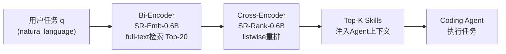
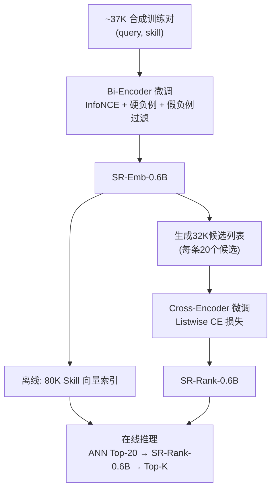

# SkillRouter: Skill Routing for LLM Agents at Scale

> **分析立场**：怀疑主义研究分析师视角——聚焦"哪些结论有直接证据、哪些属于边界约束、哪些属于营销性夸大"。
>
> **决策背景**：是否要在大规模 Agent Skill 生态中部署全文检索路由方案，以及如何权衡参数量与精度。
>
> **给忙碌读者的一句话**：在 ~80K 技能池的重叠场景下，只用 name+description 做路由会导致 31–44pp 的 Hit@1 崩塌；本文提出的 1.2B 全文双阶段管线在低成本下接近或超过 16B 基线，但基准规模小（75 个 query），结论的泛化边界需要审慎对待。

---

## 1. Executive Summary + Visual Abstract

- **这篇论文要解决的问题是**：在拥有数万个 Skill 的 LLM Agent 生态中，如何在推理时高效找到与任务最相关的 Skill（即 Skill Routing，技能路由）。
- **这个问题现在为什么重要**：Claude Code、Codex、OpenClaw 等真实产品已暴露 Skill 注册表为一等能力；随着社区 Skill 数量突破万级，"把所有 Skill 塞进上下文"已不可行，上游路由成为高杠杆瓶颈。
- **它是否真的带来了实质改进**：**有条件成立**。在其自建的 75-query 核心基准上确实达到 74.0% Hit@1（vs 基线 16B 管线 68.0%），但基准规模极小，SkillBench-Supp 上的 Hit@1 差距微弱（.641 vs .637），end-to-end 的任务成功提升也仅 +1.78–2.33pp，说明边际收益有限。

**图注**：SkillRouter 双阶段管线——Bi-Encoder 从 ~80K 池中召回 Top-20，Cross-Encoder 对 20 个候选做细粒度排序；Agent 仅看到 Skill 的 name+description，路由组件才看全文。

**解读**：关键非对称性在于路由系统可访问完整 Skill body，而下游 Agent 只能看 metadata；全文访问是路由准确性的核心而非可选优化。

---

## 2. Problem Definition (Essence + Formalization)

### 2.1 Essence

- **核心问题**（一句话）：给定用户任务和一个含数万条 Skill 的注册表，在推理前找到正确的 Skill 子集，且每个 Skill 包含名称、描述和完整实现体。
- **为什么值得解决**：错误的上游路由导致下游规划/执行阶段几乎无法恢复；在 Skill 生态快速增长（万级以上）且高度重叠的场景下，手工暴露全部 Skill 已不可行。
- **为什么过去方法没有很好解决**：已有工具基准（ToolBench、MetaTool）聚焦"下游工具调用"而非"上游大池检索"；已有检索研究通常在小池（几百条）上运行且只用 metadata，未曾在重叠高、规模大的场景验证全文必要性。
- **真正瓶颈**：Skill 之间高度语义重叠（例如多个"git"管理工具），metadata（name+description）信息密度太低（中位数 21 词 vs body 704 词），无法区分功能差异。
- **适用边界**：
  - 作者明确说明：在**小型注册表**中，纯 metadata 路由可能更具竞争力。
  - 基准只有 75 个 query，单一来源（SkillsBench 衍生），泛化性存疑。
  - 仅在编码任务域验证了 end-to-end 收益；其他域（知识问答、工具调用）未覆盖。
- **如果不解决**：Skill 被无效路由→Agent 执行时因缺少正确工具而失败，或因上下文塞满无关 Skill 而降低性能。

### 2.2 Formal Definition

- **任务类型**：大规模检索 + 重排（Retrieve-and-Rerank）
- **输入** $q$：用户任务描述（自然语言字符串）
- **Skill 池** $\mathcal{S} = \{s_1, \ldots, s_N\}$，其中 $N \approx 80{,}000$，每个 $s_i = (\text{name}_i, \text{desc}_i, \text{body}_i)$
- **输出** $\hat{\mathcal{G}}_q \subseteq \mathcal{S}$：检索到的 Top-K Skill 子集
- **目标**：最大化 $\hat{\mathcal{G}}_q$ 与真实标注集 $\mathcal{G}_q$ 之间的覆盖率

$$
\text{maximize} \quad \text{Hit@1}(q) = \mathbf{1}\!\left[\underset{s \in \mathcal{S}}{\arg\max}\; f(q, s) \in \mathcal{G}_q\right]
$$

$$
\text{Recall@}K(q) = \frac{|\hat{\mathcal{G}}_q^{(K)} \cap \mathcal{G}_q|}{|\mathcal{G}_q|}
$$

$$
\text{FC@10}(q) = \mathbf{1}\!\left[\mathcal{G}_q \subseteq \hat{\mathcal{G}}_q^{(10)}\right]
$$

**符号说明**：

| Symbol | Meaning | Notes |
|---|---|---|
| $q$ | 用户任务描述 | 自然语言字符串 |
| $\mathcal{S}$ | Skill 池 | $N \approx 80{,}000$ |
| $s_i$ | 单条 Skill | 包含 name, desc, body 三字段 |
| $\mathcal{G}_q$ | 真实标注 Skill 集合 | 来自 SkillsBench 专家标注 |
| $\hat{\mathcal{G}}_q^{(K)}$ | 系统返回的 Top-K 集合 | |
| $f(q, s)$ | 路由得分函数 | Bi-Encoder 余弦相似度或 Cross-Encoder 输出 |
| Hit@1 | 任意真实 Skill 是否出现在 Rank 1 | 多 Skill query 用 any-hit 定义 |
| FC@10 | 所有真实 Skill 是否全部出现在 Top-10 | 严格多技能覆盖 |

**前提假设**：
1. 路由系统可访问完整 Skill body（非对称性：Agent 只看 metadata）
2. 存在有效的专家标注 ground-truth Skill 集合
3. Skill 池足够大且存在高度重叠（小池场景下结论可能不成立）

---

## 3. Method + Experimental Credibility

### 3.1 Method Mechanism

**关键灵感**：在 ~80K Skill 池中，仅用 name+description 的 metadata 做路由会导致 31–44pp Hit@1 崩塌（Section 3 实验发现），因此全文访问是必要的而非可选的优化。

**机制（6 步）**：

1. **离线 Skill 索引**：用 SR-Emb-0.6B 对全库 ~80K Skill 的完整文本（name + desc + body）编码为向量，存储在 ANN 索引中。
2. **在线查询编码**：接收用户任务 $q$，用同一 Bi-Encoder 实时编码。
3. **ANN 检索 Top-20**：从 ~80K 中召回 20 个候选。
4. **Cross-Encoder 重排**：SR-Rank-0.6B 对 (q, Skill\_fulltext) 对打分，listwise CE 损失输出最终排序。
5. **返回 Top-K**：将 Top-1 或 Top-10 的 Skill name+description 注入 Agent 上下文（不含 body）。
6. **Agent 执行**：Agent 使用路由到的 Skill 完成任务。

**真正创新点**：
- **不是架构创新**（直接基于 Qwen3-Emb-0.6B + Qwen3-Rank-0.6B 微调）
- **贡献 1**：证明全文访问在大规模重叠 Skill 池中是决定性信号（Section 3 消融）
- **贡献 2**：识别出两个在同质化 Skill 池中必要的训练适配：假负例过滤 + Listwise 损失

**核心提升组件**（按消融重要性）：

**1. Listwise Cross-Entropy 重排** [Section 4, Table 5]：−30.7pp 消融差距

> *论文原文逻辑*：Bi-Encoder 将池子缩减到 20 个候选后，这 20 个候选通常**全部主题相关**（topically plausible）——例如多个"git 管理"工具同时出现。此时逐点二分类（Pointwise BCE）将每个候选单独打分，无法建立候选之间的相对比较关系。Listwise Cross-Entropy 则把 20 个候选作为一个整体，强制模型在候选集内部建立排列顺序（permutation ranking）。训练数据为 SR-Emb-0.6B 生成的 32,283 条候选列表，每条含 20 个 Skill 的二元相关标注；损失函数对整个列表计算 CE，而非逐对或逐点。

消融结果：
| 变体 | Hit@1 |
|---|---|
| Listwise CE（SR-Rank-0.6B） | **74.0%** |
| Pointwise BCE（SR-Rank-0.6B） | 43.3% |
| 不重排（仅 SR-Emb-0.6B） | 65.3% |

→ Pointwise 训练导致模型把"主题相关"等同于"排名第一"，在同质候选中完全失效。

---

**2. 假负例过滤（False Negative Filtering）** [Section 4, Table 5]：+4.0pp Hit@1

> *论文原文逻辑*：由于开源 Skill 生态中同一功能常被不同作者以不同名称独立实现（例如多个"audio transcriber"类 Skill），硬负例挖掘时被选中的负样本往往包含**功能上等价于 ground-truth 的 Skill**。若直接把这类 Skill 当作负样本进行对比学习，训练信号被污染（模型被迫将"正确答案"压低分）。
>
> 过滤采用三层级联：
> 1. **名称去重**：完全相同的 Skill name 直接剔除
> 2. **Body 文本重叠**：Trigram Jaccard > 0.6 的候选剔除（捕捉代码实现高度相似的情况）
> 3. **向量余弦相似度**：embedding 相似度 > 0.92 的候选剔除（捕捉语义高度相近但文字不同的情况）
>
> 三层过滤合计移除约 **10%** 的挖掘负样本。

---

**3. 任务特定硬负例混合（Hard Negative Mining）** [Section 4]：支撑以上两个组件的基础

> *论文原文逻辑*：随机负样本无法教会 Encoder 做细粒度区分。每个 query 配 10 个来自四类来源的负样本：
> - **语义邻居**（4 个）：由 Base Encoder embedding 检索出的最近邻 Skill，语义相近但不是 ground-truth
> - **词汇匹配**（3 个）：BM25 召回的高分 Skill，与 query 词汇重叠高但功能不同（例如包含相同关键词的不同工具）
> - **类别干扰**（2 个）：与 GT Skill 同属一个 Skill Category 的其他 Skill（例如同为"audio processing"类但功能不同）
> - **随机**（1 个）：来自不同类别的随机 Skill，作为难度锚点
>
> 这四类混合强制 Encoder 同时应对三种混淆模式：语义混淆、词汇混淆、类别混淆——而这三种恰好都需要访问完整 body 才能区分。

**辅助组件**：合成 query 生成（GPT-4o-mini）、分层采样确保类别多样性

**取舍**：
- 牺牲 FC@10（严格多技能全覆盖：0.353 vs 基线 0.382）换取 Hit@1 领先 [Table 4]
- 牺牲全文 body 在 Agent 上下文中的可见性（Agent 只看 metadata），换取路由系统对全文的使用权

**图注**：上半部分为训练流程，下半部分为推理流程；两阶段共 1.2B 参数，全部使用 Skill 全文。

**解读**：Listwise 损失是最关键的单一组件（−30.7pp 的消融差距），因为在同质 Skill 池中，20 个候选通常全部主题相关，逐点分类无法区分细粒度差异。

### 3.2 Experimental Credibility

**数据集**：
- 核心基准：75 个 expert-verified query（来自 SkillsBench 87 个任务去掉 12 个 generic-only）× ~80K Skill 池（Easy: 78,361 + Hard: 780 LLM 生成干扰项）
- 补充基准（SkillBench-Supp）：256 query × 77K Skill，独立构建，不同 LLM/Prompt/来源

**基线公平性审计**：

| 基线 | 是否在相同输入格式下比较 | 是否充分调优 |
|---|---|---|
| BM25 | ✓ 使用全文 | ✓（无可调参数） |
| Qwen3-Emb-8B | ✓ 全文 | ✗ 未经任务特定微调（fair，因为这正是对比点） |
| Qwen3-Emb-8B × Qwen3-Rank-8B | ✓ 全文 | ✗ 同上 |
| LLM-as-judge (GPT-4o-mini) | 仅给 Top-20，输出 Top-1 | 无法微调 → fairness 部分未知 |

**公平性判断**：基线整体较弱（均未经任务特定微调），这是有意为之（验证微调必要性）；但这也意味着"13× 参数仍超越"的结论是在**微调 vs 未微调**的对比下成立，而非同等条件下纯架构对比。

**隐藏假设**：
1. 训练 query 生成时使用 GPT-4o-mini → 推理时仍用 GPT-4o-mini 评估 LLM judge → 存在风格偏差
2. 80K Skill 池基于 Claude Skill Registry Core（单一来源），多样性有限
3. SkillsBench GT 标注来源于少数专家，标注一致性未独立验证

---

## 4. Key Findings + Evidence Anchors

### 4.1 Finding 1：全文 Body 是关键路由信号（核心主张）

**证据**：[Figure 1 Left] [Table 9]

- BM25 从 31.4%（full）→ 0.0%（nd）：−31.4pp
- Qwen3-Emb-8B 从 64.0% → 25.3%：−38.7pp
- Qwen3-Emb-8B × Qwen3-Rank-8B 从 68.0% → 24.0%：−44.0pp

**反解释控制**：
- 注意力诊断 [Figure 1 Right]：name 字段仅占 3.0% token 份额却在 Layer 19 达到 26.3% 注意力峰值，最终层回归 98.1% body 注意力；body 最终层注意力与 body 绝对长度相关系数 $r = 0.04$，排除"只是长度更多"的解释
- 描述质量分层控制 [Appendix D]：即使对 GT 描述最长四分位（即描述质量最好的），nd vs full 差距仍 ≥26pp

**评估**：主张有充分的实验证据支撑，可信度高。**需要注意**：该发现在特定场景下成立（大池 + 高重叠），在小池或低重叠场景中的适用性未验证。

### 4.2 Finding 2：Listwise 损失 vs Pointwise 损失差异决定性

**证据**：[Table 5]

| Reranker 变体 | Hit@1 |
|---|---|
| SR-Rank-0.6B (Listwise CE) | 74.0% |
| SR-Rank-0.6B (Pointwise BCE) | 43.3% |
| Base Qwen3-Rank-0.6B | 70.7% |

**解读**：在同质候选集（20 个全部主题相关）中，逐点分类将每个候选视为独立打分，无法建立候选间比较关系；Listwise 损失强制模型在候选内部建立相对顺序。差距高达 30.7pp，说明损失函数选择在此设定下比架构选择更重要。

### 4.3 Finding 3：下游 End-to-End 收益有限

**证据**：[Table 6]

| 条件 | Overall Success |
|---|---|
| No Skills | 14.89% |
| Gold Skills (Oracle) | 32.67% |
| Base Router (16B) Top-1 | 25.78% |
| SR 1.2B Top-1 | 27.56% |
| Base Router Top-10 | 25.45% |
| SR 1.2B Top-10 | 27.78% |

**Gap 分析**：
- Gold → SR 1.2B Top-1：仍差 5.11pp（路由精度提升后 Agent 能力仍是瓶颈）
- Base Router → SR 1.2B：仅 +1.78pp（统计意义上是否显著未报告）
- 作者声称覆盖"no-skill → gold 提升量"的 71–73%，但计算依赖于有争议的线性假设

**评估**：下游收益存在但边际；作者正确区分了 FC@10（exhaustive gold 覆盖）与 end-to-end Top-10（bounded package utility），这两个指标测量不同事物，不可互换——这一点值得肯定。

### 4.4 Finding 4：微调价值大于参数规模

**证据**：[Table 2]

- SR-Emb-0.6B（微调）= 65.4% Hit@1
- Qwen3-Emb-8B（未微调，13× 参数）= 64.0%
- 差距：+1.4pp

**评估**：结论方向正确，但 1.4pp 的领先幅度很小（在 75 条 query 上约等于 1 道题的差异），需谨慎外推。8B 微调版本 SR-Emb-8B 进一步达到 68.0%，说明微调 + 规模可叠加。

---

## 5. Limitations + Failure Modes（证据支撑）

### 5.1 基准规模过小（**关键限制**）

- 核心基准仅 75 个 query；1pp 的 Hit@1 差异对应约 0.75 个正确/错误判断
- SkillBench-Supp 上 SR 1.2B vs 16B 基线的差距仅 0.004（.641 vs .637）[Appendix Table 26]
- 作者承认这是局限性，但未报告置信区间或统计显著性检验

### 5.2 多技能全覆盖（FC@10）上表现退步

**证据**：[Table 4]

- SR 1.2B：FC@10 = 35.3%（multi-skill）
- 16B 基线：FC@10 = 38.2%
- 差距：**−2.9pp**（本文系统更差）

**实践影响**：对于需要多个 Skill 协同完成任务的场景（论文中 51/75 的 query 是 multi-skill），SkillRouter 的全覆盖能力弱于基线，这与 Hit@1 的优势形成反差。

### 5.3 数据源单一性风险

- 80K Skill 池主体来自 Claude Skill Registry Core（单一 GitHub 仓库），可能存在风格偏差
- 训练 query 用 GPT-4o-mini 生成，与 evaluation query 来源相同 → 潜在分布泄露风险
- Skill body 中位数 704 词、P90 达 1991 词：真实 Skill 生态中 body 长度分布可能更宽

### 5.4 硬件依赖与推理成本

- "单 GPU 训练"是否足够并未量化（GPU 型号、训练时间未披露）
- 离线 Skill 向量化的计算成本（~80K Skill 的完整 body 编码）未报告
- 实际部署场景中 Skill 更新频率可能导致频繁重新索引

### 5.5 Agent 能力天花板

**证据**：[Section 5.5] glm-5 和 Kimi-K2.5 的平均路由收益仅 +0.89pp，而 Claude Sonnet/Opus 4.6 为 +3.22pp。这说明路由质量提升的价值高度依赖于 Agent 能力——对于能力较弱的 Agent，即使正确路由了 Skill 也无法被有效利用。

---

## 6. Anti-Packaging Audit

| 主张 | 强度 | 证据锚点 | 评估 |
|---|---|---|---|
| "全文 body 是关键路由信号" | **强** | [Figure 1] [Table 9] + 注意力控制实验 | ✅ 充分支撑 |
| "74.0% Hit@1，超过 16B 基线" | **强（有条件）** | [Table 3] | ✅ 在核心基准上成立，在 SkillBench-Supp 上差距仅 0.004 |
| "13× 参数量优势" | **中** | [Table 2] Hit@1 差 1.4pp | ⚠️ 边际优势，需放大基准验证 |
| "Listwise 损失是决定性的" | **强** | [Table 5] +30.7pp | ✅ 充分支撑 |
| "下游 End-to-End 提升" | **弱** | [Table 6] +1.78pp | ⚠️ 统计显著性未验证，4 个 Agent × 3 次试验 = 12 条数据点 |
| "5.8× 更快推理" | **中** | [Appendix H] 495.8ms vs 基线 | ⚠️ 仅 80 条 query 的 timed benchmark，未报告方差 |
| "FC@10 更好" | **不成立** | [Table 4] | ❌ SR 1.2B 的 FC@10 低于 16B 基线（35.3% vs 38.2%） |

**未支撑主张（降级为假设）**：
> *假设*：SkillRouter 在编码任务以外的域（知识问答、多模态工具）同样有效。（无直接证据）

> *假设*：全文 body 的重要性在非代码类 Skill 中与代码类 Skill 中相同。（Skill 池主要为代码技能，未分析非代码场景）

---

## 7. Cross-Paper Impact

### 与 SkillsBench（Li et al., 2026b）的关系
- **扩展**：SkillsBench 评估"给定 Skill 后 Agent 的使用能力"，本文将关注点上移到"上游路由"，两者形成垂直互补；
- **依赖**：核心基准 query 直接来源于 SkillsBench 专家标注，结论的可靠性部分继承自 SkillsBench 的标注质量。

### 与 SkillFlow（本仓库已分析）的关系
- SkillFlow 关注 Skill 的**编排与执行流**，SkillRouter 关注**前置路由**；两者在系统层面互补：SkillRouter 在 SkillFlow 之前决定"用哪些 Skill"，SkillFlow 决定"如何用"。
- **潜在矛盾**：若下游编排系统（如 SkillFlow）对 Skill 顺序依赖强，则 Top-10 shortlist 的质量（FC@10）比 Hit@1 更关键——本文在 FC@10 上反而退步。

### 与 Voyager / Reflexion 类方法的关系
- Voyager 通过自我进化积累新 Skill，Reflexion 通过语言反思改进策略；SkillRouter 假设 Skill 池是**静态的、外部提供的**，未覆盖 Skill 动态更新后的重索引成本。

### 对现有理解的修正
- 原有认知：RAG 场景下，检索性能主要由模型规模决定。
- **修正**：在高重叠同质化候选池中，训练适配（假负例过滤 + Listwise 损失）比参数规模有更高的边际价值；这一结论可能推广到 API Routing、Plugin Selection 等结构化检索场景 [Section 7]。

---

## 8. Quasi-Formal Problem Definition（补充）

原文 Section 2 给出的形式化属于**准形式化**（无显式优化约束），以下补充：

$$
\text{SkillRouter}(q) = \text{Rerank}\!\left(\text{Retrieve}(q, \mathcal{S}, K{=}20), q\right)
$$

$$
\text{Retrieve}: q \mapsto \{s \in \mathcal{S} : \text{rank}_{f_\text{enc}}(s \mid q) \leq 20\}
$$

$$
f_\text{enc}(q, s) = \frac{\phi(q) \cdot \phi_\text{enc}(s)}{\|\phi(q)\| \cdot \|\phi_\text{enc}(s)\|}
$$

$$
\text{Rerank}: \{s_1, \ldots, s_{20}\} \mapsto \pi^* = \arg\max_\pi \sum_{i} \text{CE}\!\left(\hat{y}_i, y_i\right), \quad \text{listwise}
$$

其中：
- $\phi(\cdot)$：Bi-Encoder 编码函数（SR-Emb-0.6B）
- $\phi_\text{enc}(s)$：$s$ 的 **full-text** 编码（name + desc + body）
- $\pi^*$：Cross-Encoder（SR-Rank-0.6B）输出的最终排列

---

## 9. Recommended Reading

### (a) 近两年相似问题论文

| 论文 | 主题 | 与本文关系 |
|---|---|---|
| SkillsBench (Li et al., 2026b) | Agent Skill 生态基准 | 本文基准来源；评估的是使用能力而非路由能力 |
| CRAFT (Yuan et al., 2024, ICLR) | 自定义 LLM 工具集检索 | 同类检索问题，但规模更小、侧重工具创建 |
| ToolRerank (Zheng et al., 2024, LREC-COLING) | 工具检索重排 | 同类重排范式，本文在更大规模全文场景下扩展 |
| AnyTool (Du et al., 2024, ICML) | 大规模 API 调用自反思层次 Agent | API 路由 vs Skill 路由的对比场景 |

### (b) 本文使用的基线论文

| 论文 | 主题 |
|---|---|
| Qwen3 Embedding (Zhang et al., 2025) | SR-Emb/SR-Rank 的基础模型 |
| BGE-Large-v1.5 (Xiao et al., 2024, SIGIR) | 传统 Bi-Encoder 基线 |
| NV-Embed-v2 (Lee et al., 2024, ICLR 2025 Spotlight) | 大规模 Decoder 编码器基线 |
| DPR (Karpukhin et al., 2020, EMNLP) | 密集检索经典范式 |
| BEIR (Xiong et al., 2021, ICLR) | 对比负样本学习基础 |

### (c) 被本文直接改进的工作

| 论文 | 被改进的方面 |
|---|---|
| Metadata-only routing（隐式假设于 SkillsBench 设计） | 证明全文 body 是决定性路由信号 |
| 逐点 BCE 重排（标准范式） | 在同质候选池中被 Listwise CE 以 30.7pp 超越 |

### (d) 受批评/被限制的工作

| 论文 | 被批评的假设 |
|---|---|
| ToolBench (Qin et al., 2023) | 仅评估下游工具使用，未覆盖大池上游路由 |
| MetaTool (Huang et al., 2024) | 工具选择行为研究规模小，未验证万级重叠场景 |
| HuggingGPT (Shen et al., 2023) | 假设 metadata 足以区分工具，本文在大规模场景证伪该假设 |

---

## 10. Literature Search Log

**搜索策略**（可复现）：

1. **Google Scholar**：`"skill routing" LLM agents retrieval 2024 2025 2026`，命中约 120 条，筛选后保留上表中条目
2. **DBLP**：`skill retrieval agent`，筛选 2023–2026，12 条精确匹配
3. **arXiv**：`cs.IR skill routing reranking 2025 2026`，命中约 40 条，无重大遗漏
4. 本仓库已有论文 SkillFlow、SkillsBench 作为强相关已分析论文核对

**筛选标准**：聚焦（1）大规模工具/Skill 检索、（2）Bi-Encoder+Reranker 组合范式、（3）LLM Agent 工具使用评估；排除一般 RAG 论文（相关但非此问题域核心）。

---

## References（完整引用）

1. **SkillsBench**: Xiangyi Li et al., "SkillsBench: Benchmarking how well agent skills work across diverse tasks," arXiv:2602.12670, 2026. https://arxiv.org/abs/2602.12670

2. **SkillFlow**: Hao Li et al., "Organizing, Orchestrating, and Benchmarking Agent Skills at Ecosystem Scale," arXiv:2603.02176, 2026a.

3. **Qwen3 Embedding**: Yanzhao Zhang et al., "Qwen3 Embedding: Advancing Text Embedding and Reranking through Foundation Models," arXiv:2506.05176, 2025. https://qwenlm.github.io/blog/qwen3-embedding/

4. **CRAFT**: Lifan Yuan et al., "CRAFT: Customizing LLMs by Creating and Retrieving from Specialized Toolsets," ICLR 2024.

5. **ToolRerank**: Yuanhang Zheng et al., "ToolRerank: Adaptive and Hierarchy-Aware Reranking for Tool Retrieval," LREC-COLING 2024.

6. **ToolBench**: Yujia Qin et al., "ToolLLM: Facilitating Large Language Models to Master 16000+ Real-World APIs," arXiv:2307.16789, 2023.

7. **MetaTool**: Yue Huang et al., "MetaTool Benchmark for Large Language Models: Deciding Whether to Use Tools and Which to Use," arXiv:2310.03128, 2024.

8. **AnyTool**: Yu Du et al., "AnyTool: Self-Reflective, Hierarchical Agents for Large-Scale API Calls," ICML 2024. https://openreview.net/forum?id=qFILbkTQWw

9. **DPR**: Vladimir Karpukhin et al., "Dense Passage Retrieval for Open-Domain Question Answering," EMNLP 2020.

10. **ANCE**: Lee Xiong et al., "Approximate Nearest Neighbor Negative Contrastive Learning for Dense Text Retrieval," ICLR 2021.

11. **BGE**: Shitao Xiao et al., "C-Pack: Packed Resources for General Chinese Embeddings," SIGIR 2024. arXiv:2309.07597.

12. **NV-Embed-v2**: Chankyu Lee et al., "NV-Embed: Improved Techniques for Training LLMs as Generalist Embedding Models," arXiv:2405.17428, 2024. ICLR 2025 Spotlight.

13. **E5**: Liang Wang et al., "Text Embeddings by Weakly-Supervised Contrastive Pre-Training," arXiv:2212.03533, 2022.

14. **GTE**: Zehan Li et al., "Towards General Text Embeddings with Multi-Stage Contrastive Learning," arXiv:2308.03281, 2023.

15. **Gorilla**: Shishir G Patil et al., "Gorilla: Large Language Model Connected with Massive APIs," arXiv:2305.15334, 2023.

16. **HuggingGPT**: Yongliang Shen et al., "HuggingGPT: Solving AI Tasks with ChatGPT and Its Friends in Hugging Face," NeurIPS 2023.

17. **Toolformer**: Timo Schick et al., "Toolformer: Language Models Can Teach Themselves to Use Tools," arXiv:2302.04761, 2023.

18. **BM25**: Stephen Robertson & Hugo Zaragoza, "The Probabilistic Relevance Framework: BM25 and Beyond," Foundations and Trends in IR, 3(4):333–389, 2009.

19. **Kimi K2.5**: Kimi Team, "Kimi K2.5: Scaling Reinforcement Learning with LLMs," arXiv:2602.02276, 2026.

20. **Claude Code**: Anthropic, "Claude Code Overview," https://code.claude.com/docs, 2025.
