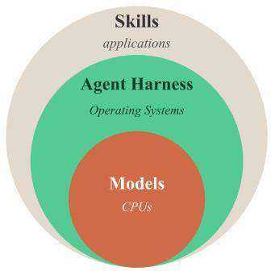
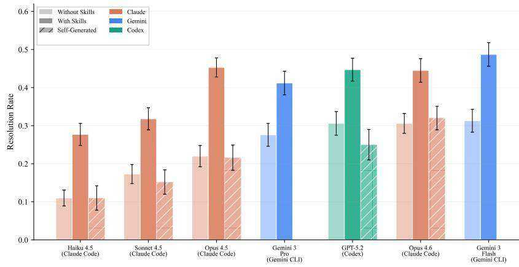
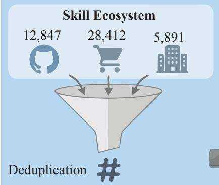
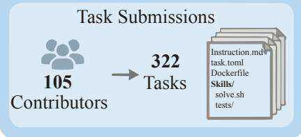
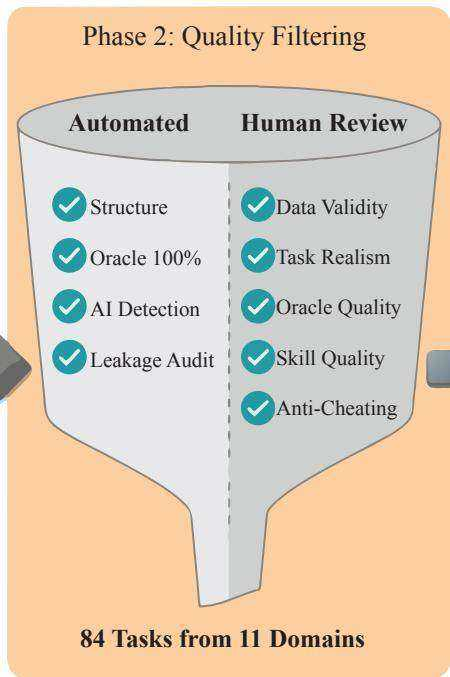
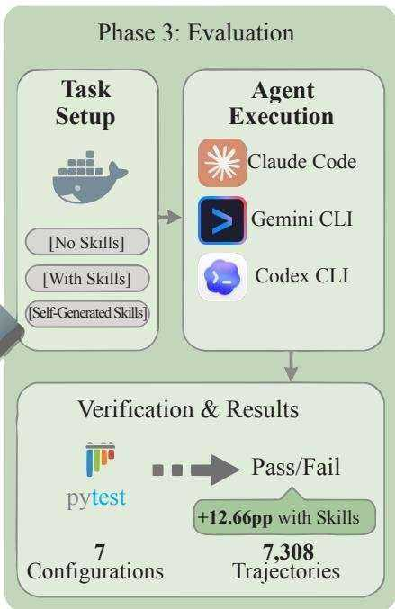
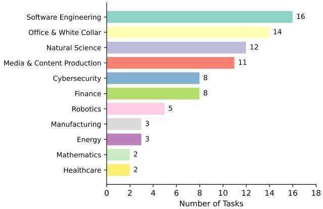
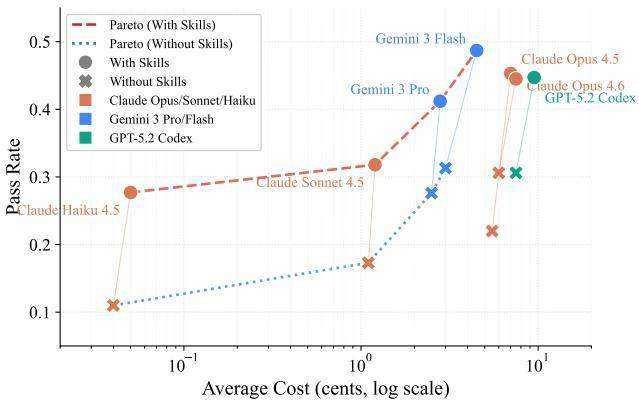

# SkillsBench: Benchmarking How Well Agent Skills Work Across Diverse Tasks

Xiangyi Li∗ 1 Yimin Liu∗ 2 Wenbo Chen∗ 3 † Shenghan Zheng∗ 4 Xiaokun Chen‡ 5 Yifeng He‡ 6 Yubo Li‡ 7 Bingran You‡ 8 Haotian Shen‡ 9 Jiankai Sun‡ 9 Shuyi Wang‡ 9 Binxu Li 10 Qunhong Zeng 9 Di Wang 11 Xuandong Zhao 8 Yuanli Wang 12 Roey Ben Chaim 13 Zonglin Di 14 Yipeng Gao 15 Junwei He 16 Yizhuo He 7 Liqiang Jing 17 Luyang Kong 9 Xin Lan 18 Jiachen Li 19 Songlin Li 5 Yijiang Li 20 Yueqian Lin 21 Xinyi Liu 9 Xuanqing Liu 9 Haoran Lyu 9 Ze Ma 22 Kaixin Li 9 Runhui Wang 9 Tianyu Wang 9 Wengao Ye 23 Yue Zhang 17 Hanwen Xing 9 Kaixin Li 9 Yiqi Xue 15 Steven Dillmann 5 Han-chung Lee 9

# Abstract

Agent Skills are structured packages of procedural knowledge that augment LLM agents at inference time. Despite rapid adoption, there is no standard way to measure whether they actually help. We present SKILLSBENCH, a benchmark of 86 tasks across 11 domains paired with curated Skills and deterministic verifiers. Each task is evaluated under three conditions: no Skills, curated Skills, and self-generated Skills. We test 7 agent-model configurations over 7,308 trajectories. Curated Skills raise average pass rate by 16.2 percentage points (pp), but effects vary widely by domain $( + 4 . 5 \mathrm { p p }$ for Software Engineering to $+ 5 1 . 9 \mathrm { p p }$ for Healthcare) and 16 of 84 tasks show negative deltas. Self-generated Skills provide no benefit on average, showing that models cannot reliably author the procedural knowledge they benefit from consuming. Focused Skills with 2–3 modules outperform comprehensive documentation, and smaller models with Skills can match larger models without them. We publish the dataset and evaluation harness to assist developers and researchers in future work at skillsbench.ai.

  
Figure 1: Agent architecture stack and resolution rates across 7 agent-model configurations on 84 tasks.

Curated Skills (beige) improve performance by $+ 1 6 . 2 \mathrm { p p }$ on average; self-generated Skills (amber) provide negligible or negative benefit.

# 1. Introduction

Large language models (LLMs) have evolved from text generators into autonomous agents capable of executing complex, multi-step tasks in real-world environments (Brown et al., 2020; Chowdhery et al., 2023; Touvron et al., 2023; Ouyang et al., 2022; Yao et al., 2022). This evolution is exemplified by agent-centric CLI tools: Claude Code (Anthropic, 2025b) from Anthropic, Gemini CLI (Google, 2025) from Google, and Codex CLI (OpenAI, 2025) from OpenAI enable developers to leverage frontier models as agentic assistants within terminal environments. However, a fundamental tension exists: foundation models provide broad

capabilities but lack the procedural knowledge required for domain-specific workflows, while fine-tuning is expensive and sacrifices generality.

Agent Skills offer an emerging solution. A Skill is a structured package comprising instructions, code templates, resources, and verification logic that augments agent behavior at inference time without model modification (Anthropic, 2025a). Skills encode procedural knowledge: standard operating procedures, domain conventions, and task-specific heuristics that guide agent behavior. This modular approach builds on the options framework for temporal abstraction (Sutton et al., 1999) and cognitive architectures for language agents (Sumers et al., 2023), mirroring successful computing paradigms: foundation models provide base capabilities (analogous to CPUs), agent harnesses orchestrate context and tools (operating systems), and Skills extend competence to specialized domains (applications).

Skills ecosystems have grown rapidly, with community repositories now hosting thousands of user-contributed Skills spanning software engineering, data analysis, and enterprise workflows. Yet despite this proliferation, no benchmark systematically evaluates how and when Skills improve agent performance, what content drives gains, or what design principles distinguish effective Skills from ineffective ones. section illustrates this layered architecture and previews our main result: curated Skills consistently improve resolution rates across all 7 model-harness configurations, while self-generated Skills provide negligible benefit. The question is not whether adding task-relevant context helps, but rather: How much do Skills help compared to baseline augmentation? Which Skills components (instructions vs. code vs. examples) contribute most? When do Skills fail despite being present?

Existing agent benchmarks (Liu et al., 2023; Merrill et al., 2026; Jimenez et al., 2024; Zhou et al., 2024b; Xie et al., 2024; Koh et al., 2024; Trivedi et al., 2024; Yang et al., 2023; Chan et al., 2025; Zhuo et al., 2025) evaluate raw model capabilities in isolation, answering “How well can this model perform task X?” but not “How much does Skills Y improve performance on task X?” This gap has practical consequences: practitioners cannot make informed decisions about Skills adoption, and researchers lack empirical grounding for Skills design principles.

To address this, we introduce SKILLSBENCH, the first benchmark that treats Skills as first-class evaluation artifacts, with two core contributions:

1. A Skills-centric evaluation framework. We curate 84 tasks across 11 domains, each executed under three conditions—no Skills, curated Skills, and self-generated Skills—with deterministic verifiers and full trajectory logging. We stratify tasks by difficulty and conduct leak-

age audits to ensure Skills provide guidance rather than solutions.

2. Large-scale empirical evaluation. We evaluate 7 agentmodel configurations across 7,308 trajectories, producing the first systematic evidence on Skills efficacy, variance, and failure modes.

# 2. SKILLSBENCH

We present SKILLSBENCH, a benchmark for evaluating the efficacy of Skills augmentation in LLM-based agents. Built on the Harbor framework (Merrill et al., 2026; Harbor Framework Team, 2026), each task adopts a containerized structure with an environment that includes agent Skills and related data, a deterministic verification test, and an oracle solution. Following best practices for agentic benchmarks (Zhu et al., 2025; Anthropic, 2026), we ensure strict isolation and deterministic verification. Unlike Terminal-Bench, which evaluates raw model and agent harness capability, SKILLSBENCH introduces a key methodological difference: we evaluate every task under both vanilla (no Skills) and Skills-augmented conditions, enabling direct measurement of Skills efficacy.

# 2.1. Skills Specification

A Skill is an artifact that satisfies four criteria:

• Procedural content: Contains how-to guidance (procedures, workflows, SOPs), not factual retrieval   
• Task-class applicability: Applies to a class of problems, not a single instance   
• Structured components: Includes a SKILL.md file plus optional resources (scripts, templates, examples)   
• Portability: Skills are soley based on file systems, so it’s easy to edit, version, share, and be used across different skills-compatible agent harnesses.

This definition explicitly excludes: system prompts (lack structure and resources), few-shot examples (Brown et al., 2020) (declarative, not procedural), RAG retrievals (Lewis et al., 2020) (factual, not procedural), and tool documentation (Schick et al., 2023; Qin et al., 2024) (describes capabilities, not procedures). We acknowledge this boundary is not absolute (for example, a StackOverflow answer may blend factual and procedural content), but our criteria provide operational clarity for benchmark construction. We highlight the distinguishing features of Skills compared to other augmentation paradigms in Table 1.

In SKILLSBENCH, each Skill is a modular package located in environment/skills/ containing: • SKILL.md: Natural language instructions specifying how to approach a class of tasks, i.e., workflows, standard operating procedures, or domain conventions. • Resources: Executable scripts, code templates, reference documentation, or worked

Table 1. Comparison of runtime augmentation paradigms. Skills uniquely combine modular packaging with procedural guidance and optional executable resources, while remaining portable across models and harnesses.   

<table><tr><td></td><td>Prompts</td><td>RAG</td><td>Tools</td><td>Skills</td></tr><tr><td>Modular/reusable</td><td>×</td><td>✓</td><td>✓</td><td>✓</td></tr><tr><td>Procedural guidance</td><td>Limited</td><td>×</td><td>×</td><td>✓</td></tr><tr><td>Executable resources</td><td>×</td><td>×</td><td>✓</td><td>✓</td></tr><tr><td>Cross-model portable</td><td>✓</td><td>✓</td><td>✓</td><td>✓</td></tr></table>

examples that the agent may invoke or consult.

# 2.2. Task Specification

Each task in SKILLSBENCH is a self-contained module comprising four components:

• Instruction. A human-readable task description specifying the objective, input format, and expected output. We write instructions to be solvable by a knowledgeable human without access to the paired Skills, though the Skills may substantially reduce time-to-solution.   
• Environment. A Docker container with task-specific data files and a skills/ subdirectory containing modular Skills packages. The container ensures reproducibility through isolated dependencies and clean file system state.   
• Solution. A reference implementation demonstrating the task’s resolvability. This oracle validates that each task has at least one correct solution path.   
• Verifier. Deterministic test scripts with programmatic assertions, including numeric tolerances where appropriate. This ensures reproducible pass/fail determination without LLM-as-a-judge variance, following execution-based evaluation best practices (Wang et al., 2023b; Brown, 2025).

# 2.3. Dataset Construction

The expressive and flexible nature of Skills and our task specifications enables broad coverage across diverse domains and problem types such as .... To maximize this diversity, we adopted a community-driven, open-source contribution model: 105 contributors from both academia and industry submitted 322 candidate tasks. We count submissions that included the full task specification (instruction, environment, solution, and verifier), along with authorassessed difficulty ratings. From this pool, we curated the final SKILLSBENCH dataset.

# 2.4. Contributing Principles

Contributors must satisfy explicit requirements designed to ensure task quality and prevent shortcuts:

Human-Authored Instructions. Task instructions must be written by humans, not generated by language models. We enforce this because LLMs generated queries will be confined by the distributions of LLMs, which are the subject of our evaluations, and LLM-generated queries are most of the time of low quality.

Skill Generality. Skills must provide procedural guidance for a class of tasks, not solutions to specific instances. Instructions must not reference which Skills to use, meaning agents must discover and apply Skills autonomously. This ensures we measure genuine Skill utilization rather than instruction-following.

Deterministic Verification. All success criteria must be testable through programmatic assertions. We target minimal number of tests needed for verification, avoiding both insufficient coverage and redundant test bloat that leads to artifical low pass rates. Tests must include informative error messages and use parametrization rather than duplication.

Automated Validation. Each submission undergoes automated validation before human review:

• Structural validation: Required files present (instruction.md, task.toml, solve.sh, test_outputs.py), correct directory layout, valid TOML/YAML syntax.   
• Oracle execution: Reference solution must achieve $100 \%$ test pass rate. Tasks with failing oracles are rejected.   
• Instruction quality: Instruction must be human written (we apply both human review and GPTZero review, and we achieve human label on $100 \%$ of our tasks). We also evaluate instructions by six criteria (explicit output paths, structured requirements, success criteria, constraints listed, context-first ordering).

Human Review. After automated checks pass, maintainers conduct manual review evaluating five criteria: (1) data validity: input data must reflect real-world complexity; synthetic or toy data is rejected unless justified; (2) task realism: scenarios must reflect realistic professional workflows without artificial difficulty; (3) oracle quality: reference solutions should match how domain experts would solve the task; (4) Skill quality: Skills must be error-free, internally consistent, and genuinely useful for similar tasks beyond this benchmark; (5) anti-cheating: tasks must prevent shortcut solutions (editing input data, extracting answers from test files, exploiting verifier implementation). Reviewers run benchmark experiments with and without Skills across multiple agents to confirm each task provides meaningful signal about Skill efficacy. Figure 2 provides an end-to-end overview of the three-phase pipeline: benchmark construction, quality filtering, and evaluation.

  
Phase 1: Benchmark Construction

  
47,150 Unique Skills

  
Figure 2. SKILLSBENCH pipeline overview. Phase 1 (Benchmark Construction): We aggregate Skills from three sources—opensource repositories (12,847), the Claude Code ecosystem (28,412), and corporate partners (5,891)—yielding 47,150 unique Skills after deduplication. In parallel, 322 contributors submit 105 candidate tasks. Phase 2 (Quality Filtering): Each task undergoes automated checks (structural validity, AI detection, leakage audit) and human review (data validity, task realism, oracle quality, Skill quality, anti-cheating), producing 84 tasks spanning 11 domains. Phase 3 (Evaluation): Tasks are executed under three conditions (no Skills, with curated Skills, self-generated Skills) across three commercial agent harnesses (Claude Code, Gemini CLI, Codex CLI). Deterministic pytest verifiers produce pass/fail outcomes; 7 agent-model configurations yield 7,308 trajectories, with curated Skills providing $+ 1 2 . 6 6 \mathrm { p p }$ average improvement.

Table 2. Task difficulty stratification based on human completion time.   

<table><tr><td>Difficulty</td><td>Tasks</td><td>Human Time</td></tr><tr><td>Core</td><td>17 (19.8%)</td><td>&lt;60 min</td></tr><tr><td>Extended</td><td>43 (50.0%)</td><td>1–4 hours</td></tr><tr><td>Extreme</td><td>26 (30.2%)</td><td>&gt;4 hours</td></tr></table>

Leakage Prevention. To prevent Skills from encoding task-specific solutions, we enforce explicit authoring guidelines and conduct leakage audits. A Claude Code Agent SDK-based validation agent runs in CI to detect potential Skill-solution leakage; failed tasks are rejected. Skills must NOT contain: task-specific filenames, paths, or identifiers; exact command sequences that solve benchmark tasks; constants, magic numbers, or values from task specifications; references to specific test cases or expected outputs. Skills must be applied to a class of tasks, not a single instance; provide procedural guidance (how to approach), not declarative answers (what to output); and be authored independently of benchmark specifications.

  
Figure 3. SKILLSBENCH consists of tasks spanning 11 domains.

# 2.5. Benchmark Composition

SKILLSBENCH comprises 84 tasks across 11 domains, with category distribution shown in Figure 3. We stratify tasks by difficulty, measured by estimated completion time by individuals whom we consider median specialists for the tasks, without the assistance of AI tools. Original task contributors provided human time estimates, reviewed by an additional set of reviewers from the maintainers who are experts in the same domain.

# 3. Experimental Setup

We evaluate three commercial agent harnesses on SKILLS-BENCH across seven frontier models under three Skills conditions, resulting in 7,308 valid trajectories. A trajectory is valid when the agent passes, fails, or times out on a task without infrastructure and runtime errors. Each trajectory is one agent’s attempt at solving a single task under a specific Skills condition.

# 3.1. Agent Harnesses

We evaluate three commercial-line agents: Claude Code (Anthropic, 2025b), Codex CLI (OpenAI, 2025), and Gemini CLI (Google, 2025).

# 3.2. Models

We select seven frontier models: GPT-5.2 (OpenAI), Claude Opus 4.5, Claude Opus 4.6, Claude Sonnet 4.5, Claude Haiku 4.5 (Anthropic), Gemini 3 Pro, and Gemini 3 Flash (Google). All models use temperature 0 for deterministic sampling.

We evaluate each model using its compatible agent harness. Claude Code runs with all four Claude models; Gemini CLI runs with Gemini models; Codex CLI runs with GPT-5.2. This yields 7 model-harness configurations. The full configuration matrix is in Table 7.

# 3.3. Skills Conditions

We evaluate each task under three conditions:

• No Skills: Agent receives only instruction.md, no Skills present in environment.   
• With Skills: Complete environment/skills/ directory with all examples, code snippets, and resources.   
• Self-Generated Skills: No Skills provided, but the agent is prompted to generate relevant procedural knowledge before solving the task. This isolates the impact of LLMs’ latent domain knowledge.

The self-generated condition is evaluated on 5 of 7 configurations (all Claude Code models and Codex); Gemini CLI does not support this condition.

# 3.4. Evaluation Protocol

We provide Skills as system-level context preceding the task instruction in SKILLSBENCH. We list the injection format and context management details in Appendix E. For each condition, the agent interacts with the containerized environment until task completion, timeout, or round limit. The verifier then executes deterministic assertions to produce a binary pass/fail outcome.

# 3.5. Metrics

Pass Rate. The primary metric is pass rate, following the scoring methodology of Terminal-Bench (Merrill et al., 2026): for each task, we average the binary reward across 5 trials, then average these task-level scores using a fixed denominator of 84 (the number of evaluated tasks). Normalized Gain. Following Hake’s formulation from physics education research (Hake, 1998), we define normalized gain as:

$$
g = \frac {\text {p a s s} _ {\text {s k i l l}} - \text {p a s s} _ {\text {v a n i l l a}}}{1 - \text {p a s s} _ {\text {v a n i l l a}}} \tag {1}
$$

Interpreting Normalized Gain. Normalized gain has known limitations: a model scoring $90 \%$ vanilla and $9 5 \%$ with Skills yields $g = 0 . 5$ , identical to a model scoring $10 \%$ and $55 \%$ . These represent different phenomena (ceiling effects vs. genuine scaffolding). We report both absolute improvement $( \Delta )$ and normalized gain $( g )$ to enable nuanced interpretation. High $g$ with low $\Delta _ { \mathrm { a b s } }$ suggests ceiling effects; high $g$ with high $\Delta$ suggests substantial scaffolding. We interpret the claim of “consistent scaffolding efficiency” as similar proportional benefit, not identical absolute improvement.

# 4. Results

Our results are twofold: 1. main evaluation three Skills conditions across 7 LLM–agent combinations on 84 tasks, and 2. detailed analysis of Skills design factors including quantity, complexity, and domain effects.

# 4.1. Experiment 1: Skills Efficacy Across LLM–Agent Combinations

We evaluate how curated and self-generated Skills affect agent performance across commercial model-harness configurations. We test each configuration under three conditions on all 84 tasks: no Skills, with curated Skills, and with self-generated Skills (where supported).

# 4.1.1. MAIN RESULTS

Table 3 presents pass rates across all three conditions for each model-harness combination, ordered by with-Skills performance.

Finding 1: Skills provide substantial but variable benefit. Skills improve performance by $+ 1 6 . 2 \mathrm { p p }$ on average across 7 model-harness configurations, but with high variance across configurations (range: $+ 1 3 . 6 \mathrm { p p }$ to $+ 2 3 . 3 \mathrm { p p }$ ). This variability suggests that Skills efficacy depends strongly on the specific agent-model combination, contradicting the assumption of uniform Skills benefits.

Table 3. Pass rates $( \% )$ and normalized gain $( g )$ across three Skills conditions on 84 tasks. $g$ measures proportional improvement toward perfect performance (Equation 1). Configurations ordered by with-Skills pass rate. “–” indicates condition not evaluated.   

<table><tr><td rowspan="2">Harness</td><td rowspan="2">Model</td><td rowspan="2">No Skills</td><td colspan="2">Curated Skills</td><td colspan="2">Self-Generated</td></tr><tr><td>Pass Rate</td><td>g (%)</td><td>Pass Rate</td><td>g (%)</td></tr><tr><td>Gemini CLI</td><td>Gemini 3 Flash</td><td>31.3</td><td>48.7</td><td>25.3</td><td>-</td><td>-</td></tr><tr><td>Claude Code</td><td>Opus 4.5</td><td>22.0</td><td>45.3</td><td>29.9</td><td>21.6</td><td>-0.5</td></tr><tr><td>Codex</td><td>GPT-5.2</td><td>30.6</td><td>44.7</td><td>20.3</td><td>25.0</td><td>-8.1</td></tr><tr><td>Claude Code</td><td>Opus 4.6</td><td>30.6</td><td>44.5</td><td>20.0</td><td>32.0</td><td>+2.0</td></tr><tr><td>Gemini CLI</td><td>Gemini 3 Pro</td><td>27.6</td><td>41.2</td><td>18.8</td><td>-</td><td>-</td></tr><tr><td>Claude Code</td><td>Sonnet 4.5</td><td>17.3</td><td>31.8</td><td>17.5</td><td>15.2</td><td>-2.5</td></tr><tr><td>Claude Code</td><td>Haiku 4.5</td><td>11.0</td><td>27.7</td><td>18.8</td><td>11.0</td><td>0.0</td></tr><tr><td>Mean</td><td></td><td>24.3</td><td>40.6</td><td>21.5</td><td>21.0</td><td>-1.8</td></tr></table>

Finding 2: Gemini CLI + Gemini 3 Flash achieves maximum performance. The best-performing configuration is Gemini CLI with Gemini 3 Flash, achieving $4 8 . 7 \%$ pass rate with Skills. Notably, Claude Code with Opus 4.5 achieves the highest improvement $( + 2 3 . 3 \mathrm { p p } )$ , reflecting Claude Code’s (Anthropic, 2025b) native Skills integration optimized for the Agent Skills specification (Anthropic, 2025a).

Finding 3: Self-generated Skills provide negligible or negative benefit. When prompted to generate their own procedural knowledge before solving tasks, models achieve –1.3pp on average compared to the no-Skills baseline. Only Opus 4.6 shows a modest improvement $\left( + 1 . 4 \mathrm { p p } \right)$ ; Codex $+ \mathrm { G P T } { \cdot } 5 . 2 $ degrades substantially $( - 5 . 6 \mathrm { p p } )$ , and remaining models are flat or negative. This contrasts sharply with curated Skills $( + 1 6 . 2 \mathrm { p p } )$ , demonstrating that effective Skills require human-curated domain expertise that models cannot reliably self-generate. Trajectory analysis reveals two failure modes: (1) models identify that domain-specific knowledge is needed but generate imprecise or incomplete procedures (e.g., listing “use pandas for data processing” without specific API patterns), and (2) for high domain– knowledge tasks (manufacturing, financial), models often fail to recognize the need for specialized Skills entirely, attempting solutions with general-purpose approaches.

# 4.1.2. HARNESS-SPECIFIC RELIABILITY

Beyond Skills efficacy, we observe reliability differences across commercial harnesses:

• Claude Code: Highest skills utilization rate; improvements range from $+ 1 3 . 9 \mathrm { p p }$ (Opus 4.6) to $+ 2 3 . 3 \mathrm { p p }$ (Opus 4.5), with all Claude models consistently benefiting.   
• Gemini CLI: Highest raw performance (Gemini 3 Flash achieves $4 8 . 7 \%$ with Skills); improvements range from $+ 1 3 . 6 \mathrm { p p }$ to $+ 1 7 . 4 \mathrm { p p }$ .   
• Codex CLI: Competitive raw performance $4 4 . 7 \%$ with Skills); frequently neglects provided Skills—agents acknowledge Skills content but often implement solutions independently.

# 4.1.3. DOMAIN-LEVEL ANALYSIS

Finding 4: Skills benefit varies widely across domains.

Table 4 presents Skill efficacy by domain, revealing substan-

  
Figure 4. Pareto frontier of pass rate vs. cost across model-harness configurations. Filled markers indicate with-Skills conditions; hollow markers indicate without-Skills. Skills shift the Pareto frontier upward, with Gemini 3 Flash and Claude Opus dominating the with-Skills frontier. Cost positions in this figure reflect the evaluation infrastructure’s pricing model. Trajectory analysis reveals that Flash consumes $2 . 3 \times$ more input tokens per task than Pro (1.08M vs. 0.47M), a compensatory strategy where the smaller model substitutes iterative exploration for reasoning depth. At official API pricing ($0.50 vs. $\$ 2.00$ per 1M input tokens), Flash’s $4 \times$ lower per-token cost more than offsets this higher volume, making Flash $44 \%$ cheaper per task ( $\$ 0.55$ vs. $\$ 0.98$ ).

Table 4. Skills efficacy by domain across 84 evaluated tasks (11 domains). All domains show positive aggregate delta, though individual tasks within each domain may show negative effects.   

<table><tr><td>Domain</td><td>With Skills</td><td>No Skills</td><td>Δabs</td></tr><tr><td>Healthcare</td><td>86.1%</td><td>34.2%</td><td>+51.9</td></tr><tr><td>Manufacturing</td><td>42.9%</td><td>1.0%</td><td>+41.9</td></tr><tr><td>Cybersecurity</td><td>44.0%</td><td>20.8%</td><td>+23.2</td></tr><tr><td>Natural Science</td><td>44.9%</td><td>23.1%</td><td>+21.9</td></tr><tr><td>Energy</td><td>47.5%</td><td>29.5%</td><td>+17.9</td></tr><tr><td>Office &amp; White Collar</td><td>42.5%</td><td>24.7%</td><td>+17.8</td></tr><tr><td>Finance</td><td>27.6%</td><td>12.5%</td><td>+15.1</td></tr><tr><td>Media &amp; Content Production</td><td>37.6%</td><td>23.8%</td><td>+13.9</td></tr><tr><td>Robotics</td><td>27.0%</td><td>20.0%</td><td>+7.0</td></tr><tr><td>Mathematics</td><td>47.3%</td><td>41.3%</td><td>+6.0</td></tr><tr><td>Software Engineering</td><td>38.9%</td><td>34.4%</td><td>+4.5</td></tr></table>

tial heterogeneity. Healthcare $( + 5 1 . 9 \mathrm { p p } )$ and Manufacturing $( + 4 1 . 9 \mathrm { p p } )$ benefit most, while Mathematics $( + 6 . 0 \mathrm { p p } )$ and Software Engineering $( + 4 . 5 \mathrm { p p } )$ show smaller gains. Domains requiring specialized procedural knowledge that is underrepresented in model pretraining (e.g., clinical data harmonization, manufacturing workflows) show the largest improvements, whereas domains with strong pretraining coverage benefit less from external procedural guidance.

# 4.1.4. TASK-LEVEL ANALYSIS

Analysis of 84 individual tasks reveals high variance in Skills effectiveness:

Top Skills beneficiaries. Tasks showing largest improvements: mario-coin-counting ${ + 8 5 . 7 } \mathrm { p p }$ , from $2 . 9 \%$

to $8 8 . 6 \%$ ), sales- pivot- analysis $\left( + 8 5 . 7 \mathrm { p p } \right)$ , flood-risk-analysis $\left( + 7 7 . 1 \mathrm { p p } \right)$ , sec-financi al-report $( + 7 4 . 3 \mathrm { p p } )$ . These tasks involve specialized procedural knowledge rarely covered in pretraining.

Skills hurt performance on some tasks. Despite positive domain-level aggregates, 16 of 84 tasks show negative Skills deltas: taxonomy-tree-merge (–39.3pp), energy- ac- optimal- power- flow $( - 1 4 . 3 \mathrm { p p } )$ , trend-anomaly-causal-inference $( - 1 2 . 9 \mathrm { p p } )$ , exoplanet-detection-period $\left( - 1 1 . 4 \mathrm { p p } \right)$ . These failures suggest Skills may introduce conflicting guidance or unnecessary complexity for tasks models already handle well.

# 4.2. Experiment 2: Skills Design Factors

To understand how Skills design affects efficacy, we analyze the relationship between Skills quantity, complexity, and performance.

# 4.2.1. SKILLS QUANTITY ANALYSIS

Table 5. Pass rates by number of Skills provided. 2–3 Skills shows optimal benefit.   

<table><tr><td>Skills Count</td><td>With Skills</td><td>No Skills</td><td>Δabs</td></tr><tr><td>1 skill</td><td>42.2%</td><td>24.4%</td><td>+17.8</td></tr><tr><td>2–3 skills</td><td>42.0%</td><td>23.4%</td><td>+18.6</td></tr><tr><td>4+ skills</td><td>32.7%</td><td>26.9%</td><td>+5.9</td></tr></table>

Finding 5: 2–3 Skills are optimal; more Skills show diminishing returns. Table 5 presents performance stratified by number of Skills provided per task. Tasks with 2–3 Skills show the largest improvement $( + 1 8 . 6 \mathrm { p p } )$ , while $^ { 4 + }$ Skills provide only $+ 5 . 9 \mathrm { p p }$ benefit. This non-monotonic relationship suggests that excessive Skills content creates cognitive overhead or conflicting guidance.

# 4.2.2. SKILLS COMPLEXITY ANALYSIS

Table 6. Pass rates by Skills complexity level. Detailed and compact Skills outperform comprehensive ones.   

<table><tr><td>Complexity</td><td>Pass Rate</td><td>Δabs</td><td>N</td></tr><tr><td>Detailed</td><td>42.7%</td><td>+18.8</td><td>1165</td></tr><tr><td>Compact</td><td>37.6%</td><td>+17.1</td><td>845</td></tr><tr><td>Standard</td><td>37.1%</td><td>+10.1</td><td>773</td></tr><tr><td>Comprehensive</td><td>39.9%</td><td>-2.9</td><td>140</td></tr></table>

Finding 6: Moderate-length Skills outperform comprehensive ones. We present the effects of Skills documentation complexity on performance in Table 6. Detailed $( + 1 8 . 8 \mathrm { p p } )$ and compact $( + 1 7 . 1 \mathrm { p p } )$ ) Skills provide the largest

benefit, while comprehensive Skills actually hurt performance $( - 2 . 9 \mathrm { p p } )$ . This suggests that focused procedural guidance is more effective than exhaustive documentation— agents may struggle to extract relevant information from lengthy Skills content, and overly elaborate Skills can consume context budget without providing actionable guidance.

# 4.2.3. MODEL SCALE EFFECTS

We study the effects of the foundation models’ scale across Claude model family (Opus, Sonnet, Haiku 4.5).

Finding 7: Smaller model $^ +$ Skills can exceed larger model without Skills. Claude Haiku 4.5 with Skills $( 2 7 . 7 \% )$ outperforms Haiku without Skills $( 1 1 . 0 \% )$ by $+ 1 6 . 7 \mathrm { p p }$ . Meanwhile, Claude Opus 4.5 without Skills achieves $2 2 . 0 \%$ . This demonstrates that Skills can partially compensate for model capacity limitations on procedural tasks.

# 5. Discussion

Skills close procedural gaps. Skills are most helpful when success depends on concrete procedures and verifier-facing details (steps, constraints, sanity checks), rather than broad conceptual knowledge. We observe large gains on domains with specialized workflows or brittle formats, and smaller or negative effects when models already have strong priors and the Skill adds overhead or conflicts.

Harnesses mediate Skills use. Skills efficacy depends not only on Skills quality but also on how the harness implements Skills. Some harnesses reliably retrieve and use Skills, while others frequently acknowledge Skills content but proceed without invoking them. Structured interfaces can also introduce long-trajectory failure modes (e.g., format drift), reducing the influence of early-injected Skills. This motivates evaluating Skills under multiple harnesses rather than treating “with Skills” as a single condition.

Implications for Skills authoring. Our analysis suggests that concise, stepwise guidance with at least one working example is often more effective than exhaustive documentation; overly long Skills definitions can increase context burden without improving decisions. Modular Skills also appear to compose better on multi-part tasks, and Skills should explicitly match harness constraints (e.g., repeated format reminders for JSON-only protocols).

# 5.1. Limitations and Future Work

Coverage and generalization. SKILLSBENCH focuses on terminal-based, containerized tasks for reproducible evaluation, so results may not directly transfer to GUI agents, multi-agent coordination, or very long-horizon workflows. We also evaluate a limited set of models and

harnesses; commercial harness behavior and Skills integration can change over time. A natural extension is to develop multi-modal skills and protocols for vision-language agents operating in GUI environments.

Causal attribution and controls. Skills injection increases context length, so observed gains could partly reflect “more context” rather than procedural structure. Our self-generated Skills condition suggests structure matters—models cannot reliably produce effective procedural guidance despite having the same context budget—but future work requires stronger length-matched baselines (e.g., random/irrelevant text and retrieval-only documentation controls). These baselines also enable studying automatic Skills synthesis from demonstrations or documentation and isolating which Skills components (steps, examples, code resources) drive improvements.

Determinism, contamination, and ecological validity. Containerization provides state isolation but not perfect determinism or immunity to training-set leakage. We mitigate with multiple runs, a leakage audit (§2.4), and paired (Skills vs. no Skills) comparisons, yet cannot eliminate all nondeterminism or memorization effects. Future work should evaluate ecosystem-representative settings, including lower-quality and automatically-selected Skills, and study Skills composition—when multiple Skills help or interfere, and whether composite performance can be predicted from atomic Skills effects.

# 6. Related Work

SKILLSBENCH connects to prior work on (1) benchmarking LLM agents, (2) augmenting agents with procedural knowledge and tools, and (3) evaluating improvements across heterogeneous systems.

Agent benchmarks. Recent evaluate end-to-end agent capability across realistic environments, including Terminal-Bench (Merrill et al., 2026), SWE-bench and follow-ons (Jimenez et al., 2024; Yang et al., 2024; 2025). Broader environment coverage appears in AgentBench and interactive/web/GUI settings (Liu et al., 2023; Zhou et al., 2024b; Koh et al., 2024; Xie et al., 2024). Other suites emphasize tool-mediated workflows, interactive execution feedback, or domain specialization (Yao et al., 2025; Trivedi et al., 2024; Yang et al., 2023; Chan et al., 2025; Zhang et al., 2024; Zhuo et al., 2025; Austin et al., 2021; Ye et al., 2025). These benchmarks measure how well a fixed agent completes tasks. SKILLSBENCH instead measures augmentation efficacy via paired evaluation.

Procedural augmentation and tool use. Prior work augments agents with structured reasoning or external knowledge, e.g., CoALA and Voyager (Sumers et al., 2023; Wang et al., 2023a), chain-of-thought and ReAct for multi-step problem solving (Wei et al., 2022; Yao et al.,

2023; 2022; Shinn et al., 2023; Madaan et al., 2023; Zhou et al., 2023; 2024a), and retrieval/tool use (Lewis et al., 2020; Zhou et al., 2022; Schick et al., 2023; Qin et al., 2024), and declarative optimization frameworks (Khattab et al., 2023). Skills combine procedural guidance with executable resources (§2.1). Despite many augmentation methods, benchmarks rarely quantify their actual impact.

Skills ecosystems and evaluation methodology. Anthropic’s Agent Skills and MCP specifications (Anthropic, 2025a; 2024) formalized skill packages and tool connectivity, while agent CLIs (Claude Code, Gemini CLI, and Codex) provide real-world harnesses (Anthropic, 2025b; Google, 2025; OpenAI, 2025). SKILLSBENCH evaluates both commercial harnesses and a model-agnostic harness based on Terminal-Bench (Merrill et al., 2026) to separate model and harness effects. Finally, broader benchmarking motivates careful reporting and comparability (Mattson et al., 2020; Chiang et al., 2024; Srivastava et al., 2023); we report both absolute gains and normalized gain (Hake, 1998) to compare improvements across different baselines (§3.5).

# 7. Conclusion

We introduced SKILLSBENCH, the first benchmark to systematically evaluate Agent Skills as first-class artifacts. Across 84 tasks, 7 agent-model configurations, and 7,308 trajectories under three conditions (no Skills, curated Skills, self-generated Skills), our evaluation yields four key findings: (1) curated Skills provide substantial but variable benefit $( + 1 6 . 2$ percentage points average, with high variance across domains and configurations); (2) self-generated Skills provide negligible or negative benefit (–1.3pp average), demonstrating that effective Skills require humancurated domain expertise; (3) less is more—focused Skills with 2–3 modules outperform comprehensive documentation; and (4) Skills can partially substitute for model scale, enabling smaller models to match larger ones on procedural tasks. These results establish that Skills efficacy is not universal but context-dependent, motivating paired evaluation as standard practice for agent augmentation research. SKILLSBENCH provides both the empirical foundation and open infrastructure for principled Skills design, selection, and deployment.

Acknowledgements. We thank Junxian He for guidance and advice; Terry Yue Zhuo for advice and for inviting collaborators; Yi R. (May) Fung for advice and paper writing guides; Gabriel Chua for providing last-minute API keys; Zachary Mueller for providing GPU resources through Lambda; and Ivan Burazin for providing Daytona credits. We also thank the following contributors for task and code contributions: Jianheng Hou, Jierun Chen, Jiahao Liu, Shutong Wu, Yulin Li, Zhenheng Tang, Benny Jiang, and Qingyang Ma.

