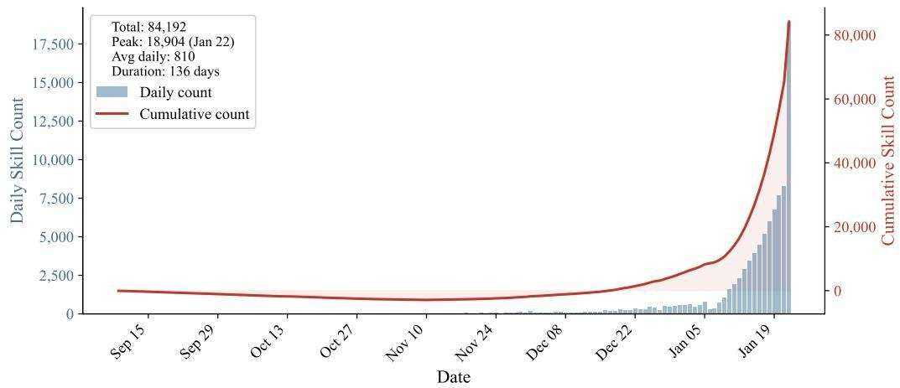
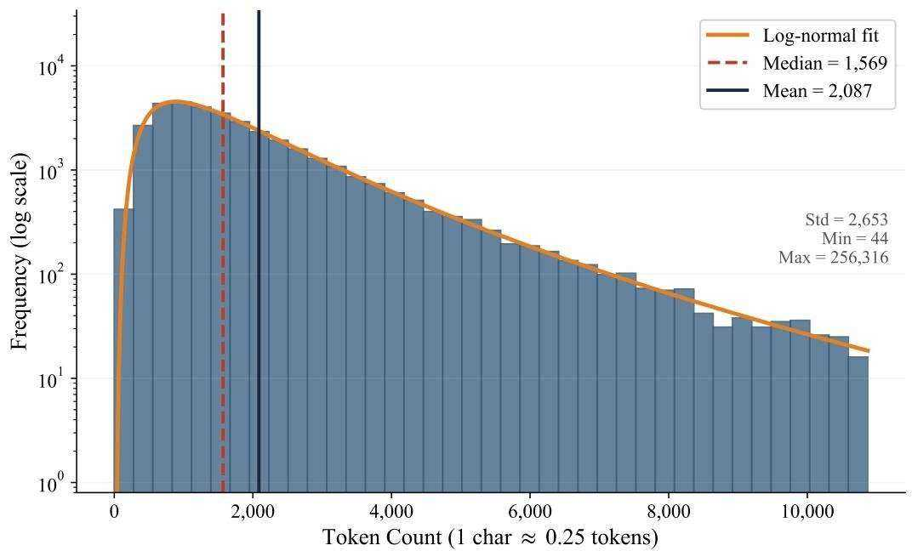
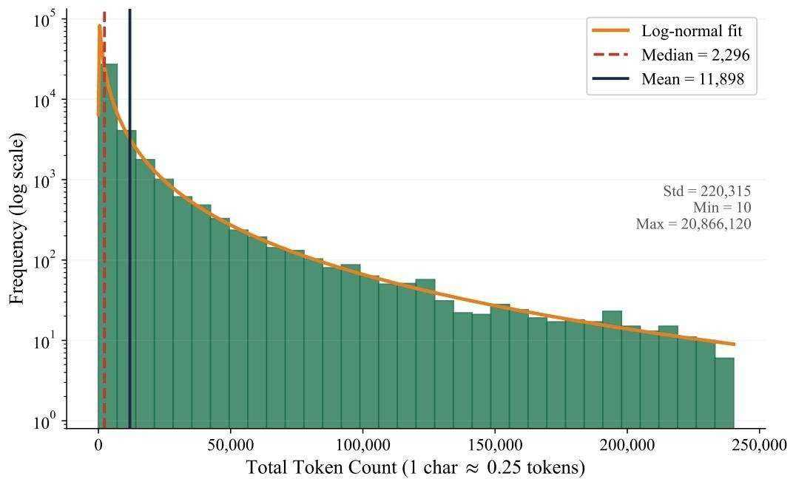
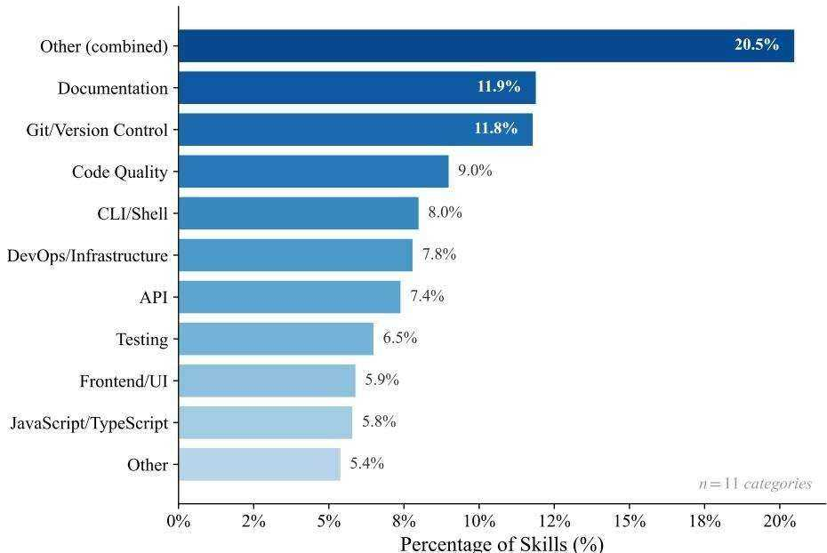
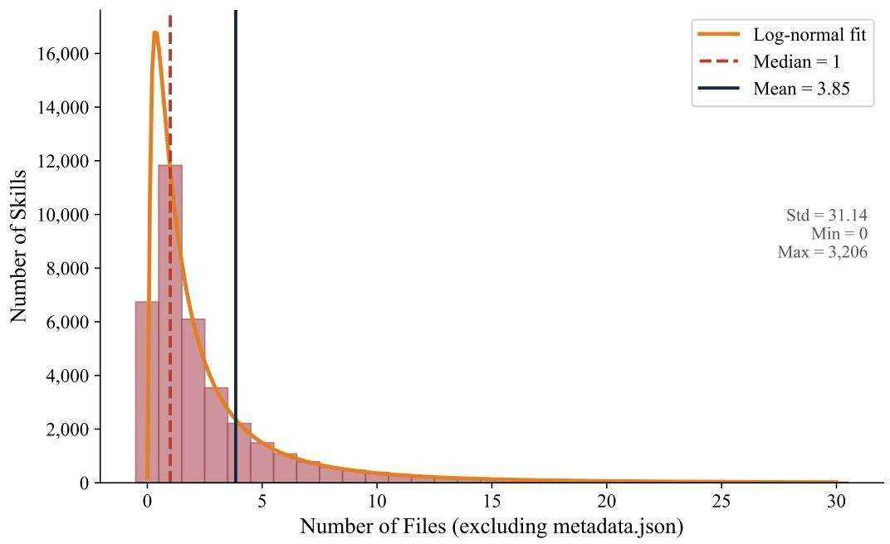
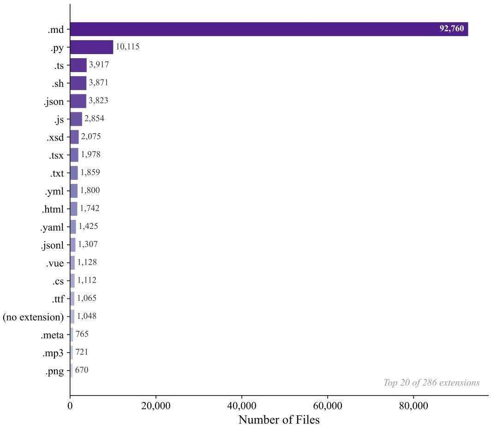
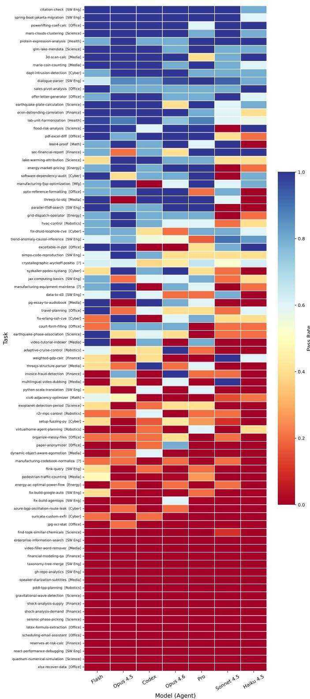
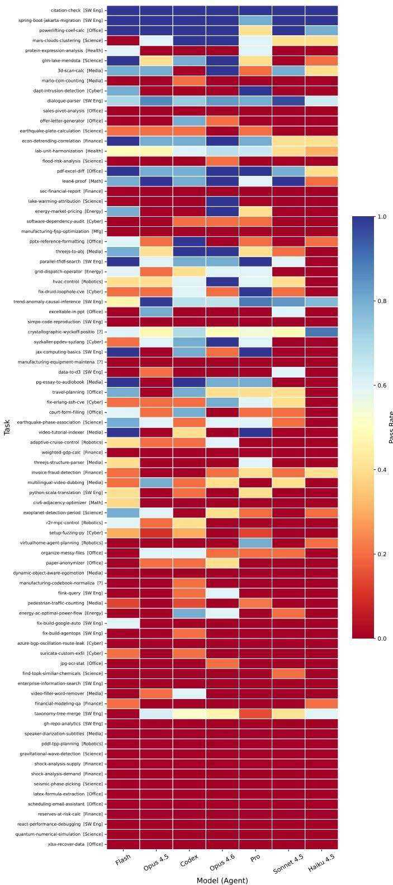
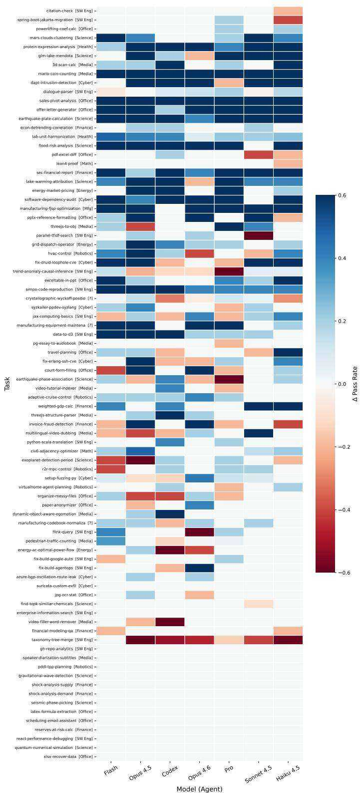

Anthropic. Introducing the model context protocol. https: //www.anthropic.com/news/model-conte xt-protocol, November 2024. Open standard for connecting AI systems with data sources.   
Anthropic. Equipping agents for the real world with Agent Skills. https://www.anthropic.com/engi neering/equipping-agents-for-the-rea l-world-with-agent-skills, October 2025a. Anthropic Engineering Blog.   
Anthropic. Claude Code: an agentic coding tool. https: //github.com/anthropics/claude-code, 2025b.   
Anthropic. Demystifying evals for AI agents. https: //www.anthropic.com/engineering/demy stifying-evals-for-ai-agents, 2026. Anthropic Engineering Blog.   
Austin, J., Odena, A., Nye, M., Bosma, M., Michalewski, H., Dohan, D., Jiang, E., Cai, C., Terry, M., Le, Q., et al. Program synthesis with large language models. arXiv preprint arXiv:2108.07732, 2021.   
Brown, T., Mann, B., Ryder, N., Subbiah, M., Kaplan, J. D., Dhariwal, P., Neelakantan, A., Shyam, P., Sastry, G., Askell, A., et al. Language models are few-shot learners. NeurIPS, 2020.   
Brown, W. Verifiers: Environments for llm reinforcement learning. https://github.com/PrimeIntell ect-ai/verifiers, 2025.   
Chan, J. S., Chowdhury, N., Jaffe, O., Aung, J., Sherburn, D., Mays, E., Starace, G., Liu, K., Maksin, L., Patwardhan, T., Madry, A., and Weng, L. MLE-bench: Evaluating machine learning agents on machine learning engineering. In ICLR, 2025.   
Chiang, W.-L., Zheng, L., Sheng, Y., Angelopoulos, A. N., Li, T., Li, D., Zhu, B., Zhang, H., Jordan, M., Gonzalez, J. E., et al. Chatbot arena: An open platform for evaluating llms by human preference. In ICML, 2024.   
Chowdhery, A., Narang, S., Devlin, J., Bosma, M., Mishra, G., Roberts, A., Barham, P., Chung, H. W., Sutton, C., Gehrmann, S., et al. Palm: Scaling language modeling with pathways. JMLR, 2023.   
Google. Gemini CLI: An open-source AI agent that brings the power of Gemini directly into your terminal. https: //github.com/google-gemini/gemini-cli, 2025.

Hake, R. R. Interactive-engagement versus traditional methods: A six-thousand-student survey of mechanics test data for introductory physics courses. American journal of Physics, 1998.   
Harbor Framework Team. Harbor: A framework for evaluating and optimizing agents and models in container environments, January 2026. URL https://github .com/laude-institute/harbor.   
Jimenez, C. E., Yang, J., Wettig, A., Yao, S., Pei, K., Press, O., and Narasimhan, K. R. SWE-bench: Can language models resolve real-world github issues? In ICLR, 2024.   
Khattab, O., Singhvi, A., Maheshwari, P., Zhang, Z., Santhanam, K., Vardhamanan, S., Haq, S., Sharma, A., Joshi, T. T., Moazam, H., et al. Dspy: Compiling declarative language model calls into self-improving pipelines. arXiv preprint arXiv:2310.03714, 2023.   
Koh, J. Y., Lo, R., Jang, L., Duvvur, V., Lim, M., Huang, P.-Y., Neubig, G., Zhou, S., Salakhutdinov, R., and Fried, D. Visualwebarena: Evaluating multimodal agents on realistic visual web tasks. In ACL, pp. 881–905, 2024.   
Lewis, P., Perez, E., Piktus, A., Petroni, F., Karpukhin, V., Goyal, N., Küttler, H., Lewis, M., Yih, W.-t., Rocktäschel, T., et al. Retrieval-augmented generation for knowledgeintensive nlp tasks. NeurIPS, 2020.   
Liu, X., Yu, H., Zhang, H., Xu, Y., Lei, X., Lai, H., Gu, Y., Ding, H., Men, K., Yang, K., et al. Agentbench: Evaluating llms as agents. arXiv preprint arXiv:2308.03688, 2023.   
Madaan, A., Tandon, N., Gupta, P., Hallinan, S., Gao, L., Wiegreffe, S., Alon, U., Dziri, N., Prabhumoye, S., Yang, Y., et al. Self-refine: Iterative refinement with self-feedback. NeurIPS, 2023.   
Mattson, P., Cheng, C., Diamos, G., Coleman, C., Micikevicius, P., Patterson, D., Tang, H., Wei, G.-Y., Bailis, P., Bittorf, V., et al. Mlperf training benchmark. MLSys, 2020.   
Merrill, M. A., Shaw, A. G., Carlini, N., Li, B., Raj, H., Bercovich, I., Shi, L., Shin, J. Y., Walshe, T., Buchanan, E. K., et al. Terminal-bench: Benchmarking agents on hard, realistic tasks in command line interfaces. arXiv preprint arXiv:2601.11868, 2026.   
OpenAI. Codex CLI: Lightweight coding agent that runs in your terminal. https://github.com/openai/ codex, 2025.   
Ouyang, L., Wu, J., Jiang, X., Almeida, D., Wainwright, C., Mishkin, P., Zhang, C., Agarwal, S., Slama, K., Ray, A., et al. Training language models to follow instructions with human feedback. NeurIPS, 2022.

Pan, M. Z., Cemri, M., Agrawal, L. A., Yang, S., Chopra, B., Tiwari, R., Keutzer, K., Parameswaran, A., Ramchandran, K., Klein, D., et al. Why do multiagent systems fail? In ICLR 2025 Workshop on Building Trust in Language Models and Applications, 2025.   
Qin, Y., Liang, S., Ye, Y., Zhu, K., Yan, L., Lu, Y., Lin, Y., Cong, X., Tang, X., Qian, B., Zhao, S., Hong, L., Tian, R., Xie, R., Zhou, J., Gerstein, M., li, d., Liu, Z., and Sun, M. ToolLLM: Facilitating Large Language Models to Master $1 6 0 0 0 +$ Real-world APIs. In ICLR, 2024.   
Schick, T., Dwivedi-Yu, J., Dessì, R., Raileanu, R., Lomeli, M., Hambro, E., Zettlemoyer, L., Cancedda, N., and Scialom, T. Toolformer: Language models can teach themselves to use tools. NeurIPS, 2023.   
Shinn, N., Cassano, F., Gopinath, A., Narasimhan, K., and Yao, S. Reflexion: Language agents with verbal reinforcement learning. NeurIPS, 2023.   
Srivastava, A., Rastogi, A., Rao, A., Shoeb, A. A. M., Abid, A., Fisch, A., Brown, A. R., Santoro, A., Gupta, A., Garriga-Alonso, A., et al. Beyond the imitation game: Quantifying and extrapolating the capabilities of language models. TMLR, 2023.   
Sumers, T., Yao, S., Narasimhan, K. R., and Griffiths, T. L. Cognitive architectures for language agents. TMLR, 2023.   
Sutton, R. S., Precup, D., and Singh, S. Between MDPs and semi-MDPs: A framework for temporal abstraction in reinforcement learning. Artificial intelligence, 1999.   
Touvron, H., Lavril, T., Izacard, G., Martinet, X., Lachaux, M.-A., Lacroix, T., Rozière, B., Goyal, N., Hambro, E., Azhar, F., et al. Llama: Open and efficient foundation language models. arXiv preprint arXiv:2302.13971, 2023.   
Trivedi, H., Khot, T., Hartmann, M., Manku, R., Dong, V., Li, E., Gupta, S., Sabharwal, A., and Balasubramanian, N. AppWorld: A Controllable World of Apps and People for Benchmarking Interactive Coding Agents. In ACL, 2024.   
Wang, G., Xie, Y., Jiang, Y., Mandlekar, A., Xiao, C., Zhu, Y., Fan, L., and Anandkumar, A. Voyager: An Open-Ended Embodied Agent with Large Language Models. arXiv preprint arXiv:2305.16291, 2023a.   
Wang, Z., Zhou, S., Fried, D., and Neubig, G. Executionbased evaluation for open-domain code generation. In Findings of EMNLP 2023, 2023b.   
Wei, J., Wang, X., Schuurmans, D., Bosma, M., Xia, F., Chi, E., Le, Q. V., Zhou, D., et al. Chain-of-thought prompting elicits reasoning in large language models. NeurIPS, 2022.

Xie, T., Zhang, D., Chen, J., Li, X., Zhao, S., Cao, R., Hua, T. J., Cheng, Z., Shin, D., Lei, F., et al. Osworld: Benchmarking multimodal agents for open-ended tasks in real computer environments. NeurIPS, 2024.   
Yang, J., Prabhakar, A., Narasimhan, K., and Yao, S. Intercode: Standardizing and benchmarking interactive coding with execution feedback. NeurIPS, 2023.   
Yang, J., Jimenez, C. E., Wettig, A., Lieret, K., Yao, S., Narasimhan, K., and Press, O. Swe-agent: Agentcomputer interfaces enable automated software engineering. NeurIPS, 2024.   
Yang, J., Lieret, K., Jimenez, C. E., Wettig, A., Khandpur, K., Zhang, Y., Hui, B., Press, O., Schmidt, L., and Yang, D. Swe-smith: Scaling data for software engineering agents. In NeurIPS, 2025.   
Yao, S., Zhao, J., Yu, D., Du, N., Shafran, I., Narasimhan, K. R., and Cao, Y. React: Synergizing reasoning and acting in language models. In ICLR, 2022.   
Yao, S., Yu, D., Zhao, J., Shafran, I., Griffiths, T., Cao, Y., and Narasimhan, K. Tree of thoughts: Deliberate problem solving with large language models. NeurIPS, 2023.   
Yao, S., Shinn, N., Razavi, P., and Narasimhan, K. R. τ - bench: A Benchmark for Tool-Agent-User Interaction in Real-World Domains. In ICLR, 2025.   
Ye, C., Yuan, S., Cooray, S., Dillmann, S., Roque, I. L., Baron, D., Frank, P., Martin-Alvarez, S., Koblischke, N., Qu, F. J., et al. ReplicationBench: Can AI Agents Replicate Astrophysics Research Papers? arXiv preprint arXiv:2510.24591, 2025.   
Zhang, A. K., Perry, N., Dulepet, R., Ji, J., Menders, C., Lin, J. W., Jones, E., Hussein, G., Liu, S., Jasper, D., et al. Cybench: A framework for evaluating cybersecurity capabilities and risks of language models. arXiv preprint arXiv:2408.08926, 2024.   
Zhou, A., Yan, K., Shlapentokh-Rothman, M., Wang, H., and Wang, Y.-X. Language Agent Tree Search Unifies Reasoning Acting and Planning in Language Models. In ICML, 2024a.   
Zhou, D., Schärli, N., Hou, L., Wei, J., Scales, N., Wang, X., Schuurmans, D., Cui, C., Bousquet, O., Le, Q., and Chi, E. Least-to-Most Prompting Enables Complex Reasoning in Large Language Models. In ICLR, 2023.   
Zhou, S., Alon, U., Xu, F. F., Jiang, Z., and Neubig, G. Docprompting: Generating code by retrieving the docs. In ICLR, 2022.

Zhou, S., Xu, F. F., Zhu, H., Zhou, X., Lo, R., Sridhar, A., Cheng, X., Ou, T., Bisk, Y., Fried, D., Alon, U., and Neubig, G. WebArena: A Realistic Web Environment for Building Autonomous Agents. In ICLR, 2024b.   
Zhu, Y., Jin, T., Pruksachatkun, Y., Zhang, A. K., Liu, S., Cui, S., Kapoor, S., Longpre, S., Meng, K., Weiss, R., Barez, F., Gupta, R., Dhamala, J., Merizian, J., Giulianelli, M., Coppock, H., Ududec, C., Kellermann, A., Sekhon, J. S., Steinhardt, J., Schwettmann, S., Narayanan, A., Zaharia, M., Stoica, I., Liang, P., and Kang, D. Establishing Best Practices in Building Rigorous Agentic Benchmarks. In NeurIPS, 2025.   
Zhuo, T. Y., Chien, V. M., Chim, J., Hu, H., Yu, W., Widyasari, R., Yusuf, I. N. B., Zhan, H., He, J., Paul, I., Brunner, S., GONG, C., Hoang, J., Zebaze, A. R., Hong, X., Li, W.-D., Kaddour, J., Xu, M., Zhang, Z., Yadav, P., Jain, N., Gu, A., Cheng, Z., Liu, J., Liu, Q., Wang, Z., Lo, D., Hui, B., Muennighoff, N., Fried, D., Du, X., de Vries, H., and Werra, L. V. BigCodeBench: Benchmarking Code Generation with Diverse Function Calls and Complex Instructions. In ICLR, 2025.

# A. Skill Ecosystem Analysis

To contextualize SKILLSBENCH within the broader landscape of agent augmentation, we analyze the existing ecosystem of publicly available Skills.

# A.1. Data Collection

We collected Skills from three sources:

• Public GitHub repositories tagged with “claude-skills” or “agent-skills” $\scriptstyle ( \mathrm { N = 1 } 2 , 8 4 7 )$   
• Community marketplaces including Smithery.ai and skillmp.com $\scriptstyle \mathrm { N = } 2 8 , 4 1 2 ,$   
• Corporate partner contributions $\scriptstyle ( \mathrm { N } = 5 , 8 9 1$ )

After deduplication (based on SKILL.md content hash), we retained 47,150 unique Skills from 6,323 repositories.

  
Figure 5. Temporal dynamics of Skill creation over 136 days. Daily additions (bars, left axis) remained modest through late 2025, then surged to a peak of 18,904 in January 2026. The cumulative curve (line, right axis) reflects exponential-like growth, reaching 84,192 total Skills.

# A.2. Skill Characteristics

Size Distribution. Skill sizes follow a log-normal distribution with median 2.3 KB (IQR: 0.8–6.1 KB). The largest Skills (top $1 \%$ ) exceed 50 KB and typically include extensive code resources. Figure 6 shows the SKILL.md token distribution, and Figure 7 shows total Skill size distribution.

Domain Coverage. Skills span diverse domains (Figure 8):

• Software Development: $38 \%$ (git workflows, code review, testing)   
• Data Analysis: $22 \%$ (pandas, SQL, visualization)   
• DevOps/Infrastructure: $15 \%$ (Docker, Kubernetes, CI/CD)   
• Writing/Documentation: $12 \%$ (technical writing, API docs)   
• Other: $13 \%$ (scientific computing, finance, etc.)

Structural Patterns. Most Skills $(78 \% )$ follow the standard structure with SKILL.md plus optional resources. Figure 9 shows that most Skills contain very few files (median of one, concentrated below five). Figure 10 confirms the ecosystem is documentation-heavy: markdown files dominate, followed by scripting and configuration code.

# A.3. Quality Indicators

We developed a quality scoring rubric based on:

1. Completeness: Presence of required components (0–3 points)

  
Figure 6. Token distribution of SKILL.md files (n=36,338, 99.5th percentile shown). Most Skills are lightweight with median ${ \sim } 1 . 5 \mathrm { k }$ tokens.

2. Clarity: Readability and organization (0–3 points)   
3. Specificity: Actionable vs. vague guidance (0–3 points)   
4. Examples: Presence and quality of examples (0–3 points)

Mean quality score across the ecosystem is 6.2/12 $S \mathrm { D } { = } 2 . 8$ ), indicating substantial room for improvement in Skill authoring practices.

# A.4. Implications for Benchmark Design

This ecosystem analysis directly informed SKILLSBENCH construction:

• Domain selection: Task categories mirror ecosystem coverage, ensuring Skills exist for evaluation   
• Quality awareness: Ecosystem mean quality of 6.2/12 motivated our leakage audit and authoring guidelines—lowquality Skills would confound efficacy measurement   
• Skill selection: We selected benchmark Skills from the top quality quartile (score $\geq 9 / 1 2$ ) to isolate the effect of procedural knowledge from Skill quality variance   
• Size constraints: Median Skill size $\mathord { \sim } 8 0 0$ tokens) informed our 8K context budget allocation

Limitation: Benchmark vs. Ecosystem Gap. Our 84 evaluated tasks with high-quality Skills represent an optimistic scenario. Real-world Skill usage involves lower-quality Skills (ecosystem mean: 6.2/12 vs. benchmark mean: 10.1/12) and imperfect Skill-task matching. Future work should evaluate with ecosystem-representative Skill samples.

# B. Task Specification and Review Process

This appendix provides full details of the task specification format and quality control process summarized in $\ S 2$

# B.1. Task Directory Structure

Each task is a self-contained directory with the following layout:

tasks/<task-id>/ instruction.md

# Task instructions for the agent

  
Figure 7. Total Skill size distribution (n=37,078, 99.5th percentile shown, excluding metadata.json). Median total size remains under 2.5k tokens, with distribution highly skewed toward concise artifacts.

```txt
task.toml # Metadata and resource configuration  
environment/  
Dockerfile # Container setup  
skills/ # Curated Skills (absent in no-Skills)  
<skill-name>/  
SKILL.md # Required per skill  
scripts/ # Optional executable code  
references/ # Optional reference documentation  
solution/  
solve.sh # Oracle solution (must pass 100%)  
tests/  
test.sh # Runs pytest inside the container  
test_outputs.py # Programmatic assertions 
```

# B.2. Task Configuration (task.toml)

Each task specifies metadata and resource limits in TOML format:

version $=$ "1.0"   
[metadata]   
author_name $=$ "Contributor Name"   
author_email $=$ "email@example.com"   
difficulty $=$ "medium" # easy | medium | hard category $=$ "finance"   
tags $=$ ["pandas","data-analysis","spreadsheet"]   
[Verifier]   
timeout(sec $= 900.0$ #600-900s typical   
[agent]   
timeout(sec $= 900.0$ #600-1200s typical   
[environment]

  
Figure 8. Distribution of Skill categories. The top 10 categories account for $7 9 . 6 \%$ of all Skills, with Documentation $( 1 1 . 9 \% )$ , Git/Version Control $( 1 1 . 8 \% )$ , and Code Quality $( 9 . 0 \% )$ leading. No single category dominates, reflecting diverse developer needs across documentation, infrastructure, testing, and frontend tasks.

```ini
build_timeout(sec = 600.0
cpus = 1
memory_nb = 4096
storage_nb = 10240 
```

# B.3. Verification Infrastructure

Verification uses pytest with the CTRF (Common Test Report Format) output. The test.sh script installs dependencies, runs pytest, and writes a binary reward:

```shell
#!/bin/bash  
pip3 install --break-system-packages pytest pytest-JSON-ctrlf  
mkdir -p /logs/Verifier  
pytest --ctrf /logs/Verifier/ctrf.json \  
/tests/test_outputs.py -rA -v  
if [ $? -eq 0 ]; then  
    echo 1 > /logs/Verifier/reward.txt  
else  
    echo 0 > /logs/Verifier/reward.txt  
fi  
exit 0 
```

A task passes if and only if all assertions in test_outputs.py succeed (reward $= 1$ ). Partial credit is not awarded in the main evaluation.

# B.4. PR Review Process

Each submitted task undergoes a multi-stage review:

1. Automated CI: Structural validation (harbor tasks check), oracle execution (harbor run -a oracle, must pass $100 \%$ ), and AI-detection screening (GPTZero) on instruction.md.   
2. Maintainer review: Evaluates data validity, task realism, oracle quality, Skill quality, and anti-cheating robustness. Reviewers run benchmark experiments with and without Skills across multiple agents.

  
Figure 9. File count distribution per Skill. Most Skills contain 1–5 files.

3. Benchmark report: For each task, reviewers produce a structured report documenting oracle results, agent pass rates with and without Skills, failure analysis, and a final verdict (approve, major changes needed, or reject).

Of 322 candidate submissions from 105 contributors, 86 tasks passed all review stages and were included in the final benchmark ( $2 6 . 7 \%$ acceptance rate).

# B.5. Contributor Checklist

All task submissions must satisfy the following requirements before review:

□ instruction.md is human-written (not model-generated); verified via GPTZero and human review   
□ Skills are error-free, factually correct, and generalizable to similar tasks   
□ Task is realistic and grounded in professional workflows   
□ Task requires domain knowledge and is significantly easier with Skills   
□ Outputs are deterministic and verifiable with programmatic assertions   
□ Test count is below 10 unless justified; tests cover distinct criteria   
□ Oracle solution passes $100 \%$ (harbor run -a oracle)   
□ Task tested with agent both with and without Skills

# B.6. Maintainer Review Policy

Maintainers evaluate each submission against seven criteria:

1. AI detection: Verify instruction.md and task.toml are manually written using GPTZero and human review. PRs with intentional grammar errors designed to circumvent AI detectors are closed.   
2. Data quality: Data must be real-world and appropriately complex. AI-generated or toy data is rejected.   
3. Task validity: Tasks must be grounded in realistic professional scenarios. Artificially inflated complexity is rejected.   
4. Oracle quality: Simple solutions (e.g., an Excel formula or short script) are preferred over over-engineered oracle implementations.   
5. Author history: Authors flagged multiple times across PRs are closed automatically.   
6. Test parsimony: Fewer than 10 test cases unless justified; tests should cover distinct criteria rather than repeat similar checks.

  
Figure 10. File extension distribution. Markdown files dominate, indicating Skills prioritize natural-language instructions over executable implementations.

7. Multimodal verification: For multimodal tasks (audio, PPTX, video, PDF), maintainers personally inspect agent output to verify correctness beyond programmatic assertions.

# B.7. Automated CI Pipeline

The CI pipeline performs the following checks on each PR:

• Structural validation (harbor tasks check): Verifies required files exist, TOML schema is valid, Dockerfile builds, and test structure is correct.   
• Oracle execution (harbor run -a oracle): Runs the oracle solution end-to-end and requires $100 \%$ test pass rate.   
• AI-detection screening: Runs GPTZero on instruction.md to flag potential model-generated content.   
• LLM-backed quality checks: Automated verification of behavior consistency between instructions and tests, anticheating measures, pinned dependency checks, typo detection, and hardcoded solution detection.

# B.8. Benchmark Report Template

For each task, reviewers produce a structured report documenting:

1. Task metadata: Name, category, difficulty, tags, description, Skills provided, key requirements.   
2. Oracle results: Pass/fail status, reward, tests passed, timing.   
3. Agent results: Pass rates per agent-model combination, with and without Skills, including execution time.

4. Skills impact: Quantified comparison of with-Skills vs. without-Skills performance per agent.   
5. Failure analysis: Per-test breakdown of failures including actual vs. expected output, root cause, and evidence from trajectories.   
6. Recommendation: One of: APPROVE, APPROVE WITH CAVEATS, MAJOR CHANGES NEEDED, or REJECT.

# B.9. Review Lifecycle

PRs progress through a defined label-based lifecycle:

1. WIP Need review: Author signals readiness for initial review.   
2. Need review Reviewing: A maintainer begins active review and benchmark experiments.

3. Reviewing Change requested / Major change needed / Critical change needed: Issues identified; author must address.   
4. Change requested Take another look: Author responds after changes.   
5. Ready to merge $ \mathbf { G o o d }$ task: All reviews passed; task included in benchmark.

Critical changes include unrealistic task scenarios, AI-generated instructions, or synthetic data. Major changes include incorrect tests, unreliable verifiers, or poor Skill quality requiring re-evaluation.

# B.10. Task Quality Criteria

Tasks are evaluated against the following criteria:

• Realistic: Grounded in professional workflows that people in that domain actually perform   
• Skill-dependent: Significantly easier with Skills than without—tasks solvable without any procedural guidance are rejected   
• Verifiable: Deterministic outputs testable with programmatic assertions; LLM-as-judge is not used   
• Composable: Tasks should exercise 3–6 Skills together; instructions never reference which Skills to use   
• Test parsimony: Fewer than 10 test cases unless justified; tests should cover distinct criteria rather than repeat similar checks

# C. Experimental Setup Details

This appendix provides full details of the experimental setup summarized in $\ S 3$ .

# C.1. Model and Harness Configurations

Table 7 presents all 7 agent-model configurations evaluated in the main experiments.

Table 7. Agent harnesses and models evaluated. Total: 7,308 valid trajectories across 7 configurations and 3 conditions (no Skills, with Skills, self-generated Skills). Self-generated condition evaluated on Claude Code and Codex configurations only.   

<table><tr><td>Harness</td><td>Model</td><td>Provider</td><td>Runs</td></tr><tr><td rowspan="4">Claude Code</td><td>Opus 4.5</td><td>Anthropic</td><td>1092</td></tr><tr><td>Opus 4.6</td><td>Anthropic</td><td>1260</td></tr><tr><td>Sonnet 4.5</td><td>Anthropic</td><td>1092</td></tr><tr><td>Haiku 4.5</td><td>Anthropic</td><td>1092</td></tr><tr><td rowspan="2">Gemini CLI</td><td>Gemini 3 Pro</td><td>Google</td><td>840</td></tr><tr><td>Gemini 3 Flash</td><td>Google</td><td>840</td></tr><tr><td>Codex</td><td>GPT-5.2</td><td>OpenAI</td><td>1092</td></tr></table>

# C.2. Harness Descriptions

We evaluate three commercial agent harnesses:

• Claude Code (Anthropic, 2025b): Anthropic’s agent with native Skill integration   
• Gemini CLI (Google, 2025): Google’s open-source terminal agent

• Codex CLI (OpenAI, 2025): OpenAI’s lightweight coding agent

These tightly couple specific models with proprietary agent logic, representing real-world deployment conditions.

Model Family Consideration. Claude models have been trained with awareness of the Agent Skills specification (Anthropic, 2025a), which may confer advantages when processing Skill-formatted instructions.

# C.3. Agent Interface

Agents interact with the environment through a standardized interface:

```python
class BaseAgent(ABC):
    @abstractmethod
def step(self, obs: str) -> str:
    '''obs: terminal_output -> action''' pass 
```

# C.4. Skill Injection Mechanism

Skills are injected into each task’s Docker container by copying the environment/skills/ directory to agent-specific paths. Each Dockerfile includes:

```dockerfile
Copy skills to agent-specific locations  
COPY skills /root/.claude/skills # Claude Code  
COPY skills /root/.codex/skills # Codex CLI  
COPY skills /root/.gemini/skills # Gemini CLI  
COPY skills /root/.agents/skills # Portable agents 
```

Each agent harness discovers and loads Skills from its respective directory at runtime using its native skill scanning mechanism. Claude Code and Codex read the SKILL.md frontmatter (name and description) to determine relevance; Gemini CLI exposes an activate_skill tool that agents invoke explicitly. Instructions never reference which Skills to use—agents must discover and apply them autonomously.

# C.5. Skill Structure

Each Skill is a directory containing a required SKILL.md file with YAML frontmatter and optional bundled resources:

```txt
skill-name/  
SKILL.md # Required: YAML frontmatter + instructions  
scripts/ # Optional: executable code  
references/ # Optional: reference documentation 
```

The SKILL.md frontmatter specifies the Skill’s name and a one-line description used by agents for skill discovery. The body contains procedural guidance, code examples, and usage patterns.

# C.6. Self-Generated Skills Condition

For the self-generated condition, tasks are identical to the no-Skills baseline except that the following prompt is appended to each instruction.md:

# Important: Generate Skills First

Before attempting to solve this task, please follow these steps:

1. Analyze the task requirements and identify what domain knowledge, APIs, or techniques are needed.   
2. Write 1–5 modular skill documents that would help solve this task. Each skill should: focus on a specific tool, library, API, or technique; include installation/setup instructions if applicable; provide code examples and usage patterns; be reusable for similar tasks.   
3. Save each skill as a markdown file in the environment/skills/ directory with a descriptive name.   
4. Then solve the task using the skills you created as reference.

The environment/skills/ directory is empty at the start—agents must populate it before solving the task. No curated Skills are provided. The self-generated condition is evaluated on Claude Code (all four models) and Codex (GPT-5.2) only; Gemini CLI does not support this condition due to its explicit skill-activation interface.

# C.7. Software and Model Versions

Table 8 lists the exact model identifiers and harness versions used in all experiments.

Table 8. Model API identifiers and harness versions.   

<table><tr><td>Display Name</td><td>API Model ID</td><td>Harness Version</td></tr><tr><td>Claude Opus 4.5</td><td>claude-opus-4-5@20251101</td><td>Claude Code 2.1.19</td></tr><tr><td>Claude Opus 4.6</td><td>claude-opus-4-6</td><td>Claude Code 2.1.19</td></tr><tr><td>Claude Sonnet 4.5</td><td>claude-sonnet-4-5@20250929</td><td>Claude Code 2.1.19</td></tr><tr><td>Claude Haiku 4.5</td><td>claude-haiku-4-5@20251001</td><td>Claude Code 2.1.19</td></tr><tr><td>GPT-5.2</td><td>openai/gpt-5.2-codex</td><td>Codex CLI</td></tr><tr><td>Gemini 3 Pro</td><td>gemini/gemini-3-pro-preview</td><td>Gemini CLI</td></tr><tr><td>Gemini 3 Flash</td><td>gemini/gemini-3-flash-preview</td><td>Gemini CLI</td></tr></table>

# C.8. Container Environment

All tasks run in Docker containers built from an ubuntu:24.04 base image. Per-task resource allocation is specified in task.toml:

• CPUs: 1–4 cores (task-dependent)   
• Memory: 2–10 GB (task-dependent)   
• Storage: 10 GB (standard across all tasks)   
• GPU: None (no tasks require GPU)

Containers are deleted after each trial (delete: true) to ensure no state leaks between runs.

# C.9. Inference Configuration

• Temperature: 0 (deterministic sampling)   
• Max rounds: Level-dependent (10/30/50 for Core/Extended/Extreme)   
• Context management: Sliding window with 8K token limit; oldest turns dropped when exceeded   
• Timeout: Per-task, specified in task.toml (range: 600–1200s)

# C.10. Experiment Orchestration

• Runs per task: 5 for main conditions (no Skills, with Skills); 3 for self-generated condition   
• Concurrent trials: 256 (main conditions); 128 (self-generated)   
• Retry policy: No retries for main conditions; up to 3 retries for self-generated (excluding VerifierTimeoutError, BadRequestError, RateLimitError, AgentTimeoutError)   
• Excluded tasks: mhc-layer-impl (GPU requirement) and fix-visual-stability (verifier timeout) are excluded from all experiments

The evaluation comprises 7,308 valid trajectories across 7 configurations, 84 tasks, and 3 conditions. We report mean pass rates with $9 5 \%$ bootstrap confidence intervals.

# D. Task-Level Results

Figure 11, Figure 12, and Figure 13 show the task-level pass rates per model across all 84 evaluated tasks. Results are averaged over 5 trials per task-model-condition combination. Tasks (rows) are sorted by average with-Skills pass rate; models (columns) are sorted by aggregate with-Skills score.

  
Figure 11. Task pass rate per model with curated Skills. The grid reveals a common set of easy tasks (top, uniformly blue) solved by all models, and hard tasks (bottom, uniformly red) unsolved even with Skills. Tasks along the diagonal transition from solvable to unsolvable as model capability decreases.

  
Figure 12. Task pass rate per model without Skills (baseline). Compared to Figure 11, the blue region contracts substantially, confirming that Skills shift many tasks from unsolved to solved.

  
Figure 13. Skills uplift per task (with Skills − without Skills). Blue cells indicate positive uplift; red cells indicate tasks where Skills hurt performance. The majority of cells are blue, confirming broad Skill benefit. A small number of tasks show negative delta for specific models.

# E. Additional Experimental Details

# E.1. Confidence Interval Calculation

We compute $9 5 \%$ confidence intervals using the percentile bootstrap method with 1,000 resamples. For normalized gain, we compute CIs on the gain metric directly rather than on the component pass rates.

# E.2. 10-Run Validation

For a subset of configurations (GPT-5.2 and Claude Opus 4.5, all 26 Extreme tasks, no-Skills and with-Skills conditions), we conducted 10 runs instead of 5. Results show:

• Mean $\Delta$ within $1 . 2 \mathrm { p p }$ of 5-run estimates   
• Standard error reduced by ${ \sim } 3 0 \%$   
• All conclusions remain unchanged

This validates that 5 runs provides sufficient precision for our main findings.

# F. Complete Task List

Table 9 enumerates all 86 tasks in SKILLSBENCH, organized by domain. Two tasks are excluded from evaluation: mhc-layer-impl (requires GPU) and fix-visual-stability (verifier timeout), leaving 84 evaluated tasks. Difficulty levels are assigned by task authors and validated during review.

Table 9. Complete list of SKILLSBENCH tasks (86 total, 84 evaluated). Tasks are grouped by domain and sorted alphabetically within each domain.   

<table><tr><td>Task ID</td><td>Domain</td><td>Diff.</td><td>Description</td></tr><tr><td>azure-bgp-oscillation</td><td>Cybersecurity</td><td>Med</td><td>Detect BGP route oscillation and leaks in Azure Virtual WAN topology</td></tr><tr><td>dapt-intrusion-detection</td><td>Cybersecurity</td><td>Hard</td><td>Compute network statistics from PCAP file (DAPT2020 traffic)</td></tr><tr><td>fix-druid-loophole-cve</td><td>Cybersecurity</td><td>Hard</td><td>Fix Apache Druid 0.20.0 arbitrary code execution vulnerability</td></tr><tr><td>fix-erlang-ssh-cve</td><td>Cybersecurity</td><td>Hard</td><td>Fix Erlang/OTP SSH server unauthenticated RCE vulnerability</td></tr><tr><td>setup-fuzzing-py</td><td>Cybersecurity</td><td>Med</td><td>Set up continuous fuzzing for 5 Python libraries</td></tr><tr><td>software-dependency-audit</td><td>Cybersecurity</td><td>Med</td><td>Security audit of npm dependencies for vulnerabilities</td></tr><tr><td>suricata-custom-exfil</td><td>Cybersecurity</td><td>Med</td><td>Write Suricata signatures to detect HTTP data exfiltration</td></tr><tr><td>syzkaller-ppdev-syzlang</td><td>Cybersecurity</td><td>Med</td><td>Write syzkaller szylang support for Linux parallel port driver</td></tr><tr><td>energy-ac-optimal-power</td><td>Energy</td><td>Med</td><td>Solve AC optimal power flow for day-ahead market schedule</td></tr><tr><td>energy-market-pricing</td><td>Energy</td><td>Hard</td><td>Analyze congestion pricing with counterfactual transmission relaxation</td></tr><tr><td>grid-dispatch-operator</td><td>Energy</td><td>Med</td><td>Decide generator dispatches for economically efficient DC power flow</td></tr><tr><td>econ-detrending-corr.</td><td>Finance</td><td>Med</td><td>Calculate Pearson correlation between detrended consumption and investment</td></tr><tr><td>financial-modeling-qa</td><td>Finance</td><td>Hard</td><td>Analyze large-scale financial data and answer modeling questions</td></tr><tr><td>invoice-fraud-detection</td><td>Finance</td><td>Hard</td><td>Detect invoice fraud by cross-referencing PDFs, Excel, and CSV</td></tr><tr><td>reserves-at-risk-calc</td><td>Finance</td><td>Med</td><td>Calculate Reserves-at-Risk using IMF gold price and reserves data</td></tr><tr><td>sec-financial-report</td><td>Finance</td><td>Hard</td><td>Analyze hedge fund activities comparing Q2 vs Q3 2025 SEC filings</td></tr><tr><td>shock-analysis-demand</td><td>Finance</td><td>Med</td><td>Estimate investment shock to Georgia (demand-side macro framework)</td></tr><tr><td>shock-analysis-supply</td><td>Finance</td><td>Hard</td><td>Estimate investment shock to Georgia (Cobb-Douglas production)</td></tr></table>

Continued on next page

Table 9 – continued from previous page   

<table><tr><td>Task ID</td><td>Domain</td><td>Diff.</td><td>Description</td></tr><tr><td>weighted-gdp-calc</td><td>Finance</td><td>Med</td><td>Calculate weighted mean of GCC net exports as % of GDP</td></tr><tr><td>lab-unit-harmonization</td><td>Healthcare</td><td>Med</td><td>Harmonize clinical lab data units across healthcare systems</td></tr><tr><td>protein-expression-analysis</td><td>Healthcare</td><td>Med</td><td>Analyze differential protein expression in cancer cell line data</td></tr><tr><td>mfg-codebook-norm.</td><td>Manufacturing</td><td>Med</td><td>Normalize manufacturing defect reason texts to standard codebook</td></tr><tr><td>mfg-equipment-maint.</td><td>Manufacturing</td><td>Med</td><td>Answer reflow machine maintenance questions from hand-book data</td></tr><tr><td>mfg-fjsp-optimization</td><td>Manufacturing</td><td>Med</td><td>Optimize flexible job shop schedule with downtime constraints</td></tr><tr><td>civ6-adjacency-optimizer</td><td>Mathematics</td><td>Hard</td><td>Optimize adjacency bonuses in Civilization 6 district placement</td></tr><tr><td>lean4-proof</td><td>Mathematics</td><td>Med</td><td>Complete a Lean4 formal proof for a sequence problem</td></tr><tr><td>3d-scan-dalc</td><td>Media &amp; Content</td><td>Hard</td><td>Calculate mass of 3D printed part from binary STL file</td></tr><tr><td>dynamic-object-egomotion</td><td>Media &amp; Content</td><td>Med</td><td>Analyze camera egomotion and detect dynamic objects in video</td></tr><tr><td>mario-coin-counting</td><td>Media &amp; Content</td><td>Med</td><td>Count coins/enemies/turtles in Super Mario video frames</td></tr><tr><td>multilingual-video-dub</td><td>Media &amp; Content</td><td>Med</td><td>Perform multilingual video dubbing with TTS alignment</td></tr><tr><td>pedestrian-traffic-count</td><td>Media &amp; Content</td><td>Hard</td><td>Count pedestrians in surveillance camera videos</td></tr><tr><td>pg-essay-to-audiobook</td><td>Media &amp; Content</td><td>Med</td><td>Convert Paul Graham essays to audiobook via TTS</td></tr><tr><td>speaker-diarization-subs</td><td>Media &amp; Content</td><td>Hard</td><td>Perform speaker diarization and generate subtitles from video</td></tr><tr><td>threejs-structure-parser</td><td>Media &amp; Content</td><td>Med</td><td>Parse Three.js file to extract 3D object part-level structure</td></tr><tr><td>threejs-toobj</td><td>Media &amp; Content</td><td>Med</td><td>Convert Three.js 3D object to OBJ format for Blender</td></tr><tr><td>video填补-word-remover</td><td>Media &amp; Content</td><td>Med</td><td>Detect filler words and their timestamps in interview video</td></tr><tr><td>video-tutorial-indexer</td><td>Media &amp; Content</td><td>Hard</td><td>Find chapter start timestamps in a 23-min Blender tutorial</td></tr><tr><td rowspan="2">crystallographic-wyckoff earthquake-phase-assoc.</td><td>Natural Science</td><td>Med</td><td>Analyze crystal structure Wyckoff positions from CIF files</td></tr><tr><td>Natural Science</td><td>Hard</td><td>Perform seismic phase association to identify earthquake events</td></tr><tr><td>earthquake-plate-calc</td><td>Natural Science</td><td>Med</td><td>Find earthquake furthest from Pacific plate boundary</td></tr><tr><td>exoplanet-detection</td><td>Natural Science</td><td>Med</td><td>Detect exoplanet transit period from TESS lightcurve data</td></tr><tr><td>find-topk-chemicals</td><td>Natural Science</td><td>Med</td><td>Find top-k similar chemicals using Morgan fingerprints</td></tr><tr><td>flood-risk-analysis</td><td>Natural Science</td><td>Med</td><td>Identify flood stations from USGS streamflow data</td></tr><tr><td>glm-lake-mendota</td><td>Natural Science</td><td>Hard</td><td>Run General Lake Model to simulate lake water temperature</td></tr><tr><td>gravitational-wave-det.</td><td>Natural Science</td><td>Med</td><td>Detect gravitational wave signal via matched filtering</td></tr><tr><td>lake-warming-attribution</td><td>Natural Science</td><td>Med</td><td>Attribution analysis of lake warming from climate data</td></tr><tr><td>mars-clouds-clustering</td><td>Natural Science</td><td>Hard</td><td>Optimize DBSCAN to cluster Mars cloud annotations</td></tr><tr><td>quantum-numerical-sim</td><td>Natural Science</td><td>Med</td><td>Simulate open Dicke model steady state and Wigner function</td></tr><tr><td>seismic-phase-picking</td><td>Natural Science</td><td>Hard</td><td>Pick P and S wave arrival times from earthquake traces</td></tr><tr><td>court-form-filling</td><td>Office &amp; White Col-</td><td>Easy</td><td>Fill California Small Claims Court PDF form from case desc.</td></tr><tr><td>exceltable-in-ppt</td><td>Office &amp; White Col-</td><td>Med</td><td>Update embedded Excel table in PPTX with exchange rates</td></tr><tr><td>jpg-ocr-stat</td><td>Office &amp; White Col-</td><td>Hard</td><td>OCR scanned receipt images and extract data into Excel</td></tr><tr><td>latex-formula-extraction</td><td>Office &amp; White Col-</td><td>Med</td><td>Extract all LaTeX formulas from a research paper PDF</td></tr><tr><td>offer-letter-generator</td><td>Office &amp; White Col-</td><td>Easy</td><td>Fill Word template with employee data for offer letter</td></tr><tr><td>organize-messy-files</td><td>Office &amp; White Col-</td><td>Med</td><td>Organize 100+ PDF/PPTX/DOCX files into 5 subject folders</td></tr><tr><td>paper-anonymizer</td><td>Office &amp; White Col-</td><td>Med</td><td>Anonymize research papers by redacting author-identifying info</td></tr><tr><td>pdf-excel-diff</td><td>Office &amp; White Col-</td><td>Med</td><td>Identify differences between PDF backup and current Excel</td></tr><tr><td>powerlifting-coef-calc</td><td>Office &amp; White Col-</td><td>Easy</td><td>Calculate IPF powerlifting scores in Excel</td></tr></table>

Continued on next page

Table 9 – continued from previous page   

<table><tr><td>Task ID</td><td>Domain</td><td>Diff.</td><td>Description</td></tr><tr><td>pptx-reference-formating sales-pivot-analysis scheduling-email-asst travel-planning xlsx-recover-data</td><td>Office &amp; White Col- lar Office &amp; White Col- lar Office &amp; White Col- lar Office &amp; White Col- lar Office &amp; White Col- lar</td><td>Med Med Med Med Med Med</td><td>Detect/format dangling paper titles in PowerPoint slides Create pivot tables from population PDF and income Excel Read meeting request emails and propose calendar times Build 7-day travel itinerary with budget/pet constraints Recover missing values in NASA budget Excel file</td></tr><tr><td>adaptive-cruise-control hvac-control pddl- TPP-planning r2r-mpc-control virtualhome-agent-plan</td><td>Robotics Robotics Robotics Robotics Robotics Robotics Robotics</td><td>Med Med Med Med Med Med</td><td>Implement adaptive cruise control simulation via PID Implement temperature controller to maintain 22.0°C Solve travelling purchase problem using PDDL Implement MPC controller for Roll-to-Roll manufacturing line Solve airport ground traffic planning tasks using PDDL</td></tr><tr><td>citation-check data-to-d3 dialogue-parser</td><td>Software Eng. Software Eng. Software Eng.</td><td>Med Med Easy</td><td>Verify bibliography integrity; identify fake citations in Bib-TeX Visualize stock data using D3.js v6 as single-page web app Implement dialogue parser converting text to structured JSON</td></tr><tr><td>enterprise-info-search fix-build-agentops fix-build-google-auto flink-query gh-repo-analytics jax-computing-basics parallel-tfidf-search python-scala-translation react-perf-debugging</td><td>Software Eng. Software Eng. Software Eng. Software Eng. Software Eng. Software Eng. Software Eng. Software Eng. Software Eng.</td><td>Hard Easy Easy Hard Med Med Med Hard Hard Hard Hard</td><td>Retrieve information from heterogeneous enterprise data Fix build errors in Python (AgentOps) codebase Fix build errors in Java (google/auto) codebase Implement Flink job on Google cluster-usage traces dataset Generate community pulse summary for cli/cgi GitHub repo Complete programming tasks using JAX language Parallelize a TF-IDF document search engine Translate Python tokenizer code to Scala 2.13 Debug and fix performance issues in Next.js e-commerce app</td></tr><tr><td>simpo-code-reproduction spring-boot-jakarta-mig taxonomy-tree-merge trend-anomaly-causal</td><td>Software Eng. Software Eng. Software Eng. Software Eng. Software Eng.</td><td>Hard Hard Hard Hard Hard Hard Hard</td><td>Reproduce SimPO loss function from paper description Migrate Java 8/Spring Boot 2.7 to Java 21/Spring Boot 3.2 Unify product category taxonomies from Amazon/FB/-Google Identify anomalous sales patterns and causal factors</td></tr><tr><td>Excluded from evaluation: fix-visual-stability* mhc-layer-impl*</td><td>Software Eng. Software Eng.</td><td>Hard Hard</td><td>Fix visual instability/layout shifts in Next.js app Implement DeepSeek mHC layer (requires GPU)</td></tr></table>

∗Excluded: mhc-layer-impl requires GPU resources not available in our container environment; fix-visual-stability exhibits consistent verifier timeouts across all configurations.

# G. Comprehensive Results Summary

Table 10 consolidates all aggregate results across 7 model-harness configurations and 3 Skills conditions. Scores are computed using Method D (task-mean with fixed denominator of 84 evaluated tasks), consistent with Terminal-Bench (Merrill et al., 2026) scoring methodology. Confidence intervals are $9 5 \%$ bootstrap CIs with 1,000 resamples.

# Key observations.

• Curated Skills improve performance by $+ 1 6 . 2 \mathrm { p p }$ on average (range: $+ 1 3 . 6$ to $+ 2 3 . 3 \mathrm { p p }$ ), corresponding to a normalized gain of $2 1 . 5 \%$ .   
• Claude Code $^ +$ Opus 4.5 shows the largest absolute improvement $( + 2 3 . 3 \mathrm { p p } )$ ) and normalized gain $( 2 9 . 9 \% )$ , reflecting Claude Code’s native Skills integration.   
• Gemini CLI $^ +$ Gemini 3 Flash achieves the highest absolute pass rate $( 4 8 . 7 \% )$ with Skills, despite a smaller normalized gain $( 2 5 . 3 \% )$ .

Table 10. Comprehensive results across all model-harness configurations and Skills conditions. Pass rates $( \% )$ ) computed using Method D scoring (Self-Gen -task fixed denominato self-generated Skills; als per task).  self-generate $\Delta _ { \mathrm { { S } } } =$ curated Skills improvement; rovement over no Skills. “–” $g =$ normalizedondition no $\begin{array} { r } { \mathrm { { g a i n } = \frac { \hat { { \mathbf { W i t h } } } { \mathbf { S k i l l s - N o } } \overline { { { \mathbf { S } } } } \mathrm { { k i l l s } } } { 1 0 0 - \mathrm { { N o } } { \mathbf { S k i l l s } } } \times 1 0 0 } } \end{array}$ $=$ $\Delta _ { \mathrm { G } } =$ $=$ with-Skills pass rate.   

<table><tr><td>Harness</td><td>Model</td><td>No Skills</td><td>95% CI</td><td>With Skills</td><td>95% CI</td><td>Δabs(pp)</td><td>g(%)</td><td>Self-Gen</td><td>ΔG(pp)</td></tr><tr><td>Gemini CLI</td><td>Gemini 3 Flash</td><td>31.3</td><td>±3.0</td><td>48.7</td><td>±3.1</td><td>+17.4</td><td>25.3</td><td>-</td><td>-</td></tr><tr><td>Claude Code</td><td>Opus 4.5</td><td>22.0</td><td>±2.8</td><td>45.3</td><td>±2.5</td><td>+23.3</td><td>29.9</td><td>21.6 ±3.3</td><td>-0.4</td></tr><tr><td>Codex</td><td>GPT-5.2</td><td>30.6</td><td>±3.1</td><td>44.7</td><td>±3.0</td><td>+14.1</td><td>20.3</td><td>25.0 ±4.0</td><td>-5.6</td></tr><tr><td>Claude Code</td><td>Opus 4.6</td><td>30.6</td><td>±2.6</td><td>44.5</td><td>±3.1</td><td>+13.9</td><td>20.0</td><td>32.0 ±3.1</td><td>+1.4</td></tr><tr><td>Gemini CLI</td><td>Gemini 3 Pro</td><td>27.6</td><td>±3.0</td><td>41.2</td><td>±3.1</td><td>+13.6</td><td>18.8</td><td>-</td><td>-</td></tr><tr><td>Claude Code</td><td>Sonnet 4.5</td><td>17.3</td><td>±2.5</td><td>31.8</td><td>±2.9</td><td>+14.5</td><td>17.5</td><td>15.2 ±3.2</td><td>-2.1</td></tr><tr><td>Claude Code</td><td>Haiku 4.5</td><td>11.0</td><td>±2.1</td><td>27.7</td><td>±2.9</td><td>+16.7</td><td>18.8</td><td>11.0 ±3.2</td><td>0.0</td></tr><tr><td>Mean</td><td></td><td>24.3</td><td></td><td>40.6</td><td></td><td>+16.2</td><td>21.5</td><td>21.0</td><td>-1.3</td></tr></table>

• Self-generated Skills yield $- 1 . 3 \mathrm { p p }$ on average; only Opus 4.6 shows marginal improvement $\left( + 1 . 4 \mathrm { p p } \right)$   
• Confidence intervals are tighter for no-Skills conditions (lower variance) than for with-Skills conditions, suggesting Skills introduce additional sources of variance.

# H. Token Usage and Cost Efficiency

This section presents token usage statistics and cost analysis across all model-harness configurations. Token data is extracted from trial result.json files where available.

# H.1. API Pricing

Table 11 lists the API pricing used for cost calculations, verified as of February 2026.

Table 11. API pricing per million tokens (February 2026). Prices reflect standard (non-batch, non-cached) rates.   

<table><tr><td>Model</td><td>Provider</td><td>Input ($/MTok)</td><td>Output ($/MTok)</td></tr><tr><td>Claude Haiku 4.5</td><td>Anthropic</td><td>$1.00</td><td>$5.00</td></tr><tr><td>Claude Sonnet 4.5</td><td>Anthropic</td><td>$3.00</td><td>$15.00</td></tr><tr><td>Claude Opus 4.5</td><td>Anthropic</td><td>$5.00</td><td>$25.00</td></tr><tr><td>Claude Opus 4.6</td><td>Anthropic</td><td>$5.00</td><td>$25.00</td></tr><tr><td>GPT-5.2</td><td>OpenAI</td><td>$1.75</td><td>$14.00</td></tr><tr><td>Gemini 3 Pro</td><td>Google</td><td>$2.00</td><td>$12.00</td></tr><tr><td>Gemini 3 Flash</td><td>Google</td><td>$0.50</td><td>$3.00</td></tr></table>

Notes: Gemini 3 Pro uses tiered pricing $\mathbb { S } 2 / \mathbb { S } 1 2$ for $\leq 2 0 0 \mathrm { K }$ context; $\$ 4/ 518$ for ${ \tt > } 2 0 0 \mathrm { K }$ ). GPT-5.2 offers cached input at $\$ 0.175$ /MTok $90 \%$ discount). Anthropic batch API offers $50 \%$ off standard rates. Costs reported here use standard non-cached, non-batch rates for consistency.

# H.2. Token Usage by Model and Condition

Token counts are recorded at the harness level. Codex CLI and Gemini CLI record aggregate token usage in each trial’s result.json ${ \sim } 8 0 { - } 9 7 \%$ of trials have data); Claude Code does not record aggregate counts in result.json. For Claude Code, per-call usage is available in session JSONL logs; however, the with-Skills condition JSONL files use a different format that prevents recovery, and output token counts from JSONL are unreliable (capturing only a subset of API calls). We report Claude Code data only where available and flag the data source.

Table 12 presents mean token usage per trial. Token usage includes both prompt (input) and completion (output) tokens.

Table 12. Mean token usage per trial by model and Skills condition (thousands of tokens). Codex and Gemini data from result.json; Claude Code data from session JSONL (input tokens only, output tokens unreliable). $n =$ trials with available data.   

<table><tr><td>Model</td><td>Condition</td><td>n</td><td>Input (K)</td><td>Output (K)</td><td>Total (K)</td></tr><tr><td rowspan="3">GPT-5.2</td><td>No Skills</td><td>352</td><td>961</td><td>12.2</td><td>974</td></tr><tr><td>With Skills</td><td>334</td><td>1,087</td><td>11.6</td><td>1,099</td></tr><tr><td>Self-Gen</td><td>206</td><td>1,058</td><td>13.6</td><td>1,072</td></tr><tr><td rowspan="2">Gemini 3 Flash</td><td>No Skills</td><td>405</td><td>985</td><td>14.2</td><td>999</td></tr><tr><td>With Skills</td><td>405</td><td>1,075</td><td>12.1</td><td>1,087</td></tr><tr><td rowspan="2">Gemini 3 Pro</td><td>No Skills</td><td>407</td><td>495</td><td>12.0</td><td>507</td></tr><tr><td>With Skills</td><td>405</td><td>465</td><td>10.9</td><td>476</td></tr><tr><td rowspan="2">Opus 4.6†</td><td>No Skills</td><td>309</td><td>1,947</td><td>-</td><td>-</td></tr><tr><td>With Skills</td><td>308</td><td>1,448</td><td>-</td><td>-</td></tr></table>

†Claude Code input tokens from JSONL session logs (effective input $=$ fresh $^ +$ cache creation $^ +$ cache read tokens). Output tokens not reliably recoverable. Other Claude Code models (Opus 4.5, Sonnet 4.5, Haiku 4.5) not shown; with-Skills JSONL data unavailable due to format differences.

# H.3. Estimated Cost per Trial

Table 13 presents estimated cost per trial at standard API pricing (non-cached, non-batch rates from Table 11). Costs are computed from the token usage data in Table 12.   
Table 13. Estimated mean cost per trial ($) at standard API pricing. Costs computed from mean token usage. Claude Code models omitted due to incomplete output token data.   

<table><tr><td>Model</td><td>Condition</td><td>Est. Cost/Trial</td><td>Δ vs. No Skills</td></tr><tr><td rowspan="2">GPT-5.2</td><td>No Skills</td><td>$1.85</td><td>-</td></tr><tr><td>With Skills</td><td>$2.07</td><td>+$0.22 (+12%)</td></tr><tr><td rowspan="2">Gemini 3 Flash</td><td>No Skills</td><td>$0.54</td><td>-</td></tr><tr><td>With Skills</td><td>$0.57</td><td>+$0.03 (+6%)</td></tr><tr><td rowspan="2">Gemini 3 Pro</td><td>No Skills</td><td>$1.13</td><td>-</td></tr><tr><td>With Skills</td><td>$1.06</td><td>-$0.07 (-6%)</td></tr></table>

# H.4. Cost-Performance Tradeoff

The Pareto frontier analysis in Figure 4 (main paper) shows that Skills shift the cost-performance frontier upward across all models. Key cost-efficiency findings:

• Gemini 3 Flash consumes $2 . 3 \times$ more input tokens per task than Gemini 3 Pro (1.08M vs. 0.47M with Skills), a compensatory strategy where the smaller model substitutes iterative exploration for reasoning depth.   
• At standard API pricing, Flash’s $4 \times$ lower per-token cost more than offsets higher token volume, making Flash $47 \%$ cheaper per task $( \$ 0.57$ vs. $\$ 1.06$ .   
• Skills increase input token usage by $6 { - } 1 3 \%$ for Codex and Gemini (additional context from Skill documents), but the performance improvement $( + 1 6 . 2 \mathrm { p p }$ average) substantially outweighs the marginal cost increase ($0.03–0.22 per trial).   
• Gemini 3 Pro shows a slight decrease in token usage with Skills $( - 6 \% )$ , suggesting Skills help Pro solve tasks more efficiently, with fewer exploration rounds.

Cache efficiency. All models show high cache hit rates: GPT-5.2 at $91 - 9 2 \%$ , Gemini 3 Pro at $7 5 - 7 6 \%$ , and Gemini 3 Flash at $6 3 \mathrm { - } 6 7 \%$ . Claude Code models (from JSONL data where available) show ${ > } 9 9 \%$ cache rates, reflecting aggressive prompt caching. In practice, cached pricing reduces actual costs by $5 0 { - } 9 0 \%$ below the standard rates shown in Table 13.

# I. Failure Analysis

This section presents a comprehensive failure analysis across 7,294 evaluated trajectories. We first catalog infrastructure errors (§I.1), then develop a trajectory-level failure taxonomy (§I.2) adapted from the Multi-Agent System Taxonomy

(MAST) (Pan et al., 2025) and the Terminal Agent Taxonomy (Merrill et al., 2026). We classify 5,171 agent failures into five categories based on programmatic analysis of verifier test outputs and error metadata from each trial.

# I.1. Infrastructure Error Summary

Table 14 summarizes non-agent errors encountered during evaluation. These are infrastructure-level failures unrelated to agent capability.

Table 14. Infrastructure errors across 7,414 total trials (including excluded tasks). These errors are treated as reward ${ } = 0$ in scoring.   

<table><tr><td>Error Type</td><td>Count</td><td>Root Cause</td></tr><tr><td>VerifierTimeoutError</td><td>83</td><td>Verifier exceeds timeout (2 tasks)</td></tr><tr><td>RuntimeError (Docker)</td><td>46</td><td>Docker build/compose failures</td></tr><tr><td>AgentSetupTimeoutError</td><td>35</td><td>Gemini CLI setup exceeds 360s</td></tr><tr><td>RewardFileNotFoundError</td><td>2</td><td>Verifier didn’t produce reward file</td></tr><tr><td>AddTestsDirError</td><td>1</td><td>Couldn’t copy tests into container</td></tr><tr><td>Total</td><td>167</td><td>2.3% of all trials</td></tr></table>

VerifierTimeoutError (83 trials). 73 instances on fix-visual-stability (excluded from evaluation) and 10 on react-performance-debugging. The verifier itself exceeds its timeout budget (300–450s), independent of agent behavior. fix-visual-stability was excluded from all experiments due to consistent verifier failures across all configurations.

RuntimeError (46 trials). Dominated by a single task: scheduling-email-assistant (42 of 46), where the Dockerfile creates symlinks for Google authentication credentials that don’t exist in the evaluation environment. The remaining 4 errors are isolated Docker daemon failures (OCI cgroup timeouts, container name conflicts, image race conditions).

AgentSetupTimeoutError (35 trials). Exclusively in withskills-gemini-cli, affecting 14 tasks. Gemini CLI’s agent initialization exceeds the 360-second setup timeout on certain task environments. This does not affect other harnesses.

# I.2. Trajectory-Level Failure Taxonomy

We adapt the Terminal Agent Taxonomy (TAT) from Terminal-Bench (Merrill et al., 2026), which itself derives from MAST (Pan et al., 2025), to classify agent failures on SkillsBench. Where Terminal-Bench uses LLM-as-judge (Docent pipeline with GPT-5) for trajectory classification, we use programmatic analysis of structured test outputs (CTRF reports and pytest logs) from the verifier, as our tasks produce deterministic, machine-verifiable results. We organize failures into five high-level categories:

• Timeout: Agent exceeds its allocated execution time (AgentTimeoutError). These represent resource exhaustion rather than logical errors—the agent may have been pursuing a viable strategy that simply could not complete within the budget. Corresponds to TAT’s “Unaware of Termination Conditions” when the agent fails to prioritize within time constraints.   
• Execution: Agent produces incorrect or missing output due to implementation errors:

– No Output Produced: Required output files are absent (all verifier tests fail on file existence checks). Often caused by early crashes, environmental setup failures, or the agent never reaching the output-generation stage.   
– Specification Violation: Agent contradicts explicit task directives—e.g., producing hardcoded values instead of required formulas, wrong output format, or violating structural constraints. Corresponds to TAT’s “Disobey Specification.”   
– Domain Knowledge Gap: Agent misinterprets domain-specific concepts—e.g., unit conversion errors, incorrect scientific formulas, or misapplied domain algorithms.   
– Incorrect Implementation: Correct approach but flawed logic—e.g., off-by-one errors, incorrect data transformations, or algorithm bugs.   
– Tool/Environment Failure: Agent fails to install dependencies, handle permissions, or configure the execution environment.

• Coherence: Agent produces a partial but structurally sound solution:

– Incomplete Solution: Some verifier tests pass while others fail on missing components. The agent completes part of the task correctly but leaves key deliverables unfinished. Corresponds to TAT’s “Premature Termination” when the agent declares completion prematurely.

• Verification: Agent produces structurally complete output that fails quality thresholds:   
– Quality Below Threshold: All required files exist and have correct structure, but computed values, metrics, or outputs fall outside acceptable tolerances. This is the most common failure mode, reflecting the difficulty of SkillsBench tasks even when agents understand the task structure. Corresponds to TAT’s “Weak Verification” when the agent’s self-checks fail to catch quality issues.   
• Unknown: Verifier output is absent or cannot be classified by our heuristics ( $4 . 4 \%$ of failures).

# I.3. Overall Failure Distribution

Table 15 presents the distribution of failure modes across 5,171 agent failures (excluding 110 infrastructure errors). The dominant failure mode is Quality Below Threshold $( 4 9 . 8 \% )$ , indicating that agents typically understand the task structure and produce output, but their solutions are insufficiently accurate. Agent Timeout is the second most common $( 1 7 . 8 \% )$ , followed by Incomplete Solution $( 1 0 . 2 \% )$ and No Output Produced $( 7 . 9 \% )$ .

Table 15. Failure mode distribution across 5,171 agent failures (excluding infrastructure errors). Classification is based on programmatic analysis of CTRF test reports and verifier logs.   

<table><tr><td>Category</td><td>Failure Mode</td><td>Count</td><td>%</td></tr><tr><td rowspan="6">Execution</td><td>No Output Produced</td><td>411</td><td>7.9</td></tr><tr><td>Domain Knowledge Gap</td><td>251</td><td>4.9</td></tr><tr><td>Specification Violation</td><td>171</td><td>3.3</td></tr><tr><td>Incorrect Implementation</td><td>68</td><td>1.3</td></tr><tr><td>Tool/Environment Failure</td><td>16</td><td>0.3</td></tr><tr><td>Subtotal</td><td>917</td><td>17.7</td></tr><tr><td>Coherence</td><td>Incomplete Solution</td><td>527</td><td>10.2</td></tr><tr><td>Verification</td><td>Quality Below Threshold</td><td>2,577</td><td>49.8</td></tr><tr><td>Timeout</td><td>Agent Timeout</td><td>922</td><td>17.8</td></tr><tr><td>Unknown</td><td>Unclassified</td><td>228</td><td>4.4</td></tr><tr><td>Total</td><td></td><td>5,171</td><td>100.0</td></tr></table>

# I.4. Failure Distribution by Model

Table 16 shows how failure modes vary across models. Key observations:

• Opus 4.6 has the highest timeout rate ( $2 9 \%$ of its failures) but the fewest Execution failures $( 1 0 \% )$ , suggesting it pursues more ambitious strategies that risk running out of time.   
• Gemini 3 Flash/Pro have the lowest timeout rates $( 9 - 1 0 \% )$ but higher Execution failure rates $( 2 3 - 2 5 \% )$ ), indicating faster but more error-prone execution.   
• Haiku 4.5 has the highest Execution failure rate $( 2 1 \% )$ and highest overall failure rate ( $8 5 . 2 \%$ of trials), consistent with its lower capability producing more fundamental errors.   
• Verification failures are uniformly dominant across all models $( 4 8 - 5 3 \% )$ , confirming that quality—not structure—is the primary bottleneck.

# I.5. Success Case Studies

We present representative examples where curated Skills transformed agent outcomes from failure to success, illustrating the mechanisms through which procedural knowledge improves performance.

Skills bridge domain-specific API gaps: sales-pivot-analysis. Without Skills, all 7 models scored $0 \%$ on this task, which requires creating Excel pivot tables programmatically from population and income data. Agents consistently loaded the data correctly but failed at pivot table creation—Codex attempted manual DataFrame reshaping instead of using

Table 16. Failure category distribution by model ( $\%$ of each model’s agent failures). Sorted by overall failure rate.   

<table><tr><td>Model</td><td>Trials</td><td>Fail%</td><td>Timeout</td><td>Execution</td><td>Coherence</td><td>Verification</td><td>Unknown</td></tr><tr><td>Haiku 4.5</td><td>1,074</td><td>85.2%</td><td>13%</td><td>21%</td><td>9%</td><td>53%</td><td>4%</td></tr><tr><td>Sonnet 4.5</td><td>1,072</td><td>80.0%</td><td>19%</td><td>18%</td><td>10%</td><td>48%</td><td>5%</td></tr><tr><td>Opus 4.5</td><td>1,077</td><td>71.9%</td><td>19%</td><td>17%</td><td>11%</td><td>49%</td><td>5%</td></tr><tr><td>Gemini 3 Pro</td><td>820</td><td>67.1%</td><td>9%</td><td>23%</td><td>13%</td><td>52%</td><td>3%</td></tr><tr><td>Opus 4.6</td><td>1,245</td><td>67.1%</td><td>29%</td><td>10%</td><td>8%</td><td>48%</td><td>5%</td></tr><tr><td>Codex</td><td>1,076</td><td>67.8%</td><td>22%</td><td>14%</td><td>12%</td><td>49%</td><td>4%</td></tr><tr><td>Gemini 3 Flash</td><td>820</td><td>61.8%</td><td>10%</td><td>25%</td><td>9%</td><td>51%</td><td>5%</td></tr></table>

openpyxl’s pivot table API, producing structurally incorrect output (10/23 tests failed with “list index out of range” on missing pivot objects). With Skills providing step-by-step guidance for the openpyxl pivot table workflow, 6 of 7 models achieved $2 8 0 \%$ pass rate. Average improvement: $+ 8 5 . 7 \mathrm { p p }$ .

Skills provide critical data processing pipelines: flood-risk-analysis. This task requires identifying flood-risk stations from USGS streamflow data using return period estimation. Without Skills, agents attempted ad-hoc statistical approaches—e.g., simple threshold-based detection or incorrect distribution fitting—achieving only $2 . 9 \%$ pass rate. The curated Skill specified the Log-Pearson Type III distribution, the standard USGS methodology for flood frequency analysis, including the exact scipy function calls and parameter interpretation. With Skills, pass rate rose to $8 0 . 0 \%$ $( + 7 7 . 1 \mathrm { p p } )$ ), with all models correctly applying the USGS-standard methodology.

Skills encode regulatory knowledge: sec-financial-report. Analyzing hedge fund activities from SEC 13F filings requires understanding specific regulatory formats, CIK lookup procedures, and filing comparison methodology. Without Skills, no model could complete the task $0 \%$ pass rate)—agents either failed to locate the correct filings or misinterpreted the tabular data format. The curated Skill documented the SEC EDGAR API endpoints, 13F-HR filing structure, and cross-quarter comparison methodology. With Skills, pass rate reached $7 5 . 0 \%$ $( + 7 5 . 0 9 \mathrm { { p } ) }$ .

Skills prevent common implementation pitfalls: manufacturing-fjsp-optimization. The flexible job-shop scheduling problem requires constraint-aware optimization with machine downtime windows. Without Skills, agents produced naive schedules ignoring maintenance constraints ( $0 \%$ pass rate). The curated Skill outlined the constraint propagation approach, objective function formulation, and OR-Tools solver configuration. With Skills, agents successfully formulated and solved the optimization problem ( $6 8 . 6 \%$ pass rate, $+ 6 8 . 6 \mathrm { p p }$ ).

# I.6. How Skills Change Failure Patterns

Comparing failure mode distributions between the No Skills and With Skills conditions reveals where Skills have the most impact (Table 17).

Table 17. Failure mode distribution by condition ( $\%$ of that condition’s agent failures). Skills reduce the overall failure rate from $7 8 . 4 \%$ to $6 1 . 1 \%$ while shifting the failure composition.   

<table><tr><td>Condition</td><td>Fail Rate</td><td>Timeout</td><td>Execution</td><td>Coherence</td><td>Verification</td></tr><tr><td>No Skills</td><td>78.4%</td><td>16.1%</td><td>17.1%</td><td>10.7%</td><td>52.1%</td></tr><tr><td>With Skills</td><td>61.1%</td><td>18.6%</td><td>21.1%</td><td>8.9%</td><td>46.6%</td></tr><tr><td>Self-Generated</td><td>80.9%</td><td>19.9%</td><td>13.9%</td><td>11.2%</td><td>50.4%</td></tr></table>

Skills primarily reduce Verification failures. The absolute number of Quality Below Threshold failures drops from 1,184 (No Skills) to 819 (With Skills), a $3 0 . 8 \%$ reduction. This accounts for the majority of the improvement: Skills provide domain-specific guidance that helps agents produce higher-quality outputs on tasks they already structurally understand.

Skills slightly increase the relative share of Timeouts. While the absolute timeout count decreases from 367 to 328, its share of failures increases from $1 6 . 1 \%$ to $1 8 . 6 \%$ . This is because Skills reduce easy failures faster than hard ones—agents that previously produced low-quality output now spend longer pursuing better solutions, sometimes exceeding time limits.

Skills reduce Coherence failures. Incomplete Solution failures drop from 243 to 156 $3 5 . 8 \%$ reduction), indicating that Skills help agents identify and complete all required deliverables rather than leaving components unfinished.

Self-Generated Skills underperform curated Skills. The Self-Generated condition shows a higher failure rate $( 8 0 . 9 \% )$ than No Skills $( 7 8 . 4 \% )$ with more Timeout failures $( 1 9 . 9 \% )$ , suggesting that agents spend additional time generating and then attempting to use self-authored Skills documents, which may contain errors or misleading guidance.

# I.7. Qualitative Failure Examples

We present representative examples from each major failure mode, drawn from verifier test outputs across failed trajectories.

Quality Below Threshold: earthquake-plate-calculation. The agent correctly identified the target earthquake event, extracting latitude, longitude, magnitude, and timestamp accurately (7/8 tests passed). However, the computed distance from the nearest plate boundary was $3 { , } 5 6 2 \mathrm { k m }$ instead of the expected 3,878 km—an $8 . 2 \%$ error that exceeded the $\pm 0 . 0 1 \mathrm { k m }$ tolerance. The agent applied the correct Haversine formula but used an incorrect plate boundary coordinate, demonstrating that even when agents understand the computational method, domain-specific data interpretation remains error-prone.

Agent Timeout: gravitational-wave-detection. The agent was terminated by AgentTimeoutError before producing any output file. All 8 verifier tests were skipped after the file existence check failed. This task requires processing LIGO strain data with signal processing pipelines (bandpass filtering, matched filtering, SNR calculation)—a computationally intensive workflow that likely exceeded both the model’s reasoning and the execution time budget.

Incomplete Solution: shock-analysis-supply. The agent created a structurally correct Excel workbook and passed 6 of 9 tests, correctly setting up sheet structures, formula templates, and some data imports. However, it failed to: (1) populate employment/labor data from the Penn World Tables (PWT), (2) execute the HP filter optimization solver, and (3) compute the depreciation rate. These three missing components represent the most domain-specific and computationally demanding aspects of the task.

No Output Produced: gh-repo-analytics. All 8 verifier tests errored at the fixture stage with “Missing /app/report.json,” meaning the agent never created the required output file. The task requires interacting with a local Gitea server, cloning repositories, and computing analytics—a multi-step pipeline where failure at any early stage prevents all downstream output.

Specification Violation: latex-formula-extraction. The agent extracted LaTeX formulas from a PDF but included markdown headers alongside the formulas in the output file, producing 6 entries instead of the required 5. The specification required one formula per line wrapped in $\$ 5$ delimiters; the extraneous headers violated this format constraint. This failure illustrates agents’ tendency to over-include content rather than strictly adhering to output specifications.

Domain Knowledge Gap: exceltable-in-ppt. The agent correctly updated the primary exchange rate cell in the PowerPoint-embedded Excel table (6/8 tests passed) but failed to recompute inverse rates and dependent cells, producing NaN propagation through the spreadsheet. The underlying issue was misunderstanding how Excel formula dependencies cascade in embedded workbooks—a domain-specific detail that Skills could address.

Skills transforming outcomes: sales-pivot-analysis. Without Skills, Codex populated source data correctly but could not create Excel pivot tables (10/23 tests failed with “list index out of range” on missing pivot objects). With Skills, all 23 tests passed—the Skills provided Office-specific guidance for programmatic pivot table creation that the agent could not discover independently. This task exemplifies the $0 \%  8 5 . 7 \%$ improvement pattern, where Skills bridge a specific capability gap.

# I.8. Unsolved Tasks

16 of 84 evaluated tasks $( 1 9 \% )$ have a $0 \%$ pass rate across all models and conditions, revealing the current frontier of agent capability. These tasks cluster into three patterns:

• Computationally intractable (6 tasks): gravitational-wave-detection, quantum-numerical-simulation, seismic-phase-picking, shock-analysis-demand, speaker-diarization-subtitles, taxonomy-tree-merge. These tasks require either domainspecific signal processing pipelines, large-scale numerical optimization, or computationally expensive algorithms that exceed the agent’s time budget.   
• Complex multi-step pipelines (6 tasks): gh-repo-analytics, pedestrian-traffic-counting, enterprise-information-search, setup-fuzzing-py, reserves-at-risk-calc, shock-analysis-supply. These require chaining multiple tools, APIs, or data sources where failure at any stage prevents downstream progress.   
• Strict specification tasks (4 tasks): latex-formula-extraction, pddl-tpp-planning, react-performance-debugging, xlsx-recover-data. These have narrow success criteria where even small deviations from the expected output format or values cause all tests to fail.

# I.9. Tasks With Largest Skills Impact

Table 18 lists the 10 tasks where Skills produced the largest improvement in pass rate. These tasks share a common pattern: they require domain-specific procedural knowledge (e.g., Excel pivot table APIs, financial modeling formulas, scientific data processing pipelines) that is well-suited to being encoded in Skill documents. The average improvement for these top-10 tasks is $+ 7 0 . 4$ percentage points.

Table 18. Tasks with largest Skills impact (With Skills pass rate − No Skills pass rate). Only tasks with ${ \ge } 5$ trials per condition shown.   

<table><tr><td>Task</td><td>No Skills</td><td>With Skills</td><td>Δ</td></tr><tr><td>mario-coin-counting</td><td>2.9%</td><td>88.6%</td><td>+85.7pp</td></tr><tr><td>sales-pivot-analysis</td><td>0.0%</td><td>85.7%</td><td>+85.7pp</td></tr><tr><td>flood-risk-analysis</td><td>2.9%</td><td>80.0%</td><td>+77.1pp</td></tr><tr><td>sec-financial-report</td><td>0.0%</td><td>75.0%</td><td>+75.0pp</td></tr><tr><td>protein-expression-analysis</td><td>17.1%</td><td>91.4%</td><td>+74.3pp</td></tr><tr><td>offer-letter-generator</td><td>14.3%</td><td>86.5%</td><td>+72.2pp</td></tr><tr><td>earthquake-plate-calculation</td><td>11.4%</td><td>82.9%</td><td>+71.4pp</td></tr><tr><td>dapt-intrusion-detection</td><td>25.7%</td><td>96.9%</td><td>+71.2pp</td></tr><tr><td>manufacturing-fjsp-optimization</td><td>0.0%</td><td>68.6%</td><td>+68.6pp</td></tr><tr><td>software-dependency-audit</td><td>8.6%</td><td>69.4%</td><td>+60.9pp</td></tr></table>

# I.10. Agent Timeout Analysis

Agent timeouts (AgentTimeoutError) represent $1 7 . 8 \%$ of agent failures, affecting 922 trials across all configurations. Unlike infrastructure errors, agent timeouts reflect the agent exceeding its allocated execution time.

Table 19. Agent timeout rates by model in the with-Skills condition (420 trials per model, 84 tasks $\times 5$ trials). Effective rate includes retroactive timeout enforcement for Gemini CLI (see $\ S C )$ .   

<table><tr><td>Model</td><td>Timeouts</td><td>Rate (%)</td></tr><tr><td>Opus 4.6</td><td>90</td><td>21.4</td></tr><tr><td>GPT-5.2</td><td>78</td><td>18.6</td></tr><tr><td>Sonnet 4.5</td><td>66</td><td>15.7</td></tr><tr><td>Opus 4.5</td><td>64</td><td>15.2</td></tr><tr><td>Haiku 4.5</td><td>59</td><td>14.0</td></tr><tr><td>Gemini 3 Pro</td><td>56</td><td>13.3</td></tr><tr><td>Gemini 3 Flash</td><td>49</td><td>11.7</td></tr></table>

Timeout concentration. Timeouts are concentrated on specific tasks rather than spread uniformly. Of 84 tasks, 39 $(46 \% )$ have at least one timeout in the with-Skills condition. Tasks such as taxonomy-tree-merge, video-filler-word-remover, and gravitational-wave-detection consistently timeout across all models (5/5 trials), suggesting these tasks exceed the computational budget regardless of model capability.

Gemini CLI timeout enforcement bug. The withskills-gemini-cli configuration recorded 0 AgentTimeoutErrors (vs. $13 \%$ expected based on other configurations), indicating timeout enforcement was disabled for these runs. We retroactively identified affected trials by comparing execution times to per-task timeout limits derived from all observed AgentTimeoutErrors across configurations (see $\ S C _ { \iota }$ ). Eight Gemini with-Skills trials that scored reward $> 0$ were overridden to reward ${ } = 0$ , reducing Flash by $0 . 7 \mathrm { p p }$ and Pro by $0 . 7 \mathrm { p p }$ .

# I.11. Data Cleaning: Gemini CLI Retry Irregularities

The withskills-gemini-cli configuration had retry irregularities: 13 tasks had more than the expected 10 trials (5 per model), and 64 launched jobs never completed (missing result.json). We cap at 5 trials per task-model (first 5 chronologically) and treat missing results as reward ${ } = 0$ . Six dropped valid trials had reward $= 1 . 0$ (see $\ S C$ for details).
