# VOYAGER: An Open-Ended Embodied Agent with Large Language Models

Guanzhi Wang1 2 #, Yuqi Xie3, Yunfan Jiang4∗, Ajay Mandlekar1∗, Chaowei Xiao1 5, Yuke Zhu1 3, Linxi “Jim” Fan1† #, Anima Anandkumar1 2† 1NVIDIA, 2Caltech, 3UT Austin, 4Stanford, 5UW Madison ∗Equal contribution †Equal advising # Corresponding authors https://voyager.minedojo.org

# Abstract

We introduce VOYAGER, the first LLM-powered embodied lifelong learning agent in Minecraft that continuously explores the world, acquires diverse skills, and makes novel discoveries without human intervention. VOYAGER consists of three key components: 1) an automatic curriculum that maximizes exploration, 2) an ever-growing skill library of executable code for storing and retrieving complex behaviors, and 3) a new iterative prompting mechanism that incorporates environment feedback, execution errors, and self-verification for program improvement. VOYAGER interacts with GPT-4 via blackbox queries, which bypasses the need for model parameter fine-tuning. The skills developed by VOYAGER are temporally extended, interpretable, and compositional, which compounds the agent’s abilities rapidly and alleviates catastrophic forgetting. Empirically, VOYAGER shows strong in-context lifelong learning capability and exhibits exceptional proficiency in playing Minecraft. It obtains $3 . 3 \times$ more unique items, travels $2 . 3 \times$ longer distances, and unlocks key tech tree milestones up to $1 5 . 3 \times$ faster than prior SOTA. VOYAGER is able to utilize the learned skill library in a new Minecraft world to solve novel tasks from scratch, while other techniques struggle to generalize.

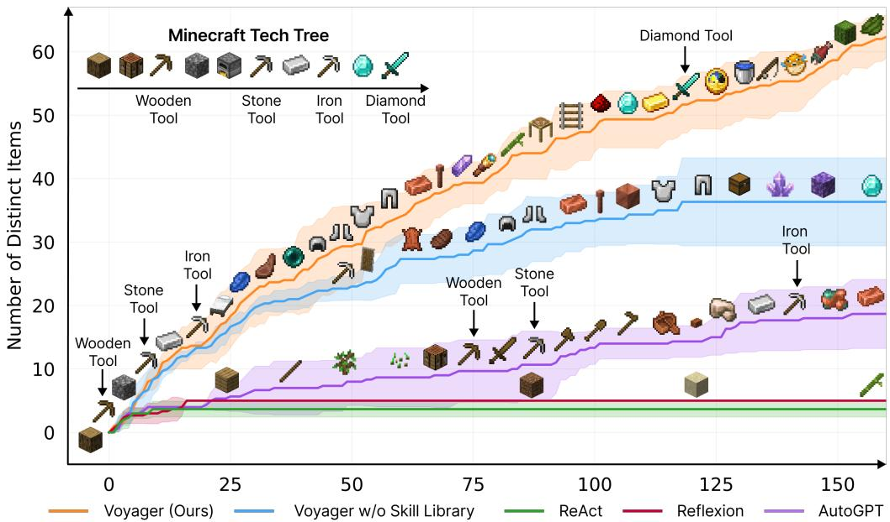  
Figure 1: VOYAGER discovers new Minecraft items and skills continually by self-driven exploration, significantly outperforming the baselines. X-axis denotes the number of prompting iterations.

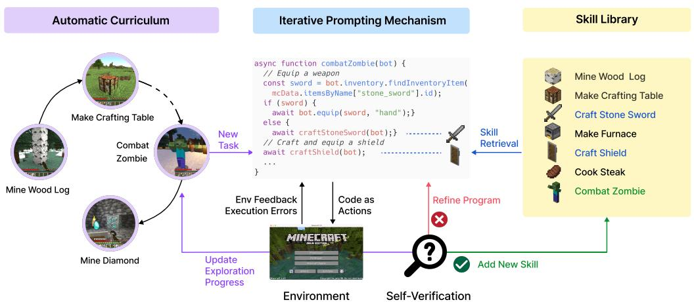  
Figure 2: VOYAGER consists of three key components: an automatic curriculum for open-ended exploration, a skill library for increasingly complex behaviors, and an iterative prompting mechanism that uses code as action space.

# 1 Introduction

Building generally capable embodied agents that continuously explore, plan, and develop new skills in open-ended worlds is a grand challenge for the AI community [1–5]. Classical approaches employ reinforcement learning (RL) [6, 7] and imitation learning [8–10] that operate on primitive actions, which could be challenging for systematic exploration [11–15], interpretability [16–18], and generalization [19–21]. Recent advances in large language model (LLM) based agents harness the world knowledge encapsulated in pre-trained LLMs to generate consistent action plans or executable policies [16, 22, 19]. They are applied to embodied tasks like games and robotics [23–27], as well as NLP tasks without embodiment [28–30]. However, these agents are not lifelong learners that can progressively acquire, update, accumulate, and transfer knowledge over extended time spans [31, 32].

Let us consider Minecraft as an example. Unlike most other games studied in AI [33, 34, 10], Minecraft does not impose a predefined end goal or a fixed storyline but rather provides a unique playground with endless possibilities [23]. Minecraft requires players to explore vast, procedurally generated 3D terrains and unlock a tech tree using gathered resources. Human players typically start by learning the basics, such as mining wood and cooking food, before advancing to more complex tasks like combating monsters and crafting diamond tools. We argue that an effective lifelong learning agent should have similar capabilities as human players: (1) propose suitable tasks based on its current skill level and world state, e.g., learn to harvest sand and cactus before iron if it finds itself in a desert rather than a forest; (2) refine skills based on environmental feedback and commit mastered skills to memory for future reuse in similar situations (e.g. fighting zombies is similar to fighting spiders); (3) continually explore the world and seek out new tasks in a self-driven manner.

Towards these goals, we introduce VOYAGER, the first LLM-powered embodied lifelong learning agent to drive exploration, master a wide range of skills, and make new discoveries continually without human intervention in Minecraft. VOYAGER is made possible through three key modules (Fig. 2): 1) an automatic curriculum that maximizes exploration; 2) a skill library for storing and retrieving complex behaviors; and 3) a new iterative prompting mechanism that generates executable code for embodied control. We opt to use code as the action space instead of low-level motor commands because programs can naturally represent temporally extended and compositional actions [16, 22], which are essential for many long-horizon tasks in Minecraft. VOYAGER interacts with a blackbox LLM (GPT-4 [35]) through prompting and in-context learning [36–38]. Our approach bypasses the need for model parameter access and explicit gradient-based training or finetuning.

More specifically, VOYAGER attempts to solve progressively harder tasks proposed by the automatic curriculum, which takes into account the exploration progress and the agent’s state. The curriculum is generated by GPT-4 based on the overarching goal of “discovering as many diverse things as possible”. This approach can be perceived as an in-context form of novelty search [39, 40]. VOYAGER incrementally builds a skill library by storing the action programs that help solve a task successfully.

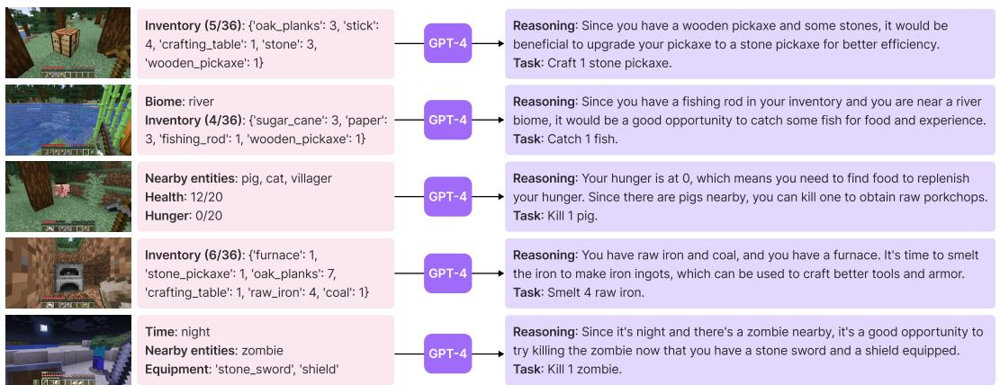  
Figure 3: Tasks proposed by the automatic curriculum. We only display the partial prompt for brevity. See Appendix, Sec. A.3 for the full prompt structure.

Each program is indexed by the embedding of its description, which can be retrieved in similar situations in the future. Complex skills can be synthesized by composing simpler programs, which compounds VOYAGER’s capabilities rapidly over time and alleviates catastrophic forgetting in other continual learning methods [31, 32].

However, LLMs struggle to produce the correct action code consistently in one shot [41]. To address this challenge, we propose an iterative prompting mechanism that: (1) executes the generated program to obtain observations from the Minecraft simulation (such as inventory listing and nearby creatures) and error trace from the code interpreter (if any); (2) incorporates the feedback into GPT-4’s prompt for another round of code refinement; and (3) repeats the process until a self-verification module confirms the task completion, at which point we commit the program to the skill library (e.g., craftStoneShovel() and combatZombieWithSword()) and query the automatic curriculum for the next milestone (Fig. 2).

Empirically, VOYAGER demonstrates strong in-context lifelong learning capabilities. It can construct an ever-growing skill library of action programs that are reusable, interpretable, and generalizable to novel tasks. We evaluate VOYAGER systematically against other LLM-based agent techniques (e.g., ReAct [29], Reflexion [30], AutoGPT [28]) in MineDojo [23], an open-source Minecraft AI framework. VOYAGER outperforms prior SOTA by obtaining $3 . 3 \times$ more unique items, unlocking key tech tree milestones up to $1 5 . 3 \times$ faster, and traversing $2 . 3 \times$ longer distances. We further demonstrate that VOYAGER is able to utilize the learned skill library in a new Minecraft world to solve novel tasks from scratch, while other methods struggle to generalize.

# 2 Method

VOYAGER consists of three novel components: (1) an automatic curriculum (Sec. 2.1) that suggests objectives for open-ended exploration, (2) a skill library (Sec. 2.2) for developing increasingly complex behaviors, and (3) an iterative prompting mechanism (Sec. 2.3) that generates executable code for embodied control. Full prompts are presented in Appendix, Sec. A.

# 2.1 Automatic Curriculum

Embodied agents encounter a variety of objectives with different complexity levels in open-ended environments. An automatic curriculum offers numerous benefits for open-ended exploration, ensuring a challenging but manageable learning process, fostering curiosity-driven intrinsic motivation for agents to learn and explore, and encouraging the development of general and flexible problemsolving strategies [42–44]. Our automatic curriculum capitalizes on the internet-scale knowledge contained within GPT-4 by prompting it to provide a steady stream of new tasks or challenges. The curriculum unfolds in a bottom-up fashion, allowing for considerable adaptability and responsiveness to the exploration progress and the agent’s current state (Fig. 3). As VOYAGER progresses to harder self-driven goals, it naturally learns a variety of skills, such as “mining a diamond”.

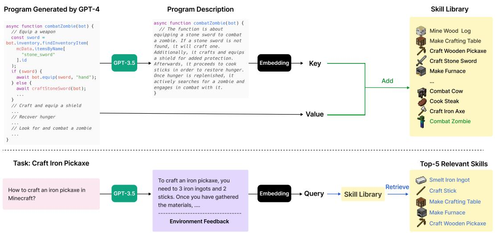  
Figure 4: Skill library. Top: Adding a new skill. Each time GPT-4 generates and verifies a new skill, we add it to the skill library, represented by a vector database. The key is the embedding vector of the program description (generated by GPT-3.5), while the value is the program itself. Bottom: Skill retrieval. When faced with a new task proposed by the automatic curriculum, we first leverage GPT-3.5 to generate a general suggestion for solving the task, which is combined with environment feedback as the query context. Subsequently, we perform querying to identify the top-5 relevant skills.

The input prompt to GPT-4 consists of several components:

(1) Directives encouraging diverse behaviors and imposing constraints, such as “My ultimate goal is to discover as many diverse things as possible ... The next task should not be too hard since I may not have the necessary resources or have learned enough skills to complete it yet.”;   
(2) The agent’s current state, including inventory, equipment, nearby blocks and entities, biome, time, health and hunger bars, and position;   
(3) Previously completed and failed tasks, reflecting the agent’s current exploration progress and capabilities frontier;   
(4) Additional context: We also leverage GPT-3.5 to self-ask questions based on the agent’s current state and exploration progress and self-answer questions. We opt to use GPT-3.5 instead of GPT-4 for standard NLP tasks due to budgetary considerations.

# 2.2 Skill Library

With the automatic curriculum consistently proposing increasingly complex tasks, it is essential to have a skill library that serves as a basis for learning and evolution. Inspired by the generality, interpretability, and universality of programs [45], we represent each skill with executable code that scaffolds temporally extended actions for completing a specific task proposed by the automatic curriculum.

The input prompt to GPT-4 consists of the following components:

(1) Guidelines for code generation, such as “Your function will be reused for building more complex functions. Therefore, you should make it generic and reusable.”;   
(2) Control primitive APIs, and relevant skills retrieved from the skill library, which are crucial for in-context learning [36–38] to work well;   
(3) The generated code from the last round, environment feedback, execution errors, and critique, based on which GPT-4 can self-improve (Sec. 2.3);   
(4) The agent’s current state, including inventory, equipment, nearby blocks and entities, biome, time, health and hunger bars, and position;

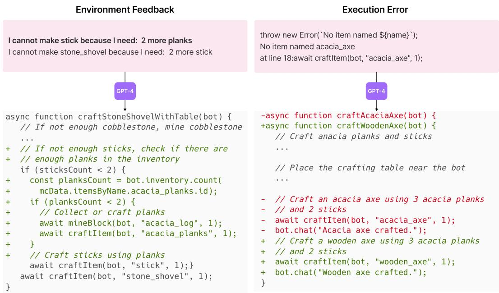  
Figure 5: Left: Environment feedback. GPT-4 realizes it needs 2 more planks before crafting sticks. Right: Execution error. GPT-4 realizes it should craft a wooden axe instead of an acacia axe since there is no acacia axe in Minecraft. We only display the partial prompt for brevity. The full prompt structure for code generation is in Appendix, Sec. A.4.

(5) Chain-of-thought prompting [46] to do reasoning before code generation.

We iteratively refine the program through a novel iterative prompting mechanism (Sec. 2.3), incorporate it into the skill library as a new skill, and index it by the embedding of its description (Fig. 4, top). For skill retrieval, we query the skill library with the embedding of self-generated task plans and environment feedback (Fig. 4, bottom). By continuously expanding and refining the skill library, VOYAGER can learn, adapt, and excel in a wide spectrum of tasks, consistently pushing the boundaries of its capabilities in the open world.

# 2.3 Iterative Prompting Mechanism

We introduce an iterative prompting mechanism for self-improvement through three types of feedback:

(1) Environment feedback, which illustrates the intermediate progress of program execution (Fig. 5, left). For example, “I cannot make an iron chestplate because I need: 7 more iron ingots” highlights the cause of failure in crafting an iron chestplate. We use bot.chat() inside control primitive APIs to generate environment feedback and prompt GPT-4 to use this function as well during code generation;   
(2) Execution errors from the program interpreter that reveal any invalid operations or syntax errors in programs, which are valuable for bug fixing (Fig. 5, right);   
(3) Self-verification for checking task success. Instead of manually coding success checkers for each new task proposed by the automatic curriculum, we instantiate another GPT-4 agent for self-verification. By providing VOYAGER’s current state and the task to GPT-4, we ask it to act as a critic [47–49] and inform us whether the program achieves the task. In addition, if the task fails, it provides a critique by suggesting how to complete the task (Fig. 6). Hence, our self-verification is more comprehensive than self-reflection [30] by both checking success and reflecting on mistakes.

During each round of code generation, we execute the generated program to obtain environment feedback and execution errors from the code interpreter, which are incorporated into GPT-4’s prompt for the next round of code refinement. This iterative process repeats until self-verification validates

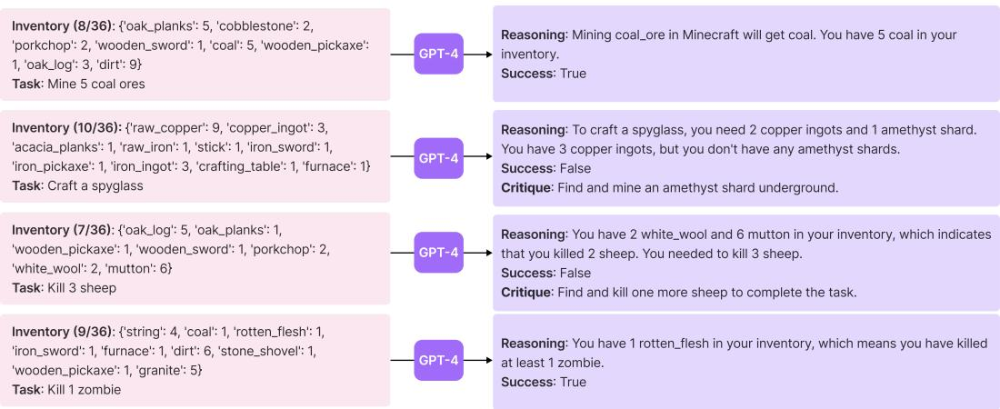  
Figure 6: Self-verification examples. We only display the partial prompt for brevity. See Appendix, Sec. A.5 for the full prompt structure.

the task’s completion, at which point we add this new skill to the skill library and ask the automatic curriculum for a new objective (Fig. 2). If the agent gets stuck after 4 rounds of code generation, then we query the curriculum for another task. This iterative prompting approach significantly improves program synthesis for embodied control, enabling VOYAGER to continuously acquire diverse skills without human intervention.

# 3 Experiments

# 3.1 Experimental Setup

We leverage OpenAI’s gpt-4-0314 [35] and gpt-3.5-turbo-0301 [50] APIs for text completion, along with text-embedding-ada-002 [51] API for text embedding. We set all temperatures to 0 except for the automatic curriculum, which uses temperature $= 0 . 1$ to encourage task diversity. Our simulation environment is built on top of MineDojo [23] and leverages Mineflayer [52] JavaScript APIs for motor controls. See Appendix, Sec. B.1 for more details.

# 3.2 Baselines

Because there is no LLM-based agents that work out of the box for Minecraft, we make our best effort to select a number of representative algorithms as baselines. These methods are originally designed only for NLP tasks without embodiment, therefore we have to re-interpret them to be executable in MineDojo and compatible with our experimental setting:

ReAct [29] uses chain-of-thought prompting [46] by generating both reasoning traces and action plans with LLMs. We provide it with our environment feedback and the agent states as observations.

Reflexion [30] is built on top of ReAct [29] with self-reflection to infer more intuitive future actions. We provide it with execution errors and our self-verification module.

AutoGPT [28] is a popular software tool that automates NLP tasks by decomposing a high-level goal into multiple subgoals and executing them in a ReAct-style loop. We re-implement AutoGPT by using GPT-4 to do task decomposition and provide it with the agent states, environment feedback, and execution errors as observations for subgoal execution. Compared with VOYAGER, AutoGPT lacks the skill library for accumulating knowledge, self-verification for assessing task success, and automatic curriculum for open-ended exploration.

Note that we do not directly compare with prior methods that take Minecraft screen pixels as input and output low-level controls [53–55]. It would not be an apple-to-apple comparison, because we rely on the high-level Mineflayer [52] API to control the agent. Our work’s focus is on pushing the limits of GPT-4 for lifelong embodied agent learning, rather than solving the 3D perception or sensorimotor control problems. VOYAGER is orthogonal and can be combined with gradient-based approaches like

Table 1: Tech tree mastery. Fractions indicate the number of successful trials out of three total runs. 0/3 means the method fails to unlock a level of the tech tree within the maximal prompting iterations (160). Numbers are prompting iterations averaged over three trials. The fewer the iterations, the more efficient the method.   

<table><tr><td>Method</td><td>Wooden Tool</td><td>Stone Tool</td><td>Iron Tool</td><td>Diamond Tool</td></tr><tr><td>ReAct [29]</td><td>N/A (0/3)</td><td>N/A (0/3)</td><td>N/A (0/3)</td><td>N/A (0/3)</td></tr><tr><td>Reflexion [30]</td><td>N/A (0/3)</td><td>N/A (0/3)</td><td>N/A (0/3)</td><td>N/A (0/3)</td></tr><tr><td>AutoGPT [28]</td><td>92 ± 72 (3/3)</td><td>94 ± 72 (3/3)</td><td>135 ± 103 (3/3)</td><td>N/A (0/3)</td></tr><tr><td>VOYAGER w/o Skill Library</td><td>7 ± 2 (3/3)</td><td>9 ± 4 (3/3)</td><td>29 ± 11 (3/3)</td><td>N/A (0/3)</td></tr><tr><td>VOYAGER (Ours)</td><td>6 ± 2 (3/3)</td><td>11 ± 2 (3/3)</td><td>21 ± 7 (3/3)</td><td>102 (1/3)</td></tr></table>

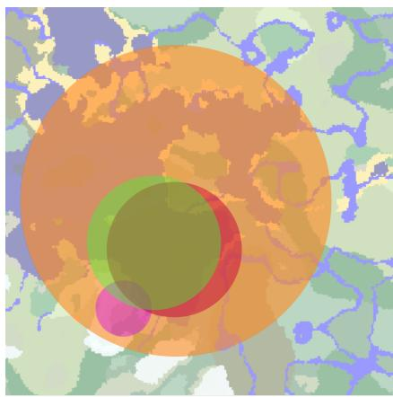  
一Voyager (Ours)

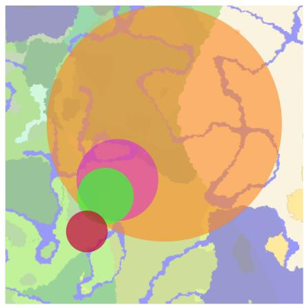  
Reflexion   
1AutoGPT   
Figure 7: Map coverage: bird’s eye views of Minecraft maps. VOYAGER is able to traverse $2 . 3 \times$ longer distances compared to baselines while crossing diverse terrains.

VPT [8] as long as the controller provides a code API. We make a system-level comparison between VOYAGER and prior Minecraft agents in Table. A.2.

# 3.3 Evaluation Results

We systematically evaluate VOYAGER and baselines on their exploration performance, tech tree mastery, map coverage, and zero-shot generalization capability to novel tasks in a new world.

Significantly better exploration. Results of exploration performance are shown in Fig. 1. VOYAGER’s superiority is evident in its ability to consistently make new strides, discovering 63 unique items within 160 prompting iterations, $3 . 3 \times$ many novel items compared to its counterparts. On the other hand, AutoGPT lags considerably in discovering new items, while ReAct and Reflexion struggle to make significant progress, given the abstract nature of the open-ended exploration goal that is challenging to execute without an appropriate curriculum.

Consistent tech tree mastery. The Minecraft tech tree tests the agent’s ability to craft and use a hierarchy of tools. Progressing through this tree (wooden tool stone tool iron tool diamond tool) requires the agent to master systematic and compositional skills. Compared with baselines, VOYAGER unlocks the wooden level $1 5 . 3 \times$ faster (in terms of the prompting iterations), the stone level $8 . 5 \times$ faster, the iron level $6 . 4 \times$ faster, and VOYAGER is the only one to unlock the diamond level of the tech tree (Fig. 2 and Table. 1). This underscores the effectiveness of the automatic curriculum, which consistently presents challenges of suitable complexity to facilitate the agent’s progress.

Extensive map traversal. VOYAGER is able to navigate distances $2 . 3 \times$ longer compared to baselines by traversing a variety of terrains, while the baseline agents often find themselves confined to local areas, which significantly hampers their capacity to discover new knowledge (Fig. 7).

Table 2: Zero-shot generalization to unseen tasks. Fractions indicate the number of successful trials out of three total attempts. 0/3 means the method fails to solve the task within the maximal prompting iterations (50). Numbers are prompting iterations averaged over three trials. The fewer the iterations, the more efficient the method.   

<table><tr><td>Method</td><td>Diamond Pickaxe</td><td>Golden Sword</td><td>Lava Bucket</td><td>Compass</td></tr><tr><td>ReAct [29]</td><td>N/A (0/3)</td><td>N/A (0/3)</td><td>N/A (0/3)</td><td>N/A (0/3)</td></tr><tr><td>Reflexion [30]</td><td>N/A (0/3)</td><td>N/A (0/3)</td><td>N/A (0/3)</td><td>N/A (0/3)</td></tr><tr><td>AutoGPT [28]</td><td>N/A (0/3)</td><td>N/A (0/3)</td><td>N/A (0/3)</td><td>N/A (0/3)</td></tr><tr><td>AutoGPT [28] w/ Our Skill Library</td><td>39 (1/3)</td><td>30 (1/3)</td><td>N/A (0/3)</td><td>30 (2/3)</td></tr><tr><td>VOYAGER w/o Skill Library</td><td>36 (2/3)</td><td>30 ± 9 (3/3)</td><td>27 ± 9 (3/3)</td><td>26 ± 3 (3/3)</td></tr><tr><td>VOYAGER (Ours)</td><td>19 ± 3 (3/3)</td><td>18 ± 7 (3/3)</td><td>21 ± 5 (3/3)</td><td>18 ± 2 (3/3)</td></tr></table>

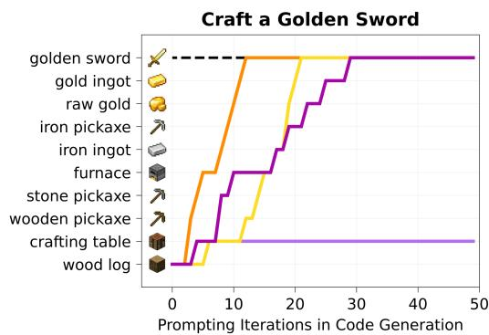

Figure 8: Zero-shot generalization to unseen tasks. We visualize the intermediate progress of each method on two tasks. See Appendix, Sec. B.4.3 for the other two tasks. We do not plot ReAct and Reflexion since they do not make any meaningful progress.   
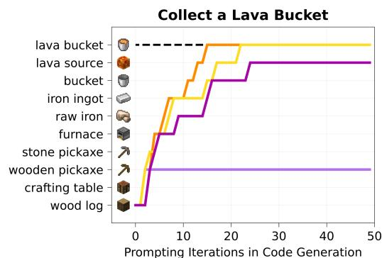  
Voyager (Ours) Voyager w/oSkill Library AutoGPTAutoGPTw/Our Skill Library

Efficient zero-shot generalization to unseen tasks. To evaluate zero-shot generalization, we clear the agent’s inventory, reset it to a newly instantiated world, and test it with unseen tasks. For both VOYAGER and AutoGPT, we utilize GPT-4 to break down the task into a series of subgoals. Table. 2 and Fig. 8 show VOYAGER can consistently solve all the tasks, while baselines cannot solve any task within 50 prompting iterations. What’s interesting to note is that our skill library constructed from lifelong learning not only enhances VOYAGER’s performance but also gives a boost to AutoGPT. This demonstrates that the skill library serves as a versatile tool that can be readily employed by other methods, effectively acting as a plug-and-play asset to enhance performance.

# 3.4 Ablation Studies

We ablate 6 design choices (automatic curriculum, skill library, environment feedback, execution errors, self-verification, and GPT-4 for code generation) in VOYAGER and study their impact on exploration performance (see Appendix, Sec. B.3 for details of each ablated variant). Results are shown in Fig. 9. We highlight the key findings below:

• Automatic curriculum is crucial for the agent’s consistent progress. The discovered item count drops by $9 3 \%$ if the curriculum is replaced with a random one, because certain tasks may be too challenging if attempted out of order. On the other hand, a manually designed curriculum requires significant Minecraft-specific expertise, and does not take into account the agent’s live situation. It falls short in the experimental results compared to our automatic curriculum.   
• VOYAGER w/o skill library exhibits a tendency to plateau in the later stages. This underscores the pivotal role that the skill library plays in VOYAGER. It helps create more complex actions and steadily pushes the agent’s boundaries by encouraging new skills to be built upon older ones.

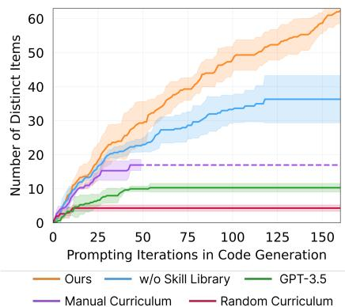

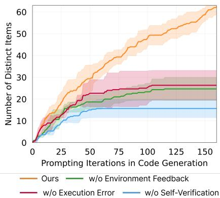  
Figure 9: Left: Ablation studies for the automatic curriculum, skill library, and GPT-4. GPT-3.5 means replacing GPT-4 with GPT-3.5 for code generation. VOYAGER outperforms all the alternatives, demonstrating the critical role of each component. Right: Ablation studies for the iterative prompting mechanism. VOYAGER surpasses all the other options, thereby highlighting the essential significance of each type of feedback in the iterative prompting mechanism.

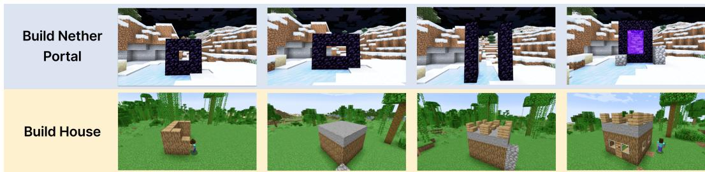  
Figure 10: VOYAGER builds 3D structures with human feedback. The progress of building designs that integrate human input is demonstrated from left to right.

• Self-verification is the most important among all the feedback types. Removing the module leads to a significant drop $( - 7 3 \% )$ in the discovered item count. Self-verification serves as a critical mechanism to decide when to move on to a new task or reattempt a previously unsuccessful task.   
• GPT-4 significantly outperforms GPT-3.5 in code generation and obtains $5 . 7 \times$ more unique items, as GPT-4 exhibits a quantum leap in coding abilities. This finding corroborates recent studies in the literature [56, 57].

# 3.5 Multimodal Feedback from Humans

VOYAGER does not currently support visual perception, because the available version of GPT-4 API is text-only at the time of this writing. However, VOYAGER has the potential to be augmented by multimodal perception models [58, 59] to achieve more impressive tasks. We demonstrate that given human feedback, VOYAGER is able to construct complex 3D structures in Minecraft, such as a Nether Portal and a house (Fig. 10). There are two ways to integrate human feedback:

(1) Human as a critic (equivalent to VOYAGER’s self-verification module): humans provide visual critique to VOYAGER, allowing it to modify the code from the previous round. This feedback is essential for correcting certain errors in the spatial details of a 3D structure that VOYAGER cannot perceive directly.   
(2) Human as a curriculum (equivalent to VOYAGER’s automatic curriculum module): humans break down a complex building task into smaller steps, guiding VOYAGER to complete them incrementally. This approach improves VOYAGER’s ability to handle more sophisticated 3D construction tasks.

# 4 Limitations and Future Work

Cost. The GPT-4 API incurs significant costs. It is $1 5 \times$ more expensive than GPT-3.5. Nevertheless, VOYAGER requires the quantum leap in code generation quality from GPT-4 (Fig. 9), which GPT-3.5 and open-source LLMs cannot provide [60].

Inaccuracies. Despite the iterative prompting mechanism, there are still cases where the agent gets stuck and fails to generate the correct skill. The automatic curriculum has the flexibility to reattempt this task at a later time. Occasionally, self-verification module may also fail, such as not recognizing spider string as a success signal of beating a spider.

Hallucinations. The automatic curriculum occasionally proposes unachievable tasks. For example, it may ask the agent to craft a “copper sword" or “copper chestplate", which are items that do not exist within the game. Hallucinations also occur during the code generation process. For instance, GPT-4 tends to use cobblestone as a fuel input, despite being an invalid fuel source in the game. Additionally, it may call functions absent in the provided control primitive APIs, leading to code execution errors.

We are confident that improvements in the GPT API models as well as novel techniques for finetuning open-source LLMs will overcome these limitations in the future.

# 5 Related work

Decision-making Agents in Minecraft. Minecraft is an open-ended 3D world with incredibly flexible game mechanics supporting a broad spectrum of activities. Built upon notable Minecraft benchmarks [23, 61–65], Minecraft learning algorithms can be divided into two categories: 1) Low-level controller: Many prior efforts leverage hierarchical reinforcement learning to learn from human demonstrations [66–68]. Kanitscheider et al. [14] design a curriculum based on success rates, but its objectives are limited to curated items. MineDojo [23] and VPT [8] utilize YouTube videos for large-scale pre-training. DreamerV3 [69], on the other hand, learns a world model to explore the environment and collect diamonds. 2) High-level planner: Volum et al. [70] leverage few-shot prompting with Codex [41] to generate executable policies, but they require additional human interaction. Recent works leverage LLMs as a high-level planner in Minecraft by decomposing a high-level task into several subgoals following Minecraft recipes [55, 53, 71], thus lacking full exploration flexibility. Like these latter works, VOYAGER also uses LLMs as a high-level planner by prompting GPT-4 and utilizes Mineflayer [52] as a low-level controller following Volum et al. [70]. Unlike prior works, VOYAGER employs an automatic curriculum that unfolds in a bottom-up manner, driven by curiosity, and therefore enables open-ended exploration.

Large Language Models for Agent Planning. Inspired by the strong emergent capabilities of LLMs, such as zero-shot prompting and complex reasoning [72, 37, 38, 36, 73, 74], embodied agent research [75–78] has witnessed a significant increase in the utilization of LLMs for planning purposes. Recent efforts can be roughly classified into two groups. 1) Large language models for robot learning: Many prior works apply LLMs to generate subgoals for robot planning [27, 27, 25, 79, 80]. Inner Monologue [26] incorporates environment feedback for robot planning with LLMs. Code as Policies [16] and ProgPrompt [22] directly leverage LLMs to generate executable robot policies. VIMA [19] and PaLM-E [59] fine-tune pre-trained LLMs to support multimodal prompts. 2) Large language models for text agents: ReAct [29] leverages chain-of-thought prompting [46] and generates both reasoning traces and task-specific actions with LLMs. Reflexion [30] is built upon ReAct [29] with self-reflection to enhance reasoning. AutoGPT [28] is a popular tool that automates NLP tasks by crafting a curriculum of multiple subgoals for completing a high-level goal while incorporating ReAct [29]’s reasoning and acting loops. DERA [81] frames a task as a dialogue between two GPT-4 [35] agents. Generative Agents [82] leverages ChatGPT [50] to simulate human behaviors by storing agents’ experiences as memories and retrieving those for planning, but its agent actions are not executable. SPRING [83] is a concurrent work that uses GPT-4 to extract game mechanics from game manuals, based on which it answers questions arranged in a directed acyclic graph and predicts the next action. All these works lack a skill library for developing more complex behaviors, which are crucial components for the success of VOYAGER in lifelong learning.

Code Generation with Execution. Code generation has been a longstanding challenge in NLP [41, 84, 85, 73, 37], with various works leveraging execution results to improve program

synthesis. Execution-guided approaches leverage intermediate execution outcomes to guide program search [86–88]. Another line of research utilizes majority voting to choose candidates based on their execution performance [89, 90]. Additionally, LEVER [91] trains a verifier to distinguish and reject incorrect programs based on execution results. CLAIRIFY [92], on the other hand, generates code for planning chemistry experiments and makes use of a rule-based verifier to iteratively provide error feedback to LLMs. VOYAGER distinguishes itself from these works by integrating environment feedback, execution errors, and self-verification (to assess task success) into an iterative prompting mechanism for embodied control.

# 6 Conclusion

In this work, we introduce VOYAGER, the first LLM-powered embodied lifelong learning agent, which leverages GPT-4 to explore the world continuously, develop increasingly sophisticated skills, and make new discoveries consistently without human intervention. VOYAGER exhibits superior performance in discovering novel items, unlocking the Minecraft tech tree, traversing diverse terrains, and applying its learned skill library to unseen tasks in a newly instantiated world. VOYAGER serves as a starting point to develop powerful generalist agents without tuning the model parameters.

# 7 Broader Impacts

Our research is conducted within Minecraft, a safe and harmless 3D video game environment. While VOYAGER is designed to be generally applicable to other domains, such as robotics, its application to physical robots would require additional attention and the implementation of safety constraints by humans to ensure responsible and secure deployment.

# 8 Acknowledgements

We are extremely grateful to Ziming Zhu, Kaiyu Yang, Rafał Kocielnik, Colin White, Or Sharir, Sahin Lale, De-An Huang, Jean Kossaifi, Yuncong Yang, Charles Zhang, Minchao Huang, and many other colleagues and friends for their helpful feedback and insightful discussions. This work is done during Guanzhi Wang’s internship at NVIDIA. Guanzhi Wang is supported by the Kortschak fellowship in Computing and Mathematical Sciences at Caltech.

