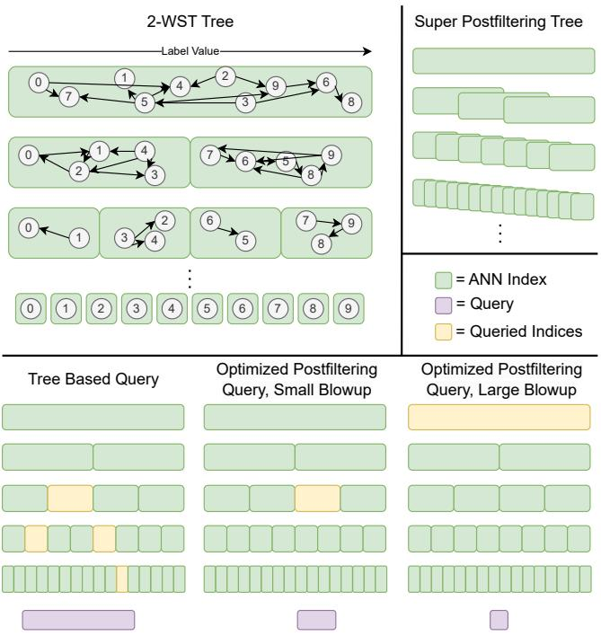
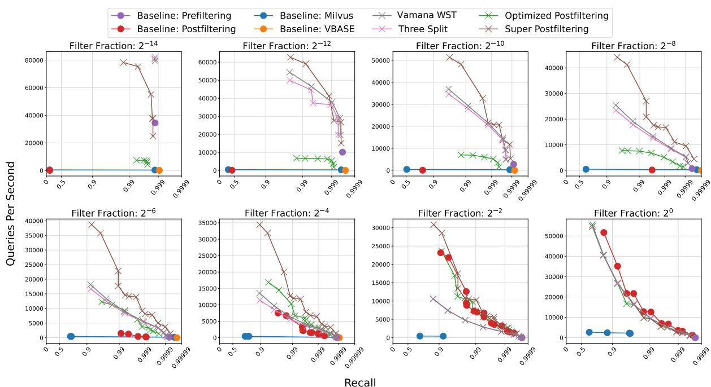
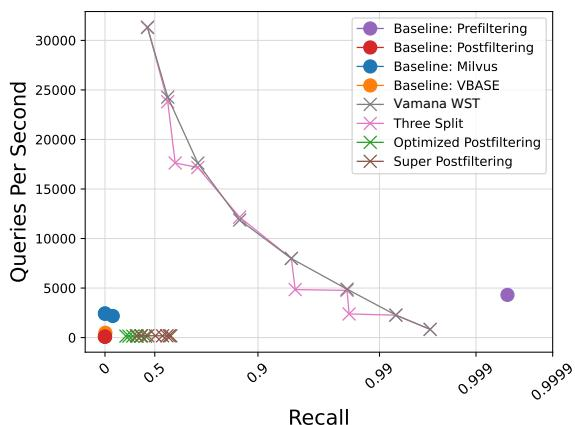
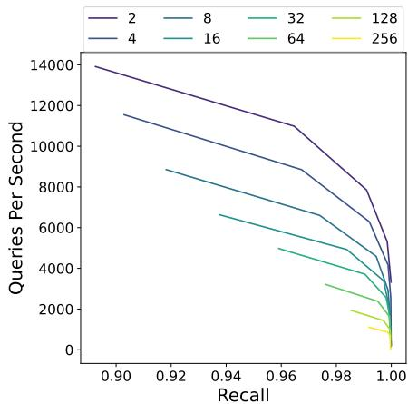

# Approximate Nearest Neighbor Search with Window Filters

Joshua Engels 1 Benjamin Landrum 2 Shangdi ${ \bf { V } } { \bf { u } } ^ { 1 }$ Laxman Dhulipala 2 Julian Shun 1

# Abstract

We define and investigate the problem of c-approximate window search: approximate nearest neighbor search where each point in the dataset has a numeric label, and the goal is to find nearest neighbors to queries within arbitrary label ranges. Many semantic search problems, such as image and document search with timestamp filters, or product search with cost filters, are natural examples of this problem. We propose and theoretically analyze a modular tree-based framework for transforming an index that solves the traditional c-approximate nearest neighbor problem into a data structure that solves window search. On standard nearest neighbor benchmark datasets with random label values, adversarially constructed embeddings, and image search embeddings with real timestamps, we obtain up to a $7 5 \times$ speedup over existing solutions at the same level of recall.

# 1. Introduction

The nearest neighbor search problem has been widely studied for more than 30 years (Arya & Mount, 1993). Given a dataset $D$ , the problem requires the construction of an index that can efficiently answer queries of the form “what is the closest vector to $x$ in D?” Solving this problem exactly degrades to a brute force linear search in high dimensions (Rubinstein, 2018), so instead both theoreticians and practitioners focus on the relaxed $c$ -approximate nearest neighbor search problem (ANNS), which asks “what is a vector that is no more than $c$ times farther away from $x$ than the closest vector to $x$ in $D$ ?”

Recent advances in vector embeddings for text, images, and other unstructured data have led to a surge in research and industry interest in ANNS. This trend is reflected by a proliferation of commercial vector databases: Pinecone (Pinecone Systems, Inc., 2024), Vearch (vea, 2022), Weaviate (wea, 2022), Milvus (mil, 2022), and Vespa (ves, 2022), among others. These databases offer hyper-parameter tuning, metadata storage, and solutions to a variety of related search

1Massachusetts Institute of Technology, CSAIL 2University of Maryland. Correspondence to: Joshua Engels <jengels@mit.edu>.

Proceedings of the $\mathit { 4 1 } ^ { s t }$ International Conference on Machine Learning, Vienna, Austria. PMLR 235, 2024. Copyright 2024 by the author(s).

problems. They especially tout their support of ANNS with metadata filtering as a key differentiating application.

In this work, we are primarily interested in a difficult generalization of the $c$ -approximate nearest neighbor problem that we term Window Search (see Definition 3.3). Window search is similar to ANNS, except queries are accompanied by a “window filter”, and the goal is to find the nearest neighbor to the query that has a label value within the filter. This problem has a large number of immediate applications. For instance, in document and image search, each item may be accompanied by a timestamp, and the user may wish to filter to an arbitrary time range (e.g., they may wish to search for hiking pictures, but only from last summer, or forum posts about a bug, but only in the days after a new version was released). Another application is product catalogs, where a user may wish to filter search results by cost. Finally, we note that a large class of emerging applications is large language model retrieval augmented generation, where by storing and retrieving information LLMs can reduce hallucinations and improve their reasoning (Peng et al., 2023); window search may be critical when the LLM needs to recall something stored on a certain date or range of dates.

Although this problem has many motivating examples, there is a dearth of papers examining it in the literature. Some vector databases analyze window search-like problem instances as an additional feature of their system, but this analysis is typically secondary to their main approach and too slow for large-scale real-world systems; as far as we are aware, we are the first to propose, analyze, and experiment with a non-trivial solution to the window search problem.

Our contributions include the following:

1. We formalize the $c$ -approximate window search problem and propose and test the first non-trivial solution that uses the unique nature of numeric label based filters.   
2. We design multiple new algorithms for window search, including a modular tree-based framework and a labelspace partitioning approach.   
3. We prove that our tree-based framework solves window search and give runtime bounds for the general case and for a specific instantiation with the Vamana ANNS algorithm (Jayaram Subramanya et al., 2019). We also analyze optimal partitioning strategies for the label-space partitioning approach.

4. We benchmark our methods against strong baselines and vector databases, achieving up to a $7 5 \times$ speedup on real world embeddings and adversarially constructed datasets.

# 2. Related Work

Filtered ANNS. The two overarching naive approaches to filtered ANNS are prefiltering, where the dataset is restricted to elements matching the filter before a spatial search over the remaining elements, and postfiltering, where results from an unfiltered search are restricted to those matching the filter. Thus, one avenue for solving filtered ANNS has focused on augmenting existing ANNS algorithms with prefiltering or postfiltering strategies, resulting in solutions like VBASE (Zhang et al., 2023) and Milvus (mil, 2022). VBASE, for example, performs beam search on a general purpose search graph and uses the order in which points are encountered as an approximation of relative distance to the query point, before finally postfiltering to find near points matching the predicate. Non-graph based indices can also be adapted with prefiltering and postfiltering to perform filtered search; for example, the popular Faiss library finds nearby clusters of points within an inverted file index, and then prefilters the vectors in those clusters based on an arbitrary predicate function (Douze et al., 2024). While these methods support arbitrary filters, they struggle when filters greatly restrict the points relevant to a query (Gollapudi et al., 2023).

Another popular direction focuses on dedicated indices for filtered ANNS, which consistently outperform their generalpurpose counterparts (Simhadri et al., 2023). For example, FilteredDiskANN, an adaptation of DiskANN (Jayaram Subramanya et al., 2019) that supports filters that are conjunctive ORs of one or more boolean labels, builds a graph that can be traversed by a modified beam search excluding points not matching the filter (Gollapudi et al., 2023). Another approach is CAPS, which is an inverted index where each partition stores a Huffman tree dividing points by their labels (Gupta et al., 2023). While these methods are the state of the art, they are restricted to filtering on boolean labels; they do not support window search. Finally, recent work (Mohoney et al., 2023) presents a tree based nearest neighbor engine for combined vector-metadata searches and show range-based filters as an application, but their partitioning requires historical queries and many of their gains come from batching queries to avoid redundant computation. Their method also only builds ANNS indices in the “leaves” of the tree, whereas we build indices at internal nodes, which is the key idea that ensures our method only needs to query a logarithmic number of ANNS indices. Thus, although their code is not open source, we do not expect their system to perform as well as ours on window search.

Segment Trees. Segment trees (and the closely related Fen-

Table 1: Notation used in this paper.   

<table><tr><td>Symbol</td><td>Definition</td></tr><tr><td>D</td><td>Vectors to index</td></tr><tr><td>N</td><td>|D|, the cardinality of D</td></tr><tr><td>V</td><td>Metric space D is in, e.g., Rn</td></tr><tr><td>q</td><td>Query vector q ∈ V</td></tr><tr><td>(a,b)</td><td>Window filter; see Definition 3.2</td></tr><tr><td>c</td><td>Approximation factor for window search</td></tr><tr><td>distV</td><td>Distance function between points in D</td></tr><tr><td>d</td><td>Running time to evaluate distV</td></tr><tr><td>A</td><td>Arbitrary c-ANN algorithm, e.g., Yamana</td></tr><tr><td>Aq</td><td>Query time of A</td></tr><tr><td>β</td><td>Split factor for a β-WST; see Algorithm 1</td></tr><tr><td>α</td><td>Pruning parameter for Yamana</td></tr><tr><td>δ</td><td>Doubling dimension</td></tr><tr><td>R</td><td>Set of closed integer ranges in [1,..., N]</td></tr><tr><td>blowup(R)</td><td>Max ratio of superset ∈ R over range length</td></tr><tr><td>cost(R)</td><td>Sum of lengths of ranges in R</td></tr></table>

wick trees (Fenwick, 1994)) are tree data structures built over an array that recursively sub-divide the array to obtain a balanced binary tree (Bentley, 1977). By storing appropriate augmented values at the internal nodes of this tree, these data structures can be used to support a variety of queries over arbitrary intervals in the array, e.g., computing the maximum value in any given query interval $[ l , r ]$ . Segment and Fenwick trees can be generalized to higher fanout trees, i.e., $B$ -ary segment or Fenwick trees that have a fanout of $B$ and a height of $\lceil \log _ { B } n \rceil$ (Pibiri & Venturini, 2021). Our work adapts these tree structures to the window search problem by designing a similar data structure that stores ANNS indices at internal tree nodes. Huang et al. (2023) use the Fenwick tree for filtered search within a clustering context, but their work only considers a prefix interval $( [ 0 , r ] )$ , and they use $k \mathrm { d }$ -trees, which are designed for low-dimensional data.

Filtered Search in Relational Databases. Traditional relational database systems support arbitrary range-based queries by constructing B-trees or log-structured merge trees (Ilyas et al., 2008; Qader et al., 2018). These databases have complex query planning systems that determine during execution whether and how to query these constructed indices (see, e.g., (Kurc et al., 1999)), but typically do not have support for ANNS. The few that do have support for ANNS use an existing open-source ANNS implementation to perform the search (e.g., pgvector (Kane, 2024), an ANNS add-on for PostgreSQL, uses HNSW (Malkov & Yashunin, 2018).

# 3. Definitions

This section lays out definitions for the main problem that we study: window search. Notation for the next three sections can be found in Table 1.

Definition 3.1. [Labeled Dataset] Consider a metric space $V$ with distance function dist $V$ . Given a label function $\ell : V \to \mathbb { R }$ and a set $D \subset V$ , we define a labeled dataset to

be the pair $( D , \ell )$ .

Definition 3.2. [Window Filtered Dataset] Consider a labeled dataset $( D , \ell )$ . We define a window filter to be an open interval $( a , b )$ with $a , b \in \mathbb { R }$ , and we define a window filtered dataset to be $D _ { ( a , b ) } = \{ x \in D \mid \ell ( x ) \in ( a , b ) \}$ .

Definition 3.3. [Window Search] Given a labeled dataset $( D , \ell )$ , we define a query to be a vector $q \in V$ and a window filter $( a , b )$ , and we define the window filtered nearest neighbor to be q∗ = arg minx∈D(a,b) $q ^ { * } = \arg \operatorname* { m i n } _ { x \in D _ { ( a , b ) } }$ dist $\boldsymbol { V } ^ { ( \boldsymbol { x } , \boldsymbol { q } ) }$ .

Definition 3.4. [Approximate Window Search] Finally, given a labeled dataset $( D , \ell )$ , we define $c$ -approximate window search to be the task of constructing a data structure that takes in a query $q \in V$ with window filter $( a , b )$ and returns a point $y \in D _ { ( a , b ) }$ such that di $. s \ t { \ t } _ { V } ( q , y ) \leq$ c · dist ${ \boldsymbol { V } } ^ { ( q , q ^ { * } ) }$ , or $\varnothing$ if $D _ { ( a , b ) } = \emptyset$ .

# 4. Window Search Algorithms

In this section, we describe algorithms for solving the window search problem. In Section 4.1, we examine two naive baselines for solving window search; in Section 4.2, we introduce a new data structure, the $\beta$ -WST, and design an algorithm to query it; and in Section 4.3, we examine additional algorithms for solving window search.

We note that with a fixed window filter $( a , b )$ , a reasonable approach to solving window search is simply to index $D _ { ( a , b ) }$ using an off-the-shelf ANNS algorithm and then query it with each $q$ . Thus, we are interested in the more challenging problem where queries have arbitrary window filters.

# 4.1. Naive Baselines

As we discuss in Section 2, prefiltering and postfiltering are the current state of the art for filtered search. Here, we describe the specific way we implement them in more detail, as they are the main baselines that we compare against in our experiments.

Prefiltering is a naive baseline that works by sorting all of the points by label ahead of time. Given a query $x$ with window filter $( a , b )$ , we perform binary search on the sorted labels to find the start and end of the range that meet the filter constraints, and then find the distance between $x$ and every point in the range and return the closest point.

Postfiltering (Yu et al., 2023; Chen et al., 2020) is a second baseline that works by first building an index on all of $D$ using an ANNS algorithm $A$ . To perform a window search, we query $A$ for $k \geq 1$ points, and then repeatedly double $k$ until at least one point is returned that has a label within $( a , b )$ . Finally, we return the closest of these points. We additionally define a hyper-parameter called final multiply; if this is greater than 1, then we perform a final additional search with a final multiply times larger value of $k$ .

  
Figure 1: Top left: A 2-WST. Each node of the tree in green contains a recursive partition of the entire dataset $D$ indexed by an ANNS algorithm (see Algorithm 1). The graph in each green node represents a graph-based ANNS index built by an algorithm like Vamana. Top right: the structure of an example label space partitioning method that ensures that no optimized postfiltering query will have a large blowup (see Theorem 5.7). Bottom: Different query methods; from left to right: a tree-based query as in Algorithm 2, an optimized postfiltering query with a small blowup (see Definition 5.5), and an optimized postfiltering query with a large blowup (see Definition 5.5).

# 4.2. $\beta$ -Window Search Tree

We now propose a data structure that we call a $\beta$ -Window Search Tree, or $\beta$ -WST. This data structure with $\beta = 2$ is illustrated in the top left of Figure 1 and the accompanying query method is illustrated in the bottom left. The overall idea to construct a $\beta$ -WST is to split $D$ into $\beta$ subsets, one corresponding to each child node, construct an instance of $A$ at each node, and recurse on each child. We continue this process until the subset size is less than $\beta$ , in which case we just store the points directly.

More formally, let $x _ { 1 } , \ldots , x _ { N }$ be the points of $D$ sorted by ℓ, such that $\ell ( x _ { 1 } ) \leq \ell ( x _ { 2 } ) \ldots \leq \ell ( x _ { n } )$ . With a slight abuse of notation, we define the arg min of an empty set to be the empty set. A $\beta$ -WST works as follows:

Index Construction. A $\beta$ -WST $T$ can be constructed as shown in Algorithm 1. In the base case, if the dataset $D$ is small, we do not construct any tree node (Lines 3–4). Otherwise, we construct an ANNS index of $D$ (Line 5). On Lines 6–7, we define the sizes for splitting $D$ into $\beta$ partitions, all of which are equally sized except the last, which may be smaller. On Line 8, we initialize the children

Algorithm 1 BuildTree(A, β, (D, ℓ))   
1: Input: Dataset $D$ with points $x_{1},\ldots ,x_{|D|}$ sorted by $\ell$ branching factor $\beta$ ANNS algorithm $A$ 2: Output: $\beta$ Window Search Tree of $D$ 3: if $|D| <   \beta$ then   
4: return (NULL, NULL, D)   
5: index $\leftarrow A(D)$ {The next two lines define the sizes of the $\beta$ subsets; all are equal size except the last}   
6: sizes[1,..., $\beta -1]\gets \lceil |D| / \beta \rceil$ 7: sizes[ $\beta ]\gets |D| - (\beta -1)\cdot \lceil |D| / \beta \rceil$ 8: children[1,..., $\beta ]\gets$ NULL   
9: for $i\gets 1$ to $\beta$ do in parallel   
10: start $\leftarrow (i - 1)\cdot \lceil |D| / \beta \rceil +1$ 11: end $\leftarrow$ start $^+$ sizes[i]   
12: children[i] $\leftarrow$ BuildTree(A, $\beta ,(D_{(x_{start},x_{end - 1})},\ell))$ 13: return (index,(children,sizes),D)

nodes. We then loop through every partition in parallel (Lines 9–12) and recursively call BuildTree on the set of points (sorted by label) corresponding to the start and end of the partition. Finally, on Line 13 we return the constructed tree, which is a tuple consisting of an ANNS index built on $D$ , the result of BuildTree called on each child along with the size of each child, and the point set $D$ .

Querying the Index. We query a $\beta$ -WST using Algorithm 2. The input is a $\beta$ -WST $T$ as built by Algorithm 1, a query point $q$ , and a window filter $( a , b )$ . At a high level, Algorithm 2 recurses through the tree constructed by Algorithm 1 and queries instances of $A$ that union together to equal the entire filtered dataset. If the dataset is small and the index is a leaf node NULL, we do a brute force search over $D$ (Lines 3–4). If the window filter $( a , b )$ covers all points, we query the ANNS index and return the result (Lines 5–6). Otherwise, $D$ has some points that do not have a label in $( a , b )$ , so we loop over each child (Line 8) and recurse into it if some of the points in the child meet the query’s window filter constraint. Finally, for each one of these children that we recurse into, we add the returned points to a candidate list $\mathcal { L } _ { \mathrm { c a n d } }$ , and return the closest point from $\mathcal { L } _ { \mathrm { c a n d } }$ on Line 13.

# 4.3. Additional Query Methods

In addition to Algorithm 2 above, we examine a number of additional query methods for window search that come with various trade-offs.

• OptimizedPostfiltering uses the index built by Algorithm 1 but uses a novel query algorithm, shown in Algorithm 3. Given a query $x$ with window filter $( a , b )$ , OptimizedPostfiltering finds the smallest subset $S$ of $D$ corresponding to an index that we built $I = A ( S )$ where $D _ { ( a , b ) } \subset S$ , and then queries that index using the same procedure as described in Postfiltering. A “small blowup” query is one in which the smallest subset $S$ is not that much larger than $D _ { ( a , b ) }$ , whereas a “large blowup” query is one where $S$ is much larger than $D _ { ( a , b ) }$ . These small and large

Algorithm 2 Query(T, q, (a, b))   
1: Input: $\beta$ -WST $T = (\text{index}, (\text{children}, \text{sizes}), D)$ , with points $x_1, \ldots, x_{|D|} \in D$ sorted by $\ell$ , query $q$ , window filter $(a, b)$ .  
2: Output: Approximate window-filtered nearest neighbor $y$ , or $\emptyset$ if no points in $D$ meet window filter constraint.  
3: if index = NULL then  
4: return arg $\min_{y \in D(a, b)} \text{dist}_V(q, y)$ 5: if $(\ell(x_1), \ell(x_{|D|})) \subset (a, b)$ then  
6: return index(q)  
7: start $\leftarrow 1$ , $\mathcal{L}_{\text{cand}} \leftarrow \emptyset$ 8: for $i \leftarrow 1$ to $\beta$ do  
9: end $\leftarrow$ start + sizes[i]  
10: if $\ell(x_{\text{start}}), \ell(x_{\text{end-1}}) \cap (a, b) \neq \emptyset$ then  
11: $\mathcal{L}_{\text{cand}} \leftarrow \mathcal{L}_{\text{cand}} \cup \text{Query}(\text{children}[i], q, (a, b))$ 12: start $\leftarrow$ end  
13: return arg $\min_{y \in \mathcal{L}_{\text{cand}}} \text{dist}_V(q, y)$

Algorithm 3 OptimizedPostfiltering(T, q, (a, b))   
1: Input: $\beta$ -WST $T = (\text{index}, (\text{children}, \text{sizes}), D)$ , query $q$ , window filter $(a, b)$ .  
2: Output: Approximate window-filtered nearest neighbor $y$ , or $\emptyset$ if no points in $D$ meet window filter constraint.  
3: index $\leftarrow$ smallest index in $T$ containing all points with labels in $(a, b)$ 4: $k \gets 1$ 5: while $k < N$ do  
6: $\mathcal{L}_{\text{unfiltered}} \gets \text{index}(q, k)$ 7: $\mathcal{L}_{\text{cand}} \gets \{x \in \mathcal{L}_{\text{cand}} \mid \ell(x) \in (a, b)\}$ 8: if $\mathcal{L}_{\text{cand}} \neq \emptyset$ then  
9: return $\arg \min_{y \in \mathcal{L}_{\text{cand}} \cap D_{(a, b)}} \text{dist}_V(q, y)$ 10: $k \gets 2k$ 11: return $\emptyset$

blowup queries are shown on the bottom right of Figure 1. Blowup factor is defined formally in Definition 5.5.

• ThreeSplit also uses the index built by Algorithm 1 and a novel querying algorithm, shown in Algorithm 4. Similar to Algorithm 2, a query initially finds the highest level where any partition at all is entirely contained in the window filter, and then does a query on every one of these partitions. Instead of recursing further down the tree, however, ThreeSplit then does an OptimizedPostfiltering call on each of the remaining label subranges on each side of the middle “covered” label portion. Because we fill in the middle first, we are guaranteed that there can be no ”large blowup” case like in OptimizedPostfiltering.

• SuperPostfiltering is the same as OptimizedPostfiltering except that it operates on an arbitrary set of indexed subsets of $D$ and not necessarily the ones constructed by Algorithm 1. One example of such a data structure is analyzed in Theorem 5.7 and visualized in the top right of Figure 1.

# 5. Theoretical Analysis

# 5.1. Analysis of Building and Querying a $\beta$ -WST

In our analysis in this section, we assume without loss of generality that $N$ is a power of $\beta$ . Removing this assump-

# Algorithm 4 ThreeSplit(T, q, (a, b))

1: Input: $\beta$ -WST T = (index, (children, sizes), D), query $q$ , window filter $( a , b )$ .   
2: Output: Approximate window-filtered nearest neighbor $_ y$ , or $\varnothing$ if no points in $D$ meet window filter constraint.   
3: index, $( a ^ { \prime } , b ^ { \prime } ) \gets$ index in $T$ containing the most points with labels in $( a , b )$ , label range of points in index   
4: $\mathcal { L } _ { \mathrm { c a n d } } =$ OptimizedPostfiltering $( T , q , ( a , a ^ { \prime } ) ) \cup \mathsf { i n d e x } ( q ) \cup$ OptimizedPostfiltering $( T , q , ( \bar { b } ^ { \prime } , b ) )$   
5: return arg $\mathrm { m i n } _ { y \in \mathcal { L } _ { \mathrm { c a n d } } \cap D _ { ( a , b ) } }$ distV (q, y)

tion would lead to more floor and ceiling operators in Theorem 5.2 and leave our other results unchanged. We defer proofs to Appendix A. We will first analyze the construction time and memory of Algorithm 1, and then we will prove the correctness and analyze the query time of Algorithm 2.

Consider some function $A _ { f }$ parameterized by the dataset $D$ , dataset size $N$ , and subset size $m$ . For example, $A _ { f }$ may be a construction time function or a memory function. This function evaluated on all nodes of a $\beta$ -WST is

$$
O \left(\sum_ {j = 0} ^ {\log_ {\beta} N} \beta^ {j} A _ {f} (D, N \cdot \beta^ {- j})\right).
$$

Since we use Vamana indices in our experiments, we now apply this result to obtain the running time of Algorithm 1 (the construction time) and the memory of the resulting index. We use a recent analysis for Vamana graphbased search (Indyk & Xu, 2023) that assumes a “slowpreprocessing” index construction with runtime $O ( N ^ { 3 } )$ and memory $O ( N ( 4 \alpha ) ^ { \delta } \log \Delta )$ . Letting $\Delta$ be the aspect ratio of $D$ , i.e., the ratio between the maximum and minimum distances between any two pairs of points, we have the following result:

Lemma 5.1. Algorithm 1 instantiated with a “slow preprocessed” $\alpha$ -Vamana graph runs in time

$$
O \left(\frac {1}{1 - \beta^ {- 2}} N ^ {3}\right) = O (N ^ {3})
$$

and returns a $\beta$ -WST of memory

$$
O \left((4 \alpha) ^ {\delta} \log (\Delta) N \log_ {\beta} N\right).
$$

We now move on to our main runtime theorem, which both proves that Algorithm 2 indeed solves $c$ -approximate window search and upper bounds the running time for an arbitrary ANNS index $A$ :

Theorem 5.2. If A can build an index that answers c-ANN queries on an arbitrary size m subset of $D$ with query time $O ( A _ { q } ( D , m ) )$ , and a distance computation in $V$ takes $d$ work, then Algorithm 2 solves the c-approximate window search problem with running time

$$
O \left(\beta \log_ {\beta} (N) d + \beta \sum_ {j = 0} ^ {\log_ {\beta} N} A _ {q} (D, N \cdot \beta^ {- j})\right).
$$

Many theoretical ANN results in the literature have a runtime of $O ( N ^ { \rho } )$ for a constant $\rho$ , e.g., LSH (Andoni & Indyk, 2008) and $k$ -nearest neighbor graphs (Prokhorenkova & Shekhovtsov, 2020). Other results have a runtime that is parameterized only with constants describing the data distribution, and have no reliance on $N$ . By applying Theorem 5.2, we have the following results for these common function classes:

Lemma 5.3. If A is a c-ANN algorithm with $A _ { q } ( D , m ) =$ $O ( C d m ^ { \rho } )$ for $\rho \in ( 0 , 1 )$ for some constant $C$ depending on $D$ , the running time of Algorithm 2 is

$$
O \left(\frac {C \beta d N ^ {\rho}}{1 - \beta^ {- \rho}}\right).
$$

If $A$ is a $c$ -ANN algorithm with $\begin{array} { r l } { O ( A _ { q } ( D , m ) ) } & { { } = } \end{array}$ $O ( A _ { q } ( D ) )$ , then the running time of Algorithm 2 is

$$
O \left(\beta \log_ {\beta} (N) [ d + A _ {q} (D) ]\right).
$$

We can again apply Lemma 5.3 using recent $c$ -ANN results for Vamana graph-based search (Indyk & Xu, 2023). We have the following result:

Lemma 5.4. Algorithm 2 instantiated with a “slow preprocessed” $\alpha$ -Vamana graph solves the c-approximate window search problem in any metric space on a dataset with doubling dimension δ and aspect ratio $\Delta$ in running time

$$
O \left(\beta \log_ {\beta} (N) \left[ d + \log_ {\alpha} \left(\frac {\Delta}{(\alpha - 1) (c - \frac {\alpha + 1}{\alpha - 1})}\right) (4 \alpha) ^ {\delta} \log \Delta \right]\right).
$$

# 5.2. Analysis of Super Postfiltering

SuperPostfiltering operates on an arbitrary collection of window filtered subsets $D _ { ( a _ { i } , b _ { i } ) }$ . A natural question is how to quantify the quality of a particular choice of subsets to index, which motivates the following definition:

Definition 5.5. [Blowup Factor, Cost] Given a set of ranges $R$ , with $R _ { i } = [ a _ { i } , b _ { i } ]$ for $a _ { i } , b _ { i } \in \{ 1 , \ldots , N \}$ and $a _ { i } < b _ { i }$ we can define the blowup factor of a new query range $[ a , b ]$ with $a , b \in \{ 1 , \dots N \}$ as follows:

$$
\mathsf{blowup}(R,[a,b]) = \min_{\substack{[a_{i},b_{i}]\in R_{i}\\ [a_{i},b_{i}]\supset [a,b]}}\left(\frac{b_{i} - a_{i}}{b - a}\right).
$$

Intuitively, the blowup for $[ a , b ]$ is the ratio between the size of $[ a , b ]$ and the smallest range in $R$ that contains it. We can further define the worst case blowup for a set of ranges (like $R _ { . }$ ) by taking the maximum blowup over all possible query ranges $[ a , b ]$ :

$$
\mathsf{blowup}(R) = \max_{\substack{a,b\in \{1,\ldots ,N\} \\ a <   b}}\mathsf{blowup}(R,[a,b]).
$$

We additionally define the cost of a set of ranges $R$ as $\begin{array} { r } { \mathsf { c o s t } ( R ) = \sum _ { i } ( b _ { i } - a _ { i } ) } \end{array}$ .

Intuitively, if we build an ANNS index for the points corresponding to each range, then the worst-case blowup limits how expensive a query can be, while the cost approximates the memory required (since most practical ANNS indices, e.g., LSH (Andoni & Indyk, 2008) and Vamana (Jayaram Subramanya et al., 2019), have memory that is approximately linear in the number of points that they index). Note that here, a range of, e.g., [17, 35] corresponds to an ANNS index built on the 17’th point through the 35’th point in $D$ , assuming the points are sorted by label value.

As a quick warmup, we can achieve a worst-case blowup of $N$ and cost of $N$ by choosing $R = \{ [ 1 , N ] \}$ , and we can get a worst-case blowup of 1 and cost of $O ( N ^ { 3 } )$ by choosing $R = \{ [ i , j ] | i , j \in \{ 1 , . . . , N \} , i < j \}$ . We are interested in choices for $R$ that lead to better tradeoffs.

We can construct an $R$ consisting of the ranges corresponding to each subset indexed in a $\beta$ -WST, so we can analyze it using Definition 5.5. We prove the following lemma.

Lemma 5.6. The ranges corresponding to a $\beta$ -WST have worst case blowup factor $B = N / 2 = O ( N )$ and cost ≤ $N \lceil \log _ { \beta } ( N ) \rceil = O ( N \log _ { \beta } ( N ) )$ .

Finally, we prove that we can do better than a $\beta$ -WST.

Theorem 5.7. For any $N$ and for any $\gamma > 1$ , there exists an $R$ with worst case blowup factor $2 \gamma$ that has cost at most $N \left( 2 \log _ { \gamma } ( N ) + 1 \right)$ .

# 6. Experiments

Experiment Setup. We run all query methods on all datasets and filter widths on a 2.20GHz Intel Xeon machine with 40 cores and two-way hyper-threading, 100 MiB L3 cache, and 504 GB of RAM. We run index building using all 80 hyper-threads and restrict queries to 16 threads, and parallelize across (and not within) queries. We run index construction experiments with varying values of $\beta$ on a separate 2.10GHz Intel Xeon machine with 96 cores and two way hyper-threading, 132 MiB L3 cache, and 1.47 TB of RAM. We use all hyper-threads on the machine for these experiments.

We use a Vamana index (Jayaram Subramanya et al., 2019) with $\alpha = 1$ , degree $= 6 4$ , and the construction beam search width set to 500 for all ANNS indices, except for the Milvus and VBASE baselines. Vamana allows searching for $k \geq 1$ nearest neighbors; for simplicity of presentation, we assume that the query beam search width is always set to $k$ . We defer a description of Vamana and its associated hyper-parameters to Appendix C.

We note that our theory focuses on the $c$ -ANN problem, which only concerns whether a single $c$ -approximate nearest neighbor is returned. However, as is standard in much of the ANN literature, in our experiments we report the recall

of the top 10 filtered neighbors to the query. While our runtime proofs in Theorem 5.2, Lemma 5.3, and Lemma 5.4 assume that the underlying ANNS algorithm returns a single ANN, in practice, we find that Vamana has high recall for both single ANN and top-10 ANN. Therefore, we believe that our theoretical analyses still provide insights into our empirical results for top-10 ANN.

Finally, we ensure that our smallest filter fractions are still wide enough such that there are at least 10 points that meet the filter constraint, i.e., we ensure that $| D _ { ( a , b ) } | \geq 1 0$ .

Implementation Details. We provide an open source $\mathrm { C } { + } { + }$ library and associated Python bindings.1 Our code is built on the ParlayLib library (Blelloch et al., 2020) for parallel programming and the recent ParlayANN suite of parallel ANNS algorithms (Manohar et al., 2024). We implement a number of memory and performance optimizations, including using a larger base case of 1000 in Algorithm 1 and storing the entire dataset just once across all sub-indices.

Filter Fraction. Answering a window filter query that matches almost the entire dataset is a substantially different problem than one that matches almost none of it. Thus, we define the filter fraction as a way of quantifying where in this filter regime we are: let a query with filter fraction $2 ^ { i }$ for $i \leq 0$ be a query whose window filter matches a $2 ^ { i }$ fraction of the points in $D$ . For example, a query with filter fraction $2 ^ { - 3 }$ has a window filter $( a , b )$ that matches $\frac { 1 } { 8 }$ of the dataset, or in other words $\begin{array} { r } { | D _ { ( a , b ) } | = \frac { 1 } { 8 } | D | } \end{array}$ . Queries with a small filter fraction (e.g., $2 ^ { - 1 5 }$ ) restrict to a small portion of the dataset, queries with a large filter fraction (e.g., $2 ^ { - 2 }$ ) restrict to a large portion of the dataset, and queries with a medium filter fraction (e.g., $2 ^ { - 8 }$ ) restrict somewhere in between. A query with a random filter of fraction $2 ^ { i }$ is a query where we randomly select the filter $( a , b )$ so that all possibilities for the $2 ^ { i } * | D |$ filtered points are equally likely.

Datasets. The datasets that we use are listed in Table 2 and further explained below. All datasets are available in the same repository as the code; licensing information is included in Appendix D.1.

• SIFT, GloVe, and Deep are ANN datasets from the widely used and standardized ANN benchmarks repository (Aumuller et al. ¨ , 2020). To adapt them to window search, we generate a label for each point uniformly at random between 0 and 1. We create 16 different query sets $Q _ { 1 } , \ldots , Q _ { 1 6 }$ , each one using the same 10000 query vectors from ANN benchmarks with random filters of fraction $2 ^ { - i }$ .   
• Redcaps is a dataset we created that builds on the Red-Caps (Desai et al., 2021) image and caption dataset, which consists of $1 1 . 6 M$ Reddit, Imgur, and Flickr images and

Table 2: Summary of datasets used in our experiments.   

<table><tr><td>Dataset</td><td>Description</td><td>Labels</td><td>Num. dimensions</td><td>Dataset size</td><td>Num. queries</td></tr><tr><td>SIFT</td><td>Image feature vectors</td><td>Uniform random</td><td>128</td><td>1M</td><td>10K</td></tr><tr><td>GloVe</td><td>Word embeddings</td><td>Uniform random</td><td>100</td><td>1.18M</td><td>10K</td></tr><tr><td>Deep</td><td>GoogLeNet embeddings</td><td>Uniform random</td><td>96</td><td>9.9M</td><td>10K</td></tr><tr><td>Redcaps</td><td>CLIP image embeddings</td><td>Timestamps</td><td>512</td><td>11.6M</td><td>800</td></tr><tr><td>Adverse</td><td>Mixture of Gaussians</td><td>Noisy cluster ID</td><td>100</td><td>1M</td><td>9.9K</td></tr></table>

associated captions. To adapt RedCaps to window search, we use CLIP (Radford et al., 2021) to generate an embedding for each image and use the timestamp of the image as its label. We create a set of 800 query vectors by asking ChatGPT-4 (Achiam et al., 2023) to come up with queries for an image search system, which we then embed using CLIP. See Appendix B for full prompt details. We again create 16 different query sets $Q _ { 1 } , \ldots , Q _ { 1 6 }$ using the same 800 query vectors with random filters of fraction $2 ^ { - i }$ .

• Adverse is a synthetic dataset tailored to disadvantage methods that rely on the label and point distributions being independent. The overall idea is to craft a dataset and queries where the points that meet the filter constraint are much farther away from the query than the rest of the dataset. To do this, we let $D$ be a mixture of 100 Gaussians and draw 10000 points from each Gaussian, where the means $\mu _ { i }$ are drawn from $N ( 0 , I )$ and each Gaussian is distributed as $N ( \mu _ { i } , 0 . 0 1 \cdot I )$ $\boldsymbol { \mathit { I } }$ is the 100- dimensional identity matrix). A point generated from the $\because$ ’th Gaussian has a label equal to $i + \mathsf { U n i f o r m } ( - 0 . 5 , 0 . 5 )$ , and we generate a query for every pair $i , j \in \{ 1 , \dots , 1 0 0 \}$ with $i \neq j$ that consists of a random point drawn from Gaussian $i$ with window filter $( j - 0 . 5 , j + 0 . 5 )$ . In other words, each query filters to only points from a different cluster than it itself is drawn from.

Query Methods and Hyper-parameters. We run all of the query methods described in Section 4.1, Section 4.2, and Section 4.3. For all methods that use an arbitrary index $A$ , we use a Vamana index as described earlier. We run Algorithm 2 with $\beta = 2$ unless specified otherwise; we call this method VamanaWST in our experiments. We use Prefiltering unmodified as described in Section 4.1. We expect Prefiltering to always achieve near $100 \%$ recall; it may not be $100 \%$ exactly due to numerical precision issues. For Postfiltering, OptimizedPostfiltering, ThreeSplit, and SuperPostfiltering, we search over initial values of $k$ in [10, 20, 40, 80, 160, 320, 640, 1280] and final multiply value in [1, 2, 3, 4, 8, 16, 32]. We use the setting $\gamma = 2$ from Theorem 5.7 for SuperPostfiltering, which guarantees a worst case blowup factor of 4 using in practice about 1.5 times as much memory as VamanaWST.

We also compare against Milvus (mil, 2022) and VBASE (Zhang et al., 2023), two existing systems that support window search.

Milvus treats window search as an instantiation of categorial filter search. Before querying the underlying ANNS

index, Milvus creates a bitset that marks all of the points that meet the window filter. Then, while traversing the underlying ANNS index, Milvus ignores points that are not set in the bitset. We try all supported underlying Milvus indices: HNSW, IVF PQ, IVF SQ8, SCANN, and IVF FLAT. We search over the same beam sizes as for Postfiltering. Milvus does not natively support a batch query with different filters for each point in the batch, so we wrote a Python multiprocessing program that spins up many processes that query the constructed index in parallel.

In addition to the heuristic described in Section 2, VBASE uses a query planning step to attempt to predict how many initial results to retrieve, then filters these retrieved results, before finally applying a final top- $k$ ranking to the retrieved results that meet the filter constraint. We were not able to get multiple queries to run in parallel with VBASE (and in the original paper they also only operate in the regime of a single query at a time).

Tradeoff of Queries per Second vs. Recall. We plot the Pareto frontier of recall vs. queries per second of all methods on a selection of filter fractions on Deep in Figure 2 (the indices we compute the frontier on correspond to the hyper-parameters specified in the last section). We include plots of other datasets in Appendix D; the main observations are substantially the same across datasets. Overall, our methods achieve multiple orders of magnitude query speedup at fixed recall levels. SuperPostfiltering does particularly well at lower recall levels of around 0.9 to 0.99, while at high recall levels VamanaWST and ThreeSplit are the best methods, attaining about the same performance. Additionally, for small filter fractions the Prefiltering baseline is competitive with our methods, whereas for large filter fractions the Postfiltering baseline is competitive. Our methods achieve the largest speedups over baselines in the medium filter fractions. We note that among our methods, OptimizedPostfiltering performs the worst, which we explain with the high worst case blowup of a 2-WST (see Lemma 5.6). Finally, we note that the two vector databases that we test against, VBASE and Milvus, are completely dominated by our naive baselines Prefiltering and Postfiltering.

We also plot results on Adverse in Figure 3. Prefiltering does well, as expected. Furthermore, VamanaWST offers a good tradeoff between recall and query latency, which makes sense because the query time guarantee from Lemma 5.4 (assuming Vamana also does well for

  
Figure 2: Comparison of Pareto frontiers of all methods on window search with different filter fractions on Deep using 16 threads. Up and to the right is better. On medium filter fraction settings, our methods achieve orders of magnitude more queries per second than the baselines at the same recall levels. Points along the Pareto frontier are denoted by circles for baseline methods and X’s for our methods.

  
Figure 3: Comparison of window search methods on Adverse. Up and to the right is better. VamanaWST and ThreeSplit achieve a good recall vs. latency tradeoff, but besides the Prefiltering baseline all of the other methods are unable to achieve a reasonable recall. All methods are run with 16 threads.

top-10 ANN) holds for any query distribution, even an adversarial one. However, all of the methods that rely solely on postfiltering, as well as the other baselines, fail to achieve meaningful recall. For the postfiltering methods, this result is unsurprising: the index that gets selected for postfiltering has many points that do not meet the query’s filter constraints, and by construction these points are frequently closer to the query than the entire target cluster. The beam search then has to expand over many near neighbors to reach points meeting the filter constraint, at which point the accuracy of the beam search is likely low. Surprisingly, although ThreeSplit does use postfiltering as a subroutine, it is able

to achieve similar performance to VamanaWST; this may be because after querying for the indices that make up the center of the label range (which is not postfiltering), the label ranges that are left on each side are typically much smaller.

We also include speedups of our best method (the best of VamanaWST, OptimizedPostfiltering, SuperPostfiltering, and ThreeSplit) over the best baseline method on filter fractions $i = 2 ^ { 0 } , \ldots , 2 ^ { - 1 1 }$ on all datasets in Table 3 at a recall level of 0.95, and we include the same table at additional recall levels in Appendix D. These reinforce our findings in Figure 2 across other datasets; at a 0.95 recall level, we achieve up to a 75X speedup on Deep, up to a 16X speedup on SIFT, up to a 9X speedup on GloVe, and up to a 17X speedup on Redcaps.

Index Memory and Construction Time. Table 4 and Table 5 show the construction time and memory sizes for a single Vamana index (for Postfiltering), a 2-WST with Vamana indices at each node (for VamanaWST, OptimizedPostfiltering, and ThreeSplit), and the index for SuperPostfiltering. We also show the memory for just the dataset, which is exactly how much memory Prefiltering needs (the build for Prefiltering is just a sort and takes less than a few seconds across all datasets). We see that the 2- WST takes about 3–8 times as much memory as a single Vamana index, depending on the dataset, whereas the index for SuperPostfiltering takes about 5–14 times as much memory as a single Vamana index. The construction times show a

Table 3: Speedup of our best method over the best baseline, restricted to hyper-parameter settings that yield at least 0.95 recall. All methods are run with 16 threads. We show a speedup across all filter fractions smaller than $2 ^ { - 1 }$ on all datasets. We show up to a $7 5 \times$ speedup on medium filter fractions.   

<table><tr><td>Dataset</td><td>2-11</td><td>2-10</td><td>2-9</td><td>2-8</td><td>2-7</td><td>2-6</td><td>2-5</td><td>2-4</td><td>2-3</td><td>2-2</td><td>2-1</td><td>20</td></tr><tr><td>Deep</td><td>10.49</td><td>18.46</td><td>35.65</td><td>61.21</td><td>77.55</td><td>24.28</td><td>9.35</td><td>2.67</td><td>1.46</td><td>1.39</td><td>0.75</td><td>0.77</td></tr><tr><td>SIFT</td><td>1.35</td><td>1.88</td><td>3.05</td><td>4.87</td><td>8.68</td><td>16.51</td><td>11.26</td><td>4.46</td><td>2.26</td><td>1.28</td><td>0.90</td><td>0.92</td></tr><tr><td>GloVe</td><td>1.90</td><td>2.27</td><td>2.70</td><td>3.77</td><td>5.02</td><td>6.19</td><td>9.60</td><td>7.62</td><td>2.34</td><td>1.52</td><td>0.92</td><td>0.92</td></tr><tr><td>Redcaps</td><td>2.31</td><td>3.33</td><td>5.47</td><td>7.78</td><td>10.07</td><td>17.22</td><td>3.94</td><td>3.64</td><td>1.75</td><td>1.73</td><td>0.90</td><td>0.90</td></tr></table>

Table 4: Build times for different indexing methods across all datasets, rounded to the nearest unit. Index construction was done using 80 threads.   

<table><tr><td>Dataset</td><td>Vamana</td><td>2-WST</td><td>Super</td></tr><tr><td>SIFT</td><td>1 m</td><td>8 m</td><td>14 m</td></tr><tr><td>GloVe</td><td>3 m</td><td>17 m</td><td>28 m</td></tr><tr><td>Deep</td><td>17 m</td><td>2 h</td><td>4 h</td></tr><tr><td>Redcaps</td><td>2 h</td><td>7 h</td><td>19 h</td></tr><tr><td>Adverse</td><td>3 m</td><td>23 m</td><td>41 m</td></tr></table>

Table 5: Index sizes for different indexing methods on all datasets, rounded to the nearest 10th of a GB. Note that prefiltering takes just the memory of the original dataset. The ”Raw” column is the size of just the dataset.   

<table><tr><td>Dataset</td><td>Raw</td><td>Vamana</td><td>2-WST</td><td>Super</td></tr><tr><td>SIFT</td><td>0.5 GB</td><td>1.0 GB</td><td>4.7 GB</td><td>7.6 GB</td></tr><tr><td>GloVe</td><td>0.5 GB</td><td>1.1 GB</td><td>5.6 GB</td><td>9.5 GB</td></tr><tr><td>Deep</td><td>3.6 GB</td><td>6.8 GB</td><td>53.2 GB</td><td>94.6 GB</td></tr><tr><td>Redcaps</td><td>23 GB</td><td>27.1 GB</td><td>79.2 GB</td><td>127 GB</td></tr><tr><td>Adverse</td><td>0.8 GB</td><td>0.9 GB</td><td>4.6 GB</td><td>7.4 GB</td></tr></table>

similar increase across methods, with a 5–10X increase in build time from Vamana to 2-WST and a 10–20X increase from Vamana to SuperPostfiltering. Finally, we note that while the larger datasets do take signficantly longer to build, we are using a large beam search construction buffer of 500 in order to vary as few hyper-parameters as possible, and a smaller buffer size may give faster build times with minimal loss in recall.

Varying $\beta$ . A larger branching factor $\beta$ decreases the build time and memory footprint of a VamanaWST index by reducing the number of levels in the tree and thus reducing the number of graphs that are built (see Figure 9 in Appendix D for a plot showing the exact reduction in memory and build time as we scale $\beta$ ). However, as shown in Figure 4, this comes at the cost of a reduction in recall and latency. These results are substantially the same across different filter fractions; see Figure 10 in Appendix D for experiments with more filter fractions.

# 7. Conclusion

We identify window search as an important and overlooked search problem. The methods we present for solving window search give a significant speedup over the state of the art, have strong theoretical guarantees, and are an important step towards ensuring vector databases efficiently support a full range of necessary embedding search operations.

  
Figure 4: Pareto curves of recall vs. throughput on the SIFT dataset for a filter fraction of $2 ^ { - 1 }$ and varying branching factors $\beta$ for VamanaWST. Up and to the right is better. All trials are run with 16 threads.

# Impact Statement

We expect the primary broader impact of our work to be general improvement of semantic vector search. Thus, we do not expect our work to have societal consequences beyond generally improving the accuracy and performance of machine learning systems. These systems have many potential societal consequences, none of which we feel must be specifically highlighted here.

# Acknowledgements

This research is supported by DOE Early Career Award #DE-SC0018947, NSF CAREER Award #CCF-1845763, NSF Award #CCF-2316235, NSF Award #CNS-2317194, Google Faculty Research Award, Google Research Scholar Award, and FinTech@CSAIL Initiative.

# References

Milvus-docs: Conduct a hybrid search, 2022. URL https://github.com/milvus-io/ milvus-docs/blob/v2.1.x/site/en/ userGuide/search/hybridsearch.md.   
Vearch doc operation: Search, 2022. URL https://vearch.readthedocs.io/en/ latest/use_op/op_doc.html?highlight $=$ filter#search.

Vespa use cases: Semi-structured navigation, 2022. URL https://docs.vespa.ai/en/attributes. html.   
Weaviate documentation: Filters, 2022. URL https://weaviate.io/developers/ weaviate/current/graphql-references/ filters.html.   
Achiam, J., Adler, S., Agarwal, S., Ahmad, L., Akkaya, I., Aleman, F. L., Almeida, D., Altenschmidt, J., Altman, S., Anadkat, S., et al. GPT-4 technical report. arXiv preprint arXiv:2303.08774, 2023.   
Andoni, A. and Indyk, P. Near-optimal hashing algorithms for approximate nearest neighbor in high dimensions. Communications of the ACM, 51(1):117–122, 2008.   
Arya, S. and Mount, D. M. Approximate nearest neighbor queries in fixed dimensions. In ACM-SIAM Symposium on Discrete Algorithms, pp. 271–280, 1993.   
Aumuller, M., Bernhardsson, E., and Faithfull, A. ANN-¨ benchmarks: A benchmarking tool for approximate nearest neighbor algorithms. Information Systems, 87:101374, 2020.   
Bentley, J. L. Algorithms for Klee’s rectangle problems. Technical report, Technical Report, 1977.   
Blelloch, G. E., Anderson, D., and Dhulipala, L. ParlayLib– a toolkit for parallel algorithms on shared-memory multicore machines. In ACM Symposium on Parallelism in Algorithms and Architectures, pp. 507–509, 2020.   
Chen, Y., Hu, X., Fan, W., Shen, L., Zhang, Z., Liu, X., Du, J., Li, H., Chen, Y., and Li, H. Fast density peak clustering for large scale data based on kNN. Knowledge-Based Systems, 187:104824, 2020.   
Clarkson, K. L. Nearest neighbor queries in metric spaces. In ACM Symposium on Theory of Computing, pp. 609– 617, 1997.   
Desai, K., Kaul, G., Aysola, Z., and Johnson, J. RedCaps: Web-curated image-text data created by the people, for the people. In Advances in Neural Information Processing Systems, 2021.   
Douze, M., Guzhva, A., Deng, C., Johnson, J., Szilvasy, G., Mazare, P.-E., Lomeli, M., Hosseini, L., and J ´ egou, H.´ The Faiss library. arXiv e-prints, 2024.   
Fenwick, P. M. A new data structure for cumulative frequency tables. Software: Practice and Experience, 24(3): 327–336, 1994.

Gollapudi, S., Karia, N., Sivashankar, V., Krishnaswamy, R., Begwani, N., Raz, S., Lin, Y., Zhang, Y., Mahapatro, N., Srinivasan, P., Singh, A., and Simhadri, H. V. Filtered-DiskANN: Graph algorithms for approximate nearest neighbor search with filters. In ACM Web Conference, pp. 3406–3416, 2023.   
Gupta, G., Yi, J., Coleman, B., Luo, C., Lakshman, V., and Shrivastava, A. CAPS: A practical partition index for filtered similarity search, 2023.   
Huang, Y., Yu, S., and Shun, J. Faster parallel exact density peaks clustering. In SIAM Conference on Applied and Computational Discrete Algorithms (ACDA23), pp. 49– 62. SIAM, 2023.   
Ilyas, I. F., Beskales, G., and Soliman, M. A. A survey of top-k query processing techniques in relational database systems. ACM Comput. Surv., 40(4), oct 2008.   
Indyk, P. and Xu, H. Worst-case performance of popular approximate nearest neighbor search implementations: Guarantees and limitations. In Advances in Neural Information Processing Systems, 2023.   
Jayaram Subramanya, S., Devvrit, F., Simhadri, H. V., Krishnawamy, R., and Kadekodi, R. DiskANN: Fast accurate billion-point nearest neighbor search on a single node. In Advances in Neural Information Processing Systems, 2019.   
Kane, A. pgvector: Open-source vector similarity search for postgres. https://github.com/pgvector/ pgvector, 2024. Accessed: 2024-05-24.   
Krauthgamer, R. and Lee, J. R. Navigating nets: simple algorithms for proximity search. In ACM-SIAM Symposium on Discrete Algorithms, pp. 798–807, 2004.   
Kurc, T., Chang, C., Ferreira, R., Sussman, A., and Saltz, J. Querying very large multi-dimensional datasets in ADR. In ACM/IEEE Conference on Supercomputing, 1999.   
Malkov, Y. A. and Yashunin, D. A. Efficient and robust approximate nearest neighbor search using hierarchical navigable small world graphs. IEEE Transactions on Pattern Analysis and Machine Intelligence, 42(4):824– 836, 2018.   
Manohar, M. D., Shen, Z., Blelloch, G., Dhulipala, L., Gu, Y., Simhadri, H. V., and Sun, Y. ParlayANN: Scalable and deterministic parallel graph-based approximate nearest neighbor search algorithms. In ACM SIGPLAN Annual Symposium on Principles and Practice of Parallel Programming, pp. 270–285, 2024.   
Mohoney, J., Pacaci, A., Chowdhury, S. R., Mousavi, A., Ilyas, I. F., Minhas, U. F., Pound, J., and Rekatsinas, T.

High-throughput vector similarity search in knowledge graphs. Proceedings of the ACM on Management of Data, 1(2):1–25, 2023.   
Peng, B., Galley, M., He, P., Cheng, H., Xie, Y., Hu, Y., Huang, Q., Liden, L., Yu, Z., Chen, W., et al. Check your facts and try again: Improving large language models with external knowledge and automated feedback. arXiv preprint arXiv:2302.12813, 2023.   
Pibiri, G. E. and Venturini, R. Practical trade-offs for the prefix-sum problem. Software: Practice and Experience, 51(5):921–949, 2021.   
Pinecone Systems, Inc. Overview, 2024. URL https: //docs.pinecone.io/docs/overview.   
Prokhorenkova, L. and Shekhovtsov, A. Graph-based nearest neighbor search: From practice to theory. In International Conference on Machine Learning, pp. 7803–7813, 2020.   
Qader, M., Cheng, S., and Hristidis, V. A comparative study of secondary indexing techniques in LSM-based NoSQL databases. In International Conference on Management of Data, pp. 551–566, 2018.   
Radford, A., Kim, J. W., Hallacy, C., Ramesh, A., Goh, G., Agarwal, S., Sastry, G., Askell, A., Mishkin, P., Clark, J., et al. Learning transferable visual models from natural language supervision. In International Conference on Machine Learning, pp. 8748–8763, 2021.   
Rubinstein, A. Hardness of approximate nearest neighbor search. In ACM SIGACT Symposium on Theory of Computing, pp. 1260–1268, 2018.   
Simhadri, H., Aumuller, M., Baranchuk, D., Douze, ¨ M., Ingber, A., Liberty, E., and Williams, G. NeurIPS’23 competition track: Big-ANN, 2023. URL https://big-ann-benchmarks.com/ neurips23.html.   
Yu, S., Engels, J., Huang, Y., and Shun, J. Pecann: Parallel efficient clustering with graph-based approximate nearest neighbor search. arXiv preprint arXiv:2312.03940, 2023.   
Zhang, Q., Xu, S., Chen, Q., Sui, G., Xie, J., Cai, Z., Chen, Y., He, Y., Yang, Y., Yang, F., Yang, M., and Zhou, L. VBASE: Unifying online vector similarity search and relational queries via relaxed monotonicity. In USENIX Symposium on Operating Systems Design and Implementation (OSDI), pp. 377–395, 2023.

# A. Proofs

Lemma A.1. Algorithm 1 instantiated with a “slow preprocessed” $\alpha$ -Vamana graph runs in time

$$
O \left(\frac {1}{1 - \beta^ {- 2}} N ^ {3}\right) = O (N ^ {3})
$$

and returns a $\beta$ -WST of memory

$$
O \left((4 \alpha) ^ {\delta} \log (\Delta) N \log_ {\beta} N\right).
$$

Proof. As stated in the main text, if we have some function parameterized by the dataset and subset size $O ( A _ { f } ( D , m ) )$ , then this function evaluated on all nodes of Algorithm 1 is

$$
O \left(\sum_ {j = 0} ^ {\log_ {\beta} N} \beta^ {j} A _ {f} (D, N \cdot \beta^ {- j})\right). \tag {1}
$$

If $A _ { f }$ is of the form $C m ^ { \rho }$ for $\rho \geq 1$ and for some constant $C$ depending on $D$ , then this is equivalent to:

$$
\begin{array}{l} = O \left(C N ^ {\rho} \sum_ {j = 0} ^ {\log_ {\beta} N} \beta^ {j - j \rho}\right) \\ = O \left(C N ^ {\rho} \sum_ {j = 0} ^ {\log_ {\beta} N} (\beta^ {1 - \rho}) ^ {j}\right) \\ = \left\{ \begin{array}{l l} O (C N ^ {\rho} \log_ {\beta} N) & \text {i f} \rho = 1 \\ O \left(C N ^ {\rho} \frac {1 - N ^ {1 - \rho}}{1 - \beta^ {1 - \rho}}\right) = O ((\frac {1}{1 - \beta^ {1 - \rho}}) C N ^ {\rho}) & \text {i f} \rho > 1 \end{array} \right. \\ \end{array}
$$

Determining the memory of the index returned by Algorithm 1 is equivalent to determining the memory of all nodes built on Line 5 throughout the recursion. Similarly, as long as these calls take longer than constant time, they are the computational bottleneck of the recursion. Thus, we can plug the Vamana build time and memory from (Indyk & Xu, 2023) into these results to get the build time and memory of a Vamana WST.

The slow preprocessing version of Vamana takes $O ( N ^ { 3 } )$ for construction time and takes up $O ( N ( 4 \alpha ) ^ { \delta } \log \Delta )$ space, so plugging into these results we have that a $\beta$ -WST tree with a slow preprocessing Vamana implementation takes $\begin{array} { r } { O ( \frac { 1 } { 1 - \beta ^ { - 2 } } N ^ { 3 } ) = O ( N ^ { 3 } ) } \end{array}$ time to build and has memory size $O ( ( 4 \alpha ) ^ { \delta } \log ( \Delta ) N \log _ { \beta } N )$ . □

Theorem 5.2. If A can build an index that answers $c$ -ANN queries on an arbitrary size m subset of $D$ with query time $O ( A _ { q } ( D , m ) )$ , and a distance computation in $V$ takes d work, then Algorithm 2 solves the c-approximate window search problem with running time

$$
O \left(\beta \log_ {\beta} (N) d + \beta \sum_ {j = 0} ^ {\log_ {\beta} N} A _ {q} (D, N \cdot \beta^ {- j})\right).
$$

Proof. First, we will show that Algorithm 2 solves the $c$ -approximate window search problem. Then, we will show that it solves it in the given running time.

# ALGORITHM 2 SOLVES THE $c$ -APPROXIMATE WINDOW SEARCH PROBLEM

First, we establish correctness and completeness of the evaluated points, i.e., that every point returned has a valid label, and that all points that meet the valid label are ”evaluated” on either Line 4 or Line 6.

For correctness, note that if a point is returned on Line 4, by Definition 3.2 it has a label value in $( a , b )$ . Similarly, since a point returned on Line 6 is in $D$ and by the if statement we know that all points in $D$ have a label in $( a , b )$ , a point returned

on Line 6 has a label value in $( a , b )$ . Any point returned by Line 13 is an arg min over points returned in one of these two cases, so we are guaranteed that the overall point $y$ returned has $\ell ( y ) \in ( a , b )$ .

For completeness, first consider some call to Algorithm 2 with $T = ( i n d e x , ( c h i l d r e n , s i z e s ) , S )$ . By assumption, $N$ is a power of $\beta$ , so we will proceed inductively over $| S |$ equal to powers of $\beta$ . Let us first consider any $S$ such that $| S | = 1$ . If $x \in S _ { ( a , b ) }$ , then it will be evaluated on Line 4. Now we assume that for $| S | = \beta ^ { n }$ , if $x \in S$ , then a call to Query with the tree corresponding to $S$ will evaluate $x$ . For all sets $S$ of size $\beta ^ { n + 1 }$ that contain some $x$ , if Line 4 or Line 6 is executed, then we evaluate $x$ . Otherwise, by construction (Line 12 in Algorithm 1) the children subsets $S _ { i }$ completely partition $S$ , so $x$ is in some $S _ { i }$ with $| S _ { i } | = \beta ^ { n }$ , and so by our inductive hypothesis $x$ will be evaluated when we call query on children[i].

We now show that a $c$ -approximate window-filtered nearest neighbor is returned for some (possible recursive) call to Query. Because of our correctness guarantee, at some point $q ^ { * }$ will be evaluated on Line 4 or Line 6. If $q ^ { * }$ is evaluated on Line 4, then because $q ^ { * }$ is the closest point to $q$ in all of $D _ { ( a , b ) }$ , it will also be the closest point to $q$ in $S _ { ( a , b ) } \subset D _ { ( a , b ) }$ , so it will get returned by the arg min (and $q ^ { * }$ is trivially a $c$ -approximate window filtered nearest neighbor). If $q ^ { * }$ is evaluated on Line 6, then by the guarantee of the $c$ -ANN algorithm $A$ , some point $y$ will be returned that is a $c$ -ANN to $q$ on $S _ { ( a , b ) }$ . Because $q ^ { * }$ is also in $S _ { ( a , b ) }$ , this implies that dist $V ( q , y ) \leq c \cdot \mathrm { d i s t } _ { V } ( q , q ^ { * } )$ , so $y$ is also a $c$ -approximate window filtered nearest neighbor.

Finally, we show that if any instance of a call to Query finds a $c$ -approximate window filtered nearest neighbor, then the overall algorithm will return a $c$ -approximate window filtered nearest neighbor. Consider the case that a valid $c$ -approximate window filtered nearest neighbor $y$ is returned by Line 4 or Line 6. If this is not a top-level call to Query, then Query was called on Line 11, so the point $y ^ { \prime }$ that gets returned will also be evaluated in the arg min on Line 13, and a point $y ^ { \prime }$ will be returned from Line 13 that is in $D _ { ( a , b ) }$ (by our correctness result) and has $d ( q , y ^ { \prime } ) \leq d ( q , y ) \leq c \cdot d ( q , q ^ { * } )$ . Thus by transitivity, $y ^ { \prime }$ is also a $c$ -approximate window filtered nearest neighbor for $q$ , and inductively the point $y ^ { \prime \prime }$ that gets returned by the original top-level Query call will be a $c$ -approximate window filtered nearest neighbor.

# ALGORITHM 2 RUNNING TIME

We will examine each level of the tree built by Algorithm 1 as Algorithm 2 traverses it, i.e., the nodes with $| S | = N$ , $\left| S \right| = N / \beta$ $| S | = N / \beta , | S | = N / \beta ^ { 2 } , \ldots , | S | = \beta , | S | = 1$ (the nodes with $| S | = 1$ are just the ind ${ \mathcal { S } } x = N U L L$ case).

At a high level, this analysis is similar to $B$ -ary segment or Fenwick trees (Pibiri & Venturini, 2021), which have $O ( \beta \log _ { \beta } N )$ query time and query at most $O ( \beta )$ indices per level. The overall idea for our analysis is to show that Algorithm 2 will run an ANN search on at most $2 \beta - 2$ indices per level.

First, we note that our algorithm has a “one time evaluation guarantee”: if we execute an ANN search (Line 6) or an exact search (Line 4) on some subset $S$ , then we did not execute an ANN search or exact search on any parent of $S$ (since then we never would have reached it recursively), so every point in $S$ (and therefore every point in $D _ { ( a , b ) } .$ ) is evaluated just once.

Now consider the largest $j$ such that there exists some set $S$ in the tree of size $\beta ^ { j }$ such that $S \subset D _ { ( a , b ) }$ . In other words, $S$ is the largest set that we built an index for and that entirely consists of points within the filtered dataset corresponding to the query. There may be multiple sets of size $\beta ^ { j }$ within $D _ { ( a , b ) }$ .

Let all sets of size $\beta ^ { j }$ be ordered such that each set’s labels are strictly less than the next set, and let these sets be indexed by $\{ S _ { i } \}$ . Let $S _ { f i r s t }$ be the first set in this ordering that is a subset of $D _ { ( a , b ) }$ and $S _ { l a s t }$ be the last set in this ordering that is a subset of $D _ { ( a , b ) }$ .

By completeness, every point in $S _ { f i r s t } , \ldots , S _ { l a s t }$ is evaluated at some level, so the recursive traversal must go through $S _ { f i r s t } , \ldots , S _ { l a s t }$ , and since each of these sets is a subset of $D _ { ( a , b ) }$ , we will run the ANN search on Line 6 on each of $S _ { f i r s t } , \ldots , S _ { l a s t }$ .

By construction, every $\beta$ sets in $\{ S _ { i } \}$ are partitions of a set from level $j + 1$ (e.g., sets $\{ S _ { 1 } , \ldots , S _ { \beta } \}$ , $\{ S _ { \beta + 1 } , . . . , S _ { 2 \beta } \} , . . . )$ Thus, any subsequence of $\{ S _ { i } \}$ that is of length $\geq 2 \beta - 1$ must have at least one complete partition of a set from level $j + 1$ . Since all of $S _ { f i r s t } , \ldots , S _ { l a s t }$ are subsets of $D _ { ( a , b ) }$ , by the one time evaluation guarantee, we know that their parents cannot be subsets of $D _ { ( a , b ) }$ (since then in the recursive traversal, we would have run an ANN search on their parent). Thus, $S _ { f i r s t } , \ldots , S _ { l a s t }$ cannot contain a complete partition of a set from level $j + 1$ , so the list $S _ { f i r s t } , \ldots , S _ { l a s t }$ contains fewer than $2 \beta - 1$ sets, or equivalently $l a s t - f i r s t + 1 \leq 2 \beta - 2$ .

We also know that at level $j$ , there are at most two more sets, $S _ { f i r s t - 1 }$ and $S _ { l a s t + 1 }$ , that have a non-empty intersection with

$D _ { ( a , b ) }$ (these are the sets that potentially contain points with labels just larger and just smaller than $a$ and just larger and just smaller than b).

This leads to our inductive hypothesis, which has three claims:

1. For all levels with $j ^ { \prime } \leq j$ (i.e., with $\left| S \right| = \beta ^ { j ^ { \prime } } ,$ ), there can be at most two sets that have a non-empty intersection with $D _ { ( a , b ) }$ that are not fully evaluated (i.e., that we recurse into).   
2. No set that we recurse into or evaluate on level $j ^ { \prime } \leq j$ is a superset of $D _ { ( a , b ) }$   
3. We will run the ANN search on Line 6 at most $2 \beta - 2$ times on each level.

We have just shown the base case for $j ^ { \prime } = j$ . Now consider some $0 \leq j ^ { \prime } < j$ . By part 1 of the inductive hypothesis, we recurse into 2 or fewer sets on level $j ^ { \prime } + 1$ that have a nonempty intersection with $D _ { ( a , b ) }$ . For each of these sets, at most $\beta - 1$ of its children will be a subset of $D _ { ( a , b ) }$ (if all $\beta$ of its children were a subset of $D _ { ( a , b ) }$ , then the set itself would have been a subset of $D _ { ( a , b ) }$ and would have been fully evaluated), and thus at most $2 ( \beta - 1 ) = 2 \beta - 2$ ANN searches are run on level $j ^ { \prime }$ . This proves part 3 of our inductive claim. Furthermore, since each of the at most two sets that we are recursing into are not a superset of $D _ { ( a , b ) }$ by inductive claim 2, there can only be at most one side of each of their label ranges that expand beyond $( a , b )$ . Thus, when we partition each of these sets, only one child of each of the sets can have a label range that overlaps $( a , b )$ ; the rest will either have labels entirely in $( a , b )$ or entirely outside of $( a , b )$ . Thus there will be at most two sets that have a nonempty intersection with $D _ { ( a , b ) }$ that are not fully evaluated, proving inductive claim 1. Finally, because each set that we recurse into on level $j ^ { \prime }$ is not a superset of $D _ { ( a , b ) }$ , all of the children we recurse into that are subsets of these sets are also not supersets of $D _ { ( a , b ) }$ , proving inductive claim 2.

We do work in Algorithm 2 on Line 6, the loop on Line 8, and Line 13 (we do not do work on Line 4 because the arg min is just over one point; the arg min is necessary for the more general case where $N$ is a not a power of $j$ and the leaf nodes may have more than one point). As a direct result from the first part of our inductive claim, we have that we will only make it to the loop on Line 8 and the arg min on Line 13 twice for each of the $\log _ { \beta } ( N )$ levels. The time complexity for the loop is $O ( \beta )$ , and the time complexity for Line 13 is $O ( \beta d )$ because the maximum size for the candidate list is $\beta$ , and for each candidate in the list we spend $O ( d )$ doing a distance computation. Also, from the third part of our inductive claim, we have that we call ANN search on an index of size $m = \beta ^ { j }$ at most $2 \beta - 2$ times for all $j \in { 1 , \ldots , \log _ { \beta } ( N ) }$ . Finally, again from the third part our inductive claim, we evaluate at most $2 \beta - 2$ sets of size 1, so we evaluate Line 4 a maximum of $2 \beta - 2$ times. This gives the following total runtime for Algorithm 2:

$$
O \left(\log_ {\beta} (N) * (\beta + \beta d) + (2 \beta - 2) * \sum_ {j = 0} ^ {\log_ {\beta} (N)} A _ {q} (D, N * \beta^ {- j})\right) = O \left(\beta \log_ {\beta} (N) d + \beta * \sum_ {j = 0} ^ {\log_ {\beta} (N)} A _ {q} (D, N * \beta^ {- j})\right).
$$

Lemma 5.3. If A is a c-ANN algorithm with $A _ { q } ( D , m ) = O ( C d m ^ { \rho } ) f o r \rho \in ( 0 , 1 )$ $\rho \in ( 0 , 1 )$ for some constant C depending on D, the running time of Algorithm 2 is

$$
O \left(\frac {C \beta d N ^ {\rho}}{1 - \beta^ {- \rho}}\right).
$$

If A is a c-ANN algorithm with $O ( A _ { q } ( D , m ) ) = O ( A _ { q } ( D ) )$ , then the running time of Algorithm 2 is

$$
O \left(\beta \log_ {\beta} (N) [ d + A _ {q} (D) ]\right).
$$

Proof. For the first result, we have via substitution into Theorem 5.2:

$$
\begin{array}{l} O \left(\beta \log_ {\beta} (N) d + \beta \sum_ {j = 0} ^ {\log_ {\beta} N} A _ {q} (D, N \cdot \beta^ {- j})\right) \\ = O \left(\beta \log_ {\beta} (N) d + \beta \sum_ {j = 0} ^ {\log_ {\beta} N} C d N ^ {\rho} \cdot \beta^ {- j \rho}\right) \\ = O \left(\beta \log_ {\beta} (N) d + C \beta d N ^ {\rho} \sum_ {j = 0} ^ {\log_ {\beta} N} \beta^ {- j \rho}\right) \\ = O \left(\beta \log_ {\beta} (N) d + C \beta d N ^ {\rho} \frac {1}{1 - \beta^ {- \rho}}\right) \\ = O \left(\frac {C \beta d N ^ {\rho}}{1 - \beta^ {- \rho}}\right). \\ \end{array}
$$

and for the second result, we have via substitution into Theorem 5.2:

$$
\begin{array}{l} O \left(\beta \log_ {\beta} (N) d + \beta \sum_ {j = 0} ^ {\log_ {\beta} N} A _ {q} (D, N \cdot \beta^ {- j})\right) \\ = O \left(\beta \log_ {\beta} (N) d + \beta \sum_ {j = 0} ^ {\log_ {\beta} N} A _ {q} (D)\right) \\ = O \left(\beta \log_ {\beta} (N) d + \beta \log_ {\beta} (N) A _ {q} (D)\right) \\ = O \left(\beta \log_ {\beta} (N) (d + A _ {q} (D))\right). \\ \end{array}
$$

Lemma 5.4. Algorithm 2 instantiated with a “slow preprocessed” $\alpha$ -Vamana graph solves the c-approximate window search problem in any metric space on a dataset with doubling dimension $\delta$ and aspect ratio $\Delta$ in running time

$$
O \left(\beta \log_ {\beta} (N) \left[ d + \log_ {\alpha} \left(\frac {\Delta}{(\alpha - 1) (c - \frac {\alpha + 1}{\alpha - 1})}\right) (4 \alpha) ^ {\delta} \log \Delta \right]\right).
$$

Proof. (Indyk & Xu, 2023) consider greedy search on an $\alpha$ -Vamana graph built on a dataset $D$ with ”slow preprocessing.” They show that the search procedure is guaranteed to return a $\textstyle { \left( { \frac { \alpha + 1 } { \alpha - 1 } } + \epsilon \right) }$ -ANN in $\begin{array} { r } { O ( \log _ { \alpha } ( \frac { \Delta } { ( \alpha - 1 ) \epsilon } ) ) } \end{array}$ steps, each of which take $O ( ( 4 \alpha ) ^ { \delta } \log \Delta )$ time. See Appendix C for an explanation of $\alpha$ and a complete overview of Vamana.

We can multiply together these two bounds on the running times to get an upper bound on the running time of the entire procedure:

$$
O \left(\log_ {\alpha} \left(\frac {\Delta}{(\alpha - 1) \epsilon}\right) (4 \alpha) ^ {\delta} \log \Delta\right) = O \left(\log_ {\alpha} \left(\frac {\Delta}{(\alpha - 1) (c - \frac {\alpha + 1}{\alpha - 1})}\right) (4 \alpha) ^ {\delta} \log \Delta\right).
$$

Note the equality is due to the fact that $\begin{array} { r } { c = \frac { \alpha + 1 } { \alpha - 1 } + \epsilon } \end{array}$ .

Now consider some $S \subset D$ . We claim that the doubling dimension $\delta$ and the aspect ratio $\Delta$ for $S$ are no greater than for $D$ . (Indyk & Xu, 2023) describe doubling dimension as the the minimum value $\delta$ such that for any ball of radius $r$ centered at some point $x$ in $D$ , $2 ^ { \delta }$ balls of radius $r / 2$ can be arranged to cover all points in $D \cap B ( x , r )$ (many previous works use the same or an extremely similar definition of doubling dimension (see, e.g., (Clarkson, 1997; Krauthgamer & Lee, 2004)). Because $S$ is a subset of $D$ , any covering of $D \cap B ( x , r )$ is also a covering of $S \cap B ( x , r )$ for all $x$ in $D$ (and also trivially therefore all $x$ in $S \subset D _ { * }$ ), so we know that the doubling dimension of $S$ is at most the doubling dimension of $D$ . Similarly, (Indyk & Xu, 2023) use the aspect ratio of $D$ , which is

$$
\begin{array}{c} \max  _ {x _ {1}, x _ {2} \in D, x _ {1} \neq x _ {2}} \operatorname {d i s t} _ {V} (x _ {1}, x _ {2}) \\ \hline \min  _ {x _ {1}, x _ {2} \in D, x _ {1} \neq x _ {2}} \operatorname {d i s t} _ {V} (x _ {1}, x _ {2}). \end{array}
$$

  
Figure 5: Illustration of structure of ranges for Theorem 5.7.

For any subset $S$ of $D$ , let the two points corresponding to the smallest distance be $x _ { s m a l l }$ and $y _ { s m a l l }$ and the two points corresponding to the largest distance be $x _ { l a r g e }$ and $y _ { l a r g e }$ . Since $S \subset D$ , $x _ { s m a l l } , y _ { s m a l l }$ are also in $D$ , so the smallest distance in $D$ is less than or equal to $\mathsf { d i s t } _ { V } ( x _ { s m a l l } , y _ { s m a l l } )$ , and similarly $x _ { l a r g e } , y _ { l a r g e }$ are also in $D$ , so the largest distance in $D$ is greater than or equal to dist $_ V ( x _ { l a r g e } , y _ { l a r g e } )$ . Thus compared to $\Delta$ , the numerator of $\Delta _ { S }$ is no larger and the denominator is no smaller, and so $\Delta _ { S } \leq \Delta$ . In other words, the aspect ratio of any subset $S$ is less than the aspect ratio $\Delta$ of $D$ .

Because our running time result above is monotonic in $\Delta$ and $\delta$ , and the other parameters $\alpha$ and $c$ are constant, we have that $c$ -ANN search on any subset $S \subset D$ is upper bounded by the running time on the entire dataset $D$ . Thus, since $O ( A _ { q } ( D , m ) = A _ { q } ( D ) )$ , we can now plug in to Lemma 5.3, giving us our final result. □

Lemma 5.6. The ranges corresponding to a $\beta$ -WST have worst case blowup factor $B = N / 2 = O ( N )$ and cost ≤ $N \lceil \log _ { \beta } ( N ) \rceil = O ( N \log _ { \beta } ( N ) )$ .

Proof. To see that the worst case blowup factor is $O ( N )$ , consider the first split of $D$ into children $S _ { i }$ for $i = 1 , \dots \beta$ . These $S _ { i }$ correspond to label ranges $\{ [ a _ { i } , b _ { i } ] \}$ , where $a _ { 0 } = 0$ , $b _ { l a s t } = N$ , and each $a _ { i } = b _ { i - 1 } + 1$ . Consider the range $( b _ { 1 } , a _ { 2 } )$ . This range is not a subset of any $S _ { i }$ . Furthermore, because all smaller ranges further down the tree are strict subsets of some $S _ { i }$ , this range is also not a subset of any smaller range. Thus the smallest range that $S _ { i }$ is a subset of is the top level range, so a $\beta$ -WST has a worst case blowup of $\begin{array} { r } { \frac { N } { 2 } = O ( N ) } \end{array}$ .

For the cost, we note that the label ranges of each level of the tree (except possibly the last, since it might be only partially full) are a partition of $\{ 1 , \ldots , N \}$ , so the sum of $b _ { i } - a _ { i }$ is equal to $N$ for all levels but the last. There are $\lfloor \log _ { \beta } ( N ) \rfloor$ levels, and one possibly non-full level at the bottom of the tree which is smaller than or equal to a full partition of $\{ 1 , \ldots , N \}$ and so has a cost less than or equal to $N$ . Thus the total cost is bounded by $\lceil \log _ { \beta } ( N ) \rceil \cdot N$ . □

Theorem 5.7. For any $N$ and for any $\gamma > 1$ , there exists an $R$ with worst case blowup factor $2 \gamma$ that has cost at most $N \left( 2 \log _ { \gamma } ( N ) + 1 \right)$ .

Proof. At a high level, our approach is to devise a strategy that can ensure all sets of size $m$ have a blowup factor of 2. We will then repeat this strategy for $m = \gamma ^ { j }$ for all possible powers of $j$ , which will ensure that all possible ranges have a small worst case blowup factor. For a diagram of this structure see Figure 5.

First, consider the problem of choosing ranges $R _ { i }$ such that every range of size $m$ is a subset of some $R _ { i }$ with blowup factor equal to 2. One approach is to choose ranges of

$$
c o v e r (m) = \{[ j m + 1, (j + 2) m ] \mid j \in \mathbb {Z} _ {\geq 0}, (j + 2) m \leq N \} \cup [ N - 2 m + 1, N ].
$$

The ends of the ranges start at $2 m$ and go until $N$ by multiples of $m$ , for a total of $\lfloor \frac { N } { m } \rfloor - 1$ ranges. These, plus the additional range $[ N - 2 m + 1 , N ]$ , lead to a total of $\lfloor { \frac { N } { m } } \rfloor$ ranges created using this strategy. Each range has width $2 m$ , so the arrangement has cost

$$
\left\lfloor \frac {N}{m} \right\rfloor \cdot 2 m \leq 2 N.
$$

We now show that these ranges $R _ { i }$ do indeed cover all ranges of size $m$ with blowup factor equal to 2. Consider some range of length $m$ starting at $a$ . If $a$ is within the first $m + 1$ integers in a range, then it is entirely within the range. Therefore, we are interested in the union of the first $m + 1$ integers in all of the ranges, or

$$
\bigcup_ {(j + 2) m \leq N} \{[ j m + 1, (j + 1) m + 1 ] \} \bigcup [ N - 2 m + 1, N - m + 1 ] \supset [ 1, N - 2 m ] \bigcup [ N - 2 m + 1, N - m + 1 ] = [ 1, N - m + 1 ].
$$

This is all possible starting points for a range of length $m$ , so $R _ { i }$ does indeed cover all ranges of size m. Furthermore, each range is of size $2 m$ , so the blowup factor for these ranges of size $m$ is 2.

Now consider $R = \{ c o v e r ( \gamma ^ { j } ) | j \in \mathbb { Z } _ { \ge 0 } , \gamma ^ { j } < N \} \cup ( 0 , N )$ . We have that

$$
\begin{array}{l} \operatorname {c o s t} = \left\lfloor \log_ {\gamma} (N) \right\rfloor \cdot 2 N + N \\ \leq 2 N \log_ {\gamma} (N) + N \\ = N \left(2 \log_ {\gamma} (N) + 1\right). \\ \end{array}
$$

Furthermore, we now show that $R$ has worst case blowup factor $2 \gamma$ . Consider some range $r _ { q }$ of size $m$ . Consider the minimum $j$ such that $\gamma ^ { j }$ is greater than $m$ . Let us first consider the case when $\gamma ^ { j }$ is less than $N$ . Consider some range $r$ of size $\gamma ^ { j }$ that contains $r _ { q }$ . By the definition of $c o v e r ( \gamma ^ { j } )$ , there is some range of size $2 \gamma ^ { j }$ that contains $r$ and that therefore contains $r _ { q }$ . Furthermore, since this $j$ is the minimum $j$ such that $\gamma ^ { j } > m$ , we have that $m > \gamma ^ { j - 1 }$ . Thus the maximum blowup factor for $r _ { q }$ is less than $2 \gamma ^ { j } / \gamma ^ { j - 1 } = 2 \gamma$ . In the case where $\gamma ^ { j } \geq N$ , the smallest containing range is $( 0 , N )$ . We have that $m > \gamma ^ { j - \bar { 1 } } \ge N / \gamma$ , so $N / m < \gamma$ and thus the blowup factor for $r _ { q }$ is less than $\gamma$ (and also less than $2 \gamma$ ).

# B. ChatGPT Queries for RedCaps Query Generation

Queries were generated in two sessions with ChatGPT-4. The first consisted of the first query and the second query repeated 4 times. The second consisted of 100 examples copied from the first session and the third and four query. The first query:

I wish to run an experiment where I generate many possible text queries for my image search system. Can you help me generate queries? I want you to make the queries casual, and be as varied and creative as possible. To the best of your ability, don’t repeat yourself! Here are a few example queries: ”Funny cat memes” $\because C + +$ coding joke” ”Vegan recipe with blueberries”.

Repeated second query:

Can you generate 100 more? And still make sure to be as creative and casual as possible, and don’t repeat things you’ve already said! Additionally, try to use unique semantic and syntactic structure where possible.

Third and fourth queries:

Try not to generate queries with locations in them, because I already have lot’s of those. Thank you!

and

Great, now I just need 100 more, again as little repeats as possible, be creative! These can be more ”internet” language, so things like, e.g., ”funny cat memes.”

# C. Vamana Primer

Vamana (Jayaram Subramanya et al., 2019) is an approximate nearest neighbor algorithm that builds a graph on the input dataset $D$ . The entire system from (Jayaram Subramanya et al., 2019), including checkpointing and error recovery, is called DiskANN; Vamana is solely the in-memory ANNS component.

To construct the “slow-preproccessing” variant, which is the variant with theoretical guarantees from (Indyk & Xu, 2023), for each point $x$ , we first connect $x$ to all points. We then sort all other points in the graph in terms of increasing distance from $x$ . Starting from the first point $y$ in the list, we prune edges from $x$ to all other points $y ^ { \prime }$ where $\alpha \cdot \mathrm { d i s t } _ { V } ( y , y ^ { \prime } ) \leq \mathrm { d i s t } _ { V } ( x , y )$ . We repeat this pruning process with the next closest unpruned point until we reach the end of the list; the unpruned points are the neighbors of $x$ .

To construct the “fast-preprocessing” variant, which is the variant used in practice, we start with an empty graph. We then do a beam search query for the nearest neighbor for all points $x \in D$ , twice, building up the graph as we go. For each search, we record all points traversed in the beam search, along with the nearest neighbor if it was not found, and then add these as neighbors to $x$ . We then prune this list using the same heuristic we use for the “slow-preprocessing” variant, and also enforce with a hard cutoff that there are at maximum degree number of neighbors.

A beam search of size $B$ is a generalization of a greedy search. Given a query $x$ , we start at a start node $s$ and “explore” $s$ by adding neighbors of $s$ to a queue. This queue consists of the closest $B$ points to $x$ we have seen so far, explored or unexplored. We continually explore the closest unexplored node from the queue to $x$ until all nodes in the queue are explored. By increasing $B$ , the beam search explores more points and is more likely to find a better nearest neighbor of $x$ . We do beam searches for “fast preprorocessing” index construction and for approximate nearest neighbor queries.

# D. Experiments

# D.1. Dataset License Information

SIFT, GloVE, and DEEP are released under an MIT license by the ANN benchmarks repository (Aumuller et al. ¨ , 2020). The original RedCaps license has a restriction to non-commercial use, so our modified Redcaps dataset is released under the same restriction. Since we generated the Adverse dataset ourselves, we release it under an MIT license.

# D.2. Pareto Frontiers

See Figure 6, Figure 7, and Figure 8 for full Pareto frontier plots for a representative sample of filter widths on all datasets not included in the main text.

# D.3. Comments on Memory and Performance

We expect our method to scale well to larger datasets because our theory predicts only a $\log _ { \beta } N$ factor increase in memory cost over a single Vamana index constructed on $D$ . Our implementation also addresses memory size further by not constructing tree nodes that represent subsets smaller than 1000 points and only storing the dataset $D$ once. Figure 9 shows the memory and construction time of a $\beta$ -WST tree constructed for SIFT as we increase $\beta$ . For large $\beta$ , a $\beta$ -WST tree has an only slightly larger memory footprint (about 2X) than a single ANN index, and for the theoretical and implementation reasons above we expect this trend to hold for larger datasets.

Finally, we run additional performance experiments. See Figure 10 for comparisons of varying $\beta$ on SIFT across all filter fractions, and see Table 6 for speedups of our best method over the best baseline across recall levels 0.8, 0.9, 0.99, and 0.995.

  
Figure 6: Comparison of Pareto frontiers of all methods on window search with different filter fractions on GloVe. Up and to the right is better. On the medium filter fraction settings, our methods achieve multiple orders of magnitude more queries per second than the baselines at the same recall levels. All methods are run with 16 threads.

Table 6: Speedup of our best method over the best baseline, restricted to hyper-parameter settings that yield the recall in parenthesis in the dataset column. N/A means that none of our methods achieved that recall (on Redcaps this is due to poor Vamana graph quality).   

<table><tr><td>Dataset</td><td>2-11</td><td>2-10</td><td>2-9</td><td>2-8</td><td>2-7</td><td>2-6</td><td>2-5</td><td>2-4</td><td>2-3</td><td>2-2</td><td>2-1</td><td>20</td></tr><tr><td>Deep (0.8)</td><td>10.49</td><td>18.46</td><td>35.65</td><td>65.40</td><td>84.88</td><td>26.23</td><td>10.23</td><td>4.59</td><td>2.37</td><td>1.33</td><td>0.78</td><td>0.79</td></tr><tr><td>SIFT (0.8)</td><td>1.35</td><td>1.88</td><td>3.05</td><td>4.87</td><td>8.68</td><td>16.51</td><td>11.26</td><td>4.92</td><td>2.47</td><td>1.39</td><td>0.91</td><td>0.94</td></tr><tr><td>GloVe (0.8)</td><td>1.90</td><td>2.56</td><td>3.29</td><td>4.90</td><td>8.82</td><td>16.37</td><td>10.57</td><td>4.77</td><td>1.49</td><td>0.90</td><td>0.90</td><td>0.92</td></tr><tr><td>Redcaps (0.8)</td><td>5.10</td><td>7.95</td><td>11.86</td><td>29.94</td><td>36.46</td><td>20.69</td><td>5.89</td><td>2.59</td><td>3.27</td><td>1.14</td><td>0.88</td><td>0.88</td></tr><tr><td>Deep (0.9)</td><td>10.49</td><td>18.46</td><td>35.65</td><td>65.40</td><td>84.88</td><td>26.23</td><td>10.23</td><td>4.26</td><td>2.18</td><td>1.23</td><td>0.75</td><td>0.76</td></tr><tr><td>SIFT (0.9)</td><td>1.35</td><td>1.88</td><td>3.05</td><td>4.87</td><td>8.68</td><td>16.51</td><td>11.26</td><td>4.92</td><td>2.47</td><td>1.39</td><td>0.91</td><td>0.94</td></tr><tr><td>GloVe (0.9)</td><td>1.90</td><td>2.56</td><td>3.29</td><td>4.46</td><td>5.38</td><td>9.97</td><td>6.96</td><td>4.04</td><td>1.87</td><td>1.57</td><td>0.90</td><td>0.90</td></tr><tr><td>Redcaps (0.9)</td><td>3.18</td><td>5.38</td><td>8.92</td><td>18.55</td><td>19.94</td><td>10.46</td><td>4.33</td><td>1.87</td><td>1.70</td><td>1.55</td><td>0.89</td><td>0.89</td></tr><tr><td>Deep (0.99)</td><td>6.80</td><td>11.77</td><td>22.05</td><td>40.06</td><td>50.55</td><td>9.86</td><td>4.33</td><td>3.70</td><td>1.58</td><td>1.47</td><td>0.75</td><td>0.75</td></tr><tr><td>SIFT (0.99)</td><td>1.35</td><td>1.79</td><td>2.88</td><td>4.53</td><td>8.04</td><td>10.10</td><td>6.73</td><td>2.88</td><td>1.61</td><td>1.01</td><td>0.88</td><td>0.91</td></tr><tr><td>GloVe (0.99)</td><td>1.90</td><td>1.99</td><td>2.13</td><td>1.96</td><td>3.03</td><td>4.02</td><td>6.00</td><td>5.71</td><td>4.66</td><td>2.67</td><td>0.95</td><td>0.92</td></tr><tr><td>Redcaps (0.99)</td><td>1.30</td><td>1.08</td><td>1.50</td><td>1.32</td><td>1.36</td><td>1.87</td><td>3.11</td><td>0.86</td><td>1.82</td><td>3.75</td><td>N/A</td><td>N/A</td></tr><tr><td>Deep (0.995)</td><td>6.80</td><td>11.77</td><td>22.05</td><td>26.07</td><td>32.98</td><td>11.31</td><td>9.91</td><td>2.41</td><td>1.98</td><td>1.49</td><td>0.75</td><td>0.78</td></tr><tr><td>SIFT (0.995)</td><td>1.35</td><td>1.79</td><td>2.88</td><td>3.20</td><td>5.51</td><td>10.10</td><td>6.73</td><td>2.16</td><td>1.98</td><td>0.96</td><td>0.89</td><td>0.88</td></tr><tr><td>GloVe (0.995)</td><td>1.90</td><td>1.99</td><td>1.63</td><td>1.96</td><td>2.56</td><td>3.28</td><td>3.93</td><td>4.64</td><td>4.58</td><td>2.97</td><td>0.94</td><td>0.93</td></tr><tr><td>Redcaps (0.995)</td><td>N/A</td><td>0.30</td><td>N/A</td><td>N/A</td><td>N/A</td><td>N/A</td><td>N/A</td><td>N/A</td><td>N/A</td><td>N/A</td><td>N/A</td><td>N/A</td></tr></table>

  
Figure 7: Comparison of Pareto frontiers of all methods on window search with different filter fractions on SIFT. Up and to the right is better. On the medium filter fraction settings, our methods achieve multiple orders of magnitude more queries per second than the baselines at the same recall levels. All methods are run with 16 threads.

  
Figure 8: Comparison of Pareto frontiers of all methods on window search with different filter fractions on Redcaps. Up and to the right is better. On the medium filter fraction settings, our methods achieve multiple orders of magnitude more queries per second than the baselines at the same recall levels. All methods are run with 16 threads.

  
Figure 9: Plots of index size and build time for varying branching factors $\beta$ for VamanaWST on SIFT. The indices were built using 96 threads. Smaller values are better.

  
Pareto Fronts by Branching Factor on sift-128-euclidean with vamana-tree

  
Recall   
Figure 10: Pareto curves of recall vs. throughput on SIFT for varying window sizes and branching factors $\beta$ for VamanaWST. The experiment was run using 16 threads. Up and to the right is better.