Milvus-docs: Conduct a hybrid search, 2022. URL https://github.com/milvus-io/ milvus-docs/blob/v2.1.x/site/en/ userGuide/search/hybridsearch.md.   
Vearch doc operation: Search, 2022. URL https://vearch.readthedocs.io/en/ latest/use_op/op_doc.html?highlight $=$ filter#search.

Vespa use cases: Semi-structured navigation, 2022. URL https://docs.vespa.ai/en/attributes. html.   
Weaviate documentation: Filters, 2022. URL https://weaviate.io/developers/ weaviate/current/graphql-references/ filters.html.   
Achiam, J., Adler, S., Agarwal, S., Ahmad, L., Akkaya, I., Aleman, F. L., Almeida, D., Altenschmidt, J., Altman, S., Anadkat, S., et al. GPT-4 technical report. arXiv preprint arXiv:2303.08774, 2023.   
Andoni, A. and Indyk, P. Near-optimal hashing algorithms for approximate nearest neighbor in high dimensions. Communications of the ACM, 51(1):117–122, 2008.   
Arya, S. and Mount, D. M. Approximate nearest neighbor queries in fixed dimensions. In ACM-SIAM Symposium on Discrete Algorithms, pp. 271–280, 1993.   
Aumuller, M., Bernhardsson, E., and Faithfull, A. ANN-¨ benchmarks: A benchmarking tool for approximate nearest neighbor algorithms. Information Systems, 87:101374, 2020.   
Bentley, J. L. Algorithms for Klee’s rectangle problems. Technical report, Technical Report, 1977.   
Blelloch, G. E., Anderson, D., and Dhulipala, L. ParlayLib– a toolkit for parallel algorithms on shared-memory multicore machines. In ACM Symposium on Parallelism in Algorithms and Architectures, pp. 507–509, 2020.   
Chen, Y., Hu, X., Fan, W., Shen, L., Zhang, Z., Liu, X., Du, J., Li, H., Chen, Y., and Li, H. Fast density peak clustering for large scale data based on kNN. Knowledge-Based Systems, 187:104824, 2020.   
Clarkson, K. L. Nearest neighbor queries in metric spaces. In ACM Symposium on Theory of Computing, pp. 609– 617, 1997.   
Desai, K., Kaul, G., Aysola, Z., and Johnson, J. RedCaps: Web-curated image-text data created by the people, for the people. In Advances in Neural Information Processing Systems, 2021.   
Douze, M., Guzhva, A., Deng, C., Johnson, J., Szilvasy, G., Mazare, P.-E., Lomeli, M., Hosseini, L., and J ´ egou, H.´ The Faiss library. arXiv e-prints, 2024.   
Fenwick, P. M. A new data structure for cumulative frequency tables. Software: Practice and Experience, 24(3): 327–336, 1994.

Gollapudi, S., Karia, N., Sivashankar, V., Krishnaswamy, R., Begwani, N., Raz, S., Lin, Y., Zhang, Y., Mahapatro, N., Srinivasan, P., Singh, A., and Simhadri, H. V. Filtered-DiskANN: Graph algorithms for approximate nearest neighbor search with filters. In ACM Web Conference, pp. 3406–3416, 2023.   
Gupta, G., Yi, J., Coleman, B., Luo, C., Lakshman, V., and Shrivastava, A. CAPS: A practical partition index for filtered similarity search, 2023.   
Huang, Y., Yu, S., and Shun, J. Faster parallel exact density peaks clustering. In SIAM Conference on Applied and Computational Discrete Algorithms (ACDA23), pp. 49– 62. SIAM, 2023.   
Ilyas, I. F., Beskales, G., and Soliman, M. A. A survey of top-k query processing techniques in relational database systems. ACM Comput. Surv., 40(4), oct 2008.   
Indyk, P. and Xu, H. Worst-case performance of popular approximate nearest neighbor search implementations: Guarantees and limitations. In Advances in Neural Information Processing Systems, 2023.   
Jayaram Subramanya, S., Devvrit, F., Simhadri, H. V., Krishnawamy, R., and Kadekodi, R. DiskANN: Fast accurate billion-point nearest neighbor search on a single node. In Advances in Neural Information Processing Systems, 2019.   
Kane, A. pgvector: Open-source vector similarity search for postgres. https://github.com/pgvector/ pgvector, 2024. Accessed: 2024-05-24.   
Krauthgamer, R. and Lee, J. R. Navigating nets: simple algorithms for proximity search. In ACM-SIAM Symposium on Discrete Algorithms, pp. 798–807, 2004.   
Kurc, T., Chang, C., Ferreira, R., Sussman, A., and Saltz, J. Querying very large multi-dimensional datasets in ADR. In ACM/IEEE Conference on Supercomputing, 1999.   
Malkov, Y. A. and Yashunin, D. A. Efficient and robust approximate nearest neighbor search using hierarchical navigable small world graphs. IEEE Transactions on Pattern Analysis and Machine Intelligence, 42(4):824– 836, 2018.   
Manohar, M. D., Shen, Z., Blelloch, G., Dhulipala, L., Gu, Y., Simhadri, H. V., and Sun, Y. ParlayANN: Scalable and deterministic parallel graph-based approximate nearest neighbor search algorithms. In ACM SIGPLAN Annual Symposium on Principles and Practice of Parallel Programming, pp. 270–285, 2024.   
Mohoney, J., Pacaci, A., Chowdhury, S. R., Mousavi, A., Ilyas, I. F., Minhas, U. F., Pound, J., and Rekatsinas, T.

High-throughput vector similarity search in knowledge graphs. Proceedings of the ACM on Management of Data, 1(2):1–25, 2023.   
Peng, B., Galley, M., He, P., Cheng, H., Xie, Y., Hu, Y., Huang, Q., Liden, L., Yu, Z., Chen, W., et al. Check your facts and try again: Improving large language models with external knowledge and automated feedback. arXiv preprint arXiv:2302.12813, 2023.   
Pibiri, G. E. and Venturini, R. Practical trade-offs for the prefix-sum problem. Software: Practice and Experience, 51(5):921–949, 2021.   
Pinecone Systems, Inc. Overview, 2024. URL https: //docs.pinecone.io/docs/overview.   
Prokhorenkova, L. and Shekhovtsov, A. Graph-based nearest neighbor search: From practice to theory. In International Conference on Machine Learning, pp. 7803–7813, 2020.   
Qader, M., Cheng, S., and Hristidis, V. A comparative study of secondary indexing techniques in LSM-based NoSQL databases. In International Conference on Management of Data, pp. 551–566, 2018.   
Radford, A., Kim, J. W., Hallacy, C., Ramesh, A., Goh, G., Agarwal, S., Sastry, G., Askell, A., Mishkin, P., Clark, J., et al. Learning transferable visual models from natural language supervision. In International Conference on Machine Learning, pp. 8748–8763, 2021.   
Rubinstein, A. Hardness of approximate nearest neighbor search. In ACM SIGACT Symposium on Theory of Computing, pp. 1260–1268, 2018.   
Simhadri, H., Aumuller, M., Baranchuk, D., Douze, ¨ M., Ingber, A., Liberty, E., and Williams, G. NeurIPS’23 competition track: Big-ANN, 2023. URL https://big-ann-benchmarks.com/ neurips23.html.   
Yu, S., Engels, J., Huang, Y., and Shun, J. Pecann: Parallel efficient clustering with graph-based approximate nearest neighbor search. arXiv preprint arXiv:2312.03940, 2023.   
Zhang, Q., Xu, S., Chen, Q., Sui, G., Xie, J., Cai, Z., Chen, Y., He, Y., Yang, Y., Yang, F., Yang, M., and Zhou, L. VBASE: Unifying online vector similarity search and relational queries via relaxed monotonicity. In USENIX Symposium on Operating Systems Design and Implementation (OSDI), pp. 377–395, 2023.

# A. Proofs

Lemma A.1. Algorithm 1 instantiated with a “slow preprocessed” $\alpha$ -Vamana graph runs in time

$$
O \left(\frac {1}{1 - \beta^ {- 2}} N ^ {3}\right) = O (N ^ {3})
$$

and returns a $\beta$ -WST of memory

$$
O \left((4 \alpha) ^ {\delta} \log (\Delta) N \log_ {\beta} N\right).
$$

Proof. As stated in the main text, if we have some function parameterized by the dataset and subset size $O ( A _ { f } ( D , m ) )$ , then this function evaluated on all nodes of Algorithm 1 is

$$
O \left(\sum_ {j = 0} ^ {\log_ {\beta} N} \beta^ {j} A _ {f} (D, N \cdot \beta^ {- j})\right). \tag {1}
$$

If $A _ { f }$ is of the form $C m ^ { \rho }$ for $\rho \geq 1$ and for some constant $C$ depending on $D$ , then this is equivalent to:

$$
\begin{array}{l} = O \left(C N ^ {\rho} \sum_ {j = 0} ^ {\log_ {\beta} N} \beta^ {j - j \rho}\right) \\ = O \left(C N ^ {\rho} \sum_ {j = 0} ^ {\log_ {\beta} N} (\beta^ {1 - \rho}) ^ {j}\right) \\ = \left\{ \begin{array}{l l} O (C N ^ {\rho} \log_ {\beta} N) & \text {i f} \rho = 1 \\ O \left(C N ^ {\rho} \frac {1 - N ^ {1 - \rho}}{1 - \beta^ {1 - \rho}}\right) = O ((\frac {1}{1 - \beta^ {1 - \rho}}) C N ^ {\rho}) & \text {i f} \rho > 1 \end{array} \right. \\ \end{array}
$$

Determining the memory of the index returned by Algorithm 1 is equivalent to determining the memory of all nodes built on Line 5 throughout the recursion. Similarly, as long as these calls take longer than constant time, they are the computational bottleneck of the recursion. Thus, we can plug the Vamana build time and memory from (Indyk & Xu, 2023) into these results to get the build time and memory of a Vamana WST.

The slow preprocessing version of Vamana takes $O ( N ^ { 3 } )$ for construction time and takes up $O ( N ( 4 \alpha ) ^ { \delta } \log \Delta )$ space, so plugging into these results we have that a $\beta$ -WST tree with a slow preprocessing Vamana implementation takes $\begin{array} { r } { O ( \frac { 1 } { 1 - \beta ^ { - 2 } } N ^ { 3 } ) = O ( N ^ { 3 } ) } \end{array}$ time to build and has memory size $O ( ( 4 \alpha ) ^ { \delta } \log ( \Delta ) N \log _ { \beta } N )$ . □

Theorem 5.2. If A can build an index that answers $c$ -ANN queries on an arbitrary size m subset of $D$ with query time $O ( A _ { q } ( D , m ) )$ , and a distance computation in $V$ takes d work, then Algorithm 2 solves the c-approximate window search problem with running time

$$
O \left(\beta \log_ {\beta} (N) d + \beta \sum_ {j = 0} ^ {\log_ {\beta} N} A _ {q} (D, N \cdot \beta^ {- j})\right).
$$

Proof. First, we will show that Algorithm 2 solves the $c$ -approximate window search problem. Then, we will show that it solves it in the given running time.

# ALGORITHM 2 SOLVES THE $c$ -APPROXIMATE WINDOW SEARCH PROBLEM

First, we establish correctness and completeness of the evaluated points, i.e., that every point returned has a valid label, and that all points that meet the valid label are ”evaluated” on either Line 4 or Line 6.

For correctness, note that if a point is returned on Line 4, by Definition 3.2 it has a label value in $( a , b )$ . Similarly, since a point returned on Line 6 is in $D$ and by the if statement we know that all points in $D$ have a label in $( a , b )$ , a point returned

on Line 6 has a label value in $( a , b )$ . Any point returned by Line 13 is an arg min over points returned in one of these two cases, so we are guaranteed that the overall point $y$ returned has $\ell ( y ) \in ( a , b )$ .

For completeness, first consider some call to Algorithm 2 with $T = ( i n d e x , ( c h i l d r e n , s i z e s ) , S )$ . By assumption, $N$ is a power of $\beta$ , so we will proceed inductively over $| S |$ equal to powers of $\beta$ . Let us first consider any $S$ such that $| S | = 1$ . If $x \in S _ { ( a , b ) }$ , then it will be evaluated on Line 4. Now we assume that for $| S | = \beta ^ { n }$ , if $x \in S$ , then a call to Query with the tree corresponding to $S$ will evaluate $x$ . For all sets $S$ of size $\beta ^ { n + 1 }$ that contain some $x$ , if Line 4 or Line 6 is executed, then we evaluate $x$ . Otherwise, by construction (Line 12 in Algorithm 1) the children subsets $S _ { i }$ completely partition $S$ , so $x$ is in some $S _ { i }$ with $| S _ { i } | = \beta ^ { n }$ , and so by our inductive hypothesis $x$ will be evaluated when we call query on children[i].

We now show that a $c$ -approximate window-filtered nearest neighbor is returned for some (possible recursive) call to Query. Because of our correctness guarantee, at some point $q ^ { * }$ will be evaluated on Line 4 or Line 6. If $q ^ { * }$ is evaluated on Line 4, then because $q ^ { * }$ is the closest point to $q$ in all of $D _ { ( a , b ) }$ , it will also be the closest point to $q$ in $S _ { ( a , b ) } \subset D _ { ( a , b ) }$ , so it will get returned by the arg min (and $q ^ { * }$ is trivially a $c$ -approximate window filtered nearest neighbor). If $q ^ { * }$ is evaluated on Line 6, then by the guarantee of the $c$ -ANN algorithm $A$ , some point $y$ will be returned that is a $c$ -ANN to $q$ on $S _ { ( a , b ) }$ . Because $q ^ { * }$ is also in $S _ { ( a , b ) }$ , this implies that dist $V ( q , y ) \leq c \cdot \mathrm { d i s t } _ { V } ( q , q ^ { * } )$ , so $y$ is also a $c$ -approximate window filtered nearest neighbor.

Finally, we show that if any instance of a call to Query finds a $c$ -approximate window filtered nearest neighbor, then the overall algorithm will return a $c$ -approximate window filtered nearest neighbor. Consider the case that a valid $c$ -approximate window filtered nearest neighbor $y$ is returned by Line 4 or Line 6. If this is not a top-level call to Query, then Query was called on Line 11, so the point $y ^ { \prime }$ that gets returned will also be evaluated in the arg min on Line 13, and a point $y ^ { \prime }$ will be returned from Line 13 that is in $D _ { ( a , b ) }$ (by our correctness result) and has $d ( q , y ^ { \prime } ) \leq d ( q , y ) \leq c \cdot d ( q , q ^ { * } )$ . Thus by transitivity, $y ^ { \prime }$ is also a $c$ -approximate window filtered nearest neighbor for $q$ , and inductively the point $y ^ { \prime \prime }$ that gets returned by the original top-level Query call will be a $c$ -approximate window filtered nearest neighbor.

# ALGORITHM 2 RUNNING TIME

We will examine each level of the tree built by Algorithm 1 as Algorithm 2 traverses it, i.e., the nodes with $| S | = N$ , $\left| S \right| = N / \beta$ $| S | = N / \beta , | S | = N / \beta ^ { 2 } , \ldots , | S | = \beta , | S | = 1$ (the nodes with $| S | = 1$ are just the ind ${ \mathcal { S } } x = N U L L$ case).

At a high level, this analysis is similar to $B$ -ary segment or Fenwick trees (Pibiri & Venturini, 2021), which have $O ( \beta \log _ { \beta } N )$ query time and query at most $O ( \beta )$ indices per level. The overall idea for our analysis is to show that Algorithm 2 will run an ANN search on at most $2 \beta - 2$ indices per level.

First, we note that our algorithm has a “one time evaluation guarantee”: if we execute an ANN search (Line 6) or an exact search (Line 4) on some subset $S$ , then we did not execute an ANN search or exact search on any parent of $S$ (since then we never would have reached it recursively), so every point in $S$ (and therefore every point in $D _ { ( a , b ) } .$ ) is evaluated just once.

Now consider the largest $j$ such that there exists some set $S$ in the tree of size $\beta ^ { j }$ such that $S \subset D _ { ( a , b ) }$ . In other words, $S$ is the largest set that we built an index for and that entirely consists of points within the filtered dataset corresponding to the query. There may be multiple sets of size $\beta ^ { j }$ within $D _ { ( a , b ) }$ .

Let all sets of size $\beta ^ { j }$ be ordered such that each set’s labels are strictly less than the next set, and let these sets be indexed by $\{ S _ { i } \}$ . Let $S _ { f i r s t }$ be the first set in this ordering that is a subset of $D _ { ( a , b ) }$ and $S _ { l a s t }$ be the last set in this ordering that is a subset of $D _ { ( a , b ) }$ .

By completeness, every point in $S _ { f i r s t } , \ldots , S _ { l a s t }$ is evaluated at some level, so the recursive traversal must go through $S _ { f i r s t } , \ldots , S _ { l a s t }$ , and since each of these sets is a subset of $D _ { ( a , b ) }$ , we will run the ANN search on Line 6 on each of $S _ { f i r s t } , \ldots , S _ { l a s t }$ .

By construction, every $\beta$ sets in $\{ S _ { i } \}$ are partitions of a set from level $j + 1$ (e.g., sets $\{ S _ { 1 } , \ldots , S _ { \beta } \}$ , $\{ S _ { \beta + 1 } , . . . , S _ { 2 \beta } \} , . . . )$ Thus, any subsequence of $\{ S _ { i } \}$ that is of length $\geq 2 \beta - 1$ must have at least one complete partition of a set from level $j + 1$ . Since all of $S _ { f i r s t } , \ldots , S _ { l a s t }$ are subsets of $D _ { ( a , b ) }$ , by the one time evaluation guarantee, we know that their parents cannot be subsets of $D _ { ( a , b ) }$ (since then in the recursive traversal, we would have run an ANN search on their parent). Thus, $S _ { f i r s t } , \ldots , S _ { l a s t }$ cannot contain a complete partition of a set from level $j + 1$ , so the list $S _ { f i r s t } , \ldots , S _ { l a s t }$ contains fewer than $2 \beta - 1$ sets, or equivalently $l a s t - f i r s t + 1 \leq 2 \beta - 2$ .

We also know that at level $j$ , there are at most two more sets, $S _ { f i r s t - 1 }$ and $S _ { l a s t + 1 }$ , that have a non-empty intersection with

$D _ { ( a , b ) }$ (these are the sets that potentially contain points with labels just larger and just smaller than $a$ and just larger and just smaller than b).

This leads to our inductive hypothesis, which has three claims:

1. For all levels with $j ^ { \prime } \leq j$ (i.e., with $\left| S \right| = \beta ^ { j ^ { \prime } } ,$ ), there can be at most two sets that have a non-empty intersection with $D _ { ( a , b ) }$ that are not fully evaluated (i.e., that we recurse into).   
2. No set that we recurse into or evaluate on level $j ^ { \prime } \leq j$ is a superset of $D _ { ( a , b ) }$   
3. We will run the ANN search on Line 6 at most $2 \beta - 2$ times on each level.

We have just shown the base case for $j ^ { \prime } = j$ . Now consider some $0 \leq j ^ { \prime } < j$ . By part 1 of the inductive hypothesis, we recurse into 2 or fewer sets on level $j ^ { \prime } + 1$ that have a nonempty intersection with $D _ { ( a , b ) }$ . For each of these sets, at most $\beta - 1$ of its children will be a subset of $D _ { ( a , b ) }$ (if all $\beta$ of its children were a subset of $D _ { ( a , b ) }$ , then the set itself would have been a subset of $D _ { ( a , b ) }$ and would have been fully evaluated), and thus at most $2 ( \beta - 1 ) = 2 \beta - 2$ ANN searches are run on level $j ^ { \prime }$ . This proves part 3 of our inductive claim. Furthermore, since each of the at most two sets that we are recursing into are not a superset of $D _ { ( a , b ) }$ by inductive claim 2, there can only be at most one side of each of their label ranges that expand beyond $( a , b )$ . Thus, when we partition each of these sets, only one child of each of the sets can have a label range that overlaps $( a , b )$ ; the rest will either have labels entirely in $( a , b )$ or entirely outside of $( a , b )$ . Thus there will be at most two sets that have a nonempty intersection with $D _ { ( a , b ) }$ that are not fully evaluated, proving inductive claim 1. Finally, because each set that we recurse into on level $j ^ { \prime }$ is not a superset of $D _ { ( a , b ) }$ , all of the children we recurse into that are subsets of these sets are also not supersets of $D _ { ( a , b ) }$ , proving inductive claim 2.

We do work in Algorithm 2 on Line 6, the loop on Line 8, and Line 13 (we do not do work on Line 4 because the arg min is just over one point; the arg min is necessary for the more general case where $N$ is a not a power of $j$ and the leaf nodes may have more than one point). As a direct result from the first part of our inductive claim, we have that we will only make it to the loop on Line 8 and the arg min on Line 13 twice for each of the $\log _ { \beta } ( N )$ levels. The time complexity for the loop is $O ( \beta )$ , and the time complexity for Line 13 is $O ( \beta d )$ because the maximum size for the candidate list is $\beta$ , and for each candidate in the list we spend $O ( d )$ doing a distance computation. Also, from the third part of our inductive claim, we have that we call ANN search on an index of size $m = \beta ^ { j }$ at most $2 \beta - 2$ times for all $j \in { 1 , \ldots , \log _ { \beta } ( N ) }$ . Finally, again from the third part our inductive claim, we evaluate at most $2 \beta - 2$ sets of size 1, so we evaluate Line 4 a maximum of $2 \beta - 2$ times. This gives the following total runtime for Algorithm 2:

$$
O \left(\log_ {\beta} (N) * (\beta + \beta d) + (2 \beta - 2) * \sum_ {j = 0} ^ {\log_ {\beta} (N)} A _ {q} (D, N * \beta^ {- j})\right) = O \left(\beta \log_ {\beta} (N) d + \beta * \sum_ {j = 0} ^ {\log_ {\beta} (N)} A _ {q} (D, N * \beta^ {- j})\right).
$$

Lemma 5.3. If A is a c-ANN algorithm with $A _ { q } ( D , m ) = O ( C d m ^ { \rho } ) f o r \rho \in ( 0 , 1 )$ $\rho \in ( 0 , 1 )$ for some constant C depending on D, the running time of Algorithm 2 is

$$
O \left(\frac {C \beta d N ^ {\rho}}{1 - \beta^ {- \rho}}\right).
$$

If A is a c-ANN algorithm with $O ( A _ { q } ( D , m ) ) = O ( A _ { q } ( D ) )$ , then the running time of Algorithm 2 is

$$
O \left(\beta \log_ {\beta} (N) [ d + A _ {q} (D) ]\right).
$$

Proof. For the first result, we have via substitution into Theorem 5.2:

$$
\begin{array}{l} O \left(\beta \log_ {\beta} (N) d + \beta \sum_ {j = 0} ^ {\log_ {\beta} N} A _ {q} (D, N \cdot \beta^ {- j})\right) \\ = O \left(\beta \log_ {\beta} (N) d + \beta \sum_ {j = 0} ^ {\log_ {\beta} N} C d N ^ {\rho} \cdot \beta^ {- j \rho}\right) \\ = O \left(\beta \log_ {\beta} (N) d + C \beta d N ^ {\rho} \sum_ {j = 0} ^ {\log_ {\beta} N} \beta^ {- j \rho}\right) \\ = O \left(\beta \log_ {\beta} (N) d + C \beta d N ^ {\rho} \frac {1}{1 - \beta^ {- \rho}}\right) \\ = O \left(\frac {C \beta d N ^ {\rho}}{1 - \beta^ {- \rho}}\right). \\ \end{array}
$$

and for the second result, we have via substitution into Theorem 5.2:

$$
\begin{array}{l} O \left(\beta \log_ {\beta} (N) d + \beta \sum_ {j = 0} ^ {\log_ {\beta} N} A _ {q} (D, N \cdot \beta^ {- j})\right) \\ = O \left(\beta \log_ {\beta} (N) d + \beta \sum_ {j = 0} ^ {\log_ {\beta} N} A _ {q} (D)\right) \\ = O \left(\beta \log_ {\beta} (N) d + \beta \log_ {\beta} (N) A _ {q} (D)\right) \\ = O \left(\beta \log_ {\beta} (N) (d + A _ {q} (D))\right). \\ \end{array}
$$

Lemma 5.4. Algorithm 2 instantiated with a “slow preprocessed” $\alpha$ -Vamana graph solves the c-approximate window search problem in any metric space on a dataset with doubling dimension $\delta$ and aspect ratio $\Delta$ in running time

$$
O \left(\beta \log_ {\beta} (N) \left[ d + \log_ {\alpha} \left(\frac {\Delta}{(\alpha - 1) (c - \frac {\alpha + 1}{\alpha - 1})}\right) (4 \alpha) ^ {\delta} \log \Delta \right]\right).
$$

Proof. (Indyk & Xu, 2023) consider greedy search on an $\alpha$ -Vamana graph built on a dataset $D$ with ”slow preprocessing.” They show that the search procedure is guaranteed to return a $\textstyle { \left( { \frac { \alpha + 1 } { \alpha - 1 } } + \epsilon \right) }$ -ANN in $\begin{array} { r } { O ( \log _ { \alpha } ( \frac { \Delta } { ( \alpha - 1 ) \epsilon } ) ) } \end{array}$ steps, each of which take $O ( ( 4 \alpha ) ^ { \delta } \log \Delta )$ time. See Appendix C for an explanation of $\alpha$ and a complete overview of Vamana.

We can multiply together these two bounds on the running times to get an upper bound on the running time of the entire procedure:

$$
O \left(\log_ {\alpha} \left(\frac {\Delta}{(\alpha - 1) \epsilon}\right) (4 \alpha) ^ {\delta} \log \Delta\right) = O \left(\log_ {\alpha} \left(\frac {\Delta}{(\alpha - 1) (c - \frac {\alpha + 1}{\alpha - 1})}\right) (4 \alpha) ^ {\delta} \log \Delta\right).
$$

Note the equality is due to the fact that $\begin{array} { r } { c = \frac { \alpha + 1 } { \alpha - 1 } + \epsilon } \end{array}$ .

Now consider some $S \subset D$ . We claim that the doubling dimension $\delta$ and the aspect ratio $\Delta$ for $S$ are no greater than for $D$ . (Indyk & Xu, 2023) describe doubling dimension as the the minimum value $\delta$ such that for any ball of radius $r$ centered at some point $x$ in $D$ , $2 ^ { \delta }$ balls of radius $r / 2$ can be arranged to cover all points in $D \cap B ( x , r )$ (many previous works use the same or an extremely similar definition of doubling dimension (see, e.g., (Clarkson, 1997; Krauthgamer & Lee, 2004)). Because $S$ is a subset of $D$ , any covering of $D \cap B ( x , r )$ is also a covering of $S \cap B ( x , r )$ for all $x$ in $D$ (and also trivially therefore all $x$ in $S \subset D _ { * }$ ), so we know that the doubling dimension of $S$ is at most the doubling dimension of $D$ . Similarly, (Indyk & Xu, 2023) use the aspect ratio of $D$ , which is

$$
\begin{array}{c} \max  _ {x _ {1}, x _ {2} \in D, x _ {1} \neq x _ {2}} \operatorname {d i s t} _ {V} (x _ {1}, x _ {2}) \\ \hline \min  _ {x _ {1}, x _ {2} \in D, x _ {1} \neq x _ {2}} \operatorname {d i s t} _ {V} (x _ {1}, x _ {2}). \end{array}
$$

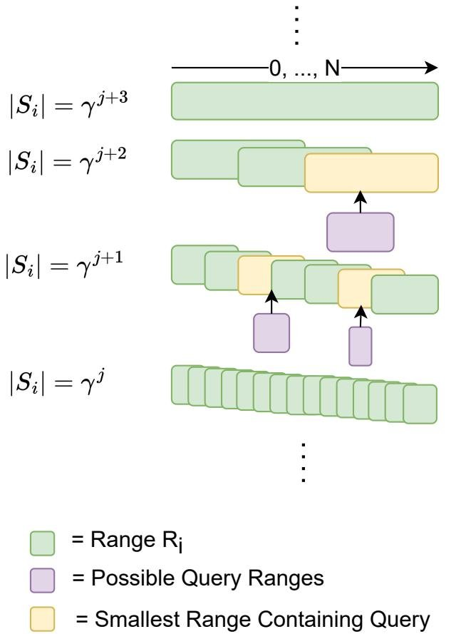  
Figure 5: Illustration of structure of ranges for Theorem 5.7.

For any subset $S$ of $D$ , let the two points corresponding to the smallest distance be $x _ { s m a l l }$ and $y _ { s m a l l }$ and the two points corresponding to the largest distance be $x _ { l a r g e }$ and $y _ { l a r g e }$ . Since $S \subset D$ , $x _ { s m a l l } , y _ { s m a l l }$ are also in $D$ , so the smallest distance in $D$ is less than or equal to $\mathsf { d i s t } _ { V } ( x _ { s m a l l } , y _ { s m a l l } )$ , and similarly $x _ { l a r g e } , y _ { l a r g e }$ are also in $D$ , so the largest distance in $D$ is greater than or equal to dist $_ V ( x _ { l a r g e } , y _ { l a r g e } )$ . Thus compared to $\Delta$ , the numerator of $\Delta _ { S }$ is no larger and the denominator is no smaller, and so $\Delta _ { S } \leq \Delta$ . In other words, the aspect ratio of any subset $S$ is less than the aspect ratio $\Delta$ of $D$ .

Because our running time result above is monotonic in $\Delta$ and $\delta$ , and the other parameters $\alpha$ and $c$ are constant, we have that $c$ -ANN search on any subset $S \subset D$ is upper bounded by the running time on the entire dataset $D$ . Thus, since $O ( A _ { q } ( D , m ) = A _ { q } ( D ) )$ , we can now plug in to Lemma 5.3, giving us our final result. □

Lemma 5.6. The ranges corresponding to a $\beta$ -WST have worst case blowup factor $B = N / 2 = O ( N )$ and cost ≤ $N \lceil \log _ { \beta } ( N ) \rceil = O ( N \log _ { \beta } ( N ) )$ .

Proof. To see that the worst case blowup factor is $O ( N )$ , consider the first split of $D$ into children $S _ { i }$ for $i = 1 , \dots \beta$ . These $S _ { i }$ correspond to label ranges $\{ [ a _ { i } , b _ { i } ] \}$ , where $a _ { 0 } = 0$ , $b _ { l a s t } = N$ , and each $a _ { i } = b _ { i - 1 } + 1$ . Consider the range $( b _ { 1 } , a _ { 2 } )$ . This range is not a subset of any $S _ { i }$ . Furthermore, because all smaller ranges further down the tree are strict subsets of some $S _ { i }$ , this range is also not a subset of any smaller range. Thus the smallest range that $S _ { i }$ is a subset of is the top level range, so a $\beta$ -WST has a worst case blowup of $\begin{array} { r } { \frac { N } { 2 } = O ( N ) } \end{array}$ .

For the cost, we note that the label ranges of each level of the tree (except possibly the last, since it might be only partially full) are a partition of $\{ 1 , \ldots , N \}$ , so the sum of $b _ { i } - a _ { i }$ is equal to $N$ for all levels but the last. There are $\lfloor \log _ { \beta } ( N ) \rfloor$ levels, and one possibly non-full level at the bottom of the tree which is smaller than or equal to a full partition of $\{ 1 , \ldots , N \}$ and so has a cost less than or equal to $N$ . Thus the total cost is bounded by $\lceil \log _ { \beta } ( N ) \rceil \cdot N$ . □

Theorem 5.7. For any $N$ and for any $\gamma > 1$ , there exists an $R$ with worst case blowup factor $2 \gamma$ that has cost at most $N \left( 2 \log _ { \gamma } ( N ) + 1 \right)$ .

Proof. At a high level, our approach is to devise a strategy that can ensure all sets of size $m$ have a blowup factor of 2. We will then repeat this strategy for $m = \gamma ^ { j }$ for all possible powers of $j$ , which will ensure that all possible ranges have a small worst case blowup factor. For a diagram of this structure see Figure 5.

First, consider the problem of choosing ranges $R _ { i }$ such that every range of size $m$ is a subset of some $R _ { i }$ with blowup factor equal to 2. One approach is to choose ranges of

$$
c o v e r (m) = \{[ j m + 1, (j + 2) m ] \mid j \in \mathbb {Z} _ {\geq 0}, (j + 2) m \leq N \} \cup [ N - 2 m + 1, N ].
$$

The ends of the ranges start at $2 m$ and go until $N$ by multiples of $m$ , for a total of $\lfloor \frac { N } { m } \rfloor - 1$ ranges. These, plus the additional range $[ N - 2 m + 1 , N ]$ , lead to a total of $\lfloor { \frac { N } { m } } \rfloor$ ranges created using this strategy. Each range has width $2 m$ , so the arrangement has cost

$$
\left\lfloor \frac {N}{m} \right\rfloor \cdot 2 m \leq 2 N.
$$

We now show that these ranges $R _ { i }$ do indeed cover all ranges of size $m$ with blowup factor equal to 2. Consider some range of length $m$ starting at $a$ . If $a$ is within the first $m + 1$ integers in a range, then it is entirely within the range. Therefore, we are interested in the union of the first $m + 1$ integers in all of the ranges, or

$$
\bigcup_ {(j + 2) m \leq N} \{[ j m + 1, (j + 1) m + 1 ] \} \bigcup [ N - 2 m + 1, N - m + 1 ] \supset [ 1, N - 2 m ] \bigcup [ N - 2 m + 1, N - m + 1 ] = [ 1, N - m + 1 ].
$$

This is all possible starting points for a range of length $m$ , so $R _ { i }$ does indeed cover all ranges of size m. Furthermore, each range is of size $2 m$ , so the blowup factor for these ranges of size $m$ is 2.

Now consider $R = \{ c o v e r ( \gamma ^ { j } ) | j \in \mathbb { Z } _ { \ge 0 } , \gamma ^ { j } < N \} \cup ( 0 , N )$ . We have that

$$
\begin{array}{l} \operatorname {c o s t} = \left\lfloor \log_ {\gamma} (N) \right\rfloor \cdot 2 N + N \\ \leq 2 N \log_ {\gamma} (N) + N \\ = N \left(2 \log_ {\gamma} (N) + 1\right). \\ \end{array}
$$

Furthermore, we now show that $R$ has worst case blowup factor $2 \gamma$ . Consider some range $r _ { q }$ of size $m$ . Consider the minimum $j$ such that $\gamma ^ { j }$ is greater than $m$ . Let us first consider the case when $\gamma ^ { j }$ is less than $N$ . Consider some range $r$ of size $\gamma ^ { j }$ that contains $r _ { q }$ . By the definition of $c o v e r ( \gamma ^ { j } )$ , there is some range of size $2 \gamma ^ { j }$ that contains $r$ and that therefore contains $r _ { q }$ . Furthermore, since this $j$ is the minimum $j$ such that $\gamma ^ { j } > m$ , we have that $m > \gamma ^ { j - 1 }$ . Thus the maximum blowup factor for $r _ { q }$ is less than $2 \gamma ^ { j } / \gamma ^ { j - 1 } = 2 \gamma$ . In the case where $\gamma ^ { j } \geq N$ , the smallest containing range is $( 0 , N )$ . We have that $m > \gamma ^ { j - \bar { 1 } } \ge N / \gamma$ , so $N / m < \gamma$ and thus the blowup factor for $r _ { q }$ is less than $\gamma$ (and also less than $2 \gamma$ ).

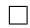

# B. ChatGPT Queries for RedCaps Query Generation

Queries were generated in two sessions with ChatGPT-4. The first consisted of the first query and the second query repeated 4 times. The second consisted of 100 examples copied from the first session and the third and four query. The first query:

I wish to run an experiment where I generate many possible text queries for my image search system. Can you help me generate queries? I want you to make the queries casual, and be as varied and creative as possible. To the best of your ability, don’t repeat yourself! Here are a few example queries: ”Funny cat memes” $\because C + +$ coding joke” ”Vegan recipe with blueberries”.

Repeated second query:

Can you generate 100 more? And still make sure to be as creative and casual as possible, and don’t repeat things you’ve already said! Additionally, try to use unique semantic and syntactic structure where possible.

Third and fourth queries:

Try not to generate queries with locations in them, because I already have lot’s of those. Thank you!

and

Great, now I just need 100 more, again as little repeats as possible, be creative! These can be more ”internet” language, so things like, e.g., ”funny cat memes.”

# C. Vamana Primer

Vamana (Jayaram Subramanya et al., 2019) is an approximate nearest neighbor algorithm that builds a graph on the input dataset $D$ . The entire system from (Jayaram Subramanya et al., 2019), including checkpointing and error recovery, is called DiskANN; Vamana is solely the in-memory ANNS component.

To construct the “slow-preproccessing” variant, which is the variant with theoretical guarantees from (Indyk & Xu, 2023), for each point $x$ , we first connect $x$ to all points. We then sort all other points in the graph in terms of increasing distance from $x$ . Starting from the first point $y$ in the list, we prune edges from $x$ to all other points $y ^ { \prime }$ where $\alpha \cdot \mathrm { d i s t } _ { V } ( y , y ^ { \prime } ) \leq \mathrm { d i s t } _ { V } ( x , y )$ . We repeat this pruning process with the next closest unpruned point until we reach the end of the list; the unpruned points are the neighbors of $x$ .

To construct the “fast-preprocessing” variant, which is the variant used in practice, we start with an empty graph. We then do a beam search query for the nearest neighbor for all points $x \in D$ , twice, building up the graph as we go. For each search, we record all points traversed in the beam search, along with the nearest neighbor if it was not found, and then add these as neighbors to $x$ . We then prune this list using the same heuristic we use for the “slow-preprocessing” variant, and also enforce with a hard cutoff that there are at maximum degree number of neighbors.

A beam search of size $B$ is a generalization of a greedy search. Given a query $x$ , we start at a start node $s$ and “explore” $s$ by adding neighbors of $s$ to a queue. This queue consists of the closest $B$ points to $x$ we have seen so far, explored or unexplored. We continually explore the closest unexplored node from the queue to $x$ until all nodes in the queue are explored. By increasing $B$ , the beam search explores more points and is more likely to find a better nearest neighbor of $x$ . We do beam searches for “fast preprorocessing” index construction and for approximate nearest neighbor queries.

# D. Experiments

# D.1. Dataset License Information

SIFT, GloVE, and DEEP are released under an MIT license by the ANN benchmarks repository (Aumuller et al. ¨ , 2020). The original RedCaps license has a restriction to non-commercial use, so our modified Redcaps dataset is released under the same restriction. Since we generated the Adverse dataset ourselves, we release it under an MIT license.

# D.2. Pareto Frontiers

See Figure 6, Figure 7, and Figure 8 for full Pareto frontier plots for a representative sample of filter widths on all datasets not included in the main text.

# D.3. Comments on Memory and Performance

We expect our method to scale well to larger datasets because our theory predicts only a $\log _ { \beta } N$ factor increase in memory cost over a single Vamana index constructed on $D$ . Our implementation also addresses memory size further by not constructing tree nodes that represent subsets smaller than 1000 points and only storing the dataset $D$ once. Figure 9 shows the memory and construction time of a $\beta$ -WST tree constructed for SIFT as we increase $\beta$ . For large $\beta$ , a $\beta$ -WST tree has an only slightly larger memory footprint (about 2X) than a single ANN index, and for the theoretical and implementation reasons above we expect this trend to hold for larger datasets.

Finally, we run additional performance experiments. See Figure 10 for comparisons of varying $\beta$ on SIFT across all filter fractions, and see Table 6 for speedups of our best method over the best baseline across recall levels 0.8, 0.9, 0.99, and 0.995.

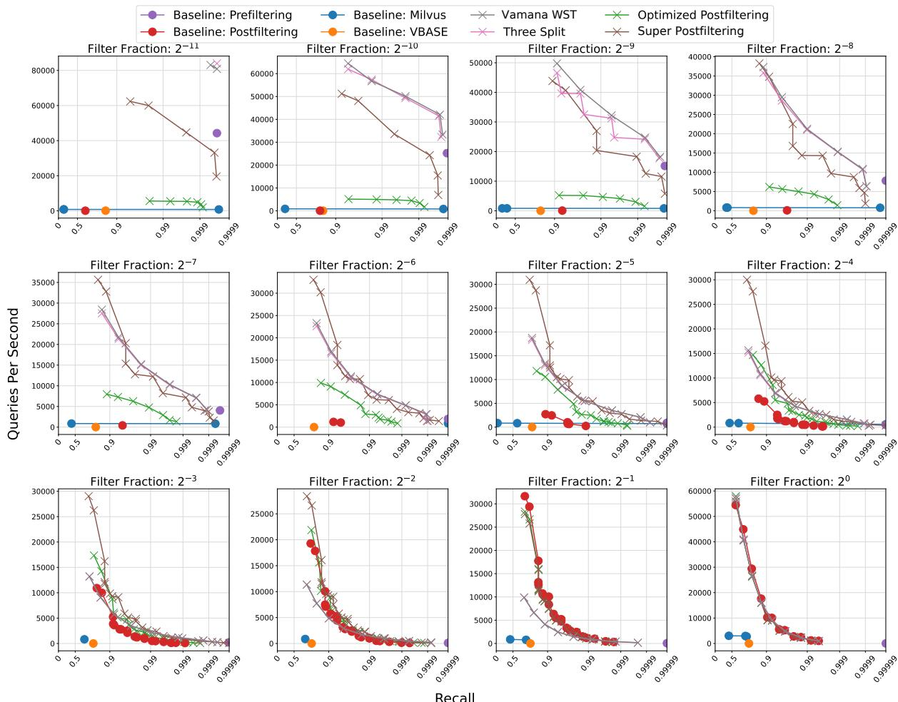  
Figure 6: Comparison of Pareto frontiers of all methods on window search with different filter fractions on GloVe. Up and to the right is better. On the medium filter fraction settings, our methods achieve multiple orders of magnitude more queries per second than the baselines at the same recall levels. All methods are run with 16 threads.

Table 6: Speedup of our best method over the best baseline, restricted to hyper-parameter settings that yield the recall in parenthesis in the dataset column. N/A means that none of our methods achieved that recall (on Redcaps this is due to poor Vamana graph quality).   

<table><tr><td>Dataset</td><td>2-11</td><td>2-10</td><td>2-9</td><td>2-8</td><td>2-7</td><td>2-6</td><td>2-5</td><td>2-4</td><td>2-3</td><td>2-2</td><td>2-1</td><td>20</td></tr><tr><td>Deep (0.8)</td><td>10.49</td><td>18.46</td><td>35.65</td><td>65.40</td><td>84.88</td><td>26.23</td><td>10.23</td><td>4.59</td><td>2.37</td><td>1.33</td><td>0.78</td><td>0.79</td></tr><tr><td>SIFT (0.8)</td><td>1.35</td><td>1.88</td><td>3.05</td><td>4.87</td><td>8.68</td><td>16.51</td><td>11.26</td><td>4.92</td><td>2.47</td><td>1.39</td><td>0.91</td><td>0.94</td></tr><tr><td>GloVe (0.8)</td><td>1.90</td><td>2.56</td><td>3.29</td><td>4.90</td><td>8.82</td><td>16.37</td><td>10.57</td><td>4.77</td><td>1.49</td><td>0.90</td><td>0.90</td><td>0.92</td></tr><tr><td>Redcaps (0.8)</td><td>5.10</td><td>7.95</td><td>11.86</td><td>29.94</td><td>36.46</td><td>20.69</td><td>5.89</td><td>2.59</td><td>3.27</td><td>1.14</td><td>0.88</td><td>0.88</td></tr><tr><td>Deep (0.9)</td><td>10.49</td><td>18.46</td><td>35.65</td><td>65.40</td><td>84.88</td><td>26.23</td><td>10.23</td><td>4.26</td><td>2.18</td><td>1.23</td><td>0.75</td><td>0.76</td></tr><tr><td>SIFT (0.9)</td><td>1.35</td><td>1.88</td><td>3.05</td><td>4.87</td><td>8.68</td><td>16.51</td><td>11.26</td><td>4.92</td><td>2.47</td><td>1.39</td><td>0.91</td><td>0.94</td></tr><tr><td>GloVe (0.9)</td><td>1.90</td><td>2.56</td><td>3.29</td><td>4.46</td><td>5.38</td><td>9.97</td><td>6.96</td><td>4.04</td><td>1.87</td><td>1.57</td><td>0.90</td><td>0.90</td></tr><tr><td>Redcaps (0.9)</td><td>3.18</td><td>5.38</td><td>8.92</td><td>18.55</td><td>19.94</td><td>10.46</td><td>4.33</td><td>1.87</td><td>1.70</td><td>1.55</td><td>0.89</td><td>0.89</td></tr><tr><td>Deep (0.99)</td><td>6.80</td><td>11.77</td><td>22.05</td><td>40.06</td><td>50.55</td><td>9.86</td><td>4.33</td><td>3.70</td><td>1.58</td><td>1.47</td><td>0.75</td><td>0.75</td></tr><tr><td>SIFT (0.99)</td><td>1.35</td><td>1.79</td><td>2.88</td><td>4.53</td><td>8.04</td><td>10.10</td><td>6.73</td><td>2.88</td><td>1.61</td><td>1.01</td><td>0.88</td><td>0.91</td></tr><tr><td>GloVe (0.99)</td><td>1.90</td><td>1.99</td><td>2.13</td><td>1.96</td><td>3.03</td><td>4.02</td><td>6.00</td><td>5.71</td><td>4.66</td><td>2.67</td><td>0.95</td><td>0.92</td></tr><tr><td>Redcaps (0.99)</td><td>1.30</td><td>1.08</td><td>1.50</td><td>1.32</td><td>1.36</td><td>1.87</td><td>3.11</td><td>0.86</td><td>1.82</td><td>3.75</td><td>N/A</td><td>N/A</td></tr><tr><td>Deep (0.995)</td><td>6.80</td><td>11.77</td><td>22.05</td><td>26.07</td><td>32.98</td><td>11.31</td><td>9.91</td><td>2.41</td><td>1.98</td><td>1.49</td><td>0.75</td><td>0.78</td></tr><tr><td>SIFT (0.995)</td><td>1.35</td><td>1.79</td><td>2.88</td><td>3.20</td><td>5.51</td><td>10.10</td><td>6.73</td><td>2.16</td><td>1.98</td><td>0.96</td><td>0.89</td><td>0.88</td></tr><tr><td>GloVe (0.995)</td><td>1.90</td><td>1.99</td><td>1.63</td><td>1.96</td><td>2.56</td><td>3.28</td><td>3.93</td><td>4.64</td><td>4.58</td><td>2.97</td><td>0.94</td><td>0.93</td></tr><tr><td>Redcaps (0.995)</td><td>N/A</td><td>0.30</td><td>N/A</td><td>N/A</td><td>N/A</td><td>N/A</td><td>N/A</td><td>N/A</td><td>N/A</td><td>N/A</td><td>N/A</td><td>N/A</td></tr></table>

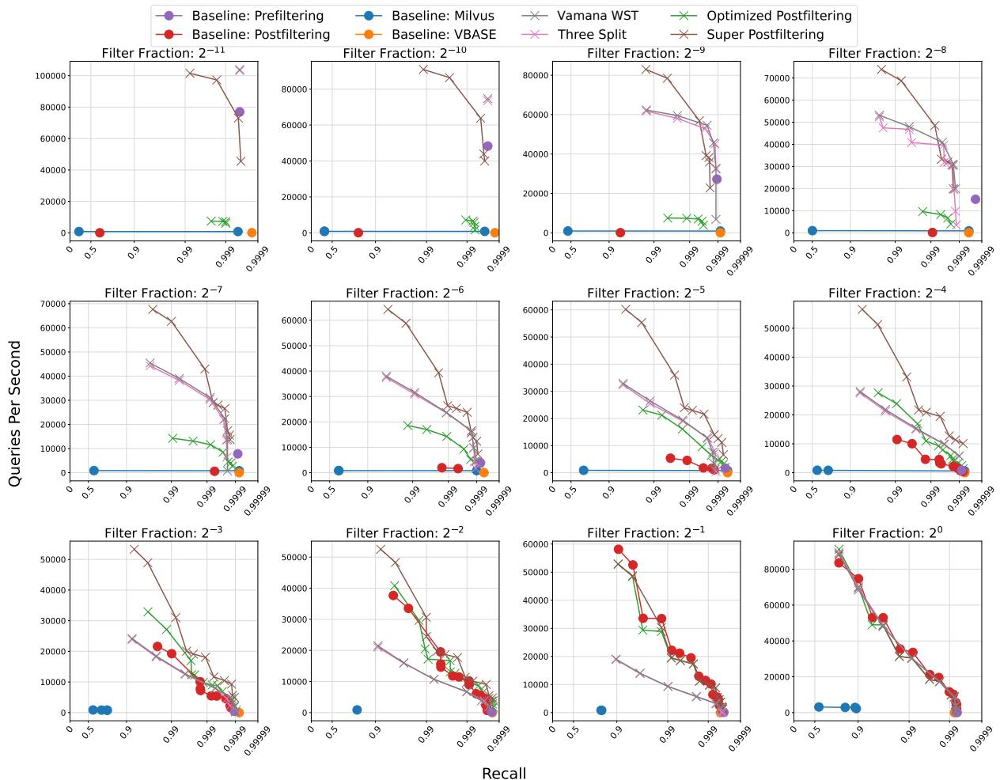  
Figure 7: Comparison of Pareto frontiers of all methods on window search with different filter fractions on SIFT. Up and to the right is better. On the medium filter fraction settings, our methods achieve multiple orders of magnitude more queries per second than the baselines at the same recall levels. All methods are run with 16 threads.

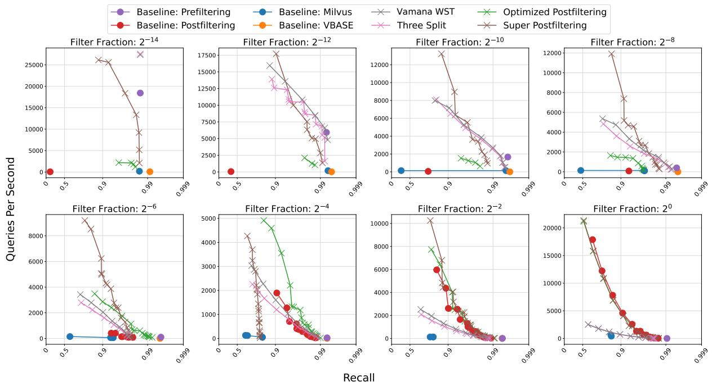  
Figure 8: Comparison of Pareto frontiers of all methods on window search with different filter fractions on Redcaps. Up and to the right is better. On the medium filter fraction settings, our methods achieve multiple orders of magnitude more queries per second than the baselines at the same recall levels. All methods are run with 16 threads.

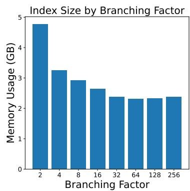

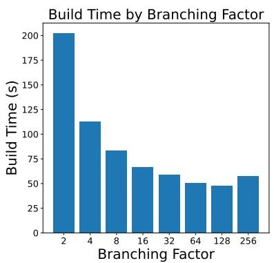  
Figure 9: Plots of index size and build time for varying branching factors $\beta$ for VamanaWST on SIFT. The indices were built using 96 threads. Smaller values are better.

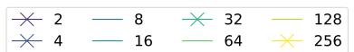  
Pareto Fronts by Branching Factor on sift-128-euclidean with vamana-tree

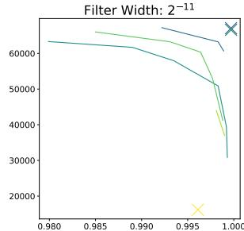

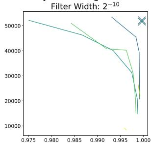

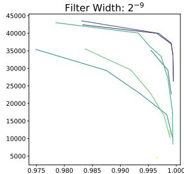

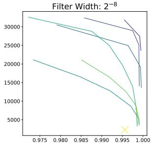

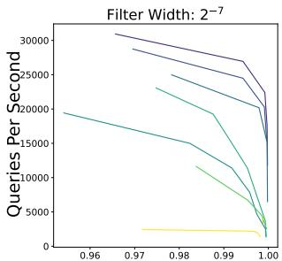

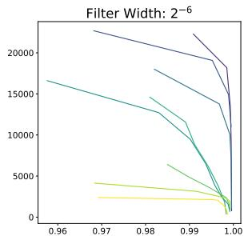

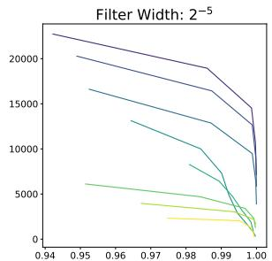

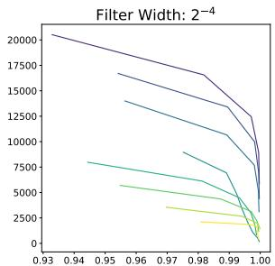

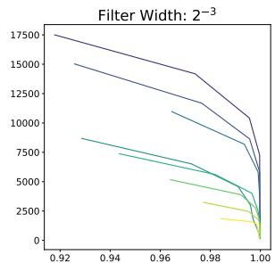

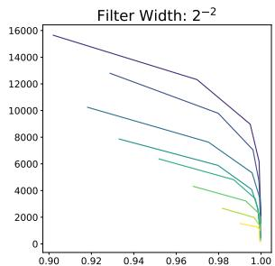

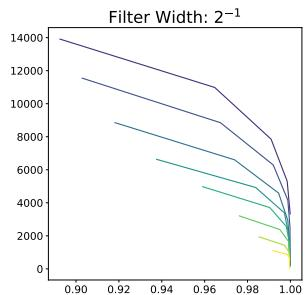

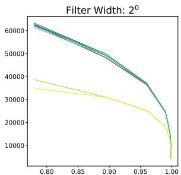  
Recall   
Figure 10: Pareto curves of recall vs. throughput on SIFT for varying window sizes and branching factors $\beta$ for VamanaWST. The experiment was run using 16 threads. Up and to the right is better.
