# UNIFY: Unified Index for Range Filtered Approximate Nearest Neighbors Search

Anqi Liang

Shanghai Jiao Tong University

lianganqi@sjtu.edu.cn

Zhongpu Chen

Southwestern University of Finance

and Economics

zpchen@swufe.edu.cn

Pengcheng Zhang

Tencent Inc.

petrizhang@tencent.com

Yitong Song

Shanghai Jiao Tong University

yitong_song@sjtu.edu.cn

Bin Yao∗

Shanghai Jiao Tong University

yaobin@cs.sjtu.edu.cn

Guangxu Cheng

Tencent Inc.

andrewcheng@tencent.com

# ABSTRACT

This paper presents an efficient and scalable framework for Range Filtered Approximate Nearest Neighbors Search (RF-ANNS) over high-dimensional vectors associated with attribute values. Given a query vector $q$ and a range $[ l , h ]$ , RF-ANNS aims to find the approximate $k$ nearest neighbors of $q$ among data whose attribute values fall within $[ l , h ]$ . Existing methods including pre-, post-, and hybrid filtering strategies that perform attribute range filtering before, after, or during the ANNS process, all suffer from significant performance degradation when query ranges shift. Though building dedicated indexes for each strategy and selecting the best one based on the query range can address this problem, it leads to index consistency and maintenance issues.

Our framework, called UNIFY, constructs a unified Proximity Graph-based (PG-based) index that seamlessly supports all three strategies. In UNIFY, we introduce SIG, a novel Segmented Inclusive Graph, which segments the dataset by attribute values. It ensures the PG of objects from any segment combinations is a sub-graph of SIG, thereby enabling efficient hybrid filtering by reconstructing and searching a PG from relevant segments. Moreover, we present Hierarchical Segmented Inclusive Graph (HSIG), a variant of SIG which incorporates a hierarchical structure inspired by HNSW to achieve logarithmic hybrid filtering complexity. We also implement pre- and post-filtering for HSIG by fusing skip list connections and compressed HNSW edges into the hierarchical graph. Experimental results show that UNIFY delivers state-of-the-art RF-ANNS performance across small, mid, and large query ranges.

# PVLDB Reference Format:

Anqi Liang, Pengcheng Zhang, Bin Yao, Zhongpu Chen, Yitong Song, and Guangxu Cheng. UNIFY: Unified Index for Range Filtered Approximate

Nearest Neighbors Search. PVLDB, 18(4): 1118 - 1130, 2024.

doi:10.14778/3717755.3717770

# PVLDB Artifact Availability:

The source code, data, and/or other artifacts have been made available at https://github.com/sjtu-dbgroup/UNIFY.

# 1 INTRODUCTION

In recent years, Approximate Nearest Neighbors Search (ANNS) has drawn great attention for its fundamental role in data mining [25, 38], recommendation systems [36], and retrieval-augmented generation (RAG) [19], etc. Numerous ANNS methods [2, 7, 23, 26, 37, 41, 50] have been developed to efficiently retrieve similar unstructured objects (e.g., text, images, and videos) by indexing and searching their high-dimensional feature vectors [25]. However, ANNS fails to support many real-world scenarios where users need to filter objects not only by feature similarities but also by certain constraints. For example, Google Image Search allows users to upload an image and search for similar images within a specific period. Likewise, e-commerce platforms such as Amazon enable customers to find visually similar products within a price range.

The above queries can be formulated as the range filtered approximate nearest neighbors search (RF-ANNS) queries. Consider a vector dataset where each vector is associated with a numeric attribute (e.g., date, price, or quantity). Given a query vector $q$ and a range [??, ℎ], RF-ANNS returns ??’s approximate $k$ nearest neighbors among the data whose attributes are within the range $[ l , h ]$ . Several studies [33, 39, 40, 43, 47] have been carried out on the RF-ANNS problem, which can be categorized into the following three strategies based on when the attribute filtering is performed.

Strategy A: Pre-Filtering. This strategy performs ANNS after the attribute filtering. For example, Alibaba ADBV [43] integrates the pre-filtering strategy using a B-tree to filter attributes, followed by a linear scan on the raw vectors or PQ [16] codes. Milvus [39] partitions data by attributes and builds ANNS indexes for subsets. RF-ANNS is done by first filtering out partitions covering the query range, then performing ANNS on subset indexes. This strategy is efficient for small query ranges, but it does not scale well with larger ranges due to the linearly increasing overhead for scanning qualified vectors or indexes.

Strategy B: Post-Filtering. This strategy uses an ANNS index to find $k ^ { \prime }$ candidate vectors $( k ^ { \prime } > k )$ , then filters by attributes to obtain the final top- $k$ results. Vearch [20] and NGT [46] apply this strategy, which can be easily extended to popular ANNS indexes like HNSW [23] and IVF-PQ [16, 18]. This method is efficient for large query ranges. In the extreme case where the query range covers $1 0 0 \%$ of objects, RF-ANNS becomes equivalent to ANNS,

making post-filtering efficient. However, if the query range is small, the ANNS stage may struggle to collect enough qualified candidates, resulting in sub-optimal performance.   
Strategy C: Hybrid Filtering. In Strategy A or B, an RF-ANNS query is decomposed into two sub-query systems for attribute filtering and ANNS processing. In contrast, Strategy C employs a single data structure to index and search vectors and attributes simultaneously. Several studies [10, 40] propose to employ state-ofthe-art Proximity Graphs (PGs) [41], e.g., HNSW [23] and Vahama [10, 15], to implement Strategy C for ANNS with categorical filtration (searching similar vectors whose attributes match a label). The recent study SeRF [52] is the first work implementing Strategy C with PGs for RF-ANNS. It compresses multiple HNSWs into a hybrid index. RF-ANNS is carried out by reconstructing and searching an HNSW index only containing objects in the query range. SeRF achieves state-of-the-art performance on query ranges from $0 . 3 \%$ to $5 0 \%$ . However, it lags behind Strategy A and B for smaller and larger ranges due to the overhead of HNSW reconstruction. Additionally, SeRF lacks support for incremental data insertion, limiting its use in scenarios with new object arrivals.   
Problems and Our Solutions. As discussed above, existing methods suffer from two challenges: sub-optimal performance when query range shifts and lack of incremental data insertion support. A trivial solution is to build dedicated indexes for each strategy and adaptively select the best one based on the query range. However, this requires extra effort to ensure data consistency across multiple indexes, leading to high maintenance costs [40]. To tackle these problems, we propose a UNIFY framework combining Strategies A, B, and C into a unified PG-based index supporting incremental insertion. UNIFY is designed to enhance RF-ANNS performance by prioritizing the following key objectives: (O1) enabling efficient hybrid filtering, (O2) supporting incremental index construction, (O3) integrating pre- and post-filtering strategies, and (O4) implementing a range-aware selection of search strategies. The key techniques in UNIFY to achieve these objectives include:   
(1) Segmented Inclusive Graph (SIG) (O1). For efficient hybrid filtering, we introduce a novel graph family named SIG. SIG segments the dataset based on attribute values and theoretically guarantees that the PG of objects from any combination of segments is a subgraph of SIG. For example, segment a dataset $\mathcal { D }$ into three subsets $\mathcal { D } _ { 1 } , \mathcal { D } _ { 2 }$ , and $\mathcal { D } _ { 3 }$ , and let $\mathbb { G } ( \boldsymbol { \mathcal { X } } )$ denote the PG constructed on dataset $\chi$ . The PGs $\mathbb { G } ( \mathcal { D } _ { 1 } )$ , $\mathbb { G } ( \mathcal { D } _ { 2 } )$ , $\mathbb { G } ( \mathcal { D } _ { 1 } \cup \mathcal { D } _ { 2 } ) , . . . , \mathbb { G } ( \mathcal { D } _ { 1 } \cup \mathcal { D } _ { 2 } \cup \mathcal { D } _ { 3 } )$ are all included in SIG. This characteristic allows us to reconstruct and search a small PG from relevant segments intersected with the query range to enhance RF-ANNS performance.   
(2) Hierarchical Segmented Inclusive Graph (HSIG) (O1 & O2). Based on SIG, we introduce HSIG, a hierarchical graph inspired by HNSW. Similar to HNSW, HSIG is built incrementally. Besides, as a variant of SIG, HSIG can approximately ensure that the HNSW of objects from any combination of segments is a sub-graph of HSIG. By reconstructing and searching an HNSW for relevant segments, we achieve $O ( \log ( n ^ { \prime } ) )$ RF-ANNS time complexity, where $n ^ { \prime }$ is the number of objects in those segments.   
(3) Fusion of skip list connections (O3). The skip list is a classic attribute index optimized for one-dimensional key-value lookup and range search (see Section 2 for more details). We observe that the skip list shares a similar hierarchical structure with our HSIG.

Inspired by this, we fuse the skip list connections that reflect the order of attribute values into the hierarchical graph structure to form a hybrid index. By navigating these skip list connections, we can efficiently select objects within the query range, thereby implementing efficient pre-filtering.

(4) Global edge masking (O3). Recall that post-filtering relies on a global ANNS index over the entire dataset. HSIG ensures that the global HNSW is approximately a sub-graph of it, meaning that each node’s global HNSW edges are included within its HSIG edges. We employ an edge masking algorithm to mark the global HNSW edges with a compact bitmap. Navigated by these bitmap-marked edges, we can perform ANNS over the global HNSW to efficiently support post-filtering.   
(5) Range-aware search strategy selection (O4). Inspired by the effectiveness of Strategies A, B, and C for different query ranges, we developed a heuristic for range-aware strategy selection. Let ?? denote the cardinality of objects that fall within the query range, our heuristic is: use Strategy A for $Y \le \tau _ { A }$ , Strategy B for $Y \geq \tau _ { B }$ and Strategy C for $\tau _ { A } < Y < \tau _ { B }$ . Here, $\tau _ { A }$ and $\tau _ { B }$ serve as thresholds to distinguish the ranges for which each strategy is most effective, and they can be derived from historical data statistics. In this paper, we run a set of sample queries to collect statistics and determine $\tau _ { A }$ and $\tau _ { B }$ . Experimental results show that this heuristic is effective.

Contributions. Our contributions are summarized as follows:

• We introduced SIG, a novel graph family that segments the dataset based on attribute values, ensuring efficient hybrid filtering by allowing the reconstruction and search of a PG from relevant segments.   
• We developed HSIG, a novel hybrid index that supports efficient hybrid filtering with logarithmic time complexity for RF-ANNS and enables incremental data insertion.   
• We integrated novel auxiliary structures, including skip list connections and edge masking bitmaps, into HSIG to support both pre- and post-filtering strategies. To the best of our knowledge, HSIG is the first index supporting pre-, post-, and hybrid filtering simultaneously.   
• Experiments on real-world datasets demonstrate that our approach significantly outperforms state-of-the-art methods for query ranges from $0 . 1 \%$ to $1 0 0 \%$ by up to 2.29 times.

# 2 PRELIMINARIES

# 2.1 Problem Definition

This paper considers a dataset $\mathcal { D }$ with attributed vectors and nearest neighbors search (NNS) with attribute constraints. Specifically, let ?? be an attribute (e.g., date, price, or quantity). We use $v [ A ]$ to denote the attribute value associated with vector ??. The range filtered nearest neighbors search (RF-NNS) problem is defined as:

Definition 1 (RF-NNS). Given a dataset $\mathcal { D }$ of ?? attributed vectors $\{ v _ { 1 } , v _ { 2 } , \ldots , v _ { n } \}$ , a distance function $\Gamma ( \cdot , \cdot )$ , and a query $Q \ =$ $( q , [ l , h ] , k )$ with $q$ as the query vector, an integer $k$ from 1 to ??, and $[ l , h ]$ a real-valued query range, RF-NNS returns the $k N N ( q , \mathcal { R } )$ , a subset of $\mathbf { \hat { \mathcal { R } } } = \left\{ v \mid v \in \mathcal { D } \right.$ and $l \leq v [ A ] \leq h \}$ . For any ?? $\mathsf { \Pi } _ { \mathsf { \Pi } } \in k N N ( q , \mathcal { R } )$ and any?? $\in \mathcal { R } \backslash k N N ( q , \mathcal { R } )$ , it holds that $\Gamma ( o , q ) < \Gamma ( u , q ) .$ . If $| { \mathcal { R } } | < k$ , all objects in $\mathcal { R }$ are returned.

Algorithm 1: ANNSearch   
Input: $\mathbb{G}$ : HNSW layer; $q$ query vector; $ep$ entry point; $k$ .. an integer. Output: $q$ 's approximate $k$ nearest neighbors on $\mathbb{G}$ push $ep$ to the min-heap cand in the order of distance to $q$ push $ep$ to the max-heap ann in the order of distance to $q$ mark $ep$ as visited; while $|cand| > 0$ do o pop the nearest object to q in cand; u - the furthest object to q in ann; if $\Gamma (o,q) > \Gamma (u,q)$ then break; foreach unvisited v E $\mathbb{G}[o]$ do mark v as visited; u - the furthest object to q in ann; if $\Gamma (v,q) <   \Gamma (u,q)$ or $|\text{ann}| <   k$ then push v to cand and ann; if $|\text{ann}| > k$ then pop ann;   
return ann;

Due to the "curse of dimensionality" [14], exact NNS in highdimensional space is inefficient [21]. As a result, most research focuses on approximate nearest neighbors search (ANNS), which reports approximate results with an optimized recall. Similarly, this paper studies the RF-ANNS problem, which returns an approximate result set $k N N ^ { \prime } ( q , \mathcal { R } )$ with an optimized recall:

$$
\operatorname {r e c a l l} = \frac {\left| k N N ^ {\prime} (\boldsymbol {q} , \mathcal {R}) \cap k N N (\boldsymbol {q} , \mathcal {R}) \right|}{\min  (k , | \mathcal {R} |)}. \tag {1}
$$

# 2.2 Proximity Graph

A Proximity Graph (PG) [41] treats a vector as a graph node, with connections built based on vector proximity. Various greedy heuristics are proposed to navigate the graph for ANNS [41]. In the following, we introduce two PGs related to our work.

$k$ Nearest Neighbor Graph (??NNG) [29]. Given a dataset $\mathcal { D }$ , a $k { \mathrm { N N G } }$ is built by connecting each vector ?? to its $k$ nearest neighbors, $k N N ( v , \mathcal { D } \setminus \{ v \} )$ . ??NNG limits the number of edges per node to at most $k$ , making it suitable for memory-constrained environments. However, ??NNG focuses on local connections and does not guarantee global connectivity, leading to sub-optimal performance compared to state-of-the-art PGs such as HNSW [23].

Hierarchical Navigable Small World Graph (HNSW) [23]. HNSW is inspired by the 1D probabilistic structure of the skip list [32], where each layer is a linked list ordered by 1D values. The bottom layer includes all objects, while the upper layers contain progressively fewer objects. HNSW extends this structure by replacing linked lists with PGs, enabling efficient hierarchical search. The hierarchical structure of HNSW is similar to that in Figure 4. As shown in Algorithm 1, HNSW uses a greedy approach to find the $k \mathbf { N N }$ for query vector $q$ in each layer. The neighbors of each node $v _ { i }$ in a given layer $\mathbb { G }$ are stored in adjacency lists $\mathbb { G } [ v _ { i } ]$ . The search starts at an entry point $e p$ , the most recently inserted vector at the topmost layer [23]. It repeatedly selects the nearest object ?? to

Algorithm 2: HierarchicalANNS   
Input :H: HNSW; q: query vector; ep: entry point; ef: enlarge factor; k: an integer. Output: $q$ 's approximate $k$ nearest neighbors.   
1 $L\gets$ max level of $\mathbb{H}$ .   
2 foreach $L\geq i\geq 1$ do /Search the i-th layer $\mathbb{H}^i$ \*/ ann $\leftarrow$ ANNSearch( $\mathbb{H}^i$ , q, ep, 1); ep $\leftarrow$ the nearest object to q in ann; /Search the bottom layer $\mathbb{H}^0$ \*/ ann $\leftarrow$ ANNSearch( $\mathbb{H}^0$ , q, ep, ef); return top- $k$ nearest objects to q in ann;   
Algorithm 3: InsertLayer   
Input :G: HNSW layer; v: the object to insert; ep: entry point; M: the maximum degree; efCons: number of candidate neighbors. Output: the updated graph. ann $\leftarrow$ ANNSearch(G, v, ep, efCons) $\mathbb{G}[v]\gets$ Prune(v, ann, M)   
3 foreach $o\in \mathbb{G}[v]$ do add v to G[o]; if $|\mathbb{G}[o]| > M$ then $\mathbb{G}[o]\gets$ Prune(o, G[o], M);   
6 return G;

$q$ from ???????? (Line 5), adds ??’s unvisited neighbors to ???????? (Lines 8–12), and updates ?????? (Lines 11–13). The search ends when all nodes in ???????? are farther from $q$ than those in ??????. As shown in Algorithm 2, the hierarchical search in HNSW begins at a coarse layer to identify promising regions and progressively descends to finer layers for detailed exploration. To improve accuracy, Algorithm 2 uses the parameter ?? ?? $( e f > k )$ , initially exploring ?? ?? neighbors to broaden the search region, and finally returns the top- $k$ results.

HNSW is built incrementally based on Algorithm 3. When inserting a new object ?? into an HNSW layer, the process begins by searching for its top ?? ?? ???????? nearest neighbors using the ANNSearch algorithm (Line 1). The Prune heuristic is then applied to limit ??’s connections to a maximum of $M$ (Line 2). The value of $M$ , typically set between 5 and 48 [23], balances accuracy and efficiency, with its optimal value determined experimentally. The Prune method initially sorts ??’s candidate neighbors by distance. For each candidate $r _ { : }$ if a neighbor ?? satisfies $\Gamma ( v , r ) > \Gamma ( e , r )$ , $r$ is pruned. Otherwise, an edge between ?? and $r$ is inserted. The process continues until ?? has $M$ neighbors. Additionally, ?? is added to the neighbor lists of its identified neighbors, and the Prune method is applied to each neighbor to maintain the $M$ -neighbor limit (Lines 3–5). The Prune strategy prevents the graph from becoming overly dense, ensuring efficient navigation. HNSW achieves state-of-the-art ANNS time complexity of $O ( \log n )$ [41] and demonstrates top-tier practical performance indicated by various benchmarks [3, 21, 41]. It also serves as the backbone for various vector databases such as Pinecone [31], Weaviate [42], and Milvus [39].

# 3 SEGMENTED INCLUSIVE GRAPH

We aim to develop a PG-based index that integrates three search strategies and supports incremental construction. Section 3.1 introduces the Segmented Inclusive Graph (SIG), a novel graph family that leverages attribute segmentation and inclusivity for hybrid filtering. Section 3.2 explores the challenges of constructing an SIG using the basic PG structure $k { \mathsf { N N G } }$ and presents practical solutions.

# 3.1 SIG Overview

Attribute Segmentation. Given a dataset of $n$ objects, RF-ANNS is concerned only with the $n ^ { \prime }$ objects within the query range, where $n ^ { \prime } \leq n$ . To efficiently filter out the qualified objects, we employ the attribute segmentation method to reduce the search space. Assuming that the attribute distribution remains stable, we first sample objects from the dataset and sort them by their attribute values, then apply an equi-depth histogram [30] to partition them. The histogram bin boundaries define the attribute intervals for each segment, partitioning the dataset into disjoint subsets with similar sizes for further indexing.

Graph Inclusivity and SIG. After attribute segmentation, we focus on designing a graph for efficient hybrid filtering. Since a query range intersects a few segments, a straightforward approach is to independently build PGs for each segment. For an RF-ANNS query, we search the local PGs in intersected segments and merge the results for the global ??NN. However, this method results in search time increasing linearly with the number of intersected segments. State-of-the-art PGs offer an ANNS time complexity of $O ( \log n )$ , suggesting sub-linear search time growth with the number of intersected segments. For example, with ?? segments, searching multiple PGs scales as $O ( S \log ( \frac { n } { S } ) )$ , while searching a single PG containing all objects scales as $O ( \log n )$ . The ratio between them is $S \left( 1 - { \frac { \log S } { \log n } } \right)$ . Since $1 < S \ll n$ , this ratio is greater than 1 but less than ??, indicating that searching across multiple PGs is less efficient than searching a single PG containing all objects.

Inspired by this, we introduce a novel graph family known as the Segmented Inclusive Graph (SIG). An SIG ensures that the PG of any segment combination is included in (i.e., is a sub-graph of) the SIG. Leveraging this characteristic, termed graph inclusivity, allows efficient hybrid filtering by reconstructing and searching the smaller PG of a few segments covering the query range. Below, we introduce the formal definitions of graph inclusivity and SIG.

Definition 2 (Graph Inclusivity and Segmented Inclusive Graph). Let $\mathbb { G } ( \boldsymbol { \mathcal { X } } )$ denote a PG constructed over the dataset $\chi$ . Given a dataset $\mathcal { D }$ segmented into ?? disjoint subsets $\mathcal { P } = \{ \mathcal { D } _ { 1 } , \mathcal { D } _ { 2 } , \ldots , \mathcal { D } _ { S } \} ,$ a segmented inclusive graph $\mathbb { S I G } ( \mathcal { D } )$ is a type of graph that possesses the property of graph inclusivity defined as

$$
\forall r \in \{1, 2, \dots , S \}, \forall \mathcal {C} \in \mathcal {P} ^ {(r)}, \mathbb {G} (\bigcup_ {e \in \mathcal {C}} e) \subseteq \mathbb {S I G} (\mathcal {D}), \tag {2}
$$

where $\mathcal { P } ^ { ( r ) }$ denotes all possible combinations of ?? elements from $\mathcal { P }$ .

Example 1. Assume that $\mathcal { P } = \{ \mathcal { D } _ { 1 } , \mathcal { D } _ { 2 } , \mathcal { D } _ { 3 } \}$ , we have $\mathcal { P } ^ { ( 2 ) } =$ $\{ \{ \mathcal { D } _ { 1 } , \mathcal { D } _ { 2 } \} , \{ \mathcal { D } _ { 1 } , \mathcal { D } _ { 3 } \} , \{ \mathcal { D } _ { 2 } , \mathcal { D } _ { 3 } \} \}$ . For one of the possible combinations $C = \{ \mathcal { D } _ { 1 } , \mathcal { D } _ { 2 } \}$ , we have $\cup _ { e \in C } ( e ) = \mathcal { D } _ { 1 } \cup \mathcal { D } _ { 2 }$ . It holds that $\mathbb { G } ( \mathcal { D } _ { 1 } \cup \mathcal { D } _ { 2 } ) \subseteq \mathbb { S } \mathbb { I G } ( \mathcal { D } )$ .

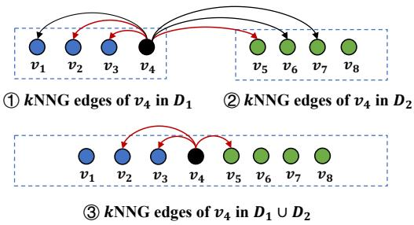

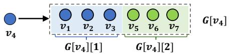  
Figure 1: Build multiple ??NNGs exhaustively $\left( k = 3 \right)$ .   
Figure 2: Example of the segmented adjacency list $\left( k = 3 \right)$

Based on Definition 2, we derive an exhaustive SIG construction algorithm: build PGs for all segment combinations and merge them into a single graph. While it guarantees graph inclusivity, it faces significant computational challenges. With $S$ segments, the number of combinations is $\begin{array} { r } { \sum _ { i = 1 } ^ { S } \binom { S } { i } = 2 ^ { { \bar { S } } } - 1 } \end{array}$ , and the space complexity of SIG scales as $O ( 2 ^ { S } - 1 )$ , making the construction of all PGs both computationally and spatially prohibitive1. Thus, we propose a space-efficient SIG index that scales as $O ( S )$ in the next section.

# 3.2 SIG-??NNG

In this section, we conduct a case study on ??NNG to demonstrate the limitations of the exhaustive method. Then, we introduce SIG-??NNG, a novel graph structure that guarantees inclusivity without exhaustively building all possible ??NNGs.

Limitation of the Exhaustive Method. For each object ?? in a dataset $\mathcal { D }$ , constructing a $k { \mathrm { N N G } }$ involves adding a directed edge $( v , o )$ for each object $o \in k N N ( v , \mathcal { D } \setminus \{ v \} )$ . When the dataset is divided into $S$ subsets by attribute segmentation, the exhaustive method requires running the construction algorithm $2 ^ { S } - 1$ times. Figure 1 illustrates an example. Here, the dataset $\mathcal { D }$ is divided into two subsets $\mathcal { D } _ { 1 } = \{ v _ { 1 } , v _ { 2 } , v _ { 3 } , v _ { 4 } \}$ and $\mathcal { D } _ { 2 } = \{ v _ { 5 } , v _ { 6 } , v _ { 7 } , v _ { 8 } \}$ . We need to build ??NNGs $\scriptstyle ( k = 3 )$ for $\mathcal { D } _ { 1 }$ , $\mathcal { D } _ { 2 }$ , and $\mathcal { D } _ { 1 } \cup \mathcal { D } _ { 2 }$ , respectively. Such exhaustive construction is unnecessary, as the $k \mathbf { N N }$ of a union is inherently within the individual ??NN sets. For example, all objects in $k N N ( v _ { 4 } , \mathcal { D } _ { 1 } \cup \mathcal { D } _ { 2 } )$ can be found in $k N N ( v _ { 4 } , \mathcal { D } _ { 1 } ) \cup k N N ( v _ { 4 } , \mathcal { D } _ { 2 } )$ . In other words, $v _ { 4 }$ ’s three edges in graph $\textcircled{3}$ are already included in graphs $\textcircled{1}$ and $\textcircled{2}$ , making the construction of graph $\textcircled{3}$ redundant. Structure of SIG-??NNG. Inspired by the prior observations, we introduce SIG-??NNG, a novel graph structure that achieves inclusivity without the need for exhaustive ??NNG construction. SIG-??NNG uses a segmented adjacency list to store the outgoing edges for each object in the graph. As illustrated in Figure 2, given a dataset $\mathcal { D }$ segmented into ?? subsets $\mathcal { D } _ { 1 } , . . . , \mathcal { D } _ { S }$ , the adjacency list for any object

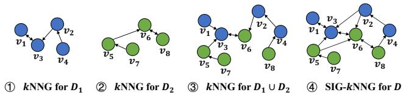  
Figure 3: Illustration of SIG-??NNG’s inlusivity $( k = 1 )$ .

?? is divided into ?? chunks. For example, the full adjacency list $\mathbb { G } [ v _ { 4 } ]$ of object $\boldsymbol { v } _ { 4 }$ is segmented into two chunks $\mathbb { G } [ v _ { 4 } ]$ [1] and $\mathbb { G } [ v _ { 4 } ]$ [2]. The ??-th chunk stores only ??’s ??NN within $\mathcal { D } _ { i }$ . Based on this design, to add SIG-??NNG edges for ??, we perform $k \mathbf { N N }$ searches ?? times to find its neighbors in each subset, instead of searching $2 ^ { S } - 1$ times across all subset combinations. In the following, we introduce the formal definition of SIG-??NNG and prove that SIG-??NNG can exactly guarantee inclusivity.

Definition 3 (SIG-??NNG). Given a dataset $\mathcal { D }$ segmented into ?? disjoint subsets $\mathcal { D } _ { 1 } , \mathcal { D } _ { 2 } , \ldots , \mathcal { D } _ { S }$ , the SIG-??NNG on $\mathcal { D }$ is defined as $\mathbb { F } _ { k } ( \mathcal { D } ) = \left( V _ { \mathbb { F } } , E _ { \mathbb { F } } \right)$ , where $V _ { \mathbb { F } } = \mathcal { D }$ and $\begin{array} { r } { E _ { \mathbb { F } } = \bigcup _ { v \in \mathcal { D } } \bigcup _ { i = 1 } ^ { S } E _ { i } ^ { k } ( v ) } \end{array}$ . Here, $E _ { i } ^ { k } ( v )$ is the set of edges based on the ??-th chunk of ??’s adjacency list, defined as $E _ { i } ^ { k } ( v ) = \{ ( v , o ) \mid o \in k N N ( v , { \mathcal { D } } _ { i } \setminus \{ v \} ) \} .$

Inclusivity of SIG-??NNG. We first present the following lemma, which shows that the ??NN of a union is inherently included in the individual $k \mathbf { N N }$ sets.

Lemma 1. Given ?? disjoint datasets $\mathcal { D } _ { 1 } , \mathcal { D } _ { 2 } , \ldots , \mathcal { D } _ { r }$ and their union set $\mathcal { U } = \cup _ { i = 1 } ^ { r } \mathcal { D } _ { i }$ , it holds that $\forall v \in \mathcal { U }$ , $k N N ( v , \mathcal { U } \setminus \{ v \} ) \subseteq$ $\cup _ { i = 1 } ^ { r } k N N ( v , \mathcal { D } _ { i } \setminus \{ v \} )$ .

Based on Lemma 1, we derive the inclusivity of SIG-??NNG, as presented in Theorem 1. The proof is omitted here for brevity, as it is straightforward to follow.

Theorem 1. Let $\mathbb { G } _ { k } ( \boldsymbol { \mathcal { X } } )$ and $\mathbb { F } _ { k } ( X )$ denote a ??NNG and SIG-??NNG for dataset $\chi$ , respectively. Given a dataset $\mathcal { D }$ segmented into ?? disjoint subsets $\mathcal { D } _ { 1 } , \mathcal { D } _ { 2 } , \ldots , \mathcal { D } _ { S }$ , it follows that SIG-??NNG is a segmented inclusive graph. Specifically, for any ?? distinct integers $i _ { 1 } , i _ { 2 } , \dots , i _ { r }$ chosen from $[ 1 , S ]$ with $1 ~ \leq ~ r ~ \leq ~ S$ , we have $\mathbb { G } _ { k } ( \mathcal { U } ) \subseteq \mathbb { F } _ { k } ( \mathcal { D } )$ , where $\mathcal { U } = \cup _ { j = 1 } ^ { r } \mathcal { D } _ { i _ { j } }$ .

Example 2. Figure 3 demonstrates the inclusivity of SIG-??NNG. Given a dataset $\mathcal { D } = \{ v _ { 1 } , v _ { 2 } , . . . , v _ { 8 } \}$ , we assume the attribute of $\dot { \boldsymbol { v } } _ { i }$ is ?? for simplicity. The attribute space [1, 8] is divided into two disjoint segments [1, 5) and [5, 8], leading to two subsets $\mathcal { D } _ { 1 } = \{ v _ { 1 } , v _ { 2 } , v _ { 3 } , v _ { 4 } \}$ and $\mathcal { D } _ { 2 } = \{ v _ { 5 } , v _ { 6 } , v _ { 7 } , v _ { 8 } \}$ . Graphs $\textcircled{1}$ ~ $\textcircled{3}$ represent the ??NNGs for $\mathcal { D } _ { 1 }$ , $\mathcal { D } _ { 2 }$ , and $\mathcal { D } _ { 1 } \cup \mathcal { D } _ { 2 }$ , and the SIG-??NNG for $\mathcal { D }$ is displayed in graph $\textcircled{4}$ . As illustrated, all three ??NNGs are sub-graphs of the SIG-??NNG.

# 4 HIERARCHICAL SEGMENTED INCLUSIVE GRAPH

SIG-??NNG offers an efficient approach to build an SIG with segmented adjacency lists. Though it theoretically guarantees inclusivity, the underlying ??NNG is not competitive with state-of-the-art PGs like HNSW [23]. Additionally, SIG-??NNG lacks support for incremental insertion. In this section, we expand the basic idea of SIG-??NNG, introducing the Hierarchical Segmented Inclusive

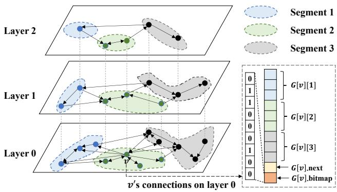  
Figure 4: Illustration of HSIG.

Graph (HSIG), which uses HNSW as a building block to achieve incremental construction and a logarithmic search complexity.

Figure 4 provides an overview of HSIG, showcasing a hierarchical structure that follows the structure of HNSW and skip lists. HSIG is a unified structure that indexes both vectors and attributes by leveraging the strengths of vector-oriented HNSW and attributeoriented skip lists. For vector indexing, HSIG organizes the outgoing edges of each object into chunks based on attribute segmentation, inspired by SIG-??NNG. Each chunk contains the edges of an HNSW for the corresponding segment. Thus, the backbone graph of HSIG can be seen as a set of HNSWs constructed for different segments (e.g., the three HNSWs with different colors in Figure 4), which are mutually connected with additional edges to ensure inclusivity. Additionally, we incorporate the skip list into the backbone graph to index attributes for efficient pre-filtering and introduce a compact auxiliary structure to optimize post-filtering. The structure and algorithms are detailed in Sections 4.1 and 4.2.

# 4.1 HSIG Construction

In this section, we describe the core structures of HSIG for hybrid, pre-, and post-filtering sequentially. Then, we integrate them to introduce the complete insertion algorithm.

Backbone Graph for Hybrid Filtering. Based on Theorem 1, we present HSIG’s backbone graph, which is designed to ensure inclusivity regarding HNSW and support efficient hybrid filtering. As depicted in Algorithm 3, when inserting a new object ?? into an HNSW layer, the core operation involves finding ??’s ?? ?? ???????? nearest neighbors and establishing up to $M$ connections. This procedure is similar to ??NNG’s construction, which finds ??NN and establishes at most $k$ connections. Therefore, we use the segmented adjacency list introduced by SIG-??NNG to guarantee the inclusivity for all possible HNSW connections. With $S$ segments, connections are stored in ?? chunks, with a maximum degree of ?? per chunk. The values of $S$ and $M$ are experimentally determined, with default values set to 8 and 16, respectively. Since each chunk contains the HNSW connections in the corresponding segment, the objects and connections in chunk $j$ form a sub-graph $\mathbb { G } _ { j }$ of the backbone graph in HSIG. When inserting object ?? that is located in segment ??, Algorithm 4 outlines how to build ??’s connections in segment $j$ at an HSIG layer. First, we search for ??’s ?? ?? ???????? nearest neighbors in ${ \mathbb G } _ { j }$ (Line 1) using ANNSearch (Algorithm 1), then select up to $M$

Algorithm 4: BackboneConnectionsBuild   
Input: $\mathbb{G}$ :HSIG layer; $ep$ :entry point; $v$ :the object to insert; $i$ index of the segment that $v[A]$ belongs to; $j$ :index of the segment to insert; $M$ :the maximum degree;efCons:number of candidate neighbors. Output:v's approximate nearest neighbors in $\mathbb{G}_j$ (a sub-graph of $\mathbb{G}$ with only nodes and edges in segment $j$ 1 ann $\leftarrow$ ANNSearch( $\mathbb{G}_j,v,ep,efCons$ ) 2 foreach $o\in \mathrm{Prune}(v,\mathrm{ann},M)$ do 3 add $(v,o)$ to $\mathbb{G}[v][j]$ 4 add $(o,v)$ to $\mathbb{G}[o][i]$ 5 if $|\mathbb{G}[o][i]| > M$ then 6 $\mathbb{G}[o][i]\gets \mathrm{Prune}(o,\mathbb{G}[o][i],M);$ 7 return ann;

neighbors using the Prune algorithm. For each neighbor ??, we establish mutual connections between ?? and ?? within their respective segments (Lines 2–4). If the number of neighbors of ?? in segment ?? exceeds $M$ , we apply the Prune algorithm to discard the extra neighbors (Lines 5–6). This algorithm guarantees the approximate inclusivity of HSIG, as demonstrated in Section 5.4.

Fusing Skip List Connections for Pre-Filtering. For small-range RF-ANNS queries, pre-filtering with an attribute index typically outperforms PG-based methods. This is because PGs prioritize vectors over attributes, making it difficult to filter candidates within the query range. For instance, in the extreme case of a query range containing only one object, using an attribute index to quickly locate the target object is optimal. Thus, we propose fusing an attribute index into the graph structure for effective pre-filtering. As described in Section 2, the skip list is a popular index for efficient 1D key-value lookups and range searches, sharing a hierarchical structure similar to HNSW and HSIG. Inspired by this, we integrate the skip list into the backbone graph of HSIG to form a unified index. Navigated by skip list connections, we can efficiently locate and linearly search objects within the query range. As shown in Figure 4, we use an extra connection G[??].???????? to store the ID of ??’s successor object in the skip list. After inserting an object into the backbone graph via Algorithm 4, we search for its successor in the skip list and store it in G[?? ].???????? .

Global Edge Masking for Post-Filtering. For large-range queries, post-filtering with a pure ANNS index is preferable. We use a global HNSW over the entire dataset to support post-filtering. Due to inclusivity, the global HNSW is (approximately) a sub-graph of HSIG. We apply a global edge pruning method to identify these HNSW edges from HSIG edges and use a compact bitmap to mask the unused edges. Since each segment’s sub-graph has a maximum degree of $M$ , we similarly limit the connections in the global graph to a maximum of ??. This procedure is detailed in Algorithm 5. First, we obtain the object ??’s connections in all segments and select $M$ connections using the Prune algorithm (Line 1). Next, we create a bitmap whose size equals the number of ??’s neighbors in all segments and set the positions of ??’s ?? neighbors to 1 (Line 2). For each neighbor ?? in the $M$ neighbors (Line 3), if $v$ is also a

Algorithm 5: GlobalEdgeMasking   
Input: $\mathbb{G}$ :HSIG layer; $v$ : the object to insert; $M$ : the maximum degree. Output: the updated graph.   
1 $\mathcal{N}\gets \mathrm{Prune}(v,\mathbb{G}[v],M)$ 2 $\mathbb{G}[v].\mathrm{bitmap}\gets$ generate bitmap with $\mathcal{N}$ .   
3 foreach $o\in \mathcal{N}$ do if $v\in \mathbb{G}[o]$ then pos $\leftarrow v\right.$ s position in $\mathbb{G}[o]$ . G[o].Bitmap[pos] $\leftarrow 1$ if sum(G[o].Bitmap) $>$ M then N' $\leftarrow$ Prune(o, G[o], M); G[o].Bitmap $\leftarrow$ update bitmap with $\mathcal{N}^{\prime}$ .   
10 return G;

neighbor of ??, set the position of ?? in ??’s bitmap to 1 (Lines 4–6). Then, we update the bitmap of ?? (Lines 7–9).

Complete Insertion Algorithm. As aforementioned, the adjacency list of a node in HSIG consists of (1) several chunks for backbone graph connections, (2) a skip list connection, and (3) a bitmap for global connections. The bottom-right of Figure 4 illustrates an example. Here, $\mathbb { G } [ v ] [ i ]$ is the backbone graph connections of ?? in the $i$ -th segment, G[??].next stores the ID of ??’s successor in the skip list, and G[??].bitmap stores the global edge masks.

Next, we present the complete insertion algorithm for constructing an HSIG. The HSIG structure consists of a set of HNSWs for different segments, augmented with auxiliary structures for preand post-filtering. Construction involves three main steps: building the HNSW in each segment, adding skip list connections, and applying global edge masking. Each step is performed hierarchically and incrementally, as outlined in Algorithm 6. First, we find the segment to which object ?? belongs (Line 1). The maximum layer ?????????? of ?? is randomly assigned using an exponentially decaying probability distribution normalized by $m _ { L }$ (Line 2; see [23] for details). We then traverse all segments (Line 3) to sequentially build the HNSW $\mathbb { H } \mathbb { G } _ { j }$ in each segment $j$ , determining its maximum level $L$ and entry point $e p$ (Lines 4–5). For each layer ?? from ?? to ?????????? $+ 1$ , we use ANNSearch (Algorithm 1) to find the nearest neighbor $e p$ of ?? in $\mathbb { H } \mathbb { G } _ { j } ^ { l }$ , where $\mathbb { H } \mathbb { G } _ { j } ^ { l }$ denotes layer $l$ in $\mathbb { H } \mathbb { G } _ { j }$ (Lines 6–7). Then, for each layer ?? from ?????????? to 0, we employ BackboneConnectionsBuild (Algorithm 4) to insert $v$ into $\mathbb { H } \mathbb { G } _ { j } ^ { l }$ , using its nearest neighbor as the entry point for the next layer (Lines 8–10). After building $\mathbb { H } \mathbb { G } _ { j }$ we update its entry point if necessary (Line 11), ensuring the first object in the topmost layer serves as the entry. Next, ?? is inserted into the skip list using the method in [32] (Line 12). Finally, we use GlobalEdgeMasking (Algorithm 5) to mask unnecessary edges for post-filtering from layer 0 to ?????????? (Lines 13–14).

# 4.2 Search on HSIG

To adapt to different query ranges, we propose three search strategies and a range-aware search strategy selection method.

Strategy A (Pre-Filtering). Navigated by the hierarchical skip list connections, we can quickly reach the bottom layer to identify the

Algorithm 6: HSIGInsert   
Input :HG: HSIG; $v$ : the object to insert; $S$ : number of segments; $M$ : the maximum degree; efCons: number of candidate neighbors. Output: the updated HSIG.  
1 $i\gets$ ComputeSegmentId(v[A]);  
2 level $\leftarrow \lfloor -\ln (unif(0\dots 1)\cdot m_L)\rfloor$ .  
3 foreach $1\leq j\leq S$ do  
4 L $\leftarrow$ the max level of HGj;  
5 $ep\gets$ the entry point of HGj;  
6 foreach $L\geq l\geq$ level + 1 do  
7 $\begin{array}{r}\lfloor ep\gets \mathrm{ANNSearch}(\mathbb{H}\mathbb{G}_j^l,v,ep,1); \end{array}$ 8 foreach level $\geq l\geq 0$ do  
9 ann $\leftarrow$ BackboneConnectionsBuild(HG,ep,v,i,j, M,efCons);  
10 $ep\gets$ nearest object to v in ann;  
11 update graph entry for HGj if necessary;  
12 add skip list connections for v in layers 0...level;  
13 foreach $0\leq l\leq$ level do  
14 HG $\leftarrow$ GlobalEdgeMasking(HG, v, M);  
15 return HG;

first object whose attribute value falls within the query range. From there, a linear search is performed to collect the query vector’s ??NN among those vectors with qualified attribute values. This method is straightforward, so pseudocode is omitted.

Strategy B (Post-Filtering). We employ the hierarchical search scheme in Algorithm 2 for ANNS, followed by filtering objects within the query range. ANNS is performed over a global HNSW with edges marked by bitmaps. During the search, only outgoing edges marked as 1 in an object’s bitmap are considered. The search retrieves the top- $_ { e f }$ nearest neighbors $( e f > k )$ in the bottom layer, after which attribute filtering is applied to obtain the top- $k$ results. Strategy C (Hybrid Filtering). We perform hybrid filtering by reconstructing and searching the HNSW of segments covering the query range. The search follows the hierarchical scheme in Algorithm 2, starting from the topmost entry point of graphs in all segments. Since each object has ?? connections per segment, and assuming there are $S ^ { \prime }$ segments intersecting the query range, this requires visiting $M S ^ { \prime }$ neighboring nodes, leading to a large search space and high computational complexity. Thus, we introduce the search parameter $m$ to reconstruct an HNSW with a maximum degree of $m$ at runtime. We propose two neighbor selection strategies to select $m$ neighbors from $M S ^ { \prime }$ connections: (1) compute distances between node ?? and its neighbors across all $S ^ { \prime }$ segments, then select the top- $m$ neighbors by sorting them by distance; and (2) select the top- $\left( \lceil m / S ^ { \prime } \rceil \right)$ neighbors from each chunk of the adjacency list. Since neighbors in each chunk are naturally ordered by distance to ?? upon acquisition via ANNSearch, we simply take the first $\lceil m / S ^ { \prime } \rceil$ objects. We adopt the second strategy as the default, based on experimental results in Section 5.6. Algorithm 7 presents the pseudocode for hybrid filtering at a specific layer. Compared with Algorithm 1, the key differences are: (1) only examining outgoing edges within

Algorithm 7: HybridFilteringLayer   
Input :G:HSIG layer; $q$ query vector; $[l,h]$ : query range; m: number of visited neighbors per object; ep: entry point; $k$ : number of nearest neighbors. Output: $q$ 's approximate $k$ nearest neighbors within $[l,h]$ push ep to the min-heap cand in the order of distance to q;   
push ep to the max-heap ann in the order of distance to q;   
S← segments that intersect with $[l,h]$ .   
while |cand| > 0 do   
o<- pop the nearest object to q in cand;   
u<- the furthest object to q in ann ;   
if $\Gamma (o,q) > \Gamma (u,q)$ then break ;   
foreach i $\in S$ do $\mathcal{N}\gets$ the top-([m/|S|]) neighbors in G[o][i];   
foreach unvisited v $\in \mathcal{N}$ do   
mark v as visited;   
u<- the furthest object to q in ann;   
if $\Gamma (v,q) <   \Gamma (u,q)$ or $|\mathrm{ann}| <   k$ then push v to cand; if $l\leq v[A]\leq h$ then push v to ann; if $|\mathrm{ann}| > k$ then pop ann ;   
return ann;

intersected segments (Line 8) and (2) pushing qualified objects in the query range into the results (Line 15).

Range-aware Strategy Selection. Let ?? be the cardinality of objects within a query range. Observing that pre-, post-, and hybrid filtering perform best for small-, large-, and mid-range queries, respectively, we propose the following heuristic for strategy selection: use Strategy A if $Y \le \tau _ { A }$ , Strategy B if $Y \geq \tau _ { B }$ , and Strategy C if $\tau _ { A } < Y < \tau _ { B }$ . Here, $\tau _ { A }$ and $\tau _ { B }$ are thresholds distinguishing the optimal ranges for each strategy, derived from historical data analysis. Given these thresholds, we estimate the cardinality of an incoming query to apply the heuristic. Since statistic collection and cardinality estimation are well studied [12, 27] and not the focus of this paper, we provide a simple preprocessing method to validate our heuristic. Specifically, we sample objects from the base dataset as queries and assign each a random query range. We then execute these queries using the three strategies and record recall and latency metrics. Given a recall target, we analyze records meeting this requirement and identify two turning points where pre- and post-filtering outperform hybrid filtering. These points establish $\tau _ { A }$ and $\tau _ { B }$ , guiding strategy selection for future queries.

# 4.3 Theoretical Analysis

Space Complexity. Following HNSW [23], we use a 32-bit integer to store each edge in HSIG and analyze space complexity using 32-bit as a storage unit. In HSIG, each node has up to ???? edges (taking ???? units), a bitmap of size ???? (taking $\frac { M \bar { S } } { 3 2 }$ units), and a skip list connection (taking one unit). For a dataset of $n$ objects, HSIG contains $n L ^ { \prime }$ nodes, where $L ^ { \prime }$ is the average number of levels. This results in an expected space complexity of $\begin{array} { r } { O ( n L ^ { \prime } ( \frac { 3 3 } { 3 2 } M S + 1 ) ) } \end{array}$ . As discussed in [23], the average number of levels in HNSW is

Table 1: Dataset specifications   

<table><tr><td>Dataset</td><td>Dimension</td><td>#Base</td><td>#Query</td><td>Type</td></tr><tr><td>SIFT1M</td><td>128</td><td>1,000,000</td><td>1,000</td><td>Image + Attributes</td></tr><tr><td>GIST1M</td><td>960</td><td>1,000,000</td><td>1,000</td><td>Image + Attributes</td></tr><tr><td>GloVe</td><td>100</td><td>1,183,514</td><td>1,000</td><td>Text + Attributes</td></tr><tr><td>Msong</td><td>420</td><td>992,272</td><td>200</td><td>Audio + Attributes</td></tr><tr><td>WIT-Image</td><td>2048</td><td>1,000,000</td><td>1,000</td><td>Image + Attributes</td></tr><tr><td>Paper</td><td>200</td><td>2,029,997</td><td>10,000</td><td>Text + Attributes</td></tr></table>

a constant, and since HSIG uses the same strategy to determine the number of levels, $L ^ { \prime }$ is also a constant in HSIG. $S$ and $M$ are experimentally determined and are generally small constants. Given that $L ^ { \prime }$ , ?? , and $M$ are all considered small constants relative to $n$ the space complexity can be simplified to $O ( n )$ .

Construction Complexity. Consider a dataset with $n$ objects divided into ?? subsets, each containing $n _ { 1 } , n _ { 2 } , \ldots , n _ { S }$ objects. Inserting an object into HSIG requires three operations: (OP1) backbone graph insertion, (OP2) skip list insertion, and (OP3) edge masking. OP3 runs in constant time, while OP2 has an expected complexity of $O ( \log n )$ [32]. OP1 performs ANNS on the HNSW of each segment, requiring $S$ ANNS iterations. Since ANNS on an HNSW with $x$ objects takes $O ( \log x )$ time, OP1 costs $\textstyle \sum _ { i = 1 } ^ { S } \log ( n _ { i } )$ bounded by $S \log n$ , making OP1 an $O ( S \log n )$ operation. Neglecting constants, the expected complexity of inserting an object is $O ( \log n )$ , and constructing an HSIG for $n$ objects scales as $O ( n \log n )$ .

Search Complexity. The complexity scaling of a single search can be strictly analyzed under the assumption that HSIG exactly guarantees inclusivity with respect to HNSW. For an HSIG with ?? objects, consider a query range covering ?? objects and a small constant $k$ negligible compared to $n$ . The search complexities of the three strategies in HSIG are as follows:

A. Pre-Filtering. Searching the skip list has an expected complexity of $O ( \log n )$ [32], and computing vector distances within the query range takes $O ( Y )$ time. Thus, the total complexity is $O ( Y + \log n )$ . Due to range-aware search in HSIG, Pre-Filtering is used only when ?? is smaller than a constant $\tau _ { A }$ , ensuring it typically operates with an $O ( \log n )$ complexity.   
B. Post-Filtering. This strategy involves searching the global HNSW, which has an expected time complexity of $O ( \log n )$ [23, 41].   
C. Hybrid Filtering. For RF-ANNS, hybrid filtering selects segments covering the query range and performs ANNS on their HNSWs. Let $n ^ { \prime }$ be the number of objects in the intersected segments, searching the HNSW takes $O ( \log n ^ { \prime } )$ time. Since $n ^ { \prime } \leq n$ , the expected time complexity is $O ( \log n )$ . Although the theoretical complexity is derived under the exact inclusivity assumption, experimental results (Section 5.8) confirm the method’s logarithmic scaling with data size, validating its efficiency and scalability.

# 5 EXPERIMENT

# 5.1 Experimental Setup

Datasets. We use six real-world datasets of varying sizes and dimensions. The Paper [40] and WIT-Image [52] datasets include both feature vectors and attributes. The Paper contains publication,

topic, and affiliation attributes, which we convert from categorical to numerical, while WIT-Image uses image size as its attribute. For the remaining datasets, which contain only feature vectors, we generate numerical attributes using a method similar to [39], assigning each vector a random value between 0 and 10,000. The dataset characteristics are detailed in Table 1. For each query, we generate a query range uniformly between $0 . 1 \%$ and $1 0 0 \%$ .

Compared Methods. We compare HSIG against six competitors in terms of RF-ANNS performance:

• ADBV [43] is a hybrid analytic engine developed by Alibaba. It enhances PQ [16] for hybrid ANNS and proposes the accuracy-aware, cost-based optimization to generate optimal execution plans.   
• Milvus [39] partitions datasets based on commonly utilized attributes and implements ADBV within each subset.   
• NHQ [40] constructs a composite graph index based on the fusion distance of vectors and attributes for hybrid queries. It proposes enhanced edge selection and routing mechanisms to boost query performance.   
• NGT [46] is an ANNS library developed by Yahoo Japan that processes hybrid queries using the post-filtering strategy.   
• Vearch [17, 20] is a high-dimensional vector retrieval system developed by Jingdong that supports hybrid queries through the post-filtering strategy.   
• SeRF [52] designs a 2D segment graph that compresses multiple ANNS indexes for half-bounded range queries and extends this to support general range queries.

We use the Euclidean distance function to measure vector distances. Metrics. We evaluate query effectiveness by recall and efficiency by measuring the number of queries processed per second (QPS).

Parameter Settings. The parameters ??, ??, and ?? ?? ???????? represent the number of segments, maximum edge connections, and candidate neighbors during index construction, respectively. We use grid search to determine their optimal values, setting ??, ??, and ?? ?? ???????? to 8, 16, and 500, respectively. The parameters $m$ and $e f$ relate to the search process, where $m$ is the total number of neighbors visited per object, and $e f$ is the number of candidates searched during a query. We vary $m$ and $e f$ to generate recall/QPS curves and apply grid search to set baseline parameters.

Implementation Settings. We implement HSIG construction and search algorithms based on hnswlib [23]. The code is written in ${ \mathrm { C } } { + } { + }$ and compiled with GCC 10.3.1 using the "-O3" optimization flag. A Python interface is provided for the indexing library, and experiments are conducted using Python 3.8.17.

Environment. Scalability experiments are conducted on Alibaba Cloud Linux 3.2104 LTS with 40 cores and 512GB memory. Other experiments are conducted on a Linux server with an Intel(R) Xeon(R) E5-2609 v3 (1.90GHz, 6 cores), 16GB memory, and Ubuntu 18.04.5.

# 5.2 Overall Performance

We evaluate the query performance of HSIG and its competitors with $k$ values of 10 and 100. Based on the preprocessing method in Section 4.2, we set $\tau _ { A }$ and $\tau _ { B }$ to $1 \%$ and $5 0 \%$ of the dataset size. Figure 5 shows query performance, while Table 2 presents index sizes and build times. Although HSIG does not excel in index size or build time due to its multi-segment structure and extensive edge

Table 2: Index build time and index size.   

<table><tr><td rowspan="2">Method</td><td colspan="6">Build Time (s)</td><td colspan="6">Index Size (MB)</td></tr><tr><td>SIFT1M</td><td>GIST1M</td><td>GloVe</td><td>Msong</td><td>WIT-Image</td><td>Paper</td><td>SIFT1M</td><td>GIST1M</td><td>GloVe</td><td>Msong</td><td>WIT-Image</td><td>Paper</td></tr><tr><td>Vearch</td><td>735</td><td>1319</td><td>1187</td><td>2241</td><td>1294</td><td>617</td><td>692</td><td>3905</td><td>741</td><td>2095</td><td>4456</td><td>2430</td></tr><tr><td>NGT</td><td>789</td><td>27357</td><td>15281</td><td>771</td><td>8620</td><td>814</td><td>764</td><td>4031</td><td>773</td><td>1894</td><td>4277</td><td>2129</td></tr><tr><td>NHQ</td><td>2806</td><td>1689</td><td>4956</td><td>841</td><td>889</td><td>5039</td><td>78</td><td>66</td><td>52</td><td>99</td><td>97</td><td>158</td></tr><tr><td>ADBV</td><td>860</td><td>4318</td><td>896</td><td>2069</td><td>10039</td><td>2444</td><td>21</td><td>24</td><td>25</td><td>22</td><td>24</td><td>43</td></tr><tr><td>Milvus</td><td>1459</td><td>6931</td><td>1560</td><td>4289</td><td>4983</td><td>2477</td><td>30</td><td>52</td><td>35</td><td>36</td><td>56</td><td>61</td></tr><tr><td>SeRF</td><td>2502</td><td>11820</td><td>2678</td><td>4817</td><td>13440</td><td>6189</td><td>763</td><td>3896</td><td>704</td><td>1852</td><td>4185</td><td>2096</td></tr><tr><td>HSIG</td><td>2406</td><td>10827</td><td>2601</td><td>4230</td><td>16076</td><td>6254</td><td>1554</td><td>4728</td><td>1713</td><td>2647</td><td>5008</td><td>3785</td></tr></table>

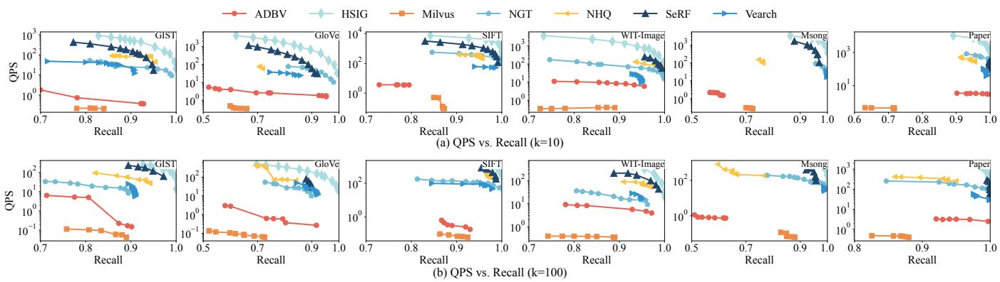  
Figure 5: Overall Performance.

connections, it is comparable to SeRF, the state-of-the-art PG-based solution for RF-ANNS. PQ-based methods like ADBV and Milvus are space-efficient but struggle with query accuracy and efficiency compared to PG-based methods. As shown in Figure 5, HSIG consistently outperforms baselines across all datasets regarding the QPS vs. recall trade-off. For example, with $k = 1 0$ and a recall of around 0.9, HSIG achieves a QPS two orders of magnitude higher than ADBV on the GloVe and GIST1M datasets, one order of magnitude higher than NHQ on the SIFT1M dataset, and outperforms SeRF by up to 2.29 times across all datasets. These results highlight HSIG’s effectiveness, benefiting from its unified graph structure and range-aware strategy selection. Additionally, HSIG allows HNSW reconstruction with varying edge degrees using the parameter $m$ , whereas SeRF reconstructs HNSW with a fixed edge degree, limiting its query performance. Finally, HSIG outperforms NGT, Vearch, and NHQ, as they employ the post-filtering strategy and perform poorly on small query ranges.

# 5.3 Effect of Range-aware Search Strategy Selection

We evaluate HSIG’s performance across small, medium, and large query ranges. The methods compared are as follows: (1) HSIGpre uses HSIG with the pre-filtering strategy. (2) PQ-pre performs attribute filtering first, followed by PQ-based vector retrieval. (3) Btree-pre uses a B-tree for attribute filtering, followed by bruteforce vector retrieval. (4) HSIG-post applies HSIG with the postfiltering strategy. (5) HNSW-post builds HNSW over the entire

dataset and applies the post-filtering strategy. (6) HSIG-hybrid employs HSIG for RF-ANNS queries using the hybrid filtering strategy. (7) SeRF is a state-of-the-art RF-ANNS solution that uses a hybrid filtering. (8) HSIG-range-aware uses HSIG with rangeaware search strategy selection. (9) Dedicated builds specialized indexes for each strategy, with Btree-pre, HNSW-post, and SeRF used for pre-, post-, and hybrid filtering, respectively, and selects the best strategy based on query range.

The results are shown in Figure 6. Some methods have missing QPS values for specific query ranges, indicating they could not meet the recall threshold. HSIG-pre, HSIG-hybrid, and HSIG-post outperform competitors in small, medium, and large ranges, respectively. For example, HSIG-pre outperforms Btree-pre by $2 0 . 3 \%$ at a recall of 0.9 in small query ranges. HSIG-hybrid exceeds SeRF by 1.21 times in medium query ranges at a recall of 0.95. HSIG-post surpasses HNSW-post by $3 7 . 5 \%$ at a recall of 0.99 in large query ranges. Additionally, HSIG-pre outperforms HSIG-hybrid and HSIG-post in small ranges, HSIG-post surpasses HSIG-hybrid and HSIG-pre in large ranges, and HSIG-hybrid performs best among the three strategies in medium ranges, validating our range-aware heuristics. Finally, HSIG-range-aware consistently outperforms Dedicated by up to 1.1 times across all query ranges, thanks to its unified PGbased index and range-aware strategy selection.

# 5.4 Validation of Inclusivity of HSIG

We evaluate HSIG’s inclusivity using the inclusiveness metric. Inclusiveness is computed as #common-edge $\frac { \# \mathrm { c o m m o n – e d g e } } { \# \mathrm { h n s w - e d g e } } \times 1 0 0 \%$ , where #common-edge

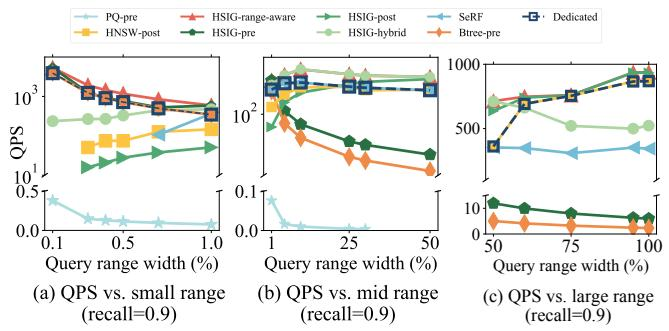

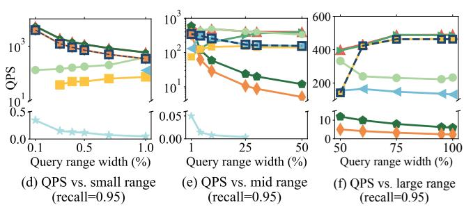

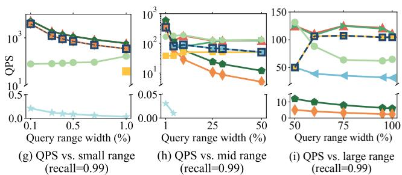  
Figure 6: Impact of different query ranges on GloVe dataset.

is the number of identical edge connections in both HSIG and the multi-segment HNSW (where multi-segment HNSW refers to the HNSW constructed for any combination of segments), and #hnsw-edge is the total number of edges in the multi-segment HNSW. According to Definition 2, the multi-segment HNSW should be a sub-graph of HSIG to satisfy inclusivity. Thus, $1 0 0 \%$ inclusiveness indicates that HSIG strictly satisfies inclusivity. In this experiment, we partition the dataset evenly into eight segments and construct HNSWs for 1, 2, 4, 6, and 8 contiguous segments. Figure 7 shows that the average inclusiveness of HSIG exceeds $8 0 \%$ , demonstrating that HSIG achieves significant inclusiveness and approximately satisfies inclusivity.

To further evaluate the impact of inclusivity on query performance, we compare HSIG at varying levels of inclusiveness $3 0 \%$ , $4 0 \%$ , $6 0 \%$ , and $8 0 \%$ ) against two competitive methods that guarantee exact inclusivity. The first method, Optimal HNSW, builds an HNSW in real time for objects within each query range. The second method, MS-HNSW, pre-builds HNSWs for each segment. During the search, MS-HNSW identifies the segments intersecting with the query range, retrieves vectors from the corresponding HNSWs, and combines the intermediate results to obtain the final

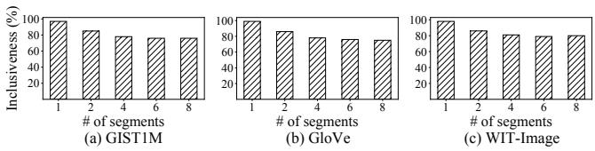  
Figure 7: Inclusiveness of HSIG.

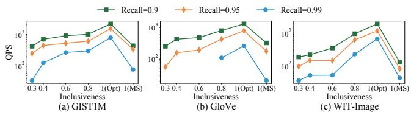  
Figure 8: Impact of Inclusivity.

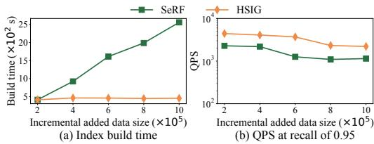  
Figure 9: Performance of incremental insertion on SIFT1M.

results. The results are shown in Figure 8. While Optimal HNSW offers the best performance, building indexes in real time for every query is time-consuming and impractical. As HSIG’s inclusiveness increases, its query performance improves, approaching that of Optimal HNSW. Additionally, HSIG consistently outperforms MS-HNSW, which requires more distance computations. These results demonstrate the effectiveness of HSIG’s inclusivity, showing that higher inclusiveness leads to better query performance.

# 5.5 Validation of Incremental Insertion

In this section, we evaluate HSIG’s incremental insertion capability. We first build HSIG with 200,000 objects from the SIFT1M dataset, followed by four rounds of incremental insertion, each adding 200,000 objects. We compare the index build time and query performance against the state-of-the-art method SeRF. As shown in Figure 9, HSIG’s build time remains stable with each insertion since the number of inserted objects is consistent, whereas SeRF’s build time increases linearly due to its lack of incremental update support. Moreover, HSIG outperforms SeRF in query efficiency at a recall of 0.95. These results highlight HSIG’s effectiveness in supporting incremental insertions, showing that it is suitable for applications with continuously evolving data.

# 5.6 Validation of Runtime Neighbor Selection

In this section, we compare two strategies for runtime neighbor selection in hybrid filtering, as described in Section 4.2. The first strategy, Hybrid-S1, computes the distance to neighbors in all $S ^ { \prime }$ segments (assuming there are $S ^ { \prime }$ segments intersecting with the

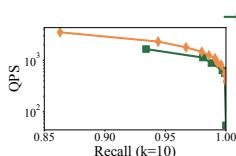  
(a) Msong

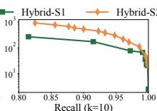  
(b) GIST1M

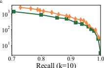  
(c) GloVe

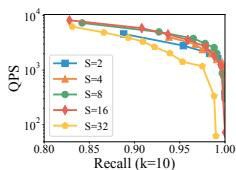  
Figure 10: Impact of the runtime neighbor selection method.   
(a) Varying S

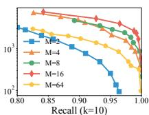  
(b) Varying M

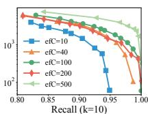  
(c) Varying efCons   
Figure 11: Performance of index parameters on SIFT1M.

query range) and then selects the top- $m$ neighbors by sorting them based on their distances. The second strategy, Hybrid-S2, selects the top- $\left( \lceil m / S ^ { \prime } \rceil \right)$ neighbors from each segment. As shown in Figure 10, Hybrid-S2 outperforms Hybrid-S1 in query efficiency. This is because Hybrid-S2 selects the top- $\left( \lceil m / S ^ { \prime } \rceil \right)$ neighbors from the pre-ordered neighbor lists without additional distance calculations, as neighbors of the object ?? in each segment are already sorted by their distance to ?? upon acquisition via ANNSearch. In contrast, Hybrid-S1 requires calculating distances for all neighbors across $S ^ { \prime }$ segments, increasing query time. Therefore, we adopt Hybrid-S2 as the default runtime neighbor selection method.

# 5.7 Parameter Study

Impact of Index Construction Parameters. We analyze the sensitivity of three parameters in HSIG construction: $S , M$ , and ?? ?? ????????. Figures 11 and 12 show how parameters affect query performance and index build times, respectively. Figure 11a shows the impact of varying ?? on query performance, with a performance increase from 2 to 8, followed by a decline as ?? grows further due to increased neighbor visits. Figure 11b and Figure 11c illustrate the effects of varying ?? and ?? ?? ???????? on query performance. Lower $M$ degrades graph quality, while higher $M$ increases the number of objects traversed during the search. Similarly, lower ?? ?? ???????? leads to insufficient candidates, whereas higher ?? ?? ???????? includes irrelevant candidates, both hindering query performance. Therefore, setting these parameters based on the dataset and workload is crucial for balancing query efficiency and accuracy. As shown in Figure 12, index build time rises with higher ??, ??, and ?? ?? ???????? due to increased distance computations. Based on a comprehensive evaluation of query performance and index construction time, we select $S = 8$ $M = 1 6$ , and $e f C o n s = 5 0 0$ as default settings.

Impact of Search Parameters. Figure 13 shows the impact of varying the parameters $e f$ and $m$ on hybrid filtering in HSIG. Here, ?? ?? is typically set to a value greater than ??. Figure 13a and Figure 13c show that with $m = 1 6$ , as $e f$ increases, recall gradually improves while QPS decreases. This occurs because a larger ?? ??

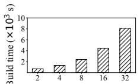  
(a) Varying S

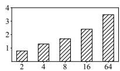  
(b) Varying M

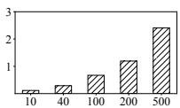  
(c) Varying efCons

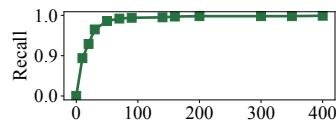  
Figure 12: Index build time on different index parameters.   
(a) Recall (Varying ef, $\mathrm { \ m } { = } 1 6$ )

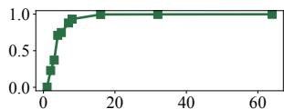  
m (b) Recall (Varying m, ef=100)

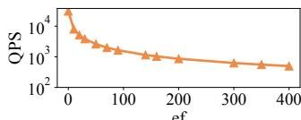  
(c) QPS (Varying ef, $\mathrm { \ m } { = } 1 6$

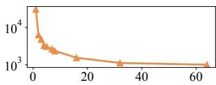  
(d) QPS (Varying m, ef=100)   
Figure 13: Performance on different search parameters.

requires visiting more objects to gather sufficient candidates, enhancing accuracy but reducing efficiency. Figure 13b and Figure 13d show that with $e f = 1 0 0$ , increasing $m$ leads to a gradual improvement in recall but a decrease in query efficiency. This is because a larger $m$ results in visiting more neighbors of each object during the search, improving accuracy but at the cost of efficiency.

Impact of $k$ values. Figure 14 shows the impact of different $k$ values on query performance of HSIG. HSIG maintains strong efficiency and accuracy across various $k$ values. However, as $k$ increases from 10 to 100, performance gradually declines due to the increased number of candidates that need to be filtered during the search.

# 5.8 Scalability

We evaluate the scalability of HSIG using datasets ranging from 10 to 100 million objects. We fix the index parameters to $S = 8$ , $M = 1 6$ , and $e f C o n s = 5 0 0$ , and maintain a query range width of $2 5 \%$ . As shown in Figure 15, both the index size and build time increase almost linearly with the dataset size. Figure 15c plots the hybrid filtering latency versus data size, indicating a logarithmic search complexity. Notably, the recall consistently reaches 0.99 across all dataset sizes. These results demonstrate that HSIG achieves strong scalability in both index construction and query processing.

# 5.9 Discussions

Range-aware strategy selection. As mentioned in Section 4.2, our range-aware strategy selection method is based on historical data statistics, not query patterns. This approach may face challenges if the data distribution of the base dataset changes significantly over time. To address this issue, we propose an adaptive method that can detect changes in data distribution. If the change exceeds the user-defined threshold, the method resamples objects from the updated base dataset to recalibrate $\tau _ { A }$ and $\tau _ { B }$ , thereby adjusting the range-aware search strategy selection.

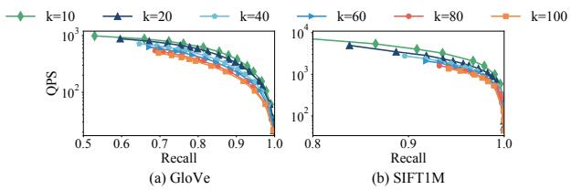  
Figure 14: Performance of different $k$ values.

RF-ANNS with Multiple Attributes. Existing PG-based indexes struggle to support RF-ANNS queries with multiple attributes, as incorporating multiple attributes into a graph is challenging. However, with two enhancements, HSIG can be extended to handle such queries. While we use the case with two attributes in this discussion, the method can be adapted for more attributes. (1) Multiple singleattribute indexes: Build a separate HSIG for each attribute. For a conjunctive query with a query vector $q$ , retrieve objects that satisfy $r _ { 1 } ( A _ { 1 } )$ AND $r _ { 2 } ( A _ { 2 } )$ , where $r _ { 1 } ( A _ { 1 } )$ and $r _ { 2 } ( A _ { 2 } )$ are the attribute ranges. We aim to return the top- $k$ ANN of $q$ among objects satisfying both ranges. Specifically, we modify Line 15 of Algorithm 7 to "if ?? satisfies $r _ { 1 } ( A _ { 1 } )$ AND $r _ { 2 } ( A _ { 2 } )$ , then push ?? to ??????". For disjunctive queries $( r _ { 1 } ( A _ { 1 } ) \ \mathrm { O R } \ r _ { 2 } ( A _ { 2 } ) )$ $r _ { 2 } ( A _ { 2 } ) )$ , we use separate indexes for $A _ { 1 }$ and $A _ { 2 }$ and merge the results. (2) Single index for multiple attributes: Create a composite attribute $( A _ { 1 } , A _ { 2 } )$ and apply the z-order method [28] to map them into a one-dimensional attribute, enabling the construction of a single HSIG to handle RF-ANNS queries with multiple attributes. We plan to explore a dedicated algorithm for RF-ANNS queries with multiple attributes in future work.

# 6 RELATED WORK

# 6.1 ANNS

The primary approaches for A??NNS can be categorized tree-based methods [2, 26], hash-based methods [13, 37, 50], quantizationbased methods [1, 9, 22, 24], and PG-based methods [6, 7, 23, 34, 35, 41, 49]. Tree-structured indexes like the KD-tree [4], R-tree [11], VP-tree [8], and KMeans-tree [48] suffer from the "curse of dimensionality" [14], making them ineffective in high-dimensional spaces. Hash-based methods utilize hash functions to map vectors into hash buckets. However, as the binary hash code length increases, the number of buckets grows exponentially, leading to many empty buckets, which reduces the search accuracy. Quantization-based methods reduce storage and computational costs but involve lossy compression, which produces a "ceiling" phenomenon on the search accuracy [21]. PG-based methods show significant performance advantages and have attracted substantial attention. However, while effective for vector retrieval, these methods fail to handle attribute filtering effectively, limiting their applicability in scenarios requiring integrated vector retrieval and attribute filtering.

# 6.2 Filtered ANNS

Most hybrid A??NNS queries separate the process into vector retrieval and attribute filtering, which are combined to produce final results. MA-NSW [45] explores ANNS with attribute constraints by constructing indexes for each attribute combination. Vearch

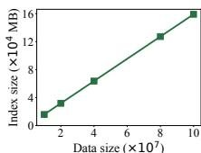  
(a) Index size

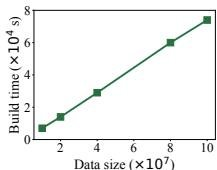  
(b) Index build time

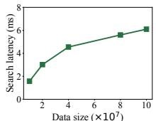  
(c) Latency at recall of 0.99   
Figure 15: Impact of varying data size on SIFT dataset.

[20] and NGT [46] apply post-filtering, which first retrieves candidates through vector search and then filters candidates based on the attributes. This strategy is extendable to some vector libraries, such as Faiss [18] and SPTAG [5]. However, they perform worse when the selectivity of the query range is low, limiting the query efficiency and accuracy. ADBV [43] uses a B-tree for attributes and a PQ index for vectors, optimizing query plans with a cost model. Milvus [39] partitions datasets by attributes and adopts the query strategies of ADBV. However, they focus on query optimization and partitioning techniques without enhancing the index structure. Filtered-DiskANN [10] develops a graph supporting attribute matching and vector similarity searches. However, it focuses on attribute matching, leaving a gap for A??NN with range constraints. NHQ [40] and HQANN [44] introduce a fused distance metric that combines attributes and vectors, enabling simultaneous attribute filtering and vector retrieval within a single graph index. However, they lack a solid theoretical foundation due to the irrelevance of attributes and vectors. ARKGraph [51] builds PGs for all possible attribute range combinations and compresses the indexes. However, it requires decompression during querying, reducing query efficiency. SeRF [52] addresses range-filtering A??NNS by designing a segment graph that compresses multiple indexes for half-bounded range queries and extends it to support general range queries. However, SeRF does not support online updates of new data.

# 7 CONCLUSION

This paper addresses RF-ANNS queries over high-dimensional vectors associated with attribute values. Existing methods, including pre-, post-, and hybrid filtering strategies, which apply attribute filtering before, after, or during the ANNS process, suffer performance degradation when query ranges shift. We propose a novel framework called UNIFY, which constructs a unified PG-based index that seamlessly supports all three strategies. Within UNIFY, we introduce SIG, enabling efficient RF-ANNS by reconstructing and searching a PG from relevant segments. Additionally, we present HSIG, a variant of SIG that incorporates a hierarchical structure inspired by HNSW, achieving logarithmic time complexity for RF-ANNS. Experimental results demonstrate that UNIFY outperforms state-of-the-art methods across varying query ranges.

# Acknowledgments

Bin Yao was supported by the Oceanic Interdisciplinary Program of Shanghai Jiao Tong University (SL2023ZD102) and Alibaba Group through Alibaba Innovative Research (AIR) Program. Zhongpu Chen was supported by Sichuan Science and Technology Program (2024NSFSC1460).

# References

[1] Fabien André, Anne-Marie Kermarrec, and Nicolas Le Scouarnec. 2016. Cache locality is not enough: High-performance nearest neighbor search with product quantization fast scan. In VLDB. 288–299.   
[2] Akhil Arora, Sakshi Sinha, Piyush Kumar, and Arnab Bhattacharya. 2018. Hdindex: Pushing the scalability-accuracy boundary for approximate knn search in high-dimensional spaces. In VLDB. 906–919.   
[3] Martin Aumüller, Erik Bernhardsson, and Alexander Faithfull. 2020. ANN-Benchmarks: A benchmarking tool for approximate nearest neighbor algorithms. Information Systems 87 (2020), 101374.   
[4] Jon Louis Bentley. 1975. Multidimensional binary search trees used for associative searching. Commun. ACM 18 (1975), 509–517.   
[5] Qi Chen, Haidong Wang, Mingqin Li, Gang Ren, Scarlett Li, Jeffery Zhu, Jason Li, Chuanjie Liu, Lintao Zhang, and Jingdong Wang. 2018. SPTAG: A library for fast approximate nearest neighbor search. https://github.com/Microsoft/SPTAG.   
[6] Cong Fu, Changxu Wang, and Deng Cai. 2021. High dimensional similarity search with satellite system graph: Efficiency, scalability, and unindexed query compatibility. TPAMI 44, 8 (2021), 4139–4150.   
[7] Cong Fu, Chao Xiang, Changxu Wang, and Deng Cai. 2019. Fast approximate nearest neighbor search with the navigating spreading-out graph. In VLDB. 461–474.   
[8] Keinosuke Fukunaga and Patrenahalli M. Narendra. 1975. A branch and bound algorithm for computing k-nearest neighbors. IEEE transactions on computers 100, 7 (1975), 750–753.   
[9] Tiezheng Ge, Kaiming He, Qifa Ke, and Jian Sun. 2013. Optimized product quantization for approximate nearest neighbor search. In CVPR. 2946–2953.   
[10] Siddharth Gollapudi, Neel Karia, Varun Sivashankar, Ravishankar Krishnaswamy, Nikit Begwani, Swapnil Raz, Yiyong Lin, Yin Zhang, Neelam Mahapatro, Premkumar Srinivasan, et al. 2023. Filtered-diskann: Graph algorithms for approximate nearest neighbor search with filters. In Proceedings of the ACM Web Conference 2023. 3406–3416.   
[11] Antonin Guttman. 1984. R-trees: A dynamic index structure for spatial searching. In SIGMOD. 47–57.   
[12] Hazar Harmouch and Felix Naumann. 2017. Cardinality estimation: An experimental survey. In VLDB. 499–512.   
[13] Qiang Huang, Jianlin Feng, Yikai Zhang, Qiong Fang, and Wilfred Ng. 2015. Query-aware locality-sensitive hashing for approximate nearest neighbor search. In VLDB. 1–12.   
[14] Piotr Indyk and Rajeev Motwani. 1998. Approximate nearest neighbors: towards removing the curse of dimensionality. In Proceedings of the thirtieth annual ACM symposium on Theory of computing. 604–613.   
[15] Suhas Jayaram Subramanya, Fnu Devvrit, Harsha Vardhan Simhadri, Ravishankar Krishnawamy, and Rohan Kadekodi. 2019. Diskann: Fast accurate billion-point nearest neighbor search on a single node. In NeurIPS, Vol. 32.   
[16] Herve Jegou, Matthijs Douze, and Cordelia Schmid. 2010. Product quantization for nearest neighbor search. IEEE transactions on pattern analysis and machine intelligence 33, 1 (2010), 117–128.   
[17] Jingdong. 2020. A distributed system for embedding-based retrieval. https: //github.com/vearch/vearch.   
[18] Jeff Johnson, Matthijs Douze, and Hervé Jégou. 2019. Billion-scale similarity search with GPUs. IEEE Transactions on Big Data 7, 3 (2019), 535–547.   
[19] Patrick Lewis, Ethan Perez, Aleksandra Piktus, Fabio Petroni, Vladimir Karpukhin, Naman Goyal, Heinrich Küttler, Mike Lewis, Wen-tau Yih, Tim Rocktäschel, et al. 2020. Retrieval-augmented generation for knowledge-intensive nlp tasks. Advances in Neural Information Processing Systems 33 (2020), 9459–9474.   
[20] Jie Li, Haifeng Liu, Chuanghua Gui, Jianyu Chen, Zhenyuan Ni, Ning Wang, and Yuan Chen. 2018. The design and implementation of a real time visual search system on JD E-commerce platform. In Proceedings of the 19th International Middleware Conference Industry. 9–16.   
[21] Wen Li, Ying Zhang, Yifang Sun, Wei Wang, Mingjie Li, Wenjie Zhang, and Xuemin Lin. 2019. Approximate nearest neighbor search on high dimensional data—experiments, analyses, and improvement. TKDE 32, 8 (2019), 1475–1488.   
[22] Yingfan Liu, Hong Cheng, and Jiangtao Cui. 2017. PQBF: i/o-efficient approximate nearest neighbor search by product quantization. In CIKM. 667–676.   
[23] Yu A Malkov and Dmitry A Yashunin. 2018. Efficient and robust approximate nearest neighbor search using hierarchical navigable small world graphs. TPAMI 42, 4 (2018), 824–836.   
[24] Yusuke Matsui, Toshihiko Yamasaki, and Kiyoharu Aizawa. 2015. Pqtable: Fast exact asymmetric distance neighbor search for product quantization using hash tables. In ICCV. 1940–1948.

[25] Yujie Mo, Liang Peng, Jie Xu, Xiaoshuang Shi, and Xiaofeng Zhu. 2022. Simple unsupervised graph representation learning. In AAAI. 7797–7805.   
[26] Marius Muja and David G Lowe. 2014. Scalable nearest neighbor algorithms for high dimensional data. TPAMI 36, 11 (2014), 2227–2240.   
[27] B John Oommen and Luis G Rueda. 2002. The efficiency of histogram-like techniques for database query optimization. Comput. J. 45, 5 (2002), 494–510.   
[28] Jack A Orenstein and Tim H Merrett. 1984. A class of data structures for associative searching. In Proceedings of the 3rd ACM SIGACT-SIGMOD Symposium on Principles of Database Systems. 181–190.   
[29] Rodrigo Paredes, Edgar Chávez, Karina Figueroa, and Gonzalo Navarro. 2006. Practical construction of k-nearest neighbor graphs in metric spaces. In International Workshop on Experimental and Efficient Algorithms. 85–97.   
[30] Gregory Piatetsky-Shapiro and Charles Connell. 1984. Accurate estimation of the number of tuples satisfying a condition. In SIGMOD. 256–276.   
[31] Pinecone. 2021. Pinecone.io. https://www.pinecone.io/.   
[32] William Pugh. 1990. Skip lists: a probabilistic alternative to balanced trees. Commun. ACM 33, 6 (1990), 668–676.   
[33] Jianbin Qin, Wei Wang, Chuan Xiao, and Ying Zhang. 2020. Similarity query processing for high-dimensional data. In VLDB. 3437–3440.   
[34] Jie Ren, Minjia Zhang, and Dong Li. 2020. Hm-ann: Efficient billion-point nearest neighbor search on heterogeneous memory. In NeurIPS. 10672–10684.   
[35] Yitong Song, Kai Wang, Bin Yao, Zhida Chen, Jiong Xie, and Feifei Li. 2024. Efficient Reverse $k$ Approximate Nearest Neighbor Search Over High-Dimensional Vectors. In ICDE. 4262–4274.   
[36] Ján Suchal and Pavol Návrat. 2010. Full text search engine as scalable k-nearest neighbor recommendation system. In IFIP International Conference on Artificial Intelligence. 165–173.   
[37] Yao Tian, Xi Zhao, and Xiaofang Zhou. 2023. DB-LSH 2.0: Locality-Sensitive Hashing With Query-Based Dynamic Bucketing. TKDE 36, 3 (2023), 1000–1015.   
[38] George Valkanas, Theodoros Lappas, and Dimitrios Gunopulos. 2017. Mining competitors from large unstructured datasets. TKDE 29, 9 (2017), 1971–1984.   
[39] Jianguo Wang, Xiaomeng Yi, Rentong Guo, Hai Jin, Peng Xu, Shengjun Li, Xiangyu Wang, Xiangzhou Guo, Chengming Li, Xiaohai Xu, et al. 2021. Milvus: A purpose-built vector data management system. In SIGMOD. 2614–2627.   
[40] Mengzhao Wang, Lingwei Lv, Xiaoliang Xu, Yuxiang Wang, Qiang Yue, and Jiongkang Ni. 2023. An efficient and robust framework for approximate nearest neighbor search with attribute constraint. In NeurIPS, Vol. 36. 15738–15751.   
[41] Mengzhao Wang, Xiaoliang Xu, Qiang Yue, and Yuxiang Wang. 2021. A comprehensive survey and experimental comparison of graph-based approximate nearest neighbor search. In VLDB. 1964–1978.   
[42] Weaviate. 2019. Weaviate.io. https://weaviate.io/developers/weaviate/concepts/ vector-index.   
[43] Chuangxian Wei, Bin Wu, Sheng Wang, Renjie Lou, Chaoqun Zhan, Feifei Li, and Yuanzhe Cai. 2020. AnalyticDB-V: a hybrid analytical engine towards query fusion for structured and unstructured data. Proceedings of the VLDB Endowment 13, 12 (2020), 3152–3165.   
[44] Wei Wu, Junlin He, Yu Qiao, Guoheng Fu, Li Liu, and Jin Yu. 2022. HQANN: Efficient and robust similarity search for hybrid queries with structured and unstructured constraints. In CIKM. 4580–4584.   
[45] Xiaoliang Xu, Chang Li, Yuxiang Wang, and Yixing Xia. 2020. Multiattribute approximate nearest neighbor search based on navigable small world graph. Concurrency and Computation: Practice and Experience 32, 24 (2020), e5970.   
[46] Yahoo. 2016. Nearest neighbor search with neighborhood graph and tree for highdimensional data. https://github.com/yahoojapan/NGT.   
[47] Wen Yang, Tao Li, Gai Fang, and Hong Wei. 2020. Pase: Postgresql ultra-highdimensional approximate nearest neighbor search extension. In SIGMOD. 2241– 2253.   
[48] Peter N Yianilos. 1993. Data structures and algorithms for nearest neighbor search in general metric spaces. In SODA. 311–321.   
[49] Pengcheng Zhang, Bin Yao, Chao Gao, Bin Wu, Xiao He, Feifei Li, Yuanfei Lu, Chaoqun Zhan, and Feilong Tang. 2023. Learning-based query optimization for multi-probe approximate nearest neighbor search. The VLDB Journal 32, 3 (2023), 623–645.   
[50] Bolong Zheng, Zhao Xi, Lianggui Weng, Nguyen Quoc Viet Hung, Hang Liu, and Christian S Jensen. 2020. PM-LSH: A fast and accurate LSH framework for high-dimensional approximate NN search. In VLDB. 643–655.   
[51] Chaoji Zuo and Dong Deng. 2023. ARKGraph: All-Range Approximate K-Nearest-Neighbor Graph. In VLDB. 2645–2658.   
[52] Chaoji Zuo, Miao Qiao, Wenchao Zhou, Feifei Li, and Dong Deng. 2024. SeRF: Segment Graph for Range-Filtering Approximate Nearest Neighbor Search. In SIGMOD. 1–26.