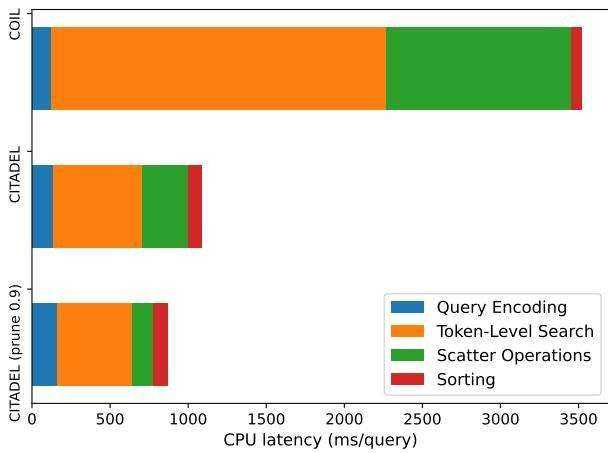

Yang Bai, Xiaoguang Li, Gang Wang, Chaoliang Zhang, Lifeng Shang, Jun Xu, Zhaowei Wang, Fangshan Wang, and Qun Liu. 2020. Sparterm: Learning term-based sparse representation for fast text retrieval. ArXiv, abs/2010.00768.

Danqi Chen, Adam Fisch, Jason Weston, and Antoine Bordes. 2017. Reading Wikipedia to answer opendomain questions. In Proceedings of the 55th Annual Meeting of the Association for Computational Linguistics (Volume 1: Long Papers), pages 1870– 1879, Vancouver, Canada. Association for Computational Linguistics.

Xilun Chen, Kushal Lakhotia, Barlas Oguz, Anchit ˘ Gupta, Patrick Lewis, Stan Peshterliev, Yashar

Mehdad, Sonal Gupta, and Wen-tau Yih. 2022. Salient phrase aware dense retrieval: Can a dense retriever imitate a sparse one? In Proceedings of the 2022 Conference on Empirical Methods in Natural Language Processing.

Nick Craswell, Bhaskar Mitra, Emine Yilmaz, Daniel Fernando Campos, and Ellen M. Voorhees. 2020. Overview of the trec 2020 deep learning track. ArXiv, abs/2003.07820.

Jacob Devlin, Ming-Wei Chang, Kenton Lee, and Kristina Toutanova. 2019. BERT: Pre-training of deep bidirectional transformers for language understanding. In Proceedings of the 2019 Conference of the North American Chapter of the Association for Computational Linguistics: Human Language Technologies, Volume 1 (Long and Short Papers), pages 4171–4186, Minneapolis, Minnesota. Association for Computational Linguistics.

William Fedus, Barret Zoph, and Noam Shazeer. 2022. Switch transformers: Scaling to trillion parameter models with simple and efficient sparsity. Journal of Machine Learning Research, 23(120):1–39.

Thibault Formal, C. Lassance, Benjamin Piwowarski, and Stéphane Clinchant. 2021a. Splade v2: Sparse lexical and expansion model for information retrieval. ArXiv, abs/2109.10086.

Thibault Formal, Benjamin Piwowarski, and Stéphane Clinchant. 2021b. Splade: Sparse lexical and expansion model for first stage ranking. In Proceedings of the 44th International ACM SIGIR Conference on Research and Development in Information Retrieval. Association for Computing Machinery.

Luyu Gao and Jamie Callan. 2021. Condenser: a pretraining architecture for dense retrieval. In Proceedings of the 2021 Conference on Empirical Methods in Natural Language Processing, pages 981–993, Online and Punta Cana, Dominican Republic. Association for Computational Linguistics.

Luyu Gao and Jamie Callan. 2022. Unsupervised corpus aware language model pre-training for dense passage retrieval. In Proceedings of the 60th Annual Meeting of the Association for Computational Linguistics (Volume 1: Long Papers), pages 2843–2853, Dublin, Ireland. Association for Computational Linguistics.

Luyu Gao, Zhuyun Dai, and Jamie Callan. 2021a. COIL: Revisit exact lexical match in information retrieval with contextualized inverted list. In Proceedings of the 2021 Conference of the North American Chapter of the Association for Computational Linguistics: Human Language Technologies, pages 3030–3042, Online. Association for Computational Linguistics.

Tianyu Gao, Xingcheng Yao, and Danqi Chen. 2021b. SimCSE: Simple contrastive learning of sentence embeddings. In Proceedings of the 2021 Conference on Empirical Methods in Natural Language Processing, pages 6894–6910, Online and Punta Cana, Dominican Republic. Association for Computational Linguistics.

Ruiqi Guo, Philip Sun, Erik Lindgren, Quan Geng, David Simcha, Felix Chern, and Sanjiv Kumar. 2020. Accelerating large-scale inference with anisotropic vector quantization. In Proceedings of the 37th International Conference on Machine Learning, ICML 2020, 13-18 July 2020, Virtual Event, volume 119 of Proceedings of Machine Learning Research, pages 3887–3896. PMLR.

Geoffrey E. Hinton, Oriol Vinyals, and Jeffrey Dean. 2015. Distilling the knowledge in a neural network. ArXiv, abs/1503.02531.

Sebastian Hofstätter, Omar Khattab, Sophia Althammer, Mete Sertkan, and Allan Hanbury. 2022. Introducing neural bag of whole-words with colberter: Contextualized late interactions using enhanced reduction. In Proceedings of the 31st ACM International Conference on Information & Knowledge Management, page 737–747. Association for Computing Machinery.

Sebastian Hofstätter, Sheng-Chieh Lin, Jheng-Hong Yang, Jimmy Lin, and Allan Hanbury. 2021. Efficiently teaching an effective dense retriever with balanced topic aware sampling. In Proceedings of the 44th International ACM SIGIR Conference on Research and Development in Information Retrieval, page 113–122. Association for Computing Machinery.

Gautier Izacard, Mathilde Caron, Lucas Hosseini, Sebastian Riedel, Piotr Bojanowski, Armand Joulin, and Edouard Grave. 2022. Unsupervised dense information retrieval with contrastive learning. Transactions on Machine Learning Research.

Hervé Jégou, Matthijs Douze, and Cordelia Schmid. 2011. Product quantization for nearest neighbor search. IEEE Trans. Pattern Anal. Mach. Intell., 33(1):117–128.

J. Johnson, M. Douze, and H. Jegou. 2021. Billionscale similarity search with gpus. IEEE Transactions on Big Data, 7(03):535–547.

Vladimir Karpukhin, Barlas Oguz, Sewon Min, Patrick Lewis, Ledell Wu, Sergey Edunov, Danqi Chen, and Wen-tau Yih. 2020. Dense passage retrieval for open-domain question answering. In Proceedings of the 2020 Conference on Empirical Methods in Natural Language Processing (EMNLP), pages 6769– 6781, Online. Association for Computational Linguistics.

Omar Khattab and Matei Zaharia. 2020. Colbert: Efficient and effective passage search via contextualized late interaction over bert. In Proceedings of the 44th International ACM SIGIR Conference on Research and Development in Information Retrieval, page 39–48. Association for Computing Machinery.

Kenton Lee, Ming-Wei Chang, and Kristina Toutanova. 2019. Latent retrieval for weakly supervised open domain question answering. In Proceedings of the 57th Annual Meeting of the Association for Computational Linguistics, pages 6086–6096, Florence, Italy. Association for Computational Linguistics.

Jimmy Lin, Xueguang Ma, Sheng-Chieh Lin, Jheng-Hong Yang, Ronak Pradeep, and Rodrigo Nogueira. 2021a. Pyserini: A python toolkit for reproducible information retrieval research with sparse and dense representations. In Proceedings of the 44th International ACM SIGIR Conference on Research and Development in Information Retrieval, page 2356–2362. Association for Computing Machinery.

Jimmy J. Lin and Xueguang Ma. 2021. A few brief notes on deepimpact, coil, and a conceptual framework for information retrieval techniques. ArXiv, abs/2106.14807.

Sheng-Chieh Lin and Jimmy Lin. 2022. A dense representation framework for lexical and semantic matching. ArXiv, abs/2206.09912.

Sheng-Chieh Lin, Jheng-Hong Yang, and Jimmy Lin. 2021b. In-batch negatives for knowledge distillation with tightly-coupled teachers for dense retrieval. In Proceedings of the 6th Workshop on Representation Learning for NLP (RepL4NLP-2021), pages 163– 173, Online. Association for Computational Linguistics.

Yinhan Liu, Myle Ott, Naman Goyal, Jingfei Du, Mandar Joshi, Danqi Chen, Omer Levy, Mike Lewis, Luke Zettlemoyer, and Veselin Stoyanov. 2019. Roberta: A robustly optimized bert pretraining approach. ArXiv, abs/1907.11692.

Ilya Loshchilov and Frank Hutter. 2019. Decoupled weight decay regularization. In 7th International Conference on Learning Representations, ICLR 2019. OpenReview.net.

Shuqi Lu, Di He, Chenyan Xiong, Guolin Ke, Waleed Malik, Zhicheng Dou, Paul Bennett, Tie-Yan Liu, and Arnold Overwijk. 2021. Less is more: Pretrain a strong Siamese encoder for dense text retrieval using a weak decoder. In Proceedings of the 2021 Conference on Empirical Methods in Natural Language Processing, pages 2780–2791, Online and Punta Cana, Dominican Republic. Association for Computational Linguistics.

Yi Luan, Jacob Eisenstein, Kristina Toutanova, and Michael Collins. 2021. Sparse, dense, and attentional representations for text retrieval. Transactions of the Association for Computational Linguistics, 9:329–345.

Joel Mackenzie, Andrew Trotman, and Jimmy Lin. 2021. Wacky weights in learned sparse representations and the revenge of score-at-a-time query evaluation. ArXiv, abs/2110.11540.

Antonio Mallia, Omar Khattab, Torsten Suel, and Nicola Tonellotto. 2021. Learning passage impacts for inverted indexes. In Proceedings of the 44th International ACM SIGIR Conference on Research and Development in Information Retrieval, page 1723–1727. Association for Computing Machinery.

Christopher D. Manning, Prabhakar Raghavan, and Hinrich Schütze. 2008. Introduction to information retrieval. Cambridge University Press.

Basil Mustafa, Carlos Riquelme, Joan Puigcerver, Rodolphe Jenatton, and Neil Houlsby. 2022. Multimodal contrastive learning with limoe: the languageimage mixture of experts. ArXiv, abs/2206.02770.

Tri Nguyen, Mir Rosenberg, Xia Song, Jianfeng Gao, Saurabh Tiwary, Rangan Majumder, and Li Deng. 2016. MS MARCO: A human generated machine reading comprehension dataset. In CoCo@ NIPS.

Natasha Noy, Matthew Burgess, and Dan Brickley. 2019. Google dataset search: Building a search engine for datasets in an open web ecosystem. In 28th Web Conference (WebConf 2019).

Yujie Qian, Jinhyuk Lee, Sai Meher Karthik Duddu, Zhuyun Dai, Siddhartha Brahma, Iftekhar Naim, Tao Lei, and Vincent Zhao. 2022. Multi-vector retrieval as sparse alignment. ArXiv, abs/2211.01267.

Stephen E. Robertson and Hugo Zaragoza. 2009. The probabilistic relevance framework: BM25 and beyond. Foundations and Trends in Information Retrieval, 3(4):333–389.

Gerard Salton and Christopher Buckley. 1988. Termweighting approaches in automatic text retrieval. Information Processing & Management, 24(5):513– 523.

Keshav Santhanam, Omar Khattab, Christopher Potts, and Matei Zaharia. 2022a. Plaid: An efficient engine for late interaction retrieval. ArXiv, abs/2205.09707.

Keshav Santhanam, Omar Khattab, Jon Saad-Falcon, Christopher Potts, and Matei Zaharia. 2022b. Col-BERTv2: Effective and efficient retrieval via lightweight late interaction. In Proceedings of the 2022 Conference of the North American Chapter of the Association for Computational Linguistics: Human Language Technologies, pages 3715–3734, Seattle, United States. Association for Computational Linguistics.

Christopher Sciavolino, Zexuan Zhong, Jinhyuk Lee, and Danqi Chen. 2021. Simple entity-centric questions challenge dense retrievers. In Proceedings of the 2021 Conference on Empirical Methods in Natural Language Processing, pages 6138–6148, Online and Punta Cana, Dominican Republic. Association for Computational Linguistics.

Tao Shen, Xiubo Geng, Chongyang Tao, Can Xu, Kai Zhang, and Daxin Jiang. 2022. Unifier: A unified retriever for large-scale retrieval. ArXiv, abs/2205.11194.

Nandan Thakur, Nils Reimers, Andreas Rücklé, Abhishek Srivastava, and Iryna Gurevych. 2021. BEIR: A heterogeneous benchmark for zero-shot evaluation of information retrieval models. In Thirty-fifth Conference on Neural Information Processing Systems Datasets and Benchmarks Track (Round 2).

Lee Xiong, Chenyan Xiong, Ye Li, Kwok-Fung Tang, Jialin Liu, Paul N. Bennett, Junaid Ahmed, and Arnold Overwijk. 2021. Approximate nearest neighbor negative contrastive learning for dense text retrieval. In 9th International Conference on Learning Representations, ICLR 2021, Virtual Event, Austria, May 3-7, 2021. OpenReview.net.

Jingtao Zhan, Jiaxin Mao, Yiqun Liu, Jiafeng Guo, Min Zhang, and Shaoping Ma. 2021. Optimizing dense retrieval model training with hard negatives. In Proceedings of the 44th International ACM SIGIR Conference on Research and Development in Information Retrieval, page 1503–1512. Association for Computing Machinery.

Shunyu Zhang, Yaobo Liang, Ming Gong, Daxin Jiang, and Nan Duan. 2022. Multi-view document representation learning for open-domain dense retrieval. In Proceedings of the 60th Annual Meeting of the Association for Computational Linguistics (Volume 1: Long Papers), pages 5990–6000, Dublin, Ireland. Association for Computational Linguistics.

# A Appendix

# A.1 Baselines for Section 4

All the baseline models below are trained and evaluated under the same setting of CITADEL (e.g., datasets, hyperparameters, and hardwares).

Sparse Retrievers. BM25 (Robertson and Zaragoza, 2009) uses the term frequency and inverted document frequency as features to compute the similarity between documents. SPLADE (Formal et al., 2021b,a) leverages pre-trained language model’s MLM layer and ReLU activation to yield sparse term importance.

Dense Retrievers. DPR (Karpukhin et al., 2020) encodes the input text into a single vector. coCondenser (Gao and Callan, 2022) pre-trains DPR in an unsupervised fashion before fine-tuning.

Multi-Vector Retrievers. ColBERT (Khattab and Zaharia, 2020; Santhanam et al., 2022b) encodes each token into dense vectors and performs late interaction between query token vectors and document token vectors. COIL (Gao et al., 2021a) applies an exact match constraint on late interaction to improve efficiency and robustness.

# A.2 Training

For CITADEL, we use bert-base-uncased as the initial checkpoint for fine-tuning. Following COIL, we set the [CLS] vector dimension to 128, token vector dimension to 32, maximal routing keys to 5 for document and 1 for query, $\alpha$ and $\beta$ in Equation (14) are set to be 1e-2 and 1e-5, respectively. We add the dot product of [CLS] vectors in Equation (1) to the final similarity score in Equation (5). All models are trained for 10 epochs with AdamW (Loshchilov and Hutter, 2019) optimizer, a learning rate of 2e-5 with 3000 warm up steps and linear decay. Hard negatives are sampled from top-100 BM25 retrieval results. Each query is paired with 1 positive and 7 hard negatives for faster convergence. We use a batch size of 128 on MS MARCO passages with 32 A100 GPUs.

For a fair comparison with recent state of the art models, we further train CITADEL using crossencoder distillation and hard negative mining. First, we use the trained CITADEL model under the setting in the last paragraph to retrieve top-100 candidates from the corpus for the training queries. We then use the cross-encoder2 to rerank the top-100 candidates and score each query-document pair. Finally, we re-initialize CITADEL with bert-baseuncased using the positives and negatives sample from the top-100 candidates scored by the crossencoder, with a 1:1 ratio for the soft-label and hardlabel loss mixing (Hinton et al., 2015). We also repeat another round of hard negative mining and distillation but it does not seem to improve the performance any further.

  
Figure 8: Latency breakdown of inverted vector retrieval for CITADEL and COIL.

# A.3 Inference and Latency Breakdown

Pipeline. We implemented the retrieval pipeline with PyTorch (GPU) and Numpy (CPU), with a small Cython extension module for scatter operations similar to COIL’s3. As shown in Fig 8, our pipeline could be roughly decomposed into four independent parts: query encoding, token-level retrieval, scatter operations, and sorting. We use the same pipeline for COIL’s retrieval process. For ColBERT’s latency breakdown please refer to Santhanam et al. (2022a). The cost of query encoding comes from the forward pass of the query encoder, which could be independently optimized using quantization or weight pruning for neural networks. Except that, the most expensive operation is the token-level retrieval, which is directly influenced by the token index size. We could see that a more balanced index size distribution as shown in Figure 3 has a much smaller token vector retrieval latency. The scatter operations are used to gather the token vectors from the same passage ids from different token indices, which is also related to the token index size distribution. Finally, we sort the aggregated ranking results and return the candidates.

Hardwares and Latency Measurement. We measure all the retrieval models in Table 1 on a single A100 GPU for GPU search and a single Intel(R) Xeon(R) Platinum 8275CL CPU $@ 3 . 0 0 \mathrm { G H z }$ for CPU search. All indices are stored in fp32 (token vectors) and int64 (corpus ids if necessary) on disk. We use a query batch size of 1 and return the top-1000 candidates by default to simulate streaming queries. We compute the average latency of all queries on MS MARCO passages’ Dev set and then report the minimum average latency across 3 trials following PLAID (Santhanam et al., 2022a). I/O time is excluded from the latency but the time of moving tensors from CPU to GPU during GPU retrieval is included.