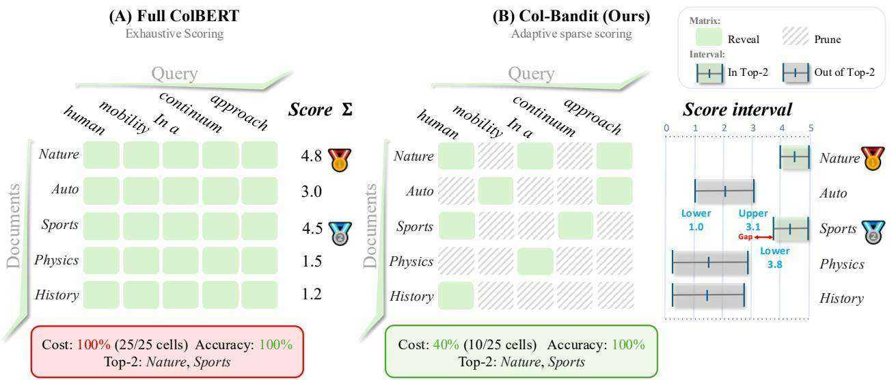
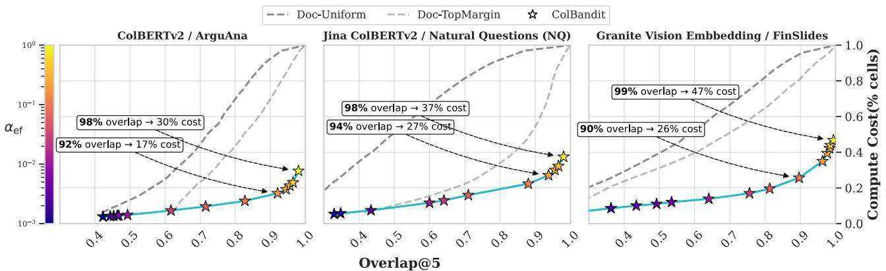
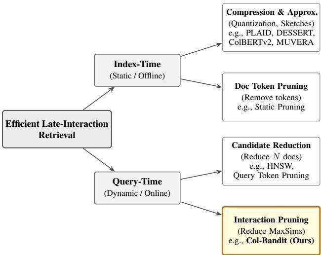
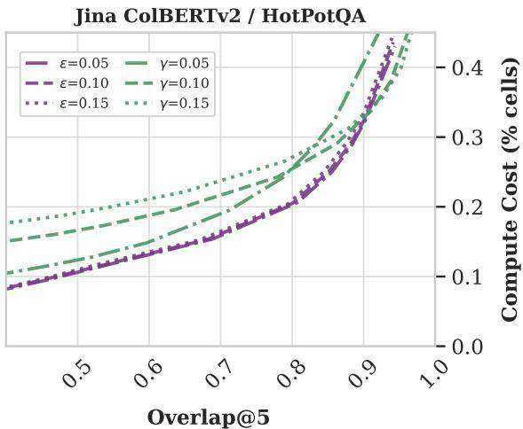
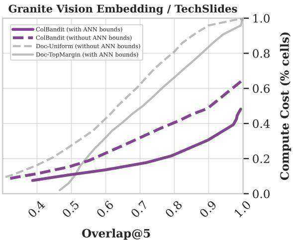
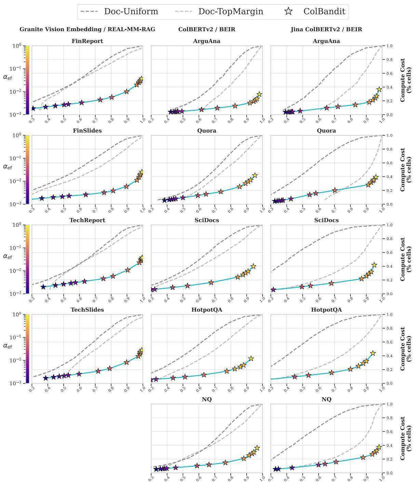
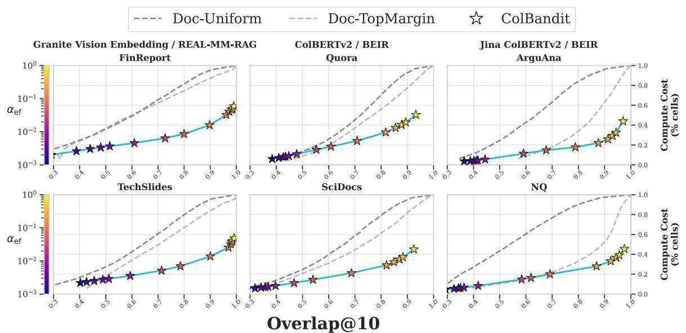
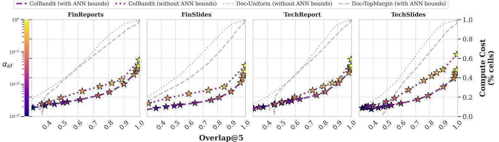

# Col-Bandit: Zero-Shot Query-Time Pruning for Late-Interaction Retrieval

Roi Pony 1 Adi Raz 1 Oshri Naparstek 1 Idan Friedman 1 Udi Barzelay 1

# Abstract

Multi-vector late-interaction retrievers such as ColBERT achieve state-of-the-art retrieval quality, but their query-time cost is dominated by exhaustively computing token-level MaxSim interactions for every candidate document. While approximating late interaction with single-vector representations reduces cost, it often incurs substantial accuracy loss. We introduce Col-Bandit, a query-time pruning algorithm that reduces this computational burden by casting reranking as a finite-population Top- $K$ identification problem. Col-Bandit maintains uncertainty-aware bounds over partially observed document scores and adaptively reveals only the (document, query token) MaxSim entries needed to determine the top results under statistical decision bounds with a tunable relaxation. Unlike coarse-grained approaches that prune entire documents or tokens offline, Col-Bandit sparsifies the interaction matrix on the fly. It operates as a zero-shot, drop-in layer over standard multi-vector systems, requiring no index modifications, offline preprocessing, or model retraining. Experiments on textual (BEIR) and multimodal (REAL-MM-RAG) benchmarks show that Col-Bandit preserves ranking fidelity while reducing MaxSim FLOPs by up to $5 \times$ , indicating that dense late-interaction scoring contains substantial redundancy that can be identified and pruned efficiently at query time.

# 1. Introduction

Multi-vector late-interaction retrievers, such as Col-BERT (Khattab & Zaharia, 2020), have emerged as a powerful alternative to single-vector dense retrieval. By representing each query and document as a set of token embeddings, these models capture fine-grained semantic matches that single-vector representations miss (Wang et al., 2023; Formal et al., 2021). This paradigm has been widely adopted in recent text and multimodal systems (Faysse et al., 2024; Team, 2025a; Warner et al., 2025; Team, 2025b; Xu et al., 2025; Gunther et al.¨ , 2025), becoming a standard foundation for high-accuracy neural retrieval. However, this granularity comes with a cost. Unlike single-vector retrieval, where scoring is a cheap dot product, exact late interaction requires evaluating a grid of token-level operations (MaxSim) for every document. Consequently, this computation often becomes the bottleneck in modern pipelines, motivating methods that reduce these operations without sacrificing ranking fidelity (Santhanam et al., 2022a; Engels et al., 2023).

The ”Hiring” Analogy. To build intuition for the inefficiency of standard late interaction, consider a manager hiring the top- $K$ candidates from $N$ applicants. Each applicant takes $T$ short tests, and their final score is the sum of the $T$ results. Administering all $T$ tests to every applicant guarantees the correct shortlist, but it is wasteful. A resource-efficient manager would allocate tests adaptively, giving a few to everyone and focusing the remaining budget on the candidates whose ranking is unclear, stopping once the top- $K$ is statistically certain. Standard late-interaction retrieval mirrors this wasteful strategy. It sums $T$ tokenwise interactions for every document, even though partial evaluation often suffices to rule documents out (or in).

The Opportunity: Removing Redundancy. In the vectorset setting, the total score is a sum of independent components. Na¨ıvely, systems evaluate the full sum for every candidate in the pool $\mathcal { D }$ . However, for any specific query, we do not need to know the exact score of a document that is clearly irrelevant, nor do we need perfect precision for a clear winner. We only need enough information to distinguish the true Top- $K$ documents from the rest. This implies that the computational budget should be spent asymmetrically, heavily on the “borderline” cases and sparsely on everything else.

Our Approach: Col-Bandit. We propose viewing this resource allocation problem as progressive matrix completion. We treat the token-level scores as values in a table that can be revealed on-demand. Our objective is to reveal just enough cells to confidently identify the Top- $K$ set, minimizing computation while maintaining a user-defined level of statistical reliability (Figure 1).

To this end, we introduce Col-Bandit, a purely query-time algorithm that operates directly on vanilla ColBERT. Unlike prior acceleration methods that require quantization or distilling document representations, Col-Bandit works on top of standard indices and model weights, requiring no index-time changes and no retraining. We formulate the task as a finite-population Top- $K$ identification problem. By exploiting the fact that document token sequences are finite, we utilize Serfling-type concentration inequalities (Bardenet & Maillard, 2015) to construct tighter confidence intervals than standard bandit approaches. We further introduce a calibration parameter to optimize the trade-off between theoretical certification and practical FLOP reduction.

  
Figure 1. Schematic of Col-Bandit. Given a query (e.g., ”human mobility...”) and a set of candidate documents (e.g., Nature, Auto), the goal is to identify the Top-2 relevant documents. (A) Full ColBERT determines the exact score for every document by summing all interaction cells (MaxSims), requiring $100 \%$ of the compute budget. (B) Col-Bandit approximates these sums using partial cell observations. By adaptively revealing informative cells (green) and skipping others (hatched), it maintains confidence intervals for the total score. The algorithm terminates as soon as a positive separation gap emerges: the Lower Bound of the weakest winner (Sports) is strictly higher than the Upper Bound of the strongest loser (Auto). This enables the identification of the correct Top- $K$ ranking while saving $60 \%$ of the query-time computations.

# Contributions.

• Formulation: We cast late-interaction reranking as a finite-population Top- $K$ identification problem using a progressive scoring framework.

• Algorithm: We introduce Col-Bandit, a Lower-Upper Confidence Bound (LUCB) (Kalyanakrishnan et al., 2012) style algorithm that leverages variance-adaptive Serfling bounds for tighter estimation and a tunable relaxation parameter for efficiency.

• Drop-in Acceleration: We demonstrate substantial FLOP reductions on standard benchmarks without requiring any offline index modifications or model retraining.

# 2. Background and Related Work

# 2.1. Preliminaries: Late Interaction Retrieval

ColBERT Late Interaction Scoring. Consider a query $Q$ and a document $d$ from a collection $\mathcal { D }$ of size $N$ . ColBERT represents the query as a set of $T$ token embeddings

$$
Q = \{ \mathbf { q } _ { 1 } , \mathbf { q } _ { 2 } , \dots , \mathbf { q } _ { T } \} \subset \mathbb { R } ^ { M } ,
$$

and each document $d$ as a set of $L _ { d }$ token embeddings

$$
\mathbf { E } ( d ) = \{ \mathbf { e } _ { d , 1 } , \mathbf { e } _ { d , 2 } , \dots , \mathbf { e } _ { d , L _ { d } } \} \subset \mathbb { R } ^ { M } ,
$$

where $M$ is the embedding dimension, $T$ is the query length, and $L _ { d }$ is the length of document $d$ .

The ColBERT scoring function computes relevance through a late interaction mechanism. For each query token $t \in [ T ]$ (where $[ T ] \triangleq \{ 1 , 2 , \dots , T \} )$ , ColBERT identifies the most similar document token using the MaxSim operation:

$$
h ( d , t ) \triangleq \operatorname* { m a x } _ { j \in [ L _ { d } ] } \mathrm { s i m } ( \mathbf { e } _ { d , j } , \mathbf { q } _ { t } ) ,
$$

where $\mathrm { s i m } ( \cdot , \cdot )$ is a similarity function (typically cosine similarity).1 The final query-document score aggregates

  
Figure 2. Cost-Accuracy trade-off for Col-Bandit compared to Random Reveal (Doc-Uniform) and Greedy Top-Margin (Doc-TopMargin) across three retrieval settings (text and multimodal). Each star marker denotes a Col-Bandit operating point obtained by sweeping the relaxation parameter $\alpha _ { \mathrm { e f } }$ . The top-right corner (Overlap $\textcircled { a } 5 = 1 . 0$ , $\mathrm { C o s t } = 1 0 0 \%$ ) corresponds to full exhaustive scoring.

these per-query-token maxima:

$$
S ( d ; Q ) \triangleq \sum _ { t = 1 } ^ { T } h ( d , t ) .
$$

Top- $K$ Retrieval. The retrieval objective is to identify the set of $K$ documents from a search set $\mathcal { D }$ (e.g., a candidate pool produced by an ANN stage) with the highest scores:

$$
{ \mathcal { T } } _ { K } ^ { \star } ( Q ) \triangleq \operatorname * { a r g t o p K } _ { d \in { \mathcal { D } } } S ( d ; Q ) .
$$

Index-Time vs. Query-Time. Retrieval systems separate index-time (offline) processing, which extracts representations and builds index structures, from query-time (online) computation, which encodes the query and ranks candidates. In late-interaction systems, the full similarity computation performed at query time is typically treated as a reranking stage.

Atomic Cost. We define the atomic cost unit of query-time work as computing a single MaxSim value $h ( d , t )$ in Eq. 1. Standard exact reranking evaluates all $N \times T$ such values, which can dominate query-time cost even after candidate retrieval.

# 2.2. Related Work

We categorize related work by when and what they prune (Figure 3). Col-Bandit is the first to prune at the MaxSim operation level during query-time scoring.

Index-Time Compression & Token Pruning. Approaches like PLAID (Santhanam et al., 2022a), Col-BERTv2 (Santhanam et al., 2022b), and MUVERA (Dhulipala et al., 2024) accelerate retrieval via centroid-based compression, quantization, or fixed-dimensional encodings, improving the practicality of late-interaction methods that were initially constrained by considerable storage requirements. Additional system and indexing advances such as WARP (Scheerer et al., 2025) further improve scalability and usability. Similarly, token pruning methods (Lassance et al., 2021; Tonellotto & Macdonald, 2021) permanently discard non-informative tokens to reduce the index size $( N )$ or query length $( T )$ , including near-lossless vector count reduction (Clavie et al. ´ , 2024) and approaches that use a fixed number of representative tokens (MacAvaney et al., 2025). While effective, these methods are fixed at index-time and typically require offline modifications. Col-Bandit is orthogonal to these approaches, it operates purely at query-time on standard indices, dynamically pruning the atomic interaction matrix $H$ during scoring.

Efficient Systems & Bound-Based Pruning. Systemlevel optimizations like DESSERT (Engels et al., 2023) use approximate retrieval to speed up candidate generation. In sparse retrieval, algorithms like WAND (Broder et al., 2003) and BMW (Ding & Suel, 2011) use score upper bounds to skip documents. Col-Bandit bridges these concepts, applying bound-based early stopping to dense late-interaction. Unlike WAND, which prunes inverted list pointers, we prune atomic MaxSim operations $h ( d , t )$ to certify the Top- $K$ set with statistical guarantees.

MaxSim-Level Pruning (Our Approach). To our knowledge, no prior work adaptively prunes interactions within the exact scoring loop. Existing methods reduce the number of candidates $( N )$ or tokens $( T )$ before scoring. Col-Bandit frames the scoring process itself as a finite-population Top-$K$ identification problem, progressively revealing only the subset of MaxSim entries needed to certify the ranking.

Finite-Population Bandits and Top- $k$ Arm Identification. Our method is inspired by fixed-confidence Top- $K$ Arm

  
Figure 3. Taxonomy of efficient late-interaction retrieval. Methods are classified by when they prune (index-time vs. query-time) and what they prune. Col-Bandit is the first to dynamically prune the atomic interaction matrix $H$ during query-time scoring.

Identification in bandits (Kalyanakrishnan et al., 2012; Chen et al., 2014). The multi-armed bandit (MAB) framework has been extensively studied for resource-constrained selection problems, with two main paradigms: fixed-budget and fixed-confidence best arm identification (BAI). We focus on the fixed-confidence setting, where the goal is to identify the best arms with high probability while minimizing sample complexity, in our setting, we treat each document as an arm and connect reranking to Top- $K$ identification. Standard algorithms include UCB (Auer et al., 2002) and UCB-E (Audibert & Bubeck, 2010), which typically assume infinite sampling with replacement. The LUCB (Lower-Upper Confidence Bound) framework (Kalyanakrishnan et al., 2012) provides an efficient strategy for Top- $K$ identification by adaptively sampling arms based on confidence intervals, motivating our interval-driven reveal policy and stopping criterion.

Late-interaction retrieval has a fundamentally different structure: each document has a finite set of $T$ token scores that can be sampled without replacement. Recent work has explored MAB techniques in related contexts, including prompt learning (Shi et al., 2024), LLM evaluation (Zhou et al., 2024), and approximate $\mathbf { k }$ -NN search (Indyk & Wagner, 2019). We adapt the fixed-confidence Top- $K$ framework to exploit this finite-population structure. Specifically, we employ the Bernstein–Serfling inequality (Bardenet & Maillard, 2015) to derive variance-adaptive confidence bounds that shrink deterministically as a document is fully scored, providing tighter guarantees than standard infinitepopulation bandit bounds.

# 3. Problem Formulation

We formalize the efficient retrieval problem as a sequential decision process over a sparsely observed matrix, mapping the task to a fixed-confidence Multi-Armed Bandit (MAB) setting with finite populations.

# 3.1. The MaxSim Matrix and Observation Model

Consider a query $Q$ with $T$ tokens and a search set of $N$ documents, $\mathcal { D } = \{ d _ { 1 } , \ldots , d _ { N } \}$ . We define the implicit MaxSim Matrix, $H \in \mathbb { R } ^ { N \times T }$ , where each entry corresponds to the maximum similarity (1) of a query token with a document’s tokens:

$$
H _ { i , t } \triangleq h ( d _ { i } , t ) = \operatorname* { m a x } _ { j \in [ L _ { d _ { i } } ] } \operatorname { s i m } ( \mathbf { e } _ { d _ { i } , j } , \mathbf { q } _ { t } ) .
$$

The total late-interaction score for document $i$ is the rowsum:

$$
S _ { i } \triangleq \sum _ { t = 1 } ^ { T } H _ { i , t } .
$$

Our objective is to identify the set of indices $\mathcal { T } _ { K } ^ { \star }$ corresponding to the $K$ documents with the highest scores $S _ { i }$ .

At any time step, the algorithm has access to an observed set of entries $\Omega \subseteq [ N ] \times [ T ]$ . For each document $i$ , we denote the set of observed token indices as $\mathcal { O } _ { i } \triangleq \{ t : ( i , t ) \in \Omega \}$ and the unobserved counterpart as $\mathcal { U } _ { i } \triangleq [ T ] \backslash \mathcal { O } _ { i }$ . Revealing a new entry $( i , t ) \notin \Omega$ incurs a unit cost, returns the exact value $H _ { i , t }$ , and updates $\Omega  \Omega \cup \{ ( i , t ) \}$ .

We measure computational cost via coverage, defined as the fraction of the matrix revealed. At any time step of our algorithm the cost is:

$$
\gamma ( \Omega ) \triangleq \frac { | \Omega | } { N \times T } = \frac { 1 } { N T } \sum _ { i = 1 } ^ { N } | \mathcal { O } _ { i } | .
$$

# 3.2. Mapping to Finite-Population Bandits

This formulation mirrors the Best- $K$ Identification problem in stochastic bandits, where each document $i$ is an arm and $S _ { i }$ is its mean reward (up to a scaling factor $T$ ). However, two key structural properties distinguish our setting from standard literature: (i) Finite Population (Sampling without Replacement): Standard bandits assume that pulling arm $i$ reveals a sample from an infinite distribution $X \sim P _ { i }$ . In contrast, our “arm” $i$ consists of a fixed, finite population of $T$ values $\{ H _ { i , 1 } , \ldots , H _ { i , T } \}$ . Repeatedly querying the same document samples these values without replacement. This implies that as $| \mathcal { O } _ { i } |  T$ , the uncertainty about $S _ { i }$ collapses to zero deterministically. (ii) Bounded Support: The similarity function is bounded (e.g., cosine similarity in $[ - 1 , 1 ] )$ , providing a strict support $[ a , b ]$ for all unobserved entries $H _ { i , t }$ .

# 3.3. Objective: $\delta$ -PAC Identification

We seek an adaptive policy $\pi$ that decides which entry $( i , t )$ to reveal next, and a stopping rule $\tau$ . The algorithm must satisfy the Probably Approximately Correct (PAC) condition:

$$
\mathbb { P } \left( \hat { \mathcal { T } } _ { K } = \mathcal { T } _ { K } ^ { \star } \right) \ge 1 - \delta ,
$$

where $\hat { \mathcal { T } } _ { K }$ is the returned set and $\delta \in ( 0 , 1 )$ is a user-defined error tolerance. Among all $\delta$ -PAC policies, we aim to minimize the expected coverage $\mathbb { E } [ \gamma ( \Omega _ { \tau } ) ]$ .

# 4. Method: Col-Bandit

We view this problem as a competitive matrix completion task: entries of the $N \times T$ matrix $H$ are revealed adaptively until the Top- $K$ documents can be separated.

Col-Bandit maintains per-document decision bounds $[ \mathrm { L C B } _ { i } , \mathrm { U C B } _ { i } ]$ that guide (i) where to allocate additional computation and (ii) when to stop. At each iteration, the algorithm compares the weakest current Top- $K$ candidate against the strongest current non-Top- $K$ candidate and continues revealing entries until they are separated under the maintained decision bounds. The decision radius we use follows a finite-population, variance-adaptive template (empirical Bernstein–Serfling style) and is calibrated empirically The complete procedure is summarized in Algorithm 1.

# 4.1. Inputs and Exploration Strategies

Col-Bandit takes as input the document set $\mathcal { D }$ , target $K$ , and a user-specified tolerance knob $\delta$ that controls the conservativeness of the decision radius. Optionally, it utilizes token-wise bounds $H _ { i , t } \in [ a _ { i , t } , b _ { i , t } ]$ for unrevealed entries; when unavailable, we default to a global similarity range (e.g., [0, 1] or $[ - 1 , 1 ] )$ ). To ensure robust variance estimation and avoid premature stopping early in the process, we evaluate two exploration strategies.

Static warm-up. We initialize with a uniform random sample $\Omega _ { 0 } \subseteq [ N ] \times [ T ]$ of size $| \Omega _ { 0 } | = \lceil \gamma _ { \mathrm { i n i t } } N T \rceil$ , drawn without replacement. All entries $( i , t ) \in \Omega _ { 0 }$ are revealed to populate the initial interaction matrix, and the adaptive procedure starts from $\Omega  \Omega _ { 0 }$ .

Dynamic $\epsilon$ -greedy. We integrate an $\epsilon$ -greedy policy (Sutton et al., 1998) directly into the refinement step (Algorithm 1, lines 10–16). At each iteration, with probability $\epsilon$ we reveal a random unobserved token from the selected document to encourage exploration; otherwise, we select the token with the highest heuristic utility (exploitation). We ablate this policy against static warm-up and study sensitivity to $\gamma _ { \mathrm { i n i t } }$ and $\epsilon$ in Section 5.3. Empirically, dynamic $\epsilon$ -greedy consistently outperforms static warm-up by adapting more

# Algorithm 1 Col-Bandit (Adaptive Late-Interaction Pruning)

Require: Docs $\mathcal { D }$ , Query $Q , K , \delta$ , Relaxation $\alpha _ { e f }$ , Bounds   
$[ a , b ]$ , Exploration $\epsilon$   
1: Init: $\Omega  \emptyset$ , $H \in \mathbb { R } ^ { N \times T }$ (sparse)   
2: Compute initial $\mathrm { L C B } _ { i }$ , $\mathrm { U C B } _ { i }$ for all $i \in [ N ]$ using   
bounds   
3: while True do   
4: $\begin{array} { r l } & { \hat { \mathcal { T } } _ { K } \gets \arg \log \mathrm { K } _ { i \in [ N ] } \hat { S } _ { i } } \\ & { i ^ { + } \gets \arg \operatorname* { m i n } _ { i \in \hat { \mathcal { T } } _ { K } } \mathrm { L C B } _ { i } } \\ & { i ^ { - } \gets \arg \operatorname* { m a x } _ { i \notin \hat { \mathcal { T } } _ { K } } \mathrm { U C B } _ { i } } \\ & { \mathbf { i f } \mathrm { L C B } _ { i ^ { + } } \geq \mathrm { U C B } _ { i ^ { - } } \mathbf { t h e n } } \\ & { \quad \quad \mathbf { r e t u r n } \hat { \mathcal { T } } _ { K } } \end{array}$   
5: $\triangleright$ Weakest Winner   
6: $\triangleright$ Strongest Loser   
7:   
8: ▷ Top- $K$ separated   
9: end if   
10: $i ^ { \star } \gets \mathrm { a r g } \operatorname* { m a x } _ { i \in \{ i ^ { + } , i ^ { - } \} } ( \mathrm { U C B } _ { i } - \mathrm { L C B } _ { i } )$   
11: Sample $r \sim \mathrm { U n i f o r m } ( 0 , 1 )$   
12: if $r < \epsilon$ then   
13: Select uniform random $t ^ { \star } \in \mathcal { U } _ { i }$ ⋆ ▷ Exploration   
14: else   
15: $t ^ { \star } \gets \arg \operatorname* { m a x } _ { t \in \mathcal { U } _ { i ^ { \star } } } ( b _ { i ^ { \star } , t } - a _ { i ^ { \star } , t } ) \triangleright$ Max-Width   
16: end if   
17: $\begin{array} { r } { H _ { i ^ { \star } , t ^ { \star } }  h ( d _ { i ^ { \star } } , t ^ { \star } ) } \\ { \Omega  \Omega \cup \{ ( i ^ { \star } , t ^ { \star } ) \} } \end{array}$ ▷ Reveal MaxSim   
18:   
19: Update $\hat { \mu } _ { i ^ { \star } } , \hat { \sigma } _ { i ^ { \star } }$ using $H _ { i ^ { \star } , t ^ { \star } }$   
20: Update $\mathrm { L C B } _ { i ^ { \star } }$ , $\mathrm { U C B } _ { i ^ { \star } }$ via Eq. 13,14   
21: end while

effectively to instance-specific sparsity.

# 4.2. Ranking Proxy and Decision Bounds

Let $n _ { i } = | O _ { i } |$ denote the number of observed query-token and $\widehat { \mu } _ { i }$ be the empirical mean of observed token scores:

$$
\widehat { \mu } _ { i } = \frac { 1 } { n _ { i } } \sum _ { t \in \mathcal { O } _ { i } } H _ { i , t } .
$$

We define the estimated total score

$$
{ \widehat { S } } _ { i } \triangleq T \cdot { \widehat { \mu } } _ { i } .
$$

This estimate is used to order candidates and form the tentative set $\widehat { \tau } _ { \kappa }$ inside LUCB.

Deterministic (Hard) Bounds. Using the known range of unrevealed entries, we compute bounds that are always valid:

$$
\begin{array} { l } { { \displaystyle { \cal L } B _ { i } ^ { \mathrm { h a r d } } = \sum _ { t \in \mathcal { O } _ { i } } H _ { i , t } + \sum _ { t \in \mathcal { U } _ { i } } a _ { i , t } } , }  \\ { { \displaystyle { U B _ { i } ^ { \mathrm { h a r d } } = \sum _ { t \in \mathcal { O } _ { i } } H _ { i , t } + \sum _ { t \in \mathcal { U } _ { i } } b _ { i , t } } . } } \end{array}
$$

Variance-Adaptive Decision Radius. To adapt sampling to the variability of token interactions, we use an empirical Bernstein–Serfling style radius (Bardenet & Maillard, 2015):

where ${ \widehat { \sigma } } _ { i }$ is the empirical standard deviation over $\{ H _ { i , t } \} _ { t \in { \mathcal { O } } _ { i } }$ and $\rho _ { n _ { i } }$ is a finite-population correction satisfying $\rho _ { n _ { i } } \to 0$ as $n _ { i } \to T$ (definitions in Appendix A). This functional form has three useful properties in our setting: it scales with observed variability $( \widehat { \sigma } _ { i } )$ , shrinks roughly as $1 / \sqrt { n _ { i } }$ with additional reveals, and collapses to zero as a row becomes fully observed through $\rho _ { n _ { i } }$ . We treat $\alpha _ { \mathrm { e f } } \in ( 0 , 1 ]$ as a calibration parameter controlling conservativeness: $\alpha _ { \mathrm { e f } } = 1$ uses the unshrunk form, while $\alpha _ { \mathrm { e f } } < 1$ tightens the radius and improves the quality–coverage tradeoff in practice.

Hybrid Decision Interval. We combine deterministic hard bounds with the variance-adaptive decision radius:

$$
\begin{array} { r } { \mathrm { L C B } _ { i } = \operatorname* { m a x } \Big ( L B _ { i } ^ { \mathrm { h a r d } } , ~ \widehat { S } _ { i } - r _ { i } ^ { \mathrm { e f f } } \Big ) , } \\ { \mathrm { U C B } _ { i } = \operatorname* { m i n } \Big ( U B _ { i } ^ { \mathrm { h a r d } } , ~ \widehat { S } _ { i } + r _ { i } ^ { \mathrm { e f f } } \Big ) . } \end{array}
$$

Clipping to $[ L B _ { i } ^ { \mathrm { h a r d } } , U B _ { i } ^ { \mathrm { h a r d } } ]$ prevents excessive extrapolation from partial observations.

# 4.3. LUCB-Based Refinement Policy

We adopt the LUCB framework for Top- $K$ identification, summarized in Algorithm 1. Let $\widehat { \tau } _ { \kappa }$ be the $K$ documents with largest $\widehat { S } _ { i }$ , and define the weakest winner and strongest loser as

$$
i ^ { + } \in \arg \operatorname* { m i n } _ { i \in \widehat { \mathcal { T } } _ { K } } \mathrm { L C B } _ { i } , \qquad i ^ { - } \in \arg \operatorname* { m a x } _ { i \notin \widehat { \mathcal { T } } _ { K } } \mathrm { U C B } _ { i } .
$$

If $\mathrm { L C B } _ { i ^ { + } } \geq \mathrm { U C B } _ { i ^ { - } }$ , we terminate with a separated Top- $K$ set under the maintained decision bounds (as illustrated in Figure 1). Otherwise, we first pick the more ambiguous document

$$
i ^ { \star } = \arg \operatorname* { m a x } _ { i \in \{ i ^ { + } , i ^ { - } \} } \bigl ( \mathrm { U C B } _ { i } - \mathrm { L C B } _ { i } \bigr ) ,
$$

and then reveal one additional token for $i ^ { \star }$ using the dynamic $\epsilon$ -greedy strategy (Section 4.1): with probability $\epsilon$ we sample $t$ uniformly from $\mathcal { U } _ { i ^ { \star } }$ (exploration), otherwise we select

$$
t ^ { \star } = \arg \operatorname* { m a x } _ { t \in \mathcal { U } _ { i ^ { \star } } } \bigl ( b _ { i ^ { \star } , t } - a _ { i ^ { \star } , t } \bigr ) ,
$$

which targets the unrevealed token with the largest remaining deterministic uncertainty.

Uniform-within-row mode. In a non-adaptive variant where, once a document is selected, the next revealed token is sampled uniformly from the remaining unrevealed tokens in that row, setting $\alpha _ { \mathrm { e f } } = 1$ matches the conditions of the empirical Bernstein–Serfling bound (Appendix C). Empirically, the corresponding high-coverage endpoint attains exact agreement with full scoring (Fig. 8).

# 4.4. Practical Calibration

In practice, $\alpha _ { \mathrm { e f } }$ governs the aggressiveness of pruning: smaller values tighten the decision radius and reduce coverage, while larger values are more conservative. We therefore select $\alpha _ { \mathrm { e f } }$ based on a desired quality–coverage trade-off (Section 5.3). Unless stated otherwise, our default configuration uses dynamic $\epsilon$ -greedy refinement with an empirically calibrated $\alpha _ { \mathrm { e f } } < 1$ and reports both retrieval quality and achieved coverage.

# 5. Experiments

We evaluate Col-Bandit on five text retrieval datasets from BEIR (Thakur et al., 2021) using ColBERTv2 (Santhanam et al., 2022b) and Jina-ColBERT-v2 (Jha et al., 2024), and four multimodal datasets from REAL-MM-RAG (Wasserman et al., 2025) using Granite Vision Embedding 3.2 (Team, 2025a) multimodal embedding model. Dataset statistics are in Appendix Table 3.

Baselines We compare Col-Bandit against two baselines. The first is a naive random strategy, denoted as Doc-Uniform, which reveals MaxSim cells uniformly at random within each document (row) under a given coverage budget. The second is a greedy heuristic method, denoted as Doc-TopMargin, which reveals the MaxSim cells with the largest support (Section 3.2) within each row, subject to the same coverage budget. We describe the full configurations for two baselines in the appendix A.3 Algorithm 2, and 3.

# 5.1. Experimental Setup

Our evaluation follows the standard two-stage lateinteraction retrieval pipeline (Khattab & Zaharia, 2020). We evaluate all approaches at $K \in \{ 1 , 5 , 1 0 \}$ . In the first stage, an approximate nearest-neighbor (ANN) index is leveraged to retrieve a candidate set $\mathcal { D }$ for each query (in our experiments, we instantiate this stage using precomputed exact kNN per query token for reproducibility). In the second stage, the candidates are re-ranked using late interaction (e.g., MaxSim aggregation). In our evaluation, Col-Bandit operates in this second stage, adaptively revealing only a subset of MaxSim interactions within the query–document table. The first-stage retrieval provides informative bounds that can initialize Col-Bandit (Section 4.1). For each query

Table 1. Universal Efficiency Analysis (Text and Multimodal). We report the mean coverage budget (std)across BEIR and REAL-MM-RAG datasets required to achieve $90 \%$ (White) and $95 \%$ (Gray) Overlap $@ 1$ and Overlap $\ @ 5$ . Savings (vs. Full) is the compute reduction factor relative to full ColBERT reranking (i.e., $1 0 0 \% / \mathrm { M e a n } )$ ).   

<table><tr><td rowspan="3">Method</td><td colspan="4">Overlap@1</td><td colspan="4">Overlap@5</td></tr><tr><td>90%</td><td>95%</td><td>90%</td><td>95%</td><td>90%</td><td>95%</td><td>90%</td><td>95%</td></tr><tr><td colspan="2">Mean Coverage (std)</td><td colspan="2">Savings</td><td colspan="2">Mean Coverage (std)</td><td colspan="2">Savings</td></tr><tr><td colspan="9">ColBERTv2 (BEIR)</td></tr><tr><td>Doc-Uniform</td><td>65% (35.4)</td><td>71% (36.8)</td><td>1.5×</td><td>1.4×</td><td>98% (1.2)</td><td>100% (0.0)</td><td>1.0×</td><td>1.0×</td></tr><tr><td>Doc-TopMargin</td><td>56% (33.0)</td><td>63% (36.2)</td><td>1.8×</td><td>1.6×</td><td>79% (5.5)</td><td>91% (4.4)</td><td>1.3×</td><td>1.1×</td></tr><tr><td>Col-Bandit (Ours)</td><td>13% (10.2)</td><td>14% (10.7)</td><td>7.7×</td><td>7.1×</td><td>28% (6.3)</td><td>33% (8.3)</td><td>3.6×</td><td>3.1×</td></tr><tr><td colspan="9">Jina-ColBERT-V2 (BEIR)</td></tr><tr><td>Doc-Uniform</td><td>80% (37.6)</td><td>83% (35.8)</td><td>1.2×</td><td>1.2×</td><td>99% (1.2)</td><td>100% (0.0)</td><td>1.0×</td><td>1.0×</td></tr><tr><td>Doc-TopMargin</td><td>44% (26.2)</td><td>57% (36)</td><td>2.3×</td><td>1.7×</td><td>61% (8.6)</td><td>76% (7.0)</td><td>1.6×</td><td>1.3×</td></tr><tr><td>Col-Bandit (Ours)</td><td>11% (5.3)</td><td>14% (7.6)</td><td>9.1×</td><td>7.1×</td><td>26% (4.6)</td><td>34% (8.4)</td><td>3.8×</td><td>3.0×</td></tr><tr><td colspan="9">Granite Vision Embedding (REAL-MM-RAG)</td></tr><tr><td>Doc-Uniform</td><td>91% (9.5)</td><td>98% (3.9)</td><td>1.1×</td><td>1.0×</td><td>96% (0.0)</td><td>100% (0.0)</td><td>1.0×</td><td>1.0×</td></tr><tr><td>Doc-TopMargin</td><td>77% (12.4)</td><td>89% (8.6)</td><td>1.3×</td><td>1.1×</td><td>86% (3.5)</td><td>93% (2.5)</td><td>1.2×</td><td>1.1×</td></tr><tr><td>Col-Bandit (Ours)</td><td>16% (6.6)</td><td>18% (6.7)</td><td>6.3×</td><td>5.9×</td><td>31% (3.1)</td><td>41% (3.8)</td><td>3.2×</td><td>2.5×</td></tr></table>

token $\mathbf { q } _ { t }$

$$
a _ { i , t } = 0 , \quad b _ { i , t } = \left\{ { \begin{array} { l l l } { h ( d _ { i } , t ) } & { { \mathrm { i f ~ } } d _ { i } { \mathrm { ~ r e t r i e v e d ~ f o r ~ t o k e n ~ } } t } \\ { s _ { k ^ { \prime } } ^ { ( t ) } } & { { \mathrm { o t h e r w i s e } } } \end{array} } \right.
$$

where $h ( d _ { i } , t )$ is the actual MaxSim value computed during ANN retrieval (if $d _ { i }$ was retrieved for token $t$ ), and $s _ { k ^ { \prime } } ^ { ( t ) }$ is the similarity of the $k ^ { \prime }$ -th neighbor for token $t$ . These tokenlevel bounds translate into row-wise bounds for Col-Bandit’s confidence intervals (Eq. 10,11) enable faster convergence. Appendix A.1 details our two-stage retrieval pipeline.

Metrics. All results are measured relative to full lateinteraction scoring over the entire candidate set, which serves as the non-pruned reference. The ranking fidelity is measured by Overlap $@ K$ : Intersection between the approximate Top- $K$ set and the exact Top- $K$ set returned by full candidate set scoring.

$$
\mathbf { O v e r l a p @ } K = { \frac { | T _ { K } ^ { \star } ( Q ) \cap { \hat { T } } _ { K } ( Q ) | } { K } }
$$

Overlap $@ K$ measures how faithfully pruning methods recover the ranking produced by full late-interaction scoring. In addition, we evaluate retrieval effectiveness, which reflects end-task performance. We report standard IR metrics - Recall $@ K$ , $\mathbf { M R R } @ K$ , and $\mathrm { n D C G } @ K$ , computed against relevance labels. These metrics allow us to assess whether computational savings come at the cost of end-task quality. These perspectives answer different questions: the first evaluates approximation quality (can we reproduce Full Col-BERT cheaply?), while the second evaluates task quality (do we hurt retrieval performance?)

We evaluate all the methods along two complementary dimensions – quality and coverage. For visualization, we plot quality metrics ( $\mathbf { \dot { x } }$ -axis) against the resulting coverage $\gamma$ (y-axis). For Col-Bandit, operating points are generated by sweeping the relaxation parameter $\alpha _ { \mathrm { e f } } \in [ 1 0 ^ { - 3 } , 1 ]$ with fixed confidence $\delta = 0 . 0 1$ . For exploration, Col-Bandit employs $\epsilon$ -greedy2 with $\epsilon = 0 . 1$ . Baselines are evaluated at fixed coverage budgets $\gamma \in \{ 0 . 0 5 , 0 . 1 , \ldots , 1 . 0 \}$ .

Table 2. Retrieval effectiveness at different coverage levels on both REAL-MM-RAG and BEIR. Results are averaged across datasets and models. Full reranking at $100 \%$ coverage serves as the reference.   

<table><tr><td>Method</td><td>Coverage</td><td>Recall@5</td><td>nDCG@5</td><td>MRR@5</td></tr><tr><td>Full ColBERT</td><td>100%</td><td>0.66</td><td>0.58</td><td>0.61</td></tr><tr><td>Col-Bandit (Ours)</td><td>20%</td><td>0.60</td><td>0.54</td><td>0.57</td></tr><tr><td>Col-Bandit (Ours)</td><td>40%</td><td>0.65</td><td>0.57</td><td>0.60</td></tr><tr><td>Doc-TopMargin</td><td>40%</td><td>0.61</td><td>0.54</td><td>0.56</td></tr><tr><td>Doc-Uniform</td><td>40%</td><td>0.54</td><td>0.46</td><td>0.48</td></tr><tr><td colspan="5">Relative Retention at 20% Coverage (vs. Full ColBERT)</td></tr><tr><td>Col-Bandit (Ours)</td><td>−</td><td>90.9%</td><td>93.1%</td><td>93.4%</td></tr><tr><td colspan="5">Relative Retention at 40% Coverage (vs. Full ColBERT)</td></tr><tr><td>Col-Bandit (Ours)</td><td></td><td>98.8%</td><td>98.9%</td><td>99.1%</td></tr><tr><td>Doc-TopMargin</td><td></td><td>93.1%</td><td>92.3%</td><td>92.7%</td></tr><tr><td>Doc-Uniform</td><td>−</td><td>82.6%</td><td>79.1%</td><td>78.9%</td></tr></table>

# 5.2. Main Results

# Ranking Fidelity: Cost-Accuracy Trade-off.

We measure the cost–accuracy trade-off via Top- $K$ ranking recovery as a function of coverage $\gamma$ . Varying the relaxation parameter $\alpha _ { \mathrm { e f } }$ yields a tunable efficiency frontier (Fig. 2; summarized in Table 1). At matched coverage, Col-Bandit consistently attains higher ranking fidelity than all non-adaptive baselines. Table 1 reports the mean coverage required to reach $9 0 \%$ and $9 5 \%$ overlap at $K { = } 1$ and $K { = } 5$ (averaged over BEIR and REAL-MM-RAG; per-dataset results and additional plots for $K = 1 , 5 , 1 0$ are in Appendix B.1, 6, 7). Overall, Col-Bandit reaches target fidelity with substantially lower coverage, with the largest gains at small $K$ (Top-1) and still sizable savings at $K { = } 5$ These trends hold for both text-only retrievers (ColBERTv2, Jina-ColBERTv2) and multimodal embeddings (Granite Vision Embedding on REAL-MM-RAG), indicating that the adaptive reveal framework is model- and modality-agnostic.

  
Figure 4. Exploration Strategy Ablation. Trade-off on Jina ColBERTv2 / HotPotQA. The dynamic $\epsilon$ -greedy policy (purple) consistently dominates static warm-up schedules (green), avoiding wasteful reveals on easy queries.

Retrieval Effectiveness: Impact on End-Task Performance. We test whether adaptive pruning harms retrieval by reporting Recall $\textcircled { a } 5$ , $\mathrm { n D C G } @ 5$ , and MRR $\textcircled { a } 5$ under different coverage budgets (Table 2; $K { = } 1$ in Appendix 8). Col-Bandit preserves relevance quality under substantial compute reduction (e.g., at $4 0 \%$ coverage it nearly matches full scoring), while heuristic baselines degrade more sharply. Even at $2 0 \%$ coverage, Col-Bandit remains competitive, showing graceful quality degradation as compute decreases.

# 5.3. Ablation Studies

Impact of Exploration Strategy. We compare our dynamic $\epsilon \cdot$ -greedy policy with a static Warm-up baseline that reveals a fixed fraction $\gamma$ upfront. As shown in Fig. 4, $\epsilon$ -greedy yields a better efficiency frontier by avoiding irreducible fixed costs on easy queries and allocating exploration only when rankings are ambiguous. We therefore use $\epsilon$ -greedy in all main experiments.

Benefit of ANN-Based Bounds. In realistic deployments, Col-Bandit can leverage bounds derived from the ANN retrieval stage (Section 5.1). However, Col-Bandit can also operate without external bounds, using only generic similaritymetric bounds (e.g., [0, 1] for normalized embeddings).

  
Figure 5. Effect of ANN-derived bounds. Col-Bandit (purple) outperforms the corresponding baseline (gray) in both settings: with retrieval bounds (solid) and without (dashed). Granite Vision Embedding / TechSlides.

Figure 5 compares these settings (see Appendix B for additional datasets). Using ANN bounds consistently improves the accuracy-coverage trade-off, enabling Col-Bandit to achieve higher ranking fidelity at the same compute budget. For example, on the Granite Vision Embedding / TechSlides setting, achieving 0.9 Overlap $\textcircled { \omega } 5$ requires only $30 \%$ coverage when using ANN-derived bounds, compared to $50 \%$ for the generic-bounds variant. Importantly, even without ANNbased initialization, Col-Bandit still substantially outperforms Doc-Uniform (0.9 vs. 0.65 at $50 \%$ coverage), which similarly operates without ANN-derived bounds, demonstrating that the adaptive reveal strategy provides value beyond the availability of strong initial bounds.

# 6. Conclusion

We presented Col-Bandit, an adaptive framework for accelerating late-interaction reranking at query time by selectively revealing MaxSim computations until the Top- $K$ set stabilizes. Across BEIR and REAL-MM-RAG, Col-Bandit consistently exposes substantial redundancy in dense lateinteraction scoring, reducing MaxSim FLOPs by up to $5 \times$ while preserving high overlap with exhaustive reranking. A single calibration knob, $\alpha _ { \mathrm { e f } }$ (Eq. 12), provides a practical control over the quality–compute trade-off and yields strong Pareto frontiers against uniform and greedy reveal baselines. Col-Bandit is a drop-in reranking layer that requires no retraining or offline index changes, making it easy to deploy on top of standard search pipelines.

Limitations. Col-Bandit is designed for precision-oriented tasks with small $K$ ; as $K$ grows, more candidates cluster near the decision boundary, reducing efficiency gains. Our strongest empirical configuration uses adaptive token selection, for which the variance-based radius should be viewed as a calibrated decision heuristic rather than a formal certificate. Finally, our evaluation measures FLOP reductions; realizing wall-clock speedups requires batched implementations to amortize GPU kernel overheads.

Future Work. We plan to develop a batched implementation that reveals blocks of high-uncertainty cells simultaneously, enabling efficient parallel execution on modern GPU hardware.

# References

Audibert, J.-Y. and Bubeck, S. Best arm identification in multi-armed bandits. In COLT-23th Conference on learning theory-2010, pp. 13–p, 2010.   
Auer, P., Cesa-Bianchi, N., and Fischer, P. Finite-time analysis of the multiarmed bandit problem. Machine learning, 47(2):235–256, 2002.   
Bardenet, R. and Maillard, O.-A. Concentration inequalities for sampling without replacement. Bernoulli, 21(3):1361– 1385, 2015. doi: 10.3150/14-BEJ605. URL https: //arxiv.org/abs/1309.4029.   
Broder, A. Z., Carmel, D., Herscovici, M., Soffer, A., and Zien, J. Efficient query evaluation using a two-level retrieval process. In Proceedings of the twelfth international conference on Information and knowledge management, pp. 426–434, 2003.   
Chen, S., Lin, T., King, I., Lyu, M. R., and Chen, W. Combinatorial pure exploration of multi-armed bandits. Advances in neural information processing systems, 27, 2014.   
Clavie, B., Chaffin, A., and Adams, G. Reducing the ´ footprint of multi-vector retrieval with minimal performance impact via token pooling. arXiv preprint arXiv:2409.14683, 2024.   
Cohan, A., Feldman, S., Beltagy, I., Downey, D., and Weld, D. S. Specter: Document-level representation learning using citation-informed transformers. arXiv preprint arXiv:2004.07180, 2020.   
Dhulipala, L., Hadian, M., Jayaram, R., Lee, J., and Mirrokni, V. MUVERA: Multi-vector retrieval via fixed dimensional encodings. In Advances in Neural Information Processing Systems 37 (NeurIPS 2024), 2024. URL https://arxiv.org/abs/2405.19504.   
Ding, S. and Suel, T. Faster top-k document retrieval using block-max indexes. In Proceedings of the 34th international ACM SIGIR conference on Research and development in Information Retrieval, pp. 993–1002, 2011.   
Engels, J., Coleman, B., Lakshman, V., and Shrivastava, A. DESSERT: An efficient algorithm for vector set search with vector set queries. In Advances in Neural Information Processing Systems 36 (NeurIPS 2023), 2023. URL https://openreview.net/forum? id $=$ kXfrlWXLwH.   
Faysse, M., Sibille, H., Wu, T., Omrani, B., Viaud, G., Hudelot, C., and Colombo, P. Colpali: Efficient document retrieval with vision language models. arXiv preprint arXiv:2407.01449, 2024.   
Formal, T., Piwowarski, B., and Clinchant, S. A white box analysis of colbert. In European Conference on Information Retrieval, pp. 257–263. Springer, 2021.   
Gunther, M., Sturua, S., Akram, M. K., Mohr, I., Ungureanu, ¨ A., Wang, B., Eslami, S., Martens, S., Werk, M., Wang, N., et al. jina-embeddings-v4: Universal embeddings for multimodal multilingual retrieval. In Proceedings of the 5th Workshop on Multilingual Representation Learning (MRL 2025), pp. 531–550, 2025.   
Indyk, P. and Wagner, T. Adaptive estimation for approximate $k$ -nearest-neighbor computations. arXiv preprint arXiv:1902.09465, 2019. URL https://arxiv. org/abs/1902.09465.   
Jha, R., Wang, B., Gunther, M., Mastrapas, G., Sturua, ¨ S., Mohr, I., Koukounas, A., Akram, M. K., Wang, N., and Xiao, H. Jina-colbert-v2: A general-purpose multilingual late interaction retriever. arXiv preprint arXiv:2408.16672, 2024.   
Kalyanakrishnan, S., Tewari, A., Auer, P., and Stone, P. Pac subset selection in stochastic multi-armed bandits. In Proceedings of the 29th International Conference on Machine Learning, pp. 655–662, 2012.   
Khattab, O. and Zaharia, M. ColBERT: Efficient and effective passage search via contextualized late interaction over BERT. In Proceedings of the 43rd International ACM SIGIR conference on research and development in Information Retrieval, pp. 39–48, 2020.   
Kwiatkowski, T., Palomaki, J., Redfield, O., Collins, M., Parikh, A., Alberti, C., Epstein, D., Polosukhin, I., Devlin, J., Lee, K., et al. Natural questions: a benchmark for question answering research. Transactions of the Association for Computational Linguistics, 7:453–466, 2019.   
Lassance, C., Maachou, M., Park, J., and Clinchant, S. A study on token pruning for colbert. arXiv preprint arXiv:2112.06540, 2021.

MacAvaney, S., Mallia, A., and Tonellotto, N. Efficient constant-space multi-vector retrieval. In European Conference on Information Retrieval, pp. 237–245. Springer, 2025.

Santhanam, K., Khattab, O., Potts, C., and Zaharia, M. PLAID: An efficient engine for late interaction retrieval. In Proceedings of the 31st ACM International Conference on Information & Knowledge Management, CIKM ’22, pp. 1747–1756, New York, NY, USA, 2022a. Association for Computing Machinery. doi: 10.1145/3511808. 3557325.

Santhanam, K., Khattab, O., Saad-Falcon, J., Potts, C., and Zaharia, M. ColBERTv2: Effective and efficient retrieval via lightweight late interaction. In Proceedings of the 2022 Conference of the North American Chapter of the Association for Computational Linguistics: Human Language Technologies, pp. 3715–3734, Seattle, United States, 2022b. Association for Computational Linguistics.

Scheerer, J. L., Zaharia, M., Potts, C., Alonso, G., and Khattab, O. Warp: An efficient engine for multi-vector retrieval. In Proceedings of the 48th international ACM SIGIR conference on research and development in information retrieval, pp. 2504–2512, 2025.

Shi, C., Yang, K., Yang, J., and Shen, C. Best arm identification for prompt learning under a limited budget. arXiv preprint arXiv:2402.09723, 2024.

Sutton, R. S., Barto, A. G., et al. Reinforcement learning: An introduction, volume 1. MIT press Cambridge, 1998.

Team, I. R. Granite-vision-3.3-2b-embedding, 2025a. URL https://huggingface.co/ibm-granite/ granite-vision-3.3-2b-embedding.

Team, N. Nomic embed multimodal: Interleaved text, image, and screenshots for visual document retrieval, 2025b. URL https://nomic.ai/blog/posts/ nomic-embed-multimodal.

Thakur, N., Reimers, N., Ruckl¨ e, A., Srivastava, A., and´ Gurevych, I. Beir: A heterogenous benchmark for zeroshot evaluation of information retrieval models. arXiv preprint arXiv:2104.08663, 2021.

Tonellotto, N. and Macdonald, C. Query embedding pruning for dense retrieval. In Proceedings of the 30th ACM International Conference on Information & Knowledge Management, pp. 3453–3457, 2021.

Wachsmuth, H., Syed, S., and Stein, B. Retrieval of the best counterargument without prior topic knowledge. In Proceedings of the 56th Annual Meeting of the Association for Computational Linguistics (Volume 1: Long Papers), pp. 241–251, 2018.

Wang, X., Macdonald, C., Tonellotto, N., and Ounis, I. Reproducibility, replicability, and insights into dense multirepresentation retrieval models: from colbert to col. In Proceedings of the 46th International ACM SIGIR Conference on Research and Development in Information Retrieval, pp. 2552–2561, 2023.

Warner, B., Chaffin, A., Clavie, B., Weller, O., Hallstr ´ om, ¨ O., Taghadouini, S., Gallagher, A., Biswas, R., Ladhak, F., Aarsen, T., et al. Smarter, better, faster, longer: A modern bidirectional encoder for fast, memory efficient, and long context finetuning and inference. In Proceedings of the 63rd Annual Meeting of the Association for Computational Linguistics (Volume 1: Long Papers), pp. 2526–2547, 2025.

Wasserman, N., Pony, R., Naparstek, O., Goldfarb, A. R., Schwartz, E., Barzelay, U., and Karlinsky, L. Real-mmrag: A real-world multi-modal retrieval benchmark. arXiv preprint arXiv:2502.12342, 2025.

Xu, M., Moreira, G., Ak, R., Osmulski, R., Babakhin, Y., Yu, Z., Schifferer, B., and Oldridge, E. Llama nemoretriever colembed: Top-performing text-image retrieval model. arXiv:2507.05513, 2025. URL https: //arxiv.org/abs/2507.05513.

Yang, Z., Qi, P., Zhang, S., Bengio, Y., Cohen, W., Salakhutdinov, R., and Manning, C. D. Hotpotqa: A dataset for diverse, explainable multi-hop question answering. In Proceedings of the 2018 conference on empirical methods in natural language processing, pp. 2369–2380, 2018.

Zhou, J. P., Walder, C., et al. On speeding up language model evaluation. In International Conference on Learning Representations (ICLR), 2024. URL https:// openreview.net/forum?id=3cvwO5DBZn.

# A. Details of Variance-Adaptive Radius

Empirical Standard Deviation. The empirical standard deviation $\widehat { \sigma } _ { i }$ used in the standard variance bound is calculated over the set of observed tokens $\mathcal { O } _ { i }$ :

$$
\widehat { \sigma } _ { i } ^ { 2 } = \frac { 1 } { n _ { i } - 1 } \sum _ { t \in \mathcal { O } _ { i } } \left( H _ { i , t } - \widehat { \mu } _ { i } \right) ^ { 2 } .
$$

In the edge case where $n _ { i } \leq 1$ , the variance is undefined; we strictly set $r _ { i } ^ { \mathrm { e f f } } = + \infty$ and rely solely on the deterministic hard bounds.

Finite Population Correction $( \rho _ { n } )$ . The term $\rho _ { n _ { i } }$ in Eq. (12) accounts for sampling without replacement from a finite set of size $T$ . It is defined piecewise as:

$$
\rho _ { n } \triangleq \left\{ { \begin{array} { l l } { 1 - { \frac { n - 1 } { T } } , } & { n \leq T / 2 , } \\ { \left( 1 - { \frac { n } { T } } \right) \left( 1 + { \frac { 1 } { n } } \right) , } & { n > T / 2 . } \end{array} } \right.
$$

This formulation ensures that the confidence interval shrinks faster than standard Bernstein bounds as $n  T$ . Specifically, when $n = T$ , the term $( 1 - n / T )$ becomes zero, collapsing the radius entirely as required for a fully observed document.

Bias and Stopping Conditions. The standard term in Eq. (12) omits the $O ( 1 / n )$ bias term typically found in empirical Bernstein–Serfling inequality (Bardenet & Maillard, 2015) Theorem 4.3. In our framework, the relaxation factor $\alpha _ { \mathrm { e f } }$ practically compensates for this approximation. Furthermore, while the stopping time is adaptive, the procedure requires full separation of the top- $K$ set, making it substantially less sensitive to optional stopping risks compared to classical sequential hypothesis tests.

# A.1. Two-Stage Retrieval Pipeline

Our evaluation follows the standard two-stage late-interaction retrieval pipeline (Khattab & Zaharia, 2020), which separates candidate generation from exact reranking:

Stage 1: Candidate Generation (ANN). Given a query $Q = \{ \mathbf { q } _ { 1 } , \dots , \mathbf { q } _ { T } \}$ , we first use an Approximate Nearest Neighbor (ANN) index to retrieve a candidate set $\mathcal { D }$ from the full corpus $\mathcal { C }$ . For each query token $\mathbf { q } _ { t }$ , we perform top- $k ^ { \prime }$ nearest neighbor search in the document token embedding space, retrieving the $k ^ { \prime }$ most similar document tokens. We then aggregate all documents whose tokens appear in any of these top- $k ^ { \prime }$ results. Let $N = | \mathcal { D } |$ , this produces a candidate set $\mathcal { D }$ with $N \ll | { \mathcal { C } } |$ , where $\mathcal { C }$ is the full corpus, defining our MaxSim matrix $H \in \mathbb { R } ^ { N \times T }$ from Eq. 4 and we set $\Omega = \emptyset$ . In our experiments, we use $k ^ { \prime } = 1 0$ per query token, resulting in candidate sets of average size $N \approx 2 5 0$ documents for text retrieval and $N \approx 5 0 0$ for multimodal retrieval.

Stage 2: Exact Reranking. For each candidate document $d \in \mathcal { D }$ , we compute the exact ColBERT score (Eq. 2) by evaluating all $N \times T$ MaxSim operations, revealing all matrix cells. This stage is the computational bottleneck.

# A.2. Datasets and Models

We evaluate Col-Bandit on five widely used text retrieval datasets from the BEIR benchmark (Thakur et al., 2021): ArguAna (Wachsmuth et al., 2018), Quora (Thakur et al., 2021), SciDocs (Cohan et al., 2020), NQ (Kwiatkowski et al., 2019), and HotPotQA (Yang et al., 2018). We use two state-of-the-art late-interaction text embedding models: ColBERTv23 (Santhanam et al., 2022b) and Jina-ColBERT- ${ \bf v } 2 ^ { 4 }$ (Jha et al., 2024). Both models produce token embeddings of dimension $d = 1 2 8$ and use a fixed query token length of $T = 3 2$ . In addition, we evaluate Col-Bandit on a visual document retrieval task using the REAL-MM-RAG (Wasserman et al., 2025) benchmark which include 4 subsets: FinReports, FinSlides, TechReports and TechSlides. In this setting, we employ the Granite Vision Embedding $3 . 2 ^ { 5 }$ (Team, 2025a) model, a vision-language embedding model that produces $d = 1 2 8$ -dimensional token embeddings, with variable-length query representations and 729 document tokens per image. Table 3 summarizes the key statistics of all evaluation datasets.

Table 3. Evaluation datasets statistics.   

<table><tr><td>Dataset</td><td>Corpus</td><td>Queries</td><td>Tq</td><td>modality</td></tr><tr><td>BEIR</td><td></td><td></td><td></td><td></td></tr><tr><td>ArguAna</td><td>8.7K</td><td>1.4K</td><td>32</td><td>Text</td></tr><tr><td>Quora</td><td>523K</td><td>5K</td><td>32</td><td>Text</td></tr><tr><td>SciDocs</td><td>25K</td><td>1K</td><td>32</td><td>Text</td></tr><tr><td>NQ</td><td>2.68M</td><td>3.5K</td><td>32</td><td>Text</td></tr><tr><td>HotPotQA</td><td>5.23M</td><td>5.5K</td><td>32</td><td>Text</td></tr><tr><td>REAL-MM-RAG</td><td></td><td></td><td></td><td></td></tr><tr><td>Fin. Reports</td><td>2.6K</td><td>853</td><td>10-100</td><td>Image+Text</td></tr><tr><td>Fin. Slides</td><td>2.3K</td><td>1K</td><td>10-100</td><td>Image+Text</td></tr><tr><td>Tech. Reports</td><td>1.7K</td><td>1.3K</td><td>10-100</td><td>Image+Text</td></tr><tr><td>Tech. Slides</td><td>2K</td><td>1.4K</td><td>10-100</td><td>Image+Text</td></tr></table>

$T _ { q }$ : query token count; $L _ { d }$ : document token count.

# A.3. Compared Methods

All our compared methods operate (same as Col-Bandit) on Stage 2 A.1, where the candidate set is defined and we have a MaxSim matrix $H$ with $\Omega = \emptyset$ . In the static baselines, the budget is an explicit integer $B$ (or equivalently a coverage fraction $\gamma$ with $B = \lceil \gamma T \rceil .$ ) that fixes the number of revealed cells per document row. Each baseline reveals exactly $B$ token positions $t$ for every document $i$ (either uniformly at random or by arg $\mathrm { T o p } B _ { t \in [ T ] } ( b _ { i , t } - a _ { i , t } ) )$ and ranks documents by the sum of the revealed MaxSim values.

<table><tr><td>Algorithm 2 Doc-Uniform (Static Random Reveal)</td><td></td></tr><tr><td>Require: Docs D, Query Q, K, γ  [0, 1] 1: N ← |D|, B ← [γT ]</td><td rowspan="3"> Cells per row</td></tr><tr><td>2: Ω ← 0, H  RN ×T</td></tr><tr><td>3: : for i = 1 to N do 4: Sample Ri  [T] uniformly</td></tr><tr><td>5: s.t. |Ri| = B</td><td rowspan="3"> w/o replacement</td></tr><tr><td>6: for each t  Ri do</td></tr><tr><td>7: Hi,t ← h(di, t)</td></tr><tr><td>8: Ω←ΩU{(i, t)}</td><td rowspan="2">Reveal MaxSim Static score</td></tr><tr><td rowspan="3">9: end for 10: Si ← ∑tRi Hi,t</td></tr><tr><td></td></tr><tr><td>end for 12: return arg topK[N ]Si</td></tr></table>

<table><tr><td>Algorithm 3 Doc-TopMargin (Static Top-Margin Reveal)</td><td></td></tr><tr><td>Require: Docs D, Q, K, γ, Bounds [a, b] 1: N ← |D, B ← [γT] 2: Ω ← , H  RN×T</td><td> Cells per row</td></tr><tr><td>3: for i = 1 to N do 4: Gi ← arg Top Bt[T](bi,t − ai,t)</td><td> Largest widths</td></tr><tr><td>5: for each t  Gi do 6: Hi,t ← h(di, t)</td><td>Reveal MaxSim</td></tr><tr><td>7: Ω←ΩU{(i,t)}</td><td></td></tr><tr><td>8: end for</td><td></td></tr><tr><td>Si ← ∑tGi 9: Hi,t</td><td>Static score</td></tr><tr><td>10: end for 11: return arg topKi[N ]Si</td><td></td></tr></table>

# B. Extended Experimental Results

# B.1. Detailed Efficiency Results per Dataset

In the main text (Table 1), we presented efficiency metrics averaged across the BEIR and REAL-MM-RAG benchmark suites to provide a concise summary of performance. Tables 4 and 5 (Text) and Tables 6 and 7 (Multimodal) below provide the granular, per-dataset breakdown of these results, reporting the mean coverage required to achieve $90 \%$ and $9 5 \%$ Overlap $@ \mathrm { K }$ for $K = \{ 1 , 5 \}$ for the BEIR and REAL-MM-RAG datasets, respectively.

This detailed view confirms that the efficiency gains of Col-Bandit are robust across diverse data distributions. While the exact magnitude of the savings varies depending on the document length and query difficulty of each specific corpus, Col-Bandit consistently outperforms the baselines on every individual dataset.

Additionally, we extend the Cost-Accuracy trade-off analysis from Figure 2 to a broader range of settings.

Generalization across domains and models. Figures 6 through 7 (below) visualize the efficiency frontiers for additional embedding models and datasets at $K = 5$ and $K = 1 0$ . As in the main text, each star marker represents a Col-Bandit operating point obtained by sweeping the relaxation parameter $\alpha _ { \mathrm { e f } }$ . Regardless of the underlying embedding model (Granite Vision Embedding, ColBERTv2, or Jina-ColBERT-V2) or the data modality (Text vs. Multimodal), Col-Bandit consistently maintains a superior Pareto frontier compared to the baselines.

Table 4. Universal Efficiency Analysis Top-1 (BEIR). We report the coverage budget required to achieve $90 \%$ (White) and $95 \%$ (Gray) Overlap $@ 1$ across the textual BEIR datasets. Under Average, we report mean coverage (std) across datasets, and Savings (vs. Full) is the compute reduction factor relative to full reranking (i.e., $1 0 0 \% / \mathbf { M e a n } )$ .   

<table><tr><td rowspan="2">Task Domain</td><td colspan="10">Text Retrieval Benchmarks (BEIR)</td><td colspan="4">Average</td></tr><tr><td colspan="2">SciDocs</td><td colspan="2">Quora</td><td colspan="2">NQ</td><td colspan="2">HotpotQA</td><td colspan="2">ArguAna</td><td colspan="2">Mean (std)</td><td colspan="2">Savings (vs. Full)</td></tr><tr><td>ColBERTv2</td><td></td><td></td><td></td><td></td><td></td><td></td><td></td><td></td><td></td><td></td><td></td><td></td><td></td><td></td></tr><tr><td>Doc-Uniform</td><td>100%</td><td>100%</td><td>75%</td><td>97%</td><td>97%</td><td>100%</td><td>50%</td><td>50%</td><td>3%</td><td>6%</td><td>65% (35.4)</td><td>71% (36.8)</td><td>1.54×</td><td>1.41×</td></tr><tr><td>Doc-TopMargin</td><td>88%</td><td>97%</td><td>63%</td><td>75%</td><td>81%</td><td>91%</td><td>47%</td><td>47%</td><td>3%</td><td>3%</td><td>56% (33.0)</td><td>63% (36.2)</td><td>1.79×</td><td>1.59×</td></tr><tr><td>Col-Bandit (Ours)</td><td>29%</td><td>29%</td><td>7%</td><td>9%</td><td>15%</td><td>20%</td><td>9%</td><td>9%</td><td>3%</td><td>3%</td><td>13% (10.2)</td><td>14% (10.7)</td><td>7.69×</td><td>7.14×</td></tr><tr><td>Jina-ColBERT-V2</td><td></td><td></td><td></td><td></td><td></td><td></td><td></td><td></td><td></td><td></td><td></td><td></td><td></td><td></td></tr><tr><td>Doc-Uniform</td><td>100%</td><td>100%</td><td>97%</td><td>100%</td><td>100%</td><td>100%</td><td>97%</td><td>100%</td><td>6%</td><td>13%</td><td>80% (37.6)</td><td>83% (35.8)</td><td>1.25×</td><td>1.20×</td></tr><tr><td>Doc-TopMargin</td><td>72%</td><td>88%</td><td>31%</td><td>41%</td><td>556%</td><td>81%</td><td>56%</td><td>72%</td><td>3%</td><td>3%</td><td>44% (26.2)</td><td>5 (36.0)</td><td>2.27×</td><td>1.75×</td></tr><tr><td>Col-Bandit (Ours)</td><td>15%</td><td>21%</td><td>10%</td><td>10%</td><td>15%</td><td>15%</td><td>11%</td><td>19%</td><td>3%</td><td>3%</td><td>11% (5.3)</td><td>14% (7.6)</td><td>9.09×</td><td>7.14×</td></tr></table>

Table 5. Universal Efficiency Analysis Top-5 (BEIR). We report the coverage budget required to achieve $90 \%$ (White) and $95 \%$ (Gray) Overlap $\textcircled { \omega } 5$ across the textual BEIR datasets. Under Average, we report mean coverage (std) across datasets, and Savings (vs. Full) is the compute reduction factor relative to full reranking (i.e., $1 0 0 \% / \mathbf { M e a n } )$ .   

<table><tr><td>Task Domain</td><td colspan="10">Text Retrieval Benchmarks (BEIR)</td><td colspan="4">Average</td></tr><tr><td>Method</td><td></td><td>SciDocs</td><td colspan="2">Quora</td><td colspan="2">NQ</td><td colspan="2">HotpotQA</td><td colspan="2">ArguAna</td><td colspan="2">Mean (std)</td><td colspan="2">Savings (vs. Full)</td></tr><tr><td>ColBERTv2</td><td></td><td></td><td></td><td></td><td></td><td></td><td></td><td></td><td></td><td></td><td></td><td></td><td></td><td></td></tr><tr><td>Doc-Uniform</td><td>97%</td><td>100%</td><td>97%</td><td>100%</td><td>97%</td><td>100%</td><td>100%</td><td>100%</td><td>97%</td><td>100%</td><td>98% (1.2)</td><td>100% (0.0)</td><td>1.02×</td><td>1.00×</td></tr><tr><td>Doc-TopMargin</td><td>81% 30%</td><td>97%</td><td>81%</td><td>88%</td><td>75%</td><td>88%</td><td>88%</td><td>97%</td><td>72%</td><td>88%</td><td>79% (5.5) 28% (6.3)</td><td>91% (4.4) 33% (8.3)</td><td>1.27× 3.57×</td><td>1.10× 3.03×</td></tr><tr><td>Col-Bandit (Ours)</td><td></td><td>40%</td><td>30%</td><td>42%</td><td>25%</td><td>30%</td><td>36%</td><td>36%</td><td>17%</td><td>19%</td><td></td><td></td><td></td><td></td></tr><tr><td>Jina-ColBERT-V2</td><td></td><td></td><td></td><td></td><td></td><td></td><td></td><td></td><td></td><td></td><td></td><td></td><td></td><td></td></tr><tr><td>Doc-Uniform</td><td>100%</td><td>100%</td><td>100%</td><td>100%</td><td>100%</td><td>100%</td><td>100%</td><td>100%</td><td>97%</td><td>100%</td><td>99% (1.2)</td><td>100% (0.0)</td><td>1.01×</td><td>1.00×</td></tr><tr><td>Doc-TopMargin Col-Bandit (Ours)</td><td>66%</td><td>81% 42%</td><td>47%</td><td>63%</td><td>56% 27%</td><td>75% 30%</td><td>72%</td><td>81%</td><td>63%</td><td>81% 21%</td><td>61% (8.6) 26% (4.6)</td><td>76% (7.0) 34% (8.4)</td><td>1.64× 3.85×</td><td>1.32× 2.94×</td></tr><tr><td></td><td>26%</td><td></td><td>28%</td><td>34%</td><td></td><td></td><td>32%</td><td>44%</td><td>18%</td><td></td><td></td><td></td><td></td><td></td></tr></table>

Table 6. Universal Efficiency Analysis Top-1 (REAL-MM-RAG). We report the coverage budget required to achieve $90 \%$ (White) and $95 \%$ (Gray) Overlap $@ 1$ across the REAL-MM-RAG multimodal datasets. Under Average, we report mean coverage (std) across datasets, and Savings (vs. Full) is the compute reduction factor relative to full reranking (i.e., $1 0 0 \% / \bar { \bf M } \mathrm { e a n } )$ .   

<table><tr><td>Task Domain</td><td colspan="8">Multimodal Benchmarks (REAL-MM-RAG)</td><td colspan="4">Average</td></tr><tr><td>Method</td><td colspan="2">Fin. Reports</td><td colspan="2">Fin. Slides</td><td colspan="2">Tech. Reports</td><td colspan="2">Tech. Slides</td><td colspan="2">Mean (std)</td><td colspan="2">Savings (vs. Full)</td></tr><tr><td>Granite-Vision</td><td></td><td></td><td></td><td></td><td></td><td></td><td></td><td></td><td></td><td></td><td></td><td></td></tr><tr><td>Doc-Uniform</td><td>96%</td><td>100%</td><td>100%</td><td>100%</td><td>91%</td><td>100%</td><td>75%</td><td>91%</td><td>91% (9.5)</td><td>98% (3.9)</td><td>1.1×</td><td>1.0×</td></tr><tr><td>Doc-TopMargin</td><td>86%</td><td>96%</td><td>86%</td><td>96%</td><td>81%</td><td>91%</td><td>56%</td><td>75%</td><td>77% (12.4)</td><td>89% (8.6)</td><td>1.3×</td><td>1.1×</td></tr><tr><td>Col-Bandit (Ours)</td><td>23%</td><td>23%</td><td>16%</td><td>24%</td><td>18%</td><td>18%</td><td>5%</td><td>7%</td><td>16% (6.6)</td><td>18% (6.7)</td><td>6.2×</td><td>5.6×</td></tr></table>

Table 7. Universal Efficiency Analysis Top-5 (REAL-MM-RAG). We report the coverage budget required to achieve $90 \%$ (White) and $95 \%$ (Gray) Overlap $\textcircled { \omega } 5$ across the REAL-MM-RAG multimodal datasets. Under Average, we report mean coverage (std) across datasets, and Savings (vs. Full) is the compute reduction factor relative to full reranking (i.e., $1 0 0 \% / \bar { \bf M } \mathrm { e a n } )$ .   

<table><tr><td>Task Domain</td><td colspan="8">Multimodal Benchmarks (REAL-MM-RAG)</td><td colspan="4"></td></tr><tr><td>Method</td><td colspan="2">Fin. Reports</td><td colspan="2">Fin. Slides</td><td colspan="2">Tech. Reports</td><td colspan="2">Tech. Slides</td><td colspan="2">Average Mean (std)</td><td colspan="2">Savings (vs. Full)</td></tr><tr><td>Granite-Vision</td><td></td><td></td><td></td><td></td><td></td><td></td><td></td><td></td><td></td><td></td><td></td><td></td></tr><tr><td>Doc-Uniform</td><td>96%</td><td>100%</td><td>96%</td><td>100%</td><td>96%</td><td>100%</td><td>96%</td><td>100%</td><td>96% (0.0)</td><td>100% (0.0)</td><td>1.0×</td><td>1.0×</td></tr><tr><td>Doc-TopMargin</td><td>91%</td><td>96%</td><td>81%</td><td>91%</td><td>86%</td><td>96%</td><td>86%</td><td>91%</td><td>86% (3.5)</td><td>93% (2.5)</td><td>1.2×</td><td>1.1×</td></tr><tr><td>Col-Bandit (Ours)</td><td>33%</td><td>43%</td><td>26%</td><td>35%</td><td>34%</td><td>45%</td><td>31%</td><td>39%</td><td>31% (3.1)</td><td>41% (3.8)</td><td>3.2×</td><td>2.4×</td></tr></table>

  
Figure 6. Cost-Accuracy trade-off for Col-Bandit compared to Random Reveal (Doc-Uniform) and Greedy Top-Margin (Doc-TopMargin) across three retrieval settings (text and multimodal). Each star marker denotes a Col-Bandit operating point obtained by sweeping the relaxation parameter $\alpha _ { \mathrm { e f } }$ . The top-right corner (Overlap $\textcircled { \omega } \mathrm { K } { = } 1 . 0$ , $\mathrm { C o s t } { = } 1 0 0 \%$ ) corresponds to full exhaustive scoring

  
Figure 7. Cost-Accuracy trade-off for Col-Bandit compared to Random Reveal (Doc-Uniform) and Greedy Top-Margin (Doc-TopMargin) across three retrieval settings (text and multimodal). Each star marker denotes a Col-Bandit operating point obtained by sweeping the relaxation parameter $\alpha _ { \mathrm { e f } }$ . The top-right corner (Overlap $\textcircled { \omega } \mathrm { K } { = } 1 . 0$ , $\mathrm { C o s t } { = } 1 0 0 \% )$ ) corresponds to full exhaustive scoring

# B.2. Extended Retrieval Effectiveness (Top-1 Analysis)

In the main text (Table 2), we focused on Top-5 ranking metrics to demonstrate the robustness of Col-Bandit for identifying a small set of relevant documents. Table 8 below complements this by reporting the Top-1 retrieval effectiveness (Recall $@ 1$ , $\mathrm { n D C G } @ 1$ , and $\mathbf { M R R } @ 1$ ) across varying coverage levels.

The results in the Top-1 regime reinforce the trends observed at $K = 5$ . Col-Bandit maintains near-lossless performance compared to the Full ColBERT baseline, even when pruning significantly more aggressively than non-adaptive methods. For instance, at lower coverage budgets, the gap between Col-Bandit and the heuristic baselines (Doc-Uniform and Doc-TopMargin) becomes even more pronounced, highlighting the necessity of variance-aware sampling for correctly identifying the single best document with high confidence.

# B.3. Extended Ablation: Impact of ANN-Based Bounds

In the main text (Section 5.3), we demonstrated that initializing Col-Bandit with bounds derived from the preceding ANN search significantly improves efficiency. Figure 8 extends this analysis to the REAL-MM-RAG datasets.

Across all evaluated settings, the trend remains consistent: ANN-derived bounds provide a tighter starting interval for the confidence sets, allowing the algorithm to prune non-competitive documents earlier in the process. While the magnitude of the gain varies depending on the quality of the initial ANN approximation, the ANN-guided variant (purple curves) consistently dominates the generic-bound variant (gray curves).

However, even in the absence of informative priors (the generic case), Col-Bandit successfully adapts its sampling to identify the Top- $K$ documents, confirming that the core efficiency gains stem from the variance-adaptive sampling strategy itself rather than solely from initialization quality.

# C. Theoretical Validity in Uniform-Sampling Mode (Special Case)

We state a special case in which the empirical Bernstein–Serfling radius used in Eq. 12 is $\delta$ -valid when $\alpha _ { \mathrm { e f } } = 1$ . Assume that the algorithm may choose documents adaptively, but whenever a document i is selected, it reveals the next token index uniformly from the remaining unrevealed indices in that row (sampling uniformly without replacement from $[ T ] ,$ ).

Table 8. Retrieval effectiveness at different coverage levels on both REAL-MM-RAG (Fin. Reports, Fin. Slides, Tech. Reports, Tech. Slides) and BEIR (ArguAna, Quora, SciDocs, NQ, HotPotQA). Results are averaged across datasets. Full reranking at $100 \%$ coverage serves as the reference.   

<table><tr><td>Method</td><td>Coverage</td><td>Recall@1</td><td>nDCG@1</td><td>MRR@1</td></tr><tr><td>Full ColBERT</td><td>100%</td><td>0.41</td><td>0.51</td><td>0.51</td></tr><tr><td>Col-Bandit</td><td>20%</td><td>0.40</td><td>0.50</td><td>0.50</td></tr><tr><td>Col-Bandit</td><td>40%</td><td>0.41</td><td>0.50</td><td>0.50</td></tr><tr><td>Doc-TopMargin</td><td>20%</td><td>0.33</td><td>0.42</td><td>0.42</td></tr><tr><td>Doc-Uniform</td><td>20%</td><td>0.23</td><td>0.28</td><td>0.28</td></tr><tr><td>Doc-TopMargin</td><td>40%</td><td>0.37</td><td>0.47</td><td>0.47</td></tr><tr><td>Doc-Uniform</td><td>40%</td><td>0.31</td><td>0.38</td><td>0.38</td></tr><tr><td colspan="3">Relative Retention at 20% Coverage (vs. Full ColBERT)</td><td></td><td></td></tr><tr><td>Col-Bandit</td><td></td><td>98.9%</td><td>98.7%</td><td>98.7%</td></tr><tr><td>Doc-TopMargin</td><td></td><td>81.0%</td><td>82.1%</td><td>82.1%</td></tr><tr><td>Doc-Uniform</td><td>−</td><td>55.9%</td><td>55.6%</td><td>55.6%</td></tr><tr><td colspan="3">Relative Retention at 40% Coverage (vs. Full ColBERT)</td><td></td><td></td></tr><tr><td>Col-Bandit</td><td></td><td>99.1%</td><td>98.9%</td><td>98.9%</td></tr><tr><td>Doc-TopMargin</td><td></td><td>90.8%</td><td>91.9%</td><td>91.9%</td></tr><tr><td>Doc-Uniform</td><td>−</td><td>74.9%</td><td>74.6%</td><td>74.6%</td></tr></table>

  
Figure 8. Effect of ANN bounds and calibration. Quality–coverage trade-off for Col-Bandit with and without ANN-derived token bounds across four document retrieval settings. The without ANN bounds variant corresponds to uniform-within-row token reveals; in this setting, the unshrunk radius $\mathbf { \alpha } _ { \mathrm { { \alpha } } } \alpha _ { \mathrm { { e f } } } = 1$ ) matches the conditions of the empirical Bernstein–Serfling bound (Appendix C).

Fix a document $i$ and let $\mathcal { O } _ { i }$ be the set of revealed token indices with $n _ { i } = | O _ { i } |$ . Define the row mean and sum

$$
\mu _ { i } \triangleq \frac { 1 } { T } \sum _ { t = 1 } ^ { T } H _ { i , t } , \qquad S _ { i } \triangleq \sum _ { t = 1 } ^ { T } H _ { i , t } = T \mu _ { i } ,
$$

and the empirical mean/standard deviation over the revealed entries

$$
\widehat { \mu } _ { i } = \frac { 1 } { n _ { i } } \sum _ { t \in \mathcal { O } _ { i } } H _ { i , t } , \qquad \widehat { \sigma } _ { i } ^ { 2 } = \frac { 1 } { n _ { i } - 1 } \sum _ { t \in \mathcal { O } _ { i } } ( H _ { i , t } - \widehat { \mu } _ { i } ) ^ { 2 } .
$$

Under uniform-without-replacement sampling within the row and bounded support $H _ { i , t } \in [ a , b ]$ , an empirical Bernstein– Serfling inequality (Bardenet & Maillard, 2015) implies that, for any fixed $( i , n )$ ,

$$
\operatorname* { P r } \biggr ( | S _ { i } - T \widehat { \mu } _ { i } | \ \leq \ T \widehat { \sigma } _ { i } \sqrt { \frac { 2 \log ( c / \delta _ { i , n } ) } { n } } \sqrt { \rho _ { n } } \biggr ) \ \geq \ 1 - \delta _ { i , n } .
$$

To obtain a time-uniform statement over all documents and all sample sizes, set $\delta _ { i , n } = \delta / ( N T )$ and union bound over $i \in [ N ]$ and $n \in [ T ]$ . Therefore, with probability at least $1 - \delta$ , simultaneously for all $i$ and all $n$ ,

$$
S _ { i } \in \Big [ T \widehat { \mu } _ { i } \pm r _ { i } ^ { \mathrm { t h } } ( n ) \Big ] , \quad r _ { i } ^ { \mathrm { t h } } ( n ) \triangleq T \widehat { \sigma } _ { i } \sqrt { \frac { 2 \log ( c N T / \delta ) } { n } } \sqrt { \rho _ { n } } .
$$

In this uniform-within-row mode, choosing $\alpha _ { \mathrm { e f } } = 1$ in Eq. 12 recovers the above theoretical form (up to the constant $c$ ), justifying its use as a $\delta$ -valid decision radius.

Empirical sanity check. Figure 8 shows that in the without ANN bounds (uniform-within-row) mode, increasing coverage drives Overlap $\textcircled { \alpha } 5$ toward 1.0, consistent with the fact that the uncertainty collapses as $n _ { i } \to T$ for all rows.

# D. Table of Notations

The notations used in the paper are described below.

Table 9. Notations used in the paper.   

<table><tr><td>Symbol</td><td>Description</td></tr><tr><td colspan="2">Input</td></tr><tr><td>Q = {q1, · . . , qT }</td><td>A query represented as a set of T token embeddings</td></tr><tr><td>d D = {d1, . . . d }</td><td>A document from the collection D</td></tr><tr><td></td><td>The candidate document set with N documents</td></tr><tr><td>T</td><td>The number of query tokens</td></tr><tr><td>Ld</td><td>The number of tokens in document d</td></tr><tr><td>M</td><td>The embedding dimension</td></tr><tr><td>K</td><td>The number of top documents to identify</td></tr><tr><td colspan="2">Scoring</td></tr><tr><td>sim(·, ·)</td><td>Similarity function (e.g., cosine similarity)</td></tr><tr><td>h(d, t)</td><td>MaxSim score: maxj[Ld] sim(ed,j , qt)</td></tr><tr><td>S(d; Q)</td><td>Total late-intcion core: ∑=1 h(, )</td></tr><tr><td>(Q)</td><td>The true Top-K document set</td></tr><tr><td>TK</td><td>The returned (estimated) Top-K document set</td></tr><tr><td colspan="2">Matrix &amp; Observation</td></tr><tr><td>H RN×T</td><td>The MaxSim matrix with entries Hi,t = h(di, t)</td></tr><tr><td>Si</td><td></td></tr><tr><td>Ω  [N] × [T]</td><td>The set of observed (revealed) matrix entries</td></tr><tr><td>Oi</td><td>Observed token indices for document i</td></tr><tr><td>Ui</td><td>Unobserved token indices: [T] \ Oi</td></tr><tr><td>ni</td><td>Number of revealed tokens for document i: |Oi|</td></tr><tr><td>γ(Ω)</td><td>Coverage: fraction of matrix revealed, |Ω|/(N × T )</td></tr><tr><td colspan="2">Bounds &amp; Estimation</td></tr><tr><td>[ai,t , bi,t]</td><td>Bounds for unrevealed entry Hi,t</td></tr><tr><td>µi</td><td>Hi,t</td></tr><tr><td>Si</td><td>Estimated total score: T · µi</td></tr><tr><td>bi</td><td>Empirical standard deviation over {Hi,t }Oi</td></tr><tr><td></td><td>Deterministic hard bounds (Eq. 10, 11)</td></tr><tr><td>reff</td><td>Variance-adaptive decision radius (Eq. 12)</td></tr><tr><td>LCBi, UCBi</td><td>Hybrid lower/upper confidence bounds (Eq. 14, 13)</td></tr><tr><td colspan="2">Algorithm Parameters</td></tr><tr><td>δ  (0, 1)</td><td>Error tolerance for δ-PAC identification</td></tr><tr><td>αef  (0, 1]</td><td>Calibration parameter controlling bound tightness</td></tr><tr><td>ρn</td><td>Finite-population correction factor</td></tr><tr><td>€</td><td>Exploration probability in e-greedy policy</td></tr><tr><td>i+</td><td>Weakest winner: arg minTK LCBi</td></tr><tr><td>i−</td><td>Strongest loser: arg maxi!TK UCBi</td></tr></table>