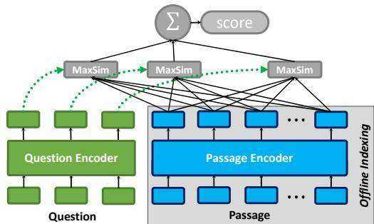

# ColBERTv2: Effective and Efficient Retrieval via Lightweight Late Interaction

Keshav Santhanam∗ Stanford University

Omar Khattab∗ Stanford University

Jon Saad-Falcon Georgia Institute of Technology

Christopher Potts Stanford University

Matei Zaharia Stanford University

# Abstract

Neural information retrieval (IR) has greatly advanced search and other knowledgeintensive language tasks. While many neural IR methods encode queries and documents into single-vector representations, late interaction models produce multi-vector representations at the granularity of each token and decompose relevance modeling into scalable token-level computations. This decomposition has been shown to make late interaction more effective, but it inflates the space footprint of these models by an order of magnitude. In this work, we introduce ColBERTv2, a retriever that couples an aggressive residual compression mechanism with a denoised supervision strategy to simultaneously improve the quality and space footprint of late interaction. We evaluate ColBERTv2 across a wide range of benchmarks, establishing state-of-the-art quality within and outside the training domain while reducing the space footprint of late interaction models by $6 { - } 1 0 \times$ .

# 1 Introduction

Neural information retrieval (IR) has quickly dominated the search landscape over the past 2–3 years, dramatically advancing not only passage and document search (Nogueira and Cho, 2019) but also many knowledge-intensive NLP tasks like opendomain question answering (Guu et al., 2020), multi-hop claim verification (Khattab et al., 2021a), and open-ended generation (Paranjape et al., 2022).

Many neural IR methods follow a single-vector similarity paradigm: a pretrained language model is used to encode each query and each document into a single high-dimensional vector, and relevance is modeled as a simple dot product between both vectors. An alternative is late interaction, introduced in ColBERT (Khattab and Zaharia, 2020), where queries and documents are encoded at a finergranularity into multi-vector representations, and relevance is estimated using rich yet scalable interactions between these two sets of vectors. Col-BERT produces an embedding for every token in the query (and document) and models relevance as the sum of maximum similarities between each query vector and all vectors in the document.

By decomposing relevance modeling into tokenlevel computations, late interaction aims to reduce the burden on the encoder: whereas single-vector models must capture complex query–document relationships within one dot product, late interaction encodes meaning at the level of tokens and delegates query–document matching to the interaction mechanism. This added expressivity comes at a cost: existing late interaction systems impose an order-of-magnitude larger space footprint than single-vector models, as they must store billions of small vectors for Web-scale collections. Considering this challenge, it might seem more fruitful to focus instead on addressing the fragility of single-vector models (Menon et al., 2022) by introducing new supervision paradigms for negative mining (Xiong et al., 2020), pretraining (Gao and Callan, 2021), and distillation (Qu et al., 2021). Indeed, recent single-vector models with highlytuned supervision strategies (Ren et al., 2021b; Formal et al., 2021a) sometimes perform on-par or even better than “vanilla” late interaction models, and it is not necessarily clear whether late interaction architectures—with their fixed token-level inductive biases—admit similarly large gains from improved supervision.

In this work, we show that late interaction retrievers naturally produce lightweight token representations that are amenable to efficient storage off-the-shelf and that they can benefit drastically from denoised supervision. We couple those in ColBERTv2,1 a new late-interaction retriever that employs a simple combination of distillation from a cross-encoder and hard-negative mining (§3.2) to boost quality beyond any existing method, and then uses a residual compression mechanism (§3.3) to reduce the space footprint of late interaction by $6 { - } 1 0 \times$ while preserving quality. As a result, Col-BERTv2 establishes state-of-the-art retrieval quality both within and outside its training domain with a competitive space footprint with typical singlevector models.

When trained on MS MARCO Passage Ranking, ColBERTv2 achieves the highest MRR $@ 1 0$ of any standalone retriever. In addition to in-domain quality, we seek a retriever that generalizes “zeroshot” to domain-specific corpora and long-tail topics, ones that are often under-represented in large public training sets. To this end, we evaluate Col-BERTv2 on a wide array of out-of-domain benchmarks. These include three Wikipedia Open-QA retrieval tests and 13 diverse retrieval and semanticsimilarity tasks from BEIR (Thakur et al., 2021). In addition, we introduce a new benchmark, dubbed LoTTE, for Long-Tail Topic-stratified Evaluation for IR that features 12 domain-specific search tests, spanning StackExchange communities and using queries from GooAQ (Khashabi et al., 2021). LoTTE focuses on relatively long-tail topics in its passages, unlike the Open-QA tests and many of the BEIR tasks, and evaluates models on their capacity to answer natural search queries with a practical intent, unlike many of BEIR’s semanticsimilarity tasks. On 22 of 28 out-of-domain tests, ColBERTv2 achieves the highest quality, outperforming the next best retriever by up to $8 \%$ relative gain, while using its compressed representations.

This work makes the following contributions:

1. We propose ColBERTv2, a retriever that combines denoised supervision and residual compression, leveraging the token-level decomposition of late interaction to achieve high robustness with a reduced space footprint.

2. We introduce LoTTE, a new resource for outof-domain evaluation of retrievers. LoTTE focuses on natural information-seeking queries over long-tail topics, an important yet understudied application space.

3. We evaluate ColBERTv2 across a wide range of settings, establishing state-of-the-art quality within and outside the training domain.

# 2 Background & Related Work

# 2.1 Token-Decomposed Scoring in Neural IR

Many neural IR approaches encode passages as a single high-dimensional vector, trading off the higher quality of cross-encoders for improved efficiency and scalability (Karpukhin et al., 2020; Xiong et al., 2020; Qu et al., 2021). Col-BERT’s (Khattab and Zaharia, 2020) late interaction paradigm addresses this tradeoff by computing multi-vector embeddings and using a scalable “MaxSim” operator for retrieval. Several other systems leverage multi-vector representations, including Poly-encoders (Humeau et al., 2020), PreTTR (MacAvaney et al., 2020), and MORES (Gao et al., 2020), but these target attention-based re-ranking as opposed to Col-BERT’s scalable MaxSim end-to-end retrieval.

ME-BERT (Luan et al., 2021) generates tokenlevel document embeddings similar to ColBERT, but retains a single embedding vector for queries. COIL (Gao et al., 2021) also generates token-level document embeddings, but the token interactions are restricted to lexical matching between query and document terms. uniCOIL (Lin and Ma, 2021) limits the token embedding vectors of COIL to a single dimension, reducing them to scalar weights that extend models like DeepCT (Dai and Callan, 2020) and DeepImpact (Mallia et al., 2021). To produce scalar weights, SPLADE (Formal et al., 2021b) and SPLADEv2 (Formal et al., 2021a) produce a sparse vocabulary-level vector that retains the term-level decomposition of late interaction while simplifying the storage into one dimension per token. The SPLADE family also piggybacks on the language modeling capacity acquired by BERT during pretraining. SPLADEv2 has been shown to be highly effective, within and across domains, and it is a central point of comparison in the experiments we report on in this paper.

# 2.2 Vector Compression for Neural IR

There has been a surge of recent interest in compressing representations for IR. Izacard et al. (2020) explore dimension reduction, product quantization (PQ), and passage filtering for single-vector retrievers. BPR (Yamada et al., 2021a) learns to directly hash embeddings to binary codes using a differentiable tanh function. JPQ (Zhan et al., 2021a) and its extension, RepCONC (Zhan et al., 2022), use PQ to compress embeddings, and jointly train the query encoder along with the centroids produced by PQ via a ranking-oriented loss.

SDR (Cohen et al., 2021) uses an autoencoder to reduce the dimensionality of the contextual embeddings used for attention-based re-ranking and then applies a quantization scheme for further compression. DensePhrases (Lee et al., 2021a) is a system for Open-QA that relies on a multi-vector encoding of passages, though its search is conducted at the level of individual vectors and not aggregated with late interaction. Very recently, Lee et al. (2021b) propose a quantization-aware finetuning method based on PQ to reduce the space footprint of DensePhrases. While DensePhrases is effective at Open-QA, its retrieval quality—as measured by top-20 retrieval accuracy on NaturalQuestions and TriviaQA—is competitive with DPR (Karpukhin et al., 2020) and considerably less effective than ColBERT (Khattab et al., 2021b).

In this work, we focus on late-interaction retrieval and investigate compression using a residual compression approach that can be applied off-theshelf to late interaction models, without special training. We show in Appendix A that ColBERT’s representations naturally lend themselves to residual compression. Techniques in the family of residual compression are well-studied (Barnes et al., 1996) and have previously been applied across several domains, including approximate nearest neighbor search (Wei et al., 2014; Ai et al., 2017), neural network parameter and activation quantization (Li et al., 2021b,a), and distributed deep learning (Chen et al., 2018; Liu et al., 2020). To the best of our knowledge, ColBERTv2 is the first approach to use residual compression for scalable neural IR.

# 2.3 Improving the Quality of Single-Vector Representations

Instead of compressing multi-vector representations as we do, much recent work has focused on improving the quality of single-vector models, which are often very sensitive to the specifics of supervision. This line of work can be decomposed into three directions: (1) distillation of more expressive architectures (Hofstätter et al., 2020; Lin et al., 2020) including explicit denoising (Qu et al., 2021; Ren et al., 2021b), (2) hard negative sampling (Xiong et al., 2020; Zhan et al., 2020a, 2021b), and (3) improved pretraining (Gao and Callan, 2021; Oguz et al. ˘ , 2021). We adopt similar techniques to (1) and (2) for ColBERTv2’s multivector representations (see $\ S 3 . 2 )$ .

  
Figure 1: The late interaction architecture, given a query and a passage. Diagram from Khattab et al. (2021b) with permission.

# 2.4 Out-of-Domain Evaluation in IR

Recent progress in retrieval has mostly focused on large-data evaluation, where many tens of thousands of annotated training queries are associated with the test domain, as in MS MARCO or Natural Questions (Kwiatkowski et al., 2019). In these benchmarks, queries tend to reflect high-popularity topics like movies and athletes in Wikipedia. In practice, user-facing IR and QA applications often pertain to domain-specific corpora, for which little to no training data is available and whose topics are under-represented in large public collections.

This out-of-domain regime has received recent attention with the BEIR (Thakur et al., 2021) benchmark. BEIR combines several existing datasets into a heterogeneous suite for “zero-shot IR” tasks, spanning bio-medical, financial, and scientific domains. While the BEIR datasets provide a useful testbed, many capture broad semantic relatedness tasks—like citations, counter arguments, or duplicate questions–instead of natural search tasks, or else they focus on high-popularity entities like those in Wikipedia. In $\ S 4$ , we introduce LoTTE, a new dataset for out-of-domain retrieval, exhibiting natural search queries over long-tail topics.

# 3 ColBERTv2

We now introduce ColBERTv2, which improves the quality of multi-vector retrieval models (§3.2) while reducing their space footprint (§3.3).

# 3.1 Modeling

ColBERTv2 adopts the late interaction architecture of ColBERT, depicted in Figure 1. Queries and passages are independently encoded with BERT (Devlin et al., 2019), and the output embeddings encoding each token are projected to a lower dimension. During offline indexing, every passage $d$ in the corpus is encoded into a set of vectors, and these vectors are stored. At search time, the query $q$ is encoded into a multi-vector representation, and its similarity to a passage $d$ is computed as the summation of query-side “MaxSim” operations, namely, the largest cosine similarity between each query token embedding and all passage token embeddings:

$$
S _ { q , d } = \sum _ { i = 1 } ^ { N } \operatorname* { m a x } _ { j = 1 } ^ { M } Q _ { i } \cdot D _ { j } ^ { T }
$$

where $Q$ is an matrix encoding the query with $N$ vectors and $D$ encodes the passage with $M$ vectors. The intuition of this architecture is to align each query token with the most contextually relevant passage token, quantify these matches, and combine the partial scores across the query. We refer to Khattab and Zaharia (2020) for a more detailed treatment of late interaction.

# 3.2 Supervision

Training a neural retriever typically requires positive and negative passages for each query in the training set. Khattab and Zaharia (2020) train ColBERT using the official $\langle { \bf q } , \mathrm { ~ d ^ { + } , ~ d ^ { - } } \rangle$ triples of MS MARCO. For each query, a positive $d ^ { + }$ is human-annotated, and each negative $d ^ { - }$ is sampled from unannotated BM25-retrieved passages.

Subsequent work has identified several weaknesses in this standard supervision approach (see $\ S 2 . 3 )$ . Our goal is to adopt a simple, uniform supervision scheme that selects challenging negatives and avoids rewarding false positives or penalizing false negatives. To this end, we start with a ColBERT model trained with triples as in Khattab et al. (2021b), using this to index the training passages with ColBERTv2 compression.

For each training query, we retrieve the top- $k$ passages. We feed each of those query–passage pairs into a cross-encoder reranker. We use a 22M-parameter MiniLM (Wang et al., 2020) crossencoder trained with distillation by Thakur et al. (2021).2 This small model has been shown to exhibit very strong performance while being relatively efficient for inference, making it suitable for distillation.

We then collect $w$ -way tuples consisting of a query, a highly-ranked passage (or labeled positive), and one or more lower-ranked passages. In this work, we use $w = 6 4$ passages per example. Like RocketQAv2 (Ren et al., 2021b), we use a

KL-Divergence loss to distill the cross-encoder’s scores into the ColBERT architecture. We use KL-Divergence as ColBERT produces scores (i.e., the sum of cosine similarities) with a restricted scale, which may not align directly with the output scores of the cross-encoder. We also employ in-batch negatives per GPU, where a cross-entropy loss is applied to the positive score of each query against all passages corresponding to other queries in the same batch. We repeat this procedure once to refresh the index and thus the sampled negatives.

Denoised training with hard negatives has been positioned in recent work as ways to bridge the gap between single-vector and interaction-based models, including late interaction architectures like ColBERT. Our results in $\ S 5$ reveal that such supervision can improve multi-vector models dramatically, resulting in state-of-the-art retrieval quality.

# 3.3 Representation

We hypothesize that the ColBERT vectors cluster into regions that capture highly-specific token semantics. We test this hypothesis in Appendix A, where evidence suggests that vectors corresponding to each sense of a word cluster closely, with only minor variation due to context. We exploit this regularity with a residual representation that dramatically reduces the space footprint of late interaction models, completely off-the-shelf without architectural or training changes. Given a set of centroids $C$ , ColBERTv2 encodes each vector $v$ as the index of its closest centroid $C _ { t }$ and a quantized vector $\tilde { r }$ that approximates the residual $r = v - C _ { t }$ At search time, we use the centroid index $t$ and residual $\tilde { r }$ recover an approximate $\tilde { v } = C _ { t } + \tilde { r }$ .

To encode $\tilde { r }$ , we quantize every dimension of $r$ into one or two bits. In principle, our $b$ -bit encoding of $n$ -dimensional vectors needs $\lceil \log | C | \rceil + b n$ bits per vector. In practice, with $n = 1 2 8$ , we use four bytes to capture up to $2 ^ { 3 2 }$ centroids and 16 or 32 bytes (for $b = 1$ or $b = 2$ ) to encode the residual. This total of 20 or 36 bytes per vector contrasts with ColBERT’s use of 256-byte vector encodings at 16-bit precision. While many alternatives can be explored for compression, we find that this simple encoding largely preserves model quality, while considerably lowering storage costs against typical 32- or 16-bit precision used by existing late interaction systems.

This centroid-based encoding can be considered a natural extension of product quantization to multivector representations. Product quantization (Gray, 1984; Jegou et al., 2010) compresses a single vector by splitting it into small sub-vectors and encoding each of them using an ID within a codebook. In our approach, each representation is already a matrix that is naturally divided into a number of small vectors (one per token). We encode each vector using its nearest centroid plus a residual. Refer to Appendix B for tests of the impact of compression on retrieval quality and a comparison with a baseline compression method for ColBERT akin to BPR (Yamada et al., 2021b).

# 3.4 Indexing

Given a corpus of passages, the indexing stage precomputes all passage embeddings and organizes their representations to support fast nearestneighbor search. ColBERTv2 divides indexing into three stages, described below.

Centroid Selection. In the first stage, Col-BERTv2 selects a set of cluster centroids $C$ . These are embeddings that ColBERTv2 uses to support residual encoding (§3.3) and also for nearestneighbor search $( \ S 3 . 5 )$ . Standardly, we find that setting $| C |$ proportionally to the square root of $n$ embeddings in the corpus works well empirically.3 Khattab and Zaharia (2020) only clustered the vectors after computing the representations of all passages, but doing so requires storing them uncompressed. To reduce memory consumption, we apply $k$ -means clustering to the embeddings produced by invoking our BERT encoder over only a sample of all passages, proportional to the square root of the collection size, an approach we found to perform well in practice.

Passage Encoding. Having selected the centroids, we encode every passage in the corpus. This entails invoking the BERT encoder and compressing the output embeddings as described in $\ S 3 . 3$ , assigning each embedding to the nearest centroid and computing a quantized residual. Once a chunk of passages is encoded, the compressed representations are saved to disk.

Index Inversion. To support fast nearestneighbor search, we group the embedding IDs that correspond to each centroid together, and save this inverted list to disk. At search time, this allows us to quickly find token-level embeddings similar to those in a query.

# 3.5 Retrieval

Given a query representation $Q$ , retrieval starts with candidate generation. For every vector $Q _ { i }$ in the query, the nearest $n _ { \mathrm { p r o b e } } \geq 1$ centroids are found. Using the inverted list, ColBERTv2 identifies the passage embeddings close to these centroids, decompresses them, and computes their cosine similarity with every query vector. The scores are then grouped by passage ID for each query vector, and scores corresponding to the same passage are maxreduced. This allows ColBERTv2 to conduct an approximate “MaxSim” operation per query vector. This computes a lower-bound on the true MaxSim (§3.1) using the embeddings identified via the inverted list, which resembles the approximation explored for scoring by Macdonald and Tonellotto (2021) but is applied for candidate generation.

These lower bounds are summed across the query tokens, and the top-scoring ncandidate candidate passages based on these approximate scores are selected for ranking, which loads the complete set of embeddings of each passage, and conducts the same scoring function using all embeddings per document following Equation 1. The result passages are then sorted by score and returned.

# 4 LoTTE: Long-Tail, Cross-Domain Retrieval Evaluation

We introduce LoTTE (pronounced latte), a new dataset for Long-Tail Topic-stratified Evaluation for IR. To complement the out-of-domain tests of BEIR (Thakur et al., 2021), as motivated in $\ S 2 . 4$ , LoTTE focuses on natural user queries that pertain to long-tail topics, ones that might not be covered by an entity-centric knowledge base like Wikipedia. LoTTE consists of 12 test sets, each with 500–2000 queries and 100k–2M passages.

The test sets are explicitly divided by topic, and each test set is accompanied by a validation set of related but disjoint queries and passages. We elect to make the passage texts disjoint to encourage more realistic out-of-domain transfer tests, allowing for minimal development on related but distinct topics. The test (and dev) sets include a “pooled” setting. In the pooled setting, the passages and queries are aggregated across all test (or dev) topics to evaluate out-of-domain retrieval across a larger and more diverse corpus.

Table 1 outlines the composition of LoTTE. We derive the topics and passage corpora from the answer posts across various StackExchange forums. StackExchange is a set of question-andanswer communities that target individual topics (e.g., “physics” or “bicycling”). We gather forums from five overarching domains: writing, recreation, science, technology, and lifestyle. To evaluate retrievers, we collect Search and Forum queries, each of which is associated with one or more target answer posts in its corpus. Example queries, and short snippets from posts that answer them in the corpora, are shown in Table 2.

<table><tr><td rowspan="2">Topic</td><td rowspan="2">Question Set</td><td colspan="3">Dev</td><td colspan="3">Test</td></tr><tr><td># Questions</td><td># Passages</td><td>Subtopics</td><td># Questions</td><td># Passages</td><td>Subtopics</td></tr><tr><td rowspan="2">Writing</td><td>Search</td><td>497</td><td rowspan="2">277k</td><td>ESL, Linguistics,</td><td>1071</td><td rowspan="2">200k</td><td rowspan="2">English</td></tr><tr><td>Forum</td><td>2003</td><td>Worldbuilding</td><td>2000</td></tr><tr><td rowspan="2">Recreation</td><td>Search</td><td>563</td><td rowspan="2">263k</td><td>Sci-Fi, RPGs,</td><td>924</td><td rowspan="2">167k</td><td rowspan="2">Gaming, Anime, Movies</td></tr><tr><td>Forum</td><td>2002</td><td>Photography</td><td>2002</td></tr><tr><td rowspan="2">Science</td><td>Search</td><td>538</td><td rowspan="2">344k</td><td>Chemistry,</td><td>617</td><td rowspan="2">1.694M</td><td rowspan="2">Math, Physics, Biology</td></tr><tr><td>Forum</td><td>2013</td><td>Statistics, Academia</td><td>2017</td></tr><tr><td rowspan="2">Technology</td><td>Search</td><td>916</td><td rowspan="2">1.276M</td><td>Web Apps,</td><td>596</td><td rowspan="2">639k</td><td rowspan="2">Apple, Android, UNIX, Security</td></tr><tr><td>Forum</td><td>2003</td><td>Ubuntu, SysAdmin</td><td>2004</td></tr><tr><td rowspan="2">Lifestyle</td><td>Search</td><td>417</td><td rowspan="2">269k</td><td rowspan="2">DIY, Music, Bicycles, Car Maintenance</td><td>661 2002</td><td rowspan="2">119k</td><td rowspan="2">Cooking, Sports, Travel</td></tr><tr><td>Forum</td><td>2076</td><td></td></tr><tr><td rowspan="2">Pooled</td><td>Search</td><td>2931</td><td rowspan="2">2.4M</td><td rowspan="2">All of the above</td><td>3869</td><td rowspan="2">2.8M</td><td rowspan="2">All of the above</td></tr><tr><td>Forum</td><td>10097</td><td>10025</td></tr></table>

Table 1: Composition of LoTTE showing topics, question sets, and a sample of corresponding subtopics. Search Queries are taken from GooAQ, while Forum Queries are taken directly from the StackExchange archive. The pooled datasets combine the questions and passages from each of the subtopics.

Search Queries. We collect search queries from GooAQ (Khashabi et al., 2021), a recent dataset of Google search-autocomplete queries and their answer boxes, which we filter for queries whose answers link to a specific StackExchange post. As Khashabi et al. (2021) hypothesize, Google Search likely maps these natural queries to their answers by relying on a wide variety of signals for relevance, including expert annotations, user clicks, and hyperlinks as well as specialized QA components for various question types with access to the post title and question body. Using those annotations as ground truth, we evaluate the models on their capacity for retrieval using only free text of the answer posts (i.e., no hyperlinks or user clicks, question title or body, etc.), posing a significant challenge for IR and NLP systems trained only on public datasets.

Forum Queries. We collect the forum queries by extracting post titles from the StackExchange communities to use as queries and collect their corresponding answer posts as targets. We select questions in order of their popularity and sample questions according to the proportional contribution of individual communities within each topic.

Table 2: Examples of queries and shortened snippets of answer passages from LoTTE. The first two examples show “search” queries, whereas the last two are “forum” queries. Snippets are shortened for presentation.   

<table><tr><td>Q: what is the difference between root and stem in lin- guistics? A: A root is the form to which derivational affixes are added to form a stem. A stem is the form to which inflectional affixes are added to form a word.</td></tr><tr><td>Q: are there any airbenders left? A: the Fire Nation had wiped out all Airbenders while Aang was frozen. Tenzin and his 3 children are the only Airbenders left in Korra&#x27;s time.</td></tr><tr><td>Q: Why are there two Hydrogen atoms on some peri- odic tables? A: some periodic tables show hydrogen in both places to emphasize that hydrogen isn&#x27;t really a member of the first group or the seventh group.</td></tr><tr><td>Q: How can cache be that fast? A: the cache memory sits right next to the CPU on the same die (chip), it is made using SRAM which is much, much faster than the DRAM.</td></tr></table>

These queries tend to have a wider variety than the “search” queries, while the search queries may exhibit more natural patterns. Table 3 compares a random samples of search and forum queries. It can be seen that search queries tend to be brief, knowledge-based questions with direct answers, whereas forum queries tend to reflect more openended questions. Both query sets target topics that exceed the scope of a general-purpose knowledge repository such as Wikipedia.

For search as well as forum queries, the resulting evaluation set consists of a query and a target set of StackExchange answer posts (in particular, the answer posts from the target StackExchange page). Similar to evaluation in the Open-QA literature (Karpukhin et al., 2020; Khattab et al.,

Table 3: Comparison of a random sample of search queries (top) vs. forum queries (bottom).   

<table><tr><td>Q: what is xerror in rpart? Q: is sub question one word? Q: how to open a garage door without making noise? is docx and dotx the same? Q: are upvotes and downvotes anonymous? Q: what is the difference between descriptive essay and narrative essay? Q: how to change default user profile in chrome? Q: does autohotkey need to be installed? Q: how do you tag someone on facebook with a youtube video? Q: has mjolnir ever been broken? Q: Snoopy can balance on an edge atop his doghouse. Is any</td></tr><tr><td>reason given for this? Q: How many Ents were at the Entmoot? Q: What does a hexagonal sun tell us about the camera lens/sensor? Q: Should I simply ignore it if authors assume that Im male in their response to my review of their article? Q: Why is the 2s orbital lower in energy than the 2p orbital when the electrons in 2s are usually farther from the nucleus? Q: Are there reasons to use colour filters with digital cameras? Q: How does the current know how much to flow, before having seen the resistor? is the difference between Fact and Truth? Q: hAs a DM, how can I handle my Druid spying on everything with Wild</td></tr></table>

<table><tr><td>Method</td><td>Official Dev (7k) MRR@10 R@50 R@1k MRR@10 R@50 R@1k</td><td>Local Eval (5k)</td><td></td></tr><tr><td colspan="4">Models without Distillation or Special Pretraining</td></tr><tr><td>RepBERT</td><td>30.4</td><td>94.3</td><td></td></tr><tr><td>DPR</td><td>31.1</td><td>95.2</td><td></td></tr><tr><td>ANCE</td><td>33.0 95.9</td><td></td><td></td></tr><tr><td>LTRe</td><td>- 96.2 96.8</td><td>-</td><td></td></tr><tr><td>ColBERT</td><td>82.9</td><td>36.7</td><td></td></tr><tr><td colspan="4">Models with Distillation or Special Pretraining</td></tr><tr><td>TAS-B</td><td>97.8</td><td></td><td></td></tr><tr><td>SPLADEv2</td><td></td><td>37.9</td><td>84.9</td></tr><tr><td>PAIR</td><td>86.4</td><td>98.2</td><td>-</td></tr><tr><td>coCondenser</td><td>-</td><td>98.4</td><td>-</td></tr><tr><td>RocketQAv2</td><td>86.2</td><td>98.1 98.4</td><td>85.8</td></tr><tr><td>ColBERTv2 39.7</td><td>86.8</td><td>39.8 40.8</td><td>86.3</td></tr></table>

Table 4: In-domain performance on the development set of MS MARCO Passage Ranking as well the “Local Eval” test set described by Khattab and Zaharia (2020). Dev-set results for baseline systems are from their respective papers: Zhan et al. (2020b), Xiong et al. (2020) for DPR and ANCE, Zhan et al. (2020a), Khattab and Zaharia (2020), Hofstätter et al. (2021), Gao and Callan (2021), Ren et al. (2021a), Formal et al. (2021a), and Ren et al. (2021b).

2021b), we evaluate retrieval quality by computing the success@5 $( \mathbf { S } @ 5 )$ metric. Specifically, we award a point to the system for each query where it finds an accepted or upvoted (score $\geq 1$ ) answer from the target page in the top-5 hits.

Appendix D reports on the breakdown of constituent communities per topic, the construction procedure of LoTTE as well as licensing considerations, and relevant statistics. Figures 5 and 6 quantitatively compare the search and forum queries.

# 5 Evaluation

We now evaluate ColBERTv2 on passage retrieval tasks, testing its quality within the training domain (§5.1) as well as outside the training domain in zero-shot settings (§5.2). Unless otherwise stated, we compress ColBERTv2 embeddings to $b = 2$ bits per dimension in our evaluation.

PAIR, and RocketQAv2 to achieve higher quality than vanilla ColBERT. These supervision gains challenge the value of fine-grained late interaction, and it is not inherently clear whether the stronger inductive biases of ColBERT-like models permit it to accept similar gains under distillation, especially when using compressed representations. Despite this, we find that with denoised supervision and residual compression, ColBERTv2 achieves the highest quality across all systems. As we discuss in $\ S 5 . 3$ , it exhibits space footprint competitive with these single-vector models and much lower than vanilla ColBERT.

# 5.1 In-Domain Retrieval Quality

Similar to related work, we train for IR tasks on MS MARCO Passage Ranking (Nguyen et al., 2016). Within the training domain, our development-set results are shown in Table 4, comparing ColBERTv2 with vanilla ColBERT as well as state-of-the-art single-vector systems.

Besides the official dev set, we evaluated Col-BERTv2, SPLADEv2, and RocketQAv2 on the “Local Eval” test set described by Khattab and Zaharia (2020) for MS MARCO, which consists of 5000 queries disjoint with the training and the official dev sets. These queries are obtained from labeled 50k queries that are provided in the official MS MARCO Passage Ranking task as additional validation data.4 On this test set, ColBERTv2 obtains $4 0 . 8 \%$ MRR $@ 1 0$ , considerably outperforming the baselines, including RocketQAv2 which makes use of document titles in addition to the passage text unlike the other systems.

While ColBERT outperforms single-vector systems like RepBERT, ANCE, and even TAS-B, improvements in supervision such as distillation from cross-encoders enable systems like SPLADEv2,

Table 5: Zero-shot evaluation results. Sub-table (a) reports results on BEIR and sub-table (b) reports results on the Wikipedia Open QA and the test sets of the LoTTE benchmark. On BEIR, we test ColBERTv2 and RocketQAv2 and copy the results for ANCE, TAS-B, and ColBERT from Thakur et al. (2021), for MoDIR and DPR-MSMARCO (DPR-M) from Xin et al. (2021), and for SPLADEv2 from Formal et al. (2021a).   

<table><tr><td>Corpus</td><td colspan="3">Models without Distillation Models with Distillation</td><td colspan="3"></td></tr><tr><td></td><td>20 0</td><td>M</td><td>0</td><td>20</td><td>20</td><td>20</td><td>0</td></tr><tr><td colspan="8">BEIR Search Tasks (nDCG@10)</td></tr><tr><td>DBPedia</td><td>39.2</td><td>23.6</td><td>28.1</td><td>28.4</td><td>38.4</td><td>35.6</td><td>43.5</td><td>44.6</td></tr><tr><td>FiQA</td><td>31.7</td><td>27.5</td><td>29.5</td><td>29.6</td><td>30.0</td><td>30.2</td><td>33.6</td><td>35.6</td></tr><tr><td>NQ</td><td>52.4</td><td>39.8</td><td>44.6</td><td>44.2</td><td>46.3</td><td>50.5</td><td>52.1</td><td>56.2</td></tr><tr><td>HotpotQA</td><td>59.3</td><td>37.1</td><td>45.6</td><td>46.2</td><td>58.4</td><td>53.3</td><td>68.4</td><td>66.7</td></tr><tr><td>NFCorpus</td><td>30.5</td><td>20.8</td><td>23.7</td><td>24.4</td><td>31.9</td><td>29.3</td><td>33.4</td><td>33.8</td></tr><tr><td>T-COVID</td><td>67.7</td><td>56.1</td><td>65.4</td><td>67.6</td><td>48.1</td><td>67.5</td><td>71.0</td><td>73.8</td></tr><tr><td>Touché (v2)</td><td>-</td><td>-</td><td>-</td><td>-</td><td>-</td><td>24.7</td><td>27.2</td><td>26.3</td></tr><tr><td colspan="9">BEIR Semantic Relatedness Tasks (nDCG@10)</td></tr><tr><td>ArguAna</td><td>23.3</td><td>41.4</td><td>41.5</td><td>41.8</td><td>42.7</td><td>45.1</td><td>47.9</td><td>46.3</td></tr><tr><td>C-FEVER</td><td>18.4</td><td>17.6</td><td>19.8</td><td>20.6</td><td>22.8</td><td>18.0</td><td>23.5</td><td>17.6</td></tr><tr><td>FEVER</td><td>77.1</td><td>58.9</td><td>66.9</td><td>68.0</td><td>70.0</td><td>67.6</td><td>78.6</td><td>78.5</td></tr><tr><td>Quora</td><td>85.4</td><td>84.2</td><td>85.2</td><td>85.6</td><td>83.5</td><td>74.9</td><td>83.8</td><td>85.2</td></tr><tr><td>SCIDOCS</td><td>14.5</td><td>10.8</td><td>12.2</td><td>12.4</td><td>14.9</td><td>13.1</td><td>15.8</td><td>15.4</td></tr><tr><td>SciFact</td><td>67.1</td><td>47.8</td><td>50.7</td><td>50.2</td><td>64.3</td><td>56.8</td><td>69.3</td><td>69.3</td></tr><tr><td colspan="9">(a)</td></tr></table>

<table><tr><td>Corpus</td><td>0</td><td>2</td><td>ANCE</td><td>20</td><td>20</td><td>20</td></tr><tr><td colspan="7">OOD Wikipedia Open QA (Success@5)</td></tr><tr><td>NQ-dev</td><td>65.7</td><td>44.6</td><td>-</td><td>-</td><td>65.6</td><td>68.9</td></tr><tr><td>TQ-dev</td><td>72.6</td><td>67.6</td><td>-</td><td></td><td>74.7</td><td>76.7</td></tr><tr><td>SQuAD-dev</td><td>60.0</td><td>50.6</td><td>-</td><td>-</td><td>60.4</td><td>65.0</td></tr><tr><td colspan="7">LoTTE Search Test Queries (Success@5)</td></tr><tr><td>Writing</td><td>74.7</td><td>60.3</td><td>74.4</td><td>78.0</td><td>77.1</td><td>80.1</td></tr><tr><td>Recreation</td><td>68.5</td><td>56.5</td><td>64.7</td><td>72.1</td><td>69.0</td><td>72.3</td></tr><tr><td>Science Technology</td><td>53.6</td><td>32.7</td><td>53.6 59.6</td><td>55.3</td><td>55.4</td><td>56.7 66.1</td></tr><tr><td></td><td>61.9</td><td>41.8</td><td>82.3</td><td>63.4</td><td>62.4</td><td>84.7</td></tr><tr><td>Lifestyle</td><td>80.2</td><td>63.8</td><td></td><td>82.1</td><td>82.3</td><td></td></tr><tr><td>Pooled</td><td>67.3</td><td>48.3</td><td>66.4</td><td>69.8</td><td>68.9</td><td>71.6</td></tr><tr><td colspan="7">LoTTE Forum Test Queries (Success@5)</td></tr><tr><td>Writing</td><td>71.0</td><td>64.0</td><td>68.8</td><td>71.5</td><td>73.0</td><td>76.3</td></tr><tr><td>Recreation</td><td>65.6</td><td>55.4</td><td>63.8</td><td>65.7</td><td>67.1</td><td>70.8</td></tr><tr><td>Science</td><td>41.8</td><td>37.1</td><td>36.5</td><td>38.0</td><td>43.7</td><td>46.1</td></tr><tr><td>Technology</td><td>48.5</td><td>39.4</td><td>46.8</td><td>47.3</td><td>50.8</td><td>53.6</td></tr><tr><td>Lifestyle</td><td>73.0</td><td>60.6</td><td>73.1</td><td>73.7</td><td>74.0</td><td>76.9</td></tr><tr><td>Pooled</td><td>58.2</td><td>47.2</td><td>55.7</td><td>57.7</td><td>60.1</td><td>63.4</td></tr><tr><td colspan="7">(b)</td></tr></table>

# 5.2 Out-of-Domain Retrieval Quality

Next, we evaluate ColBERTv2 outside the training domain using BEIR (Thakur et al., 2021), Wikipedia Open QA retrieval as in Khattab et al. (2021b), and LoTTE. We compare against a wide range of recent and state-of-the-art retrieval systems from the literature.

BEIR. We start with BEIR, reporting the quality of models that do not incorporate distillation from cross-encoders, namely, ColBERT (Khattab and Zaharia, 2020), DPR-MARCO (Xin et al., 2021), ANCE (Xiong et al., 2020), and MoDIR (Xin et al., 2021), as well as models that do utilize distillation, namely, TAS-B (Hofstätter et al., 2021), SPLADEv2 (Formal et al., 2021a), and also RocketQAv2, which we test ourselves using the official checkpoint trained on MS MARCO. We divide the table into “search” (i.e., natural queries and questions) and “semantic relatednes” (e.g., citationrelatedness and claim verification) tasks to reflect the nature of queries in each dataset.5

Table 5a reports results with the official $\mathrm { n D C G } @ 1 0$ metric. Among the models without distillation, we see that the vanilla ColBERT model outperforms the single-vector systems DPR, ANCE, and MoDIR across all but three tasks. Col-BERT often outpaces all three systems by large margins and, in fact, outperforms the TAS-B model, which utilizes distillation, on most datasets. Shifting our attention to models with distillation, we see a similar pattern: while distillation-based models are generally stronger than their vanilla counterparts, the models that decompose scoring into termlevel interactions, ColBERTv2 and SPLADEv2, are almost always the strongest.

Looking more closely into the comparison between SPLADEv2 and ColBERTv2, we see that ColBERTv2 has an advantage on six benchmarks and ties SPLADEv2 on two, with the largest improvements attained on NQ, TREC-COVID, and FiQA-2018, all of which feature natural search queries. On the other hand, SPLADEv2 has the lead on five benchmarks, displaying the largest gains on Climate-FEVER (C-FEVER) and Hot-PotQA. In C-FEVER, the input queries are sentences making climate-related claims and, as a result, do not reflect the typical characteristics of search queries. In HotPotQA, queries are written by crowdworkers who have access to the target passages. This is known to lead to artificial lexical bias (Lee et al., 2019), where crowdworkers copy terms from the passages into their questions as in the Open-SQuAD benchmark.

Wikipedia Open QA. As a further test of outof-domain generalization, we evaluate the MS MARCO-trained ColBERTv2, SPLADEv2, and vanilla ColBERT on retrieval for open-domain question answering, similar to the out-of-domain setting of Khattab et al. (2021b). We report Success $\textcircled { \omega } 5$ (sometimes referred to as Recall $\textcircled { a } 5$ ), which is the percentage of questions whose short answer string overlaps with one or more of the top-5 passages. For the queries, we use the development set questions of the open-domain versions (Lee et al., 2019; Karpukhin et al., 2020) of Natural Questions (NQ; Kwiatkowski et al. 2019), TriviaQA (TQ; Joshi et al. 2017), and SQuAD (Rajpurkar et al., 2016) datasets in Table 5b. As a baseline, we include the BM25 (Robertson et al., 1995) results using the Anserini (Yang et al., 2018a) toolkit. We observe that ColBERTv2 outperforms BM25, vanilla ColBERT, and SPLADEv2 across the three query sets, with improvements of up to 4.6 points over SPLADEv2.

LoTTE. Next, we analyze performance on the LoTTE test benchmark, which focuses on natural queries over long-tail topics and exhibits a different annotation pattern to the datasets in the previous OOD evaluations. In particular, LoTTE uses automatic Google rankings (for the “search” queries) and organic StackExchange question–answer pairs (for “forum” queries), complimenting the poolingbased annotation of datasets like TREC-COVID (in BEIR) and the answer overlap metrics of Open-QA retrieval. We report Success $\textcircled { a } 5$ for each corpus on both search queries and forum queries.

Overall, we see that ANCE and vanilla Col-BERT outperform BM25 on all topics, and that the three methods using distillation are generally the strongest. Similar to the Wikipedia-OpenQA results, we find that ColBERTv2 outperforms the baselines across all topics for both query types, improving upon SPLADEv2 and RocketQAv2 by up to 3.7 and 8.1 points, respectively. Considering the baselines, we observe that while RocketQAv2 tends to have a slight advantage over SPLADEv2 on the “search” queries, SPLADEv2 is considerably more effective on the “forum” tests. We hypothesize that the search queries, obtained from Google (through GooAQ) are more similar to MS

MARCO than the forum queries and, as a result, the latter stresses generalization more heavily, rewarding term-decomposed models like SPLADEv2 and ColBERTv2.

# 5.3 Efficiency

ColBERTv2’s residual compression approach significantly reduces index sizes compared to vanilla ColBERT. Whereas ColBERT requires 154 GiB to store the index for MS MARCO, ColBERTv2 only requires 16 GiB or $2 5 \mathrm { G i B }$ when compressing embeddings to 1 or 2 bit(s) per dimension, respectively, resulting in compression ratios of $6 { - } 1 0 \times$ This storage figure includes 4.5 GiB for storing the inverted list.

This matches the storage for a typical singlevector model on MS MARCO, with 4-byte lossless floating-point storage for one 768-dimensional vector for each of the 9M passages amounting to a little over 25 GiBs. In practice, the storage for a singlevector model could be even larger when using a nearest-neighbor index like HNSW for fast search. Conversely, single-vector representations could be themselves compressed very aggressively (Zhan et al., 2021a, 2022), though often exacerbating the loss in quality relative to late interaction methods like ColBERTv2.

We discuss the impact of our compression method on search quality in Appendix B and present query latency results on the order of $5 0 -$ 250 milliseconds per query in Appendix C.

# 6 Conclusion

We introduced ColBERTv2, a retriever that advances the quality and space efficiency of multivector representations. We hypothesized that cluster centroids capture context-aware semantics of the token-level representations and proposed a residual representation that leverages these patterns to dramatically reduce the footprint of multi-vector systems off-the-shelf. We then explored improved supervision for multi-vector retrieval and found that their quality improves considerably upon distillation from a cross-encoder system. The proposed ColBERTv2 considerably outperforms existing retrievers in within-domain and out-of-domain evaluations, which we conducted extensively across 28 datasets, establishing state-of-the-art quality while exhibiting competitive space footprint.

# Acknowledgements

This research was supported in part by affiliate members and other supporters of the Stanford DAWN project—Ant Financial, Facebook, Google, and VMware—as well as Cisco, SAP, Virtusa, and the NSF under CAREER grant CNS-1651570. Any opinions, findings, and conclusions or recommendations expressed in this material are those of the authors and do not necessarily reflect the views of the National Science Foundation.

# Broader Impact & Ethical Considerations

This work is primarily an effort toward retrieval models that generalize better while performing reasonably efficiently in terms of space consumption. Strong out-of-the-box generalization to small domain-specific applications can serve many users in practice, particularly where training data is not available. Moreover, retrieval holds significant promise for many downstream NLP tasks, as it can help make language models smaller and thus more efficient (i.e., by decoupling knowledge from computation), more transparent (i.e., by allowing users to check the sources the model relied on when making a claim or prediction), and easier to update (i.e., by allowing developers to replace or add documents to the corpus without retraining the model) (Guu et al., 2020; Borgeaud et al., 2021; Khattab et al., 2021a). Nonetheless, such work poses risks in terms of misuse, particularly toward misinformation, as retrieval can surface results that are relevant yet inaccurate, depending on the contents of a corpus. Moreover, generalization from training on a large-scale dataset can propagate the biases of that dataset well beyond its typical reach to new domains and applications.

While our contributions have made ColBERT’s late interaction more efficient at storage costs, largescale distillation with hard negatives increases system complexity and accordingly increases training cost, when compared with the straightforward training paradigm of the original ColBERT model. While ColBERTv2 is efficient in terms of latency and storage at inference time, we suspect that under extreme resource constraints, simpler model designs like SPLADEv2 or RocketQAv2 could lend themselves to easier-to-optimize environments. We leave low-level systems optimizations of all systems to future work. Another worthwhile dimension for future exploration of tradeoffs is reranking architectures over various systems with cross-encoders, which are known to be expensive yet precise due to their highly expressive capacity.

# Research Limitations

While we evaluate ColBERTv2 on a wide range of tests, all of our benchmarks are in English and, in line with related work, our out-of-domain tests evaluate models that are trained on MS MARCO. We expect our approach to work effectively for other languages and when all models are trained using other, smaller training set (e.g., NaturalQuestions), but we leave such tests to future work.

We have observed consistent gains for Col-BERTv2 against existing state-of-the-art systems across many diverse settings. Despite this, almost all IR datasets contain false negatives (i.e., relevant but unlabeled passages) and thus some caution is needed in interpreting any individual result. Nonetheless, we intentionally sought out benchmarks with dissimilar annotation biases: for instance, TREC-COVID (in BEIR) annotates the pool of documents retrieved by the systems submitted at the time of the competition, LoTTE uses automatic Google rankings (for “search” queries) and StackExchange question–answer pairs (for “forum” queries), and the Open-QA tests rely on passageanswer overlap for factoid questions. ColBERTv2 performed well in all of these settings. We discuss other issues pertinent to LoTTE in Appendix $\ S _ { \mathrm { D } }$ .

We have compared with a wide range of strong baselines—including sparse retrieval and singlevector models—and found reliable patterns across tests. However, we caution that empirical trends can change as innovations are introduced to each of these families of models and that it can be difficult to ensure exact apple-to-apple comparisons across families of models, since each of them calls for different sophisticated tuning strategies. We thus primarily used results and models from the rich recent literature on these problems, with models like RocketQAv2 and SPLADEv2.

On the representational side, we focus on reducing the storage cost using residual compression, achieving strong gains in reducing footprint while largely preserving quality. Nonetheless, we have not exhausted the space of more sophisticated optimizations possible, and we would expect more sophisticated forms of residual compression and composing our approach with dropping tokens (Zhou and Devlin, 2021) to open up possibilities for further reductions in space footprint.