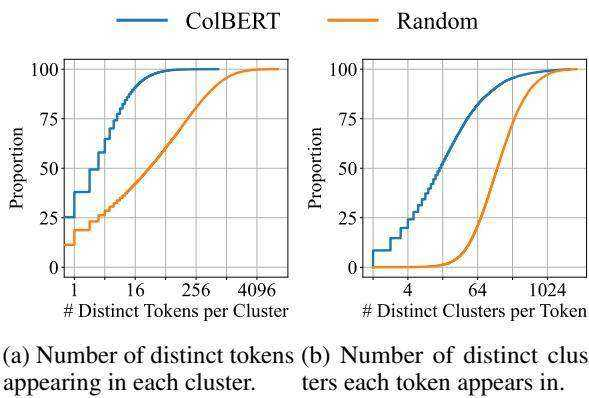

Stack Exchange Data Dump.

Liefu Ai, Junqing Yu, Zebin Wu, Yunfeng He, and Tao Guan. 2017. Optimized Residual Vector Quantization for Efficient Approximate Nearest Neighbor Search. Multimedia Systems, 23(2):169–181.

Sören Auer, Christian Bizer, Georgi Kobilarov, Jens Lehmann, Richard Cyganiak, and Zachary Ives. 2007. DBpedia: A Nucleus for a Web of Open Data. In The semantic web, pages 722–735. Springer.

Christopher F Barnes, Syed A Rizvi, and Nasser M Nasrabadi. 1996. Advances in Residual Vector Quantization: A Review. IEEE transactions on image processing, 5(2):226–262.

Alexander Bondarenko, Maik Fröbe, Meriem Beloucif, Lukas Gienapp, Yamen Ajjour, Alexander Panchenko, Chris Biemann, Benno Stein, Henning Wachsmuth, Martin Potthast, et al. 2020. Overview of touché 2020: Argument Retrieval. In International Conference of the Cross-Language Evaluation Forum for European Languages, pages 384– 395. Springer.

Sebastian Borgeaud, Arthur Mensch, Jordan Hoffmann, Trevor Cai, Eliza Rutherford, Katie Millican, George van den Driessche, Jean-Baptiste Lespiau, Bogdan Damoc, Aidan Clark, et al. 2021. Improving language models by retrieving from trillions of tokens. arXiv preprint arXiv:2112.04426.

Vera Boteva, Demian Gholipour, Artem Sokolov, and Stefan Riezler. 2016. A Full-text Learning to Rank Dataset for Medical Information Retrieval. In European Conference on Information Retrieval, pages 716–722. Springer.

Chia-Yu Chen, Jungwook Choi, Daniel Brand, Ankur Agrawal, Wei Zhang, and Kailash Gopalakrishnan. 2018. Adacomp : Adaptive residual gradient compression for data-parallel distributed training. In Proceedings of the Thirty-Second AAAI Conference on Artificial Intelligence, (AAAI-18), the 30th innovative Applications of Artificial Intelligence (IAAI-18), and the 8th AAAI Symposium on Educational Advances in Artificial Intelligence (EAAI-18), New Orleans, Louisiana, USA, February 2-7, 2018, pages 2827–2835. AAAI Press.

Arman Cohan, Sergey Feldman, Iz Beltagy, Doug Downey, and Daniel Weld. 2020. SPECTER: Document-level representation learning using citation-informed transformers. In Proceedings of the 58th Annual Meeting of the Association for Computational Linguistics, pages 2270–2282, Online. Association for Computational Linguistics.

Nachshon Cohen, Amit Portnoy, Besnik Fetahu, and Amir Ingber. 2021. SDR: Efficient Neural Reranking using Succinct Document Representation. arXiv preprint arXiv:2110.02065.

Zhuyun Dai and Jamie Callan. 2020. Context-aware term weighting for first stage passage retrieval. In Proceedings of the 43rd International ACM SIGIR conference on research and development in Information Retrieval, SIGIR 2020, Virtual Event, China, July 25-30, 2020, pages 1533–1536. ACM.

Jacob Devlin, Ming-Wei Chang, Kenton Lee, and Kristina Toutanova. 2019. BERT: Pre-training of deep bidirectional transformers for language understanding. In Proceedings of the 2019 Conference of the North American Chapter of the Association for Computational Linguistics: Human Language Technologies, Volume 1 (Long and Short Papers), pages 4171–4186, Minneapolis, Minnesota. Association for Computational Linguistics.

Thomas Diggelmann, Jordan Boyd-Graber, Jannis Bulian, Massimiliano Ciaramita, and Markus Leippold. 2020. CLIMATE-FEVER: A Dataset for Verification of Real-World Climate Claims. arXiv preprint arXiv:2012.00614.

Thibault Formal, Carlos Lassance, Benjamin Piwowarski, and Stéphane Clinchant. 2021a. SPLADE v2: Sparse Lexical and Expansion Model for Information Retrieval. arXiv preprint arXiv:2109.10086.

Thibault Formal, Benjamin Piwowarski, and Stéphane Clinchant. 2021b. SPLADE: Sparse Lexical and Expansion Model for First Stage Ranking. In Proceedings of the 44th International ACM SIGIR Conference on Research and Development in Information Retrieval, pages 2288–2292.

Luyu Gao and Jamie Callan. 2021. Unsupervised corpus aware language model pre-training for dense passage retrieval. arXiv preprint arXiv:2108.05540.

Luyu Gao, Zhuyun Dai, and Jamie Callan. 2020. Modularized transfomer-based ranking framework. In Proceedings of the 2020 Conference on Empirical Methods in Natural Language Processing (EMNLP), pages 4180–4190, Online. Association for Computational Linguistics.

Luyu Gao, Zhuyun Dai, and Jamie Callan. 2021. COIL: Revisit exact lexical match in information retrieval with contextualized inverted list. In Proceedings of the 2021 Conference of the North American Chapter of the Association for Computational Linguistics: Human Language Technologies, pages 3030–3042, Online. Association for Computational Linguistics.

Robert Gray. 1984. Vector quantization. IEEE Assp Magazine, 1(2):4–29.

Kelvin Guu, Kenton Lee, Zora Tung, Panupong Pasupat, and Ming-Wei Chang. 2020. Realm: Retrievalaugmented language model pre-training. arXiv preprint arXiv:2002.08909.

Sebastian Hofstätter, Sophia Althammer, Michael Schröder, Mete Sertkan, and Allan Hanbury. 2020. Improving Efficient Neural Ranking Models with Cross-Architecture Knowledge Distillation. arXiv preprint arXiv:2010.02666.

Sebastian Hofstätter, Sheng-Chieh Lin, Jheng-Hong Yang, Jimmy Lin, and Allan Hanbury. 2021. Efficiently Teaching an Effective Dense Retriever with Balanced Topic Aware Sampling. arXiv preprint arXiv:2104.06967.

Samuel Humeau, Kurt Shuster, Marie-Anne Lachaux, and Jason Weston. 2020. Poly-encoders: Architectures and pre-training strategies for fast and accurate multi-sentence scoring. In 8th International Conference on Learning Representations, ICLR 2020, Addis Ababa, Ethiopia, April 26-30, 2020. OpenReview.net.

Gautier Izacard, Fabio Petroni, Lucas Hosseini, Nicola De Cao, Sebastian Riedel, and Edouard Grave. 2020. A memory efficient baseline for open domain question answering. arXiv preprint arXiv:2012.15156.

Herve Jegou, Matthijs Douze, and Cordelia Schmid. 2010. Product quantization for nearest neighbor search. IEEE transactions on pattern analysis and machine intelligence, 33(1):117–128.

Yichen Jiang, Shikha Bordia, Zheng Zhong, Charles Dognin, Maneesh Singh, and Mohit Bansal. 2020. HoVer: A dataset for many-hop fact extraction and claim verification. In Findings of the Association for Computational Linguistics: EMNLP 2020, pages 3441–3460, Online. Association for Computational Linguistics.

Jeff Johnson, Matthijs Douze, and Hervé Jégou. 2019. Billion-scale similarity search with gpus. IEEE Transactions on Big Data.

Mandar Joshi, Eunsol Choi, Daniel Weld, and Luke Zettlemoyer. 2017. TriviaQA: A large scale distantly supervised challenge dataset for reading comprehension. In Proceedings of the 55th Annual Meeting of the Association for Computational Linguistics (Volume 1: Long Papers), pages 1601–1611, Vancouver, Canada. Association for Computational Linguistics.

Vladimir Karpukhin, Barlas Oguz, Sewon Min, Patrick Lewis, Ledell Wu, Sergey Edunov, Danqi Chen, and Wen-tau Yih. 2020. Dense passage retrieval for open-domain question answering. In Proceedings of the 2020 Conference on Empirical Methods in Natural Language Processing (EMNLP), pages 6769– 6781, Online. Association for Computational Linguistics.

Daniel Khashabi, Amos Ng, Tushar Khot, Ashish Sabharwal, Hannaneh Hajishirzi, and Chris Callison-Burch. 2021. GooAQ: Open Question Answering with Diverse Answer Types. arXiv preprint arXiv:2104.08727.

Omar Khattab, Christopher Potts, and Matei Zaharia. 2021a. Baleen: Robust Multi-Hop Reasoning at Scale via Condensed Retrieval. In Thirty-Fifth Conference on Neural Information Processing Systems.

Omar Khattab, Christopher Potts, and Matei Zaharia. 2021b. Relevance-guided supervision for openqa with ColBERT. Transactions of the Association for Computational Linguistics, 9:929–944.

Omar Khattab and Matei Zaharia. 2020. Colbert: Efficient and effective passage search via contextualized late interaction over BERT. In Proceedings of the 43rd International ACM SIGIR conference on research and development in Information Retrieval, SI-GIR 2020, Virtual Event, China, July 25-30, 2020, pages 39–48. ACM.

Tom Kwiatkowski, Jennimaria Palomaki, Olivia Redfield, Michael Collins, Ankur Parikh, Chris Alberti, Danielle Epstein, Illia Polosukhin, Jacob Devlin, Kenton Lee, Kristina Toutanova, Llion Jones, Matthew Kelcey, Ming-Wei Chang, Andrew M. Dai, Jakob Uszkoreit, Quoc Le, and Slav Petrov. 2019. Natural questions: A benchmark for question answering research. Transactions of the Association for Computational Linguistics, 7:452–466.

Jinhyuk Lee, Mujeen Sung, Jaewoo Kang, and Danqi Chen. 2021a. Learning dense representations of phrases at scale. In Proceedings of the 59th Annual Meeting of the Association for Computational Linguistics and the 11th International Joint Conference on Natural Language Processing (Volume 1: Long Papers), pages 6634–6647, Online. Association for Computational Linguistics.

Jinhyuk Lee, Alexander Wettig, and Danqi Chen. 2021b. Phrase retrieval learns passage retrieval, too. arXiv preprint arXiv:2109.08133.

Kenton Lee, Ming-Wei Chang, and Kristina Toutanova. 2019. Latent retrieval for weakly supervised open domain question answering. In Proceedings of the 57th Annual Meeting of the Association for Computational Linguistics, pages 6086–6096, Florence, Italy. Association for Computational Linguistics.

Yue Li, Wenrui Ding, Chunlei Liu, Baochang Zhang, and Guodong Guo. 2021a. TRQ: Ternary Neural Networks With Residual Quantization. In Proceedings of the AAAI Conference on Artificial Intelligence, volume 35, pages 8538–8546.

Zefan Li, Bingbing Ni, Teng Li, Xiaokang Yang, Wenjun Zhang, and Wen Gao. 2021b. Residual Quantization for Low Bit-width Neural Networks. IEEE Transactions on Multimedia.

Jimmy Lin and Xueguang Ma. 2021. A Few Brief Notes on DeepImpact, COIL, and a Conceptual Framework for Information Retrieval Techniques. arXiv preprint arXiv:2106.14807.

Sheng-Chieh Lin, Jheng-Hong Yang, and Jimmy Lin. 2020. Distilling Dense Representations for Ranking using Tightly-Coupled Teachers. arXiv preprint arXiv:2010.11386.

Xiaorui Liu, Yao Li, Jiliang Tang, and Ming Yan. 2020. A double residual compression algorithm for efficient distributed learning. In The 23rd International Conference on Artificial Intelligence and Statistics, AISTATS 2020, 26-28 August 2020, Online [Palermo, Sicily, Italy], volume 108 of Proceedings of Machine Learning Research, pages 133–143. PMLR.

Yi Luan, Jacob Eisenstein, Kristina Toutanova, and Michael Collins. 2021. Sparse, Dense, and Attentional Representations for Text Retrieval. Transactions of the Association for Computational Linguistics, 9:329–345.

Sean MacAvaney, Franco Maria Nardini, Raffaele Perego, Nicola Tonellotto, Nazli Goharian, and Ophir Frieder. 2020. Efficient document re-ranking for transformers by precomputing term representations. In Proceedings of the 43rd International ACM SIGIR conference on research and development in Information Retrieval, SIGIR 2020, Virtual Event, China, July 25-30, 2020, pages 49–58. ACM.

Craig Macdonald and Nicola Tonellotto. 2021. On approximate nearest neighbour selection for multistage dense retrieval. In Proceedings of the 30th ACM International Conference on Information & Knowledge Management, pages 3318–3322.

Macedo Maia, Siegfried Handschuh, André Freitas, Brian Davis, Ross McDermott, Manel Zarrouk, and Alexandra Balahur. 2018. WWW’18 Open Challenge: Financial Opinion Mining and Question Answering. In Companion Proceedings of the The Web Conference 2018, pages 1941–1942.

Antonio Mallia, Omar Khattab, Torsten Suel, and Nicola Tonellotto. 2021. Learning passage impacts for inverted indexes. In Proceedings of the 44th International ACM SIGIR Conference on Research and Development in Information Retrieval, pages 1723–1727.

Aditya Krishna Menon, Sadeep Jayasumana, Seungyeon Kim, Ankit Singh Rawat, Sashank J. Reddi, and Sanjiv Kumar. 2022. In defense of dualencoders for neural ranking.

Tri Nguyen, Mir Rosenberg, Xia Song, Jianfeng Gao, Saurabh Tiwary, Rangan Majumder, and Li Deng. 2016. MS MARCO: A human-generated MAchine reading COmprehension dataset. arXiv preprint arXiv:1611.09268.

Rodrigo Nogueira and Kyunghyun Cho. 2019. Passage Re-ranking with BERT. arXiv preprint arXiv:1901.04085.

Barlas Oguz, Kushal Lakhotia, Anchit Gupta, Patrick ˘ Lewis, Vladimir Karpukhin, Aleksandra Piktus, Xilun Chen, Sebastian Riedel, Wen-tau Yih, Sonal Gupta, et al. 2021. Domain-matched Pre-training Tasks for Dense Retrieval. arXiv preprint arXiv:2107.13602.

Ashwin Paranjape, Omar Khattab, Christopher Potts, Matei Zaharia, and Christopher D Manning. 2022. Hindsight: Posterior-guided training of retrievers for improved open-ended generation. In International Conference on Learning Representations.

Yingqi Qu, Yuchen Ding, Jing Liu, Kai Liu, Ruiyang Ren, Wayne Xin Zhao, Daxiang Dong, Hua Wu, and Haifeng Wang. 2021. RocketQA: An optimized training approach to dense passage retrieval for open-domain question answering. In Proceedings of the 2021 Conference of the North American Chapter of the Association for Computational Linguistics: Human Language Technologies, pages 5835–5847, Online. Association for Computational Linguistics.

Pranav Rajpurkar, Jian Zhang, Konstantin Lopyrev, and Percy Liang. 2016. SQuAD: $^ { 1 0 0 , 0 0 0 + }$ questions for machine comprehension of text. In Proceedings of the 2016 Conference on Empirical Methods in Natural Language Processing, pages 2383–2392, Austin, Texas. Association for Computational Linguistics.

Ruiyang Ren, Shangwen Lv, Yingqi Qu, Jing Liu, Wayne Xin Zhao, QiaoQiao She, Hua Wu, Haifeng Wang, and Ji-Rong Wen. 2021a. PAIR: Leveraging passage-centric similarity relation for improving dense passage retrieval. In Findings of the Association for Computational Linguistics: ACL-IJCNLP 2021, pages 2173–2183, Online. Association for Computational Linguistics.

Ruiyang Ren, Yingqi Qu, Jing Liu, Wayne Xin Zhao, Qiaoqiao She, Hua Wu, Haifeng Wang, and Ji-Rong Wen. 2021b. RocketQAv2: A Joint Training Method for Dense Passage Retrieval and Passage Reranking. arXiv preprint arXiv:2110.07367.

Stephen E Robertson, Steve Walker, Susan Jones, Micheline M Hancock-Beaulieu, Mike Gatford, et al. 1995. Okapi at TREC-3. NIST Special Publication.

Nandan Thakur, Nils Reimers, Andreas Rücklé, Abhishek Srivastava, and Iryna Gurevych. 2021. BEIR: A Heterogenous Benchmark for Zero-shot Evaluation of Information Retrieval Models. arXiv preprint arXiv:2104.08663.

James Thorne, Andreas Vlachos, Christos Christodoulopoulos, and Arpit Mittal. 2018. FEVER: a large-scale dataset for fact extraction and VERification. In Proceedings of the 2018 Conference of the North American Chapter of the Association for Computational Linguistics: Human Language Technologies, Volume 1 (Long Papers), pages 809–819, New Orleans, Louisiana. Association for Computational Linguistics.

Ellen Voorhees, Tasmeer Alam, Steven Bedrick, Dina Demner-Fushman, William R Hersh, Kyle Lo, Kirk Roberts, Ian Soboroff, and Lucy Lu Wang. 2021. TREC-COVID: Constructing a Pandemic Information Retrieval Test Collection. In ACM SIGIR Forum, volume 54, pages 1–12. ACM New York, NY, USA.

Henning Wachsmuth, Shahbaz Syed, and Benno Stein. 2018. Retrieval of the best counterargument without prior topic knowledge. In Proceedings of the 56th Annual Meeting of the Association for Computational Linguistics (Volume 1: Long Papers), pages 241–251, Melbourne, Australia. Association for Computational Linguistics.

David Wadden, Shanchuan Lin, Kyle Lo, Lucy Lu Wang, Madeleine van Zuylen, Arman Cohan, and Hannaneh Hajishirzi. 2020. Fact or fiction: Verifying scientific claims. In Proceedings of the 2020 Conference on Empirical Methods in Natural Language Processing (EMNLP), pages 7534–7550, Online. Association for Computational Linguistics.

Wenhui Wang, Furu Wei, Li Dong, Hangbo Bao, Nan Yang, and Ming Zhou. 2020. MiniLM: Deep Self-Attention Distillation for Task-Agnostic Compression of Pre-Trained Transformers. arXiv preprint arXiv:2002.10957.

Benchang Wei, Tao Guan, and Junqing Yu. 2014. Projected Residual Vector Quantization for ANN Search. IEEE multimedia, 21(3):41–51.

Thomas Wolf, Lysandre Debut, Victor Sanh, Julien Chaumond, Clement Delangue, Anthony Moi, Pierric Cistac, Tim Rault, Remi Louf, Morgan Funtowicz, Joe Davison, Sam Shleifer, Patrick von Platen, Clara Ma, Yacine Jernite, Julien Plu, Canwen Xu, Teven Le Scao, Sylvain Gugger, Mariama Drame, Quentin Lhoest, and Alexander Rush. 2020. Transformers: State-of-the-art natural language processing. In Proceedings of the 2020 Conference on Empirical Methods in Natural Language Processing: System Demonstrations, pages 38–45, Online. Association for Computational Linguistics.

Ji Xin, Chenyan Xiong, Ashwin Srinivasan, Ankita Sharma, Damien Jose, and Paul N Bennett. 2021. Zero-Shot Dense Retrieval with Momentum Adversarial Domain Invariant Representations. arXiv preprint arXiv:2110.07581.

Lee Xiong, Chenyan Xiong, Ye Li, Kwok-Fung Tang, Jialin Liu, Paul N Bennett, Junaid Ahmed, and Arnold Overwijk. 2020. Approximate Nearest Neighbor Negative Contrastive Learning for Dense Text Retrieval. In International Conference on Learning Representations.

Ikuya Yamada, Akari Asai, and Hannaneh Hajishirzi. 2021a. Efficient passage retrieval with hashing for open-domain question answering. In Proceedings of the 59th Annual Meeting of the Association for Computational Linguistics and the 11th International

Joint Conference on Natural Language Processing (Volume 2: Short Papers), pages 979–986, Online. Association for Computational Linguistics.

Ikuya Yamada, Akari Asai, and Hannaneh Hajishirzi. 2021b. Efficient passage retrieval with hashing for open-domain question answering. In Proceedings of the 59th Annual Meeting of the Association for Computational Linguistics and the 11th International Joint Conference on Natural Language Processing (Volume 2: Short Papers), pages 979–986, Online. Association for Computational Linguistics.

Peilin Yang, Hui Fang, and Jimmy Lin. 2018a. Anserini: Reproducible ranking baselines using lucene. Journal of Data and Information Quality (JDIQ), 10(4):1–20.

Zhilin Yang, Peng Qi, Saizheng Zhang, Yoshua Bengio, William Cohen, Ruslan Salakhutdinov, and Christopher D. Manning. 2018b. HotpotQA: A dataset for diverse, explainable multi-hop question answering. In Proceedings of the 2018 Conference on Empirical Methods in Natural Language Processing, pages 2369–2380, Brussels, Belgium. Association for Computational Linguistics.

Jingtao Zhan, Jiaxin Mao, Yiqun Liu, Jiafeng Guo, Min Zhang, and Shaoping Ma. 2021a. Jointly Optimizing Query Encoder and Product Quantization to Improve Retrieval Performance. In Proceedings of the 30th ACM International Conference on Information & Knowledge Management, pages 2487–2496.

Jingtao Zhan, Jiaxin Mao, Yiqun Liu, Jiafeng Guo, Min Zhang, and Shaoping Ma. 2021b. Optimizing Dense Retrieval Model Training with Hard Negatives. In Proceedings of the 44th International ACM SIGIR Conference on Research and Development in Information Retrieval, pages 1503–1512.

Jingtao Zhan, Jiaxin Mao, Yiqun Liu, Jiafeng Guo, Min Zhang, and Shaoping Ma. 2022. Learning discrete representations via constrained clustering for effective and efficient dense retrieval. In Proceedings of the Fifteenth ACM International Conference on Web Search and Data Mining, WSDM ’22, page 1328–1336. Association for Computing Machinery.

Jingtao Zhan, Jiaxin Mao, Yiqun Liu, Min Zhang, and Shaoping Ma. 2020a. Learning to retrieve: How to train a dense retrieval model effectively and efficiently. arXiv preprint arXiv:2010.10469.

Jingtao Zhan, Jiaxin Mao, Yiqun Liu, Min Zhang, and Shaoping Ma. 2020b. Repbert: Contextualized text embeddings for first-stage retrieval. arXiv preprint arXiv:2006.15498.

Giulio Zhou and Jacob Devlin. 2021. Multi-vector attention models for deep re-ranking. In Proceedings of the 2021 Conference on Empirical Methods in Natural Language Processing, pages 5452–5456, Online and Punta Cana, Dominican Republic. Association for Computational Linguistics.

  
Figure 2: Empirical CDFs analyzing semantic properties of MS MARCO token-level embeddings both encoded by ColBERT and randomly generated. The embeddings are partitioned into $2 ^ { 1 8 }$ clusters and correspond to roughly 27,000 distinct tokens.