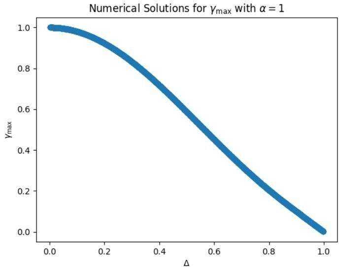

[1] Alexandr Andoni and Piotr Indyk. Near-optimal hashing algorithms for approximate nearest neighbor in high dimensions. Communications of the ACM, 51(1):117–122, 2008.   
[2] Alexandr Andoni, Piotr Indyk, Thijs Laarhoven, Ilya Razenshteyn, and Ludwig Schmidt. Practical and optimal lsh for angular distance. Advances in neural information processing systems, 28, 2015.   
[3] Alexandr Andoni, Piotr Indyk, Huy L Nguyen, and Ilya Razenshteyn. Beyond locality-sensitive hashing. In Proceedings of the twenty-fifth annual ACM-SIAM symposium on Discrete algorithms, pages 1018–1028. SIAM, 2014.   
[4] Alexandr Andoni and Ilya Razenshteyn. Optimal data-dependent hashing for approximate near neighbors. In Proceedings of the forty-seventh annual ACM symposium on Theory of computing, pages 793–801, 2015.   
[5] Ioannis Arapakis, Souneil Park, and Martin Pielot. Impact of response latency on user behaviour in mobile web search. In Proceedings of the 2021 Conference on Human Information Interaction and Retrieval, pages 279–283, 2021.   
[6] A. Broder. On the resemblance and containment of documents. In Proceedings of the Compression and Complexity of Sequences 1997, SEQUENCES ’97, page 21, USA, 1997. IEEE Computer Society.   
[7] J Lawrence Carter and Mark N Wegman. Universal classes of hash functions. In Proceedings of the ninth annual ACM symposium on Theory of computing, pages 106–112, 1977.   
[8] Moses S. Charikar. Similarity estimation techniques from rounding algorithms. In Proceedings of the Thiry-Fourth Annual ACM Symposium on Theory of Computing, STOC ’02, page 380–388, New York, NY, USA, 2002. Association for Computing Machinery.   
[9] Benjamin Coleman, Richard Baraniuk, and Anshumali Shrivastava. Sub-linear memory sketches for near neighbor search on streaming data. In International Conference on Machine Learning, pages 2089–2099. PMLR, 2020.   
[10] Benjamin Coleman and Anshumali Shrivastava. Sub-linear race sketches for approximate kernel density estimation on streaming data. In Proceedings of The Web Conference 2020, pages 1739–1749, 2020.   
[11] Mayur Datar, Nicole Immorlica, Piotr Indyk, and Vahab S. Mirrokni. Locality-sensitive hashing scheme based on p-stable distributions. In Proceedings of the Twentieth Annual Symposium on Computational Geometry, SCG ’04, page 253–262, New York, NY, USA, 2004. Association for Computing Machinery.   
[12] Yihe Dong, Piotr Indyk, Ilya Razenshteyn, and Tal Wagner. Learning space partitions for nearest neighbor search. arXiv preprint arXiv:1901.08544, 2019.   
[13] Joshua Engels, Benjamin Coleman, and Anshumali Shrivastava. Practical near neighbor search via group testing. Advances in Neural Information Processing Systems, 34:9950–9962, 2021.   
[14] Ruiqi Guo, Philip Sun, Erik Lindgren, Quan Geng, David Simcha, Felix Chern, and Sanjiv Kumar. Accelerating large-scale inference with anisotropic vector quantization. In International Conference on Machine Learning, pages 3887–3896. PMLR, 2020.   
[15] Jui-Ting Huang, Ashish Sharma, Shuying Sun, Li Xia, David Zhang, Philip Pronin, Janani Padmanabhan, Giuseppe Ottaviano, and Linjun Yang. Embedding-based retrieval in facebook search. In Proceedings of the 26th ACM SIGKDD International Conference on Knowledge Discovery & Data Mining, pages 2553–2561, 2020.   
[16] Po-Sen Huang, Xiaodong He, Jianfeng Gao, Li Deng, Alex Acero, and Larry Heck. Learning deep structured semantic models for web search using clickthrough data. In Proceedings of the 22nd ACM international conference on Information & Knowledge Management, pages 2333–2338, 2013.   
[17] Piotr Indyk and Rajeev Motwani. Approximate nearest neighbors: Towards removing the curse of dimensionality. In Proceedings of the Thirtieth Annual ACM Symposium on Theory of Computing, STOC ’98, page 604–613, New York, NY, USA, 1998. Association for Computing Machinery.   
[18] Masajiro Iwasaki and Daisuke Miyazaki. Optimization of indexing based on k-nearest neighbor graph for proximity search in high-dimensional data. arXiv preprint arXiv:1810.07355, 2018.   
[19] Herve Jegou, Matthijs Douze, and Cordelia Schmid. Product quantization for nearest neighbor search. IEEE transactions on pattern analysis and machine intelligence, 33(1):117–128, 2010.   
[20] Jianqiu Ji, Jianmin Li, Shuicheng Yan, Bo Zhang, and Qi Tian. Super-bit locality-sensitive hashing. Advances in neural information processing systems, 25, 2012.   
[21] Jeff Johnson, Matthijs Douze, and Hervé Jégou. Billion-scale similarity search with gpus. IEEE Transactions on Big Data, 7(3):535–547, 2019.   
[22] Manpreet Kaur and Shivani Kang. Market basket analysis: Identify the changing trends of market data using association rule mining. Procedia computer science, 85:78–85, 2016.   
[23] Omar Khattab and Matei Zaharia. Colbert: Efficient and effective passage search via contextualized late interaction over bert. In Proceedings of the 43rd International ACM SIGIR conference on research and development in Information Retrieval, pages 39–48, 2020.   
[24] Runze Lei, Pinghui Wang, Rundong Li, Peng Jia, Junzhou Zhao, Xiaohong Guan, and Chao Deng. Fast rotation kernel density estimation over data streams. In Proceedings of the 27th ACM SIGKDD Conference on Knowledge Discovery & Data Mining, pages 892–902, 2021.   
[25] Michael Leybovich and Oded Shmueli. Efficient approximate search for sets of vectors. arXiv preprint arXiv:2107.06817, 2021.   
[26] Sen Li, Fuyu Lv, Taiwei Jin, Guli Lin, Keping Yang, Xiaoyi Zeng, Xiao-Ming Wu, and Qianli Ma. Embedding-based product retrieval in taobao search. In Proceedings of the 27th ACM SIGKDD Conference on Knowledge Discovery & Data Mining, pages 3181–3189, 2021.   
[27] Chen Luo and Anshumali Shrivastava. Arrays of (locality-sensitive) count estimators (ace) anomaly detection on the edge. In Proceedings of the 2018 World Wide Web Conference, pages 1439–1448, 2018.   
[28] Yu A Malkov and Dmitry A Yashunin. Efficient and robust approximate nearest neighbor search using hierarchical navigable small world graphs. IEEE transactions on pattern analysis and machine intelligence, 42(4):824–836, 2018.   
[29] Gurmeet Singh Manku, Arvind Jain, and Anish Das Sarma. Detecting near-duplicates for web crawling. In Proceedings of the 16th international conference on World Wide Web, pages 141–150, 2007.   
[30] Christopher D Manning, Prabhakar Raghavan, and Hinrich Schütze. Introduction to information retrieval. Cambridge university press, 2008.   
[31] Nicholas Meisburger and Anshumali Shrivastava. Distributed tera-scale similarity search with mpi: Provably efficient similarity search over billions without a single distance computation. arXiv preprint arXiv:2008.03260, 2020.   
[32] Tri Nguyen, Mir Rosenberg, Xia Song, Jianfeng Gao, Saurabh Tiwary, Rangan Majumder, and Li Deng. Ms marco: A human generated machine reading comprehension dataset. In Workshop on Cognitive Computing at NIPS, 2016.   
[33] Priyanka Nigam, Yiwei Song, Vijai Mohan, Vihan Lakshman, Weitian Ding, Ankit Shingavi, Choon Hui Teo, Hao Gu, and Bing Yin. Semantic product search. In Proceedings of the 25th ACM SIGKDD International Conference on Knowledge Discovery & Data Mining, pages 2876–2885, 2019.   
[34] Steve Olenski. Why brands are fighting over milliseconds, Nov 2016.   
[35] Adam Paszke, Sam Gross, Francisco Massa, Adam Lerer, James Bradbury, Gregory Chanan, Trevor Killeen, Zeming Lin, Natalia Gimelshein, Luca Antiga, et al. Pytorch: An imperative style, high-performance deep learning library. Advances in neural information processing systems, 32, 2019.   
[36] Jeffrey Pennington, Richard Socher, and Christopher D. Manning. Glove: Global vectors for word representation. In Empirical Methods in Natural Language Processing (EMNLP), pages 1532–1543, 2014.   
[37] Keshav Santhanam, Omar Khattab, Christopher Potts, and Matei Zaharia. Plaid: An efficient engine for late interaction retrieval. arXiv preprint arXiv:2205.09707, 2022.   
[38] Keshav Santhanam, Omar Khattab, Jon Saad-Falcon, Christopher Potts, and Matei Zaharia. Colbertv2: Effective and efficient retrieval via lightweight late interaction. arXiv preprint arXiv:2112.01488, 2021.   
[39] Aneesh Sharma, C Seshadhri, and Ashish Goel. When hashes met wedges: A distributed algorithm for finding high similarity vectors. In Proceedings of the 26th International Conference on World Wide Web, pages 431–440, 2017.   
[40] Anshumali Shrivastava and Ping Li. Improved asymmetric locality sensitive hashing (alsh) for maximum inner product search (mips). In Proceedings of the Thirty-First Conference on Uncertainty in Artificial Intelligence, pages 812–821, 2015.   
[41] Yiqiu Wang, Anshumali Shrivastava, Jonathan Wang, and Junghee Ryu. Flash: Randomized algorithms accelerated over cpu-gpu for ultra-high dimensional similarity search. arXiv preprint arXiv:1709.01190, 2017.   
[42] Jun Yang, Yu-Gang Jiang, Alexander G Hauptmann, and Chong-Wah Ngo. Evaluating bagof-visual-words representations in scene classification. In Proceedings of the international workshop on Workshop on multimedia information retrieval, pages 197–206, 2007.   
[43] Rex Ying, Ruining He, Kaifeng Chen, Pong Eksombatchai, William L. Hamilton, and Jure Leskovec. Graph convolutional neural networks for web-scale recommender systems. CoRR, abs/1806.01973, 2018.

# A Proofs of Main Results

Lemma 4.1.1. If $\varphi ( x ) : \mathbb { R }  \mathbb { R }$ is $( \alpha , \beta )$ -maximal on an interval $I$ , then the following function $\begin{array} { r } { \sigma ( x ) : \mathbb { R } ^ { m }  \mathbb { R } i s ( \alpha , \frac { \beta } { m } ) } \end{array}$ -maximal on $U = I ^ { m }$ :

$$
\sigma ( \mathbf { x } ) = \frac { 1 } { m } \sum _ { i = 1 } ^ { m } \varphi ( x _ { i } )
$$

Proof. Take some $\mathbf { x } \in D$ (so each $x _ { i } \in I$ ). Since in $\mathbb { R }$ , $\operatorname* { m a x } ( x ) = x$ , we have from the definition of $( \alpha , \beta )$ -maximal that

$$
\beta x \leq x \leq \alpha x
$$

For the upper bound, we have

$$
\sigma ( \mathbf { x } ) = { \frac { 1 } { m } } \sum _ { i = 1 } ^ { m } \varphi ( x _ { i } ) \leq { \frac { 1 } { m } } \sum _ { i = 1 } ^ { m } \alpha x _ { i } = { \frac { \alpha } { m } } \sum _ { i = 1 } ^ { m } x _ { i } \leq { \frac { \alpha } { m } } { \big ( } m \operatorname* { m a x } ( \mathbf { x } ) { \big ) } = \alpha \operatorname* { m a x } ( \mathbf { x } )
$$

where the second inequality follows by the properties of the max function.

For the lower bound, we have that

$$
\sigma ( \mathbf { x } ) = \frac { 1 } { m } \sum _ { i = 1 } ^ { m } \varphi ( x _ { i } ) \geq \frac { 1 } { m } \sum _ { i = 1 } ^ { m } \beta x _ { i } = \frac { \beta } { m } \sum _ { i = 1 } ^ { m } x _ { i } \geq \frac { \beta } { m } \operatorname* { m a x } \mathbf { x }
$$

where the the second inequality again follows by the properties of the max function.

Lemma 4.1.2. Assume $\sigma$ is $( \alpha , \beta )$ -maximal. Let $0 < s _ { \mathrm { m a x } } < 1$ be the maximum similarity between a query vector and the vectors in the target set and let $\hat { \mathbf { s } }$ be the set of estimated similarity scores. Given a threshold $\alpha s _ { \mathrm { m a x } } < \tau < \alpha$ , we write $\Delta = \tau - \alpha s _ { \mathrm { m a x } }$ , and we have

$$
\mathrm { P r } [ \sigma ( \hat { \mathbf { s } } ) \geq \alpha s _ { \operatorname* { m a x } } + \Delta ] \leq m \gamma ^ { L }
$$

for $\begin{array} { r } { \gamma = \left( \frac { s _ { \mathrm { m a x } } \left( \alpha - \tau \right) } { \tau \left( 1 - s _ { \mathrm { m a x } } \right) } \right) ^ { \frac { \tau } { \alpha } } \left( \frac { \alpha \left( 1 - s _ { \mathrm { m a x } } \right) } { \alpha - \tau } \right) \in \left( s _ { \mathrm { m a x } } , 1 \right) } \end{array}$ . Furthermore, this expression for $\gamma$ is increasing in $s _ { \mathrm { m a x } }$ and decreasing in $\tau$ , and $\gamma$ has one sided limits $\begin{array} { r } { \operatorname* { l i m } _ { \tau } _ { \searrow \infty s _ { \mathrm { m a x } } } \gamma = 1 } \end{array}$ and $\begin{array} { r } { \operatorname* { l i m } _ { \tau \mathcal { I } _ { \alpha } } \gamma = s _ { \mathrm { m a x } } } \end{array}$ .

Proof. We first apply a generic Chernoff bound to $\sigma ( \hat { \mathbf { s } } )$ , which gives us the following bounds for any $t > 0$ :

$$
\operatorname* { P r } [ \sigma ( \hat { \mathbf { s } } ) \geq \tau ] = \operatorname* { P r } [ e ^ { t \sigma ( \hat { \mathbf { s } } ) } \geq e ^ { t \tau } ] \leq \frac { \mathbb { E } [ e ^ { t \sigma ( \hat { \mathbf { s } } ) } ] } { e ^ { t \tau } }
$$

We now proceed by continuing to bound the numerator. Because $\sigma$ is $( \alpha , \beta )$ -maximal, we can bound $\boldsymbol { \sigma } ( \hat { \mathbf { s } } )$ with $\alpha \mathrm { m a x } \hat { \mathbf { s } }$ . We can further bound max $\hat { \mathbf { s } }$ by bounding the maximum with the sum and the sum with $m$ times the maximal element. We are now left with the formula for the moment generating function for $\hat { s } _ { \mathrm { m a x } }$ . $\hat { s } _ { \mathrm { m a x } } \sim$ scaled binomial $L ^ { - 1 } B ( s _ { \mathrm { m a x } } , L )$ , so we can directly substitute the binomial moment generating function into the expression:

$$
\mathbb { E } [ e ^ { t \sigma ( \hat { \mathbf { s } } ) } ] \leq \mathbb { E } [ e ^ { t \alpha \operatorname* { m a x } _ { j } \hat { s } _ { j } } ] \leq \sum _ { j = 1 } ^ { m _ { i } } \mathbb { E } [ e ^ { t \alpha \hat { s } _ { j } } ] \leq m \mathbb { E } [ e ^ { t \alpha \hat { s } _ { \operatorname* { m a x } } } ]
$$

$$
= m ( 1 - s _ { \operatorname* { m a x } } + s _ { \operatorname* { m a x } } e ^ { \frac { \alpha t } { L } } ) ^ { L }
$$

Combining these two equations yields the following bound:

$$
\operatorname* { P r } [ \sigma ( \hat { \mathbf { s } } ) \geq \tau ] \leq m e ^ { - t \tau } ( 1 - s _ { \operatorname* { m a x } } + s _ { \operatorname* { m a x } } e ^ { \frac { \alpha t } { L } } ) ^ { L }
$$

We wish to select a value of $t$ to minimize the upper bound. By setting the derivative of the upper bound to zero, and imposing $0 < \tau < \alpha$ , $\alpha \geq 1$ , and $0 < s _ { m a x } < 1$ , we find that

$$
t ^ { \star } = \frac { L } { \alpha } \ln \left( \frac { \tau ( 1 - s _ { \operatorname* { m a x } } ) } { s _ { \operatorname* { m a x } } ( \alpha - \tau ) } \right)
$$

This is greater than zero when the numerator inside the ln is greater than the denominator, or equivalently when $\tau > s _ { \mathrm { m a x } } \alpha$ . Thus the valid range for $\tau$ is $( s _ { \operatorname* { m a x } } \alpha , \alpha )$ (and similarly the valid range for $s _ { \mathrm { m a x } }$ is $( 0 , \tau / \alpha ) )$ ). These bounds have a natural interpretation: to be meaningful, the threshold must be between the expected value and the maximum value for $\alpha$ times a $p = s _ { \mathrm { m a x } }$ binomial. Substituting $t = t ^ { \star }$ into our upper bound, we obtain:

$$
\operatorname* { P r } [ \sigma ( \hat { \mathbf { s } } ) \geq \tau ] \leq m \left( \left( \frac { \tau ( 1 - s _ { \operatorname* { m a x } } ) } { s _ { \operatorname* { m a x } } ( \alpha - \tau ) } \right) ^ { - \frac { \tau } { \alpha } } \left( \frac { \alpha ( 1 - s _ { \operatorname* { m a x } } ) } { \alpha - \tau } \right) \right) ^ { L }
$$

Thus we have that

$$
\gamma = \left( \frac { s _ { \mathrm { m a x } } ( \alpha - \tau ) } { \tau ( 1 - s _ { \mathrm { m a x } } ) } \right) ^ { \frac { \tau } { \alpha } } \left( \frac { \alpha ( 1 - s _ { \mathrm { m a x } } ) } { \alpha - \tau } \right)
$$

We will now prove our claims about $\gamma$ viewed as a function of $s _ { \mathrm { m a x } } \in ( 0 , \tau / \alpha )$ and $\tau \in ( s _ { \operatorname* { m a x } } \alpha , \alpha )$ . We will first examine the limits of $\gamma$ with respect to $\tau$ at the ends of its range. Since $\gamma$ is continuous, we can find one of the limits by direct substitution:

$$
\operatorname* { l i m } _ { \tau \searrow \times \dots \alpha } \gamma = \operatorname* { l i m } _ { s _ { \mathrm { m a x } } , \lambda _ { \tau / \alpha } } \gamma = \left( { \frac { \tau / \alpha ( \alpha - \tau ) } { \tau ( 1 - \tau / \alpha ) } } \right) ^ { \frac { \tau } { \alpha } } \left( { \frac { \alpha ( 1 - \tau / \alpha ) } { \alpha - \tau } } \right) = 1 ^ { \frac { \tau } { \alpha } } * 1 = 1
$$

The second limit is harder; we merge $\gamma$ into one exponent and then simplify:

$$
\begin{array} { l } { \displaystyle \operatorname* { l i m } _ { \tau \nearrow \alpha } \gamma = \operatorname* { l i m } _ { \tau \nearrow \alpha } \left( \frac { s _ { \operatorname* { m a x } } ( \alpha - \tau ) ^ { 1 - \alpha } \tau \alpha ^ { \alpha / \tau } } { \tau ( 1 - s _ { \operatorname* { m a x } } ) ^ { 1 - \alpha / \tau } } \right) ^ { \frac { \alpha } { \alpha } } } \\ { = \operatorname* { l i m } _ { \tau \nearrow \alpha } \frac { s _ { \operatorname* { m a x } } ( \alpha - \tau ) ^ { 1 - \alpha } \tau \alpha ^ { \alpha / \tau } } { \tau ( 1 - s _ { \operatorname* { m a x } } ) ^ { 1 - \alpha / \tau } } } \\ { = \operatorname* { l i m } _ { \tau \nearrow \alpha } s _ { \operatorname* { m a x } } ( \alpha - \tau ) ^ { 1 - \alpha / \tau } = \operatorname* { l i m } _ { \tau \nearrow \alpha } \left( s _ { \operatorname* { m a x } } ( \alpha - \tau ) ^ { \alpha - \tau } \right) ^ { - 1 / \tau } } \\ { = s _ { \operatorname* { m a x } } \left( \frac { \operatorname* { l i m } } { \alpha - \tau \searrow 0 } \left( ( \alpha - \tau ) ^ { \alpha - \tau } \right) \right) ^ { - 1 / \alpha } } \\ { = s _ { \operatorname* { m a x } } ( 1 ) ^ { - 1 / \alpha } = s _ { \operatorname* { m a x } } } \end{array}
$$

where we use the fact that $\begin{array} { r } { \operatorname* { l i m } _ { x \searrow 0 } x ^ { x } = e ^ { \ln _ { x } } \searrow \ln ( x ) = 1 } \end{array}$ (we can see that $\begin{array} { r l } { { \operatorname* { l i m } } _ { x \to 0 } x \ln ( x ) = } \end{array}$ $\mathrm { l i m } _ { x  0 } \mathrm { l n } ( x ) / ( 1 / x ) = 0$ with L’Hopital’s rule). We next find the partial derivatives of $\gamma$ :

$$
\frac { \delta \gamma } { \tilde { s } _ { \mathrm { m a x } } } = \frac { \left( \tau - \alpha s _ { \mathrm { m a x } } \right) \left( \frac { \alpha s _ { \mathrm { m a x } } - s _ { \mathrm { m a x } } \tau } { \tau - s _ { \mathrm { m a x } } \tau } \right) ^ { \frac { \alpha } { \alpha } } } { s _ { \mathrm { m a x } } \left( \alpha - \tau \right) } \qquad \frac { \delta \gamma } { \delta \tau } = \frac { \left( s _ { \mathrm { m a x } } - 1 \right) \left( \frac { \alpha s _ { \mathrm { m a x } } - s _ { \mathrm { m a x } } \tau } { \tau - s _ { \mathrm { m a x } } \tau } \right) ^ { \frac { \alpha } { \alpha } } \ln { \left( \frac { \tau - s _ { \mathrm { m a x } } \tau } { \alpha s _ { \mathrm { m a x } } - s _ { \mathrm { m a x } } \tau } \right) } } { \alpha - \tau }
$$

We are interested in the signs of these partial derivatives. First examining δγδsmax , $\tau > \alpha s _ { \mathrm { m a x } } \implies$ $\tau - \alpha s _ { \mathrm { m a x } } > 0$ . Similarly, $\alpha > \tau \implies \alpha - \tau > 0$ and $s _ { \operatorname* { m a x } } ( \alpha - \tau ) = s _ { \operatorname* { m a x } } \alpha - s _ { \operatorname* { m a x } } \tau > 0 ,$ Finally, $s _ { \operatorname* { m a x } } < 1 \implies \tau ( 1 - s _ { \operatorname* { m a x } } ) = \tau - \tau s _ { \operatorname* { m a x } } > 0$ . Thus every term is positive and the entire fraction is positive. Next examining $\frac { \delta \gamma } { \delta \tau }$ , by similar logic $\alpha - \tau > 0$ and $\tau - s _ { \mathrm { m a x } } \tau > 0$ and $\alpha s _ { \mathrm { m a x } } - s _ { \mathrm { m a x } } \tau > 0$ . For the ln, since $\tau > \alpha s _ { \mathrm { m a x } }$ ${ \bf \Pi } _ { \mathrm { a x } } , \tau - s _ { \mathrm { m a x } } \tau > \alpha s _ { \mathrm { m a x } } - s _ { \mathrm { m a x } } \tau ,$ , so the numerator is greater than the denominator and the ln is positive. Finally, since $s _ { \operatorname* { m a x } } < 1$ , $s _ { \mathrm { m a x } } - 1 < 0$ , and thus the entire fraction has a single negative term in the product, so it is negative.

This completes our lemma: $\gamma$ is a strictly decreasing function of $\tau$ and a strictly increasing function of $s _ { \mathrm { m a x } }$ . Since $\tau$ is decreasing and has a leftward limit of 1 and a rightward limit of $s _ { \mathrm { m a x } }$ , all values for $\gamma$ are in $( s _ { \mathrm { m a x } } , 1 )$ .

First, we will make a substitution. We note that $\gamma$ is a strictly decreasing function on this interval of $\tau$ with range $( s _ { \mathrm { m a x } } , 1 )$ . To see this, we will first make the following change of variabls:

$$
\tau = \frac { \alpha ( k + s ) } { k + 1 }
$$

for $k \in ( 0 , \infty )$ . This parameterizes $\tau \in ( s _ { \operatorname* { m a x } } \alpha , \alpha )$ as a weighted sum of $s _ { \mathrm { m a x } } \alpha$ and $\alpha$ . Plugging in and simplifying, we have that

$$
\gamma = \left( \frac { s _ { \operatorname* { m a x } } } { k + s _ { \operatorname* { m a x } } } \right) ^ { \frac { k + s _ { \operatorname* { m a x } } } { k + 1 } } ( k + 1 )
$$

This is a continous function over $k \in ( 0 , \infty )$ and $s _ { \mathrm { m a x } } \in ( )$

Lemma 4.1.3. With the same assumptions as Lemma 4.1.2 and given $\Delta > 0$ , we have:

$$
P r [ \sigma ( \hat { \mathbf { s } } ) \leq \beta s _ { \operatorname* { m a x } } - \Delta ] \leq 2 e ^ { - 2 L \Delta ^ { 2 } / \beta ^ { 2 } }
$$

Proof. We will prove this lemma with a chain of inequalities, starting with $\mathrm { P r } [ \sigma ( \hat { \mathbf { s } } ) \leq \beta s _ { \mathrm { m a x } } - \Delta ]$ :

$$
\begin{array} { r l } & { \mathrm { P r } [ \sigma ( \hat { \mathbf { s } } ) \leq \beta s _ { \operatorname* { m a x } } - \Delta ] \leq \mathrm { P r } [ \beta \operatorname* { m a x } \hat { \mathbf { s } } \leq \beta s _ { \operatorname* { m a x } } - \Delta ] } \\ & { \qquad \leq \mathrm { P r } [ \beta s _ { \operatorname* { m a x } } \leq \beta s _ { \operatorname* { m a x } } - \Delta ] } \\ & { \qquad = \mathrm { P r } [ \beta s _ { \operatorname* { m a x } } - \beta s _ { \operatorname* { m a x } } \geq \Delta ] } \\ & { \qquad \leq \mathrm { P r } [ | \beta s _ { \operatorname* { m a x } } - \beta s _ { \operatorname* { m a x } } | \geq \Delta ] = \mathrm { P r } [ | \beta s _ { \operatorname* { m a x } } - \beta s _ { \operatorname* { m a x } } | \geq \Delta ] } \\ & { \qquad \leq 2 e ^ { - 2 L \Delta ^ { 2 } / \beta ^ { 2 } } } \end{array}
$$

The explanations for each step are as follows:

1. Because $\sigma ( { \hat { \mathbf { s } } } ) \geq \beta \operatorname* { m a x } \mathbf { s }$ , we can replace $\boldsymbol { \sigma } ( \hat { \mathbf { s } } )$ with $\beta$ max s and the probability will be strictly larger.

2. By the definition of the max operator, each individual ${ \hat { s } } _ { i } \leq \operatorname* { m a x } { \hat { \mathbf { s } } }$ , and in particular this is true for $s _ { \mathrm { m a x } } ^ { \mathrm { ~ \tiny ~ \wedge ~ } }$ (the estimated similarity for the ground-truth maximum similarity vector). Thus, we have $\beta s _ { \mathrm { m a x } } \le \beta \operatorname* { m a x } \hat { \mathbf { s } }$ , so we can again apply a replacement to get a further upper bound.

3. Rearranging.

5. $\hat { s } _ { \mathrm { m a x } }$ is the sum of $L$ Bernoulli trials with success probability $s _ { \mathrm { m a x } }$ and scaled by $\beta / L$ Thus, we can directly apply the Hoeffding ineuqliaty with $L$ trials with success probability $\frac { \beta s _ { \mathrm { m a x } } } { L }$

Theorem 4.2. Let $S ^ { \star }$ be the set with the maximum $F ( Q , S )$ and let $S _ { i }$ be any other set. Let $B ^ { \star }$ and $B _ { i }$ be the following sums (which are lower and upper bounds for $F ( Q , S ^ { \star } )$ and $F ( Q , S _ { i } )$ , respectively)

$$
B ^ { \star } = \frac { \beta } { m _ { q } } \sum _ { j = 1 } ^ { m _ { q } } w _ { j } s _ { \operatorname* { m a x } } ( q _ { j } , S ^ { \star } ) \qquad B _ { i } = \frac { \alpha } { m _ { q } } \sum _ { j = 1 } ^ { m _ { q } } w _ { j } s _ { \operatorname* { m a x } } ( q _ { j } , S _ { i } )
$$

Here, $s _ { \operatorname* { m a x } } ( \boldsymbol { q } , \boldsymbol { S } )$ is the maximum similarity between a query vector $q$ and any element of the target set $S$ . Let $B ^ { \prime }$ be the maximum value of $B _ { i }$ over any set $S _ { i } \neq S$ . Let $\Delta$ be the following value (proportional to the difference between the lower and upper bounds)

$$
\Delta = ( B ^ { \star } - B ^ { \prime } ) / 3
$$

If $\Delta > 0$ , a DESSERT structure with the following value $^ { 3 }$ of $L$ solves the search problem from Definition 1.1 with probability $1 - \delta$ .

$$
L = O \left( \log \left( { \frac { N m _ { q } m } { \delta } } \right) \right)
$$

Proof. For set $S ^ { \star }$ to have the highest estimated score $\hat { F } ( Q , S ^ { \star } )$ , we need all other sets to have lower scores. Our overall proof strategy will find a minimum $L$ that upper bounds the probability that each inner aggregation of a set $S \neq S ^ { * }$ is greater than $\Delta + \alpha s _ { i , \mathrm { { m a x } } } ^ { \prime }$ and a minimum $L$ that lower bounds the probability that the inner aggregation of $S ^ { * }$ is less $\beta s _ { j , \mathrm { m a x } } ^ { * } - \Delta$ . Finally, we will show that an $L$ that is a maximum of these two values solves the search problem.

Upper Bound: We start with the upper bound on $S _ { i } \neq S ^ { * }$ : we have from Lemma 4.1.2 that

$$
\mathrm { P r } [ \sigma ( \hat { \mathbf { s _ { i } } } , q _ { j } ) \geq \alpha s _ { i , \operatorname* { m a x } } + \Delta ] \leq m \gamma _ { i } ^ { L }
$$

with

$$
\gamma _ { i } = \left( \frac { ( \Delta + \alpha s _ { i , \mathrm { m a x } } ) ( 1 - s _ { i , \mathrm { m a x } } ) } { s _ { i , \mathrm { m a x } } ( \alpha - ( \Delta + \alpha s _ { i , \mathrm { m a x } } ) ) } \right) ^ { - \frac { \Delta + \alpha s _ { i , \mathrm { m a x } } } { \alpha } } \left( \frac { \alpha ( 1 - s _ { i , \mathrm { m a x } } ) } { \alpha - ( \Delta + \alpha s _ { i , \mathrm { m a x } } ) } \right)
$$

and $\gamma _ { i } \in ( 0 , 1 )$ . To make our analysis simpler, we are interested in the maximum $\gamma _ { \mathrm { m a x } }$ of all these $\gamma _ { i }$ as a function of $\Delta$ , since then all of these bounds will hold with the same $\gamma$ , making it easy to solve for $L$ . Since $\begin{array} { r } { \operatorname* { l i m } _ { s _ { \mathrm { m a x } } } \searrow _ { 0 } \gamma = 0 } \end{array}$ and $\begin{array} { r } { \operatorname* { l i m } _ { s _ { \mathrm { m a x } } / 1 - \Delta } = 1 - \Delta / \alpha } \end{array}$ , there must be some $\gamma _ { \operatorname* { m a x } } \in ( 1 - \Delta / \alpha , 1 )$ that maximizes this expression over any $s _ { \mathrm { m a x } }$ . This exact maximum is hard to find analytically, but we are guaranteed that it is less than 1 by Lemma 4.1.2. We will use the term $\gamma _ { \mathrm { m a x } }$ in our analysis, since it is data dependent and guaranteed to be in the range $( 0 , 1 )$ . We also numerically plot some values of $\gamma _ { \mathrm { m a x } }$ here with $\alpha = 1$ to give some intuition for what the function looks like over different $\Delta$ ; we note that it is decreasing in $\Delta$ and approximates a linear function for $\Delta > > 0$ .

To hold with the union bound over all $N - 1$ target sets and all $m _ { q }$ query vectors with probability $\frac { \delta } { 2 }$ , we want the probability that our bound holds on a single set and query vector to be less than $\frac { \delta } { 2 ( N - 1 ) m _ { q } }$ . We find that this is true with $\begin{array} { r } { L \geq \log \frac { 2 ( N - 1 ) m _ { q } m } { \delta } \log ( \frac { 1 } { \gamma _ { \operatorname* { m a x } } } ) ^ { - 1 } } \end{array}$ for any $q _ { j }$ and $S _ { i }$ :

$$
r ( \hat { \bf s _ { i } } , q _ { j } ) \geq \alpha s _ { i , \mathrm { m a x } } + \Delta ] \leq m \gamma _ { i } ^ { L } \leq m \gamma _ { \mathrm { m a x } } ^ { L } \leq m \left( \gamma _ { \mathrm { m a x } } \right) ^ { \log { \frac { 2 ( N - 1 ) m _ { q } m } { \delta } } \log \left( \frac { 1 } { \gamma _ { \mathrm { m a x } } } \right) ^ { - 1 } } = \frac { \delta } { 2 ( N - 1 ) m _ { q } }
$$

Lower Bound We next examine the lower bound on $S ^ { * }$ : we have from Lemma 4.1.3 that

$$
\operatorname* { P r } [ \sigma ( \hat { \mathbf { s } } ^ { * } , q _ { j } ) \leq \beta s _ { * , \operatorname* { m a x } } - \Delta ] \leq 2 e ^ { - 2 L \Delta ^ { 2 } / \beta ^ { 2 } }
$$

To hold with the union bound over all $m _ { q }$ query vectors with probabilit y δ2 , we want the probability that our bound holds on a single set and query vector to be less than $\frac { \delta } { 2 m _ { q } }$ We find that this is true with $\begin{array} { r } { L \ge \frac { \log ( \frac { 4 m _ { q } } { \delta } ) \beta ^ { 2 } } { 2 \Delta ^ { 2 } } } \end{array}$ for any qj :

$$
\operatorname* { P r } [ \sigma ( \hat { \mathbf { s } } ^ { * } , q _ { j } ) \leq \beta s _ { * , \operatorname* { m a x } } - \Delta ] \leq 2 e ^ { - 2 L \Delta ^ { 2 } / \beta ^ { 2 } } \leq 2 e ^ { - 2 \frac { \log ( \frac { 4 m _ { q } } { \delta } ) \beta ^ { 2 } } { 2 \Delta ^ { 2 } } \Delta ^ { 2 } / \beta ^ { 2 } } = \frac { \delta } { 2 m _ { q } }
$$

# Putting it Together

Let

$$
L = \operatorname* { m a x } { \left( \frac { \log { \frac { 2 ( N - 1 ) m _ { q } m } { \delta } } } { \log ( { \frac { 1 } { \gamma _ { \operatorname* { m a x } } } } ) } , \frac { \log ( \frac { 4 m _ { q } } { \delta } ) \beta ^ { 2 } } { 2 \Delta ^ { 2 } } \right) }
$$

Then the upper and lower bounds we derived in the last two sections both apply. Let $\mathbb { 1 }$ be the random variable that is 1 when the $m * m _ { q } * ( N - 1 )$ upper bounds and the $m _ { q }$ lower bounds hold and that is 0 otherwise. Consider all sets $S _ { i } \neq S ^ { * }$ . Then the probability we solve the Vector Set Search Problem from Definition 1.1 is equal to the probability that all $\forall _ { i }$ , $( { \hat { F } } ( Q , S ^ { * } ) - { \hat { F } } ( Q , S _ { i } ) > 0 )$ . We now lower bound this probability:

Definition of $\hat { F }$

$$
\begin{array} { r l } & { \quad \times \{ \begin{array} { l l } { \displaystyle \sum _ { j = 1 } ^ { N } ( \sum _ { i = 1 } ^ { N } ( E _ { j } ( X _ { i } , j \geq \nu ) - \nu ) ) + \nu \} } \\ { \displaystyle \sum _ { j = 1 } ^ { N } ( \displaystyle \sum _ { i = 1 } ^ { N } ( E _ { j } ( X _ { i } , j \geq \nu ) - \nu ) ) + \nu \{ \frac { 1 } { 2 \alpha } \sum _ { j = 1 } ^ { N } \nu _ { i + 1 } ( X _ { i } ) \leq 0 \} \} } \\ { \displaystyle - \nu \{ \frac { 1 } { 2 \alpha } ( E _ { j } ( X _ { i } , j \geq \nu ) - \nu ) - 1 \} } \\ { \displaystyle - \nu \{ \sum _ { i = 1 } ^ { N } ( E _ { j } ( X _ { i } , j \geq \nu ) - \nu ) \} + \nu \{ \frac { 1 } { 2 \alpha } \sum _ { j = 1 } ^ { N } \nu _ { i + 1 } ( X _ { i } ) > 0 \} } \end{array} \} } \\ & { \quad - \nu \{ \alpha + ( \alpha + \alpha ) ^ { 2 } \alpha + \alpha \} } \\ &  \quad \quad \times \{ \alpha + ( \alpha + \alpha ) ^ { 2 } \alpha + \alpha + \alpha - \alpha \} \leq \alpha ^ { 2 } \alpha \} \\ & { \quad \quad \times \quad \quad \quad \quad \quad \quad \quad \quad \quad \quad \quad \quad \quad \quad \quad \quad \quad \quad \quad \quad \quad \quad \quad \quad \quad \quad \quad \quad \quad \quad } \\ & { \quad \quad \quad \quad \quad \quad \quad \quad \quad \quad \quad \quad \quad \quad \quad \quad \quad \quad \quad \quad \quad \quad \quad \quad \quad \quad \quad \quad \quad \quad \quad \quad \quad \quad \quad \quad \quad } \\ & { \quad \quad \quad \quad \quad \quad \quad \quad \quad \quad \quad \quad \quad \quad \quad \quad \quad \quad \quad \quad \quad \quad \quad \quad \quad \quad \quad \quad \quad \quad \quad \quad \quad \quad \quad \quad \quad \quad \quad \quad } \\ &  \quad \ \end{array}
$$

$$
\operatorname* { P r } ( A ) \geq \operatorname* { P r } ( A \land B )
$$

Bounds hold on $\mathbb { 1 } = 1$

Definition of $B ^ { * } , B _ { i }$

Definition of $B ^ { \prime }$

Definition of $\Delta$

$w _ { j } \leq 1$ ∆ > 0

$$
\begin{array} { l } { \displaystyle = 1 - ( \mathbb { 1 } = 0 ) } \\ { \displaystyle \geq 1 - ( m * m _ { q } * ( N - 1 ) * \frac \delta { 2 ( N - 1 ) m _ { q } } + \frac \delta { 2 m _ { q } } * m _ { q } ) = 1 - \delta } \end{array}
$$

and thus DESSERT solves the Vector Set Search Problem with this choice of $L$ . Finally, we can now examine the expression for $L$ to determine its asymptotic behavior. Dropping the positive data dependent constants $\frac { 1 } { \gamma _ { \operatorname* { m a x } } }$ , $\frac { 1 } { 2 \Delta ^ { 2 } }$ , and $\beta ^ { 2 }$ , the left term in the max for $L$ is $O ( \log ( \frac { N m _ { q } m } { \delta } ) )$ and the right term in the max is $O ( \log ( \frac { m _ { q } } { \delta } ) )$ , and thus $\begin{array} { r } { L = O \left( \log ( \frac { N m _ { q } m } { \delta } ) \right) } \end{array}$ .

Theorem 4.3. Suppose that each hash function call runs in time $O ( d )$ and that $| \mathcal { D } [ i ] _ { t , h } | < T \forall i , t , h$ for some positive threshold $T$ , which we treat as a data-dependent constant in our analysis. Then, using the assumptions and value of $L$ from Theorem 4.2, Algorithm 2 solves the Vector Set Search Problem in query time

$$
O \left( m _ { q } \log ( N m _ { q } m / \delta ) d + m _ { q } N \log ( N m _ { q } m / \delta ) \right)
$$

Proof. If we suppose that each call to the hash function $f _ { t }$ is $O ( d )$ , the runtime of the algorithm is

$$
O \left( n L d + \sum _ { i = 0 } ^ { n - 1 } \sum _ { k = 0 } ^ { N - 1 } \sum _ { t = 0 } ^ { L - 1 } \left| M _ { k , t , f _ { t } ( q _ { j } ) } \right| \right)
$$

To bound this quantity, we use the sparsity assumption we made in the theorem: no set $S _ { i }$ contains too many elements that are very similar to a single query vector $q _ { j }$ . Formally, we require that

$$
| \mathcal { D } [ i ] _ { t , h } | < T \quad \forall i , t , h
$$

for some positive threshold $T$ . With this assumption, the runtime of Algorithm 2 is

$$
O \left( m _ { q } L d + m _ { q } N L T \right)
$$

Plugging in the $L$ we found in our previous theorem, and treating $T$ as data dependent constant, we have that the runtime of Algorithm 2 is

$$
O \left( m _ { q } \log ( N m _ { q } m / \delta ) d + m _ { q } N \log ( N m _ { q } m / \delta ) \right)
$$

which completes the proof.

# B Hyperparameter Settings

Settings for DESSERT corresponding to the first row in the left part of Table 2, where DESSERT was optimized for returning 10 documents in a low latency part of the Pareto frontier:

hashes_per_table $( \mathrm { C } ) \ = \ 7$ num_tables $( \mathrm { L } ) ~ = ~ 3 2$ filter $\mathrm { ~ \bf ~ k ~ } = \mathrm { ~ \bf ~ 4 0 9 6 }$ filter_probe $\ c = ~ 1$

Settings for DESSERT corresponding to the second row in the left part of Table 2, where DESSERT was optimized for returning 10 documents in a high latency part of the Pareto frontier:

hashes_per_table $( \mathrm { C } ) \ = \ 7$ num_tables $( \mathrm { L } ) ~ = ~ 6 4$ filter $\mathrm { ~ \bf ~ \underline { ~ } { ~ k ~ } ~ } = \mathrm { ~ \bf ~ 4 0 9 6 }$ filter_probe $= ~ 2$

Settings for DESSERT corresponding to the first row in the right part of Table 2, where DESSERT was optimized for returning 1000 documents in a low latency part of the Pareto frontier:

hashes_per_table $\left( \mathbb { C } \right) = \mathbf { \Omega } 6$ num_tables $( \mathrm { L } ) ~ = ~ 3 2$ filter_ $ { \ r { c } } = \ 8 1 9 2$ filter_probe $= ~ 4$

Settings for DESSERT corresponding to the second row in the right part of Table 2, where DESSERT was optimized for returning 1000 documents in a high latency part of the Pareto frontier:

hashes_per_table (C) = 7 num_tables $( \mathrm { L } ) ~ = ~ 3 2$ filter_k $=$ 16384 filter_probe $= ~ 4$

Intuitively, these parameter settings make sense: increase the initial filtering size and the number of total hashes for higher accuracy, and increase the initial filtering size for returning more documents (1000 vs. 10).

# C Background on Locality-Sensitive Hashing and Inverted Indices for Similarity Search

Here, we offer a refresher on using locality-sensitive hashing for similarity search with a basic inverted index structure.

Consider a set of distinct vectors $X = \{ x _ { 1 } , \ldots , x _ { N } \}$ where each $x _ { i } \in \mathbb { R } ^ { d }$ . A hash function $h$ with a range $m$ maps each $x _ { i }$ to an integer in the range $[ 1 , m ]$ . Two vectors $x _ { i }$ and $x _ { j }$ are said to "collide" when $h ( x _ { i } ) = h ( x _ { j } )$ .

As a warmup, we will first consider the case of a hash function $h$ drawn from a set of universal hash functions $H$ . Under such a function, if $i \neq j$ , $\begin{array} { r } { p ( h ( x ) = h ( y ) ) = \frac { 1 } { m } } \end{array}$ ; such families exist in practice [7]. We can build an inverted index using this hash function by mapping each hash value in $[ 1 , m ]$ to the set of vectors $X _ { v }$ that have this hash value. Then, given a new vector $y$ , we can query the inverted index with $v = h ( y )$ . We can see that $y \in X$ iff $y \in X _ { v }$ . Such an index is in a sense solving a search problem, if we only care about finding exact duplicates of our search query. Additionally, we can solve the nearest neighbor problem with this index in time $O ( N )$ , by going to every bucket and checking the distance of a query against every vector in the bucket.

Now, in a similar way as in the universal case, let $h$ to be drawn from a family of locality-sensitive hash functions $H$ . At a high level, instead of mapping vectors uniformly to $[ 1 , m ]$ , $h$ maps vectors that are close together to the same hash value more often. Formally, if we define a "close" threshold $r _ { 1 }$ , a "far" threshold $r _ { 2 }$ , a "close" probability $p _ { 1 }$ , and a "far" probability $p _ { 2 }$ , with $p _ { 1 } > p _ { 2 }$ and $r _ { 1 } < r _ { 2 }$ , then we say $H$ is $\left( r _ { 1 } , r _ { 2 } , p _ { 1 } , p _ { 2 } \right)$ -sensitive if

$$
\begin{array} { r l } & { d ( x , y ) < r _ { 1 } \implies P r ( h ( x ) = h ( y ) ) > p _ { 1 } } \\ & { d ( x , y ) > r _ { 2 } \implies P r ( h ( x ) = h ( y ) ) < p _ { 2 } } \end{array}
$$

where $d$ is a distance metric. See [17] for the origin of locality-sensitive hashing and this definition. Intuitively, if we build an inverted index using $h$ in the same way as before, it now seems we have a strategy to solve the (approximate) nearest neighbor problem more efficiently: given a query $q$ , only search for nearest neighbors in the bucket $h ( q )$ , since each of these points $x$ likely has $d ( q , x ) < r _ { 1 }$ However, this strategy has a problem: with our definition, even a close neighbor might not be a collision with probability $( 1 - p _ { 1 } )$ . Thus, we can repeat our inverted index $L$ times with different $h _ { i }$ drawn independently from $H$ , such that our probability of not finding a close neighbor in any bucket is $( 1 - p _ { 1 } ) ^ { \mathbf { \bar { L } } }$ . FALCONN [2] is an LSH inverted index algorithm that uses this basic idea, along with concatenation and probing tricks, to achieve an asymptotically optimal (and data-dependent sub-linear) runtime; see the paper and associated code repository for more details.

One final note is that in practice, most LSH families satisfy a much stronger condition than the above. Consider a similarity function $\mathrm { s i m } \in [ 0 , 1 ]$ , where $s ( x , y ) = 1 \implies x = y$ . As $x$ and $y$ get more dissimilar (e.g. their distance increases according to some distance metric), $s ( x , y )$ decreases. For most LSH families, there exists an explicit similarity function that their collision probability satisfies, such that $p ( h ( x ) = h ( y ) ) = \mathrm { s i m } ( \bar { x } , y )$ . Such LSH families exist for most common similarity functions, including cosine similarity (signed random projections) [8], Euclidean similarity $\dot { p }$ -stable projections) [11], and Jaccard similarity (minhash or simhash) [6]. Following [9, 10, 13, 24, 27, 31], in our work, we use LSH families with this explicit similarity description to provide tight analyses and strong guarantees for similarity-search algorithms.