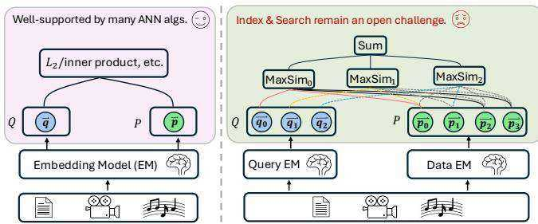
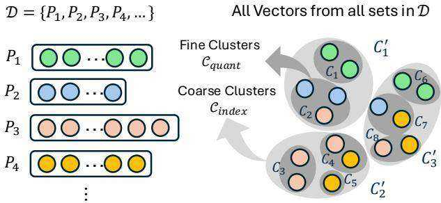
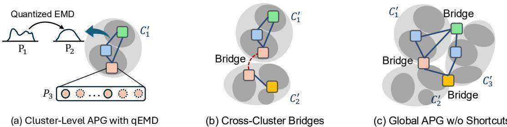

# 学术论文分析报告

> **论文标题**：GEM: A Native Graph-based Index for Multi-Vector Retrieval
> **论文 ID**：SIGMOD 2026（HKUST — Yao Tian, Zhoujin Tian, Xi Zhao, Ruiyuan Zhang, Xiaofang Zhou）
> **分析日期**：2026-05-07
> **主标签**：multi_vector_retrieval
> **论文标签**：multi_vector_retrieval
> **知识库关联论文**：PLAID（主要对比，2.5-5× 被超越）；DESSERT（主要对比，16× 被超越）；IGP（类图方法，对比分析）；MUVERA（单向量归约对比，10× 被超越）；LEMUR（单向量归约，未直接比较）；DiskANN（单向量图索引工程祖先，✅ 已分析序号40）

---

## 1. 问题定义

**问题背景**：
多向量检索（ColBERT）需要为每个 query token 找 top-k 最相似的 document token，再通过 MaxSim（Chamfer）聚合得到文档相似度。现有方法（PLAID/DESSERT/IGP）均在 **token 级别**建立索引：所有文档的所有 token 向量构成一个大的单向量 ANN 索引。这导致两个根本性问题：
1. **语义错配**：token 级相似度不等于集合级相似度（"beaches"这个 token 会使不相关文档被大量检索）
2. **索引膨胀**：1万个文档 × 100 token/文档 = 100万级别的 ANN 索引

**核心洞察**：
图索引在单向量场景中性能最优（HNSW/DiskANN），但 MaxSim/Chamfer 不是度量（不满足三角不等式），无法直接用于图构建。如果能在 **集合级别**（每个节点代表一个文档/向量集）直接构建图索引，同时解决非度量问题，就可以实现质量和效率的双突破。

**形式化定义**：
MaxSim/Chamfer 相似度：$\text{CH}(A, B) = \sum_{a \in A} \max_{b \in B} \text{Sim}(a, b)$
目标：对数据库 $\mathcal{D} = \{P_1, ..., P_N\}$（每个 $P_i$ 是向量集），找到 $k\text{-argmax}\{\text{CH}(Q, P) | P \in \mathcal{D}\}$，同时最小化延迟。

---

## 2. 前人工作的方法缺陷

| 缺陷类型 | 具体表现 | 代表工作 |
|----------|----------|----------|
| Token 级索引语义不准 | 单 token 相似无法代表集合相似，大量假阳性候选 | PLAID, DESSERT, IGP |
| 索引膨胀 | 1M doc × 100 token → 100M ANN 索引 | 所有 token-level 方法 |
| 单向量压缩损失大 | FDE 需要 10240+ 维才能保持高召回 | MUVERA |
| 非度量图结构不稳定 | 直接用 Chamfer 建图：破碎邻居（fragmented neighbors）、局部最优 | 朴素图方法（MVG）|
| LSH sketch 剪枝弱 | 缺少有效的集合级剪枝，速度提升有限 | DESSERT |

---

## 3. 研究动机与提出方案

**研究动机**：
EMD（Earth Mover's Distance）是一个度量（满足三角不等式），且上界 Chamfer：$\text{CH}(Q, P) \leq \text{EMD}(Q, P)$。这意味着 EMD 近的集合在 Chamfer 空间也近，但反之不一定。因此：用 **EMD 建图**（保证图结构的稳定性），用 **Chamfer 搜索**（保证搜索的正确性）——解耦图构建和搜索的相似度函数，是 GEM 的核心思路。

**方法本质（一句话）**：
> 本质上，GEM 是在向量集（文档）粒度上直接建立 HNSW 风格的图索引：用 qEMD（量化 EMD）作为图构建度量，用 qCH（量化 Chamfer）作为搜索代理，加上 TF-IDF 驱动的集合聚类分配（减少冗余）和监督式语义捷径（桥接 EMD-近但 Chamfer-远的集合对）。

**【批判性剥壳】方法还原**：
> GEM 的五个组件：
> 1. **两阶段聚类**：k-means 得到细粒度 $C_\text{quant}$（$16\sqrt{N}$ 规模，用于量化），再聚合为粗粒度 $C_\text{index}$（用于集合级分配）
> 2. **TF-IDF 驱动集合分配**：计算每个文档对每个粗粒度 cluster 的 TF-IDF 分数，只保留 top-r 个 cluster 分配（MSMARCO 从 43.8 个降至 2.9 个，降低 93.4%）
> 3. **度量解耦 + 对偶图**：用 qEMD（centroid codebook lookup 实现的量化 EMD）建 intra-cluster 图；多 cluster 成员的文档自动成为跨 cluster 的 bridge，编织成全局图（无节点复制，每个文档存一份）
> 4. **语义捷径**：用训练对 (Q, 相关文档 P) 监督注入直边：若搜索时 P 不在 top-f ANN 结果中，则在 P 和其最近邻之间添加直边；桥接 EMD 远但 Chamfer 近的对
> 5. **Cluster-guided 多入口 beam search**：初始化时从多个相关 cluster 各选一个入口→并行 beam search（共享全局 result heap 和 visited set）→ cluster-aware 剪枝（不在相关 cluster 的邻居直接跳过）→ 最终用精确 Chamfer 重排

**论文核心贡献（Contributions）**：
1. GEM：首个原生集合级图索引框架，将图索引与多向量语义统一
2. 度量解耦（EMD 建图 + Chamfer 搜索）：解决图索引依赖三角不等式的核心障碍
3. TF-IDF 驱动集合聚类 + 自适应截止：90%+ 集群成员数减少，保留语义覆盖
4. 语义捷径注入：监督式图增强，无需额外标注
5. 在文本（in-domain, out-of-domain）和多模态基准上全面验证：16× vs DESSERT, 5× vs PLAID

**整体流程拆解（按阶段）**：
1. **索引构建**：
   - k-means → $C_\text{quant}$ 细粒度 centroid（查询时量化）
   - k-means 再聚合 → $C_\text{index}$ 粗粒度（集合级分配）
   - TF-IDF 过滤 → 每文档分配到 top-r 个粗粒度 cluster
   - qEMD 建 intra-cluster 图 → bridge 文档自动连接全局图
   - 自适应 TF-IDF 截止（决策树预测每文档 r 值）
   - 注入语义捷径（训练对采样 20%）
2. **查询**：
   - 计算 query-centroid 相似矩阵 $S_{c,q} = C \cdot Q^T$，每个 query token 选 top-t 相关 cluster
   - 从每个相关 cluster 各选一个入口点，并行 beam search（qCH 作为代理距离）
   - 跨线程共享 visited set 和 result heap，cluster-aware 早期剪枝
   - 取 top-ef_search 候选，精确 Chamfer 重排后返回 top-k

**索引建立逻辑（详细版）**：
1. **先准备一套全局量化词表，而不是直接建图**。
   GEM 首先从全库向量中采样，做第一阶段 k-means，得到细粒度质心集合 $C_{quant}$。这一层不是索引分区，而是为了把后续所有集合距离计算统一映射到 centroid 空间里。换句话说，GEM 建图之前先把“距离怎么近似”这件事定下来，为 qEMD 和 qCH 共用同一套 codebook。
2. **再准备集合级索引空间**。
   之后 GEM 把 $C_{quant}$ 再聚成更少的粗粒度质心 $C_{index}$。这一层才是图索引真正使用的 cluster 空间。每个 token 会映射到最近的 coarse centroid，于是每个文档/向量集 $P$ 都能得到一个粗粒度 cluster 画像 $C(P)$。
3. **不是把文档挂到所有碰到的 cluster，而是做 TF-IDF 筛选**。
   对每个向量集 $P$，GEM 统计它在每个 coarse centroid 上的 token 频次 $\mathrm{TF}(C'_j, P)$，再用全库级的 $\mathrm{IDF}(C'_j)$ 给常见 cluster 降权，得到 $\mathrm{Score}(C'_j, P)$。随后只保留 top-$r$ 个 coarse clusters，形成 $C_{top}(P)$。这一步的目的是让一个节点只出现在少数“真正代表它语义”的局部图里，而不是因为 stopword 或背景 token 被挂到大量 cluster 上。
4. **按 cluster 分批建局部图，而不是一次性建全局图**。
   有了 $C_{top}(P)$ 之后，GEM 以 coarse cluster 为单位遍历所有文档集合。在每个 cluster 内，它把属于该 cluster 的向量集视为一个子库，逐个插入图中。对当前集合 $P$，系统会在当前 cluster 图里做一次基于 qEMD 的 ANN 搜索，找到 top-$f$ 个近邻候选。这里的“近”是集合级的 qEMD 近，而不是 token 级近。
5. **局部插入遵循图索引的标准套路，但对象换成了向量集**。
   如果 $P$ 是第一次出现在图里，GEM 就把它和这批 top-$f$ 邻居连边，并对邻居的度数做上限控制 $M$，必要时删掉最不相似的边。也就是说，GEM 在 cluster 内部复用了 HNSW/DiskANN 风格的“搜索式建图”思路，只不过节点从单向量换成了向量集，边权从 $L_2$ 换成了 qEMD。
6. **如果一个文档属于多个 cluster，它不会复制节点，而是变成 bridge**。
   这里“$P$ 后续又在另一个 cluster 中被处理”指的是：同一个文档 $P$ 的 $C_{top}(P)$ 里可能同时包含多个 coarse clusters，例如 $C'_2, C'_7, C'_{11}$。GEM 建图时是按 cluster 逐个处理的，所以当系统先在 $C'_2$ 的建图轮次里插入过 $P$ 之后，后面遍历到 $C'_7$ 或 $C'_{11}$ 时，还会再次遇到同一个 $P$。这时 GEM 不会新建一份节点副本，而是把它当成 cross-cluster bridge。此时系统会把“旧 cluster 中已有的邻居”和“新 cluster 中新找到的邻居”合并，再重新挑选最终保留的邻居集合。
7. **bridge 更新不是简单保留最近邻，而是强制保跨区连通性**。
   若合并后的候选邻居数超过度上限 $M$，GEM 先按 qEMD 选最接近的 $M$ 个；但如果这样会让 $P$ 丢失某个所属 cluster 的连接，就会额外强制保留该 cluster 至少一个邻居。这个约束很关键，因为它保证 bridge 节点真的能把多个局部图织成全局可导航图，而不会在度裁剪时被“剪回单区节点”。
8. **这样得到的是“局部图 + bridge 编织”的全局图，而不是多个彼此独立的图**。
   从实现上看，GEM 的每个节点物理上只存一份，但逻辑上可以同时属于多个 cluster。cluster 内部提供局部紧致结构，bridge 负责跨区跳转，因此整个索引最终呈现为一个全局连通图。这个设计兼顾了两点：一方面保留 cluster 内的局部性，另一方面避免把同一文档复制到多个图里带来的存储冗余。
9. **在主图构建完成后，再做两项增强**。
   第一项是自适应 cluster cutoff：通过决策树预测每个文档该保留多少个 cluster membership，而不是对所有文档固定同一个 $r$。第二项是 shortcut 注入：利用训练对 $(Q, P)$ 检查当前图是否难以到达相关文档；如果某个正样本 $P$ 没有出现在 query 的 top-$f'$ 搜索结果里，就补一条直连边，把“EMD 图上较远但 Chamfer 语义上较近”的区域接起来。
10. **最终得到的索引不是一张纯 qEMD 图，而是一张经过语义修补的集合级 proximity graph**。
    其底层骨架由 qEMD 保证稳定几何结构，cluster membership 控制局部性与冗余，bridge 保证全局连通，shortcut 负责修补度量解耦带来的残余错位。这样，查询时才能从少量入口点快速走到语义相关区域，而不必像 token-level 方法那样先生成大量候选再重排。

**与 HNSW 建图逻辑的对照**：

GEM 的索引建立过程确实和 HNSW 高度同构，可以理解为"把 HNSW 的建图套路搬到向量集粒度"。对照如下：
 
| 维度 | HNSW | GEM |
|------|------|-----|
| 节点粒度 | 单个向量 | 向量集（整个文档）|
| 近邻搜索 | 在现有图里做 greedy beam search | 在当前 cluster 的子图里做 qEMD beam search |
| 建图方式 | 搜索到 top-$f$ 近邻后连边 | 搜索到 top-$f$ 近邻后连边（完全相同逻辑）|
| 度数上限 | 每个节点保留最多 $M$ 条边，多余的裁掉最弱的 | 同上，$M$ 的裁剪规则相同 |
| 建图用的距离 | L2 / 内积（与查询距离相同）| qEMD（与查询距离 Chamfer 不同，刻意解耦）|
| 层次结构 | 多层（高层稀疏图提供长程跳转）| 单层图，用多 cluster 入口 + bridge 代替多层结构 |
| 全局连通保障 | 通过层次保证 | 通过 bridge 约束保证 |
| 额外增强 | 无监督，纯结构 | 有监督 shortcut 注入（弥补度量解耦的残余错位）|

**核心共性**：两者都属于"边插入边搜索"的在线建图策略：先用当前已有的图找近邻，再把新节点连进去，同时维护度数上限。这套流程在 GEM 里被原封不动地复用，只是把节点类型从"单向量"换成了"向量集"，把距离函数从"L2"换成了"qEMD"。

**核心差异**：HNSW 的建图距离和搜索距离是同一个函数，结构天然自洽。GEM 的关键挑战就在于这二者不同——用 qEMD 建图是为了图结构稳定，用 Chamfer 搜索是为了语义正确，这个解耦是 HNSW 在单向量场景里不需要面对的问题。bridge 约束和 shortcut 都是在这个解耦带来的代价上打补丁。

**关键技术细节**：
- **qEMD**：centroid 之间的成对距离预计算为 $k_1 \times k_1$ codebook，每次距离查找 $O(1)$
- **qCH**：$\text{qCH}(Q,P) = \sum_{q \in Q} \min_{p \in P} d_X(\text{NN}(q), \text{NN}(p))$（每个 query token 找最近 centroid 在 doc centroid 集中的最小距离）
- **桥接约束**：bridge 文档的最终邻居列表必须包含每个所属 cluster 的至少一个成员（防止跨 cluster 边被覆盖）
- **默认参数**：M=24, ef_construction=80, t=4, 20% 训练对生成捷径

### 3.1 补充理解记录（2026-04-29）

**关于两阶段聚类的更精确表述**：
1. 第一阶段不是直接为了建索引分桶，而是先把全库采样向量做 $k_1$ 个细粒度聚类，得到 $C_{quant}$。它的主要职责是**量化词表/codebook**：后续 qEMD 和 qCH 都依赖它把 token 级距离替换成 centroid 间查表距离。
2. 第二阶段再把这些一阶段质心聚成 $k_2$ 个粗粒度质心，得到 $C_{index}$。它的主要职责才是**集合级索引空间**：每个向量先映射到最近的粗粒度质心，再统计一个向量集在各个粗粒度质心上的 TF。
3. 对于某个向量集 $P$，GEM 计算的是它相对于每个二阶段粗粒度质心 $C'_j$ 的 $\mathrm{TF}(C'_j, P) \cdot \mathrm{IDF}(C'_j)$ 分数，然后只保留 top-$r$ 个粗粒度质心作为 $C_{top}(P)$。因此，**一个文档被分到多个 coarse clusters，但只保留语义最有代表性的那几个**。
4. 这个设计的关键不是“硬分桶”，而是把两个目标拆开：一阶段服务于**距离近似**，二阶段服务于**搜索入口与图局部性**。如果只做一层聚类，要么聚类太细导致 cluster membership 极度冗余，要么聚类太粗导致量化误差大，二者难以兼得。

**关于 top-r 分配机制的理解**：
- 这里的 top-$r$ 不是给每个 token 选 top-$r$，而是给每个**向量集**在所有粗粒度 cluster 上排序后选 top-$r$。
- 其作用是抑制 stopword/背景 patch 一类“到处都沾边”的无信息 token 对 cluster membership 的污染。
- 从图索引角度看，这一步本质上是在控制每个节点的“逻辑复制范围”：成员 cluster 越多，建图越冗余，跨 cluster 搜索越容易扩散；成员 cluster 越少，索引更紧凑，但可能漏掉语义覆盖。GEM 用 TF-IDF 和后续自适应 cutoff 去平衡这两者。

### 3.2 对 Metric Decoupling and Quantization 的详细分析

**一句话直译**：
GEM 发现“真正想优化的检索相似度”与“适合建图的距离”不是同一个东西，所以它不再强迫一个函数同时承担两份职责，而是用 EMD 负责建图，用 Chamfer 负责最终搜索与重排，再用量化把这两个集合距离都降到可计算。

**为什么要 decouple**：
1. 多向量检索最终关心的是 Chamfer/MaxSim，因为它贴近 late interaction 的语义匹配目标。
2. 但 Chamfer 不是 metric，不满足三角不等式，因此直接拿它建 proximity graph 时，图的局部邻域不稳定，容易出现“当前点对 query 看起来更近，但邻居结构并不支持逐步逼近”的问题。
3. 图索引依赖一个很强的隐含假设：如果 A 靠近 B，B 靠近 C，那么沿图边走时通常能逐步接近目标。这要求底层距离至少近似满足 metric 几何。
4. EMD 满足三角不等式，是标准 metric；同时论文利用了 $\mathrm{CH}(Q,P) \le \mathrm{EMD}(Q,P)$ 这个上界关系，所以 **EMD-close 通常意味着不会在 Chamfer 空间里太离谱**。这就给图结构提供了一个稳定骨架。

**可以把它理解成两层角色分工**：
- EMD：负责“路网施工”。目标是让图连得稳、局部导航靠谱。
- Chamfer：负责“目的地判定”。目标是保持最终检索语义不变。
- Shortcut：负责修补“EMD 路网”和“Chamfer 真正语义”之间仍然存在的错位。

**为什么 EMD 能做图骨架，而 Chamfer 不能直接做**：
1. Chamfer 是“每个 query token 各自找最优匹配再求和”，本质上允许不同 token 各自命中不同局部区域，因此它对整体几何结构的约束很弱。
2. EMD 则要求在两个集合之间构造整体运输计划 $T$，相当于比较“两个 token 分布能否整体对齐”，几何上更平滑、更全局。
3. 所以 EMD 更适合回答“这两个向量集在图里应不应该相连”，而 Chamfer 更适合回答“这个文档对当前 query 最终相关不相关”。
4. 代价是 EMD 更保守。会出现一种情况：两个集合在 Chamfer 下很像，但在 EMD 下不够近，于是图上路径偏长。这正是论文后面要注入 semantic shortcuts 的原因。

**Quantization 在这里解决的不是语义问题，而是计算问题**：
1. 无论是 EMD 还是 Chamfer，只要还在 token 对 token 上做原始高维距离，图构建和查询都会过慢。
2. GEM 先用一阶段细粒度质心 $C_{quant}$ 把每个 token 映射成最近 centroid，之后 token 间距离近似成 centroid 间距离。
3. 这样一来，高维向量距离计算被替换成 codebook 查表，复杂度和常数项都显著下降。
4. 更重要的是，EMD 的运输对象从原始 token 云转成量化后的 centroid 支撑集，运输计划会更稀疏，求解更快。

**4.2.2 真正做了两件事**：
1. 用 $C_{quant}$ 近似 token-level geometry，把 $d_X(p_i, p'_j)$ 替换成 $d_X(\mathrm{NN}(p_i), \mathrm{NN}(p'_j))$。
2. 把这些 centroid-centroid 距离预先存成 $k_1 \times k_1$ codebook，于是 qEMD/qCH 的内层操作变成常数时间 lookup，而不是反复做高维点积或 L2。

**把这一节连起来看，论文真正的逻辑链条是**：
1. Chamfer 语义对，但不适合建图。
2. EMD 适合建图，但精确算太贵。
3. 所以先用 EMD 替代 Chamfer 做图结构，再用 quantization 把 EMD 降成 qEMD。
4. 查询时也不直接大规模算精确 Chamfer，而是先用 qCH 做图遍历代理，最后再对候选做精确 Chamfer 重排。
5. 因此 GEM 不是单一技巧，而是“目标函数解耦 + 近似计算统一量化 + 最终精排回到原语义”的三段式系统设计。

**我对这一节的批判性理解**：
1. 这不是在证明 EMD 与 Chamfer 等价，而是在承认二者不等价的前提下，选择一个更适合图拓扑的 surrogate metric。
2. qEMD/qCH 也不是为了提高理论正确性，而是为了把“集合级图索引”从概念方案变成可运行系统。
3. GEM 的成败点其实在于：EMD 与 Chamfer 虽不一致，但一致到足以提供可导航的 coarse geometry；剩余不一致再由 shortcuts 补齐。
4. 如果未来换到 patch 数极大的视觉检索场景，这套 decoupling 仍可能成立，但 quantized EMD 的计算负担会重新成为瓶颈，因为集合规模 $m$ 会迅速放大。

**关键图像与图表辅助说明（如适用）**：

- **Figure 1（动机图）**：

  

  左半部分展示单向量检索——query/doc 各用一个向量，$L_2$/内积直接比较，所有 ANN 算法直接适配（"Well-supported"）；右半部分展示多向量检索——Q 和 P 各为向量集合，相关性由三路 MaxSim 聚合再求和，算法层面"Index & Search remain an open challenge"（图中用哭脸标注）。该图直接锚定 GEM 的出发点：**现有图索引对集合级距离无原生支持**，需要全新设计。

- **Figure 2（两层聚类）**：

  

  左侧将文档库 $\mathcal{D} = \{P_1, P_2, \ldots\}$ 中每个文档的所有向量池在一起；右侧先聚成细粒度 $\mathcal{C}_\text{quant}$（用于 qEMD 量化，共 8 个细簇 $C_1$–$C_8$），再合并成粗粒度 $\mathcal{C}_\text{index}$（用于集合级索引，共 3 个粗簇 $C_1'$–$C_3'$）。**两层粒度对应两个不同用途**：细层服务于距离量化，粗层服务于图的空间划分——这一分离设计是 GEM 区别于 PLAID 单层倒排的核心。

- **Figure 5（全局图构建）**：

  

  三个子图说明 GEM 图构建的三个阶段：(a) 在单个粗簇 $C_1'$ 内，用 qEMD 对文档集进行 APG（Approximate Proximity Graph）构建，$P_3$ 同时属于 $C_1'$ 和 $C_2'$，天然成为 Bridge 节点；(b) Bridge 节点（红色虚线）将两个局部图物理连接，使全局图跨簇可达；(c) 合并后的全局 APG（尚未添加 Shortcuts），桥节点已实现跨簇连通。**该图清晰展示 GEM 如何从"每簇局部图 → Bridge 桥接 → 全局可导航图"逐步建立多向量集合级导航结构**，是理解后续 shortcut 插入必要性的前置视觉依据。

---

## 4. 实验对比

**数据集**：MS MARCO v1（8.8M 文档，in-domain），LoTTE Pooled（2.4M，out-of-domain），OK-VQA（114K，多模态），EVQA（50K，多模态）

**评估指标**：R@100, S@100, MRR@10（质量），查询延迟 ms

**对比基线**：PLAID, DESSERT, MUVERA, IGP, MVG（朴素集合级图，无 GEM 优化）

**关键结果表格**（Table 2, 默认设置）：

| 数据集 | 方法 | MRR@10 | 延迟(ms) | GEM 加速比 |
|-------|------|--------|---------|-----------|
| MS MARCO | PLAID | 0.395 | 352 | 2.5× |
| | MUVERA | 0.385 | 310 | 2.2× |
| | **GEM** | **0.447** | **140** | — |
| LoTTE | PLAID | 0.558 | 462 | 2.2× |
| | IGP | 0.553 | 338 | 1.6× |
| | **GEM** | **0.592** | **210** | — |
| OKVQA | PLAID | 0.225 | 570 | 3.9× |
| | **GEM** | **0.236** | **165** | — |

MRR 质量对比（同等 MRR 下的最大加速，Figure 8）：
- vs DESSERT：**16×**（OKVQA）
- vs MUVERA：**10×**（OKVQA）
- vs IGP：**8×**（OKVQA）
- vs PLAID：**5×**（MSMARCO）

索引大小（MSMARCO）：GEM 2GB < PLAID 1.5GB ≈ IGP 2.3GB << MUVERA 10.5GB << DESSERT 107GB

---

## 5. 性能提升

**总体提升**：
GEM 在所有 4 个数据集上**质量和效率双第一**（MRR@10 最高，延迟最低）。

**最显著提升场景**：
- **多模态（OKVQA）**：vs DESSERT 16×，vs MUVERA 10×，vs IGP 8×，vs PLAID 3.9×（质量同时提升 MRR 0.236 vs 0.225）
- **MS MARCO in-domain**：vs PLAID 5× 加速（同 MRR 下），MRR@10 从 0.395 提升到 0.447（+13%）
- **索引大小**：vs DESSERT 107GB → GEM 2GB（**53× 更小**）

**消融验证关键组件**：

| 去掉组件 | 延迟影响 |
|----------|---------|
| EMD（改用 qCH 建图）| **2× 延迟增加** |
| 多入口搜索 | **1.7-1.8× 延迟增加** |
| 自适应 TF-IDF 截止 | 显著性能下降 |
| Bridge 约束 | MSMARCO 大幅性能下降 |
| 语义捷径 | 少量性能退化（~10-20%）|
| 去掉全部 | **5-6× 延迟增加** |

---

## 6. 方法局限与缺陷

**论文自述局限**：
1. 对向量集大小 $m$ 敏感：$m$ 翻倍导致延迟近乎翻倍（set-to-set 距离计算是 $O(m^2)$ 的）
2. 需要训练对用于语义捷径注入（虽然复用现有训练集）
3. 索引构建时间在小数据集（OKVQA/EVQA）上比 PLAID 更长

**独立分析发现的缺陷**：
1. **超低量化精度兼容性缺失**：论文明确提到 future work 为"ultra-low-bit quantization"；当前 GEM 用 PLAID 的 centroid + residual 结构（2-bit for ColBERTv2），但与 EMVB 的 SIMD 优化、WARP 的 4-bit nibble 均未兼容
2. **GPU 支持缺失**：论文全部在 CPU 多核（160 线程 Xeon Gold）上运行；CITADEL（GPU 3.21ms）比 GEM CPU 140ms 快 44×；GPU 图索引（如 CAGRA）的集合级扩展未探索
3. **对 non-ColBERTv2 模型的泛化性**：实验中文本场景仅使用 ColBERTv2，多模态使用 preFLMR；LEMUR 的实验表明不同多向量模型下性能差异巨大，GEM 的 TF-IDF 聚类依赖 token 分布特性，对 ColQwen2（patch token >1000）的扩展性未验证
4. **EMD 计算的实际代价**：虽然 qEMD 通过 centroid codebook 近似，但 EMD 的 LP 求解在 $m > 100$ 时仍然昂贵（即使在 centroid 空间），论文未报告 qEMD 计算本身的时间占比
5. **无 WARP/EMVB/SLIM 比较**：论文发表于 SIGMOD 2026，未与 WARP（SIGIR 2025）和 EMVB（ECIR 2024）直接对比，这两个方法在 LoTTE Pooled 上均有延迟数据

**【批判性审查】实验设计与声明一致性**：

| 审查维度 | 问题 | 结论 |
|----------|------|------|
| "up to 16× speedup" | 是在 OKVQA vs DESSERT 在 MRR=0.30 时；MSMARCO vs PLAID 约 5×；平均约 2-4× | 声明准确但 16× 是极端情况 |
| 硬件 | 160 线程 Xeon Gold 6218，所有方法统一测试 | 公平 ✓ |
| 质量度量 | 使用人工标注相关性（非 brute-force MaxSim ground truth）| 与生产场景一致，但与 PLAID/WARP 论文使用的 Recall@k vs 精确 MaxSim 不同 |
| LEMUR 缺失 | 同年 ICML 2025 的 LEMUR 未包含在比较中 | 可接受（同期工作）|

**潜在的改进空间**：
1. **视觉多向量扩展**：ColQwen2 的 patch token 超过 1000，qEMD 在 $m=1000$ 时可能过慢；需要设计对超大向量集规模的高效 qEMD 变体（如先 PCA 降维再 EMD，或分层 EMD 近似）
2. **GPU 图构建**：将 GEM 的 graph construction 和 beam search 移植到 GPU（类 CAGRA），在 GPU 并行度下 set-level 图索引的潜力更大
3. **与 WARP/Col-Bandit 集成**：GEM 负责候选生成，Col-Bandit 负责精确 MaxSim reranking，两者正交组合可同时优化两个阶段

---

## 7. 科研启发

1. **先校正对 GEM 的方法理解，再决定后续研究方向。** GEM 的两阶段聚类应理解为“量化层 + 索引层”的职责拆分，而不是普通层次聚类复用；第一阶段 $k_1$ 服务 qEMD/qCH 的统一 codebook，第二阶段 $k_2$ 才定义集合级图索引的 coarse semantic regions。进一步看，TF-IDF top-$r$ 分配的价值也不只是减少 candidate，而是在控制每个向量集跨多少 coarse cluster 挂接，降低图构建冗余与跨区遍历噪声。Metric Decoupling 与 Quantization 则分别回答“能不能建稳定图”和“建得起、搜得动”，缺一不可。

2. **短期内最值得继续追的，不是再做一堆工程加速，而是无监督 shortcut。** GEM 最大的结构性弱点之一，是 shortcut 注入依赖训练正样本对。真正有论文价值的问题是：在 zero-shot 或无标注场景下，能否仅利用 qEMD 图邻域与 qCH 语义邻域的结构差异，自动定位“语义上很近但图上绕路”的节点对并补边。如果这条路走通，贡献不只是把 GEM 适用面拓宽，而是在定义一种不依赖监督信号的 non-metric graph repair 机制。

3. **AGC 与 GEM 的结合，只有在它被改写成新问题时才有科研价值。** 单纯把 AGC 压缩接到 GEM 前面，只是系统拼接；真正值得研究的问题是：压缩后的 token set 若改变了 MaxSim 利用率分布与局部几何结构，是否会系统性改善 qEMD surrogate 的稳定性、并降低 graph navigation 的结构失真。如果答案是肯定的，那么 AGC 不再只是压缩模块，而会变成“索引友好型集合重参数化”的前处理理论。

4. **GEM 暴露出的第一个大问题，是非度量目标到底什么时候可被图索引导航。** GEM 默认只要找到一个度量 surrogate 如 EMD，就有机会在 Chamfer/MaxSim 这类非度量目标上做图搜索，但这件事今天几乎完全靠经验。更值得开题的问题是：什么样的 surrogate 与目标函数失配是可容忍的，什么样的失配会让任何固定宽度 beam search 都失效。如果能把这个问题做成理论框架，意义会超出 GEM 本身，因为它会成为整个 multi-vector retrieval 图索引路线的共同解释基础。

5. **GEM 暴露出的第二个大问题，是 ANN 检索为何不能返回证书。** 今天的多向量 ANN 只能返回 top-k，却不能说明“结果离真实最优还有多远”以及“为何现在可以安全停止”。这不是参数没调好，而是问题定义太弱。更硬核的方向是构造从 cluster-level bound 到 qEMD/qCH 再到精确 Chamfer/MaxSim 的上下界链，使系统在搜索过程中给出 stopping certificate 或 failure bound。若能成立，它将把 multi-vector ANN 从经验启发式推进到可审计、可安全停止的搜索算法。

6. **若只保留两条适合博士主线的方向，应当收敛为两条。** 第一条是“面向多向量非度量目标的可导航图索引理论与构造方法”，核心是研究 surrogate 与真实目标之间的拓扑失真如何决定搜索可行性，并据此反推新的建图原则。第二条是“带证书的多向量近似检索与安全停止机制”，核心是让检索系统返回可信度与停止依据，而不是只返回答案。前者偏理论边界，后者偏可靠搜索；两者都不依赖大规模重训练，且与 GEM、IGP、DiskANN、HNSW 这条传统索引谱系直接相连。

7. **如果必须只选一条总主线，应优先选择“带证书的多向量近似检索与安全停止机制”。** 原因不是它更容易做，而是它同时满足三个条件：有明确的新问题定义，有与 branch-and-bound/A* 式安全剪枝相呼应的算法内核，也更容易形成连续的阶段性论文产出。相比之下，“非度量目标的可导航性理论”更适合作为上游理论支撑或副线，与主线形成互相强化的关系。

---

## 8. 参考文献图谱

### 文献分类表

| 文献名 | 作者/年份 | 角色 | 知识库状态 |
|--------|----------|------|-----------|
| PLAID: An Efficient Engine for Late Interaction | Santhanam et al., CIKM 2022 | 主要基线（5× 被超越）| ✅ 已分析（序号31）|
| DESSERT: An Efficient Algorithm for Vector Set Search | Engels et al., NeurIPS 2023 | 主要基线（16× 被超越）| ✅ 已分析（序号32）|
| MUVERA: Multi-Vector Retrieval via Fixed Dimensional Encodings | Jayaram et al., 2024 | 单向量归约基线（10× 被超越）| ✅ 已分析（序号34） |
| IGP: Efficient Multi-Vector Retrieval via Proximity Graph | Bian et al., SIGIR 2025 | 图方法基线（8× 被超越）| ✅ 已收录（序号22）|
| ColBERTv2: Effective and Efficient Retrieval | Santhanam et al., NAACL 2022 | 主要 embedding 模型 | ✅ 已分析（multi-vector 序号未编排） |
| DiskANN: Fast Accurate Billion-Point Nearest Neighbor Search on a Single Node | Subramanya et al., NeurIPS 2019 | 图索引基础 | ✅ 已分析（序号40） |

---

## 推荐阅读列表

### P0 必读（GEM 的关键基线与竞争）
- IGP: Efficient Multi-Vector Retrieval via Proximity Graph Index (Bian et al., SIGIR 2025) — ✅ 已收录序号22，GEM 直接对比的图方法竞争对手，理解两者的设计差异（token-level graph vs set-level graph）
- MUVERA: Multi-Vector Retrieval via Fixed Dimensional Encodings (Jayaram et al., 2024) — GEM 的重要对比，被 10× 超越，理解 FDE 单向量归约的局限

### P1 重要（图索引基础）
- DiskANN: Fast Accurate Billion-Point Nearest Neighbor Search on a Single Node (Subramanya et al., NeurIPS 2019) — 单向量图索引的工程基础，GEM 的搜索式建图、度裁剪与大规模图导航思路直接承接这一谱系；✅ 已分析序号40
- HNSW: Efficient and Robust Approximate Nearest Neighbor Search Using Hierarchical Navigable Small World Graphs (Malkov et al., 2016) — 单向量图索引的另一条经典主线，帮助对照 GEM 为何用 bridge 和多入口替代分层结构

### 当前仍未阅读（相对 GEM 关键外部工作）
- preFLMR（GEM 多模态实验采用的编码器工作）— 当前仓库无单独 paper.report

---

## mem0 知识库记录

- **问题域**：multi-vector retrieval, graph-based index, set-level indexing, non-metric similarity, EMD, MaxSim approximation, visual document retrieval
- **方法关键词**：GEM, set-level proximity graph, metric decoupling (EMD build + Chamfer search), TF-IDF guided cluster assignment, dual-graph (intra-cluster + global), bridge sets, qEMD/qCH quantization, semantic shortcuts, cluster-guided multi-entry beam search, adaptive cluster cutoff (decision tree)
- **数据集**：MS MARCO v1 (8.8M), LoTTE Pooled (2.4M), OK-VQA (114K multimodal), EVQA (50K multimodal)
- **性能基准**：MS MARCO MRR@10=0.447 in 140ms (vs PLAID 0.395 in 352ms, 2.5x speedup); LoTTE MRR@10=0.592 in 210ms (vs PLAID 0.558 in 462ms, 2.2x); OKVQA MRR@10=0.236 in 165ms (vs PLAID 0.225 in 570ms, 3.9x). At same MRR: up to 16x vs DESSERT, 10x vs MUVERA, 8x vs IGP, 5x vs PLAID. Index size: 2GB vs DESSERT 107GB (MSMARCO, 53x smaller).
- **关联论文 ID**：PLAID (arXiv:2205.09707 ✅已分析), DESSERT (NeurIPS 2023 ✅已分析), IGP (SIGIR 2025 ✅已收录序号22), MUVERA (2024), ColBERTv2 (arXiv:2112.01488)
- **核心方法机制摘要**：GEM 在向量集粒度建立 HNSW 风格图。关键设计：(1) EMD 建图（度量，上界 Chamfer）+ Chamfer 搜索（解耦非度量问题）；(2) TF-IDF 驱动集合聚类分配（MSMARCO 从平均 43.8 个 cluster 降至 2.9，-93%）；(3) bridge 文档自然连接 intra-cluster 图为全局图；(4) 监督式语义捷径注入（20% 训练对）；(5) 多入口并行 beam search + cluster-aware 剪枝 + 精确 Chamfer 重排。需要训练数据用于捷径，CPU 多核环境，无 GPU 实现
- **补充理解**：两阶段聚类是职责解耦而非单纯分层聚类：$k_1$ 细粒度质心服务 qEMD/qCH 的统一量化 codebook，$k_2$ 粗粒度质心服务集合级索引与搜索入口选择；每个向量集按粗粒度 centroid 的 TF-IDF 分数仅保留 top-$r$ cluster membership，以抑制 stopword/背景 token 带来的 cluster 冗余
- **对 Metric Decoupling and Quantization 的解释**：GEM 并未假设 EMD 与 Chamfer 等价，而是用 EMD 提供可导航的 metric 图骨架，用 Chamfer 保持最终语义目标，再用 qEMD/qCH 把集合距离计算降为 centroid codebook lookup；shortcut 用于弥补 EMD 几何与 Chamfer 语义之间的残余错位
- **局限**：对向量集大小 m 敏感（m 翻倍延迟翻倍），无 GPU 实现，缺与 WARP/EMVB 对比，视觉多向量(m>1000)扩展未验证，超低精度量化留为 future work
- **推荐下一轮阅读**：IGP (Bian et al., SIGIR 2025, 序号22), MUVERA (2024)

---

## 跨论文联想补充

---
> **[关联更新]** 结合《DiskANN: Fast Accurate Billion-Point Nearest Neighbor Search on a Single Node》（NeurIPS 2019，本仓库已完成分析，序号40）后的补充思考：
> DiskANN 对 GEM 的启发不只是在“图索引”这一抽象层，而是在更具体的工程套路上：先在现有图中搜索近邻、再把新节点接入、同时执行度数裁剪，这正是 GEM 在 cluster 内部插入向量集节点时复用的基本建图范式。DiskANN 的核心贡献之一是 Vamana 图，其目标是缩小图直径、提高长程导航效率，并进一步服务于 SSD-resident 的大规模 ANN；而 GEM 则把这套单向量 proximity-graph 逻辑提升到向量集粒度，把节点从 point 改成 set，把建图距离从 L2/inner product 改成 qEMD，把查询判定从图距离一致性改成“qCH 代理遍历 + 精确 Chamfer 重排”。
>
> 更准确地说，GEM 继承的是 DiskANN/Vamana 的“搜索式建图 + 度约束图导航”骨架，而不是其 SSD 系统目标本身。DiskANN 关心的是如何在 commodity SSD 上用少量随机读和较小图直径支撑 billion-scale 单向量 ANN；GEM 关心的则是另一类更根本的问题：当目标相似度是非度量的 MaxSim/Chamfer 时，如何仍然构造一个可导航的集合级图。因此 GEM 新增的 TF-IDF cluster membership、bridge 节点保跨区连通、以及 shortcut 修补 EMD 与 Chamfer 之间错位，都是对 DiskANN 原始骨架在“多向量 + 非度量”条件下的必要改造。
>
> 对本文 §3/§6/§7 的影响：这进一步说明 GEM 的真正新意不是“首次使用图”，而是“把 DiskANN/HNSW 一类单向量图索引范式改写为集合级、度量解耦的图检索系统”。这也提示后续研究可以沿着两条线推进：一条是继续借鉴 DiskANN 的系统工程思路，探索 GEM 的外存版或 GPU 版；另一条是把 Vamana 一类低直径图构造原则与 GEM 的 bridge/shortcut 机制结合，直接优化集合级图的全局可导航性。
