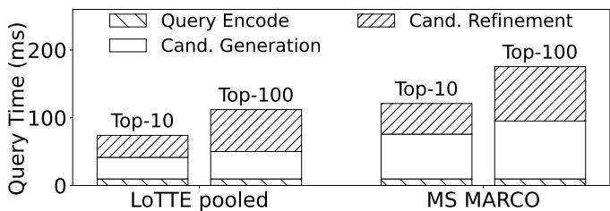
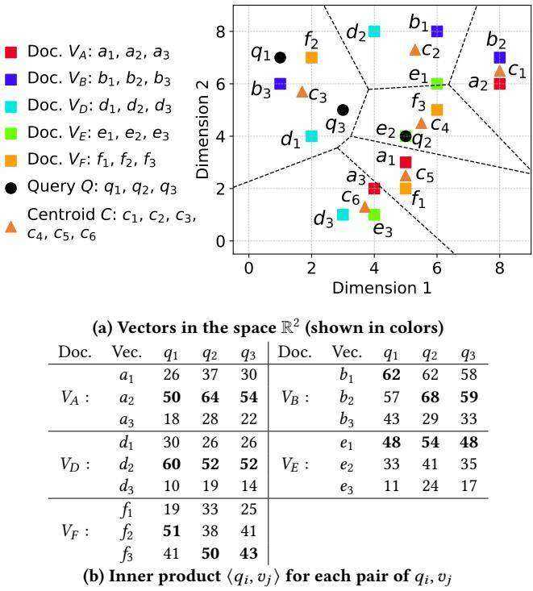
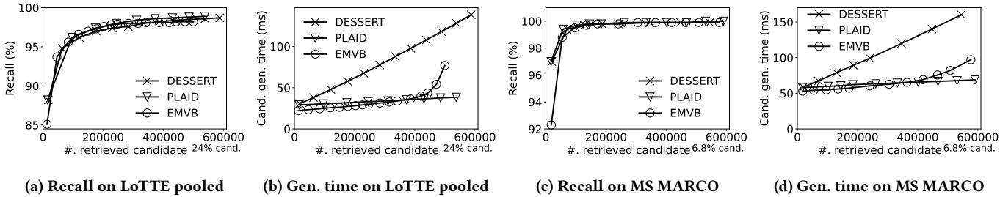
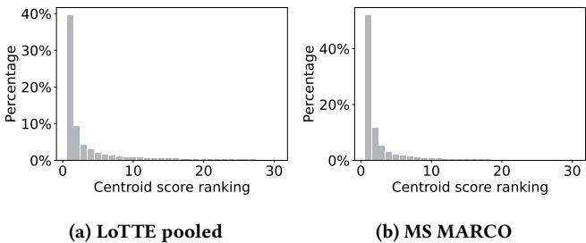
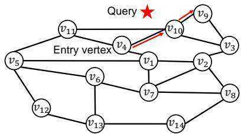
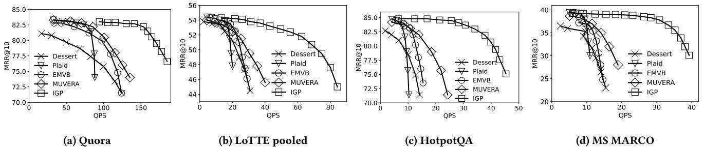
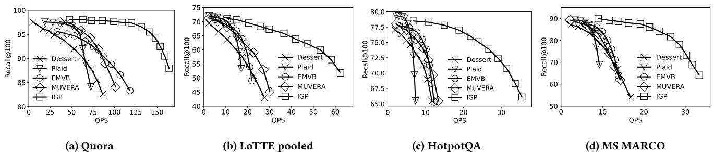
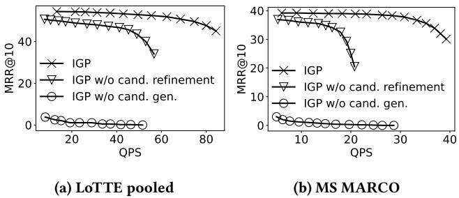
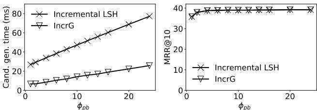

# IGP: Efficient Multi-Vector Retrieval via Proximity Graph Index

Zheng Bian   
Department of Computer Science and   
Engineering, Southern University of   
Science and Technology   
Shenzhen, China   
Department of Computing, The Hong   
Kong Polytechnic University   
Hung Hom, Hong Kong   
cszbian@comp.polyu.edu.hk

Man Lung Yiu Department of Computing, The Hong Kong Polytechnic University Hung Hom, Hong Kong csmlyiu@comp.polyu.edu.hk

Bo Tang∗   
Department of Computer Science and   
Engineering, Southern University of   
Science and Technology   
Shenzhen, China   
tangb3@sustech.edu.cn

# Abstract

Neural embedding models are extensively employed in retrieval applications, including passage retrieval, question answering, and web search. In particular, multi-vector models (e.g., ColBERTv2), which represent a document as multiple embedding vectors, have been demonstrated to achieve superior retrieval quality. Nevertheless, these models incur significant overhead at the retrieval time due to the massive amount of embedding vectors.

Several promising proposals (e.g., PLAID, DESSERT, EMVB, and MUVERA) have been made to optimize the query latency. To yield high recall, these methods need to generate a considerable amount (e.g., ten thousands) of document candidates, rendering both the candidate generation phase and the refinement phase inefficient. In this paper, we propose a high-quality candidate generation technique that produces only hundreds of candidates yet achieves high recall. Specifically, we develop an incremental next-similar retrieval technique for a proximity graph index in order to facilitate highquality candidate generation. Our experiments on real datasets show that our proposed method IGP achieves $2 \mathrm { X } ^ { - 3 \mathrm { X } }$ query throughput compared to existing methods at the same accuracy level.

achieve state-of-the-art quality in tasks like multi-modal searching [24], open-domain question answering [15], and passage retrieval [19]. These models represent each document as a set of embedding vectors (called a multi-vector thereafter).

We illustrate an application of the multi-vector model, i.e., passage retrieval, in Figure 1. At the offline stage, the multi-vector model encodes each textual document (or passage) into a multivector. An index can be built on those multi-vectors to support efficient retrieval. At the online stage, the multi-vector model encodes the user’s question into the query multi-vector, then the index is used to search for the top- $k$ similar documents. This retrieval problem is known as the multi-vector retrieval (MVR) problem [16, 43], which takes a query multi-vector, a set of document multi-vectors and a score function as input and then returns $k$ documents with the highest score to the user. Efficiently searching MVR is challenging because the number of documents reaches a hundred million and the number of embedding vectors can reach several billion [6, 33].

The existing methods for MVR (e.g., PLAID [41], DESSERT [8], EMVB [32], and MUVERA [13]) adopt the filter-and-refine framework as follows:

# CCS Concepts

• Information systems Top-k retrieval in databases .

# Keywords

Multi-Vector Retrieval, Neural Information Retrieval, Efficient Search

# ACM Reference Format:

Zheng Bian, Man Lung Yiu, and Bo Tang. 2025. IGP: Efficient Multi-Vector Retrieval via Proximity Graph Index. In Proceedings of the 48th International ACM SIGIR Conference on Research and Development in Information Retrieval (SIGIR ’25), July 13–18, 2025, Padua, Italy. ACM, New York, NY, USA, 10 pages. https://doi.org/10.1145/3726302.3730004

# 1 Introduction

Neural embedding models are commonly used in information retrieval to improve quality. Multi-vector models (e.g., ColBERT [16])

(1) Candidate generation: exploit the index (or precomputed information) to compute a set of candidate documents,   
(2) Candidate refinement: compute the exact score of each candidate, then return the top- $k$ among candidates.

To identify the performance bottleneck, we plot the query latency breakdown of PLAID in Figure 2, using two benchmarks for passage retrieval (LoTTE pooled [42] and MS MARCO [34]). The detailed setting is in Section 5. Both the candidate generation and refinement phases take significant amounts of time. A further investigation reveals that existing methods require fetching many candidates to ensure high quality, rendering both the candidate generation and refinement phases inefficient. For example, to reach a high recall $>$ $8 4 \%$ ) on MS MARCO, PLAID, DESSERT, EMVB and MUVERA need to generate 36,724, 4,096, 30,949, and 8,192 candidates, respectively. For details, see Table 4(b) in Section 5.

The above findings motivate us to develop a high-quality candidate generation technique that produces far fewer candidates yet achieves a high retrieval accuracy. In this paper, we leverage a Proximity Graph (PG) index, the state-of-the-art in single-vector retrieval (SVR), to solve MVR. The challenge is that, existing PG indexes have been designed to support single-vector score functions (e.g., Euclidean distance [30] and inner product [31]), but not for multi-vector score functions. MUVERA [13] is the first attempt to use a PG index for MVR. However, it incurs heavy computation at the retrieval phase due to the huge dimensionality of transformed vectors (16x-160x compared to original embedding vectors). How to utilize a PG index more efficiently in the multi-vector retrieval problem?

  
Figure 1: Application of Multi-Vector Retrieval

  
Figure 2: Profiling result of PLAID in LoTTE pooled and MS MARCO (when $k = 1 0$ , nprobe $= 1$ , $t _ { c s } = 0 . 5$ , ndocs $= 2 5 6$ ; when $k = 1 0 0$ , nprobe $= 2$ , $t _ { c s } = 0 . 4 5$ , ndocs $= 1 0 2 4$ )

We make the following contributions:

(1) We conduct experimental analysis to (i) identify the causes of expensive candidate generation in existing MVR methods, and (ii) make observations about document benchmarks. (Sections 3.3 and 3.4)   
(2) We propose Incremental Greedy Probe (IGP) to utilize a PG index efficiently for multi-vector retrieval. It exploits the above experimental analysis, a greedy approach for fetching high-quality candidates, and incremental search on PG index. (Section 4)   
(3) We conduct extensive evaluation to compare IGP with other state-of-the-art methods. Our experimental study on four benchmarks shows that, at the same accuracy level, IGP achieves $2 \mathrm { X } ^ { - 3 \mathrm { X } }$ shorter query latency and higher throughput than the state-of-the-art. (Section 5)

IGP is open source at https://github.com/DBGroup-SUSTech/ multi-vector-retrieval

# 2 Related Work

The introduction of transformers boosts many neural-based models in the IR community. The early models use cross-encoder [12, 29, 35] that jointly computes the similarity score of a document and query. However, it could not cache the document embeddings [16] and suffers from scalability issues. Later models focus on producing the independent query and document representation and can be classified into single-vector models and multi-vector models. Its related models and the retrieval solutions are presented as follows.

Single-vector retrieval. Single-vector models represent a document and a query into a high-dimensional vector with different sparsity. In particular, lexical-based models [9, 17] encode a document to a sparse vector based on term weights while representation-based models [38, 44] encode a document into a dense vector. The top-k documents can be efficiently retrieved by Maximum Inner Product Search solutions, which can be classified into three categories. In particular, Locality Sensitive Hashing [7, 47] projects a highdimensional vector into a low dimensional space that preserves similarity. Quantization-based index [4, 11, 14, 48] approximates the document vectors by a small set of generated vectors. Proximity graph [10, 30] builds a graph index over the database vectors and searches the query vector by traversing the graph index with the best-first-search algorithm. Empirical study [22] shows that proximity graph index achieves state-of-the-art performance in single-vector retrieval.

Multi-vector retrieval. Multi-vector models (e.g, ColBERT and its variants [24, 42, 46]) encode a document and a query into a multivector. They perform better than the single-vector representations [27, 46]. Later models [20, 21, 37] focus on the model training phase to reduce the search cost and they are orthogonal to our paper. For example, CITADEL [21, 37] learns a dynamic routing function to reduce the number of embedding vectors in a document. The retrieval solutions adopt the filter-and-refine framework. PLAID [41, 42] uses quantization-based indexes to approximate the document multi-vector and proposes a two-stage filtering framework. EMVB [32] proposes parallelized-friendly threshold-based filtering methods with optimized bit vector. DESSERT [8] approximates the document-query pairwise vector score by the cheap hashing-based estimation (e.g, signed random projections [5]), and that accelerates the refinement phase. MUVERA [13] proposes a space partitioning method that transforms the multi-vector retrieval problem into single-vector retrieval. Other works focus on the index update of PLAID [18] and reproducing its performance [28]. In this paper, we leverage the observation in Section 3.4 to reduce the number of candidates and exploit a graph index to reduce the score computation cost.

# 3 Problem Setting and Observations

We first define the multi-vector retrieval problem in Section 3.1. As preliminary background, we introduce the data storage and indexing of ColBERTv2 [42] in Section 3.2. Next, we identify the causes of high candidate generation time in existing methods in Section 3.3.

  
Figure 3: Example of multi-vector retrieval

Finally, we present our observations on document benchmarks in Section 3.4.

# 3.1 Problem definition

In our problem context, all vectors are in the same space $\mathbb { R } ^ { d }$ . We first define a multi-vector. Then, we adopt the similarity score function, used in ColBERTv2 [42] and our competitors [8, 13, 32, 41], to compute the similarity score between two multi-vectors.

Definition 1 (Multi-vector). A multi-vector $V$ is defined as a set of vectors in $\mathbb { R } ^ { d }$ , e.g., $V = \{ v _ { 1 } , v _ { 2 } , \cdots , v _ { m } \}$ . We call each $v _ { i } \in V$ as a constituent vector of $V$ .

Definition 2 (Similarity score). Given a multi-vector $V$ and a multi-vector $Q$ , the similarity score $\mathcal { F } ( Q , V )$ is defined as:

$$
{ \mathcal { F } } ( Q , V ) = \sum _ { q \in Q } \operatorname* { m a x } _ { v \in V } \langle q , v \rangle
$$

where $\langle q , v \rangle$ is the inner product between vectors $q$ and $v$ .

Example 1. In Figure 3(a), all vectors are in the space $\mathbb { R } ^ { 2 }$ . The multi-vector $V _ { A }$ consists of vectors $a _ { 1 } , a _ { 2 } , a _ { 3 }$ (shown as red squares). The multi-vector $Q$ consists of vectors $q _ { 1 } , q _ { 2 } , q _ { 3 }$ (shown as black dots). To compute $\mathcal { F } ( Q , V _ { A } )$ , we first compute the inner product for each pair of $q _ { i } , a _ { j }$ , as shown in Figure $3 ( \mathbf { b } )$ . Then, we obtain $\mathcal { F } ( Q , V _ { A } ) = 5 0 + 6 4 + 5 4 = 1 6 8 .$ .

Next, we define our retrieval problem as follows.

Definition 3 (Multi-vector retrieval). Given an integer $k$ , a query multi-vector $Q$ and a dataset $\mathbb { D } _ {  }$ of multi-vectors, the MVR problem returns $k$ multi-vectors from $\mathbb { D } _ {  }$ that have the $k$ highest similarity scores (with respect to $Q$ ).

For the ease of discussion, we use query and document to denote the query multi-vector $Q$ and a document multi-vector $V \in \mathbb { D } \Rightarrow$ , respectively. We call $\mathcal { F } ( Q , V )$ as document score, and $\langle q , v \rangle$ as vector score. We also call the results of MVR as the $k$ nearest neighbors of $Q$ . Like the existing works on MVR [8, 13, 32, 41], we focus on finding approximate results efficiently.

Example 2. Figure 3(a) shows the constituent vectors of the query $Q$ and five documents $V _ { A } , V _ { B } , V _ { D } , V _ { E } , V _ { F }$ . According to the calculation in Figure 3(b), the top-2 documents are $V _ { B }$ and $V _ { A }$ , whose scores are 189 and 168, respectively.

Table 1: Inverted file based on our example (Figure 3)   

<table><tr><td></td><td>Centroid  Constituent vectors</td></tr><tr><td>c1</td><td>, b2</td></tr><tr><td></td><td>1,2, e1</td></tr><tr><td>3</td><td>3,1, f2</td></tr><tr><td>4</td><td>e2,\f3$</td></tr><tr><td>c5</td><td>a1,f</td></tr><tr><td></td><td>3, d3, e3</td></tr></table>

# 3.2 Data storage and indexing of ColBERTv2

We introduce the data storage and indexing of ColBERTv2 [42], consisting of (i) quantized data storage for multi-vectors, and (ii) an inverted file. These components are adopted in existing works [8, 32, 41] as well as in our proposed method.

Quantized data storage for multi-vectors. ColBERTv2 [42] leverages Vector Quantization and Scalar Quantization as the data storage. Let $\mathcal { D } _ {  }$ be the set of constituent vectors from the dataset $\mathbb { D } _ {  }$ of multi-vectors, i.e., $\mathcal { D } _ {  } = \{ \boldsymbol { v } ~ \vert$ for every $v \in V , V \in \mathbb { D } _ {  } \}$ . Vector Quantization (VQ) approximates the set of constituent vectors $\mathcal { D } _ {  }$ by a small set of vectors called centroids. Given the number of centroids $n _ { c }$ , those centroids are obtained by running K-means $( K = n _ { c } )$ ) clustering on $\mathcal { D } _ {  }$ . A constituent vector is approximated by a centroid when it is assigned to the cluster of that centroid. For instance, in Figure 3(a), the centroids are $c _ { 1 } , \cdots , c _ { 6 }$ , and the dotted lines indicate the region closest to each centroid. Each vector (e.g., $d _ { 1 }$ ) can be approximately represented by the ID of its nearest centroid (e.g., $c _ { 3 }$ ).

Scalar Quantization (SQ) approximates each floating-point value by a low-bit integer called codeword. SQ is used to approximate the residual vector $v - c$ produced by VQ, thus allowing us to reconstruct a finer approximation of $v$ in the refinement phase. SQ introduces the parameter $B$ , which specifies the number of bits per dimension for encoding a vector. A high $B$ preserves accuracy but incurs a large amount of memory footprint. The recommended settings can be referred to Table 6.

Inverted file. The inverted file stores a mapping from the centroid identifier (ID) to the set of constituent vectors which are quantized to that centroid. Given a centroid $c$ , we use the inverted file to find all vectors that is approximated by $c$ . Table 1 shows the inverted file obtained from the example in Figure 3.

# 3.3 Causes of high candidate generation time

We proceed to identify the causes of high candidate generation time in existing methods. In PLAID, DESSERT and EMVB, we vary the parameter nprobe (i.e., the number of candidate centroids) to obtain different candidate sizes, then measure the recall and the candidate generation time at those candidate sizes. The other parameters as set by default. The above experiment is conducted on two benchmarks (LoTTE pooled and MS MARCO). Figures 4(a),(c) show the recall of existing methods vs. the candidate size. They need to generate at least ten thousand candidates to yield high recall. Figures 4(b),(d) show the candidate generation time of existing methods vs. the candidate size. Even at a low candidate size, all methods incur a fixed overhead, which is caused by the score computation between $Q$ and every index entry (i.e., every centroid).

  
Figure 4: The effect of the candidate size on the recall and the candidate generation time

  
Figure 5: Percentage of relevant document w.r.t. the centroid ranking. A document is more likely to be the relevant document when it has a higher centroid score ranking.

# 3.4 Observation on document benchmarks

We conduct the experiment below to investigate whether a document $V$ is relevant to the query $Q$ , in terms of the inner product score of their constituent vector pairs. Recall that we approximate a constituent vector by a centroid vector for fast filtering. For each pair $( Q , V )$ , we define the centroid score ranking for a document $V$ and a query vector $q \in { \cal Q }$ as the ranking of the centroid $c ^ { \star }$ in the centroid set $C$ w.r.t. the centroid inner product score $\langle q , c ^ { \star } \rangle$ , where the centroid $c ^ { \star }$ is defined as the one approximated by the vector $v ^ { \star }$ with the highest inner product score to the query vector $q$ in the document $V$ , i.e., $\boldsymbol { v } ^ { \star } = \arg \operatorname* { m a x } _ { \boldsymbol { v } \in V } \boldsymbol { q } ^ { \top } \boldsymbol { v }$ . Figure 5 plots the percentage of the relevant documents versus the centroid score ranking for every pair of the query vector and the document. Observe that the vectors of $V$ contributing to $\mathcal { F } ( Q , V )$ are likely to be within the 5-10 clusters nearest to vectors of $Q$ . We shall exploit this observation to develop our retrieval method in the next section.

# 4 Incremental Greedy Probe (IGP)

In this section, we present incremental greedy probe (IGP). In particular, we adopt the data storage and indexing of ColBERTv2 [42], as discussed in Section 3.2. We propose the next-similar fetch operation and use it to design the retrieval algorithm in Section 4.1. We discuss the choice of the index in Section 4.2, then present an efficient implementation of the next-similar fetch operation in Section 4.3. Finally, we discuss the update issue in Section 4.4.

# 4.1 Retrieval algorithm

Recall the definition of $\mathcal { D } _ {  }$ from Section 3.2. Inspired by the observation in Section 3.4, we propose to generate candidates by fetching vectors $v \in \mathcal { D } _ {  }$ in the descending order of the similarity $\langle q , v \rangle$ , where $q \in { \cal Q }$ .

Definition 4 (Next-similar fetch, $\mathrm { N F } _ { q }$ . $\operatorname { I n i t } ( \mathcal { D } _ {  } )$ , $\mathrm { N F } _ { q }$ .GetNext()). Given a query vector $q$ and the set of all document vectors $\mathcal { D } _ {  }$ , $\mathrm { N F } _ { q } . \mathrm { I n i t } ( \mathcal { D } _ {  } )$ is used to preprocess $\mathcal { D } _ {  }$ such that, when the operation $\mathrm { N F } _ { q } . \mathrm { G e t N e x t } ( )$ is called at the $i \cdot$ -th time, it returns the $i$ -th most similar vector $v \in \mathcal { D } _ {  }$ according to $\langle q , v \rangle$ .

Table 2: Example of calling $\mathrm { N F } _ { q }$ .GetNext()   

<table><tr><td rowspan=1 colspan=1>i-th call</td><td rowspan=1 colspan=1>q1</td><td rowspan=1 colspan=1>q2</td><td rowspan=1 colspan=1>q3</td></tr><tr><td rowspan=1 colspan=1>1</td><td rowspan=1 colspan=1>b1 : 62</td><td rowspan=1 colspan=1>b2 : 68</td><td rowspan=1 colspan=1>b2 :59</td></tr><tr><td rowspan=1 colspan=1>2</td><td rowspan=1 colspan=1> : 60</td><td rowspan=1 colspan=1>a2 : 64</td><td rowspan=1 colspan=1>b1 : 58</td></tr><tr><td rowspan=1 colspan=1>3</td><td rowspan=1 colspan=1>b2 : 57</td><td rowspan=1 colspan=1>b1 : 62</td><td rowspan=1 colspan=1>a : 54</td></tr><tr><td rowspan=1 colspan=1>4</td><td rowspan=1 colspan=1>$f 5$</td><td rowspan=1 colspan=1>e1 :54</td><td rowspan=1 colspan=1> :52</td></tr><tr><td rowspan=2 colspan=1>5· . ·</td><td rowspan=1 colspan=1> : 50</td><td rowspan=2 colspan=1> :52. ..</td><td rowspan=2 colspan=1>e1 : 48. . .</td></tr><tr><td rowspan=1 colspan=1>. . .</td></tr></table>

Example 3. Based on the example in Figure 3(a), we illustrate the result of each next-similar fetch operation for three query vectors $q _ { 1 } , q _ { 2 } , q _ { 3 }$ in Table 2. For instance, for $q _ { 1 }$ , the first call returns $b _ { 1 }$ (with score 62), and the second call returns $d _ { 2 }$ (with score 60).

A naive implementation of the $\mathrm { N F } _ { q }$ .GetNext() operation requires computing $\langle q , v \rangle$ for every $v \in \mathcal { D } _ {  }$ . Such implementation is clearly inefficient. We shall present efficient approximate implementations of the $\mathrm { N F } _ { q }$ .GetNext() operation in later subsections. We shall exploit the property below to design our retrieval algorithm.

Theorem 1. The maximum score of a document $V$ and a query vector $q$ (i.e., $\operatorname* { m a x } _ { v \in V } \langle q , v \rangle )$ is found when we meet a vector of $V$ in the next-similar fetch of ?? for the first time.

For instance, suppose that we wish to compute $\operatorname* { m a x } _ { v \in V _ { B } } \langle q _ { 2 } , v \rangle$ between query vector $q _ { 2 }$ and document $V _ { B } = \{ b _ { 1 } , b _ { 2 } , b _ { 3 } \}$ . According

System parameters: $\phi _ { c a n d }$ , $\phi _ { r e f }$   
1: $\mathrm { N F } _ { q }$ . $\operatorname { I n i t } ( \mathcal { D } _ {  } )$ , for every $q \in { \cal Q }$   
2: $\Psi $ Create a hash table with the key type as document ID   
3: for each ???????? from 1 to $\phi _ { c a n d }$ do   
4: for each $q \in { \cal Q }$ do   
5: $v \gets \mathrm { N F } _ { q }$ .GetNext()   
6: $i d \gets$ Find the $\mathrm { I D }$ of the document $V$ that contains ??   
7: if ???? is not found in $\Psi$ then   
8: $\Psi [ i d ] . s c o r e  0$   
9: Init Ψ[????].isSeen[??] to false, for each $q \in { \cal Q }$   
10: if Ψ[????].isSeen[??] $=$ false then   
11: Ψ[????].isSeen[??] ← true   
12: $\Psi [ i d ] . s \mathrm { c o r e } \gets \Psi [ i d ] . s \mathrm { c o r e } + \langle q , { v } \rangle$   
13: $S \gets \mathrm { T o p } { - \phi _ { r e f } }$ doc. ID from $\Psi$ with the highest $\Psi [ i d ]$ .score   
14: for each $i d \in S$ do   
15: $\hat { V } \gets$ Reconstruct document by $i d$ using Scalar Quantization   
16: Compute $\mathcal { F } ( \hat { V } , Q ) = \sum _ { q \in Q } \operatorname* { m a x } _ { \hat { v } \in \hat { V } } \langle q , \hat { v } \rangle$   
17: return Top- $k$ documents in $s$

to Table 2, the first call of $\mathrm { N F } _ { q _ { 2 } }$ .GetNext() returns $b _ { 2 }$ (whose score is 68). Even when we meet other vectors of $V _ { B }$ in future calls of $\mathrm { N F } _ { q _ { 2 } }$ .GetNext(), they have no chance contributing to a higher score than $b _ { 2 }$ .

Algorithm 1 Incremental Greedy Probe (Query ??, result size ??)   

<table><tr><td colspan="7">(a) Proximity graph index with entry vertex G.vent = 04</td></tr><tr><td>Vector</td><td>v1</td><td>V2</td><td>U3</td><td>U4</td><td>U5</td><td>U6 07</td></tr><tr><td>Score with q</td><td>65</td><td>75</td><td>88</td><td>68</td><td>40 47</td><td>49</td></tr><tr><td>Vector</td><td>U8</td><td>U9 U10</td><td>U11</td><td>U12</td><td>V13</td><td>U14</td></tr><tr><td>Score with q</td><td>64</td><td>99 86</td><td>66</td><td>21</td><td>23</td><td>38</td></tr></table>

Algorithm 1 is our proposed Incremental Greedy Probe (IGP).1 We provide two parameters to control the candidate generation time and the refinement time: (i) $\phi _ { c a n d }$ denotes the number of nextsimilar fetch calls per query vector, and (ii) $\phi _ { r e f }$ denotes the number of candidate documents for refinement. These two parameters also entail trade-offs between the query latency and the retrieval quality. The recommended settings can be referred in Table 6.

The hash table $\Psi$ maintains the score of each seen document (Line 2). In the for loop, we call the next-similar fetch on each query vector $q$ (Line 5), then find the corresponding document identifier ???? (Line 6). When we see ???? for the first time, we initialize the score of $i d$ in $\Psi$ as 0 and set the pair $( q , i d )$ as unseen for every $q \in Q$ (Lines 7-9). We add the score to $\Psi$ only when the first time we see the pair $( q , i d )$ (Lines 10-12). This step is used for computing the maximum vector score in the document $V$ and the query vector $q$ i.e, $\operatorname* { m a x } _ { v \in V } \left. q , v \right.$ . When the loop terminates, we find the top- $\phi _ { r e f }$ documents with the highest score in $\Psi$ and store these documents in $s$ (Line 13). We refine the documents in $s$ by Scalar Quantization and return the top- $\mathbf { \nabla } \cdot k$ results.

Example 4. Consider the example in Figure 3 and Table 2. Suppose the algorithm retrieves top-2 documents $( k = 2 )$ with the system parameter as $\phi _ { c a n d } = 2$ and $\phi _ { r e f } = 2$ . Thus $\Psi = \{ ( V _ { A } , 6 4 )$ , $( V _ { B } , 1 8 9 )$ , $( V _ { D } , 6 0 ) \}$ . Thus the top-2 documents are exactly the top-2 in the $\Psi$ . Then we refine the top- $\cdot \phi _ { r e f }$ in $\Psi$ and return $V _ { A }$ and $V _ { B }$ as a result.

(b) Score table with $q$ for every vector   

<table><tr><td>Iteration</td><td>A</td><td>Svis</td><td>Sout</td><td>Sfnd</td></tr><tr><td>Initial</td><td>(v4, 68)</td><td>U4</td><td>0</td><td>(v4, 68)</td></tr><tr><td>1</td><td>(v10, 86)</td><td>U1, V4, V10, V11</td><td>U4</td><td>(v4, 68), (v10, 86)</td></tr><tr><td>2</td><td>(v9, 99), (v3, 88)</td><td>V1, V3, U4, U9, V10, U11</td><td>U4, V10</td><td>(v3, 88), (v9,99)</td></tr><tr><td>3</td><td>(v3, 88)</td><td>U1, U3, U4, U9, V10, V11</td><td>U4, U9, V10</td><td>(v3, 88), (v9,99)</td></tr><tr><td>4</td><td>0</td><td>U1, U2, U3, U4, U9, U10, U11</td><td>U3, U4, U9, V10</td><td>(v3, 88), (v9,99)</td></tr></table>

(c) Example of the first calling GetNextCentroid ${ ( n _ { b } = 1 ) }$   
Figure 6: Example of incremental search (Function GetNextCentroid(·) in Algorithm 2) with entry vertex ${ \cal G } . {  { v _ { \mathrm { e n t } } } } = {  { v _ { 4 } } }$ and candidate buffer size $b s = 1$   

<table><tr><td>Iteration</td><td>A</td><td>Svis</td><td>Sout</td><td>Sfnd</td></tr><tr><td>Initial</td><td>(v2, 75), (v11, 66), (v1, 65)</td><td>U1, U2, U3, U4, U9, V10, V11</td><td>U3, U4, U9, V10</td><td>(v2, 75), (v10, 86), (V3, 88)</td></tr><tr><td>1</td><td>(v11, 66), (v1, 65)</td><td>U1, U2, U3, U4, 07, U8, U9, V10, V11</td><td>U2, U3, U4, U9, U10</td><td>(v2, 75), (v10, 86), (v3, 88)</td></tr></table>

(d) Example of the second calling GetNextCentroid $\left( n _ { b } = 2 \right)$

# 4.2 Proximity graph index for MIPS

Our proposed method requires the next-similar fetch operation, which incrementally searches the top vector score from all document vectors. This requires Maximum Inner Product Search (MIPS) index that supports incremental search. However, there is limited research on incremental search in the MIPS problem. EI-LSH [26] proposes using Locality Sensitive Hashing (LSH) for incremental searching. However, it suffers from a high computation costs in our experiment (Figure 10).

The proximity graph index (PG) is another type of solution and it achieves the state-of-the-art performance [22] in the MIPS problem. However, current proximity-graph indexes focus on efficient top- $k$ retrieval [25, 31, 36] but do not support the incremental search. A simple solution is to start a new search procedure once the incremental search is called. However, it suffers from redundant score computation and vertex traversal. This motivates us to design an algorithm for incremental search. In this paper, we use the base graph (i.e., the bottom layer) of ip-NSW [31] as the graph index. We introduce this graph index in the next paragraph and the procedure of incremental search in Section 4.3.

Algorithm 2 Next-similar fetch $\mathrm { N F } _ { q }$ (graph index $G$ built the centroid set $\hat { \mathcal { D } } _ {  }$ , query vector ??)   

<table><tr><td colspan="3">System parameters: nb, bs</td></tr><tr><td colspan="3">1: function INIT( )</td></tr><tr><td>2:</td><td colspan="2">Svis ← {(G.vent, hG.vent, q)} Set of visited vectors</td></tr><tr><td>3:</td><td colspan="2">Sout ← Set of visited out-neighbor points</td></tr><tr><td>4:</td><td colspan="2">Srtn ← </td></tr><tr><td>5:</td><td colspan="2">Leval ← &gt; Queue of document vectors to return</td></tr><tr><td colspan="3">function GeTNexT( )</td></tr><tr><td>6: 7:</td><td colspan="2">if Leval == 0 then</td></tr><tr><td>8:</td><td colspan="2">CR ← GetNextCentroid(n)</td></tr><tr><td>9:</td><td colspan="2">for every c  CR in descending order w.r.t. {q, c) do</td></tr><tr><td>10:</td><td colspan="2">for every vector v  IVF(c) do</td></tr><tr><td>11:</td><td colspan="2">Leval. Enqueue(v)</td></tr><tr><td></td><td colspan="2"> ← Leval. Dequeue()</td></tr><tr><td>12: 13:</td><td colspan="2">return v</td></tr><tr><td>14:</td><td colspan="2">function GeTNexTCeNTroID(number of calls nb)</td></tr><tr><td>15:</td><td colspan="2">A ← Svis  Sout Set of candidates</td></tr><tr><td>16:</td><td colspan="2">Sfnd ← (Svis −Srtn). Top(nb +bs) &gt; Set of found neighbors</td></tr><tr><td>17:</td><td colspan="2">while A ≠ 0 do</td></tr><tr><td></td><td colspan="2">Ubest ← A. Top(1); A. Remove(Ubest)</td></tr><tr><td>18:</td><td colspan="2">vfnd ← Sfnd. Bottom(1)</td></tr><tr><td>19:</td><td colspan="2">Break if vbest, qλ &lt; hvfnd, q</td></tr><tr><td>20:</td><td colspan="2"></td></tr><tr><td>21:</td><td colspan="2">Sout ← Sout ∪ {(νbest, Ubest, q)}</td></tr><tr><td>22:</td><td colspan="2">for each vadj adjacent to ubest in G do</td></tr><tr><td>23:</td><td colspan="2">if vadj not in the set of vertices in Svis then</td></tr><tr><td>24:</td><td colspan="2">adj ← (, a, q)</td></tr><tr><td>25:</td><td colspan="2">Svis ← Svis ∪ {tadj}</td></tr><tr><td>26:</td><td colspan="2">vfnd ← Sfnd. Bottom(1)</td></tr><tr><td>27:</td><td colspan="2">if vadj, q &gt; vfnd, qλ then</td></tr><tr><td>28:</td><td colspan="2">A ← A U {tadj}, Sfnd ← Sfnd ∪ {tadj}</td></tr><tr><td></td><td colspan="2">Sfnd ← Sfnd. Top(nb + bs)</td></tr><tr><td>29:</td><td colspan="2">R ← Sfnd. Top(nb); Srtn ← Srtn U R</td></tr><tr><td>30: 31:</td><td colspan="2">return the set of vertices in R</td></tr></table>

Figure 6(a) shows an example of the graph index and its searching procedure. The graph index $G$ contains (1) a set of vertices, (2) a set of edges, and (3) an entry vertex (denoted as $G . v _ { \mathrm { e n t } }$ ). Each vertex in the graph index represents a vector and a (direct) edge for a vertex pair $( u  v )$ ) means that ?? is the vertex neighborhood of $u$ . Typically, an edge is constructed when a vertex ?? has a high inner product score to another vertex $u$ and the index construction algorithm connects $u$ to its nearest neighbors among all vectors. The entry vertex is the fixed vertex generated by the index to start searching. The construction of PG requires two parameters: the search beam width ?? ?? ???????????????????????? and the out-neighbor degree $M$ , whose settings can be found in Table 6. We suggest readers refer to [30] for detailed graph index construction. Given a query vector (red star), the algorithm starts searching at the entry vertex ( $\stackrel { \cdot } { v _ { 4 } }$ in Figure 6(a)) and performs the best-first-search algorithm to find the nearest neighbor. We will propose our search procedure in the next subsection.

To reduce the searching time, we build the graph index based on the centroid set $\hat { \mathcal { D } } _ {  }$ (Section 3.2) that approximates the document vector $\mathcal { D } _ {  }$ . This is because the size of $\bar { \mathcal { D } } _ {  }$ is much smaller than $\mathcal { D } _ {  }$ . For example, the size of $\hat { \mathcal { D } } _ {  }$ in Lotte is 13K, while the size of $\mathcal { D } _ {  }$ is 266M.

# 4.3 Next-similar fetch on proximity graph

Algorithm 2 shows the procedure of next-similar fetch at the retrieval phase. Function Init() and GetNext() correspond to the interface of next-similar fetch (Definition 4). Function GetNextCentroid() is called by GetNext() to retrieve centroids by incremental search on the graph index. We provide two parameters to control the retrieval quality and efficiency of incremental search: (i) $n _ { b }$ denotes the number of centroids returned by GetNextCentroid() and (ii) the candidate buffer size ???? that resembles the buffer size in the graph searching algorithm [30]. Those parameters are discussed in Section 5.1 and the recommended settings are shown in Table 6.

In Init(), Lines 2-4 are used to initialize the incremental search, and $L _ { \mathrm { e v a l } }$ (Line 5) is the cache used in GetNext().

Recall that GetNext() incrementally returns the vector with the highest inner product score. In GetNext(), we call the incremental search algorithm to find the top- $n _ { b }$ centroids (Line 8) and cache the document vector that is quantized to the centroid (Lines 9-11). We use the inverted file (Section 3.2) to find every vector approximated by the centroid (Line 10). We do not specifically maintain the order of the cached document vector and randomly return a document vector that is quantized to the centroid. When GetNext() is requested, we pop the front vector in $L _ { \mathrm { e v a l } }$ and return it as the result (Line 12). When the cache is empty, we run the incremental search to fill the cache (Lines 7-11).

Function GetNextCentroid() shows the incremental search using the proximity graph index. The search procedure is the same as the graph-searching algorithm at the first call. Lines 15-16 are used for initialization and Lines 17-28 are used for traversal. Each set run in GetNextCentroid() (i.e., $S _ { \mathrm { v i s } } , S _ { \mathrm { o u t } } , S _ { \mathrm { r t n } } , A , S$ $S _ { \mathrm { f n d } }$ and $R$ ) stores tuples and each tuple contains a vertex and its score to the query vector $q$ For a set of vector ?? $\updownarrow , S . \mathrm { T o p } ( m )$ denotes the top- $m$ vectors with the highest score in $S$ , and ??. Bottom $( m )$ denotes the $m$ vectors with the lowest score in $S _ { \cdot }$ . For node traversal, each time we pop the top vector $v _ { \mathrm { b e s t } }$ in $A$ (Line 18) and compare it with the bottom vector $v _ { \mathrm { f n d } }$ in $S _ { \mathrm { f n d } }$ (Line 20). If the score of $v _ { \mathrm { b e s t } }$ is smaller than $v _ { \mathrm { f n d } }$ , then no vectors have a higher score than $v _ { \mathrm { f n d } }$ and the loop terminates (Line 20). Otherwise, we iterate for every out neighbor of $v _ { \mathrm { b e s t } }$ (Lines 22-28). When an out-neighbor $v _ { \mathrm { a d j } }$ of $v _ { \mathrm { b e s t } }$ in the graph $G$ is found to have a higher score than $v _ { \mathrm { f n d } }$ , then we add $v _ { \mathrm { a d j } }$ to $S _ { \mathrm { f n d } }$ and $A$ (Lines 27-28). We maintain the top- $\left( n _ { b } + b s \right)$ vectors in $S _ { \mathrm { f n d } }$ (Line 29). The set $S _ { \mathrm { v i s } }$ records whether a vector is visited beforehand (Line 23). This guarantees that a vector score is computed only once in the search phase.

Function GetNextCentroid() differs from the non-incremental graph searching algorithm at the further call. The main idea is caching. Specifically, we need to design the data structures to restore the search situation while avoiding the redundant (1) score computation and (2) out-neighbor traversal operation (Lines 22-28) and (3) to reduce the size of $S _ { \mathrm { f n d } }$ . Problem (1) is simply solved by caching all computed scores and is implemented in $S _ { \mathrm { v i s } }$ . Once we compute the score of a vector ??, we mark $v$ as visited and cache its score in $S _ { \mathrm { v i s } }$ (Line 25). To solve problem (2), we classify vectors into three categories (i) unvisited vectors, (ii) visited vectors whose out-neighbors are traversed by the previous call and (iii) visited vectors but its out-neighbors are not traversed. The algorithm does not see vector (i) beforehand, which means it must not be in ?? and $S _ { \mathrm { f n d } }$ and we do not need to cache them. Due to the enlarged result size, vector (ii) must be traversed in this call and we can cache their result, which is stored in the set $S _ { \mathrm { o u t } }$ (Line 21). Vector (iii) may be traversed in this call due to the enlarged result size, thus we add them to $A$ (Line 15). Similar to problem (2), problem (3) classifies the vectors into three categories (a) unvisited vectors (b) visited vectors which are already returned, and (c) visited vectors which are not returned as the result in the previous call. Vector (a) will be explored in the graph traversal and does not need to be cached. Vector (b) should not be further returned as the result and thus we use $S _ { \mathrm { r t n } }$ to store it. Vector (c) would not be further visited but it may be the result. Therefore we initialize them in $S _ { \mathrm { f n d } }$ but exclude $S _ { \mathrm { r t n } }$ to ensure that each time the algorithm returns a unique result (Line 16).

Example 5. Figure 6 shows the example of incremental search (Function GetNextCentroid(·) in Algorithm 2) with 14 vertices. The score function is the inner product and a higher score means a higher similarity. For the ease of presentation, we do not show the tuple in $S _ { \mathrm { v i s } }$ and $S _ { \mathrm { o u t } }$ . At the initialization and the first call (Figure 6(c)), $S _ { \mathrm { r t n } } = \emptyset$ . The algorithm starts from entry vertex ${ \cal G } . {  { v _ { \mathrm { e n t } } } } =  { v _ { 4 } }$ and traverses through its neighbor vertex $v _ { 1 }$ , $v _ { 1 0 }$ and $v _ { 1 1 }$ . Only $v _ { 1 0 }$ is the closer vector than $v _ { 4 }$ , so it is inserted in $A$ . Then the algorithm selects the top vector in $A$ $\dot { \boldsymbol { v } } _ { 1 0 }$ with score 86), and repeats the above procedure until the fourth iteration, where there are no candidates in $A$ and the algorithm terminates. At the end of the first call, $R = \{ ( v _ { 9 } , 9 9 ) \}$ and $S _ { \mathrm { { r t n } } } = \{ ( v _ { 9 } , 9 9 ) \}$ . The difference between the second call (Figure $6 ( \mathrm { d } ) _ { , }$ ) and the first call is the initialization of $A$ . At the beginning $S _ { \mathrm { { r t n } } } = \{ ( v _ { 9 } , 9 9 ) \}$ . With the cached distance (in $S _ { \mathrm { v i s } } )$ ) and the cached vertex (in $S _ { \mathrm { o u t } } \mathrm { \Omega } _ { \mathrm { \Omega } }$ ), we obtain 3 cached candidates on $A$ . This largely reduces the number of nodes for iteration, since $v _ { 2 }$ , $v _ { 1 0 }$ , and $v _ { 3 }$ are closer to the query vector $q$ than the entry vertex $v _ { 4 }$ . At the second call, algorithm breaks because $\langle v _ { 2 } , q \rangle > \langle v _ { 1 1 } , q \rangle$ . At the end $R = \{ ( v _ { 3 } , 8 8 ) , ( v _ { 1 0 } , 8 6 ) \}$ and $S _ { \mathrm { r t n } } = \{ ( v _ { 3 } , 8 8 ) , ( v _ { 9 } , 9 9 ) , ( v _ { 1 0 } , 8 6 ) \}$ . Compared with starting from scratch, the incremental graph algorithm saves 4 times of vertex traversal and 7 score computations at the second call.

# 4.4 Handling update

IGP consists of a quantization-based index and a proximity graphbased index. Quantization-based index naturally support index updates because the index entry of a document is independent of the other. We suggest regularly rebuilding those indexes because the database distribution may shift over time. Proximity graphbased index is built upon the quantization index, which does not need frequent update and enjoys fast index building. For example, the graph index building time in MS MARCO is less than 3 minutes.

# 5 Experimental Study

Section 5.1 shows the experimental settings. Section 5.2 compares the query performance with the state-of-the-art methods in different settings. Section 5.3 compares different components and shows the indexing performance of IGP.

Table 3: Statistics of datasets.   
Table 4: Performance comparison in MS MARCO. Number after IGP denotes the parameter settings of $( \phi _ { p b } , \phi _ { r e f } )$   

<table><tr><td>Dataset</td><td># Doc.</td><td># Vector</td><td># Vector per set</td><td># Query</td></tr><tr><td>Quora</td><td>522K</td><td>8M</td><td>15</td><td>1,000</td></tr><tr><td>LoTTE pooled</td><td>2.4M</td><td>266M</td><td>109</td><td>2,931</td></tr><tr><td>HotpotQA</td><td>5.2M</td><td>283M</td><td>54</td><td>7,405</td></tr><tr><td>MS MARCO</td><td>8.8M</td><td>596M</td><td>67</td><td>6,980</td></tr></table>

(a) The number of retrieved documents $k = 1 0$   
Table 5: Performance comparison in LoTTE pooled. Number after IGP denotes the parameter settings of $( \phi _ { p b } , \phi _ { r e f } )$   

<table><tr><td>Method</td><td>QT(ms)</td><td>FLOQ</td><td># cand.</td><td>MRR@10</td><td>NDCG@10</td></tr><tr><td>BM25</td><td>5.3</td><td>35M</td><td>-</td><td>18.4</td><td>22.8</td></tr><tr><td>PLAID</td><td>113.9</td><td>2.3B</td><td>20K</td><td>39.4</td><td>45.8</td></tr><tr><td>DESSERT</td><td>103.3</td><td>2.1B</td><td>2K</td><td>36.3</td><td>41.3</td></tr><tr><td>EMVB</td><td>90.8</td><td>2.2B</td><td>17K</td><td>36.4</td><td>41.6</td></tr><tr><td>MUVERA</td><td>124.2</td><td>2.4B</td><td>4K</td><td>38.3</td><td>42.0</td></tr><tr><td>IGP(8, 600)</td><td>54.8</td><td>0.4B</td><td>600</td><td>39.0</td><td>45.5</td></tr><tr><td>IGP(4, 100)</td><td>32.4</td><td>0.1B</td><td>100</td><td>37.8</td><td>43.7</td></tr><tr><td colspan="6">(b) The number of retrieved documents k = 100</td></tr><tr><td>Method</td><td>QT(ms)</td><td>FLOQ</td><td># cand.</td><td>R@100</td><td>NDCG@100</td></tr><tr><td>BM25</td><td>11.4</td><td>66M</td><td>-</td><td>65.8</td><td>28.7</td></tr><tr><td>PLAID</td><td>160.4</td><td>2.8B</td><td>36K</td><td>90.6</td><td>51.2</td></tr><tr><td>DESSERT</td><td>142.7</td><td>2.1B</td><td>4K</td><td>84.5</td><td>47.1</td></tr><tr><td>EMVB</td><td>115.8</td><td>2.2B</td><td>31K</td><td>87.3</td><td>47.8</td></tr><tr><td>MUVERA</td><td>161.5</td><td>2.6B</td><td>8K</td><td>87.0</td><td>47.7</td></tr><tr><td>IGP(32, 1K)</td><td>86.1</td><td>0.6B</td><td>1K</td><td></td><td></td></tr><tr><td>IGP(8, 500)</td><td>52.2</td><td>0.3B</td><td>500</td><td>89.2 87.5</td><td>50.7 49.9</td></tr></table>

(a) The number of retrieved documents $k = 1 0$   

<table><tr><td>Method</td><td>QT(ms)</td><td>FLOQ</td><td># cand.</td><td>MRR@10</td><td>NDCG@10</td></tr><tr><td>BM25</td><td>3.5</td><td>25M</td><td>-</td><td>34.4</td><td>28.3</td></tr><tr><td>PLAID</td><td>64.4</td><td>1.4B</td><td>16K</td><td>54.0</td><td>45.1</td></tr><tr><td>DESSERT</td><td>81.0</td><td>1.7B</td><td>2K</td><td>53.4</td><td>43.9</td></tr><tr><td>EMVB</td><td>52.6</td><td>1.1B</td><td>13K</td><td>53.8</td><td>44.9</td></tr><tr><td>MUVERA</td><td>60.5</td><td>1.2B</td><td>4K</td><td>53.7</td><td>44.7</td></tr><tr><td>IGP(8, 400)</td><td>31.9</td><td>0.3B</td><td>400</td><td>53.8</td><td>45.1</td></tr><tr><td>IGP(4, 200)</td><td>23.2</td><td>0.2B</td><td>200</td><td>53.2</td><td>44.6</td></tr><tr><td colspan="6">(b) The number of retrieved documents k = 100</td></tr><tr><td>Method</td><td>QT(ms)</td><td>FLOQ</td><td># cand.</td><td>R@100</td><td>NDCG@100</td></tr><tr><td>BM25</td><td>8.2</td><td>48M</td><td>-</td><td>57.2</td><td>34.6</td></tr><tr><td>PLAID</td><td>103.0</td><td>1.8B</td><td>29K</td><td>70.6</td><td>51.1</td></tr><tr><td>DESSERT</td><td>139.0</td><td>2.3B</td><td>4K</td><td>68.7</td><td>50.0</td></tr><tr><td>EMVB</td><td>100.1</td><td>1.9B</td><td>25K</td><td>69.0</td><td>50.4</td></tr><tr><td>MUVERA</td><td>105.4</td><td>1.9B</td><td>4K</td><td>69.2</td><td>50.4</td></tr><tr><td>IGP(8, 1K)</td><td>66.2</td><td>0.6B</td><td>1K</td><td>70.7</td><td>51.0</td></tr><tr><td>IGP(8, 500)</td><td>42.1</td><td>0.4B</td><td>500</td><td>69.2</td><td>50.5</td></tr></table>

# 5.1 Experimental settings

Datasets. We use the four datasets (see [2, 3] for source) in Table 3, which are widely used in information retrieval. Quora [1] is designed for question deduplication. Its data is sampled from Quora. LoTTE pooled [42], HotpotQA [45] and MS MARCO [34] aim for passage retrieval, whose queries and passages are extracted from StackExchange, Wikipedia articles and Microsoft Bing, respectively. Following [41], we use ColBERTv2 [42] to generate the query and document multi-vectors. The vector dimensionality is 128.

  
Figure 7: QPS-MRR comparison with the number of retrieved documents $k = 1 0 .$ . A higher QPS is better.

  
Figure 8: QPS-Recall comparison with the number of retrieved documents $k = 1 0 0$ . A higher QPS is better.

Competitors. To demonstrate the indexing and query performance of our method, we compare our IGP with PLAID [41], DESSERT[8], EMVB[32] and MUVERA[13], the four state-of-the-art solutions in Multi-Vector Retrieval. We include BM25 [39] as the baseline solution implemented by Pyserini [23]. Please refer to Section 2 for a detailed description of those baseline methods.

Parameter settings. Table 6 shows the parameter settings of IGP. We follow [31, 41] to set parameters in the build index phase. Similar to [8, 32], we suggest fine-tuning (i.e, perform grid search) the parameters $\phi _ { p b } , \phi _ { r e f }$ at the online stage. We tune $\phi _ { p b }$ in $\{ 1 , 2 , 4 , 8 , 1 6 , 3 2 , 6 4 \}$ and tune $\phi _ { r e f }$ in $\{ k , 2 k , 5 k , 1 0 k , 2 0 k , 3 0 k , 4 0 k , 6 0 k \}$ for different $k$ . We tune $n _ { b }$ in $\{ 1 , 4 , 8 , 1 2 , 1 6 \}$ and tune $b s$ in $\{ 0 , 8 , 1 6 , 2 4 , 3 2 \}$ and find that setting $n _ { b } = 8$ and $b s = 1 6$ achieves a good balance between accuracy and efficiency. We use all threads of CPU and GPU to build the index and run all of the methods in a single thread for searching and GPU for query encoding.

Performance metric. Following [40, 41], we use Mean Reciprocal Rank (MRR), Normalized Discounted Cumulative Gain (NDCG) and Recall as the accuracy measurements. We report Query Time (QT, or Latency) and Query Per Second (QPS) in the search phase as the efficiency metric. For an explanation of the searching time, we report its Floating-point Operations per Query (FLOQ) and the number of retrieved candidates (No. cand.) in the candidate generation phase to measure the score computation cost. We report the performance with different $k$ , i.e., the number of retrieved documents.

Platform. The machine is equipped with a Intel(R) Xeon(R) Gold 5318Y@2.10 GHz CPU with 96 threads, a NVIDIA A10 GPU, and

Table 6: Parameters settings of IGP. Section number refers to the position where the parameters are being discussed. $N _ { v }$ is the number of constituent vectors in $\mathcal { D } _ {  } . n _ { i v f }$ is the average number of documents that a centroid is mapped through the inverted file.

<table><tr><td>Procedure \Index</td><td>Quantization index</td><td>Proximity Graph index</td></tr><tr><td>Build index</td><td>= 16√Nv B = 2 Section 3.2</td><td>efConstruction = 200 M = 64 Section 4.2</td></tr><tr><td>Retrieval</td><td>c = $ref Section 4.1 and 5.1</td><td>=8 bs = 16 Section 4.3</td></tr></table>

  
Figure 9: Ablation study of IGP with $k = 1 0$ .

512GB main memory with Linux version 4.15.0. We implement our IGP in ${ \mathrm { C } } { + } { + }$ . For baseline solutions, we use available implementations when possible; otherwise we implement them in ${ \mathrm { C } } { + } { + }$ .

# 5.2 Query processing evaluation

Table 4 and Table 5 compare the performance with different $k$ in LoTTE pooled and MS MARCO. Specifically, we randomly sample

  
Figure 10: Comparison with incremental search index in MS MARCO with $k = 1 0$

50 queries as the validation set and use the remaining as the test set. We fine-tune the performance using the grid search run on the validation set and report the best validation settings on the test set. We also fine-tune the performance of baseline solutions using their recommended parameter settings [8, 13, 28, 32]. Observe that IGP achieves a 2X-3X speedup than the state-of-the-art. This is because IGP achieves up to 24X FLOQ lower than the baseline methods and IGP can reach a high recall with a small number of candidates. The significant reduction of FLOQ can be attributed to two reasons. First, we leverage the observation in Section 3.3 and that generates high-quality candidates with a small computation cost. Second, we propose to incrementally search for the top vector score, which speeds up the candidate generation phase. The reduction of query time is not as significant as FLOQ because our algorithm incurs a considerable amount of random memory access in updating the hash table (Algorithm 1) and searching the graph index (Algorithm 2). Both IGP and MUVERA use proximity graph index but IGP outperforms MUVERA. This is because MUVERA suffers from an increased vector dimensionality. For example, the dimensionality in MUVERA is $1 6 \mathbf { { X } } { - } 1 6 0 \mathbf { { X } }$ larger than the one in IGP.

Figure 7 and Figure 8 compare the QPS-accuracy tradeoff in all datasets with different $k$ . We perform grid search of all methods using their recommended parameter range [8, 13, 28, 32] and select the Pareto frontier in terms of throughput (query per second) and accuracy (MRR $@ 1 0$ or Recall@100) to plot the figure. It tests the comprehensive performance under different parameter settings. We only tune the parameter at the search stage and use the default settings in the index building. We obtain the following observations: (1) IGP consistently outperforms the baseline on all of the benchmarks. On average, IGP achieves 2X-3X speedup on the same accuracy level. (2) IGP achieves a higher performance gain on a larger dataset, this shows the good scalability of IGP. We also observe a significant reduction in the FLOQ, which reaches up to 20x lower than the state-of-the-art.

# 5.3 Ablation study

IGP can be decomposed into the candidate generation phase (Lines 1-13 in Algorithm 1) and candidate refinement phase (Lines 14-16 in Algorithm 1). Figure 9 compares IGP and the version without candidate generation (IGP w/o cand. gen. ) and the version without candidate refinement $\operatorname { \mathrm { I G P w } } / 0$ cand. refinement). The experimental settings are the same as Figures 7 and 8. In particular, the method "IGP w/o cand. gen." randomly chooses candidates for refinement and the method "IGP w/o cand. refinement" simply returns top-$k$ documents based on scores in the hash table. IGP significantly outperforms the other versions. This shows the effectiveness of our proposed techniques.

Table 7: Index Size and Index Time in MS MARCO   

<table><tr><td></td><td>DESSERT</td><td>PLAID</td><td>EMVB</td><td>MUVERA</td><td>IGP</td></tr><tr><td>Index Size (GB)</td><td>40.09</td><td>22.33</td><td>13.45</td><td>5.653</td><td>22.34</td></tr><tr><td>Index Time (Hour)</td><td>1.44</td><td>1.88</td><td>1.96</td><td>0.53</td><td>1.96</td></tr></table>

Figure 10 compares the performance with different incremental search indexes. In particular, IncrG uses our proposed incremental search algorithm (Algorithm 2), and Incremental LSH replaces the incremental search (Function GetNextCentroid() in Algorithm 2) with Locality Sensitive Hashing algorithm [26]. We fix the other parameters and increase $\phi _ { c a n d }$ through increasing $\phi _ { p b }$ and measure its candidate generation time (Lines 1-13 in Algorithm 1) and the end-to-end MRR. We note that the incremental search indexes only affect the candidate generation time. Incremental LSH is worse than IncrG because IncrG achieves significantly faster computation than Incremental LSH. For example, when $\phi _ { p b } = 1$ , IncrG requires 2,022 vector score computation per query, while Incremental LSH requires 16,053.

Table 7 shows the Index Size (IS) and the Index Time (IT) on the largest document benchmark MS MARCO (with 8.8M documents). Recall that IGP uses Vector Quantization, Inverted File, Scalar Quantization, and Proximity Graph as the index structure. IGP requires 22.34 GB index space, which is reasonable compared to other methods. We note that the majority (20 GB) of index size is incurred by SQ, 2.3 GB is occupied by VQ, and the other indexes costs less than 0.5 GB. Even for this large dataset, it takes less than 2 hours to build the index for IGP.

# 6 Conclusion

We study the efficient processing of multi-vector retrieval problems under the multi-vector model framework (e.g., ColBERTv2), a framework that has many applications in retrieval-based tasks. Existing solutions require fetching a large number of candidates. Our analysis and experiments on benchmarks reveal an interesting characteristic: the vectors of a document $V$ contributing to $\mathcal { F } ( Q , V )$ are likely to be within a few clusters nearest to vectors of the query ??. This motivates us to incrementally compute the top vector score during candidate generation, and bounds the number of candidates to be refined. We also design incremental search on the proximity graph index that achieves considerable speedup. Experimental results show that IGP outperforms the state-of-the-art by $2 \mathbf { X } ^ { - 3 \mathbf { X } }$ In the future, we will study how to efficiently update the index structures used in our solution.

# 7 Acknowledgment

We sincerely thank the reviewers for their insightful comments. This work was partially supported by National Science Foundation of China (NSFC No. 62422206), Hong Kong Research Grants Council (GRF 152043/23E).

# References

[1] 2017. Quora Reference. https://quoradata.quora.com/First-Quora-Dataset-Release-Question-Pairs   
[2] 2022. Lotte Data Source. https://github.com/stanford-futuredata/ColBERT/blob/ main/LoTTE.md   
[3] 2022. MS MARCO, Quora and HotpotQA Data Source. https://huggingface.co/ datasets/BeIR/beir   
[4] Cecilia Aguerrebere, Ishwar Singh Bhati, Mark Hildebrand, Mariano Tepper, and Theodore L. Willke. 2023. Similarity search in the blink of an eye with compressed indices. PVLDB (2023).   
[5] Moses Charikar. 2002. Similarity estimation techniques from rounding algorithms. In STOC.   
[6] Nick Craswell, Bhaskar Mitra, Emine Yilmaz, Daniel Campos, Ellen M. Voorhees, and Ian Soboroff. 2021. TREC Deep Learning Track: Reusable Test Collections in the Large Data Regime. In SIGIR.   
[7] Mayur Datar, Nicole Immorlica, Piotr Indyk, and Vahab S. Mirrokni. 2004. Localitysensitive hashing scheme based on p-stable distributions. In SoCG.   
[8] Joshua Engels, Benjamin Coleman, Vihan Lakshman, and Anshumali Shrivastava. 2023. DESSERT: An Efficient Algorithm for Vector Set Search with Vector Set Queries. In NeurIPS.   
[9] Thibault Formal, Benjamin Piwowarski, and Stéphane Clinchant. 2021. SPLADE: Sparse Lexical and Expansion Model for First Stage Ranking. In SIGIR.   
[10] Cong Fu, Chao Xiang, Changxu Wang, and Deng Cai. 2019. Fast Approximate Nearest Neighbor Search With The Navigating Spreading-out Graph. PVLDB (2019).   
[11] Ruiqi Guo, Philip Sun, Erik Lindgren, Quan Geng, David Simcha, Felix Chern, and Sanjiv Kumar. 2020. Accelerating Large-Scale Inference with Anisotropic Vector Quantization. In ICML.   
[12] Samuel Humeau, Kurt Shuster, Marie-Anne Lachaux, and Jason Weston. 2020. Poly-encoders: Architectures and Pre-training Strategies for Fast and Accurate Multi-sentence Scoring. In ICLR.   
[13] Rajesh Jayaram, Laxman Dhulipala, Majid Hadian, Jason Lee, and Vahab Mirrokni. 2024. MUVERA: Multi-Vector Retrieval via Fixed Dimensional Encoding. In NeurIPS.   
[14] Hervé Jégou, Matthijs Douze, and Cordelia Schmid. 2011. Product Quantization for Nearest Neighbor Search. IEEE Trans. Pattern Anal. Mach. Intell. (2011).   
[15] Omar Khattab, Christopher Potts, and Matei Zaharia. 2021. Relevance-guided Supervision for OpenQA with ColBERT. Trans. Assoc. Comput. Linguistics (2021).   
[16] Omar Khattab and Matei Zaharia. 2020. ColBERT: Efficient and Effective Passage Search via Contextualized Late Interaction over BERT. In SIGIR.   
[17] Carlos Lassance and Stéphane Clinchant. 2022. An Efficiency Study for SPLADE Models. In SIGIR.   
[18] Dawn J. Lawrie, Efsun Selin Kayi, Eugene Yang, James Mayfield, and Douglas W. Oard. 2024. PLAID SHIRTTT for Large-Scale Streaming Dense Retrieval. In SIGIR.   
[19] Dawn J. Lawrie, Sean MacAvaney, James Mayfield, Paul McNamee, Douglas W. Oard, Luca Soldaini, and Eugene Yang. 2023. Overview of the TREC 2023 NeuCLIR Track. In TREC.   
[20] Jinhyuk Lee, Zhuyun Dai, Sai Meher Karthik Duddu, Tao Lei, Iftekhar Naim, Ming-Wei Chang, and Vincent Zhao. 2023. Rethinking the Role of Token Retrieval in Multi-Vector Retrieval. In NeurIPS.   
[21] Minghan Li, Sheng-Chieh Lin, Barlas Oguz, Asish Ghoshal, Jimmy Lin, Yashar Mehdad, Wen-tau Yih, and Xilun Chen. 2023. CITADEL: Conditional Token Interaction via Dynamic Lexical Routing for Efficient and Effective Multi-Vector Retrieval. In ACL.   
[22] Wen Li, Ying Zhang, Yifang Sun, Wei Wang, Mingjie Li, Wenjie Zhang, and Xuemin Lin. 2020. Approximate Nearest Neighbor Search on High Dimensional Data - Experiments, Analyses, and Improvement. IEEE Trans. Knowl. Data Eng. (2020).   
[23] Jimmy Lin, Xueguang Ma, Sheng-Chieh Lin, Jheng-Hong Yang, Ronak Pradeep, and Rodrigo Nogueira. 2021. Pyserini: A Python Toolkit for Reproducible Information Retrieval Research with Sparse and Dense Representations. In SIGIR.   
[24] Weizhe Lin, Jinghong Chen, Jingbiao Mei, Alexandru Coca, and Bill Byrne. 2023. Fine-grained Late-interaction Multi-modal Retrieval for Retrieval Augmented Visual Question Answering. In NeurIPS.   
[25] Jie Liu, Xiao Yan, Xinyan Dai, Zhirong Li, James Cheng, and Ming-Chang Yang. 2020. Understanding and Improving Proximity Graph Based Maximum Inner Product Search. In AAAI.   
[26] Wanqi Liu, Hanchen Wang, Ying Zhang, Wei Wang, Lu Qin, and Xuemin Lin. 2021. EI-LSH: An early-termination driven I/O efficient incremental c-approximate nearest neighbor search. VLDB J. (2021).   
[27] Yi Luan, Jacob Eisenstein, Kristina Toutanova, and Michael Collins. 2021. Sparse, Dense, and Attentional Representations for Text Retrieval. Trans. Assoc. Comput. Linguistics (2021).   
[28] Sean MacAvaney and Nicola Tonellotto. 2024. A Reproducibility Study of PLAID. In SIGIR.   
[29] Sean MacAvaney, Andrew Yates, Arman Cohan, and Nazli Goharian. 2019. CEDR: Contextualized Embeddings for Document Ranking. In SIGIR.   
[30] Yury A. Malkov and Dmitry A. Yashunin. 2020. Efficient and Robust Approximate Nearest Neighbor Search Using Hierarchical Navigable Small World Graphs. IEEE Trans. Pattern Anal. Mach. Intell. (2020).   
[31] Stanislav Morozov and Artem Babenko. 2018. Non-metric Similarity Graphs for Maximum Inner Product Search. In NeurIPS.   
[32] Franco Maria Nardini, Cosimo Rulli, and Rossano Venturini. 2024. Efficient Multi-vector Dense Retrieval with Bit Vectors. In ECIR.   
[33] Tri Nguyen, Mir Rosenberg, Xia Song, Jianfeng Gao, Saurabh Tiwary, Rangan Majumder, and Li Deng. 2016. Ms marco: A human-generated machine reading comprehension dataset. (2016).   
[34] Tri Nguyen, Mir Rosenberg, Xia Song, Jianfeng Gao, Saurabh Tiwary, Rangan Majumder, and Li Deng. 2016. MS MARCO: A Human Generated MAchine Reading COmprehension Dataset. In CoCo@NeurIPS.   
[35] Rodrigo Nogueira and Kyunghyun Cho. 2019. Passage Re-ranking with BERT. CoRR abs/1901.04085 (2019).   
[36] James Jie Pan, Jianguo Wang, and Guoliang Li. 2024. Survey of vector database management systems. VLDB J. (2024).   
[37] Cheoneum Park, Seohyeong Jeong, Minsang Kim, KyungTae Lim, and Yong-Hun Lee. 2025. SCV: Light and Effective Multi-Vector Retrieval with Sequence Compressive Vectors. In COLING.   
[38] Yingqi Qu, Yuchen Ding, Jing Liu, Kai Liu, Ruiyang Ren, Wayne Xin Zhao, Daxiang Dong, Hua Wu, and Haifeng Wang. 2021. RocketQA: An Optimized Training Approach to Dense Passage Retrieval for Open-Domain Question Answering. In NAACL-HLT.   
[39] Stephen E. Robertson, Steve Walker, Susan Jones, Micheline Hancock-Beaulieu, and Mike Gatford. 1994. Okapi at TREC-3. In Text REtrieval Conference.   
[40] Devendra Singh Sachan, Mike Lewis, Mandar Joshi, Armen Aghajanyan, Wen-tau Yih, Joelle Pineau, and Luke Zettlemoyer. 2022. Improving Passage Retrieval with Zero-Shot Question Generation. In EMNLP.   
[41] Keshav Santhanam, Omar Khattab, Christopher Potts, and Matei Zaharia. 2022. PLAID: An Efficient Engine for Late Interaction Retrieval. In CIKM.   
[42] Keshav Santhanam, Omar Khattab, Jon Saad-Falcon, Christopher Potts, and Matei Zaharia. 2022. ColBERTv2: Effective and Efficient Retrieval via Lightweight Late Interaction. In NAACL-HLT.   
[43] Shiguang Wu, Wenda Wei, Mengqi Zhang, Zhumin Chen, Jun Ma, Zhaochun Ren, Maarten de Rijke, and Pengjie Ren. 2024. Generative Retrieval as Multi-Vector Dense Retrieval. In SIGIR.   
[44] Lee Xiong, Chenyan Xiong, Ye Li, Kwok-Fung Tang, Jialin Liu, Paul N. Bennett, Junaid Ahmed, and Arnold Overwijk. 2021. Approximate Nearest Neighbor Negative Contrastive Learning for Dense Text Retrieval. In ICLR.   
[45] Zhilin Yang, Peng Qi, Saizheng Zhang, Yoshua Bengio, William W. Cohen, Ruslan Salakhutdinov, and Christopher D. Manning. 2018. HotpotQA: A Dataset for Diverse, Explainable Multi-hop Question Answering. In EMNLP.   
[46] Lewei Yao, Runhui Huang, Lu Hou, Guansong Lu, Minzhe Niu, Hang Xu, Xiaodan Liang, Zhenguo Li, Xin Jiang, and Chunjing Xu. 2022. FILIP: Fine-grained Interactive Language-Image Pre-Training. In ICLR.   
[47] Xi Zhao, Bolong Zheng, Xiaomeng Yi, Xiaofan Luan, Charles Xie, Xiaofang Zhou, and Christian S. Jensen. 2023. FARGO: Fast Maximum Inner Product Search via Global Multi-Probing. PVLDB (2023).   
[48] Wengang Zhou, Yijuan Lu, Houqiang Li, and Qi Tian. 2012. Scalar quantization for large scale image search. In ACM Multimedia Conference.