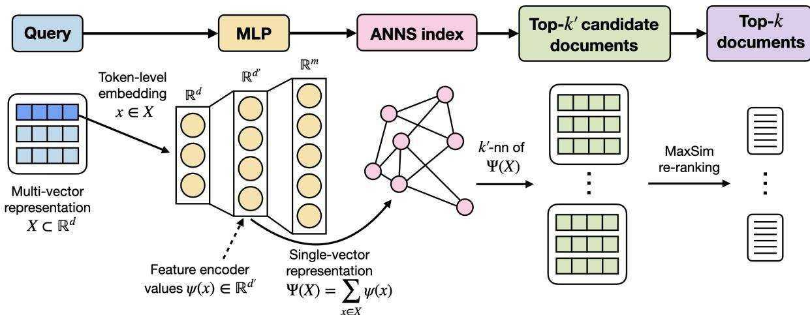
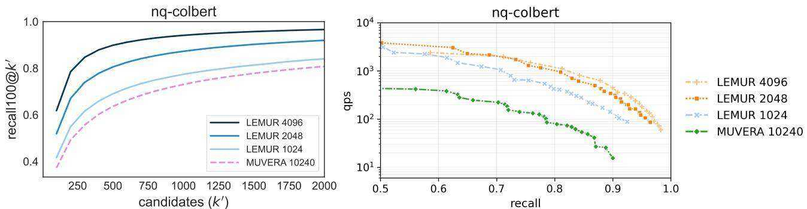
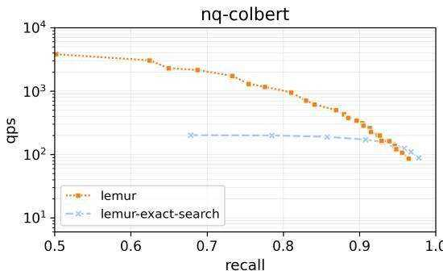
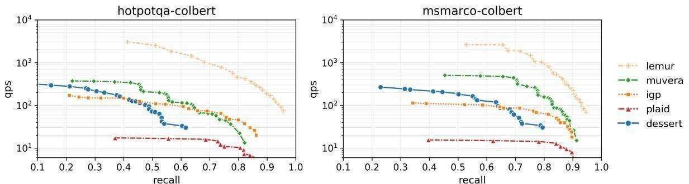
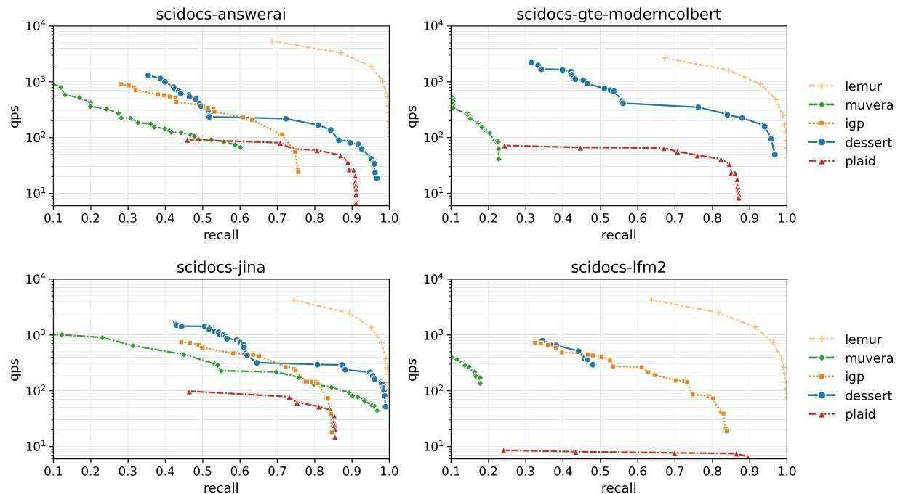
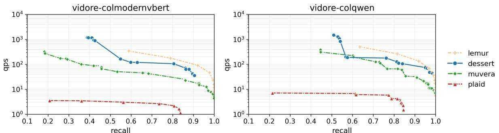

# LEMUR: Learned Multi-Vector Retrieval

Elias Ja¨asaari ¨ 1 Ville Hyvonen ¨ 1 Teemu Roos 1

# Abstract

Multi-vector representations generated by late interaction models, such as ColBERT, enable superior retrieval quality compared to single-vector representations in information retrieval applications. In multi-vector retrieval systems, both queries and documents are encoded using one embedding for each token, and similarity between queries and documents is measured by the MaxSim similarity measure. However, the improved recall of multi-vector retrieval comes at the expense of significantly increased latency. This necessitates designing efficient approximate nearest neighbor search (ANNS) algorithms for multivector search. In this work, we introduce LEMUR, a simple-yet-efficient framework for multi-vector similarity search. LEMUR consists of two consecutive problem reductions: We first formulate multi-vector similarity search as a supervised learning problem that can be solved using a onehidden-layer neural network. Second, we reduce inference under this model to single-vector similarity search in its latent space, which enables the use of existing single-vector ANNS methods for speeding up retrieval. In addition to performance evaluation on ColBERTv2 embeddings, we evaluate LEMUR on embeddings generated by modern multi-vector text models and multi-vector visual document retrieval models. LEMUR is an order of magnitude faster than earlier multi-vector similarity search methods.

# 1. Introduction

Embeddings generated by deep neural networks power modern information retrieval (IR) applications, such as document or passage retrieval, open-ended generation, and question answering. In the single-vector paradigm, both the query and the documents are represented by (single) points in the same vector space. The inner product between a query embedding and a document embedding can be used to measure the document-query similarity in an efficient fashion. The latency of single-vector retrieval can be further improved by leveraging approximate nearest neighbor search (ANNS) libraries, such as Faiss (Douze et al., 2025), ScANN (Guo et al., 2020), and LoRANN (Ja¨asaari et al. ¨ , 2024). This enables scaling single-vector retrieval to massive document collections.

Khattab & Zaharia (2020) introduced ColBERT, whose late interaction mechanism enables multi-vector retrieval. Multivector models represent both queries and documents as sets of embeddings, generating one embedding per token. In multi-vector retrieval, the similarity between a query and a document is measured by MaxSim similarity

$$
\operatorname { M a x S i m } ( X , C ) = \sum _ { x \in X } \operatorname* { m a x } _ { c \in C } \langle x , c \rangle ,
$$

where $X , C \subset \mathbb { R } ^ { d }$ denote the sets of embeddings of a query and a document, respectively.

Due to their better expressivity enabled by more fine-grained token-level representations, multi-vector models tend to have superior accuracy compared to single-vector models in IR applications (e.g., Khattab et al., 2021; Thakur et al., 2021; Lin et al., 2023). This has motivated the rapid development of novel multi-vector models. After the introduction of ColBERT and ColBERTv2 (Santhanam et al., 2022b), better-performing (Jha et al., 2024; Amini et al., 2025; Clavie´, 2025) and more memory-efficient (Takehi et al., 2025) multi-vector models have been introduced. In addition to retrieval from text corpora, multi-vector models such as ColPali (Faysse et al., 2025) have recently achieved state-of-the-art results in visual document retrieval (Gunther¨ et al., 2025; Xu et al., 2025; Teiletche et al., 2025).

The improvement in the retrieval accuracy of multi-vector models comes at the expense of increased retrieval latency. This has motivated the development of multi-vector similarity search algorithms and systems, such as PLAID (Santhanam et al., 2022b), DESSERT (Engels et al., 2023), EMVB (Nardini et al., 2024), and IGP (Bian et al., 2025). These methods rely on token-level pruning of documents as the first step of their pipeline: they first retrieve the most similar document tokens from the collection of all the document tokens for each query token, and then limit the search to the documents containing the selected tokens. However, token-level similarity between a query token and a document token is an inaccurate proxy for the MaxSim similarity of the query-document pair containing them (Lee et al., 2023; Jayaram et al., 2024). Thus, a large set of documents has to be reranked to reach accurate results, which leads to prohibitively high latency at high recall levels.

  
Figure 1. A schematic overview of the query process (for indexing, see Sec. 3) in the LEMUR framework: The latent representations $\psi ( x )$ of the token-level embeddings $x \in X$ are retrieved from the hidden layer of an MLP trained to estimate the MaxSim similarities between a query and each document. The single-vector representation $\Psi ( X )$ is obtained by pooling these latent representations. The $k ^ { \prime }$ most similar documents to $\Psi ( X )$ are retrieved using an ANNS index. The final top- $k$ documents are selected by evaluating the exact MaxSim similarities to these $k ^ { \prime }$ documents.

MUVERA (Jayaram et al., 2024) does not rely on tokenlevel pruning. Instead, it reduces multi-vector similarity search to single-vector similarity search by generating a single fixed-dimensional encoding (FDE) per document or query. This single-vector reduction has enabled integrating MUVERA directly into state-of-the-art vector databases such as Weaviate and Qdrant. However, high-dimensional FDEs are required for accurate retrieval (see Fig. 2), which leads to large memory consumption and high latency.

Thus, more efficient multi-vector similarity search methods are required to realize the full potential of multi-vector retrieval. To this end, we introduce a simple-yet-effective framework (see Fig. 1 above) for multi-vector similarity search. The framework consists of two consecutive problem reductions: first to a supervised learning task, and then to single-vector similarity search.

Our first key idea is that the approximation of the MaxSim similarity between a query and the documents can be formulated as a supervised learning task. Specifically, it is a multi-output regression problem where there are as many outputs as there are documents in a corpus. This enables training a neural network directly for this learning task.

Our second key idea is that the MaxSim estimates of the model trained for this task are computed as inner products between two vectors that can be interpreted as single-vector representations of the query and the document. This enables reducing multi-vector similarity search to single-vector similarity search in the latent space of the model, and thus leveraging highly optimized single-vector ANNS libraries to speed up multi-vector retrieval on massive corpora.

We call the proposed framework LEMUR (Learned Multi-Vector Retrieval), and publish it as an open source library. In addition to embeddings generated by ColBERTv2, we evaluate the performance of multi-vector similarity search methods on embeddings generated by modern multi-vector text models (Jha et al., 2024; Chaffin, 2025; Clavie´, 2025; Amini et al., 2025) and visual document retrieval models (Faysse et al., 2025; Teiletche et al., 2025). LEMUR significantly outperforms the state-of-the-art methods on all datasets. The difference is especially pronounced on non-ColBERTv2 embeddings. The code for LEMUR is available at https://github.com/ejaasaari/lemur

In summary, our contributions are:

• We introduce LEMUR, a framework that reduces multivector similarity search to single-vector similarity search via a reformulation to a supervised learning task. An instantiation of LEMUR consists of a neural network and a single-vector ANNS method.

• We evaluate the performance of multi-vector similarity search methods on 6 BEIR benchmark datasets (Thakur et al., 2021) embedded using 5 different multi-vector text models, and on the visual retrieval dataset ViDoRe (Loison et al., 2026) embedded using 2 different multivector visual document models.

• We show that LEMUR outperforms the state-of-the-art multi-vector similarity search methods on all evaluated datasets, thus helping to bridge the latency gap between single-vector and multi-vector retrieval.

# 2. Background

# 2.1. Multi-vector retrieval

Multi-vector models represent both the query $\mathcal { X }$ and the $m$ corpus documents $\{ { \mathcal { C } } _ { j } \} _ { j = 1 } ^ { m }$ as sets of vectors by generating a $d$ -dimensional contextualized embedding for each query and document token. Denote the query encoder and the document encoder of a multi-vector model by $Q$ and $D$ , respectively. Further, denote the multi-vector representation of a query by $X = Q ( \mathcal { X } ) \subset \mathbb { R } ^ { d }$ , and the multi-vector representations of the documents by $C _ { j } = D ( \mathcal { C } _ { j } ) \subset \mathbb { R } ^ { d }$ for each $j = 1 , \dots , m$ . ColBERTv2 and most other multi-vector models truncate the query or augment it by padding it with [MASK] tokens so that all encoded queries have the same number of embeddings, whereas the encoded documents have a variable number of embeddings.

In multi-vector retrieval, the similarity between the multivector representations of a query and a document is measured by MaxSim similarity (sometimes also referred to as the Chamfer similarity). The MaxSim similarity between a query $X$ and a document $C$ is defined as

$$
\operatorname { M a x S i m } ( X , C ) = \sum _ { x \in X } \operatorname* { m a x } _ { c \in C } \langle x , c \rangle ,
$$

where each term is the similarity between a query token and the document token that is most similar to it, and the per-token similarity is measured by the inner product.

# 2.2. Single-vector similarity search

In single-vector similarity search, also called approximate nearest neighbor search (ANNS), both the query and the documents are represented by single embeddings. Denote the single-vector representations of the query and the documents by $x \in \mathbb { R } ^ { d ^ { \prime } }$ and $\{ c _ { j } \} _ { j = 1 } ^ { m } \subset \mathbb { R } ^ { d ^ { \prime } }$ , respectively. The task is to approximately identify the $k$ documents that are the most similar to the query, i.e., to approximate

$$
\begin{array} { r } { \mathrm { N N } _ { k } ( x ) : = \{ j \in [ m ] : s ( x , c _ { j } ) \geq s ( x , c ^ { ( k ) } ) \} , } \end{array}
$$

where $c ^ { ( 1 ) } , \ldots , c ^ { ( m ) }$ denote the documents ordered with respect to their similarity with query $x$ in the descending order, and $s : \mathbb { R } ^ { d } \times \mathbb { R } ^ { d } \to \mathbb { R }$ is a similarity measure. The most common similarity measures used are the inner product, cosine similarity, and (negative) Euclidean distance. When the similarity measure $s$ is the inner product, ANNS is often called maximum inner product search (MIPS) (e.g., Guo et al., 2020; Lu et al., 2023; Zhao et al., 2023).

The quality of the approximation $S \subset [ m ] , | S | = k$ is typically measured by

$$
\operatorname { R e c a l l } ( S ) = { \frac { | S \cap \mathbf { N N } _ { k } ( x ) | } { k } } ,
$$

i.e., as the fraction of the $k$ most similar documents correctly identified, and the efficiency is typically measured by query latency or by queries per second (QPS) (Li et al., 2019; Aumuller et al. ¨ , 2020; Ja¨asaari et al. ¨ , 2025).

# 2.3. Multi-vector similarity search

Compared to single-vector similarity measures, computing the MaxSim similarity is much more computationally intensive, since it requires evaluating the inner products between each pair of query embeddings and document embeddings. This makes multi-vector similarity search an even more performance-critical component in multi-vector retrieval. In multi-vector similarity search, the task is to approximate

$$
\operatorname { N N } _ { k } ( X ) : = \{ j \in [ m ] : s ( X , C _ { j } ) \geq s ( X , C ^ { ( k ) } ) \} ,
$$

where $C ^ { ( 1 ) } , \ldots , C ^ { ( m ) }$ denote the documents ordered w.r.t. their similarity with the query $X$ in descending order. This formulation is similar to the single-vector formulation (2) except now both the query $X \subset \mathbb { R } ^ { d }$ and the documents $C _ { j } \subset \mathbb { R } ^ { d }$ are sets, and the similarity measure $s ( \cdot , \cdot ) \ =$ $\mathrm { M a x S i m } ( \cdot , \cdot )$ operates on sets instead of vectors.

As in the case of single-vector search, we measure the quality of the approximation $S \in [ m ] , | S | = k$ , by recall (3) w.r.t. the true MaxSim $k$ -nearest neighbors $\left( k \mathrm { - n n } \right)$ , and the efficiency by query latency or by queries per second (QPS).

# 3. LEMUR Framework

In Sec. 3.1, we formulate multi-vector similarity search as a supervised learning task, and outline how a neural network can be trained for this task. The key detail is that while the target function $f$ operates on sets, it can be written as a sum of the values of a function $g$ that operates on vectors. Then, in Sec. 3.2, we reduce multi-vector similarity search to single-vector similarity search in the latent space of the model defined in Sec. 3.1. The problem reduction is based on the observation that the MaxSim estimates are computed as inner products between $d ^ { \prime }$ -dimensional vectors at the output layer of the model.

# 3.1. Supervised learning formulation

Given a corpus of documents $\{ C _ { j } \} _ { j = 1 } ^ { m }$ , we consider the task of approximating the MaxSim similarities between a query $X$ and the documents. We use the approximate MaxSim similarities to select $k ^ { \prime } > k$ candidate documents, and then rerank them by computing the exact MaxSim similarities.

Denote the target function by $f : 2 ^ { \mathbb { R } ^ { d } } \to \mathbb { R } ^ { m }$ , $f ( X ) =$ $( f _ { 1 } ( X ) , \ldots , f _ { m } ( X ) )$ , where

$$
f _ { l } ( X ) : = \mathrm { M a x } \mathrm { S i m } ( X , C _ { l } )
$$

for each $l \in [ m ]$ . While the input of the target function $f$ is a set with variable size, it can be written as

$$
f ( X ) = \sum _ { x \in X } g ( x ) ,
$$

where $g : \mathbb { R } ^ { d }  \mathbb { R } ^ { m }$ with

$$
g _ { l } ( x ) : = \operatorname* { m a x } _ { c \in C _ { l } } \left. c , x \right.
$$

for each $l \in [ m ]$ . Thus, it suffices to estimate the function $g$ that operates on vectors and represents the contributions of a token-level embedding $x \in X$ to the sum (1).

Estimating $g$ is a multi-output regression problem with $m$ outputs, and an MLP $\phi : \mathbb { R } ^ { d }  \mathbb { R } ^ { m }$ can be directly learned to solve this problem. We use the MSE loss, and train an MLP composed of a feature encoder $\psi : \mathbb { R } ^ { d }  \mathbb { R } ^ { d ^ { \prime } }$ and a linear output layer (without a bias) so that the function $g$ can be estimated as

$$
g ( x ) \approx \phi ( x ) = W \psi ( x ) ,
$$

where $W \in \mathbb { R } ^ { m \times d ^ { \prime } }$ . Because the output layer is linear, the final MaxSim estimates of the model can be computed as

$$
f ( X ) \approx \sum _ { x \in X } W \psi ( x ) = W \sum _ { x \in X } \psi ( x ) = W \Psi ( X ) ,
$$

where $\textstyle \Psi ( X ) : = \sum _ { x \in X } \psi ( x )$ denotes the pooled features of the query.

# 3.2. Problem reduction to single-vector ANNS

Since the number of documents $m$ can be large, the most computationally expensive part of the model inference is the computation of the matrix-vector product (5) at the output layer. However, note that we can write (5) as

$$
\begin{array} { r } { f ( X ) \approx W \Psi ( X ) = ( \langle w _ { 1 } , \Psi ( X ) \rangle , \dots \langle w _ { m } , \Psi ( X ) \rangle ) , } \end{array}
$$

where the vectors $w _ { j } \in \mathbb { R } ^ { d ^ { \prime } }$ , $j = 1 , \ldots , m$ , are rows of the weight matrix $W$ . In other words, each of the $m$ outputs is given by the inner product of the query and a document, both represented in the same $d ^ { \prime }$ -dimensional latent space: the document embeddings $\{ w _ { j } \} _ { j = 1 } ^ { m }$ are learned as the weights of the output layer, and the query embedding $\Psi ( X )$ is obtained by pooling the feature encoder values $\psi ( x )$ .

Further, we do not need MaxSim estimates for all $m$ documents but are only interested in finding the $k ^ { \prime }$ documents with the largest MaxSim estimates. Finding the $k ^ { \prime }$ largest values in (6) is a just a single-vector MIPS problem in the $d ^ { \prime }$ -dimensional latent space. Hence, given the feature encoder values, MaxSim similarities between the query and the documents can be approximated by a single-vector ANNS algorithm with the weight vectors $\{ w _ { j } \} _ { j = 1 } ^ { m }$ as the corpus.

# 4. Implementation

# 4.1. Network architecture

$$
\psi ( x ) = \mathrm { L N } ( \mathrm { G E L U } ( W ^ { \prime } x + b ) ) ,
$$

We use a small two-layer MLP as the network $\phi$ . This allows us to keep the inference cost trivial and to train the network quickly even on a CPU. The feature encoder $\psi$ is defined as where $\mathrm { L N } ( \cdot )$ is layer normalization (Ba et al., 2016) and GELU(·) is the GELU activation function (Hendrycks & Gimpel, 2016), $W ^ { \prime } \in \mathbb { R } ^ { d ^ { \prime } \times d }$ , and $b \in \mathbb { R } ^ { d ^ { \prime } }$ . We did not observe significant performance gains from increasing the network depth beyond two layers. Based on our ablation study (See Sec. 6.2), we fix the hidden layer size to $d ^ { \prime } = 2 0 4 8$ in all other experiments. Increasing $d ^ { \prime }$ further improves the accuracy of the MaxSim estimates, but has only a small impact on the end-to-end performance, since it also increases the computational cost of retrieval.

In all of the experiments, we always use the same hyperparameters to train the model; see Appendix A.

# 4.2. Training set selection

Since only some of the datasets used in our experiments have a separate set of training queries, we use the corpus documents encoded using the query encoder to train LEMUR in all of our experiments for consistency. Formally, we sample a small subset of $n ^ { \prime } \ll m$ corpus documents, denoted by $\mathcal { C } _ { 1 } , \ldots . \mathcal { C } _ { n ^ { \prime } }$ , encode them using the query encoder of the multi-vector model as $X _ { i } = Q ( \mathcal { C } _ { i } )$ for each $i \in [ n ^ { \prime } ]$ , and sample $n$ token embeddings for the training set of the model $\phi$ from the set $\cup _ { i = 1 } ^ { n ^ { \prime } } X _ { i }$ .

In case there is a separate training set of queries $\mathcal { X } _ { 1 } , \ldots , \mathcal { X } _ { n ^ { \prime } }$ available, the query encoder of the multi-vector model can be used to generate the multi-vector representations $X _ { 1 } , \ldots , X _ { n ^ { \prime } }$ , where $X _ { i } = Q ( \mathcal { X } _ { i } )$ , and the training set can be sampled from $\cup _ { i = 1 } ^ { n ^ { \prime } } X _ { i }$ . Our results (see Appendix D.2) indicate that using actual queries (when available) for training yields even higher performance than using documents.

Surprisingly, even when the training set is sampled directly from the embeddings of the corpus $C _ { 1 } , \ldots , C _ { m }$ (encoded using the document encoder $D$ ), LEMUR has a consistent performance and still outperforms the baseline methods (see Appendix D.1). This training method requires neither additional data nor the use of an encoder. In summary, our results suggest that LEMUR is relatively robust with respect to the type of data used to train the model.

# 4.3. Scalable model training

To scale the model training to large corpora, we pre-train the feature encoder $\psi$ using a subset of the documents as targets, i.e., we randomly sample $m ^ { \prime } \ll m$ documents and

define the target function as $g ^ { \prime } : \mathbb { R } ^ { d }  \mathbb { R } ^ { m ^ { \prime } }$ ,

$$
g ^ { \prime } = g _ { I ^ { \prime } } ,
$$

where $I ^ { \prime } \subset [ m ]$ denotes the indices of the $m ^ { \prime }$ sampled documents. Using these auxiliary targets, we train a model $\phi ^ { \prime } : \mathbb { R } ^ { d }  \mathbb { R } ^ { m ^ { \prime } }$ ,

$$
\phi ^ { \prime } ( x ) = W ^ { \prime \prime } \psi ( x ) ,
$$

where $W ^ { \prime \prime } \in \mathbb { R } ^ { m ^ { \prime } \times d ^ { \prime } }$ . We fix the weights of the feature encoder $\psi$ , and learn the $j$ th row of the final weight matrix $W$ of the output layer of the final model $\phi$ as

$$
\boldsymbol { w } _ { j } = \underset { \beta \in \mathbb { R } ^ { d ^ { \prime } } } { \arg \operatorname* { m i n } } \ E \left[ \| \beta ^ { T } \boldsymbol { \psi } ( \boldsymbol { x } ) - g _ { j } ( \boldsymbol { x } ) \| _ { 2 } ^ { 2 } \right]
$$

for each $j \in [ m ]$ . When the weights of $\psi$ are fixed, (7) is a standard linear regression task that admits a closed form OLS solution. To speed up computation, we sample a smaller training set of size $n ^ { \prime }$ for computing the OLS solutions. On our experimental setup (see Sec. 6.1), we are able to process over 1000 documents per second; this also means that new documents can be indexed quickly.

# 5. Related work

# 5.1. Multi-vector similarity search

The retrieval system of ColBERT (Khattab & Zaharia, 2020) relies on token-level pruning of documents: For each query token, the most similar document tokens are first retrieved from $\cup _ { j = 1 } ^ { m } C _ { j }$ , i.e., from the the set of all the document tokens. The documents containing the retrieved tokens are reranked by evaluating their MaxSim similarities with the query. PLAID (Santhanam et al., 2022a), DESSERT (Engels et al., 2023), EMVB (Nardini et al., 2024), and IGP (Bian et al., 2025) improve the latency and memory efficiency of this basic scheme by adding different pruning and approximation steps.

Like LEMUR, MUVERA (Jayaram et al., 2024) reduces multi-vector similarity search to single-vector similarity search by generating single-vector encodings for the query and the documents, after which any single-vector ANNS library can be used for retrieval. However, the representations of MUVERA are data-oblivious, whereas the representations of LEMUR are learned in a supervised fashion by a model that is directly optimized for the task of interest.

# 5.2. Reducing the storage cost of multi-vector models

Compared to single-vector retrieval, multi-vector retrieval methods have both larger memory footprints and higher latencies because of the large number of embeddings that have to be stored and processed. There exist many recent works (e.g., Lee et al., 2023; Clavie et al. ´ , 2024; MacAvaney & Tonellotto, 2024; Yan et al., 2025; Veneroso et al., 2025) that address the increased storage cost by decreasing the number of embeddings per document. These methods are orthogonal to our approach and can be combined with it.

Table 1. Datasets used in the experiments.   

<table><tr><td colspan="3"></td><td rowspan="2"># embeddings (average)</td></tr><tr><td>dataset</td><td># corpus</td><td># queries</td></tr><tr><td>MS MARCO</td><td>8841823</td><td>6980</td><td>67.5</td></tr><tr><td>HotpotQA</td><td>5233329</td><td>7405</td><td>58.6</td></tr><tr><td>NQ</td><td>2681468</td><td>3452</td><td>85.2</td></tr><tr><td>Quora</td><td>522931</td><td>10000</td><td>15.6</td></tr><tr><td>SCIDOCS</td><td>25657</td><td>1000</td><td>147.0</td></tr><tr><td>ArguAna</td><td>8674</td><td>1406</td><td>139.7</td></tr><tr><td>ViDoRe</td><td>12969</td><td>100</td><td>1073.3</td></tr></table>

# 6. Experiments

# 6.1. Experimental setup

Each experiment is run on a compute node with two 20 core Intel Xeon Gold 6230 (Cascade Lake) CPUs. Each CPU has support for AVX-512 instructions and we run our experiments on all 40 cores, parallelizing over queries.

Datasets. For text models, we use six retrieval datasets from the BEIR (Thakur et al., 2021) benchmark. Following Santhanam et al. (2022a) and Jayaram et al. (2024), we use the development set on MS MARCO and the test set on all the other datasets. For visual document retrieval models, we pool together images and queries from five english language ViDoRe V3 (Loison et al., 2026) datasets. Table 1 lists for each dataset the number of documents, the number of test queries, and the average number of embeddings per document (using ColBERTv2 for the text datasets, and ColQwen2 for ViDoRe). We use the value $k = 1 0 0$ in all of the experiments of this section; for additional results with $k = 1 0$ , see Appendix B.2.

Embedding models. In our main experiments, we use the widely-used ColBERTv2 (Santhanam et al., 2022b) model. In Sec. 6.3, we measure the end-to-end performance also on the answerai-colbert-small-v1 (Clavie´, 2025), GTE-ModernColBERT-v1 (Chaffin, 2025), LFM2-ColBERT-350M (Amini et al., 2025), and jina-colbert-v2 (Jha et al., 2024) text retrieval models, and the ColModern-VBERT (Teiletche et al., 2025) and ColQwen2-v1.0 (Faysse et al., 2025) visual document retrieval models.

# 6.2. Ablation study

Latent space dimension. By varying the hidden layer size $d ^ { \prime }$ of the model $\phi$ , we study the effect of the dimension of the single-vector embeddings generated by LEMUR to retrieval accuracy. Specifically, we measure the proportion of the true MaxSim 100-nn of a query contained in the top- $k ^ { \prime }$ candidates (Recall $1 0 0 @ k ^ { \prime } )$ ) that are selected by exact inference under the model $\phi$ . Increasing the dimension of the latent space consistently improves recall (Fig. 2, left). As a baseline, we use 10240-dimensional FDEs generated by MUVERA. The results indicate that the single-vector embeddings generated by LEMUR are significantly more accurate than FDEs: on 5 out of 6 datasets (see Appendix B), even the smallest 1024-dimensional embeddings yield a higher recall than the 10x larger FDEs.

  
Figure 2. Ablation study on the effect of the hidden layer size $d ^ { \prime }$ on the performance of LEMUR. Left: Comparison of recall $1 0 0 @ k ^ { \prime }$ for three values of $d ^ { \prime }$ as a function of the candidate set size $k ^ { \prime }$ . Right: Comparison of the end-to-end-performance comparison between different values of $d ^ { \prime }$ with ANNS and reranking included. While larger values of $d ^ { \prime }$ can yield more accurate estimates, the end-to-end performance gap is narrower due to increased ANNS complexity, yielding diminishing returns.

We then study the effect of the latent space dimension $d ^ { \prime }$ of the model to the end-to-end latency (see Fig. 2, right, and Appendix B). While increasing $d ^ { \prime }$ from 1024 to 2048 significantly improves latency, there is a point of diminishing returns when $d ^ { \prime }$ is increased to 4096: even though a larger latent space dimension yields higher-quality candidates (as established in Fig. 2, left), it also increases the computational cost of querying the ANNS index, which partially offsets the accuracy gains. This also explains why the performance gap to 10240-dimensional FDEs is even larger in the end-to-end setting. While using the value $d ^ { \prime } = 4 0 9 6$ leads to lower latency than $d ^ { \prime } = 2 0 4 8$ on some of the datasets (see Appendix B), the differences in performance are small. Hence, we use $d ^ { \prime } = 2 0 4 8$ in our end-to-end experiments to decrease the memory consumption.

  
Figure 3. Ablation study on the effect of using ANNS in LEMUR. ANNS significantly speeds up retrieval at recall levels $< 0 . 9 5$ .

ANNS library vs. exact inference. Finally, we study the effect of using an ANNS index instead of evaluating the exact inner products (6) to retrieve the top- $k ^ { \prime }$ candidate documents. On small datasets $m \leq 5 0 0 0 0 )$ , evaluating the exact inner products is sufficiently fast. However, on large datasets, an ANNS index has potential to speed up retrieval significantly. We compare exact inner product computation to approximate top- $k ^ { \prime }$ retrieval using the Glass (Wang, 2025) ANNS library on the NQ dataset (with $m = 2 6 8 1 4 6 8$ documents). The results (Fig. 3) show that using an ANNS library speeds up retrieval significantly at recall levels $< 0 . 9 5$ .

# 6.3. End-to-end performance

In this section, we compare the end-to-end performance of LEMUR against MUVERA (Jayaram et al., 2024), DESSERT (Engels et al., 2023), IGP (Bian et al., 2025), and PLAID (Santhanam et al., 2022a). We use recall to measure the effectivity and queries per second (QPS) to measure the efficiency of the algorithms.

LEMUR implementation. For LEMUR, we use PyTorch for both training and inference of the model described in

Table 2. Best QPS at $\geq 8 0 \%$ recall $( k = 1 0 0 )$ ).   

<table><tr><td>Dataset</td><td>lemur</td><td>muvera</td><td>igp</td><td>dessert</td><td>plaid</td></tr><tr><td>MSMARCO</td><td>799</td><td>150</td><td>62</td><td></td><td>13</td></tr><tr><td>HotpotQA</td><td>425</td><td>22</td><td>37</td><td></td><td>10</td></tr><tr><td>NQ</td><td>950</td><td>79</td><td>107</td><td>38</td><td>16</td></tr><tr><td>Quora</td><td>6503</td><td>787</td><td>679</td><td>284</td><td>89</td></tr><tr><td>SCIDOCS</td><td>3353</td><td>391</td><td>320</td><td>285</td><td>85</td></tr><tr><td>ArguAna</td><td>6924</td><td>891</td><td>467</td><td>576</td><td>76</td></tr></table>

  
Figure 4. End-to-end performance comparison using ColBERTv2 embeddings on the HotpotQA (left) and MS MARCO (right) datasets. On both datasets, LEMUR is significantly faster than the baseline methods.

Sec. 4. As a single-vector similarity search library, we use Glass (Wang, 2025), an efficient implementation of HNSW (Malkov & Yashunin, 2018) with scalar quantization. We implement the MaxSim reranking using $\mathrm { C } { + } { + }$ .

Baseline implementations. For MUVERA, we use the official $\mathrm { C } { + } { + }$ implementation to generate the FDEs. To ensure a fair comparison, we combine also the FDEs of MUVERA with Glass and the same reranking implementation we use for LEMUR. For DESSERT and IGP, we use the official $\mathrm { C } { + + }$ implementations, and for PLAID, we use the Rust implementation in the fast-plaid library (Sourty, 2025).

Index hyperparameters. For both LEMUR and the baseline methods, we fix the index hyperparameters to values recommended by authors, except for DESSERT, for which we perform a grid search over $L \in \{ 3 2 , 6 4 \} , C \in \{ 5 , 7 \}$ . Specifically, for LEMUR, we use the hidden layer size $d ^ { \prime } = 2 0 4 8$ ; for MUVERA, as recommended by Jayaram et al. (2024), we set $R _ { \mathrm { r e p s } } = 4 0$ , $k _ { \mathrm { s i m } } = 6 , d _ { \mathrm { p r o j } } = d$ and then apply a final projection to generate 10240-dimensional FDEs; for PLAID, DESSERT, and IGP, we set the number of clusters as $1 6 \sqrt { n }$ (rounded down to the nearest power of two), where $n$ is the total number of corpus token embeddings.

Query hyperparameters. For LEMUR and MUVERA, we vary the candidate list size parameter (ef search) of the ANNS library, and the number of documents reranked $( k ^ { \prime } )$ . For the other methods, we vary the number of clusters probed and the number of reranked documents. We perform a grid search over the query hyperparameters and report the results on the Pareto optimal hyperparameter combinations.

ColBERTv2 embeddings. First, we consider BEIR datasets embedded using the ColBERTv2 model (See Table 2, Fig. 4, and Appendix C.1). LEMUR consistently outperforms the earlier methods. In particular, at $80 \%$ recall, it is 5-11x faster than the best-performing baseline method.

Other text embedding models. We then consider the BEIR datasets SCIDOCS (see Fig. 5) and Quora (see Appendix C.2) embedded using the answerai-colbert-smallv1, GTE-ModernColBERT-v1, LFM2-ColBERT-350M, and jina-colbert-v2 models. Again, LEMUR significantly outperforms the baseline methods. We also observe that some of the baseline methods struggle on these embeddings. In particular, MUVERA fails to reach over $60 \%$ recall on the answerai-colbert-small, GTE-ModernColBERT, and LFM2- ColBERT embeddings.

Visual document models. Finally, we consider the Vi-DoRe dataset embedded using the ColModernVBERT and ColQwen2-v1.0 models (see Fig. 6). LEMUR outperforms the baseline methods in both cases. Since our default training set selection strategy is not available for visual document retrieval models, we simply use documents embedded using the document encoder $D$ as a training set (the third strategy mentioned in Sec. 4.2); using a separate query set for training yields even better performance (see Appendix D.2).

# 7. Discussion

Because of their fine-grained representation that captures token-level interactions, multi-vector models are more expressive, and, consequently, tend to have a higher retrieval quality, than single-vector models. However, the high latency of multi-vector retrieval engines has hindered their wider adoption. To address this issue, we introduce LEMUR, a simple-yet-efficient framework that is an order of magnitude faster than earlier multi-vector similarity search methods, thus enabling efficient multi-vector retrieval at scale. Moreover, LEMUR produces single-vector representations for both the query and the documents, reducing the task to single-vector similarity search. This enables easy integration with state-of-the-art single-vector ANNS libraries.

Because they are learned in a supervised fashion, the singlevector embeddings generated by LEMUR are significantly more accurate than the fixed-dimensional encodings (FDEs) (Jayaram et al., 2024) that have been used for single-vector reduction earlier: in particular, 1024-dimensional LEMUR embeddings yield higher recall than 10240-dimensional FDEs (see Sec. 6.2). This enables using lower-dimensional single-vector embeddings, which decreases the memory footprint and leads to lower end-to-end latency due to faster single-vector similarity search. Standard scalar or product quantization (Jegou et al., 2011) techniques could be applied to the single-vector embeddings generated by LEMUR to further decrease memory consumption and end-to-end latency.

  
Figure 5. End-to-end performance comparison using four different modern multi-vector text models on the SCIDOCS dataset. On all datasets, LEMUR is significantly faster than the baseline methods, while especially MUVERA struggles on the non-ColBERTv2 models.

  
Figure 6. End-to-end performance comparison using two visual document retrieval models on the ViDoRe dataset. LEMUR yields state-of-the-art performance compared to the baselines, but the gap is narrower than for the text models.

The performance of earlier multi-vector similarity search methods has been evaluated almost exclusively on Col-BERTv2 (Santhanam et al., 2022b) embeddings. In this work, we conduct a performance evaluation on four other multi-vector text models and on two multi-vector visual document retrieval models (see Sec. 6.3). Our results indicate that the multi-vector model used to generate the embeddings has a larger impact on the performance of multi-vector similarity search methods than the embedded dataset. In particular, most of the earlier methods either fail to achieve acceptable recall levels at all, or have prohibitively high latency on the LFM2-ColBERT (Amini et al., 2025) and answerai-colbert-small (Clavie´, 2025) embeddings. In contrast, LEMUR consistently reaches the highest recall levels and has low latency regardless of the multi-vector model used to generate the embeddings. The above observations underline the importance of establishing robust benchmarking practices for multi-vector similarity search.

Limitations. While we do not optimize for memory consumption of the multi-vector representations in this work, LEMUR can be combined with scalar quantization to 8-bit precision and with methods reducing the number of stored multi-vector embeddings (e.g., Yan et al., 2025; Veneroso et al., 2025) that are orthogonal to it. We leave compatibility with extreme low-precision compression, such as 2-bit quantization, as future work.

# Acknowledgments

This work has been supported by the Research Council of Finland (grant #361902 and the Flagship programme: Finnish Center for Artificial Intelligence FCAI). The authors wish to acknowledge CSC – IT Center for Science, Finland, for computational resources.