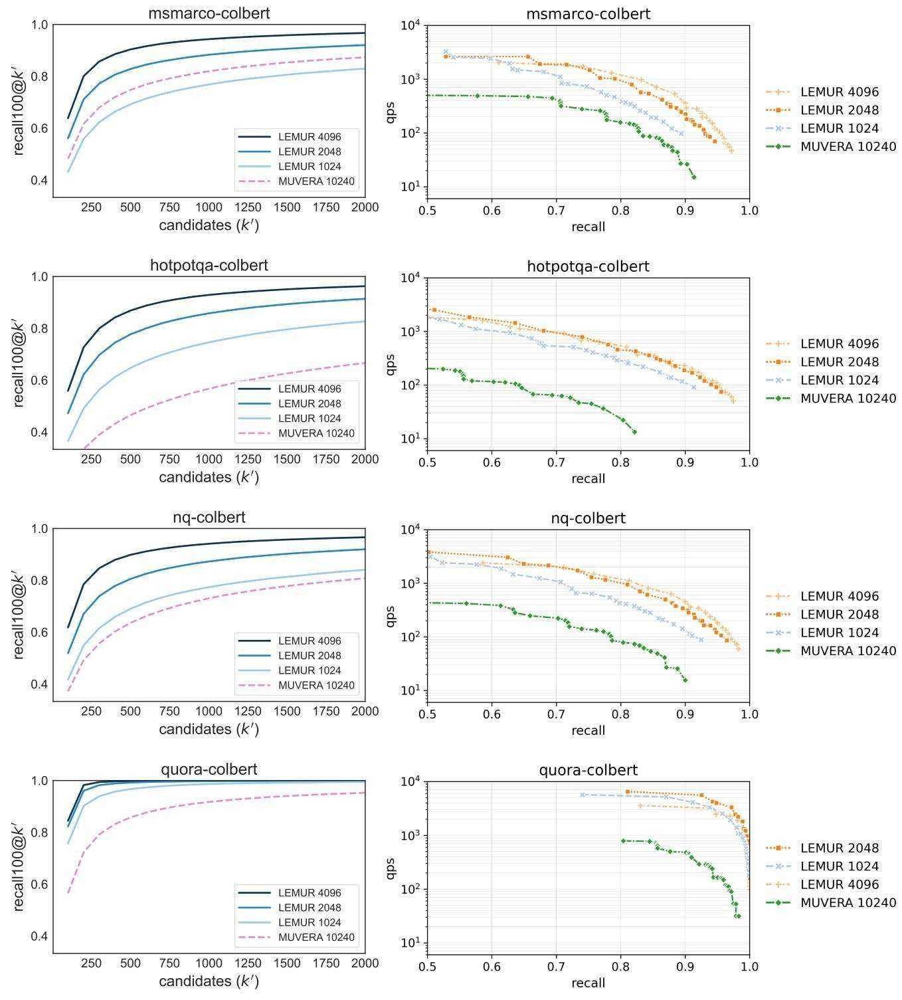
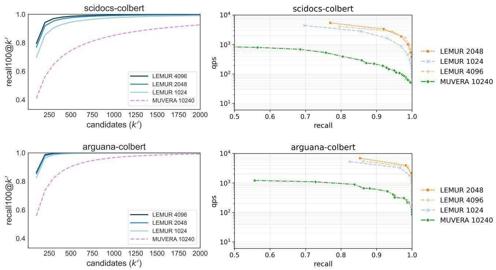
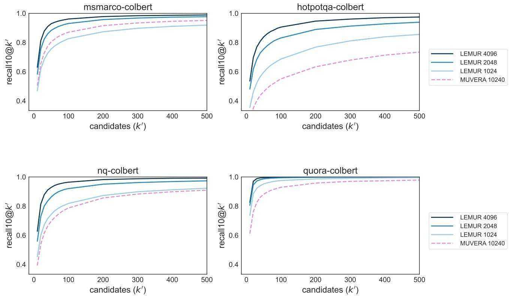
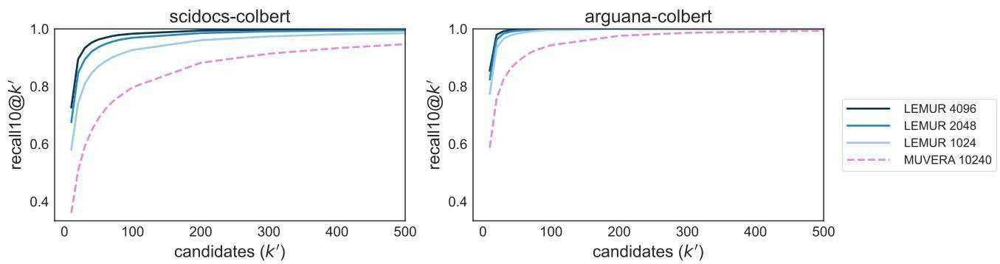
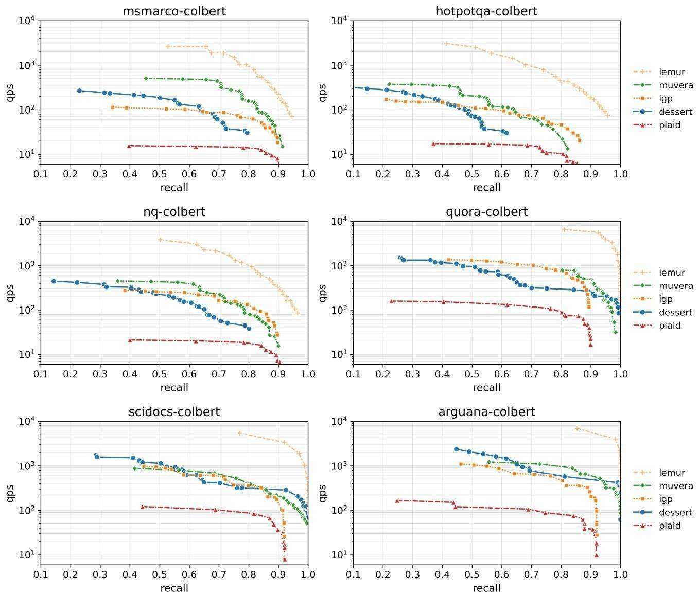
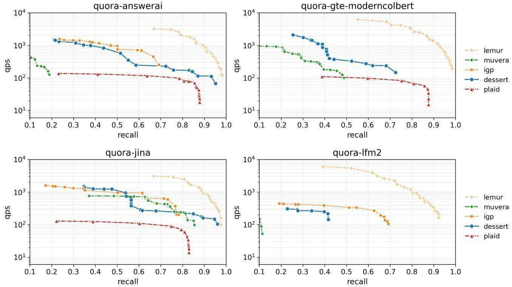
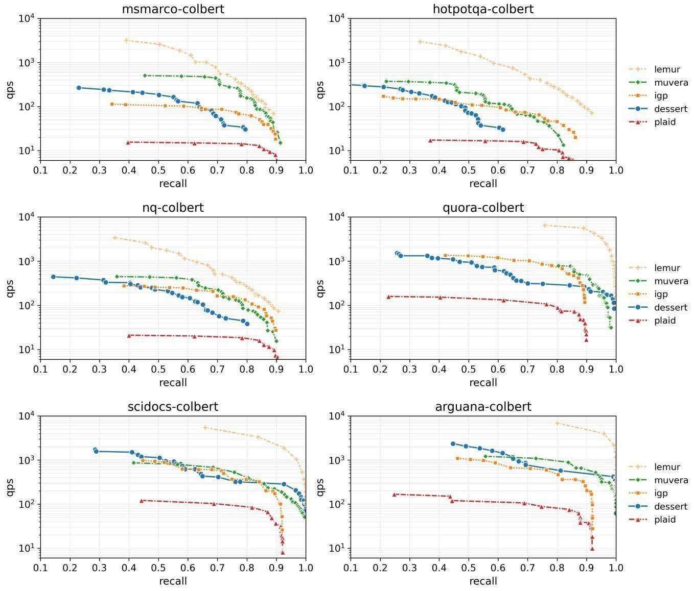
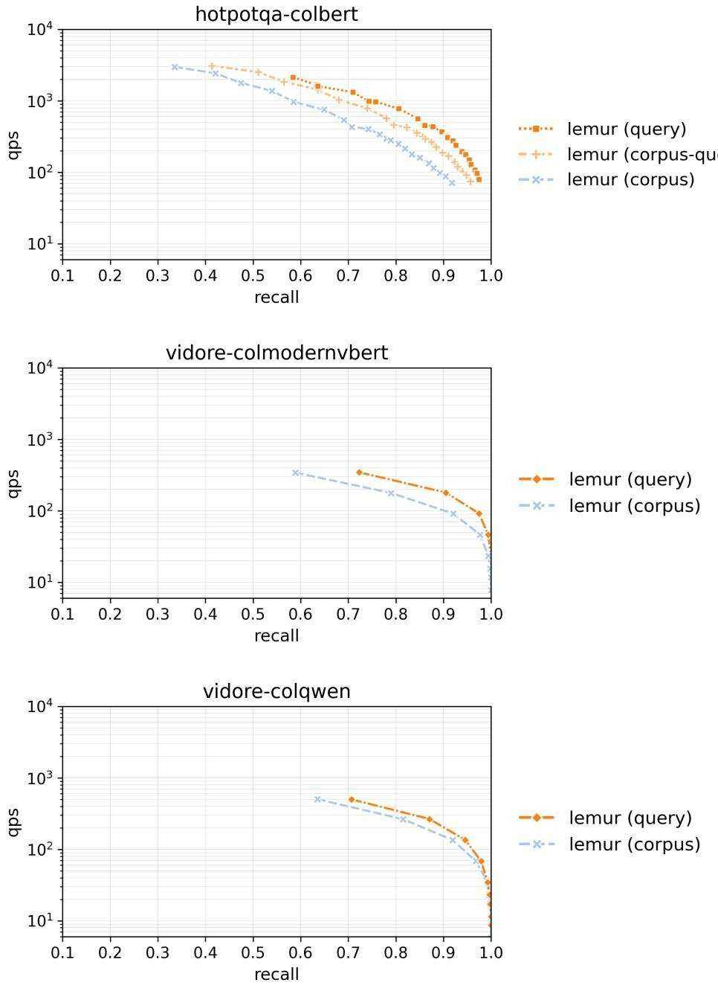

Amini, A., Banaszak, A., Benoit, H., Bo¨ ok, A., Dakhran, ¨ T., Duong, S., Eng, A., Fernandes, F., Hark ¨ onen, M., ¨ Harrington, A., et al. LFM2 technical report. arXiv preprint arXiv:2511.23404, 2025.

Aumuller, M., Bernhardsson, E., and Faithfull, A. ANN-¨ benchmarks: A benchmarking tool for approximate nearest neighbor algorithms. Information Systems, 87:101374, 2020.

Ba, J. L., Kiros, J. R., and Hinton, G. E. Layer normalization. arXiv preprint arXiv:1607.06450, 2016.

Bian, Z., Yiu, M. L., and Tang, B. IGP: Efficient multivector retrieval via proximity graph index. In Proceedings of the 48th International ACM SIGIR Conference on Research and Development in Information Retrieval, pp. 2524–2533, 2025.

Chaffin, A. GTE-ModernColBERT, 2025. URL https://huggingface.co/lightonai/ GTE-ModernColBERT-v1.

Clavie, B. JaColBERTv2.5: Optimising multi-vector re-´ trievers to create state-of-the-art japanese retrievers with constrained resources. Journal of Natural Language Processing, 32(1):176–218, 2025.

Clavie, B., Chaffin, A., and Adams, G. Reducing the ´ footprint of multi-vector retrieval with minimal performance impact via token pooling. arXiv preprint arXiv:2409.14683, 2024.

Douze, M., Guzhva, A., Deng, C., Johnson, J., Szilvasy, G., Mazare, P.-E., Lomeli, M., Hosseini, L., and J ´ egou, H. ´ The Faiss library. IEEE Transactions on Big Data, 2025.

Engels, J., Coleman, B., Lakshman, V., and Shrivastava, A. DESSERT: an efficient algorithm for vector set search with vector set queries. Advances in Neural Information Processing Systems, 36:67972–67992, 2023.

Faysse, M., Sibille, H., Wu, T., Omrani, B., Viaud, G., Hudelot, C., and Colombo, P. ColPali: Efficient document retrieval with vision language models. In The Thirteenth International Conference on Learning Representations, 2025.

Gunther, M., Sturua, S., Akram, M. K., Mohr, I., Ungureanu, ¨ A., Wang, B., Eslami, S., Martens, S., Werk, M., Wang, N., et al. jina-embeddings-v4: Universal embeddings for multimodal multilingual retrieval. In Proceedings of the 5th Workshop on Multilingual Representation Learning (MRL 2025), pp. 531–550, 2025.

Guo, R., Sun, P., Lindgren, E., Geng, Q., Simcha, D., Chern, F., and Kumar, S. Accelerating large-scale inference with anisotropic vector quantization. In International Conference on Machine Learning, pp. 3887–3896. PMLR, 2020.

Hendrycks, D. and Gimpel, K. Gaussian error linear units (GELUs). arXiv preprint arXiv:1606.08415, 2016.

Ja¨asaari, E., Hyv¨ onen, V., and Roos, T. LoRANN: Low-¨ rank matrix factorization for approximate nearest neighbor search. Advances in Neural Information Processing Systems, 37:102121–102153, 2024.

Ja¨asaari, E., Hyv¨ onen, V., Ceccarello, M., Roos, T., and¨ Aumuller, M. VIBE: Vector index benchmark for embed-¨ dings. arXiv preprint arXiv:2505.17810, 2025.

Jayaram, R., Dhulipala, L., Hadian, M., Lee, J. D., and Mirrokni, V. MUVERA: Multi-vector retrieval via fixed dimensional encoding. Advances in Neural Information Processing Systems, 37:101042–101073, 2024.

Jegou, H., Douze, M., and Schmid, C. Product quantization for nearest neighbor search. IEEE Transactions on Pattern Analysis and Machine Intelligence, 33(1):117–128, 2011.

Jha, R., Wang, B., Gunther, M., Mastrapas, G., Sturua, S., ¨ Mohr, I., Koukounas, A., Wang, M. K., Wang, N., and Xiao, H. Jina-ColBERT-v2: A general-purpose multilingual late interaction retriever. In Proceedings of the Fourth Workshop on Multilingual Representation Learning (MRL 2024), pp. 159–166. Association for Computational Linguistics, 2024.

Khattab, O. and Zaharia, M. ColBERT: Efficient and effective passage search via contextualized late interaction over BERT. In Proceedings of the 43rd International ACM SIGIR Conference on Research and Development in Information Retrieval, pp. 39–48, 2020.

Khattab, O., Potts, C., and Zaharia, M. Relevance-guided supervision for OpenQA with ColBERT. Transactions of the Association for Computational Linguistics, 9:929– 944, 2021.

Kingma, D. P. Adam: A method for stochastic optimization. arXiv preprint arXiv:1412.6980, 2014.

Lee, J., Dai, Z., Duddu, S. M. K., Lei, T., Naim, I., Chang, M.-W., and Zhao, V. Rethinking the role of token retrieval in multi-vector retrieval. Advances in Neural Information Processing Systems, 36:15384–15405, 2023.

Li, W., Zhang, Y., Sun, Y., Wang, W., Li, M., Zhang, W., and Lin, X. Approximate nearest neighbor search on high dimensional data—experiments, analyses, and improvement. IEEE Transactions on Knowledge and Data Engineering, 32(8):1475–1488, 2019.

Lin, W., Chen, J., Mei, J., Coca, A., and Byrne, B. Finegrained late-interaction multi-modal retrieval for retrieval augmented visual question answering. Advances in Neural Information Processing Systems, 36:22820–22840, 2023.

Lu, Z., Chen, J., Lian, D., Zhang, Z., Ge, Y., and Chen, E. Knowledge distillation for high dimensional search index. In Advances in Neural Information Processing Systems, volume 36, pp. 33403–33419, 2023.

MacAvaney, S. and Tonellotto, N. A reproducibility study of PLAID. In Proceedings of the 47th International ACM SIGIR Conference on Research and Development in Information Retrieval, pp. 1411–1419, 2024.

Malkov, Y. A. and Yashunin, D. A. Efficient and robust approximate nearest neighbor search using hierarchical navigable small world graphs. IEEE Transactions on Pattern Analysis and Machine Intelligence, 42(4):824– 836, 2018.

Nardini, F. M., Rulli, C., and Venturini, R. Efficient multivector dense retrieval with bit vectors. In European Conference on Information Retrieval, pp. 3–17. Springer, 2024.

Santhanam, K., Khattab, O., Saad-Falcon, J., Potts, C., and Zaharia, M. ColBERTv2: Effective and efficient retrieval via lightweight late interaction. In Proceedings of the 2022 Conference of the North American Chapter of the Association for Computational Linguistics: Human Language Technologies, pp. 3715–3734, 2022b.

Santhanam, K., Khattab, O., Potts, C., and Zaharia, M. PLAID: an efficient engine for late interaction retrieval. In Proceedings of the 31st ACM International Conference on Information & Knowledge Management, pp. 1747– 1756, 2022a.

Sourty, R. FastPlaid: A high-performance engine for multivector search, 2025. URL https://github.com/ lightonai/fast-plaid.

Takehi, R., Clavie, B., Lee, S., and Shakir, A. Fantastic ´ (small) retrievers and how to train them: mxbai-edgecolbert-v0 tech report. arXiv preprint arXiv:2510.14880, 2025.

Teiletche, P., Mace, Q., Conti, M., Loison, A., Viaud, ´ G., Colombo, P., and Faysse, M. ModernVBERT: Towards smaller visual document retrievers. arXiv preprint arXiv:2510.01149, 2025.

Thakur, N., Reimers, N., Ruckl¨ e, A., Srivastava, A., and´ Gurevych, I. BEIR: A heterogeneous benchmark for zeroshot evaluation of information retrieval models. Advances in Neural Information Processing Systems, 34, 2021.

Veneroso, J., Jayaram, R., Rao, J., Abrego, G. H., Hadian, ´ M., and Cer, D. CRISP: Clustering multi-vector representations for denoising and pruning. arXiv preprint arXiv:2505.11471, 2025.

Wang, Z. Graph library for approximate similarity search, 2025. URL https://github.com/zilliztech/ pyglass.

Xu, M., Moreira, G., Ak, R., Osmulski, R., Babakhin, Y., Yu, Z., Schifferer, B., and Oldridge, E. Llama nemoretriever colembed: Top-performing text-image retrieval model. arXiv preprint arXiv:2507.05513, 2025.

Yan, Y., Xu, G., Zou, X., Liu, S., Kwok, J., and Hu, X. DocPruner: A storage-efficient framework for multivector visual document retrieval via adaptive patch-level embedding pruning. arXiv preprint arXiv:2509.23883, 2025.

Zhao, X., Zheng, B., Yi, X., Luan, X., Xie, C., Zhou, X., and Jensen, C. S. FARGO: Fast maximum inner product search via global multi-probing. Proceedings of the VLDB Endowment, 16(5):1100–1112, 2023.

# A. LEMUR hyperparameters

In this section, we list the hyperparameters used for training the model used in LEMUR (see Sec. 4). LEMUR is robust with respect to the hyperparameters and we use the same hyperparameters for all experiments in this paper.

Table 3. LEMUR model training hyperparameters.   

<table><tr><td>Corpus points sampled as outputs for model training (m′)</td><td>8192</td></tr><tr><td>Token embeddings sampled as model training set (n)</td><td>100 000</td></tr><tr><td>Token embeddings sampled for computing the OLS solutions (n′)</td><td>16 384</td></tr><tr><td>Optimizer</td><td>Adam (Kingma, 2014)</td></tr><tr><td>Learning rate</td><td>0.003</td></tr><tr><td>Epochs</td><td>100</td></tr><tr><td>Batch size</td><td>512</td></tr><tr><td>Gradient clip</td><td>0.5</td></tr></table>

We also standardize the outputs for training the MLP using the global mean and standard deviation of the output values.   
We use the Glass (Wang, 2025) library for ANNS with graph degree $R = 6 4$ and insertion-time beam width $L = 8 0 0$ .

# B. Ablation study additional results

# B.1. Additional results for $k = 1 0 0$

In this section, we present additional results for the embedding dimension ablation study on all six BEIR datasets for $k = 1 0 0$ . For discussion, see Sec. 6.2.

# B.2. Additional results for $k = 1 0$

In this section, we present additional results for the embedding dimension ablation study on all six BEIR datasets for $k = 1 0$ .   
The differences in recall between the configurations are similar as for $k = 1 0 0$ .

# C. End-to-end performance additional results

# C.1. ColBERTv2

In this section, we present the complete end-to-end performance results on all six BEIR datasets. On all six datasets, LEMUR significantly outperforms the baseline methods. For further discussion, see Sec. 6.3.

# C.2. Other multi-vector embedding models on Quora

In this section, we perform the experiment in Sec. 6.3 using the four different modern multi-vector embedding models on the Quora dataset. The results are similar as for the SCIDOCS dataset.

# D. Effect of query distribution

# D.1. Document encoder

In this section, we repeat the end-to-end performance experiments of Sec. 6.3 with LEMUR trained using a subset of the corpus $C _ { 1 } , \ldots , C _ { m }$ (encoded using the document encoder $D$ ) directly as a training set. This training method requires neither additional data, nor access to an encoder. LEMUR still significantly outperforms the baseline methods.

# D.2. Training set selection

In this section, we study the effect of using a separate sample of actual queries for training LEMUR. In the figures below, we consider LEMUR trained using three different training sets (see Sec. 4.2):

• lemur (query): a separate sample of training queries, encoded using the query encoder $Q$ • lemur (corpus-query): a sample of embeddings from the corpus documents encoded using the query encoder $Q$ (the default used in this paper, not available for visual document retrieval models) • lemur (corpus) $:$ a sample from the corpus token embeddings (encoded using the document encoder $D$ )

On both HotpotQA and ViDoRe, using a sample of actual queries yields a consistent performance improvement for LEMUR.

