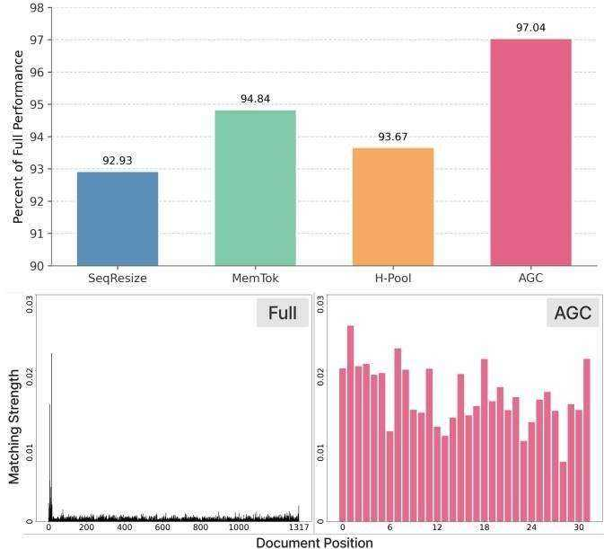
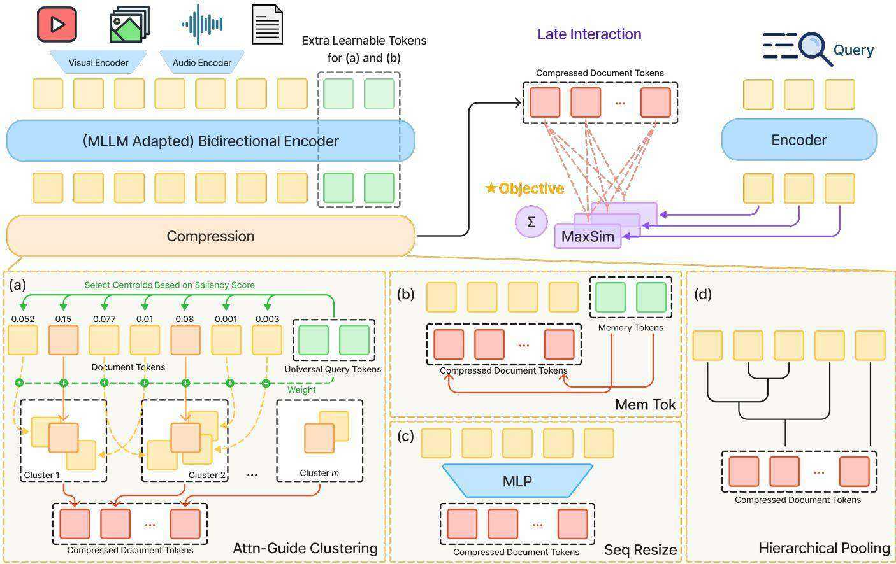
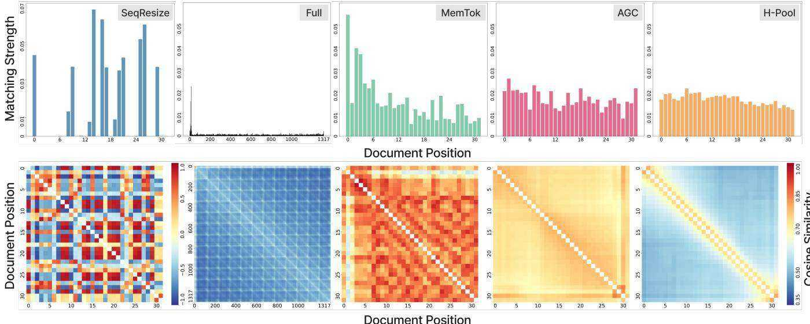

# 学术论文分析报告

> **论文标题**：Multi-Vector Index Compression in Any Modality
> **论文 ID**：arXiv:2602.21202 [cs.IR]
> **分析日期**：2026-04-30
> **主标签**：multi_vector_retrieval
> **论文标签**：multi_vector_retrieval
> **知识库关联论文**：ColBERT (seq#无, 基础), ColPali (#视觉文档领域), PLAID (seq#31), ConstBERT/Efficient Constant-Space (seq#35), HPC-ColPali (seq#37), GEM (seq#23)

---

## 1. 问题定义

**问题背景**：
多向量 late interaction（如 ColBERT/ColPali）在文本、视觉文档、视频等模态的检索中表现优异，但其索引存储与查询计算代价随文档 token 数量**线性增长**。对于视觉和音视频文档，单份文档可轻松达到数千 token，导致全索引在实际部署中不可行（如 ViDoRe 平均 1297 tokens/doc，2048 维，无法放入 FastPlaid）。  

**问题背景中的关键挑战**：
1. **存储爆炸**：多模态文档 token 数量比文本大 1-2 个数量级；
2. **计算线性**：MaxSim 的复杂度与文档向量数正相关；
3. **压缩信息损失**：多模态输入存在大量语义冗余（静态背景、重复音频帧等），但已有压缩方法不能有效分离信号与噪声；
4. **Query-agnostic 约束**：索引阶段不知道查询，压缩必须与查询无关（不能 query-aware 剪枝）。

**形式化定义**：
给定文档 $d$ 和目标向量预算 $m$（常数），定义映射 $\pi: d \mapsto \mathbf{C} \in \mathbb{R}^{m \times h}$，使得 ColBERT-style MaxSim 评分函数

$$s(q, d) = \sum_{i=1}^{n_q} \max_{1 \le j \le m} \langle \mathbf{q}_i, \mathbf{c}_j \rangle$$

在固定预算 $m$ 下尽量最大化检索精度。$\pi$ 必须在查询未知的条件下（query-agnostic）执行。

**问题的重要性**：
使大规模多模态 late interaction 索引变得实用可部署，将 ColBERT 范式从文本扩展到任意模态，同时揭示"压缩可以优于全索引"这一反直觉结论。

---

## 2. 前人工作的方法缺陷

**概述**：已有压缩方法主要针对文本设计，在多模态场景下各有致命弱点。

| 缺陷类型 | 具体表现 | 代表工作 |
|----------|----------|----------|
| 序列建模失效 | SeqResize 在多模态下出现 budget 未充分利用（token 互相负相关），性能不随预算增大提升 | ConstBERT/MacAvaney+2025 |
| 表示坍塌（over-smoothing） | MemTok 因内存 token 通过 attention 聚合所有文档 token，导致表示同质化，多向量多样性丧失 | MetaEmbed |
| 贪心合并脆弱 | H-Pool（层次聚类）对多模态噪声（静默音频、静态背景）敏感，greedy 合并策略会被噪声 outlier 干扰 | Token Pooling（Clavié+2024）|
| 冗余处理缺失 | SeqResize/MemTok 无机制跳过语义重复 token，对多模态大量冗余输入浪费预算 | — |
| 不可迁移压缩率 | SeqResize/MemTok 训练时固定压缩率，无法迁移到未见过的预算；H-Pool 虽无训练但依赖贪心合并 | — |

---

## 3. 研究动机与提出方案

**研究动机**：
多模态文档（视频、视觉文档）中 token 语义密度不均匀：静态背景、重复帧、空白区域贡献极少信息，但已有方法一视同仁地压缩所有 token。若能**先识别语义显著 token 作为聚类中心，再以显著性加权聚合周围 token**，就能在固定预算下同时减少冗余并保留判别性细节。

**方法本质（一句话）**：
> 本质上，这是一种通过**可学习通用查询 token 引导注意力识别显著聚类中心、再对 token 分组加权聚合**的 query-agnostic 多向量压缩方法，目标是在固定向量预算内最大化 late interaction 的索引利用率和检索精度。

**【批判性剥壳】方法还原**：
> 剥离"AGC"这个新名称后，核心操作等价于：
> 1. 在双向 Transformer 末层，将 $|\Psi|$ 个**可学习 token** 拼接到文档 token 序列后送入编码器（类似 MemTok 的 memory tokens 拼接方式）；
> 2. 从这些 universal query token 到文档 token 的注意力权重均值作为**显著性分数** $\alpha$（类似 attention-based KV cache pruning 的思路，但是 query-agnostic 形式）；
> 3. 取前 $m$ 个高分 token 为聚类中心（top-k 硬选择）；
> 4. 其余 token 按余弦相似度最近邻分配到中心（硬聚类，类似 k-means 的一次迭代）；
> 5. 每簇内加权平均（权重为 $\alpha$）得到最终向量。
>
> 本质是"注意力显著性引导的软硬混合 token 聚类"——**显著性引导的 top-k 选中心 + 单次 k-means 分配 + 注意力加权均值**，并非全新的数学机制，但是将其应用于 query-agnostic 多模态索引压缩、并与 late interaction 联合训练是新的落点。

**方案类型与适配说明**：
参数化压缩方法（$\pi_\theta$），与编码器联合端到端训练，损失为蒸馏 loss（以 reranker 打分的 hard negative 对比）。Universal query tokens 和编码器参数同步更新。

**核心假设及其边界**：
1. **假设多模态 token 语义密度不均**：静默、重复帧等低信息 token 可聚合丢弃——在音视频和视觉文档中成立，但在文本中密度较均匀（BEIR 上 AGC≈MemTok）；
2. **假设 universal query 近似真实查询分布**：若实际查询分布与训练分布差异极大，显著性估计可能失准；
3. **压缩率固定假设**：虽 AGC 展示了跨预算迁移，但相比训练时同等预算仍有性能缺口。

**核心创新点**：
1. **Attention-based Centroid Selection**：用 universal query token 的注意力提取 query-agnostic 显著性，识别信息密集区域作为聚类中心，而非随机或均匀采样；
2. **Hard Clustering + Weighted Aggregation 的组合**：硬聚类保证语义独立性（避免 MemTok 的 over-smoothing），加权聚合使梯度连续流回编码器（避免纯硬选择的梯度断裂）；
3. **压缩率迁移**：AGC 训练于单一压缩率（如 32），可无额外训练迁移至 5 或 128，而 SeqResize/MemTok 无此能力；
4. **跨模态通用性验证**：系统性在文本（BEIR）、视觉文档（ViDoRe）、纯视觉视频（MSR-VTT）、音视频（MultiVENT 2.0）四个模态上验证了同一压缩框架。

**论文核心贡献**：
1. 提出并系统比较 4 种多向量索引压缩方法（SeqResize、MemTok、H-Pool、AGC）；
2. AGC 作为核心新方法，首次在任意模态的 late interaction 中实现强鲁棒的 query-agnostic 多向量压缩；
3. MSR-VTT 新 SOTA（AGC 超越全量未压缩 baseline，$\text{R@1}$ 56.9 > baseline 55.7）；
4. 提出**索引利用率**作为预测压缩性能的代理指标（MaxSim 匹配强度分布均匀性与检索指标 Pearson r=0.96~0.99）。

**方法框架概述**：

```
文档输入
    ↓
  追加 |Ψ| 个 Universal Query Tokens
    ↓
  双向 Encoder（Transformer）
    ↓
  从 universal query → 文档 token 的 attention 权重
  → 显著性分数 α ∈ ℝ^n
    ↓
  Top-m token 选为聚类中心 {μ_k}
    ↓
  其余 token 按余弦相似度分配到最近中心
    ↓
  每簇内 α 加权均值 → 压缩向量 c_k
    ↓
  C = [c_1, ..., c_m] ∈ ℝ^{m×h}（索引向量）
```

**整体流程拆解（按阶段）**：

1. **编码阶段**：将 universal query tokens 拼接到文档末尾，双向 Transformer 前向传播，获取全序列 hidden state；
2. **显著性估计**：取最后一层、所有 head、所有 universal query token 对文档 token 的注意力均值 $\alpha$；
3. **中心选择**：Top-m 高显著性文档 token 的 hidden state 作为聚类中心；
4. **硬聚类**：每个文档 token 分配到余弦最近中心（一次性，非迭代 k-means）；
5. **加权聚合**：每簇向量以 $\alpha$ 为权重做归一化加权平均；
6. **训练**：以 reranker 打分的 hard negative 对比蒸馏损失联合训练编码器与 universal query token。

**核心模块与职责分工**：

| 模块 | 职责 |
|------|------|
| Universal Query Tokens $X_\Psi$ | 可学习，充当"通用查询探针"，从末层注意力权重中提取文档 token 显著性 |
| Attention-based Centroid Selection | 基于显著性 Top-m 选中心，确保聚类中心语义显著 |
| Hard Clustering | 强制语义分离，避免 over-smoothing |
| Weighted Aggregation | $\alpha$ 加权均值，保持梯度连续流回，稳定优化 |

**输入、输出与中间表示**：
- 输入：任意模态文档 $d$（文本 token / 图像 patch / 视频帧 / 音频帧）
- 中间：hidden state $\mathbf{Z}^{(L)} \in \mathbb{R}^{n \times h}$，显著性 $\alpha \in \mathbb{R}^n$
- 输出：固定大小向量集 $\mathbf{C} \in \mathbb{R}^{m \times h}$（压缩文档索引）

**训练阶段细节**：
以 hard negative 对比蒸馏为损失（reranker 打分）；对文本（BEIR）从单向量编码器初始化，对视觉/视频从 Qwen2.5-VL-3B/7B 或 Qwen3-VL-4B 初始化，均开启双向注意力（原始 causal mask 转 full attention）。

**推理阶段/检索阶段细节**：
文档端：用 AGC 生成 $m$ 维向量集，存入 FastPlaid（文本）或 flat index（视觉文档，维度过高）。查询端：正常编码全序列。检索时执行 ColBERT MaxSim 打分。

**目标函数**：
蒸馏对比损失（reranker soft labels + hard negatives，16-way for BEIR, full batch for vision）。

**相对已有方法的关键改动点**：
- vs. MemTok：同样拼接 special tokens，但 AGC 的 universal query 只用于计算显著性，不直接输出为文档向量；真正的索引向量来自文档 token 的加权聚合——避免 over-smoothing；
- vs. H-Pool：同样基于聚类，但 AGC 的中心选择是注意力引导（非贪心相似度合并），权重是学习到的显著性（非均匀），且端到端可训练；
- vs. SeqResize：SeqResize 用 MLP 沿序列维度线性投影，完全参数化但忽略冗余；AGC 保留 token 来源的可解释性且结构化分配预算。

**为什么这个方案有效（机制解释）**：
1. **信息密度识别**：多模态文档中信息密度极度不均，universal query token 的注意力自然落在信息丰富区域（文字区域 vs. 空白背景），中心选择因此聚焦高价值 token；
2. **冗余消除**：硬聚类将相似 token 合并，直接降低索引冗余度，与"索引利用率均匀性→检索性能"的相关性一致；
3. **梯度稳定**：加权聚合使硬聚类的离散操作在优化层面变为连续，端到端训练得以有效传播梯度；
4. **压缩目标对齐**：训练时的压缩损失使模型主动学习将信息打包进压缩向量，而非把全量 token 展开——这解释了为何压缩后在 MSR-VTT 上超越全量 baseline（全量 baseline 存在大量 1% 实际被匹配的冗余）。

**关键技术细节**：
1. **Universal query token 数量 = 预算 m**：实验表明对齐 universal query 数量与预算大小时性能最优（Table 5），但小预算可接受较大 universal query 数量作为补偿；
2. **注意力层选择**：只取最后一层（Layer $L$）所有 head 的均值，而非多层加权；
3. **聚类实现**：不是迭代 k-means，而是**一次性**余弦最近邻分配（computational cost = $O(nm)$）；
4. **Protected tokens**：H-Pool 中有保留"保护 token"的选项（再拼回），AGC 的中心即为隐式保护；
5. **FastPlaid 兼容性**：文本场景下压缩后可用 FastPlaid 4-bit residual 索引；ViDoRe 等高维（h=2048）场景仍需 flat index。

**关键图像与图表辅助说明（如适用）**：

- **Figure 1（动机图）**：

  

  展示了在不同压缩预算下四种方法的 nDCG@10 曲线。**AGC（实线，最高）在极端压缩（token budget 极小）和轻度压缩两端均优于竞争方法**，而 H-Pool 在低预算端表现接近，SeqResize 平台早且低，MemTok 中间。该图直接支撑论文摘要的核心声明：AGC 在任意压缩率下最优，且压缩训练可使性能超越全量 baseline。

- **Figure 2（四种方法架构对比图）**：

  

  并排展示 AGC（左）、MemTok、SeqResize、H-Pool 四种方法的模块结构。AGC 的显著差异在于：universal query token 的输出**不作为文档向量**，而只提取注意力权重，文档向量来自实际文档 token 的加权聚合——这是与 MemTok 的核心区别，也是避免 over-smoothing 的关键设计。

- **Figure 3（索引利用率热力图）**：

  

  上半部分柱状图：每个 document token 位置被 MaxSim 匹配到的总强度（越均匀越好）。**Base model 集中在前 2% token，SeqResize 只用极少几个 token，MemTok 偏向前几个 memory token，AGC 和 H-Pool 分布最均匀**。下半部分热力图：文档内 token 两两余弦相似度（低多样性=高相似=红色）。MemTok 几乎全红（over-smoothing），SeqResize 出现负相似（建模失效），AGC 呈现适度多样性（中等相似度，有局部聚集）。该图是整篇论文对方法行为机理解释最深入的可视化。

---

## 4. 实验对比

**数据集**：
- BEIR（文本，公开子集 7 个数据集，<1M docs）
- ViDoRe v2（视觉文档，4 个主题：Biomedical/Economics/ESG）
- MSR-VTT（视频，1000 对 query-video，纯视觉）
- MultiVENT 2.0（音视频，2546 query，109,800 视频）

**评估指标**：R@1, R@10, nDCG@5, nDCG@10，及相对全量 baseline 的百分比

**对比基线**：

| 基线方法 | 类型 | 发表年份 |
|----------|------|----------|
| Uncompressed ColBERT/ColPali-style Baseline | 全量未压缩 late interaction | — |
| SeqResize (ConstBERT) | 参数化序列投影 | 2025 |
| MemTok (MetaEmbed) | 参数化内存 token | 2025 |
| H-Pool (Token Pooling) | 非参数化层次聚类 | 2024 |
| ColPali | 视觉文档多向量基线 | 2024 |
| OmniEmbed-7B | 单向量 dense baseline | 2025 |
| Video-ColBERT | 多向量视频检索 | 2025 |

**关键结果表格**（Table 1 摘要，默认压缩预算）：

| 方法 | BEIR nDCG@10 | ViDoRe nDCG@5 | MSR-VTT nDCG@10 | MultiVENT nDCG@10 |
|------|-------------|--------------|----------------|------------------|
| Baseline (uncompressed) | 46.2 | 60.0 | 71.9 | N/A（无法建索引）|
| SeqResize | 43.9 (95.0%) | 51.7 (86.2%) | 69.9 (96.9%) | 38.5 |
| MemTok | 45.0 (97.4%) | 54.4 (90.7%) | 69.9 (96.9%) | 44.8 |
| H-Pool | 41.2 (89.2%) | 56.4 (94.0%) | 70.4 (97.6%) | 46.5 |
| **AGC（Ours）** | **45.0 (97.4%)** | **56.7 (94.5%)** | **71.5 (99.2%)** | **46.3** |

---

## 5. 性能提升

**总体提升**：
AGC 在四个模态基准上均为最强压缩方法，平均保留全量 baseline 的 97%+ 性能，压缩率为 80~99%。

**最显著提升场景**：
- MSR-VTT R@1，预算 32 时 AGC=56.9，超越全量 baseline 55.7（+1.2 pp），即**压缩后超越全量**；
- MultiVENT 2.0：全量 baseline 因内存不足无法建索引，AGC/H-Pool 是唯一可行方案；
- ViDoRe：AGC 与 H-Pool 均优于 MetaEmbed（64 tokens），达到 56.7 vs. 58.8（MetaEmbed 含额外训练资源）。

**提升较弱的场景**：
- BEIR（文本）：AGC≈MemTok，两者均约 97.4%，文本信息密度均匀，注意力引导优势不明显；
- 极端压缩（budget=5）：AGC 在 MSR-VTT 已优于 H-Pool 和 MemTok，但 R@1 = 53.9 vs. baseline 55.7，仍有缺口。

**消融实验分析**（Table 9, MSR-VTT）：

| 消融配置 | R@1 | nDCG@10 | 结论 |
|----------|-----|---------|------|
| AGC（完整） | 56.9 | 71.5 | 基准 |
| w/o Attn Weight | 55.7 | 71.0 | 加权聚合带来梯度稳定性 |
| w/o Attn Select | 54.1 | 70.0 | 注意力选中心是关键 |
| w/o Cluster | 52.9 | 69.8 | 聚类消除冗余不可省略 |

三个组件均有显著贡献，Attn Select 和 Cluster 贡献更大。

---

## 6. 方法局限与缺陷

**论文自述局限**：
1. 压缩预算目前静态分配（同等 $m$ 对所有文档），未来可按文档信息量自适应分配预算；
2. MultiVENT 2.0 音频采样率降至 4KHz（原 16KHz）才能训练，Qwen-Omni 对音频帧处理效率是实际瓶颈；
3. 未研究跨模态压缩的理论最优界。

**独立分析发现的缺陷**：
1. **Index Utilization 作为代理指标的局限**：论文发现 MaxSim 匹配均匀性与检索性能强相关（Pearson r>0.95），但此相关性仅在 MSR-VTT 上验证，是否可迁移到 BEIR 或 ViDoRe 未论证；
2. **Universal query 数量 = 预算的设计依赖**：Table 5 显示 appended token 数与预算对齐最优，但论文未给出理论解释，只是经验最优；
3. **H-Pool 非参数优势未充分利用**：H-Pool 在视觉模态仅略弱于 AGC，但不需要训练，其实用价值被低估；
4. **ViDoRe 上 flat index vs FastPlaid 不公平对比**：compressed 和 baseline 都用 flat index，虽说为公平，但无法展示 FastPlaid 的真实加速效益。

**【批判性审查】实验设计与声明一致性**：

| 审查维度 | 问题 | 结论 |
|----------|------|------|
| 基线完整性 | DocPruner（同期视觉文档压缩）未对比 | 有缺失，ViDoRe 结论可能不完整 |
| 消融充分性 | 三个组件逐一消融，但未同时去掉两个组件 | 基本充分，但交互效应未分析 |
| 数据集偏差 | MultiVENT baseline 因内存无法建，无法公平对比 | 不公平但诚实披露；AGC 优势是工程可行性而非纯精度 |
| 声明-数字一致 | "任意模态最优"声明有实验支撑 | 基本一致 |
| 适用范围泛化 | "压缩可以超越全量"仅在 MSR-VTT 一个数据集上成立 | 有轻微过度泛化风险 |

**潜在的改进空间**：
1. 自适应预算分配（按文档复杂度分配不同 $m$）；
2. 将 universal query 设计为可插拔模块，无需重新训练即可切换 budget；
3. 将"索引利用率均匀性"作为训练正则化项，直接优化而非事后分析。

---

## 7. 科研启发（面向博士研究生）

### 7.1 新问题定义方向

1. **自适应预算分配问题**：文档的信息密度不同，为什么给每个文档相同的 $m$？可以定义一个问题：给定总预算 $M = \sum_d m_d$，如何根据文档信息密度或对查询分布的重要性最优分配 $m_d$？
2. **压缩优先级的理论界**：存在一个信息论问题——在 MaxSim 评分函数下，给定向量预算 $m$，最优压缩的理论 recall 上界是什么？这是开放问题，解决后可为所有 late interaction 压缩方法建立标尺。

### 7.2 新方法/技术迁移

1. **IndexUtilization 作为训练信号**：论文发现 MaxSim 匹配分布的均匀性（Gini/CV）与检索性能强相关。可以设计一个辅助损失直接最大化匹配均匀性，强迫模型学习"每个索引向量都要有用"，而非事后分析；
2. **AGC 迁移到视觉-语言双塔压缩**：universal query token 机制可以迁移到双流编码器（如 CLIP 系列），用语言侧的平均词向量作为 universal query，对图像 patch 做 query-aware 压缩（此时变为 cross-modal 引导，查询已知时精度应更高）；
3. **将 AGC 应用于 GEM 的集合级图索引**：GEM 每个文档也是向量集合，AGC 可以先压缩文档向量集再构建 GEM 图，从而大幅减少 qEMD 计算量，是两个方向的组合创新点。

### 7.3 现有缺陷的改进思路

1. **SeqResize 的"预算利用不足"问题**：SeqResize 性能不随预算增大而提升，本质是 MLP 沿序列维度盲目投影，忽视了 token 语义差异。改进：在 SeqResize 前加一步 token 重要性排序（如注意力权重），再投影到固定维度——混合 SeqResize+AGC；
2. **H-Pool 的压缩率迁移**：H-Pool 的 Ward 合并不涉及训练，理论上天然跨预算迁移，但实际上缺少显著性引导。改进：在 H-Pool 前加 AGC 风格的注意力显著性排序，优先合并低显著性 token，高显著性 token 保留为独立向量（非参数化 AGC 版本）。

### 7.4 跨领域联系与灵感

1. **视频编解码的 I/P/B 帧设计**：论文自引了 MPEG 编码 [Le Gall, 1991] 的类比——信息密度不均匀的区域应差异化压缩。这提示可以设计"时间维度的 I-frame 等价物"：在视频检索中，关键帧对应 I-frame，应分配更多向量预算；
2. **DiskANN 与 AGC 的外存扩展**：DiskANN 把全精度向量存 SSD，内存保留压缩向量（PQ）做初步过滤。AGC 可在此框架内替换 PQ：用 AGC 生成的 $m=32$ 压缩向量存内存，全量向量存 SSD，BeamSearch 时先 AGC MaxSim 粗排，再读 SSD 精排——这是将 GEM/DiskANN 思路与 AGC 结合的系统级想法。

### 7.5 综合建议

当前研究最可能的高价值延伸：**将 AGC 的显著性引导机制与 GEM 的集合级图索引结合**，在压缩后向量集上构建 GEM 图，对 HPC-ColPali 和 DocPruner 这类视觉文档方向形成正面竞争；同时设计"均匀利用率训练正则化"作为辅助损失，使压缩后每个索引向量在 MaxSim 匹配中被更均匀利用。这两个改进均有清晰的实验验证路径，且与现有论文形成差异化。

---

## 8. 参考文献图谱

### 文献分类表

| 文献名 | 作者/年份 | 角色 | 知识库状态 |
|--------|----------|------|-----------|
| ColBERT | Khattab & Zaharia, 2020 | 方法基础（late interaction 基座） | ✅ 已分析（seq#无，基础方法）|
| ColBERTv2 + PLAID | Santhanam+, 2022 | 方法基础 + 实验基线 | ✅ 已分析（seq#31 PLAID）|
| Efficient Constant-Space Multi-vector Retrieval (ConstBERT) | MacAvaney+, 2025 | 被批判文献（SeqResize） | ✅ 已分析（seq#35）|
| Token Pooling (H-Pool) | Clavié+, 2024 | 被批判文献（H-Pool 前身） | 未收录 |
| MetaEmbed | Xiao+, 2025 | 实验基线（MemTok） | 未收录 |
| ColPali | Faysse+, 2024 | 实验基线（视觉文档） | 未收录（visual_document_retrieval 中已分析）|
| ViDoRe v2 | Macé+, 2025 | Benchmark | 未收录 |
| Video-ColBERT | Reddy+, 2025 | 实验基线（视频） | 未收录 |
| OmniEmbed | Ma+, 2025 | 实验基线（单向量 dense） | 未收录 |
| MultiVENT 2.0 | Kriz+, 2025 | Benchmark | 未收录 |
| CRISP: Clustering Multi-Vector Representations | Veneroso+, 2025 | 近期相关方法 | 未收录 |
| Nugget (Neural Agglomerative Embeddings) | Qin & Van Durme, 2023 | 方法基础（层次聚类文本） | 未收录 |

---

## 推荐阅读列表

### P0 必读（方法基础，知识库未收录）
- Token Pooling: Reducing the Footprint of Multi-Vector Retrieval with Minimal Performance Impact via Token Pooling (Clavié, Chaffin, Adams, 2024) — AGC 对比的 H-Pool 直接来源，arXiv:2409.14683

### P1 重要（近期竞争方法，理解 landscape 必读）
- CRISP: Clustering Multi-Vector Representations for Denoising and Pruning (Veneroso et al., 2025) — 与 AGC 同期的聚类压缩方法，arXiv:2505.11471
- MetaEmbed: Scaling Multimodal Retrieval at Test-Time with Flexible Late Interaction (Xiao et al., 2025) — ViDoRe 对比基线，memory token 代表方法，arXiv:2509.18095

### P2 建议（视觉文档压缩方向）
- DocPruner: A Storage-Efficient Framework for Multi-Vector Visual Document Retrieval via Adaptive Patch-Level Embedding Pruning (已在 visual_document_retrieval 收录)
- HPC-ColPali: Hierarchical Patch Compression for Efficient Multi-Vector Document Retrieval (seq#37，已分析)

### P3 参考（背景综述）
- Video-ColBERT: Contextualized Late Interaction for Text-to-Video Retrieval (Reddy et al., 2025) — 视频 late interaction 基线，CVPR 2025

---

## mem0 知识库记录

- **问题域**：多向量 late interaction 索引压缩，任意模态（文本/视觉文档/视频/音视频）
- **方法关键词**：Attention-Guided Clustering (AGC), Universal Query Tokens, Query-Agnostic Compression, Index Utilization, Late Interaction, SeqResize, MemTok, H-Pool
- **数据集**：BEIR, ViDoRe v2, MSR-VTT, MultiVENT 2.0
- **性能基准**：AGC 在 MSR-VTT R@1 = 56.9（超全量 baseline 55.7），ViDoRe nDCG@5 = 56.7（保留全量 94.5%），BEIR nDCG@10 = 45.0（保留 97.4%）
- **关联论文 ID**：PLAID (seq#31), ConstBERT (seq#35), HPC-ColPali (seq#37), GEM (seq#23)
- **核心方法机制摘要**：AGC = Universal Query Token 注意力引导显著性 → Top-m 选中心 → 单次 k-means 硬聚类 → α 加权聚合；联合编码器蒸馏训练；压缩率可迁移；索引利用率均匀性是检索性能的强代理指标（Pearson r>0.95）
