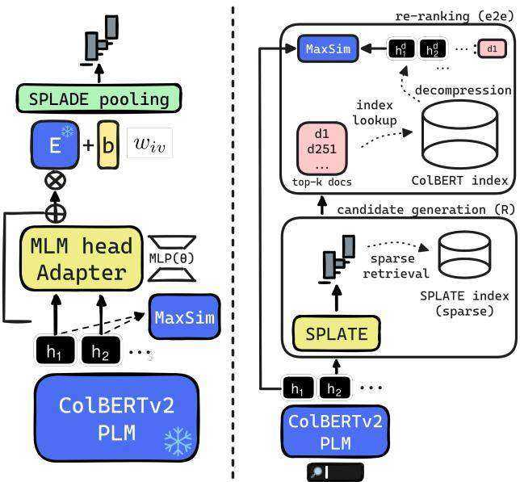
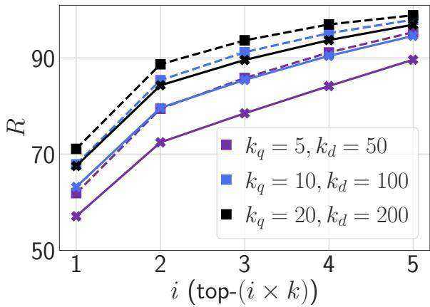
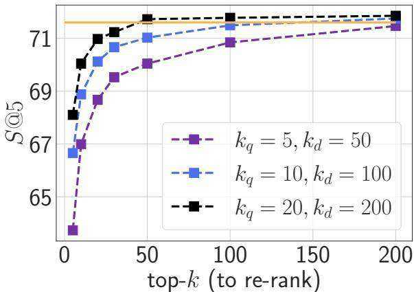

# SPLATE: Sparse Late Interaction Retrieval

Thibault Formal Stéphane Clinchant Hervé Déjean Carlos Lassance†★ Naver Labs Europe †Cohere   
★ Work done while at Naver.

# Abstract

The late interaction paradigm introduced with ColBERT stands out in the neural Information Retrieval space, offering a compelling effectiveness-efficiency trade-off across many benchmarks. Efficient late interaction retrieval is based on an optimized multi-step strategy, where an approximate search first identifies a set of candidate documents to re-rank exactly. In this work, we introduce SPLATE, a simple and lightweight adaptation of the ColBERTv2 model which learns an “MLM adapter”, mapping its frozen token embeddings to a sparse vocabulary space with a partially learned SPLADE module. This allows us to perform the candidate generation step in late interaction pipelines with traditional sparse retrieval techniques, making it particularly appealing for running ColBERT in CPU environments. Our SPLATE ColBERTv2 pipeline achieves the same effectiveness as the PLAID ColBERTv2 engine by re-ranking 50 documents that can be retrieved under $1 0 m s$ .

# 1. Introduction

In the landscape of neural retrieval models based on Pretrained Language Models (PLMs), the late interaction paradigm – introduced with the ColBERT model [16] – delivers state-of-the-art results across many benchmarks. ColBERT – and its variants [11,12,21,25,33,37, 45,48] – enjoys many good properties, ranging from interpretability [6, 46] to robustness [10, 26, 47, 49]. The fine-grained interaction mechanism, based on a token-level dense vector representation of documents and queries, alleviates the inherent limitation of singlevector models such as DPR [15]. Due to its MaxSim formulation, late interaction retrieval requires a dedicated multi-step search pipeline. In the meantime, Learned Sparse Retrieval [30] has emerged as a new paradigm to reconcile the traditional search infrastructure with PLMs. In particular, SPLADE models [7,8,9] exhibit strong in-domain and zero-shot capabilities at a fraction of the cost of late interaction approaches – both in terms of memory footprint and search latency [18, 20,34,35].

In this work, we draw a parallel between these two lines of works, and show how we can simply “adapt” ColBERTv2 frozen representations with a light SPLADE module to effectively map queries and documents in a sparse vocabulary space. Based on this idea, we introduce SPLATE – for SParse LATE interaction – as an alternative approximate scoring method for late interaction pipelines. Contrary to optimized engines like PLAID [38], our method relies on traditional sparse techniques, making it particularly appealing to run Col-BERT in mono-CPU environments.

# 2. Related Works

Efficient Late Interaction Retrieval Late interaction retrieval is a powerful paradigm, that requires complex engineering to scale up efficiently. Specifically, it resorts to a multi-step pipeline, where an initial set of candidate documents is retrieved based on approximate scores [16]. While it is akin to the traditional retrieve-and-rank pipeline in IR, it still fundamentally differs in that the same (PLM) model is used for both steps1. Late interaction models offer advantages over cross-encoders because they allow for pre-computation of document representations offline, thus improving efficiency in theory. However, this comes at the cost of storing large indexes of dense term representations. Various optimizations of the ColBERT engine have thus been introduced [5,12,19,23,27,29,33,37,38,41,43]. ColBERTv2 [37] refines the original ColBERT by introducing residual compression to reduce the space footprint of late interaction approaches. Yet, search speed remains a bottleneck, mostly due to the large number of candidates to re-rank exactly $( > ~ 1 0 k )$ [27]. Santhanam et al. identify the major bottlenecks – in terms of search speed – of the vanilla ColBERTv2 pipeline, and introduce PLAID [38], a new optimized late interaction pipeline that can largely reduce the number of candidate passages without impacting ColBERTv2’s effectiveness. In particular, PLAID candidate generation is based on three steps that leverage centroid interaction and centroid pruning – emulating traditional Bag-of-Words (BoW) retrieval – as well as dedicated CUDA kernels. It reduces the large number of candidate documents to re-rank, greatly offloading subsequent steps (index lookup, decompression, and scoring).

Hybrid Models Several works have identified similarities between the representations learned by different neural ranking models. For instance, UNIFIER [40] jointly learns dense and sparse single-vector bi-encoders by sharing intermediate transformer layers. Similarly, the BGE-M3 embedding model [3] can perform dense, multi-vector, and sparse retrieval indifferently. SparseEmbed [17] extends SPLADE with dense contextual embeddings – borrowing ideas from ColBERT and COIL [11]. SLIM [22] adapts ColBERT to perform late interaction on top of SPLADE-like representations – making it fully compatible with traditional search techniques. Ram et al. [36] show that mapping representations of a dense bi-encoder to the vocabulary space – via the Masked Language Modeling (MLM) head – can also be used for interpretation purposes.

# 3. Method

SPLATE is motivated by two core ideas: 1. PLAID [38] draws inspiration from traditional BoW retrieval to optimize the late interaction pipeline; 2. dense embeddings can seemingly be mapped to the vocabulary space [36]. Rather than proposing a new standalone model, we show how SPLATE can be used to approximate the candidate generation step in late interaction retrieval, by bridging the gap between sparse and dense models.

Adapting Representations SPLATE builds on the similarities between the representations learned by sparse and dense IR models. For instance, Ram et al. [36] show that mapping representations of a dense bi-encoder with the MLM head can produce meaningful BoW. We take one step further and hypothesize that effective sparse models can be derived – or at least adapted – from frozen embeddings of dense IR models in a SPLADE-like fashion. We, therefore, propose to “branch” an MLM head on top of a frozen ColBERT model.

SPLATE Given ColBERT’s contextual embeddings $( h _ { i } ) _ { i \in t }$ of an input query or document ??, we can define a simple “adapted” MLM head, by linearly mapping transformed representations back to the vocabulary. Inspired by Adapter modules [14,32], SPLATE thus simply adapts frozen representations $( h _ { i } ) _ { i \in t }$ by learning a simple two-layer MLP, whose output is recombined in a residual fashion before “MLM” vocabulary projection:

$$
\boldsymbol { w } _ { i \nu } = ( h _ { i } + M L P _ { \theta } ( h _ { i } ) ) ^ { T } \boldsymbol { E } _ { \nu } + \boldsymbol { b } _ { \nu }
$$

where $w _ { i }$ corresponds to an unnormalized logprobability distribution over the vocabulary $_ \mathrm { ~  ~ }$ for the token $t _ { i } , E _ { \nu }$ is the (Col)BERT input embedding for the token $\nu$ and $b _ { \nu }$ is a token-level bias. The residual guarantees a near-identity initialization – making training stable [14]. We can then derive sparse SPLADE vectors from these logits as follows:

  
Figure 1: (Left) SPLATE relies on the same representations $( h _ { i } ) _ { i \in t }$ to learn sparse BoW with SPLADE (candidate generation) and to compute late interactions (re-ranking). (Right) Inference: SPLATE ColBERTv2 maps the representations of the query tokens to a sparse vector, which is used to retrieve $k$ documents from a pre-computed sparse index (R setting). In the $e 2 e$ setting, representations are gathered from the ColBERT index to re-rank the candidates exactly with MaxSim.

$$
w _ { \nu } = \underset { i \in t } { \operatorname* { m a x } } \log \left( 1 + \mathrm { R e L U } ( w _ { i \nu } ) \right) , \quad \nu \in \{ 1 , . . . , | \mathcal { V } | \}
$$

We then train the parameters of the MLM head $( \pmb \theta , \pmb b )$ with distillation based on the derived SPLADE vectors to reproduce ColBERT’s scores – see Section 4. Our approach is very light, as the ColBERT backbone model is entirely frozen – including the (tied) projection layer ??. In our default setting, the MLP first down-projects representations by a factor of two, then up-projects back to the original dimension. This corresponds to a latent dimension of $7 6 8 / 2 = 3 8 4$ – early experiments indicate that the choice of this hyperparameter is not critical – and amounts to roughly $0 . 6 M$ trainable parameters only (yellow blocks in Figure 1, (Left)).

Efficient Candidate Generation for Late Interaction By adapting ColBERT’s frozen dense representations with a SPLADE module, SPLATE aims to approximate late interaction scoring with an efficient sparse dot product. Thus, the same representations $( h _ { i } ) _ { i \in t }$ can function in both retrieval (SPLATE module) and re-ranking (Col-BERT’s MaxSim) scenarios – requiring a single transformer inference step on query and document sides. Thus, it becomes possible to replace the existing candidate generation step in late retrieval pipelines such as PLAID with traditional sparse retrieval to efficiently provide ColBERT with documents to re-rank. SPLATE is therefore not a model per se, but rather offers an alternative implementation to late-stage pipelines by bridging the gap between sparse and dense models. SPLATE however differs from PLAID in various aspects:

• While PLAID implicitly derives sparse BoW representations from ColBERTv2’s centroid mapping, SPLATE explicitly learns such representations by adapting a pseudo-MLM head to ColBERT frozen representations. The approximate step becomes supervised rather than (yet efficiently) “engineered”.   
• The candidate generation can benefit from the longstanding efficiency of inverted indexes and query processing techniques such as MaxScore [44] or WAND [2], making end-to-end ColBERT more “CPU-friendly” – see Table 1.   
• It is more controllable and directly amenable to all sorts of recent optimizations for learned sparse models [18,20]. ColBERT’s pipeline becomes even more interpretable, as SPLATE’s candidate generation simply operates in the vocabulary space – rather than representing documents as a lightweight bag of centroids – see Table 3 for examples.

Nonetheless, SPLATE requires an additional – although light – training round for the parameters of the Adapter module. It also requires indexing SPLATE’s sparse document vectors, therefore adding a small memory footprint overhead2. Also, note that hybrid approaches like BGE-M3 [3] – that can output sparse and multivector representations – could in theory be used in late interaction pipelines. However, SPLATE is directly optimized to approximate ColBERTv2, and we leave for future work the study of jointly training the candidate generation and re-ranking modules.

# 4. Experiments

Setting We initialize SPLATE with ColBERTv2 [37] weights which are kept frozen. We rely on top- $\cdot k _ { q , d }$ pooling to obtain respectively query and document BoW

SPLADE representations3. We train the MLM parameters $( \pmb \theta , \pmb b )$ on the MS MARCO passage dataset [1], using both distillation and hard negative sampling. More specifically, we distill ColBERTv2’s scores based on a weighted combination of marginMSE [13] and KL-Div [24] losses for 3 epochs. We set the batch size to 24, and select 20 hard negatives per query – coming from ColBERTv2’s top-1000. By using ColBERTv2 as both the teacher and the source of hard negatives, SPLATE aims to approximate late interaction with sparse retrieval. SPLATE models are trained with the SPLADE codebase on 2 Tesla V100 GPUs with 32GB memory in less than two hours4. SPLATE can be evaluated as a standalone sparse retriever (R), but more interestingly in an end-to-end late interaction pipeline (e2e) where it provides ColBERTv2 with candidates to re-rank (see Figure 1, (Right))5. For the former, we rely on the PISA engine [28] to conduct sparse retrieval with block-max WAND and provide latency measurements as the Mean Response Time (MRT), i.e., the average search latency measured on the MS MARCO dataset using one core of an Intel(R) Xeon(R) Gold 6338 CPU $@ 2 . 0 0 \mathrm { G H z }$ CPU. For the latter, we perform on-the-fly re-ranking with the ColBERT library6. Note that naive re-ranking with ColBERT is sub-optimal – compared to pipelines that pre-compute document term embeddings. We leave the end-to-end latency measurements for future work – but we believe the integration of SPLATE into ColBERT’s pipelines such as PLAID should be seamless, as it would only require modifying the candidate generation step. We evaluate models on the MS MARCO dev set and the TREC DL19 queries [4] (in-domain), and provide out-of-domain evaluations on the 13 readily available BEIR datasets [42], as well as the test pooled Search dataset of the LoTTE benchmark [37].

The following experiments investigate three different Research Questions: 1. How does the sparsity of SPLATE vectors affect latency and re-ranking performance? 2. How accurate SPLATE candidate generation is compared to ColBERTv2? 3. How does it perform overall for in-domain and out-of-domain scenarios?

Latency Results Table 1 reports in-domain results on MS MARCO, in both retrieval-only (R) and endto-end (e2e) settings. Overall, the results show that it is possible to “convert” a frozen ColBERTv2 model to an effective SPLADE, with a lightweight residual adaptation of its token embeddings. We consider several SPLATE models trained with varying pooling sizes $( k _ { q } , k _ { d } )$ – those parameters controlling the size of the query and document representations. We observe the standard effectiveness-efficiency trade-off for SPLADE, where pooling affects both the performance and average latency. These results indicate that one can easily control the latency of the candidate generation step by selecting appropriate pooling sizes. However, after reranking with ColBERTv2, all the models perform comparably, which is interesting from an efficiency perspective, as it becomes possible to use very lightweight models to cheaply provide candidates (e.g., as low as $2 . 9 m s$ Mean Response Time), while achieving performance on par with the original ColBERTv2 (see Table 2). For comparison, the end-to-end latency reported in PLAID [38] (single CPU core, less conservative setting with $k = 1 0 \mathrm { . }$ ) is around 186ms on MS MARCO. Given that candidate generation accounts for around two-thirds of the complete pipeline [38], SPLATE thus offers an interesting alternative for running ColBERT on mono-CPU environments.

Table 1: Retrieval latency (MRT), retrieval-only $\left( \mathbb { R } \right)$ and end-to-end (e2e, $k = 5 0$ ) MRR $@ 1 0$ on MS MARCO dev.   

<table><tr><td>(kq, kd)</td><td colspan="2">R e2e (k = 50) MRT (ms) MRR@10 MRR@10</td></tr><tr><td>(5, 30)</td><td>2.9 34.5</td><td>39.5</td></tr><tr><td>(5, 50)</td><td>4.3 35.5</td><td>39.7</td></tr><tr><td>(5, 100)</td><td>7.4 35.6</td><td>39.8</td></tr><tr><td>(10, 100)</td><td>24.0 36.7</td><td>40.0</td></tr><tr><td>(20, 200)</td><td>106.0 37.4</td><td>40.0</td></tr></table>

Approximation Quality To assess the quality of SPLATE approximation, we compare the top- $k$ passages retrieved by PLAID ColBERTv2 to the ones retrieved by SPLATE (R). We report in Figure 2 the average fraction $R ( k )$ of documents in SPLATE’s top- $k ^ { \prime }$ that also appear in the top- $k$ documents retrieved by ColBERTv2 on MS MARCO, for $k \in \{ 1 0 , 1 0 0 \}$ and $k ^ { \prime } = i \times k , i \in \{ 1 , . . . , 5 \}$ . When $k = 1 0$ , SPLATE can retrieve more than $9 0 \%$ of ColBERTv2’s documents in its top-50 $( i = 5 )$ , for all levels of $( k _ { q } , k _ { d } )$ . This explains the ability of SPLATE to fully recover ColBERT’s performance by re-ranking a handful of documents (e.g., 50 only). We additionally observe that the quality of approximation falls short for efficient models (i.e., lower $( k _ { q } , k _ { d } ) )$ when $k$ is higher.

Figure 3 further reports the performance of SPLATE (e2e) on out-of-domain. We observe similar trends, where increasing both the number $k$ of documents to rerank and $( k _ { q } , k _ { d } )$ leads to better generalization. Overall, re-ranking only 50 documents provides a good tradeoff across all settings – echoing previous findings [27, 38]. Yet, the most efficient scenario $( ( k _ { q } , k _ { d } ) = ( 5 , 5 0 )$ , $k = 1 0 \mathrm { \ : }$ ) still leads to impressive results: $3 8 . 4 \mathrm { M R R } @ 1 0$ on MS MARCO dev (not shown), $7 0 . 0 \ : S @ 5$ on LoTTE (purple line on Figure 3).

  
Figure 2: Candidate generation approximate accuracy on MS MARCO dev – SPLATE (R). Dotted lines $\mathbf { \eta } ^ { ( \equiv ) }$ represent $R ( 1 0 )$ , solid lines represent $( { \pmb { \mathscr { R } } } )$ ${ \pmb { \mathscr { R } } } ( 1 0 0 )$ .

Overall Results Finally, Table 2 compares SPLATE Col-BERTv2 with the reference points ColBERTv2 [37] and PLAID ColBERTv2 $( k = 1 0 0 0 )$ [38] – in both R and $\mathtt { e 2 e }$ settings. We also include results from SPLADE $^ { + + }$ [9], as well as the hybrid methods SparseEmbed [17] and $\mathrm { S L I M + + }$ [22] – even though they are not entirely comparable to SPLATE. While SparseEmbed and SLIM introduce new models, SPLATE rather proposes an alternative implementation to ColBERT’s late retrieval pipeline. We further report the two baselines consisting of retrieving documents with BM25 (resp. $\mathrm { S P L A D E + + } )$ ) and re-ranking those with ColBERTv2 $\mathrm { B M } 2 5 \gg \mathrm { C }$ and $\mathsf { S } \gg \mathsf { C }$ respectively, with $k = 5 0 \mathrm { \AA }$ ). Note that we expect SPLATE to perform in between, as $\mathsf { B M } 2 5 \gg \mathsf { C }$ relies on a less effective retriever, while $\mathsf { S } \gg \mathsf { C }$ fundamentally differs from SPLATE, as it is based on two different models. Specifically, it requires feeding the query to a PLM twice at inference time. Overall, SPLATE (R) is effective as a standalone retriever (e.g., reaching almost 37 MRR $@ 1 0$ on MS MARCO dev). On the other hand, SPLATE (e2e) performs comparably to ColBERTv2 and PLAID on MS MARCO, BEIR, and LoTTE. Additionally, we conducted a meta-analysis against PLAID with RANGER [39] over the 13 BEIR datasets, and found no statistical differences on 10 datasets, and statistical improvement (resp. loss) on one (resp. two) dataset(s). Finally, we provide in Table 3 some examples of predicted BoW for queries

  
Figure 3: Impact of $k$ and $( k _ { q } , k _ { d } )$ on SPLATE (e2e) ouf-of-domain performance – ?????????????? $@ 5$ on LoTTE (test pooled Search). The orange line represents ColBERTv2.

Table 2: Evaluation of SPLATE with $( k _ { q } , k _ { d } ) = ( 1 0 , 1 0 0 )$ and $k ~ = ~ 5 0$ . ?????????? denote significant improvements over the corresponding rows, for a paired $t$ -test with $p$ -value $= 0 . 0 1$ and Bonferroni correction (MS MARCO dev set and DL19). PLAID ColBERTv2 [38] $( k = 1 0 0 0 )$ reports the dev LoTTE∗ $S @ 5$ .

<table><tr><td></td><td>MS MARCO</td><td>DL19</td><td>BEIR</td><td>LoTTE</td></tr><tr><td></td><td>MRR@10</td><td>nDCG@10 R@1k nDCG@10</td><td></td><td>S@5</td></tr><tr><td>Sparse/Hybrid</td><td></td><td></td><td></td><td></td></tr><tr><td>SPLADE+ + [9]</td><td>38.0</td><td>73.2</td><td>87.5 50.7</td><td></td></tr><tr><td>SparseEmbed [17]</td><td>39.2</td><td>-</td><td>- 50.9</td><td></td></tr><tr><td>SLIM+ + [22]</td><td>40.4</td><td>71.4</td><td>84.2 49.0</td><td></td></tr><tr><td>References</td><td></td><td></td><td></td><td></td></tr><tr><td>ColBERTv2 [37]</td><td>39.7</td><td></td><td>49.7</td><td>71.6</td></tr><tr><td>@a) PLAID ColBERTv2 [38]</td><td>39.8bd</td><td>74.6</td><td>85.2b -</td><td>69.6*</td></tr><tr><td>(b) BM25 &gt; C (k = 50)</td><td>34.3</td><td>68.7</td><td>73.9 49.0</td><td>62.8</td></tr><tr><td>) S &gt; C (k = 50)</td><td>40.4bd</td><td>74.4</td><td>87.5b 49.9</td><td>72.0</td></tr><tr><td> SPLATE ColBERTv2 (k = 50)</td><td></td><td></td><td></td><td></td></tr><tr><td>() SPLATE (R)</td><td>36.7b</td><td>72.9</td><td>84.4b 46.5</td><td>66.7</td></tr><tr><td>e) SPLATE (e2e)</td><td>40.0bd</td><td>74.2</td><td>84.4b 49.6</td><td>71.0</td></tr></table>

in MS MARCO dev – highlighting the interpretable nature of the retrieval step in SPLATE-based ColBERT’s pipeline.

To sum up, our results demonstrate that the SPLATE implementation of ColBERTv2 (i.e., SPLATE (e2e)) can bridge the gap with the original late interaction pipelines, by re-ranking a much lower number of documents – similar to the PLAID engine. However, the sparse term-based nature of the candidate generation step makes it particularly appealing in mono-CPU environments efficiency-wise.

# 5. Conclusion

We propose SPLATE, a new lightweight candidate generation technique simplifying ColBERTv2’s candidate generation for late interaction retrieval. SPLATE adapts ColBERTv2’s frozen embeddings to conduct efficient sparse retrieval with SPLADE. When evaluated end-toend, the SPLATE implementation of ColBERTv2 performs comparably to ColBERTv2 and PLAID on several benchmarks, by re-ranking a handful of documents. Beyond optimizing late interaction retrieval, our work opens the path to a deeper study of the link between the representations trained from different architectures.

Table 3: BoW SPLATE representations for queries in the MS MARCO dev set with $( k _ { q } , k _ { d } ) = ( 1 0 , 1 0 0 )$ (model from Table 2).   

<table><tr><td>SPLATE BoW</td></tr><tr><td>Q → &quot;what is the medium for an artisan&quot; (medium, 2.2), (art, 1.8), (##isan, 1.7), (media, 1.1), (craftsman, 0.9), (arts, 0.6), (carpenter, 0.6), (artist, 0.5), (##vre, 0.4), (draper, 0.3)</td></tr><tr><td>Q → &quot;treating tension headaches without medication&quot; (headache, 2.1), (tension, 1.8), (without, 1.6), (treatment, 1.5), (treat, 1.4), (medication, 1.3), (drug, 0.8), (baker, 0.7), (no, 0.6), (stress, 0.5)</td></tr><tr><td>Q → &quot;cost of interior concrete flooring&quot; (price, 2.45), (concrete, 1.96), (interior, 1.85), (floor, 1.77), (internal, 1.14), (##ing, 1.0), (total, 0.62), (inside, 0.57), (harrison, 0.56), (cement, 0.26)</td></tr></table>

# References

[1] Payal Bajaj, Daniel Campos, Nick Craswell, Li Deng, Jianfeng Gao, Xiaodong Liu, Rangan Majumder, Andrew McNamara, Bhaskar Mitra, Tri Nguyen, Mir Rosenberg, Xia Song, Alina Stoica, Saurabh Tiwary, and Tong Wang. Ms marco: A human generated machine reading comprehension dataset. In InCoCo@NIPS, 2016. 3   
[2] Andrei Z. Broder, David Carmel, Michael Herscovici, Aya Soffer, and Jason Zien. Efficient query evaluation using a two-level retrieval process. In Proceedings of the Twelfth International Conference on Information and Knowledge Management, page 426–434, New York, NY, USA, 2003. Association for Computing Machinery. 3   
[3] Jianlv Chen, Shitao Xiao, Peitian Zhang, Kun Luo, Defu Lian, and Zheng Liu. Bge m3-embedding: Multi-lingual, multi-functionality, multi-granularity text embeddings through self-knowledge distillation, 2024. 2, 3   
[4] Nick Craswell, Bhaskar Mitra, Emine Yilmaz, Daniel Campos, and Ellen Voorhees. Overview of the trec 2019 deep learning track. In TREC 2019, 2019. 3   
[5] Joshua Engels, Benjamin Coleman, Vihan Lakshman, and Anshumali Shrivastava. DESSERT: An efficient algorithm for vector set search with vector set queries. In Thirty-seventh Conference on Neural Information Processing Systems, 2023. 1   
[6] Thibault Formal, Benjamin Piwowarski, and Stéphane Clinchant. A white box analysis of colbert, 2020. 1   
[7] Thibault Formal, Carlos Lassance, Benjamin Piwowarski, and Stéphane Clinchant. Splade v2: Sparse lexical and expansion model for information retrieval, 2021. 1   
[8] Thibault Formal, Benjamin Piwowarski, and Stéphane Clinchant. SPLADE: Sparse Lexical and Expansion Model for First Stage Ranking. In Proc. SIGIR, page 2288–2292, 2021. 1   
[9] Thibault Formal, Carlos Lassance, Benjamin Piwowarski, and Stéphane Clinchant. From distillation to hard negative sampling: Making sparse neural ir models more effective. In Proceedings of the 45th International ACM SIGIR Conference on Research and Development in Information Retrieval, pages 2353–2359, 2022. 1, 4, 5   
[10] Thibault Formal, Benjamin Piwowarski, and Stéphane Clinchant. Match your words! a study of lexical matching in neural information retrieval. In Advances in Information Retrieval, pages 120–127, Cham, 2022. Springer International Publishing. 1   
[11] Luyu Gao, Zhuyun Dai, and Jamie Callan. COIL: revisit exact lexical match in information retrieval with contextualized inverted list. In Proc. NAACL-HLT, pages 3030–3042, 2021. 1, 2   
[12] Sebastian Hofstätter, Omar Khattab, Sophia Althammer, Mete Sertkan, and Allan Hanbury. Introducing neural bag of whole-words with colberter: Contextualized late interactions using enhanced reduction. In Proceedings of the 31st ACM International Conference on Information & Knowledge Management, page 737–747, New York, NY, USA, 2022. Association for Computing Machinery. 1   
[13] Sebastian Hofstätter, Sophia Althammer, Michael Schröder, Mete Sertkan, and Allan Hanbury. Improving efficient neural ranking models with cross-architecture knowledge distillation, 2021. 3   
[14] Neil Houlsby, Andrei Giurgiu, Stanislaw Jastrzebski, Bruna Morrone, Quentin De Laroussilhe, Andrea Gesmundo, Mona Attariyan, and Sylvain Gelly. Parameterefficient transfer learning for NLP. In Proceedings of the 36th International Conference on Machine Learning, pages 2790–2799. PMLR, 2019. 2   
[15] Vladimir Karpukhin, Barlas Oguz, Sewon Min, Patrick Lewis, Ledell Wu, Sergey Edunov, Danqi Chen, and Wentau Yih. Dense passage retrieval for open-domain question answering. In Proceedings of the 2020 Conference on Empirical Methods in Natural Language Processing (EMNLP), pages 6769–6781, Online, 2020. Association for Computational Linguistics. 1   
[16] Omar Khattab and Matei Zaharia. ColBERT: Efficient and effective passage search via contextualized late interaction over BERT. In Proc. SIGIR, pages 39–48, 2020. 1   
[17] Weize Kong, Jeffrey M. Dudek, Cheng Li, Mingyang Zhang, and Mike Bendersky. Sparseembed: Learning sparse lexical representations with contextual embeddings for retrieval. In Proceedings of the 46th International ACM SIGIR Conference on Research and Development in Information Retrieval (SIGIR ’23), 2023. 2, 4, 5 [18] Carlos Lassance and Stéphane Clinchant. An efficiency study for splade models. In Proceedings of the 45th International ACM SIGIR Conference on Research and Development in Information Retrieval, page 2220–2226, New York, NY, USA, 2022. Association for Computing Machinery. 1, 3 [19] Carlos Lassance, Maroua Maachou, Joohee Park, and Stéphane Clinchant. Learned token pruning in contextualized late interaction over bert (colbert). In Proceedings of the 45th International ACM SIGIR Conference on Research and Development in Information Retrieval, page   
2232–2236, New York, NY, USA, 2022. Association for Computing Machinery. 1 [20] Carlos Lassance, Simon Lupart, Hervé Déjean, Stéphane Clinchant, and Nicola Tonellotto. A static pruning study on sparse neural retrievers. In Proceedings of the 46th International ACM SIGIR Conference on Research and Development in Information Retrieval, page 1771–1775, New York, NY, USA, 2023. Association for Computing Machinery. 1, 3 [21] Jinhyuk Lee, Zhuyun Dai, Sai Meher Karthik Duddu, Tao Lei, Iftekhar Naim, Ming-Wei Chang, and Vincent Y. Zhao. Rethinking the role of token retrieval in multivector retrieval, 2023. 1 [22] Minghan Li, Sheng-Chieh Lin, Xueguang Ma, and Jimmy Lin. SLIM: Sparsified late interaction for multivector retrieval with inverted indexes. In Proceedings of the 46th International ACM SIGIR Conference on Research and Development in Information Retrieval. ACM,   
2023. 2, 4, 5 [23] Minghan Li, Sheng-Chieh Lin, Barlas Oguz, Asish Ghoshal, Jimmy Lin, Yashar Mehdad, Wen-tau Yih, and Xilun Chen. CITADEL: Conditional token interaction via dynamic lexical routing for efficient and effective multi-vector retrieval. In Proceedings of the 61st Annual Meeting of the Association for Computational Linguistics (Volume 1: Long Papers), pages 11891–11907, Toronto, Canada, 2023. Association for Computational Linguistics. 1 [24] Sheng-Chieh Lin, Jheng-Hong Yang, and Jimmy Lin. Inbatch negatives for knowledge distillation with tightlycoupled teachers for dense retrieval. In Proceedings of the 6th Workshop on Representation Learning for NLP (RepL4NLP-2021), pages 163–173, Online, 2021. Association for Computational Linguistics. 3 [25] Weizhe Lin, Jinghong Chen, Jingbiao Mei, Alexandru Coca, and Bill Byrne. Fine-grained late-interaction multi-modal retrieval for retrieval augmented visual question answering. In Thirty-seventh Conference on Neural Information Processing Systems, 2023. 1 [26] Simon Lupart, Thibault Formal, and Stéphane Clinchant. Ms-shift: An analysis of ms marco distribution shifts on neural retrieval. In Advances in Information Retrieval, pages 636–652, Cham, 2023. Springer Nature Switzerland. 1 [27] Craig Macdonald and Nicola Tonellotto. On approximate nearest neighbour selection for multi-stage dense retrieval. In Proceedings of the 30th ACM International

Conference on Information & Knowledge Management, page 3318–3322, New York, NY, USA, 2021. Association for Computing Machinery. 1, 4

[28] Antonio Mallia, Michal Siedlaczek, Joel Mackenzie, and Torsten Suel. PISA: performant indexes and search for academia. In Proceedings of the Open-Source IR Replicability Challenge co-located with 42nd International ACM SIGIR Conference on Research and Development in Information Retrieval, OSIRRC@SIGIR 2019, Paris, France, July 25, 2019., pages 50–56, 2019. 3

[29] Franco Maria Nardini, Cosimo Rulli, and Rossano Venturini. Efficient multi-vector dense retrieval with bit vectors. In Advances in Information Retrieval, pages 3–17, Cham, 2024. Springer Nature Switzerland. 1

[30] Thong Nguyen, Sean MacAvaney, and Andrew Yates. A unified framework for learned sparse retrieval. In European Conference on Information Retrieval, pages 101–116. Springer, 2023. 1, 3

[31] Rodrigo Nogueira and Kyunghyun Cho. Passage reranking with BERT, 2019. 1

[32] Jonas Pfeiffer, Ivan Vulić, Iryna Gurevych, and Sebastian Ruder. MAD-X: An Adapter-Based Framework for Multi-Task Cross-Lingual Transfer. In Proceedings of the 2020 Conference on Empirical Methods in Natural Language Processing (EMNLP), pages 7654–7673, Online, 2020. Association for Computational Linguistics. 2

[33] Yujie Qian, Jinhyuk Lee, Sai Meher Karthik Duddu, Zhuyun Dai, Siddhartha Brahma, Iftekhar Naim, Tao Lei, and Vincent Y. Zhao. Multi-vector retrieval as sparse alignment, 2022. 1

[34] Yifan Qiao, Yingrui Yang, Shanxiu He, and Tao Yang. Representation sparsification with hybrid thresholding for fast splade-based document retrieval. arXiv preprint arXiv:2306.11293, 2023. 1

[35] Yifan Qiao, Yingrui Yang, Haixin Lin, and Tao Yang. Optimizing guided traversal for fast learned sparse retrieval. In Proceedings of the ACM Web Conference 2023, pages 3375–3385, 2023. 1

[37] Keshav Santhanam, Omar Khattab, Jon Saad-Falcon, Christopher Potts, and Matei Zaharia. Colbertv2: Effective and efficient retrieval via lightweight late interaction. arXiv preprint arXiv:2112.01488, 2021. 1, 3, 4, 5

[38] Keshav Santhanam, Omar Khattab, Christopher Potts, and Matei Zaharia. Plaid: An efficient engine for late interaction retrieval. In Proceedings of the 31st ACM International Conference on Information & Knowledge Management, page 1747–1756, New York, NY, USA, 2022. Association for Computing Machinery. 1, 2, 4, 5 [39] Mete Sertkan, Sophia Althammer, and Sebastian Hof-

stätter. Ranger: A toolkit for effect-size based multi-task evaluation. arXiv preprint arXiv:2305.15048, 2023. 4   
[40] Tao Shen, Xiubo Geng, Chongyang Tao, Can Xu, Guodong Long, Kai Zhang, and Daxin Jiang. Unifier: A unified retriever for large-scale retrieval, 2023. 2   
[41] Susav Shrestha, Narasimha Reddy, and Zongwang Li. Espn: Memory-efficient multi-vector information retrieval, 2023. 1   
[42] Nandan Thakur, Nils Reimers, Andreas Rücklé, Abhishek Srivastava, and Iryna Gurevych. BEIR: A heterogeneous benchmark for zero-shot evaluation of information retrieval models. In Thirty-fifth Conference on Neural Information Processing Systems Datasets and Benchmarks Track (Round 2), 2021. 3   
[43] Nicola Tonellotto and Craig Macdonald. Query embedding pruning for dense retrieval. In Proc. CIKM, page 3453–3457, 2021. 1   
[44] Howard Turtle and James Flood. Query evaluation: Strategies and optimizations. Inf. Process. Manage., 31 (6):831–850, 1995. 3   
[45] Xiao Wang, Craig Macdonald, Nicola Tonellotto, and Iadh Ounis. Pseudo-relevance feedback for multiple representation dense retrieval. In Proceedings of the 2021 ACM SIGIR International Conference on Theory of Information Retrieval, page 297–306, New York, NY, USA, 2021. Association for Computing Machinery. 1   
[46] Xiao Wang, Craig Macdonald, Nicola Tonellotto, and Iadh Ounis. Reproducibility, replicability, and insights into dense multi-representation retrieval models: From colbert to col\*. In Proceedings of the 46th International ACM SIGIR Conference on Research and Development in Information Retrieval, page 2552–2561, New York, NY, USA, 2023. Association for Computing Machinery. 1   
[47] Orion Weller, Dawn Lawrie, and Benjamin Van Durme. Nevir: Negation in neural information retrieval, 2023. 1   
[48] Lewei Yao, Runhui Huang, Lu Hou, Guansong Lu, Minzhe Niu, Hang Xu, Xiaodan Liang, Zhenguo Li, Xin Jiang, and Chunjing Xu. FILIP: Fine-grained interactive language-image pre-training. In International Conference on Learning Representations, 2022. 1   
[49] Jingtao Zhan, Xiaohui Xie, Jiaxin Mao, Yiqun Liu, Jiafeng Guo, Min Zhang, and Shaoping Ma. Evaluating interpolation and extrapolation performance of neural retrieval models. In Proceedings of the 31st ACM International Conference on Information & Knowledge Management, page 2486–2496, New York, NY, USA, 2022. Association for Computing Machinery. 1
