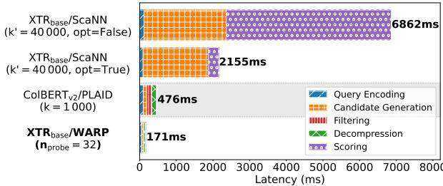
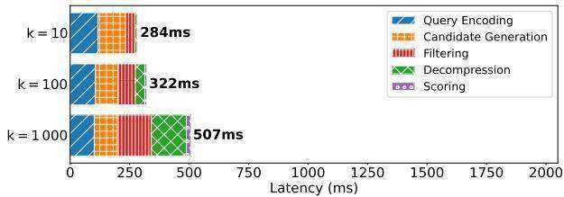
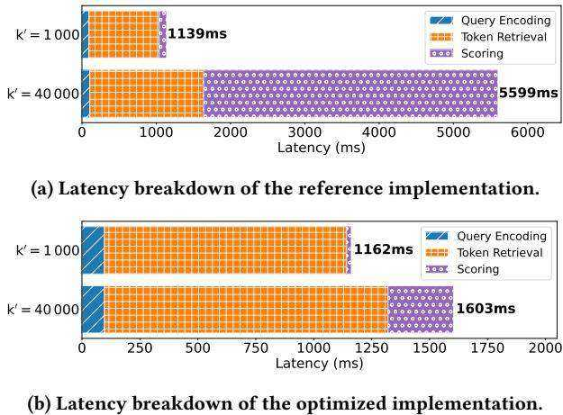
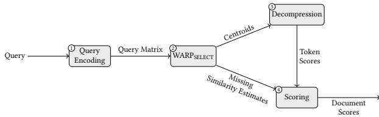
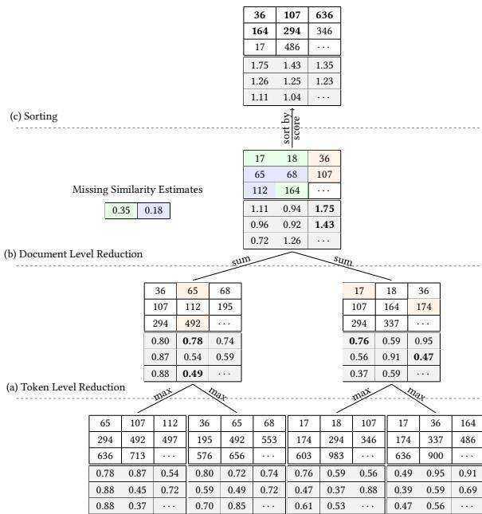
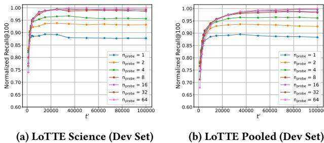
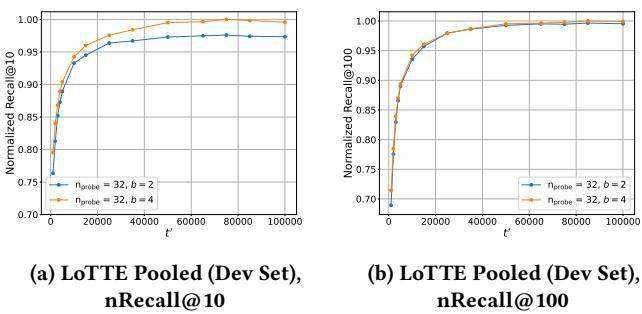
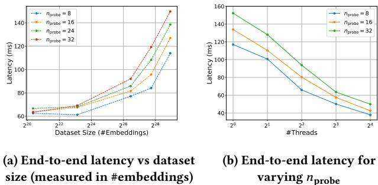

# WARP: An Efficient Engine for Multi-Vector Retrieval

Jan Luca Scheerer∗ ETH Zurich Zurich, Switzerland lscheerer@ethz.ch

Matei Zaharia UC Berkeley Berkeley, CA, USA matei@berkeley.edu

Christopher Potts Stanford University Stanford, CA, USA cgpotts@stanford.edu

Gustavo Alonso ETH Zurich Zurich, Switzerland alonso@inf.ethz.ch

Omar Khattab   
Stanford University   
Stanford, CA, USA   
okhattab@cs.stanford.edu

# Abstract

Multi-vector retrieval methods such as ColBERT and its recent variant, the ConteXtualized Token Retriever (XTR), offer high accuracy but face efficiency challenges at scale. To address this, we present WARP, a retrieval engine that substantially improves the efficiency of retrievers trained with the XTR objective through three key innovations: (1) WARPSELECT for dynamic similarity imputation; (2) implicit decompression, avoiding costly vector reconstruction during retrieval; and (3) a two-stage reduction process for efficient score aggregation. Combined with highly-optimized ${ \mathrm { C } } { + } { + }$ kernels, our system reduces end-to-end latency compared to XTR’s reference implementation by 41x, and achieves a $3 \mathrm { x }$ speedup over the ColBERTv2/PLAID engine, while preserving retrieval quality.

https://github.com/jlscheerer/xtr-warp

# Keywords

Dense Retrieval, Multi-Vector, Late Interaction, Efficiency

# ACM Reference Format:

Jan Luca Scheerer, Matei Zaharia, Christopher Potts, Gustavo Alonso, and Omar Khattab. 2025. WARP: An Efficient Engine for Multi-Vector Retrieval. In Proceedings of the 48th International ACM SIGIR Conference on Research and Development in Information Retrieval (SIGIR ’25), July 13–18, 2025, Padua, Italy. Preprint, 9 pages. https://doi.org/10.1145/3726302.3729904

# 1 Introduction

Over the past several years, information retrieval (IR) research has introduced new neural paradigms for search based on pretrained Transformers. Central among these, the late interaction paradigm proposed in ColBERT [8] departs from the bottlenecks of conventional single-vector representations. Instead, it encodes queries and documents into multi-vector representations on top of which it is able to scale gracefully to search massive collections.

  
Figure 1: Single-threaded CPU latency breakdown of (1) XTR’s unoptimized reference implementation, (2) a variant of XTR that we optimized, (3) the official ColBERTv2/PLAID system, and (4) our proposed XTR/WARP on LoTTE Pooled.

Since the original ColBERT architecture was introduced, there has been substantial research in optimizing the latency of multivector retrieval models [2, 13, 15]. Most notably, PLAID [18] reduces late interaction search latency by $4 5 x$ on a CPU compared to a vanilla ColBERTv2 [19] process, while continuing to deliver state-of-the-art retrieval quality. Orthogonally, the ConteXtualized Token Retriever (XTR) [11] introduces a novel training objective that eliminates the need for a separate gathering stage and thereby significantly simplifies the subsequent scoring stage. While $\mathrm { { X T R ^ { 1 } } }$ lays extremely promising groundwork for more efficient multivector retrieval, we find that it naively relies on a general-purpose vector similarity search library (ScaNN) and combines that with unoptimized Python data structures and manual iteration, introducing substantial overhead.

The key insights from PLAID and XTR appear rather isolated. Whereas PLAID is concerned with aggressively and swiftly pruning away documents it finds unpromising, XTR tries to eliminate gathering complete document representations in the first place. We ask whether there are potentially rich interactions between these two fundamentally distinct approaches to speeding up multivector search. To study this, we introduce a new engine for retrieval with XTR-based ColBERT models, called WARP, that combines techniques from ColBERTv2/PLAID with innovations tailored for the XTR architecture. Our contributions in WARP include: (1) the WARPSELECT method for imputing missing similarities, (2) a new method for implicit decompression of vectors during search, and (3) a novel two-stage reduction phase for efficient scoring.

Experimental evaluation shows that WARP achieves a 41x reduction in end-to-end latency compared to the XTR reference implementation on LoTTE Pooled, bringing query response times down from above 6 seconds to just 171 milliseconds in single-threaded execution, while also reducing index size by a factor of $2 \mathrm { x } \mathrm { - } 4 \mathrm { x }$ compared to the ScaNN-based baseline. Furthermore, WARP demonstrates a $3 \mathbf { x }$ speedup over the state-of-the-art ColBERTv2/PLAID system, as illustrated in Figure 1.

After reviewing prior work on efficient neural IR in Section 2, we analyze the latency bottlenecks in the ColBERT and XTR retrieval frameworks in Section 3, identifying key areas for optimization. These findings form the foundation for our work on WARP, which we introduce and describe in detail in Section 4. In Section 5, we evaluate WARP’s end-to-end latency and scalability using the BEIR [20] and LoTTE [19] benchmarks. Finally, we compare our implementation to existing state-of-the-art engines.

# 2 Related Work

Dense retrieval models can be broadly categorized into single-vector and multi-vector approaches. Single-vector methods, exemplified by ANCE [21] and STAR/ADORE [22], encode a passage into a single dense vector [7]. While these techniques offer computational efficiency, their inherent limitation of representing complex documents with a single vector has been shown to constrain the model’s ability to capture intricate information structures [8].

To address such limitations, ColBERT [8] introduces a multivector paradigm. Here, both queries and documents are independently encoded as multiple embeddings, allowing for a richer representation of document content and query intent. The multi-vector approach is further refined in ColBERTv2 [19], which improves supervision and incorporates residual compression to reduce the space requirements associated with storing multiple vectors per indexed document. Building upon these innovations, PLAID [18] substantially accelerates ColBERTv2 by efficiently pruning non-relevant passages using the residual representation and by employing optimized ${ \mathrm { C } } { + } { + }$ kernels for decompression and scoring. EMVB [15] further optimizes PLAID’s memory usage and single-threaded query latency using product quantization [6] and SIMD instructions.

Separately, COIL [2] incorporates insights from conventional retrieval systems [17] by constraining token interactions to lexical matches between queries and documents. SPLATE [1] translates the embeddings produced by ColBERTv2 style pipelines to a sparse vocabulary, allowing the candidate generation step to be performed using traditional sparse retrieval techniques. CITADEL [13] introduces conditional token interaction through dynamic lexical routing, selectively considering tokens for relevance estimation. While CITADEL significantly reduces GPU execution time, it falls short of PLAID’s CPU performance at comparable retrieval quality.

The ConteXtualized Token Retriever (XTR) [11] represents a notable conceptual advancement in dense retrieval. XTR simplifies the scoring process and eliminates the gathering stage entirely, theoretically enhancing retrieval efficiency. However, its current end-to-end latency limits its applicability in production environments, where even minor increases in query response time can degrade user experience and negatively affect revenue [9].

  
Figure 2: Breakdown of ColBERTv2/PLAID’s avg. latency for varying $k$ on LoTTE Pooled (Dev Set)

# 3 Latency of Current Neural Retrievers

We start by analyzing two state-of-the-art multi-vector retrieval methods to identify their bottlenecks, providing the foundation for our work on WARP. We evaluate the latency of PLAID and XTR across various configurations and datasets: BEIR NFCorpus, LoTTE Lifestyle, and LoTTE Pooled. In XTR, token retrieval emerges as a fundamental bottleneck: the need to retrieve a large number of candidates from the ANN backend significantly impacts performance. PLAID, while generally more efficient, faces challenges in its decompression stage. Query encoding emerges as a shared limitation for both engines, particularly on smaller datasets. These insights inform the design of WARP, which we introduce in Section 4.

# 3.1 ColBERTv2/PLAID

As shown in Figure 2, we evaluate PLAID’s performance using its optimized implementation [4] and the ColBERTv2 checkpoint from Hugging Face [3]. We configure PLAID’s hyperparameters similar to the original paper [18]. Consistent with prior work [15], we observe single threaded CPU latency exceeding $5 0 0 \mathrm { m s }$ on LoTTE Pooled. Furthermore, we find that the decompression stage remains rather constant for fixed $k$ across all datasets, consuming approximately 150-200ms for $k = 1 0 0 0$ . Notably, for smaller datasets like BEIR NFCorpus and large $k$ values, this stage constitutes a significant portion of the overall query latency. Thus, the decompression stage emerges as a critical bottleneck for small datasets. As anticipated, the filtering stage’s execution time is proportional to the number of candidates, increasing for larger $k$ values and bigger datasets. In contrast, candidate generation constitutes a fixed cost based on the number of centroids. Interestingly, the scoring stage appears to have a negligible impact on ColBERTv2/PLAID’s overall latency across all measurements.

# 3.2 XTR/ScaNN

To enable benchmarking of the XTR framework, we develop a Python library based on Google DeepMind’s published code [12]. We provide the library’s code and scripts to reproduce the benchmarks on $\mathrm { G i t H u b ^ { 2 } }$ . Unless otherwise specified, all benchmarks utilize the XTR BASE_EN transformer model for encoding. This model was published and is available on Hugging Face [10]. In accordance with the paper [11], we evaluate the implementation for $\mathrm { k } ^ { \prime } = 1 0 0 0$ and $\mathrm { k } ^ { \prime } = 4 0 0 0 0$ .

  
Figure 3: Breakdown of $\mathbf { X T R _ { b a s e } / S c a N N }$ on LoTTE Pooled.

As seen in Figure 3a, the scoring stage constitutes a significant bottleneck in the end-to-end latency of the XTR framework, particularly when dealing with large values of $k ^ { \prime }$ . We argue that this performance bottleneck is largely attributed to an unoptimized implementation in the released code, which relies on native Python data structures and manual iteration, introducing substantial overhead, especially for large numbers of token embeddings. We refactor this implementation to leverage optimized data structures and vectorized operations. This helps us uncover hidden performance inefficiencies and establish a baseline for further optimization. Our improved XTR implementation is publicly available in the corresponding GitHub repository3.

We present the evaluation of our optimized implementation in Figure 3b. Notably, the optimized implementation’s end-to-end latency is significantly lower than that of the reference implementation ranging from an end-to-end $3 . 5 \mathrm { x }$ speedup on LoTTE pooled to a $6 . 3 \mathrm { x }$ speedup on LoTTE Lifestyle for $k = 1 0 0 0$ . This latency reduction is owed in large parts to a more efficient scoring implementation – a 14x speedup on LoTTE Pooled. In particular, this reveals token retrieval as the fundamental bottleneck of the XTR framework. Although the optimized scoring stage accounts for a small fraction of the overall end-to-end latency, it is still slow in absolute terms, ranging from $3 3 \mathrm { m s }$ to $2 8 1 \mathrm { m s }$ for $k = 1 0 0 0$ on BEIR NFCorpus and LoTTE Pooled, respectively.

# 4 WARP

WARP optimizes retrieval for the refined late interaction architecture introduced in XTR. Seeking to find the best of both the XTR and PLAID worlds, WARP introduces the novel WARPSELECT algorithm for candidate generation, which effectively avoids gathering token-level representations, and proposes an optimized two-stage reduction for faster scoring via a dedicated $\mathbf { C } + +$ kernel combined with implicit decompression. WARP also uses specialized inference runtimes for faster query encoding.

As in XTR, queries and documents are encoded independently into embeddings at the token-level using a fine-tuned T5 transformer [16]. To scale to large datasets, document representations are computed in advance and constitute WARP’s index. The similarity between a query $q$ and document $d$ is modeled using XTR’s adaptation of ColBERT’s summation of MaxSim operations4:

$$
\boldsymbol { S _ { d , q } } = \sum _ { i = 1 } ^ { n } \operatorname* { m a x } _ { 1 \leq j \leq m } [ \hat { \boldsymbol { \mathrm { A } } } _ { i , j } \boldsymbol { q } _ { i } ^ { T } \boldsymbol { d } _ { j } + ( 1 - \hat { \boldsymbol { \mathrm { A } } } _ { i , j } ) m _ { i } ]
$$

where $q$ and $d$ are the matrix representations of the query and passage embeddings respectively, $m _ { i }$ denotes the missing similarity estimate for $q _ { i }$ , and $\hat { \bf A }$ describes XTR’s alignment matrix. In particular, $\hat { \mathbf { A } } _ { i , j } = \mathbb { 1 } _ { [ j \in \mathrm { t o p } ^ { - } k _ { j } ^ { \prime } ( \mathbf { d } _ { i , j ^ { \prime } } ) ] }$ captures whether a document token embedding of a candidate passage was retrieved for a specific query token $q _ { i }$ as part of the token retrieval stage. We refer to [8, 11] for an intuition behind this choice of scoring function.

# 4.1 Index Construction

Akin to ColBERTv2 [19], WARP’s compression strategy involves applying $k$ -means clustering to the produced document token embeddings. As in ColBERTv2, we find that using a sample of all passages proportional to the square root of the collection size to generate this clustering performs well in practice. After having clustered the sample of passages, all token-level vectors are encoded and stored as quantized residual vectors to their nearest cluster centroid. Each dimension of the quantized residual vector is a $^ { b }$ -bit encoding of the delta between the centroid and the original uncompressed vector. In particular, these deltas are stored as a sequence of $1 2 8 \cdot { \frac { b } { 8 } }$ 8-bit values, wherein 128 represents the transformer’s token embedding dimension. Typically, we set $b = 4$ , i.e., compress each dimension of the residual into a single nibble, for an ${ } ^ { 8 x }$ compression5. In this case, each compressed 8-bit value stores 2 indices in the range $[ 0 , 2 ^ { b } )$ . Instead of quantizing the residuals uniformly, WARP uses quantiles derived from the empirical distribution to determine bucket boundaries and the corresponding representative values. This process allows WARP to allocate more quantization levels to densely populated regions of the data distribution, thereby minimizing the overall quantization error for residual compression.

# 4.2 Retrieval

Extending PLAID, the retrieval process in the WARP engine is divided into four distinct steps: query encoding, candidate generation, decompression, and scoring. Figure 4 illustrates the retrieval process in WARP. The process starts by encoding the query text into $q$ , a (query_maxlen, 128)-dimensional tensor, using the underlying Transformer model.6 Next, the most similar $n _ { \mathrm { p r o b e } }$ centroids are identified for each of the query_maxlen query token embeddings.

Subsequently, WARP identifies all document token embeddings belonging to the clusters of the selected centroids and computes their individual relevance score. Computing this score involves decompressing residuals of the identified document token embeddings and calculating their cosine similarity with the relevant query token embedding. Finally, WARP implicitly constructs an ??candidates $\times$ query_maxlen score matrix $S ^ { 7 }$ , where each entry $S _ { d _ { i } , q _ { j } }$ contains the maximum retrieved score for the $i \cdot$ -th candidate passage $d _ { i }$ and the $j$ -th query token embedding $q _ { j }$ :

  
Figure 4: WARP Retrieval consisting of query encoding, WARPSELECT, decompression, and scoring. Notably, centroid selection is combined with the computation of missing similarity estimates in WARPSELECT.

$$
\operatorname* { m a x } _ { 1 \leq j \leq m } \hat { { \bf A } } _ { i , j } q _ { i } ^ { T } d _ { j }
$$

Matrix entries not populated during token retrieval, i.e., $\hat { \bf A } _ { i , j } = 0$ , are imputed with a missing similarity estimate, as postulated in the XTR framework. To compute the relevance score of a document $d _ { i }$ , the cumulative score over all query tokens is computed: Í?? ??????,???? . To produce the ordered set of passages, the set of scores is sorted and the top $k$ highest scoring passages are returned.

# 4.3 WARPSELECT

In contrast to ColBERT, which populates the entire score matrix for the items retrieved, XTR only populates the score matrix with scores computed as part of the token retrieval stage. To account for the contribution of any missing tokens, XTR relies on missing similarity imputation, in which they set any missing similarity of the query token for a specific document as the lowest score obtained as part of the token retrieval stage. The authors argue that this approach is justified as it constitutes a natural upper bound for the true relevance score. In the case of WARP, this bound is no longer guaranteed to hold.8

Instead, WARP defines a novel strategy for missing similarity imputation based on cumulative cluster sizes, WARPSELECT. Given the query embedding matrix $q$ and the list of centroids $C$ (Section 4.1), WARP computes the token-level query-centroid relevance scores. As both the query embedding vectors and the set of centroids are normalized, the cosine similarity scores $S _ { c , q }$ can be computed efficiently as a matrix product:

$$
S _ { c , q } = C \cdot q ^ { T }
$$

Once these relevance scores have been computed, WARP identifies the $n _ { \mathrm { p r o b e } }$ centroids with the largest similarity scores for decompression, as part of candidate generation.

Using these query–centroid similarity scores, WARPSELECT folds the estimation of missing similarity scores into candidate generation. Specifically, for each query token $q _ { i }$ , it sets $m _ { i }$ from Equation (1) as the first element in the sorted list of centroid scores for which the cumulative cluster size exceeds a threshold $t ^ { \prime }$ . This method is particularly attractive as all the centroid scores have already been computed and sufficiently sorted as part of candidate generation, so the cost of computing missing similarity imputation with this method is negligible.

We find that $t ^ { \prime }$ is easy to configure (see Section 4.6) without compromising retrieval quality or efficiency. This represents a significant improvement over the missing similarity estimate used in the XTR reference implementation, where the estimate is inherently tied to the number of retrieved tokens. Intuitively, increasing $k ^ { \prime }$ in XTR may only help refine the missing similarity estimate, but not necessarily increase the density of the score matrix.9

# 4.4 Decompression

The input for the decompression phase is the set of $n _ { \mathrm { p r o b e } }$ centroid indices for each of the query_maxlen query tokens. Its goal is to calculate relevance scores between each query token and the embeddings within the identified clusters. For a query token $q _ { i }$ , let $c _ { i , j }$ , where $j \in [ n _ { \mathrm { p r o b e } } ]$ , be the set of centroid indices identified during candidate generation. Let $r _ { i , j , k }$ be the set of residuals associated with cluster $c _ { i , j }$ . The decompression step computes:

$$
s _ { i , j , k } = \mathrm { d e c o m p r e s s } ( C [ c _ { i , j } ] , r _ { i , j , k } ) \times q _ { i } ^ { T } \ : \forall \ : i , j , k
$$

The decompress function converts residuals from their compact representation into uncompressed vectors. Each residual $r _ { i , j , k }$ is composed of 128 indices, each $^ { b }$ bits wide. These indices reference values in the bucket weights vector $\boldsymbol { \omega } \in \mathbb { R } ^ { 2 ^ { b } }$ and are used to offset the centroid $C [ c _ { i , j } ]$ . The decompress function is defined as:

$$
{ \mathrm { d e c o m p r e s s } } ( C [ c _ { i , j } ] , r _ { i , j , k } ) = C [ c _ { i , j } ] + \sum _ { d = 1 } ^ { 1 2 8 } \pmb { e } _ { d } \cdot \omega [ ( r _ { i , j , k } ) _ { d } ]
$$

Here, $e _ { d }$ is the unit vector for dimension $d$ , and $\omega [ ( r _ { i , j , k } ) _ { d } ]$ is the weight value at index $( r _ { i , j , k } ) _ { d }$ for dimension $d$ . In other words, the indices are used to look up specific entries in $\omega$ for each dimension independently, adjusting the centroid accordingly.

WARP avoids explicitly decompressing residuals, as PLAID does, by leveraging the observation that the scoring function decomposes between centroids and residuals. As a result, WARP reuses the query-centroid relevance scores $S _ { c , q } \mathrm { _ { : } }$ , computed as part of candidate generation. That is, observe that:

$$
\begin{array} { l } { { \displaystyle s _ { i , j , k } = \mathrm { d e c o m p r e s s } ( C [ c _ { i , j } ] , r _ { i , j , k } ) \times q _ { i } ^ { T } } } \\ { { \displaystyle \quad \quad = ( C [ c _ { i , j } ] \times q _ { i } ^ { T } ) + ( \sum _ { d = 1 } ^ { 1 2 8 } \omega [ ( r _ { i , j , k } ) _ { d } ] q _ { i , d } ) } } \end{array}
$$

To accelerate decompression, WARP computes $v = \hat { q } { \times } \hat { \omega }$ , wherein $\hat { q } \in \mathbb { R }$ query_maxle $1 { \times } 1 2 8 { \bar { \times } } 1$ represents the query matrix that has been unsqueezed along the last dimension, and $\boldsymbol { \hat { \omega } } \in \mathbb { R } ^ { 1 \times 2 ^ { b } }$ denotes the vector of bucket weights that has been unsqueezed along the first dimension.

With these definitions, WARP can decompress and score candidate tokens via:

$$
\begin{array} { l } { { s _ { i , j , k } = S _ { c _ { j } , q _ { i } } + \displaystyle \sum _ { d = 1 } ^ { 1 2 8 } ( \omega \cdot q _ { i , d } ) [ ( \boldsymbol { r } _ { i , j , k } ) _ { d } ] } } \\ { { \displaystyle \quad = S _ { c _ { j } , q _ { i } } + \sum _ { d = 1 } ^ { 1 2 8 } v _ { i , d } [ ( \boldsymbol { r } _ { i , j , k } ) _ { d } ] } } \end{array}
$$

Note that candidate scoring can now be implemented as a simple selective sum. As the bucket weights are shared among centroids and the query-centroid relevance scores have already been computed during candidate generation, WARP can decompress and score arbitrarily many clusters using $O ( 1 )$ multiplications. This refined scoring function is far more efficient than the one outlined in PLAID,10 as it never computes the decompressed embeddings explicitly and instead directly emits the resulting candidate scores. We provide an efficient implementation of the selective sum of Equation (4) and realize unpacking of the residual representation using low-complexity bitwise operations as part of WARP’s ${ \mathrm { C } } { + } { + }$ kernel for decompression.

# 4.5 Scoring

At the end of the decompression phase, we have query_maxlen $\times$ $n _ { \mathrm { p r o b e } }$ strides of decompressed candidate document token-level scores and their corresponding document identifiers. Scoring combines these scores with the missing similarity estimates, computed during candidate generation, to produce document-level scores. This process corresponds to constructing the score matrix and taking the row-wise sum.

Explicitly constructing the score matrix, as in the reference XTR implementation, introduces a significant bottleneck, particularly for large values of $n _ { \mathrm { p r o b e } }$ . To address this, WARP efficiently aggregates token-level scores using a two-stage reduction process:

Token-level reduction For each query token, reduce the corresponding set of $n _ { \mathrm { p r o b e } }$ strides using the max operator. This step implicitly fills the score matrix with the maximum per-token score for each document. As a single cluster can contain multiple document token embeddings originating from the same document, WARP performs inner-cluster maxreduction directly during the decompression phase.

Document-level reduction Reduce the resulting strides into document-level scores using a sum aggregation. It is essential to handle missing values properly at this stage – any missing per-token score must be replaced by the corresponding missing similarity estimate, ensuring compliance with the XTR scoring function described in Equation (1). This reduction step corresponds to the row-wise summation of the score matrix.

After performing both reduction phases, the final stride contains the document-level scores and the corresponding identifiers for all candidate documents. To retrieve the result set, we perform heap select to obtain the top- $k$ documents, similar to its use in the candidate generation phase.

Formally, we consider a stride $S$ to be a list of key-value pairs:

$$
S = \{ ( k _ { i } , v _ { i } ) \} ; \operatorname { K } ( S ) = \{ k _ { i } \mid ( k _ { i } , v _ { i } ) \in S \} ; \operatorname { V } ( S ) = \{ v _ { i } \mid ( k _ { i } , v _ { i } ) \in S \}
$$

Thus, strides implicitly define a partial function $f _ { S } : K  V ( S )$ :

$$
f _ { S } ( { \boldsymbol { k } } ) = { \left\{ \begin{array} { l l } { \boldsymbol { v _ { i } } } & { { \mathrm { i f } } \ \exists \boldsymbol { v _ { i \cdot } } ( { \boldsymbol { k , v _ { i } } } ) \in S } \\ { \bot } & { { \mathrm { o t h e r w i s e } } } \end{array} \right. }
$$

We define a reduction as a combination of two strides $S _ { 1 }$ and $S _ { 2 }$ using a binary function $r$ into a single stride by applying $r$ to values of matching keys:

$$
( r , S _ { 1 } , S _ { 2 } ) = \{ ( k , r ( f _ { S _ { 1 } } ( k ) , f _ { S _ { 2 } } ( k ) ) ) \mid k \in K ( S _ { 1 } ) \cup K ( S _ { 2 } ) \}
$$

With these definitions, token-level reduction can be written as:

$$
r _ { \mathrm { t o k } } ( v _ { 1 } , v _ { 2 } ) = \left\{ { \begin{array} { l l } { \operatorname* { m a x } ( v _ { 1 } , v _ { 2 } ) } & { { \mathrm { i f } } v _ { 1 } \neq \perp \land v _ { 2 } \neq \perp } \\ { v _ { 1 } } & { { \mathrm { i f } } v _ { 1 } \neq \perp \land v _ { 2 } = \perp } \\ { v _ { 2 } } & { { \mathrm { o t h e r w i s e } } } \end{array} } \right.
$$

Defining document-level reduction is slightly more complex as it involves incorporating the corresponding missing similarity estimates $m$ . After token-level reduction each of the query_maxlen strides $S _ { 1 } , \ldots , S _ { 9 }$ uery_maxlen covers scores for a single query token $q _ { i }$ . We set $S _ { i , i } = S _ { i }$ and define:

$$
S _ { i , j } = \mathrm { r e d u c e } ( r _ { \mathrm { d o c } , ( i , k , j ) } , S _ { i , k } , S _ { k + 1 , j } )
$$

for any choice of $i ~ \le ~ k ~ < ~ j$ , wherein $r _ { \mathrm { d o c } , ( i , k , j ) }$ merges two successive, non-overlapping strides $S _ { i , k }$ and $S _ { k + 1 , j }$ . The resulting stride, $S _ { i , j }$ , now covers scores for query tokens $q _ { i } , . . . , q _ { j }$ . Defining ??doc, ??,??,?? is relatively straightforward:

$$
r _ { \mathrm { d o c } , ( i , k , j ) } ( v _ { 1 } , v _ { 2 } ) = \left\{ \begin{array} { l l } { v _ { 1 } + v _ { 2 } } & { \mathrm { i f } v _ { 1 } \not = \bot \wedge v _ { 2 } \not = \bot } \\ { v _ { 1 } + ( \sum _ { t = k + 1 } ^ { j } m _ { t } ) } & { \mathrm { i f } v _ { 1 } \not = \bot \wedge v _ { 2 } = \bot } \\ { ( \sum _ { t = i } ^ { k } m _ { t } ) + v _ { 2 } } & { \mathrm { o t h e r w i s e } } \end{array} \right.
$$

It is easy to verify that $S _ { i , j }$ is well-defined, i.e., independent of the choice of $k$ . The result of document-level reduction is $S _ { 1 , }$ ,query_maxlen and can be obtained by recursively applying Equation (7) to strides of increasing size.

WARP’s two-stage reduction process, along with the final sorting step, is illustrated in Figure 5. In the token-level reduction stage, strides are merged by selecting the maximum value for matching keys. In the document-level reduction stage, values for matching keys are summed, with missing values being substituted by the corresponding missing similarity estimates.

In our implementation, we conceptually construct a binary tree of the required merges and alternate between using two scratch buffers to avoid additional memory allocations. We realize Equation (8) using a prefix sum, which involves precalculating running totals to eliminate the need to compute sums explicitly later on.

# 4.6 Hyperparameters

In this section, we analyze the effects of WARP’s three primary hyperparameters, namely:

• $n _ { \mathrm { p r o b e } }$ – the #clusters to decompress per query token • $t ^ { \prime }$ – the threshold on the cluster size used for WARPSELECT • $^ { b }$ – the number of bits per dimension of a residual vector

  
Figure 5: WARP’s scoring phase: (a) In token-level reduction, strides are max-reduced. (b) In document-level reduction, values are summed, accounting for missing similarity estimates. (c) Scores are sorted, yielding the top- $\mathbf { \nabla } \cdot \mathbf { k }$ results.

To study the effects of $n _ { \mathrm { p r o b e } }$ and $t ^ { \prime }$ , we analyze the normalized Recall@ $) 1 0 0 ^ { 1 1 }$ as a function of $t ^ { \prime }$ for $n _ { \mathrm { p r o b e } } \in \{ 1 , 2 , 4 , 8 , 1 6 , 3 2 , 6 4 \}$ across four development datasets of increasing size: BEIR NFCorpus, BEIR Quora, LoTTE Lifestyle, and LoTTE Pooled. For further details on the datasets, please refer to Table 1. Figure 6 visualizes the results of our analysis. We observe a consistent pattern across all evaluated datasets, namely substantial improvements as ??probe increases from 1 to 16 (i.e., 1, 2, 4, 8, 16), followed by only marginal gains in Recal $@ 1 0 0$ beyond that. A notable exception is BEIR NFCorpus, where we still observe significant improvement when increasing from $n _ { \mathrm { p r o b e } } = 1 6$ to $n _ { \mathrm { p r o b e } } = 3 2$ . We hypothesize that this is due to the small number of embeddings per cluster in NF-Corpus, limiting the number of scores available for aggregation. Consequently, we conclude that setting $n _ { \mathrm { p r o b e } } = 3 2$ strikes a good balance between end-to-end latency and retrieval quality.

In general, we find that WARP is highly robust to variations in $t ^ { \prime }$ . However, smaller datasets, such as NFCorpus, appear to benefit from a smaller $t ^ { \prime }$ , while larger datasets perform better with a larger $t ^ { \prime }$ . Empirically, we find that setting $t ^ { \prime }$ proportional to the square root of the dataset size consistently yields strong results across all datasets. Moreover, increasing $t ^ { \prime }$ beyond a certain point no longer improves recall, leading us to bound $t ^ { \prime }$ by a maximum value, $t _ { \mathrm { m a x } } ^ { \prime }$

Next, we aim to quantify the effect of $^ { b }$ on the retrieval quality of WARP, as shown in Figure 7. To do this, we compute the nRecall@k for $n _ { \mathrm { p r o b e } } = 3 2$ and $k \in \{ 1 0 , 1 0 0 \}$ using two datasets: LoTTE Science and LoTTE Pooled.

  
Figure 6: nRecall $@$ 100 as a function of $t ^ { \prime }$ and ??probe

  
Figure 7: nRecall $@ \mathbf { k }$ as a function of $t ^ { \prime }$ and $^ { b }$

<table><tr><td colspan="2">Dataset</td><td colspan="2">Dev</td><td colspan="2">Test</td></tr><tr><td colspan="2"></td><td>#Queries</td><td>#Passages</td><td>#Queries</td><td>#Passages</td></tr><tr><td rowspan="5">BeIR [20]</td><td>NFCORPUS</td><td>324</td><td>3.6K</td><td>323</td><td>3.6K</td></tr><tr><td>SciFact</td><td></td><td></td><td>300</td><td>5.2K</td></tr><tr><td>SCIDOCS</td><td></td><td></td><td>1,000</td><td>25.7K</td></tr><tr><td>Quora</td><td>5,000</td><td>522.9K</td><td>10,000</td><td>522.9K</td></tr><tr><td>FiQA-2018</td><td>500</td><td>57.6K</td><td>648</td><td>57.6K</td></tr><tr><td rowspan="6">LoTTE [19]</td><td>Touché-2020</td><td></td><td></td><td>49</td><td>382.5K</td></tr><tr><td>Lifestyle</td><td>417 563</td><td>268.9K 263.0K</td><td>661 924</td><td>119.5K 167.0K</td></tr><tr><td>Recreation Writing</td><td>497</td><td>277.1K</td><td>1,071</td><td>200.0K</td></tr><tr><td>Technology</td><td>916</td><td>1.3M</td><td>596</td><td>638.5K</td></tr><tr><td>Science</td><td>538</td><td>343.6K</td><td>617</td><td>1.7M</td></tr><tr><td>Pooled</td><td>2,931</td><td>2.4M</td><td>3,869</td><td>2.8M</td></tr></table>

Table 1: Datasets used for evaluating XTRbase/WARP performance. The evaluation includes 6 datasets from BEIR [20] and 6 from LoTTE [19].

Our results show a significant improvement in retrieval performance when increasing $^ { b }$ from 2 to 4, particularly for smaller values of $k$ . For larger values of $k$ , the difference in performance diminishes, particularly for the LoTTE Pooled dataset.

# 5 Evaluation

We now evaluate WARP on six datasets from BEIR [20] and six datasets from LoTTE [19] listed in Table 1. We use servers with 28 Intel Xeon Gold 6132 @ 2.6 GHz CPU cores12 and 500 GB

RAM. The servers have two NUMA sockets with roughly 92 ns intra-socket memory latency, 142 ns inter-socket memory latency, 72 GBps intra-socket memory bandwidth, and 33 GBps inter-socket memory bandwidth.

When measuring latency for end-to-end results, we compute the average latency of all queries and report the minimum average latency across three trials. For other results, we describe the specific measurement procedure in the relevant section. We measure latency on an otherwise idle machine. XTR’s token retrieval stage does not benefit from GPU acceleration due to its use of ScaNN [5], specifically designed for single-threaded13 use on $\mathbf { \boldsymbol { x } } 8 6$ processors with AVX2 support. Therefore, unless otherwise specified, all measurements are performed on the CPU using a single thread14.

# 5.1 End-to-End Results

Recent studies, such as those in [14], demonstrate that dense multivector retrieval systems deliver near-exhaustive search performance while significantly reducing computational costs. In contrast, conventional re-ranking, though generally faster, often underperforms multi-vector retrieval systems in terms of effectiveness. As a result, we limit our evaluation to a comparison with the XTR/ScaNN baseline and leave a more extensive evaluation of re-ranking or exhaustive approaches to future work.

Table 2 presents our results on LoTTE. $\mathrm { X T R } _ { \mathrm { b a s e } } / \mathrm { W A R P }$ outperforms the optimized $\mathrm { X T R } _ { \mathrm { b a s e } } / \mathrm { S c a N N }$ implementation in terms of Success $@ 5$ , while significantly reducing end-to-end latency, with speedups ranging from $4 . 6 \mathrm { x }$ on LoTTE Lifestyle to $1 2 . 8 \mathrm { x }$ on LoTTE Pooled. As shown in Table 3, we observe a similar trend with the evaluation of $\mathrm { \ n D C G } @ 1 0$ on the six BEIR [20] datasets. $\mathrm { X T R _ { b a s e } / W A R P }$ achieves speedups of $2 . 7 \mathrm { x } \mathrm { - } 6 \mathrm { x }$ over $\mathrm { X T R _ { b a s e } / S c a N N }$ with a slight gain in $\mathrm { \ n D C G } @ 1 0 .$ . Likewise, we find improvements of Recall@100 on BEIR with substantial gains in end-to-end latency, but we omit them here due to space constraints.

In comparison, EMVB [15] reports a notable $2 . 9 \mathrm { x }$ speedup in retrieval latency (142ms vs. 411ms) over ColBERTv2/PLAID on the LoTTE Pooled development set. By contrast, our method achieves a $4 . 3 \mathrm { x }$ speedup (95ms vs. 405ms), albeit under different hardware settings and encoder models. Importantly, we view WARP and EMVB as largely orthogonal approaches, suggesting that future work could explore integrating SIMD-based acceleration into WARP.

# 5.2 Scalability

We now assess WARP’s scalability in relation to both dataset size and the degree of parallelism. To study the effect of the dataset size on WARP’s performance, we evaluate its latency across development datasets of varying sizes: BEIR NFCorpus, BEIR Quora, LoTTE Science, LoTTE Technology, and LoTTE Pooled (Table 1). Figure 8a plots the latency of different configurations versus the size of the dataset, measured in the number of document token embeddings. Our results confirm that WARP’s latency generally scales with the square root of the dataset size — this is intuitive, as the number of clusters is by design proportional to the square root of the dataset size.

Table 2: Success $\textcircled { \pmb { \omega } } 5$ on LoTTE. Numbers in parentheses show average latency (milliseconds), with the final column displaying the average score across the datasets. Both XTR/ScaNN and WARP use the $\mathbf { X T R _ { b a s e } }$ model. XTR/ScaNN uses $k ^ { \prime } = 4 0 0 0 0$ and WARP uses $n _ { \mathbf { n } \mathbf { p } \mathbf { r o } \mathbf { b } \mathbf { e } } = 3 2$ .   

<table><tr><td></td><td>Lifestyle</td><td>Recreation</td><td>Writing</td><td>Technology</td><td>Science</td><td>Pooled</td><td>Avg.</td></tr><tr><td>BM25</td><td>63.8</td><td>56.5</td><td>60.3</td><td>41.8</td><td>32.7</td><td>48.3</td><td>50.6</td></tr><tr><td>ColBERT</td><td>80.2</td><td>68.5</td><td>74.7</td><td>61.9</td><td>53.6</td><td>67.3</td><td>67.7</td></tr><tr><td>GTRbase</td><td>82.0</td><td>65.7</td><td>74.1</td><td>58.1</td><td>49.8</td><td>65.0</td><td>65.8</td></tr><tr><td>XTR/ScaNN15 XTR/WARP</td><td>83.5 (333.6) 83.5 (73.1)</td><td>69.6 (400.2) 69.5 (72.4)</td><td>78.0 (378.0) 78.6 (73.6)</td><td>63.9 (742.5) 64.6 (96.4)</td><td>55.3 (1827.6) 56.1 (156.4)</td><td>68.4 (2156.3) 69.3 (171.3)</td><td>69.8 70.3</td></tr><tr><td>Spladev2 60</td><td>82.3</td><td>69.0</td><td>77.1</td><td>62.4</td><td>55.4</td><td>68.9</td><td>69.2</td></tr><tr><td>ColBERT2</td><td>84.7</td><td>72.3</td><td>80.1</td><td>66.1</td><td>56.7</td><td>71.6</td><td>71.9</td></tr><tr><td>GTRxxl</td><td>87.4</td><td>78.0</td><td>83.9</td><td>69.5</td><td>60.0</td><td>76.0</td><td>75.8</td></tr><tr><td>XTRxxl</td><td></td><td></td><td></td><td></td><td></td><td>77.3</td><td></td></tr><tr><td></td><td>89.1</td><td>79.3</td><td>83.3</td><td>73.7</td><td>60.8</td><td></td><td>77.3</td></tr></table>

♣: cross-encoder distillation ♦: model-based hard negatives

<table><tr><td></td><td>NFCorpus</td><td>SciFact</td><td>SCIDOCS</td><td>FiQA-2018</td><td>Touché-2020</td><td>Quora</td><td>Avg.</td></tr><tr><td>BM25</td><td>32.5</td><td>66.5</td><td>15.8</td><td>23.6</td><td>36.7</td><td>78.9</td><td>42.3</td></tr><tr><td>ColBERT</td><td>30.5</td><td>67.1</td><td>14.5</td><td>31.7</td><td>20.2</td><td>85.4</td><td>41.6</td></tr><tr><td>GTRbase</td><td>30.8</td><td>60.0</td><td>14.9</td><td>34.9</td><td>21.5</td><td>88.1</td><td>41.7</td></tr><tr><td>XTR/ScaNN15 XTR/WARP</td><td>33.5 (158.1) 33.5 (58.0)</td><td>69.6 (309.7) 70.5 (64.3)</td><td>14.3 (297.3) 15.2 (66.1)</td><td>34.1 (338.2) 34.2 (70.7)</td><td>31.2 (560.2) 30.5 (94.8)</td><td>86.0 (411.2) 86.2 (67.6)</td><td>44.8 45.0</td></tr><tr><td>Spladev2 $</td><td>33.4</td><td>69.3</td><td>15.8</td><td>33.6</td><td></td><td>83.8</td><td>43.8</td></tr><tr><td>ColBERTv2 $0</td><td>33.8</td><td>69.3</td><td>15.4</td><td>35.6</td><td>27.2 26.3</td><td>85.2</td><td>44.3</td></tr><tr><td></td><td></td><td></td><td></td><td></td><td></td><td></td><td></td></tr><tr><td>GTRxxl</td><td>34.2</td><td>66.2</td><td>16.1</td><td>46.7</td><td>23.3</td><td>89.2</td><td>45.9</td></tr><tr><td>XTRxxl</td><td>35.3</td><td>74.3</td><td>17.1</td><td>43.8</td><td>30.9</td><td>88.1</td><td>48.3</td></tr></table>

♣: cross-encoder distillation ♦: model-based hard negatives

Table 3: nDCG $@$ 10 on BEIR. Numbers in parentheses show average latency (milliseconds), with the final column displaying the average score across the datasets. Both XTR/ScaNN and WARP use the $\mathbf { X T R _ { b a s e } }$ model. XTR/ScaNN uses $k ^ { \prime } = 4 0 0 0 0$ and WARP uses $n _ { \mathbf { n } \mathbf { p } \mathbf { r o } \mathbf { b } \mathbf { e } } = 3 2$ .

  
Figure 8: WARP’s scaling behavior with respect to dataset size and the number of available CPU threads

A key advantage of WARP over the reference implementation is its ability to leverage multi-threading. Figure 8b illustrates WARP’s performance on the LoTTE Pooled development set, showing how the number of CPU threads impacts performance for different values of $n _ { \mathrm { p r o b e } }$ . Our results indicate that WARP effectively parallelizes across multiple threads, achieving a speedup of $3 . 1 \mathrm { x }$ for $n _ { \mathrm { p r o b e } } = 3 2$ with 16 threads. We refer to A.1, and in particular Figure 10, for a more detailed breakdown of WARP’s multi-threaded latency.

# 5.3 Memory Footprint

Table 4: Comparison of index sizes for the datasets. Note that PLAID’s memory usage is effectively identical to WARP’s, only slightly larger.   

<table><tr><td rowspan="3" colspan="2">Dataset</td><td rowspan="3"># Tokens</td><td colspan="5">XTR Index Size (GiB)</td></tr><tr><td>BruteForce</td><td>FAISS</td><td>ScaNN</td><td>WARP(b=2)</td><td>WARP(b=4)</td></tr><tr><td rowspan="6">BeIR [20]</td><td>NFCORPUS</td><td>1.35M</td><td>0.65</td><td>0.06</td><td>0.18</td><td>0.06</td><td>0.10</td></tr><tr><td>SciFact</td><td>1.87M</td><td>0.91</td><td>0.08</td><td>0.25</td><td>0.07</td><td>0.13</td></tr><tr><td>SCIDOCS</td><td>6.27M</td><td>3.04</td><td>0.28</td><td>0.82</td><td>0.24</td><td>0.43</td></tr><tr><td>Quora</td><td>9.12M</td><td>4.43</td><td>0.43</td><td>1.21</td><td>0.35</td><td>0.62</td></tr><tr><td>FiQA-2018</td><td>10.23M</td><td>4.95</td><td>0.46</td><td>1.34</td><td>0.38</td><td>0.69</td></tr><tr><td>Touché-2020</td><td>92.64M</td><td>45.01</td><td>4.28</td><td>12.22</td><td>3.40</td><td>6.16</td></tr><tr><td rowspan="6">LoTTE [19]</td><td>Lifestyle</td><td>23.71M</td><td>11.51</td><td>1.08</td><td>3.12</td><td>0.88</td><td>1.59</td></tr><tr><td>Recreation</td><td>30.04M</td><td>14.59</td><td>1.38</td><td>3.96</td><td>1.11</td><td>2.01</td></tr><tr><td>Writing</td><td>32.21M</td><td>15.64</td><td>1.48</td><td>4.25</td><td>1.19</td><td>2.15</td></tr><tr><td>Technology</td><td>131.92M</td><td>64.12</td><td>6.13</td><td>17.44</td><td>4.83</td><td>8.77</td></tr><tr><td>Science</td><td>442.15M</td><td>214.93</td><td>20.57</td><td>58.46</td><td>16.07</td><td>29.28</td></tr><tr><td>Pooled</td><td>660.04M</td><td>320.88</td><td>30.74</td><td>87.30</td><td>23.88</td><td>43.59</td></tr><tr><td>Total</td><td>-</td><td>1.44B</td><td>700.66</td><td>66.98</td><td>190.52</td><td>52.48</td><td>95.51</td></tr></table>

WARP’s primary advantage lies in its significant reduction in latency, though its benefits extend beyond speed alone. By adopting a ColBERTv2/PLAID-like approach for compression, WARP’s advantage over XTR also translates into to a reduction in index size. This decrease in memory requirements broadens deployment options, particularly in resource-constrained environments. Table 4 compares index sizes across all evaluated test datasets. ${ \mathrm { W A R P } } _ { ( b = 4 ) }$ demonstrates a substantially smaller index size compared to the BruteForce and ScaNN variants, providing a $7 . 3 \mathrm { x }$ and $2 \mathbf { x }$ reduction in memory footprint, respectively. Although the indexes generated by the FAISS implementation are marginally smaller, this comes at the cost of substantially reduced quality and latency. Notably, $\mathrm { W A R P } _ { ( b = 2 ) }$ outperforms the FAISS implementation in terms of quality with an even smaller index size16.

# 6 Conclusion

We present WARP, a highly optimized engine for multi-vector retrieval built upon ColBERTv2/PLAID and the XTR framework. WARP addresses key inefficiencies in existing systems through three major innovations: (1) WARPSELECT for dynamic missing similarity imputation; (2) implicit decompression during retrieval; and (3) a streamlined two-stage reduction using dedicated ${ \mathrm { C } } { + } { + }$ kernels. Together, these optimizations culminate in substantial performance gains, including a 41x speedup over XTR on LoTTE Pooled – cutting latency from over 6 seconds to just 171ms in single-threaded execution – and a 3x reduction in latency compared to ColBERTv2/PLAID, all without compromising retrieval quality. WARP also scales efficiently with increased thread count and offers a significantly reduced memory footprint, making it well-suited for deployment in resource-constrained environments.

Future work may incorporate techniques such as SIMD and GPU acceleration, more lightweight query encoding, and end-to-end training with WARP to better align model optimization with its retrieval process.