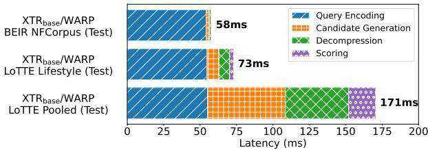
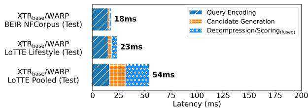
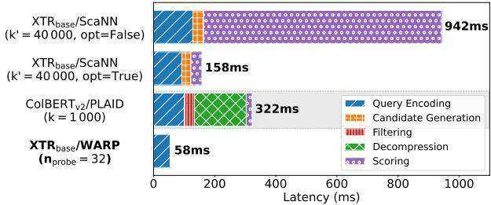
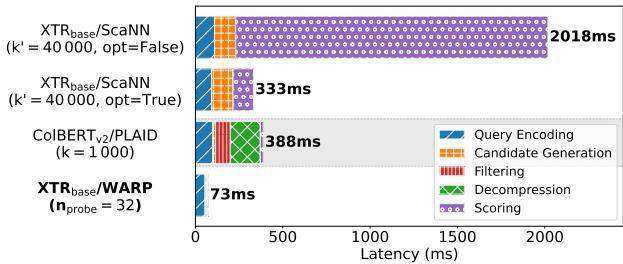

[1] Thibault Formal, Stéphane Clinchant, Hervé Déjean, and Carlos Lassance. 2024. Splate: sparse late interaction retrieval. (2024). arXiv: 2404.13950 [cs.IR].   
[2] Luyu Gao, Zhuyun Dai, and Jamie Callan. 2021. Coil: revisit exact lexical match in information retrieval with contextualized inverted list. (2021). https://arxiv .org/abs/2104.07186 arXiv: 2104.07186 [cs.IR].   
[3] Stanford Future Data Systems Research Group. 2024. colbert-ir/colbertv2.0. https://huggingface.co/colbert-ir/colbertv2.0. (2024).   
[4] Stanford Future Data Systems Research Group. 2024. ColBERTv2/PLAID (Code). https://github.com/stanford-futuredata/ColBERT. (2024).   
[5] Ruiqi Guo, Philip Sun, Erik Lindgren, Quan Geng, David Simcha, Felix Chern, and Sanjiv Kumar. 2020. Accelerating large-scale inference with anisotropic vector quantization. (2020). https://arxiv.org/abs/1908.10396 arXiv: 1908.10396 [cs.LG].   
[6] Herve Jégou, Matthijs Douze, and Cordelia Schmid. 2011. Product quantization for nearest neighbor search. IEEE Transactions on Pattern Analysis and Machine Intelligence, 33, 1, 117–128. doi: 10.1109/TPAMI.2010.57.   
[7] Vladimir Karpukhin, Barlas Oguz, Sewon Min, Patrick Lewis, Ledell Wu, Sergey Edunov, Danqi Chen, and Wen-tau Yih. 2020. Dense passage retrieval for opendomain question answering. In Proceedings of the 2020 Conference on Empirical Methods in Natural Language Processing (EMNLP). Bonnie Webber, Trevor Cohn, Yulan He, and Yang Liu, (Eds.) Association for Computational Linguistics, Online, (Nov. 2020), 6769–6781. doi: 10.18653/v1/2020.emnlp-main.550.   
[8] Omar Khattab and Matei Zaharia. 2020. Colbert: efficient and effective passage search via contextualized late interaction over BERT. CoRR, abs/2004.12832. https://arxiv.org/abs/2004.12832 arXiv: 2004.12832.   
[9] Ron Kohavi, Alex Deng, Brian Frasca, Toby Walker, Ya Xu, and Nils Pohlmann. 2013. Online controlled experiments at large scale. In Proceedings of the 19th ACM SIGKDD International Conference on Knowledge Discovery and Data Mining (KDD ’13). Association for Computing Machinery, Chicago, Illinois, USA, 1168– 1176. isbn: 9781450321747. doi: 10.1145/2487575.2488217.   
[10] Jinhyuk Lee, Zhuyun Dai, Sai Meher Karthik Duddu, Tao Lei, Iftekhar Naim, Ming-Wei Chang, and Vincent Y. Zhao. 2024. google/xtr-base-en. https://huggi ngface.co/google/xtr-base-en. (2024).   
[11] Jinhyuk Lee, Zhuyun Dai, Sai Meher Karthik Duddu, Tao Lei, Iftekhar Naim, Ming-Wei Chang, and Vincent Y. Zhao. 2024. Rethinking the role of token retrieval in multi-vector retrieval. (2024). arXiv: 2304.01982 [cs.CL].   
[12] Jinhyuk Lee, Zhuyun Dai, Sai Meher Karthik Duddu, Tao Lei, Iftekhar Naim, Ming-Wei Chang, and Vincent Y. Zhao. 2024. XTR: Rethinking the Role of Token Retrieval in Multi-Vector Retrieval (Code). https://github.com/google-d eepmind/xtr. (2024).   
[13] Minghan Li, Sheng-Chieh Lin, Barlas Oguz, Asish Ghoshal, Jimmy Lin, Yashar Mehdad, Wen-tau Yih, and Xilun Chen. 2022. Citadel: conditional token interaction via dynamic lexical routing for efficient and effective multi-vector retrieval. (2022). https://arxiv.org/abs/2211.10411 arXiv: 2211.10411 [cs.IR].   
[14] Sean MacAvaney and Nicola Tonellotto. 2024. A reproducibility study of plaid. arXiv preprint arXiv:2404.14989.   
[15] Franco Maria Nardini, Cosimo Rulli, and Rossano Venturini. 2024. Efficient multi-vector dense retrieval using bit vectors. (2024). arXiv: 2404.02805 [cs.IR].   
[16] Colin Raffel, Noam Shazeer, Adam Roberts, Katherine Lee, Sharan Narang, Michael Matena, Yanqi Zhou, Wei Li, and Peter J. Liu. 2023. Exploring the limits of transfer learning with a unified text-to-text transformer. (2023). https://arxi v.org/abs/1910.10683 arXiv: 1910.10683 [cs.LG].   
[17] Stephen Robertson and Hugo Zaragoza. 2009. The probabilistic relevance framework: bm25 and beyond. Foundations and Trends® in Information Retrieval, 3, 4, 333–389. doi: 10.1561/1500000019.   
[18] Keshav Santhanam, Omar Khattab, Christopher Potts, and Matei Zaharia. 2022. Plaid: an efficient engine for late interaction retrieval. (2022). arXiv: 2205.09707 [cs.IR].   
[19] Keshav Santhanam, Omar Khattab, Jon Saad-Falcon, Christopher Potts, and Matei Zaharia. 2021. Colbertv2: effective and efficient retrieval via lightweight late interaction. CoRR, abs/2112.01488. https://arxiv.org/abs/2112.01488 arXiv: 2112.01488.   
[20] Nandan Thakur, Nils Reimers, Andreas Rücklé, Abhishek Srivastava, and Iryna Gurevych. 2021. Beir: a heterogenous benchmark for zero-shot evaluation of information retrieval models. (2021). https://arxiv.org/abs/2104.08663 arXiv: 2104.08663 [cs.IR].   
[21] Lee Xiong, Chenyan Xiong, Ye Li, Kwok-Fung Tang, Jialin Liu, Paul Bennett, Junaid Ahmed, and Arnold Overwijk. 2020. Approximate nearest neighbor negative contrastive learning for dense text retrieval. (2020). https://arxiv.org /abs/2007.00808 arXiv: 2007.00808 [cs.IR].   
[22] Jingtao Zhan, Jiaxin Mao, Yiqun Liu, Jiafeng Guo, Min Zhang, and Shaoping Ma. 2021. Optimizing dense retrieval model training with hard negatives. (2021). https://arxiv.org/abs/2104.08051 arXiv: 2104.08051 [cs.IR].

  
Figure 9: Breakdown of $\mathbf { X T R _ { b a s e } / W A R P }$ s avg. single-threaded latency for $n _ { \mathbf { p r o b e } } = 3 2$ on the BEIR NFCorpus, LoTTE Lifestyle, and LoTTE Pooled datasets.

  
Figure 10: Breakdown of $\mathbf { X T R _ { b a s e } }$ /WARP’s avg. latency for $n _ { \mathbf { p r o b e } } = 3 2$ and $n _ { \mathrm { t h r e a d s } } = 1 6$ on the BEIR NFCorpus, LoTTE Lifestyle, and LoTTE Pooled datasets

# A Additional Results

# A.1 Latency Breakdowns

In the following, we provide a more detailed breakdown of WARP’s performance on three datasets of varying sizes: BEIR NFCorpus [20], LoTTE Lifestyle [19], and LoTTE Pooled [19]. Figure 9 illustrates the latency breakdown across four key stages: query encoding, candidate generation, decompression, and scoring. For the smallest dataset, BEIR NFCorpus, the total latency is $5 8 \mathrm { m s }$ , with query encoding dominating the process. Moving to the larger LoTTE Lifestyle dataset, the total latency increases to $7 3 \mathrm { m s }$ . Notably, on this dataset with over 100K passages, WARP’s entire retrieval pipeline – comprising candidate generation, decompression, and scoring – constitutes only about $2 5 \%$ of the end-to-end latency, with the remaining time spent on query encoding. Even for the largest dataset, LoTTE Pooled, where the total latency reaches 171ms, we observe that query encoding still consumes the majority of the processing time. While the other stages become more pronounced, query encoding remains the single most time-consuming stage of the retrieval process. Without the use of specialized inference runtimes, query encoding accounts for approximately half of the execution time, thus presenting the primary bottleneck for end-to-end retrieval using WARP.

WARP is able to effectively parallelize execution over multiple threads. Figure 10 shows the end-to-end latency breakdown for WARP using 16 threads. The decompression and scoring stages are fused in multi-threaded contexts. WARP demonstrates great scalability, achieving substantial latency reduction across all stages. In the 16-thread configuration, it notably surpasses the GPU-based implementation of PLAID on the LoTTE Pooled dataset.

  
Figure 11: Latency breakdown of the unoptimized reference implementation, optimized variant, ColBERTv2/PLAID, and $\mathbf { X T R _ { b a s e } }$ /WARP on BEIR NFCorpus Test

  
Figure 12: Latency breakdown of the unoptimized reference implementation, optimized variant, ColBERTv2/PLAID, and $\mathbf { X T R _ { b a s e } }$ /WARP on LoTTE Lifestyle Test

# A.2 Performance Comparisons

Similar to Figure 1, we analyze the performance of WARP and contrast it with the performance of the baselines on the BEIR NFCorpus (Figure 11) and LoTTE Lifestyle (Figure 12) datasets. We find that WARP’s single-threaded end-to-end latency is dominated by query encoding on BEIR NFCorpus and LoTTE Lifestyle, whereas the baselines introduce significant overhead via their retrieval pipelines.

# A.3 Evaluation of ColBERTv2/WARP

To assess WARP’s ability to generalize beyond the XTR model, we conduct experiments using ColBERTv2 in place of $\mathrm { X T R _ { b a s e } }$ for query encoding. The results, presented in Table 5, show that WARP performs competitively with PLAID, despite not being specifically designed for retrieval with ColBERTv2. This suggests that WARP’s approach may generalize effectively to retrieval models other than XTR. A detailed analysis of this generalization is deferred to future work.

<table><tr><td></td><td>| NFCorpus</td><td>SciFact</td><td>SCIDOCS</td><td>FiQA-2018</td><td>Touché-2020</td><td>Quora</td><td>| Avg.</td></tr><tr><td>ColBERTv2/PLAID (k= 10)</td><td>33.3</td><td>69.0</td><td>15.3</td><td>34.5</td><td>25.6</td><td>85.1</td><td>43.8</td></tr><tr><td>ColBERTv2/PLAID (k= 100)</td><td>33.4</td><td>69.2</td><td>15.3</td><td>35.4</td><td>25.2</td><td>85.4</td><td>44.0</td></tr><tr><td>ColBERTv2/PLAID (k= 1000)</td><td>33.5</td><td>69.2</td><td>15.3</td><td>35.5</td><td>25.6</td><td>85.5</td><td>44.1</td></tr><tr><td>ColBERTy2/WARP (nprobe = 32)</td><td>34.6</td><td>70.6</td><td>16.2</td><td>33.6</td><td>26.4</td><td>84.5</td><td>44.3</td></tr></table>

Table 5: ColBERTv2/WARP nDCG $@$ 10 on BEIR. The last column shows the average over 6 BEIR datasets.