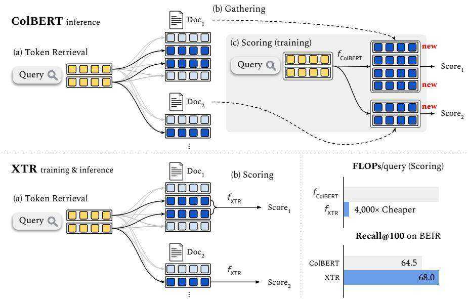
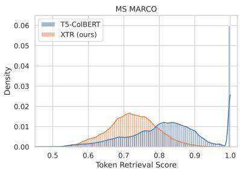
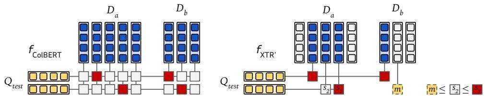
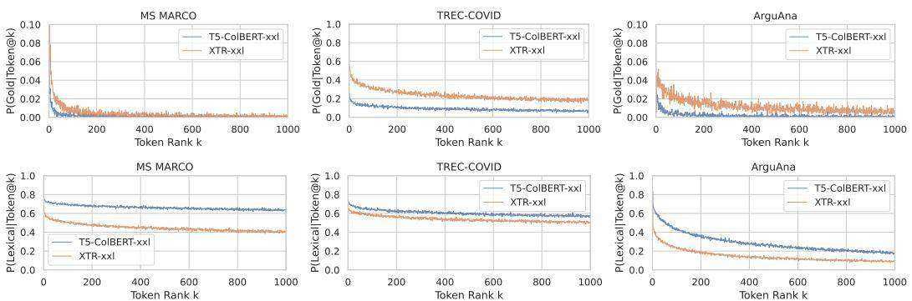
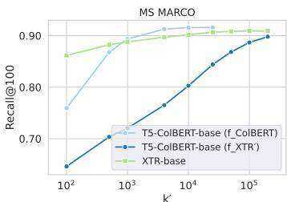
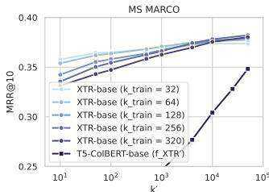
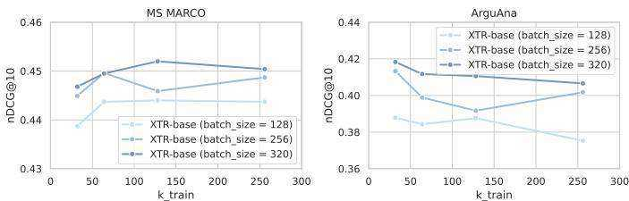

# Rethinking the Role of Token Retrieval in Multi-Vector Retrieval

Jinhyuk Lee∗ Zhuyun Dai Sai Meher Karthik Duddu

Tao Lei Iftekhar Naim Ming-Wei Chang Vincent Y. Zhao

Google DeepMind

# Abstract

Multi-vector retrieval models such as ColBERT [Khattab and Zaharia, 2020] allow token-level interactions between queries and documents, and hence achieve state of the art on many information retrieval benchmarks. However, their nonlinear scoring function cannot be scaled to millions of documents, necessitating a three-stage process for inference: retrieving initial candidates via token retrieval, accessing all token vectors, and scoring the initial candidate documents. The non-linear scoring function is applied over all token vectors of each candidate document, making the inference process complicated and slow. In this paper, we aim to simplify the multi-vector retrieval by rethinking the role of token retrieval. We present XTR, ConteXtualized Token Retriever, which introduces a simple, yet novel, objective function that encourages the model to retrieve the most important document tokens first. The improvement to token retrieval allows XTR to rank candidates only using the retrieved tokens rather than all tokens in the document, and enables a newly designed scoring stage that is two-to-three orders of magnitude cheaper than that of ColBERT. On the popular BEIR benchmark, XTR advances the state-of-the-art by $2 . 8 ~ \mathrm { n D C G } @ 1 0$ without any distillation. Detailed analysis confirms our decision to revisit the token retrieval stage, as XTR demonstrates much better recall of the token retrieval stage compared to ColBERT.

# 1 Introduction

The performance of a dense retrieval model is largely affected by how it defines expressive representations over queries and documents, and whether it can efficiently retrieve and score a document using these vector representations. For example, dual encoder models [Yih et al., 2011, Lee et al., 2019, Karpukhin et al., 2020, Ni et al., 2021] encode queries and documents into single vectors and compute query-document similarities using dot products. While these models are very efficient for retrieval, their expressivity is limited due to the absence of token-level modeling for scoring. In contrast, multi-vector models such as ColBERT [Khattab and Zaharia, 2020, Santhanam et al., 2022b] are directly designed to capture token-level interactions. By utilizing a (non-linear) scoring function over all query and document token representations, multi-vector models enjoy much better model expressivity and often achieve superior results across various benchmarks [Thakur et al., 2021].

The enhanced model expressivity, however, comes at a great cost of inference complexity. Unlike the case in dual encoders, the non-linear scoring function in multi-vector retrieval models prohibits the use of efficient Maximum Inner Product Search (MIPS) [Ram and Gray, 2012, Shrivastava and Li, 2014, 2015, Shen et al., 2015] for finding the maximum scoring documents. As a result, models such as ColBERT adopt an intricate and resource-intensive inference pipeline, which typically consists of three stages: 1) token retrieval: using each query token to retrieve document tokens, with their source documents becoming candidates; 2) gathering: collecting all the token embeddings from each candidate document, including those that are not retrieved in the first stage (most document tokens are not retrieved); and 3) scoring: ranking candidates using a non-linear function based on all the token embeddings per document.

This procedure leads to two major issues. First, compared to the token retrieval stage, gathering all document token embeddings and re-scoring the documents can introduce orders of magnitude additional data loading and floating operation cost, making multi-vector models extremely expensive to deploy. Secondly, while the candidate documents are decided in the token retrieval stage, previous training objectives are designed for the scoring stage. This creates a significant training-inference gap causing multi-vector models achieve sub-optimal (and often poor) recall performance. Clearly, the three-stage pipeline has largely limited the potential of multi-vector models, raising an interesting research question – can the token retrieval stage alone be sufficient for great performance?

We present XTR, ContXextualized Token Retriever: a simplified and efficient method for multivector retrieval, through re-thinking the role of token retrieval. The key insight of XTR is that the token retrieval in multi-vector models should be trained to retrieve the most salient and informative document tokens, so that the score between a query and document can be computed using only the retrieved information, just like how single-vector retrieval models work. By doing so, the gathering step can be completely eliminated, and the cost of scoring is significantly reduced as only a fraction of the tokens need to be considered and the dot products from the token retrieval can be reused. To improve the quality of the token retrieval, XTR proposes a novel, yet simple, training objective, which dramatically improves retrieval accuracy, doubling the chances of a gold token being retrieved in the top- $k$ results. Furthermore, despite the improved token retrieval, some relevant tokens may still be missed (i.e., not retrieved). To address this issue, we propose a simple method, called missing similarity imputation, which accounts for the contribution of the missing tokens to the overall score.

XTR streamlines the inference process, bringing it closer to the straightforward procedure of dual encoders, while maintaining and enhancing the expressive scoring function of multi-vector retrieval models. On the BEIR [Thakur et al., 2021] and LoTTE [Santhanam et al., 2022b] benchmarks, XTR attains state-of-the-art performance, requiring neither distillation nor hard negatiave mining. Notably, our model surpasses state-of-the-art dual-encoder GTR [Ni et al., 2021] by $3 . 6 \mathrm { n D C G } @ 1 0$ on BEIR without any additional training data. On the EntityQuestions benchmark [Sciavolino et al., 2021], XTR outperforms the previous state-of-the-art by 4.1 points on top-20 retrieval accuracy. XTR also does not require any secondary pre-training for retrieval and greatly outperforms mContriever [Izacard et al., 2022] on MIRACL, which contains multilingual retrieval tasks in 18 languages [Zhang et al., 2022b]. Our analysis supports that XTR indeed benefits from retrieving more contextualized tokens in relevant contexts, while making the scoring stage two-to-three orders of magnitude cheaper.

# 2 Background

# 2.1 Multi-vector Retrieval

Single-vector retrieval models, also known as dual encoders, encode an input text sequence as a single dense embedding and define the similarity of a query and a document based on the dot product [Lee et al., 2019, Karpukhin et al., 2020]. Multi-vector retrieval models, on the other hand, make use of multiple dense embeddings for each query and document, typically leveraging all contextualized word representations of the input to gain improved model expressivity.

Consider a query $Q \ = \ \{ \mathbf { q } _ { i } \} _ { i = 1 } ^ { n }$ and a document $D = \{ { \bf d } _ { j } \} _ { j = 1 } ^ { m }$ where $\mathbf { q } _ { i }$ and ${ \bf d } _ { j }$ denote the $d .$ dimensional query token vector and the document token vecmodels compute the query-document similarity as follows: $\begin{array} { r } { f ( Q , \dot { D } ) = \sum _ { i = 1 } ^ { n } \sum _ { j = 1 } ^ { m } { \bf A } _ { i j } { \bf P } _ { i j } } \end{array}$ etrievalwhere $\mathbf { P } _ { i j } = \mathbf { q } _ { i } ^ { \top } \mathbf { d } _ { j }$ and $\mathbf { A } \in \{ 0 , 1 \} ^ { n \times m }$ denotes the alignment matrix with $\mathbf { A } _ { i j }$ being the token-level alignment between the query token vector $\mathbf { q } _ { i }$ and the document token vector ${ \bf d } _ { j }$ . The sum-of-max operator of ColBERT [Khattab and Zaharia, 2020] sets $\mathbf { A } _ { i j } = \mathbb { 1 } _ { [ j = \mathrm { a r g m a x } _ { j ^ { \prime } } ( \mathbf { P } _ { i j ^ { \prime } } ) ] }$ where the argmax operator is over $1 \leq j ^ { \prime } \leq m$ (i.e., tokens from a single document $D$ ) and $\mathbb { 1 } _ { [ * ] }$ is an indicator function. Then, $f _ { \mathrm { C o l B E R T } } ( Q , D )$ is defined as follows:

$$
f _ { \mathrm { C o l B E R T } } ( Q , D ) = \frac { 1 } { n } \sum _ { i = 1 } ^ { n } \sum _ { j = 1 } ^ { m } \mathbf { A } _ { i j } \mathbf { P } _ { i j } = \frac { 1 } { n } \sum _ { i = 1 } ^ { n } \operatorname* { m a x } _ { 1 \leq j \leq m } \mathbf { q } _ { i } ^ { \intercal } \mathbf { d } _ { j } .
$$

  
Figure 1: Overview of XTR. ColBERT has the three-stage inference combining (a) the token retrieval, (b) the gathering and (c) the scoring stages (§2.2). XTR leverages the token retrieval for both training and inference. XTR efficiently obtains the score of each candidate document by applying $f _ { \mathrm { X T R } }$ (or $f _ { \mathrm { X T R ^ { \prime } } } )$ on the retrieved tokens, completely removing the gathering stage (§3.2).

Here, we include the normalizer $n$ , which was not included in the original sum-of-max, as it stabilizes training while not affecting the ranking during inference. After computing the query-document similarity, multi-vector retrieval models are typically trained with a cross-entropy loss over in-batch negatives [Santhanam et al., 2022b, Qian et al., 2022]. Specifically, given a positive document $D ^ { + }$ for $Q$ and a set of mini-batch documents $D _ { 1 : B } = [ D _ { 1 } , \ldots , D _ { B } ]$ where $D ^ { + } \in D _ { 1 : B }$ , they minimize the cross-entropy loss defined as: $\begin{array} { r } { \mathcal { L } _ { \mathrm { C E } } = - \log \frac { \exp f ( Q , D ^ { + } ) } { \sum _ { b = 1 } ^ { B } \exp f ( Q , D _ { b } ) } } \end{array}$ .

# 2.2 Three-stage inference of Multi-vector Retrieval

Unlike dual encoder models, finding the maximum scoring document—the document that maximizes eq. (1)—cannot be directly handled by MIPS as the scoring function uses a non-linear, sum-of-max operation. Instead, a multi-vector retrieval model typically takes the following steps for the inference. 1) Token Retrieval: for each of the $n$ query token vectors, it first retrieves $k ^ { \prime }$ document token vectors, which is simply used to form initial candidate document set by taking the union of source documents of retrieved tokens. The total number of candidate documents is up to $n k ^ { \prime }$ if each token is coming from a unique document.2 2) Gathering: since the scoring function eq. (1) requires the computation over all document tokens, multi-vector models need to load all of the token vectors of the candidate documents. To optimize the loading process, a RAM-based index is often employed. 3) Scoring: to provide final ranks of candidate documents, multi-vector models score all the candidate documents with eq. (1). This stage is also called refinement. Note that the training of typical multi-vector models only takes care of the scoring stage with mini-batch documents. Finally, top- $k$ documents are returned based on the computed scores. The three-stage inference is illustrated in the top of Figure 1.

# 3 XTR: Contextualized Token Retriever

Unlike existing multi-vector models that follow the retrieve-gather-score stages, XTR directly scores documents utilizing the tokens retrieved from the token retrieval stage. In this section, we start by showing why the existing cross entropy loss with the sum-of-max scoring function would fail on the first-stage token retrieval. Then, we introduce simple but important modifications for XTR.

Given a positive document $D ^ { + }$ and a set of negative documents $\boldsymbol { D } _ { 1 : r } ^ { - } = [ D _ { 1 } ^ { - } , \ldots , D _ { r } ^ { - } ]$ for a query $Q$ , the first-stage token retrieval needs to retrieve the tokens of $D ^ { + }$ , but not the tokens of negative documents. However, the following example shows that the sum-of-max operator used by ColBERT is not specifically designed to retrieve tokens of relevant documents.

Failure case Assume that $f _ { \mathrm { C o l B E R T } } ( Q , D ^ { + } ) = 0 . 8$ where all the individual max token similarity (i.e., $\mathbf { q } _ { i } ^ { \top } \mathbf { d } _ { j } ^ { + }$ where $\mathbf { A } _ { i j } ~ = ~ 1 )$ is 0.8. On the other hand, assume $f _ { \mathrm { C o l B E R T } } ( Q , D ^ { - } ) = 0 . 2$ for all $\smash { D ^ { - } \in D _ { 1 : r } ^ { - } }$ where each $D ^ { - }$ has a highly peaked token similarity greater than 0.8 but others close to zero (i.e., there exists $\mathbf { \bar { q } } _ { i } ^ { \top } \mathbf { d } _ { j } ^ { - } > 0 . 8$ where ${ \bf A } _ { i j } = 1$ while other $\mathbf { q } _ { i } ^ { \top } \mathbf { d } _ { j } ^ { - }  0 )$ . Since the sum-of-max operator only cares about the document-level scores, the cross entropy loss would be close to zero during training.3 However, for each of $n$ query tokens, if there exists at least one negative document token that has a high token similarity greater than 0.8, the token retrieval with top- $\boldsymbol { \mathcal { k } } ^ { \prime } = 1$ would fail to retrieve any tokens of $D ^ { + }$ . As a result, multivector retrieval model with the sum-of-max operator will not be able to lower the high scores of some negative tokens. Figure 2 shows that the sum-of-max training causes many document tokens to have unreasonably high scores regardless of their actual relevance to the query tokens.

  
Figure 2: Density histogram of 4,000 token retrieval scores (cosine similarity). Training with $f _ { \mathrm { C o l B E R T } }$ (T5-ColBERT; $\ S 4 )$ causes many document tokens to have extremely high scores regardless of their actual relevance with respect to the input query tokens. XTR mitigates this problem with a better training objective.

# 3.1 In-Batch Token Retrieval

To train multi-vector retrieval models to directly retrieve tokens of relevant documents, we simulate the token retrieval stage during training. This can be simply achieved by employing a different alignment strategy $\hat { \bf A }$ . Specifically, we set the alignment $\hat { \mathbf { A } } _ { i j } = \mathbb { 1 } _ { [ j \in \mathrm { t o p } ^ { } { k _ { j ^ { \prime } } ( \mathbf { P } _ { i j ^ { \prime } } ) } ] }$ where the top- $k$ operator is applied over $1 \le j ^ { \prime } \le m B$ (i.e., tokens from $B$ mini-batch documents) returning the indices of $k$ largest values. During training, we use a hyperparameter $k _ { \mathrm { t r a i n } }$ for the top- $k$ operator. Then, we simply modify eq. (1) as follows:

$$
f _ { \mathrm { X T R } } ( Q , D ) = \frac { 1 } { Z } \sum _ { i = 1 } ^ { n } \operatorname* { m a x } _ { 1 \leq j \leq m } \hat { \mathbf { A } } _ { i j } \mathbf { q } _ { i } ^ { \top } \mathbf { d } _ { j } .
$$

The intuition is that we consider the token similarities within $D$ only when they are high enough to be retrieved within top- $k _ { \mathrm { t r a i n } }$ from a mini-batch. Here, we use a normalizer $Z = | \{ i | \exists \bar { j } , s . t . \hat { \mathbf { A } } _ { i j } ^ { - } > 0 \} |$ , which is essentially the number of query tokens that retrieved at least one document token of $D$ . 4 If all $\hat { \bf A } _ { i j } = 0$ , we clip $Z$ to a small number and $f _ { \mathrm { X T R } } ( Q , D )$ becomes 0. As a result, our model cannot assign a high token similarity to negative documents as it blocks tokens of positive documents to be retrieved. With the previous failure case where $f _ { \mathrm { C o l B E R T } }$ assigned a high score on $D ^ { + }$ even though it cannot be retrieved, our similarity function incurs a high loss as $f _ { \mathrm { X T R } } ( Q , D ^ { + } ) = 0$ during training (since tokens of $D ^ { + }$ were not retrieved). For training, we use the same cross entropy loss defined in $\ S 2 . 1$ with our new scoring function. Note that the training data only contains document-level annotations, but XTR encourages important tokens from positive documents to be retrieved.

# 3.2 Scoring Documents using Retrieved Tokens

During inference, multi-vector retrieval models first have a set of candidate documents $\hat { D } _ { 1 : C }$ from the token retrieval stage:

$$
\hat { D } _ { 1 : C } = \{ \hat { D } | d _ { j } \in \hat { D } \land d _ { j } \in \mathrm { t o p }  – k ^ { \prime } ( \mathbf { q } _ { * } ) \} .
$$

  
Figure 3: Comparison of $f _ { \mathrm { C o l B E R T } }$ in eq. (1) and $f _ { \mathrm { X T R ^ { \prime } } }$ in eq. (4). Assume that $D _ { a }$ and $D _ { b }$ were selected as initial candidate documents from the token retrieval stage. fColBERT loads all token vectors of $D _ { a }$ and $D _ { b }$ and exhaustively recomputes pairwise token similarity to obtain the max values (red boxes). On the other hand, $f _ { \mathrm { X T R ^ { \prime } } }$ does not load any token vectors and reuses retrieval scores from the first-stage token retrieval. Assume that, with the top-2 token retrieval results, the first query token retrieved each max score of $D _ { a }$ and $D _ { b }$ , but the second query token retrieved two tokens only from $D _ { a }$ but not $D _ { b }$ . We impute the missing similarity $m$ for $D _ { b }$ (denoted as yellow dashed box) by finding its upper bound using the top-2 score (denoted as $s _ { 2 }$ ) of the second query token (i.e., $m \leq s _ { 2 } \leq s _ { 1 }$ ).

Table 1: FLOPs comparison of ColBERT and XTR for the scoring stage. XTR only adds minimal complexity for scoring each candidate document. The setting is derived from MS MARCO.   

<table><tr><td></td><td>Scoring</td><td>Estimated FLOPs/query</td><td>Setting</td></tr><tr><td>fColBERT</td><td>n2k&#x27;(2nd + ¯n + 1)</td><td>0.36 × 109</td><td>M = 3 × 109, n = 16, d = 128,</td></tr><tr><td>fxTR&#x27;</td><td>n2k(r + 1)</td><td>0.09 × 106</td><td>k&#x27; = 100, ¯n = 55, r = 2.5</td></tr></table>

Here, top- $k ^ { \prime } ( { \bf q } _ { \ast } )$ is a union of top- $k ^ { \prime }$ document tokens (from the entire corpus) based on the inner product scores with each query vector (i.e., $\mathbf { q } ^ { \top } \mathbf { d } )$ . Given the $n$ query token vectors, there are $C$ $( \leq n k ^ { \prime } )$ candidate documents. Previous methods load the entire token vectors of each document and compute eq. (1) for every query and candidate document pair, which takes $\mathcal { O } ( n ^ { 2 } k ^ { ' } \bar { m } d )$ computation per query $\bar { m } =$ average document length). Instead, we propose to score the documents solely using the retrieved token similarity. This significantly reduces the computational cost for the scoring stage since re-using the token retrieval scores removes computing redundant inner products and unnecessary (non-max) inner products. Furthermore, the expensive gathering stage (which requires loading all the document token vectors for computing eq. (1)) can be removed completely. Unlike previous work [Macdonald and Tonellotto, 2021] that leverages token retrieval to sort first-stage candidate documents before the scoring stage, we aim to directly provide the final scores of documents.

Missing similarity imputation During inference, we retrieve $k ^ { \prime }$ document tokens for each of $n$ query tokens. Assume that each document token belongs to a unique document, providing $C = n k ^ { \prime }$ candidate documents in total. This leaves us with a single token similarity to score each document in the absence of the gathering stage. However, during training—either with eq. (1) or eq. (2)—each positive document has up to $n$ (max) token similarities to average, which mostly converges to $n$ as training proceeds. Hence, during inference, we impute the missing similarity for each query token treating each of candidate documents as if it were positive with $n$ token similarities.

For every candidate document $\hat { D }$ , we first define the following scoring function for the inference:

$$
f _ { \mathrm { X T R ^ { \prime } } } ( Q , \hat { D } ) = \frac { 1 } { n } \sum _ { i = 1 } ^ { n } \operatorname* { m a x } _ { 1 \leq j \leq m } \big [ \hat { \mathbf { A } } _ { i j } \mathbf { q } _ { i } ^ { \top } \mathbf { d } _ { j } + ( 1 - \hat { \mathbf { A } } _ { i j } ) m _ { i } \big ] .
$$

This is similar to eq. (2), but introduces $m _ { i } \in \mathbb { R }$ , which estimates the missing similarity for each $q _ { i }$ . $\hat { \bf A }$ is defined similar to the one described in eq. (2) except that it uses $k ^ { \prime }$ for the top- $k$ operator. Each $q _ { i }$ would take the missing similarity $m _ { i }$ as the maximum value if $\hat { \mathbf { A } } _ { i * } = 0$ and $m _ { i } \geq 0$ . Importantly, $f _ { \mathrm { X T R ^ { \prime } } }$ removes the need of recomputing any $\mathbf { q } _ { i } ^ { \top } \mathbf { d } _ { j }$ since when $\hat { \bf A } _ { i j } = 1$ we already know the retrieval score from the token retrieval stage, and when $\hat { \mathbf { A } } _ { i j } = 0$ we simply don’t need to compute it as $\hat { \mathbf { A } } _ { i j } \mathbf { q } _ { i } ^ { \top } \mathbf { d } _ { j } = 0$ . Note that when every $\hat { \bf A } _ { i j } = 1$ , the equation becomes the sum-of-max operator. On the other hand, when no document tokens of $\hat { D }$ were retrieved for $q _ { i }$ (i.e., $\hat { \mathbf { A } } _ { i * } = 0 $ ), we fall back to the imputed score $m _ { i }$ , which provides an approximated sum-of-max result.

Table 2: (top) nDCG $@ 1 0$ on MS MARCO (in-domain) and BEIR (zero-shot). The last column shows the average over 13 BEIR datasets. (bottom) Top-5 retrieval accuracy on LoTTE datasets (zero-shot).   

<table><tr><td></td><td>MS</td><td>AR</td><td>TO</td><td>FE</td><td>CF</td><td>SF</td><td>CV</td><td>NF</td><td>NQ</td><td>HQ</td><td>FQ</td><td>SD</td><td>DB QU</td><td>Avg.</td></tr><tr><td colspan="10">One Retriever per Domain</td><td colspan="7"></td></tr><tr><td>GenQ</td><td>40.8</td><td>49.3</td><td>18.2</td><td>66.9</td><td>17.5</td><td>64.4</td><td>61.9</td><td>31.9</td><td>35.8</td><td>53.4</td><td>30.8</td><td>14.3</td><td>32.8</td><td>83.0</td><td>43.1</td></tr><tr><td>PTRrettriever</td><td>-</td><td>58.8</td><td>25.6</td><td>76.2</td><td>23.5</td><td>63.8</td><td>70.2</td><td>33.7</td><td>45.6</td><td>61.7</td><td>43.0</td><td>18.3</td><td>34.4</td><td>87.5</td><td>49.4</td></tr><tr><td colspan="10">One Retriever for All</td><td colspan="7"></td></tr><tr><td>BM25</td><td>22.8</td><td>31.5</td><td>36.7</td><td>75.3</td><td>21.3</td><td>66.5</td><td>65.6</td><td>32.5</td><td>32.9</td><td>60.3</td><td>23.6</td><td>15.8</td><td>31.3</td><td>78.9</td><td>44.0</td></tr><tr><td>ColBERT</td><td>40.1</td><td>23.3</td><td>20.2</td><td>77.1</td><td>18.4</td><td>67.1</td><td>67.7</td><td>30.5</td><td>52.4</td><td>59.3</td><td>31.7</td><td>14.5</td><td>39.2</td><td>85.4</td><td>45.1</td></tr><tr><td>GTRba</td><td>42.0</td><td>51.1</td><td>21.5</td><td>66.0</td><td>24.1</td><td>60.0</td><td>53.9</td><td>30.8</td><td>49.5</td><td>53.5</td><td>34.9</td><td>14.9</td><td>39.2</td><td>88.1</td><td>45.2</td></tr><tr><td>T5-ColBERTbase</td><td>45.6</td><td>28.8</td><td>31.1</td><td>72.4</td><td>18.1</td><td>70.4</td><td>68.3</td><td>34.0</td><td>52.2</td><td>61.7</td><td>33.4</td><td>14.1</td><td>41.6</td><td>82.3</td><td>46.8</td></tr><tr><td>XTRbase</td><td>45.0</td><td>40.7</td><td>31.3</td><td>73.7</td><td>20.7</td><td>71.0</td><td>73.6</td><td>34.0</td><td>53.0</td><td>64.7</td><td>34.7</td><td>14.5</td><td>40.9</td><td>86.1</td><td>49.1</td></tr><tr><td>Splade2*</td><td>43.3</td><td>47.9</td><td>27.2</td><td>78.6</td><td>23.5</td><td>69.3</td><td>71.0</td><td>33.4</td><td>52.1</td><td>68.4</td><td>33.6</td><td>15.8</td><td>43.5</td><td>83.8</td><td>49.9</td></tr><tr><td></td><td>-</td><td>46.3</td><td>26.3</td><td>78.5</td><td>17.6</td><td>69.3</td><td>73.8</td><td>33.8</td><td>56.2</td><td>66.7</td><td>35.6</td><td>15.4</td><td>44.6</td><td>85.2</td><td>49.9</td></tr><tr><td>GTRxx|</td><td>44.2</td><td>54.0</td><td>23.3</td><td>74.0</td><td>26.7</td><td>66.2</td><td>50.1</td><td>34.2</td><td>56.8</td><td>59.9</td><td>46.7</td><td>16.1</td><td>40.8</td><td>89.2</td><td>49.1</td></tr><tr><td>T5-ColBx</td><td>47.3</td><td>33.8</td><td>31.0</td><td>74.2</td><td>19.7</td><td>73.1</td><td>75.8</td><td>35.2</td><td>60.5</td><td>65.2</td><td>43.5</td><td>17.1</td><td>45.0</td><td>86.0</td><td>50.8</td></tr><tr><td>XTRxx</td><td>46.6</td><td>44.2</td><td>30.9</td><td>77.0</td><td>24.5</td><td>74.3</td><td>78.9</td><td>35.3</td><td>60.9 66.2</td><td>43.8</td><td>17.1</td><td></td><td>44.3</td><td>88.1</td><td>52.7</td></tr><tr><td colspan="10">LoTTE Search</td><td colspan="7"></td></tr><tr><td colspan="7"></td><td colspan="8">LoTTE Forum</td></tr><tr><td></td><td>Writing</td><td>Rec.</td><td>Sci.</td><td>Tech.</td><td></td><td>Life.</td><td>Pooled</td><td>Writing</td><td></td><td>Rec.</td><td>Sci.</td><td>Tech.</td><td>Life.</td><td colspan="2">Pooled</td></tr><tr><td>BM25</td><td>60.3</td><td>56.5</td><td>32.7</td><td>41.8</td><td></td><td>63.8</td><td>48.3</td><td>64.0</td><td></td><td>55.4</td><td>37.1</td><td>39.4</td><td>60.6</td><td colspan="2">47.2</td></tr><tr><td>ColBeRT</td><td>74.7</td><td>68.5</td><td>53.6</td><td></td><td>61.9</td><td>80.2</td><td>67.3</td><td>71.0</td><td></td><td>65.6</td><td>41.8</td><td>48.5</td><td>73.0</td><td colspan="2">58.2</td></tr><tr><td>G Rbase XTRbase</td><td>74.1</td><td>65.7</td><td>49.8 54.9</td><td></td><td>58.1</td><td>82.0</td><td>65.0</td><td>69.2</td><td></td><td>62.0</td><td>33.7</td><td>47.6</td><td>72.2</td><td colspan="2">54.9</td></tr><tr><td></td><td>77.0</td><td>69.4</td><td></td><td></td><td>63.2</td><td>82.1</td><td>69.0</td><td>73.9</td><td></td><td>68.7</td><td>42.2</td><td>51.9</td><td>74.4</td><td colspan="2">60.1</td></tr><tr><td>Splade,* *</td><td>77.1</td><td>69.0</td><td></td><td>55.4</td><td>62.4</td><td>82.3</td><td>68.9</td><td></td><td>73.0</td><td>67.1</td><td>43.7</td><td>50.8</td><td>74.0</td><td colspan="2">60.1</td></tr><tr><td> COolBErT</td><td>80.1</td><td>72.3</td><td></td><td>56.7</td><td>66.1</td><td>84.7</td><td>71.6</td><td></td><td>76.3</td><td>70.8</td><td>46.1</td><td>53.6</td><td>76.9</td><td colspan="2">63.4</td></tr><tr><td>GTRxxl XTRxx</td><td>83.9</td><td>78.0</td><td></td><td>60.0</td><td>69.5</td><td>87.4</td><td>76.0</td><td></td><td>79.5</td><td>73.5</td><td>43.1</td><td>62.6</td><td>81.9</td><td colspan="2">66.9</td></tr><tr><td></td><td>83.3</td><td>79.3</td><td></td><td>60.8</td><td>73.7</td><td>89.1</td><td>77.3</td><td></td><td>83.4</td><td>78.4</td><td>51.8</td><td>64.5</td><td>83.9</td><td colspan="2">71.2</td></tr></table>

♣: cross-encoder distillation ♦: model-based hard negatives

In fact, we can find the upper bound of the missing similarity. For every token retrieval with $\mathbf { q } _ { i }$ , the missing similarity of the query token for $\hat { D }$ will be upper bounded by its last top- $k ^ { \prime }$ score. Specifically, for each query token $q _ { i }$ , we have the following top- $k ^ { \prime }$ token similarity during inference: $[ \mathbf { \bar { q } } _ { i } ^ { \top } \mathbf { d } _ { ( 1 ) } , \dots \mathbf { q } _ { i } ^ { \top } \mathbf { d } _ { ( k ^ { \prime } ) } ]$ . Here, each $\mathbf { d } _ { ( * ) }$ could come from a different document. Since the missing similarity would have a score less than equal to the score of the last retrieved token, we know that $m _ { i } \le { \bf q } _ { i } ^ { \top } { \bf d } _ { ( k ^ { \prime } ) }$ . With a larger $k ^ { ' }$ , the upper bound becomes tighter. In our experiments, we show that simply choosing $m _ { i } = \mathbf { q } _ { i } ^ { \top } \mathbf { d } _ { ( k ^ { \prime } ) }$ works well especially when a model is trained with $f _ { \mathrm { X T R } }$ .5 While we also tried more complicated imputation methods based on regression, our method was competitive enough despite its simplicity. The imputation process is illustrated in Figure 3.

Table 1 shows the estimated FLOPs of ColBERT and XTR (see Appendix B for more details). Due to the differences in hardware and infrastructure, we mainly compared the theoretical FLOPs. XTR reduces the FLOPs at the scoring stage by $4 0 0 0 \times$ making multi-vector retrieval more efficient.

# 4 Experiments

Experimental Setting Following Ni et al. [2021], we fine-tune XTR on MS MARCO with a fixed set of hard negatives from RocketQA [Qu et al., 2021]. Then, we test XTR on MS MARCO (MS; in-domain) and zero-shot IR datasets. For the zero-shot evaluation, we use 13 datasets from BEIR [Thakur et al., 2021] (see Appendix C for acronyms), 12 datasets from LoTTE [Santhanam et al., 2022b], and 4 datasets on open-domain QA passage retrieval (EQ: EntityQuestions [Sciavolino et al., 2021], NQ, TQA: TriviaQA, SQD: SQuAD). We also train multilingual XTR (mXTR) and evaluate it on MIRACL [Zhang et al., 2022b], which contains retrieval tasks in 18 languages. The performance gap between T5-ColBERT [Qian et al., 2022] and XTR shows the improvement with our methods on a multi-vector retrieval model. For implementation details and baselines, see Appendix C. For the relationship between hyperparameters (e.g., $k _ { \mathrm { t r a i n } }$ and $k ^ { \prime }$ ), see $\ S 5 . 3$ .

Table 3: Zero-shot passage retrieval accuracy on open-domain question answering datasets. In-domain performances are underlined and all the other performances are based on the zero-shot evaluation. For EntityQuestions, we report macro-averaged performances over different relations.   

<table><tr><td rowspan="2"></td><td colspan="2">EQ</td><td colspan="2">NQ</td><td colspan="2">TQA</td><td colspan="2">SQD</td></tr><tr><td>Top-20</td><td>Top-100</td><td>Top-20</td><td>Top-100</td><td>Top-20</td><td>Top-100</td><td>Top-20</td><td>Top-100</td></tr><tr><td>BM25</td><td>71.4</td><td>80.0</td><td>62.9</td><td>78.3</td><td>76.4</td><td>83.2</td><td>71.1</td><td>81.8</td></tr><tr><td>DPRmuli + BM25</td><td>73.3</td><td>82.6</td><td>82.6</td><td>88.6</td><td>82.6</td><td>86.5</td><td>75.1</td><td>84.4</td></tr><tr><td>ARTMS MaRCO </td><td>75.3</td><td>81.9</td><td>-</td><td>-</td><td>78.0</td><td>84.1</td><td>68.4</td><td>80.4</td></tr><tr><td>GTRbase</td><td>73.3</td><td>80.6</td><td>78.5</td><td>86.5</td><td>76.2</td><td>83.4</td><td>65.9</td><td>77.6</td></tr><tr><td>GTRxx|</td><td>75.3</td><td>82.5</td><td>83.5</td><td>89.8</td><td>81.7</td><td>86.6</td><td>70.4</td><td>80.6</td></tr><tr><td>DPRmulti</td><td>56.7</td><td>70.0</td><td>79.5</td><td>86.1</td><td>78.9</td><td>84.8</td><td>52.0</td><td>67.7</td></tr><tr><td>ColBERT</td><td>-</td><td>-</td><td>79.1</td><td>-</td><td>80.3</td><td>-</td><td>76.5</td><td>-</td></tr><tr><td>XTRbase</td><td>79.0</td><td>85.2</td><td>79.3</td><td>88.1</td><td>80.3</td><td>85.5</td><td>78.2</td><td>85.9</td></tr><tr><td>XTRxxd</td><td>79.4</td><td>85.9</td><td>84.9</td><td>90.5</td><td>83.3</td><td>87.1</td><td>81.1</td><td>87.6</td></tr></table>

♣: sparse component ♦: retrieval pre-training

<table><tr><td></td><td>ar</td><td>bn</td><td>en</td><td>es</td><td>fa</td><td>fi</td><td>fr</td><td>hi</td><td>id</td><td>ja</td><td>ko</td><td>ru sW</td><td></td><td>te</td><td>th zh</td><td></td><td>de</td><td>yo$ Avg.</td></tr><tr><td>BM25</td><td>48.1</td><td>50.8</td><td>35.1</td><td>31.9</td><td>33.3</td><td>55.1</td><td>18.3</td><td>45.8</td><td>44.9 36.9</td><td>41.9</td><td>33.4</td><td>38.3</td><td>49.4</td><td>48.4</td><td>18.0</td><td>-</td><td>-</td><td>-</td></tr><tr><td>mDPR</td><td>49.9</td><td>44.3</td><td>39.4</td><td>47.8</td><td>48.0</td><td>47.2</td><td>43.5</td><td>38.3</td><td>27.2 43.9</td><td>41.9</td><td>40.7</td><td>29.9</td><td>35.6</td><td>35.8</td><td>51.2</td><td>-</td><td>-</td><td>-</td></tr><tr><td>BM25 + mDPR</td><td>67.3</td><td>65.4</td><td>54.9</td><td>64.1</td><td>59.4</td><td>67.2 52.3</td><td>61.6</td><td>44.3</td><td>57.6</td><td>60.9</td><td>53.2</td><td>44.6</td><td>60.2</td><td>59.9</td><td>52.6</td><td>-</td><td>-</td><td>-</td></tr><tr><td></td><td></td><td></td><td></td><td></td><td>Trained on English MS MARCO</td><td></td><td></td><td></td><td></td><td></td><td></td><td></td><td></td><td></td><td></td><td></td><td></td><td></td></tr><tr><td>mContriever (en)</td><td>55.3</td><td>54.2</td><td>37.9</td><td>34.1</td><td>42.6</td><td>51.2 31.5</td><td>40.6</td><td>36.8</td><td>38.3</td><td>46.2</td><td>39.9</td><td>44.4</td><td>48.7</td><td>52.4</td><td>27.4</td><td>32.9</td><td>32.9</td><td>41.5</td></tr><tr><td>mXTRbase (en)</td><td>66.1</td><td>64.7</td><td>49.4</td><td>40.5</td><td>47.9</td><td>62.2 37.5</td><td>51.4</td><td>46.9</td><td>56.8</td><td>64.0</td><td>49.8</td><td>43.0</td><td>67.7</td><td>69.2</td><td>47.2</td><td>34.5</td><td>40.6</td><td>52.2</td></tr><tr><td>mXTRx (en)</td><td>74.1</td><td>75.5</td><td>56.0</td><td>52.4</td><td>56.1</td><td>75.1 51.4</td><td>61.8</td><td>52.0</td><td>68.7</td><td>67.4</td><td>61.3</td><td>69.7</td><td>76.0</td><td>76.9</td><td>556.9</td><td>51.7</td><td>60.3</td><td>63.5</td></tr><tr><td></td><td></td><td></td><td></td><td></td><td></td><td>Trained on English MS MARCO + MIRACL (16 languages)</td><td></td><td></td><td></td><td></td><td></td><td></td><td></td><td></td><td></td><td></td><td></td><td></td></tr><tr><td>mContriever</td><td>64.6</td><td>66.4</td><td>41.2</td><td>40.3</td><td>46.3</td><td>42.9</td><td>41.9</td><td>44.6</td><td>55.6</td><td>55.4</td><td>48.1</td><td>65.3</td><td>77.6</td><td>69.3</td><td>45.9</td><td>39.6</td><td>41.9</td><td>52.7</td></tr><tr><td>mXTRbase</td><td>73.0</td><td>73.9</td><td>46.1</td><td>42.6</td><td>51.0</td><td>61.9 70.5 39.3</td><td>51.3</td><td>54.2</td><td>62.3</td><td>67.7</td><td>54.5</td><td>69.7</td><td>80.7</td><td>76.1</td><td>51.4</td><td>36.1</td><td>46.8</td><td>58.2</td></tr><tr><td>mTRx</td><td>77.8</td><td>78.4</td><td>52.5</td><td>48.9</td><td>56.0</td><td>76.0</td><td>52.9 61.5</td><td>54.9</td><td>73.4</td><td>68.5</td><td>66.2</td><td>79.4</td><td>84.3</td><td>80.7</td><td>58.9</td><td>52.8</td><td>62.4</td><td>65.9</td></tr></table>

Table 4: $\mathrm { n D C G } @ 1 0$ on 18 multilingual retrieval tasks from MIRACL. Each row shows the performance of a single multilingual retrieval model. The last two surprise languages (de and yo) are not included in the training dataset of MIRACL. The last column shows the average over 18 languages.

# 4.1 In-domain Document Retrieval

MS MARCO The first column of Table 2 (top) shows $\mathrm { n D C G } @ 1 0$ on MS MARCO (see Table D.1 for recall $@ 1 0 0$ ). XTR outperforms most models and remains competitive with T5-ColBERT. This is encouraging since XTR significantly reduces the cost of the gathering–scoring stage. Note that MS MARCO may fail to reflect the actual improvement of state-of-the-art [Arabzadeh et al., 2022].

# 4.2 Zero-shot Document Retrieval

BEIR & LoTTE Table 2 (top; except the first columns) shows nDCG $@ 1 0$ on BEIR (see Table D.1 for recall $@ 1 0 0 ^ { \cdot }$ ). $\mathrm { X T R } _ { \mathrm { x x l } }$ achieves the new state-of-the-art performances significantly outperforming both per-domain models and single model state-of-the-art. Simply scaling XTR removes the needs of designing distillation or hard negative mining pipelines [Santhanam et al., 2022b, Formal et al., 2021]. Results on LoTTE (Table 2 bottom) also show that $\mathrm { X T R } _ { \mathrm { b a s e } }$ is better than ColBERT and competitive with distillation-based models while $\mathrm { X T R } _ { \mathrm { x x l } }$ advances the state-of-the-art.

Passage retrieval for open-domain QA Table 3 shows results on four open-domain QA datasets. While previous work often includes sparse retrievers (e.g., BM25) [Chen et al., 2021] or contrastive pre-training [Ram et al., 2022, Sachan et al., 2022a,b] to achieve better performances on EntityQuestions, XTR simply fine-tuned on MS MARCO achieves the state-of-the-art performance.

# 4.3 Multilingual Document Retrieval

MIRACL Since XTR does not need any secondary pre-training, we expect it to be better at multilingual retrieval by better utilizing the multilingual language models. We train a multilingual version of XTR with mT5 [Xue et al., 2021] and test it on multilingual retrieval tasks in 18 languages. Table 4 shows that mXTR greatly outperforms mContriever that uses expensive contrastive pretraining, as well as the hybrid model, $\mathrm { B M } 2 5 + \mathrm { m D P R }$ .

  
Figure 4: (top) Gold token retrieval performances of T5-ColBERT and XTR. We plot the probability of each retrieved document token at rank $k$ coming from the gold document. (bottom) Lexical token retrieval performances of T5-ColBERT and XTR. We plot the probability of each retrieved document token at rank $k$ being lexically identical to its query token.

Table 5: Impact of training objectives and imputation methods comparing T5-ColBERT and XTR. For both models, we apply $f _ { \mathrm { X T R ^ { \prime } } }$ during inference. We report MRR $@ 1 0$ and Recall $@ 1 0 0 0$ on the MS MARCO development set.   

<table><tr><td>Model</td><td>Imputation</td><td>MRR@10</td><td>R@1000</td></tr><tr><td rowspan="2">T5-ColBERTbase</td><td>None</td><td>0.0</td><td>0.0</td></tr><tr><td>top-k&#x27; score</td><td>27.7</td><td>91.8</td></tr><tr><td rowspan="4">XTRbase</td><td>None</td><td>22.6</td><td>88.7</td></tr><tr><td>mi = 0</td><td>36.2</td><td>97.3</td></tr><tr><td>mi = 0.2</td><td>36.4</td><td>97.3</td></tr><tr><td>top-k&#x27; score</td><td>37.4</td><td>98.0</td></tr></table>

  
Figure 5: Recall $@ 1 0 0$ of XTR and T5-ColBERT with different $k ^ { ' }$ . For T5-ColBERT, we use either $f _ { \mathrm { X T R ^ { \prime } } }$ or fColBERT.

# 5 Analysis

# 5.1 Towards Better Token Retrieval

Gold token retrieval If the tokens of gold documents are not retrieved at all, multi-vector retrieval models would fail to retrieve the gold documents. Hence, a better token retrieval would contain these gold tokens more often in their top results. In Figure 4 (top), we show the probability of a token at the rank $k$ coming from the gold documents of a query. To compute the probability for the rank $k$ , we simply count the number of an event where a token at rank $k$ belongs to the gold document and divide it by the number of tokens at rank $k$ . While this is measuring the precision of the token retrieval, we observed a similar trend for the recall of gold tokens. Compared to T5-ColBERT, XTR retrieves gold tokens with higher probability, even on MS MARCO. This shows that the training objective of XTR encourages it to retrieve tokens from more relevant context.

Lexical token retrieval In Figure 4 (bottom), we show the probability of a token at the rank $k$ being the same as its query token (e.g., ‘insulin’ retrieving ‘insulin’s). T5-ColBERT has very high probability of retrieving the same token across different ranks and datasets. However, it is unclear to what extent the token retrieval stage should behave as sparse retrieval, as it might suffer from the vocabulary mismatch problem. XTR effectively lowers the reliance on the lexical matching while preserving a good amount of lexical precision so that it would achieve a high retrieval accuracy on the entity-centric dataset (§4.2). In fact, Table 6 in Appendix shows that having lower lexical matching doesn’t necessarily mean a lower retrieval quality, but often means better contextualization.

# 5.2 Efficient Scoring

In Table 5, we show how we can employ the efficient scoring function $f _ { \mathrm { X T R ^ { \prime } } }$ in XTR with minimal performance losses. We apply $f _ { \mathrm { X T R ^ { \prime } } }$ on both T5-ColBERT and XTR, and show their performances on MS MARCO. With T5-ColBERT, even if we use the top- $k ^ { \prime }$ score for the imputation, the performance is much worse than the original sum-of-max scoring. With XTR, the performance greatly improves as it has better token retrieval. Figure 5 shows how Recall $@ 1 0 0$ improves with larger $k ^ { \prime }$ ’s as it provides more exact upper bound for the missing similarity imputation. Table D.2 shows that even if we use smaller $k ^ { \prime }$ , XTR still maintains high performances on BEIR.

  
Figure 6: $\mathbf { M R R } @ 1 0$ of XTR with different $k _ { \mathrm { t r a i n } }$ and $k ^ { ' }$ . For T5-ColBERT, we also use $f _ { \mathrm { X T R ^ { \prime } } }$ with the top- $k ^ { \prime }$ score imputation method for the inference.

  
Figure 7: Effect of training XTR with different batch sizes and $k _ { \mathrm { t r a i n } }$ . For each point of the graph, we train $\mathrm { X T R } _ { \mathrm { b a s e } }$ with the specified training batch size (128, 256, 320) and $k _ { \mathrm { t r a i n } }$ (32, 64, 128, 256) and evaluate on each dataset (MS MARCO and ArguAna). nDCG $@ 1 0$ of each model is reported.

# 5.3 Relationship between Hyperparameters

$k _ { \mathrm { t r a i n } }$ vs. $k ^ { \prime }$ In Figure 6, we show MRR $@ 1 0$ of XTR trained with different $k _ { \mathrm { t r a i n } }$ and evaluated with different $k ^ { \prime }$ on the MS MARCO development set. While all variants of XTR prefer larger $k ^ { \prime }$ , ones trained with smaller $k _ { \mathrm { t r a i n } }$ show higher performances than others under small $k ^ { \prime }$ settings. XTR with larger $k _ { \mathrm { t r a i n } }$ exhibits better performances than ones with smaller $k _ { \mathrm { t r a i n } }$ as $k ^ { \prime }$ becomes larger.

Training batch size vs. $k _ { \mathrm { t r a i n } }$ In Figure 7, we show the relationship between the training batch size and $k _ { \mathrm { t r a i n } }$ during training XTR. In this experiment, we use $k ^ { ' } = 4 0 , 0 0 0$ . While it is evident that XTR mostly favors large training batch sizes, the optimal top- $k _ { \mathrm { t r a i n } }$ can be different for different datasets. While most datasets including MS MARCO favored a large enough $k _ { \mathrm { t r a i n } }$ , ArguAna prefers smaller $k _ { \mathrm { t r a i n } }$ . We hypothesize that this is due to the longer query length in ArguAna, which makes multi-vector models fall short compared to dual-encoders (see GTR vs. T5-ColBERT in Table 2).

# 5.4 Qualitative Analysis

Table 6 shows a prediction sample from MS MARCO. For T5-ColBERT, all of the top retrieved tokens are exact lexical matches. Surprisingly, none of the retrieved passages are about the query, demonstrating T5-ColBERT’s failure to retrieve tokens from the correct context. In contrast, XTR retrieves fewer exact lexically matching tokens, but the contexts of the retrieved tokens are much more related to the query. This example explains the lower lexical token retrieval probability of XTR compared to T5-ColBERT in Figure 4 (bottom), but higher gold token retrieval performance in Figure 4 (top). For more qualitative examples, please see Appendix E.

# 6 Related Work

One of the main limitations of dense retrieval models is that encoding the query and document into a single vector constrains the representational power of the models. Polyencoder [Humeau et al., 2020], MEBERT [Luan et al., 2021], and MVR [Zhang et al., 2022a] propose to use multiple embeddings, instead of one, to represent the query or the document. A more recent approach is token-level multi-vector retrieval, which stores and retrieves with every token embedding. ColBERT [Khattab and Zaharia, 2020] is probably the most renowned model in this family. ALIGNER (i.e. T5- ColBERT) [Qian et al., 2022] extends ColBERT by scaling up the backbone langauge model and studying various strategies for aggregating the token-level alignment scores. These token-level retrieval models show strong effectiveness and out-of-domain generalization ability.

Efforts for reducing serving costs of multi-vector models have been mostly focused on the token-level retrieval stage. COIL [Gao et al., 2021] accelerates token-level retrieval by confining retrieval within exact match tokens, sharing the spirit of classic inverted indexing. CITADEL [Li et al., 2022] relaxes COIL with a lexical routing mechanism where a query token vector only retrieves from a subset of document token vectors routed to the same key. PLAID [Santhanam et al., 2022a] optimizes the speed of ColBERT by pruning weaker candidates in the earlier stages of retrieval and using better vector quantization. ColBERT-v2 [Santhanam et al., 2022b] further adopts residual representations with cluster centroids to improve the efficiency of ColBERT. On the other hand, how to accelerate the scoring stage remains under-explored. To the best of our knowledge, XTR is the first work to simplify the scoring stage and remove the gathering stage in multi-vector retrieval.

<table><tr><td colspan="3">T5-ColBERT token retrieval for &quot;what is the usual pay for stock associates at michael?&quot;</td></tr><tr><td>Rank</td><td>Token Context of Token</td><td></td><td>Relevance</td></tr><tr><td>1</td><td>usual</td><td rowspan="3">routine passport services: the usual waiting time in logan to get your passport is four (4) to eight (8) weeks for routine applications. the usual pay days are the 1st and 16th of each month. for annual</td><td>No</td></tr><tr><td>2</td><td>usual</td><td>No</td></tr><tr><td>5</td><td>educational paraprofessionals there is no payroll lag. usual the usual part xiii tax rate is 25% (unless a tax treaty between canada</td><td>No</td></tr><tr><td>50</td><td>usual</td><td>and your home country reduces the rate). this is where one can challenge the judgment debtor&#x27;s claim. one option creditors have is to try and make a deal with the debtor to take less than</td><td>No</td></tr><tr><td>100</td><td>usual</td><td>25% (the usual amount of a wage levy). the usual maximum inventory is 1 talisman, 26 elemental runes, and 26 pure essence. the ingredients must be brought to an opposing altar …. from the runes being crafted.</td><td>No</td></tr></table>

Table 6: Token retrieval example from MS MARCO. Among the top 100 retrieved tokens, $1 0 0 \%$ of T5-ColBERT tokens are lexically identical as the query token usual while only $8 \%$ of XTR tokens are lexically identical. XTR retrieves the relevant passage by retrieving average for usual.   

<table><tr><td colspan="4">XTR token retrieval for &quot;what is the usual pay for stock associates at michael?&quot;</td></tr><tr><td>Rank</td><td>Token</td><td>Context of Token</td><td>Relevance</td></tr><tr><td>1</td><td>usual</td><td>store manager. 1 salary: the usual salary a store manager receives can be anywhere around $52,000 to $115,000 annually.</td><td>No</td></tr><tr><td>2</td><td>usual</td><td>1 salary: the usual salary a store manager receives can be anywhere around $52,000 to $115,000 annually. 2 bonuses: publix provide bonuses that could reach up to $40,000.</td><td>No</td></tr><tr><td>5</td><td>average</td><td>average salaries for michaels stores stock associate: $9. michaels stores hourly pay trends based on salaries posted anonymously by michaels</td><td>Yes</td></tr><tr><td>50</td><td>V</td><td>stores employees. i think the avg starting pay is closer to 30k for asst mgr trainees. it is an</td><td>No</td></tr><tr><td>100</td><td>average</td><td>hourly position until you are fully trained (40 hours per week). average macys salaries. the average salary for macys jobs is $32,000. average macys salaries can vary greatly due to company, location, indus- try, experience and benefits.</td><td>No</td></tr></table>

# 7 Conclusion

Multi-vector retrieval leverages query and document token representations for effective information retrieval. In this paper, we propose XTR that simplifies the existing three-stage inference of multivector models by improving the initial token retrieval stage. Specifically, XTR scores documents solely based on the retrieved tokens, which is also optimized during training with in-batch document tokens. As a result, XTR achieves state-of-the-art performances on zero-shot information retrieval benchmarks while greatly reducing the FLOPs of the scoring stage. We further show that our objective function indeed encourages better token retrieval, retrieving more tokens from gold documents, whose contexts are better aligned with the query.

# Limitations

In most of our experiments, XTR was trained on MS MARCO, a large-scale retrieval dataset in English. While our experiments were conducted in a fair setting where most baseline models also utilize MS MARCO, future use cases might need to remove its dependency on MS MARCO due to the license or language-specific issue. We believe that LLM-based retrieval dataset generation [Dai et al., 2022] would be able to mitigate the problem in the future.

# Acknowledgements

We would like to thank the anonymous reviewers for their helpful feedback. We also thank Nicholas Monath, Raphael Hoffmann, Kelvin Guu, Slav Petrov, and others at Google DeepMind for their helpful comments and discussion.

