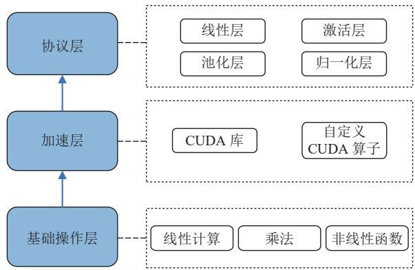
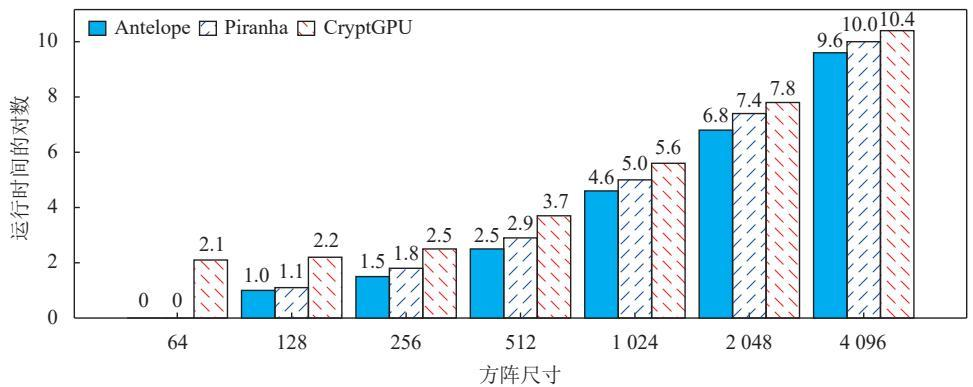
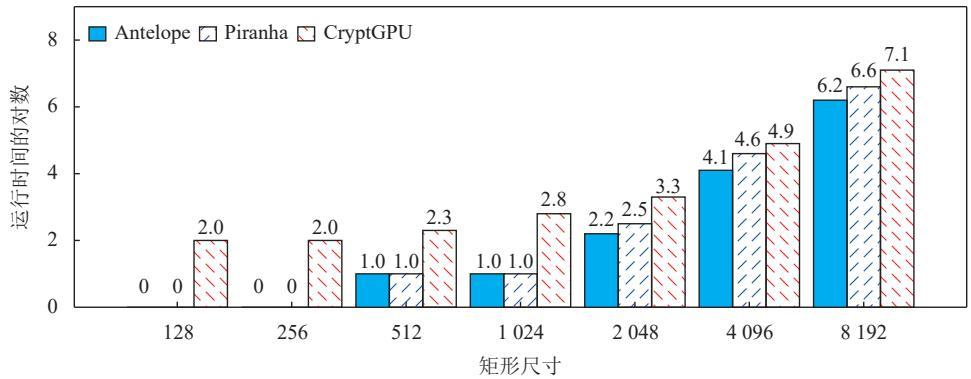
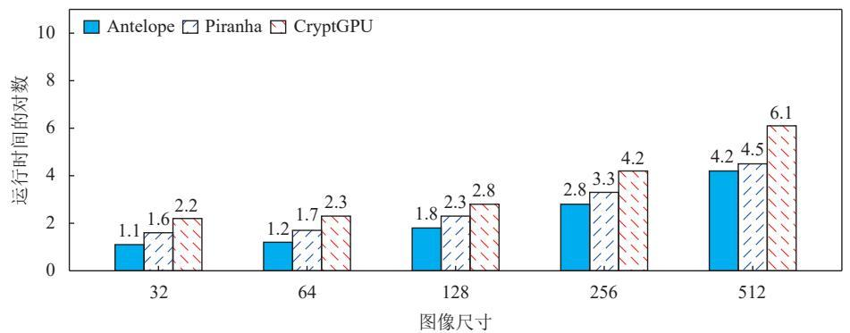
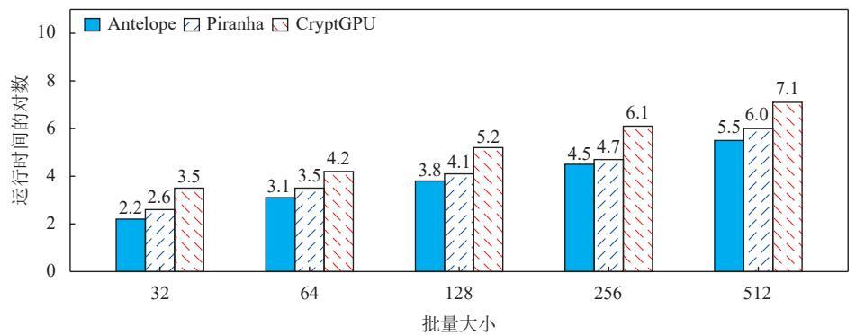
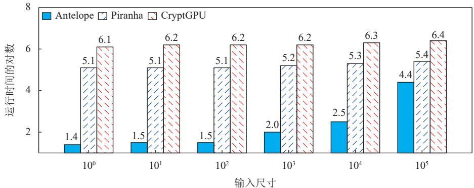
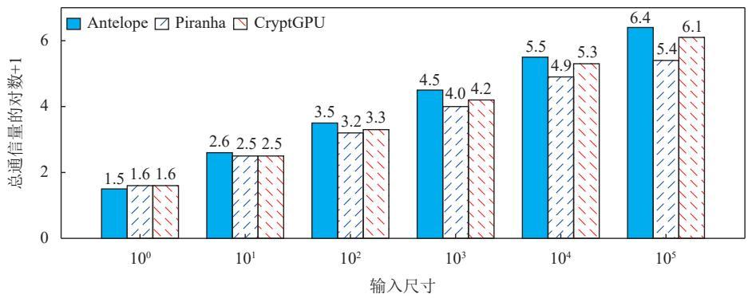

# Antelope: 基于 GPU 的三方隐私保护机器学习框架 \*

余    欢 1,2,3 ,    华强胜 1,2,3 ,    卢必然 1,2,3 ,    石宣化 1,2,3 ,    金    海 1,2,3

1(服务计算技术与系统教育部重点实验室 (华中科技大学), 湖北 武汉 430074)

2(大数据技术与系统国家地方联合工程研究中心, 湖北武汉 430074)

3(华中科技大学计算机科学与技术学院, 湖北武汉 430074)

通信作者: 华强胜, E-mail: qshua@hust.edu.cn

摘　要: 随着数据隐私问题越来越受重视, 能有效保护数据隐私的安全多方计算 (secure multi-party computation,MPC) 吸引了众多研究者的目光. 然而安全多方计算协议的通信和内存要求限制了它在隐私保护机器学习 (privacy-preserving machine learning, PPML) 中的性能. 减少安全计算协议的交互轮数和内存开销十分重要但也极具挑战性,尤其是在使用 GPU 硬件加速的情况下. 重点关注线性和非线性计算的 GPU 友好协议的设计和实现. 首先, 为避免整数计算的额外开销, 基于 PyTorch 的 CUDA 扩展实现了 64 位整数的矩阵乘法和卷积运算. 然后, 提出一种基于0-1 编码方法的低通信轮数的最高符号位 (most significant bit, MSB) 获取协议, 并针对性地提出低通信复杂度的混合相乘协议, 简化了安全比较计算的通信开销, 可实现快速的 ReLU 激活层计算. 最后提出 Antelope, 一个基于GPU 的快速三方隐私保护机器学习框架, 进一步缩短了与明文框架之间的性能差距, 且支持深层网络的完整训练.实验结果表明, 与 CPU 上广泛使用的经典架构 FALCON (PoPETs 2020) 相比, 训练和推理性能是 FALCON 的29–101 倍和 1.6–35 倍. 与基于 GPU 的工作相比, 在训练方面是 CryptGPU (S&P 2021) 的 2.5–3 倍, 是 Piranha(USENIX Security 2022) 的 1.2–1.6 倍. 在推理方面, 是 CryptGPU 的 11 倍, 是 Piranha 的 2.8 倍. 特别地, 所提安全比较协议在输入数据量较小时具有很大优势.

关键词:数据隐私;机器学习;安全多方计算;安全比较

中图法分类号: TP18

中文引用格式: 余欢, 华强胜, 卢必然, 石宣化, 金海. Antelope: 基于GPU的三方隐私保护机器学习框架. 软件学报. http://www.jos. org.cn/1000-9825/7445.htm

英文引用格式: Yu H, Hua QS, Lu BR, Shi XH, Jin H. Antelope: 3-party Privacy-preserving Machine Learning Framework Based on GPU. Ruan Jian Xue Bao/Journal of Software (in Chinese). http://www.jos.org.cn/1000-9825/7445.htm

# Antelope: 3-party Privacy-preserving Machine Learning Framework Based on GPU

YU Huan1,2,3, HUA Qiang-Sheng1,2,3, LU Bi-Ran1,2,3, SHI Xuan-Hua1,2,3, JIN Hai1,2,3

1(Key  Laboratory  of  Services  Computing  Technology  and  System  (Huazhong  University  of  Science  and  Technology),  Ministry  of Education, Wuhan 430074, China)   
2(National Engineering Research Center for Big Data Technology and System, Wuhan 430074, China)   
3(School of Computer Science and Technology, Huazhong University of Science and Technology, Wuhan 430074, China)

Abstract:  As  concerns  over  data  privacy  continue  to  grow,  secure  multi-party  computation  (MPC)  has  gained  considerable  research attention  due  to  its  ability  to  protect  sensitive  information.  However,  the  communication  and  memory  demands  of  MPC  protocols  limit their  performance  in  privacy-preserving  machine  learning  (PPML).  Reducing  interaction  rounds  and  memory  overhead  in  secure computation  protocols  remains  both  essential  and  challenging,  particularly  in  GPU-accelerated  environments.  This  study  focuses  on  the design  and  implementation  of  GPU-friendly  protocols  for  linear  and  nonlinear  computations.  To  eliminate  overhead  associated  with  integer operations,  64-bit  integer  matrix  multiplication,  and  convolution  are  implemented  using  CUDA  extensions  in  PyTorch.  A  most  significant bit  (MSB)  extraction  protocol  with  low  communication  rounds  is  proposed,  based  on  0-1  encoding.  In  addition,  a  low-communicationcomplexity  hybrid  multiplication  protocol  is  introduced  to  reduce  the  communication  overhead  of  secure  comparison,  enabling  efficient computation  of ReLU activation  layers.  Finally,  Antelope,  a  GPU-based  3-party  framework,  is  proposed  to  support  efficient  privacypreserving  machine  learning.  This  framework  significantly  reduces  the  performance  gap  between  secure  and  plaintext  computation  and supports  end-to-end  training  of  deep  neural  networks.  Experimental  results  demonstrate  that  the  proposed  framework  achieves  29×–101× speedup  in  training  and  1.6×–35×  in  inference  compared  to  the  widely  used  CPU-based  FALCON  (PoPETs  2020).  When  compared  with GPU-based  approaches,  training  performance  reaches  2.5×–3×  that  of  CryptGPU  (S&P  2021)  and  1.2×–1.6×  that  of  Piranha  (USENIX Security  2022),  while  inference  is  accelerated  by  factors  of  11×  and  2.8×,  respectively.  Notably,  the  proposed  secure  comparison  protocol exhibits significant advantages when processing small input sizes.

Key words:  data privacy; machine learning; secure multi-party computation; secure comparison

随着数字设施的快速发展, 数据的数量和价值不断增长. 机器学习是挖掘数据使用价值的重要工具, 而神经网络是最流行的机器学习算法, 它促进了科学研究、商业活动和政府决策的发展. 然而数据泄露事件在全球范围内日益增多, 频繁发生的数据泄露事件增加了公众对数据安全的需求. 隐私保护机器学习是指在不公开模型参数和数据的情况下完成模型训练或获得推理结果, 在医疗[1]和金融行业[2] 中有着广泛的应用场景.

解决数据的价值挖掘和隐私保护之间的矛盾, 并最终实现将隐私数据转化为可访问资源, 构成了当前研究工作的重点. 现代密码学为我们提供了在计算过程中保护数据隐私的解决方案. 这些解决方案包括同态加密 (homo-morphic encryption, HE)[3,4] 以及安全多方计算 [5,6]. 但是上述解决方案都有不同的局限性.

HE 是一种加密方法, 允许任何人在加密数据上进行同态运算, 而无需解密数据, 因此也不会泄露数据隐私. 但HE 的密文膨胀和高计算复杂度限制了其在大规模神经网络中的应用, 同时当前基于同态加密的隐私保护机器学习框架与明文机器学习存在很大差距 [7,8]. MPC 是一种多方协作计算函数的安全技术, 其本地计算复杂度低. 然而MPC 的性能常受限于通信复杂度 [9,10].

本文关注使用 GPU 硬件加速基于 MPC 实现的隐私保护机器学习框架. 在 MPC 的多种实现技术中, 秘密分享模式[11] 具有通信复杂度适中、局部计算复杂度低的优点, 这使得基于秘密分享的 MPC 在隐私保护应用中更为x n p [[x]]p实用 [12,13]. 从本质上讲, n-方秘密分享将数据 划分为 份, 每一方 只持有若干份分享作为自己的本地数据 ,x ← Reconstruct([[x]]p : p ∈ )安全的划分算法保证每方无法获知多于本地数据之外的额外信息, 并配备有算法用于根据足够多的秘密分享恢复原始数据. 然后, 多方共同执行简单的加法和乘法计算, 并组合这些基础运算以实现复杂函数的精确或者近似计算, 进一步支持神经网络层的前向、后向传播, 即可完成神经网络的训练和预测任务.

明文机器学习任务通过利用 GPU 大大提高了性能, 导致传统的明文机器学习和隐私保护机器学习之间存在很大的性能差距. 使用硬件加速隐私训练和推理在缩小这一差距方面发挥着关键作用. 然而使用 GPU 硬件加速保护机器学习与明文机器学习之间的差距高达 1000 倍[14]. 另一方面, 基于秘密分享的隐私保护机器学习常需要使用更大的内存空间. 这是因为数据被分享成多个秘密份额用于存储和计算, 因此需要使用更多的 GPU 内存. 然而GPU 的内存资源非常稀有 (通常为 16 GB), 这限制了其在复杂网络和大批量训练上的应用. 因此在保证协议计算精度的同时, 尽量减少协议的交互轮数和内存开销对于秘密分享安全计算协议的性能提升十分关键. 本文主要研究 GPU 友好的安全计算协议的设计和实现. 具体来说, 本文的主要工作和创新点如下.

(1) 高效的线性计算. CryptGPU[14] 通过将整数分解为浮点数进行线性计算, 增加了计算开销的同时加剧了GPU 内存的消耗. 为避免额外的转换开销, 减少 GPU 内存消耗, 本文延续 Piranha 的实现方法, 为 64 位整数类型的线性计算编写专门的 CUDA 核函数, 具体使用了 PyTorch 的 CUDA 扩展, 实现自定义 CUDA 算子, 支持 64 位整数类型的矩阵乘法. 在此基础上, 本文将卷积运算转换为矩阵乘法计算, 实现了快速卷积运算, 减少了线性层的运算时间.  
(2) GPU 友好的安全比较协议. 安全比较一直是 MPC 领域的重大挑战. 为了提高 GPU 的利用率, 本文关注于减少最高符号位获取协议的通信轮数, 提高 ReLU 等需要进行比较计算的协议的计算速度. 本文将获取最高符号位的任务转化为两个正数的大小比较问题, 并采用仔细设计的编码方法来解决这个问题, 最后大大减少了安全比

较协议所需的通信轮数.

(3) 支持复杂网络的训练. 在复杂网络的训练过程中加入批量归一化层可以加快收敛速度, 并一定程度上解决梯度消失的问题. 本文基于高效比较协议进一步实现了安全高效的批量归一化层, 能完成复杂网络的完整训练, 且通过实验验证能获得与明文训练相当的精度.

本文第 1 节介绍基于秘密分享的隐私保护机器学习的相关研究. 第 2 节介绍本文涉及的基础知识, 包括安全模型和符号说明. 第 3 节介绍本文提出的基于 GPU 的三方隐私保护机器学习框架. 第 4 节通过对比实验验证了所提框架的性能表现. 最后给出总结.

# 1 相关工作

近年来, 基于秘密分享的隐私保护机器学习的相关研究将重点放在减少交互轮数和通信方面. 在 2018 年, ABY3[9]提出了一种 2-out-of-3 的复制秘密分享方案来加快乘法计算速度, 同时使用并行前缀加法器来获取最高符号位.ASTRA[15] 是一个三方协议, 它将一部分在线阶段的运算前移到预处理阶段, 减少了在线通信. BLAZE[16] 则在ASTRA 的基础上, 提供对神经网络模型的支持, 可以实现神经网络模型的训练. SecureNN[12] 基于 Beaver[17] 三元组实现乘法, 根据整数环到奇数环的转换获取最高符号位, 仅使用秘密分享技术实现了神经网络中的线性和非线性计算. Facebook 人工智能研究院于 2019 年 10 月开源了基于 PyTorch 深度学习框架的通用隐私保护机器学习框架 CrypTen[18], 支持各种网络结构与计算参与方的数量, 降低了隐私保护机器学习框架的学习和使用门槛. 2020年, FALCON[13] 沿用了 ABY3 的复制秘密分享方案, 并使用无符号数循环判断的方法获取最高符号位, 数据可以始终处于算术秘密分享状态而不必进行耗时的算术秘密分享和二进制秘密分享之间的模式转换, 进一步降低了计算开销. Cryptflow[19] 能够自动将 TensorFlow 框架的代码转换为 MPC 协议的实现, 便于开发者使用, 同时对SecureNN 三方计算的通信效率进行了改进.

此外, 许多研究逐渐开始使用 GPU 硬件加速基于秘密分享的隐私保护机器学习. 在 2021 年, CryptGPU[14] 方案基于 CrypTen 框架在 GPU 上实现了基于秘密分享的隐私保护机器学习框架, 它使用 ABY3 乘法和最高符号位获取协议, 并通过将整数无损分割成多个浮点数, 调用 CUDA 基本线性代数子程序库 (cuBLAS) 实现矩阵乘法和卷积运算的加速. 2022 年提出的 Piranha[20] 是通用的 GPU 加速 MPC 计算的开发平台, 底层采用 C++ 实现, 同时支持两方、三方和四方和各种类型的神经网络结构上的计算, 对数据在 GPU 上的存储布局作了优化设计, 在其实现的 SecureML[10]、FALCON[13] 和 FantasticFour 这 3 种协议上都达到远优于原实现的性能. 即使如此, 上述方案对于 GPU 的并行能力利用仍然不够充分, 非线性层的计算效率和精度也不高.

近期的一些研究在GPU并行度、非线性函数计算精度以及安全性方面取得了显著进展. 文献[21]基于MP-SPDZ中对 MPC 协议的高效实现, 设计了精度和稳定性更佳的算法用于倒数、指数以及 Softmax 层的计算, 但只在CPU 上实现了算法, 未针对 GPU 进行并行优化. 2023 年的安全 2-PC 框架 Orca[22]采用函数式秘密分享模式, 借助GPU上的便笺存储器和锁步机制实现性能优化, 并提出了严格安全的Truncate协议. 2024年提出的多方隐私保护机器学习框架 Spin[23]也使用 GPU 加速安全计算, 并且在应对非诚实攻击者场景下也达到了更高安全性, 该框架优化了文献[21]中的数值算法, 并且支持RDMA、CPU-GPU双环形缓冲以降低通信开销和CPU-GPU数据迁移开销.

本文针对三方安全计算场景下的隐私保护机器学习, 基于 2-out-of-3 复制秘密分享模式, 提出了在 GPU 上实现神经网络安全训练和预测的新协议, 文中所提出的 Antelope 架构延续了先前工作[14,21,23]的协议设计和运算优化,着重改进了GPU并行化加速、比较协议以及非线性运算.

# 2 基础知识

本文基于秘密分享保护神经网络任务计算过程中的数据隐私, 下面就安全模型和本文使用的符号予以介绍.

# 2.1 安全模型

与近年来大多数三方安全协议一样, 本文基于半诚实安全模型. 在这种安全模型的假设下, 三方拥有安全的点对点通信渠道. 同时每个参与方会忠实地执行协议, 不会向其他参与者恶意传输错误的信息. 然而, 参与者可能会对输入数据表现出好奇心, 并有可能记录中间结果和接收到的其他参与者的信息, 以此来推断输入数据的隐私信息. 在没有可信第三方的情况下, 在这种安全模型中, 本文提出的协议只需要保证 3 个参与者都无法从自身持有的数据和计算过程中记录的数据中推断出隐私数据的任何信息, 即可保证安全性. 形式化地来说, 我们将诉诸安全模型于定义1.

定义 1. 半诚实安全性. 设 $f : ( \mathbb { Z } / 2 ^ { l } \mathbb { Z } ) ^ { 3 } \to ( \mathbb { Z } / 2 ^ { q } \mathbb { Z } ) ^ { 3 }$ 是随机可计算函数, $l , q \in \mathbb { Z } _ { \geqslant 1 }$ π而 是一个 3 PC 计算协议. 我π们称 满足单腐坏半诚实安全性, 如果存在 PPT 算法 使得对每个 $j \in \{ 0 , 1 , 2 \}$ 和每个输入 $\pmb { x } \in \left( \mathbb { Z } / 2 ^ { l } \mathbb { Z } \right) ^ { 3 }$ , 都有:

$$
\left\{\text { output } ^ {\pi} (\boldsymbol {x}), \text { view } ^ {\pi} (\boldsymbol {x}) \right\} \equiv \left\{f (\boldsymbol {x}), \mathcal {S} (j, x _ {j}, f _ {j} (\boldsymbol {x})) \right\},
$$

其中, $\nu i e w ^ { \pi } ( { \pmb x } )$ j是参与方 在执行 π 时接收到的数据的有序组合, $o u t p u t ^ { \pi } ( { \pmb x } )$ 是 3 个参与方执行 π 后得到的共同输出, ≡ 表示两种概率分布多项式时间除开可略概率不可区分.

尽管本文基于半诚实安全模型, Antelope 的协议框架仍可扩展至恶意安全模型 (malicious security model), 即允许任意数量的参与方恶意偏离协议执行. 为了提高安全性, 我们可以结合可验证秘密共享 (VSS) 防止数据篡改, 其允许参与方在秘密共享阶段验证其他方提交的份额是否有效. 这可以防止恶意方提供错误的数据份额, 影响最终计算结果. 例如, 可采用基于 Pedersen 承诺的 VSS 方案, 使每个秘密共享值都能被有效验证, 同时保持计算的高效性.

当前 Antelope 主要基于标准的三方计算协议, 如 SPDZ、Beaver 乘法三元组等. 这些协议在恶意模型下可以通过如下方式增强.

(1) 采用 MAC 认证 (如 SPDZ 方案中的信息验证代码) 来防止篡改共享值.  
(2) 利用强一致性检查 (如 Cut-and-Choose 技术) 降低恶意行为可能性.

结合多重门限密码学方案, 使得即使部分参与方恶意作恶, 协议仍能保证计算正确性.

尽管恶意安全性提供了更强的隐私保护能力, 本文并未在 Antelope 框架中直接实现这些优化, 主要基于以下考虑: 首先, 恶意安全模型通常需要额外的密码学工具 (如零知识证明、MAC 认证、可验证计算等), 这会显著增加计算和通信开销, 降低系统的整体性能, 尤其是在 GPU 计算中, 部分安全检查可能难以高效并行化. 其次, 实现这些优化需要对协议进行较大幅度的修改, 并引入额外的工程复杂性, 例如重新设计共享验证机制或优化现有GPU 内核以支持更复杂的安全检查. 因此, 本文选择专注于半诚实安全模型, 并将恶意安全性的扩展留作未来研究方向, 以进一步探索在保证安全性的同时优化计算效率的可能性.

# 2.2 符号说明

Z Z/kZ Z kZ k记 为整数集, 本文用 表示环 关于子环 的商环, 其上的加法和乘法循常规定义. 进一步, 如果Z/kZ是素数, 成有限域, 记作 $\mathbb { F } _ { k }$ l. 如果存在正整数 使得 $k = 2 ^ { l } ;$ , 我们将 $\mathbb { Z } / k \mathbb { Z }$ 中的元素和 $[ - 2 ^ { l - 1 } , 2 ^ { l - 1 } - 1 ]$ 中的对应整数等同起来. 我们用 $\left\{ P _ { j } \right\} _ { j \in \mathbb { Z } / 3 \mathbb { Z } }$ 表示多方计算的 3 个参与方. 由于秘密分享模式下实际参与计算的是环中的元素,我们在实际计算时使用整数代替相应实数作计算, 具体来说: 设 $x \in \mathbb { R } ,$ , 我们固定精度 $f \in \mathbb { Z } _ { \geqslant 1 }$ 作为浮点数的定点表示规格, 然后利用 $\lfloor 2 ^ { f } x \rceil \in \mathbb { Z } / 2 ^ { l } \mathbb { Z }$ x ⌊·⌉代替 参与计算, 这里 是最近舍入运算.

x ∈ R 数据 在精度为 $f$ [[时的算术秘密分享记作 $\left. \boldsymbol { x } ; \boldsymbol { f } \right] ^ { A } = ( x _ { 0 } , x _ { 1 } , x _ { 2 } ) ;$ , 其中 $x _ { 0 } , x _ { 1 } , x _ { 2 } \in \mathbb { Z } /$ 2lZ 并满足 $x _ { 0 } + x _ { 1 } + x _ { 2 } = \lfloor 2 ^ { f } x \rceil .$ .本文采用复制秘密分享模 $\textstyle { \vec { \mathbb { x } } } \zeta ,$ 这种模式中参与方 $P _ { j }$ 将持有数据 $( x _ { j } , x _ { j + 1 } )$ . 为了更高效地进行 Antelope 支持的神经网络层计算, 我们没有使用如文献 [14,20,21] 中的二进制秘密分享模式, 但采用了一种特殊的布尔秘密分享模式B'用于 MSB、ReLU 以及一些非线性函数的计算: 设 $b \in \mathbb { Z } / 2 \mathbb { Z }$ , 我们记 $\left[ \left[ b \right] \right] ^ { B ^ { \prime } } = \left( b _ { 0 } , b _ { 1 } , b _ { 2 } \right)$ 并满足 $b _ { 0 } = b _ { 1 } , b _ { 1 } \oplus b _ { 2 } = b$ .为了方便起见, 本文省略算术秘密分享的角标A.

不经特别指明, 我们总是用小写字母 (如 x) 表示标量, 小写粗体字母 (如 x) 表示一维向量, 大写字母 (如 X)表示矩阵.

# 3 Antelope 框架设计与实现

Antelope 底层使用 PyTorch 框架, 利用 Python 开发. 为了一方面支持 GPU 并行同时便于协议实现以及上层

API 调用, Antelope 采用如图 1 所示的 3 层框架系统结构, 从下到上依次是基础操作层、加速层和协议层. 各层的主要内容和作用如下.

  
图 1 Antelope 架构

(1) 基础操作层: 该层主要包括线性计算、乘法、非线性函数的安全实现, 上层的复杂计算均基于这些基础操作组合得到. 其中线性计算包含加法和标量乘法, 乘法则是两个隐私数据相乘, 非线性函数则包括除法、对数函数和指数函数.  
(2) 加速层: 该层处于基础操作层之上, 主要为协议层提供加速. 本文提供了两种加速方案, 对于现有的 CUDA加速库支持的操作 (如 64 位整数加减法), 可以直接调用其 API 实现. 而对于某些不支持的操作(如 64 位整数的矩阵乘法和卷积运算), 本文使用 PyTorch 的 CUDA 扩展自定义算子加速.  
(3) 协议层: 协议层包括卷积神经网络中各层的具体实现, 主要是线性层 (矩阵计算和卷积运算)、池化层、ReLU 激活层和批量归一化层. 此外, 本文的池化层均使用平均值池化代替高复杂度的最大值池化. 通过对这些协议层的组合, 可以搭建复杂的网络模型, 并完成隐私保护机器学习任务.

# 3.1 基础操作实现

下面我们介绍 Antelope 框架中的基础操作, 包括定点数编码、随机数生成、线性计算和乘法计算等.

● 秘密分享形式, 定点数编码已经于第2.2 节说明.  
● 0 的伪随机分享 (psuedo-random sharing of zero, PRSZ): 这个机制用于生成 0 的秘密分享 $( z _ { 0 } , z _ { 1 } , z _ { 2 } )$ , 这样以后, 假设 $P _ { 0 }$ x 希望创建 的秘密分享, 只要 3 个参与方调用 $( z _ { 0 } , z _ { 1 } , z _ { 2 } ) \gets P R S Z ( )$ 并让每个 $P _ { j }$ 拥有 $z _ { j } ,$ 就可以令 $[ x ; f ] ] ^ { A } =$ $( \lfloor 2 ^ { f } x \rceil + z _ { 0 } , z _ { 1 } , z _ { 2 } )$ 完成创建. 实现方面我们采用 AFL+16 方案[24], 由每个 $P _ { j }$ 生成伪随机数种子 $k _ { j } ,$ , 并发送给 $P _ { j - 1 } , \equiv$ 方都持有伪随机函数 PRF 的计算方法, 只需要在本地计算 $z _ { j } = P R F ( k _ { j } ) - P R F ( k _ { j + 1 } )$ .  
● 线性计算:  
[[x; f ]] , [[y; f ]] ■ 加法: 如果三方持有 , 只要分别在本地计算 $x _ { j } + y _ { j }$ 即可, 有 $[ [ x + y ; f ] ] = [ [ x ; f ] ] + [ [ y ; f ] ]$ .   
■ 标量乘法: 如果三方持有 $\mathbb { I } x ; f \mathbb { I }$ 并给定公共的 $\lambda \in \mathbb { Z } / 2 ^ { l } \mathbb { Z }$ , 同样只需要在本地计算 $\lambda x _ { j } ,$ , 有 $\ [ [ \lambda x ; f ] ] = \lambda [ [ x ; f ] ]$ .  
■ 偏移量: 如果三方持有 $\mathbb { I } x ; f ] \mathbb { I }$ 并给定公共的 $t \in \mathbb { Z } / 2 ^ { l } \mathbb { Z } ,$ 只需 $P _ { 0 } , P _ { 2 }$ 在本地计算 $x _ { 0 } \gets x _ { 0 } + 1$ 即可.  
[[x; f ]] , [[y; f ]]● 乘法计算: 如果三方持有 , 让每个 $P _ { 0 }$ 在本地计算 $w _ { j } \gets x _ { j } y _ { j } + x _ { j } y _ { j + 1 } + x _ { j + 1 } y _ { j }$ , 然后利用 PRSZ 盲化得到:

$$
[ [ x y; 2 f ] ] = (w _ {0} + z _ {0}, w _ {1} + z _ {1}, w _ {2} + z _ {2}).
$$

这一步计算以后需要 3 轮通信恢复到复制秘密分享模式, 然后调用截断协议 $[ [ x y ; f ] ]  T r u n c a t e ( [ [ x y ; 2 f ] ] , f )$ .Antelope 中的截断协议是 $\mathrm { A B Y } ^ { 3 [ 9 ] }$ 中所介绍的, 由 $P _ { 1 } , P _ { 2 }$ 使用共同的随机数种子采样 $r  \mathbb { Z } / 2 ^ { l } \mathbb { Z }$ , 然后利用:

$$
[ [ z; f ] ] = \left(\frac {z _ {0}}{2 ^ {f}}, \frac {z _ {1} + z _ {2}}{2 ^ {f}} - r, r\right).
$$

截断协议中每方只需要本地计算仍能保证复制秘密分享形式.

● 非线性函数: 如文献 [21,23] 所指出, 文献 [14,20] 所使用的数值算法精度难以达到实际应用需求, 并且不具有良好的数值稳定性, 因而我们首先设计了更好的 MSB 协议从而高效地实现比较运算, 然后针对我们 MSB 低通信的优势设计了平方根倒数、指数以及Softmax函数的多方计算协议, 具体内容见第3.3–3.5节.

# 3.2 线性层实现

由于乘法可以通过 3 次本地乘法连同一次截断操作实现, 矩阵乘法的最大计算负载也只是 3 次本地矩阵乘法. 为了减少计算开销, 我们将截断协议延迟到所有乘法与求和都计算完毕之后再执行, 这样仅需一次截断操作.A,这就是说, 假设 $B \in \mathbb { R } ^ { n \times n }$ , 我们计算:

$$
\llbracket A B; f \rrbracket = \llbracket C; f \rrbracket \Rightarrow \llbracket C _ {j, k}; f \rrbracket = T r u n c a t e \left(\sum_ {q = 1} ^ {n} \llbracket A _ {j, q} B _ {q, k}; 2 f \rrbracket\right).
$$

cuBLAS 库没有提供针对 64 位整数的矩阵乘法和卷积运算, 因此无法直接调用 cuBLAS 库完成各参与方本地的线性计算. 为了利用 GPU 的并行计算能力, CryptGPU 将 64 位整数分解成为 4 个独立的 64 位浮点数, 进而直接调用 cuBLAS 库中的矩阵相乘和卷积运算接口, 再将计算结果进行无损整合得到最终结果. 不过, 这种方法会带来额外计算开销, 同时会显著增加存储需求. Piranha 针对线性层计算任务手动编写了 GPU 核函数, 并仔细设计了数据在GPU上的存储布局, 但是并没有充分发掘GPU的访存特性.

我们利用 CUDA 程序执行涉及 64 位整数的矩阵乘法计算. 为最大限度地提高计算速度, 受单精度矩阵乘法(SGEMM) 启发, 我们的算法策略以减少内存访问延迟和提高计算与内存访问比为主. 具体来说, 为了降低内存访问延迟, 我们将矩阵分块相乘, 每个 GPU 线程分块用于计算积矩阵中的一个分块矩阵. 此外, 读取分块矩阵时不直接从 GPU 全局内存中读取, 而是先将需要计算的分块矩阵搬运到 GPU 共享内存, 再从共享内存中读取分块矩阵中的元素到寄存器空间.

具体的 GPU 上矩阵乘法算子实现见算法 1, 其中块内线程同步 syncthreads() 使得 $b _ { x } , b _ { y }$ 相同的线程在执行到这步时阻塞, 等待块内所有的线程都到达这步以后再继续运行后面的语句. 为了介绍方便, 算法 1 中假设矩阵 A,B 都是方阵并且阶数恰好是 2 的幂次, 很明显非该种情形的矩阵乘法通过填 0 可以在矩阵规模扩大不超过 4 倍的情况下适用这种算法, 而实际实现时并不需要显式地补 0, 直接忽略超出矩阵范围的计算就能自然地将这算法扩展到一般情形而不引入额外开销.

# 算法 1. MatMul(A, B, C; (bx, by), (tx, ty)).

A,输入: 矩阵 $B \in ( \mathbb { Z } / 2 ^ { 6 4 } \mathbb { Z } ) ^ { n \times n } \left( n = 2 ^ { m } \right)$ 2b, 这些数据都存放在 GPU 的全局内存上. 固定的全局参数 blockSize = 表示GPU 上每个线程分块的行数或者列数, 这里 $b \leqslant m . \ 0 \leqslant b _ { x } , b _ { y } < 2 ^ { m - b } , 0 \leqslant t _ { x } , t _ { y } < 2 ^ { b }$ 是每个 GPU 线程的内置变量, 表示线程所在线程分块的行列编号和在线程分块中的行列编号;

输出: 如果对每个 $b _ { x } , b _ { y } , t _ { x } , t _ { y } ;$ , 相应核函数都已经在实际 GPU 的物理 SM 上运行完毕, 那么 GPU 全局内存上的矩A·B阵C的子矩阵将会被正确置为 .

2b ×2b 1. 申请块内共享内存 shareA 和 shareB, 并假定其布局均为 的二维数组  
2. 执行块内线程同步 syncthreads()   
3. 置 t ← 0   
4. For $j = 0 , . . . , 2 ^ { m - b } - 1$ do   
5. 　拷贝 $s h a r e A [ t _ { x } ] [ t _ { y } ] \gets A [ b _ { x } 2 ^ { b } + t _ { x } ] [ j 2 ^ { b } + t _ { y } ]$ 和 $s h a r e B [ t _ { x } ] [ t _ { y } ] \gets B [ j 2 ^ { b } + t _ { x } ] [ b _ { y } 2 ^ { b } + t _ { y } ]$   
6. 　执行块内线程同步 syncthreads()   
7. 　计算 $t \gets t + \sum _ { k = 0 } ^ { 2 ^ { b } - 1 } s h a r e A [ t _ { x } ] [ k ] \cdot s h a r e B [ k ] [ t _ { y } ]$   
8. 　执行块内线程同步 syncthreads()   
9. 置 $C [ b _ { x } 2 ^ { b } + t _ { x } ] [ b _ { y } 2 ^ { b } + t _ { y } ]  t$

为了验证算法的正确性, 只要注意到第 4 行开始的第 $j$ 次迭代, 将会在分块矩阵规模为 $2 ^ { b } { \times } 2 ^ { b }$ A的情况下, 将中位于 $( b _ { x } , j )$ 的分块矩阵 $A [ b _ { x } 2 ^ { b } : ( b _ { x } + 1 ) 2 ^ { b } ] [ j 2 ^ { b } : ( j + 1 ) 2 ^ { b } ]$ B 与 中位于 $( j , b _ { y } )$ 的分块矩阵 $A [ j 2 ^ { b } : ( j + 1 ) 2 ^ { b } ] [ b _ { y } 2 ^ { b }$ :$( b _ { \mathrm { y } } + 1 ) 2 ^ { b } ]$ 相乘, 并将结果矩阵第 $t _ { x }$ 行、第 $t _ { y }$ 列的内容加到线程 $( t _ { x } , t _ { y } )$ t的临时变量 上. 每个线程分块将申请$2 ^ { b } \times 2 ^ { b } \times 6 4 { \mathrm { ~ b i t } } = 2 ^ { 2 b + 3 } { \mathrm { ~ B } }$ 的共享内存, 每个线程将执行 $2 ^ { m - b + 1 } + 1$ 次全局访存和 $2 ^ { m }$ 次 GPU 上 64 位整数间乘法.

X K我们基于线性层的计算方法设计了卷积层 Conv2D 计算协议. 基础的 Conv2D 运算将输入 的每个与卷积核K X ∈Rn×n, K ∈Rk×k规模相同的子矩形同 作互相关运算, 并将结果按照子矩形的位置关系排列成结果矩形. 我们设 ,则 X 共有 $m = ( n - k + 1 ) ^ { 2 }$ 个 $k \times k$ 的子矩形, 假设它们从左到右、从上到下排列为 $X ^ { ( 0 ) } , . . . , X ^ { ( M - 1 ) }$ ) . 定义展平操作:

$$
F l a t t e n: \mathbb {R} ^ {q \times q} \ni Y \mapsto F l a t t e n (Y) = (Y _ {0, 0}, \dots , Y _ {0, q - 1}, \dots , Y _ {q - 1, 0}, \dots , Y _ {q - 1, q - 1}) \in \mathbb {R} ^ {q ^ {2}}.
$$

假设输入批量为 $B ,$ b  批次 的输入矩阵为 $X _ { b } ,$ c  且 Conv2D 层有 个输出频道, 卷积核分别为 $K _ { 0 } , . . . , K _ { c - 1 } .$ 观察矩阵乘法:

$$
\left( \begin{array}{c} F l a t t e n \bigl (X _ {0} ^ {(0)} \bigr) \\ \vdots \\ F l a t t e n \bigl (X _ {0} ^ {(M - 1)} \bigr) \\ \vdots \\ F l a t t e n \bigl (X _ {B - 1} ^ {(0)} \bigr) \\ \vdots \\ F l a t t e n \bigl (X _ {B - 1} ^ {(M - 1)} \bigr) \end{array} \right) \cdot \Big ( \begin{array}{c c c} F l a t t e n ((K _ {0}) ^ {t}) & \ldots & F l a t t e n ((K _ {c - 1}) ^ {t}) \end{array} \Big).
$$

这个结果组织成 $B \times ( n - k + 1 ) \times ( n - k + 1 )$ 的张量就恰好是 Conv2D 的输出. im2col 算法[25]就是基于这个思想设计的. 图 2 展示了卷积与 im2col 卷积的关联. Antelope 中使用 im2col 连同已经有的矩阵乘法算法实现 Conv2D的计算.

$$
\left( \begin{array}{c c c c} X _ {0, 0} & X _ {0, 1} & X _ {0, 2} & X _ {0, 3} \\ X _ {1, 0} & X _ {1, 1} & X _ {1, 2} & X _ {1, 3} \\ X _ {3, 0} & X _ {3, 1} & X _ {3, 2} & X _ {3, 3} \\ X _ {2, 0} & X _ {2, 1} & X _ {2, 2} & X _ {2, 3} \end{array} \right) \star \left( \begin{array}{c c} K _ {0, 0} & K _ {0, 1} \\ K _ {1, 0} & K _ {1, 1} \end{array} \right) = \left( \begin{array}{c c c} Y _ {0, 0} & Y _ {0, 1} & Y _ {0, 2} \\ Y _ {1, 0} & Y _ {1, 1} & Y _ {1, 2} \\ Y _ {2, 0} & Y _ {2, 1} & Y _ {2, 2} \end{array} \right)
$$

(a) 直接卷积

$$
\left( \begin{array}{c c c c} X _ {0, 0} & X _ {0, 1} & X _ {1, 0} & X _ {1, 1} \\ X _ {0, 1} & X _ {0, 2} & X _ {1, 1} & X _ {1, 2} \\ \vdots & \vdots & \vdots & \vdots \\ X _ {3, 2} & X _ {3, 3} & X _ {2, 2} & X _ {2, 3} \end{array} \right) \quad \times \quad \left( \begin{array}{c} K _ {0, 0} \\ K _ {0, 1} \\ K _ {1, 0} \\ K _ {1, 1} \end{array} \right) \quad = \quad \left( \begin{array}{c} Y _ {0, 0} \\ Y _ {0, 1} \\ \vdots \\ Y _ {2, 2} \end{array} \right)
$$

(b) im2col 卷积, 转化为矩阵乘法

图 2 直接卷积与im2col卷积转化为矩阵乘法

# 3.3 ReLU激活层实现

$R e L U ( x ) : = \operatorname* { m a x } \{ x , 0 \}$ 是在神经网络中广泛使用的激活函数, 计算简单且能有效解决梯度消失问题、促进稀疏激活. 由于输入取值于 $[ - 2 ^ { l - 1 } , 2 ^ { l - 1 } - 1 ] \cap \mathbb { Z } .$ x x, 我们只需检查 的最高符号位MSB( ), 然后借助

$$
R e L U (x) = 1 - M S B (x) \cdot x
$$

完成激活层的实现. 我们的设计思路是通过 MSB 协议让三方持有 $b = M S B ( x )$ 的秘密分享 $\mathbb { I } \boldsymbol { b } \mathbb { I } ^ { B ^ { \prime } }$ , 然后设计该特殊B′布尔秘密分享 下的数据与算术秘密分享数据的混合乘法协议以实现上式中的乘法.

# 3.3.1    MSB 获取协议

对于给定的 $\mathbb { I } x ; f \mathbb { I }$ , 我们希望通过 MSB 获取协议计算 $\left\| [ x < 0 ] \right\| ^ { B ^ { \prime } } \gets M S B ( \left\| x ; f \right\| )$ . 此前的工作中, $\mathrm { A B Y } ^ { 3 }$ 通过将算术秘密分享模式转化为二进制秘密分享模式以后截取最高位实现该协议; FALCON 使用算术秘密分享, 根据无符号数的绕环判断函数获取最高符号位. 这些方案的通信轮数都是 $\mathcal { O } ( \log l )$ , 对于本文的 64 位整数而言, 需要十多轮甚至数十轮通信, 这无法很好地发挥 GPU 的并行计算能力. 文献 [21] 和文献 [23] 延续 $\mathrm { A B Y } ^ { 3 }$ 的思路, 离线预计算edaBits 来优化算术秘密分享到二进制秘密分享模式的转换.

CPU-GPU 之间的数据迁移开销限制了 GPU 在隐私保护多方计算中发挥并行能力, 而多个参与方之间的通信会引起数据在 CPU-GPU 之间的迁移, 尤其是 CPU 需要先将数据拷贝到锁页再载入 GPU 的存储. Antelope 中的 3PC 隐私计算协议是 GPU 友好的, 除了初始载入和读取结果之外, 所有数据始终保持在 GPU 上参与运算, 因此协议的性能表现对通信开销很敏感. 在本文中, 我们提出了一种 $\mathcal { O } ( 1 )$ 通信轮数的 MSB 获取协议, 并且不需要离线预处理而仅通过在线计算实现. 首先介绍引理1.

Z/2lZ引理 1. 如果 PRF 生成的分布与 上的均匀分布多项式时间内除开可略概率不可区分, 那么对于每个$x \in \mathbb { Z } / 2 ^ { l } \mathbb { Z }$ 满足 $| x | < 2 ^ { l _ { x } }$ , 其中 $l _ { x } < l ,$ 如下事件以 $> 1 - { ( 2 ^ { l _ { x } + 1 - l } + n e g l ( l ) ) } ^ { 2 }$ 的概率发生:

$$
[   [ x ]   ] = (x _ {0}, x _ {1}, x _ {2}) \Rightarrow (x _ {0} + x _ {1}) \text {与} x _ {2} \text {正负性相反}.
$$

证明: 假设该事件不发生的概率是 $\in ( l )$ . 文献 [10] 的定理 1 蕴含如下推论: 如果 $x \in \mathbb { Z } / 2 ^ { l } \mathbb { Z } ,$ , 均匀采样 $y _ { 0 } \gets \mathbb { Z } / 2 ^ { l } \mathbb { Z }$ $y _ { 1 } : = x - y _ { 0 }$ , 那么:

$$
\operatorname * {P r} \left[ y _ {0} \text {与} y _ {1} \text {正负性相同} \right] = 2 ^ {l _ {x} + 1 - l}.
$$

A 设 PPT 算法 用于区分 $\left( x _ { 0 } + x _ { 1 } , x _ { 2 } \right)$ 和 $( \boldsymbol { y } _ { 0 } , \boldsymbol { y } _ { 1 } )$ 的分布, 成功概率为 $p ( l )$ . 现在我们构造 $\mathcal { A } ^ { \prime }$ 用于区分 PRF 两次独立调用的输出的差的分布与 $\mathbb { Z } / 2 ^ { l } \mathbb { Z }$ 上的均匀分布, 这个算法针对输 $\lambda z \in \mathbb { Z } / 2 ^ { l } \mathbb { Z } .$ , 计算 $x - z$ 并调用 $\boldsymbol { \mathcal { A } } ( \boldsymbol { x } - \boldsymbol { z } , z )$ ,   输′ 出该算法的输出, 则 成功当且仅当 成功. 进一步, 我们构造 $\mathcal { A } ^ { \prime \prime }$ 用于区分 PRF 输出的分布与 $\mathbb { Z } / 2 ^ { l } \mathbb { Z }$ 上的均匀分布, 这个算法针对两次输入 $( z _ { 1 } , z _ { 2 } ) _ { : }$ , 计算 $z _ { 1 } - z _ { 2 }$ 并调用 $\mathcal { A } ^ { \prime \prime } \big ( z _ { 1 } - z _ { 2 } \big ) .$ , 输出该算法的输出. 由于 $( \mathbb { Z } / 2 ^ { l } \mathbb { Z } , + )$ Z/2 l Z ∋ 成群,$g \mapsto g - z _ { 2 } \in \mathbb { Z } / 2 ^ { l } \mathbb { Z }$ 是双射, 保持了均匀分布, 因而 $\mathcal { A } ^ { \prime \prime }$ ′成功当且仅当 成功.

根据上面的构造, $\mathcal { A } ^ { \prime \prime }$ 成功当且仅当 成功. 由于我们假设了 PRF 的多次输入下的不可区分安全性, 有:

$$
p (l) = \operatorname * {P r} \Big [ {\mathcal {A}} \text {成功} \Big ] = \operatorname * {P r} \Big [ {\mathcal {A}} ^ {\prime \prime} \text {成功} \Big ] <   {\frac {1}{2}} + n e g l (l).
$$

D 我们现在构造一个算法 来区分 $\left( x _ { 0 } + x _ { 1 } , x _ { 2 } \right)$ 和 $( y _ { 0 } , y _ { 1 } )$ 的分布, 根据输入的 $( z _ { 0 } , z _ { 1 } )$ , 如果它们的正负性相同则认为是 $\left( x _ { 0 } + x _ { 1 } , x _ { 2 } \right)$ , 否则认为是 $( y _ { 0 } , y _ { 1 } )$ . 使用全概率公式:

$$
\operatorname * {P r} \left[ \mathcal {D} \text {成功} \right] = \frac {1}{2} \operatorname * {P r} \left[ \left(x _ {0} + x _ {1}\right) \text {与} x _ {2} \text {正负性} \right] + \frac {1}{2} \operatorname * {P r} \left[ y _ {0} \text {与} y _ {1} \text {正负性} \right] = \frac {1}{2} + \frac {1}{2} \left(\in (l) - 2 ^ {l _ {x} + 1 - l}\right).
$$

根据我们先前的讨论, 任何一个试图区分 $( x _ { 0 } + x _ { 1 } , x _ { 2 } )$ 和 $( y _ { 0 } , y _ { 1 } )$ 的分布的算法成功概率都小于 ${ \frac { 1 } { 2 } } + n e g l ( l )$ , 因此:

$$
\frac {1}{2} + \frac {1}{2} \left(\in (l) - 2 ^ {l _ {x} + 1 - l}\right) <   \frac {1}{2} + n e g l (l) \Rightarrow \in (l) <   2 ^ {l _ {x} + 1 - l} + n e g l (l).
$$

证毕.

引理 1 告诉我们 , 可以认为 $x _ { 0 } + x _ { 1 }$ 与 $x _ { 2 }$ 总是具有不同的符号. 基于这个观察, 我们设计了协议 1.

# 协议 1. MSB([[x; f]]; p).

输入: 数据 $x$ 的复制秘密分享模式 $\mathbb { I } x ; f \mathbb { I } , p$ 是事先选定的素数. 为了描述方便, 我们记 $y _ { 0 } : = x _ { 0 } + x _ { 1 } , y _ { 1 } : = x _ { 2 } ;$ 输出: $\lfloor 2 ^ { f } x \rceil$ 的最高符号位 $m s b ( \lfloor 2 ^ { f } x \rceil ) = [ x < 0 ]$ 的秘密分享 $[ [ x < 0 ] ] ^ { B ^ { \prime } } = ( b _ { 0 } , b _ { 1 } , b _ { 2 } )$ .

1. 参与方 $P _ { j } ( j = 0 ,$ 1) 在本地调用 $A _ { j } [ 0 : l - 1 ]  E n c o d e r _ { j } ( | y _ { j } | )$   
2. 参与方 $P _ { j } ( j = 0 , 1 )$ 在本地使用相同的随机数种子 $k _ { 1 }$ 与伪随机函数 PRF 采样 $r , s \gets \mathbb { F } _ { p }$   
3. 参与方 $P _ { j } ( j = 0 , 1 )$ 在本地计算 $B _ { j } [ k ]  ( r \cdot A _ { j } [ k ] + s )$ mod p   
4. 参与方 $P _ { j } ( j = 0 , 1 )$ 将 $B _ { j } [ 0 : l - 1 ]$ 发送给 $P _ { 2 }$   
5. 参与方 $P _ { j } ( j = 0 ,$ 1) 置 $b _ { j } \gets m s b ( y _ { j } ) \oplus ( 1 - j )$   
6. 参与方 $P _ { 2 }$ 检测是否存在 $k \in \{ 0 , . . . , l - 1 \}$ 使得 $B _ { 0 } [ k ] = B _ { 1 } [ k ] .$ , 是则置 $b _ { 2 } \gets 1$ , 否则置 0

$A _ { j } [ 0 : l - 1 ] \gets E n c o d e r _ { j } ( x )$ 将 $\mathbb { Z } / 2 ^ { l } \mathbb { Z }$ 中的元素 x 编码为 $l - \overrightarrow { \pi }$ 数组 $A _ { j } [ x ] _ { ; }$ , 元素仍取值于 $\mathbb { Z } / 2 ^ { l } \mathbb { Z }$ . 具体来说, 设二进制串 $\boldsymbol { x } = ( x _ { l - 1 } \ldots x _ { 0 } ) ;$ 2, 对每个 $k = 0 , \ldots , l - 1$ , 如果 $x _ { k } = j$ 则置 $A _ { j } [ k ] \gets ( x _ { l - 1 } \dots x _ { i + 1 } 1 ) _ { 2 }$ , 否则置为从 $\mathbb { Z } / 2 ^ { l } \mathbb { Z }$ 上用私有随机数种 $\vec { \mathcal { F } } k _ { j } ^ { \prime }$ 和 PRF 采样的随机数. 注意, $P _ { 0 } , P _ { 1 }$ 在调用这两个算法的时候, 需要使用不同的随机数种子来完成需要的采样.

引理 2. 协议 1 中, 如果 $| y _ { 0 } | > | y _ { 1 } | ;$ , 如下事件必然发生:

$$
\exists k \in \{0, \dots , l - 1 \}: B _ {0} [ k ] = B _ {1} [ k ].
$$

如果 $| y _ { 0 } | \leqslant | y _ { 1 } | ,$ , 该事件发生的概率 $< 1 - ( 1 - 2 ^ { - l } ) ^ { l } + n e g l ( l )$ .

证明: 前一个断言是显而易见的, 因为 $| y _ { 0 } | > | y _ { 1 } |$ 当且仅当存在 $k \in \{ 0 , . . . , l - 1 \}$ , 使得 $\left| y _ { 0 } \right|$ k二进制表示的第 位为|y |1 而 的为 0, 根据 Encoder 的编码规则, 这就完全等价于 $A _ { 0 } \left[ k \right] = A _ { 1 } \left[ k \right]$ , 蕴含 $B _ { 0 } \left[ k \right] = B _ { 1 } \left[ k \right]$ . 后一个断言也是显然的, 由第一个断言的逆否命题可知, 该事件发生当且仅当 $P _ { 0 } , P _ { 1 }$ 采样到了相同的随机数, 如果编码过程中在 l 位二进制数范围内均匀采样, 这种巧合发生的概率为 $1 - ( 1 - 2 ^ { - }$ l)l, 仿照引理 1 中的手法, 用于区分均匀采样和 PRF 采样的 PPT 算法正确率不超过 $1 / 2 + n e g l ( l )$ , 这直接导出了结论. 证毕.

计算可知, $l = 6 4$ 时, 在 $| y _ { 0 } | \leqslant | y _ { 1 } |$ 时引理 2 所述事件发生的概率 $< 3 . 4 9 \times 1 0 ^ { - 1 8 }$ . 这表明协议 1 相应于该犯错概率是正确的. 在实际实现时, 为了进一步减少通信量, 我们设定 $p = 2 ^ { 3 1 } - 1$ |y0| , |y1|, 此时仅需截断 的位数至 32 位,延续上述分析以及实验测试可知, 这些修改对网络训练的准确率没有影响.

# 3.3.2    混合相乘以及 ReLU 实现

混合相乘协议 $M i x M u l ( \left\| \boldsymbol { b } \right\| ^ { B ^ { \prime } } , \left\| \boldsymbol { x } ; \boldsymbol { f } \right\| )$ 用于将本文所述的特殊布尔秘密分享模式的数据与算术秘密分享模式下的数据相乘, 结果以算术秘密分享的形式存放. 相比起 $\mathrm { A B Y ^ { 3 } }$ 的比特嵌入以及文献 [21,23] 中的 Bit2A 协议, Antelope中充分利用了秘密分享模式B′的特性. 注意:

$$
[ [ b ] ] ^ {B ^ {\prime}} := (b _ {0}, b _ {1}, b _ {2}) \mapsto (0, b _ {1}, b _ {2}) =: [ [ b ] ] ^ {B}.
$$

这将 Antelope 中使用的布尔秘密分析模式退化为传统二进制秘密分享模式, 即0⊕ $b _ { 1 }$ ⊕ $b _ { 2 } = b ,$ , 但很明显无法设计反向的协议, 表明我们使用的秘密分享模式蕴含了更多信息, 因此可以简化协议2的实现.

[[b]]B′ 协议 2. MixMul( , [[x; f ]]).

输入: 比特 b 的秘密分享 $[ [ b ] ] ^ { B ^ { \prime } } = ( b _ { 0 } , b _ { 1 } , b _ { 2 } )$ 和数据 x 的算术秘密分享 $\left[ [ x ; f ] \right] = \left( x _ { 0 } , x _ { 1 } , x _ { 2 } \right)$

输出: 混合乘积 bx 的秘密分享 [[bx; f ]].

1. 参与方 $P _ { 2 }$ 使用一个私有随机数种子 $k _ { 2 } ^ { \prime }$ 和伪随机函数 PRF 生成随机数 $r _ { 0 } \gets \mathbb { Z } / 2 ^ { l } \mathbb { Z }$   
2. 参与方 $P _ { 2 }$ 计算 $r _ { 1 } = b - r _ { 0 }$ ∈ Z/2 l Z   
3. 参与方 $P _ { 2 }$ 将 $r _ { j }$ 发送给 $P _ { j } ( j = 0 , 1 )$   
4. if $b _ { 0 } = b _ { 1 } = 1$ then   
5. 　参与方 $P _ { 0 }$ 在本地置 $b _ { 0 } \longleftarrow - 1 \in \mathbb { Z } / 2 ^ { l } \mathbb { Z }$   
6. else   
7. 　参与方 $P _ { j } ( j = 0 ,$ 1) 在本地置 $( b _ { 0 } , b _ { 1 } ) \gets ( - 2 r _ { 0 } , 1 - 2 r _ { 1 } ) \in ( \mathbb { Z } / 2 ^ { l } \mathbb { Z } ) ^ { 2 }$   
8. 参与方 $P _ { 0 } , P _ { 1 } , P _ { 2 }$ 利用 PRSZ 机制将 $( b _ { 0 } , b _ { 1 } , b _ { 2 } )$ 转化为算术秘密分享 [[b]]  
9. 参与方 $P _ { 0 } , P _ { 1 } , P _ { 2 }$ 利用算术秘密分享模式上的乘法协议

表 1 给出了 Antelope 的 $R e L U$ 协议与 FALCON 和 CryptGPU 的通信复杂度对比. 每一个复杂度由二元组(Round, Amount) 表述, 其中 Round 表示通信轮数, Amount 表示通信量, 单位是 bit. 本文协议在通信轮数上远远优于 FALCON 和 CryptGPU, 尽管通信量较这两者也有一定的增加, 但在输入数据量较小时, 本文协议仍具备更大的优势, 后续的实验环节也进一步验证了本文低通信轮数ReLU协议的优势.

表 1 ReLU 协议通信复杂度比较

<table><tr><td>协议</td><td>MSB协议</td><td>ReLU协议</td></tr><tr><td>FALCON</td><td>(3+logl,24l)</td><td>(5+logl,32l)</td></tr><tr><td>CryptGPU</td><td>(2+3logl,16l)</td><td>(5+3logl,24l)</td></tr><tr><td>Antelope</td><td>(2,33l)</td><td>(3,35l)</td></tr></table>

# 3.3.3    安全性分析

Antelope 的 $R e L U$ 协议是通过自然的方式组合 MSB 协议与 MixMul 协议实现的. 这是 Antelope 创新设计的3PC协议, 因此有必要对其进行专门的安全性分析.

定理 2. ReLU 协议相应于可计算函数 $^ g$ 满足单腐坏半诚实安全性. 其中 $^ g$ 是函数:

$$
\llbracket x; f \rrbracket = (x _ {0}, x _ {1}, x _ {2}) \xrightarrow {g} (x _ {0} ^ {\prime}, x _ {1} ^ {\prime}, x _ {2} ^ {\prime}) \in \llbracket R e L U (x); f \rrbracket .
$$

证明: 我们分别证明MSB协议和MixMul协议的安全性, 则结合文献[26]可证明复合ReLU协议的安全性.

在 $M S B$ 协议中, 只有 $P _ { 2 }$ 收到过来自 $P _ { 0 } , P _ { 1 }$ 的信息, 因此仅需针对 $P _ { 2 }$ 构造对应的模拟器 . 我们令 首先在 $\mathbb { Z } / 2 ^ { l } \mathbb { Z }$ 采样随机数 $x ^ { \prime }$ , 然后令 $y _ { 0 } ^ { \prime } = x ^ { \prime } - x _ { 2 } , y _ { 1 } ^ { \prime } = x _ { 2 }$ , 接着使用随机数种子 $k _ { 2 }$ 直接模拟 $P _ { 0 } , P _ { 1 }$ 的行为得到 $B _ { i } ^ { \prime } [ 0 : l - 1 ] \ ( j = 0 , 1 )$ .我们证明得到的分布与实际分布是不可区分的, 证明轮廓如下.

● $( \boldsymbol { y } _ { 0 } ^ { \prime } , \boldsymbol { y } _ { 1 } ^ { \prime } )$ 与 $( y _ { 0 } , y _ { 1 } )$ 的分布是不可区分的. 因为任意一个试图区分它们的算法都可以用于构造一个区分 $\lfloor 2 ^ { f } x \rceil$ 和 $x ^ { \prime }$ x x 的算法. 由于 以算术秘密分享形式存放, 任何一个试图区分原始数据 和 $\mathbb { Z } / 2 ^ { l } \mathbb { Z }$ 上均匀分布的算法都只有 $< \frac { 1 } { 2 } + n e g l ( l )$ 的成功概率, 而区分 $\mathbb { Z } / 2 ^ { l } \mathbb { Z }$ x′ 上均匀分布与 分布的算法也只有 $< \frac { 1 } { 2 } + n e g l ( l )$ 的成功概率, 最终导致上述算法的成功概率 $< \frac { 1 } { 2 } + n e g l ( l )$ , 证明了两个分布的不可区分.  
● $\big ( A _ { 0 } ^ { \prime } [ 0 : l - 1 ] , A _ { 1 } ^ { \prime } [ 0 : l - 1 ] \big )$ 与 $( A _ { 0 } [ 0 : l - 1 ] , A _ { 1 } [ 0 : l - 1 ] )$ 的分布是不可区分的. 注意 $( | y _ { 0 } ^ { \prime } | , | y _ { 1 } ^ { \prime } | )$ 和 $( | y _ { 0 } | , | y _ { 1 } | )$ 的 分布本不可区分, 而 运行的 $E n c o d e r _ { j }$ 算法与 $P _ { 0 } , P _ { 1 }$ 实际运行的 $E n c o d e r _ { j }$ 算法的唯一区别是使用了不同的随机数种子, 因而任何一个试图区分它们的算法都可以用于构造区分两种随机数种子采样分布的算法, 而使用不同随机数种子的PRF 采样都和均匀采样不可区分, 因而它们本身也不可区分.  
● $( B _ { 0 } ^ { \prime } [ 0 : l - 1 ] , B _ { 1 } ^ { \prime } [ 0 : l - 1 ] )$ 与 $( B _ { 0 } [ 0 : l - 1 ] , B _ { 1 } [ 0 : l - 1 ] )$ 的分布是不可区分的. 注意 $( A _ { 0 } ^ { \prime } [ 0 : l - 1 ] , A _ { 1 } ^ { \prime } [ 0 : l - 1 ] )$ 与$( A _ { 0 } [ 0 : l - 1 ] , A _ { 1 } [ 0 : l - 1 ] )$ 的分布是不可区分的, 而 $s$ 运行的 $A  B$ 转换与 $P _ { 0 } , P _ { 1 }$ 所运行的唯一区别是使用了不同的 $r , s$ . 注意映射:

$$
\binom{r}{s} \mapsto \binom{B _ {0} [ k ]}{B _ {1} [ k ]} = \left( \begin{array}{c c} A _ {0} [ k ] & 1 \\ A _ {1} [ k ] & 1 \end{array} \right) \binom{r}{s}.
$$

如果 $A _ { 0 } \left[ k \right] = A _ { 1 } \left[ k \right] , S$ 会生成 $A _ { 0 } ^ { \prime } \left[ k \right] = A _ { 1 } ^ { \prime } \left[ k \right]$ , 否则这个特征可以用于高效区分这两种分布, 此时 $B _ { i } ^ { \prime } [ k ]$ 的分布就是 $\left( r A _ { j } ^ { \prime } \right[ k ] + s ) { \bmod { p } }$ 的分布, 由于 $g c d ( r , p ) = 1 ( r = 0 )$ , 因而其乘法逆元存在进而 $A _ { i } ^ { \prime } [ k ] \mapsto r A _ { i } ^ { \prime } [ k ] + s \stackrel { \boxplus } { \mathscr { M } } \mathbb { F } _ { p }$ 上的双射, 保持均匀分布; 如果 $A _ { 0 } \left[ k \right] \neq A _ { 1 } \left[ k \right]$ , 上述矩阵可逆直接成为双射并可逆, 因此一个区分 $\big ( B _ { 0 } ^ { \prime } [ 0 : l - 1 ] , B _ { 1 } ^ { \prime } [ 0 : l - 1 ] \big )$ 与 $( B _ { 0 } [ 0 : l - 1 ] , B _ { 1 } [ 0 : l - 1 ] )$ 分布的算法可以用于构造区分 $\big ( A _ { 0 } ^ { \prime } [ 0 : l - 1 ] , A _ { 1 } ^ { \prime } [ 0 : l - 1 ] \big )$ 与 $( A _ { 0 } [ 0 : l - 1 ] , A _ { 1 } [ 0 : l - 1$ ] )  分布的算法, 由后者的不可区分性导出前者的不可区分.

$M i x M u l$ 协议的安全性是显然的, 因为 $P _ { 0 } , P _ { 1 }$ 只收到过来自 $P _ { 2 }$ 的随机数. 证毕.

# 3.4 批量归一化层

批量归一化通过对每一层的输入进行规范化处理, 即将其调整为均值为 0, 方差为 1 的序列. 从而使得每一层的输入数据分布保持稳定, 有利于网络收敛. 假定一个批次的输入为向量 $\pmb { x } = ( x ^ { ( 0 ) } , \ldots , x ^ { ( n - 1 ) } )$ , 归一化 $[ \pmb { x } \mapsto \pmb { y } ]$ 的公式为:

$$
\boldsymbol {x} \hookrightarrow x ^ {(j)} \mapsto \gamma \cdot \frac {x ^ {(j)} - \mu}{\sqrt {\sigma^ {2} + \epsilon}} + \beta = y ^ {(j)} \twoheadrightarrow y,
$$

其中, $\gamma , \beta \in \mathbb { R }$ ϵ > 0 分别是缩放、偏移系数, 都属于网络参数, 用于防止除零错. $\mu , \sigma$ 分别是 $x ^ { ( 0 ) } , \ldots , x ^ { ( n - 1 ) }$ 的均值和标准差. 不难看出, 如果有用于计算平方根倒数的协议 $\left[ \left[ { \frac { 1 } { \sqrt { x } } } ; f \right] \right] \gets I n \nu S q r t ( \left[ \left[ x ; f \right] \right] )$ [ 1 √ x  ; f  ]] , 只需要组合基础运算就可以实现批量归一化层的计算.

Antelope 使用 Newton 迭代方法实现 InvSqrt 协议, 具体利用迭代关系 $x _ { n + 1 } = 0 . 5 x _ { n } ( 3 - z { x _ { n } } ^ { 2 } )$ , 每次迭代仅需完成线性运算和乘法, 对于足够大的 $n \in \mathbb { Z } _ { \geqslant 1 }$ 1 成立 $x _ { n } \approx { \frac { 1 } { \sqrt { z } } }$ . 本文使用 FALCON 文中选取初始值的方法, 即计算值 $x _ { 0 } =$ $2 ^ { - \alpha / 2 }$ 作为迭代初始值, 其中 $\alpha = L M O ( z )$ 即 $2 \alpha \leqslant z \leqslant 2 \alpha + 1$ . 实际实现时, 只需要并行地比较 z 与 $2 ^ { 0 } , \ldots , 2 ^ { 3 1 }$ , 这可以使用本文提出的最高符号位获取协议和比特转换协议高效实现. 为保证最高符号位获取协议的正确性, 选取质数$p = 2 ^ { 6 1 } - 1$ , 因为此协议中进行比较的数据量仅为 32 bit, 通信量的增加不会明显影响算法性能.

# 3.5 Softmax 损失函数

Softmax 损失函数将模型的原始预测值转换为概率分布, 然后使用交叉熵损失函数来计算预测结果与真实标签之间的差异. 对于 d-分类网络模型而言, Softmax 函数的输入是向量 $\pmb { x } = ( x ^ { ( 0 ) } , . . . , x ^ { ( n - 1 ) } )$ , 计算公式为:

$$
\boldsymbol {x} \hookrightarrow x ^ {(j)} \mapsto \frac {\exp (x ^ {(j)})}{\sum_ {k = 0} ^ {d - 1} \exp (x ^ {(k)})} = y ^ {(j)} \twoheadrightarrow \boldsymbol {y} =: S o f t m a x (\boldsymbol {x}).
$$

记 $\operatorname* { m a x } \left( \pmb { x } \right) : = \operatorname* { m a x } \{ x ^ { ( 0 ) } , \dots , x ^ { ( n - 1 ) } \}$ , 浅显的观察是 $\mathit { S o f t m a x } ( \mathbf { x } ) = \mathit { S o f t m a x } ( \mathbf { x } - \operatorname* { m a x } ( \mathbf { x } ) )$ . 问题转化为 exp 函数的计算以及倒数 Reciprocal 协议的实现. 文献 [21] 的方案是计算 $\exp ( { \pmb x } ) = 2 ^ { x \mathrm { l o g } _ { 2 } \mathrm { e } }$ , 然后转而设计计算 $x \mapsto 2 ^ { x }$ 的协议, 具体x是将 分为整数部分和小数部分, 整数部分采用类似于快速幂的手法累乘, 小数部分的计算依据拟合函数实现. 在本文中, 我们没有使用将数划分为整数部分和小数部分的手法, 这是因为直接使用多项式拟合方法带来的精度已经满足Antelope 所支持的神经网络结构的精度要求, 并且Antelope利用多项式

$$
p _ {m} (x) := \left(1 + \frac {x}{2 ^ {m}}\right) ^ {2 ^ {m}}
$$

直接拟合 exp 函数, 这个函数在 $( - \infty , 0 )$ 范围内相比起 Taylor 对于 exp 的拟合效果更好, 例如, $p _ { m } ( x ) \to 0 ( x \to - \infty )$ 但是 $\sum _ { n \leqslant m } { \frac { x ^ { n } } { n ! } } \to \infty$ ·/2m. 具体实现时, 直接使用 Truncate 协议实现, 而外层的幂运算可以使用倍增思想快速实现, 总体能够实现精度上的小损失带来计算复杂度的降低. Reciprocal 协议的实现类似 InvSqrt 协议, 基于 Newton 迭代$x _ { n + 1 } = x _ { n } ( 2 - z x _ { n } )$ 以及 第 3.4 节中的迭代初值选定算法.

# 4 实验分析

# 4.1 实验环境

本文实验在阿里云的 3 台 GPU 计算实例上进行, 以模仿真实的三方场景. 每个实例运行 Ubuntu 18.4 操作系统, CPU 为英特尔至强 8163 (Skylake), 主频为 2.5 GHz, 运行内存为 32 GB. 每个实例配置一张英伟达 Tesla V100,GPU 内存为 16 GB. 3 台云服务器通过内网连接, 带宽为 2.5 GB/s, 平均通信延迟为 0.15 ms. 我们选择在 3 个标准图片分类数据集上进行测试, 即 $\mathrm { M N I S T } ^ { [ 2 7 ] }$ 、 $\mathrm { C I F A R - } 1 0 ^ { [ 2 8 ] }$ 和 Tiny ImageNet[29]. 这 3 个数据集的计算数据量逐渐增加, 同时分类类别也在增加, 详见表 2. 此外, 在几个具有代表性的卷积神经网络模型上测试安全推理和训练的性能, 即 $\mathrm { L e N e t } ^ { [ }$ [30]、 $\mathrm { \mathbf { A l e x N e t } } ^ { [ 3 1 ] }$ 和 $\mathrm { V G G } { - } 1 6 ^ { [ 3 2 ] }$ . 在上述网络模型中将 ReLU 层置于池化层之后, 并对 AlexNet 和 VGG-16针对小数据集进行了调整, 使得全连接层能匹配输入大小和分类的数量. 虽然 Antelope 框架支持最大值池化计算,但是与 CryptGPU 一样, 本文用平均池化取代了最大池化. 我们对之前的工作进行了相同的调整.

表 2 实验数据集

<table><tr><td>数据集</td><td>图片尺寸</td><td>图片类型</td><td>类别数量</td></tr><tr><td>MNIST</td><td>28×28</td><td>GRAY</td><td>10</td></tr><tr><td>CIFAR-10</td><td>32×32</td><td>RGB</td><td>10</td></tr><tr><td>Tiny ImageNet</td><td>64×64</td><td>RGB</td><td>200</td></tr></table>

本文采用交叉熵损失函数进行分类训练, 所有模型的权重均使用 Xavier 初始化. 训练过程在三方安全计算环境下执行, 所有计算均由 Antelope 的秘密共享协议支持. 此外, 我们遵循 PPML 领域的实验标准, 确保训练过程的可复现性.

# 4.2 安全训练和预测性能分析

为了减少误差, 对每组实验计算10次端到端运行时间, 取平均值作为结果.

安全训练: 表 3 和表 4 分别展示了一些已有的开源架构 FALCON、CryptGPU, 以及最先进的 Piranha-FALCON (以下简记 Piranha) 和本文工作安全训练的运行时间和总通信量. 其中 TI 指的是 TinyImageNet 数据集,C-10 指的是 CIFAR-10 数据集. 对于 LeNet/MNIST、AlexNet/CIFAR-10 和 AlexNet/TI 的训练批量大小均为 128,VGG-16/CIFAR-10 的训练批量大小为 32, VGG-16/TI 的训练批量大小为 8. 由于 FALCON 不支持输出层的梯度计算, 因此其运行时间仅包括不含输出层的计算时间. 此外, 可以看到本文较 CryptGPU 方案的总通信量有一定程度的减少, 但是跟 FALCON 和 Prianha 相比, 本文的总通信量较高. 正如上文的分析, 我们的安全比较协议虽然在一定程度上增加了通信量, 但交互轮数少的优势仍能显著减少整体运行时间.

表 3 实验设置信息

<table><tr><td>数据集</td><td>网络模型</td><td>优化器</td><td>学习率</td><td>批量大小</td><td>训练轮数</td></tr><tr><td>MNIST</td><td>LeNet</td><td>Adam</td><td>0.001</td><td>64</td><td>20</td></tr><tr><td>CIFAR-10</td><td>AlexNet</td><td>SGD</td><td>0.01</td><td>128</td><td>30</td></tr><tr><td>Tiny ImageNet</td><td>VGG-16</td><td>SGD</td><td>0.005</td><td>256</td><td>50</td></tr></table>

表 4 在不同模型和数据集上安全训练的时间对比 (s)

<table><tr><td>架构</td><td>LeNet/MNIST</td><td>AlexNet/CIFAR-10</td><td>AlexNet/TI</td><td>VGG-16/CIFAR-10</td><td>VGG-16/TI</td></tr><tr><td>FALCON</td><td>15.43</td><td>60.98</td><td>368.73</td><td>426.48</td><td>377.47</td></tr><tr><td>CryptGPU</td><td>1.62</td><td>2.35</td><td>10.05</td><td>11.28</td><td>12.85</td></tr><tr><td>Piranha</td><td>0.83</td><td>1.29</td><td>6.37</td><td>5.33</td><td>5.79</td></tr><tr><td>Antelope</td><td>0.52</td><td>0.73</td><td>3.61</td><td>4.21</td><td>4.80</td></tr></table>

具体来说, 与 FALCON 相比, 由于 GPU 的并行计算能力, Antelope 的运算速度提高了 29–101 倍. 可以看出,与 FALCON 相比, Antelope 在训练深度网络和大型数据集时具有很大的优势. 与 CryptGPU 相比, 在浅层网络和小规模数据训练 (即 LeNet/MNIST 和 AlexNet/CIFAR-10) 时, Antelope 比 CryptGPU 快 3 倍左右. 随着网络层数和输入数据大小的增加, 通信所消耗的时间进一步增加, 但 Antelope 仍保持更快的运行速度, 平均较 CryptGPU 快2.5 倍. 与 Piranha 相比, 我们在浅层网络 LeNet 和 AlexNet 上的运行速度快 1.6 倍左右, 而在深层网络 VGG-16 上快 1.2 倍.

安全推理: 表 5 展示了 FALCON、CryptGPU、Piranha 和本文工作安全预测的运行时间, 且所有实验都运行在批量大小为 1 的设置下. 从表 5 中数据可以看出, CryptGPU 在浅层网络和小数据集上 (即 LeNet/MNIST 和AlexNet/CIFAR-10) 的性能表现要差于 FALCON. 随着模型加深和数据规模的进一步扩大 (即 VGG-16/CIFAR-10和 AlexNet/TI), CryptGPU 的表现仍然不如 FALCON. 只有在深层网络和大规模数据的预测上 (VGG-16/TI),CryptGPU 比 FALCON 快 4.5 倍. 原因是在小规模计算中, CryptGPU 不能很好地利用 GPU 的计算能力, 并花费额外时间将64位整数转换为浮点数. 此外, FALCON是基于C++实现的, 与Python相比, C++在速度上更有优势.

表 5 在不同模型和数据集上安全训练的总通信量(GB)

<table><tr><td>架构</td><td>LeNet/MNIST</td><td>AlexNet/CIFAR-10</td><td>AlexNet/TI</td><td>VGG-16/CIFAR-10</td><td>VGG-16/TI</td></tr><tr><td>FALCON</td><td>0.35</td><td>0.62</td><td>1.78</td><td>2.35</td><td>1.78</td></tr><tr><td>CryptGPU</td><td>0.67</td><td>0.69</td><td>5.59</td><td>6.20</td><td>6.24</td></tr><tr><td>Piranha</td><td>0.42</td><td>0.58</td><td>3.30</td><td>4.26</td><td>4.28</td></tr><tr><td>Antelope</td><td>0.56</td><td>0.82</td><td>4.69</td><td>5.58</td><td>5.61</td></tr></table>

然而在 CryptGPU 表现较差的网络模型中, Antelope 的性能仍然优于 FALCON, 较 FALCON 快 1.6–11.3 倍.在深层网络和大规模数据 (VGG-16/TI) 上, Antelope 比 FALCON 快 35 倍. 这表现了 Antelope 协议在不同规模计算中的稳定性. 此外, Antelope 比 CryptGPU 最多快 15 倍, 平均快 11 倍. 与 Piranha 相比, Antelope 最多快 3.5 倍,平均快 2.8 倍.

为了进一步分析 Antelope 在不同数据规模下的适用性, 我们对比了小规模数据集 (LeNet/MNIST、AlexNet/CIFAR-10) 和大规模数据集 (AlexNet/TI、VGG-16/CIFAR-10、VGG-16/TI) 上的运行时间变化趋势. 从表 3 和表 5的实验结果可以观察到以下几点.

(1) 小规模数据集 (LeNet/MNIST、AlexNet/CIFAR-10): 在计算较少的浅层网络中, Antelope 的优势主要体现在计算加速, 而通信量的影响较小. 相较于 CryptGPU, Antelope 在 LeNet/MNIST 和 AlexNet/CIFAR-10 上的训练时间减少约 3 倍, 推理时间减少 6.2 倍. 这说明即使在较小数据集上, Antelope 依然能够利用 GPU 并行计算能力,提高计算效率.

(2) 大规模数据集 (AlexNet/TI、VGG-16/CIFAR-10、VGG-16/TI): 随着数据规模和网络深度的增加, Antelope 在计算上的加速优势进一步显现. 例如, 在 VGG-16/TI 上, Antelope 的训练时间比 CryptGPU 快 2.6 倍, 比 FALCON 快 78.6 倍, 比 Piranha 快 1.2 倍. 此外, 在推理任务上, Antelope 在 VGG-16/TI 上比 FALCON 快 35 倍, 比 CryptGPU 快 8 倍, 比 Piranha 快 3 倍. 这表明, 尽管数据规模增加带来了更高的通信成本, Antelope 依然能保持稳定的计算优势.   
(3) 通信开销的影响: 如表 4 所示, Antelope 在大规模数据集上的通信量相较于 CryptGPU 仍然较高 (如 VGG-16/TI 上高 10%). 尽管如此, 由于 Antelope 采用了高效的 GPU 并行计算, 其整体运行时间依然比 CryptGPU 更短.这表明, 即使在通信量相对较高的情况下, Antelope 仍然能够通过优化计算速度来抵消通信开销的影响.

# 4.3 协议基准测试

为了更清楚地展示本文协议的优势, 我们在本节提供协议层面的详细对比, 与 CryptGPU 及 Piranha 进行矩阵相乘、卷积运算和ReLU的运行时间对比.

● 矩阵相乘: 在矩阵相乘的实验中设计了两组对比实验. 在第 1 组实验中, 比较不同维度的方阵相乘所需要的时间; 在第 2 组实验中, 比较不同维度的矩形阵相乘所需时间, 这里矩形尺寸为 n 代表考察 (n/16)×n 规模的矩阵与 n×(n/16) 规模的矩阵相乘. 结果如图 3 所示, 可以看到方阵和矩形阵的实验结果类似, 即当矩阵维数较小时 (≤256)本文矩阵相乘算法的速度大概是 CryptGPU 的 4 倍, 但是随着矩阵维度的进一步增大, 速度提升趋于 2 倍. 主要原因在于矩阵乘法中通信所消耗时间的占比越来越重, 而本文线性层协议着重提升本地计算的效率, 所以加速比有一定的降低; 比起 Piranha, 矩阵相乘算法的速度提升平均是 1.2 倍, 这是由于两种协议都是通过专门为矩阵乘法运算编写 CUDA 核来实现线性层, 因而不会产生类似于 CryptGPU 采用多个浮点数编码时带来的开销, 而 Antelope着重利用了 GPU 的存取特性, 将数据放在存取较快的线程块内共享内存上进行运算, 因而在各种规模下都具有相对更快的运算速度.

(a) 方阵相乘   
  
(b) 矩形阵相乘   
图 3 安全矩阵乘法的运行时间比较

● 卷积运算: 卷积计算占用线性层的大部分运行时间, 因此卷积运算的快慢将很大程度影响线性层的运行速度. 在卷积运算的实验中同样设计了两个维度的对比实验: 图 4(a) 保持批量大小和卷积核尺寸不变, 改变输入的图像尺寸; 图 4(b) 保持图像尺寸和卷积核尺寸不变, 改变输入批量大小. 同时为了更近似经典卷积神经网络模型中的卷积运算, 在这两个实验中, 设置所有卷积都有 3 个输入通道、64 个输出通道、1×1 的步长和 1×1 的填充,设置卷积核尺寸为 3×3. 此外, 在第 1 组实验中设置批量大小为 128, 在第 2 组实验中设置图像尺寸为 32×32. 实验结果如图 4 所示, 与 CryptGPU 和 Piranha 相比, 本研究的卷积运算具有稳定的性能优势, 较 CryptGPU 快2–3 倍, 较 Piranha 快 2 倍, 并且不会随着输入维度和输入批量大小的改变而改变, 这极大地提升了线性层的计算速度.

  
(a) 改变图像尺寸

  
(b) 改变批量大小  
图 4 安全卷积运算的运行时间比较

● ReLU 激活函数: 对于 ReLU 激活函数, 分别测试在不同输入规模下本文协议和 CryptGPU 协议的运行时间和总通信量. 通过实验分析通信轮数和通信量在不同输入规模下对算法性能的影响, 结果如图 5 所示. 可以看到,本文 ReLU 协议在实验选取的所有规模的输入下均比 CryptGPU 和 Piranha 要快. 详细来说, 在输入数据量较小时(<103), 本文 ReLU 函数的计算速度较 CryptGPU 提高了近 25 倍, 较 Piranha 提高了近 16 倍. 这可以大大提高小数据量的比较时间, 如 Softmax 损失函数中的输入正则化. 而随着输入规模进一步增加, 本文协议的运行时间与CryptGPU 和 Piranha 逐渐接近, 但也能保持 2–4 倍的加速. 主要是因为通信量的增加, 减弱了通信轮数少带来的优势; 而对于 Piranha, 该协议设计了数据在 GPU 上的存储布局, 并且实际运行时部分需要频繁通信的数据会缓存在CPU 上, 这减小了通信开销, 而 Antelope 为了增加本地计算的速度, 数据始终保存在 GPU 上, 因而在通信时会带来额外的 CPU-GPU 数据迁移开销, 但是在基准测试中可以发现 Antelope 仍展现出较 Piranha 更快的运算速度, 表示本文所设计的ReLU对于通信轮数的减小弥补了增大通信量以及CPU-GPU数据迁移开销的负担.

  
(a) 运行时间

  
(b) 通信量  
图 5 安全ReLU 协议运行时间和通信量比较

# 4.4 归一化和计算准确率

此外, 我们研究了归一化层在神经网络训练中的作用, 如果没有归一化层, 很难完成对深层网络模型的完整训练. 如 CrypyGPU 工作中对 AlexNet 网络和 VGG-16 网络的训练基于预训练模型, 无法完成随机初始化模型的训练. 通过使用批量归一化层, 可以对随机初始化的深层网络模型进行训练, 如在VGG-16网络模型上训练CIFAR-10数据集.

为了测试本文协议的可用性, 我们在网络模型 LeNet、AlexNet 和 VGG-16 的每个 ReLU 层后添加一个批量归一化层. 然后使用 Antelope 框架在相应数据集上训练这 3 个不同的网络模型, 均训练一个 Epoch, 即训练集中的全部样本训练一次. 更详细地说, 在模型 LeNet 和数据集 MNIST 上迭代 469 次, 在模型 AlexNet 和数据集 CIFAR-10上迭代 391 次, 在模型 VGG-16 和数据集 CIFAR-10 上迭代 1563 次. 然后基于 Antelope 框架进行安全预测, 测试训练模型的预测准确率, 并与用明文框架训练相同的模型和数据得到的准确率进行对比. 表 6 展示了安全推理的时间对比, 表 7 展示了模型推理准确率与相应明文框架准确率的对比关系, 可见 Antelope 在明显降低推理耗时的情况下保持了训练的准确率与明文模型相近, 有效验证了本文协议的正确性.

表 6 在不同模型和数据集上安全推理的时间对比 (s)

<table><tr><td>架构</td><td>LeNet/MNIST</td><td>AlexNet/CIFAR-10</td><td>AlexNet/TI</td><td>VGG-16/CIFAR-10</td><td>VGG-16/TI</td></tr><tr><td>FALCON</td><td>0.04</td><td>0.11</td><td>0.34</td><td>1.51</td><td>8.92</td></tr><tr><td>CryptGPU</td><td>0.31</td><td>0.78</td><td>0.80</td><td>1.89</td><td>2.02</td></tr><tr><td>Piranha</td><td>0.04</td><td>0.14</td><td>0.19</td><td>0.48</td><td>0.76</td></tr><tr><td>Antelope</td><td>0.024</td><td>0.05</td><td>0.06</td><td>0.13</td><td>0.25</td></tr></table>

表 7 模型预测准确率对比 (%) 

<table><tr><td>模型</td><td>基准线</td><td>明文框架</td><td>Antelope</td></tr><tr><td>LeNet/MNIST</td><td>10</td><td>96.2</td><td>96.1</td></tr><tr><td>AlexNet/CIFAR-10</td><td>10</td><td>34.3</td><td>34.2</td></tr><tr><td>VGG-16/CIFAR-10</td><td>10</td><td>55.8</td><td>55.6</td></tr></table>

# 5 总　结

本文介绍了 Antelope, 一个三方隐私保护机器学习框架. Antelope 基于秘密分享技术保护数据隐私, 提出了在GPU 上实现神经网络安全训练和预测的新协议. Antelope 建立在 PyTorch 框架之上, 并提供了相同的接口, 对于没有密码学基础的使用者更为友好. 同时本文实验结果表明, 我们的线性层更好地利用了 GPU 的并行计算能力, 减少 GPU 内存消耗. 所提安全比较协议减少了通信轮数, 大大提高了非线性层的计算速度, 进一步缩短了明文机器学习和隐私保护机器学习之间的性能差距. 此外, 还支持大规模网络 (如 AlexNet 和 VGG-16) 的完整训练, 并能与明文训练的网络模型保持相近的预测准确性.

此外, Antelope 具有良好的可扩展性, 并可用于联邦学习 (federated learning, FL) 场景. 现有的联邦学习框架 (如FATE、TF Federated) 主要基于参数服务器架构或安全多方计算 (MPC) 协议进行训练, 而 Antelope 采用三方秘密共享方法, 在保证数据隐私的同时减少计算和通信开销, 使其能够在 GPU 上高效运行. Antelope 的计算模型可以作为联邦学习系统的安全计算后端, 以提供更高效的隐私保护计算能力. 未来, 我们计划扩展 Antelope 的适用范围, 支持跨设备的异构计算, 并探索基于异步更新的高效联邦学习方案, 以进一步降低通信成本并提升系统的训练效率.
