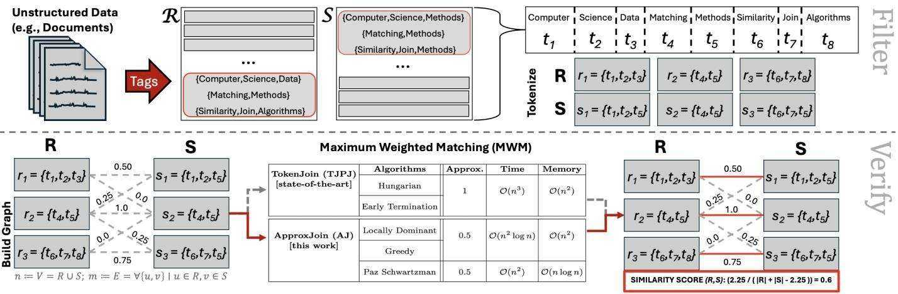
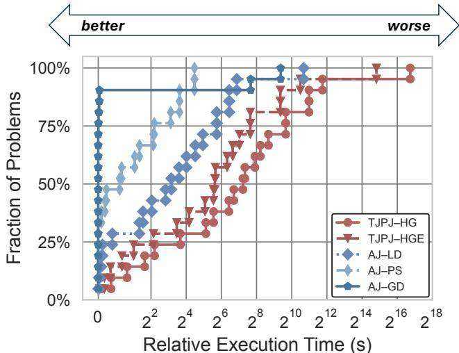
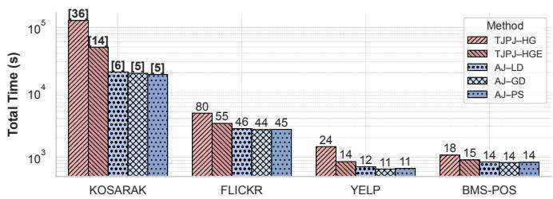
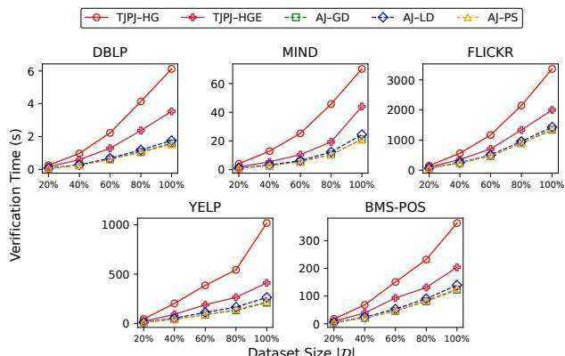
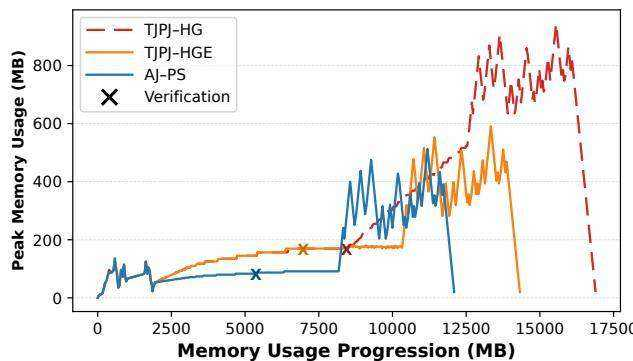

# Approximate Matching for Fuzzy Set Similarity

Michael Mandulak∗, S. M. Ferdous†, Sayan Ghosh†, Mahantesh Halappanavar†, George M. Slota∗

∗Rennssalaer Polytechnic Institute, Troy, NY, {mandum, slotag}@rpi.edu

†Pacific Northwest National Laboratory, Richland, WA, USA, {sm.ferdous, sayan.ghosh, mahantesh.halappanavar}@pnnl.gov

Abstract—Computing similarity between two sets is a fundamental building block for data management and analysis operations, such as search and join. Graph-based fuzzy set similarity approaches facilitate the integration of imprecise data, commonly encountered in real-world web processing, by representing elements of the sets as a bipartite graph and calculating the respective similarity scores using a Maximum Weighted Matching (MWM) algorithm. However, the usage of optimal MWM in fuzzy set similarity limits performance due to high computational and memory requirements. In this paper, we utilize more efficient approximate MWM methods aiming to improve the scalability of set similarity search. We introduce the approximate matching methods to compute fuzzy set similarity and integrate them into the set join workflow. Our evaluations on web data show performance improvements of $2{-}19\times$ relative to the state-of-the-art with high accuracy $(99\%$ recall) while consuming $23\%$ less memory on average.

# I. INTRODUCTION

Set similarity computations are a fundamental operation within data management and analysis, with extensive use cases in data science, data mining, and data management for tasks including data cleaning, entity resolution, and web-based data discovery [1], [2]. Two widely utilized operations that incorporate these computations are set similarity search and join, both of which aim to resolve similarity from a query set or a collection of sets, respectively. The most popular fuzzy token matching approaches for set similarity rely on the bipartite matching-based similarity scores [3]–[7], where a matching $M$ is a subset of edges in a bipartite graph such that no two edges in $M$ are incident on the same vertex (see Fig. 1). However, matching-based similarity is compute and resource intensive, with the matching requiring $O(n^3)$ time and $O(n^2)$ space for two $n$-element sets.

In this paper, we improve the scalability of the join operation by utilizing approximate weighted matching. We implement three representative approximate matching algorithms, integrate them with the state-of-the-art TOKEN-JOIN framework [6], and experiment on an extensive range of datasets. Our approximate matching-based join (APPROXJOIN) achieves $2{-}19\times$ performance improvements with high accuracy (0.99 recall) and consumes an average of $23\%$ less memory than TOKENJOIN. For example, with the KOSARAK dataset, the runtime decreases from 35 hours to 5 hours without compromising accuracy. To the best of our knowledge, this is the first work of its kind to apply approximate matching algorithms to fuzzy set similarity joins.

This work is supported by the National Science Foundation under Grant No. 2047821.

# II. PRELIMINARIES

Fuzzy Set Similarity Join: Our inputs are two collections of sets $\mathcal{R}$ and $\mathcal{S}$, a set similarity function $sim_{\phi}(R, S)$ (where $R \in \mathcal{R}$ and $S \in \mathcal{S}$), and a user-defined threshold $\delta$. Our goal is to compute all pairs of similar sets, which are defined as: $\mathcal{R} \bowtie_{\delta} \mathcal{S} = \{(R,S) \in \mathcal{R} \times \mathcal{S} \mid sim_{\phi}(R,S) \geq \delta\}$. A set $R \in \mathcal{R}$ contains elements $r \in R$, where each element can be composed of a set of tokens $t \in r$ that are designated as $q$-grams in string tokenization. In this work, we focus on the fuzzy set similarity problem to match set elements under noise, rather than the traditional definition that focuses on exact set overlap to compute $sim_{\phi}(R,S)$ (See Fig. 1). Most set similarity join approaches follow the filter-verify framework [8], where the filtering phase generates (possibly smaller) candidate pair sets, which are then verified to be included in the solution set if the similarity threshold is met. We are interested in the verification phase.

Given two sets $R$ and $S$, and a threshold $\delta$, we formulate a bipartite graph $G(V, E, w)$, $V = R \cup S$, between the elements $r \in R$ and $s \in S$ with edges weighted by a chosen similarity measure $\phi(r,s) \in [0,1]$. We primarily use Jaccard similarity (JAC) here, which is the ratio between set intersection and set union. We find a maximum weight bipartite matching $M$ on $G$ to compute a similarity score between the pair $(R, S)$. The total weight of the matching, $|R \tilde{\cap}_{\phi} S|$, is incorporated into set similarity between $R$ and $S$ as described in [6].

Bipartite Weighted Matching: A bipartite graph $G(V, E, w)$ is defined on a vertex set $V = R \cup S$, where $R$ and $S$ are the two disjoint parts. The edge set $E$ consists of sets $\{u,v\}$, where $u \in R$ and $v \in S$. $w: E \to \mathbb{R}_{\geq 0}$ is a non-negative weight function defined on the edges. In this work, we denote $n := |V|$, and $m := |E|$.

A matching $M$ in $G$ is a subset of $E$, where for each edge in $M$ is vertex disjoint, i.e, $e_i \cap e_j = \emptyset$, where $i \neq j$ and $e_i, e_j \in \mathcal{M}$. A perfect matching is a matching that covers all the vertices. Let $w(M)$ be the sum of weights of the edges in the matching, i.e., $w(M) = \sum_{e \in M} w(e)$. The maximum weight bipartite matching (MWM) is to find a matching $M_*$, whose $w(M_*)$ is the maximum among all possible matchings of $G$. The graphs generated from similarity joins are complete bipartite graphs, and the resultant maximum weighted matching is always perfect. For a constant $0 < \alpha < 1$, an approximate weighted matching $M_a$ is a matching whose weight is at least $\alpha$ fraction of maximum weight, i.e., $w(M_a) \geq \alpha \cdot w(M_*)$.

  
Fig. 1. Usage of matching within fuzzy set similarity join workflow: Text data, such as publication tags, are split into tokens and further into a bipartite graph with similarity-based weights. Maximum Weight Matching (MWM) is incorporated into the resultant fuzzy similarity score between sets $R$ and $S$.

# III. METHODOLOGY

Our primary contribution is the APPROXJOIN (AJ) method, which utilizes approximate maximum weight matching methods within set verification. We refer the reader to [6], detailing the TOKENJOIN methodology that we use for candidate generation and filtering (as directly adapted).

## A. Matching Algorithms

The state-of-the-art bipartite matching based fuzzy set join methods, such as [4], [6], employ a primal-dual based method [9] commonly referred to as the Hungarian (HG) algorithm. In this paper, we propose incorporating efficient approximate matching into the verification phase of the fuzzy set similarity workflow. We provide a brief description of the matching algorithms.

**Hungarian (HG) Method**: The Hungarian (Kuhn-Munkres) method [10] is a primal-dual algorithm for solving MWM problem optimally. We use the HG implementation provided in NetworkX [11] for empirical evaluations. An extension to this method (which we denote as HGE) incorporates early termination conditions for matching (which is not implemented using NetworkX). We use the upper bound and lower bound (UBLB) variation as provided by [6].

**Greedy (GD) Method**: The $\frac{1}{2}$-approximate greedy matching algorithm [12] starts with an empty matching and sorts the edges of the graph in descending order by weight, adding each non-conflicting edge into the matching in order.

**Locally Dominant (LD) Method**: The $\frac{1}{2}$-approximate Locally Dominant (Pointer Chasing) method from [13], focuses on finding locally dominant edges through mutually pointing neighbors based on highest weights.

**Paz and Schwartzman (PS) Method**: The state-of-the-art $\frac{1}{2+\varepsilon}$-approximate ($\varepsilon > 0$) semi-streaming algorithm due to Paz and Schwartzman [14] pushes edges onto a stack by comparing edge weights to those previously processed in the stream. The stack is then post-processed, committing stored edges to the matching while maintaining the matching constraint. We refer to [15], [16] for a more detailed explanation.

# IV. EVALUATIONS

We have extended the open-source Python codebase of a state-of-the-art implementation of fuzzy set similarity join (that uses optimal matching), TOKENJOIN [6]. Our code is available and provided, alongside more detailed descriptions of our theory and experiments. For our experiments, we use the TOKENJOIN methods for filtering with the Positional and Joint filters (TJPJ) using a similarity threshold of $\delta = 0.7$. All of our experiments are self joins on the respective dataset. In instances where $|\mathcal{R}| \neq 100\%$, a random sample at the given size is generated and used for all methods at that size. Our tests primarily focus on Jaccard similarity (JAC), but note similar trends to those depicted using Normalized Edit similarity (NEDS) [17]. Depicted execution times are averaged over several runs on the testbed platform.

Datasets: We experiment on 10 different datasets of web-based text data, whose characteristics are highlighted in Table I. Each token is generated by splitting words into $q$-grams ($q=3$) and substituting an integer for each $q$-gram.

TABLE I EXPERIMENTAL DATASETS AND THEIR CHARACTERISTICS.

| Datasets | Elements ∈ Set | #Sets | Avg Elements/Set | Max Elements/Set |
|----------|----------------|-------|------------------|------------------|
| LIVEJ | interests ∈ user | 3.1M | 36 | 300 |
| AOL | keywords ∈ search | 1.8M | 3 | 73 |
| KOSARAK | links ∈ user | 610K | 12 | 2.5K |
| ENRON | words ∈ email | 518K | 134 | 3.2K |
| DBLP | authors ∈ work | 500K | 13 | 189 |
| FLICKR | words ∈ photo | 500K | 9 | 361 |
| GDELT | topics ∈ article | 500K | 19 | 396 |
| BMS-POS | items ∈ sale | 320K | 6 | 164 |
| YELP | types ∈ business | 160K | 6 | 47 |
| MIND | words ∈ article | 123K | 32 | 357 |

Platforms: Our baseline results are collected using a single thread on a system with 2TB of DDR4 RAM and dual-socket NUMA AMD EPYC 7742 2.2GHz 64-core processors and 2 threads/core with Ubuntu version 20.04.4 LTS O/S. We use Python v3.12.9 and TJPJ–HG uses NetworkX v3.4.2.

Code: https://github.com/mmandulak1/sasimi

  
Fig. 2. A performance profile to summarize the execution time differences between APPROXJOIN methods compared to TOKENJOIN. Approximate methods consistently outperform the optimal.

## A. Baseline Performance

**1) Performance summary**: Fig. 2 shows the compiled relative performance of all of our test instances, relative to the best method as a difference of execution time. For each test instance, the best algorithm (i.e., the algorithm with the least execution time) is set to zero, and all others are offset from the best one. Approximate methods outperform the optimal methods in every instance. In general, we see the strongest performance results being competitive between AJ–PS and AJ–GD, with a slight performance advantage on average for AJ–PS despite AJ–GD having the best execution times in a majority of cases.

  
Fig. 3. JAC total execution time comparison per matching method, $|\mathcal{R}| = 100\%$. The [bold] annotations depict time in hours, while the rest depict time in minutes, rounded up to the nearest whole number.

**2) Execution time**: We show the total execution time of the fuzzy set similarity join workflow in Fig. 3. In every case, APPROXJOIN outperforms TJPJ–HG and TJPJ–HGE, with performance improvements being $3.78\times$ compared to TJPJ–HG and $2.18\times$ vs. TJPJ–HGE on average. Specifically, KOSARAK sees the highest improvements relative to TJPJ–HG: $6.5\times$ with AJ–GD, $6.2\times$ with AJ–LD and $6.7\times$ with AJ–PS, respectively. We attribute this to a high distribution of time spent within the verification phase (94% of the total time). In just verification times, we observe up to $19.1\times$ improvement on KOSARAK using AJ–PS and $4.8\times$ on FLICKR using AJ–GD. In actual execution times, this equates to a difference of more than a day's worth of computing (about 30 hours).

We observe about $2.2\times$ improvement in the (total) execution times across the datasets against TJPJ–HG. On the other hand, compared to TJPJ–HGE, there is a $2.5\times$ improvement for KOSARAK and an average $1.4\times$ improvement for the approximation methods on all datasets. Thus, we see a range of $1.4{-}6.7\times$ performance improvement with the approximate methods (AJ–LD, AJ–GD and AJ–PS) as compared to optimal TJPJ–HG and TJPJ–HGE on total execution time, with $2.0{-}19.1\times$ improvement to just verification time.

**3) Execution time scaling**: In Fig. 4, we perform scaling experiments on a subset of our datasets to assess the performance as the data sizes increase, taking random samples of each dataset at 20% size intervals. Across every instance,

  
Fig. 4. JAC verification execution time scaling per set size (lower is better). Average improvement of $3.4\times$ vs. TJPJ–HG and $1.8\times$ vs. TJPJ–HGE.

we observe improved scaling trends with reduced execution times for the approximation methods at each size interval. Best performance is achieved at 80%–100% for FLICKR, $4.9\times$ better performance using AJ–GD than TJPJ–HG, and $2.5\times$ using AJ–PS as compared to TJPJ–HGE. On average, the approximation methods shows $3.4\times$ improvement relative to TJPJ–HG and $1.8\times$ improvement against TJPJ–HGE. We see AJ–GD outperforming the rest in 16/25 instances, with AJ–PS exhibiting better performance for the remaining 9/25, with an average %-difference of 14%.

**4) Memory usage across program lifetime**: In Fig. 5, we compare the lifetime memory consumption of the optimal and approximate methods on an instance of $|\mathcal{R}| = 10\%$ for KOSARAK. We collect up to 500 distinct samples of instantaneous memory usage for TJPJ–HG, TJPJ–HGE and AJ–PS using the valgrind Massif heap profiling tool. Verification happens in the middle portion of the computation, where AJ–PS shows under 100MB of peak memory usage while TJPJ–HG/TJPJ–HGE can consume up to 40% extra memory in this phase. For KOSARAK (best performing dataset for the approximate methods), TJPJ–HG, TJPJ–HGE and AJ–PS depicts peak memory usage of 944MB, 591MB and 512MB, respectively; AJ–PS exhibits 14/45% better memory footprint. We attribute this to the integration of the streaming nature of AJ–PS within verification, allowing us to reduce graph storage.

  
Fig. 5. Memory usage progression during a run of TJPJ–HG/TJPJ–HGE and AJ–PS using KOSARAK $|\mathcal{R}| = 10\%$. Verification is marked by "X".

TABLE II ACCURACY ASSESSMENT SUBSET OF APPROXJOIN, $|\mathcal{D}| = 50\text{K}$; RECALL/PRECISION CLOSER OR EQUAL TO 1.0 IS IDEAL.

| Dataset | Recall GD | Recall PS | ΔSets GD | ΔSets PS | Precision GD | Precision PS | ΔSets GD | ΔSets PS |
|---------|-----------|-----------|----------|----------|--------------|--------------|----------|----------|
| LIVEJ | 1.0000 | 1.0000 | 0 | 0 | 0.9998 | 0.9999 | +2 | +1 |
| KOSARAK | 0.9999 | 0.9999 | -1 | -1 | 0.9999 | 0.9999 | +4 | +4 |
| ENRON | 0.9293 | 0.9757 | -4515 | -593 | 0.9871 | 0.9879 | +835 | +778 |
| FLICKR | 0.9994 | 0.9995 | -115 | -91 | 0.9994 | 0.9995 | +114 | +109 |
| GDELT | 0.9992 | 0.9996 | -937 | -481 | 0.9992 | 0.9993 | +843 | +806 |
| MIND | 0.9995 | 0.9999 | -38 | -8 | 0.9998 | 0.9998 | +14 | +13 |

## B. Approximate Matching Accuracy

We consider the optimal Hungarian method as our ground truth in assessing the accuracy of APPROXJOIN. Since both TJPJ–HG and TJPJ–HGE produce the same matching, their qualities are exactly similar. We utilize the resultant set sizes and compare to the ground truth, checking for discrepancies ($\Delta\#\text{Sets}$) to calculate recall and precision metrics. We define recall and precision relative to our ground truth based on standard true positives (TP), false positives (FP), and false negatives (FN) formulations. We exclude AJ–LD as results were similar to AJ–GD due to method similarity. In the first half of Table II, we report the results when using the approximate matching weights, which represent a lower bound on the optimal matching. In this case, the precision is always 1.0, since the APPROXJOIN produces a subset of the optimal joins. We conclude that the usage of approximate matching yields recall values $> 0.9$ across all instances, with all datasets having at least 0.99 recall besides ENRON (due to high dataset density and matching usage). AJ–PS shows the highest recalls among all methods, with a geometric mean recall of 0.9974.

In the second half of Table II, we used an upper bound derived from approximate matching algorithms and reported the corresponding precision results. AJ–GD and AJ–LD are half-approximate solutions, so simply doubling the matching weights provides an upper bound on the optimal weights. For the AJ–PS method, we use the sum of dual values from the primal-dual algorithm to get an upper bound (as detailed in [22]). In this case, the recall values were 1.0 since the APPROXJOIN results are a superset of the optimal results. The geometric means of the precision values are 0.9978 and 0.9980 for AJ–GD and AJ–PS, respectively.

# V. CONCLUDING REMARKS

In this paper, we devise APPROXJOIN, a fuzzy set similarity join method using approximate maximum weighted matching. We implement three approximate matching methods within candidate verification: the Greedy (AJ–GD), Locally-Dominant (AJ–LD) and Paz–Shwartzman (AJ–PS) methods, and comprehensively compare the execution time performance of our method to the current state-of-the-art, TOKENJOIN. Across a variety of sparse and dense datasets, APPROXJOIN outperforms both the optimal methods of TOKENJOIN by $2{-}19\times$ with high accuracy (0.99 recall on average) and reduced memory usage (23% on average).
