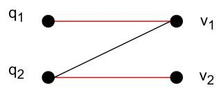
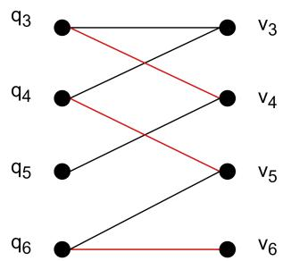
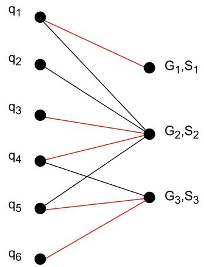
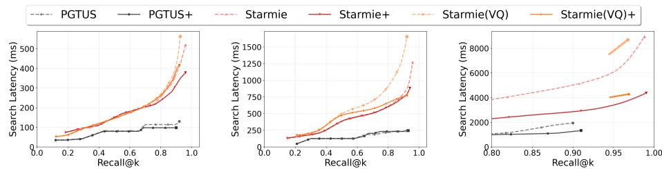
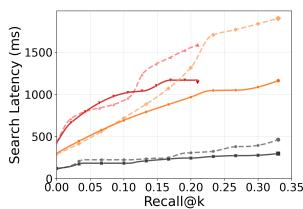
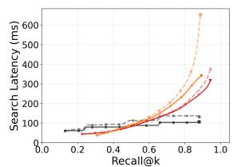
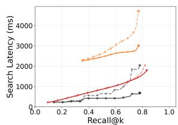
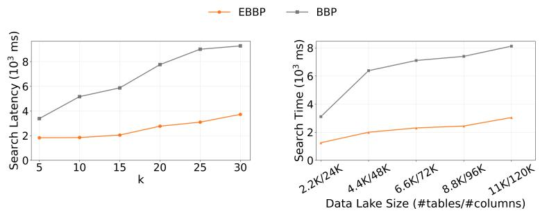
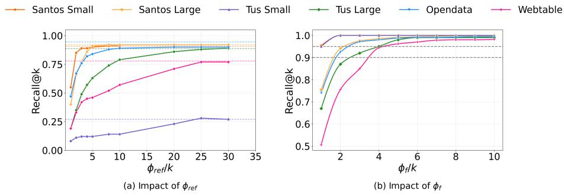

# An Efficient Proximity Graph-based Approach to Table Union Search

Yiming Xie $^ { 1 }$ , Hua Dai $\bot$ , Mingfeng Jiang1, Pengyue Li $^ 2$ , zhengkai Zhang1, and Bohan L $^ 3$

1 Nanjing University of Posts and Telecommunication, Nanjing, China {1224045602, daihua, 2024040413, 1024041138}@njupt.edu.cn   
2 Wuhan University, Wuhan, China pengyueli@whu.edu.cn   
3 Nanjing University of Aeronautics and Astronautics, Nanjing, China bhli@nuaa.edu.cn6

Abstract. Neural embedding models are extensively employed in the table union search problem, which aims to find semantically compatible tables that can be merged with a given query table. In particular, multi-vector models, which represent a table as a vector set (typically one vector per column), have been demonstrated to achieve superior retrieval quality by capturing fine-grained semantic alignments. However, this problem faces more severe efficiency challenges than the single-vector problem due to the inherent dependency on bipartite graph maximum matching to compute unionability scores. Therefore, this paper proposes an efficient Proximity Graph-based Table Union Search (PGTUS) approach. PGTUS employs a multi-stage pipeline that combines a novel refinement strategy, a filtering strategy based on many-to-one bipartite matching. Besides, we propose an enhanced pruning strategy to prune the candidate set, which further improve the search efficiency. Extensive experiments on six benchmark datasets demonstrate that our approach achieves 3.6-6.0× speedup over existing approaches while maintaining comparable recall rates.

Keywords: vector set retrieval · table search · bipartite matching.

# 1 Introduction

Virtually a significant portion of dataset search tasks emphasize table data [4, 14, 11], as it represents the predominant format for datasets in both web and enterprise environments, including web tables, spreadsheets, CSV files, and database relations. Table Union Search (TUS), retrieving tables that can be meaningfully unioned with a given query table (i.e., those that are compatible in schema and semantically aligned in content), is important for tasks like dataset augmentation and integration.

Recent approaches have transformed TUS into a vector set retrieval problem by representing tables as sets of vectors [8, 12, 9], where each vector corresponds

to a column in the table. This vectorized representation captures both structural and semantic information of tables, enabling more sophisticated similarity computations that go beyond simple keyword matching or schema alignment. The vector set retrieval problem has been extensively studied in recent years, and various approaches have been proposed [10, 7, 19, 3, 17]. These approaches focus on similarity metrics such as Chamfer distance and Hausdorff distance, which are widely applied in the document search domain. However, existing vector set retrieval methods cannot be applied to table union search, which requires a bipartite assignment between columns. Moreover, the approach proposed by Starmie [12] suffers from high search latency, which renders it impractical for web-scale data lakes with millions of tables.

Contributions. In this paper, we propose an efficient Proximity Graphbased approach to Table Union Search (PGTUS), which which reduces the latency of vector-set based table union search. Our key contributions include:

– We formulate the vector set-based table union search by converting each column of the table into a vector, and employ the maximum bipartite matching to measure the table unionability.   
– We propose PGTUS by designing a novel refinement and filtering strategy that incorporates many-to-one matching to filter out unpromising candidates.   
– We present an enhanced version of PGTUS called PGTUS+, which employs a dual-ended priority queue-based pruning strategy to reduce unnecessary computations.   
– We conduct extensive experiments on real-world datasets to evaluate the performance of PGTUS, demonstrating its effectiveness and efficiency compared to existing methods.

# 2 Related Work

The integration of table union search and vector set retrieval addresses key challenges in semantic data discovery and efficient similarity matching for large-scale datasets. This section reviews foundational and recent advancements in these areas, highlighting their synergies and limitations that motivate our approach.

Table Union Search. Early work on finding unionable tables used table clustering followed by simple syntactic measures such as the difference in column mean string length and cosine similarities to determine if two tables are unionable [4]. Santos [13] first use the semantic relationships between pairs of columns in a table to improve the accuracy of table union search. Pylon [5] and Starmie [12] leverages self-supervised contrastive learning to learn a semantic representation of tables, which is then used to find unionable tables.

Vector Set Retrieval. Vector set retrieval has gained attention with the rise of large-scale vector databases. Multi-vector retrieval models (e.g., ColBERT and its variants) [15, 20] encode images, documents, and other data types into dense vector representations, enabling efficient similarity search and retrieval.

Recently, advancements in multi-vector retrieval methods have focused on improving the efficiency and effectiveness of retrieval systems. DESSERT [10] first formalized the vector set retrieval problem in a rigorous theoretical framework and proposed a novel retrieval algorithm based on LSH [1]. PLAID engine [19] significantly reduces the retrieval latency of ColBERTv2 through innovative centroid interaction and centroid pruning mechanisms. MUVERA [7] reduces multivector similarity search to single-vector similarity search, which can be efficiently solved by existing single-vector search methods. IGP [3] introduces a novel incremental graph traversal technique to facilitate high quality candidate generation. However, the proposed methods often rely on Chamfer distance [2], which has limitations in terms of scalability, particularly the lack of theoretical support for maximum bipartite matching [16].

# 3 Table Unionability Model

Definition 1 (Table Repository). A table repository ${ D _ { T } = \{ T _ { 1 } , T _ { 2 } , \dots , T _ { n } \} }$ is a collection of tables, where each $T _ { i }$ is a table with $| T _ { i } |$ columns.

We represent each table as a set of column vectors generated by pretrained models, which capture both structural and semantic information of the columns.

Definition 2 (Vector Set Repository). Given a table repository $D _ { T }$ , we transform each table $T _ { i } ~ \in ~ D _ { T }$ into a vector set $V _ { i }$ consisting of $| T _ { i } |$ vectors, where each vector in $V _ { i }$ uniquely corresponds to each column in $T _ { i }$ . The resulting collection of these vector sets forms a vector set repository denoted as $D _ { E } = \{ V _ { 1 } , V _ { 2 } , \ldots , V _ { n } \}$ .

Definition 3 (t-Matching). Given two tables $T _ { i } , T _ { j } \in D _ { T }$ with their corresponding $V _ { i } , V _ { j } \in D _ { E }$ and a similarity threshold $\tau > 0$ , a $t$ -matching is a oneto-one mapping $h _ { a } : V _ { i } ^ { \prime } \to V _ { j } ^ { \prime }$ , where $| V _ { i } ^ { \prime } | = t$ , $V _ { i } ^ { \prime } \subseteq V _ { i }$ and $V _ { j } ^ { \prime } \subseteq V _ { j }$ , such that for each $v _ { p } \in V _ { i } ^ { \prime }$ , the pair $\left( v _ { p } , h _ { a } ( v _ { p } ) \right)$ satisfies $\langle v _ { p } , h _ { a } ( v _ { p } ) \rangle \geq \tau$ .

Definition 4 (Maximum t-Matching). Given two tables $T _ { i } , T _ { j } \in D _ { T }$ with their corresponding $V _ { i } , V _ { j } \in D _ { E }$ and a similarity threshold $\tau > 0 , a$ maximum $t$ matching is the mapping $h _ { a }$ that contains the largest possible number of matched pairs. There may be more than one maximum t-matching, and we denote all maximum $t$ -matchings from $V _ { i }$ to $V _ { j }$ under $\tau$ as $M _ { a } ( V _ { i } , V _ { j } , \tau )$ .

Definition 5 (Table Unionability). Given two tables $T _ { i } , T _ { j } \in D _ { T }$ with their corresponding $V _ { i } , V _ { j } \in D _ { E }$ . Let $h _ { a }$ be a maximum $t$ -matching over $V _ { i } ^ { \prime }$ . We can compute the table unionability between $T _ { i }$ and $T _ { j }$ . The table unionability between $T _ { i }$ and $T _ { j }$ is defined as $U ( V _ { i } , V _ { j } , \tau )$ ,

$$
U (V _ {i}, V _ {j}, \tau) = \max _ {h _ {a} \in M _ {a} (V _ {i}, V _ {j}, \tau)} \sum_ {v _ {p} \in V _ {i} ^ {\prime}} \langle v _ {p}, h _ {a} (v _ {p}) \rangle .
$$

Definition 6 (Table Union Search). Given a query table $T _ { Q }$ , a table repository $D _ { T }$ and a similarity threshold $\tau$ , the goal of table union search is to find the top-k tables in $D _ { T }$ that are most unionable with $T _ { Q }$ :

$$
\mathcal {S} = \arg \max  _ {T _ {*} ^ {*} \in D _ {T}} ^ {k} U (V _ {Q}, V _ {i} ^ {*}, \tau),
$$

where $V _ { Q }$ and $V _ { i } ^ { * }$ are the corresponding vector sets of $T _ { Q }$ and $T _ { i } ^ { * }$ , arg $\operatorname* { m a x } _ { T _ { i } ^ { * } \in D _ { T } } ^ { k }$ selects $k$ tables $T _ { i } ^ { * }$ maximum $U ( V _ { Q } , V _ { i } ^ { * } , \tau )$ and $T _ { k } ^ { * }$ has the $k$ -th largest table unionability from $T _ { Q }$ .

# 4 Proposed Approach

# 4.1 Clustering Based Matching

In the proposed approach, the table repository $D _ { T }$ is transformed into a vector set repository $D _ { E }$ , which incurs substantial memory overhead. To alleviate both the elevated computational demands of table unionability assessment and the associated storage challenges, we employ Vector Quantization (VQ) to compress $D _ { E }$ and introduce a clustering based matching algorithm, which partitions the constituent vectors into compact clusters, upon which the maximum matching algorithm is executed independently, thereby distributing the workload and enhancing scalability.

We first outline the partitioning procedure. Let $E = \{ v _ { p } \mid v _ { p } \in V _ { i } \land V _ { i } \in$ $D _ { E } \big \}$ denote the aggregate set of all constituent vectors across the vector sets ( in $K \ : = \ : n _ { c }$ $D _ { E }$ . Given a predefined number of clusters ) to $E$ , yielding a set of centroid vectors $n _ { c }$ , we apply $C _ { E } = \{ c _ { x } \} _ { x = 1 } ^ { n _ { c } }$ $K$ -means clustering . For each vector $v \in E$ , we assign it to its nearest centroid $\mu ( v ) \in C _ { E }$ based on Euclidean distance. We then construct an inverted index ${ \cal I } _ { v } = \{ ( c _ { x } , F ( c _ { x } ) ) | c _ { x } \in C _ { E } \}$ , where $F ( c _ { x } ) = \{ v \mid v \in E \land \mu ( v ) = c _ { x } \}$ maps each centroid to the subset of vectors it governs. Additionally, we build an index ${ \cal I } _ { w } = \{ ( i , W ( V _ { i } ) ) \mid V _ { i } \in { \cal D } _ { E } \}$ , where $W ( V _ { i } ) = \{ ( c _ { x } , N ) \}$ records, for each $V _ { i }$ , the size $N$ of the set of its vectors assigned to each associated centroid $c _ { x } \in L ( V _ { i } )$ .

Although the initial clustering greatly compresses the search space, empirical observations reveal uneven vector distributions across clusters in certain datasets that some vector sets $V _ { i }$ concentrate their vectors around a small number of centroids, whereas others disperse across many. To address this imbalance, we introduce a dispersion metric $\rho ( V _ { i } ) = | L ( V _ { i } ) | / | V _ { i } |$ , where $L ( V _ { i } ) = \{ \mu ( v _ { p } ) \mid v _ { p } \in V _ { i } \}$ captures the unique centroid vectors associated with $V _ { i }$ . We start by partitioning each $V _ { i }$ into singleton groups, where each group pairs a centroid $c _ { p } \in L ( V _ { i } )$ with the subset of vectors assigned to it. Given thresholds $\rho _ { l }$ and $\rho _ { h }$ , we adapt these groups based on $\rho ( V _ { i } )$ . For highly dispersed sets $\rho ( V _ { i } ) \ge \rho _ { h }$ ), we iteratively merge pairs of groups that maximize the group similarity $\mathrm { g s i m } ( G _ { p } , G _ { q } ) =$ $\begin{array} { r } { \operatorname* { m a x } _ { c _ { x } \in G _ { p } , c _ { y } \in G _ { q } } \left. c _ { x } , c _ { y } \right. } \end{array}$ until $\rho ( V _ { j } ) \le \rho _ { h }$ . For lowly dispersed sets $( \rho ( V _ { i } ) \leq \rho _ { l } )$ , we generate additional cascade centroids via K-means on $V _ { i }$ (collected as $C _ { R }$ ). This yields refined partitions $P _ { i } = \{ ( G _ { k } , S _ { k } ) \ | \ k \in [ 1 , m _ { i } ] \}$ for each $V _ { i }$ , where $G _ { k } \subseteq C _ { E } \cup C _ { R }$ is a non-empty centroid group and $S _ { k } \subseteq V _ { i }$ the assigned vectors

$\mathbf { A l g o r i t h m 1 \ } B u i l d P a r t i t i o n I n v e r t e d I n d e x ( D _ { E } , \rho _ { l } , \rho _ { h } )$   
Input: $DE$ : vector set repository, dispersion thresholds $\rho_{l}$ $\rho_{h}$ Output: $I_{p}$ : inverted index   
1: $I_{p}\gets \emptyset$ 2: for each $V_{i}\in D_{E}$ do   
3: $L(V_{i})\leftarrow \{\mu (v)\mid v\in V_{i}\}$ 4: $\rho (V_i)\gets |L(V_i)| / |V_i|$ 5: if $\rho (V_i)\leq \rho_l$ then   
6: Run K-means on $V_{i}$ to obtain cascade centroids $R$ 7: $P_{i}\gets \{(G_{k},S_{k})\mid G_{k} = \{r_{k}\} ,S_{k} = \{v\mid v\in V_{i}\wedge v$ is assigned to $r_k\} ,r_k\in CR\}$ 8: else if $\rho (V_i)\geq \rho_h$ then   
9: $P_{i}\gets \{(G_{k},S_{k})\mid G_{k} = \{c_{k}\} ,S_{k} = \{v_{p}\mid \mu (v_{p}) = c_{x}\wedge v_{p}\in V_{i}\} ,c_{x}\in L(V_{i})\}$ 10: while $\rho (V_i)\geq \rho_h$ do   
11: $(G_p,S_p),(G_q,S_q)\gets \max \{gsim(G_p,G_q)\mid (G_p,S_p),(G_q,S_q)\in P_i\}$ 12: $G_{\mathrm{m}}\gets G_p\cup G_q$ 13: $S_{\mathrm{m}}\gets S_p\cup S_q$ 14: Remove $(G_p,S_p)$ and $(G_q,S_q)$ from $P_{i}$ 15: Add $(G_{\mathrm{m}},S_{\mathrm{m}})$ to $P_{i}$ 16: $\rho (V_i)\gets |P_i| / |V_i|$ 17: end while   
18: else   
19: $P_{i}\gets \{(G_{k},S_{k})\mid G_{k} = \{c_{k}\} ,S_{k}\subseteq V_{i}$ assigned to $c_k,c_k\in L(V_i)\}$ 20: end if   
21: $I_p[i]\gets P_i$ 22: end for   
23: return $I_{p}$

(with $\boldsymbol { \mathrm { U } } \boldsymbol { S } _ { k } = \boldsymbol { V } _ { i }$ and disjoint $S _ { k }$ ), forming the index $I _ { p } = \{ ( i , P _ { i } ) \mid V _ { i } \in D _ { E } \}$ , as detailed in Algorithm 1.

Building upon the refined partitions of each vector set $V _ { i } \in D _ { E }$ , we seek to establish a many-to-one matching between elements of $V _ { Q }$ and $P _ { i }$ , where $V _ { Q }$ is the corresponding vector set of the query table $T _ { Q }$ and $P _ { i }$ is the partitions of $V _ { i }$ denoted by $I _ { p } [ i ]$ .

Definition 7 (Many-to-One t-Matching). Given a similarity threshold $\tau >$ $0$ , a many-to-one t-matching is a mapping $h _ { b } \colon V _ { Q } ^ { \prime } \to P _ { i } ^ { \prime }$ , where $| V _ { Q } ^ { \prime } | = t$ , $V _ { Q } ^ { \prime } \subseteq$ $V _ { Q }$ and $P _ { i } ^ { \prime } \subseteq P _ { i }$ , such that each vector in $V _ { Q } ^ { \prime }$ is matched at most once, and each partition $( G _ { k } , S _ { k } ) \in P _ { i } ^ { \prime }$ is matched at most $| S _ { k } |$ times.

Definition 8 (Maximum Many-to-One t-Matching). A maximum manyto-one t-matching is the mapping $h _ { b }$ that contains the largest possible number of matched pairs. There may be many maximum many-to-one t-matchings and we denote all maximum many-to-one t-matchings from $V _ { Q } \ \to \ P _ { i }$ under $\tau$ as $M _ { b } ( V _ { Q } , P _ { i } , \tau )$ .

Definition 9 (Maximum Weight Many-to-One t-Matching, MWMTO).

Let $h _ { b }$ be a maximum t-matching over $V _ { Q } ^ { \prime } = \{ v _ { 1 } , v _ { 2 } , . . . , v _ { c } \}$ and $h _ { b } ( v _ { q } ) = ( G _ { k } , S _ { k } )$

We can then define the maximum weight one-to-many t-matching. Given a similarity threshold $\tau > 0$ , the maximum weight many-to-one t-matching between $V _ { Q }$ and $P _ { i }$ is defined as

$$
M W M T O (V _ {Q}, P _ {i}, \tau) = \max _ {h _ {b} \in M _ {b} (V _ {Q}, P _ {i}, \tau)} \sum_ {v _ {q} \in V _ {Q} ^ {\prime}} s i m (v _ {q}, h _ {b} (v _ {q})),
$$

where $s i m ( v _ { q } , h _ { b } ( v _ { q } ) ) \stackrel { } { = } \operatorname* { m a x } _ { c _ { x } \in G _ { k } } \ \left. v _ { q } , c _ { x } \right.$ indicates the similarity between $v _ { q }$ and $G _ { k }$ composed of a set of vectors, and $\langle v _ { q } , c _ { x } \rangle$ is the inner product between vector $v _ { q }$ and $c _ { x }$ .

  
(a) One-to-One t-Matching

  
(b) Many-to-One t-Matching   
Fig. 1: Example for One-to-One and Many-to-One t-Matching.

Example 1. Fig. 1 presents a comparative illustration of one-to-one and manyto-one maximum matchings. Fig. 1a provides an example of table unionability, grounded in one-to-one maximum matching. In contrast, Fig. 1b depicts manyto-one maximum matching, where the target vector set $V _ { i }$ is divided into partitions $P _ { i } = \{ ( G _ { 1 } , S _ { 2 } ) , ( G _ { 2 } , S _ { 2 } ) , ( G _ { 3 } , S _ { 3 } ) \}$ (e.g., $G _ { 2 } = ( c _ { 2 } , c _ { 3 } )$ , $S _ { 2 } = v _ { 2 } , v _ { 3 } , v _ { 4 }$ ), and the MWMTO is highlighted in red.

The computational cost of MWMTO is substantially lower than that of full table unionability evaluation, which relies on computationally intensive one-toone matching algorithms such as the Hungarian algorithm. Consequently, we apply MWMTO between the query vector set $V _ { Q }$ and the partitions of each candidate vector set $V _ { i } \in D _ { E }$ to efficiently identify more promising candidates.

Algorithm 2 Ref inement(VQ, ϕc, ϕref )   
Input: Query vector set $V_{Q}$ , centroid probe size $\phi_c$ , result size $\phi_{ref}$ Output: Top- $\phi_{ref}$ vector sets $R$ 1: $H\gets$ Initialize a max-heap storing tuples of the form $(\langle c_j,v_q\rangle ,(c_j,v_q))$ , ordered by the first component in descending order   
2: $\varPhi_v,\varPhi_u,\varPhi_s\gets$ Initialize hash tables with the key type as vector set ID   
3: for each query vector $v_{q}\in V_{Q}$ do   
4: $C_{top}\gets$ Find top- $\phi_c$ nearest centroids from $G$ for $v_{q}$ 5: for each centroid $c_{j}\in C_{top}$ do   
6: Insert into $H$ the pair with priority $\langle c_j,v_q\rangle$ and payload $(c_j,v_q)$ 7: end for   
8: end for   
9: while $H$ is not empty do   
10: $(c_b,v_q)\gets$ Get the top entry with highest-score from $H$ 11: for V in $I_{v}[c_{b}]$ do   
12: $V_{i}\gets$ Find the vector set that contains v   
13: if i not in $\varPhi$ then   
14: $\varPhi_s[i].score\gets 0$ 15: Initialize $\varPhi_v[i][v_q]$ to false for each $v_{q}\in Q$ 16: end if   
17: if $\varPhi_v[i][v_q]=$ false then   
18: if $\varPhi_u[i][c_b]< I_w[i][c_b]$ then   
19: $\varPhi_u[i][c_b]\gets \varPhi_u[i][c_b] + 1$ 20: $\varPhi_s[i]\gets \varPhi_s[i] + \langle c_b,v_q\rangle$ 21: end if   
22: $\varPhi_v[i][v_q]\gets$ true   
23: end if   
24: end for   
25: end while   
26: return Top- $\phi_{ref}$ vector sets from $\varPhi_s$ sorted by score in descending order

# 4.2 Candidate Refinement

Although the MWMTO provides substantially lower computational cost than one-to-one matching, its complexity remains high for large-scale datasets, necessitating further optimization. Inspired by prior works [19, 12], which observed that only a small subset of centroids holds high relevance for any given query, we adopt an efficient refinement algorithm over the centroid space. Specifically, given a query table $T _ { Q }$ with its vector set $V _ { Q }$ and the set of centroid vectors $C _ { E }$ , we first construct a vector index $G$ (e.g., HNSW) on $C _ { E }$ . For each query vector in $V _ { Q }$ , we retrieve the top- $\phi _ { c }$ nearest centroids, forming an initial candidate set of associated vector subsets from $D _ { E }$ . To further prune low-relevance candidates, we then apply an incremental refinement strategy, yielding the top- $\phi _ { r e f }$ refined candidates for subsequent filtering.

This strategy enqueues high-similarity centroid-query pairs into a max-heap and iteratively aggregates approximate matching scores across candidate vector sets $V _ { i }$ , while enforcing per-centroid capacity constraints. To facilitate efficient

candidate pruning, three auxiliary hash tables $\phi _ { v }$ , $\phi _ { u }$ , and $\phi _ { s }$ are employed, all keyed by vector set IDs. For any candidate $V _ { i }$ , $\varPhi _ { v } [ i ] [ v _ { q } ]$ flags whether query vector $v _ { q }$ has processed $V _ { i }$ , $\varPhi _ { u } [ i ] [ c _ { b } ]$ monitors $V _ { i }$ ’s remaining capacity in cluster $c _ { b }$ and $\varPhi _ { s } \vert i \vert$ stores $V _ { i }$ ’s cumulative score. In the matching phase, the highest-scoring pair is iteratively extracted from the heap. For each associated candidate set, the procedure checks if the query vector is unvisited and capacity remains; if so, it updates the count and increments the score. The top- $\phi _ { r e f }$ candidates, ranked by accumulated scores, are returned, as detailed in Algorithm 2.

Algorithm 3 BoundsF orMW MT O(VQ, Vi, τ )   
Input: Vector set $V_{Q}$ , vector set $V_{i}\in D_{E}$ , threshold $\tau$ Output: Lower bound $LB$ , upper bound $UB$ 1: $P_{i}\gets I_{p}[i],lb\gets 0$ $ub\gets 0$ 2: $U\gets$ Initialize a list of length $|P_i|$ 3: for $(G_k,S_k)\in |P_i|$ do   
4: $U[k]\leftarrow |S_k|$ 5: end for   
6: $H\gets \phi$ 7: for each $v_{q}\in V_{Q}$ do   
8: $H_{q}\gets \emptyset$ 9: for each $(G_k,S_k)\in P_i$ do   
10: sim $\leftarrow \max_{c\in G_k}\langle v_q,c\rangle$ 11: if sim $\geq \tau$ then   
12: Insert (sim, k) into H   
13: end if   
14: end for   
15: Sort $H_{q}$ descending by similarity   
16: Insert all elements in $H_{q}$ to H   
17: for each $(s,k)$ in H do   
18: if $U[k] > 0$ then   
19: $lb\gets lb + s$ 20: $U[k]\gets U[k] - 1$ 21: break   
22: end if   
23: end for   
24: end for   
25: Sort $H$ descending by similarity;   
26: ub $\leftarrow$ sum of the first min(|VQ|,|Vi|) similarities in H   
27: return $lb,ub$

# 4.3 Candidate Filtering and Scoring

Following the refinement stage, which yields the top- $\phi _ { r e f }$ candidate vector sets, we apply MWOTM scoring to further distill the top- $\phi _ { r }$ most promising candidates. These are subsequently ranked according to their unionability scores,

derived from the clustering based matching. We extend the pruning strategy in Starmie [12] to MWMTO, enabling efficient pruning of unpromising candidate vector sets while guaranteeing the top- $\phi _ { r }$ results. Specifically, Algorithm 3 derives MWMTO bounds over $P _ { i }$ ’s partitions by assessing $\operatorname* { m a x } _ { c \in G _ { k } } \langle v _ { q } , c \rangle \geq \tau$ for each $v _ { q } \in V _ { Q }$ and $G _ { k }$ , gathering valid similarities into a global sorted pool $H$ . The lower bound greedily assigns each $v _ { q }$ to the highest-scoring partition with available capacity and accumulates these scores. The upper bound sums the top $\operatorname* { m i n } ( | V _ { Q } | , | V _ { i } | )$ similarities from $H$ to provide an optimistic estimate. In the final scoring phase, the bounds of table unionability are transformed into the sum of the lower bounds (upper bounds) for each partition of $V _ { i }$ and top- $k$ results are selected with the highest scores using the same pruning strategy.

In the final scoring phase, we aggregate the bounds of table unionability over partitions. The upper bound $U B _ { k } ( V _ { Q } , V _ { i } )$ greedily selects high-weight edges in descending order to estimate an overestimate of the maximum bipartite matching weight between node sets $V _ { Q }$ and $V _ { i }$ , aiming for full coverage under matching constraints, while the lower bound $L B _ { k } ( V _ { Q } , V _ { i } )$ employs a similar greedy approach to form a partial matching, yielding a conservative weight underestimate since it may not cover all nodes. These bounds are aggregated as LB = $\begin{array} { r } { L B = \sum _ { k = 1 } ^ { | P _ { i } | } L B _ { k } ( V _ { Q } , V _ { i } , \tau ) } \end{array}$ P|Pi|k=1 LBk(VQ, Vi, τ ) and U B = P|Pi|k=1 $\begin{array} { r } { U B = \sum _ { k = 1 } ^ { | P _ { i } | } U B _ { k } ( V _ { Q } , V _ { i } , \tau ) } \end{array}$ U Bk(VQ, Vi, τ ), from which we The aggregate score is select the top- $k$ results with the highest scores using the same pruning strategy. $\begin{array} { r } { S c o r e ( V _ { Q } , V _ { i } , \tau ) = \sum _ { k = 1 } ^ { | P _ { i } | } U ( V _ { Q } ^ { k } , S _ { k } , \tau ) } \end{array}$ .

$\mathbf { 4 l g o r i t h m 4 \ B a s e } P r u n e ( V _ { Q } , F , \tau , k )$   
Input: Query vector set $V_{Q}$ , the set of candidate vector sets $F$ , threshold $\tau$ , result size $k$ Output: Top- $k$ vector sets   
1: Initialize $H$ as min-heap to store top- $k$ items   
2: for each vector set $V_{c}\in F$ do   
3: if $|H| <   k$ then   
4: score $\leftarrow$ Compute Score(VQ,Vi,τ) and add Vi into H   
5: else   
6: if $LB(V_{Q},V_{i},\tau) > H.\mathrm{top().score~then}$ 7: score $\leftarrow$ U(Q,c,τ)   
8: Replace the top element of $H$ with $V_{c}$ 9: else if ub $\geq H$ .Top().score then   
10: score $\leftarrow$ U(Q,c,τ)   
11: if score $\rightharpoondown$ H.Top().score then   
12: Replace the top element of $H$ with $V_{c}$ 13: end if   
14: end if   
15: end if   
16: end for   
17: return Top- $k$ vector sets in $H$

# 5 PGTUS with Enhanced Pruning Strategy

Despite the multi-stage search processing and the pruning strategy proposed by Stamie filters out most candidates, PGTUS still needs to deal with a large number of candidates. Therefore, we propose PGTUS+, where we utilize the enhanced pruning strategy to filter out more unpromising candidates in the filtering and scoring stage.

Algorithm 5 EnhancedP rune(VQ, T , τ , ϕr)  
Input: Query vector set $V_{Q}$ , candidate set $T$ , similarity threshold $\tau$ , result size $\phi_r$ Output: Top- $\phi_r$ ranked candidates with matching scores. 1: Initialize DEPQs $P_{lb},P_{ub}$ for bound tracking 2: Initialize $H$ as min-heap to store top- $\phi_r$ items 3: for each vector set $V_{c}\in T$ do 4: $(lb,ub)\gets$ compute bounds for $V_{Q}$ and $V_{c}$ 5: if $|P_{lb}| <   \phi_r$ then 6: Insert $V_{c}$ to $P_{lb},P_{ub}$ 7: else 8: $V_{mlb},V_{mub}\gets P_{lb}.Min(),P_{ub}.Min()$ 9: if $ub <   V_{mub}.$ ub then 10: Discard candidate $V_{c}$ 11: else if $lb > V_{mlb}.lb$ then 12: Remove $V_{mub}$ from both $P_{lb}$ and $P_{ub}$ 13: Insert $V_{c}$ to $P_{lb},P_{ub}$ 14: else 15: while $|P_{ub}| > 0$ and $ub\geq V_{mlb}.lb$ and $lb\leq V_{mub}.$ ub do 16: $V\gets$ The item with maximum upper bound from $P_{ub}$ 17: Process $V$ as in BasePrune 18: Break if $|H|\geq \phi_r$ and $V_{c}.ub\leq H.Top().score$ 19: Remove $V$ from both queues 20: $V_{mlb},V_{mub}\gets P_{lb}.Min(),P_{ub}.Min()$ 21: end while 22: Insert $V_{c}$ to $P_{lb},P_{ub}$ 23: end if 24: end if 25: end for 26: Process remaining elements using BasePrune in descending order of upper bounds 27: return Top- $\phi_r$ candidates in $H$

Starmie’s pruning strategy eliminates most candidate items via bound-based filtering, as described in Algorithm 4. Despite its effectiveness, this method suffers from instability in pruning guarantees, particularly with unordered candidate sets, where performance can vary significantly. In the worst case, the min-heap $H$ must be repeatedly updated as candidates with disparate bound qualities arrive, incurring erratic computational costs and potentially undermining overall efficiency.

Motivated by these shortcomings, we propose an enhanced pruning strategy grounded in a fundamental theoretical observation. Consider a candidate set $F = \{ V _ { 1 } , V _ { 2 } , . . . , V _ { n } \}$ with associated lower bounds $\{ l b _ { i } \} _ { i = 1 } ^ { n }$ and upper bounds $\{ u b _ { i } \} _ { i = 1 } ^ { n }$ . For any $V _ { c } \in T$ , if at least $\phi _ { r }$ other candidates $V _ { j } \in T \setminus V _ { c }$ satisfy $l b _ { j } > u b _ { c }$ , then $V _ { c }$ cannot rank among the top- $\phi _ { r }$ highest-scoring items. Our approach maintains two double-ended priority queues (DEPQs), $P _ { l b }$ and $P _ { u b }$ , to track lower and upper bounds, respectively, alongside a min-heap $H$ for final scores. As detailed in Algorithm 5, for each candidate vector set $V _ { c }$ , we compute its lower and upper bounds relative to the query set $V _ { Q }$ (line 4). If $| P _ { l b } | < \phi _ { r }$ , $V _ { c }$ is inserted into both queues (lines 6–8). Otherwise, we extract the candidates with the minimum lower bound $\left( V _ { m l b } \right)$ and minimum upper bound $\left( V _ { m u b } \right)$ from $P _ { l b }$ and $P _ { u b }$ , respectively (line 9). A three-way decision then guides the process: (1) If $u b$ of $V _ { c }$ falls below the minimum upper bound in $P _ { u b }$ , discard $V _ { c }$ outright (lines 11–12); (2) If $^ { l b }$ of $V _ { c }$ exceeds the minimum lower bound in $P _ { l b }$ , replace $V _ { m u b }$ (the candidate with the weakest upper bound) with $V _ { c }$ in both queues (lines 13–15); (3) Otherwise, process candidates from $P _ { u b }$ in descending order of upper bounds until a resolution is reached (lines 17–27).

To efficiently support the bidirectional extreme-value retrieval operations required by our enhanced pruning strategy, we implement a DEPQ data structure. This DEPQ employs a dual-heap architecture, comprising a binary min-heap $P _ { l b }$ and a binary max-heap $P _ { u b }$ , augmented by a hash table to track element positions. In Algorithm 5, elements must be synchronously removed from both heaps. Extracting the maximum element from $P _ { u b }$ requires $O ( \log n )$ time, after which the corresponding element must also be removed from $P _ { l b }$ . However, removing an arbitrary element from $P _ { l b }$ first requires locating its position, which can be prohibitively expensive. To mitigate this, we introduce lazy deletion semantics via tombstone marking. Specifically, when an element requires removal from both heaps, we immediately execute the $O ( \log n )$ -time removal on the heap where its position is known (i.e., the root of $P _ { u b }$ ), while merely marking it as deleted in $P _ { l b }$ . The actual removal from $P _ { l b }$ is thus deferred until the element naturally percolates to the root during subsequent heap operations, thereby amortizing the removal cost across multiple extractions. This technique preserves $O ( \log n )$ -time complexity for both insertions and extractions, while enabling efficient synchronized deletions.

# 6 Experimental Evaluation

# 6.1 Settings

1)Datasets: We evaluate our method on six data lakes, and table 1 provides their statistics. Specially, the Canada, US, and UK Open Data dataset is originally designed for Table Join Search tasks, where most queries contain only single columns. To adapt it for our Table Union Search evaluation, we selected 1000 data tables with more than 15 columns as query tables, ensuring sufficient structural complexity for meaningful union operations.

Table 1: Statistics of the datasets used in experiments   

<table><tr><td rowspan="2">Dataset</td><td colspan="2">Data Lake Tables</td><td colspan="2">Query Tables</td></tr><tr><td>#Tables</td><td>#Columns</td><td>#Queries</td><td>#Avg Cols</td></tr><tr><td>Santos Small [13]</td><td>550</td><td>6322</td><td>50</td><td>12.30</td></tr><tr><td>Santos Large [13]</td><td>11086</td><td>121796</td><td>80</td><td>12.71</td></tr><tr><td>TUS Small [18]</td><td>1530</td><td>14810</td><td>10</td><td>34.5</td></tr><tr><td>TUS Large [18]</td><td>5043</td><td>55K</td><td>4293</td><td>11.85</td></tr><tr><td>Open Data [21]</td><td>13K</td><td>218K</td><td>1000</td><td>30.46</td></tr><tr><td>Lakebench Weibtable [6]</td><td>2.8M</td><td>14.8M</td><td>1000</td><td>14.57</td></tr></table>

2)Baselines: We compare our proposed method against Stamie, the state-ofthe-art method on table union search using HNSW index and Stamie (VQ), combining Starmie with vector quantization for vector compression and improved query speed. We also conduct experiments on Stamie+ and Starmie (VQ) $^ +$ which combines our proposed pruning strategy to enhance efficiency through effective pruning.   
3)Evaluation Metrics: We evaluate methods using Recall, Latency, and Memory consumption to capture both effectiveness and efficiency. Given a query table $T _ { q }$ , let $\mathcal { T } _ { q }$ denote the retrieved set, and let $\mathcal { T } _ { g }$ denote the set of ground-truth unionable tables. Recall is defined as $\begin{array} { r } { R e c a l l = \frac { | \mathcal { T } _ { g } \cap \mathcal { T } _ { q } | } { | \mathcal { T } _ { g } | } } \end{array}$ |Tg∩Tq||T | . Latency measures the average per-query processing time. For each method, we report the average Recall and Latency. Our ground truth $\mathcal { T } _ { g }$ is established using the Hungarian algorithm to compute exact table unionability scores for all tables in the repository.   
4)Parameter settings: For the top- $k$ table union search, we set $k = 5 0$ for WebTable, OpenData, $k = 2 0$ for Santos Large and $k = 1 0$ for Santos Small, TUS datasets. For candidate generation in Starmie, we tune $k ^ { \prime }$ in $\{ 1 k , 5 k , 1 0 k$ , $1 2 k$ , $1 5 k$ , $2 0 k$ , $2 5 k$ , 30k}. For centroid probe in Starmie(VQ) and PGTUS, we tune $\phi _ { c }$ in {1, 2, 4, 8, 16, 32, 64}. The filtering parameter $\phi _ { r }$ is uniformly set to $3 k$ across all datasets to maintain consistency in the filtering stage. For PGTUS, we tune the refinement parameter $\phi _ { r e f }$ in {k, 2k, 3k, 4k, 5k, 8k, $1 0 k$ , $2 0 k \}$ . The dimension of embedding generated by Starmie is 768. For HNSW index we set the number of neighbors of each node as 16 and efConstruction as 200.   
5)Implementation details: Our experiments were conducted on an Ubuntu system equipped with 32 vCPUs and 512GiB DDR4 RAM. Vector quantization components were implemented in C++ for optimal performance, while all other algorithms were implemented in Python. We utilized the HNSW index provided by Milvus vector database and reimplemented Starmie in Python for fair comparison. Our proposed approach employs Milvus vector database deployed via Docker for efficient vector storage and retrieval, and utilizes the K-means clustering algorithm from the FAISS library to perform vector clustering. The same environment and settings were used for all methods to ensure a fair comparison.

Table 2: Search latency evaluation of different pruning strategies (s)   

<table><tr><td rowspan="2">Method</td><td colspan="6">Average Search Latency (s)</td></tr><tr><td>Santos Small Santos</td><td>Large TUS</td><td>Small TUS</td><td>Large Open Data</td><td>Webtable</td><td></td></tr><tr><td>BF</td><td>5.6</td><td>104.2</td><td>61.1</td><td>121.1</td><td>37.8</td><td>4785</td></tr><tr><td>BBP</td><td>1.0</td><td>9.2</td><td>8.0</td><td>4.5</td><td>12.2</td><td>233</td></tr><tr><td>EBBP</td><td>0.4</td><td>3.0</td><td>1.6</td><td>0.9</td><td>6.7</td><td>176</td></tr><tr><td>Speedup (BF)</td><td>15.6×</td><td>35.3×</td><td>38.5×</td><td>134.6×</td><td>5.7×</td><td>27.2×</td></tr><tr><td>Speedup (BBP)</td><td>2.9×</td><td>3.1×</td><td>5.1×</td><td>4.9×</td><td>1.8×</td><td>1.3×</td></tr></table>

# 6.2 Performance Evaluation and Parameter Analysis

In this section, we first conduct a comprehensive performance evaluation of our proposed method against baselines across six datasets, demonstrating its efficiency. Subsequently, we perform an in-depth analysis of the impact of key parameters on the performance of our method, providing insights into optimal configurations for various scenarios.

# 1) Performance Evaluation :

Search Evaluation. Figure 2 shows the latency-recall performance evaluation across six datasets. We use grid search with PGTUS to explore the Pareto frontier. PGTUS offers 2X-4X speedup over Starmie at the same recall level, due to fewer candidates and faster ranking via partitioned computation. The enhanced pruning strategy becomes more effective with more candidates, outperforming Starmie’s strategy by reducing unnecessary computations, especially in large-scale scenarios. The effect is notable on OpenData, where high vector dispersion allows high recall with efficient computation from 1-2 clusters.

  
(a) Santos Small

  
(d) Tus Small

  
(e)Tus Large

  
(f) Webtable   
Fig. 2: Latency-recall performance evaluation across different datasets.

Pruning Strategy Evaluation. We systematically compare pruning strategies across all datasets via iterative processing, evaluating brute-force exhaustive search (BF) as a baseline, Starmie’s strategy (BBP), and our enhanced strategy (EBBP). For the brute-force baseline, we implement exhaustive candidate evaluation without any pruning optimization to establish the computational upper bound. Table 2 compares search latency across pruning strategies, demonstrating our method’s computational advantages while maintaining retrieval quality. Figure 3 further evaluates scalability on Santos Large, showing our pruning strategy consistently outperforms Starmie’s across varying $k$ (5-30) and data lake sizes (1K-11K tables). Our method reduces distance computations by 69% (53 vs. 169), demonstrating superior efficiency.

  
Fig. 3: Scalability on the Santos Large benchmark

# 2) Parameter Analysis:

Number of candidates $\phi _ { r e f }$ in refinement stage. Figure 4a presents the relationship between the refinement parameter $\phi _ { r e f }$ and recall performance across benchmark datasets, with $\phi _ { c }$ fixed at 1 for Open Data and 32 for others. The results demonstrate a consistent trend: recall improves monotonically with the $\phi _ { r e f } / k$ ratio, but with diminishing marginal returns beyond a dataset-specific threshold. The dashed lines represent Starmie(VQ) performance under identical configurations, providing a comparative baseline.

Number of candidates $\phi _ { r }$ in filtering stage. Figure 4b shows the impact of $\phi _ { r }$ on recall across datasets. We conducted iterative searches per dataset, ranking by OTMoM score and measuring recall at varying pool sizes. Recall rises with $\phi _ { r }$ , especially for small datasets, but gains diminish beyond $\phi _ { r } \approx 2 k$ , balancing precision against latency.

# 6.3 Index Construction Evaluation

Table 3 reports memory usage and construction time on the largest datasets: Open Data (13K tables, 218K columns) and Webtable (2.8M tables, 14.8M columns). Both PGTUS and Starmie (VQ) achieves a substantial reduction in memory footprint compared to Starmie, primarily through vector quantization.

  
Fig. 4: Impact of parameters $\phi _ { r e f }$ , $\phi _ { r }$ on recall performance.

Compared to Starmie (VQ), PGTUS additional stores the inverted index $I _ { p }$ recording vector set partitions.

Table 3: Index storage and construction time evaluation   

<table><tr><td rowspan="2">Method</td><td colspan="2">Open Data</td><td colspan="2">Weibtable</td></tr><tr><td>Storage</td><td>Time</td><td>Storage</td><td>Time</td></tr><tr><td>Starmie</td><td>1285.85 MB</td><td>5 m</td><td>98 GB</td><td>2.5 h</td></tr><tr><td>Starmie(VQ)</td><td>361.29 MB</td><td>12 s</td><td>21.8 GB</td><td>1 h</td></tr><tr><td>PGTUS</td><td>413.71 MB</td><td>35 s</td><td>30.6 GB</td><td>2 h</td></tr></table>

# 7 Conclusion

In this paper, we proposed an efficient proximity graph-based approach to table union search. We introduced PGTUS and PGTUS+, composed of refinement and filtering strategies effectively prunes unpromising candidates, reducing computational overhead. Our dual-ended priority queue-based pruning strategy effectively filter out unpromising candidates, which reduces computational overhead. Empirical validation across six benchmarks show that the proposed approaches achieve 3.6-6.0x speedups over existing approaches.

# References

1. Andoni, A., Indyk, P., Laarhoven, T., Razenshteyn, I.P., Schmidt, L.: Practical and optimal LSH for angular distance. In: Advances in Neural Information Processing Systems 28: Annual Conference on Neural Information Processing Systems. pp. 1225–1233 (2015)

2. Bakshi, A., Indyk, P., Jayaram, R., Silwal, S., Waingarten, E.: Near-linear time algorithm for the chamfer distance. In: Advances in Neural Information Processing Systems 36: Annual Conference on Neural Information Processing Systems, NeurIPS (2023)   
3. Bian, Z., Yiu, M.L., Tang, B.: IGP: efficient multi-vector retrieval via proximity graph index. In: Proceedings of the 48th International ACM Conference on Research and Development in Information Retrieval, SIGIR. pp. 2524–2533 (2025)   
4. Cafarella, M.J., Halevy, A.Y., Khoussainova, N.: Data integration for the relational web. Proc. VLDB Endow. 2(1), 1090–1101 (2009)   
5. Cong, T., Nargesian, F., Jagadish, H.V.: Pylon: Semantic table union search in data lakes. CoRR abs/2301.04901 (2023)   
6. Deng, Y., Chai, C., Cao, L., Yuan, Q., Chen, S., Yu, Y., Sun, Z., Wang, J., Li, J., Cao, Z., Jin, K., Zhang, C., Jiang, Y., Zhang, Y., Wang, Y., Yuan, Y., Wang, G., Tang, N.: Lakebench: A benchmark for discovering joinable and unionable tables in data lakes. Proc. VLDB Endow. 17(8), 1925–1938 (2024)   
7. Dhulipala, L., Hadian, M., Jayaram, R., Lee, J., Mirrokni, V.: Muvera: Multivector retrieval via fixed dimensional encoding. In: Advances in Neural Information Processing Systems. vol. 37, pp. 101042–101073 (2024)   
8. Dong, Y., Takeoka, K., Xiao, C., Oyamada, M.: Efficient joinable table discovery in data lakes: A high-dimensional similarity-based approach. In: 37th IEEE International Conference on Data Engineering, ICDE. pp. 456–467 (2021)   
9. Dong, Y., Xiao, C., Nozawa, T., Enomoto, M., Oyamada, M.: Deepjoin: Joinable table discovery with pre-trained language models. Proc. VLDB Endow. 16(10), 2458–2470 (2023)   
10. Engels, J., Coleman, B., Lakshman, V., Shrivastava, A.: DESSERT: an efficient algorithm for vector set search with vector set queries. In: Advances in Neural Information Processing Systems 36: Annual Conference on Neural Information Processing Systems 2023, NeurIPS (2023)   
11. Fan, G., Shraga, R., Miller, R.J.: Gen-t: Table reclamation in data lakes. CoRR abs/2403.14128 (2024)   
12. Fan, G., Wang, J., Li, Y., Zhang, D., Miller, R.J.: Semantics-aware dataset discovery from data lakes with contextualized column-based representation learning. Proc. VLDB Endow. 16(7), 1726–1739 (2023)   
13. Khatiwada, A., Fan, G., Shraga, R., Chen, Z., Gatterbauer, W., Miller, R.J., Riedewald, M.: SANTOS: relationship-based semantic table union search. CoRR abs/2209.13589 (2022)   
14. Khatiwada, A., Shraga, R., Gatterbauer, W., Miller, R.J.: Integrating data lake tables. Proc. VLDB Endow. 16(4), 932–945 (2022)   
15. Khattab, O., Zaharia, M.: Colbert: Efficient and effective passage search via contextualized late interaction over BERT. In: Proceedings of the 43rd International ACM conference on research and development in Information Retrieval, SIGIR. pp. 39–48 (2020)   
16. Kuhn, H.W.: The Hungarian method for the assignment problem, vol. 2, pp. 83–97. Wiley Online Library (1955)   
17. Li, Y., Wang, S., Chen, Z., Chen, S., Peng, Z.: Approximate vector set search: A bio-inspired approach for high-dimensional spaces. CoRR abs/2412.03301 (2024)   
18. Nargesian, F., Zhu, E., Pu, K.Q., Miller, R.J.: Table union search on open data. Proc. VLDB Endow. 11(7), 813–825 (2018)   
19. Santhanam, K., Khattab, O., Potts, C., Zaharia, M.: PLAID: an efficient engine for late interaction retrieval. In: Proceedings of the 31st ACM International Conference on Information & Knowledge Management. pp. 1747–1756 (2022)

20. Santhanam, K., Khattab, O., Saad-Falcon, J., Potts, C., Zaharia, M.: Colbertv2: Effective and efficient retrieval via lightweight late interaction. In: Proceedings of the 2022 Conference of the North American Chapter of the Association for Computational Linguistics: Human Language Technologies, NAACL. pp. 3715– 3734 (2022)   
21. Zhu, E., Deng, D., Nargesian, F., Miller, R.J.: JOSIE: overlap set similarity search for finding joinable tables in data lakes. In: Proceedings of the 2019 International Conference on Management of Data, SIGMOD. pp. 847–864 (2019)