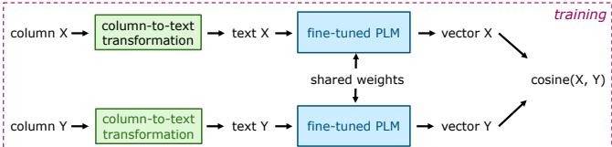
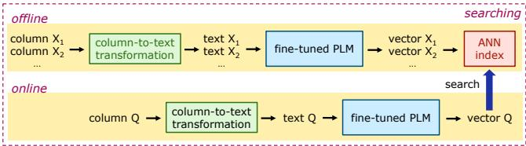
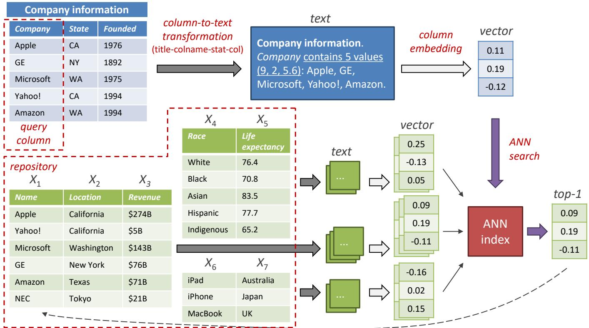

# DeepJoin: Joinable Table Discovery with Pre-trained Language Models

Yuyang Dong

NEC Corporation

dongyuyang@nec.com

Chuan Xiao

Osaka University

Nagoya University

chuanx@ist.osaka-u.ac.jp

Takuma Nozawa

NEC Corporation

nozawa-takuma@nec.com

Masafumi Enomoto

NEC Corporation

masafumi-enomoto@nec.com

Masafumi Oyamada

NEC Corporation

oyamada@nec.com

# ABSTRACT

Due to the usefulness in data enrichment for data analysis tasks, joinable table discovery has become an important operation in data lake management. Existing approaches target equi-joins, the most common way of combining tables for creating a unified view, or semantic joins, which tolerate misspellings and different formats to deliver more join results. They are either exact solutions whose running time is linear in the sizes of query column and target table repository, or approximate solutions lacking precision. In this paper, we propose DeepJoin, a deep learning model for accurate and efficient joinable table discovery. Our solution is an embeddingbased retrieval, which employs a pre-trained language model (PLM) and is designed as one framework serving both equi- and semantic (with a similarity condition on word embeddings) joins for textual attributes with fairly small cardinalities. We propose a set of contextualization options to transform column contents to a text sequence. The PLM reads the sequence and is fine-tuned to embed columns to vectors such that columns are expected to be joinable if they are close to each other in the vector space. Since the output of the PLM is fixed in length, the subsequent search procedure becomes independent of the column size. With a state-of-the-art approximate nearest neighbor search algorithm, the search time is sublinear in the repository size. To train the model, we devise the techniques for preparing training data as well as data augmentation. The experiments on real datasets demonstrate that by training on a small subset of a corpus, DeepJoin generalizes to large datasets and its precision consistently outperforms other approximate solutions’. DeepJoin is even more accurate than an exact solution to semantic joins when evaluated with labels from experts. Moreover, when equipped with a GPU, DeepJoin is up to two orders of magnitude faster than existing solutions.

# 1 INTRODUCTION

Given a table repository and a query table with a specified join column, joinable table discovery finds the target tables that can be joined with the query. Due to the demonstrated usefulness in data enrichment [10, 16], joinable table discovery has become a key procedure in data lake management and serves various downstream applications, especially those involving data analysis.

For joinable table discovery, early attempts mainly targeted equijoins [64, 66], which are the most common way of combining tables for creating a unified view [15] and can be easily implemented using SQL. To deliver more joins results for heterogeneous data, recent

approaches [16, 17] studied semantic joins, which join on cells with similar meanings via word embedding, so as to handle data with misspellings and discrepancy in formats/terminologies (e.g., “American Indian & Alaska Native” v.s. “Mainland Indigenous”). There are two major limitations in these solutions. First, they only apply to a single join type. Second, most of them are exact algorithms with a worst-case time complexity linear in the product of query column size and table repository size, and thus their scalability is dubious. Despite the existence of an approximate algorithm for equijoins [66], it is based on MinHash sketches [6] and has to convert the joinability condition to a Jaccard similarity condition, which is non-equivalent and introduces many false positives. Moreover, it is sometimes even slower than an exact algorithm [64].

Seeing the limitations of existing solutions, we propose Deep-Join, a deep learning model designed in a two-birds-with-one-stone fashion such that both equi- and semantic joins can be served with one framework. In particular, DeepJoin targets textual attributes with fairly small cardinalities that can fit with language models. To cope with semantic joins, it works on a similarity condition of word embeddings and finds similar textual columns as exactly as possible. To resolve the efficiency issue, it finds joinable tables via an embedding-based retrieval. In particular, we employ an embedding model to transform columns to a vector space. By metric learning, columns with high joinability are close to each other in the vector space. Then, to find the top- $\mathbf { \nabla } \cdot k$ target columns ranked by joinability, we resort to a state-of-the-art approximate nearest neighbor search (ANNS) algorithm [38], whose time complexity is sublinear in the table repository size.

DeepJoin utilizes a pre-trained language model (PLM) for column embedding. PLMs, such as BERT [14], have gained popularity in various data management tasks that involve natural language processing. A salient property of modern PLMs is that they are transformer networks [55] featuring the attention mechanism, thus not only good at capturing the semantics of column contents for semantic joins, but also able to focus on the cells that are more probable to match in equi-joins, assuming that the query column has a similar distribution to those in the repository. As such, our model gains the capability of handling both join types, only needing the PLM to be fine-tuned on the data labeled for either equi- or semantic joins. In addition, PLMs produce a fixed-length vector, meaning that the following index lookup and search are independent of the column size, hence along with the ANNS, addressing

the scalability issue in existing solutions. Since PLMs take a text sequence as input, by prompt engineering, we propose a set of options that contextualizes a column to a text sequence. To train the model in a self-supervised manner, we devise a series of techniques to effectively generate positive and negative examples. Moreover, our training features a data augmentation technique, through which our model can learn that the joinability is insensitive to the order of cells in a column.

We conduct experiments on two real datasets and evaluate Deep-Join equipped with two state-of-the-art PLMs. We show that by training on a small subset (30k columns) of the corpus, DeepJoin generalizes well to large datasets (1M columns). In particular, Deep-Join outperforms alternative approximate solutions in all the settings, and reports an average precision of $7 2 \%$ for equi-joins and $9 1 \%$ for semantic joins and an average NDCG of $8 1 \%$ for equi-joins and $7 5 \%$ for semantic joins. To test the effectiveness of semantic joins, we also evaluate DeepJoin using data labeled by our database researchers, and the results show that DeepJoin is even better by a margin of $0 . 1 0 5 \mathrm { ~ - ~ } 0 . 1 6 5 ~ \mathrm { F } 1$ score than PEXESO [17], an exact solution we use to label DeepJoin’s training data. An ablation study demonstrates the usefulness of the proposed contextualization and data augmentation techniques. For scalability test, we vary dataset size from 1M to 5M columns. Even if equipped with a CPU, DeepJoin exhibits superb scalability and is 7 – 57 times faster than existing solutions. With the help of a GPU, DeepJoin outperforms them by up to two orders of magnitude.

Contributions. (1) We propose DeepJoin, a framework for joinable search discovery in a data lake. Our solution targets targets textual attributes with fairly small cardinalities, and is able to detect both equi-joinable and semantically joinable tables. (2) We design the search in DeepJoin as an embedding-based retrieval which employs a fine-tuned PLM for column embedding and ANNS for fast retrieval. The search time complexity is sublinear in the table repository size, and except the column embedding, the search time is independent of the column size. (3) We propose a prompt engineering method to transform column contents to a text sequence fed to the PLM. (4) We devise techniques for training data preparation and data augmentation, as well as a metric learning method to fine-tune the PLM in a self-supervised manner. (5) We conduct experiments to show that our model generalizes well to large datasets and it is accurate and scalable in finding joinable tables.

Furthermore, we would like to mention the following facts: (1) For the embedding-based retrieval in our model, the results of ANNS are directly output as the results of joinable table discovery, whereas more advanced paradigms exist, such as two-stage retrieval [11] which finds a set of candidates by ANNS and ranks the candidates by a more sophisticated model. (2) DeepJoin is not limited to the two PLMs evaluated in our experiments, because the PLM can be regarded as a plug-in in our framework. As such, we expect the performance of DeepJoin can be further improved by using more advanced retrieval paradigms or PLMs.

# 2 PRELIMINARIES

# 2.1 Problem Definition

Given a data lake of tables, we extract all the columns in these tables, except those unlikely to appear in a join predicate (e.g., BLOBs), and

create a repository of tables, denoted by $\chi$ . Given a query column ??, our task is to search $\chi$ and find the columns joinable to ??. In this paper, we target equi-joins and semantic joins. Next, we define the joinability for these two types, respectively.

Given a query column $Q$ and a target column $X$ in $\chi$ , the joinability from $Q$ to $X$ is defined by the following equation.

$$
j n (Q, X) = \frac {\left| Q _ {M} \right|}{\left| Q \right|}, \tag {1}
$$

where $| \cdot |$ measures the size (i.e., the number of cells) of a column, and $Q _ { M }$ is composed of the cells in $Q$ that have at least one match in $X$ . Here, the term “match” depends on the join type, i.e., an equijoin or a semantic join. We normalize the size of $Q _ { M }$ by the size of ?? to return a value between 0 and 1. Moreover, the joinability is not always symmetric, depending on the definition of $Q _ { M }$ .

For equi-joins, we model each column as a set of cells by removing duplicate cell values, and define the equi-joinability as follows.

Definition 2.1 (Equi-Joinability). The equi-joinability from the query column $Q$ to a target column $X$ in $\chi$ counts the intersection between $Q$ and $X$ , normalized by the size of $Q$ ; i.e., in Equation 1,

$$
Q _ {M} = Q \cap X. \tag {2}
$$

The equi-joinability defined above counts the the distinct number of cells in $Q$ that match those in $X$ , and thus can be used to measure the equi-joinability [64]. Our method can be also extended to the case when columns are modeled as multisets, so as to support one-to-many, many-to-one, and many-to-many joins. In this case, we may measure the joinability by the number of join results and normalize it by the product of $| Q |$ and $| X |$ , instead of $| Q |$ in Equation 1.

For semantic joins, we consider string columns and embed the value of each cell to a metric space $_ \textmd { ‰}$ (e.g., word embedding by fastText [19]). As such, each string column is transformed to a multiset of vectors. We abuse the notation of a column to denote its multiset of vectors. Then, the notion of vector matching is defined as follows.

Definition 2.2 (Vector Matching). Given two vectors $v _ { 1 }$ and $v _ { 2 }$ in $_ \mathrm { c } { } _ { V }$ , a distance function $d$ , and a threshold ??, ??1 matches $v _ { 2 }$ if and only if the distance between $v _ { 1 }$ and $v _ { 2 }$ does not exceed $\tau$ . We use notation $M _ { \tau } ^ { d } ( v _ { 1 } , v _ { 2 } )$ to denote if $v _ { 1 }$ matches $v _ { 2 }$ ; i.e., $M _ { \tau } ^ { d } ( v _ { 1 } , v _ { 2 } ) = 1$ iff. $d ( v _ { 1 } , v _ { 2 } ) \leq \tau$ , or 0, otherwise.

Given a query column $Q$ and a target column $X$ , the semanticjoinability is defined using the number of matching vectors .

Definition 2.3 (Semantic-Joinability). The semantic-joinability from $Q$ to $X$ counts the number of vectors in $Q$ having at least one matching vector in $X$ , normalized by the size of $Q$ ; i.e., in Equation 1,

$$
Q _ {M} = \{q \mid q \in Q \wedge \exists x \in X \text {s . t .} M _ {\tau} ^ {d} (q, x) = 1 \}. \tag {3}
$$

An advantage of the above definitions is that for both equi- and semantic-joinability, the training data can be labeled by an exact algorithm (e.g., JOSIE [64] and PEXESO [17]) rather than experts, so that our model can be trained in a self-supervised manner. Following the above definitions, we model the problem of joinable table

discovery as the following top- $\boldsymbol { \cdot } \boldsymbol { k }$ search problem, where joinability $j n$ is defined using either Definition 2.1 or 2.3.

Problem 1 (Joinable Table Discovery). Given a query column ?? and a repository of target columns $\chi$ , the joinable table discovery problem is to find the top- $\boldsymbol { \cdot } \boldsymbol { k }$ columns in $\chi$ with the highest joinability from ??. Formally, we find a subset ${ \mathcal { R } } \subseteq { \mathcal { X } } , | { \mathcal { R } } | = k$ ${ \mathcal { R } } \subseteq { \mathcal { X } }$ , and $\operatorname* { m i n } \{ j n ( Q , X ) \mid X \in { \mathcal { R } } ) \} \geq j n ( Q , Y ) , \forall Y \in X \backslash { \mathcal { R } } .$

In this paper, we focus on dealing with textual columns. For numerical columns, a typical solution is utilizing the statistical feature vector in Sherlock [28], which converts a numerical column to a vector, and then we can invoke a vector search to look for joinable columns having similar statistics to the query column.

# 2.2 State-of-the-Art

JOSIE [64], a state-of-the-art solution to the equi-joinable table discovery problem, regards the problem as a top- $k$ set similarity search with overlap $| Q \cap X |$ as similarity function, and builds its search algorithm upon prefix filter [7] and positional filter [59], which have been extensively used for solving set similarity queries. JOSIE creates an inverted index over $\chi$ , which regards each cell value as a token and maps each token to a postings list of columns having the token. Then, it finds a set of candidate columns by retrieving the postings lists for a subset of the tokens in $Q$ (called prefix). Candidates are verified for joinability and the top- $\mathbf { \nabla } \cdot k$ is updated. While index access and candidate verification are processed in an alternate manner, JOSIE features the techniques to determine the their order, so as to optimize for long columns and large token universes, which are often observed in data lakes.

PEXESO [17] is an exact solution to semantic-joinable table discovery. It employs pivot-based filtering [8], which selects a set of vectors as pivots and pre-computes distances to these pivots for all the vecotrs in the columns of $\chi$ . Then, given the vectors of the query ??, non-matching vectors can be pruned by the triangle inequality. A hierarchical grid index is built to filter non-joinable columns when counting the number of matching vectors.

As for the weakness, JOSIE inherits the limitation of prefix filter, whose performance highly depends on the data distribution and yields a worst-case time complexity of $O ( | X | \cdot ( | Q | + \overline { { | X | } } ) )$ ), where $\overline { { | X | } }$ stands for the average size of the columns in $\chi$ . For PEXESO, despite a claimed sublinear search time complexity of $O ( \log | X _ { V } | \cdot \log | Q | )$ , where $\chi _ { V }$ denotes the multiset of all the vectors in the repository, it relies on a user-specific threshold for the count of matching vectors. This does not apply to the top- $\boldsymbol { \cdot } \boldsymbol { k }$ case, and the algorithm is downgraded to be linear in $| \boldsymbol { \chi } _ { V } | \cdot | \boldsymbol { Q } |$ , because at the early stage of search, due to the low count of matching vectors in the temporary top- $k$ results, the pruning power of the grid index is next to none. In general, for search time, both JOSIE and PEXESO are linear in the product of column size and repository size, which compromises their scalability to long columns and large datasets. On the other hand, it is unnecessary to always find an exact answer, because data scientists are usually concerned with only part of the top- $k$ results and will choose a subset of them for the join. For this reason, we will design our solution with the following two goals: (A) it returns an approximate answer with sublinear time in $| \chi |$ , and (B) by encoding the query column to a fixed length, it is independent of $| Q |$ and $\overline { { | X | } }$ during index lookup and search.

  
Figure 1: Overview of the DeepJoin model.

Table 1: Column-to-text transformation options.   

<table><tr><td>Name</td><td>Pattern</td></tr><tr><td>col</td><td>$cell_1$, $cell_2$, ..., $cell_n$</td></tr><tr><td>colname-col</td><td>$column_name$: $col$.</td></tr><tr><td>colname-col-context</td><td>$colname-col$: $col$. $table_context$</td></tr><tr><td>colname-stat-col</td><td>$column_name$ contains $n$ values ($max_len$, $min_len$, $avg_len$): $col$</td></tr><tr><td>title-colname-col</td><td>$table_title$. $colname-col$</td></tr><tr><td>title-colname-col-context</td><td>$title-colname-col$. $table_context$</td></tr><tr><td>title-colname-stat-col</td><td>$table_title$. $colname-stat-col$.</td></tr></table>

Apart from exact solutions, LSH Ensemble [66] is an approximate solution to equi-joinability. It partitions the repository and computes MinHash sketches [6] with parameters tuned for each partition. Unlike JOSIE, it targets the thresholded problem (i.e., ${ \hat { | } } { \frac { Q \cap X | } { | Q | } } \geq t )$ , which requires a user-specified threshold ?? and thus is less flexible than computing top- $k$ . Although adaptation for the top- $\mathbf { \nabla } \cdot k$ problem is available, it suffers from low precision due to the many false positives introduced by transforming overlap similarity to Jaccard similarity for the use of MinHash, and it sometimes runs even slower than JOSIE [64].

# 3 THE DEEPJOIN MODEL

Figure 1 illustrates the overview of our DeepJoin model. In Deep-Join, the joinable table discovery is essentially an embedding-based retrieval, which has recently been adopted in various retrieval tasks, such as long text retrieval [33] and search in social networks [27]. An embedding-based retrieval usually employs metric learning or meta embedding search to learn embeddings for target data such that the semantics can be measured in the embedding space, especially when target data are highly sparse or the semantics is hard to define by an analytical model. Another key benefit is, by embedding original data objects (i.e., columns) to a fixed-length vector, the subsequent procedure can be independent of the size of the data object, thereby achieving goal (B) stated in Section 2.2.

Since semantic joins are also in our scope, an immediate idea is employing a PLM to capture the semantics. By unsupervised training for language prediction tasks on a large text corpora such as Wikipedia pages, PLMs are able to embed texts to a vector space such that texts are expected to be similar in meaning if they are closer in the vector space. A key advantage of PLMs is that they are deep models that can be tailored to downstream tasks (e.g.,

  
Figure 2: A running example of DeepJoin over a repository of 7 columns, $k = 1$ .

data preparation [54], entity matching [37], and column annotation [52]) by fine-tuning with task-specific training data. Moreover, state-of-the-art PLMs utilize the attention mechanism to focus on informative words than stop words. Besides handling the semantics, the attention mechanism can be also useful for identifying equijoinable columns, because it can focus on the cells that are more probable to yield a match for equi-joins, assuming that the query column has a similar cell distribution to those in the repository. As such, we are able to use one model framework to cope with both equi-joins and semantic joins. The only difference is that the model is trained with data labeled for the target join type. In DeepJoin, we use a fine-tuned PLM to embed columns to a vector space such that columns with high joinability are close to each other in the vector space. Since PLMs take as input raw text, we transform (i.e., contextualize) the contents in each column to a text sequence, and then feed the sequence to the fine-tuned PLM to produce a column embedding.

# 3.1 Column-to-Text Transformation

The column-to-text transformation belongs to prompt engineering, which works by including the description of the task in the input to train a model and has shown effectiveness in natural language processing tasks such as question answering [58]. In DeepJoin, we take advantage of metadata and consider seven options, shown in Table 1, where variables are quoted in dollar signs. In particular, n denotes the number of distinct cell values of the column; cell_i denotes the value of the ??-th cell of the column, with duplicate values removed; stat denotes the statistics of the column, including the

maximum, minimum, and average numbers of words in a cell; and table_context denotes the accompanied context of the table (e.g., a brief description). Some patterns are also used for creating other patterns. For example, col stands for the concatenation of all the cell values, with a comma as delimiter, and colname-col stands for the column name followed by a colon and the content of col.

Example 3.1. Consider the query column in Figure 2. Suppose title-colname-stat-col is used for column-to-text transformation. The table title is “Company information”. The column name is “Company”. There are 5 cell values: “Apple”, “GE”, “Microsoft”, “Yahoo!”, and “Amazon”, with a maximum of 9 characters, a minimum of 2 characters, and an average of 5.6 characters. Therefore, according to the patterns shown in Table 1, the column is transformed to a text sequence “Company information. Company contains 5 values (9, 2, 5.6): Apple, GE, Microsoft, Yahoo!, Amazon.”, as shown in Figure 2. For the repository, we can transform the 7 target columns to 7 text sequences using the same technique.

# 3.2 Column Embedding

In DeepJoin, we fine-tune two state-of-the-art PLMs: DistilBERT [49], a faster and lighter variant of BERT [14], and MPNet [51], which leverages the dependency among predicted tokens through permuted language modeling and takes auxiliary position information as input to make the model see a full sentence, thereby reducing position discrepancy. We use sentence-transformers [47] to output a sentence embedding for a sequence of input text. It is also noteworthy to mention that for semantic joins, unlike PEXESO, we do not

need to generate embeddings in the vector space $_ \mathrm { c } { } _ { V }$ (Definition 2.2). Instead, the semantics is captured by the fine-tuned PLM.

Since PLMs have an input length limit max_seq_length (e.g., 512 tokens for BERT), in the case of a tall input column, we choose a frequency-based approach, e.g., taking a sample of the most frequent cell values from the column, whose number of tokens is just within max_seq_length. Then, we use the sample for column-totext transformation. The reason is that they are more likely to yield join results. Here, the frequency of a cell value is defined as document frequency, i.e., the number of target columns in the repository that have this cell value. If columns are modeled as multisets, we may resort to other frequency-based approaches, such as TF-IDF and BM25 [39].

# 3.3 Indexing and Searching

In order to scale to large table repositories, we resort to approximate nearest neighbor search (ANNS). The embeddings of the columns in $\chi$ are indexed offline. For online search, we find the $k$ nearest neighbors (kNN) of the query column embedding under Euclidean distance as search results. In particular, we use hierarchical navigable small world (HNSW) [38], which is among the most prevalent approaches to ANNS [45]. Since the search time complexity of HNSW is sublinear in the number of indexed objects [38], the search can be done with a time complexity sublinear in the number of target columns, thereby achieving goal (A) stated in stated in Section 2.2. Moreover, for billion-scale datasets, we may use an inverted index over product quantization (IVFPQ) [31], and construct HNSW over the coarse quantizer of IVFPQ. Such choice has become the common practice of billion-scale kNN search (e.g., using the Faiss library [18]).

Example 3.2. Following Example 3.1, the text sequences for query and target columns are embedded to vectors by a fine-tuned PLM, as shown in Figure 2. The vectors for the 7 target columns are indexed in the approximate nearest neighbor (ANN) index. Given the vector of the query column, we search for its kNN $k = 1$ in this example) by looking up the ANN index. Then the result is output as the joinable column, which refers to a target column in the repository.

# 3.4 Complexity Analysis

The search consists of two parts: query encoding and ANNS. In query encoding, we transform the column to text, with a time complexity of $O ( | Q | )$ , and then we feed the text to the PLM, with a time complexity of $O ( | M | \cdot | Q | )$ , where $| M |$ denotes the model size. In ANNS, thanks to the use of HNSW, the time complexity 2 is $O ( v l \log | X |$ , where $v$ is the maximum out-degree (controlled by a parameter for index construction) in HNSW’s index and ?? is the dimensionality of column embedding. Compared to JOSIE and PEXESO, which are linear in $\left| X \right| \cdot \left( \left| Q \right| + { \overline { { | X | } } } \right)$ , we reduce the time complexity to sublinear in $| \chi |$ and it is independent of $| Q |$ and $\overline { { | X | } }$ in the ANNS. Although the query encoding is still linear in $| Q |$ , the column embedding procedure can be accelerated by GPUs.

# 4 MODEL TRAINING

To fine-tune the PLM for joinability table discovery, we initialize the embedding model with the parameters of the PLM, and then train it with our training data and loss function.

# 4.1 Training Data

Given a repository $\chi$ , we collect column pairs in $\chi$ with high joinability as positive examples. This can be done by a self-join on $\chi$ with a threshold $t$ , i.e., finding column pairs $( X , Y )$ such that $X \in \chi$ , $Y \in X$ , and $j n ( X , Y ) ~ \ge ~ t$ . To this end, we invoke a set similarity join [7] for equi-joins or use PEXESO for semantic joins. In case $\chi$ is large, we can perform the self-join on a sample of $\chi$ .

In Definitions 2.1 and 2.3, the joinability is insensitive to the order of cells in a column, whereas PLMs are order-sensitive in their input. In order to make our model learn that the joinability is order-insensitive, we consider data augmentation by shuffling the cells in a column. In particular, we pick a percentage (called shuffle rate) of pairs $( X , Y )$ in the aforementioned positive examples, generate a random permutation of the cells of $X$ , denoted by $X ^ { \prime }$ , and insert $( X ^ { \prime } , Y )$ to the set of positive examples. As such, the training set contains both $( X , Y )$ and $( X ^ { \prime } , Y )$ , hence to suggest the order-insensitive joinability. Given a shuffle rate of $r$ , out of all the positive examples, $r / ( 1 + r )$ of them are obtained from cell shuffle.

To define negative training examples, we choose to use in-batch negatives, an easy and memory-efficient way that reuses the negative examples in the batch and has demonstrated effectiveness in text retrieval tasks [33]. Given a batch of positive training examples $\{ ( X _ { i } , Y _ { i } ) \}$ (note that $X _ { i }$ may be a shuffled column), we assume each $( X _ { i } , Y _ { j } ) , Y _ { i } \neq Y _ { j }$ as a negative pair. Despite a very small chance that $( X _ { i } , Y _ { j } )$ are joinable, this can be regarded as noise in the training data and our model is robust against this case. In our experiments, it shows better empirical results than other options of making negatives such as removing matching cells from positives.

# 4.2 Loss Function

Given a batch of $N$ training examples $\{ ( X _ { i } , Y _ { i } ) \}$ , we minimize the multiple negative ranking loss [25], which measures the negative log-likelihood of softmax normalized scores:

$$
\begin{array}{l} L (\mathbf {X}, \mathbf {Y}) = - \frac {1}{N} \sum_ {i = 1} ^ {N} \log P _ {\text {a p p r o x}} (Y _ {i} \mid X _ {i}) \\ = - \frac {1}{N} \sum_ {i = 1} ^ {N} \left[ S (X _ {i}, Y _ {i}), - \log \sum_ {j = 1} ^ {N} \exp \left(S (X _ {i}, Y _ {j})\right) \right]. \\ \end{array}
$$

The above loss function is one of the prevalent options [44] for fine-tuning sentence-transformers [47]. For the scoring function $S ( \cdot , \cdot )$ , we choose the cosine similarity of column embeddings, which shows the best empirical results. The subtlety here is that in the top- $\boldsymbol { \cdot } \boldsymbol { k }$ retrieval, Euclidean distance is used instead for the ANNS. The choice of metrics will be evaluated in Section 5.3.

Table 2: Dataset statistics.   

<table><tr><td>Dataset</td><td>|X|</td><td>max. |X|</td><td>min. |X|</td><td>avg. |X|</td><td># positive examples</td></tr><tr><td>Weibetable-train</td><td>30k</td><td>5454</td><td>5</td><td>20.77</td><td>190k (equi-), 220k (semantic)</td></tr><tr><td>Wikitable-train</td><td>30k</td><td>1197</td><td>5</td><td>18.58</td><td>490k (equi-), 540k (semantic)</td></tr><tr><td>Weibetable-test</td><td>1M</td><td>6031</td><td>5</td><td>20.25</td><td>N/A</td></tr><tr><td>Wikitable-test</td><td>1M</td><td>3454</td><td>5</td><td>18.71</td><td>N/A</td></tr></table>

# 5 EXPERIMENTS

# 5.1 Experimental Settings

Datasets. The following two datasets are used in the evaluation. (1) Webtable is a dataset of the WDC Web Table Corpus [48]. We use the English relational web tables 2015 and for each table, we extract the key column defined in the metadata. (2) Wikitable is a dataset of relational tables from Wikipedia [3]. For each table, we take the column which contains the largest number of distinct values in the table. Both datasets contain metadata for table title, column name, and context, and have been used in previous works [2, 17, 56, 60, 64, 66]. Columns that are too short ( $\textless 5$ cells) are removed. For semantic joins, fastText [19] is used to embed cells, Euclidean distance is used for distance function $d$ , and the threshold $\tau$ for vector matching is 0.9, unless otherwise specified.

In order to show that DeepJoin learned from a small subset of a corpus is able to generalize to a large subset, we randomly sample two subsets of 30k and 1M columns, respectively, from each corpus. From the 30k training set, we randomly sample column pairs whose $j n \ge 0 . 7$ as initial positive examples, where $j n$ is defined using Equation 2 for equi-joins or Equation 3 for semantic joins. We then apply the techniques in Section 4.1 for data augmentation and making negative examples. The 1M testing set is used as the repository $\chi$ for search. To generate queries and avoid data leaks, we randomly sample 50 columns from the original corpus except those in $\chi$ . The dataset statistics are given in Table 2.

Methods. We compare the following methods. (1) DeepJoin: This is our proposed model. We equip our model with DistilBERT [49] and MPNet [51] as PLM and denote the resultant model as DeepJoinDistilBERT and DeepJoinMPNet, respectively. (2) JOSIE [64]: This is an exact solution to equi-joinable table discovery, based on top- $\mathbf { \nabla } \cdot k$ set similarity search. (3) LSH Ensemble [66]: This is an approximate solution to equi-joinable table discovery, based on partitioning and MinHash. (4) fastText, BERT, MPNet: We replace the column embedding in DeepJoin by averaging (no fine-tuning) the word embeddings from fastText [19], BERT [14], and MPNet [51], respectively. (5) TaBERT [60]: This is a table embedding approach which uses BERT and learns column embeddings for question answering tasks. We use its column embedding to replace that in DeepJoin. (6) TURL [13]: This is a representation learning approach for table understanding tasks. We use its column embedding to replace that in DeepJoin. (7) MLP: We replace the PLM in DeepJoin with a 3- layer perceptron trained for a regression, which takes as input the fastText embeddings of two columns and outputs the joinability. Then, we take the output of the last hidden layer as column embedding. (8) PEXESO [17]: This is an exact solution to semantic-joinable table discovery, using pivot-based filtering and a grid index.

Metrics. For accuracy, we evaluate precision $@ k$ and normalized discounted cumulative gain (NDCG@??). Precision@?? measures the

overlap between the model’s top- $k$ results and the top- $k$ of an exact solution to Problem $\ldots { \mathrm { N D C G } } \ @ k$ is defined as ??????model $\frac { D C \bar { G } _ { \mathrm { m o d e l } } } { D C G _ { \mathrm { e x a c t } } }$ , where ??????exact ?????? = Í????=1 ???? (??,log2 (?? $\begin{array} { r } { D C G = \sum _ { i = 1 } ^ { k } \frac { j n \left( Q , X _ { i } \right) } { \log _ { 2 } \left( i + 1 \right) } } \end{array}$ , and the $X _ { i }$ ’s for $D C G _ { \mathrm { m o d e l } }$ and $D C G _ { \mathrm { e x a c t } }$ are the top- $k$ of the model and the exact solution, respectively. For semantic joins, we also request our colleagues of database researchers to label whether a retrieved table is really joinable, and then measure precision, recall, and F1 score. Precision = (# retrieved joinable columns) / (# retrieved columns). Since it is too laborious to label every table in the dataset, we follow [30] and build a retrieved pool using the union of the tables identified by the compared methods, which is also common practice for the evaluation of Web search engines. Recall $=$ (# retrieved joinable columns) / (# joinable columns in the retrieved pool), where joinable columns are labeled by our experts. For efficiency, we evaluate the end-to-end processing time, including column-to-text transformation, query embedding, and ANNS. The above measures are averaged over all the queries.

Environments. DeepJoin are implemented with PyTorch. we use the Sentence-BERT [46] and the Hugging Face [1] libraries to build and train the DeepJoin model. We use the following setting: batch size $= 3 2$ , learning rate $= 2 \mathrm { e } { - } 5$ , warmup steps $= 1 0 0 0 0$ , and weight decay rate $= 0 . 0 1$ . Like DeepJoin, other column embedding methods (fastText, BERT, MPNet, TaBERT, TURL, and MLP) follow the same ANNS scheme, for which we use IVFPQ [31] and HNSW [38] in the Faiss library [18]. Experiments are run on a server with a $2 . 2 0 \mathrm { G H z }$ Intel Xeon CPU E7-8890 and 630 GB RAM. Models are (optionally) accelerated using a NVidia A100 Tensor Core. All the competitors are implemented in Python 3.7.

# 5.2 Accuracy Evaluation

For equi-join, Table 3 reports the precision and the NDCG for $k$ from 10 to 50. JOSIE is omitted as it returns exact answers. For most competitors, the general trend is that both precision and NDCG increase with $k$ . DeepJoin always outperforms alternatives and exhibits outstanding generalizability (trained on 30k columns and tested on 1M columns). The best performance, with an average precision of $7 2 \%$ and NDCG of $8 1 \%$ , is observed when MPNet is equipped. DeepJoinMPNet is better than DeepJoinDistilBERT because MPNet is pre-trained on a larger corpora and under a unified view of masked language modeling and permuted language modeling. LSH Ensemble’s performance is mediocre due to the conversion from overlap condition to Jaccard condition, which becomes very loose when the sizes of query and target significantly differ. For embedding methods, TURL is better than TaBERT because the pre-trained tasks (column type annotation, etc.) of TURL are closer to joinable table discovery than TaBERT’s question answering. Nonetheless, these tasks still significantly differ from joinable table discovery, and thus both are in general no better than fastText and BERT. Another reason why TaBERT and TURL exhibit inferior performance is due to the limited data for pre-training; e.g., TURL is pre-trained on entity-focused Wikipedia tables. fastText is better than BERT and MPNet, indicating that simply using PLMs without fine-tuning does not translate to higher accuracy than context-insensitive word embeddings. MLP roughly performs the best among the methods other than DeepJoin, showing that a regression on top of word embeddings further improves the performance.

Table 3: Accuracy of equi-joins.   
Table 4: Accuracy of semantic joins, $\tau = 0 . 9$ (labeled by PEXESO [17]).   

<table><tr><td></td><td colspan="5">Precision@k</td><td colspan="5">NDCG@k</td></tr><tr><td>Methods</td><td>k=10</td><td>20</td><td>30</td><td>40</td><td>50</td><td>k=10</td><td>20</td><td>30</td><td>40</td><td>50</td></tr><tr><td colspan="11">Weibtable</td></tr><tr><td>LSH Ensemble</td><td>0.634</td><td>0.647</td><td>0.656</td><td>0.676</td><td>0.688</td><td>0.715</td><td>0.714</td><td>0.701</td><td>0.702</td><td>0.698</td></tr><tr><td>fastText</td><td>0.680</td><td>0.726</td><td>0.752</td><td>0.754</td><td>0.773</td><td>0.731</td><td>0.721</td><td>0.743</td><td>0.748</td><td>0.764</td></tr><tr><td>BERT</td><td>0.652</td><td>0.695</td><td>0.712</td><td>0.722</td><td>0.729</td><td>0.698</td><td>0.713</td><td>0.708</td><td>0.707</td><td>0.708</td></tr><tr><td>MPNet</td><td>0.610</td><td>0.629</td><td>0.644</td><td>0.649</td><td>0.654</td><td>0.674</td><td>0.677</td><td>0.678</td><td>0.680</td><td>0.677</td></tr><tr><td>TaBERT</td><td>0.622</td><td>0.637</td><td>0.645</td><td>0.656</td><td>0.671</td><td>0.694</td><td>0.685</td><td>0.690</td><td>0.693</td><td>0.691</td></tr><tr><td>TURL</td><td>0.653</td><td>0.669</td><td>0.689</td><td>0.711</td><td>0.721</td><td>0.688</td><td>0.706</td><td>0.716</td><td>0.727</td><td>0.732</td></tr><tr><td>MLP</td><td>0.683</td><td>0.719</td><td>0.755</td><td>0.758</td><td>0.778</td><td>0.737</td><td>0.735</td><td>0.748</td><td>0.755</td><td>0.769</td></tr><tr><td>DeepJoinDistilBERT(ours)</td><td>0.702</td><td>0.741</td><td>0.775</td><td>0.793</td><td>0.805</td><td>0.744</td><td>0.752</td><td>0.758</td><td>0.761</td><td>0.788</td></tr><tr><td>DeepJoinMPNet(ours)</td><td>0.732</td><td>0.775</td><td>0.791</td><td>0.812</td><td>0.832</td><td>0.768</td><td>0.786</td><td>0.799</td><td>0.803</td><td>0.822</td></tr><tr><td colspan="11">Wikitable</td></tr><tr><td>LSH Ensemble</td><td>0.480</td><td>0.450</td><td>0.466</td><td>0.470</td><td>0.474</td><td>0.714</td><td>0.688</td><td>0.681</td><td>0.674</td><td>0.672</td></tr><tr><td>fastText</td><td>0.574</td><td>0.551</td><td>0.581</td><td>0.605</td><td>0.621</td><td>0.799</td><td>0.794</td><td>0.791</td><td>0.793</td><td>0.791</td></tr><tr><td>BERT</td><td>0.436</td><td>0.460</td><td>0.497</td><td>0.520</td><td>0.541</td><td>0.719</td><td>0.721</td><td>0.731</td><td>0.736</td><td>0.740</td></tr><tr><td>MPNet</td><td>0.442</td><td>0.464</td><td>0.504</td><td>0.524</td><td>0.543</td><td>0.711</td><td>0.721</td><td>0.729</td><td>0.735</td><td>0.736</td></tr><tr><td>TaBERT</td><td>0.431</td><td>0.445</td><td>0.488</td><td>0.520</td><td>0.539</td><td>0.701</td><td>0.708</td><td>0.732</td><td>0.725</td><td>0.737</td></tr><tr><td>TURL</td><td>0.504</td><td>0.525</td><td>0.529</td><td>0.545</td><td>0.578</td><td>0.707</td><td>0.711</td><td>0.745</td><td>0.766</td><td>0.778</td></tr><tr><td>MLP</td><td>0.578</td><td>0.576</td><td>0.585</td><td>0.610</td><td>0.619</td><td>0.801</td><td>0.802</td><td>0.800</td><td>0.804</td><td>0.802</td></tr><tr><td>DeepJoinDistilBERT(ours)</td><td>0.588</td><td>0.593</td><td>0.612</td><td>0.635</td><td>0.807</td><td>0.813</td><td>0.822</td><td>0.825</td><td>0.823</td><td>0.827</td></tr><tr><td>DeepJoinMPNet(ours)</td><td>0.614</td><td>0.622</td><td>0.641</td><td>0.666</td><td>0.678</td><td>0.821</td><td>0.824</td><td>0.830</td><td>0.833</td><td>0.833</td></tr></table>

<table><tr><td></td><td colspan="5">Precision@k</td><td colspan="5">NDCG@k</td></tr><tr><td>Methods</td><td>k=10</td><td>20</td><td>30</td><td>40</td><td>50</td><td>k=10</td><td>20</td><td>30</td><td>40</td><td>50</td></tr><tr><td colspan="11">Weibtable</td></tr><tr><td>LSH Ensemble</td><td>0.696</td><td>0.670</td><td>0.613</td><td>0.554</td><td>0.508</td><td>0.578</td><td>0.599</td><td>0.615</td><td>0.618</td><td>0.626</td></tr><tr><td>fastText</td><td>0.842</td><td>0.917</td><td>0.945</td><td>0.957</td><td>0.964</td><td>0.575</td><td>0.588</td><td>0.631</td><td>0.647</td><td>0.647</td></tr><tr><td>DeepJoinDistilBERT(ours)</td><td>0.861</td><td>0.926</td><td>0.951</td><td>0.961</td><td>0.966</td><td>0.610</td><td>0.622</td><td>0.641</td><td>0.676</td><td>0.671</td></tr><tr><td>DeepJoinMPNet(ours)</td><td>0.874</td><td>0.934</td><td>0.954</td><td>0.963</td><td>0.970</td><td>0.640</td><td>0.657</td><td>0.664</td><td>0.685</td><td>0.680</td></tr><tr><td colspan="11">Wikitable</td></tr><tr><td>LSH Ensemble</td><td>0.578</td><td>0.611</td><td>0.581</td><td>0.570</td><td>0.567</td><td>0.633</td><td>0.655</td><td>0.660</td><td>0.669</td><td>0.678</td></tr><tr><td>fastText</td><td>0.543</td><td>0.610</td><td>0.645</td><td>0.669</td><td>0.721</td><td>0.353</td><td>0.353</td><td>0.358</td><td>0.370</td><td>0.371</td></tr><tr><td>DeepJoinDistilBERT(ours)</td><td>0.788</td><td>0.835</td><td>0.876</td><td>0.880</td><td>0.913</td><td>0.803</td><td>0.807</td><td>0.810</td><td>0.826</td><td>0.831</td></tr><tr><td>DeepJoinMPNet(ours)</td><td>0.813</td><td>0.881</td><td>0.889</td><td>0.889</td><td>0.936</td><td>0.814</td><td>0.820</td><td>0.833</td><td>0.842</td><td>0.852</td></tr></table>

For semantic join, Table 4 reports the precision and NDCG evaluated under PEXESO’s definition (Definition 2.3). DeepJoinMPNet reports an average precision of $9 1 \%$ and NDCG of $7 5 \%$ , delivering higher accuracy than alternatives for all the settings. fastText is competitive on Webtable but is not good on Wikitable. We also change the threshold $\tau$ for vector matching to 0.8 and 0.7, and report the accuracy in Tables 5 and 6, respectively. DeepJoinMPNet is still the best for low $\tau$ settings, though its precision and NDCG generally drop with $\tau$ . Such trend is also observed in most other methods. This is because a lower $\tau$ suggests that more cell values are regarded as matching, and thus it tends to introduce less similar contents to the training examples, which are harder to deal with.

We then evaluate these methods using the labels from our database researchers. The precision, recall, and F1 score when $k = 1 0$ are reported in Table 7. DeepJoinMPNet still performs the best. It is even better than PEXESO, and the advantage is remarkable, by a margin of 0.105 – 0.165 in F1 score. We believe there are two reasons.

First, DeepJoinMPNet uses a fine-tuned PLM, which captures the semantics of table contents in a better way than PEXESO which uses fastText to embed cell values. Second, PEXESO defines matching cells with a threshold. When judged by experts for joinability, the matching condition may differ across cell values, queries, and target columns, whereas a fixed threshold may not fit all of them. For a detailed comparison, we show three typical win/lose examples in Table 8. “Win” means only DeepJoin is able to correctly identify this entry, while “lose” means a false positive for DeepJoin but a true negative for at least one other competitor. The first example, which pertains to headboards, shows that the attention mechanism focuses on the word “headboard” in the table title and the words indicating bed size in the cell values. The second example, which pertains to tall buildings, shows that the PLM captures the similarity between the titles of the query and the target, as well as the building names in their contents. The third example, a false positive of DeepJoin, is potentially due to incorrect alignment of

Table 5: Accuracy of semantic joins, $\tau = 0 . 8$ (labeled by PEXESO [17]).   
Table 6: Accuracy of semantic joins, $\tau = 0 . 7$ (labeled by PEXESO [17]).   

<table><tr><td></td><td colspan="5">Precision@k</td><td colspan="5">NDCG@k</td></tr><tr><td colspan="11">Weblable</td></tr><tr><td>Methods</td><td>k = 10</td><td>20</td><td>30</td><td>40</td><td>50</td><td>k = 10</td><td>20</td><td>30</td><td>40</td><td>50</td></tr><tr><td>LSH Ensemble</td><td>0.571</td><td>0.592</td><td>0.621</td><td>0.613</td><td>0.633</td><td>0.604</td><td>0.613</td><td>0.622</td><td>0.628</td><td>0.636</td></tr><tr><td>fastText</td><td>0.551</td><td>0.561</td><td>0.565</td><td>0.599</td><td>0.614</td><td>0.597</td><td>0.619</td><td>0.618</td><td>0.625</td><td>0.621</td></tr><tr><td>DeepJoinDistilBERT (ours)</td><td>0.734</td><td>0.746</td><td>0.776</td><td>0.831</td><td>0.850</td><td>0.621</td><td>0.637</td><td>0.676</td><td>0.699</td><td>0.704</td></tr><tr><td>DeepJoinMPNet (ours)</td><td>0.774</td><td>0.791</td><td>0.823</td><td>0.845</td><td>0.881</td><td>0.655</td><td>0.684</td><td>0.723</td><td>0.729</td><td>0.737</td></tr><tr><td colspan="11">Wikitable</td></tr><tr><td>LSH Ensemble</td><td>0.499</td><td>0.529</td><td>0.497</td><td>0.491</td><td>0.504</td><td>0.573</td><td>0.570</td><td>0.569</td><td>0.573</td><td>0.582</td></tr><tr><td>fastText</td><td>0.395</td><td>0.480</td><td>0.523</td><td>0.549</td><td>0.607</td><td>0.203</td><td>0.204</td><td>0.210</td><td>0.222</td><td>0.223</td></tr><tr><td>DeepJoinDistilBERT (ours)</td><td>0.621</td><td>0.714</td><td>0.758</td><td>0.776</td><td>0.811</td><td>0.598</td><td>0.632</td><td>0.676</td><td>0.688</td><td>0.703</td></tr><tr><td>DeepJoinMPNet (ours)</td><td>0.659</td><td>0.758</td><td>0.803</td><td>0.805</td><td>0.846</td><td>0.620</td><td>0.670</td><td>0.694</td><td>0.710</td><td>0.722</td></tr></table>

Table 7: Accuracy of semantic joins, $\tau = 0 . 9$ (labeled by experts).   

<table><tr><td></td><td colspan="5">Precision@k</td><td colspan="5">NDCG@k</td></tr><tr><td>Methods</td><td>k=10</td><td>20</td><td>30</td><td>40</td><td>50</td><td>k=10</td><td>20</td><td>30</td><td>40</td><td>50</td></tr><tr><td colspan="11">Weibtable</td></tr><tr><td>LSH Ensemble</td><td>0.321</td><td>0.368</td><td>0.389</td><td>0.394</td><td>0.390</td><td>0.333</td><td>0.338</td><td>0.355</td><td>0.364</td><td>0.377</td></tr><tr><td>fastText</td><td>0.397</td><td>0.505</td><td>0.594</td><td>0.663</td><td>0.722</td><td>0.352</td><td>0.370</td><td>0.384</td><td>0.422</td><td>0.440</td></tr><tr><td>DeepJoinDistilBERT(ours)</td><td>0.411</td><td>0.509</td><td>0.601</td><td>0.673</td><td>0.738</td><td>0.359</td><td>0.381</td><td>0.396</td><td>0.433</td><td>0.461</td></tr><tr><td>DeepJoinMPNet(ours)</td><td>0.426</td><td>0.527</td><td>0.604</td><td>0.679</td><td>0.742</td><td>0.363</td><td>0.388</td><td>0.411</td><td>0.435</td><td>0.471</td></tr><tr><td colspan="11">Wikitable</td></tr><tr><td>LSH Ensemble</td><td>0.310</td><td>0.346</td><td>0.336</td><td>0.351</td><td>0.342</td><td>0.474</td><td>0.477</td><td>0.470</td><td>0.467</td><td>0.470</td></tr><tr><td>fastText</td><td>0.093</td><td>0.140</td><td>0.190</td><td>0.230</td><td>0.256</td><td>0.058</td><td>0.067</td><td>0.075</td><td>0.082</td><td>0.086</td></tr><tr><td>DeepJoinDistilBERT(ours)</td><td>0.431</td><td>0.497</td><td>0.523</td><td>0.554</td><td>0.575</td><td>0.601</td><td>0.607</td><td>0.611</td><td>0.626</td><td>0.624</td></tr><tr><td>DeepJoinMPNet(ours)</td><td>0.476</td><td>0.539</td><td>0.568</td><td>0.593</td><td>0.604</td><td>0.623</td><td>0.627</td><td>0.631</td><td>0.646</td><td>0.647</td></tr></table>

<table><tr><td>Methods</td><td>Precision</td><td>Recall</td><td>F1</td></tr><tr><td colspan="4">Weibtable</td></tr><tr><td>LSH Ensemble</td><td>0.181</td><td>0.228</td><td>0.202</td></tr><tr><td>fastText</td><td>0.138</td><td>0.277</td><td>0.183</td></tr><tr><td>PEXESO</td><td>0.212</td><td>0.506</td><td>0.300</td></tr><tr><td>DeepJoinMPNet(ours)</td><td>0.350</td><td>0.693</td><td>0.465</td></tr><tr><td colspan="4">Wikitable</td></tr><tr><td>LSH Ensemble</td><td>0.652</td><td>0.385</td><td>0.484</td></tr><tr><td>fastText</td><td>0.467</td><td>0.380</td><td>0.419</td></tr><tr><td>PEXESO</td><td>0.683</td><td>0.492</td><td>0.572</td></tr><tr><td>DeepJoinMPNet(ours)</td><td>0.842</td><td>0.568</td><td>0.677</td></tr></table>

metadata. While these examples suggest that PLMs perform better than context-insensitive word embeddings when there are phrases indicating strong joinability, we also observe opportunities for improvement.

To drill down the cases of semantic joins, we randomly sample 100 query columns from the original corpus and request our experts to label the search results $( k = 1 0 )$ ) of four methods, LSH Ensemble, fastText, PEXESO, and DeepJoin ${ \cal M P N e t }$ . We divide the results into two cases: joins for data cleaning (near duplicates) references and joins for related columns (attribute enrichment). In Webtable, there are 68 tables for near duplicates and 177 tables for attribute enrichment. In Wikitable, there are 164 tables for near duplicates and 330

tables for attribute enrichment. We report the recalls of the four competitors in Table 9. In general, lower recalls show that attribute enrichment is harder than near duplicates. This is expected, because for attribute enrichment, the matching condition is looser, meaning that we need to consider more columns that can be joined in a semantic manner. Nonetheless, DeepJoinMPNet exhibits superior performance in both cases, and the gap to the runner-up competitors are remarkable, especially for near duplicates, wherein the recall is around twice as much as the runner-up’s.

To investigate how the performance changes with column size, we divide target columns of Webtable into three groups according to their size: short (5 – 10 cells), medium (11 – 50 cells), and long $\textgreater 5 0$ cells). We only perform this experiment on Webtable because the number of columns in the long group is too small on Wikitable. For each group, we ensure that the query length is in the same range, and report the results in Table 10. For all the methods, the accuracy decreases with column size. This is because each column is transformed to a fixed-length object (MinHash sketch or vector). From the information perspective, the object after transformation has redundancy for short columns, but is compressed and more lossy for long columns. Nonetheless, DeepJoinMPNet is always the best, in line with what we have witnessed in the above experiments.

We also perform an experiment on a synthetic dataset with 512 to 4,096 rows, in order to investigate the case when the input sequence length exceeds the max_seq_length limit of PLMs (e.g., 512 tokens for DeepJoin). We synthesize 10k columns of 5 attributes: address, company, job, person, and profile, by using Faker [20] with the

Table 8: Win/lose examples for DeepJoinMPNet v.s. non-DeepJoin competitors on semantic joins labeled by experts.   
Table 9: Recall@10, semantic joins drill-down: near duplicates (ND) and attribute enrichment (AE).   

<table><tr><td>Query</td><td>DeepJoinMPNet&#x27;s result</td><td>Win/Lose</td><td>Possible reason</td></tr><tr><td>title: Headboard Buying Guide 
colname: Mattress Size 
col: California King, Full/Double, King, Queen, Twin, ...</td><td>title: Carved Headboard | west elm 
colname: Item 
col: Carved Headboard Full, Carved Headboard King, ...</td><td>Win</td><td>The attention mechanism in DeepJoinMPNet 
focuses on the word &quot;Headboard&quot; and 
bed size words such as &quot;King&quot; and &quot;Double&quot;.</td></tr><tr><td>title: Tallest buildings 
colname: Name 
col: City Tower, City-Haus, City-Hochhaus Leipzig, ...</td><td>title: Buildings above 140m 
colname: Name 
col: Centrum LIM, City-Haus, City-Hochhaus, ...</td><td>Win</td><td>The PLM in DeepJoinMPNet captures the semantic similarity 
between &quot;Tallest buildings&quot; and &quot;Buildings above 140m&quot; in titles, 
as well as tall building names in cell values.</td></tr><tr><td>title: How to call Kazakhstan from Korea South 
colname: City 
col: Aktubinsk, Almaty, Arkalyk, ...</td><td>title: How to call Georgia from Georgia 
colname: City 
col: Akhalgori, Akhmeta, Aspindza, ...</td><td>Lose</td><td>The PLM in DeepJoinMPNet pays too much attention 
to metadata, but ignores that there are 
no similar values between the column contents.</td></tr></table>

Table 10: Effect of varying column size.   

<table><tr><td></td><td colspan="2">Weblable</td><td colspan="2">Wikitable</td></tr><tr><td>Methods</td><td>ND</td><td>AE</td><td>ND</td><td>AE</td></tr><tr><td>LSH Ensemble</td><td>0.320</td><td>0.381</td><td>0.344</td><td>0.274</td></tr><tr><td>fastText</td><td>0.195</td><td>0.262</td><td>0.373</td><td>0.334</td></tr><tr><td>PEXESO</td><td>0.355</td><td>0.399</td><td>0.215</td><td>0.335</td></tr><tr><td>DeepJoinMPNet</td><td>0.701</td><td>0.561</td><td>0.649</td><td>0.418</td></tr></table>

<table><tr><td></td><td colspan="3">Precision@10</td><td colspan="3">NDCG@10</td></tr><tr><td>Methods</td><td>|X| = 5 - 10</td><td>10 - 50</td><td>&gt; 50</td><td>|X| = 5 - 10</td><td>10 - 50</td><td>&gt; 50</td></tr><tr><td colspan="7">Weibable, equi-joins</td></tr><tr><td>LSH Ensemble</td><td>0.647</td><td>0.633</td><td>0.617</td><td>0.722</td><td>0.693</td><td>0.688</td></tr><tr><td>fastText</td><td>0.692</td><td>0.694</td><td>0.673</td><td>0.764</td><td>0.751</td><td>0.719</td></tr><tr><td>BERT</td><td>0.684</td><td>0.663</td><td>0.642</td><td>0.755</td><td>0.731</td><td>0.714</td></tr><tr><td>MPNet</td><td>0.627</td><td>0.619</td><td>0.614</td><td>0.718</td><td>0.698</td><td>0.699</td></tr><tr><td>TaBERT</td><td>0.652</td><td>0.651</td><td>0.649</td><td>0.724</td><td>0.731</td><td>0.702</td></tr><tr><td>TURL</td><td>0.678</td><td>0.667</td><td>0.645</td><td>0.729</td><td>0.744</td><td>0.715</td></tr><tr><td>MLP</td><td>0.695</td><td>0.691</td><td>0.664</td><td>0.765</td><td>0.755</td><td>0.701</td></tr><tr><td>DeepJoinDistilBERT(ours)</td><td>0.724</td><td>0.711</td><td>0.703</td><td>0.777</td><td>0.768</td><td>0.761</td></tr><tr><td>DeepJoinMPNet(ours)</td><td>0.765</td><td>0.741</td><td>0.737</td><td>0.789</td><td>0.773</td><td>0.764</td></tr><tr><td colspan="7">Weibable, semantic joins</td></tr><tr><td>LSH Ensemble</td><td>0.722</td><td>0.721</td><td>0.714</td><td>0.621</td><td>0.618</td><td>0.605</td></tr><tr><td>fastText</td><td>0.851</td><td>0.841</td><td>0.837</td><td>0.613</td><td>0.622</td><td>0.616</td></tr><tr><td>DeepJoinDistilBERT(ours)</td><td>0.878</td><td>0.851</td><td>0.849</td><td>0.645</td><td>0.640</td><td>0.638</td></tr><tr><td>DeepJoinMPNet(ours)</td><td>0.884</td><td>0.871</td><td>0.856</td><td>0.677</td><td>0.655</td><td>0.651</td></tr></table>

Table 11: Evaluation on tall columns, synthetic, equi-joins.   

<table><tr><td></td><td colspan="4">Precision@10</td><td colspan="4">NDCG@10</td></tr><tr><td>Methods</td><td>|X| = 512</td><td>1024</td><td>2048</td><td>4096</td><td>|X| = 512</td><td>1024</td><td>2048</td><td>4096</td></tr><tr><td>LSH Ensemble</td><td>0.518</td><td>0.521</td><td>0.505</td><td>0.511</td><td>0.611</td><td>0.606</td><td>0.597</td><td>0.593</td></tr><tr><td>fastText</td><td>0.577</td><td>0.568</td><td>0.561</td><td>0.563</td><td>0.634</td><td>0.639</td><td>0.624</td><td>0.615</td></tr><tr><td>BERT</td><td>0.578</td><td>0.554</td><td>0.545</td><td>0.547</td><td>0.635</td><td>0.622</td><td>0.621</td><td>0.600</td></tr><tr><td>MPNet</td><td>0.545</td><td>0.531</td><td>0.537</td><td>0.534</td><td>0.622</td><td>0.615</td><td>0.611</td><td>0.601</td></tr><tr><td>TaBERT-random</td><td>0.523</td><td>0.521</td><td>0.517</td><td>0.529</td><td>0.619</td><td>0.610</td><td>0.606</td><td>0.592</td></tr><tr><td>TURL-random</td><td>0.534</td><td>0.529</td><td>0.511</td><td>0.521</td><td>0.627</td><td>0.612</td><td>0.601</td><td>0.587</td></tr><tr><td>MLP</td><td>0.581</td><td>0.569</td><td>0.563</td><td>0.571</td><td>0.639</td><td>0.638</td><td>0.626</td><td>0.617</td></tr><tr><td>DeepjoinDistillBERT-frequency (ours)</td><td>0.664</td><td>0.647</td><td>0.622</td><td>0.617</td><td>0.677</td><td>0.668</td><td>0.657</td><td>0.644</td></tr><tr><td>DeepjoinMPNet-frequency (ours)</td><td>0.697</td><td>0.671</td><td>0.666</td><td>0.669</td><td>0.696</td><td>0.674</td><td>0.677</td><td>0.665</td></tr><tr><td>DeepjoinMPNet-random (ours)</td><td>0.684</td><td>0.669</td><td>0.643</td><td>0.641</td><td>0.691</td><td>0.674</td><td>0.664</td><td>0.649</td></tr><tr><td>DeepjoinMPNet-truncate (ours)</td><td>0.681</td><td>0.657</td><td>0.645</td><td>0.642</td><td>0.683</td><td>0.655</td><td>0.661</td><td>0.654</td></tr></table>

default parameters that match real-world English word frequencies. We randomly take 50 columns as queries and the others are targets. The method that samples the most frequent cell values within max_seq_length tokens (see Section 3.2), is dubbed -frequency. For comparison, we consider another two options: -random, which randomly samples cell values with no more than max_seq_length tokens, and -truncate, which truncates to the first max_seq_length tokens. The results are reported in Table 11. DeepJoinMPNet still consistently outperforms other models. For the three sampling options, -random is generally better than -truncate, and -frequency is always the best, justifying our argument that frequent cell values are more likely to yield join results.

# 5.3 Ablation Study

We first evaluate the impact of column-to-text transformation and test the seven options in Table 1. The results are reported in Tables 12 and 13. Adding column name at the beginning (colname-col) improves the performance of simply concatenating cell values (col). Adding table title at the beginning (options with title) also has a positive impact. Appending statistical information (options with stat) further improves the performance, whereas appending context (options with context) has a negative impact. The latter is because the context includes information irrelevant to the column. Among the seven options, title-colname-stat-col is the best.

We then evaluate the impact of cell shuffle for data augmentation. We vary the shuffle rate (defined in Section 4.1) and report the results in Tables 14 and 15. 0.0 means there is no shuffle. We observe that a moderate shuffle rate achieves the best performance (0.2 and 0.3 for equi-joins and semantic joins on Webtable, respectively, and 0.3 and 0.4 for equi-joins and semantic joins on Wikitable, respectively), indicating that shuffling the cells in columns helps the model learn that the joinability is order-insensitive. On the other hand, over-shuffling is negative and even worse than no shuffle. We suspect this is because the original order of cells in both datasets follows some distribution. The attention mechanism in the PLM can capture such distribution and focus on the cells that are more probable to match. When the order is too random, the attention mechanism loses focus and thus a detrimental impact is observed.

For the column embedding metrics used in offline training and online searching, we perform an evaluation of two metrics: cosine similarity and Euclidean distance. Since the Faiss library does not support cosine similarity for ANNS, we normalize column embeddings before ANNS and use the inner product as the metric, so as to output the same kNN results as using cosine similarity. The precisions when $k = 1 0$ are reported in Table 19. Cosine similarity is better for training, while Euclidean distance is better for searching. The combination of cosine similarity for training and Euclidean distance for searching is overall the best. Since the performances of the two metrics are very close, users may address the discrepancy by choosing the same metric for training and searching. Nonetheless, we still use the best combination in our experiments.

# 5.4 Efficiency Evaluation

We vary the number of target columns and report the average query processing time in Table 16. For embedding methods, we also report query encoding time, which includes column-to-text transformation and column embedding. JOSIE and PEXESO are the slowest for equi-joins and semantic joins, respectively, and both exhibit substantial growth of search time (e.g., around 2 times when

Table 12: Evaluation of column-to-text transformation, equi-joins.   
Table 13: Evaluation of column-to-text transformation, semantic joins.   

<table><tr><td></td><td colspan="5">Precision@k</td><td colspan="5">NDCG@k</td></tr><tr><td>Methods</td><td>k=10</td><td>20</td><td>30</td><td>40</td><td>50</td><td>k=10</td><td>20</td><td>30</td><td>40</td><td>50</td></tr><tr><td colspan="11">Weibtable</td></tr><tr><td>col</td><td>0.700</td><td>0.744</td><td>0.763</td><td>0.788</td><td>0.791</td><td>0.745</td><td>0.753</td><td>0.767</td><td>0.779</td><td>0.795</td></tr><tr><td>colname-col</td><td>0.709</td><td>0.750</td><td>0.771</td><td>0.795</td><td>0.799</td><td>0.751</td><td>0.757</td><td>0.770</td><td>0.785</td><td>0.802</td></tr><tr><td>colname-col-context</td><td>0.703</td><td>0.746</td><td>0.764</td><td>0.795</td><td>0.798</td><td>0.750</td><td>0.755</td><td>0.770</td><td>0.780</td><td>0.800</td></tr><tr><td>colname-stat-col</td><td>0.712</td><td>0.757</td><td>0.778</td><td>0.799</td><td>0.799</td><td>0.756</td><td>0.758</td><td>0.773</td><td>0.788</td><td>0.805</td></tr><tr><td>title-colname-col</td><td>0.729</td><td>0.771</td><td>0.785</td><td>0.807</td><td>0.821</td><td>0.761</td><td>0.769</td><td>0.788</td><td>0.795</td><td>0.818</td></tr><tr><td>title-colname-col-context</td><td>0.718</td><td>0.759</td><td>0.781</td><td>0.799</td><td>0.820</td><td>0.759</td><td>0.766</td><td>0.784</td><td>0.791</td><td>0.815</td></tr><tr><td>title-colname-stat-col</td><td>0.732</td><td>0.775</td><td>0.791</td><td>0.812</td><td>0.832</td><td>0.768</td><td>0.786</td><td>0.799</td><td>0.803</td><td>0.822</td></tr><tr><td colspan="11">Wikitable</td></tr><tr><td>col</td><td>0.602</td><td>0.604</td><td>0.617</td><td>0.632</td><td>0.651</td><td>0.804</td><td>0.805</td><td>0.812</td><td>0.819</td><td>0.821</td></tr><tr><td>colname-col</td><td>0.600</td><td>0.607</td><td>0.615</td><td>0.630</td><td>0.654</td><td>0.801</td><td>0.816</td><td>0.817</td><td>0.821</td><td>0.822</td></tr><tr><td>colname-col-context</td><td>0.599</td><td>0.607</td><td>0.613</td><td>0.628</td><td>0.655</td><td>0.805</td><td>0.814</td><td>0.818</td><td>0.819</td><td>0.821</td></tr><tr><td>colname-stat-col</td><td>0.605</td><td>0.608</td><td>0.617</td><td>0.635</td><td>0.663</td><td>0.801</td><td>0.814</td><td>0.815</td><td>0.822</td><td>0.824</td></tr><tr><td>title-colname-col</td><td>0.611</td><td>0.614</td><td>0.627</td><td>0.647</td><td>0.671</td><td>0.813</td><td>0.820</td><td>0.824</td><td>0.827</td><td>0.833</td></tr><tr><td>title-colname-col-context</td><td>0.608</td><td>0.618</td><td>0.630</td><td>0.644</td><td>0.670</td><td>0.815</td><td>0.821</td><td>0.822</td><td>0.828</td><td>0.831</td></tr><tr><td>title-colname-stat-col</td><td>0.614</td><td>0.622</td><td>0.641</td><td>0.666</td><td>0.678</td><td>0.821</td><td>0.824</td><td>0.830</td><td>0.833</td><td>0.833</td></tr></table>

<table><tr><td></td><td colspan="5">Precision@k</td><td colspan="5">NDCG@k</td></tr><tr><td>Methods</td><td>k=10</td><td>20</td><td>30</td><td>40</td><td>50</td><td>k=10</td><td>20</td><td>30</td><td>40</td><td>50</td></tr><tr><td colspan="11">Weibtable</td></tr><tr><td>col</td><td>0.826</td><td>0.833</td><td>0.866</td><td>0.885</td><td>0.925</td><td>0.610</td><td>0.615</td><td>0.623</td><td>0.637</td><td>0.644</td></tr><tr><td>colname-col</td><td>0.831</td><td>0.840</td><td>0.877</td><td>0.899</td><td>0.945</td><td>0.616</td><td>0.620</td><td>0.631</td><td>0.644</td><td>0.652</td></tr><tr><td>colname-col-context</td><td>0.831</td><td>0.839</td><td>0.875</td><td>0.886</td><td>0.945</td><td>0.620</td><td>0.631</td><td>0.640</td><td>0.650</td><td>0.661</td></tr><tr><td>colname-stat-col</td><td>0.834</td><td>0.846</td><td>0.887</td><td>0.904</td><td>0.956</td><td>0.625</td><td>0.641</td><td>0.659</td><td>0.654</td><td>0.671</td></tr><tr><td>title-colname-col</td><td>0.851</td><td>0.879</td><td>0.904</td><td>0.926</td><td>0.959</td><td>0.633</td><td>0.651</td><td>0.667</td><td>0.670</td><td>0.675</td></tr><tr><td>title-colname-col-context</td><td>0.850</td><td>0.877</td><td>0.915</td><td>0.927</td><td>0.954</td><td>0.631</td><td>0.650</td><td>0.671</td><td>0.675</td><td>0.677</td></tr><tr><td>title-colname-stat-col</td><td>0.874</td><td>0.934</td><td>0.954</td><td>0.963</td><td>0.970</td><td>0.640</td><td>0.657</td><td>0.664</td><td>0.685</td><td>0.680</td></tr><tr><td colspan="11">Wikitable</td></tr><tr><td>col</td><td>0.773</td><td>0.810</td><td>0.837</td><td>0.845</td><td>0.891</td><td>0.791</td><td>0.803</td><td>0.807</td><td>0.822</td><td>0.825</td></tr><tr><td>colname-col</td><td>0.775</td><td>0.815</td><td>0.842</td><td>0.847</td><td>0.903</td><td>0.797</td><td>0.807</td><td>0.811</td><td>0.829</td><td>0.834</td></tr><tr><td>colname-col-context</td><td>0.774</td><td>0.812</td><td>0.841</td><td>0.847</td><td>0.901</td><td>0.794</td><td>0.807</td><td>0.810</td><td>0.830</td><td>0.833</td></tr><tr><td>colname-stat-col</td><td>0.784</td><td>0.820</td><td>0.850</td><td>0.855</td><td>0.913</td><td>0.804</td><td>0.811</td><td>0.815</td><td>0.833</td><td>0.841</td></tr><tr><td>title-colname-col</td><td>0.804</td><td>0.836</td><td>0.868</td><td>0.874</td><td>0.922</td><td>0.811</td><td>0.815</td><td>0.821</td><td>0.837</td><td>0.844</td></tr><tr><td>title-colname-col-context</td><td>0.803</td><td>0.835</td><td>0.868</td><td>0.877</td><td>0.923</td><td>0.811</td><td>0.817</td><td>0.826</td><td>0.840</td><td>0.845</td></tr><tr><td>title-colname-stat-col</td><td>0.813</td><td>0.881</td><td>0.889</td><td>0.889</td><td>0.936</td><td>0.814</td><td>0.820</td><td>0.833</td><td>0.842</td><td>0.852</td></tr></table>

we increase the Webtable size from 1M to 5M). LSH Ensemble is also slow, despite transforming columns to fixed-length sketches. In contrast, embedding methods are much faster, though the majority of time is spent on query encoding. For example, DeepJoin (with MPNet), even if equipped with a CPU, is 7 – 57 times (Webtable) and 3 – 32 times (Wikitable) faster than the above methods. The growth of search time is also slight (e.g., 1.09 times for equi-joins and 1.05 times for semantic joins, with Webtable’s size from 1M to 5M), showcasing its scalability. With the help of a GPU, DeepJoin is substantially accelerated and can be 103 and 421 times faster than JOSIE and PEXESO, respectively, and even faster than fastText.

Table 17 reports the query processing time when we vary $k$ from 10 to 50. The general trend is that we spend more time for a larger ??. Nonetheless, the growth for DeepJoin is very slight, because most of its overhead is query encoding, which is independent of the

choice of $k$ . As such, we roughly observe a greater speedup over existing methods when we increase $k$ from 10 to 50.

To evaluate how the efficiency changes with column size, we use the same setting as in the corresponding accuracy evaluation (Table 10). Additionally, we sample and index only $3 0 0 \mathrm { k }$ target columns for each group, in order to eliminate the impact of the number of target columns. The results are reported in Table 18. The exact methods, JOSIE and PEXESO, exhibit considerable growth (1.9 and 1.5 times, respectively) of query processing time when we switch from short to long columns, which reflects the analysis in Section 2.2. In contrast, the growth for embedding methods is much slighter. For example, we only observe a growth of 1.09 times for DeepJoin with a CPU, and this only affects its query encoding rather than the ANNS. For DeepJoin with a GPU, we also observe a more remarkable speedup over the exact methods on longer columns.

Table 14: Evaluation of cell shuffle, equi-joins.   
Table 15: Evaluation of cell shuffle, semantic joins.   

<table><tr><td></td><td colspan="5">Precision@k</td><td colspan="5">NDCG@k</td></tr><tr><td>shuffle rate</td><td>k=10</td><td>20</td><td>30</td><td>40</td><td>50</td><td>k=10</td><td>20</td><td>30</td><td>40</td><td>50</td></tr><tr><td colspan="11">Weibtable</td></tr><tr><td>0.0</td><td>0.720</td><td>0.759</td><td>0.781</td><td>0.803</td><td>0.819</td><td>0.752</td><td>0.771</td><td>0.784</td><td>0.791</td><td>0.812</td></tr><tr><td>0.1</td><td>0.725</td><td>0.766</td><td>0.784</td><td>0.809</td><td>0.825</td><td>0.755</td><td>0.778</td><td>0.793</td><td>0.796</td><td>0.817</td></tr><tr><td>0.2</td><td>0.732</td><td>0.775</td><td>0.791</td><td>0.812</td><td>0.832</td><td>0.768</td><td>0.786</td><td>0.799</td><td>0.803</td><td>0.822</td></tr><tr><td>0.3</td><td>0.729</td><td>0.770</td><td>0.785</td><td>0.792</td><td>0.815</td><td>0.754</td><td>0.773</td><td>0.788</td><td>0.791</td><td>0.806</td></tr><tr><td>0.4</td><td>0.711</td><td>0.755</td><td>0.774</td><td>0.780</td><td>0.782</td><td>0.733</td><td>0.758</td><td>0.766</td><td>0.780</td><td>0.781</td></tr><tr><td>0.5</td><td>0.701</td><td>0.751</td><td>0.760</td><td>0.781</td><td>0.787</td><td>0.726</td><td>0.754</td><td>0.760</td><td>0.765</td><td>0.777</td></tr><tr><td colspan="11">Wikitable</td></tr><tr><td>0.0</td><td>0.605</td><td>0.615</td><td>0.631</td><td>0.657</td><td>0.670</td><td>0.811</td><td>0.813</td><td>0.815</td><td>0.826</td><td>0.821</td></tr><tr><td>0.1</td><td>0.608</td><td>0.618</td><td>0.635</td><td>659</td><td>0.675</td><td>0.809</td><td>0.814</td><td>0.829</td><td>0.828</td><td>0.829</td></tr><tr><td>0.2</td><td>0.611</td><td>0.622</td><td>0.664</td><td>0.639</td><td>0.677</td><td>0.815</td><td>0.820</td><td>0.831</td><td>0.832</td><td>0.830</td></tr><tr><td>0.3</td><td>0.614</td><td>0.622</td><td>0.641</td><td>0.666</td><td>0.678</td><td>0.821</td><td>0.824</td><td>0.830</td><td>0.833</td><td>0.833</td></tr><tr><td>0.4</td><td>0.584</td><td>0.598</td><td>0.613</td><td>0.634</td><td>0.644</td><td>0.803</td><td>0.801</td><td>0.813</td><td>0.815</td><td>0.821</td></tr><tr><td>0.5</td><td>0.576</td><td>0.579</td><td>0.591</td><td>0.623</td><td>0.634</td><td>0.800</td><td>0.797</td><td>0.802</td><td>0.808</td><td>0.810</td></tr></table>

<table><tr><td></td><td colspan="5">Precision@k</td><td colspan="5">NDCG@k</td></tr><tr><td>shuffle rate</td><td>k = 10</td><td>20</td><td>30</td><td>40</td><td>50</td><td>k = 10</td><td>20</td><td>30</td><td>40</td><td>50</td></tr><tr><td colspan="11">Weibtable</td></tr><tr><td>0.0</td><td>0.868</td><td>0.917</td><td>0.950</td><td>0.954</td><td>0.959</td><td>0.631</td><td>0.649</td><td>0.651</td><td>0.677</td><td>0.679</td></tr><tr><td>0.1</td><td>0.870</td><td>0.919</td><td>0.949</td><td>0.959</td><td>0.963</td><td>0.633</td><td>0.651</td><td>0.655</td><td>0.679</td><td>0.683</td></tr><tr><td>0.2</td><td>0.872</td><td>0.922</td><td>0.950</td><td>0.961</td><td>0.966</td><td>0.639</td><td>0.655</td><td>0.659</td><td>0.681</td><td>0.687</td></tr><tr><td>0.3</td><td>0.874</td><td>0.934</td><td>0.954</td><td>0.963</td><td>0.970</td><td>0.640</td><td>0.657</td><td>0.664</td><td>0.685</td><td>0.680</td></tr><tr><td>0.4</td><td>0.871</td><td>0.930</td><td>0.939</td><td>0.961</td><td>0.968</td><td>0.631</td><td>0.654</td><td>0.654</td><td>0.683</td><td>0.686</td></tr><tr><td>0.5</td><td>0.863</td><td>0.919</td><td>0.945</td><td>0.955</td><td>0.961</td><td>0.632</td><td>0.649</td><td>0.648</td><td>0.679</td><td>0.681</td></tr><tr><td colspan="11">Wikitable</td></tr><tr><td>0.0</td><td>0.798</td><td>0.856</td><td>0.865</td><td>0.877</td><td>0.914</td><td>0.801</td><td>0.804</td><td>0.813</td><td>0.820</td><td>0.833</td></tr><tr><td>0.1</td><td>0.801</td><td>0.861</td><td>0.870</td><td>0.881</td><td>0.921</td><td>0.803</td><td>0.806</td><td>0.819</td><td>0.822</td><td>0.839</td></tr><tr><td>0.2</td><td>0.806</td><td>0.866</td><td>0.875</td><td>0.883</td><td>0.925</td><td>0.806</td><td>0.810</td><td>0.822</td><td>0.825</td><td>0.840</td></tr><tr><td>0.3</td><td>0.808</td><td>0.870</td><td>0.877</td><td>0.887</td><td>0.929</td><td>0.809</td><td>0.812</td><td>0.825</td><td>0.826</td><td>0.843</td></tr><tr><td>0.4</td><td>0.813</td><td>0.881</td><td>0.889</td><td>0.889</td><td>0.936</td><td>0.814</td><td>0.820</td><td>0.833</td><td>0.842</td><td>0.852</td></tr><tr><td>0.5</td><td>0.809</td><td>0.871</td><td>0.873</td><td>0.880</td><td>0.931</td><td>0.809</td><td>0.813</td><td>0.829</td><td>0.829</td><td>0.844</td></tr></table>

# 6 RELATED WORK

Table discovery and data lake management. Besides joinable table discovery [64, 66], techniques have been developed for searching unionable tables [43]. Another important problem is related table discovery. SilkMoth [12] models columns as sets and finds related sets under maximum bipartite matching metrics. JUNEAU [63] finds related tables for data science notebooks using a composite score of multiple similarities. $\mathrm { D } ^ { 3 } \mathrm { L }$ [5] is a dataset discovery method which finds top- $\boldsymbol { \cdot } \boldsymbol { k }$ results with a scoring function involving multiple attributes of a table. DLN [4] discovers related datasets by exploiting historical queries having join clauses and determines relatedness with a random forest. Nextia?? ?? [21] uses meta-features (cardinalities, value distribution, entropy, etc.) to provide a join quality ranking of candidate columns. EMBER [53] is a context enrichment system for ML pipelines, leveraging transformer-based [55] representation learning to automate keyless joins. Another notable work is Valentine [36], in which an experiment suite was proposed for the experiments of dataset discovery with joinability and unionability.

For data lake management, another problem which has been extensively studied is column type annotation. Notable approaches include Sherlock [28], Sato [61], and DODUO [52]. Among the three, DODUO is the one that employs PLMs. To deal with the case when tables differ in format, transformation techniques are often used to convert data so they can be joined. To tackle this problem, autojoin [65] joins two tables with string transformations on columns. A similar method is auto-transform [24], which learns string transformations with patterns. Besides, SEMA-join [23] finds related pairs between two tables with statistical correlation. Other representative problems include data lake organization [42], data validation [50], and data lake integration [34]. A recent advancement is regarding data integration as prompting tasks for foundation models [41].

Table embedding. Language models have been used in understanding the contents of tables. For example, cell classification was investigated in [22], with an RNN-based cell embedding method proposed. Table2Vec [62], featuring a series of embedding approaches for words, entities, and headers based on the idea of skip-gram model of word2vec [40], deals with the table retrieval problem that

Table 16: Processing time per query, varying $| X | , k = 1 0$ .   
Table 17: Processing time per query, varying ??.   

<table><tr><td></td><td>query encoding (ms)</td><td colspan="5">total (ms)</td></tr><tr><td>Methods</td><td></td><td>|X| = 1M</td><td>2M</td><td>3M</td><td>4M</td><td>5M</td></tr><tr><td colspan="7">Weibtable, equi-joins</td></tr><tr><td>LSH Ensemble</td><td>-</td><td>508</td><td>597</td><td>634</td><td>689</td><td>785</td></tr><tr><td>JOSIE</td><td>-</td><td>506</td><td>751</td><td>874</td><td>980</td><td>1103</td></tr><tr><td>fastText</td><td>9</td><td>9.7</td><td>10.3</td><td>11.5</td><td>12.1</td><td>13.6</td></tr><tr><td>DeepJoin (CPU)</td><td>66</td><td>68.1</td><td>69.3</td><td>71.4</td><td>73.2</td><td>74.1</td></tr><tr><td>DeepJoin (GPU)</td><td>7</td><td>8.0</td><td>8.7</td><td>9.6</td><td>10.8</td><td>10.7</td></tr><tr><td colspan="7">Weibtable, semantic joins</td></tr><tr><td>PEXESO</td><td>-</td><td>2566</td><td>3116</td><td>3780</td><td>4122</td><td>4590</td></tr><tr><td>DeepJoin (CPU)</td><td>74</td><td>76.1</td><td>77.9</td><td>78.4</td><td>80.1</td><td>79.9</td></tr><tr><td>DeepJoin (GPU)</td><td>7</td><td>8.4</td><td>8.8</td><td>9.5</td><td>9.7</td><td>10.9</td></tr><tr><td></td><td></td><td>|X| = 200k</td><td>400k</td><td>600k</td><td>800k</td><td>1M</td></tr><tr><td colspan="7">Wikitable, equi-joins</td></tr><tr><td>LSH Ensemble</td><td>-</td><td>236</td><td>338</td><td>467</td><td>514</td><td>652</td></tr><tr><td>JOSIE</td><td>-</td><td>304</td><td>377</td><td>455</td><td>556</td><td>647</td></tr><tr><td>fastText</td><td>6</td><td>6.7</td><td>6.6</td><td>6.8</td><td>6.9</td><td>7.4</td></tr><tr><td>DeepJoin (CPU)</td><td>76</td><td>76.4</td><td>76.7</td><td>76.9</td><td>77.0</td><td>77.1</td></tr><tr><td>DeepJoin (GPU)</td><td>5</td><td>5.4</td><td>5.8</td><td>5.8</td><td>6.1</td><td>6.3</td></tr><tr><td colspan="7">Wikitable, semantic joins</td></tr><tr><td>PEXESO</td><td>1665</td><td>1874</td><td>1995</td><td>2310</td><td>2551</td><td>2789</td></tr><tr><td>DeepJoin (CPU)</td><td>86</td><td>86.5</td><td>86.9</td><td>87.1</td><td>87.4</td><td>87.7</td></tr><tr><td>DeepJoin (GPU)</td><td>9</td><td>9.5</td><td>9.6</td><td>10.1</td><td>10.3</td><td>10.5</td></tr></table>

<table><tr><td></td><td>query encoding (ms)</td><td colspan="5">total (ms)</td></tr><tr><td>Methods</td><td></td><td>k = 10</td><td>20</td><td>30</td><td>40</td><td>50</td></tr><tr><td colspan="7">Weibtable, equi-joins</td></tr><tr><td>LSH Ensemble</td><td>-</td><td>496</td><td>506</td><td>590</td><td>595</td><td>508</td></tr><tr><td>JOSIE</td><td>-</td><td>535</td><td>556</td><td>578</td><td>580</td><td>506</td></tr><tr><td>fastText</td><td>9</td><td>10.3</td><td>10.5</td><td>10.2</td><td>10.8</td><td>11.1</td></tr><tr><td>DeepJoin (CPU)</td><td>66</td><td>67.1</td><td>67.1</td><td>67.1</td><td>67.2</td><td>68.1</td></tr><tr><td>DeepJoin (GPU)</td><td>7</td><td>8.4</td><td>8.1</td><td>8.2</td><td>8.1</td><td>8.0</td></tr><tr><td colspan="7">Weibtable, semantic joins</td></tr><tr><td>PEXESO</td><td>-</td><td>2345</td><td>2444</td><td>2356</td><td>2754</td><td>2566</td></tr><tr><td>DeepJoin (CPU)</td><td>74</td><td>75.6</td><td>76.8</td><td>76.1</td><td>75.8</td><td>76.1</td></tr><tr><td>DeepJoin (GPU)</td><td>7</td><td>8.1</td><td>8.3</td><td>8.0</td><td>8.2</td><td>8.4</td></tr><tr><td colspan="7">Wikitable, equi-joins</td></tr><tr><td>LSH Ensemble</td><td>-</td><td>652</td><td>720</td><td>715</td><td>678</td><td>736</td></tr><tr><td>JOSIE</td><td>-</td><td>647</td><td>667</td><td>708</td><td>697</td><td>788</td></tr><tr><td>fastText</td><td>6</td><td>7.4</td><td>7.2</td><td>7.8</td><td>7.3</td><td>7.7</td></tr><tr><td>DeepJoin (CPU)</td><td>76</td><td>77.1</td><td>78.1</td><td>77.4</td><td>77.5</td><td>77.6</td></tr><tr><td>DeepJoin (GPU)</td><td>5</td><td>6.3</td><td>7.0</td><td>6.6</td><td>6.7</td><td>6.4</td></tr><tr><td colspan="7">Wikitable, semantic joins</td></tr><tr><td>PEXESO</td><td>-</td><td>2655</td><td>2776</td><td>2557</td><td>2743</td><td>2789</td></tr><tr><td>DeepJoin (CPU)</td><td>86</td><td>87.4</td><td>87.3</td><td>87.1</td><td>87.2</td><td>87.7</td></tr><tr><td>DeepJoin (GPU)</td><td>9</td><td>10.5</td><td>11</td><td>10.2</td><td>10.7</td><td>10.4</td></tr></table>

returns a ranked list of tables for a keyword query. Besides, PLMs such as BERT [14] have also been used for table retrieval [9].

More advanced approaches enlarged the scope of downstream tasks to include entity linkage, column type annotation, cell filling, etc., and designed pre-trained models that can be fine-tuned for them. TURL [13] features a contextualization technique to convert table contents to sequences and leverages a masked language model (MLM) initialized by TinyBERT [32]. TaPas [26] is built upon a similar MLM but employs BERT [14], with additional information embedded such as positions and ranks. TaBERT [60] pre-trains for question answering tasks and learns embeddings for cells, columns, and utterance tokens in the questions using BERT. By adopting two transformers to independently encode rows and columns, TAB-BIE [29] embeds cells, columns, and rows, and achieves one order of magnitude less training time than TaBERT. TUTA [57] creates

Table 18: Processing time per query, varying $| X | , k = 1 0$ .   
Table 19: Evaluation of embedding metrics, precision@10.   

<table><tr><td></td><td colspan="3">query encoding (ms)</td><td colspan="3">total (ms)</td></tr><tr><td>Methods</td><td>|X| = 5 - 10</td><td>11 - 50</td><td>&gt; 50</td><td>|X| = 5 - 10</td><td>11 - 50</td><td>&gt; 50</td></tr><tr><td colspan="7">Weibetable, equi-joins</td></tr><tr><td>LSH Ensemble</td><td>-</td><td>-</td><td>-</td><td>455</td><td>487</td><td>467</td></tr><tr><td>JOSIE</td><td>-</td><td>-</td><td>-</td><td>410</td><td>589</td><td>792</td></tr><tr><td>fastText</td><td>5</td><td>6</td><td>6</td><td>5.8</td><td>6.7</td><td>6.9</td></tr><tr><td>DeepJoin (CPU)</td><td>71</td><td>75</td><td>78</td><td>71.7</td><td>75.4</td><td>78.5</td></tr><tr><td>DeepJoin (GPU)</td><td>4</td><td>5</td><td>6</td><td>4.9</td><td>5.8</td><td>6.9</td></tr><tr><td colspan="7">Weibetable, semantic joins</td></tr><tr><td>PEXESO</td><td>-</td><td>-</td><td>-</td><td>2123</td><td>2785</td><td>3244</td></tr><tr><td>DeepJoin (CPU)</td><td>81</td><td>84</td><td>89</td><td>81.9</td><td>84.7</td><td>89.3</td></tr><tr><td>DeepJoin (GPU)</td><td>8</td><td>9</td><td>9</td><td>8.8</td><td>9.6</td><td>10.0</td></tr></table>

<table><tr><td></td><td colspan="2">DeepJoinDistilBERT</td><td colspan="2">DeepJoinMPNet</td></tr><tr><td colspan="5">Weibtable, equi-joins</td></tr><tr><td>searchtrain</td><td>cosine</td><td>Euclidean</td><td>cosine</td><td>Euclidean</td></tr><tr><td>cosine</td><td>0.701</td><td>0.702</td><td>0.730</td><td>0.731</td></tr><tr><td>Euclidean</td><td>0.697</td><td>0.700</td><td>0.732</td><td>0.732</td></tr><tr><td colspan="5">Wikitable, equi-joins</td></tr><tr><td>searchtrain</td><td>cosine</td><td>Euclidean</td><td>cosine</td><td>Euclidean</td></tr><tr><td>cosine</td><td>0.588</td><td>0.588</td><td>0.614</td><td>0.614</td></tr><tr><td>Euclidean</td><td>0.587</td><td>0.585</td><td>0.611</td><td>0.612</td></tr><tr><td colspan="5">Weibtable, semantic joins</td></tr><tr><td>searchtrain</td><td>cosine</td><td>Euclidean</td><td>cosine</td><td>Euclidean</td></tr><tr><td>cosine</td><td>0.861</td><td>0.861</td><td>0.870</td><td>0.874</td></tr><tr><td>Euclidean</td><td>0.859</td><td>0.859</td><td>0.870</td><td>0.866</td></tr><tr><td colspan="5">Wikitable, semantic joins</td></tr><tr><td>searchtrain</td><td>cosine</td><td>Euclidean</td><td>cosine</td><td>Euclidean</td></tr><tr><td>cosine</td><td>0.787</td><td>0.788</td><td>0.810</td><td>0.813</td></tr><tr><td>Euclidean</td><td>0.785</td><td>0.783</td><td>0.808</td><td>0.810</td></tr></table>

trees to encode the information in hierarchical tables, while most previous studies focused on flat tables. Another method for hierarchical tables is GTR [56], which models cells, rows, and columns as nodes in a graph and employs a graph transformer [35] to capture the neighborhood information of cells, rows, and columns.

# 7 CONCLUSION

We proposed DeepJoin, a deep learning model that fits both equiand semantic-joinable table discovery in a data lake. DeepJoin was designed in an embedding-based retrieval fashion, which embeds columns with a fine-tuned PLM and resorts to ANNS to find joinable results, thereby achieving a search time sublinear in the repository size. The experiments demonstrated the generalizability of Deep-Join, which is consistently more accurate than alternatives methods, as well as the superiority of DeepJoin in search speed, which is up to two orders of magnitude faster than alternatives. We expect that by employing more advanced retrieval strategies or PLMs, the performance of DeepJoin can be further improved.

# ACKNOWLEDGMENTS

This work is mainly supported by NEC Corporation and partially supported by JSPS Kakenhi 22H03903 and CREST JPMJCR22M2.

