# Efficient and Effective Table-Centric Table Union Search in Data Lakes

Yongkang Sun

Hong Kong Polytechnic University

yongkang.sun@connect.polyu.hk

Zhihao Ding

Hong Kong Polytechnic University

tommy-zh.ding@connect.polyu.hk

Huiqiang Wang

Hong Kong Polytechnic University

huiqiang.wang@connect.polyu.hk

Reynold Cheng

The University of Hong Kong

ckcheng@cs.hku.hk

# ABSTRACT

In data lakes, information on the same subject is often fragmented across multiple tables. Table union search aims to find the top- $\mathbf { \nabla } \cdot k$ tables that can be unioned with a query table to extend it with more rows, without relying on metadata or ground-truth labels. Existing methods are mainly column-centric: they focus on modeling column unionability scores using column embeddings, which are then used throughout the search process for column matching, filtering, and aggregation. However, this overlooks holistic table-level semantics, which may result in suboptimal rankings and inefficiencies.

We introduce TACTUS, a novel table-centric method for table union search. Unlike prior work that searches from columns to tables, we search in a table-first way and examine columns only in the final step. During offline processing, we directly generate table embeddings for holistic, table-level unionability scoring by designing table-level representation techniques, including positive table pair construction to simulate unionable tables, two-pronged negative table sampling to avoid latent positives and mine hard negatives to enhance representation quality, and attentive table encoding for effective embeddings. During online search, we first develop a table-centric adaptive candidate retrieval method that efficiently selects a compact, high-quality candidate pool by leveraging the distribution of table-level unionability scores induced by table embeddings. We then inspect columns only within this compact candidate set and design a dual-evidence reranking technique that integrates table-level and column-level scores to refine the final top-$k$ results. Extensive experiments on real-world datasets show that TACTUS significantly improves result quality while being much faster than existing methods in both offline and online processing, often by an order of magnitude.

# PVLDB Reference Format:

Yongkang Sun, Zhihao Ding, Huiqiang Wang, Reynold Cheng, and Jieming Shi. Efficient and Effective Table-Centric Table Union Search in Data Lakes. PVLDB, 14(1): XXX-XXX, 2026.

# PVLDB Artifact Availability:

The source code, data, and/or other artifacts have been made available at https://github.com/MyriadVerse/TACTUS.

Jieming Shi

Hong Kong Polytechnic University

jieming.shi@polyu.edu.hk

# 1 INTRODUCTION

Tabular data on the web, from government, scientific, and commercial sources, are increasingly available [5, 9, 20, 42]. Data on the same subject is often fragmented across multiple tables, published by different organizations [34, 43, 49], making it crucial to discover relevant tables in data lakes to construct richer datasets in various applications [46, 47, 66]. However, web tables often lack metadata (e.g., headers or schemas) [1, 19, 48, 66], rendering conventional search inadequate [5]. This motivates table search that relies on table content rather than curated metadata [49, 56].

In this paper, we focus on the task of Table Union Search [18, 49, 53]: given a query table $T _ { q }$ , the goal is to find the top- $\mathbf { \nabla } \cdot k$ tables in a data lake $\mathcal { T }$ that can be unioned with $T _ { q }$ to extend it with additional rows. This task does not use table metadata or ground-truth labels, making it practical. Two tables are considered unionable if they describe the same subject and their columns are semantically aligned (e.g., tables on funded research projects published by different government divisions [49], or tables on video games published at different times [34]). Unioning such tables with different rows yields a larger, semantically consistent table.

Example 1.1. Consider the tables in Figure 1. We include column names to make the example easy to follow, while such metadata is often missing in practice and we do not assume its availability. Query table A and table B are unionable because they (i) concern the same subject (bus ridership data) and (ii) have semantically aligned columns. Intuitively, they can be unioned by merging their distinct rows to produce a larger table with consistent meaning. In contrast, table C concerns a different subject (Canada railway maintenance data) and is non-unionable with table A, even though some columns may incidentally share similar values (e.g., numerical columns). Forcing to union tables A and C would mix rows about bus ridership and railway maintenance, resulting in a table with undesired inconsistent content.

Finding unionable tables has been widely studied, as reviewed in Section 2.2 [3, 18, 30, 34, 43, 49, 53]. Notably, Nargesian et al. [49] formalized the table union search problem and evaluated various features for measuring unionability. Methods differ in how they compute unionability scores. With advances in representation learning and pretrained language models (PLMs), recent methods such as Starmie [18] and LIFTus [53] learn column embeddings to score column unionability, and then aggregate these scores to derive table unionability scores for ranking. This alleviates the need for manual feature engineering and explicit cell value matching.

State-of-the-art methods [18, 53] mainly adopt a column-centric approach, focusing on modeling column unionability scores: (i) they first learn column embeddings for every column in the data lake $\mathcal { T }$ (ii) during online search, for a query table $T _ { q }$ , they compute column unionability scores by similarities between column embeddings of $T _ { q }$ and those in $\mathcal { T }$ , to filter and retrieve candidate tables; and (iii) for each candidate table $T _ { i }$ , they then perform column matching between $T _ { q }$ and $T _ { i }$ and aggregate the scores of highly-matched column pairs into a table unionability score for ranking to get the top- $k$ results.

However, this column-centric approach suffers from the following issues. First, it proceeds early to column-level matching, overlooking the overall table-level semantics, which may lead to counterintuitive rankings as illustrated below.

Example 1.2. In Figure 1, Starmie computes pairwise column unionability scores and applies maximum-weight bipartite matching to align columns between tables A and B. The five links between tables A and B represent matched column pairs with column unionability scores by Starmie, and summing them up yields a table unionability score of 1.446. For tables A and C, Starmie finds seven matched columns with a higher aggregated score of 2.056, causing table C to be ranked above table B, despite being nonunionable with table A. This misranking occurs since table C has columns with high column unionability scores to columns in table A (e.g., ‘Unnamed: 19’ and ‘Unnamed: 13’ in table C score 0.398 and 0.345 with ‘boardings’ and ‘location’ in table A). Aggregating them let table C to outrank the truly unionable table B.

We believe that effective table union search should consider both holistic table-level semantics and column matches, while existing methods focus mainly on the columns and largely overlook tablelevel semantics. Further, for efficiency, prior methods use columnbased filtering: retrieve any table with at least one column highly matched to any query column in $T _ { q }$ . As $T _ { q }$ has multiple columns, each matching columns in many tables, this yields a large candidate set with non-unionable tables, causing unnecessary overhead.

Motivated by these findings, we propose TACTUS, a TAble-Centric method for efficient and accurate Table Union Search. Our approach performs search in a table-to-column manner, in contrast to the existing column-to-table paradigm.

TACTUS first ensures that the overall table-level semantics of a table $T _ { i }$ are promising for union with $T _ { q }$ , and then refines it by integrating both table-level and column-level patterns. Specifically, we generate a table embedding $\mathbf { T } _ { i }$ for each table $T _ { i } ~ \in ~ \mathcal { T }$ to capture table-level unionability. During online search, for a query $T _ { q }$ , we first use table embeddings to compute a table-level unionability score $\mu _ { T } ( T _ { q } , T _ { i } )$ and design table-centric adaptive candidate retrieval to obtain a compact candidate set $s$ . For example, in Figure 1, TACTUS assigns a high score $\mu _ { T } ( A , B ) = 0 . 8 0 5$ and a low score $\mu _ { T } ( A , C ) \ : = \ : 0 . 2 3 3$ , retaining table B for further inspection and pruning non-unionable table C early. Since we filter using a single embedding per table, unlike prior methods that use multiple column embeddings from $T _ { q }$ , our candidate retrieval yields a compact, distribution-aware pool $s$ with controllable size: for each query, it adaptively selects candidates based on the distribution of $\mu _ { T }$ scores to get a concise, high-coverage $s$ with size typically close to $k$ . Over $s$ , we develop dual-evidence reranking: we combine

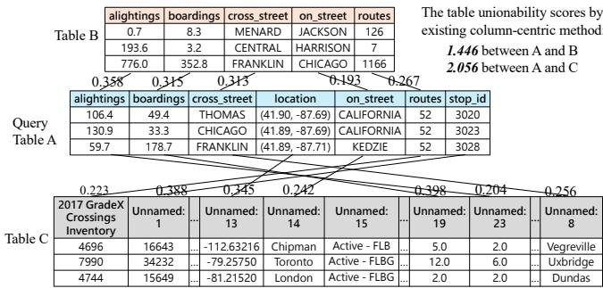  
Figure 1: Tables A and B are unionable as they share the same subject (bus ridership) and have semantically aligned columns. Table C, on a different subject (railway maintenance), is non-unionable with table A; unioning them leads to inconsistent table content. The links between columns indicate the highly matched column pairs with column unionability scores from [18], which are aggregated into table unionability scores (shown top-right); it ranks non-unionable table C (2.056) above unionable table B (1.446) for query table A.

the table-level unionability score $\mu _ { T } ( T _ { q } , T _ { i } )$ with an extra column alignment score $\mu _ { A } ( T _ { q } , T _ { i } )$ to compute the final table unionability score $\mu ( T _ { q } , T _ { i } )$ , and rank candidates by $\mu ( T _ { q } , T _ { i } )$ for the top- $\mathbf { \nabla } \cdot \mathbf { k }$ . Note that $\mu _ { T }$ from table embeddings is used for retrieval and ranking, while $\mu _ { A }$ is computed only for candidates in the last step.

During offline stage, we obtain a table embedding $\mathbf { T } _ { i }$ for each $T _ { i } ~ \in ~ \mathcal { T }$ to capture table-level unionability, in contrast to prior work [18, 53] that learns column embeddings for all columns in $\mathcal { T }$ . Since ground-truth labels are unavailable, we develop selfsupervised table-level representation techniques to obtain table embeddings, ensuring that unionable tables are close while nonunionable tables are distant in the embedding space. Specifically, we introduce positive table pair construction to simulate unionable table pairs, and a two-pronged negative table sampling strategy that excludes latent positives and mines hard negatives to enhance table embeddings for unionability estimation. We develop an attentive table encoder with tailored serialization and multi-head attention to produce table embeddings, trained with a table-level contrastive objective. While contrastive learning is popular across domains, the key differences among methods lie in how they instantiate its core components. We design these dedicated techniques for table pairs to get effective table embeddings, as detailed in Section 4, in contrast to prior methods [18, 53] that focus on column pairs.

We conduct extensive experiments and show that TACTUS consistently achieves superior result quality while being significantly faster than existing methods in both offline and online stages, often by an order of magnitude. Our contributions are as follows:

• We propose TACTUS, a novel table-centric framework for efficient and accurate table union search in data lakes.   
• We design an efficient table-to-column search process, introducing table-centric adaptive candidate retrieval and dual-evidence reranking techniques.   
• To obtain effective table embeddings, we develop positive table pair construction, two-pronged negative table sampling, and attentive table encoding methods.   
• Extensive experiments demonstrate that TACTUS consistently achieves state-of-the-art effectiveness and efficiency.

# 2 PRELIMINARIES

# 2.1 Table Union Search Problem

A data lake $\mathcal { T }$ is a collection of $n$ tables. Each table $T \in { \mathcal { T } }$ consists of multiple columns and rows.

The top- $k$ table union search problem [18, 49, 53] in Definition 2.1 aims to identify a subset $\mathcal T _ { q } \subseteq \mathcal T$ of size $k$ that contains the top- $\mathbf { \nabla } \cdot k$ tables $T$ with the highest table unionability scores $\mu ( T _ { q } , T )$ to a query table $T _ { q }$ .

Note that there is no universal definition of the table unionability score $\mu ( \cdot , \cdot )$ ; different methods compute it based on their own design choices, as discussed in Section 2.2. In our approach, we first develop the table-level unionability score $\mu _ { T } ( T _ { q } , T )$ from table embeddings for candidate filtering, and then combine the table-level $\mu _ { T } ( T _ { q } , T )$ with a column-level alignment score $\mu _ { A } ( T _ { q } , T )$ to get our final unionability score $\mu ( T _ { q } , T )$ for reranking.

Moreover, there are two problem settings to emphasize [18, 49, 53]. (i) In real-world data lakes, metadata such as column headers or schemas are often missing or unreliable [30, 35, 49, 57]. Thus, table union search does not use any table metadata and relies solely on table content for unionability assessment. (ii) The table union search is generally formulated as an unsupervised problem, since groundtruth unionability labels for table pairs are typically unavailable. In the experiments, benchmark datasets with such labels are used solely for effectiveness evaluation.

Definition 2.1 (Top-?? Table Union Search). Given a data lake $\mathcal { T }$ and a query table $T _ { q }$ , the table union search problem is to find a subset $\mathcal { T } _ { q } \subseteq \mathcal { T }$ with $| \mathcal { T } _ { q } | = k$ such that for every $T \in \mathcal { T } _ { q }$ and every $T ^ { \prime } \in \mathcal { T } \setminus \mathcal { T } _ { q } , \mu ( T _ { q } , \bar { T } ) \geq \mu ( T _ { q } , T ^ { \prime } )$ $T ^ { \prime } \in \mathcal { T } \backslash \mathcal { T } _ { q }$ , where $\mu ( \cdot , \cdot )$ is the table unionability score.

# 2.2 Related Work

Table Union Search. Early work relied on keywords, string/setbased similarity, and schema information to identify related tables [7, 24, 36, 51, 56]. Ling et al. [43] defined table stitching as the task of unioning tables with identical schemas within a site, while Lehmberg and Bizer [34] merged web tables using metadata such as column headers. Sarma et al. [56] framed the problem of finding unionable web tables as the entity complement problem, introducing entity and schema consistency measures for search. These works underscore the need to find unionable tables but rely on table metadata, which is often unavailable in practice [30, 49, 57].

Nargesian et al. [49] formalized table union search without metadata, defining its own column unionability score based on statistical value overlap, ontology annotations, and language features, and computing table unionability through optimal one-to-one column alignment. $\mathrm { D ^ { 3 } L }$ [3] measures column similarity using multiple features, including column names, and employs hashing to retrieve candidate tables. Khatiwada et al. [30] extend the table union search framework [49] by requiring an intent column in the query table, and propose SANTOS, which incorporates relationship semantics between columns and knowledge bases for search. Starmie [18] is the first to apply contrastive learning with PLMs for table union search, generating column embeddings that capture contextual semantics and quantify column unionability via cosine similarity.

LIFTus [53] further improves column representations by incorporating both linguistic and non-linguistic features.

These methods [18, 49, 53], especially Starmie and LIFTus, primarily adopt a column-centric approach for table union search. They focus on first modeling column unionability scores, which are then used throughout the search process and aggregated to get table unionability scores. For example, the state-of-the-art Starmie method generates column embeddings for all columns in the data lake $\mathcal { T }$ . During online search, it retrieves candidate tables that contain at least one column highly unionable with any column in the query table $T _ { q }$ , based on column unionability scores. It then computes the table unionability score between $T _ { q }$ and each candidate $T _ { i }$ using maximum-weight bipartite matching over their column unionability scores, and returns the top- $k$ unionable tables.

As illustrated in Section 1 (Figure 1), column-centric approaches focus on column details too early and overlook the overall tablelevel semantics, which can result in irrelevant unions—such as combining a bus ridership table with a railway maintenance table that are clearly not unionable. An experimental study [4] also shows the importance of table-level semantics.

We argue that effective table union search should first capture holistic table-level semantics and then refine results with finegrained column details. Accordingly, we propose our table-centric TACTUS method, which searches from tables to columns, rather than from columns to tables in prior work. We produce one embedding per table to compute a table-level unionability score $\mu _ { T }$ , enabling efficient candidate retrieval and early pruning of tables on unrelated subjects. Only over the candidate set, we inspect columns, get a column-level score $\mu _ { A }$ , and combine it with $\mu _ { T }$ into our final table unionability score $\mu$ for top- $k$ ranking. By leveraging table embeddings, TACTUS operates on a smaller candidate set and improves both effectiveness and efficiency.

Besides, a recent work [31] introduces a new problem of finding diverse unionable tuples for query tuples, and develops the DUST method based on embedding and clustering techniques. Another related but different problem is join discovery, to find tables that can be joined to expand columns horizontally [15–17, 23, 33, 55, 59, 67]. For example, MATE [17] efficiently discovers multi-column (n-ary) key joins at scale using a space-efficient hash-based super key index, while the Ember system [59] abstracts and automates keyless joins by constructing an index with task-specific embeddings. These studies highlight the importance and ongoing research in tabular data discovery.

Representation Learning of Tables. Representation learning has been widely adopted for various tabular data tasks. For example, Sherlock [25] and SATO [65] generate embeddings to predict the semantic types of columns by designing rich features and tailored models. Prior work [18, 53] has adapted these representations for table union search evaluation, and we also include them in the experiments. Other studies leverage PLMs for table understanding [13], entity matching [8, 40, 41, 60], question answering [26], schema matching [32, 60], table transformation [37, 38], and table overlap estimation [52]. We build on this line of research, but design dedicated embedding, scoring, and search techniques for table union search. There are also studies on general table representation learning that focus on effective pre-training [10, 27], but

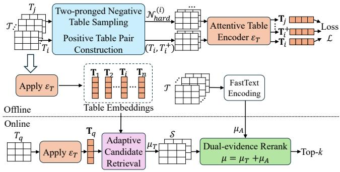  
Figure 2: The Overview of TACTUS

these pursue objectives different from table union search, which aims to efficiently find accurate sets of unionable tables. Recently, large language models (LLMs) have shown great potential in data management [2, 22, 29, 44]. For example, Liu et al. [44] proposed Magneto, a schema matching method that combines the strengths of small and large language models to achieve state-of-the-art performance. Kayali et al. [29] applied LLMs to data discovery and exploration, demonstrating a promising direction toward unifying various tasks under foundation models. These developments also motivate us to explore LLMs for table union search in future work.

# 3 SOLUTION OVERVIEW

Here we present a high-level overview of our method in Figure 2, while detailed designs are elaborated in subsequent sections.

In the offline stage, given a data lake $\mathcal { T }$ , we generate a table embedding $\mathbf { T } _ { i }$ for each table $T _ { i } \in \mathcal { T }$ . Since ground-truth unionability labels are unavailable, we design methods to construct positive and negative table pairs for each table $T _ { i }$ in Section 4.1. Specifically, we first construct a positive table $T _ { i } ^ { + }$ for $T _ { i }$ by jointly sampling rows and columns, ensuring that $T _ { i }$ and $T _ { i } ^ { + }$ share similar semantics while also containing distinct content, thereby closely simulating realworld unionable scenarios. Next, we apply two-pronged negative table sampling: we exclude tables that are likely unionable with $T _ { i }$ (i.e., latent positives), and mine hard negative tables N (?? )hard $N _ { \mathrm { h a r d } } ^ { ( i ) }$ for $T _ { i }$ that are challenging to distinguish from true positives. This approach enhances the quality of table embeddings for unionability estimation. Next, we develop an attentive table encoder in Section 4.2 that generates table embeddings using dedicated serialization and multihead attention aggregation. The table encoder $\mathcal { E } _ { T }$ is trained to pull positive table pairs $( T _ { i } , T _ { i } ^ { + } )$ closer and push negative tables of $T _ { i }$ further apart. Applying the trained table encoder $\mathcal { E } _ { T }$ to all tables in $\mathcal { T }$ yields their table embeddings ${ \mathcal { T } } = \{ \mathbf { T } _ { i } ~ | ~ T _ { i } \in \mathcal { T } \}$ . Our table embeddings are designed to capture table-level unionability semantics, so their similarity directly serves as the table-level unionability score $\mu _ { T } ( T _ { i } , T _ { j } )$ between tables $T _ { i }$ and $T _ { j }$ .

In the online stage, given a query table $T _ { q }$ , we first apply tablecentric adaptive candidate retrieval (Section 5.1), which uses the table-level unionability score $\mu _ { T } ( T _ { q } , T _ { i } )$ from table embeddings to efficiently identify promising candidate tables. Specifically, we perform a single nearest neighbor search over the indexed table embeddings $\boldsymbol { \mathcal { T } }$ using the query table embedding $\mathbf { T } _ { q }$ to retrieve initial candidates, and then adaptively select a concise candidate pool $s$

based on the distribution of table-level unionability scores, typically yielding a small, high-quality set with size close to $k$ . Over the candidate set $s$ , we further refine the ranking by integrating both table-level and column-level semantics. Specifically, we employ a dual-evidence reranking method (Section 5.2) that combines the table-level unionability score $\mu _ { T } ( T _ { q } , T _ { i } )$ and a column alignment score $\mu _ { A } ( T _ { q } , T _ { i } )$ to compute the final table unionability score $\mu ( T _ { q } , T _ { i } )$ . The column alignment score $\mu _ { A } ( T _ { q } , T _ { i } )$ uses column embeddings computed offline via FastText encoding on basic features as described in Section 5.2. We then return the top- $k$ tables with the highest $\mu ( T _ { q } , T _ { i } )$ from $s$ as the result.

# 4 TABLE-CENTRIC OFFLINE PROCESSING

We aim to produce a table embedding $\mathbf { T } _ { i }$ for each table $T _ { i }$ in the data lake $\mathcal { T }$ , such that unionable tables are close in the embedding space while non-unionable tables are well separated.

A straightforward approach is to aggregate column embeddings from existing methods [18, 53] to form a table embedding $\mathbf { T } _ { i }$ . However, as shown in Table 3 of the experiments, this is suboptimal: column embeddings are trained for column-level unionability, and simple aggregation is insufficient to capture holistic table semantics. Thus, we propose a direct table-level representation method to produce table embeddings that reflect table-level unionability.

# 4.1 Table-Level Unionability Modeling

Given two tables, $T _ { i }$ and $T _ { j }$ , if they are unionable, their embeddings $\mathbf { T } _ { i }$ and $\mathbf { T } _ { j }$ should be close in the embedding space; otherwise, they should be far apart. However, in the unsupervised problem setting, ground-truth table unionability labels are unavailable for training table embeddings. Contrastive learning [11] is a widely used technique for learning data representations without supervision. Applying contrastive learning requires the following components: (i) constructing positive pairs of similar instances, (ii) sampling negative instances that are dissimilar, and (iii) designing an encoder to map instances to embeddings, together with a suitable contrastive loss to train over positive and negative samples.

While contrastive learning is a general framework, the key differences between methods hinge on how they implement the components. These design choices are critical for the quality of the resulting representations. Starmie [18] pioneers this direction for table union search by applying contrastive learning at the column level: constructing positive and negative column pairs, and performing column encoding to preserve column unionability via a column-pair-based contrastive loss.

In contrast, our approach differs in all components by designing techniques at the table level. Specifically, we introduce: (i) a positive table pair construction technique to simulate table unionability in the absence of labels; (ii) a two-pronged negative table sampling strategy that excludes latent positives and mines hard negatives that are challenging to distinguish from positives, enabling the table embeddings to better capture unionability patterns; and (iii) an attentive table encoder with dedicated serialization and multihead attention aggregation in Section 4.2, trained with a table-level contrastive loss on table pairs.

Positive Table Pair Construction. Given a training batch $\mathcal { B }$ of $N$ tables, we construct a positive table $T _ { i } ^ { + }$ for each table $T _ { i }$ in $\mathcal { B }$

forming a positive table pair $( T _ { i } , T _ { i } ^ { + } )$ . Prior work [18, 53] constructs???? positive column pair and explores various sampling strategies at?? ????3 the cell, column, and row levels for different datasets.

Instead, we construct positive table pairs as follows. (1) For eachEasy Negative ?? table $T _ { i }$ , we randomly select a proportion of rows and a proportion????2 of columns to retain, and sample these to obtain $T _ { i } ^ { + }$ . The sampled rows are shuffled to increase the diversity of the positive table while preserving semantic consistency. (2) Note that Table Embedding S $T _ { i } ^ { + }$ is a subset of the original table $T _ { i }$ , i.e., every value in $T _ { i } ^ { + }$ appears in $T _ { i }$ . However, real unionable tables often contain not only overlapping but also distinct values. To better simulate this, we also apply row sampling to the original table $T _ { i }$ , so that $T _ { i }$ and $T _ { i } ^ { + }$ have distinct content. This approach simulates real-world scenarios where unionable tables exhibit variations in both rows and columns while preserving overall semantics. For notational simplicity, we continue to use $T _ { i }$ to denote this row-sampled version hereafter.

Given a batch $\mathcal { B }$ of $N$ tables, we construct $N$ positive pairs $( T _ { i } , T _ { i } ^ { + } )$ , resulting in 2?? tables: the row-sampled originals $\mathcal { B }$ and their corresponding positives $\mathcal { B } ^ { + } = \{ T _ { i } ^ { + } \} _ { i = 1 } ^ { N }$ . Together, these form the augmented batch $\mathcal { B } _ { a } = \mathcal { B } \cup \mathcal { B } ^ { + }$ . Hereafter, for any table $T _ { i } \in \mathcal { B } _ { a }$ where $i = 1 , \ldots , 2 N$ , we denote its positive table as $T _ { i } ^ { + } \in { \mathcal { B } } _ { a }$ .

Two-pronged Negative Table Sampling. For each table $T _ { i }$ in batch ${ \mathcal { B } } _ { a }$ , we need to identify its negative table samples, i.e., tables that are likely non-unionable with $T _ { i }$ .

A naive approach is to treat all tables in $\mathcal { B } _ { a } \backslash \{ T _ { i } , T _ { i } ^ { + } \}$ as negatives. However, this has two issues. First, it may include false negatives: some tables in $\mathcal { B } _ { a } \setminus \{ T _ { i } , T _ { i } ^ { + } \}$ may actually be unionable with $T _ { i }$ (i.e., latent positives), which is unknown a priori. Penalizing these as negative tables during training degrades representation quality. Second, some tables in $\mathcal { B } _ { a } \setminus \{ T _ { i } , T _ { i } ^ { + } \}$ may be easy negatives that are clearly non-unionable with $T _ { i }$ , offering little learning signal and wasting computation. Including such easy negatives can dilute the effect of informative samples, so training should focus on hard negatives that are more challenging to distinguish from positives [44, 54].

We thus propose a two-pronged negative table sampling technique: (i) exclude latent positives—tables with a high likelihood of being unionable with the query table, and (ii) select hard negatives—remaining tables that are difficult to distinguish from the query table. Both steps are performed dynamically per batch using the current table embeddings.

First, for latent positive exclusion, within each training batch ${ \mathcal { B } } _ { a }$ , we use the current table embeddings to identify and exclude tables that are likely unionable with $T _ { i }$ from its negative set. Specifically, for tables $T _ { i }$ and $T _ { j }$ in ${ \mathcal { B } } _ { a }$ , their table embeddings $\mathbf { T } _ { i }$ and $\mathbf { T } _ { j }$ are designed such that their cosine similarity reflects their table-level unionability score $\mu _ { T } ( T _ { i } , T _ { j } )$ , as will be detailed in Equation (3). If $\mu _ { T } ( T _ { i } , T _ { j } )$ exceeds a threshold, we treat $T _ { j }$ as a latent positive of ???? in batch B?? . For a table ???? in B?? , its latent positive set P (?? )laten $T _ { i }$ ${ \mathcal { B } } _ { a }$ $T _ { i }$ ${ \mathcal { B } } _ { a }$ $\mathcal { P } _ { \mathrm { l a t e } } ^ { ( i ) }$ consists of tables $T _ { j }$ (excluding $T _ { i }$ and its predefined positive $T _ { i } ^ { + }$ t ) with score $\mu _ { T }$ to $T _ { i }$ exceeds a threshold $\gamma$ , set to 0.9, in Equation (1):

$$
\mathcal {P} _ {\mathrm {l a t e n t}} ^ {(i)} = \left\{T _ {j} \in \mathcal {B} _ {a} \mid T _ {j} \neq T _ {i}, T _ {j} \neq T _ {i} ^ {+}, \mu_ {T} (T _ {i}, T _ {j}) > \gamma \right\}. \quad (1)
$$

We exclude these latent positives in $\mathcal { P } _ { \mathrm { l a t e n t } } ^ { ( i ) }$ from being selected as negative samples for table $T _ { i }$ in batch ${ \mathcal { B } } _ { a }$ latent , resulting in the remaining negative candidates ${ N _ { \mathrm { r e m } } ^ { ( i ) } }$ for $T _ { i }$ , in Equation (2) below.

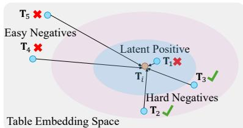  
Figure 3: Illustration of Two-pronged Negative Sampling

Second, for hard negative table sampling, we aim to identify the most informative negative tables $N _ { \mathrm { h a r d } } ^ { ( i ) }$ for $T _ { i }$ from ${ N _ { \mathrm { r e m } } ^ { ( i ) } }$ , as shown in the second line of Equation (2). Intuitively, tables that are relatively similar to $T _ { i }$ but not unionable are harder to distinguish and thus provide stronger training signals. Specifically, we rank tables in ${ N _ { \mathrm { r e m } } ^ { ( i ) } }$ by their score $\mu _ { T } ( T _ { i } , T _ { j } )$ , and retain the top half as hard negatives $\mathcal { N } _ { \mathrm { h a r d } } ^ { ( i ) }$ . Since latent positives with high scores have already been excluded from ${ N _ { \mathrm { r e m } } ^ { ( i ) } }$ , it is reasonable to treat the remaining tables with relatively high scores as hard negatives. The lower half of tables in ${ N _ { \mathrm { r e m } } ^ { ( i ) } }$ with low scores are considered easy negatives and are thus excluded from training $\mathbf { T } _ { i }$ in the batch.

$$
\mathcal {N} _ {\mathrm {r e m}} ^ {(i)} = \mathcal {B} _ {a} \setminus \left(\mathcal {P} _ {\mathrm {l a t e n t}} ^ {(i)} \cup \{T _ {i}, T _ {i} ^ {+} \}\right),
$$

$$
\mathcal {N} _ {\text {h a r d}} ^ {(i)} = \arg \operatorname {t o p -} \frac {\left| \mathcal {N} _ {\text {r e m}} ^ {(i)} \right|}{2} \left\{\mu_ {T} \left(T _ {i}, T _ {j}\right) \right\}, \tag {2}
$$

where arg top- $| N _ { \mathrm { r e m } } ^ { ( i ) } | / 2$ returns the $| N _ { \mathrm { r e m } } ^ { ( i ) } | / 2$ elements of ${ N _ { \mathrm { r e m } } ^ { ( i ) } }$

As illustrated in Figure 3, the embedding space can be conceptually divided into three regions: the innermost region near $T _ { i }$ contains latent positives (e.g., $T _ { 1 }$ ), which are excluded from negative sampling due to their high likelihood of being unionable with $T _ { i }$ ; the outermost region far from $T _ { i }$ contains easy negatives (e.g., $T _ { 4 }$ and $T _ { 5 }$ ), which are clearly non-unionable and thus provide little training signal; the middle region contains hard negatives (e.g., $T _ { 2 }$ and $T _ { 3 }$ ), which are non-unionable but similar to $T _ { i }$ , making them challenging and informative for training. These hard negatives are retained, i.e., $N _ { \mathrm { h a r d } } ^ { ( i ) } = \{ T _ { 2 } , T _ { 3 } \}$ .

By employing two-pronged negative sampling, each table $T _ { i }$ in ${ \mathcal { B } } _ { a }$ is with a negative set $\mathcal { N } _ { \mathrm { h a r d } } ^ { ( i ) }$ whose size may vary. This allows to focus training on the informative negatives, thereby enhancing the effectiveness of the table embeddings for unionability estimation.

Training Objective. Our objective adopts cosine similarity between table embeddings to quantify table-level unionability $\mu _ { T } ( T _ { i } , T _ { j } )$ . For table $T _ { i }$ with its positive table $T _ { i } ^ { + }$ and hard negatives N (?? ) , $N _ { \mathrm { h a r d } } ^ { ( i ) }$ we use the InfoNCE loss for the pair $( T _ { i } , T _ { i } ^ { + } )$ in Equation (3), where $\tau$ is a temperature parameter typically set to 0.07 [18, 53]:

$$
\ell \left(T _ {i}, T _ {i} ^ {+}\right) = - \log \frac {\exp \left(\mu_ {T} \left(T _ {i} , T _ {i} ^ {+}\right) / \tau\right)}{\sum_ {T _ {j} \in \mathcal {N} _ {\text {h a r d}} ^ {(i)}} \exp \left(\mu_ {T} \left(T _ {i} , T _ {j}\right) / \tau\right)}, \tag {3}
$$

Then the batch loss is computed by averaging the single-pair loss over all $2 N$ tables in ${ \mathcal { B } } _ { a }$ . Minimizing this loss encourages each $\mathbf { T } _ { i }$ to be close to its positive table $\mathbf { T } _ { i } ^ { + }$ , while simultaneously pushing T?? away from its hard negatives in N (?? )hard. $\mathbf { T } _ { i }$ $\mathcal { N } _ { \mathrm { h a r d } } ^ { ( i ) }$

$$
\mathcal {L} = \frac {1}{2 N} \sum_ {i = 1} ^ {2 N} \ell \left(T _ {i}, T _ {i} ^ {+}\right). \tag {4}
$$

# 4.2 Attentive Table Encoding

We develop a table encoder $\mathcal { E } _ { T }$ that generates table embeddings $\mathbf { T } _ { i }$ for tables $T _ { i }$ . Recent work on various tasks [6, 13, 16, 46, 58] leverages PLMs to serialize a table into a text sequence to obtain contextualized token embeddings. We are not reinventing this pipeline. Instead, we focus on designing techniques to adapt and enhance the serialization and encoding steps to support our table-level unionability representation modeling in Section 4.1.

Serialization. Given a table $T _ { i }$ , we serialize it into a token sequence suitable for input to a PLM such as BERT [14]. A straightforward way is to concatenate all cell values within each column and join columns using special delimiter tokens (e.g., [CLS]). However, due to the token budget limit of PLMs, this approach does not prioritize informative tokens and may allocate budget to less relevant content [16, 44].

Existing table union search methods [18, 53] use various heuristics to rank and sample cell values for serialization: Starmie applies TF-IDF or alphabetical selection, while LIFTus ranks values by string length. In contrast, we adopt priority sampling [12], which has proven effective in schema matching [44], to select informative tokens for serialization. Priority sampling favors values with higher weights while introducing controlled randomness. In our approach, word frequency (TF) serves as the weight, which we find effective. Specifically, for each column $c _ { j }$ in table $T _ { i }$ , we tokenize and compute the frequency of each unique value $\boldsymbol { w }$ in the column as $\mathrm { T F } ( \boldsymbol { w } )$ . The weight of $\boldsymbol { w }$ in $c _ { j }$ is then calculated as $\mathrm { T F } ( \boldsymbol { w } ) / h ( \boldsymbol { w } )$ , where $h ( w )$ is a random function in [0.8, 1]. All unique values in each column $c _ { j }$ are then ranked by their weights in descending order. For all columns in $T _ { i }$ , we select the top-ranked values for serialization until the token limit is reached.

Attentive Table Encoder. Given a table $T _ { i }$ with $m$ columns, let $\begin{array} { r } { \mathrm { S e q } _ { i } = [ \mathbb { C } \mathsf { L } \mathsf { S } ] w _ { 1 } ^ { 1 } w _ { 1 } ^ { 2 } \ldots [ \mathbb { C } \mathsf { L } \mathsf { S } ] w _ { m } ^ { 1 } w _ { m } ^ { 2 } \ldots . } \end{array}$ denote its token sequence, where $w _ { j } ^ { i }$ is the ??-th ranked token in column $c _ { j }$ . This sequence is fed into BERT, which uses Transformer layers with self-attention [61] to obtain contextualized embeddings. The special delimiter token [CLS] marks the start of each column, and the hidden state at each [CLS] position in the final layer of the PLM is used as the embedding $\mathbf { c } _ { j }$ for column $c _ { j }$ , capturing its semantics in the context of the entire table. This yields $m$ column embeddings $\{ { \bf c } _ { j } \} _ { j = 1 } ^ { m }$ for table $T _ { i }$ .

Unlike existing methods that use column embeddings directly for column-centric table union search, we require a unified table embedding $\mathbf { T } _ { i }$ that captures the overall unionability of $T _ { i }$ as modeled in Section 4.1. To achieve this, we integrate the embeddings $\mathbf { c } _ { j }$ of table $T _ { i }$ into an intermediate embedding vector $\mathbf { z } _ { i }$ using a multihead attention mechanism [61], as shown in Equation (5). We then refine $\mathbf { z } _ { i }$ via a multilayer perceptron (MLP) projection to obtain the final table embedding $\mathbf { T } _ { i }$ for table $T _ { i }$ , as in Equation (6). The MLP consists of two linear layers with a ReLU activation function [21] between the layers.

Figure 4 illustrates the attentive table encoder with the dedicated serialization and aggregation steps as designed above.

$$
\mathbf {z} _ {i} = \operatorname {M u l t i H e a d A t t} \left(\left\{\mathbf {c} _ {j} \right\} _ {j = 1} ^ {m}; Q, K, V\right), \tag {5}
$$

$$
\mathrm {T} _ {i} = \operatorname {M L P} \left(\mathbf {z} _ {i}\right), \tag {6}
$$

where $Q$ is a learnable parameter, and ??,?? are $\{ { \bf c } _ { j } \} _ { j = 1 } ^ { m }$

Algorithm 1: TACTUS Training   
Input: A data lake $\mathcal{T}$ Output: Trained table encoder $\mathcal{E}_T$ for $ep = 1$ to $n_{\mathrm{epoch}}$ do   
Randomly partition $\mathcal{T}$ into batches   
foreach batch $\mathcal{B}$ do $\mathcal{B}_a\gets \emptyset / / \mathrm{Augm}t e n d$ agmented batch   
foreach $T_{i}\in \mathcal{B}$ do   
Construct positive table pair $(T_i,T_i^+)$ by Section 4.1 $\mathcal{B}_a\leftarrow \mathcal{B}_a\cup \{T_i,T_i^+\}$ foreach $T_{i}\in \mathcal{B}_{a}$ do $T_{i}\gets \mathcal{E}_{T}(T_{i}) / /$ Table embedding (Section 4.2) // Two-pronged negative sampling   
Get $\mathcal{N}_{\mathrm{hard}}^{(i)}$ of $T_{i}$ by Equations (1) and (2)   
Get batch loss $\mathcal{L}$ by Equations (3) and (4) $\mathcal{E}_T\gets$ back-propagate $(\mathcal{E}_T,\mathcal{L})$ return $\mathcal{E}_T$

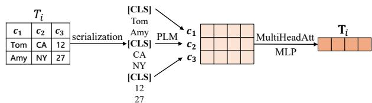  
Figure 4: Illustration of the Attentive Table Encoder

# 4.3 Training Procedure

Algorithm 1 outlines the training procedure. Given a data lake $\mathcal { T }$ of tables, each epoch begins by randomly partitioning $\mathcal { T }$ into batches (Lines 1-2). For each batch $\mathcal { B }$ , we construct its augmented batch ${ \mathcal { B } } _ { a }$ by generating a positive table pair $( T _ { i } , T _ { i } ^ { + } )$ for each table $T _ { i }$ in $\mathcal { B }$ using the positive table pair construction described in Section 4.1, and include both $T _ { i }$ and $T _ { i } ^ { + }$ in ${ \mathcal { B } } _ { a }$ (Lines 3-7). Then, for each table $T _ { i }$ in ${ \mathcal { B } } _ { a }$ , we obtain its table embedding $\mathbf { T } _ { i }$ using the attentive table encoder $\mathcal { E } _ { T }$ described in Section 4.2 (Lines 8–9). Next, we perform two-pronged negative table sampling in Equations (1) and (2) to obtain the hard negative set ${ N _ { \mathrm { h a r d } } ^ { ( i ) } } ^ { - }$ for each $T _ { i } \in \mathcal { B } _ { a }$ (Line 10).

Notably, the two-pronged negative table sampling (Line 10) is performed within each batch ${ \mathcal { B } } _ { a }$ in the for loop at Line 8, using only the current table embeddings computed in this batch (Line 9). This ensures that only information available within the current batch is used, thereby avoiding any information leakage or circular dependencies. The loss $\mathcal { L }$ is then computed at Line 11, and the model is updated via back-propagation with the Adam optimizer (Line 12). Finally, the trained table encoder $\mathcal { E } _ { T }$ is returned (Line 13).

After training, we use the trained table encoder $\mathcal { E } _ { T }$ to compute the table embedding $\mathbf { T } _ { i } = \mathcal { E } _ { T } ( T _ { i } )$ for each table $T _ { i }$ in the data lake $\mathcal { T }$ , resulting in the set of table embeddings $J ~ = ~ \{ \mathbf { T } _ { i } ~ | ~ T _ { i } ~ \in ~ \mathcal { T } \}$ Each table embedding is a multi-dimensional vector, and the similarity between two table embeddings quantifies the unionability of their corresponding tables. Notably, the number of table embeddings equals the number of tables in $\mathcal { T }$ , whereas existing methods generate column embeddings for all columns in the lake.

For efficient approximate nearest neighbor search over embeddings, various vector indexing methods are available [39, 50, 63]. Prior work [18, 53] uses HNSW [45] for column embeddings. The

choice of index is orthogonal to table union search. For fair comparison, we use the same index, but index our table embeddings.

# 5 TACTUS ONLINE SEARCH

Given a large data lake $\mathcal { T }$ , searching for unionable tables with a query table $T _ { q }$ is computationally expensive if the entire lake is exhaustively inspected to obtain the top- $k$ results.

A common approach is the filter-and-refine paradigm. Existing methods [18, 53] follow a column-centric strategy: they filter candidate tables by column-level unionability scores to any column in $T _ { q }$ , then refine by aggregating scores of highly-matched columns for top- $\boldsymbol { \cdot } \boldsymbol { k }$ selection. In the filtering stage, since a query table $T _ { q }$ often has multiple columns, and each column may match columns from many tables, prior work retrieves a large candidate set. During refinement, they aggregate column unionability scores of highlymatched columns, overlooking the holistic table-level semantics across all columns.

We argue that both the semantics of entire tables and individual columns are essential for accurate table union search. Therefore, we design our search process in a table-centric manner: only when a table is sufficiently promising at the table level is it worthwhile to examine its columns in detail with the query $T _ { q }$ . Algorithm 2 outlines the online search process of our method TACTUS.

First, we propose a table-centric adaptive candidate retrieval method (Section 5.1) that leverages the table embeddings from Section 4.3 to efficiently filter out irrelevant tables and obtain a compact, controllable candidate pool $s$ of likely unionable tables based on their table-level unionability scores $\mu _ { T } ( T _ { q } , T _ { i } )$ to the query $T _ { q }$ . Since this process operates on table embeddings—one per table—it enables flexible adjustment of the candidate pool size according to the distribution of $\mu _ { T } ( T _ { q } , T _ { i } )$ scores, rather than being constrained by the number of columns in $T _ { q }$ as in existing methods. Our approach is distribution-aware: it adaptively determines the candidate pool size based on the observed unionability score distribution for the query, resulting in a concise yet high-coverage candidate set.

Then, over the compact candidate pool $s$ , we perform a final dual-evidence reranking step (Section 5.2) that combines the tablelevel unionability score $\mu _ { T } ( T _ { q } , T _ { i } )$ from table embeddings with a lightweight column alignment score $\mu _ { A } ( T _ { q } , T _ { i } )$ to compute the final unionability score $\mu ( T _ { q } , T _ { i } )$ for each candidate. This approach effectively integrates table-level and column-level semantics to refine the top- $\mathbf { \nabla } \cdot k$ results.

# 5.1 Table-Centric Adaptive Candidate Retrieval

Given the table embeddings ${ \mathcal { T } } = \{ \mathbf { T } _ { i } \ | \ T _ { i } \in { \mathcal { T } } \}$ from Section 4, we can efficiently compute the table-level unionability score $\mu _ { T } ( T _ { q } , T _ { i } )$ for each $T _ { i }$ and retrieve the top-ranked candidates.

However, a fixed-size candidate pool is suboptimal: if too large, it includes many irrelevant tables; if too small, it may miss unionable ones. Moreover, the effective pool size varies by query, as the number of promising unionable tables differs across queries. Thus, candidate retrieval should adaptively adjust the pool size based on the unionability score distribution for each query.

Hence, we propose a table-centric adaptive candidate retrieval method that constructs a high-quality candidate pool $s$ for a query

Algorithm 2: TACTUS Search Process   
Input: Query table $T_{q}$ table embeddings $\mathcal{I}$ , absolute threshold $\tau_{\mathrm{abs}}$ drop threshold $\tau_{\mathrm{drop}}$ , result size $k$ Output: Top- $k$ result $\mathcal{T}_q$ // Table-Centric Adaptive Candidate Retrieval. (Section 5.1) $T_q\gets \mathcal{E}_T(T_q)$ $S_{init}\gets$ Get the top-3k tables for $T_{q}$ by nearest neighbor search on table embeddings $\mathcal{I} = \{\mathrm{T}_i\mid T_i\in \mathcal{T}\}$ , ranked in descending order of $\mu_T(T_q,T_i)$ $i_{\mathrm{cut}}\gets k$ for $i\gets k + 1$ to 3k do if $\mu_T(T_q,T_i) <   \tau_{abs}$ or $\mu_T(T_q,T_{i - 1}) - \mu_T(T_q,T_i) > \tau_{drop}$ then $i_{\mathrm{cut}}\gets i - 1$ break $S\gets S_{\mathrm{init}}[:i_{\mathrm{cut}}]$ // Dual-Evidence Reranking (Section 5.2)   
foreach candidate table $T_{i}\in S$ do   
Compute $\mu_A(T_q,T_i)$ by Equation (8) $\mu (T_q,T_i)\gets \mu_T(T_q,T_i) + \mu_A(T_q,T_i)$ Sort $s$ by $\mu (T_q,T_i)$ in descending order $\mathcal{T}_q\gets \mathcal{S}[:k]$ return $\mathcal{T}_q$

table $T _ { q }$ , with the pool size adaptively determined by the distribution of table-level unionability scores $\mu _ { T }$ .

In Algorithm 2, Lines 1–8 detail the construction of $s$ . Given a query table $T _ { q }$ , we first compute its table embedding $\mathbf { T } _ { q }$ (Line 1), and then perform a single nearest-neighbor search over the indexed table embeddings $\boldsymbol { \mathcal { T } }$ to retrieve an initial set $S _ { \mathrm { i n i t } }$ containing the top-$3 k$ tables with the highest table-level unionability scores $\mu _ { T } ( T _ { q } , T _ { i } )$ (Line 2). $S _ { \mathrm { i n i t } }$ serves as the initial pool from which we adaptively determine the candidate pool $s$ . Empirically, we set $\vert S _ { \mathrm { i n i t } } \vert = 3 k$ , which is sufficiently large to cover potentially unionable tables. This is because our table embeddings, as designed in Section 4, effectively encode union-oriented semantics, so the identified top-$3 k$ tables are very likely to cover all truly unionable tables, while those beyond this range are typically irrelevant and not worth further consideration. Experiments in Figure 8 show that varying $| S _ { \mathrm { i n i t } } |$ beyond $3 k$ yields negligible gains. Moreover, this step is efficient and accounts for only a negligible fraction of query time.

Lines 3-8 adaptively determine the candidate pool $s$ by scanning the ranked list $S _ { \mathrm { i n i t } }$ and selecting a cutoff position $i _ { \mathrm { c u t } }$ based on the distribution of table-level unionability scores $\mu _ { T } ( T _ { q } , T _ { i } )$ . This cutoff separates likely unionable tables from less relevant ones. We set the initial cutoff $i _ { \mathrm { c u t } }$ to $k$ to ensure at least $k$ candidates. Intuitively, if $\mu _ { T } ( T _ { q } , T _ { i } )$ drops sharply or falls below a threshold, this marks a natural boundary in the score distribution, beyond which tables are unlikely to be unionable. To determine the cutoff position, we scan the tables in $S _ { \mathrm { i n i t } }$ in descending order of $\mu _ { T } ( T _ { q } , T _ { i } )$ . The scan stops when either of the following conditions is met: (1) the score $\mu _ { T } ( T _ { q } , T _ { i } )$ of the current table drops below an absolute threshold $\tau _ { \mathrm { a b s } }$ , or (2) the difference in scores between two consecutive tables exceeds a threshold $\tau _ { \mathrm { d r o p } }$ . We then set the cutoff position $i _ { \mathrm { c u t } }$ to the previous table’s position (Lines 4–7). The threshold $\tau _ { \mathrm { a b s } }$ specifies the minimum unionability score required for a table to be considered

as a candidate, while $\tau _ { \mathrm { d r o p } }$ identifies a significant drop in the score distribution, which separates unionable tables from less relevant ones. In Section 6, we use the same threshold settings for all datasets in our experiments and also vary them to assess their impact and provide practical guidance. Then, the candidate pool $s$ consists of the top tables in $S _ { \mathrm { i n i t } }$ up to the cutoff $i _ { \mathrm { c u t } }$ (Line 8).

Discussion. (i) Our candidate retrieval operates solely on table embeddings—one vector per table—so the candidate pool size is directly controllable and does not depend on the number of columns in the query table, in contrast to existing column-centric methods. (ii) It is possible to directly return the top- $k$ tables ranked by $\mu _ { T } ( T _ { q } , T _ { i } )$ (i.e., by retrieving the top- $k$ in Line 2 of Algorithm 2) as the final result, without further refinement. As shown in our ablation study in Table 5, this approach already outperforms existing methods, highlighting the effectiveness of the table embeddings developed in Section 4.

# 5.2 Dual-Evidence Reranking

Nevertheless, it is well established that column-level semantics are also crucial for accurate table union search. Thus, we incorporate column-level information only in this final step, using a dual-evidence reranking approach that combines table-level unionability and column alignment over the candidate pool $s$ .

Specifically, the dual-evidence reranking computes the final table unionability score $\mu ( T _ { q } , T _ { i } )$ for each candidate table $T _ { i } \in S$ by integrating two complementary signals: (i) the table-level unionability score $\mu _ { T } ( T _ { q } , T _ { i } )$ derived from table embeddings, and (ii) a column alignment score $\mu _ { A } ( T _ { q } , T _ { i } )$ that captures fine-grained column compatibility between $T _ { q }$ and $T _ { i }$ , as described below. For each table $T$ , we precompute and store the FastText embeddings [28] of its columns $c _ { j }$ during the offline stage. FastText generates word embeddings by representing each word as a bag of character n-grams and aggregating the corresponding n-gram embeddings, efficiently capturing subword information.

FastText can be used off-the-shelf without additional training and is computationally efficient and providing effective performance for our purposes. While other models such as BERT could also be employed, as shown in Table 7 of experiments, FastText achieves strong performance with greater efficiency in our method.

For each unique value ?? in the value set $\mathcal { V } _ { j }$ of column $c _ { j }$ , we obtain its FastText embedding FT(??). We then compute the FastTextbased column embedding $\mathbf { e } _ { j }$ for $c _ { j }$ by aggregating these value embeddings, weighted by the frequency $f ( v )$ of $v$ in the column:

$$
\mathbf {e} _ {j} = \frac {\sum_ {v \in \mathcal {V} _ {j}} f (v) \cdot \operatorname {F T} (v)}{\sum_ {v \in \mathcal {V} _ {j}} f (v)} \tag {7}
$$

During online search, we first compute the FastText-based column embedding $\mathbf { e } _ { r }$ for each column $c _ { r }$ of the query table $T _ { q }$ using Equation (7). For each candidate table $T _ { i }$ in the pool $s$ , we compute the column alignment score $\mu _ { A } ( T _ { q } , T _ { i } )$ as defined in Equation (8), by aligning each query column $c _ { r }$ to its most similar column in $T _ { i }$ :

$$
\mu_ {A} \left(T _ {q}, T _ {i}\right) = \frac {1}{\left| T _ {q} \right|} \sum_ {c _ {r} \in T _ {q}} \max  _ {c _ {j} \in T _ {i}} \phi \left(\mathbf {e} _ {r}, \mathbf {e} _ {j}\right), \tag {8}
$$

where $\phi ( \cdot , \cdot )$ denotes cosine similarity, and $| T _ { q } |$ is the number of columns in $T _ { q }$ .

Table 1: Dataset Statistics   

<table><tr><td>Benchmark</td><td># Tables</td><td># Cols</td><td>Avg # Cols</td><td>Avg # Rows</td></tr><tr><td>SANTOS Small</td><td>550</td><td>6,322</td><td>11.49</td><td>6,921</td></tr><tr><td>TUS Small</td><td>1,530</td><td>14,810</td><td>9.68</td><td>4,466</td></tr><tr><td>TUS Large</td><td>5,043</td><td>54,923</td><td>10.89</td><td>1,915</td></tr><tr><td>Wiki Union</td><td>40,752</td><td>106,744</td><td>2.62</td><td>51</td></tr><tr><td>SANTOS Large</td><td>11,090</td><td>123,477</td><td>11.13</td><td>7,675</td></tr><tr><td>WDC</td><td>1,000,000</td><td>5,438,291</td><td>5.44</td><td>14.27</td></tr></table>

Our final table unionability score $\mu ( T _ { q } , T _ { i } )$ is defined as the sum of the table-level unionability score $\mu _ { T } ( T _ { q } , T _ { i } )$ and the column alignment score $\mu _ { A } ( T _ { q } , T _ { i } )$ , as shown in Equation (9).

Note that both $\mu _ { T } ( T _ { q } , T _ { i } )$ and $\mu _ { A } ( T _ { q } , T _ { i } )$ are in the range [0, 1] and exhibit similar means and standard deviations within each dataset in the experiments. For example, on the Wiki Union dataset, the mean (std) of $\mathbf { \nabla } \mu _ { T }$ is 0.780(0.125), while that of $\mu _ { A }$ is 0.795(0.155). Therefore, we simply sum them to obtain the final score. This parameter-free approach already achieves strong performance in our experiments. More sophisticated combinations, such as a weighted sum with a tunable hyperparameter, could be explored in the future.

$$
\mu \left(T _ {q}, T _ {i}\right) = \mu_ {T} \left(T _ {q}, T _ {i}\right) + \mu_ {A} \left(T _ {q}, T _ {i}\right). \tag {9}
$$

As shown in Lines 9–14 of Algorithm 2, for each candidate table $T _ { i }$ in $s$ , we compute its column alignment score $\mu _ { A } ( T _ { q } , T _ { i } )$ using Equation (8), and then combine it with $\mu _ { T } ( T _ { q } , T _ { i } )$ to obtain the final table unionability score $\mu ( T _ { q } , T _ { i } )$ . The candidates are then reranked by this score at Line 12, and the top- $k$ tables are returned as the final result $\mathcal { T } _ { q }$ at Line 14. This dual-evidence reranking incorporates the column alignment score $\mu _ { A } ( T _ { q } , T _ { i } )$ as a complementary signal to the table-level unionability score $\mu _ { T } ( T _ { q } , T _ { i } )$ , and is applied only to the candidate tables in $s$ , thereby further improving result quality.

# 6 EXPERIMENTS

We conduct extensive experiments using widely-adopted benchmark datasets to evaluate the effectiveness and efficiency of our proposed method TACTUS with state-of-the-art baselines.

# 6.1 Experiment Setup

Datasets. We use six benchmark datasets adopted in [18, 30, 53], with their statistics summarized in Table 1. The first four datasets provide ground truth for unionable tables and are used to evaluate both effectiveness and efficiency, while the last two datasets lack ground truth and are used only for online efficiency evaluation, following [18, 53]. The SANTOS Small benchmark [30] comprises 550 real tables from open datasets in Canada, the UK, the US, and Australia, with 50 query tables. The TUS Small and TUS Large benchmarks [49] contain 1,530 and 5,043 tables, respectively, generated from Canadian open data. We randomly select 150 and 100 query tables for TUS Small and TUS Large, respectively [18, 30, 53]. The Wiki Union benchmark [57] is constructed from Wikidata [62] and contains 40,752 tables. Originally designed for supervised table unionability prediction [57], it provides ground-truth labels for unionable table pairs. To adapt this dataset for unsupervised table union search, we identify all unionable tables for each table based on ground truth and randomly select 100 tables, each with more than 40 unionable tables, as query tables. Following prior work [18, 53],

Table 2: MAP@k, $\mathbf { P } @ \mathbf { k } ,$ and $\mathbf { R } @ \mathbf { k }$ results on all benchmarks with ground truth, where $\mathbf { k } { \mathbf { = } } \mathbf { 1 0 }$ for SANTOS Small, $\mathbf { k } { = } 6 \mathbf { 0 }$ for the TUS benchmarks and $\scriptstyle \mathbf { k } = \mathbf { 4 0 }$ for Wiki Union. Avg. Rank in the last column represents, for each method, the average of its ranks among all methods across all metrics and datasets. The best is in bold, and the second best is underlined.   

<table><tr><td rowspan="2">Method</td><td colspan="3">SANTOS Small</td><td colspan="3">TUS Small</td><td colspan="3">TUS Large</td><td colspan="3">Wiki Union</td><td rowspan="2">Avg. Rank</td></tr><tr><td>MAP@k</td><td>P@k</td><td>R@k</td><td>MAP@k</td><td>P@k</td><td>R@k</td><td>MAP@k</td><td>P@k</td><td>R@k</td><td>MAP@k</td><td>P@k</td><td>R@k</td></tr><tr><td>D3L</td><td>0.5595</td><td>0.5100</td><td>0.4167</td><td>0.7916</td><td>0.7762</td><td>0.2147</td><td>0.5155</td><td>0.5102</td><td>0.1430</td><td>0.0905</td><td>0.0575</td><td>0.0684</td><td>6.42</td></tr><tr><td>Sherlock</td><td>0.8082</td><td>0.6860</td><td>0.5080</td><td>0.9592</td><td>0.9220</td><td>0.2886</td><td>0.7600</td><td>0.5897</td><td>0.1296</td><td>0.2960</td><td>0.2418</td><td>0.2017</td><td>5.25</td></tr><tr><td>SATO</td><td>0.8822</td><td>0.8280</td><td>0.6077</td><td>0.9462</td><td>0.9302</td><td>0.2928</td><td>0.8924</td><td>0.8228</td><td>0.1924</td><td>0.5263</td><td>0.4495</td><td>0.3701</td><td>3.83</td></tr><tr><td>SANTOS</td><td>0.9446</td><td>0.9160</td><td>0.6820</td><td>0.8892</td><td>0.8406</td><td>0.2708</td><td>-</td><td>-</td><td>-</td><td>-</td><td>-</td><td>-</td><td>5</td></tr><tr><td>Starmie</td><td>0.9644</td><td>0.9360</td><td>0.6926</td><td>0.9672</td><td>0.9342</td><td>0.3100</td><td>0.9113</td><td>0.8508</td><td>0.2199</td><td>0.4485</td><td>0.3930</td><td>0.3115</td><td>3</td></tr><tr><td>LIFTus</td><td>0.9730</td><td>0.9600</td><td>0.7158</td><td>0.9709</td><td>0.9381</td><td>0.3112</td><td>0.9662</td><td>0.9357</td><td>0.2397</td><td>0.3438</td><td>0.2850</td><td>0.2331</td><td>2.5</td></tr><tr><td>TACTUS</td><td>0.9860</td><td>0.9720</td><td>0.7290</td><td>0.9936</td><td>0.9876</td><td>0.3299</td><td>0.9844</td><td>0.9728</td><td>0.2516</td><td>0.6537</td><td>0.6238</td><td>0.5066</td><td>1</td></tr></table>

the SANTOS Large and WDC [35] datasets are used only for online efficiency evaluation, as they lack ground truth. SANTOS Large includes 80 randomly selected query tables [18, 30, 53], while WDC consists of one million tables randomly sampled from the WDC web tables corpus, with 50 randomly selected query tables. These six datasets vary in size, column and row counts, and table widths, providing a comprehensive evaluation of different methods.

Baselines. We compare TACTUS with state-of-the-art methods, including Starmie [18], LIFTus [53], SANTOS [30], $\mathrm { D ^ { 3 } L }$ [3], Sherlock [25], and SATO [65]. $\mathrm { D ^ { 3 } L }$ was originally designed using features such as table content and column names; following [18, 30, 53], we configure it without access to column names for fair comparison. Sherlock and SATO produce column representations; to enable table union search, we follow the evaluation protocol in [18], aligning their online query processing with that of Starmie since all three methods produce column embeddings.

Implementations. For all competitors, we use their publicly available codebases. For fair comparison, we apply HNSW [45] to index the column embeddings produced by Starmie, SATO, LIFTus, and Sherlock, and the table embeddings produced by our TACTUS. Baselines are configured with the recommended parameter settings from their respective papers. We implement TACTUS in Python using PyTorch and the Transformers library [64], adopting BERT [14] as the pretrained language model.

We evaluate with maximum input sequence lengths set to be 256 and 512 tokens for all language models, and unless otherwise specified, we use 256 tokens by default, following prior work [18]. Our method TACTUS uses the same parameter settings across all datasets, including $\gamma = 0 . 9$ , $\tau _ { \mathrm { a b s } } = 0 . 5$ , and $\tau _ { \mathrm { d r o p } } = 0 . 2$ , demonstrating robust performance across datasets; we also analyze the impact of varying parameters. For each dataset, query tables are excluded from all offline processing, including training, to ensure no data leakage. Since no ground-truth labels are used during training, data splitting is unnecessary. We use a batch size of 64. Experiments are conducted on a server with an Intel Xeon Platinum 8370C CPU at 2.80GHz and an NVIDIA RTX Ada 6000 GPU.

Evaluation Metrics. For effectiveness [18, 30, 53], we use Mean Average Precision at $k \left( M A P @ k \right)$ , Precision at $k \left( P @ k \right)$ , and Recall at $k$ $( R @ k )$ to evaluate. Given a query table $T _ { q }$ , let $\mathcal { T } _ { g t }$ be its truly unionable tables and $\mathcal { T } _ { q }$ the set of returned top- $k$ tables by a method. The metrics are defined as: ??@?? = | T??∩T???? |?? , $\begin{array} { r } { P @ k = \frac { | \mathcal T _ { q } \cap \mathcal T _ { g t } | } { k } , R @ k = \frac { | \mathcal T _ { q } \cap \mathcal T _ { g t } | } { | \mathcal T _ { g t } | } , M A P @ k = } \end{array}$ $M A P @ k =$ $\begin{array} { r } { \frac { 1 } { k } \sum _ { i = 1 } ^ { k } P ( \underline { { \omega } } i . P ( \underline { { \omega } } k } \end{array}$ measures the proportion of top- $k$ returned tables

that are truly unionable with $T _ { q }$ ; ??@?? measures the proportion of all truly unionable tables included in the top- $\mathbf { \nabla } \cdot k$ ; and $M A P @ k$ averages $P _ { \mathrm { \ell } } \omega _ { \mathrm { } } i$ over $i = 1$ to $k$ . We also report the average rank (Avg. Rank) of each method, computed as its average ranking across all metrics and datasets. For efficiency, we report offline processing time, online processing time, and embedding index size. Following [18, 30, 53], we set $k = 6 0$ for TUS datasets, $k = 1 0$ for SANTOS Small, SANTOS Large, and WDC, and $k = 4 0$ for Wiki Union.

# 6.2 Effectiveness Evaluation

Table 2 reports the effectiveness results of TACTUS and the baselines on the four datasets with ground truth. SANTOS is not reported on TUS Large and Wiki Union due to its reliance on additional knowledge, which is unavailable for these datasets [18, 30].

Our method TACTUS consistently achieves the best performance across all datasets and metrics, with an average rank of 1.0. For example, on TUS Small, TACTUS attains $M A P @ k$ of $9 9 . 3 6 \%$ , $P ( \varpi k$ of $9 8 . 7 6 \%$ , and $R @ k$ of $3 2 . 9 9 \%$ , outperforming the second-best method LIFTus by $2 . 2 7 \%$ , $4 . 9 5 \%$ , and $1 . 8 7 \%$ , respectively, and Starmie by $2 . 6 4 \%$ , $5 . 3 4 \%$ , and $1 . 9 9 \%$ , respectively. Similar trends hold for larger datasets, where TACTUS achieves the best results. For example, on TUS Large, TACTUS achieves $P ( \varpi k$ of $9 7 . 2 8 \%$ , exceeding LIF-Tus by $3 . 7 1 \%$ and Starmie by $1 2 . 2 0 \%$ . These results confirm the effectiveness of our table-centric embedding techniques (Section 4) and search process (Section 5). The table embeddings learned by TACTUS capture table-level unionability semantics, enabling the table-centric adaptive candidate retrieval in Section 5.1 to obtain high-quality candidates that are likely to be unionable with the query table. The dual-evidence reranking in Section 5.2 further refines these candidates by jointly leveraging table- and column-level evidence, leading to superior performance.

On the Wiki Union dataset, all methods exhibit lower performance than on the other datasets, as tables in Wiki Union typically contain fewer columns and rows, providing limited contextual information for table union search. Nevertheless, TACTUS significantly outperforms all baselines, achieving $M A P @ k$ of $6 5 . 3 7 \%$ , $P _ { \ @ k }$ of $6 2 . 3 8 \%$ , and $R @ k$ of $5 0 . 6 6 \%$ , which are $1 2 . 7 4 \%$ , $1 7 . 4 3 \%$ , and $1 3 . 6 5 \%$ higher than the runner-up SATO, respectively. Column-centric methods such as LIFTus and Starmie are less effective on Wiki Union because the limited context constrains the quality of the column embeddings and candidate retrieval. In contrast, TACTUS leverages holistic table-level semantics to produce table embeddings

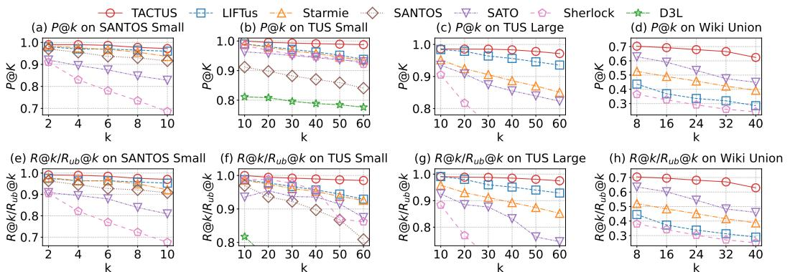  
Figure 5: Precision $P ( \varpi k$ and Relative Recall $R @ k / R _ { u b } @ k$ with Varied ??

as described in Section 4, which is more effective for large, sparse benchmarks like Wiki Union. Moreover, our table-centric adaptive candidate retrieval and dual-evidence reranking techniques in Section 5 further enhance online search effectiveness, leading to substantial improvements over the baselines on Wiki Union.

We further vary $k$ to evaluate precision and recall. Figures $^ { 5 ( \mathrm { a } , \mathrm { b } , \mathrm { c } , \mathrm { d } ) }$ report precision $P ( \varpi k$ as $k$ increases. Precision decreases for all methods as $k$ grows; TACTUS consistently maintains a clear advantage across all settings, especially at larger $k$ . For example, in Figure 5(b) (TUS Small), at $k = 4 0$ , TACTUS achieves $9 9 . 1 0 \%$ precision, which is $2 . 8 2 \%$ higher than LIFTus; on Wiki Union in Figure 5(d), at $k = 3 2$ , TACTUS attains $6 6 . 5 3 \%$ precision, $1 9 . 0 7 \%$ higher than SATO $( 4 7 . 4 6 \% )$ .

For recall, note that when $k$ is smaller than the number of ground-truth unionable tables $| \mathcal { T } _ { g t } |$ for a query $T _ { q }$ , recall cannot reach $1 0 0 \%$ . The upper bound, i.e., the best possible recall, is $\begin{array} { r } { R _ { u b } @ k \ : = \ : \frac { \operatorname* { m i n } ( k , | \mathcal { T } _ { g t } | ) } { | \mathcal { T } _ { g t } | } } \end{array}$ . For example, on TUS Large with $k \ = \ 6 0$ , $R _ { u b } @ k$ is as low as 0.2581; for even smaller $k$ (e.g., $k = 1 0 _ { \cdot }$ ), $R _ { u b } @ k$ becomes much lower. This makes the $R @ k$ curves of different methods difficult to distinguish, as also observed in [18, 53]. To better visualize recall trends, we therefore adopt a relative recall metric, $R @ k / R _ { u b } @ k$ , which normalizes the achieved recall by the upper bound $R _ { u b } @ k$ . As shown in Figures 5(e,f,g,h), relative recall decreases for all methods as $k$ increases, which matches the intuition that a larger $k$ makes it harder to retrieve all unionable tables. Across all $k$ , TACTUS achieves the highest relative recall, with the gap widening as $k$ grows. These results further validate the effectiveness of our table embedding techniques in Section 4 and the online search techniques in Section 5.

# 6.3 Efficiency Evaluation

The offline time includes data preprocessing, model training, embedding generation, and index construction. We report the offline processing time of TACTUS and the baselines on the four datasets with ground truth used in the effectiveness evaluation. Note that SANTOS Large and WDC do not require offline training and are only used for online efficiency evaluation.

As shown in Figure 6 (log-scale), TACTUS is significantly faster than all baselines, including those with runner-up effectiveness in Table 2, often by more than an order of magnitude. For example, on SANTOS Small, TACTUS completes offline processing in only

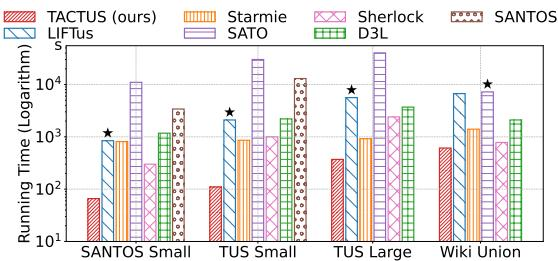  
Figure 6: Offline Processing Time in Seconds (The baseline with runner-up effectiveness in Table 2 is marked with $\star$ )

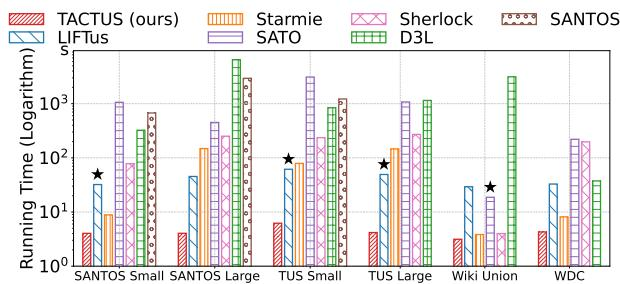  
Figure 7: Online Processing Time in Seconds (The baseline with runner-up effectiveness in Table 2 is marked with $\star$ )

66 seconds, which is $1 2 . 8 \times$ faster than LIFTus (842 seconds) and $1 2 . 3 \times$ faster than Starmie (811 seconds), the two strong baselines in Table 2. On Wiki Union, TACTUS finishes offline processing in 610 seconds, which is $1 1 . 8 \times$ faster than SATO (7217 seconds), the baseline with the second-best effectiveness in Table 2; while Starmie is relatively efficient on Wiki Union, its effectiveness in Table 2 is lower. In addition, Starmie is more efficient than LIFTus due to the latter’s additional multi-aspect computation per column. Among the baselines, Sherlock is relatively fast, but as shown in Table 2, its effectiveness is lower, with an average rank of 5.25. The offline efficiency of TACTUS primarily stems from its table-centric offline processing, as described in Section 4, which contrasts with existing methods that require building and processing column embeddings.

The online processing time for a method mainly includes two steps: encode query tables and columns into embeddings; search for top- $k$ unionable tables. The first step typically dominates the total time, though prior work often reports only the second step.

In Figure 7 (log-scale), we report the total online processing time for all methods across all datasets. TACTUS consistently achieves

faster online processing than all baselines, often by more than an order of magnitude. For example, on TUS Large, TACTUS processes all queries in just 4.18 seconds, which is $1 1 . 8 0 \times$ faster than LIFTus (49.33 seconds) and $3 4 . 9 5 \times$ faster than Starmie (146.11 seconds), and significantly faster than the other baselines. On both Wiki Union and WDC, which have fewer columns per table, TACTUS still maintains a clear efficiency advantage. On Wiki Union, SATO, the runner-up in Table 2, is $6 \times$ slower than TACTUS; while Starmie and LIFTus are comparable in efficiency, they yield lower effectiveness as reported in Table 2. The online efficiency of TACTUS demonstrates that our table-centric adaptive candidate retrieval in Section 5.1 can quickly retrieve a small number of high-quality candidates for reranking to obtain the final top- $\mathbf { \nabla } \cdot k$ results, as described in Section 5. The experiments in Table 6 in Section 6.4 further shows that TACTUS retrieves fewer candidates than the baselines while achieving higher effectiveness, validating the strength of our table-centric modeling and search techniques in Sections 4 and 5.

# 6.4 Experimental Analysis

Comparison with Baselines using Aggregated Column Embeddings as Table Embeddings. For a table $T _ { i }$ , existing methods [18, 53] produce column embeddings. A straightforward approach to obtain a table embedding is to aggregate its column embeddings, e.g., via average pooling. To further demonstrate the effectiveness and necessity of our table embedding techniques in Section 4, we adapt Starmie and LIFTus as follows: aggregate their column embeddings to form table embeddings for candidate retrieval, and rerank the retrieved candidates using their original unionability scoring functions. We refer to these variants as Starmie $a g g$ and $\mathrm { L I F T u s } _ { a g g }$ , respectively. As shown in Table 3, TAC-TUS consistently outperforms both Starmie $\alpha g g$ and $\mathrm { L I F T u s } _ { a g g }$ across all datasets. This is because the baseline column embeddings are optimized for column-level unionability, and simple aggregation cannot capture the holistic table semantics required for table-level unionability. These results highlight the effectiveness of our tablecentric embedding techniques in Section 4.

Performance with 512 Tokens. Table 4 reports the performance when setting the maximum input sequence length of BERT to 512 tokens. We observe that (i) all methods achieve similar performance to that in Table 2 with 256 tokens, with only minor differences; and (ii) TACTUS consistently maintains its performance advantage over the baselines. These results demonstrate the robustness of our method and justify the use of 256 tokens as the default setting, following common practice [18, 53].

Ablation Study. We evaluate the contribution of each major component in TACTUS by considering the following ablated variants: (i) disabling the dual-evidence reranking in Section 5.2 and using only $\mu _ { T } ( T _ { q } , T _ { i } )$ as the final unionability score to select the top- $\mathbf { \nabla } \cdot k$ tables (w/o rerank); (ii) removing the two-pronged negative sampling in Section 4.1 (w/o two-pronged); (iii) replacing the adaptive candidate retrieval in Section 5.1 with a fixed candidate pool size of $3 k$ (w/o adaptive); and (iv) substituting the attentive aggregation in Section 4.2 with simple average pooling (w. avgPooling). As shown in Table 5, each component contributes to the overall performance of TACTUS across all datasets. For example, the reranking module improves MAP@60 on TUS Small from $9 7 . 9 5 \%$ to $9 9 . 3 6 \%$ , a $1 . 4 1 \%$

Table 3: Performance of baseline variants using aggregated column embeddings as table embeddings   

<table><tr><td>MAP@k</td><td>SANTOS Small</td><td>TUS Small</td><td>TUS Large</td><td>Wiki Union</td></tr><tr><td>TACTUS</td><td>0.9860</td><td>0.9936</td><td>0.9844</td><td>0.6537</td></tr><tr><td>Starmieagg</td><td>0.9768</td><td>0.9511</td><td>0.8981</td><td>0.4380</td></tr><tr><td>LIFTusagg</td><td>0.9452</td><td>0.9227</td><td>0.9080</td><td>0.3277</td></tr></table>

Table 4: MAP@k with maximum token length 512   

<table><tr><td>Method</td><td>SANTOS Small</td><td>TUS Small</td><td>TUS Large</td><td>Wiki Union</td></tr><tr><td>TACTUS</td><td>0.9895</td><td>0.9951</td><td>0.9830</td><td>0.6514</td></tr><tr><td>Starmie</td><td>0.9618</td><td>0.9670</td><td>0.9143</td><td>0.4505</td></tr><tr><td>LIFTus</td><td>0.9736</td><td>0.9718</td><td>0.9656</td><td>0.3438</td></tr></table>

Table 5: Ablation Study (MAP@k)   

<table><tr><td>Variant</td><td>SANTOS Small</td><td>TUS Small</td><td>TUS Large</td><td>Wiki Union</td></tr><tr><td>TACTUS</td><td>0.9860</td><td>0.9936</td><td>0.9844</td><td>0.6537</td></tr><tr><td>TACTUS w/o rerank</td><td>0.9788</td><td>0.9795</td><td>0.9780</td><td>0.6443</td></tr><tr><td>TACTUS w/o two-pronged</td><td>0.9747</td><td>0.9775</td><td>0.9818</td><td>0.6485</td></tr><tr><td>TACTUS w/o adaptive</td><td>0.9822</td><td>0.9905</td><td>0.9802</td><td>0.6443</td></tr><tr><td>TACTUS w. avgPooling</td><td>0.9795</td><td>0.9891</td><td>0.9798</td><td>0.6360</td></tr></table>

Table 6: Average candidate set size and average fraction of truly unionable tables in the set (%)   

<table><tr><td></td><td>SANTOS Small</td><td>TUS Small</td><td>TUS Large</td><td>Wiki Union</td></tr><tr><td>k</td><td>10</td><td>60</td><td>60</td><td>40</td></tr><tr><td>TACTUS</td><td>12.84 (94.7%)</td><td>91.57 (89.9%)</td><td>114.04 (88.2%)</td><td>44.62 (60.2%)</td></tr><tr><td>Starmie</td><td>41.24 (49.9%)</td><td>167.91 (68.9%)</td><td>247.45 (51.3%)</td><td>69.62 (25.6%)</td></tr><tr><td>LIFTus</td><td>30.90 (63.0%)</td><td>222.90 (51.6%)</td><td>228.45 (63.1%)</td><td>65.76 (24.8%)</td></tr></table>

absolute gain. Notably, TACTUS (w/o rerank), i.e., using only the table-centric candidate retrieval in Section 5.1 to get the top- $k$ tables, already outperforms all baselines in Table 2 in MAP@k on all datasets, validating the effectiveness of our table-centric designs in Sections 4 and 5.1. Moreover, two-pronged negative sampling is particularly effective for SANTOS Small and TUS Small, while adaptive candidate retrieval and attentive aggregation are more beneficial on Wiki Union and TUS Large.

Study on Candidate Set S. Table 6 reports, for each method, the average candidate set size and the fraction of truly unionable tables per candidate set. Our method TACTUS consistently retrieves a much smaller candidate set $s$ with a higher fraction of truly unionable tables across all datasets, and the set size is close to $k$ . For example, on SANTOS Small with $k = 1 0$ , TACTUS yields an average candidate set size of 12.84 with $9 4 . 7 \%$ truly unionable tables, while Starmie and LIFTus return much larger sets of 41.24 and 30.90 candidates with only $4 9 . 9 \%$ and $6 3 . 0 \%$ truly unionable tables, respectively. Similar trends are observed on other datasets. These results demonstrate the effectiveness of our table-centric adaptive candidate retrieval in Section 5.1, which leverages table embeddings that capture holistic table-level unionability scores $\mu _ { T }$ to directly retrieve a compact, high-quality candidate set $s$ adaptive to the distribution of $\mu _ { T }$ scores. In contrast, column-centric methods such as Starmie and LIFTus include a table in the candidate set if any of its columns matches any query column, while a query table has multiple columns, resulting in larger candidate sets with a lower fraction of truly unionable tables.

The Effect of the Size of $S _ { \mathrm { i n i t } }$ . By default, we set the initial candidate set size $| S _ { \mathrm { i n i t } } |$ to $3 k$ in Algorithm 2 (Section 5.1). To access its effect, we vary $| S _ { \mathrm { i n i t } } |$ from $k$ to $6 k$ and report MAP@k and online search time in Figure 8. As $| S _ { \mathrm { i n i t } } |$ increases from $k$ to $3 k$ , MAP@k

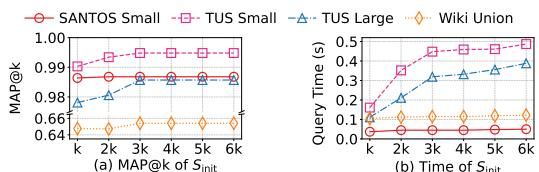  
Figure 8: Vary |Sinit |

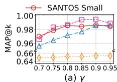

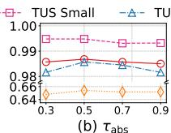

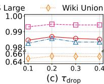  
Figure 9: Vary Parameters

Table 7: Comparison of FastText and BERT for reranking in accuracy $( \mathbf { M A P } @ \mathbf { k } )$ and encoding time (s)   

<table><tr><td>Model</td><td>SANTOS Small MAP@k / Time(s)</td><td>TUS Small MAP@k / Time(s)</td><td>TUS Large MAP@k / Time(s)</td><td>Wiki Union MAP@k / Time(s)</td></tr><tr><td>FastText</td><td>0.9860 / 13</td><td>0.9936 / 34</td><td>0.9844 / 71</td><td>0.6537 / 211</td></tr><tr><td>BERT</td><td>0.9857 / 35</td><td>0.9938 / 92</td><td>0.9828 / 202</td><td>0.6540 / 635</td></tr></table>

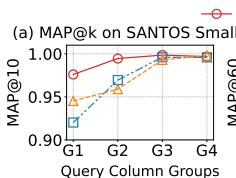

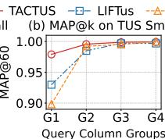

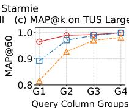  
Figure 10: MAP@k by Query Table Width

improves due to the inclusion of more unionable tables, but plateaus for larger values ( $\dot { 4 } k$ to 6??), while online search time continues to increase. Thus, setting $\vert S _ { \mathrm { i n i t } } \vert ~ = ~ 3 k$ is sufficient to achieve high effectiveness with reasonable overhead.

Parameter Analysis. We use the same parameter settings for all datasets by default. Here, we analyze the impact of varying key parameters, including $\gamma$ in Equation (1) for identifying latent positives, and $\tau _ { \mathrm { a b s } }$ and $\tau _ { \mathrm { d r o p } }$ in Section 5.1 for adaptive candidate retrieval. In Figure 9(a), as $\gamma$ increases from 0.7 to 0.9, performance improves because more accurate latent positives are excluded from the negative set; further increasing ?? causes performance to plateau or decrease, as an overly strict threshold may fail to exclude enough latent positives. Thus, we set $\gamma = 0 . 9$ by default. In Figure 9(b,c), we vary $\tau _ { \mathrm { a b s } }$ from 0.3 to 0.9 and $\tau _ { \mathrm { d r o p } }$ from 0.1 to 0.4. For both parameters, performance increases and then decreases as the values grow. Therefore, we set $\tau _ { \mathrm { a b s } } = 0 . 5$ and $\tau _ { \mathrm { d r o p } } = 0 . 2$ by default.

Reranking: FastText vs. BERT. In Section 5.2, we adopt FastText for dual-evidence reranking due to its efficiency and suitability for our design. To further validate this choice, we compare FastText with BERT for reranking. Table 7 reports the accuracy and efficiency of our method using FastText versus BERT for reranking. Both achieve nearly identical MAP@k, while FastText is substantially more efficient in encoding.

Vary Query Table Width. We analyze the impact of query table width by sorting all query tables in ascending order of their number of columns and dividing them into four equal-sized groups, denoted as G1 (narrowest) to G4 (widest). As shown in Figure 10, the performance of all methods generally improves as table width increases

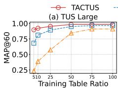

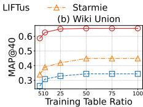  
Figure 11: MAP@k when varying training data ratio (%)

Table 8: Embedding Index Size (MB)   

<table><tr><td>Method</td><td>SANTOS Small</td><td>SANTOS Large</td><td>TUS Small</td><td>TUS Large</td><td>Wiki Union</td><td>WDC</td></tr><tr><td>TACTUS</td><td>10.9</td><td>196.9</td><td>27.4</td><td>97.1</td><td>396.0</td><td>12779.5</td></tr><tr><td>Starmie</td><td>38.7</td><td>746.6</td><td>58.2</td><td>215.8</td><td>420.9</td><td>34570.2</td></tr><tr><td>LIFTus</td><td>519.8</td><td>7811.9</td><td>1218.9</td><td>3719.5</td><td>10040.9</td><td>414860.8</td></tr><tr><td>SATO</td><td>104.6</td><td>2242.6</td><td>244.6</td><td>1013.8</td><td>1760.2</td><td>94589.7</td></tr><tr><td>Sherlock</td><td>116.8</td><td>2252.8</td><td>276.6</td><td>1015.2</td><td>1975.2</td><td>100526.1</td></tr></table>

from G1 to G4, as wider tables provide richer contextual information for unionability search. TACTUS consistently outperforms the baselines; for example, on SANTOS Small in G2, TACTUS achieves $M A P @ k$ of $9 9 . 4 5 \%$ , which is $2 . 5 0 \%$ higher than LIFTus $( 9 6 . 9 5 \% )$ and $3 . 5 6 \%$ higher than Starmie $( 9 5 . 8 9 \% )$ .

Training Efficiency. In Figure 11, we evaluate the training efficiency of TACTUS, Starmie, and LIFTus by varying the fraction of training tables used on TUS Large and Wiki Union. As the proportion of training data increases from $5 \%$ to $1 0 0 \%$ , all methods improve in $M A P @ k$ , while TACTUS consistently achieves the highest performance across all fractions. The gains of TACTUS are particularly pronounced in the low-data regime (e.g., $5 \%$ or $1 0 \%$ of training tables). For example, in Figure 11(b) on Wiki Union, when using only $1 0 \%$ of the training data, TACTUS attains $M A P @ k$ of $6 2 . 6 0 \%$ , which is $3 1 . 8 2 \%$ higher than LIFTus and $2 3 . 6 8 \%$ higher than Starmie. These results demonstrate that our table-centric method TACTUS is especially effective and data-efficient under limited training data. Embedding Index Size. We report the total size of all embeddings and the index built over these embeddings in Table 8. TACTUS requires less space than all baselines across all datasets for embedding and index storage. For example, on TUS Large, TACTUS requires only 97.1 MB, while LIFTus, the runner-up in effectiveness in Table 2, requires 3719.5 MB and Starmie requires 215.8 MB. This demonstrates the space efficiency of our techniques.

# 7 CONCLUSION

We present TACTUS, a novel table-centric framework for efficient and accurate table union search in large data lakes. Unlike existing column-centric approaches, TACTUS model holistic table-level unionability through dedicated table embeddings, and enable efficient and effective online search by table-centric adaptive candidate retrieval and dual-evidence reranking techniques. Our offline processing introduces positive table pair construction, two-pronged negative sampling, and attentive table encoder for effective tablelevel unionability estimation. Extensive experiments demonstrate that TACTUS consistently achieves state-of-the-art effectiveness and efficiency across diverse datasets. This work underscores the value of table-level modeling for tabular data discovery. Future directions include extending our framework to other tasks such as table join search and schema matching, and exploring large language models for table representation learning.

# REFERENCES

[1] Marco D. Adelfio and Hanan Samet. 2013. Schema Extraction for Tabular Data on the Web. Proc. VLDB Endow. 6, 6 (2013), 421–432.   
[2] Muhammad Imam Luthfi Balaka, David Alexander, Qiming Wang, Yue Gong, Adila Krisnadhi, and Raul Castro Fernandez. 2025. Pneuma: Leveraging LLMs for Tabular Data Representation and Retrieval in an End-to-End System. Proc. ACM Manag. Data 3, 3 (2025), 200:1–200:28.   
[3] Alex Bogatu, Alvaro A. A. Fernandes, Norman W. Paton, and Nikolaos Konstantinou. 2020. Dataset Discovery in Data Lakes. In ICDE. IEEE, 709–720.   
[4] Allaa Boutaleb, Bernd Amann, Hubert Naacke, and Rafael Angarita. 2025. Something’s Fishy In The Data Lake: A Critical Re-evaluation of Table Union Search Benchmarks. CoRR abs/2505.21329 (2025).   
[5] Dan Brickley, Matthew Burgess, and Natasha F. Noy. 2019. Google Dataset Search: Building a search engine for datasets in an open Web ecosystem. In WWW. ACM, 1365–1375.   
[6] Jean-Flavien Bussotti, Enzo Veltri, Donatello Santoro, and Paolo Papotti. 2023. Generation of Training Examples for Tabular Natural Language Inference. Proc. ACM Manag. Data 1, 4 (2023), 243:1–243:27.   
[7] Michael J. Cafarella, Alon Y. Halevy, and Nodira Khoussainova. 2009. Data Integration for the Relational Web. Proc. VLDB Endow. 2, 1 (2009), 1090–1101.   
[8] Riccardo Cappuzzo, Paolo Papotti, and Saravanan Thirumuruganathan. 2020. Creating Embeddings of Heterogeneous Relational Datasets for Data Integration Tasks. In SIGMOD Conference. ACM, 1335–1349.   
[9] Sonia Castelo, Rémi Rampin, Aécio S. R. Santos, Aline Bessa, Fernando Chirigati, and Juliana Freire. 2021. Auctus: A Dataset Search Engine for Data Discovery and Augmentation. Proc. VLDB Endow. 14, 12 (2021), 2791–2794.   
[10] Pei Chen, Soumajyoti Sarkar, Leonard Lausen, Balasubramaniam Srinivasan, Sheng Zha, Ruihong Huang, and George Karypis. 2023. HyTrel: Hypergraphenhanced Tabular Data Representation Learning. In NeurIPS.   
[11] Ting Chen, Simon Kornblith, Mohammad Norouzi, and Geoffrey E. Hinton. 2020. A Simple Framework for Contrastive Learning of Visual Representations. In ICML (Proceedings of Machine Learning Research), Vol. 119. 1597–1607.   
[12] Majid Daliri, Juliana Freire, Christopher Musco, Aécio S. R. Santos, and Haoxiang Zhang. 2024. Sampling Methods for Inner Product Sketching. Proc. VLDB Endow. 17, 9 (2024), 2185–2197.   
[13] Xiang Deng, Huan Sun, Alyssa Lees, You Wu, and Cong Yu. 2022. TURL: Table Understanding through Representation Learning. SIGMOD Rec. 51, 1 (2022), 33–40.   
[14] Jacob Devlin, Ming-Wei Chang, Kenton Lee, and Kristina Toutanova. 2019. BERT: Pre-training of Deep Bidirectional Transformers for Language Understanding. In NAACL-HLT (1). 4171–4186.   
[15] Yuyang Dong, Kunihiro Takeoka, Chuan Xiao, and Masafumi Oyamada. 2021. Efficient Joinable Table Discovery in Data Lakes: A High-Dimensional Similarity-Based Approach. In ICDE. IEEE, 456–467.   
[16] Yuyang Dong, Chuan Xiao, Takuma Nozawa, Masafumi Enomoto, and Masafumi Oyamada. 2023. DeepJoin: Joinable Table Discovery with Pre-trained Language Models. Proc. VLDB Endow. 16, 10 (2023), 2458–2470.   
[17] Mahdi Esmailoghli, Jorge-Arnulfo Quiané-Ruiz, and Ziawasch Abedjan. 2022. MATE: Multi-Attribute Table Extraction. Proc. VLDB Endow. 15, 8 (2022), 1684– 1696.   
[18] Grace Fan, Jin Wang, Yuliang Li, Dan Zhang, and Renée J. Miller. 2023. Semanticsaware Dataset Discovery from Data Lakes with Contextualized Column-based Representation Learning. Proc. VLDB Endow. 16, 7 (2023), 1726–1739.   
[19] Mina H. Farid, Alexandra Roatis, Ihab F. Ilyas, Hella-Franziska Hoffmann, and Xu Chu. 2016. CLAMS: Bringing Quality to Data Lakes. In SIGMOD Conference. ACM, 2089–2092.   
[20] Raul Castro Fernandez, Ziawasch Abedjan, Famien Koko, Gina Yuan, Samuel Madden, and Michael Stonebraker. 2018. Aurum: A Data Discovery System. In ICDE. 1001–1012.   
[21] Xavier Glorot, Antoine Bordes, and Yoshua Bengio. 2011. Deep Sparse Rectifier Neural Networks. In AISTATS (JMLR Proceedings), Vol. 15. 315–323.   
[22] Yuxiang Guo, Zhonghao Hu, Yuren Mao, Baihua Zheng, Yunjun Gao, and Mingwei Zhou. 2025. BIRDIE: Natural Language-Driven Table Discovery Using Differentiable Search Index. Proc. VLDB Endow. 18, 7 (2025), 2070–2083.   
[23] Yuxiang Guo, Yuren Mao, Zhonghao Hu, Lu Chen, and Yunjun Gao. 2025. Snoopy: Effective and Efficient Semantic Join Discovery via Proxy Columns. IEEE Trans. Knowl. Data Eng. 37, 5 (2025), 2971–2985.   
[24] Hazar Harmouch, Thorsten Papenbrock, and Felix Naumann. 2021. Relational Header Discovery using Similarity Search in a Table Corpus. In ICDE. IEEE, 444–455.   
[25] Madelon Hulsebos, Kevin Zeng Hu, Michiel A. Bakker, Emanuel Zgraggen, Arvind Satyanarayan, Tim Kraska, Çagatay Demiralp, and César A. Hidalgo. 2019. Sherlock: A Deep Learning Approach to Semantic Data Type Detection. In KDD. ACM, 1500–1508.   
[26] Hiroshi Iida, Dung Thai, Varun Manjunatha, and Mohit Iyyer. 2021. TABBIE: Pretrained Representations of Tabular Data. In NAACL-HLT. 3446–3456.

[27] Ran Jia, Haoming Guo, Xiaoyuan Jin, Chao Yan, Lun Du, Xiaojun Ma, Tamara Stankovic, Marko Lozajic, Goran Zoranovic, Igor Ilic, Shi Han, and Dongmei Zhang. 2023. GetPt: Graph-enhanced General Table Pre-training with Alternate Attention Network. In KDD. ACM, 941–950.   
[28] Armand Joulin, Edouard Grave, Piotr Bojanowski, and Tomás Mikolov. 2017. Bag of Tricks for Efficient Text Classification. In EACL (2). 427–431.   
[29] Moe Kayali, Anton Lykov, Ilias Fountalis, Nikolaos Vasiloglou, Dan Olteanu, and Dan Suciu. 2024. CHORUS: Foundation Models for Unified Data Discovery and Exploration. Proc. VLDB Endow. 17, 8 (2024), 2104–2114.   
[30] Aamod Khatiwada, Grace Fan, Roee Shraga, Zixuan Chen, Wolfgang Gatterbauer, Renée J. Miller, and Mirek Riedewald. 2023. SANTOS: Relationship-based Semantic Table Union Search. Proc. ACM Manag. Data 1, 1 (2023), 9:1–9:25.   
[31] Aamod Khatiwada, Roee Shraga, and Renée J. Miller. 2026. Diverse Unionable Tuple Search: Novelty-Driven Discovery in Data Lakes. In EDBT. OpenProceedings.org, 42–55.   
[32] Christos Koutras, George Siachamis, Andra Ionescu, Kyriakos Psarakis, Jerry Brons, Marios Fragkoulis, Christoph Lofi, Angela Bonifati, and Asterios Katsifodimos. 2021. Valentine: Evaluating Matching Techniques for Dataset Discovery. In ICDE. IEEE, 468–479.   
[33] Christos Koutras, Jiani Zhang, Xiao Qin, Chuan Lei, Vassilis N. Ioannidis, Christos Faloutsos, George Karypis, and Asterios Katsifodimos. 2025. OmniMatch: Joinability Discovery in Data Products. Proc. VLDB Endow. 18, 11 (2025), 4588– 4601.   
[34] Oliver Lehmberg and Christian Bizer. 2017. Stitching Web Tables for Improving Matching Quality. Proc. VLDB Endow. 10, 11 (2017), 1502–1513.   
[35] Oliver Lehmberg, Dominique Ritze, Robert Meusel, and Christian Bizer. 2016. A Large Public Corpus of Web Tables containing Time and Context Metadata. In WWW (Companion Volume). ACM, 75–76.   
[36] Chen Li, Jiaheng Lu, and Yiming Lu. 2008. Efficient Merging and Filtering Algorithms for Approximate String Searches. In ICDE. IEEE Computer Society, 257–266.   
[37] Peng Li, Yeye He, Cong Yan, Yue Wang, and Surajit Chaudhuri. 2023. Auto-Tables: Synthesizing Multi-Step Transformations to Relationalize Tables without Using Examples. Proc. VLDB Endow. 16, 11 (2023), 3391–3403.   
[38] Peng Li, Yeye He, Cong Yan, Yue Wang, and Surajit Chaudhuri. 2025. Auto-tables: synthesizing multi-step transformations to relationalize tables without using examples. VLDB J. 34, 4 (2025), 47.   
[39] Wen Li, Ying Zhang, Yifang Sun, Wei Wang, Mingjie Li, Wenjie Zhang, and Xuemin Lin. 2020. Approximate Nearest Neighbor Search on High Dimensional Data - Experiments, Analyses, and Improvement. IEEE Trans. Knowl. Data Eng. 32, 8 (2020), 1475–1488.   
[40] Yuliang Li, Jinfeng Li, Yoshihiko Suhara, AnHai Doan, and Wang-Chiew Tan. 2020. Deep Entity Matching with Pre-Trained Language Models. Proc. VLDB Endow. 14, 1 (2020), 50–60.   
[41] Yuliang Li, Jinfeng Li, Yoshihiko Suhara, Jin Wang, Wataru Hirota, and Wang-Chiew Tan. 2021. Deep Entity Matching: Challenges and Opportunities. ACM J. Data Inf. Qual. 13, 1 (2021), 1:1–1:17.   
[42] Girija Limaye, Sunita Sarawagi, and Soumen Chakrabarti. 2010. Annotating and Searching Web Tables Using Entities, Types and Relationships. Proc. VLDB Endow. 3, 1 (2010), 1338–1347.   
[43] Xiao Ling, Alon Y. Halevy, Fei Wu, and Cong Yu. 2013. Synthesizing Union Tables from the Web. In IJCAI. 2677–2683.   
[44] Yurong Liu, Eduardo Peña, Aécio S. R. Santos, Eden Wu, and Juliana Freire. 2025. Magneto: Combining Small and Large Language Models for Schema Matching. Proc. VLDB Endow. 18, 8 (2025), 2681–2694.   
[45] Yury A. Malkov and Dmitry A. Yashunin. 2020. Efficient and Robust Approximate Nearest Neighbor Search Using Hierarchical Navigable Small World Graphs. IEEE Trans. Pattern Anal. Mach. Intell. 42, 4 (2020), 824–836.   
[46] Zhengjie Miao and Jin Wang. 2023. Watchog: A Light-weight Contrastive Learning based Framework for Column Annotation. Proc. ACM Manag. Data 1, 4 (2023), 272:1–272:24.   
[47] Renée J. Miller. 2018. Open Data Integration. Proc. VLDB Endow. 11, 12 (2018), 2130–2139.   
[48] Fatemeh Nargesian, Erkang Zhu, Renée J. Miller, Ken Q. Pu, and Patricia C. Arocena. 2019. Data Lake Management: Challenges and Opportunities. Proc. VLDB Endow. 12, 12 (2019), 1986–1989.   
[49] Fatemeh Nargesian, Erkang Zhu, Ken Q. Pu, and Renée J. Miller. 2018. Table Union Search on Open Data. Proc. VLDB Endow. 11, 7 (2018), 813–825.   
[50] James Jie Pan, Jianguo Wang, and Guoliang Li. 2024. Survey of vector database management systems. VLDB J. 33, 5 (2024), 1591–1615.   
[51] Rakesh Pimplikar and Sunita Sarawagi. 2012. Answering Table Queries on the Web using Column Keywords. Proc. VLDB Endow. 5, 10 (2012), 908–919.   
[52] Francesco Pugnaloni, Luca Zecchini, Matteo Paganelli, Matteo Lissandrini, Felix Naumann, and Giovanni Simonini. 2025. Table Overlap Estimation through Graph Embeddings. Proc. ACM Manag. Data 3, 3 (2025), 228:1–228:25.   
[53] Ermu Qiu, Jun Gao, Yaofeng Tu, and Jingru Yang. 2025. LIFTus: An Adaptive Multi-Aspect Column Representation Learning for Table Union Search. In ICDE. IEEE, 2174–2187.

[54] Joshua David Robinson, Ching-Yao Chuang, Suvrit Sra, and Stefanie Jegelka. 2021. Contrastive Learning with Hard Negative Samples. In ICLR.   
[55] Aécio S. R. Santos, Aline Bessa, Christopher Musco, and Juliana Freire. 2022. A Sketch-based Index for Correlated Dataset Search. In ICDE. IEEE, 2928–2941.   
[56] Anish Das Sarma, Lujun Fang, Nitin Gupta, Alon Y. Halevy, Hongrae Lee, Fei Wu, Reynold Xin, and Cong Yu. 2012. Finding related tables. In SIGMOD Conference. ACM, 817–828.   
[57] Kavitha Srinivas, Julian Dolby, Ibrahim Abdelaziz, Oktie Hassanzadeh, Harsha Kokel, Aamod Khatiwada, Tejaswini Pedapati, Subhajit Chaudhury, and Horst Samulowitz. 2023. LakeBench: Benchmarks for Data Discovery over Data Lakes. CoRR abs/2307.04217 (2023).   
[58] Yoshihiko Suhara, Jinfeng Li, Yuliang Li, Dan Zhang, Çagatay Demiralp, Chen Chen, and Wang-Chiew Tan. 2022. Annotating Columns with Pre-trained Language Models. In SIGMOD Conference. ACM, 1493–1503.   
[59] Sahaana Suri, Ihab F. Ilyas, Christopher Ré, and Theodoros Rekatsinas. 2021. Ember: No-Code Context Enrichment via Similarity-Based Keyless Joins. Proc. VLDB Endow. 15, 3 (2021), 699–712.   
[60] Jianhong Tu, Ju Fan, Nan Tang, Peng Wang, Guoliang Li, Xiaoyong Du, Xiaofeng Jia, and Song Gao. 2023. Unicorn: A Unified Multi-tasking Model for Supporting Matching Tasks in Data Integration. Proc. ACM Manag. Data 1, 1 (2023), 84:1– 84:26.

[61] Ashish Vaswani, Noam Shazeer, Niki Parmar, Jakob Uszkoreit, Llion Jones, Aidan N. Gomez, Lukasz Kaiser, and Illia Polosukhin. 2017. Attention is All you Need. In NIPS. 5998–6008.   
[62] Denny Vrandecic and Markus Krötzsch. 2014. Wikidata: a free collaborative knowledgebase. Commun. ACM 57, 10 (2014), 78–85.   
[63] Mengzhao Wang, Xiaoliang Xu, Qiang Yue, and Yuxiang Wang. 2021. A Comprehensive Survey and Experimental Comparison of Graph-Based Approximate Nearest Neighbor Search. Proc. VLDB Endow. 14, 11 (2021), 1964–1978.   
[64] Thomas Wolf, Lysandre Debut, Victor Sanh, Julien Chaumond, Clement Delangue, Anthony Moi, Pierric Cistac, Tim Rault, Rémi Louf, Morgan Funtowicz, Joe Davison, Sam Shleifer, Patrick von Platen, Clara Ma, Yacine Jernite, Julien Plu, Canwen Xu, Teven Le Scao, Sylvain Gugger, Mariama Drame, Quentin Lhoest, and Alexander M. Rush. 2020. Transformers: State-of-the-Art Natural Language Processing. In EMNLP (Demos). 38–45.   
[65] Dan Zhang, Yoshihiko Suhara, Jinfeng Li, Madelon Hulsebos, Çagatay Demiralp, and Wang-Chiew Tan. 2020. Sato: Contextual Semantic Type Detection in Tables. Proc. VLDB Endow. 13, 11 (2020), 1835–1848.   
[66] Yi Zhang and Zachary G. Ives. 2020. Finding Related Tables in Data Lakes for Interactive Data Science. In SIGMOD Conference. ACM, 1951–1966.   
[67] Erkang Zhu, Dong Deng, Fatemeh Nargesian, and Renée J. Miller. 2019. JOSIE: Overlap Set Similarity Search for Finding Joinable Tables in Data Lakes. In SIGMOD Conference. ACM, 847–864.