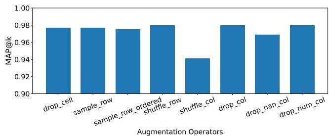
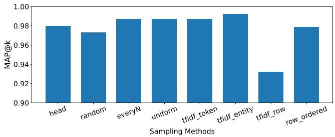
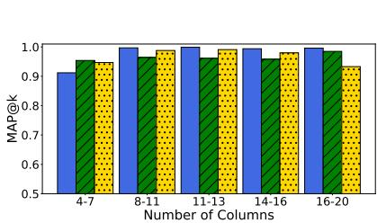
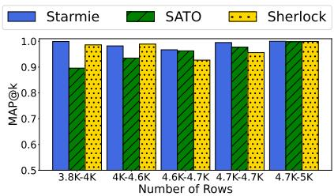
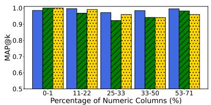
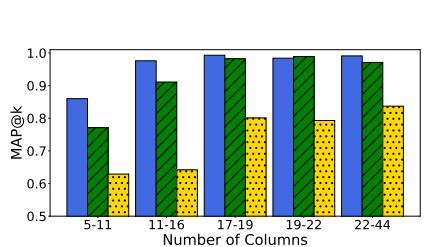
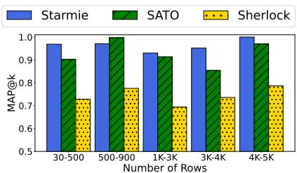
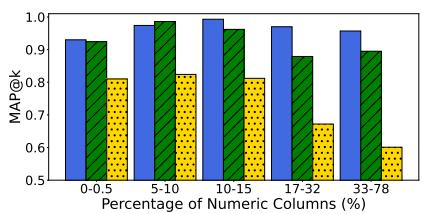
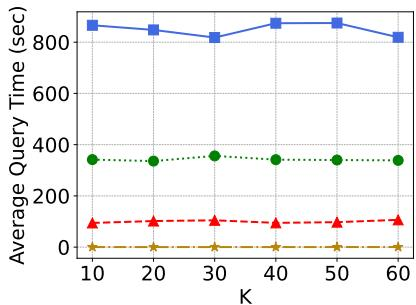

[1] Marco D. Adelfio and Hanan Samet. 2013. Schema Extraction for Tabular Data on the Web. Proc. VLDB Endow. 6, 6 (2013), 421–432.   
[2] Alex Bogatu, Alvaro A. A. Fernandes, Norman W. Paton, and Nikolaos Konstantinou. 2020. Dataset Discovery in Data Lakes. In ICDE. 709–720.   
[3] Dan Brickley, Matthew Burgess, and Natasha F. Noy. 2019. Google Dataset Search: Building a search engine for datasets in an open Web ecosystem. In WWW. 1365–1375.   
[4] Michael J. Cafarella, Alon Y. Halevy, and Nodira Khoussainova. 2009. Data Integration for the Relational Web. Proc. VLDB Endow. 2, 1 (2009), 1090–1101.   
[5] Michael J. Cafarella, Alon Y. Halevy, Daisy Zhe Wang, Eugene Wu, and Yang Zhang. 2008. WebTables: exploring the power of tables on the web. PVLDB 1, 1 (2008), 538–549.   
[6] Riccardo Cappuzzo, Paolo Papotti, and Saravanan Thirumuruganathan. 2020. Creating Embeddings of Heterogeneous Relational Datasets for Data Integration Tasks. In SIGMOD, David Maier, Rachel Pottinger, AnHai Doan, Wang-Chiew Tan, Abdussalam Alawini, and Hung Q. Ngo (Eds.). 1335–1349.   
[7] Sonia Castelo, Rémi Rampin, Aécio S. R. Santos, Aline Bessa, Fernando Chirigati, and Juliana Freire. 2021. Auctus: A Dataset Search Engine for Data Discovery and Augmentation. Proc. VLDB Endow. 14, 12 (2021), 2791–2794.   
[8] Moses Charikar. 2002. Similarity estimation techniques from rounding algorithms. In STOC. 380–388.   
[9] Tianqi Chen and Carlos Guestrin. 2016. XGBoost: A Scalable Tree Boosting System. In KDD. ACM, 785–794.   
[10] Ting Chen, Simon Kornblith, Mohammad Norouzi, and Geoffrey E. Hinton. 2020. A Simple Framework for Contrastive Learning of Visual Representations. In ICML, Vol. 119. 1597–1607.   
[11] Xiang Deng, Huan Sun, Alyssa Lees, You Wu, and Cong Yu. 2020. TURL: Table Understanding through Representation Learning. PVLDB 14, 3 (2020), 307–319.   
[12] Jacob Devlin, Ming-Wei Chang, Kenton Lee, and Kristina Toutanova. 2019. BERT: Pre-training of Deep Bidirectional Transformers for Language Understanding. In NAACL-HLT. 4171–4186.   
[13] Yuyang Dong, Kunihiro Takeoka, Chuan Xiao, and Masafumi Oyamada. 2021. Efficient Joinable Table Discovery in Data Lakes: A High-Dimensional Similarity-Based Approach. In ICDE. 456–467.   
[14] Grace Fan, Jin Wang, Yuliang Li, Dan Zhang, and Renée J. Miller. 2022. Semanticsaware Dataset Discovery from Data Lakes with Contextualized Column-based Representation Learning. CoRR abs/2210.01922 (2022). https://doi.org/10.48550/ arXiv.2210.01922   
[15] Mina H. Farid, Alexandra Roatis, Ihab F. Ilyas, Hella-Franziska Hoffmann, and Xu Chu. 2016. CLAMS: Bringing Quality to Data Lakes. In SIGMOD. 2089–2092.   
[16] Raul Castro Fernandez, Ziawasch Abedjan, Famien Koko, Gina Yuan, Samuel Madden, and Michael Stonebraker. 2018. Aurum: A Data Discovery System. In ICDE. 1001–1012.   
[17] Raul Castro Fernandez, Essam Mansour, Abdulhakim Ali Qahtan, Ahmed K. Elmagarmid, Ihab F. Ilyas, Samuel Madden, Mourad Ouzzani, Michael Stonebraker, and Nan Tang. 2018. Seeping Semantics: Linking Datasets Using Word Embeddings for Data Discovery. In ICDE. 989–1000.   
[18] Sainyam Galhotra and Udayan Khurana. 2020. Semantic Search over Structured Data. In CIKM.   
[19] Aristides Gionis, Piotr Indyk, and Rajeev Motwani. 1999. Similarity Search in High Dimensions via Hashing. In VLDB. Morgan Kaufmann, 518–529.   
[20] Hazar Harmouch, Thorsten Papenbrock, and Felix Naumann. 2021. Relational Header Discovery using Similarity Search in a Table Corpus. In ICDE. 444–455.   
[21] Madelon Hulsebos, Kevin Zeng Hu, Michiel A. Bakker, Emanuel Zgraggen, Arvind Satyanarayan, Tim Kraska, Çagatay Demiralp, and César A. Hidalgo. 2019. Sherlock: A Deep Learning Approach to Semantic Data Type Detection. In KDD. 1500–1508.   
[22] Hiroshi Iida, Dung Thai, Varun Manjunatha, and Mohit Iyyer. 2021. TABBIE: Pretrained Representations of Tabular Data. In NAACL-HLT. 3446–3456.   
[23] Aamod Khatiwada, Grace Fan, Roee Shraga, Zixuan Chen, Wolfgang Gatterbauer, Renée J. Miller, and Mirek Riedewald. 2023. SANTOS: Relationship-based Semantic Table Union Search. In SIGMOD.   
[24] Christos Koutras, George Siachamis, Andra Ionescu, Kyriakos Psarakis, Jerry Brons, Marios Fragkoulis, Christoph Lofi, Angela Bonifati, and Asterios Katsifodimos. 2021. Valentine: Evaluating Matching Techniques for Dataset Discovery. In ICDE. 468–479.   
[25] Oliver Lehmberg and Christian Bizer. 2017. Stitching Web Tables for Improving Matching Quality. Proc. VLDB Endow. 10, 11 (2017), 1502–1513.   
[26] Oliver Lehmberg, Dominique Ritze, Robert Meusel, and Christian Bizer. 2016. A Large Public Corpus of Web Tables containing Time and Context Metadata. In WWW (Companion Volume). ACM, 75–76.   
[27] Aristotelis Leventidis, Laura Di Rocco, Wolfgang Gatterbauer, Renée J. Miller, and Mirek Riedewald. 2021. DomainNet: Homograph Detection for Data Lake Disambiguation. In EDBT. 13–24.   
[28] Chen Li, Jiaheng Lu, and Yiming Lu. 2008. Efficient Merging and Filtering Algorithms for Approximate String Searches. In ICDE. 257–266.

[29] Yuliang Li, Jinfeng Li, Yoshihiko Suhara, AnHai Doan, and Wang-Chiew Tan. 2020. Deep Entity Matching with Pre-Trained Language Models. PVLDB 14, 1 (2020), 50–60.   
[30] Yuliang Li, Jinfeng Li, Yoshihiko Suhara, Jin Wang, Wataru Hirota, and Wang-Chiew Tan. 2021. Deep Entity Matching: Challenges and Opportunities. ACM J. Data Inf. Qual. 13, 1 (2021), 1:1–1:17.   
[31] Girija Limaye, Sunita Sarawagi, and Soumen Chakrabarti. 2010. Annotating and Searching Web Tables Using Entities, Types and Relationships. Proc. VLDB Endow. 3, 1 (2010), 1338–1347.   
[32] Xiao Ling, Alon Y. Halevy, Fei Wu, and Cong Yu. 2013. Synthesizing Union Tables from the Web. In IJCAI. 2677–2683.   
[33] Yinhan Liu, Myle Ott, Naman Goyal, Jingfei Du, Mandar Joshi, Danqi Chen, Omer Levy, Mike Lewis, Luke Zettlemoyer, and Veselin Stoyanov. 2019. RoBERTa: A Robustly Optimized BERT Pretraining Approach. CoRR abs/1907.11692 (2019).   
[34] Yury A. Malkov and Dmitry A. Yashunin. 2020. Efficient and Robust Approximate Nearest Neighbor Search Using Hierarchical Navigable Small World Graphs. IEEE Trans. Pattern Anal. Mach. Intell. 42, 4 (2020), 824–836.   
[35] Christopher D. Manning, Prabhakar Raghavan, and Hinrich Schütze. 2008. Introduction to information retrieval. Cambridge University Press.   
[36] Suvodeep Mazumdar and Ziqi Zhang. 2016. Visualizing Semantic Table Annotations with TableMiner+. In ISWC, Vol. 1690.   
[37] Renée J. Miller. 2018. Open Data Integration. Proc. VLDB Endow. 11, 12 (2018), 2130–2139.   
[38] Renée J. Miller, Fatemeh Nargesian, Erkang Zhu, Christina Christodoulakis, Ken Q. Pu, and Periklis Andritsos. 2018. Making Open Data Transparent: Data Discovery on Open Data. IEEE Data Eng. Bull. 41, 2 (2018), 59–70.   
[39] Fatemeh Nargesian, Erkang Zhu, Renée J. Miller, Ken Q. Pu, and Patricia C. Arocena. 2019. Data Lake Management: Challenges and Opportunities. Proc. VLDB Endow. 12, 12 (2019), 1986–1989.   
[40] Fatemeh Nargesian, Erkang Zhu, Ken Q. Pu, and Renée J. Miller. 2018. Table Union Search on Open Data. Proc. VLDB Endow. 11, 7 (2018), 813–825.   
[41] Masayo Ota, Heiko Mueller, Juliana Freire, and Divesh Srivastava. 2020. Data-Driven Domain Discovery for Structured Datasets. Proc. VLDB Endow. 13, 7 (2020), 953–965.   
[42] Nils Reimers and Iryna Gurevych. 2019. Sentence-BERT: Sentence Embeddings using Siamese BERT-Networks. In EMNLP. Association for Computational Linguistics, 3980–3990.   
[43] Aécio S. R. Santos, Aline Bessa, Christopher Musco, and Juliana Freire. 2022. A Sketch-based Index for Correlated Dataset Search. In ICDE. 2928–2941.   
[44] Anish Das Sarma, Lujun Fang, Nitin Gupta, Alon Y. Halevy, Hongrae Lee, Fei Wu, Reynold Xin, and Cong Yu. 2012. Finding related tables. In SIGMOD. 817–828.   
[45] Yoshihiko Suhara, Jinfeng Li, Yuliang Li, Dan Zhang, Çagatay Demiralp, Chen Chen, and Wang-Chiew Tan. 2022. Annotating Columns with Pre-trained Language Models. In SIGMOD. 1493–1503.   
[46] Ashish Vaswani, Noam Shazeer, Niki Parmar, Jakob Uszkoreit, Llion Jones, Aidan N. Gomez, Lukasz Kaiser, and Illia Polosukhin. 2017. Attention is All you Need. In NeurIPS. 5998–6008.   
[47] Petros Venetis, Alon Y. Halevy, Jayant Madhavan, Marius Pasca, Warren Shen, Fei Wu, Gengxin Miao, and Chung Wu. 2011. Recovering Semantics of Tables on the Web. Proc. VLDB Endow. 4, 9 (2011), 528–538.   
[48] Daheng Wang, Prashant Shiralkar, Colin Lockard, Binxuan Huang, Xin Luna Dong, and Meng Jiang. 2021. TCN: Table Convolutional Network for Web Table Interpretation. In WWW. 4020–4032.   
[49] Jin Wang, Chunbin Lin, and Carlo Zaniolo. 2019. MF-Join: Efficient Fuzzy String Similarity Join with Multi-level Filtering. In ICDE. 386–397.   
[50] Thomas Wolf, Lysandre Debut, Victor Sanh, and et al. 2020. Transformers: Stateof-the-Art Natural Language Processing. In EMNLP. 38–45.   
[51] Jiacheng Wu, Yong Zhang, Jin Wang, Chunbin Lin, Yingjia Fu, and Chunxiao Xing. 2019. Scalable Metric Similarity Join Using MapReduce. In ICDE. 1662–1665.   
[52] Mohamed Yakout, Kris Ganjam, Kaushik Chakrabarti, and Surajit Chaudhuri. 2012. InfoGather: entity augmentation and attribute discovery by holistic matching with web tables. In SIGMOD. ACM, 97–108.   
[53] Pengcheng Yin, Graham Neubig, Wen-tau Yih, and Sebastian Riedel. 2020. TaBERT: Pretraining for Joint Understanding of Textual and Tabular Data. In ACL. 8413–8426.   
[54] Dan Zhang, Yoshihiko Suhara, Jinfeng Li, Madelon Hulsebos, Çagatay Demiralp, and Wang-Chiew Tan. 2020. Sato: Contextual Semantic Type Detection in Tables. PVLDB 13, 11 (2020), 1835–1848.   
[55] Yi Zhang and Zachary G. Ives. 2020. Finding Related Tables in Data Lakes for Interactive Data Science. In SIGMOD. 1951–1966.   
[56] Ziqi Zhang. 2017. Effective and efficient Semantic Table Interpretation using TableMiner+. Semantic Web 8, 6 (2017), 921–957.   
[57] Zixuan Zhao and Raul Castro Fernandez. 2022. Leva: Boosting Machine Learning Performance with Relational Embedding Data Augmentation. In SIGMOD. 1504– 1517.   
[58] Erkang Zhu, Dong Deng, Fatemeh Nargesian, and Renée J. Miller. 2019. JOSIE: Overlap Set Similarity Search for Finding Joinable Tables in Data Lakes. In SIGMOD. 847–864.

[59] Erkang Zhu, Fatemeh Nargesian, Ken Q. Pu, and Renée J. Miller. 2016. LSH Ensemble: Internet-Scale Domain Search. Proc. VLDB Endow. 9, 12 (2016), 1185– 1196.

  
Figure 12: MAP@10 results on SANTOS Small benchmark using different augmentation operators.

# A OPTIMIZING TABLE PREPROCESSING

As such, the default table preprocessing method can fail to capture the most relevant information from the input table for the downstream tasks. To address this issue, in Starmie, we explore a design space for tuning and optimizing this process to make hyper-parameter tuning and future exploration easier.

To start, we first determine whether to read the table horizontally (row by row) or vertically (column by column). Since table union search typically relies on column alignment, we assume that the column-ordered method will achieve better performance, which is verified empirically in Section 5. We assume the column-order approach for the rest of the design options. Next we explore a reasonable solution from the following three aspects.

Token/cell scoring functions. First of all we need to decide how to score the importance of each token or cell for each column. Here we consider the TF-IDF method for token scoring, where the importance of each token is computed as its inverse document frequency $\log ( M ) / | \{ t \mid { \mathsf { t o k e n } } \in t \} |$ , where $t$ is a column and $M$ is the number of all data lake columns. Then the cell score is obtained by summing or averaging the TF-IDF scores of tokens in it.

Deterministic vs. non-deterministic. After obtaining the score of each cell, we sort cells in the descending order of importance scores for each column. Next, we can select and concatenate the tokens/cells either in a deterministic manner, e.g., in the descending order of the importance score, until we reach the token budget for each column (the max length uniformly distributed among columns), or a non-deterministic one by sampling the tokens/cells with probability proportional to their importance scores. We try both ways in our experiments.

Row alignment. Finally, we need to align the selected cells in a column. If we simply concatenate the top-ranked tokens or cells, the row-alignment information from the original table might be lost after preprocessing. In other words, the order of cells in the serialized columns may not follow the same order of the rows. Row alignment information can be useful, e.g., (“California”, “Sacramento”) and (“New York”, “Albany”) as in our example for capturing the state-capital relation. We propose another option that ranks all the rows by their average cell-level scores and then selects the rows to be included in the serialization result in either deterministic or non-deterministic ways.

# B COMPARING DIFFERENT OPERATORS

# B.1 Augmentation Operators

To find the most effective augmentation operator used in pretraining (Section 3.3) on the SANTOS Small benchmark, we conduct experiments comparing the MAP@k scores of different op’s, shown in Figure 12. Specifically, we experiment with augmentation operators at different table levels, including some of the operators listed in Table 1:

# Cell-Level:

• drop_cell: drops a random cell in a column

# Row-Level:

• sample_row: samples a random percentage of the rows   
• sample_row_ordered: samples random percentage of the rows, while preserving the original order of the rows   
• shuffle_row: shuffles the row order

# Column-Level:

• shuffle_col: shuffles the column order   
• drop_col: drops a random subset of column   
• drop_nan_col: drops columns consisting mostly of NaN’s   
• drop_num_col: drops a random subset of numeric columns

From this ablation study, we find that the column-level operator drop_col leads to the highest MAP@k of $9 8 \% .$ and thus conduct the effectiveness experiments with the drop_col op.

# B.2 Sampling Methods

  
Figure 13: MAP@10 results on SANTOS Small benchmark using different sampling methods.

We also conduct an empirical study comparing different sampling methods to find the method that best preserves the most meaningful tokens in table preprocessing. Specifically, we experiment with the following sampling methods, categorized by the level of the table. Note that all methods preserve the original order of the tokens/cells/rows, while taking unique samples:

# Column-Based, Token-Level:

• head: sample first N tokens   
• random: randomly sample tokens   
• everyN: sample every Nth token   
• uniform: sample most frequently-occurring tokens   
• tfidf_token: sample tokens with highest TF-IDF   
• alphaHead: sample first N tokens sorted alphabetically scores

# Column-Based, Cell-Level:

• tfidf_entity: sample cells in a column with highest average TF-IDF scores over its tokens

# Row-Level:

• tfidf_row: samples rows with highest average TF-IDF scores over tokens in a row   
• row_ordered: sample and serialize tokens in a row

For the design space listed in Section A, we reach the following conclusions from the results shown in Figure 13:

Row-ordered vs. column-ordered: Out of all the sampling methods, the only row-ordered method is “row_ordered" (tfidf_row is column-ordered but selects cells based on the highest average TF-IDF score across the row). The column-ordered methods outperform row_ordered, with the highest column-ordered method tfidf_entity achieving a MAP@k of $9 9 . 3 \%$ while row_ordered has a MAP@k of $9 7 . 9 \%$ , thus confirming the original hypothesis.

Token/cell scoring functions: So far we have experimented with simple scoring functions (e.g. head, random), with the most complex scoring function being TF-IDF. However, we can see that the TF-IDF-based methods, specifically tfidf_entity performs the best.

Deterministic vs. non-deterministic: All methods except for “random" are deterministic. Since the best-performing deterministic method, tfidf_entity, outperforms the non-deterministic method “random" (which achieves a MAP@k of $9 7 . 3 \%$ ) we conclude that deterministic methods are more effective.

Row alignment: Methods tfidf_row and row-ordered preserve the row alignment. We can see that column alignment is still more effective, but this design space requires further experimentation.

All in all, this ablation study on the SANTOS Small benchmark shows that the sampling method tfidf_entity performs the best, with a MAP@k of $9 9 . 3 \%$ . Thus, we conduct our effectiveness experiments on the SANTOS Small benchmark with tfidf_entity as the sampling method.

# C IN-DEPTH ANALYSIS ON EFFECTIVENESS

Similar to the in-depth analyses conducted for SANTOS Small benchmark, shown in Figure 9, we conduct experiments on both TUS benchmarks to analyze Starmie’s performance compared to the baselines SATO and Sherlock. With the same three analyses per benchmark, and the same division of tables into 5 buckets, we first explore the MAP@k results on the TUS Small benchmark. In Figure 14, Starmie again outperforms the baselines and is robust to data containing large numbers of columns, rows, and high percentage of numeric columns. The baselines also show relatively consistent results across all buckets in the three analyses, which can be attributed to the fact that the TUS Small benchmark is derived from only 10 seed tables, and thus may not exhibit much heterogeneity. This hypothesis requires further analysis.

Conducting the same analyses on the TUS Large benchmark, we see in Figure 15 that Starmie also outperforms the baselines and is consistent across all buckets. On this larger benchmark, even when the baselines’ MAP@k performance drops as the number of rows increases or as the percentage of numeric columns increases, Starmie MAP@k remains consistently high, proving again that Starmie performs well across tables of various sizes and columns of different types.

# D FULL RESULTS FOR EFFICIENCY EXPERIMENTS

# D.1 Efficiency Techniques impact on Performance

Table 8: Efficiency Techniques’ impact on query time and performance on the SANTOS labeled benchmark   

<table><tr><td>Method</td><td>Technique</td><td>MAP@10</td><td>P@10</td><td>R@10</td><td>Q. Time (sec)</td></tr><tr><td rowspan="4">Starmie</td><td>Linear</td><td>0.993</td><td>0.984</td><td>0.737</td><td>96</td></tr><tr><td>Pruning</td><td>0.993</td><td>0.984</td><td>0.737</td><td>61</td></tr><tr><td>LSH Index</td><td>0.932</td><td>0.780</td><td>0.580</td><td>12</td></tr><tr><td>HNSW Index</td><td>0.945</td><td>0.810</td><td>0.606</td><td>4</td></tr><tr><td rowspan="4">SATO</td><td>Linear</td><td>0.878</td><td>0.806</td><td>0.594</td><td>252</td></tr><tr><td>Pruning</td><td>0.878</td><td>0.806</td><td>0.594</td><td>125</td></tr><tr><td>LSH Index</td><td>0.818</td><td>0.712</td><td>0.528</td><td>89</td></tr><tr><td>HNSW Index</td><td>0.730</td><td>0.520</td><td>0.378</td><td>69</td></tr><tr><td rowspan="4">Sherlock</td><td>Linear</td><td>0.782</td><td>0.672</td><td>0.493</td><td>264</td></tr><tr><td>Pruning</td><td>0.782</td><td>0.672</td><td>0.493</td><td>145</td></tr><tr><td>LSH Index</td><td>0.737</td><td>0.612</td><td>0.449</td><td>100</td></tr><tr><td>HNSW Index</td><td>0.705</td><td>0.550</td><td>0.406</td><td>120</td></tr><tr><td rowspan="4">SingleCol</td><td>Linear</td><td>0.891</td><td>0.798</td><td>0.588</td><td>108</td></tr><tr><td>Pruning</td><td>0.891</td><td>0.798</td><td>0.588</td><td>100</td></tr><tr><td>LSH Index</td><td>0.801</td><td>0.538</td><td>0.406</td><td>11</td></tr><tr><td>HNSW Index</td><td>0.803</td><td>0.550</td><td>0.418</td><td>2</td></tr></table>

As we experiment with different efficiency techniques in Section 5.3, we also explore their effects on not only the runtimes but also the effectiveness scores. Table 5 explores the different efficiency techniques for the Starmie method, showing that they lead to great speedup while preserving the Starmie performance. In Table 8, we expand on this experiment and apply the efficiency techniques to other embeddings, specifically those of the baselines SATO, Sherlock, and SingleCol. We see that the Pruning technique speeds up the query time by 1.1-2X, while consistently preserving the performance scores perfectly. For indexing techniques, LSH index and HNSW index speed up the query times by 2.6-10X and 2-24X, respectively. Even with the fastest speedup from HNSW index, the baselines SATO and Sherlock are still slower than Starmie while having worse performance scores. As expected, SingleCol is faster as it does not have the cost from the table context. However, even with the fastest query times from the approximation technique HNSW index, Starmie still outperforms all baselines.

# D.2 k-Scalability on WDC Benchmark

For the scalability experiments, in Section 5.3 we experiment with the 4 efficiency techniques on Starmie on the SANTOS Large and WDC benchmarks. In Figure 10(a), we show the experiment on SANTOS Large as we increase k from 10 to 60. In Figure 16, we show the same experiment on 1M of the WDC tables. The trends across both figures are similar, with the HNSW index having the fastest query time, followed by LSH index, Pruning, then Linear. However here, HNSW index has a much more impressive performance with the query time remaining around 250 ms as k increases to 60, which is 3000X faster than Linear and 400X faster than LSH index. Thus,

  
0.2 (a) ??????@?? of different # Cols

  
(b) ??????@?? of different # Rows

  
(c) $M A P @ k$ of different % Num. Cols

  
Figure 14: In-depth Analyses of Starmie, SATO, and Sherlock as we vary the number of columns, number of rows, and percent-3-7 8-9 age of numerical columns on the TUS Small benchmark.   
0.2 (a) ??????@?? of different # Cols

  
(b) ??????@?? of different # Rows

  
(c) $M A P @ k$ of different % Num. Cols

  
0.0Figure 15: In-depth Analyses of Starmie, SATO, and Sherlock as we vary the number of columns, number of rows, and percent-3-7 8-9 age of numerical columns on the TUS Large benchmark.   
Data Figure 16: Scalability on 1M WDC tables with varying k’s

Starmie is generally robust in query time as the number of results to return increases, and is sped up the most with HNSW index.

# E DISCOVERED COLUMN CLUSTERS

We further inspect the column values within each cluster and find that Starmie discovers clusters of finer-grained semantic types not present in the original 78 types. Table 9 shows 3 such example clusters. The majority types (from the 78 original types) of columns in the 3 clusters are “type”, “name”, and “artist” respectively. After inspecting the column values, we can interpret the types of the 3 clusters as names of schools, names of food/grocery stores, and names of songs. It is difficult to discover such fine-grained types by existing methods based on supervised classification.

Table 10 shows the full results of column clustering. We use Sherlock, Sato, Starmie, and its single-column version to generate the column embeddings. After obtaining the column embeddings,

we construct a similarity graph by adding edges between pairs of columns with similarity above a threshold $\tau = 0 . 6$ . We then cluster the columns by computing their connected components. Note that for fair comparison, we restrict the size of clusters to be around 50 so that different methods generate similar numbers of clusters. We measure the quality of clusters by their purity scores, which measure how likely a column is assigned to a cluster with the same majority semantic type as that of the column. Among the 4 methods, Starmie generates clusters with the highest purity score of $5 1 . 1 9 \%$ .

# F FULL RESULTS FOR DATA DISCOVERY FOR ML

Table 11 shows the full results of the 25 rating prediction tasks created from 4,130 WDC web tables of $\ge 5 0$ rows. Each dataset is split into a training and a testing set at a 4:1 ratio. The baseline methods are:

NoJoin: Train a XGBoost model with numeric and textual features from the original table $S$ only. We featurize text attributes using the Sentence Transformers library [42].

Jaccard: Perform an equal left-join with a table that contains a column with the highest Jaccard similarity with any column in the query table. Namely, given a query table $S = \{ s _ { 1 } , \ldots , s _ { n } \}$ of $n$ non-target columns and a data lake $\mathcal { T }$ , we join $S$ with the data lake table

$$
\underset {T \in \mathcal {T}} {\operatorname {a r g m a x}} \left(\max  _ {s _ {i} \in S, t _ {j} \in T} \left(\text {J a c c a r d} (s _ {i}, t _ {j})\right)\right)
$$

where Jaccard $( s _ { i } , t _ { j } )$ is the token-level Jaccard similarity over tokens in query column $s _ { i }$ and data lake column $t _ { j }$ . Note that we

Table 9: Column clusters discovered by Starmie. We show the first 3 values from 3 columns of each cluster. The clusters have finer-grained types (e.g., names of schools, grocery stores, song names) than the original ground truth types (e.g., type, name, artist).   

<table><tr><td>Cluster type</td><td>1st Column</td><td>2nd Column</td><td>3rd Column</td></tr><tr><td>type</td><td>Emerson Elementary School</td><td>Choctawhatchee Senior High School</td><td>Sumner Academy Of Arts and Science</td></tr><tr><td>→</td><td>Banneker Elementary School</td><td>Fort Walton Beach High School</td><td>Wyandotte High School</td></tr><tr><td>Names of schools</td><td>Silver City Elementary School</td><td>Ami Kids Emerald Coast</td><td>J C Harmon High School</td></tr><tr><td>name</td><td>People&#x27;s Grocery Co-op Exchange</td><td>Amazing Grains</td><td>Apples Street Market</td></tr><tr><td>→</td><td>Prairieland Market</td><td>BisMan Community Food Cooperative</td><td>Bexley Natural Market</td></tr><tr><td>Food/grocery stores</td><td>The Merc (Community Mercantile)</td><td>Bowdon Locker &amp; Grocery</td><td>Kent Natural Foods Co-op</td></tr><tr><td>artist</td><td>I Don&#x27;t Give A ...</td><td>Spoken Intro</td><td>New Wave</td></tr><tr><td>→</td><td>I&#x27;m The Kinda</td><td>The Court</td><td>Up The Cuts</td></tr><tr><td>Song names</td><td>I U She</td><td>Maze</td><td>Thrush Unreal</td></tr></table>

Table 10: Purity scores of clusters by Starmie vs. Sherlock and Sato.   

<table><tr><td></td><td>n_Clusters</td><td>avg. cluster size</td><td>Purity (%)</td></tr><tr><td>Sherlock</td><td>2,395</td><td>49.84</td><td>30.50</td></tr><tr><td>Sato</td><td>2,456</td><td>48.60</td><td>37.36</td></tr><tr><td>Starmie</td><td>2,297</td><td>51.96</td><td>51.19</td></tr><tr><td>Starmie (SingleCol)</td><td>9,252</td><td>12.90</td><td>20.38</td></tr></table>

exclude “rating” columns from $T$ to avoid any potential label leakage.

Overlap: In this baseline, we simply replace Jaccard similarity from above with the overlap score, i.e., Overlap $( s _ { i } , t _ { j } ) : = | { \mathsf { t o k e n s } } ( s _ { i } ) \cap$ tokens $( t _ { j } ) |$ .

Starmie: For Starmie, we use the learned contextualized embeddings for measuring similarities of columns. Since the embeddings capture the table context of each column, we expect the resulting

data tables to be semantically relevant to the query table. More formally, let M be the learned column encoder, Starmie joins $S$ with the table

$$
\operatorname *{argmax}_{T\in \mathcal{T}}(\max_{s_{i}\in S,t_{j}\in T}(\cos (\mathcal{M}(s_{i}),\mathcal{M}(t_{j}))) +
$$

$$
\max  _ {t _ {j} \in T} (\cos (\mathcal {M} (s _ {\text {t a r g e t}}), \mathcal {M} (t _ {j})))
$$

Note that we use the second term with the source target column ??target (i.e., “Rating”) to take into account the similarity between the target column with columns from the data lake table ?? .

Lastly, an important implementation detail is to make sure that the join result has the exact same number of rows with the query table ??. This is done by properly left-joining with the data lake table ?? . This is done via the pandas DataFrame command:

# de-duplicate table T on column t_j   
${ \textsf { T } } = { \textsf { T } }$ .drop_duplicates(subset=[t_j]).set_index(t_j)   
# left-join on the column pair (s_i, t_j)   
S.join(T, $\mathsf { o n } { = } s _ { - } \mathrm { i }$ )

Table 11: Detailed MSE scores of 25 regressions tasks with different data discovery methods. The Reduction columns measure the improvement of each method against NoJoin.   

<table><tr><td>#row (train+test)</td><td>NoJoin</td><td>Jaccard</td><td>Reduction</td><td>Overlap</td><td>Reduction</td><td>Starmie</td><td>Reduction</td></tr><tr><td>200</td><td>0.0820</td><td>0.0885</td><td>-0.0790</td><td>0.0862</td><td>-0.0508</td><td>0.0862</td><td>-0.0508</td></tr><tr><td>200</td><td>0.2360</td><td>0.2359</td><td>0.0003</td><td>0.2368</td><td>-0.0033</td><td>0.2359</td><td>0.0003</td></tr><tr><td>200</td><td>0.0778</td><td>0.0653</td><td>0.1604</td><td>0.0803</td><td>-0.0316</td><td>0.0653</td><td>0.1604</td></tr><tr><td>250</td><td>0.0008</td><td>0.0008</td><td>0.0000</td><td>0.0008</td><td>0.0000</td><td>0.0008</td><td>0.0000</td></tr><tr><td>644</td><td>0.0865</td><td>0.0880</td><td>-0.0174</td><td>0.0880</td><td>-0.0174</td><td>0.0880</td><td>-0.0174</td></tr><tr><td>533</td><td>0.1065</td><td>0.1235</td><td>-0.1599</td><td>0.1235</td><td>-0.1599</td><td>0.1235</td><td>-0.1599</td></tr><tr><td>200</td><td>0.1269</td><td>0.1313</td><td>-0.0349</td><td>0.1223</td><td>0.0365</td><td>0.1223</td><td>0.0365</td></tr><tr><td>200</td><td>0.0236</td><td>0.0262</td><td>-0.1080</td><td>0.0232</td><td>0.0179</td><td>0.0262</td><td>-0.1080</td></tr><tr><td>535</td><td>0.0487</td><td>0.0409</td><td>0.1586</td><td>0.0409</td><td>0.1586</td><td>0.0409</td><td>0.1586</td></tr><tr><td>200</td><td>0.1598</td><td>0.1544</td><td>0.0337</td><td>0.1195</td><td>0.2520</td><td>0.1195</td><td>0.2520</td></tr><tr><td>200</td><td>0.0206</td><td>0.0214</td><td>-0.0389</td><td>0.0214</td><td>-0.0389</td><td>0.0214</td><td>-0.0389</td></tr><tr><td>529</td><td>0.0566</td><td>0.0441</td><td>0.2208</td><td>0.0441</td><td>0.2208</td><td>0.0441</td><td>0.2208</td></tr><tr><td>472</td><td>0.1731</td><td>0.1355</td><td>0.2176</td><td>0.1355</td><td>0.2176</td><td>0.1355</td><td>0.2176</td></tr><tr><td>200</td><td>0.0176</td><td>0.0197</td><td>-0.1178</td><td>0.0197</td><td>-0.1178</td><td>0.0192</td><td>-0.0865</td></tr><tr><td>200</td><td>0.0381</td><td>0.0350</td><td>0.0824</td><td>0.0381</td><td>-0.0001</td><td>0.0350</td><td>0.0824</td></tr><tr><td>200</td><td>0.0118</td><td>0.0097</td><td>0.1779</td><td>0.0101</td><td>0.1420</td><td>0.0092</td><td>0.2239</td></tr><tr><td>200</td><td>0.0515</td><td>0.0515</td><td>0.0000</td><td>0.0515</td><td>0.0000</td><td>0.0515</td><td>0.0000</td></tr><tr><td>387</td><td>0.0662</td><td>0.0655</td><td>0.0104</td><td>0.0685</td><td>-0.0344</td><td>0.0655</td><td>0.0104</td></tr><tr><td>434</td><td>0.0988</td><td>0.0765</td><td>0.2250</td><td>0.0765</td><td>0.2250</td><td>0.0765</td><td>0.2250</td></tr><tr><td>200</td><td>0.0177</td><td>0.0177</td><td>0.0018</td><td>0.0177</td><td>0.0018</td><td>0.0177</td><td>0.0018</td></tr><tr><td>200</td><td>0.1066</td><td>0.1066</td><td>0.0000</td><td>0.0904</td><td>0.1522</td><td>0.0129</td><td>0.8790</td></tr><tr><td>200</td><td>0.1064</td><td>0.0829</td><td>0.2210</td><td>0.1026</td><td>0.0352</td><td>0.0829</td><td>0.2210</td></tr><tr><td>200</td><td>0.1875</td><td>0.1929</td><td>-0.0285</td><td>0.1894</td><td>-0.0101</td><td>0.1894</td><td>-0.0101</td></tr><tr><td>300</td><td>0.0001</td><td>0.0001</td><td>0.1302</td><td>0.0001</td><td>-0.0222</td><td>0.0001</td><td>0.1302</td></tr><tr><td>250</td><td>0.1488</td><td>0.1077</td><td>0.2764</td><td>0.1152</td><td>0.2261</td><td>0.1077</td><td>0.2764</td></tr><tr><td>AVG</td><td>0.0820</td><td>0.0753</td><td>0.0533</td><td>0.0748</td><td>0.0480</td><td>0.0699</td><td>0.1050</td></tr></table>
