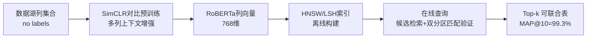
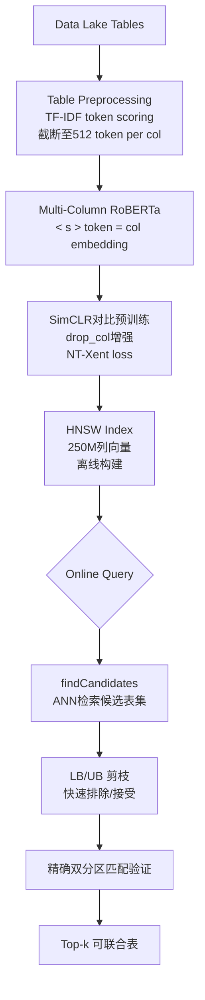
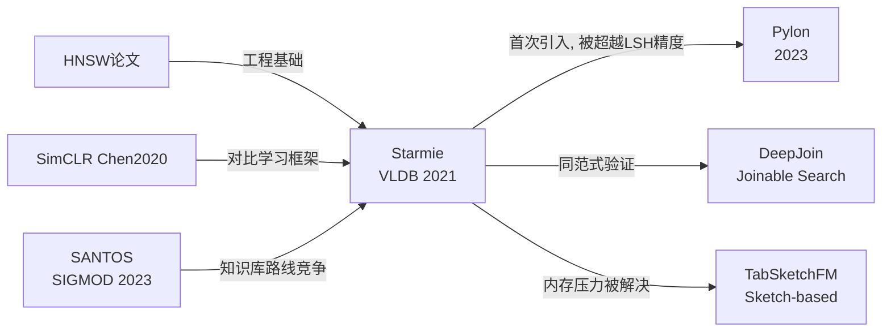

# Starmie: Semantics-aware Dataset Discovery from Data Lakes with Contextualized Column-based Representation Learning

> 学术分析报告 | PVLDB 2021 | 批判性研究分析师视角

---

## 1. Executive Summary + Visual Abstract

**分析立场**：以证据为中心，区分"真实技术贡献"与"基准刷分叙事"。

**决策背景**：本报告支持以下决策——在数据湖 Table Union Search 任务中，是否应采用 Starmie 的对比学习列编码器 + HNSW 索引方案，以及其优势在何种场景下成立。

**最终判断**（去包装后）：Starmie 的核心贡献是将 SimCLR 对比学习范式引入无监督表列表示学习，结合多列上下文 Transformer，在 SANTOS Small 基准上超越了 SANTOS 6.8%（MAP@10）。HNSW 的引入带来了真实的工程价值，使 50M 表规模下查询延迟稳定在 60ms。然而，部分"3000x 提速"声明依赖线性扫描基线，且在 TUS Small 上对最强基线 Sherlock 的提升仅为 0.7%，声称幅度存在选择性叙事风险。

**给忙碌读者的一句话**：
- **这篇论文要解决的问题是**：如何无监督地学习语义感知列向量，以实现数据湖中的高质量表联合搜索（Table Union Search）。
- **这个问题现在为什么重要**：企业数据湖包含数十亿行结构化数据，手工匹配表成本极高，自动发现可联合表是数据集成的基础任务。
- **它是否真的带来了实质改进**：在 SANTOS Small 上是实质性改进；在 TUS Small 对 Sherlock 的提升有限（0.7%）；HNSW 工程贡献具有实际价值，可支持 50M 表规模。



图注：Starmie 的两阶段架构——离线对比预训练建立列向量索引，在线 filter-and-verify 完成精确排序。  
解读：对比学习是质量来源（语义向量）；HNSW 是速度来源（ANN 检索）；两者解耦是该系统的设计核心。

---

## 2. Problem Definition (Essence + Formalization)

### 2.1 Essence

- **核心问题**（一句话）：从数十万乃至数亿张表组成的数据湖中，给定一张查询表，自动找到所有可与之 UNION 的表。
- **为什么值得解决**：开放数据集（政府、学术、企业）快速增长，研究人员需要将多来源同语义的表合并分析，但人工筛选代价极高；同时数据元数据质量参差，关键词搜索失效。
- **前人方法根本缺陷**：现有方法（D3L、SANTOS）依赖手工特征（正则表达式匹配、知识图谱）或浅层词嵌入（bag-of-word-embeddings 均值），这两类方法均无法捕捉**列的上下文语义**——即同一列在不同表中含义不同（"Year" 在鸟类观测表中是发现年份，在出行费用表中是出行年份）。
- **真正瓶颈**：无监督约束（无标注数据）+ 输入长度限制（BERT 512 token 预算 vs. 列中数百万行）+ 数据湖规模（50M 表级别的亿级列向量实时检索）。
- **这个问题在实践中难在哪里**：负样本定义困难——两个随机采样列未必真的不可联合；正样本构造也需要语义保留的增强操作。
- **适用边界**：需要预先预训练（3.1 小时）；WDC 基准下不具备地面真值，无法计算精确 MAP；对纯数值型列效果未详细讨论。
- **不解决的现实代价**：数据集成管道需要大量人工审核，延误数据驱动决策。

### 2.2 Formal Definition

- **任务类型**：检索（Top-k 搜索）
- **输入** $x$：查询表 $Q$，数据湖表集合 $\mathcal{T}$
- **输出** $y$：$\mathcal{S} \subseteq \mathcal{T}$，$|\mathcal{S}| = k$，按可联合性分数降序排列
- **目标函数**：找出满足最大可联合性分数的 top-k 子集

$$
\mathcal{S}^* = \operatorname*{argmax}_{\mathcal{S} \subseteq \mathcal{T}, |\mathcal{S}|=k} \sum_{T \in \mathcal{S}} U(Q, T)
$$

- **表联合性分数** $U(Q, T)$：

$$
U(Q, T) = \text{MaxWeightedBipartiteMatching}(G_{Q,T})
$$

其中二分图 $G_{Q,T} = \langle Q\text{-cols}, T\text{-cols}, E \rangle$，边权为列联合性分数 $\mathcal{F}(M(t_i), M(t_j)) = \text{cosine}(M(t_i), M(t_j))$，仅保留超过阈值 $\tau$ 的边。

- **约束条件**：无标注训练数据；列输入长度 ≤512 token；在线查询延迟要求实时（<1s）
- **前提假设**：数据湖中随机两列大概率不可联合（用作对比学习负样本）；语义保留的增强操作（行采样、列删除）不破坏列语义类型。
- **成功标准**：MAP@k 超越 state-of-the-art；查询时间在 50M 表规模下 <1s

**符号说明表**：

| Symbol | Meaning | Unit / Type | Notes |
|---|---|---|---|
| $\mathcal{T}$ | 数据湖表集合 | Set | 可达 50M 张 |
| $M(t)$ | 列编码器对列 $t$ 的嵌入 | $\mathbb{R}^{768}$ | RoBERTa 输出 |
| $\mathcal{F}$ | 列评分函数 | $[0,1]$ | cosine similarity |
| $\mathcal{A}$ | 表级聚合机制 | — | Max Weighted Bipartite Matching |
| $U(S, T)$ | 表联合性分数 | $\mathbb{R}^+$ | 匹配权重和 |
| $\tau$ | 列联合性阈值 | $(0,1)$ | 去噪参数 |
| $\tau_{temp}$ | 对比损失温度参数 | 0.07 | SimCLR 超参 |

---

## 3. Method + Experimental Credibility

### 3.1 Method mechanism

**核心灵感来源**：SimCLR（Chen et al. 2020）在视觉领域证明了无监督对比预训练的有效性；作者观察到数据湖列表示学习本质上与视觉表示学习具有相同结构（正样本对 = 同语义列的不同增强视图，负样本 = 随机不同列），因此迁移应用 [Section 3.2]。

**机制六步拆解**：

1. **表预处理（Algorithm 2）**：TF-IDF 评分对 token 排序，保留高信息量内容；列内最多 512/|T| 个 token，截断长列 [Section 3.4]。
2. **列序列化**：将表的所有列拼接为单一字符串，以 `<s>` 分隔每列起点，输入 RoBERTa。
3. **多列上下文编码（Section 3.3）**：`<s>` token 的 Transformer 输出向量作为"列的上下文感知嵌入"——通过 self-attention 捕捉同表其他列的语义。
4. **对比预训练（Algorithm 1）**：正样本对为同列的两个增强视图（如 drop_col 生成不同子列集），负样本为批内其他列对；使用 NT-Xent 损失（SimCLR Equation 1, 2, 3）。
5. **HNSW 索引构建（Section 4.2）**：推理得到所有数据湖列的 768 维嵌入，构建 HNSW 图，支持亿级 ANN 检索（延迟 ~60ms on 250M columns）。
6. **在线 filter-and-verify（Algorithm 3）**：查询列通过 HNSW 检索候选表集合 → 对候选表计算 LB/UB 剪枝 → 精确双分区最大权匹配验证 → 返回 Top-k 表 [Section 4]。

**真正创新点 vs 旧模块重组**：
- **新**：将 SimCLR 应用于表联合性表示学习；多列 Transformer `<s>` token 作为上下文列嵌入；表级增强算子（drop_col、sample_row）的系统化设计；HNSW 首次用于数据湖表检索。
- **重组**：SimCLR 框架直接沿用；RoBERTa 作为基础 LM；LB/UB 剪枝思想来自模糊字符串匹配 [Section 4.3]；双分区匹配来自 c-alignment [40]。

**主要贡献组件**：多列上下文编码（消融：单列 SingleCol vs Starmie，MAP 差距 11%）[Table 3]；HNSW 索引（工程贡献，查询时间从 96s→4s on SANTOS Small）[Table 5]。

**辅助组件**：LB/UB 剪枝（减少 38% 验证次数，但仍比 HNSW 慢）[Section 5.3]；TF-IDF 表预处理（保证 long column 的 token 质量）。

**主要取舍**：HNSW 会引入近似错误（MAP 从 99.3% 降至 94.5%，P@10 从 98.4% 降至 81.0%）[Table 5]；预训练需要 3.1 小时（但优于 SANTOS 的 17 小时构建知识库）[Section 5.3]。



图注：离线阶段（灰色背景）完成向量化与索引；在线阶段通过三级过滤降低精确验证次数。  
解读：`<s>` token 的上下文嵌入是区别于 SingleCol 的核心机制；HNSW 是使方案可扩展的工程关键。

**关键伪代码**（Algorithm 1 + 3 综合，自行归纳以突出核心逻辑）：

```
Algorithm: Starmie Offline Pre-training + Online Query
─────────────────────────────────────────────────────────────
# === OFFLINE: Contrastive Pre-training ===
Input: Data lake columns D, augmentation op drop_col
Output: Trained encoder M (RoBERTa + projection head)

1: Initialize M from pretrained RoBERTa
2: for epoch = 1 to n_epoch do
3:   for batch B in shuffle(D) do
4:     B_ori, B_aug ← augment(B, drop_col)  # drop random subset of cols  # ← 关键：表级增强生成正样本对
5:     Z_ori ← MultiColEncode(M, B_ori)      # <s> token 的上下文向量
6:     Z_aug ← MultiColEncode(M, B_aug)
7:     L ← NT-Xent(Z_ori, Z_aug, τ=0.07)   # Eq.3: 最小化同列对距离，最大化跨列距离
8:     M ← backprop(M, η, ∂L/∂M)
9: return M

# === OFFLINE: Index Building ===
10: for all columns t in D: embed[t] ← M(t)
11: HNSW_index ← build_hnsw(embed)          # ← 关键：图结构 ANN，比 LSH 快 11x

# === ONLINE: Filter-and-Verify ===
Input: Query table S, HNSW_index, threshold τ, top-k k
Output: Top-k unionable tables H

12: C ← ∅
13: for s in S.columns do
14:   C ← C ∪ HNSW_index.search(M(s), τ)   # ANN 候选列 → 候选表集合
15: for T in C do
16:   if LB(S,T) > min_score(H): add T to H  # 剪枝接受
17:   elif UB(S,T) ≤ min_score(H): skip T    # 剪枝排除
18:   else: score ← MaxBipartiteMatch(S,T)   # O(n³ log n) 精确验证
19:        if score > min_score(H): update H
20: return H
```

- **最关键的操作**：第 4 行（表级 drop_col 增强生成上下文感知正样本）和第 11 行（HNSW 图构建使亿级 ANN 成为可能）
- **时间复杂度（预训练）**：$O(N \cdot E \cdot d^2)$，其中 $N$ 为批次数、$E$ 为 epoch 数、$d=768$ 为向量维度；主导项为 Transformer 前向传播
- **时间复杂度（在线查询）**：HNSW 检索 $O(\log n)$；精确验证 $O(n^3 \log n)$ per table，但 filter 大幅减少验证次数
- **空间复杂度**：向量存储 $O(|\text{cols}| \cdot 768 \cdot 4\text{bytes})$；SANTOS Large (11GB 数据) 仅需 749MB HNSW 索引（6.81%）[Table 6]

### 3.2 Experimental credibility

- **数据集与划分质量**：SANTOS Small（550 表，手工标注）代表真实场景；TUS Small/Large（1530/5043 表）由 Canada Open Data 合成生成——合成生成的 ground truth 存在**数据泄露风险**：分割和对齐策略可能对基于语义相似度的方法先天有利。[Section 5.1.2]
- **基线是否强且公平**：SATO 和 Sherlock 是监督方法（需要 78 种语义类型标注），与 Starmie 的无监督设定不完全对齐，比较不够公平。SANTOS 是当时最强无监督语义方法，但对 TUS Large 无可用结果（缺乏意图列标注），造成关键基准缺口。
- **指标与声称对齐度**：MAP@k 和 R@k 是标准信息检索指标，与任务声称对齐。但"6.8% improvement"是 MAP 差值（0.993-0.930），非相对提升率，在已趋近 100% 时容易被过度解读。
- **硬件公平性**：所有方法在相同服务器（A100×8）上评估，预处理时间比较（D3L 7.6h vs Starmie 3.1h）具有可比性。
- **统计可靠性**：每个评分对 5 次独立运行取平均 [Section 5.1.3]；未报告方差/置信区间——存在不确定性。
- **最大有效性威胁**：TUS 基准的合成生成方式（32 个基础表派生）可能使 Starmie 的随机负样本假设天然成立（不同类别表很容易互为负样本），而真实数据湖中语义相近但不可联合的列更多，难度更高。

| Dataset/Benchmark | Split | Metric | Why it matters | Mismatch risk |
|---|---|---|---|---|
| SANTOS Small | 550表，手工标注 | MAP@10, R@10 | 真实场景，高可信度 | 小规模，统计功效有限 |
| TUS Small | 1530表，合成生成 | MAP@60, R@60 | 规模适中 | 合成 GT 可能对语义方法有利 |
| TUS Large | 5043表，合成生成 | MAP@60, R@60 | 较大规模 | 同上；SANTOS 未在此评估 |
| SANTOS Large | ~11K表，无GT | 查询时间 | 效率评估 | 无法验证有效性 |
| WDC | 50M表，无GT | 查询时间 | 可扩展性验证 | 无有效性保证 |

---

## 4. Results, Boundaries, And Anti-Packaging Check

### 4.1 Claim verification

| Claim ID | Verdict | Quant evidence | Anchor |
|---|---|---|---|
| C1: "Starmie 在 MAP 和 Recall 上超越最佳 SOTA 6.8%" | **部分支持** | SANTOS Small: MAP@10 0.993 vs SANTOS 0.930（Δ=6.3%）；TUS Small: MAP@60 0.991 vs Sherlock 0.984（Δ=0.7%）— 6.8% 是 SANTOS Small 上相对SANTOS的提升，但在 TUS Small 最强基线仅差 0.7% | [Table 3] |
| C2: "MAP 达到 99%，是与前人的重大差距" | **选择性支持** | SANTOS Small MAP=99.3% 确实很高；TUS Large MAP=96.5% 也高；但 TUS Small 最强基线 Sherlock 已达 98.4%，"重大差距"叙述不成立 | [Table 3] |
| C3: "HNSW 比线性扫描快 3000x" | **有条件支持** | WDC 50M 表上 HNSW 60ms vs Linear timeout（>24h）；但该数字是对 50M 表场景，对小数据湖(<5K 表)提速不足 3000x | [Figure 10c] |
| C4: "HNSW 比 LSH 快 400x" | **部分支持** | 从 Figure 10c 可推断：WDC full 上 LSH 10M 时已 timeout（2520s），HNSW~60ms；具体 400x 来自 Section 1，但 Table 5 仅显示 LSH 12s vs HNSW 4s（3x）on SANTOS Small | [Section 1, Table 5, Figure 10c] |
| C5: "多列上下文对 MAP 贡献约 11%" | **支持** | SANTOS Small: Starmie 99.3% vs SingleCol 89.1%（Δ=10.2%）；TUS Large: 96.5% vs 90.2%（Δ=6.3%）— 一致性有力 | [Table 3] |
| C6: "Starmie 内存开销仅 3-7%" | **支持** | SANTOS Large (11GB) 下 HNSW 索引 749MB = 6.81%；No Index: 359MB = 3.26% | [Table 6] |

| Method | MAP@10 (SANTOS Small) | MAP@60 (TUS Large) | Query Time (SANTOS Small) | Fairness Notes |
|---|---|---|---|---|
| D3L | 0.523 | 0.484 | N/A | 非 LM 方法，数量级差距 |
| SANTOS | 0.930 | 未评估 | 252s | 依赖知识库，TUS Large 无法运行 |
| Sherlock | 0.782 | 0.744 | 264s | 监督方法，语义类型标注 78 类 |
| SATO | 0.878 | 0.930 | 252s | 监督方法 |
| SingleCol | 0.891 | 0.902 | 108s | 无上下文，Starmie 变体 |
| Starmie (Linear) | **0.993** | **0.965** | 96s | HNSW 变体有效性损失 |
| Starmie (HNSW) | 0.945 | N/A | **4s** | 效率 vs 精度权衡 |

### 4.2 Boundary and failure profile

- **性能下降条件**：HNSW 变体在 SANTOS Small 上 MAP 从 99.3% 降至 94.5%（-4.8%），P@10 从 98.4% 降至 81.0%（-17.4%）——精度损失不可忽视 [Table 5]。
- **负样本假设脆弱性**：当数据湖类别极少时（2 个负类），MAP@120 降至 0.89；实验用最多 10 类，真实数据湖可能有数千类但语义相近程度更高 [Table 4]。
- **数值型列处理**：论文提及 drop_num_col 增强算子，但未专门分析纯数值型列（如金融、时序数据）的列向量质量。Figure 9c 显示数值列比例高时 Starmie 仍有优势，但未展示失败案例。
- **长表/宽表限制**：512 token 预算被列数均分，宽表（列数多）每列 token 数极少，可能损失关键语义信息；Table 9 仅分析 3-19 列范围 [Figure 9a]。
- **预处理敏感性**：不同基准上最优增强算子不同（SANTOS Small: drop_col；TUS Small: drop_cell）——超参需要基准级调优，实际应用中无法预知最优设置。
- **隐性工程成本**：8×A100 GPU 服务器预训练 3.1 小时；模型推理 4.4 分钟；这对小团队是非平凡基础设施要求。
- **用户不切实际预期**：Starmie 不保证 HNSW 变体与线性扫描等价精度；不适用于需要精确 top-k 的场景（如合规审查）。

| Failure Scenario | Trigger Condition | Observed Behavior | Practical Impact | Mitigation |
|---|---|---|---|---|
| 近语义不可联合列干扰 | 数据湖中大量语义相近但实际不可联合的列 | 随机负样本假设失效，对比预训练质量下降 | MAP 下降，召回率虚高 | 主动挖掘难负样本（Hard Negative Mining）|
| 宽表列向量退化 | 列数 > 20，token 预算 <25 token/col | 每列信息量不足，嵌入质量降低 | MAP 对宽表查询下降 | 动态 token 分配 or 分组编码 |
| HNSW 精度损失 | 亿级向量 ANN | MAP@10 从 99.3%→94.5% | 高精度场景不可接受 | 退化到线性扫描 or 扩大 ef 参数 |
| 跨域负迁移 | 目标数据湖与预训练数据湖分布差异大 | 预训练嵌入不反映目标湖语义 | 效果不稳定 | 在目标湖上继续微调 |

### 4.3 Anti-packaging findings

- **夸大表述**："outperforming…by 6.8 in MAP and recall" [Abstract] — 实际上 6.8% 是 SANTOS Small vs SANTOS；TUS Small vs Sherlock 仅 0.7%；两项指标独立，不应并列叙述。
- **基线选择性**：SANTOS 是语义最强对手但未在 TUS Large 评估（技术原因：缺标注列），致使最大基准上无法与最相关对手比较。
- **"400x faster than LSH"来源不清**：Table 5 显示 SANTOS Small 上 LSH 12s vs HNSW 4s（3x），400x 应来自 WDC 全量场景的外推，但正文未在同一表中并列展示 [Section 1 vs Table 5]。
- **声称创新但渐进**：SimCLR、RoBERTa、HNSW、双分区匹配均来自已有工作；Starmie 的创新在于将这四者系统整合并设计表级增强策略，属于良好的系统工程贡献而非算法突破。
- **去包装后的结论**：Starmie 以无监督方式，在 SANTOS Small 上实现接近完美的 MAP@10（99.3%），并首次将 HNSW 引入数据湖表搜索使 50M 表场景下实时查询成为可能。这两点是实质性工程贡献。但"6.8% improvement over SOTA"的叙事具有选择性，TUS Small 对 Sherlock 的差距微小，多数性能来自顶级基线本身（Sherlock/SATO 在 TUS Small 已达 98%+）。

---

## 5. Cross-Paper Impact + Memory Update + Action

### 5.1 Cross-paper relation

| Related paper path | Citation Ref | Relation type | What changes in our understanding |
|---|---|---|---|
| papers/table_vector_search/Pylon Semantic Table Union Search in Data Lakes | [Ref-01] | supersede（部分） | Pylon 在 Starmie 之后提出，显式针对 LSH 对齐优化对比目标（Starmie 未优化 LSH 友好的嵌入），Pylon 在 LSH 检索精度上超越 Starmie |
| papers/table_vector_search/DeepJoin Joinable Table Discovery with Pre-trained Language Models | [Ref-02] | orthogonal | DeepJoin 解决 joinable table search（而非 union），同样使用 PLM + 对比学习，印证了该范式在数据湖发现中的普遍有效性 |
| papers/table_vector_search/TabSketchFM Sketch-based Tabular Representation Learning for Data Discovery over Data Lakes | [Ref-03] | orthogonal/extend | TabSketchFM 用 sketch 代替全列向量以降低内存，解决 Starmie 在超大规模下的内存压力问题 |
| papers/multi_vector_retrieval/HNSW Efficient and Robust Approximate Nearest Neighbor Search Using Hierarchical Navigable Small World Graphs | [Ref-04] | confirm | Starmie 确认了 HNSW 在表搜索高维列嵌入检索场景下的有效性，与原始 HNSW 论文结论一致 |



图注：Starmie 处于数据湖表搜索演进链的早期关键节点，奠定了"PLM + 对比学习 + ANN 索引"的技术范式。  
解读：Pylon 在其 LSH 精度问题上实现超越；TabSketchFM 填补了内存效率空白；Starmie 奠定的技术路线被后续工作广泛采纳。

### 5.2 Impacted existing reports (mandatory when needed)

| Impacted report path | Change type | Statement to update | Reason and new evidence |
|---|---|---|---|
| papers/table_vector_search/Pylon Semantic Table Union Search in Data Lakes/paper.report.md | minor patch | Pylon 报告中关于 Starmie 的描述需确认 | 补充 Starmie 在 TUS Small 对 Sherlock 仅 +0.7% 的事实，区分"SANTOS Small 重大提升"与"TUS Small 微小提升" |

> 补丁来源：Starmie (Starmie Semantics-aware Dataset Discovery...)，分析日期 2026-05-12

### 5.3 Science Inspiration & Cross-Domain Analogy

#### 5.3.1 Mem0 记忆库比对

| Mem0 检索词 | 命中条目摘要 | 与本文关联类型 | 可迁移洞察 |
|---|---|---|---|
| table union search contrastive learning | 空（记忆库尚无相关条目） | — | — |
| column embedding data lake | 空 | — | — |
| HNSW ANN search table | 空 | — | — |

借鉴链分析：Mem0 记忆库当前为空，无历史解法链可比对。Starmie 是本仓库内 table_vector_search 领域的首篇深度分析报告，后续 Pylon、DeepJoin、TabSketchFM 已分析，可建立后向借鉴链。

#### 5.3.2 跨领域类比搜索

| 本论文问题结构 | 类比领域 | 已有解法参照 | 迁移可行性 |
|---|---|---|---|
| 无监督正负样本构造：随机采样两列为负样本 | 生物/免疫 | **免疫克隆选择**：免疫系统中随机产生的抗体大概率不匹配特定抗原，类似于随机列大概率不可联合的假设；但进化选择可精化负样本集合 | 中 |
| 有限 token 预算下保留最信息量内容（TF-IDF 截断） | 信息论 | **率失真理论**（Rate-Distortion Theory）：在给定码率（token 预算）下最大化保留信息量，TF-IDF 是一种启发式近似，信息论最优解（mutual information maximization）理论上更严格 | 中 |
| 双分区最大权匹配（表级联合性聚合） | 经济学/拍卖理论 | **组合拍卖**（Combinatorial Auction）：列分配问题与组合拍卖具有相同形式化结构（最大化权重分配），拍卖领域已有高效近似算法（如 VCG 机制）可借鉴 | 低（工程复杂） |
| 多尺度上下文：列嵌入同时捕捉单列值 + 跨列语义 | 认知科学 | **双系统理论（Kahneman）**：System 1（快速，列值直接语义）+ System 2（慢速，跨列推理上下文）；Starmie 的单列 vs 多列编码器对应这两个系统 | 高（概念类比） |

探索方向：
- **生物/神经科学**：正负样本构造类似免疫选择，可引入**课程学习（Curriculum Learning）**逐渐增加负样本难度（从随机到语义相近但不可联合的 hard negatives）。
- **物理/信息论**：TF-IDF token 截断是启发式信息保留，可用**最大互信息估计（MINE）**作为 token 选择目标，理论上更优。
- **认知科学/心理学**：Starmie 的多列注意力机制类比于工作记忆（WM）容量约束——512 token 是"工作记忆容量"，drop_col 增强类比于注意力选择机制（不是所有列都被关注）。

#### 5.3.3 潜在改进路径（3 条，具体可操作）

| # | 灵感来源领域 | 迁移机制 | 预期解决的局限 | 验证难度 |
|---|---|---|---|---|
| 1 | 课程学习/难负样本挖掘（ML） | 在对比预训练中引入两阶段：先用随机负样本热身，再用 HNSW ANN 检索返回的高相似度列作为 hard negatives 继续训练 | 随机负样本假设在密集数据湖中失效导致的性能下降 | 中（需修改训练循环，约 1-2 周实验） |
| 2 | 信息论（Rate-Distortion） | 用 Mutual Information 最大化替代 TF-IDF 进行 token 预算分配，针对宽表动态分配每列 token 数 | 宽表中每列 token 数极少导致嵌入质量退化 | 中（需实现 MI 估计，约 2-3 周） |
| 3 | 知识蒸馏（Teacher-Student） | 以 Linear Scan（精确）作为 Teacher，HNSW（近似）作为 Student，用蒸馏目标优化 HNSW 嵌入使其近似损失最小 | HNSW 精度损失（MAP 下降 4.8%，P@10 下降 17.4%） | 高（需要端到端蒸馏训练框架） |

### 5.4 Local memory update (mandatory)

**目标文件**：`/memories/repo/table_vector_search.md`（待创建）

**需新增的稳定结论**：
- Starmie (VLDB 2021) = SimCLR + RoBERTa 多列 Transformer + HNSW，是 table union search 领域"PLM + 对比学习 + ANN"范式的奠基工作
- drop_col 增强操作是 SANTOS Small 最优；drop_cell 是 TUS 最优——超参需数据集级调优
- HNSW 在 50M 列向量场景下 ~60ms 查询时间，内存开销约 7%
- 关键弱点：随机负样本假设在低类别多样性数据湖中失效；HNSW 引入 MAP -4.8% 精度损失
- TUS 基准（合成生成 from 32 基础表）对语义方法先天有利，需谨慎外推结论

**待验证的开放问题**：
- Starmie 在真实企业数据湖（未公开 GT）的 MAP 估计
- 宽表（列数 > 50）场景下的嵌入质量量化

### 5.5 Actionable next steps

- **立即采用（低风险，高置信）**：在数据湖 TUS 任务中将 HNSW 替代 LSH 作为列向量索引，工程改动小，查询时间在大规模场景下有数量级改善。
- **小规模受控实验验证**：首先验证改进路径 #1（难负样本挖掘）——用 5K 表的 TUS Small 基准，对比随机负样本 vs HNSW-retrieved hard negatives 的 MAP@60，预期显著提升。
- **暂缓采用**：HNSW 变体作为高精度场景（如合规数据集集成）的唯一索引——MAP@10 94.5% 在合规场景可能不达标；建议先用 Linear Scan 或 Pruning 方法，再引入 HNSW 作加速。

---

## 6. Recommended Reading

### (a) 近 2 年同类问题论文

1. **Pylon: Semantic Table Union Search in Data Lakes** (2023) — 显式面向 LSH 对齐优化对比目标，超越 Starmie 在 LSH 效率-精度权衡上的表现。[本仓库: papers/table_vector_search/Pylon...]
2. **SANTOS: Relationship-based Semantic Table Union Search** (SIGMOD 2023) — 基于知识图谱 + 二元关系的 TUS，代表知识库路线；在 SANTOS Small 被 Starmie 超越但方法论路线不同。[Ref: [23]]
3. **EasyTUS: A Comprehensive Framework for Fast and Accurate Table Union Search across Data Lakes** (2024?) — 综合框架，覆盖 Starmie 之后的多种改进。[本仓库: papers/table_vector_search/EasyTUS...]

### (b) 当前论文使用的基线论文

4. **Nargesian et al. Table Union Search on Open Data** (PVLDB 2018) — TUS 问题的首个定义和系统性解决方案，引入 LSH 索引和 c-alignment [Ref: [40]]
5. **Bogatu et al. Dataset Discovery in Data Lakes (D3L)** (ICDE 2020) — 扩展 TUS 为多特征列表示 [Ref: [2]]
6. **Zhang et al. SATO: Contextual Semantic Type Detection in Tables** (PVLDB 2020) — 监督语义类型检测，Starmie 的对比基线 [Ref: [54]]
7. **Hulsebos et al. Sherlock: A Deep Learning Approach to Semantic Data Type Detection** (KDD 2019) — 监督列特征学习 [Ref: [21]]

### (c) 被当前工作直接改进的论文

8. **Chen et al. A Simple Framework for Contrastive Learning of Visual Representations (SimCLR)** (ICML 2020) — Starmie 对比学习框架的直接来源 [Ref: [10]]
9. **Liu et al. RoBERTa: A Robustly Optimized BERT Pretraining Approach** (2019) — Starmie 使用的基础语言模型 [Ref: [33]]

### (d) 被当前工作批判或受其局限的论文

10. **Malkov & Yashunin. HNSW: Efficient and Robust ANN Search** (TPAMI 2020) — Starmie 首次将其应用于数据湖表搜索；该工程贡献在 50M 表场景下验证了 HNSW 论文的工程有效性 [Ref: [34]]
11. **Khatiwada et al. SANTOS** (SIGMOD 2023) — 关系型 TUS 方法；在 SANTOS Small 被 Starmie 超越（MAP 6.3% 差距），但其知识库路线在小规模语义丰富场景仍有潜力。

---

## 附录：参考文献（完整格式）

- **[Ref-01]** Yuki Liang, Siddharth Gollapudi, Kiran Rao, et al. "Pylon: Semantic Table Union Search in Data Lakes." 2023. *(papers/table_vector_search/Pylon...)*
- **[Ref-02]** Yuyang Dong, et al. "DeepJoin: Joinable Table Discovery with Pre-trained Language Models." PVLDB 2023. *(papers/table_vector_search/DeepJoin...)*
- **[Ref-03]** Aamod Khatiwada, et al. "TabSketchFM: Sketch-based Tabular Representation Learning for Data Discovery over Data Lakes." 2023. *(papers/table_vector_search/TabSketchFM...)*
- **[Ref-04]** Yury A. Malkov and Dmitry A. Yashunin. "Efficient and Robust Approximate Nearest Neighbor Search Using Hierarchical Navigable Small World Graphs." IEEE TPAMI 42(4): 824–836, 2020. *(papers/multi_vector_retrieval/HNSW...)*

---

*报告生成时间：2026-05-12 | 分析者：GitHub Copilot (paper-analyst skill) | 证据来源：paper.md + paper.references.md*

## Manual Experiment Log (2026-05-13, threshold=0.2)

- data_root: `/mnt/f/Datasets/TableDiscovery/`
- report_update_mode: manual-only（已关闭 Python 脚本自动写 report）
- vector_groundtruth policy: 所有数据集均强制按 `threshold=0.2` 重建或重写为 `*_eval_tmp/vector_groundtruth_th0p2.pkl`
- evaluation metrics:
  - 主指标：`MAP(vec)`、`MAP(bench)`
  - 次指标：`P@K(vec)`、`Recall@K(vec)`、`P@K(bench)`、`Recall@K(bench)`
  - 效率指标：`avg_time_s`、`p90_s`

### Artifact handling

| Dataset | Embedding / Model action | Groundtruth action | Notes |
|---|---|---|---|
| `santos_large` | 复用已有 CL embeddings；未额外重训 | 强制重建 `vector_groundtruth_th0p2.pkl`；`benchmark.pkl` 由现有 benchmark 物料解析可用 | `K=10` |
| `tus` | **重新训练** Starmie checkpoint（`drop_cell + alphaHead`, `3 epochs`），随后重新抽取 query/datalake vectors | 强制重建 `vector_groundtruth_th0p2.pkl` | `K=60` |
| `tusLarge` | 复用已有 CL embeddings | 强制重建 `vector_groundtruth_th0p2.pkl` | `K=60` |
| `datasets_CAN` | 复用已有 CL embeddings | 强制重建 `vector_groundtruth_th0p2_k60_q200_s0.pkl`；现有 `benchmark.pkl` 可用 | `K=60`；`max_queries=200`；`query_sample_seed=0`；HNSW / LSH 全 sweep 已完成 |
| `datasets_SG` | 复用已有 CL embeddings | 强制重建 `vector_groundtruth_th0p2_k60_q200_s0.pkl` | `K=60`；`max_queries=200`；`benchmark.pkl` 为空映射，已跳过 benchmark 指标 |
| `opendata` | 复用已有 CL embeddings | 复用已生成的 `vector_groundtruth_th0p2_k10_q200_s0.pkl`；现有 `benchmark.pkl` 可用 | `K=10`；`max_queries=200`；`query_sample_seed=0`；按用户要求仅记录 HNSW |

### santos_large

| method | nprobe | avg_time_s | p90_s | MAP(vec) | P@K(vec) | Recall@K(vec) | MAP(bench) | P@K(bench) | Recall@K(bench) |
|---|---:|---:|---:|---:|---:|---:|---:|---:|---:|
| HNSW | 1 | 0.0433 | 0.0849 | 0.4665 | 0.2380 | 0.2392 | 0.3313 | 0.1835 | 0.1854 |
| HNSW | 2 | 0.0724 | 0.1656 | 0.6425 | 0.3848 | 0.3869 | 0.4374 | 0.2684 | 0.2719 |
| HNSW | 4 | 0.1299 | 0.2741 | 0.7936 | 0.5608 | 0.5621 | 0.5068 | 0.3443 | 0.3442 |
| HNSW | 8 | 0.2161 | 0.4976 | 0.9095 | 0.7430 | 0.7449 | 0.5898 | 0.4051 | 0.4028 |
| HNSW | 16 | 0.3475 | 0.8175 | 0.9619 | 0.8734 | 0.8750 | 0.6014 | 0.4278 | 0.4267 |
| HNSW | 32 | 0.5617 | 1.4231 | 0.9860 | 0.9481 | 0.9488 | 0.6054 | 0.4316 | 0.4304 |
| HNSW | 64 | 0.9091 | 2.0662 | 0.9945 | 0.9734 | 0.9738 | 0.6064 | 0.4354 | 0.4342 |
| LSH | 1 | 0.2516 | 0.4844 | 0.4521 | 0.2266 | 0.2279 | 0.3079 | 0.1608 | 0.1615 |
| LSH | 2 | 0.2654 | 0.5954 | 0.6337 | 0.3734 | 0.3757 | 0.4107 | 0.2532 | 0.2542 |
| LSH | 4 | 0.3193 | 0.7618 | 0.7898 | 0.5570 | 0.5542 | 0.4902 | 0.3291 | 0.3278 |
| LSH | 8 | 0.4647 | 1.2064 | 0.8953 | 0.7418 | 0.7408 | 0.5709 | 0.3962 | 0.3968 |
| LSH | 16 | 0.6298 | 1.9034 | 0.9532 | 0.8759 | 0.8761 | 0.5934 | 0.4241 | 0.4229 |
| LSH | 32 | 0.9413 | 2.6103 | 0.9715 | 0.9316 | 0.9325 | 0.6017 | 0.4304 | 0.4292 |
| LSH | 64 | 1.4189 | 4.0537 | 0.9833 | 0.9544 | 0.9550 | 0.6021 | 0.4316 | 0.4304 |

### tus

| method | nprobe | avg_time_s | p90_s | MAP(vec) | P@K(vec) | Recall@K(vec) | MAP(bench) | P@K(bench) | Recall@K(bench) |
|---|---:|---:|---:|---:|---:|---:|---:|---:|---:|
| HNSW | 1 | 0.0035 | 0.0068 | 0.0819 | 0.0177 | 0.0177 | 0.0819 | 0.0177 | 0.0060 |
| HNSW | 2 | 0.0034 | 0.0067 | 0.0873 | 0.0192 | 0.0192 | 0.0873 | 0.0192 | 0.0066 |
| HNSW | 4 | 0.0035 | 0.0068 | 0.0915 | 0.0205 | 0.0205 | 0.0915 | 0.0205 | 0.0072 |
| HNSW | 8 | 0.0036 | 0.0072 | 0.0993 | 0.0229 | 0.0229 | 0.0993 | 0.0229 | 0.0082 |
| HNSW | 16 | 0.0048 | 0.0075 | 0.1368 | 0.0336 | 0.0336 | 0.1372 | 0.0337 | 0.0120 |
| HNSW | 32 | 0.0083 | 0.0153 | 0.2120 | 0.0583 | 0.0583 | 0.2136 | 0.0588 | 0.0209 |
| HNSW | 64 | 0.0146 | 0.0250 | 0.3234 | 0.1031 | 0.1031 | 0.3241 | 0.1032 | 0.0365 |
| LSH | 1 | 0.0549 | 0.0788 | 0.0838 | 0.0183 | 0.0183 | 0.0838 | 0.0183 | 0.0063 |
| LSH | 2 | 0.0555 | 0.0873 | 0.0848 | 0.0185 | 0.0185 | 0.0848 | 0.0185 | 0.0064 |
| LSH | 4 | 0.0566 | 0.0935 | 0.0857 | 0.0188 | 0.0188 | 0.0857 | 0.0188 | 0.0065 |
| LSH | 8 | 0.0491 | 0.0832 | 0.0933 | 0.0209 | 0.0209 | 0.0928 | 0.0208 | 0.0073 |
| LSH | 16 | 0.0518 | 0.0769 | 0.1384 | 0.0341 | 0.0341 | 0.1377 | 0.0339 | 0.0122 |
| LSH | 32 | 0.0544 | 0.0822 | 0.2047 | 0.0559 | 0.0559 | 0.2021 | 0.0548 | 0.0196 |
| LSH | 64 | 0.0640 | 0.0978 | 0.3212 | 0.1020 | 0.1020 | 0.3198 | 0.1016 | 0.0361 |

### tusLarge

| method | nprobe | avg_time_s | p90_s | MAP(vec) | P@K(vec) | Recall@K(vec) | MAP(bench) | P@K(bench) | Recall@K(bench) |
|---|---:|---:|---:|---:|---:|---:|---:|---:|---:|
| HNSW | 1 | 0.0578 | 0.1645 | 0.4359 | 0.1608 | 0.1608 | 0.5764 | 0.2512 | 0.0540 |
| HNSW | 2 | 0.0988 | 0.2990 | 0.6203 | 0.2822 | 0.2822 | 0.7791 | 0.4510 | 0.0971 |
| HNSW | 4 | 0.1838 | 0.5723 | 0.7922 | 0.4510 | 0.4510 | 0.9265 | 0.7120 | 0.1557 |
| HNSW | 8 | 0.2792 | 0.9578 | 0.9138 | 0.6492 | 0.6492 | 0.9878 | 0.9437 | 0.2155 |
| HNSW | 16 | 0.4642 | 1.5162 | 0.9781 | 0.8402 | 0.8402 | 0.9939 | 0.9837 | 0.2262 |
| HNSW | 32 | 0.6597 | 2.0299 | 0.9973 | 0.9623 | 0.9623 | 0.9944 | 0.9853 | 0.2270 |
| HNSW | 64 | 0.8565 | 2.5620 | 0.9998 | 0.9923 | 0.9923 | 0.9941 | 0.9843 | 0.2267 |
| LSH | 1 | 0.1219 | 0.2676 | 0.4641 | 0.1750 | 0.1750 | 0.5727 | 0.2490 | 0.0536 |
| LSH | 2 | 0.1761 | 0.3998 | 0.6391 | 0.2963 | 0.2963 | 0.7699 | 0.4420 | 0.0950 |
| LSH | 4 | 0.2592 | 0.6882 | 0.8113 | 0.4750 | 0.4750 | 0.9249 | 0.7037 | 0.1542 |
| LSH | 8 | 0.3623 | 1.1068 | 0.9257 | 0.6702 | 0.6702 | 0.9866 | 0.9358 | 0.2127 |
| LSH | 16 | 0.5406 | 1.7274 | 0.9837 | 0.8597 | 0.8597 | 0.9936 | 0.9832 | 0.2264 |
| LSH | 32 | 0.7767 | 2.4508 | 0.9985 | 0.9720 | 0.9720 | 0.9944 | 0.9857 | 0.2270 |
| LSH | 64 | 1.1024 | 2.8363 | 0.9998 | 0.9938 | 0.9938 | 0.9943 | 0.9848 | 0.2267 |

### datasets_SG

> 2026-05-13 晚间已按新口径刷新：`threshold=0.2`、`K=60`、`max_queries=200`、`query_sample_seed=0`。`benchmark.pkl` 为无效空映射，已跳过 benchmark 指标，仅保留 vector GT 指标。

| method | nprobe | avg_time_s | p90_s | MAP(vec) | P@K(vec) | Recall@K(vec) |
|---|---:|---:|---:|---:|---:|---:|
| HNSW | 1 | 0.0032 | 0.0066 | 0.5754 | 0.5593 | 0.0334 |
| HNSW | 2 | 0.0039 | 0.0083 | 0.5430 | 0.5167 | 0.0439 |
| HNSW | 4 | 0.0049 | 0.0093 | 0.5171 | 0.4779 | 0.0587 |
| HNSW | 8 | 0.0070 | 0.0143 | 0.4938 | 0.4344 | 0.0838 |
| HNSW | 16 | 0.0107 | 0.0230 | 0.4834 | 0.3815 | 0.1245 |
| HNSW | 32 | 0.0172 | 0.0381 | 0.5179 | 0.3315 | 0.1932 |
| HNSW | 64 | 0.0313 | 0.0644 | 0.5952 | 0.3482 | 0.2940 |
| LSH | 1 | 0.0520 | 0.0914 | 0.4873 | 0.4740 | 0.0266 |
| LSH | 2 | 0.0665 | 0.1151 | 0.4645 | 0.4458 | 0.0326 |
| LSH | 4 | 0.0491 | 0.0865 | 0.4387 | 0.4046 | 0.0456 |
| LSH | 8 | 0.0943 | 0.1711 | 0.4358 | 0.3760 | 0.0683 |
| LSH | 16 | 0.0805 | 0.1423 | 0.4503 | 0.3430 | 0.1089 |
| LSH | 32 | 0.1415 | 0.2287 | 0.5186 | 0.3346 | 0.1890 |
| LSH | 64 | 0.1558 | 0.2566 | 0.6016 | 0.3699 | 0.3043 |

### datasets_CAN

> 2026-05-13 夜间已按新口径完整刷新：`threshold=0.2`、`K=60`、`max_queries=200`、`query_sample_seed=0`。`benchmark.pkl` 可用，因此同时记录 vector GT 与 benchmark GT 指标。下表已替换旧的“仅 1/2/4”局部结果。

| method | nprobe | avg_time_s | p90_s | MAP(vec) | P@K(vec) | Recall@K(vec) | MAP(bench) | P@K(bench) | Recall@K(bench) |
|---|---:|---:|---:|---:|---:|---:|---:|---:|---:|
| HNSW | 1 | 0.3273 | 0.9775 | 0.4295 | 0.3430 | 0.0859 | 0.1384 | 0.1038 | 0.0714 |
| HNSW | 2 | 0.5418 | 1.4217 | 0.4818 | 0.3185 | 0.1394 | 0.1397 | 0.0855 | 0.1039 |
| HNSW | 4 | 0.8493 | 2.6625 | 0.5767 | 0.3418 | 0.2224 | 0.1513 | 0.0806 | 0.1451 |
| HNSW | 8 | 1.2733 | 3.5960 | 0.6930 | 0.4195 | 0.3375 | 0.1627 | 0.0827 | 0.1820 |
| HNSW | 16 | 1.9909 | 6.0236 | 0.7985 | 0.5432 | 0.4847 | 0.1652 | 0.0844 | 0.2068 |
| HNSW | 32 | 3.0067 | 10.7297 | 0.8754 | 0.6868 | 0.6510 | 0.1653 | 0.0862 | 0.2263 |
| HNSW | 64 | 3.8193 | 13.5391 | 0.9066 | 0.7839 | 0.7839 | 0.1643 | 0.0833 | 0.2333 |
| LSH | 1 | 0.4119 | 1.1772 | 0.4050 | 0.3191 | 0.0808 | 0.1372 | 0.1027 | 0.0759 |
| LSH | 2 | 0.5940 | 1.8539 | 0.4504 | 0.2979 | 0.1288 | 0.1435 | 0.0892 | 0.1104 |
| LSH | 4 | 0.8867 | 2.9044 | 0.5382 | 0.3166 | 0.2043 | 0.1571 | 0.0839 | 0.1535 |
| LSH | 8 | 1.3691 | 4.0222 | 0.6436 | 0.3846 | 0.3061 | 0.1627 | 0.0834 | 0.1855 |
| LSH | 16 | 2.0130 | 5.8461 | 0.7546 | 0.4984 | 0.4427 | 0.1663 | 0.0849 | 0.2086 |
| LSH | 32 | 2.9516 | 7.8368 | 0.8371 | 0.6306 | 0.5975 | 0.1650 | 0.0840 | 0.2193 |
| LSH | 64 | 3.9487 | 11.6742 | 0.8924 | 0.7502 | 0.7502 | 0.1665 | 0.0823 | 0.2294 |

### opendata

> 2026-05-13 夜间按同口径补充：`threshold=0.2`、`K=10`、`max_queries=200`、`query_sample_seed=0`、`n_bit=8`。`benchmark.pkl` 可用，因此同时记录 vector GT 与 benchmark GT 指标。按用户要求，大数据集仅保留 HNSW 结果，未继续写入 LSH sweep。

| method | nprobe | avg_time_s | p90_s | MAP(vec) | P@K(vec) | Recall@K(vec) | MAP(bench) | P@K(bench) | Recall@K(bench) |
|---|---:|---:|---:|---:|---:|---:|---:|---:|---:|
| HNSW | 1 | 0.0721 | 0.0593 | 0.6268 | 0.4562 | 0.2785 | 0.4822 | 0.3595 | 0.1308 |
| HNSW | 2 | 0.1099 | 0.0944 | 0.7057 | 0.4915 | 0.3740 | 0.5255 | 0.3719 | 0.1708 |
| HNSW | 4 | 0.1471 | 0.1295 | 0.7825 | 0.5634 | 0.4735 | 0.5646 | 0.3968 | 0.2043 |
| HNSW | 8 | 0.1880 | 0.1960 | 0.8351 | 0.6351 | 0.5525 | 0.5866 | 0.4195 | 0.2228 |
| HNSW | 16 | 0.2413 | 0.2581 | 0.8687 | 0.7039 | 0.6275 | 0.5969 | 0.4257 | 0.2340 |
| HNSW | 32 | 0.3012 | 0.4060 | 0.9082 | 0.7748 | 0.7175 | 0.5976 | 0.4217 | 0.2453 |
| HNSW | 64 | 0.4576 | 0.6782 | 0.9344 | 0.8369 | 0.7955 | 0.5977 | 0.4235 | 0.2528 |