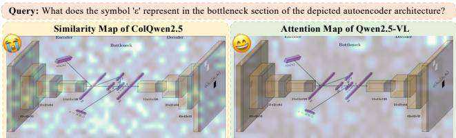
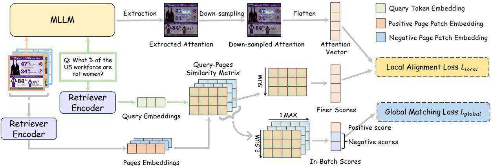
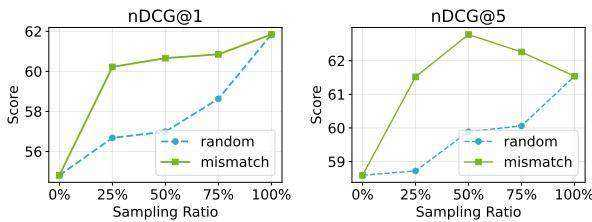
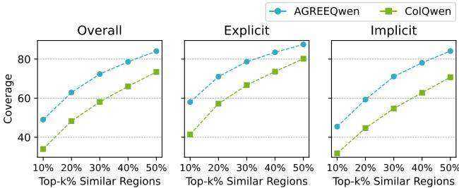
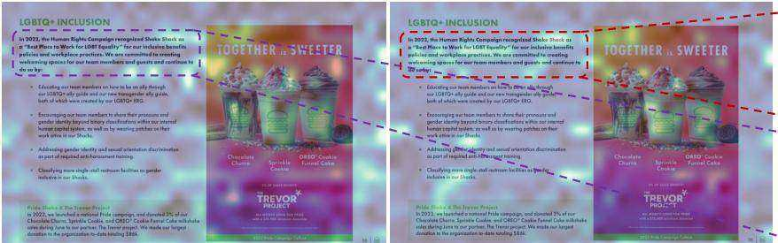
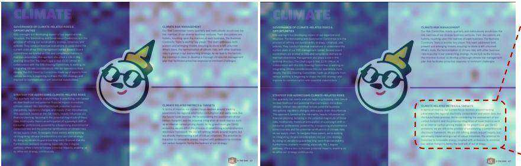

# Attention Grounded Enhancement for Visual Document Retrieval

Wanqing Cui cuiwanqing.cwq@taobao.com Alibaba Group Beijing, China

Wei Huang   
huangwei21@mails.ucas.ac.cn   
University of Chinese Academy of   
Sciences   
Beijing, China   
Yazhi Guo   
guoyazhi.gyz@taobao.com   
Alibaba Group   
Beijing, China   
Yibo Hu   
boxuan.hyb@taobao.com   
Alibaba Group   
Beijing, China   
Meiguang Jin   
meiguang.jmg@taobao.com   
Alibaba Group   
Beijing, China   
Junfeng Ma   
jack.majf@taobao.com   
Alibaba Group   
Beijing, China   
Keping Bi   
bikeping@gmail.com   
University of Chinese Academy of   
Sciences   
Beijing, China

# Abstract

# Keywords

Visual document retrieval requires understanding heterogeneous and multi-modal content to satisfy information needs. Recent advances use screenshot-based document encoding with fine-grained late interaction, significantly improving retrieval performance. However, retrievers are still trained with coarse global relevance labels, without revealing which regions support the match. As a result, retrievers tend to rely on surface-level cues and struggle to capture implicit semantic connections, hindering their ability to handle non-extractive queries. To alleviate this problem, we propose a Attention-Grounded REtriever Enhancement (AGREE) framework. AGREE leverages cross-modal attention from multimodal large language models as proxy local supervision to guide the identification of relevant document regions. During training, AGREE combines local signals with the global signals to jointly optimize the retriever, enabling it to learn not only whether documents match, but also which content drives relevance. Experiments on the challenging ViDoRe V2 benchmark show that AGREE significantly outperforms the global-supervision-only baseline. Quantitative and qualitative analyses further demonstrate that AGREE promotes deeper alignment between query terms and document regions, moving beyond surface-level matching toward more accurate and interpretable retrieval. Our code is available at: https: //anonymous.4open.science/r/AGREE-2025.

# CCS Concepts

• Information systems Retrieval models and ranking.

visual document retrieval, information retrieval, fine-grained late interaction, vision language models

# ACM Reference Format:

Wanqing Cui, Wei Huang, Yazhi Guo, Yibo Hu, Meiguang Jin, Junfeng Ma, and Keping Bi. 2018. Attention Grounded Enhancement for Visual Document Retrieval. In Proceedings of Make sure to enter the correct conference title from your rights confirmation email (Conference acronym ’XX). ACM, New York, NY, USA, 11 pages. https://doi.org/XXXXXXX.XXXXXXX

# 1 Introduction

Visual document retrieval [12, 32, 48] aims to find document pages that are semantically relevant to a given query. These pages often combine text, figures, tables, and layout structures, forming rich, heterogeneous content. Visual document retrieval is a critical component in real-world applications such as retrieval-augmented generation (RAG) [21]. In scenarios like financial reports, scientific papers, and technical manuals, key evidence is frequently distributed across visual and textual elements. Effective visual document retrieval enables models to ground in these complex sources, ensuring accurate and context-aware information response.

To preserve holistic information, recent visual document retrieval methods encode document pages as screenshots and follow a text-to-visual retrieval paradigm [12, 31]. Such approaches outperform text-centric methods [27, 29, 56], which use OCR and image captioning to extract text before applying standard text retrieval models. Notably, screenshot-based visual document retrieval is significantly more challenging than traditional image retrieval. Document screenshots contain high information density, with tightly coupled multimodal content that requires joint interpretation, requiring fine-grained alignment. Moreover, queries in visual document retrieval often arise from complex information needs, requiring semantic reasoning to identify implicitly relevant content beyond keyword matching.

  
Figure 1: The similarity map of ColQwen2.5 (left), versus the query-to-image attention map from Qwen2.5-VL (right).

Despite screenshot-based methods can encode more comprehensive information, they typically rely on global embeddings that compress all content into a single vector, struggle to model fine-grained alignments. To overcome this limitation, state-of-the-art visual document retrieval method, i.e., ColQwen [12], adopts fine-grained late interaction [19]. It preserves token-level and patch-level embeddings and computes relevance using the MaxSim operator: matching each query token to its most similar image patch and aggregating the maximum similarities. This enables detailed alignment between specific query terms and relevant regions in the document page.

However, current late interaction retrievers are trained using only global binary relevance labels. These labels only indicate whether a page is relevant, but provide no insight into which regions support the match. Therefore, when the matching clues are implicit, it is difficult for the retriever to learn why a page is relevant under such coarse supervision. As a result, the retriever still struggles to tackle non-extractive queries. As shown in Figure 1, the query matches the page not only on explicit terms like “bottleneck” and $^ { \ast } \epsilon ^ { \ast }$ , but also through an implicit link from “autoencoder” to “encoder-decoder”. However, under global supervision, ColQwen’s similarity map highlights only “bottleneck”, overlooks “??” due to its small font size, not to mention the implicit correspondence. This highlights the need for fine-grained supervision that can directly indicate the matching clues. While human annotations could provide such signals, it is labor-intensive and impractical to scale. Therefore, scalable sources of proxy supervision are essential.

Multimodal large language models (MLLMs) [4, 25, 26] exhibit precisely the kind of fine-grained alignment we seek. Recent studies [50, 59] have demonstrated that attention patterns of MLLMs consistently highlight semantically critical regions. As shown in Figure 1, based on the query, an MLLM attends not only to exact keyword matches, but also to implicit associations. Such attention weights therefore has the potential to provide fine-grained signals, without costly manual annotation.

Based on these observations, we propose the Attention Grounded REtriever Enhancement (AGREE) training framework to improve performance on visual document retrieval tasks that require implicit, non-extractive matching. AGREE leverages fine-grained supervision through three key stages: (1) MLLM Attention Annotation: We use a pretrained MLLM to generate query-conditioned attention maps, producing patch-level saliency attention scores. (2) Spatial-Preserving Attention Downsampling: To prevent blurry images from hindering accurate character recognition and ensure the quality of attention, we use more patches during attention extraction than relevance matching. We then downsample the attention maps via area-based pooling to align with the retriever’s patch layout. (3) Attention-Guided Retriever Training: The retriever is trained with dual supervision: (i) global-level contrastive learning, which optimizes relevance between the query and whole page; and (ii) local-level attention consistency learning, which aligns the retriever’s patch similarity scores with the MLLM attention. Crucially, the local-level supervision is applied only to positive query-page pairs, as MLLM attention is semantically meaningful only when the page is relevant. This joint objective teaches the model about whether a document is relevant, and if yes, what the rationale is.

Evaluation demonstrates that AGREE significantly improves retrieval performance on non-extractive matching across various backbones. On ViDoRe V2 benchmark [32], where relevance requires semantic reasoning beyond keyword matching, AGREE achieves substantial improvements: average $\mathrm { \ n D C G } @ 1$ increases from $5 4 . 8 1 \%$ to $6 1 . 8 4 \%$ $\left( + 7 . 0 3 \% \right)$ , and average $\mathrm { n D C G } @ 5$ from $5 8 . 5 9 \%$ to $6 1 . 5 4 \%$ $\left( + 2 . 9 5 \% \right)$ , demonstrating its ability to capture implicit, non-extractive alignments. On the more conventional ViDoRe V1 benchmark [12], where retrieval is dominated by explicit text overlap, AGREE maintains competitive performance, confirming its robustness across varying levels of retrieval complexity. Further quantitative and qualitative analysis reveals that the retriever trained with AGREE attends to a broader set of relevant regions and begins to capture implicit correspondences. This indicates AGREE enables the retriever to move beyond surface-level matching toward more interpretable, region-aware retrieval.

Overall, our main contributions are summarized as follows:

• We propose AGREE, a novel training framework that uses MLLM attention as fine-grained supervision to improve visual document retrieval performance on implicit matching.   
• Extensive experiments across multiple backbones demonstrate that AGREE achieves significant gains on challenging, non-extractive retrieval tasks, demonstrating its effectiveness and adaptability.   
• Quantitative and qualitative analyses show that AGREE shifts retrieval from keyword matching to rationale-aware alignment, fundamentally reshaping how retrievers understand relevance.

# 2 Related Work

# 2.1 Visual Document Retrieval

Traditional document retrieval systems primarily rely on textual content, a characteristic shared by both bag-of-words methods [42, 46] and modern neural retrieval approaches [18, 41, 49]. However, real-world documents are inherently multimodal, often combining text with images, tables, and other visual elements. Consequently, recent research has focused on incorporating such non-textual information to enhance retrieval. A common strategy involves separately extracting and encoding visual and textual features from documents [7, 15, 47, 51, 55].

A key limitation of these methods is their potential difficulty in capturing complex cross-modal interactions when modalities are processed in isolation. An alternative approach [27, 29, 56] focuses on generating a unified textual representation: the textual content is extracted using Optical Character Recognition (OCR) [35, 45] or PDF parsing [37, 38], and specialized models generate descriptive captions for the non-textual elements. However, converting rich non-textual information into textual descriptions inherently risks significant information loss. To address these challenges, concurrent works [8, 12, 31] directly encode the screenshot of a document for retrieval, aiming to preserve the holistic multimodal structure and inherent relationships between elements.

# 2.2 Fine-grained Image Retrieval

Fine-grained matching, or late-interaction retrieval, has emerged as a prominent paradigm in information retrieval, offering an alternative to single-vector representations by capturing fine-grained term-level interactions. This approach, pioneered by ColBERT [19], computes relevance by decomposing queries and documents into token-level embeddings and performing an aggregation operation with MaxSim. Its effectiveness has led to its adoption in multimodal contexts, such as image-text matching [2, 6, 54] and visual document retrieval [12]. However, encoder models like CLIP [39] and SigLIP [58] are typically pre-trained using only global embedding alignment, without explicit optimization of token-level embedding. As a result, their token embeddings may lack the discriminative power required for. To enhance the quality of local embeddings, subsequent approaches have augmented global contrastive learning with auxiliary supervision that aligns regional text descriptions with corresponding image regions [17, 52].

# 2.3 Knowledge Distillation

Knowledge distillation [13] aims to transfer knowledge from a powerful teacher model to a compact student model by encouraging the student to mimic the teacher’s output distributions. In information retrieval, KD has been widely adopted to distill large, complex retrievers into smaller, efficient counterparts [9, 40], while also enabling the student to learn nuanced soft labels that encode richer information than binary hard labels [11, 14, 23, 24, 28, 30, 36, 60].

Attention-based knowledge distillation [16, 43, 44, 57] extends knowledge distillation to intermediate representations, which encourages the student to mimic not only the teacher’s prediction results but also the teacher’s internal attention patterns. These methods typically align attention maps across layers to regularize the student’s reasoning process.

While we also exploit attention as a source of supervision, our objective diverges fundamentally: rather than guiding the student’s internal computation, we treat the attention as a mechanism for generating fine-grained alignment labels, i.e., what specific content matches the query.

# 3 Preliminaries

Problem Formulation. The visual document retrieval aims to retrieve the most relevant documents that satisfy the information need in a given textual query $q$ at the page level. The candidates for retrieval are a collection of visual document pages $\mathcal { D } \ = \ \{ d _ { 1 } , d _ { 2 } , . . . , d _ { | \mathcal { D } | } \}$ . Each page $d _ { i }$ is a high-resolution screenshot containing heterogeneous content such as text, tables, figures, and layout structures.

SOTA Visual Document Retrievers. State-of-the-art visual document retrievers represent both queries and page screenshots into a multi-vector space using MLLM (e.g., Qwen-VL [3] and PaliGemma [5]), and conduct late interaction. A query $q$ is encoded into a sequence of token embeddings $\mathbf { E } _ { q } ~ \in ~ \mathbb { R } ^ { N _ { q } \times D }$ , while a page $d$ is split into patches and encoded into $\mathbf { E } _ { d } \in \mathbb { R } ^ { N _ { d } \times D }$ , where $N _ { q }$ and $N _ { d }$ denote the number of tokens and patches, and $D$ is the embedding dimension. The relevance score is computed via late interaction using the MaxSim operator:

$$
S ( q , d ) = \sum _ { i = 1 } ^ { N _ { q } } \operatorname* { m a x } _ { j \in \left[ 1 , N _ { d } \right] } \langle \mathbf { E } _ { q } ^ { ( i ) } , \mathbf { E } _ { d } ^ { ( j ) } \rangle ,
$$

where $\langle \cdot , \cdot \rangle$ denotes the dot product, and $i$ and $j$ are the indices for the query token and document page patch, respectively. This operator first captures the strongest match for each query token, then aggregates partial evidence across all query tokens. Unlike dual-encoder methods [18] that compress inputs into single vectors and lose granularity, this approach preserves local structure and supports detailed alignment.

Training typically employs a contrastive objective using the hardest in-batch negative:

$$
\mathcal { L } _ { \mathrm { g l o b a l } } = \log \big ( 1 + \exp \big ( S ( q , d ^ { - } ) - S ( q , d ^ { + } ) \big ) \big ) ,
$$

where $d ^ { + }$ is the ground-truth relevant document page for $q$ , and $d ^ { - }$ is the most similar non-relevant page in the batch. This softplusbased loss is standard in late interaction models, as it avoids computing interactions with all negatives, while still efficiently optimizing the relative ranking through in-batch hard negatives.

# 4 Attention-Grounded REtriever Enhancement

Building upon SOTA visual document retrievers, we propose the Attention Grounded REtriever Enhancement (AGREE) training framework that leverages attention from a pretrained MLLM as auxiliary fine-grained supervision. As illustrated in Figure 2, AGREE first extracts patch-level query-to-page attention maps from an MLLM with a high-resolution grid for precise grounding. Then these attentions are downsampled to align with the retriever’s patch grid. Finally, the retriever is trained using a dual objective that combines standard global contrastive learning with fine-grained alignment to the MLLM’s attention patterns. The following subsections detail each component.

# 4.1 MLLM Attention Annotation

Given a query and its positive page, we derive proxy patch-level supervision from pre-trained MLLM through layer-wise attention extraction and multi-layer attention aggregation.

4.1.1 Layer-wise Attention Extraction. We explore two strategies to derive patch-level supervision from a pre-trained MLLM:

Answer-Token Attention: Following prior work [59, 62], we extract attention from the final input token, i.e., the one immediately preceding answer generation, to capture the model’s focus before responding. Formally, given a page screenshot divided into $N _ { d }$ patches and a prompt with $N _ { p }$ tokens, the full input sequence has length $N _ { d } + N _ { p }$ . We extract the cross-modal attention from the last input token, i.e., at position $N _ { d } + N _ { p }$ to all image patches in layer $l$ in the MLLM, yielding a query-specific attention map $\mathbf { A } _ { \mathrm { q u e r y } } ^ { ( l ) } \in \mathbb { R } ^ { N _ { d } }$ Specifically, the prompt is “Question: {query} Point out all content in the image that is helpful in answering the question, response in a single word or phrase.”.

However, raw cross-attention may highlight regions used for global information aggregation rather than semantic relevance [10], to emphasize semantically meaningful attention, we normalize $\mathbf { A } _ { \mathrm { q u e r y } } ^ { ( l ) }$ y using a general attention A(?? )gene ral , obtained from a generic instruction: “Write a general description of the image, response in a single word or phrase.”.The normalized attention is:

  
Figure 2: Overview of the AGREE training framework.

$$
\mathbf { A } ^ { ( l ) } = \frac { \mathbf { A } _ { \mathrm { q u e r y } } ^ { ( l ) } } { \mathbf { A } _ { \mathrm { g e n e r a l } } ^ { ( l ) } } .
$$

This produces an attention map that highlights regions most relevant to the query.

Query-Token Attention: To avoid dependence on answer generation and instruction following capability, we also consider a direct approach. We feed the concatenated image patches and query tokens to the MLLM and extract the attention from all $N _ { q }$ query tokens to the patches from the $l$ -th layer in the MLLM. These layerwise vectors from each token are then averaged into a unified vector:

$$
\boldsymbol { \mathsf { A } } ^ { ( l ) } = \frac { 1 } { N _ { q } } \sum _ { i = 1 } ^ { N _ { q } } \boldsymbol { \mathsf { A } } ^ { ( l , i ) } ,
$$

where $\mathbf { A } ^ { ( l , i ) }$ is the attention vector from the $i \cdot$ -th query token to all page patches in layer $l$ . This method captures query-patches alignment without relying on generation behavior.

We compare the quality of the above two strategies in Section 7.1, and evaluate their effectiveness in guiding visual document retrieval in Section 7.2.

4.1.2 Multi-Layer Aggregation. Given that the optimal layer for attention extraction varies with model architecture and task, and averaging attention of all layers has been shown to yield performance comparable to or better than carefully selecting a single layer [59], we integrate attention across all layers:

$$
\overline { { \mathbf { A } } } = \frac { 1 } { L } \sum _ { l = 1 } ^ { L } \mathbf { A } ^ { ( l ) } .
$$

The resulting $\overline { { \mathbf { A } } } \in \mathbb { R } ^ { N _ { d } }$ serves as the fine-grained, query-conditioned supervision signal, indicating the relative importance of each patch in supporting the match.

# 4.2 Spatial-Preserving Attention Downsampling

To preserve a nuanced perception of visual details and ensure high-quality supervision, we extract MLLM attention from highresolution images, i.e., up to 2048 patches. However, this creates a resolution mismatch with the downstream retriever, which operates at lower input resolutions (e.g., 768 max patches for ColQwen, and 1024 for ColPali) due to computational constraints during training and inference. A direct application of the high-resolution attention would thus be incompatible with the retriever’s patch grid, preventing end-to-end supervision.

To bridge this gap, we employ a spatial-preserving down-sampling strategy based on adaptive max pooling. Unlike average pooling, which may dilute salient activation peaks, max pooling preserves peak attention values within each window, ensuring key regions highlighted by the MLLM remain prominent after down-sampling.

Formally, given a high-resolution attention vector $\mathbf { A } \in \mathbb { R } ^ { N _ { h } }$ , we first reshape it back to the 2-D grid $\mathbf { A } _ { \mathrm { h i g h } } \in \mathbb { R } ^ { H _ { h } \times W _ { h } }$ , where $H _ { h } { \times } W _ { h } =$ $N _ { h }$ . Let the target low-resolution be $H _ { l } \times W _ { l }$ $( N _ { l } = H _ { l } \times W _ { l } )$ . We obtain the aligned low-resolution map $\mathbf { A } _ { \mathrm { l o w } } \in \mathbb { R } ^ { H _ { l } \times W _ { l } }$ via adaptive max pooling:

$$
\mathbf { A } _ { \mathrm { l o w } } [ i , j ] = \operatorname* { m a x } _ { ( u , v ) \in \Omega ( i , j ) } \mathbf { A } _ { \mathrm { h i g h } } [ u , v ] ,
$$

where $\Omega ( i , j )$ defines the high-resolution region corresponding to low-resolution position $( i , j )$ :

$$
\begin{array} { r } { \Omega ( i , j ) = \Big \{ ( u , v ) \Big | \begin{array} { l } { \Big \lfloor \frac { i H _ { h } } { H _ { l } } \Big \rfloor \le u < \Big \lfloor \frac { ( i + 1 ) H _ { h } } { H _ { l } } \Big \rfloor , } \\ { \Big \lfloor \frac { j W _ { h } } { W _ { l } } \Big \rfloor \le v < \Big \lfloor \frac { ( j + 1 ) W _ { h } } { W _ { l } } \Big \rfloor } \end{array} \Big \} . } \end{array}
$$

This design decouples supervision quality from deployment constraints: the MLLM can operate at high resolution for accurate grounding, while the retriever can learn effectively at lower resolution, enabling scalable fine-grained knowledge transfer .

# 4.3 Attention-Guided Retriever Training

Given the high-quality, down-sampled attention, we now introduce how this fine-grained signal guides the training of the retriever. Specifically, we introduce a local alignment loss $\mathcal { L } _ { \mathrm { l o c a l } }$ applied only to positive query-page pairs $( q , d ^ { + } )$ . This is because the MLLM’s attention patterns are meaningful only when the document is actually relevant. For irrelevant documents, no genuine alignment exists, making any attention pattern semantically ungrounded and cannot serve as valid supervision. By restricting $\mathcal { L } _ { \mathrm { l o c a l } }$ to positives, we ensure that fine-grained guidance reflects true matching logic.

4.3.1 Patch–Query Similarity Vector. To enable direct comparison between the retriever’s behavior and the MLLM’s attention, we first construct a patch-level similarity vector $\pmb { \mathsf { s } } \in \mathbb { R } ^ { N _ { d } }$ to measure the alignment between each page region and the query. Unlike the MaxSim operator (Eq. 1), which focuses on the strongest match for each query token, our goal here is to assess the overall alignment of each page patch with the entire query. Specifically, for each patch $j$ we average its similarity over all query tokens:

$$
s _ { j } ~ = ~ { \frac { 1 } { N _ { q } } } ~ \sum _ { i = 1 } ^ { N _ { q } } \bigl \langle { \bf E } _ { q } ^ { ( i ) } , { \bf E } _ { d } ^ { ( j ) } \bigr \rangle , \qquad j = 1 , \ldots , N _ { d } .
$$

The resulting vector s captures the retriever’s holistic assessment of each patch’s relevance to the query and will be aligned with the flattened $\tilde { \mathbf { A } } = \mathrm { f l a t t e n } ( \mathbf { A } _ { \mathrm { l o w } } )$ by the local alignment loss $\mathcal { L } _ { \mathrm { l o c a l } }$ .

4.3.2 Fine-Grained Supervision via Attention Alignment. To align s with $\tilde { \mathbf { A } }$ , we explore three strategies, covering the range from full patch-distribution matching to salient-region contrast.

Kullback–Leibler Divergence: Kullback–Leibler (KL) divergence enforces strict, global alignment between the MLLM attention distribution and the retriever’s similarity scores. Specifically, we treat both as probability distributions via softmax normalization and minimize:

$$
\mathcal { L } _ { \mathrm { k l } } = \mathrm { K L } \big ( \mathrm { s o f t m a x } ( \tilde { \mathbf { A } } ) \parallel \mathrm { s o f t m a x } ( \mathbf { s } ) \big ) .
$$

Since KL divergence constrains alignment across the entire image, it penalizes the model for missing even weakly attended patches. This forces the retriever to align both salient regions and low-attention areas, which can lead to overly strong constraints and increased sensitivity to noise in the attention signal.

Top-K Salient Contrastive: To mitigate the impact of lowattention regions, we focus supervision on the most salient patches, encouraging the retriever to assign higher similarity scores to salient than to non-salient regions. Specifically, we sort patches in $\tilde { \mathbf { A } }$ , select the top $K \%$ as the salient set $\mathcal { P } ^ { + }$ , and treat the remainder as $\mathcal { P } ^ { - }$ . We then apply a multi-positive contrastive loss [20]:

$$
\mathcal { L } _ { \mathrm { t o p - k } } = - \log \frac { \sum _ { j \in \mathcal { P } ^ { + } } \exp ( s _ { j } ) } { \sum _ { i \in \{ \mathcal { P } ^ { + } ; \mathcal { P } ^ { - } \} } \exp ( s _ { i } ) } .
$$

This loss promotes relative ranking between high-attention and low-attention regions. However, its effectiveness is sensitive to the choice of $K$ : a small $K$ may omit relevant content and reduce coverage, while a larger $K$ may introduce less reliable supervision by including regions with weak or noisy attention. Therefore, $K$ must be carefully tuned to balance coverage and precision.

Cosine Similarity: To avoid reliance on fixed thresholds or manual tuning, we further adopt cosine similarity as a supervision objective that focuses on the alignment of score patterns rather than absolute magnitudes. It maximize the directional agreement between s and $\tilde { \mathbf { A } }$ using cosine similarity:

$$
\mathcal { L } _ { \mathrm { c o s } } = 1 - \frac { \langle \mathbf { s } , \tilde { \mathbf { A } } \rangle } { \| \mathbf { s } \| _ { 2 } \| \tilde { \mathbf { A } } \| _ { 2 } } .
$$

By discarding scale information and emphasizing vector direction, this objective naturally prioritizes alignment on the most salient

Table 1: Summary of ViDoRe V2 benchmark statistics.   

<table><tr><td>Dataset</td><td>#Queries</td><td>#Pages</td><td>#Pos. Pages/Query</td></tr><tr><td>ESG Reports Human</td><td>52</td><td>1538</td><td>2.46</td></tr><tr><td>ESG Reports</td><td>228</td><td>1538</td><td>3.89</td></tr><tr><td>Economics Reports</td><td>232</td><td>452</td><td>15.64</td></tr><tr><td>Biomedical Reports</td><td>640</td><td>1016</td><td>3.22</td></tr></table>

regions without being penalized for minor deviations in background scores, and requiring no manual selection of thresholds.

We compare the effectiveness of the above constraints empirically in Section 7.4.

4.3.3 Overall Training Objective. The final objective combines two objectives: global-level relevance modeling and fine-grained local rationale learning:

$$
\mathcal { L } _ { \mathrm { t o t a l } } = \mathcal { L } _ { \mathrm { g l o b a l } } + \lambda \cdot \mathcal { L } _ { \mathrm { l o c a l } } ,
$$

where $\mathcal { L } _ { \mathrm { g l o b a l } }$ is the contrastive loss from Eq. 2, $\mathcal { L } _ { \mathrm { l o c a l } } \in \{ \mathcal { L } _ { \mathrm { k l } } , \mathcal { L } _ { \mathrm { c o s } } .$ , $\mathcal { L } _ { \mathrm { t o p - k } } \}$ is one of the local alignment losses, and $\lambda$ is a coefficient balances the two objectives. This dual supervision enables the retriever to learn not only whether a document is relevant, but also which regions support the match. Please note that the fine-grained supervision is used only during training. At inference time, the retriever operates independently without requiring any external attention signals or access to the MLLM.

# 5 Experimental Setups

# 5.1 Datasets

We train models on the colpali-train-set 1 introduced by ColPali [12], which contains 118,695 English-only query-page pairs sampled without hard negative mining. The dataset aggregates data from five diverse sources: DocVQA [34], InfoVQA [33], TAT-DQA [61], arXivQA [22], and a collection of web-scraped PDFs. Each query is associated with one labeled positive document.

For evaluation, we focus primarily on ViDoRe benchmark $\mathrm { V } 2 ^ { 2 }$ [32] a recently introduced fully out-of-domain visual retrieval benchmark designed to reflect real-world retrieval scenarios. It emphasizes non-extractive query and long-form, multi-page, and crossdocument reasoning. As shown in Table 1, it includes diverse datasets with multiple positive pages per query. Among them, ESG Reports Human is fully human-annotated; the other datasets use synthetic queries refined via human review. We also report results on ViDoRe benchmark V1 [12], which comprises 5 in-domain tasks derived from the same training distribution and 5 out-of-domain tasks. While it provides a generalization reference, its reliance on extractive queries makes it less challenging and not the focus of this work.

# 5.2 Baselines

We compare AGREE against a diverse set of baselines, grouped by architectural and pretraining paradigm.

  
Figure 3: Human annotation (left) and top- $3 \%$ high attention areas using “query-token attention” (others) given the query “What $\%$ of the US workforce are not women?”.

Dual-Encoder Vision Language Models. These models, such as CLIP [39] and SigLIP [58], are pretrained on large-scale imagetext pairs with a global contrastive objective. While effective for natural image retrieval, they may be limited in visual document retrieval: (1) their pretraining data focuses on natural images and captions, not complex document screenshots; (2) only global embeddings are optimized, so token-level representations may be weak and unsuitable for late interaction. We fine-tune CLIP and SigLIP following the ColPali setup, resulting in BiCLIP and BiSigLIP. We also attempt to extend them to late interaction (i.e., ColCLIP, ColSigLIP), but observe severe training instability and poor convergence, consistent with findings in [6, 12], so we exclude them from the reporting.

Multi-modal Large Language Models. MLLMs are trained on diverse tasks. This equips them with a stronger understanding of document screenshots. More importantly, MLLMs generate highquality, semantically meaningful token-level embeddings, making them naturally compatible with late interaction. This makes recent SOTA methods all based on MLLM. We evaluate two representative systems. DSE [31] encodes documents into a single vector using Phi-3-vision [1], representing strong single-vector retrieval. Col-Pali [12] and its variant ColQwen2.5 are SOTA late-interaction retrievers that use MaxSim scoring as we introduced in Section 3. Their backbones are PaliGemma [5] and Qwen-VL [3], respectively. While other strong models exist, such as Llama-Nemoretriever-Colembed [53] and ColNomic-Embed-Multimodal [48], their improvements stem from larger training corpora, advanced hard negative mining, and higher-resolution inputs. Since AGREE is a training strategy orthogonal to these enhancements, we adopt ColQwen2.5 as our primary baseline for a clean ablation.

# 5.3 Evaluation

The evaluation consists of three aspects: retrieval performance, fine-grained label quality, and the retriever’s similarity map interpretability.

5.3.1 Retrieval Performance. Following previous studies, we adopt $\mathbf { n D C G } @ 1$ and $\mathbf { n D C G } @ 5$ as the retrieval metrics across all tasks. These metrics are widely adopted in visual document retrieval because the goal is to support RAG, where only a few pages are used in downstream reasoning. High performance at early ranks ensures that correct information is quickly retrieved, reducing computational cost and hallucination risk. All evaluations are conducted using the official evaluation scripts3.

5.3.2 Fine-grained Label Quality. To assess the quality of generated attention, we conduct a human annotation study. We sample 250 query-document pairs, with 50 selected randomly from each of the five training data sources to ensure domain coverage. For each pair, annotators are shown the query, the positive document page, and the ground-truth answer. They are asked to draw bounding boxes around all relevant regions and classify each as either an explicit match (direct text or visual correspondence) or an implicit match (requiring inference). Two trained annotators label each instance independently (average 1.38 minutes per annotation). Inter-annotator agreement, measured by mean IoU on bounding boxes, reaches 0.66, indicating strong consistency. Discrepancies are then resolved by a senior annotator: for high-overlap cases (IoU $> 0 . 7$ ) with consistent labels, the clearer version is kept; for others, a refined final annotation is created. This protocol yields high-quality ground truth for the relevant area. An example is shown in Figure 3. All annotators are volunteer collaborators.

Attention quality is measured through the coverage of humanannotated matching regions by the top- ${ \cdot } K \%$ highest-attention areas. Higher coverage indicates better alignment between attention and human relevance judgments.

5.3.3 Retriever’s Similarity Map Interpretability. Using the above human annotations, we also evaluate whether the retriever learns to highlight meaningful regions. We compute the coverage of human-annotated regions by the top- $K \%$ highest-scoring patches in the similarity map. This metric reflects how well the retriever’s behavior aligns with human judgments, providing insight into its interpretability and fine-grained reasoning capability.

# 5.4 Implementation Details

To obtain fine-grained supervision from MLLM, we use Qwen2.5- VL-7B-Instruct [4] 4 model with “query-token attention” strategy. This choice is motivated by its strong correlation with human relevance judgments (see Section 7.1). The maximum number of image patches during MLLM attention annotation is 2048. Our framework is implemented on two MLLM backbones, i.e., PaliGemma-3B-pt-448 [5] 5 and Qwen2.5-VL-3B-Instruct 6. The number of image patches during retrieval for the two models is fixed at 1024 and a maximum of 768, respectively. To ensure a fair and comparable evaluation, we train both our method and all baselines on colpalitrain-set with in-batch negatives for 3 epochs. The batch size is 128 and the learning rate is $1 e - 4$ . We use LoRA for parameter-efficient tuning. All training can be conducted on a single H20 GPU. When multiple GPUs are available, data parallelism can be applied to further accelerate training. Importantly, the addition of the local alignment loss introduces negligible computational overhead during training. Following official recommendations, we use a batch size of 1 during inference to ensure consistency and reproducibility.

# 6 Overall Performance

The overall results on the ViDoRe V2 benchmark are summarized in Table 2. Specifically, AGREE achieves substantial improvements: AGREEQwen2.5 achieves $6 1 . 8 4 \%$ on average nDCG@1 and $6 1 . 5 4 \%$ on average $\mathrm { n D C G } @ 5$ , obtains $+ 7 . 0 3 \%$ and $+ 2 . 9 5 \%$ absolute gains compared with the strongest baseline ColQwen2.5, highlighting that AGREE is effective in challenging, realistic retrieval scenarios. By providing signals for identifying matching regions, AGREE effectively guides the model to discover non-trivial, fine-grained alignments that are poorly captured by binary relevance signals alone. Further comparisons between ColPali vs. AGREEPali show that AGREE exhibits consistent performance improvements, verifying its strong generalization and plug-and-play applicability across diverse backbones.

Table 2: Test results on ViDoRe benchmark V2. The best results are bolded, and the suboptimal result is underlined. $^ \dagger$ and denote significant improvement over the baseline using the same backbone.   

<table><tr><td rowspan="2">Model</td><td colspan="2">Esg</td><td colspan="2">Biomedical</td><td colspan="2">Economics</td><td colspan="2">EsgHuman</td><td colspan="2">Avg</td></tr><tr><td>nDCG@1 nDCG@5</td><td></td><td></td><td></td><td>nDCG@1 nDCG@5 nDCG@1 nDCG@5 nDCG@1 nDCG@5</td><td></td><td></td><td></td><td>nDCG@1 nDCG@5</td><td></td></tr><tr><td colspan="9">Vision-Language Models</td></tr><tr><td>BiCLIP</td><td>10.53</td><td>11.38</td><td>20.16</td><td>22.39</td><td>26.29</td><td>22.83</td><td>17.31</td><td>22.74</td><td>18.57</td><td>19.84</td></tr><tr><td>SigLIP (0-shot)</td><td>26.75</td><td>28.19</td><td>20.16</td><td>24.30</td><td>18.97</td><td>16.34</td><td>19.23</td><td>23.07</td><td>21.28</td><td>22.98</td></tr><tr><td>BiSigLIP</td><td>29.83</td><td>34.92</td><td>25.78</td><td>29.05</td><td>30.60</td><td>28.23</td><td>34.62</td><td>45.83</td><td>30.21</td><td>34.51</td></tr><tr><td colspan="9">Multi-modal Large Language Models</td></tr><tr><td>DSE</td><td>47.37</td><td>55.15</td><td>52.66</td><td>55.29</td><td>62.50</td><td>52.80</td><td>57.69</td><td>61.74</td><td>55.06</td><td></td></tr><tr><td>ColPali</td><td>51.75</td><td>54.05</td><td>52.03</td><td>57.56</td><td>55.17</td><td>53.30</td><td>54.49</td><td>63.67</td><td>53.36</td><td>56.25 57.14</td></tr><tr><td>ColQwen2.5</td><td>51.75</td><td>57.12</td><td>56.56</td><td>60.64</td><td>52.59</td><td>52.90</td><td>58.33</td><td>63.70</td><td>54.81</td><td>58.59</td></tr><tr><td colspan="9">Ours</td><td></td></tr><tr><td>AGREEPali</td><td>57.46 60.09*</td><td>58.87 58.43</td><td>52.03 56.41</td><td>55.51 60.49</td><td>59.05† 59.05*</td><td>51.33 56.50*</td><td>67.95 71.80*</td><td>65.28 70.73*</td><td>59.12</td><td>57.75</td></tr><tr><td colspan="9">AGREEQwen2.5 (a) ViDoRe V1 Performance</td><td>61.84 61.54</td></tr><tr><td colspan="3">62 90 89.189.36 84.384.05 60</td><td>(b) ViDoRe V2 Performance</td><td></td><td rowspan="5">80</td><td colspan="2">7B -32B ±72B</td><td colspan="2">answer-token query-token</td></tr><tr><td>83.283.81 20</td><td></td><td></td><td></td><td></td><td>Overall</td><td>Explicit</td><td></td><td>Implicit</td></tr><tr><td>X 80 76.926.60 Z</td><td>ColPali</td><td>58</td><td></td><td>w/o local KL-div</td><td></td><td>0 4</td><td>r</td><td>1 a A5</td></tr><tr><td>D AGREEPali 70 ColQwen</td><td></td><td></td><td>B top-10% • top-20% I cosine</td><td></td><td></td><td>0</td><td colspan="2"></td></tr><tr><td>nDCG@1 nDCG@5</td><td>AGREEQwen 54</td><td>nDCG@1</td><td></td><td>nDCG@5</td><td>coofre 60</td><td></td><td>2</td><td></td></tr></table>

We also show results on the ViDoRe v1 benchmark in Figure 4 (a). For simple visual document retrieval tasks, which primarily involve queries with clear lexical or visual overlap, AGREE achieves competitive performance. This shows that for explicit matches, global-level relevance labels are often sufficient to guide effective retrieval, as the model can rely on surface-level matching cues. In such settings, while fine-grained supervision offers limited gains, incorporating such signals does not have a negative impact.

# 7 Further Analysis

# 7.1 MLLM Attention Annotation Evaluation

To measure supervision quality, we evaluate different MLLM-derived attention maps using the human annotations introduced in Section 5.3.2. We compare two strategies introduced in Section 4.1.1, i.e., answer-token attention and query-token attention, across Qwen2.5- VL models of varying sizes.

Results in Figure 5 indicate that the direct “query-token attention” achieves the highest alignment with human judgments, consistently covering both explicit and implicit matches. When comparing model sizes, we find that even a 7B model achieves strong performance under such a paradigm. As visualized in Figure 3, the top- $3 \%$ attention regions across model sizes exhibit strong alignment and generally cover both explicitly mentioned and contextually implied content, suggesting robust and size-invariant localization ability. In contrast, the “answer-token strategy” relies heavily on instruction-following and reasoning capabilities, which are more developed in larger models, leading to a significant performance gap. We also observe that the 32B model performs poorly, likely due to excessive chain-of-thought reasoning, even when such reasoning is disabled. In addition, attentions based on the “answertoken strategy” mainly pay more on the implicit areas, leading to more serious omissions of the explicit matching. These findings motivate our default choice to use the “query-token attention” from Qwen2.5-VL-7B-Instruct as fine-grained supervision labels.

# 7.2 Impact of Attention Quality on Performance

We further analyze the relationship between “attention alignment with human annotations” and “the final retrieval performance”. As shown in Table 3, the effectiveness of attention-guided training is strongly correlated with its alignment to human judgments. The 7B model with query-token attention, which best aligns with human annotations, achieves the largest gains on both V1 and V2.

Table 3: Average test results based on attentions with different models and extraction strategy.   

<table><tr><td rowspan="2">Size</td><td rowspan="2">Strategy</td><td colspan="2">ViDoRe-V1</td><td colspan="2">ViDoRe-V2</td></tr><tr><td>nDCG@1</td><td>nDCG@5</td><td>nDCG@1</td><td>nDCG@5</td></tr><tr><td>-</td><td>-</td><td>83.28</td><td>89.10</td><td>54.81</td><td>58.59</td></tr><tr><td>7B</td><td>answer</td><td>83.15</td><td>88.99</td><td>57.10</td><td>59.14</td></tr><tr><td>72B</td><td>answer</td><td>83.23</td><td>88.89</td><td>60.43</td><td>60.76</td></tr><tr><td>7B</td><td>query</td><td>83.81</td><td>89.36</td><td>61.84</td><td>61.54</td></tr></table>

Table 4: Average test results with different coefficient ??.   

<table><tr><td>λ</td><td colspan="2">ViDoRe-V1 nDCG@1 nDCG@5</td><td colspan="2">ViDoRe-V2</td></tr><tr><td>0</td><td>83.28</td><td>89.10</td><td>nDCG@1 54.81</td><td>nDCG@5 58.59</td></tr><tr><td>5e-1</td><td>82.82</td><td>89.20</td><td>56.71</td><td>58.28</td></tr><tr><td>1e-1</td><td>83.81</td><td>89.36</td><td>61.84</td><td>61.54</td></tr><tr><td>5e-2</td><td>83.29</td><td>89.21</td><td>58.71</td><td>59.94</td></tr></table>

In contrast, answer-token variants yield smaller gains on V2, and even negative gains on V1. This suggests that while it can capture implicit matches, its weak alignment with explicit content harms performance in extractive settings. This highlights that effective fine-grained supervision must cover both surface-level and semantic matches to generalize across tasks. This analysis also reveals that AGREE’s success hinges on the quality of the proxy labels. As future methods produce more accurate labels, AGREE can directly leverage them for further gains.

# 7.3 Effect of Attention Loss Weighting

We evaluate the impact of the attention loss coefficient ??. As shown in Table 4, retrieval performance achieves its best at $\lambda = 1 e - 1$ . This indicates that fine-grained supervision must be balanced. Considering that MLLM’s attention inevitably contains noise, a strong attention objective risks overfitting to noisy attention from the MLLM. While insufficient guidance leaves the finegrained cues underutilized. On ViDoRe V1, performance remains stable across ?? values, consistent with its reliance on strong, explicit matching signals. This supports our earlier hypothesis: auxiliary supervision has diminishing returns when the primary task signal is already sufficient

# 7.4 Comparison of Local Alignment Loss

We compare the local alignment losses described in Section 4.3.2, including full-distribution matching (KL-divergence), salient-region contrast (top-K), and directional alignment (cosine). As shown in Figure 4 (b), the cosine loss achieves the best performance. The superiority of cosine loss indicates that effective guidance should emphasize directional agreement on salient regions, rather than enforce full distribution matching. Cosine loss naturally focuses on high-attention patches without penalizing minor deviations in low-salience areas, making it robust and effective. Top-K performance is sensitive to $K$ , trading off coverage and noise. KLdivergence performs worst because it enforces full distribution matching, forcing the model to fit even irrelevant patches.

  
Figure 6: Retrieval performance on ViDoRe V2 related to the proportion of samples receiving attention guidance, under random and mismatch-first sampling strategies.

  
Figure 7: Coverage of human-annotated matching areas by ColQwen2.5 and ours AGREEQwen2.5.

# 7.5 Selective Attention Supervision

We evaluate AGREE’s performance when applying attention supervision to different portions of the training set under two sampling strategies: (1) random sampling, which selects training instances uniformly, and (2) mismatch-first sampling, which prioritizes samples where the retriever’s similarity scores disagree most with the according MLLM’s attention pattern. As shown in Figure 6, random sampling yields steady gains as more data is labeled, with best performance when all samples are used. In contrast, mismatch-based sampling achieves similar improvements with far fewer labels. Applying supervision to the top- $2 5 \%$ most misaligned samples gives a $+ 5 . 4 1 \%$ absolute gain in average $\mathrm { \ n D C G } @ 1$ , and further supervision brings steady but diminishing returns. This shows that attention guidance is most effective on hard instances. By focusing on these instances, we can reduce annotation cost while preserving performance.

Notably, our mismatch-first sampling is a practical compromise, as it requires computing attention for all samples to identify hard instances. Ideally, hard instances could be mined via retrieval performance, but this is unreliable under this incomplete labeling training set: most low-performing instances contain a large number of unlabeled positives, i.e., false negatives. As a result, focusing on them introduces noise rather than useful supervision. In contrast, the mismatch between MLLM attention and retriever similarity better reflects model uncertainty. Importantly, this limitation is not inherent to AGREE. With more accurate annotated data, retrievalbased hard instance mining could enable true attention labeling cost reduction.

# 7.6 Fine-Grained Alignment Behavior Analysis

Beyond retrieval metrics, we evaluate the plausibility of the retrievers’ similarity maps using the human annotations as described

# Query: What steps has Shake Shack taken to create a welcoming environment for gay customers?

In 222, the Human Rights Campaign recognized Shake Shack as a "Best Place to Work foLGBT Equalityfor our inclusive benefits policies and workplace practices. We are committed to creating welcoming spaces for our team members and guests and continue to do so by:

In 2022, the Human Rights Campaign recognized Shake Shack as a "Best Place to Work for LGBT Equality" for our inclusive benefits policies and workplace practices. We are committed to creating welcoming spaces for our team members and guests and continue to do so by:

# Query: What key environmental metrics is Jack in the Box currently prioritizing?

# CLIMATE RELATED METRICS & TARGETS

  
Figure 8: Late interaction heatmaps of ColQwen2.5 (left) and AGREEQwen2.5 (middle). The right panels zoom in on key regions.

In terms of metrics, our current focus revolves around tracking parameters like regional electricity consumption and waste data. But the future holds promise. We're considering the assessment of our carbon footprint and the potential integration of novel metrics such as an internal carbon pricing model. As for greenhouse gas (GHG) emissions, we are still in the process of establishing a comprehensive disclosure framework. We are still refining details around targets, but are already implementing a set of robust initiatives. The ambition to transition to renewable energy, coupled with endeavors to minimize our carbon footprint, forms the bedrock of our strategy.

in Section 5.3.3. As shown in Figure 7, AGREEQwen2.5 achieves significantly higher coverage of human-annotated regions than ColQwen2.5, with consistent improvement on both explicit and implicit matches. This suggests that the retrieval performance improvement introduced by AGREE is rooted in its ability to reshape how a retriever computes relevance. By combining local fine-grained grounding signals during training, the retriever learns not only whether a document matches, but also which regions contribute to the match, moving toward more interpretable, rationale-aware matching.

# 7.7 Case Study

The case study intuitively demonstrates the limitations of globallevel relevance labels and the value of fine-grained guidance. Figure 8 visualizes the patch-level similarity maps 7 of two examples from the ESG Restaurant Humans task in ViDoRe V2, where queries require synonym understanding and implicit inference.

In the first example, the query uses “gay” while the document uses “LGBT”. The baseline highlights only the exact match on “Shake Shack”. AGREEQwen2.5, however, highlights both the “Shake Shack” and the “LGBT”. This indicates that AGREE successfully helps capture the semantic equivalence between lexical variation. In the second example, besides the keyword “metrics”, more matches exist in the answer area, i.e., the bottom-right corner. This matching pattern is non-trivial, and the baseline model assigns scattered scores across the page, failing to identify the relevant region. In contrast, AGREEQwen2.5 highlights the answer region successfully, demonstrating that AGREE helps the retriever learn to localize complex, inferential matches.

These behaviors highlight that global-level relevance signals are insufficient for learning nuanced matching patterns. Retrievers trained only with coarse supervision tend to rely on surface-level matching and fail to capture semantically meaningful alignments. In contrast, AGREE can effectively help the model capture both explicit and implicit matches by providing more detailed guidance.

# 8 Conclusion and Future Work

In this work, we introduced AGREE, a novel training framework that enhances visual document retrieval through fine-grained supervision. We demonstrated that retrievers trained with only global relevance labels often resorted to surface-level cues and failed to capture implicit semantic connections, resulting in suboptimal performance on queries requiring implicit reasoning or non-extractive alignment. To alleviate this limitation, we presented AGREE, which goes beyond global relevance signals by incorporating local-level supervision derived from the attention maps of pre-treined MLLMs. This supervision required no manual annotation, making the framework scalable. We demonstrated the effectiveness of AGREE through significant performance improvements on the challenging ViDoRe V2 benchmark. Ablation studies confirmed the importance of highquality attention signals, careful local-loss design, and balanced global-local supervision. Further analysis revealed that AGREE shifts retrieval behavior from surface-level keyword matching toward semantically grounded, rationale-aware alignment. In the future, more precise forms of grounding, such as object-detection style annotations, could further improve fine-grained alignment, offering a promising direction for building even more interpretable visual document retrieval systems.

# 9 Ethics Statement

This work is based exclusively on publicly available datasets and open-source models. No personal or sensitive information was involved. As such, the study does not raise any notable ethical concerns. In commitment to open science and reproducibility, we will release all code used in this research. This transparency enables independent verification of our results and promotes the broader adoption and extension of our methods.

