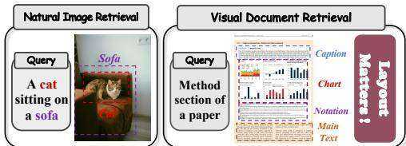
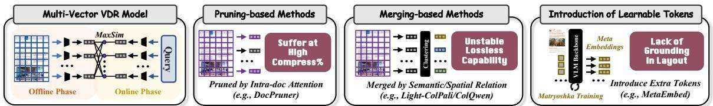
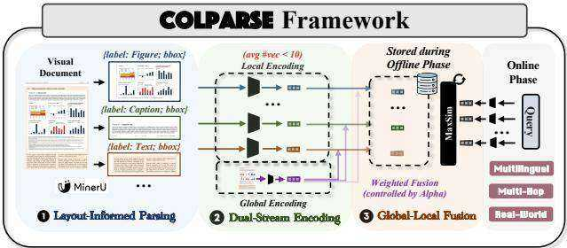
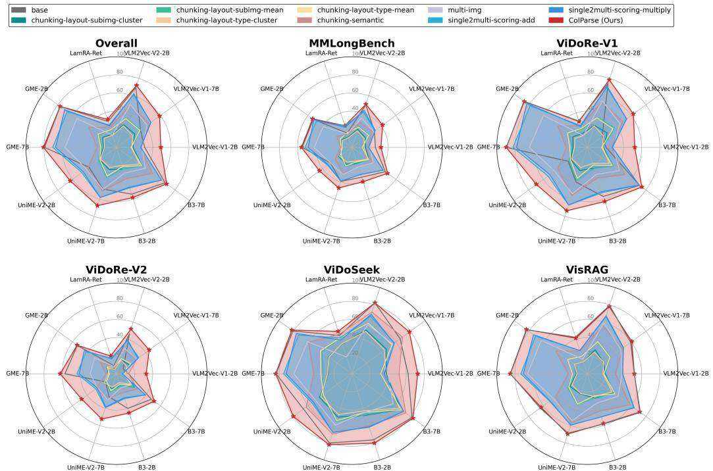
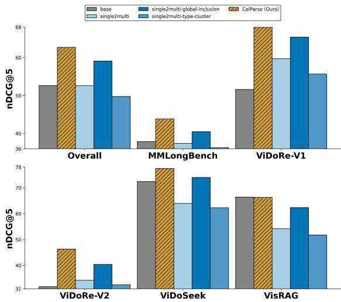
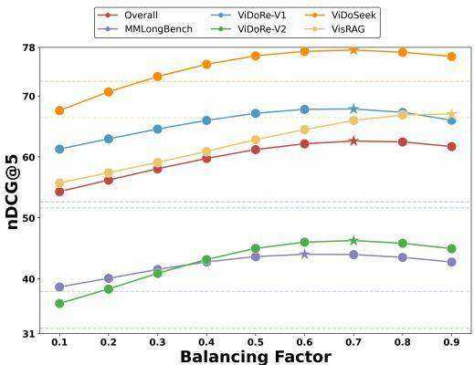
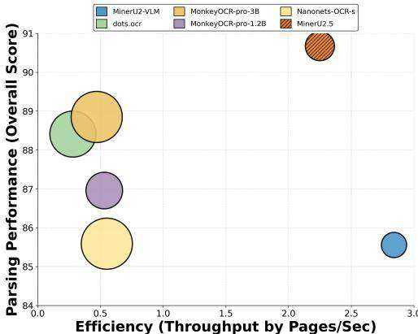

# Beyond the Grid: Layout-Informed Multi-Vector Retrieval with Parsed Visual Document Representations

Yibo Yan 1 2 3 Mingdong Ou † 2 Yi Cao 2 Xin Zou 1 3 Shuliang Liu 1 3 Jiahao Huo 1 2 Yu Huang 1 2 James Kwok 3 Xuming Hu † 1 3

# Abstract

Harnessing the full potential of visually-rich documents requires retrieval systems that understand not just text, but intricate layouts, a core challenge in Visual Document Retrieval (VDR). The prevailing multi-vector architectures, while powerful, face a crucial storage bottleneck that current optimization strategies, such as embedding merging, pruning, or introducing abstract tokens, fail to resolve without compromising performance or ignoring vital layout cues. To address this, we introduce ColParse, a novel paradigm that leverages a document parsing model to generate a small set of layout-informed sub-image embeddings, which are then fused with a global pagelevel vector to create a compact and structurallyaware multi-vector representation. Extensive experiments demonstrate that ColParse reduces storage requirements by over $9 5 \%$ while simultaneously yielding significant performance gains across numerous benchmarks and base models. ColParse thus bridges the critical gap between the fine-grained accuracy of multi-vector retrieval and the practical demands of large-scale deployment, offering a new path towards efficient and interpretable multimodal information systems.

  
Figure 1. Comparison of natural image retrieval versus VDR.

reports, and invoices, are defined by a dense interplay of textual content, intricate layouts, and graphical elements, yoas illustrated in Figure 1. To effectively capture this fine-(Right) visual document Mgrained detail, the field has predominantly converged on ttemulti-vector retrieval architectures (Faysse et al., 2024; Gunther et al. ¨ , 2025; Team, 2025). These models represent each document page as a set of patch-level embeddings and employ a late-interaction mechanism, such as MaxSim, to compute relevance (Khattab & Zaharia, 2020; Santhanam et al., 2022). This paradigm excels at aligning specific query phrases with corresponding visual or textual regions within a document, a capability essential for the high-precision information-seeking tasks inherent to VDR.

# 1. Introduction

Visual Document Retrieval (VDR), the task of retrieving relevant document pages from a large-scale corpus, has become a cornerstone of modern information retrieval (Mei et al., 2025; Yan et al., 2026a). Unlike natural image retrieval, visual documents, such as academic papers, financial

Despite their superior performance, the widespread adoption of multi-vector VDR models is hindered by a critical bottleneck: prohibitive storage overhead (Jayaram et al., 2024; Shrestha et al., 2024; Liu & Mao, 2023). Storing hundreds or even thousands of embedding vectors for every page makes large-scale deployment practically challenging. To address this, the research community has explored several optimization strategies, as illustrated in Figure 2. $\bullet$ One line of work involves merging patch embeddings, where methods like Light-ColPali (Ma et al., 2025) use clustering techniques to aggregate similar vectors. However, this approach often leads to a dilution of fine-grained information, resulting in unstable performance. $\otimes$ Another direction is pruning, where frameworks such as DocPruner (Yan et al., 2025) aim to discard redundant embeddings. These methods struggle to maintain performance under aggressive compression. $\otimes$ A third paradigm, exemplified by MetaEmbed (Xiao et al., 2025), introduces a set of abstract, learnable tokens to form a compact multi-vector representation. While innovative, these tokens lack an explicit grounding in the document’s inherent layout structure, limiting their ability to capture crucial layout-specific semantics.

  
Figure 2. The illustration of a multi-vector VDR model and three primary optimization strategies for its efficiency bottleneck.

To address the limitations of existing approaches, we introduce ColParse, a novel paradigm for constructing multivector representations that is fundamentally aligned with the structural nature of visual documents. Instead of operating on a uniform grid of patches or abstract tokens, ColParse first employs a specialized document parsing model to intelligently segment each document page into a small set of $k$ semantically meaningful, layout-informed sub-images (e.g., tables, figures, paragraphs), where $k$ is typically less than 10. These $k$ sub-images are then individually encoded by a standard single-vector retrieval model to yield $k$ local vectors. In parallel, the entire document page is encoded to generate one global vector that captures the overall context. Finally, we fuse these representations by weighted element-wise adding the global vector to each of the $k$ local vectors. This process results in $k$ fused vectors for each document, which integrate both fine-grained, layout-specific details and holistic page-level context.

We conducted comprehensive experiments on 24 diverse VDR datasets (Meng et al., 2025) to validate the effectiveness and robustness of our proposed framework. ColParse consistently delivers substantial performance improvements, achieving an average gain of over 10 points in nDCG $\textcircled { \alpha } 5$ when applied to 10 different mainstream single-vector models. This demonstrates its remarkable flexibility as a trainingfree, plug-and-play module. By deeply integrating the unique structural properties of visual documents with the powerful mechanism of multi-vector retrieval, ColParse establishes a new trade-off between retrieval performance and storage efficiency. Our main contributions are as follows:

❶ A Novel Paradigm for Multi-Vector Construction: We introduce the first layout-informed paradigm for constructing multi-vector representations in VDR, which overcomes the storage efficiency bottleneck of conventional multi-vector models by leveraging document parsing.

❷ A Flexible and Robust Framework: Our method is designed as a training-free, plug-and-play framework that demonstrates robust and significant performance gains across a wide array of existing single-vector models, highlighting its versatility and ease of adoption.

$\pmb { \otimes }$ Superior Performance with Enhanced Interpretability: ColParse provides inherent interpretability by enabling retrieval results to be traced back to specific, parsed layout components, which significantly enhances its practicality and potential for real-world industrial applications.

# 2. Related Work

# 2.1. Visual Document Retrieval

VDR has become a crucial task for understanding visuallyrich documents, moving beyond traditional OCR-based pipelines that often lose critical layout information (Zhang et al., 2025b; Most et al., 2025). The advent of Vision-Language Models (VLMs) introduced end-to-end singlevector approaches (e.g., DSE (Ma et al., 2024a), GME (Zhang et al., 2024b), and UniSE (Liu et al., 2025b)), but these frequently struggle to capture the fine-grained semantics required for dense documents. A significant leap forward was made with the multi-vector paradigm, pioneered by ColPali (Faysse et al., 2024), which represents pages as numerous patch-level embeddings and employs late interaction for superior matching. Recent efforts have sought to optimize this paradigm at various levels: modellevel, by exploring bidirectional architectures like Modern-VBERT (Teiletche et al., 2025); data-level, through advanced data synthesis and hard-negative mining as seen in works like Llama Nemoretriever Colembed (Xu et al., 2025); and training-level, via new objectives and multi-task frameworks such as jina-embeddings-v4 (Gunther et al. ¨ , 2025). Despite their performance, these multi-vector models introduce a severe storage bottleneck.

# 2.2. Mutli-Vector Retrieval

The multi-vector paradigm, first popularized in text retrieval by ColBERT (Khattab & Zaharia, 2020), represents documents as sets of token-level embeddings to enable fine-grained matching through a late-interaction mechanism (Qian et al., 2022; Lee et al., 2023). This approach was further refined in the text domain by models like BGE-M3- Embedding (Chen et al., 2024) and Jina-ColBERT-v2 (Jha et al., 2024). The paradigm was successfully adapted for multimodal retrieval by ColPali (Faysse et al., 2024), shifting the focus to visual documents, which are inherently more complex than natural images. Despite their superior performance, these models face a critical efficiency bottleneck from the prohibitive storage cost of patch-level embeddings (Liu & Mao, 2023; Shrestha et al., 2024; Park et al., 2025). Current optimization efforts fall into three main categories, each with inherent drawbacks. (i) Pruning redundant embeddings, as seen in DocPruner (Yan et al., 2025) and Prune-then-Merge (Yan et al., 2026b), often struggles to maintain performance under aggressive compression. (ii) Merging similar embeddings via clustering, exemplified by Light-ColPali (Ma et al., 2025), can dilute fine-grained information, leading to unstable performance. (iii) Introducing abstract, learnable tokens, pioneered by MetaEmbed (Xiao et al., 2025) and CausalEmbed (Huo et al., 2026), creates compact representations that, however, lack an explicit grounding in the document’s inherent layout structure. In contrast, ColParse addresses these limitations by leveraging document parsing to generate a compact set of layout-informed embeddings.

# 2.3. Document Parsing VLM

Document parsing VLMs have emerged as critical tools for converting visually-rich document images into structured formats like LaTeX or Markdown (Zhang et al., $2 0 2 4 \mathrm { a }$ ; Ouyang et al., 2025; Zhang et al., 2025c). Early models, such as Nougat (Blecher et al., 2023) and Donut (Kim et al., 2022), adopted an end-to-end, sequence-to-sequence approach but often struggled with the computational cost of high-resolution inputs. To balance accuracy and efficiency, a more recent multi-stage paradigm has gained traction. This is exemplified by models like MinerU2.5 (Niu et al., 2025), which first performs efficient layout analysis on a downsampled image before conducting targeted, high-resolution recognition on cropped regions. This coarse-to-fine strategy, also seen in models like Dolphin (Feng et al., 2025) and MonkeyOCR (Zhang et al., 2025a), effectively mitigates the $\mathrm { O } ( \mathrm { N } ^ { 2 } )$ complexity of processing high-resolution images end-to-end. For ColParse, we select MinerU2.5 as our document parser, given its state-of-the-art accuracy and efficiency. A quantitative comparison with other document parsing models will be presented in Section 4.2.3.

# 3. Methodology

In this section, we first formalize the task of VDR within the multi-vector paradigm. We then introduce the ColParse framework, detailing its multi-stage process for generating compact, layout-informed document representations. See our pseudo-code in Appendix A.

# 3.1. Task Formulation

The primary goal of VDR is, given a textual query $q$ , to retrieve a ranked list of relevant document pages from a large-scale corpus $\mathcal { C } = \{ d _ { 1 } , d _ { 2 } , \dotsc , d _ { | \mathcal { C } | } \}$ . In the conventional multi-vector retrieval paradigm, a document page $d$ is first rendered as an image and then uniformly partitioned into a grid of $N _ { p }$ patches, $\{ p _ { j } \} _ { j = 1 } ^ { N _ { p } }$ . A VLM, serving as an encoder $\Phi ( \cdot )$ , maps each patch $p _ { j }$ into a $D$ -dimensional embedding, resulting in a large set of patch-level document embeddings $\mathbf { D } _ { \mathrm { g r i d } } \bar { = } \{ \mathbf { d } _ { j } \} _ { j = 1 } ^ { N _ { p } }$ , where each $\mathbf { d } _ { j } \in \mathbb { R } ^ { D }$ . Concurrently, the same encoder maps the textual query $q$ into a set of $N _ { q }$ Qutoken-level embeddings $\mathbf { Q } = \{ \mathbf { q } _ { i } \} _ { i = 1 } ^ { N _ { q } }$ … stering … UnsLos, where each $\mathbf { q } _ { i } \in \mathbb { R } ^ { D }$ … … ery…. The relevance score $s ( q , d )$ Clu  Ca between the query (e.g., DocPruner) (e.g., Light-ColPali/ColQOnline Phaseand the document is then computed using a late-interaction mechanism, typically MaxSim, as defined below:

  
Figure 3. The simplified illustration of ColParse framework.

$$
s ( q , d ) = \sum _ { i = 1 } ^ { N _ { q } } \operatorname* { m a x } _ { j = 1 } ( \mathbf { q } _ { i } ^ { \top } \mathbf { d } _ { j } ) .
$$

where vectors are assumed to be L2-normalized. While this grid-based approach excels at fine-grained matching, it incurs a prohibitive storage cost of $O ( N _ { p } \times D )$ per document page, as $N _ { p }$ can be in the hundreds or thousands.

The objective of our work is to address this critical bottleneck. We aim to replace the large, layout-agnostic set $\mathbf { D } _ { \mathrm { g r i d } }$ with a highly compact, structurally-aware multi-vector representation $\scriptstyle \mathbf { D } _ { \mathtt { C o l P a r s e } }$ , which contains only $k$ vectors, where $k \ll N _ { p }$ . This new representation should significantly reduce storage requirements to $O ( k \times D )$ while simultaneously enhancing retrieval performance by being explicitly grounded in the document’s semantic layout.

# 3.2. The ColParse Framework

ColParse is a plug-and-play framework that revolutionizes the construction of multi-vector representations by moving “beyond the grid.” Instead of relying on uniform patches, it leverages structural understanding to generate a compact and semantically rich set of embeddings. As shown in Figure 3, our framework operates offline in a threestage pipeline for each document image d ∈ RH×W×3: (1) Layout-Informed Document Parsing, (2) Dual-Stream Encoding, and (3) Global-Local Fusion.

# 3.2.1. LAYOUT-INFORMED DOCUMENT PARSING

The foundational step of ColParse is to deconstruct the document image into its constituent semantic components. We employ a specialized, off-the-shelf document parsing model, $\Psi _ { \mathrm { p a r s e } } ( \cdot )$ , which functions as a layout detector. For a given document image $d$ , the parser identifies a set of $k$ distinct layout regions, outputting their corresponding bounding boxes and content type labels: $[ \{ b _ { j } , c _ { j } \} _ { j = 1 } ^ { k } ] = \Psi _ { \mathrm { p a r s e } } ( d )$ . Here, $b _ { j } = \left( x _ { j 1 } , y _ { j 1 } , x _ { j 2 } , y _ { j 2 } \right)$ is the bounding box for the $j$ -th region, defining its coordinates within the original image. $c _ { j }$ is a categorical label from a predefined set of content types $\mathcal { C } _ { \mathrm { t y p e s } } \ = \ \left\{ \begin{array} { r l r l } \end{array} \right.$ ‘title’, ‘table’, ‘figure’ $, \dots \}$ , indicating the semantic nature of the region. Using these bounding boxes, we crop the original image $d$ to extract a set of $k$ sub-images $\textstyle { \mathcal { S } } _ { d }$ . The number of sub-images, $k$ , is dynamically determined by the parser based on the document’s complexity and is typically very small (e.g., $k < 1 0 ,$ ). The process can be formulated as ${ \cal { S } } _ { d } = \{ s _ { 1 } , s _ { 2 } , \ldots , s _ { k } \}$ where $s _ { j } = \mathbf { C r o p } ( d , b _ { j } )$ . Each sub-image $s _ { j } \in \mathbb { R } ^ { H _ { j } \times W _ { j } \times 3 }$ is of variable size, flexibly conforming to the dimensions of the detected layout component. This intelligent, content-aware segmentation forms the basis for our compact representation.

# 3.2.2. DUAL-STREAM ENCODING

Once the document is parsed, we generate embeddings using a standard single-vector retrieval model, $\Phi _ { \mathrm { e n c } } ( \cdot ) :$ $\mathbb { R } ^ { H ^ { \prime } \times W ^ { \prime } \times 3 } \to \mathbb { R } ^ { D }$ , which serves as the base encoder. This stage operates in two parallel streams to capture both local, layout-specific details and global, page-level context.

Local Encoding. Each of the $k$ variable-sized sub-images $s _ { j }$ from $\textstyle { \mathcal { S } } _ { d }$ is resized and independently passed through the encoder $\Phi _ { \mathrm { e n c } } ( \cdot )$ to produce a corresponding $D$ -dimensional local vector, v(j)local. This process yields a set of $k$ local embeddings, each representing a distinct semantic unit: $\mathbf { D } _ { \mathrm { l o c a l } } = \{ \mathbf { \bar { v } } _ { \mathrm { l o c a l } } ^ { ( j ) } \in \mathbb { R } ^ { \bar { D } } \ | \ \mathbf { v } _ { \mathrm { l o c a l } } ^ { ( j ) } = \Phi _ { \mathrm { e n c } } ( s _ { j } ) , \forall s _ { j } \in S _ { d } \} _ { j = 1 } ^ { k } .$ .

Global Encoding. In parallel, the entire, un-cropped document page image $d$ is passed through the same encoder $\Phi _ { \mathrm { e n c } } ( \cdot )$ to generate a single $D$ -dimensional global vector, $\mathbf { v } _ { \mathrm { g l o b a l } }$ . This vector serves as a holistic summary of the page, capturing the overall context and relationships between layout components: $\mathbf { v } _ { \mathrm { g l o b a l } } = \Phi _ { \mathrm { e n c } } ( d ) \in \mathbb { R } ^ { D }$ . This dual-stream design ensures our final representation benefits from both the specificity of individual layout elements and the broader context of the entire page.

# 3.2.3. GLOBAL-LOCAL FUSION FOR FINAL REPRESENTATION

Instead of a simple summation, we employ a weighted fusion strategy that allows for a tunable balance between these two critical streams of information. For each of the $k$ local vectors, $\mathbf { v } _ { \mathrm { l o c a l } } ^ { ( j ) }$ , we inject the holistic context captured by the single global vector, $\mathbf { v } _ { \mathrm { g l o b a l } }$ , using a balancing factor $\alpha \in [ 0 , 1 ]$ . The resulting fused vector, $\mathbf { d } _ { \mathrm { f u s e d } } ^ { ( j ) } \in \mathbb { R } ^ { D }$ , synergistically integrates both fine-grained detail and overarching context. Thewise addition: ${ \bf d } _ { \mathrm { f u s e d } } ^ { ( j ) } = \hat { \alpha } \cdot { \bf v } _ { \mathrm { g l o b a l } } + ( 1 - \alpha ) \cdot { \bf v } _ { \mathrm { l o c a l } } ^ { ( j ) } , \quad \forall j \in$ . This weighted mechanism provides the flexibility to tailor the representation’s focus.

This fusion operation is performed for all $k$ local vectors, producing the final multi-vector representation for document

$d$ , denoted as $\mathbf { D } _ { \mathsf { C o l P a r s e } } = \{ \mathbf { d } _ { \mathsf { f u s e d } } ^ { ( j ) } \} _ { j = 1 } ^ { k } \subset \mathbb { R } ^ { k \times D }$ . This set, $k$   
vectors, is then stored for online retrieval, achieving our   
goal of massive storage reduction.

# 3.2.4. LATE-INTERACTION SCORING WITH ColParse

During the online retrieval phase, the relevance score between a query $q$ and a document $d$ is computed efficiently using the compact representation $\scriptstyle \mathbf { D } _ { \mathtt { C o l P a r s e } }$ . The query is first encoded into its token-level embeddings $\mathbf { Q } = \{ \mathbf { q } _ { i } \in$ RD}Nq as standard. The MaxSim score is then calculated over the $k$ fused document vectors:

$$
s _ { \mathtt { C o l P a r s e } } ( q , d ) = \sum _ { i = 1 } ^ { N _ { q } } \operatorname* { m a x } _ { j = 1 } ^ { k } ( \mathbf { q } _ { i } ^ { \top } \mathbf { d } _ { \mathrm { f u s e d } } ^ { ( j ) } ) .
$$

By replacing the search over $N _ { p }$ grid-based vectors with a search over just $k$ layout-informed vectors, ColParse not only dramatically reduces the storage footprint but also focuses the late-interaction mechanism on the most semantically salient parts of the document.

# 3.3. Theoretical Foundation

We provide a theoretical justification for ColParse from an Information Bottleneck (IB) perspective. We demonstrate that the framework’s architecture serves as a principled surrogate for solving the intractable IB objective in VDR by (1) disentangling source information via parsing and (2) refining it with contextual side-information.

# 3.3.1. THE VDR COMPRESSION PROBLEM AS AN INFORMATION BOTTLENECK

Let $D$ be a random variable representing a document image and $Q$ be a random variable for a query, drawn from an unknown distribution $P ( Q )$ . Let $R$ be a relevance variable, a function of $D$ and $Q$ . The goal is to learn a compression function $g$ that maps a document $D$ to a compact representation $Z = g ( D )$ by solving the IB Lagrangian:

$$
\operatorname* { m i n } _ { g } \mathcal { L } ( Z ) = I ( Z ; D ) - \beta \mathbb { E } _ { Q } [ I ( Z ; R ( D , Q ) ) ] .
$$

This objective seeks to minimize the information $Z$ retains about the source $D$ (compression) while maximizing the information it preserves about the relevance $R$ (prediction). The expectation $\mathbb { E } _ { Q }$ over the unknown query distribution makes this problem intractable at indexing time.

# 3.3.2. INFORMATION DISENTANGLEMENT VIA PARSING

ColParse’s first stage, parsing, transforms the input space. Let $\Psi _ { \mathrm { p a r s e } } ( D ) = \{ S _ { 1 } , \ldots , S _ { k } \}$ be the set of sub-images (semantic regions) derived from document $D$ . These regions form a partition of the document’s core semantic content. By the chain rule of mutual information, the information in the original document can be expressed through its components: $I ( D ; R ) = I ( S _ { 1 } , S _ { 2 } , \ldots , S _ { k } ; R )$ . We posit the Semantic Concentration Axiom: for any given query $Q$ , the relevance signal $R$ is predominantly determined by a single primary semantic region $S _ { j ^ { * } } \in \{ S _ { j } \}$ , where $j ^ { * }$ is the index of the most relevant region. This implies near conditional independence for the remaining regions: $I ( S _ { \lnot j ^ { * } } ; R | S _ { j ^ { * } } ) \approx 0$ , where $S _ { \lnot j ^ { * } } = \{ S _ { j } \} _ { j \ne j ^ { * } } .$ This axiom leads to the approximation: $I ( D ; R ) \approx I ( S _ { j ^ { * } } ; R )$ . This decomposition transforms the problem from compressing monolithic variable $D$ to creating a set of representations, one for each potential primary channel $S _ { j }$ . This provides a structural prior to IB problem, justifying creation of a multivector set $\{ g _ { j } ( S _ { j } ) \} _ { j = 1 } ^ { k }$ instead of a single vector $g ( D )$ .

# 3.3.3. CONTEXTUAL REFINEMENT VIA SYNERGISTIC FUSION

ColParse generates two sets of intermediate representations: local vectors $\{ V _ { j } = \Phi _ { \mathrm { e n c } } ( S _ { j } ) \} _ { j = 1 } ^ { k }$ and a global vector $V _ { \mathrm { g l o b a l } } = \Phi _ { \mathrm { e n c } } ( D )$ . Each of these encoding steps is itself an information bottleneck, subject to the Data Processing Inequality (DPI): $I ( V _ { j } ; R ) \le I ( S _ { j } ; R )$ , $\forall j \in \{ 1 , \ldots , k \}$ ; $I ( V _ { \mathrm { g l o b a l } } ; R ) \le I ( D ; R )$ . The core of ColParse is the fusion step, which creates the final representation set $\{ Z _ { j } =$ $V _ { j } + V _ { \mathrm { g l o b a l } } \} _ { j = 1 } ^ { k }$ . To analyze its benefit, consider the joint information held by the local-global pair $( V _ { j } , V _ { \mathrm { g l o b a l } } )$ about the relevance $R$ . Using the chain rule:

$$
I ( V _ { j } , V _ { \mathrm { g l o b a l } } ; R ) = I ( V _ { j } ; R ) + \quad I ( V _ { \mathrm { g l o b a l } } ; R | V _ { j } ) \quad .
$$

# | {z }Contextual Information Gain

This gain term quantifies the new information about relevance that the global context provides, given the local region. It is non-zero if global context helps disambiguate local content. The fusion function $f ( V _ { j } , V _ { \mathrm { g l o b a l } } ) = V _ { j } + V _ { \mathrm { g l o b a l } }$ creates the vector $Z _ { j }$ . By DPI, this fusion is also a bottleneck:

$$
I ( Z _ { j } ; R ) = I ( V _ { j } + V _ { \mathrm { g l o b a l } } ; R ) \le I ( V _ { j } , V _ { \mathrm { g l o b a l } } ; R ) .
$$

The objective of this fusion is to craft a compact vector $Z _ { j }$ that is more informative than the local vector $V _ { j }$ alone, by capturing a significant portion of the contextual gain. The net improvement in information for region $j$ is:

$$
\Delta I _ { j } = I ( Z _ { j } ; R ) - I ( V _ { j } ; R ) .
$$

The success of ColParse relies on this fusion being effective, i.e., ensuring $\Delta I _ { j } > 0$ . This holds when the fusion operation successfully encodes the contextual information gain. The simple vector addition serves as a parameterfree, computationally efficient mechanism to achieve this. The final representation $\mathbf { D _ { \mathsf { C o l P a r s e } } } = \{ Z _ { j } \} _ { j = 1 } ^ { k }$ is thus a set of contextually-refined, disentangled vectors that more effectively preserve query-relevant information, providing a superior solution to the VDR compression problem.

See more theoretical analysis in Appendix B.

# 4. Experiment

# 4.1. Experimental Setup

Benchmarks and Evaluation. To ensure a comprehensive evaluation, we assess the performance of ColParse across five mainstream VDR benchmark suites, encompassing a total of 24 diverse datasets: ViDoRe-V1 (Faysse et al., 2024), ViDoRe-V2 (Mace et al. ´ , 2025), VisRAG (Yu et al., 2024), ViDoSeek (Wang et al., 2025), and MMLongBench (Ma et al., 2024b). We validate the versatility and plug-andplay nature of our framework by applying it to ten prominent single-vector retrieval models: VLM2Vec-V1-2B/7B (Jiang et al., 2024), VLM2Vec-V2-2B (Meng et al., 2025), LamRA-Ret (Liu et al., 2025a), GME-2B/7B (Zhang et al., 2024b), UniME-V2-2B/7B (Gu et al., 2025), B3-2B/7B (Thirukovalluru et al., 2025). See details of benchmarks and models in Appendix C.1 and C.2, respectively. In alignment with established VDR practices (Wasserman et al., 2025; ILLUIN, 2025), we use the Normalized Discounted Cumulative Gain at 5 $\mathrm { ( n D C G } @ 5 )$ as the evaluation metric.

Baselines. To demonstrate the superiority of ColParse, we compare it against a diverse set of baselines organized into five distinct categories. ❶ Base: This category represents the original performance of the ten single-vector models without any multi-vector adaptation. ❷ Multi-img: In this approach, all sub-images parsed from a document are fed simultaneously into the base models, leveraging their native support for multi-image inputs to generate a single representative vector. $\otimes$ Chunking-layout: This category explores strategies that operate directly on the final layer of token embeddings from the base model. Guided by the layout parsing results, these tokens are chunked and aggregated, while any tokens outside the parsed bounding boxes are discarded. We evaluate four variants: type-cluster (tokens of the same content type are merged via semantic clustering), type-mean (tokens of the same content type are merged via mean pooling), subimg-cluster (tokens from the same sub-image region are clustered), and subimg-mean (tokens from the same sub-image region are pooled). ❹ Chunking-semantic: In contrast to layoutguided methods, this baseline performs hierarchical clustering on the entire set of final-layer tokens to generate a fixed number of vectors (defaulting to 10), operating agnostically to the document’s layout structure. ❺ Single2multi: This category mimics ColParse by encoding each parsed sub-image separately but employs alternative scoring mechanisms instead of our vector fusion. The two variants are scoring-add and scoring-multiply, where the final document score is computed by either adding or multiplying the individual query-sub img similarity scores with the global img-sub img similarity scores, respectively.

Implementation Details. To ensure a fair comparison and reproducibility, our entire evaluation pipeline is built upon the MMEB codebase1. We employ MinerU $2 . 5 ^ { 2 }$ (Niu et al., 2025) as the unified document parsing model across all experiments due to its state-of-the-art performance and efficiency (See details of MinerU2.5 in Appendix C.3). For ColParse, we choose $\alpha$ ranging from 0.1 to 0.9 with an interval of 0.1, and we select the optimal hyperparameter for each base model to report the final results (validated in Section 4.2.3). Experiments were conducted on a cluster of NVIDIA A100 (80G) GPUs. The complete codebase will be made publicly available upon acceptance.

  
Figure 4. The performance comparison (evaluated by $\mathrm { n D C G } @ 5$ ) between ColParse and baselines on five VDR benchmarks across ten mainstream single-vector multimodal retrieval models. Refer to Table 2 and Table 3 for detailed result records due to the space limit.

# 4.2. Experimental Analysis

# 4.2.1. MAIN RESULT

ColParse consistently outperforms both single-vector base models and existing multi-vector optimization baselines across diverse benchmarks. As shown in Table 2 and Table 3 (Appendix C.4), ColParse achieves a remarkable average nDCG $\textcircled { \alpha } 5$ gain of 31.64 points for VLM2Vec-V1- 2B and 42.69 points for its 7B counterpart on the ViDoRe-V1 benchmark. Figure 4 further visualizes this superiority, where the red envelope representing ColParse consistently forms the outermost boundary across all ten mainstream models. This suggests that layout-informed sub-image representations capture critical fine-grained details that are typically “diluted” in monolithic global embeddings.

The framework demonstrates exceptional versatility and robustness as a training-free, plug-and-play module for various VLM-based embeddings. Across ten distinct models including VLM2Vec, GME, UniME, and B3, ColParse consistently yields performance improvements regardless of the model’s architecture or parameter scale. Notably, even for the high-performing GME-7B model, ColParse maintains state-of-the-art results while other optimization strategies like semantic chunking $\scriptstyle ( \subset - s \in \mathfrak { m } )$ cause a drastic performance drop from 89.36 to 23.21 on ViDoRe-V1. This universality implies that layout awareness is a fundamental, model-agnostic enhancement for visual document understanding that can be unlocked at representation level.

Layout-informed decomposition is substantially more effective for multi-vector construction than traditional token-level chunking or clustering. Quantitative results reveal that baselines like $_ { \mathsf { C } } \bot - t - _ { \mathsf { C } }$ (type-clustering) and $_ { \mathsf { C } } 1 - \mathsf { s } - \mathsf { m }$ (sub-image mean pooling) often lead to significant performance degradation; for instance, VLM2Vec-V2-2B’s performance plummets from 74.16 to 24.85 when using token-level clustering. In contrast, ColParse boosts the same model to 78.41 by preserving the visual integrity of semantic regions rather than aggregating abstract token embeddings. This phenomenon indicates that maintaining the raw visual-semantic alignment within parsed regions is superior to post-hoc heuristic aggregation of late-stage features.

ColParse exhibits superior efficacy in handling complex, long-form documents that require multi-hop reasoning.

  
Figure 5. Variant study of ColParse and its variants.

On the MMLongBench dataset (Table 2), ColParse elevates the average $\mathrm { n D C G } @ 5$ of VLM2Vec-V1-2B from 25.93 to 32.07 and UniME-V2-2B from 29.31 to 44.21, outperforming all other compression baselines. This performance leap is particularly evident in the cases which require cross-page information locating. We speculate that by intelligently segmenting pages into key layout components (e.g., tables, figures), ColParse reduces the “signal-to-noise” ratio during the late-interaction phase, allowing the model to focus on the most semantically salient regions.

The global-local fusion strategy is critical for providing necessary contextual grounding to isolated semantic regions. Comparative analysis with the single2multi (s2m-add/mul) baselines in Table 3 shows ColParse consistently leads on challenging tasks like VisRAG and ViDoSeek, achieving 51.96 on VisRAG with VLM2Vec-V1- 2B compared to only 38.94 for s2m-add. This significant gap highlights local sub-images alone often lack the holistic context (e.g., a table without its preceding paragraph’s context) needed for accurate retrieval. The synergy achieved through weighted fusion allows ColParse to retain both regional specificity and page-level semantics.

# 4.2.2. VARIANT STUDY

We evaluate three specific variants: (i) single2multi (s2m) variant serves as the baseline layout-decomposed representation, which extracts and encodes sub-images as independent vectors without any global information. (ii) single2multitype-cluster $( s 2 \mathrm { m } - \mathtt { t } - \mathtt { C } )$ variant extends $\mathtt { S 2 m }$ by aggregating all sub-image embeddings of the same semantic category into a single representative type-level vector to further compress the representation. (iii) single2multi-global-inclusion $( { \mathsf { s } } 2 { \bmod { - } } { \mathsf { g - i } } )$ variant appends the original holistic page-level embedding to the $\mathtt { S 2 m }$ sub-image set as a separate global vector to provide page-wide context.

  
Figure 6. The comparison of the average performance of ColParse across different balancing factors. The dash lines refer to the base results; and the star points refer to the best-performing balancing factors. See Figure 10 for the model-level comparisons.

Synergistic global-local fusion is significantly more effective than simple global vector inclusion for contextualizing layout-aware representations. As shown in Figure 5, ColParse consistently outperforms the $\mathtt { s 2 m - g - i }$ variant across all ten base models and benchmarks, for instance, achieving a gain of 2.44 points in nDCG $\textcircled { a } 5$ over $s 2 \mathrm { m - g - i }$ for VLM2Vec-V1-2B on ViDoRe-V1. This superiority is further visualized in the radar plots of Figure 9 (Appendix C.5), where ColParse (red envelope) consistently covers the largest area, particularly in dense tasks like VisRAG where it leads $\mathtt { s 2 m - g - i }$ by over 2 points on the 7B model. This suggests that element-wise fusion serves as a deeper conditioning mechanism than simple inclusion, allowing local features to be fundamentally “re-weighted” by the global semantic environment of the document.

See more analysis in Appendix C.5 due to the space limit.

# 4.2.3. HYPERPARAMETER ANALYSIS

Effect of balancing factor. We investigate the sensitivity of ColParse to the balancing factor $\alpha$ , as illustrated in Figure 6 (details in Appendix C.6.1). First, the retrieval performance is robust across the entire range of $\alpha \in [ 0 . 1 , 0 . 9 ]$ , consistently surpassing the single-vector baseline for all tested models. For instance, in VLM2Vec-V1-2B, even the lowest $\alpha$ of 0.1 achieves an overall score of 35.97, which is still a substantial improvement over the 31.18 base result. Second, the performance typically follows a convex trajectory, with the optimal balance point generally leaning towards the global context to effectively ground the isolated layout components. Quantitatively, most models reach their peak performance within the range of $\alpha \in [ 0 . 6 , 0 . 8 ]$ . Finally, a moderate synergistic fusion is essential, as either excessive local specificity or excessive global dominance leads to suboptimal results. In B3-7B, performance steadily climbs from 62.09 at $\alpha = 0 . 1$ to its peak of 68.51 at $\alpha = 0 . 7$ , before exhibiting a slight decline as the representation becomes overly dominated by the global vector at $\alpha = 0 . 9$ .

  
Figure 7. Comparison of MinerU2.5 against its counterparts. The y-axis represents the overall score of OmniDocBench (Ouyang et al., 2025), the $\mathbf { X }$ -axis shows end-to-end throughput (Pages/Sec), and bubble size indicates the parameter size.

Table 1. Efficiency analysis of ColParse on the best performing model GME-7B and its multi-vector counterpart (w/ original setting). Performance denotes the overall score of MMEB-visdoc, Storage refers to the number of vectors stored per document, and Latency represents the average encoding time per document. \* denotes the multi-vector model is trained w/ aligned configuration. Orange arrows denote better and blue ones denote worse.

<table><tr><td>Model</td><td>Performance</td><td>Storage</td><td>Latency</td></tr><tr><td>GME-7b</td><td>79.50</td><td>1.00</td><td>0.30</td></tr><tr><td>+ColParse</td><td>80.61↑1.11</td><td>5.90↑4.9</td><td>0.81↑0.51</td></tr><tr><td>ColQwen</td><td>80.02 2↑0.52</td><td>768.00↑767</td><td>0.41↑0.11</td></tr></table>

Effect of document parsing model. We evaluate the capability of various document parsing models and conclude that MinerU2.5 provides the optimal balance between parsing fidelity and inference efficiency, as shown in Figure 7 (Details in Appendix C.6.2). First, MinerU2.5 demonstrates superior parsing accuracy across all semantic and structural dimensions compared to existing specialized VLMs. Quantitatively, it achieves a state-of-the-art Overall score of 90.67 on OmniDocBench (Ouyang et al., 2025), significantly outperforming the best baseline MonkeyOCR-pro-3B (88.85) and maintaining the lowest error rates in both text (0.047) and reading order (0.044) recognition. Second, MinerU2.5 achieves industrial-grade throughput, ensuring the practicality of the ColParse pipeline for large-scale document corpora. For example, it delivers an end-to-end processing speed of 2.25 Pages/sec, which is $4 \times$ faster than highparameter models like Nanonets-OCR-s (0.55 Pages/sec). Consequently, we select MinerU2.5 as our unified parser as it sits at the optimal Pareto front, offering the highest parsing quality while sustaining a remarkable throughput.

# 4.2.4. EFFICIENCY ANALYSIS

To ensure a fair comparison, we evaluate ColParse using GME-7B, the best-performing single-vector model, and ColQwen, a multi-vector baseline with an aligned architecture and training configuration. We conclude that our paradigm achieves superior retrieval performance while drastically slashing the storage overhead inherent in traditional multi-vector models. Specifically, as shown in Table 1, ColParse yields an overall score of 80.61 on MMEB-visdoc, outperforming the multi-vector counterpart ColQwen (80.02) while requiring only 5.9 vectors per page (See per-dataset records in Appendix C.6.3), a massive storage reduction of over $9 9 \%$ compared to ColQwen’s 768 vectors. Furthermore, although ColParse introduces a marginal increase in encoding latency, it remains a highly practical solution for real-world deployment. While the per-document latency rises to 0.81s, it is still significantly lower than the average 7s delay of conventional OCR-based pipelines, and the offline parsing stage can be optimized through parallel processing to mitigate indexing overhead.

# 4.2.5. CASE STUDY

  
Figure 8. The illustration of a representative case.

We conduct a case study in Figure 8 to illustrate the interpretability of ColParse beyond its superior retrieval performance. When handling a query requiring specific details, such as carbon emission reduction percentages, ColParse not only retrieves the correct document page but also pinpoints the exact parsed sub-vector (e.g., a specific text block) that yields the highest MaxSim score. This layout-informed granularity enables fine-grained information back-tracing, allowing the system to present the specific evidence region directly to the user. Such explainability is highly valuable in practical industrial scenarios, such as financial auditing or legal review, where the ability to verify the source of information is as critical as retrieval accuracy.

# 5. Conclusion

In this paper, we introduced ColParse, a novel layoutinformed paradigm designed to overcome the critical storage efficiency bottleneck in multi-vector VDR. Our framework uniquely generates a compact multi-vector representation by fusing layout-aware sub-image embeddings from a document parser with a holistic global vector. Extensive experiments demonstrated that ColParse achieves over $9 5 \%$ storage compression while consistently improving retrieval performance across base models and datasets. Ultimately, ColParse charts a new course for the field, establishing that a deep understanding of document structure is critical for practical multimodal information systems.

# Impact Statement

Ethical Considerations. We believe that our proposed ColParse framework raises no new ethical concerns. Its motivation is to advance the efficiency and performance of VDR systems in a principled and resource-conscious manner. By leveraging existing document parsing technologies to create more compact and interpretable representations, our method promotes responsible AI development, adhering to established ethical guidelines in information retrieval research without relying on sensitive or proprietary data.

Societal Implications. ColParse introduces a new paradigm for multimodal information retrieval by shifting from storage-intensive, grid-based representations to a lightweight, layout-informed approach. It fundamentally resolves the critical conflict between fine-grained retrieval accuracy and the practical storage costs of large-scale deployment. By reducing storage requirements by over $9 5 \%$ while simultaneously enhancing performance, ColParse significantly lowers the barrier for deploying state-of-the-art visual document understanding systems. This has the potential to democratize access to advanced information retrieval in diverse domains, including academic research, enterprise knowledge management, and digital archives. Furthermore, its inherent interpretability, which links retrieval results to specific document components, fosters greater transparency and user trust in AI-powered information systems.

